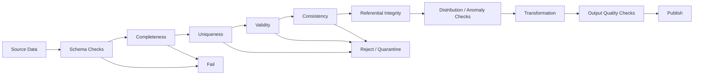
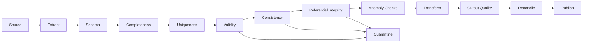

# 09- Data Quality Checks

## Overview

Data quality checks verify that a dataset is not only structurally valid, but also complete, consistent, plausible, and suitable for downstream use.

Schema validation answers:

```text
"Does this data have the expected structure?"
```

Data quality checks answer:

```text
"Is this structurally valid data actually trustworthy?"
```

A production pipeline therefore commonly follows:

```text
source
    ↓
extract
    ↓
schema validation
    ↓
dtype normalization
    ↓
data quality checks
    ↓
transformation
    ↓
output quality checks
    ↓
publish
```

Quality checks are especially important for:

```text
ETL pipelines
analytics
financial reporting
customer data
event processing
database synchronization
data migration
machine-learning feature preparation
```

A successful pipeline run does not necessarily mean a successful data run.

---

## Validation vs Data Quality

These concepts overlap but should not be treated as identical.

| Concern | Primary Question | Example |
|---|---|---|
| Schema validation | Is the structure correct? | `customer_id` column exists |
| Type validation | Are representations correct? | `amount` is numeric |
| Completeness | Is required data present? | `customer_id` is not null |
| Uniqueness | Are keys duplicated? | One `order_id` per order |
| Validity | Are values allowed? | `status ∈ allowed statuses` |
| Accuracy proxy | Does data satisfy known invariants? | Revenue reconciliation |
| Consistency | Do related fields agree? | `shipped_at >= ordered_at` |
| Timeliness | Did data arrive when expected? | Daily partition exists |
| Distribution | Did the shape of data change unexpectedly? | 90% spike in failed events |
| Referential integrity | Do relationships remain valid? | Every order references a customer |

Quality checks should cover the dimensions that matter to the business.

---

## Why Data Quality Checks Matter

Bad data can propagate silently:

```text
source anomaly
    ↓
ETL
    ↓
database
    ↓
report
    ↓
business decision
```

Examples:

```text
10% duplicate orders
→ revenue report overstated

wrong timezone
→ daily report shifted by one day

missing customer IDs
→ customer segmentation incomplete

unexpected currency
→ financial aggregation invalid

late events
→ operational dashboard undercounts activity
```

The further bad data travels, the more expensive it becomes to detect and correct.

---

## Quality Dimensions

Common dimensions include:

```text
completeness
uniqueness
validity
consistency
timeliness
integrity
distribution
accuracy proxies
```

Not every quality dimension can be objectively measured.

For example, Pandas can verify:

```text
amount >= 0
```

but cannot independently prove:

```text
amount is the true amount charged to the customer
```

Use source reconciliation, business controls, and domain systems for accuracy-sensitive requirements.

---

## Quality Check Architecture

A mature pipeline can be structured as:



Hard failures should stop unsafe processing.

Record-level anomalies can often be quarantined when business requirements allow valid records to continue.

---

## Completeness Checks

Completeness verifies that expected data exists.

Examples:

```text
required fields are not null
expected partitions exist
expected batches arrived
row counts are within range
required reference data is present
```

Basic null check:

```python
required_columns = [
    "order_id",
    "customer_id",
    "amount",
]

null_counts = (
    orders[required_columns]
    .isna()
    .sum()
)

if null_counts.any():
    raise ValueError(
        f"Required fields contain nulls: "
        f"{null_counts[null_counts > 0].to_dict()}"
    )
```

---

## Null Rate Monitoring

Instead of only checking whether nulls exist, measure their rate:

```python
null_rates = orders.isna().mean()

print(
    null_rates.sort_values(
        ascending=False,
    )
)
```

This supports rules such as:

```text
customer_id null rate = 0%
email null rate <= 5%
optional_comment null rate <= 100%
```

Thresholds should come from the actual data contract.

---

## Row Count Checks

A pipeline can compare expected and actual volume.

```python
row_count = len(orders)

if row_count == 0:
    raise ValueError(
        "Expected non-empty order dataset"
    )
```

For recurring jobs, compare against historical expectations.

Example:

```text
usual daily volume:
900,000–1,100,000 rows

today:
75,000 rows
```

This may indicate:

```text
upstream failure
partial extraction
incorrect filter
delayed source
```

---

## Relative Row-Count Checks

A simple volume anomaly check:

```python
expected_rows = 1_000_000
actual_rows = len(orders)

minimum_expected = (
    expected_rows * 0.5
)

if actual_rows < minimum_expected:
    raise ValueError(
        "Unexpectedly low row count"
    )
```

Static thresholds can be useful, but historical baselines are usually more robust for continuously changing datasets.

---

## Row Count Is Not Enough

A correct row count can still hide incorrect data.

For example:

```text
expected = 1,000,000 rows
actual   = 1,000,000 rows
```

but:

```text
customer_id is null in 800,000 rows
```

or:

```text
status = "failed" in 990,000 rows
```

Quality checks should therefore combine:

```text
volume
+
completeness
+
validity
+
distribution
```

---

## Uniqueness Checks

Business keys should be unique where the data model requires it.

```python
duplicate_count = int(
    orders["order_id"]
    .duplicated()
    .sum()
)

if duplicate_count:
    raise ValueError(
        f"Found {duplicate_count} duplicate "
        "order IDs"
    )
```

Do not assume duplicates are always errors.

They may represent:

```text
retries
updates
event versions
late arrivals
legitimate repeated events
```

Define uniqueness according to source semantics.

---

## Duplicate Rate

For large ingestion pipelines, measure the rate:

```python
duplicate_rate = (
    orders["order_id"]
    .duplicated()
    .mean()
)
```

A rising duplicate rate can indicate:

```text
producer retry behavior
consumer replay
source bug
broken watermark
incorrect join
```

Quality monitoring can therefore reveal infrastructure problems.

---

## Validity Checks

Validity ensures that values belong to expected domains.

Example:

```python
allowed_statuses = {
    "pending",
    "processing",
    "completed",
    "cancelled",
}

invalid = (
    set(
        orders["status"]
        .dropna()
        .unique()
    )
    - allowed_statuses
)

if invalid:
    raise ValueError(
        f"Unknown statuses: {sorted(invalid)}"
    )
```

Typical validity rules include:

```text
allowed categories
numeric ranges
date ranges
format requirements
positive quantities
supported currencies
valid IDs
```

---

## Numeric Quality Checks

For financial/order data:

```python
if orders["amount"].lt(0).any():
    raise ValueError(
        "Negative amounts detected"
    )

if orders["quantity"].le(0).any():
    raise ValueError(
        "Quantity must be greater than zero"
    )
```

Other useful checks:

```text
NaN
infinity
unexpected precision
unexpected magnitude
zero where prohibited
```

Example:

```python
if not orders["amount"].replace(
    [float("inf"), float("-inf")],
    pd.NA,
).notna().all():
    raise ValueError(
        "Infinite amount detected"
    )
```

---

## Financial Quality Checks

Financial pipelines require stronger controls.

Possible invariants:

```text
amount >= 0
tax >= 0
discount >= 0
total = subtotal + tax - discount
currency is supported
transaction ID is unique
```

Example:

```python
calculated_total = (
    orders["subtotal"]
    + orders["tax"]
    - orders["discount"]
)

if not calculated_total.eq(
    orders["total"]
).all():
    raise ValueError(
        "Order total reconciliation failed"
    )
```

Define acceptable rounding behavior for decimal values rather than relying on exact floating-point equality when appropriate.

---

## Datetime Quality

Validate timestamps after normalization:

```python
orders["created_at"] = pd.to_datetime(
    orders["created_at"],
    utc=True,
    errors="raise",
)
```

Then check:

```python
if orders["created_at"].isna().any():
    raise ValueError(
        "Missing created_at values"
    )
```

Possible business checks:

```text
created_at <= updated_at
shipped_at >= created_at
delivered_at >= shipped_at
event_time within expected window
```

---

## Cross-Column Consistency

Data quality is often about relationships between columns.

Example:

```python
invalid = orders.loc[
    orders["shipped_at"].notna()
    & orders["created_at"].gt(
        orders["shipped_at"]
    )
]

if not invalid.empty:
    raise ValueError(
        "Orders shipped before creation"
    )
```

Other consistency checks:

```text
cancelled order cannot have delivered_at
refunded order should have a payment
closed account should not receive new orders
```

These are more valuable than checking individual columns independently.

---

## Referential Integrity

Check relationships across DataFrames:

```python
enriched = orders.merge(
    customers[
        [
            "customer_id",
            "segment",
        ]
    ],
    on="customer_id",
    how="left",
    validate="many_to_one",
)
```

Then inspect unmatched records:

```python
missing_customer = enriched[
    enriched["segment"].isna()
]

missing_rate = (
    len(missing_customer) / len(enriched)
    if len(enriched)
    else 0.0
)
```

A sudden increase may indicate:

```text
missing dimension data
late reference updates
incorrect identifiers
schema drift
```

---

## Join Cardinality Checks

Use Pandas' `validate` parameter where possible:

```python
result = orders.merge(
    customers,
    on="customer_id",
    how="left",
    validate="many_to_one",
)
```

This turns an assumption into executable validation.

Without it, a duplicate customer record could silently convert:

```text
1 order
```

into:

```text
2 or more output rows
```

---

## Distribution Checks

A dataset can satisfy every deterministic rule while still being suspicious.

Example:

```text
previous day:
completed = 62%
pending   = 28%
failed    = 10%

today:
completed = 98%
pending   = 1%
failed    = 1%
```

Every value is valid, but the distribution changed drastically.

Distribution checks can monitor:

```text
category frequencies
numeric quantiles
null rates
mean
median
min/max
```

---

## Category Distribution

Example:

```python
status_distribution = (
    orders["status"]
    .value_counts(
        normalize=True,
    )
)

print(status_distribution)
```

You can compare against an expected baseline.

Avoid hard-coding narrow thresholds unless the business process genuinely requires them.

---

## Numeric Distribution

For a financial dataset:

```python
metrics = {
    "count": orders["amount"].count(),
    "mean": orders["amount"].mean(),
    "median": orders["amount"].median(),
    "min": orders["amount"].min(),
    "max": orders["amount"].max(),
}
```

Large shifts may indicate:

```text
currency change
decimal parsing issue
unit conversion bug
duplicate records
source corruption
```

Distribution checks are anomaly signals, not proof of correctness.

---

## Timeliness

A dataset can be valid but stale.

Examples:

```text
daily feed missing
Kafka consumer lagging
API cursor stopped advancing
database watermark has not moved
```

For incremental processing, track:

```text
latest source timestamp
latest processed timestamp
processing lag
batch arrival time
```

A quality system should distinguish:

```text
invalid data
```

from:

```text
missing or late data
```

---

## Freshness Checks

Example:

```python
latest_event = orders["created_at"].max()
now = pd.Timestamp.now(tz="UTC")

lag = now - latest_event

if lag > pd.Timedelta(hours=2):
    raise ValueError(
        "Order data is outside freshness SLA"
    )
```

The threshold should reflect the actual pipeline SLA.

---

## Partition Completeness

For partitioned Parquet or warehouse data, expected partitions can be validated.

Conceptually:

```text
expected:
2026-09-07
2026-09-08
2026-09-09

actual:
2026-09-07
2026-09-09
```

The missing partition may indicate:

```text
failed job
late source
incorrect write path
```

Partition completeness is particularly important for recurring reporting pipelines.

---

## Source-to-Target Reconciliation

Compare source and output metrics where an invariant exists.

```python
source_rows = len(source)
target_rows = len(target)

if source_rows != target_rows:
    raise ValueError(
        "Row-count reconciliation failed"
    )
```

For financial pipelines:

```python
source_total = source["amount"].sum()
target_total = target["amount"].sum()

if source_total != target_total:
    raise ValueError(
        "Amount reconciliation failed"
    )
```

Not every transformation preserves these metrics, so define reconciliation rules explicitly.

---

## Aggregation Invariants

A transformation may intentionally change row counts while preserving an aggregate.

Example:

```text
raw orders
    ↓
customer-level aggregation
```

The row count changes:

```text
1,000,000 → 250,000
```

but:

```text
sum(order amount)
```

should remain consistent if the aggregation is intended to preserve revenue.

Use the invariant appropriate to the transformation.

---

## Quality Checks on Chunks

Large datasets should be checked incrementally.

```python
total_rows = 0
invalid_rows = 0
total_amount = 0.0

for chunk in pd.read_csv(
    "orders.csv",
    chunksize=100_000,
):
    total_rows += len(chunk)

    invalid_mask = (
        chunk["amount"].isna()
        | chunk["amount"].lt(0)
    )

    invalid_rows += int(
        invalid_mask.sum()
    )

    total_amount += (
        chunk["amount"]
        .fillna(0)
        .sum()
    )
```

This avoids building a separate full-size validation DataFrame.

---

## Global vs Chunk-Level Checks

Some checks are local:

```text
amount >= 0
status is allowed
required field exists
```

Others are global:

```text
global uniqueness
total row count
total revenue
partition completeness
global distribution
```

A robust pipeline performs:

```text
chunk-level checks
+
global checks
```

rather than assuming either layer is sufficient.

---

## Quality Checks and Quarantine

When valid records can proceed while invalid records are isolated:

```text
source batch
    ↓
quality checks
    ├── valid → normal pipeline
    └── invalid → quarantine
```

Example:

```python
valid = chunk.loc[
    chunk["amount"].ge(0)
]

invalid = chunk.loc[
    chunk["amount"].lt(0)
].copy()

invalid["quality_error"] = (
    "negative_amount"
)
```

The quarantine path should retain enough metadata for investigation and reprocessing.

---

## Quarantine Design

A useful quarantine record can contain:

```text
source record
batch ID
pipeline version
quality rule
detected timestamp
source location
```

Do not store unbounded sensitive payloads without appropriate access controls and retention policies.

---

## Quality Check Severity

Not every quality issue should stop processing.

| Condition | Typical Severity |
|---|---|
| Required column missing | Error |
| Primary key duplicate | Error or quarantine |
| Required field null | Error or quarantine |
| Unknown optional category | Warning/quarantine |
| Small volume deviation | Warning |
| Large volume deviation | Error |
| Freshness SLA breach | Error |
| Minor distribution drift | Warning |
| Severe distribution anomaly | Alert/error |

Severity should be part of the operational contract.

---

## Hard Failures vs Anomalies

Hard validation:

```text
amount < 0
missing order_id
duplicate primary key
```

Anomaly detection:

```text
order volume 40% below normal
```

Do not treat every anomaly as proof of invalid data.

An unexpected volume drop may be:

```text
real business behavior
planned maintenance
holiday effect
upstream outage
```

An anomaly should generally be investigated or compared against context before being classified as data corruption.

---

## Baselines

Historical baselines are useful for recurring datasets.

Possible baseline metrics:

```text
row count
null rate
duplicate rate
category distribution
median amount
95th percentile amount
processing lag
```

For example:

```text
daily order count
7-day median
30-day median
seasonal comparison
```

Baselines should account for expected seasonality where relevant.

---

## Quality Gates

A quality gate determines whether a dataset can move to the next stage.

Example:

```python
quality_gate_passed = (
    duplicate_rate == 0
    and missing_customer_rate < 0.001
    and invalid_amount_rate == 0
)

if not quality_gate_passed:
    raise RuntimeError(
        "Data quality gate failed"
    )
```

Quality gates should be explicit rather than hidden inside unrelated transformations.

---

## Quality Score

A quality score can summarize multiple signals:

```text
completeness
+
validity
+
uniqueness
+
timeliness
```

However, a single score can hide critical failures.

For example:

```text
overall score = 98%
```

does not make:

```text
primary-key duplication
```

acceptable.

Use rule-level results alongside any aggregate score.

---

## Data Quality Report

A production run can generate a compact report:

```python
report = {
    "row_count": len(orders),
    "duplicate_count": int(
        orders["order_id"]
        .duplicated()
        .sum()
    ),
    "null_customer_rate": float(
        orders["customer_id"]
        .isna()
        .mean()
    ),
    "negative_amount_count": int(
        orders["amount"]
        .lt(0)
        .sum()
    ),
}
```

The report can be emitted to:

```text
logs
metrics
audit table
reporting system
monitoring platform
```

---

## Data Quality Monitoring

Track quality over time.

Useful metrics include:

```text
rows processed
rows rejected
duplicate rate
null rate
invalid rate
join miss rate
freshness lag
distribution anomalies
schema changes
```

This allows operators to distinguish:

```text
one bad batch
```

from:

```text
persistent source degradation
```

---

## Alerting

Alert on actionable conditions.

Good alerts include:

```text
pipeline failed
quality gate failed
freshness SLA breached
unexpected schema change
duplicate rate exceeds threshold
invalid rate spikes
expected partition missing
```

Avoid creating an alert for every harmless variation.

The goal is:

```text
signal
→ diagnosis
→ action
```

not notification volume.

---

## Data Quality and SQL

Some quality checks are better performed in the database.

Examples:

```sql
SELECT COUNT(*)
FROM orders
WHERE customer_id IS NULL;
```

or:

```sql
SELECT
    status,
    COUNT(*)
FROM orders
GROUP BY status;
```

When data already resides in PostgreSQL, database-side quality checks can avoid unnecessary extraction into Pandas.

Pandas should validate the data at the processing boundary and after transformation where appropriate.

---

## Data Quality and APIs

API ingestion should check:

```text
HTTP status
response schema
pagination completeness
record count
required fields
unexpected nulls
rate-limit behavior
```

A successful HTTP response does not prove that the payload is complete or correct.

Track:

```text
page count
record count
cursor advancement
```

for incremental API ingestion.

---

## Data Quality and Parquet

Parquet provides schema metadata, but a valid Parquet file can contain invalid business data.

Validate:

```text
schema
dtypes
partitions
row counts
duplicate keys
null rates
business rules
```

For partitioned datasets, also verify:

```text
expected partition exists
partition contains expected records
partition is not unexpectedly empty
```

---

## Data Quality and PostgreSQL

Database constraints should enforce critical integrity rules:

```sql
PRIMARY KEY
UNIQUE
NOT NULL
CHECK
FOREIGN KEY
```

For example:

```sql
CREATE TABLE orders (
    order_id TEXT PRIMARY KEY,
    customer_id TEXT NOT NULL,
    amount NUMERIC(18, 2)
        CHECK (amount >= 0)
);
```

Pandas quality checks complement database constraints but should not replace them.

---

## Quality Checks and ETL Idempotency

A retried batch must not produce inconsistent quality results.

Use deterministic:

```text
batch ID
input range
pipeline version
output partition
```

Record quality results per batch.

Then:

```text
batch 123
→ failed quality gate
→ corrected source
→ reprocessed
→ quality gate passed
```

can be audited cleanly.

---

## Quality Checks in CI/CD

Some checks can be executed before deployment.

Use fixture datasets to verify:

```text
schema rules
transformation invariants
validation behavior
known edge cases
```

Example:

```text
pull request
    ↓
unit tests
    ↓
quality-rule tests
    ↓
integration tests
    ↓
deploy
```

CI should not attempt to reproduce every production-scale data check, but it should protect validation logic from regressions.

---

## Testing Quality Rules

Test both valid and invalid inputs.

```python
import pandas as pd
import pytest


def test_negative_amount_fails() -> None:
    orders = pd.DataFrame(
        {
            "order_id": ["O-1"],
            "customer_id": ["C-1"],
            "amount": [-10.0],
        }
    )

    with pytest.raises(
        ValueError,
        match="Negative amounts",
    ):
        validate_amounts(orders)
```

Also test:

```text
boundary values
empty DataFrames
all-null columns
duplicate keys
unknown categories
missing partitions
freshness breaches
threshold boundaries
```

---

## Testing Thresholds

Suppose the rule is:

```text
invalid rate > 1% → fail
```

Test:

```text
0.99% → pass
1.00% → pass, if using `>`
1.01% → fail
```

Boundary tests prevent subtle monitoring regressions.

---

## Quality Checks for Empty Data

A pipeline should explicitly define:

```text
zero rows
```

as:

```text
valid no-op
warning
failure
```

depending on the dataset.

For example:

```text
daily customer activity
→ zero rows may be valid

daily financial settlement feed
→ zero rows may be critical
```

Business context determines the rule.

---

## Common Mistakes

### Checking Only for Nulls

Data can be non-null and still be completely wrong.

### Checking Only Row Count

The expected number of rows does not guarantee valid values or correct relationships.

### Using Arbitrary Thresholds

A threshold without domain context can create false alarms or miss real failures.

### Silently Dropping Bad Records

This hides the size and cause of the quality problem.

### Calling `drop_duplicates()` Automatically

This may remove legitimate records or hide an upstream issue.

### Treating Every Anomaly as Invalid

A distribution shift may be a real business event.

### Validating Only One Chunk

Each chunk can have different characteristics.

### Ignoring Cross-Chunk Duplicates

Local uniqueness does not imply global uniqueness.

### Computing Global Quality Metrics from Per-Chunk Averages

Some metrics, especially rates and averages, require weighted aggregation using underlying counts.

### Using Exact Float Equality Blindly

Floating-point representation can make exact equality inappropriate for some numeric comparisons.

### Logging Entire Invalid Records

Quality failures can contain PII or financial data.

### Treating Validation as Authorization

Quality checks do not control who can access or modify data.

### Relying Only on Pandas

Database constraints, API contracts, storage checks, and source-system controls remain important.

---

## Production Quality Pipeline

A mature ETL flow can look like:



This creates explicit quality gates before durable publication.

---

## Practical Quality Checker

A reusable checker might look like:

```python
from dataclasses import dataclass

import pandas as pd


@dataclass(frozen=True)
class QualityReport:
    row_count: int
    duplicate_count: int
    null_customer_rate: float
    invalid_amount_count: int
    passed: bool


def check_orders(
    orders: pd.DataFrame,
) -> QualityReport:
    duplicate_count = int(
        orders["order_id"]
        .duplicated()
        .sum()
    )

    null_customer_rate = float(
        orders["customer_id"]
        .isna()
        .mean()
    )

    invalid_amount_count = int(
        orders["amount"]
        .lt(0)
        .sum()
    )

    passed = (
        duplicate_count == 0
        and null_customer_rate < 0.01
        and invalid_amount_count == 0
    )

    return QualityReport(
        row_count=len(orders),
        duplicate_count=duplicate_count,
        null_customer_rate=null_customer_rate,
        invalid_amount_count=invalid_amount_count,
        passed=passed,
    )
```

This separates:

```text
quality measurement
```

from:

```text
pipeline orchestration
```

and makes the checks easy to test.

---

## Production Integration Pattern

A pipeline can then use:

```python
report = check_orders(
    orders,
)

logger.info(
    "order_quality_check",
    extra={
        "row_count": report.row_count,
        "duplicate_count": report.duplicate_count,
        "null_customer_rate": report.null_customer_rate,
        "invalid_amount_count": (
            report.invalid_amount_count
        ),
        "passed": report.passed,
    },
)

if not report.passed:
    raise RuntimeError(
        "Order data quality gate failed"
    )

publish_orders(orders)
```

Do not publish the dataset before the quality gate succeeds.

---

## Performance Considerations

Quality checks themselves can become expensive on large datasets.

Prefer:

```text
vectorized checks
single-pass metrics where possible
chunk-level validation
compact global state
source-side validation for large relational datasets
```

Avoid repeatedly scanning a huge DataFrame for the same condition.

For example, compute:

```python
invalid_amount = (
    orders["amount"].isna()
    | orders["amount"].lt(0)
)
```

once when multiple checks need it.

---

## Large Dataset Quality Strategy

For very large data:

```text
source checks
    ↓
chunk checks
    ↓
global metric accumulation
    ↓
global quality gate
```

Track compact state such as:

```text
row count
invalid count
duplicate count where feasible
sum
min/max
category counts
```

Use external state or database mechanisms when global uniqueness or global joins exceed memory limits.

---

## Operational Checklist

```text
[ ] Quality dimensions are defined for each dataset
[ ] Schema validation exists
[ ] Required columns are checked
[ ] Required fields have explicit nullability rules
[ ] Numeric ranges are validated
[ ] Allowed categories are validated
[ ] Datetime relationships are validated
[ ] Duplicate semantics are defined
[ ] Uniqueness is checked at the correct scope
[ ] Referential integrity is checked
[ ] Join cardinality is validated
[ ] Row-count expectations are defined
[ ] Freshness requirements are defined
[ ] Partition completeness is checked where relevant
[ ] Distribution anomalies are monitored
[ ] Quality thresholds are based on domain behavior
[ ] Hard failures are distinguished from anomalies
[ ] Invalid records can be quarantined where appropriate
[ ] Quality results are recorded by batch
[ ] Quality checks run on each chunk for large datasets
[ ] Global metrics are aggregated correctly
[ ] Output quality is checked before publication
[ ] Reconciliation checks exist for critical transformations
[ ] Quality failures are observable and actionable
[ ] Sensitive records are not written to logs unnecessarily
[ ] Quarantine storage is access-controlled
[ ] Database constraints enforce critical integrity rules
[ ] CI tests quality rules and threshold boundaries
[ ] Retry behavior preserves quality-check semantics
[ ] Backfills rerun quality checks
```

## Interview Perspective

### What Is the Difference Between Data Validation and Data Quality?

Validation typically checks explicit structural and rule-based contracts. Data quality is broader and includes completeness, uniqueness, consistency, timeliness, distribution, and other indicators of whether data is trustworthy.

### Why Is Row Count Alone a Poor Quality Check?

A dataset can have the expected number of rows while containing nulls, duplicates, invalid values, wrong relationships, or corrupted distributions.

### What Quality Checks Should Be Hard Failures?

Rules that make the downstream dataset unsafe, such as missing required schema, invalid primary keys, critical referential failures, or severe freshness violations.

### Should Every Invalid Record Fail the Pipeline?

Not necessarily. Record-level errors can be quarantined when valid records can continue safely. Dataset-level failures generally require stopping the pipeline.

### Why Are Distribution Checks Useful?

They detect anomalies that deterministic rules cannot see. A dataset can contain only valid individual values while its overall distribution indicates an upstream failure.

### How Do You Validate a Large Dataset Without Loading More Data?

Run vectorized checks per chunk and maintain compact global metrics. Avoid building a second full-size DataFrame only for quality analysis.

### How Do You Detect Duplicates Across Chunks?

Maintain global state when feasible, or use database uniqueness, external state, partitioning, sorting, or another scalable mechanism when the keyspace is too large for process memory.

### Why Can Chunk-Level Averages Be Misleading?

Metrics such as averages and rates must be aggregated using the underlying counts. The arithmetic mean of chunk means is not generally the global mean.

### How Do You Check Referential Integrity in Pandas?

Merge the datasets using the expected relationship and validate cardinality with `validate=`, then measure unmatched records.

### How Do You Handle a Freshness Failure?

Determine whether it is an expected delay, upstream outage, or genuine data problem. Apply an explicit freshness SLA and alert or fail according to operational policy.

### Why Use Quality Gates Before Publishing?

They create a clear control boundary so invalid or suspicious data does not become durable downstream state.

### How Do Database Constraints Complement Pandas Quality Checks?

Pandas checks the current processing batch, while database constraints enforce shared integrity across all writers and transactions.

### How Should Quality Checks Be Tested?

Test valid data, invalid data, boundary thresholds, empty inputs, duplicates, nulls, unexpected categories, cross-column inconsistencies, and failure behavior.

### What Should Be Logged From a Quality Check?

Prefer metadata such as batch ID, rule name, row counts, failure counts, rates, duration, and dataset version rather than full records.

## Key Takeaways

- Data quality is broader than schema validation: production pipelines should measure completeness, uniqueness, validity, consistency, referential integrity, timeliness, reconciliation, and relevant distribution anomalies.
- Quality checks should be explicit gates between pipeline stages, with a deliberate distinction between hard failures, warnings, and records that can be quarantined safely.
- Large datasets require chunk-level checks plus correctly aggregated global metrics; avoid materializing additional full-size DataFrames just to calculate quality statistics.
- Quality monitoring should produce actionable, versioned, batch-level signals and work alongside database constraints, source contracts, storage controls, and automated tests.
- A successful ETL job is not necessarily a successful data job: publish only after the dataset satisfies the business and operational quality contract.