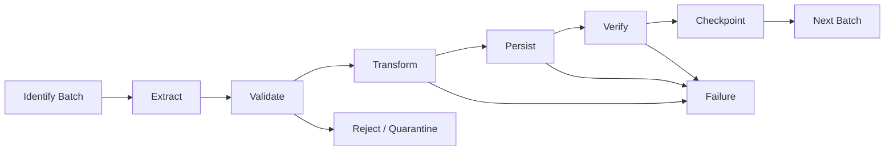
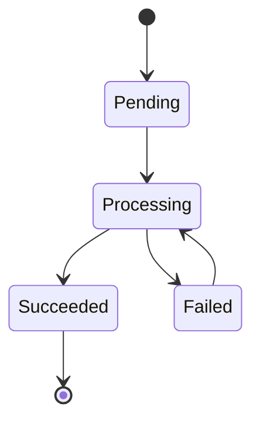
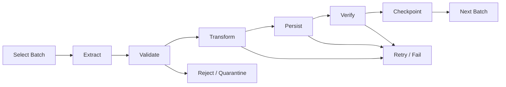
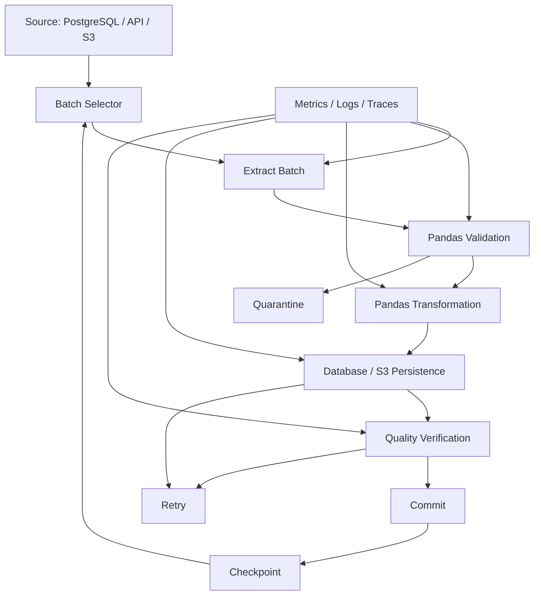

# 10- Batch Processing

## Overview

Batch processing handles data in discrete units rather than treating an entire dataset as one operation.

For Pandas, batching is primarily a strategy for controlling:

```text
memory
processing time
transaction size
failure scope
retry scope
source-system load
```

A typical production workflow is:

```text
source
    ↓
extract batch
    ↓
validate
    ↓
transform
    ↓
persist
    ↓
record checkpoint
    ↓
next batch
```

Batch processing is useful when the complete dataset does not fit comfortably in memory, when source systems must be queried incrementally, or when a pipeline must support retries and partial progress.

Pandas itself is an in-memory library. Batch processing does not make Pandas distributed; it changes how much data is materialized and processed at one time.

---

## Batch Processing vs Chunk Processing

The terms are related but have slightly different emphasis.

| Concept | Meaning | Typical Example |
|---|---|---|
| Batch processing | Process data in discrete units with explicit boundaries | Daily order batches |
| Chunk processing | Split one large input into smaller in-memory chunks | `pd.read_csv(..., chunksize=100_000)` |
| Incremental processing | Process only newly available data | Rows after a database watermark |
| Micro-batching | Process small frequent batches | Kafka events every few seconds |
| Full refresh | Reprocess the complete dataset | Rebuild reporting table |

A single pipeline can use several of these techniques together.

For example:

```text
daily incremental extraction
        ↓
500k-row Pandas chunks
        ↓
database staging batch
        ↓
transactional merge
```

---

## Why Batch Processing Exists

Loading all source data at once creates several operational risks:

```text
large memory footprint
long-running transactions
large blast radius for failure
slow retries
database pressure
difficult observability
```

Suppose a database contains:

```text
50 million orders
```

A full extraction into one DataFrame may be possible in theory but operationally undesirable.

A batch strategy can instead process:

```text
100,000 rows
×
500 batches
```

Each batch has bounded memory and a smaller retry scope.

---

## Batch Lifecycle

A reliable batch usually follows:



The critical ordering is:

```text
persist successfully
        ↓
checkpoint
```

not:

```text
checkpoint
        ↓
persist
```

Otherwise a crash can cause data to be skipped permanently.

---

## Choosing a Batch Boundary

A batch should have a deterministic definition.

Common boundaries include:

```text
row count
time window
database key range
API page range
file
Parquet partition
Kafka offset range
```

Example:

```text
2026-09-09 00:00:00
→
2026-09-10 00:00:00
```

or:

```text
order_id > 1000000
AND order_id <= 1100000
```

Time and key-based boundaries are generally more reliable for resumable pipelines than offsets based purely on row position.

---

## Fixed-Size Batches

The simplest strategy is a fixed number of rows.

```python
batch_size = 100_000

for start in range(
    0,
    len(orders),
    batch_size,
):
    batch = orders.iloc[
        start:start + batch_size
    ]

    process_batch(batch)
```

This is easy to reason about when the complete DataFrame is already available.

It does not solve the memory problem of initially loading the full dataset, so it is not equivalent to streaming or chunked ingestion.

---

## Reading CSV in Batches

Pandas can stream a CSV through an iterator:

```python
import pandas as pd

for batch in pd.read_csv(
    "orders.csv",
    chunksize=100_000,
    usecols=[
        "order_id",
        "customer_id",
        "amount",
        "created_at",
    ],
):
    process_batch(batch)
```

Each iteration returns a DataFrame containing up to the configured number of rows.

Important behavior:

```text
chunksize = rows per chunk
```

It is not a memory limit in bytes.

A chunk with wide string columns can consume significantly more memory than a chunk with compact numeric columns.

---

## Batch Size Selection

There is no universally correct batch size.

| Batch Size | Advantages | Risks |
|---|---|---|
| Small | Lower memory, smaller failures | More overhead |
| Medium | Balanced | Requires benchmarking |
| Large | Better throughput | Higher memory and failure cost |
| Very large | Fewer operations | Memory pressure and long retries |

Start with a conservative value and benchmark using production-like data.

For example:

```text
50k
100k
250k
500k
1M
```

Measure:

```text
throughput
peak RSS
batch duration
database latency
API latency
error rate
```

---

## Source-Side Batching

The most effective optimization is often to avoid fetching unnecessary data.

For SQL:

```sql
SELECT
    order_id,
    customer_id,
    amount,
    created_at
FROM orders
WHERE created_at >= :start_time
  AND created_at < :end_time;
```

The database performs filtering before Pandas receives the rows.

This is preferable to:

```python
orders = pd.read_sql(
    "SELECT * FROM orders",
    engine,
)

orders = orders[
    orders["created_at"] >= start_time
]
```

Source-side filtering reduces:

```text
network traffic
database-to-client transfer
Pandas memory usage
processing time
```

---

## Incremental Batch Extraction

A production pipeline should usually process only new or changed data.

A common pattern is a watermark:

```text
last_successful_watermark
        ↓
extract records after watermark
        ↓
process
        ↓
persist
        ↓
advance watermark
```

Example:

```sql
SELECT
    order_id,
    customer_id,
    amount,
    updated_at
FROM orders
WHERE updated_at > :watermark
  AND updated_at <= :upper_bound
ORDER BY updated_at, order_id;
```

Using a bounded upper limit is important because the source can continue changing while the pipeline runs.

---

## Watermark Design

A watermark may be based on:

```text
updated_at
created_at
sequence ID
database LSN
Kafka offset
event ID
```

A timestamp alone can be unsafe when multiple records share the same timestamp.

A composite cursor can be more robust:

```text
(updated_at, order_id)
```

Conceptually:

```sql
WHERE
    updated_at > :last_timestamp
    OR (
        updated_at = :last_timestamp
        AND order_id > :last_order_id
    )
```

This is a keyset-pagination pattern.

---

## Keyset Pagination

Keyset pagination is generally preferable to large SQL `OFFSET` values.

Avoid:

```sql
SELECT *
FROM orders
ORDER BY order_id
OFFSET 5000000
LIMIT 100000;
```

Prefer:

```sql
SELECT
    order_id,
    customer_id,
    amount
FROM orders
WHERE order_id > :last_order_id
ORDER BY order_id
LIMIT :batch_size;
```

Keyset pagination avoids repeatedly scanning or skipping large prefixes of the dataset and gives the pipeline an explicit resume point.

---

## REST API Batching

API ingestion often has a similar lifecycle:

```text
request page
    ↓
validate response
    ↓
transform records
    ↓
persist
    ↓
save cursor
    ↓
request next page
```

Example:

```python
cursor = None

while True:
    response = fetch_orders(
        cursor=cursor,
        limit=500,
    )

    records = response["items"]

    if not records:
        break

    batch = pd.DataFrame.from_records(
        records
    )

    validate_batch(batch)
    process_batch(batch)

    next_cursor = response.get(
        "next_cursor"
    )

    if not next_cursor:
        break

    cursor = next_cursor
```

Persist the cursor only after successful processing of the corresponding page.

---

## Batch Validation

Validate each batch before writing it downstream.

Typical checks:

```text
schema
required columns
dtype assumptions
null constraints
unique keys
allowed values
numeric ranges
cross-column rules
```

Example:

```python
def validate_batch(
    batch: pd.DataFrame,
) -> None:
    required = {
        "order_id",
        "customer_id",
        "amount",
    }

    missing = required.difference(
        batch.columns
    )

    if missing:
        raise ValueError(
            f"Missing columns: {sorted(missing)}"
        )

    if batch["order_id"].isna().any():
        raise ValueError(
            "order_id cannot be null"
        )

    if batch["amount"].lt(0).any():
        raise ValueError(
            "amount cannot be negative"
        )
```

Do not wait until the entire pipeline finishes to discover that one batch was malformed.

---

## Transformation Per Batch

Use vectorized transformations.

```python
def transform_batch(
    batch: pd.DataFrame,
) -> pd.DataFrame:
    result = batch.copy()

    result["created_at"] = pd.to_datetime(
        result["created_at"],
        utc=True,
        errors="raise",
    )

    result["amount"] = pd.to_numeric(
        result["amount"],
        errors="raise",
    )

    result["order_month"] = (
        result["created_at"]
        .dt.to_period("M")
        .astype("string")
    )

    return result
```

The returned DataFrame is a new object.

The original batch is not modified by these operations unless the function explicitly mutates it.

---

## Empty Batches

A batch may contain zero records.

This can occur because:

```text
source window is empty
API page is empty
partition contains no valid records
filter removed everything
```

Define the intended behavior explicitly.

```python
if batch.empty:
    logger.info(
        "batch_empty",
        extra={
            "batch_id": batch_id,
        },
    )
    return
```

An empty batch should not automatically be treated as an error.

---

## Invalid Records

There are two common policies.

### Fail the Entire Batch

Use when any invalid row makes the batch unsafe.

```text
invalid record
→ batch fails
→ no checkpoint
→ retry or investigate
```

### Quarantine Invalid Records

Use when valid records can safely continue.

```text
batch
├── valid → destination
└── invalid → quarantine
```

Record:

```text
batch ID
rule
source location
detected timestamp
pipeline version
```

Avoid logging complete records when they may contain sensitive information.

---

## Batch Persistence

Pandas can write batches directly:

```python
batch.to_sql(
    "orders_staging",
    engine,
    if_exists="append",
    index=False,
    chunksize=10_000,
    method="multi",
)
```

The two batch sizes have different meanings:

```text
processing batch
→ how much the application holds/processes

to_sql chunksize
→ how many rows are grouped into individual insert operations
```

These should be tuned independently.

---

## Database Transactions

Persistence should generally be atomic for each logical batch.

Conceptually:

```text
extract
  ↓
validate
  ↓
transform
  ↓
BEGIN
  ↓
write
  ↓
verify
  ↓
COMMIT
  ↓
checkpoint
```

On failure:

```text
ROLLBACK
```

Do not advance the pipeline checkpoint outside the successful transaction boundary unless the checkpoint mechanism is designed for that consistency model.

---

## Staging Tables

For complex transformations, write batches to a staging table.

```text
Pandas batch
    ↓
staging table
    ↓
database validation
    ↓
deduplication
    ↓
UPSERT / MERGE
    ↓
target table
```

This is particularly useful when:

```text
target constraints are strict
upserts are required
multiple target tables are affected
database-side validation is important
```

---

## Idempotency

Batch jobs are frequently retried.

A retry must not create duplicate effects.

Possible mechanisms:

```text
unique business key
batch ID
source event ID
upsert
deterministic output partition
staging + merge
```

For example:

```sql
INSERT INTO orders (
    order_id,
    customer_id,
    amount
)
VALUES (
    :order_id,
    :customer_id,
    :amount
)
ON CONFLICT (order_id)
DO UPDATE SET
    customer_id = EXCLUDED.customer_id,
    amount = EXCLUDED.amount;
```

The correct strategy depends on whether the source represents:

```text
immutable events
mutable records
snapshots
```

---

## Checkpointing

A checkpoint represents successful progress.

Example:

```text
last_processed_order_id = 5823491
```

or:

```text
last_processed_at = 2026-09-10T18:30:00Z
```

A safe sequence is:

```text
1. Extract batch
2. Validate batch
3. Transform batch
4. Persist batch
5. Verify persistence
6. Commit
7. Advance checkpoint
```

The checkpoint should reflect durable success.

---

## Exactly-Once vs At-Least-Once

Most practical batch systems are easier to design as:

```text
at-least-once processing
+
idempotent writes
```

Instead of attempting to guarantee mathematically strict exactly-once execution across multiple independent systems.

Example:

```text
batch processed
→ application crashes before checkpoint
→ batch is processed again
→ idempotent destination prevents duplication
```

This design is often much simpler and more resilient.

---

## Batch State Machine

A persistent job table can model state explicitly.



Typical metadata:

```text
batch_id
status
started_at
completed_at
attempt_count
source_cursor
row_count
error_code
pipeline_version
```

This improves debugging and recovery.

---

## Retry Strategy

Retries should distinguish transient and permanent failures.

| Failure | Typical Handling |
|---|---|
| Database timeout | Retry |
| API 429 | Retry with backoff |
| Network failure | Retry |
| Temporary S3 error | Retry |
| Invalid schema | Fail |
| Invalid business data | Quarantine or fail |
| SQL constraint violation | Usually investigate |
| Authentication failure | Fail and alert |

Use bounded exponential backoff with jitter for transient remote-service failures.

Do not retry deterministic validation failures indefinitely.

---

## Batch Failure Isolation

A million-row job has a large failure blast radius.

Processing 100,000-row units limits the affected work.

For example:

```text
Batch 1 → success
Batch 2 → success
Batch 3 → failure
Batch 4 → not started
```

Only Batch 3 needs investigation or retry.

This reduces recovery time.

---

## Ordering Requirements

Some workloads require strict order.

Examples:

```text
account balance events
inventory state transitions
CDC events
```

Others can process batches independently.

Before parallelizing, determine whether:

```text
records are independent
batches are independent
destination operations are commutative
```

Do not assume batch parallelism is safe.

---

## Parallel Batch Processing

Independent batches may run concurrently.

For CPU-heavy Pandas work, processes can provide real parallelism outside the limitations of the CPython GIL for Python-level execution.

However, parallelism also increases:

```text
memory usage
database connections
I/O contention
downstream request rate
operational complexity
```

Example:

```text
4 workers
×
500 MB peak batch memory
≈
2 GB application memory
```

Real peak usage is usually higher because of intermediate objects and Python/runtime overhead.

Capacity should be tested rather than estimated only from batch size.

---

## Celery Batch Processing

A common backend architecture is:

```text
FastAPI / Django
        ↓
job request
        ↓
Celery
        ↓
worker
        ↓
Pandas batch
        ↓
PostgreSQL / S3
```

Celery is useful for:

```text
background execution
retries
scheduled jobs
distributed workers
```

Keep task boundaries explicit and make each task safe to retry.

Avoid passing giant DataFrames through a task queue.

Pass references such as:

```text
S3 object
database query parameters
partition key
batch ID
watermark
```

---

## Kubernetes Batch Jobs

Kubernetes Jobs are suitable for finite workloads.

A typical pattern:

```text
CronJob
   ↓
Job
   ↓
container
   ↓
Pandas batch process
   ↓
S3 / PostgreSQL
```

Configure:

```text
CPU
memory
active deadline
retry behavior
concurrency policy
```

For memory-heavy Pandas jobs, memory requests and limits should be tested against realistic peak DataFrame size.

A container restart should not corrupt progress if the job is checkpointed and writes are idempotent.

---

## AWS Batch Architecture

For larger workloads:

```text
S3
 ↓
AWS Batch / ECS
 ↓
Pandas worker
 ↓
S3 / PostgreSQL
```

Use object storage as the durable boundary rather than attempting to keep intermediate state inside the container filesystem.

For repeated analytics workloads over large Parquet datasets, consider whether Pandas remains the appropriate processing engine.

---

## Batch Processing with Parquet

Parquet works well for batch pipelines because columns can be projected selectively.

```python
orders = pd.read_parquet(
    "orders/",
    columns=[
        "order_id",
        "customer_id",
        "amount",
        "created_at",
    ],
)
```

Partitioning can further reduce the amount of data read:

```text
s3://analytics/orders/
    year=2026/
        month=09/
            day=10/
```

A batch should preferably read only the relevant partition or file set.

---

## Small-File Problem

Over-partitioning can be harmful.

For example:

```text
1 million tiny Parquet files
```

can create large metadata and filesystem/object-store overhead.

Prefer a manageable number of reasonably sized files.

The correct file size depends on:

```text
query engine
object storage
workload
compression
row width
concurrency
```

---

## Batch Aggregation

Some aggregates can be combined safely across batches.

For example:

```python
total_amount = 0.0
row_count = 0

for batch in reader:
    total_amount += batch["amount"].sum()
    row_count += len(batch)
```

These are decomposable metrics.

For an average:

```text
sum + count
```

must be retained rather than averaging batch means.

```python
total_amount = 0.0
total_count = 0

for batch in reader:
    total_amount += batch["amount"].sum()
    total_count += batch["amount"].count()

global_mean = (
    total_amount / total_count
    if total_count
    else None
)
```

---

## Aggregates That Do Not Combine Trivially

Some calculations require global state.

Examples:

```text
exact median
global sort
exact ranking
cross-batch deduplication
large cross-batch joins
```

Do not assume that running the operation independently per batch produces the same result as running it globally.

For these workloads, consider:

```text
external state
database aggregation
DuckDB
Polars
Dask
Spark
```

depending on scale and requirements.

---

## Cross-Batch Deduplication

This is a common production issue.

Suppose:

```text
Batch 1:
order_id = O-100

Batch 2:
order_id = O-100
```

Checking:

```python
batch["order_id"].duplicated()
```

only catches duplicates inside each batch.

Global strategies include:

```text
database UNIQUE constraint
external key store
partition-aware processing
sorted merge
persistent deduplication table
```

For critical identifiers, database uniqueness is often the strongest final protection.

---

## Memory Management

Batching reduces memory, but intermediate operations can still create large temporary allocations.

Potential memory multipliers include:

```text
merge
sort
groupby
astype
string operations
copies
```

Monitor process RSS rather than assuming:

```text
batch_size × row_size
```

is the exact memory requirement.

Example:

```python
import os

import psutil


process = psutil.Process(os.getpid())

for batch in reader:
    rss_mb = (
        process.memory_info().rss
        / 1024**2
    )

    logger.info(
        "batch_memory",
        extra={"rss_mb": round(rss_mb, 2)},
    )

    process_batch(batch)
```

---

## Avoid Accumulating Batches

This defeats the purpose of batching:

```python
batches = []

for batch in reader:
    batches.append(
        transform_batch(batch)
    )

result = pd.concat(batches)
```

The process eventually reconstructs a large in-memory dataset.

Prefer:

```text
read
→ process
→ persist
→ release
```

unless the complete result is intentionally required and fits safely in memory.

---

## Resource Cleanup

Batch pipelines interact with remote and local resources.

Use context managers where available:

```python
with pd.read_csv(
    "orders.csv",
    chunksize=100_000,
) as reader:
    for batch in reader:
        process_batch(batch)
```

For database access, rely on SQLAlchemy-managed connections and transactions:

```python
with engine.begin() as connection:
    write_batch(
        batch,
        connection,
    )
```

Ensure files, database connections, sockets, and temporary resources are released even when a batch fails.

---

## Batch Observability

Record metrics per batch.

Recommended fields:

```text
batch_id
source range
row count
valid row count
invalid row count
processing duration
write duration
peak memory
retry count
checkpoint
pipeline version
```

Useful derived metrics:

```text
rows/second
bytes/second
failure rate
retry rate
average batch duration
p95 batch duration
```

---

## Structured Logging

Prefer machine-readable logs:

```python
logger.info(
    "batch_completed",
    extra={
        "batch_id": batch_id,
        "row_count": len(batch),
        "duration_seconds": duration,
        "checkpoint": checkpoint,
    },
)
```

A structured log makes it easier to search for:

```text
all failed batches
slow batches
specific pipeline versions
specific source partitions
```

---

## Monitoring

A production batch system should expose:

```text
success/failure
throughput
lag
batch duration
memory
retry count
quality failures
checkpoint progress
```

Operational dashboards should answer:

```text
Is the pipeline running?
Is it keeping up?
Is it processing the expected volume?
Is data quality degrading?
Where is it currently stuck?
Can it safely resume?
```

---

## Backpressure

A batch pipeline can overload its dependencies even when the application itself is healthy.

Examples:

```text
too many database queries
too many API requests
too many concurrent writes
```

Control pressure using:

```text
bounded worker concurrency
rate limits
connection pools
batch-size limits
retry backoff
queue limits
```

For Kafka consumers, consumer lag can be treated as an operational signal for whether processing capacity is sufficient.

---

## Database Connection Management

Parallel batches should not each create unlimited database connections.

A deployment might have:

```text
8 workers
×
2 connections each
=
16 application connections
```

But the database may also serve:

```text
web traffic
admin queries
analytics
other workers
```

Connection pool sizing must account for the total deployment, not just one process.

---

## Security Considerations

Batch jobs often process high-volume sensitive data.

Protect:

```text
database credentials
API tokens
S3 access
PII
financial records
customer identifiers
quarantine data
temporary files
```

Recommended practices:

```text
use IAM roles where possible
store secrets in a secret manager
encrypt data in transit and at rest
restrict bucket/database permissions
avoid sensitive payloads in logs
apply retention policies
```

A batch processor should receive only the permissions it needs.

---

## Cost Considerations

Batch size affects cost indirectly.

Larger batches may reduce:

```text
API call count
transaction overhead
task scheduling overhead
object-store requests
```

But they can increase:

```text
memory requirements
retries
failure blast radius
container size
database lock duration
```

The goal is not maximum batch size.

The goal is efficient throughput with predictable failure recovery.

---

## Disaster Recovery

A robust pipeline should be restartable from durable state.

Useful recovery artifacts include:

```text
raw source files
source cursors
batch metadata
checkpoints
staging data
pipeline version
quality reports
```

A backfill should be able to specify an explicit range:

```text
2026-09-01
→
2026-09-10
```

rather than depending on whatever the current watermark happens to be.

---

## Backfills

Backfills should use the same transformation and validation logic as normal processing where practical.

Example:

```text
normal:
watermark → now

backfill:
2026-01-01 → 2026-03-01
```

Avoid copying transformation code into a separate backfill implementation.

Parameterize the extraction range instead.

---

## Batch Versioning

Persist the pipeline version used to process a batch.

For example:

```text
batch_id: 20260910-00042
pipeline_version: 3.7.1
source_range: 2026-09-10T00:00Z/01:00Z
```

This helps explain why two batches containing similar source data may produce different outputs after a deployment.

---

## Data Lineage

For production ETL, lineage metadata can connect:

```text
source
→ batch
→ transformation version
→ destination
```

Useful identifiers include:

```text
source file
source partition
query window
batch ID
pipeline version
destination partition
```

This materially improves debugging and auditability.

---

## Batch Processing and REST Services

A common pattern is to keep request/response paths short and move heavy processing into asynchronous workers.

```text
Client
  ↓
Nginx
  ↓
FastAPI / Django
  ↓
create job
  ↓
Celery / queue
  ↓
Pandas batch worker
  ↓
PostgreSQL / S3
```

Do not execute a multi-million-row Pandas job directly inside a synchronous HTTP request unless the workload is intentionally small and latency requirements permit it.

---

## When Pandas Batch Processing Stops Scaling

Pandas remains a good choice when:

```text
dataset is moderate
work fits on one worker
vectorized operations are effective
in-memory processing per batch is manageable
```

Consider another engine when requirements involve:

```text
very large joins
large global sorts
distributed processing
highly parallel workloads
multi-node fault tolerance
continuous event processing
```

Possible alternatives:

| Tool | Useful For |
|---|---|
| Pandas | Single-node tabular processing |
| DuckDB | Local analytical SQL over files |
| Polars | Fast single-node DataFrame processing |
| Dask | Distributed Python/DataFrame workloads |
| Spark | Large distributed data processing |
| Kafka Streams / Flink | Stateful streaming workloads |

The appropriate choice depends on the workload, not simply dataset size.

---

## End-to-End Example

The following pattern combines incremental extraction, Pandas processing, quality validation, persistence, and checkpointing.

```python
from datetime import datetime, timezone

import pandas as pd
from sqlalchemy import text
from sqlalchemy.engine import Engine


BATCH_SIZE = 100_000


def fetch_batch(
    engine: Engine,
    start_time: datetime,
    end_time: datetime,
    last_order_id: int | None,
) -> pd.DataFrame:
    query = text(
        """
        SELECT
            order_id,
            customer_id,
            amount,
            created_at,
            updated_at
        FROM orders
        WHERE updated_at > :start_time
          AND updated_at <= :end_time
          AND (
              :last_order_id IS NULL
              OR order_id > :last_order_id
          )
        ORDER BY order_id
        LIMIT :batch_size
        """
    )

    return pd.read_sql_query(
        query,
        engine,
        params={
            "start_time": start_time,
            "end_time": end_time,
            "last_order_id": last_order_id,
            "batch_size": BATCH_SIZE,
        },
    )


def validate_batch(
    batch: pd.DataFrame,
) -> None:
    if batch.empty:
        return

    required = {
        "order_id",
        "customer_id",
        "amount",
        "created_at",
        "updated_at",
    }

    missing = required.difference(
        batch.columns
    )

    if missing:
        raise ValueError(
            f"Missing columns: {sorted(missing)}"
        )

    if batch["order_id"].duplicated().any():
        raise ValueError(
            "Duplicate order IDs in batch"
        )

    if batch["amount"].isna().any():
        raise ValueError(
            "Null order amounts detected"
        )

    if batch["amount"].lt(0).any():
        raise ValueError(
            "Negative order amounts detected"
        )


def transform_batch(
    batch: pd.DataFrame,
) -> pd.DataFrame:
    result = batch.copy()

    result["created_at"] = pd.to_datetime(
        result["created_at"],
        utc=True,
        errors="raise",
    )

    result["updated_at"] = pd.to_datetime(
        result["updated_at"],
        utc=True,
        errors="raise",
    )

    return result


def process_window(
    engine: Engine,
    start_time: datetime,
    end_time: datetime,
) -> None:
    last_order_id = None

    while True:
        batch = fetch_batch(
            engine=engine,
            start_time=start_time,
            end_time=end_time,
            last_order_id=last_order_id,
        )

        if batch.empty:
            break

        validate_batch(batch)

        transformed = transform_batch(
            batch
        )

        with engine.begin() as connection:
            transformed.to_sql(
                "orders_staging",
                connection,
                if_exists="append",
                index=False,
                chunksize=10_000,
                method="multi",
            )

        last_order_id = int(
            batch["order_id"].max()
        )

        record_checkpoint(
            start_time=start_time,
            end_time=end_time,
            last_order_id=last_order_id,
        )


start = datetime(
    2026,
    9,
    10,
    tzinfo=timezone.utc,
)

end = datetime(
    2026,
    9,
    11,
    tzinfo=timezone.utc,
)

process_window(
    engine,
    start,
    end,
)
```

The important design properties are:

```text
bounded batch size
deterministic source range
keyset pagination
validation before persistence
explicit transformation
transactional writes
checkpoint after success
restartable progress
```

---

## Common Mistakes

### Loading Everything Before Batching

This does not solve memory constraints:

```python
df = pd.read_csv("huge.csv")
for batch in split(df):
    ...
```

Read the source incrementally instead.

### Using `OFFSET` for Very Large Tables

Large offsets can become progressively expensive and can be fragile under concurrent changes.

Use keyset pagination or bounded time windows.

### Advancing the Checkpoint Too Early

If the checkpoint advances before persistence commits, a crash can permanently skip data.

### Assuming Batches Are Independent

Joins, deduplication, ordering, and global statistics may require cross-batch state.

### Using the Same Batch Size Everywhere

Processing batch size and database insert chunk size solve different problems.

### Accumulating Processed Batches

Appending every result to a list eventually recreates the memory problem batching was intended to solve.

### Ignoring Empty Batches

A valid empty window should have deliberate semantics.

### Retrying Permanent Failures

Validation errors generally should not be retried indefinitely.

### Unbounded Parallelism

More workers can make the pipeline slower by exhausting:

```text
CPU
RAM
database connections
API quotas
I/O bandwidth
```

### Passing Large DataFrames Through Celery

Queues should transport compact task metadata or references rather than huge serialized DataFrames.

### Relying on Process Memory for Checkpoints

A process restart destroys in-memory state. Checkpoints should live in durable storage.

### Ignoring Source Mutation

Rows may change while a long-running batch job executes. Use bounded extraction windows, stable cursors, or transactionally consistent extraction where required.

---

## Production Checklist

```text
[ ] Batch boundaries are deterministic
[ ] Batch size is benchmarked
[ ] Source-side filtering is used
[ ] Incremental extraction uses a durable cursor/watermark
[ ] Keyset pagination is used for large ordered datasets where appropriate
[ ] Each batch is validated
[ ] Empty-batch behavior is defined
[ ] Invalid records are quarantined or fail explicitly
[ ] Processing is idempotent
[ ] Persistence is transactional where required
[ ] Checkpoints advance only after successful persistence
[ ] Cross-batch operations have an explicit strategy
[ ] Memory usage is monitored
[ ] Batches are not unnecessarily accumulated
[ ] Worker concurrency is bounded
[ ] Database connection usage is bounded
[ ] Retryable and permanent failures are distinguished
[ ] Exponential backoff is used for transient dependencies
[ ] Batch state is durable
[ ] Batch metrics and structured logs exist
[ ] Freshness and lag are monitored
[ ] Backfills can specify explicit ranges
[ ] Pipeline versions are recorded
[ ] Sensitive payloads are protected
[ ] Temporary and quarantine data have retention controls
[ ] Recovery can resume from durable checkpoints
[ ] Critical destination constraints enforce integrity
```

## Interview Perspective

### What Problem Does Batch Processing Solve in Pandas?

It bounds the amount of data held and processed at once, reducing memory pressure and improving failure isolation while allowing large workflows to be processed incrementally.

### Does `chunksize` Make Pandas a Distributed Framework?

No. It provides incremental iteration over subsets of the input. Processing still occurs on the local Python process unless another system distributes the work.

### Why Is Keyset Pagination Often Better Than `OFFSET`?

Keyset pagination resumes from a known key and avoids increasingly expensive offset skipping for large tables. It also provides a clearer checkpoint boundary.

### What Is the Difference Between a Watermark and a Batch Size?

A batch size determines how much data is processed at once. A watermark identifies how far the pipeline has successfully progressed through the source.

### When Should a Checkpoint Be Written?

After the corresponding batch has been successfully persisted and committed.

### Why Prefer At-Least-Once Plus Idempotent Writes?

Distributed systems can crash between side effects and acknowledgements. Idempotency makes safe retries practical without requiring every component to participate in a global exactly-once transaction.

### Which Operations Are Difficult to Perform Independently Per Batch?

Global sorting, exact median, global ranking, cross-batch deduplication, and joins where both sides exceed available memory are common examples.

### How Do You Prevent Duplicate Processing After a Crash?

Use durable checkpoints and idempotent destination operations such as unique constraints, upserts, or deterministic output partitions.

### How Would You Process a 100 Million Row PostgreSQL Table?

Push projection and filtering into PostgreSQL, extract incrementally using a keyset or bounded window, process manageable Pandas batches, persist transactionally, and checkpoint successful progress.

### How Would You Process an API That Returns Pages?

Treat each page as a batch, validate and persist it, then advance the API cursor only after successful processing. Handle rate limits and retries with bounded backoff.

### What Determines Batch Size?

Memory capacity, row width, transformation complexity, source latency, destination behavior, retry cost, and desired throughput. Benchmark rather than selecting a value arbitrarily.

### How Do You Parallelize Batches Safely?

Only when batch operations are independent or have explicit coordination. Bound concurrency to protect CPU, memory, databases, APIs, and other dependencies.

### When Should You Stop Using Pandas?

When the workload requires distributed execution, large global operations, continuous streaming, or memory/compute characteristics that cannot be handled efficiently on one worker. At that point, consider DuckDB, Polars, Dask, Spark, or a streaming engine based on the workload.

## Key Takeaways

- Batch processing bounds memory and failure scope, but Pandas remains a single-node in-memory processing library; use source-side filtering and incremental extraction to control the total data materialized.
- Durable watermarks or cursors plus checkpoint-after-success provide restartable processing, while idempotent writes make retries safe.
- Batch-level validation, transactional persistence, bounded concurrency, and explicit handling of cross-batch operations are essential for reliable production pipelines.
- Batch size should be benchmarked against memory, throughput, dependency load, and retry cost rather than chosen from a fixed rule.
- When global operations, distributed scale, or continuous processing exceed Pandas' strengths, move the workload to an engine designed for those requirements.
```
```

```
Markdown


```
# 10- Batch Processing

## Overview

Batch processing divides a large data workload into bounded units that can be extracted, validated, transformed, and persisted independently.

In Pandas-based systems, batch processing is primarily a way to control:

- Memory usage
- Processing latency
- Failure scope
- Retry scope
- Database and API load
- Operational observability

A typical production workflow is:

```text
Source
  ↓
Batch selection
  ↓
Extraction
  ↓
Validation
  ↓
Transformation
  ↓
Persistence
  ↓
Verification
  ↓
Checkpoint
  ↓
Next batch
```

Batch processing is especially useful when:

- The complete dataset is too large for comfortable in-memory processing.
- Data arrives incrementally.
- The source exposes pagination or time windows.
- Processing must be restartable.
- Downstream systems require bounded transactions.
- Individual failures should not force a complete reprocessing.

Pandas remains an in-memory processing library even when used in batches. The batch boundary limits how much data is materialized at once; it does not turn Pandas into a distributed engine.

---

## Batch Processing Concepts

Several concepts are related but should not be treated as interchangeable.

| Concept | Meaning | Example |
|---|---|---|
| Batch processing | Process data in explicit units | 100,000 orders per batch |
| Chunk processing | Read one large source incrementally | `read_csv(..., chunksize=100_000)` |
| Incremental processing | Process only newly available or changed data | `updated_at > watermark` |
| Micro-batching | Process small batches at short intervals | Events every 10 seconds |
| Full refresh | Rebuild the entire target | Recreate a reporting table |
| Backfill | Reprocess a historical range | Rebuild January data |

A single pipeline may use several techniques:

```text
incremental database extraction
        ↓
100,000-row Pandas batches
        ↓
staging table
        ↓
UPSERT
        ↓
checkpoint
```

---

## Why Batch Processing Matters

Loading an entire source into one DataFrame can create unnecessary operational risk.

For example:

```text
50 million rows
×
wide string columns
×
multiple intermediate transformations
```

can produce peak memory usage significantly larger than the raw source size.

Large full-dataset processing can also create:

```text
long-running jobs
large transactions
slow retries
large failure blast radius
database pressure
difficult recovery
```

A batch-oriented pipeline changes the problem:

```text
50 million rows
        ↓
500 × 100,000-row batches
```

Now a worker only needs enough memory for one active batch and its temporary objects.

---

## Batch Lifecycle

A reliable batch usually follows a deterministic lifecycle.



The critical consistency rule is:

```text
persist successfully
        ↓
commit
        ↓
checkpoint
```

Never assume that fetching a batch means the batch has been successfully processed.

---

## Batch Boundaries

A batch boundary defines exactly which records belong to one unit of work.

Common boundaries include:

```text
row count
time range
primary-key range
cursor
API page
file
Parquet partition
Kafka offset range
```

Examples:

```text
2026-09-12 00:00:00
→
2026-09-13 00:00:00
```

or:

```text
order_id > 5,000,000
AND order_id <= 5,100,000
```

A good batch boundary is:

- Deterministic
- Observable
- Restartable
- Safe under retries
- Stable under concurrent source changes

---

## Fixed-Size Batches

When the complete DataFrame is already available, a fixed row range is straightforward:

```python
batch_size = 100_000

for start in range(0, len(orders), batch_size):
    batch = orders.iloc[
        start:start + batch_size
    ]

    process_batch(batch)
```

This limits the working set for downstream processing, but it does not solve the initial memory problem because `orders` was already loaded completely.

For memory-constrained ingestion, batch at the source.

---

## Chunked CSV Processing

Pandas can read a CSV incrementally:

```python
import pandas as pd

reader = pd.read_csv(
    "orders.csv",
    chunksize=100_000,
    usecols=[
        "order_id",
        "customer_id",
        "amount",
        "created_at",
    ],
)

for batch in reader:
    process_batch(batch)
```

Each iteration yields a DataFrame.

Important behavior:

```text
chunksize = maximum number of rows in a chunk
```

It is not:

```text
maximum number of bytes
```

Therefore, two 100,000-row batches can have very different memory footprints when one contains large strings and the other contains compact numeric data.

---

## Chunk Size vs Processing Batch Size

These values can be independent.

For example:

```text
source read chunk = 100,000 rows
validation batch  = 100,000 rows
database inserts   = 10,000 rows
```

This can be useful because the optimal size for:

```text
Pandas processing
```

may not be the optimal size for:

```text
database writes
```

Do not treat every batching parameter as the same concept.

---

## Choosing Batch Size

There is no universal batch size.

| Size | Advantages | Risks |
|---|---|---|
| Small | Lower memory, smaller retry scope | More overhead |
| Medium | Balanced throughput and recovery | Requires tuning |
| Large | Better amortization of overhead | Higher memory and failure cost |
| Very large | Fewer iterations | Memory pressure, long transactions |

Benchmark realistic values such as:

```text
50,000
100,000
250,000
500,000
1,000,000
```

Measure:

```text
rows/second
peak RSS
batch duration
database latency
API latency
failure rate
retry duration
```

Choose based on actual workload behavior.

---

## Source-Side Batching

The most effective batching strategy is often to reduce the amount of data extracted in the first place.

Instead of:

```python
orders = pd.read_sql(
    "SELECT * FROM orders",
    engine,
)

orders = orders[
    orders["created_at"] >= start_time
]
```

push the filter into PostgreSQL:

```sql
SELECT
    order_id,
    customer_id,
    amount,
    created_at
FROM orders
WHERE created_at >= :start_time
  AND created_at < :end_time;
```

This reduces:

```text
database result size
network transfer
Pandas memory
deserialization work
processing time
```

The same principle applies to APIs, object storage, and event systems.

---

## Incremental Processing

Incremental processing means processing only data that has appeared or changed since the previous successful run.

A typical design is:

```text
last successful watermark
        ↓
extract newer data
        ↓
process
        ↓
persist
        ↓
advance watermark
```

A watermark may be:

```text
updated_at
created_at
sequence ID
event ID
database cursor
Kafka offset
```

Incremental processing reduces both runtime and source-system load.

---

## Watermark Design

A timestamp-only watermark can be unsafe when multiple rows share the same timestamp.

A stronger cursor can combine:

```text
updated_at
+
primary key
```

For example:

```sql
SELECT
    order_id,
    customer_id,
    amount,
    updated_at
FROM orders
WHERE
    updated_at > :last_timestamp
    OR (
        updated_at = :last_timestamp
        AND order_id > :last_order_id
    )
ORDER BY
    updated_at,
    order_id
LIMIT :batch_size;
```

This provides deterministic progression through ties.

---

## Bounded Incremental Windows

Avoid an extraction such as:

```text
updated_at > watermark
```

with no upper bound when the source continues changing during processing.

A bounded window is easier to reason about:

```sql
WHERE updated_at > :start_watermark
  AND updated_at <= :end_watermark
```

The pipeline can process a stable logical interval:

```text
watermark A
    ↓
fixed upper bound
    ↓
all records in window
    ↓
checkpoint A → B
```

This reduces race conditions between source mutation and pipeline progress.

---

## Keyset Pagination

For large relational tables, keyset pagination is usually a better batch boundary than large `OFFSET` values.

Avoid:

```sql
SELECT
    order_id,
    customer_id,
    amount
FROM orders
ORDER BY order_id
OFFSET 5000000
LIMIT 100000;
```

Prefer:

```sql
SELECT
    order_id,
    customer_id,
    amount
FROM orders
WHERE order_id > :last_order_id
ORDER BY order_id
LIMIT :batch_size;
```

Keyset pagination provides:

- Predictable progress
- Efficient indexed access when designed correctly
- Natural checkpointing
- Better behavior on large tables

The source still needs a suitable index and a stable ordering key.

---

## REST API Batch Processing

APIs commonly expose page or cursor-based retrieval.

A robust pipeline treats each page as a batch:

```text
request page
    ↓
validate response
    ↓
convert to DataFrame
    ↓
transform
    ↓
persist
    ↓
save cursor
    ↓
request next page
```

Example:

```python
import pandas as pd


def process_api_pages(
    fetch_page,
) -> None:
    cursor = None

    while True:
        response = fetch_page(
            cursor=cursor,
            limit=500,
        )

        records = response["items"]

        if not records:
            return

        batch = pd.DataFrame.from_records(
            records
        )

        validate_batch(batch)
        transformed = transform_batch(batch)
        persist_batch(transformed)

        next_cursor = response.get(
            "next_cursor"
        )

        if not next_cursor:
            return

        cursor = next_cursor
```

The cursor should advance only after the corresponding page has been durably handled.

---

## Batch Validation

Each batch should be validated before persistence.

Typical checks include:

```text
required columns
dtype assumptions
nullability
unique keys
allowed values
numeric ranges
datetime relationships
referential integrity
```

Example:

```python
def validate_batch(
    batch: pd.DataFrame,
) -> None:
    required = {
        "order_id",
        "customer_id",
        "amount",
        "created_at",
    }

    missing = required.difference(
        batch.columns
    )

    if missing:
        raise ValueError(
            f"Missing required columns: "
            f"{sorted(missing)}"
        )

    if batch["order_id"].isna().any():
        raise ValueError(
            "order_id cannot be null"
        )

    if batch["amount"].lt(0).any():
        raise ValueError(
            "amount cannot be negative"
        )
```

Batch validation reduces the chance that invalid data reaches durable downstream systems.

---

## Transforming Batches

Transform each batch using vectorized operations.

```python
def transform_batch(
    batch: pd.DataFrame,
) -> pd.DataFrame:
    result = batch.copy()

    result["created_at"] = pd.to_datetime(
        result["created_at"],
        utc=True,
        errors="raise",
    )

    result["amount"] = pd.to_numeric(
        result["amount"],
        errors="raise",
    )

    result["order_month"] = (
        result["created_at"]
        .dt.to_period("M")
        .astype("string")
    )

    return result
```

Creating an explicit `result` DataFrame makes the mutation boundary clear.

This is preferable to relying on ambiguous chained mutation behavior.

---

## Empty Batches

Empty batches are a normal possibility.

For example:

```text
time window contains no orders
API page is empty
partition exists but contains no records
upstream filter removes every row
```

Handle them deliberately:

```python
if batch.empty:
    logger.info(
        "empty_batch",
        extra={"batch_id": batch_id},
    )
    return
```

Whether an empty batch is:

```text
success
warning
failure
```

depends on the business contract.

A daily payment settlement feed may treat zero rows as critical, while a daily marketing-event feed may legitimately be empty.

---

## Invalid Records

Two common policies exist.

### Fail the Batch

Use when one invalid row makes the entire batch unsafe.

```text
invalid row
    ↓
batch fails
    ↓
no checkpoint
    ↓
retry / investigate
```

### Quarantine Invalid Rows

Use when good records can continue safely.

```text
batch
├── valid records → destination
└── invalid records → quarantine
```

Quarantine metadata should normally include:

```text
batch ID
quality rule
detected timestamp
source partition
pipeline version
```

Avoid writing sensitive payloads to ordinary application logs.

---

## Persistence Boundaries

A processing batch and a persistence batch do not have to be identical.

For example:

```text
100,000 rows
    ↓
Pandas transform
    ↓
10,000-row database writes
```

This can reduce transaction size without reducing the amount of data validated per processing unit.

For PostgreSQL-backed systems, staging plus bulk load is often preferable to thousands of individual inserts.

---

## Writing with `to_sql`

Example:

```python
batch.to_sql(
    "orders_staging",
    engine,
    if_exists="append",
    index=False,
    chunksize=10_000,
    method="multi",
)
```

Important distinction:

```text
batch size
→ application-level work unit

to_sql(chunksize=...)
→ SQL insertion grouping
```

Tune the two separately.

For very large PostgreSQL loads, native bulk-loading approaches such as `COPY` may provide better throughput than generic row-oriented insertion methods.

---

## Transactional Persistence

A logical batch should usually map to a clear transaction boundary when atomicity is required.

Conceptually:

```text
Extract
  ↓
Validate
  ↓
Transform
  ↓
BEGIN
  ↓
Write
  ↓
Verify
  ↓
COMMIT
  ↓
Checkpoint
```

On failure:

```text
ROLLBACK
```

This prevents the checkpoint from claiming work that was not durably persisted.

---

## Staging Tables

Staging tables are useful when the final write requires multiple validation or transformation steps.


This pattern is useful when:

- Multiple target tables must be updated.
- Destination constraints are strict.
- Upserts are required.
- Database-side reconciliation is needed.
- Failed batches need durable inspection.

---

## Idempotency

Batch processing must assume that retries will happen.

A common failure sequence is:

```text
batch processed
    ↓
destination commit succeeds
    ↓
worker crashes
    ↓
checkpoint was not recorded
    ↓
same batch runs again
```

The destination must tolerate the retry.

Common mechanisms:

```text
UNIQUE constraint
UPSERT
source event ID
batch ID
deterministic output partition
staging + merge
```

For example:

```sql
INSERT INTO orders (
    order_id,
    customer_id,
    amount
)
VALUES (
    :order_id,
    :customer_id,
    :amount
)
ON CONFLICT (order_id)
DO UPDATE SET
    customer_id = EXCLUDED.customer_id,
    amount = EXCLUDED.amount;
```

Exactly what constitutes idempotent behavior depends on whether the source contains immutable events, mutable entities, or snapshots.

---

## Checkpointing

A checkpoint records durable processing progress.

Examples:

```text
last_order_id = 5,823,491
```

or:

```text
last_processed_at = 2026-09-12T16:00:00Z
```

A safe sequence is:

```text
1. Select batch
2. Extract
3. Validate
4. Transform
5. Persist
6. Commit
7. Record checkpoint
```

Checkpoint state should normally be durable:

```text
PostgreSQL
DynamoDB
S3 metadata
durable job table
```

Do not depend only on process memory.

---

## At-Least-Once Processing

Most production systems are easier to design around:

```text
at-least-once execution
+
idempotent side effects
```

rather than trying to guarantee global exactly-once behavior across:

```text
database
queue
API
object storage
```

A retry-safe design can tolerate:

```text
process twice
```

without causing:

```text
incorrect final state
```

This is an important distributed-systems principle.

---

## Batch State

A durable job table can model batch lifecycle.

Example metadata:

```text
batch_id
source_start
source_end
status
started_at
completed_at
attempt_count
row_count
error_code
pipeline_version
checkpoint
```

A state machine can be:


This allows operators to identify:

```text
stuck batches
repeated failures
long-running batches
partially completed jobs
```

---

## Retry Strategy

Retries should distinguish transient and permanent failures.

| Failure | Typical Strategy |
|---|---|
| Database timeout | Retry |
| API timeout | Retry |
| HTTP 429 | Retry with backoff |
| Network failure | Retry |
| Temporary object-store failure | Retry |
| Invalid schema | Fail |
| Invalid business value | Quarantine or fail |
| Authentication failure | Fail and alert |
| Deterministic constraint violation | Investigate |

For remote dependencies, bounded exponential backoff with jitter helps avoid synchronized retry storms.

Never retry a permanent validation failure forever.

---

## Failure Isolation

Batching reduces failure scope.

Example:

```text
Batch 1 → success
Batch 2 → success
Batch 3 → failure
Batch 4 → not started
```

Only Batch 3 needs recovery.

Without batching:

```text
5 million rows
    ↓
single failure
    ↓
reprocess 5 million rows
```

Smaller batches can therefore reduce recovery time even when they slightly increase processing overhead.

---

## Global vs Batch-Local Operations

Some operations can be performed independently on each batch:

```text
amount >= 0
status validation
column normalization
row-level transformations
```

Others require global state:

```text
global uniqueness
global sorting
exact median
global ranking
cross-batch joins
cross-batch deduplication
```

For example:

```python
batch["amount"].sum()
```

can be aggregated across batches.

But:

```python
batch["amount"].median()
```

cannot be combined by simply averaging batch medians.

---

## Correct Aggregation Across Batches

For a global mean, retain sum and count.

```python
total_amount = 0.0
total_count = 0

for batch in reader:
    values = batch["amount"]

    total_amount += values.sum()
    total_count += values.count()

global_mean = (
    total_amount / total_count
    if total_count
    else None
)
```

The naive approach:

```python
batch_means.append(
    batch["amount"].mean()
)

global_mean = (
    sum(batch_means)
    / len(batch_means)
)
```

is incorrect when batches contain different numbers of non-null observations.

---

## Cross-Batch Deduplication

Local duplicate checks do not guarantee global uniqueness.

Example:

```text
Batch 1:
order_id = O-100

Batch 2:
order_id = O-100
```

This will pass:

```python
batch["order_id"].duplicated()
```

if each duplicate is in a different batch.

Possible global strategies include:

```text
database UNIQUE constraint
persistent deduplication table
external key store
sorted merge
partition-aware processing
```

For critical identifiers, a destination-side unique constraint is often the strongest final defense.

---

## Memory Management

Batching reduces the active working set, but Pandas operations can still create large temporary allocations.

Potential memory-heavy operations include:

```text
merge
sort
groupby
astype
string transformations
copy
concat
```

Do not estimate memory solely as:

```text
rows × average source size
```

Intermediate objects and Python overhead can substantially increase peak usage.

Monitor actual process memory for important production workloads.

---

## Monitoring Process RSS

Example:

```python
import os

import psutil


process = psutil.Process(os.getpid())

for batch in reader:
    rss_mb = (
        process.memory_info().rss
        / 1024**2
    )

    logger.info(
        "batch_memory",
        extra={
            "rss_mb": round(rss_mb, 2),
        },
    )

    process_batch(batch)
```

The objective is to understand:

```text
peak RSS
batch duration
memory growth
```

rather than assuming that one batch has a predictable memory cost.

---

## Avoid Accumulating Batches

This can eliminate the benefit of batching:

```python
batches = []

for batch in reader:
    batches.append(
        transform_batch(batch)
    )

result = pd.concat(batches)
```

The final operation reconstructs a large in-memory dataset.

Prefer:

```text
read
→ validate
→ transform
→ persist
→ release
```

unless the complete result is explicitly required and known to fit safely in memory.

---

## Chunk-Level and Global Quality Checks

For large data, use two validation layers.

### Chunk-Level

Check properties that can be evaluated locally:

```text
schema
nullability
allowed values
numeric ranges
row-level invariants
```

### Global

Accumulate or externally verify:

```text
total row count
global uniqueness
overall totals
partition completeness
freshness
global distribution
```

A production pipeline should not assume that passing every chunk-level check means the complete dataset is valid.

---

## Parallel Batch Processing

Independent batches can sometimes run concurrently.

For example:

```text
Batch A ─┐
Batch B ─┼→ workers
Batch C ─┤
Batch D ─┘
```

Parallelism is only safe when:

```text
batches are independent
destination operations are safe
ordering is not required
shared state is coordinated
```

Parallel processing also multiplies resource usage.

For example:

```text
4 workers
×
500 MB peak memory
```

already implies roughly:

```text
2 GB
```

before considering:

```text
Python runtime
intermediate allocations
connections
OS overhead
```

Treat worker count and batch size as coupled capacity parameters.

---

## Concurrency and Databases

More workers can increase:

```text
database connections
CPU usage
lock contention
write throughput
```

but can also make the database slower.

Connection pools should be sized against total deployment capacity:

```text
API workers
+
Celery workers
+
batch jobs
+
admin tools
+
analytics
```

Do not let every batch create an independent unbounded connection.

---

## Ordering Requirements

Some workloads require strict event ordering:

```text
account balance events
inventory movements
CDC streams
state transitions
```

Others are naturally parallel:

```text
independent customer records
daily partitions
independent files
```

Before parallelization, establish whether:

```text
record ordering matters
batch ordering matters
writes commute
```

A pipeline that appears correct under isolated tests can become incorrect when batches are reordered.

---

## Celery Integration

For backend applications, heavy batch work should generally be moved outside synchronous HTTP requests.

A common architecture is:


The HTTP request should normally create or track a job rather than hold the connection open for a large Pandas workload.

Pass compact task metadata:

```text
batch ID
source range
S3 path
database query parameters
watermark
```

Do not serialize a giant DataFrame into the task queue.

---

## Kubernetes Batch Jobs

Kubernetes Jobs or CronJobs can execute finite batch workloads.

Typical flow:

```text
CronJob
   ↓
Job
   ↓
container
   ↓
Pandas processing
   ↓
S3 / PostgreSQL
```

Important controls include:

```text
CPU requests
memory requests
memory limits
restart policy
active deadline
concurrency policy
```

For restart safety:

```text
durable checkpoint
+
idempotent writes
```

should be part of the design.

---

## AWS Batch and Object Storage

For large scheduled workloads:

```text
S3
 ↓
AWS Batch / ECS
 ↓
Pandas worker
 ↓
S3 / PostgreSQL
```

Object storage provides a durable boundary for:

```text
raw data
intermediate data
quarantine data
processed partitions
```

Do not depend on ephemeral container storage for critical state.

---

## Parquet Batch Processing

Parquet is particularly useful for batch workflows because it supports column projection and partitioned layouts.

```python
batch = pd.read_parquet(
    "s3://analytics/orders/",
    columns=[
        "order_id",
        "customer_id",
        "amount",
        "created_at",
    ],
)
```

A partitioned layout might look like:

```text
s3://analytics/orders/
    year=2026/
        month=09/
            day=10/
            day=11/
            day=12/
```

A batch should read only the required partitions and columns when possible.

---

## Small-File Problem

Creating one object for every tiny batch can produce an operational problem.

For example:

```text
5 million rows
→
500,000 tiny Parquet files
```

can result in:

```text
metadata overhead
slow file listing
more object-store requests
poor downstream query performance
```

Partitioning and batch size should therefore be designed around the complete storage and query workload.

---

## API Rate Limits and Backpressure

Batch processing can overload a dependency if the worker runs faster than the source allows.

Controls may include:

```text
bounded concurrency
request rate limits
connection pools
sleep/backoff
queue limits
batch-size limits
```

For APIs:

```text
429 response
→ exponential backoff
→ retry
```

For databases:

```text
slow query
→ reduce concurrency
→ inspect query plan
→ tune indexes / query
```

For Kafka consumers:

```text
consumer lag
→ measure processing throughput
→ scale consumers or optimize batches
```

---

## Backpressure

Backpressure means slowing the producer or consumer when downstream capacity is insufficient.

Example:

```text
API produces
  10,000 rows/s
       ↓
Pandas workers process
   4,000 rows/s
       ↓
backlog grows
```

A reliable system must either:

```text
increase processing capacity
```

or:

```text
slow ingestion
```

without allowing:

```text
unbounded memory
unbounded queues
uncontrolled retries
```

---

## Batch Observability

Each batch should have an identifiable execution context.

Useful fields include:

```text
batch_id
source_start
source_end
source_cursor
row_count
valid_count
invalid_count
processing_duration
write_duration
retry_count
pipeline_version
memory usage
checkpoint
```

Derived metrics can include:

```text
rows/second
batches/minute
failure rate
retry rate
p95 batch duration
processing lag
```

Batch-level observability makes production diagnosis much easier than a single job-level success/failure signal.

---

## Structured Logging

Prefer structured logs:

```python
logger.info(
    "batch_completed",
    extra={
        "batch_id": batch_id,
        "row_count": len(batch),
        "duration_seconds": duration,
        "checkpoint": checkpoint,
    },
)
```

Useful searches include:

```text
all failed batch IDs
all batches from pipeline version 3.2
all batches slower than 5 minutes
all failures for partition 2026-09-12
```

Do not log complete rows by default.

---

## Quality and Reliability Metrics

A mature batch system should track both processing and data quality:

```text
processing:
    duration
    throughput
    retries
    memory

data:
    row count
    invalid count
    duplicate rate
    null rate
    reconciliation status

freshness:
    source lag
    watermark lag
    latest successful batch
```

This allows the team to separate:

```text
pipeline is slow
```

from:

```text
pipeline is fast but processing bad data
```

---

## Security Considerations

Batch pipelines commonly process sensitive information.

Protect:

```text
database credentials
API credentials
cloud access
PII
financial data
customer identifiers
quarantine records
temporary files
```

Recommended controls include:

```text
IAM roles instead of long-lived access keys
secret managers
TLS for network connections
encryption at rest
least-privilege access
restricted quarantine storage
log redaction
retention policies
```

A batch worker should have only the permissions necessary to read its source and write its destination.

---

## Cost Considerations

Larger batches can reduce:

```text
API calls
database round trips
task scheduling overhead
transaction overhead
object-store operations
```

But they can increase:

```text
memory requirements
retry cost
transaction duration
failure blast radius
```

The optimal design balances:

```text
throughput
+
resource efficiency
+
recovery cost
```

Maximum throughput is not always the best production objective.

---

## Disaster Recovery

A restartable batch pipeline needs durable recovery state.

Useful recovery artifacts include:

```text
source data
source cursor
batch metadata
checkpoints
staging data
quality reports
pipeline version
destination partition
```

A job should be able to restart from a known boundary rather than reconstructing state from application logs.

---

## Backfills

Backfills should use the same transformation and validation logic as normal processing whenever possible.

Normal operation:

```text
watermark → now
```

Backfill:

```text
2026-01-01 → 2026-03-01
```

A clean design parameterizes the source window:

```python
def process_window(
    start_time,
    end_time,
) -> None:
    ...
```

rather than maintaining a separate transformation implementation for backfills.

---

## Pipeline Versioning

Record the processing version for every batch.

Example:

```text
batch_id:
20260912-00042

pipeline_version:
4.3.1

source_range:
2026-09-12T15:00:00Z
→
2026-09-12T16:00:00Z
```

This enables investigation when a code deployment changes output behavior.

It is particularly useful when replaying old source data after a bug fix.

---

## Data Lineage

Useful lineage identifiers include:

```text
source system
source file
source partition
source cursor
batch ID
pipeline version
destination table
destination partition
```

A practical lineage chain is:

```text
Source
  ↓
Batch
  ↓
Transformation Version
  ↓
Quality Result
  ↓
Destination
```

This improves:

```text
debugging
auditing
backfills
incident response
```

---

## Batch Processing and REST APIs

Large Pandas jobs should generally not execute inside synchronous web requests.

Prefer:

```text
Client
   ↓
Nginx
   ↓
FastAPI / Django
   ↓
Create job
   ↓
Queue
   ↓
Worker
   ↓
Pandas
   ↓
Storage
```

The API can return:

```text
job_id
status
created_at
```

and provide a separate status endpoint.

This keeps web request latency independent from the duration of the data-processing job.

---

## Batch Processing and Kafka

Kafka introduces another form of batching:

```text
messages
   ↓
consumer poll
   ↓
micro-batch
   ↓
Pandas transformation
   ↓
sink
   ↓
offset checkpoint
```

The consumer should commit offsets only after the corresponding processing and persistence guarantees are satisfied.

Pandas can be useful for bounded micro-batches, but large-scale or continuously stateful stream processing may be better served by streaming-specific technologies.

---

## Batch Processing vs Streaming

| Dimension | Batch | Streaming |
|---|---|---|
| Latency | Seconds to hours | Milliseconds to seconds |
| Complexity | Lower | Higher |
| Recovery | Often simpler | Requires state/offset management |
| Tooling | Pandas, SQL, Parquet | Kafka, Flink, stream processors |
| Cost | Often lower | Often higher |
| Best for | ETL, reports, backfills | Real-time events, alerts |

Do not introduce streaming architecture simply because the source contains events.

Use the latency requirement to drive the architecture.

---

## When Pandas Batch Processing Is Appropriate

Pandas is a strong fit when:

```text
one worker can handle the active batch
transformations are tabular
vectorized operations are effective
latency requirements are moderate
work can be partitioned safely
```

Typical workloads:

```text
daily ETL
API ingestion
report generation
CSV processing
Parquet transformation
database extracts
financial reconciliation
backfills
```

---

## When to Consider Another Engine

Consider alternatives when the workload requires:

```text
very large global joins
distributed computation
multi-node fault tolerance
continuous streaming
large global sorts
stateful stream processing
```

| Tool | Best Fit |
|---|---|
| Pandas | Single-node tabular processing |
| DuckDB | Analytical SQL over local/object-storage data |
| Polars | Fast single-node DataFrame workloads |
| Dask | Distributed Python/DataFrame processing |
| Spark | Large distributed ETL |
| Flink | Stateful stream processing |

The correct engine is determined by workload characteristics, not only raw row count.

---

## End-to-End Production Pattern

The following architecture combines the major concepts:



The most important properties are:

```text
bounded work units
deterministic extraction
validation before publication
transactional or atomic persistence
idempotent side effects
checkpoint-after-success
durable observability
restartability
```

---

## Practical Batch Processor Structure

A maintainable project can separate responsibilities:

```text
src/
    extraction/
        postgres.py
        api.py
        files.py

    validation/
        schema.py
        quality.py

    processing/
        transform.py
        aggregate.py

    persistence/
        staging.py
        target.py
        checkpoint.py

    orchestration/
        batch_runner.py

tests/
    test_extraction.py
    test_validation.py
    test_transform.py
    test_persistence.py
    test_checkpoint.py
```

The goal is to avoid one function becoming responsible for:

```text
fetching
validation
transformation
database writes
checkpointing
retry handling
logging
```

Separation makes the system easier to test and recover.

---

## Testing Batch Processing

Tests should verify behavior, not only successful execution.

Important cases include:

```text
normal batch
empty batch
missing column
invalid dtype
duplicate key
invalid value
boundary timestamp
duplicate across batches
destination failure
checkpoint failure
retry
partial failure
```

Example:

```python
import pandas as pd
import pytest


def test_negative_amount_is_rejected() -> None:
    batch = pd.DataFrame(
        {
            "order_id": ["O-1"],
            "customer_id": ["C-1"],
            "amount": [-10.0],
        }
    )

    with pytest.raises(
        ValueError,
        match="amount cannot be negative",
    ):
        validate_batch(batch)
```

Also test that a failed persistence operation does not advance the checkpoint.

That property is more important than simply asserting that a function raised an exception.

---

## Common Mistakes

### Loading the Entire Dataset Before Batching

This defeats the memory-control purpose of source-side batching.

### Using `OFFSET` for Massive Tables

Large offsets can become increasingly expensive and provide weaker recovery semantics than keyset pagination.

### Advancing the Checkpoint Before Commit

This can permanently skip data after a crash.

### Treating Every Batch as Independent

Global deduplication, global aggregation, and ordering may require shared state.

### Using One Batch Size Everywhere

Processing, database writes, API pagination, and storage files can have different optimal sizes.

### Accumulating Every Processed Batch

This eventually reconstructs the full dataset in memory.

### Ignoring Empty Batches

No-data cases should have explicit business semantics.

### Retrying Permanent Errors Forever

Validation failures and schema mismatches need investigation, not indefinite retries.

### Running Unlimited Parallel Workers

More workers can exhaust memory, connections, API quotas, and database capacity.

### Passing DataFrames Through Celery

Large serialized DataFrames increase broker load and task latency. Pass references and batch metadata instead.

### Using Process Memory for Recovery State

In-memory state disappears on restart. Critical checkpoints belong in durable storage.

### Assuming Exactly-Once Execution

Distributed systems can fail between acknowledgement and side effects. Design for retries and make side effects idempotent.

### Ignoring Cross-Batch Duplicates

A duplicate can appear in different batches even when every individual batch passes its own duplicate check.

### Using Batch Means as the Global Mean

Chunk means need to be weighted by the number of observations.

---

## Production Checklist

```text
[ ] Batch boundaries are deterministic
[ ] Batch size has been benchmarked
[ ] Source-side filtering is used
[ ] Projection is pushed to the source where possible
[ ] Incremental processing uses a durable watermark or cursor
[ ] Keyset pagination is used for large ordered datasets where appropriate
[ ] Each batch is schema-validated
[ ] Each batch is data-quality validated
[ ] Empty-batch behavior is explicit
[ ] Invalid records are quarantined or fail explicitly
[ ] Destination writes are idempotent
[ ] Transactions are used where atomicity is required
[ ] Checkpoints advance only after successful persistence
[ ] Cross-batch operations have explicit state management
[ ] Memory usage is monitored
[ ] Batches are not unnecessarily accumulated
[ ] Worker concurrency is bounded
[ ] Database connection usage is bounded
[ ] Retryable and permanent errors are distinguished
[ ] Exponential backoff is used for transient dependencies
[ ] Batch state is durable
[ ] Structured logs include batch identifiers
[ ] Processing and data-quality metrics are emitted
[ ] Freshness and processing lag are monitored
[ ] Backfills support explicit source ranges
[ ] Pipeline version is recorded
[ ] Sensitive data is protected
[ ] Quarantine and temporary data have retention policies
[ ] Recovery can resume from durable checkpoints
[ ] CI tests validation and failure behavior
[ ] Destination constraints protect critical invariants
```

## Interview Perspective

### What Problem Does Batch Processing Solve in Pandas?

It limits the amount of data processed at one time and provides explicit units of work for validation, persistence, retry, and recovery.

### Does `chunksize` Make Pandas Distributed?

No. It causes Pandas to return successive DataFrames from an input source. Distributed execution requires another execution framework.

### What Is the Difference Between Chunk Size and Batch Size?

They can represent different boundaries. `chunksize` commonly controls how many rows Pandas reads at once, while a logical batch may include validation, transformation, persistence, and checkpointing.

### Why Is Keyset Pagination Preferable to Large `OFFSET` Queries?

It uses a known ordering key as the resume point and avoids repeatedly skipping large numbers of rows.

### When Should a Checkpoint Be Advanced?

Only after the corresponding work has been durably persisted and the required transaction has committed.

### Why Use At-Least-Once Processing with Idempotent Writes?

Retries are unavoidable in distributed systems. Idempotent side effects allow a retried batch to safely produce the same final state.

### Which Operations Are Difficult to Perform Independently by Batch?

Exact global median, global ranking, global sorting, cross-batch deduplication, and large joins are common examples.

### How Do You Compute a Global Mean from Batches?

Maintain global sum and count, then calculate:

```text
global mean = total sum / total count
```

Do not average the batch means unless all batches have identical observation counts.

### How Do You Handle a Database Failure After Processing a Batch?

Do not advance the checkpoint until persistence succeeds. Retry the batch when the failure is transient, and rely on idempotent destination writes.

### How Would You Process 100 Million PostgreSQL Rows with Pandas?

Push filtering and projection into PostgreSQL, use deterministic keyset or time-window extraction, process bounded batches, validate and transform with Pandas, persist transactionally, and checkpoint successful progress.

### How Do You Prevent Duplicates After a Worker Restart?

Use durable checkpointing combined with idempotent destination operations such as unique constraints and upserts.

### Can Every Batch Be Processed in Parallel?

Only when the batches are independent or the required ordering and shared state are explicitly coordinated.

### When Does Pandas Stop Being the Right Tool?

When the workload exceeds a single-node processing model, requires distributed execution, involves very large global operations, or has streaming/stateful requirements better handled by another engine.

## Key Takeaways

- Batch processing is a reliability and resource-management strategy: define deterministic work units, keep memory bounded, and isolate failures.
- Source-side filtering, incremental extraction, keyset pagination, and durable watermarks are more important than simply splitting an already-loaded DataFrame.
- Safe production batching requires idempotent persistence and checkpoint-after-success so retries and worker crashes do not lose or duplicate data.
- Chunk-local checks are not enough for global properties such as uniqueness, reconciliation, ordering, and cross-batch aggregation; those require explicit global state or downstream guarantees.
- Batch size and concurrency must be tuned together against memory, throughput, database capacity, API limits, recovery cost, and operational requirements.