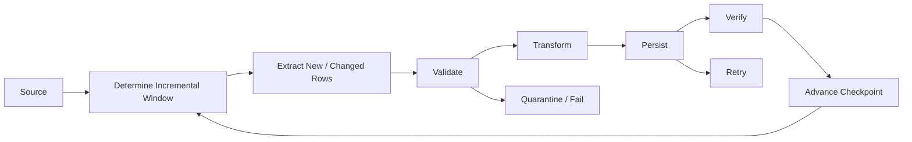
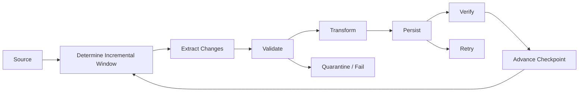
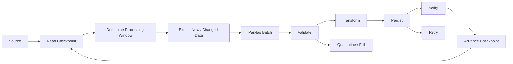
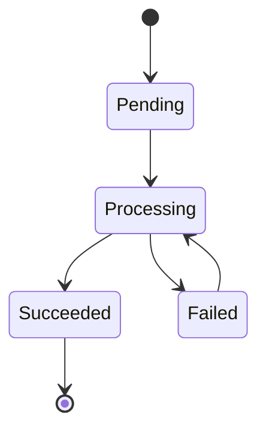

# 11- Incremental Processing

## Overview

Incremental processing updates a dataset by processing only new or changed records instead of rebuilding the entire result from the beginning.

A full refresh looks like:

```text
source
  ↓
read everything
  ↓
transform everything
  ↓
rewrite everything
```

Incremental processing instead uses a durable progress boundary:

```text
previous successful position
        ↓
extract new or changed data
        ↓
validate
        ↓
transform
        ↓
persist
        ↓
advance progress
```

This reduces:

```text
processing time
memory usage
database load
network transfer
storage writes
recovery cost
```

Incremental processing is one of the most important patterns for production ETL and data-engineering systems because data volume usually grows faster than the practical cost of repeatedly rebuilding everything.

---

## Full Refresh vs Incremental Processing

| Strategy | Description | Advantages | Limitations |
|---|---|---|---|
| Full refresh | Reprocess all source data | Simple, deterministic | Expensive at scale |
| Incremental insert | Process newly created records | Efficient | Does not detect updates |
| Incremental update | Process changed records | Efficient for mutable data | Requires change tracking |
| Upsert | Insert new and update changed rows | Handles mutable entities | More destination complexity |
| CDC | Process source change events | Low latency, precise changes | More infrastructure |
| Time-window batch | Process bounded time ranges | Simple and restartable | Requires trustworthy timestamps |

The correct strategy depends on source semantics.

---

## Why Incremental Processing Exists

Suppose an orders table grows by:

```text
1 million rows/day
```

After one year:

```text
365 million rows
```

A daily full refresh would repeatedly process hundreds of millions of rows to obtain approximately one million new or changed records.

Incremental processing changes the cost profile:

```text
full refresh:
365M rows/day

incremental:
~1M new/changed rows/day
```

The savings affect:

```text
CPU
RAM
database I/O
network traffic
object storage reads
job duration
operational recovery
```

---

## The Core Incremental Pattern

A production incremental pipeline usually contains four concepts:

```text
source state
processing boundary
destination state
checkpoint
```

Conceptually:



The key invariant is:

```text
checkpoint reflects only durable successful work
```

---

## What Counts as New or Changed Data?

Incremental processing requires a way to identify records that need processing.

Common mechanisms include:

```text
created_at
updated_at
monotonic ID
sequence number
version number
database log position
CDC event
Kafka offset
API cursor
file modification/version identifier
```

The best mechanism is source-specific.

---

## Created-at Incremental Processing

If records are immutable and only new rows matter, use a creation timestamp.

```sql
SELECT
    order_id,
    customer_id,
    amount,
    created_at
FROM orders
WHERE created_at > :watermark
ORDER BY created_at, order_id;
```

This works well for append-only tables.

It does not detect later changes to existing rows.

---

## Updated-at Incremental Processing

For mutable entities, use a modification timestamp.

```sql
SELECT
    order_id,
    customer_id,
    amount,
    status,
    updated_at
FROM orders
WHERE updated_at > :watermark
ORDER BY updated_at, order_id;
```

This captures:

```text
new rows
+
updated rows
```

provided that every relevant mutation reliably updates `updated_at`.

That assumption must be enforced by the source system rather than merely documented.

---

## Timestamp Watermarks

A watermark records the most recent successfully processed source position.

Example:

```text
last_successful_updated_at =
2026-09-12T15:00:00Z
```

The next extraction can use:

```sql
WHERE updated_at > :watermark
```

However, timestamp-only watermarks can become ambiguous when many records share the same timestamp.

---

## Composite Watermarks

A stronger cursor combines a timestamp with a unique ordering key.

Example:

```text
(updated_at, order_id)
```

Query:

```sql
SELECT
    order_id,
    customer_id,
    amount,
    updated_at
FROM orders
WHERE
    updated_at > :last_updated_at
    OR (
        updated_at = :last_updated_at
        AND order_id > :last_order_id
    )
ORDER BY
    updated_at,
    order_id
LIMIT :batch_size;
```

The pair becomes a deterministic position in the ordered source.

This is safer than storing only:

```text
2026-09-12T15:00:00Z
```

when multiple records can have that exact timestamp.

---

## Why an Upper Bound Matters

Consider:

```text
watermark = 15:00
```

The job starts at:

```text
15:05
```

while new records continue arriving.

If extraction uses only:

```sql
WHERE updated_at > '15:00'
```

the query can observe changing source state while processing.

A bounded window is easier to reason about:

```text
lower bound
+
fixed upper bound
```

For example:

```sql
WHERE updated_at > :start
  AND updated_at <= :end
```

The pipeline can then finish a stable logical interval before advancing its checkpoint.

---

## High-Watermark Pattern

A common approach is:

```text
read current checkpoint
        ↓
determine high watermark
        ↓
process checkpoint → high watermark
        ↓
commit
        ↓
checkpoint = high watermark
```

Example:

```text
checkpoint:
15:00

high watermark:
16:00

process:
(15:00, 16:00]

new checkpoint:
16:00
```

This prevents the extraction boundary from moving while the job is processing the batch.

---

## Choosing the High Watermark

The upper boundary should come from a trustworthy source-side query.

For example:

```sql
SELECT MAX(updated_at)
FROM orders
WHERE updated_at > :current_watermark;
```

For very high-volume systems, the source may provide a stronger mechanism such as:

```text
database sequence
CDC position
transaction log position
Kafka offset
```

The important property is deterministic ordering.

---

## Late-Arriving Records

A timestamp-based incremental pipeline can miss late-arriving records.

Example:

```text
Record A:
event time = 14:00
arrival time = 15:10
```

If the pipeline already processed:

```text
14:00 → 15:00
```

then filtering by event time alone may not capture Record A correctly.

Distinguish:

```text
event time
```

from:

```text
ingestion time
```

when source behavior permits delayed delivery.

---

## Overlapping Windows

One strategy for late-arriving data is an overlap window.

Instead of:

```text
last checkpoint → now
```

process:

```text
last checkpoint - overlap
        →
now
```

For example:

```text
checkpoint = 15:00
overlap    = 10 minutes

extract from 14:50 → 16:00
```

This intentionally reprocesses some records.

It requires idempotent destination writes or deterministic deduplication.

---

## Trade-Off: Overlap vs Exact Cursor

| Strategy | Advantage | Risk |
|---|---|---|
| Exact watermark | Minimal reprocessing | Can miss late data |
| Overlapping window | Safer for delayed events | Reprocesses records |
| CDC | Precise changes | More infrastructure |
| Periodic reconciliation | Detects missed data later | Correction is delayed |

The correct approach depends on source guarantees.

---

## Incremental Processing and Idempotency

Incremental systems should assume reprocessing can happen.

For example:

```text
batch processed
↓
database commit succeeds
↓
worker crashes
↓
checkpoint update is lost
↓
same range runs again
```

A safe pipeline must tolerate this.

Common mechanisms include:

```text
UPSERT
UNIQUE constraints
source event IDs
deterministic partitions
MERGE
staging + deduplication
```

A useful architecture principle is:

```text
at-least-once processing
+
idempotent writes
```

---

## Upserts

For mutable records, incremental processing often means:

```text
new record → INSERT
existing record → UPDATE
```

PostgreSQL example:

```sql
INSERT INTO orders (
    order_id,
    customer_id,
    amount,
    status,
    updated_at
)
VALUES (
    :order_id,
    :customer_id,
    :amount,
    :status,
    :updated_at
)
ON CONFLICT (order_id)
DO UPDATE SET
    customer_id = EXCLUDED.customer_id,
    amount = EXCLUDED.amount,
    status = EXCLUDED.status,
    updated_at = EXCLUDED.updated_at;
```

The destination schema should enforce:

```sql
PRIMARY KEY (order_id)
```

so idempotency is enforced at the database boundary.

---

## Pandas Incremental Transformations

Pandas only needs the incremental subset for each run.

```python
def transform_orders(
    orders: pd.DataFrame,
) -> pd.DataFrame:
    result = orders.copy()

    result["updated_at"] = pd.to_datetime(
        result["updated_at"],
        utc=True,
        errors="raise",
    )

    result["amount"] = pd.to_numeric(
        result["amount"],
        errors="raise",
    )

    result["status"] = (
        result["status"]
        .astype("string")
        .str.strip()
        .str.lower()
    )

    return result
```

The smaller input allows Pandas operations to remain practical even as the source table becomes very large.

---

## Incremental Data Validation

Every incremental batch should still pass the same core quality checks as a full refresh.

Typical checks:

```text
schema
required fields
dtype assumptions
duplicate keys
allowed values
numeric ranges
datetime consistency
referential integrity
```

Do not weaken validation merely because the batch is smaller.

A small invalid batch can still corrupt a large destination table.

---

## Incremental Data Quality

Track quality metrics at both:

```text
batch level
```

and:

```text
historical level
```

Example:

```text
today:
invalid_amount_rate = 0.2%

historical:
0.01%
```

The absolute rate might look acceptable, but the change may indicate an upstream regression.

---

## Incremental Aggregation

Incremental processing becomes more powerful when derived aggregates can also be updated incrementally.

Example:

```text
raw transactions
    ↓
new transactions only
    ↓
customer revenue delta
    ↓
update aggregate table
```

Instead of recomputing:

```text
customer revenue across all transactions
```

calculate only the new contribution.

```python
revenue_delta = (
    transactions
    .groupby("customer_id", as_index=False)
    .agg(
        revenue_delta=(
            "amount",
            "sum",
        ),
    )
)
```

The destination can then merge these deltas.

---

## Incremental Aggregation Caveats

Incremental aggregation is straightforward for additive metrics:

```text
sum
count
```

It can also be implemented for some other metrics by maintaining sufficient state.

It is more difficult for:

```text
exact median
exact distinct count
global ranking
arbitrary percentile
```

These may require:

```text
full recomputation
additional state
approximation
specialized data structures
```

Do not assume every aggregation is incrementally maintainable.

---

## Deletes

Incremental pipelines often focus on inserts and updates but forget deletes.

Suppose:

```text
source:
customer C-100 exists

destination:
customer C-100 exists
```

Later:

```text
source:
customer C-100 deleted
```

An `updated_at > watermark` query may never return that record.

Deletion handling requires an explicit mechanism such as:

```text
soft delete flag
deleted_at timestamp
CDC delete event
tombstone
periodic reconciliation
source-side change table
```

---

## Soft Deletes

A source can represent deletion explicitly:

```text
deleted_at = timestamp
```

Then incremental extraction can include the changed record:

```sql
SELECT
    customer_id,
    email,
    deleted_at,
    updated_at
FROM customers
WHERE updated_at > :watermark;
```

The destination can then mark the record deleted.

This is considerably easier to process incrementally than silent physical deletion.

---

## Change Data Capture

CDC captures data changes directly from a source database or event stream.

Conceptually:

```text
database
   ↓
change log
   ↓
CDC connector
   ↓
Kafka
   ↓
consumer
   ↓
Pandas micro-batch
   ↓
destination
```

CDC can represent:

```text
INSERT
UPDATE
DELETE
```

and often provides stronger change semantics than polling `updated_at`.

However, CDC introduces additional operational infrastructure.

---

## Incremental Processing with Kafka

Kafka provides an offset-based incremental boundary.

Conceptually:

```text
partition
0 1 2 3 4 5 6 7 8 9
        ↑
    committed offset
```

A consumer processes messages after the last durable offset.

For Pandas micro-batching:

```text
poll messages
    ↓
DataFrame.from_records()
    ↓
validate
    ↓
transform
    ↓
persist
    ↓
commit offsets
```

Offsets should be committed according to the destination's durability guarantees.

---

## Incremental Processing with Parquet

For object-storage datasets, incremental processing often operates on new partitions.

Example:

```text
s3://analytics/orders/
    year=2026/
        month=09/
            day=10/
            day=11/
            day=12/
```

A pipeline can track:

```text
processed partitions
```

rather than repeatedly reading the complete dataset.

For partition-based workflows:

```text
new partition
→ validate
→ transform
→ publish
→ mark processed
```

---

## Partition Tracking

A durable metadata table can track processed partitions.

Example:

```text
dataset
partition
status
started_at
completed_at
row_count
pipeline_version
```

This enables:

```text
retries
backfills
reprocessing
audit
```

A partition should not be marked complete until its output is safely published.

---

## Atomic Publishing

A common object-storage pattern is:

```text
write temporary output
        ↓
validate output
        ↓
publish/move into final location
        ↓
record partition complete
```

This avoids exposing partially written data as a completed partition.

Conceptually:

```text
/tmp/orders/2026-09-12/
        ↓
validation
        ↓
published/orders/2026-09-12/
```

The exact atomicity semantics depend on the storage system and publishing mechanism.

---

## Incremental Processing from APIs

API-based incremental processing may use:

```text
updated_since
cursor
page token
sequence ID
```

Example:

```python
response = client.get_orders(
    updated_since=watermark,
    limit=500,
)
```

A robust implementation should also handle:

```text
pagination
rate limits
timeouts
duplicate pages
cursor expiration
partial responses
API schema changes
```

Persist the cursor only after successful processing of the corresponding data.

---

## Incremental Processing from PostgreSQL

A common PostgreSQL design is:

```sql
SELECT
    order_id,
    customer_id,
    amount,
    status,
    updated_at
FROM orders
WHERE
    updated_at > :last_updated_at
    OR (
        updated_at = :last_updated_at
        AND order_id > :last_order_id
    )
ORDER BY
    updated_at,
    order_id
LIMIT :batch_size;
```

The query should be supported by an appropriate index.

For example:

```sql
CREATE INDEX idx_orders_incremental
ON orders (
    updated_at,
    order_id
);
```

Always validate the actual query plan in production-like environments.

---

## Query Planning

Incremental does not automatically mean efficient.

Bad incremental query:

```sql
WHERE DATE(updated_at) = :date
```

can prevent efficient use of an index because the column is wrapped in a function.

Prefer range predicates:

```sql
WHERE updated_at >= :start
  AND updated_at < :end
```

The exact behavior depends on the database and index design, so inspect the query plan when performance matters.

---

## Incremental Processing State

A checkpoint record might look like:

```text
pipeline:
orders_daily

source:
postgresql.orders

last_updated_at:
2026-09-12T16:00:00Z

last_order_id:
5832101

status:
succeeded

pipeline_version:
4.2.0
```

This state should be:

```text
durable
auditable
versioned
recoverable
```

Avoid hiding progress only in:

```text
application logs
local files
process memory
container filesystem
```

---

## Checkpoint Semantics

A checkpoint should answer:

```text
What source position has definitely been processed successfully?
```

It should not mean:

```text
What source position did the application attempt?
```

This distinction is critical during failure recovery.

Correct:

```text
persist success
    ↓
checkpoint
```

Incorrect:

```text
extract
    ↓
checkpoint
    ↓
persist
```

---

## Checkpoint Storage

Common choices include:

| Storage | Use Case |
|---|---|
| PostgreSQL table | Relational ETL pipelines |
| DynamoDB | Highly available serverless workloads |
| S3 object | Simple file-based workflows |
| Redis | Temporary state, not ideal as sole durable checkpoint |
| Kafka offsets | Kafka consumers |
| Airflow metadata | Airflow-managed orchestration |

The checkpoint system should match the durability and consistency requirements of the pipeline.

---

## Incremental Processing and Transactions

When the destination and checkpoint are in the same transactional system, consistency can be easier to guarantee.

For example:

```text
BEGIN
  ↓
write destination rows
  ↓
update checkpoint
  ↓
COMMIT
```

If both operations are inside the same transaction:

```text
destination write fails
→ checkpoint does not advance
```

or:

```text
transaction commits
→ both destination and checkpoint advance
```

When source and destination state live in different systems, this atomicity is usually unavailable and idempotency becomes even more important.

---

## Incremental Processing Across Distributed Systems

Consider:

```text
PostgreSQL
   ↓
Pandas
   ↓
S3
   ↓
PostgreSQL reporting table
```

There is no single transaction spanning all components.

The pipeline therefore needs:

```text
durable progress
+
idempotent writes
+
reconciliation
+
retry
```

rather than assuming global transactionality.

---

## Reconciliation

Even with incremental processing, periodic reconciliation is valuable.

For example:

```text
incremental pipeline
    ↓
daily checks
    ↓
weekly reconciliation
    ↓
compare source and destination
```

Reconciliation can detect:

```text
missed updates
late data
incorrect deletes
duplicate writes
corrupted partitions
checkpoint bugs
```

Incremental processing should not eliminate independent correctness checks.

---

## Periodic Full Refresh

An incremental system may still benefit from periodic full recomputation.

For example:

```text
daily:
incremental processing

weekly:
sample reconciliation

monthly:
full rebuild or deep reconciliation
```

This provides a recovery path if:

```text
incremental state becomes corrupted
```

or:

```text
historical assumptions change
```

---

## Backfills

Incremental logic should support explicit historical ranges.

For example:

```python
def process_window(
    start_time: pd.Timestamp,
    end_time: pd.Timestamp,
) -> None:
    ...
```

Normal operation:

```text
watermark → current high watermark
```

Backfill:

```text
2026-01-01 → 2026-03-01
```

The same validation and transformation code should be reused whenever possible.

---

## Handling Corrections

Incremental systems need to support source corrections.

Example:

```text
Original:
amount = 100

Correction:
amount = 120
```

If the pipeline only inserts new records, the destination remains wrong.

For mutable entities:

```text
updated_at
+
upsert
```

is typically required.

For immutable event streams:

```text
correction event
```

may be the correct model.

Understand the semantics of the source before selecting an incremental strategy.

---

## Deletes and Tombstones in Event Systems

In event-driven architectures, deletion can be represented as a tombstone or explicit delete event.

Example:

```text
UPDATE customer C-100
DELETE customer C-100
```

A consumer must process both event types.

A pipeline that only handles inserts and updates can create permanent stale records.

---

## Incremental Processing and Pandas Memory

Incremental extraction keeps each DataFrame bounded.

```python
for batch in fetch_incremental_batches():
    validated = validate_batch(batch)
    transformed = transform_batch(validated)
    persist_batch(transformed)
```

Avoid:

```python
all_batches = list(
    fetch_incremental_batches()
)

full = pd.concat(all_batches)
```

That converts incremental extraction back into full in-memory processing.

---

## Incremental Processing with Chunked SQL Reads

When a single logical window is large, combine:

```text
incremental window
+
chunked reads
```

Conceptually:

```text
watermark
   ↓
time/key window
   ↓
100k-row chunks
   ↓
Pandas transformation
   ↓
destination
```

This allows the logical progress model to remain independent of the physical memory batch size.

---

## Incremental Quality Monitoring

Track:

```text
rows ingested
rows updated
rows deleted
invalid rows
duplicate rows
quarantined rows
processing lag
watermark lag
destination reconciliation
```

Monitor changes in these metrics over time.

A sudden increase in:

```text
updated rows
```

could indicate:

```text
source replay
upstream bug
bulk correction
schema migration
```

---

## Freshness

Incremental processing improves efficiency but does not guarantee freshness.

Track:

```text
source latest timestamp
destination latest timestamp
processing watermark
```

For example:

```text
source:
16:00

destination:
15:20
```

The pipeline is:

```text
40 minutes behind
```

An operational SLA can then determine whether this is acceptable.

---

## Monitoring and Alerting

Useful incremental alerts include:

```text
watermark stopped advancing
processing lag exceeds SLA
zero rows for unexpectedly long period
duplicate rate increases
update volume spikes
delete volume spikes
quality gate fails
checkpoint state is inconsistent
```

A job can technically be:

```text
"running"
```

while making no useful progress.

Watermark advancement is therefore an important health signal.

---

## Stalled Pipeline Detection

Track:

```text
last_successful_batch
last_checkpoint_update
current_processing_time
```

If:

```text
current_time - last_checkpoint_update
```

exceeds the expected processing window, alert operators.

This is often more meaningful than simply checking whether the worker process is alive.

---

## Performance Considerations

The main performance advantage of incremental processing is reduced data volume.

But incremental queries still need:

```text
appropriate indexes
selective predicates
bounded result sizes
efficient serialization
efficient Pandas transformations
```

Common bottlenecks include:

```text
database scanning
network transfer
DataFrame construction
joins
sorting
serialization
database writes
```

Do not assume the incremental extraction query is automatically the fastest part of the pipeline.

---

## Memory Considerations

Incremental processing should usually combine:

```text
source-side filtering
+
projection
+
bounded batches
+
appropriate dtypes
+
vectorized transformations
```

For example:

```python
for batch in pd.read_sql_query(
    query,
    engine,
    params=params,
    chunksize=100_000,
):
    process_batch(batch)
```

The goal is to keep the working set predictable.

---

## Concurrency

Incremental partitions can sometimes be processed concurrently:

```text
2026-09-12 00:00 → 01:00
2026-09-12 01:00 → 02:00
2026-09-12 02:00 → 03:00
```

But parallelism is safe only when:

```text
windows do not overlap incorrectly
destination writes are idempotent
ordering is not required
shared checkpoint state is coordinated
```

Use locks, leases, unique job IDs, or an orchestration system when concurrent workers may contend for the same incremental state.

---

## Preventing Concurrent Checkpoint Updates

Consider two workers:

```text
Worker A:
checkpoint = 100
processing → 200

Worker B:
checkpoint = 100
processing → 150
```

If B commits after A, the checkpoint could regress:

```text
200 → 150
```

Checkpoint updates therefore need concurrency control.

Possible approaches:

```text
single owner
row-level locking
optimistic concurrency
compare-and-set
orchestrator-managed partition ownership
```

---

## Exactly-Once Semantics

Incremental pipelines often involve multiple systems:

```text
source
queue
Pandas worker
database
checkpoint store
```

Global exactly-once semantics are difficult because failures can occur between side effects.

A more practical model is:

```text
at-least-once processing
+
idempotent destination
+
durable checkpoint
+
reconciliation
```

This is easier to operate and recover.

---

## Incremental Processing with Celery

A backend application can schedule incremental work asynchronously.

```text
FastAPI / Django
      ↓
create pipeline job
      ↓
Celery
      ↓
read checkpoint
      ↓
process incremental window
      ↓
persist
      ↓
checkpoint
```

Do not store checkpoint state inside a worker process.

Use durable storage shared by workers.

---

## Incremental Processing with Kubernetes

A Kubernetes CronJob can trigger recurring incremental work:

```text
CronJob
   ↓
Job
   ↓
read checkpoint
   ↓
process new data
   ↓
persist
   ↓
checkpoint
```

Container restarts should be safe because the next execution can resume from the last durable checkpoint.

---

## AWS Incremental Architecture

A common AWS pattern is:

```text
PostgreSQL / API / Kafka
        ↓
incremental extraction
        ↓
ECS / AWS Batch / Lambda*
        ↓
Pandas
        ↓
S3 Parquet
        ↓
warehouse / reporting

* only for appropriately bounded workloads
```

S3 can provide durable storage for:

```text
raw data
incremental outputs
quarantine records
checkpoints or metadata
```

Use an explicit metadata store when checkpoint consistency requires transactional updates.

---

## Cost Considerations

Incremental processing can dramatically reduce:

```text
database reads
network egress
compute time
object-store reads
write volume
job runtime
```

However, incremental designs add engineering cost:

```text
checkpoint management
late data handling
delete handling
reconciliation
idempotency
backfill logic
```

The savings are most significant when the source is large and the daily change set is small.

---

## Reliability Considerations

An incremental pipeline should answer:

```text
What exactly has been processed?
```

```text
What happens if the worker crashes?
```

```text
What happens if the same batch runs twice?
```

```text
What happens if records arrive late?
```

```text
What happens if records are deleted?
```

```text
How can historical data be rebuilt?
```

If these questions do not have explicit answers, the incremental design is incomplete.

---

## Disaster Recovery

A recoverable incremental system retains:

```text
source data or replayable source history
checkpoint state
batch metadata
pipeline version
destination state
quality results
```

If the checkpoint becomes invalid:

```text
restore checkpoint
→
reprocess range
→
idempotent merge
→
reconcile
```

This is significantly safer than trying to manually repair a destination table without knowing the source position.

---

## Common Mistakes

### Using Only `updated_at` Without Understanding Source Semantics

The field may not change for every mutation, or its clock may not be trustworthy.

### Advancing the Watermark Before Persistence

This can permanently skip records after a failure.

### Ignoring Deletes

Insert/update-only processing leaves stale destination records when source entities are removed.

### Using Event Time When Arrival Time Matters

Late-arriving events can be missed if the checkpoint is based on a timestamp that does not reflect ingestion behavior.

### Using Exact Windows Without Late-Data Strategy

A strict cursor can miss delayed records unless the source guarantees ordering or a reconciliation mechanism exists.

### Reprocessing Overlap Without Idempotency

Overlap windows intentionally process records more than once. The destination must tolerate that behavior.

### Treating a Timestamp as Unique

Multiple records may share the same timestamp. Use a composite cursor when necessary.

### Storing Checkpoints Only in Logs

Logs are not a suitable transactional progress store.

### Allowing Concurrent Workers to Update the Same Checkpoint

Workers can overwrite or regress one another's progress.

### Incrementally Updating Non-Incremental Metrics Incorrectly

Some statistics require global state or recomputation.

### Forgetting Historical Reconciliation

Incremental logic can drift silently if the source or transformation assumptions change.

### Assuming Incremental Means Small

An individual incremental window can still contain millions of records. Chunk the window when necessary.

---

## Incremental Processing Checklist

```text
[ ] Source change semantics are understood
[ ] New records can be identified reliably
[ ] Updates can be identified reliably
[ ] Deletes are represented or separately reconciled
[ ] Watermark/cursor semantics are documented
[ ] Composite cursor is used where timestamps are not unique
[ ] High watermark is deterministic
[ ] Incremental windows are bounded where appropriate
[ ] Late-arriving data has an explicit strategy
[ ] Overlap windows are idempotent if used
[ ] Checkpoint state is durable
[ ] Checkpoint advances only after successful persistence
[ ] Checkpoint updates are concurrency-safe
[ ] Destination writes are idempotent
[ ] Database constraints protect unique records
[ ] Incremental batches are schema and quality checked
[ ] Chunking is used when an incremental window is large
[ ] Deletes are processed correctly
[ ] Quality and volume metrics are monitored
[ ] Watermark advancement is monitored
[ ] Processing lag is measured
[ ] Reconciliation exists
[ ] Backfills support explicit ranges
[ ] Pipeline version is recorded
[ ] Recovery procedures are documented
[ ] Sensitive checkpoint or source metadata is protected
```

## Interview Perspective

### What Is Incremental Processing?

Incremental processing processes only new or changed data since a known durable progress boundary rather than recomputing the entire dataset.

### Why Is Incremental Processing More Efficient Than Full Refresh?

It reduces the amount of data that must be read, transferred, transformed, and written when the change set is much smaller than the complete dataset.

### What Is a Watermark?

A watermark is a durable representation of how far the pipeline has successfully processed the source.

### Why Use a Composite Watermark?

A timestamp may not be unique. Combining it with a unique key provides deterministic ordering and avoids ambiguity when multiple records share the same timestamp.

### Why Is a High Watermark Useful?

It creates a stable upper boundary for the current run, preventing the source window from moving while the pipeline is processing.

### How Do You Handle Late-Arriving Data?

Possible approaches include overlap windows, ingestion timestamps, CDC, source-specific ordering guarantees, and periodic reconciliation.

### Why Are Deletes Hard in Incremental Pipelines?

An ordinary `updated_at` query cannot detect a row that was physically deleted unless deletion information is separately captured.

### How Does CDC Improve Incremental Processing?

CDC provides explicit change events, including inserts, updates, and deletes, often using an ordered source change position.

### How Do You Make Incremental Processing Retry-Safe?

Use durable checkpoints and idempotent destination writes such as upserts, unique constraints, deterministic partitions, or staging plus merge.

### Where Should a Checkpoint Be Stored?

In durable shared storage appropriate to the architecture, such as PostgreSQL, DynamoDB, Kafka offsets, or an orchestration system.

### What Happens if a Worker Crashes After the Destination Commit but Before the Checkpoint?

The same range may be processed again. This is safe only when the destination operation is idempotent.

### Can Incremental Processing Handle Aggregations?

Yes for many additive or state-maintainable metrics, but statistics such as exact median and some global rankings require additional state or recomputation.

### How Do You Prevent Concurrent Workers from Corrupting Checkpoint State?

Use a single logical owner, locking, compare-and-set semantics, leases, or orchestrator-managed partition ownership.

### Why Is Periodic Reconciliation Still Necessary?

Incremental logic can miss late records, deletes, source corrections, or previously undetected bugs. Reconciliation provides an independent correctness check.

### When Should You Prefer CDC Over Timestamp Polling?

CDC is useful when the source supports reliable change capture and the workload requires accurate update/delete detection or lower latency than periodic polling can provide.

### When Is a Full Refresh Still Appropriate?

Use a full refresh when datasets are small, transformations depend heavily on global state, source changes cannot be tracked reliably, or periodic rebuilds are required as a correctness mechanism.

## Key Takeaways

- Incremental processing reduces cost by processing only new or changed data, but it requires a reliable definition of source progress.
- Durable watermarks, high-watermark windows, composite cursors, and checkpoint-after-success provide the foundation for restartable incremental pipelines.
- Production systems must explicitly handle updates, deletes, late-arriving records, retries, and concurrent workers rather than assuming `updated_at > watermark` is sufficient.
- Incremental processing should be combined with idempotent writes, data-quality validation, monitoring, and periodic reconciliation to maintain long-term correctness.
- Pandas is effective for processing incremental batches, while CDC, Kafka, PostgreSQL, S3, Celery, and Kubernetes can provide the surrounding extraction, orchestration, storage, and recovery infrastructure.
```
```

```
Markdown


```
# 11- Incremental Processing

## Overview

Incremental processing updates a dataset by processing only the records that are new or changed since the previous successful run.

A full-refresh pipeline repeatedly processes the complete source:

```text
source
  ↓
read everything
  ↓
transform everything
  ↓
rewrite everything
```

An incremental pipeline maintains durable progress:

```text
last successful position
        ↓
identify new / changed data
        ↓
extract
        ↓
validate
        ↓
transform
        ↓
persist
        ↓
verify
        ↓
advance checkpoint
```

This approach reduces:

```text
database reads
network transfer
Pandas memory usage
CPU consumption
storage writes
job duration
recovery cost
```

Incremental processing is one of the most important patterns in production ETL because source datasets typically grow much faster than the daily change volume.

Pandas performs the actual transformation in memory. Incremental processing controls how much data reaches Pandas and how much work needs to be repeated.

---

## Full Refresh vs Incremental Processing

| Strategy | How It Works | Strengths | Limitations |
|---|---|---|---|
| Full refresh | Reprocess all source data | Simple, deterministic | Increasingly expensive |
| Insert-only incremental | Process newly created records | Simple and efficient | Misses updates |
| Update-aware incremental | Process new and changed records | Handles mutable data | Requires change tracking |
| Upsert | Insert new rows and update existing rows | Good for mutable entities | More destination complexity |
| Change Data Capture | Consume explicit source changes | Captures inserts, updates, deletes | More infrastructure |
| Partition incremental | Process newly available partitions | Natural for files/data lakes | Depends on reliable partitioning |
| Hybrid | Incremental processing plus periodic rebuild/reconciliation | Strong operational resilience | More engineering effort |

The appropriate approach depends on the source system and data semantics.

---

## Why Incremental Processing Exists

Suppose an order table contains:

```text
500 million historical rows
```

and only:

```text
1 million rows
```

are created or changed each day.

A full refresh might read:

```text
500M rows every day
```

while an incremental pipeline reads approximately:

```text
1M rows/day
```

The difference affects:

```text
PostgreSQL I/O
network traffic
Pandas memory
CPU time
object-store reads
database writes
job duration
```

Incremental processing is most valuable when:

```text
total dataset size >> daily change volume
```

---

## The Core Model

An incremental pipeline usually has four pieces of state:

```text
source position
processing window
destination state
checkpoint
```

A typical flow is:



The critical invariant is:

```text
checkpoint = last source position known to be durably processed
```

The checkpoint must not represent merely attempted work.

---

## Identifying New or Changed Records

Incremental processing requires a reliable source-side change signal.

Common mechanisms include:

```text
created_at
updated_at
monotonic ID
sequence number
version number
database log position
CDC position
Kafka offset
API cursor
partition identifier
```

| Mechanism | Best Fit | Main Risk |
|---|---|---|
| `created_at` | Append-only data | Misses updates |
| `updated_at` | Mutable rows | Depends on reliable updates |
| ID | Append-only ordered data | Cannot identify updates |
| Sequence | Strict source ordering | Source-specific |
| Version | Versioned records | Requires source support |
| CDC position | Database changes | Infrastructure complexity |
| Kafka offset | Event streams | Kafka-specific |
| API cursor | Paginated APIs | API-specific |

The strongest incremental boundary is usually one that represents source ordering directly rather than relying on an arbitrary timestamp.

---

## Append-Only Incremental Processing

If records are immutable after creation, use a creation boundary:

```sql
SELECT
    order_id,
    customer_id,
    amount,
    created_at
FROM orders
WHERE created_at > :watermark
ORDER BY created_at, order_id;
```

This works well for:

```text
event tables
append-only transactions
immutable logs
fact records
```

The design becomes simpler because only inserts need to be considered.

---

## Update-Aware Incremental Processing

Mutable records usually require an update timestamp or another change indicator.

```sql
SELECT
    order_id,
    customer_id,
    amount,
    status,
    updated_at
FROM orders
WHERE updated_at > :watermark
ORDER BY updated_at, order_id;
```

This captures:

```text
new rows
+
changed rows
```

only when every relevant mutation reliably updates `updated_at`.

That source guarantee is part of the data contract.

---

## Timestamp Watermarks

A watermark records the last successfully processed source position.

Example:

```text
last_updated_at =
2026-09-12T15:00:00Z
```

The next run can query:

```sql
WHERE updated_at > :watermark
```

A timestamp alone is often insufficient because several rows may have identical timestamps.

For example:

```text
order A → 15:00:00
order B → 15:00:00
order C → 15:00:00
```

A pipeline that checkpoints only the timestamp can struggle to determine exactly which rows have been processed.

---

## Composite Watermarks

A more deterministic position can combine:

```text
timestamp + unique key
```

For example:

```text
(updated_at, order_id)
```

Query:

```sql
SELECT
    order_id,
    customer_id,
    amount,
    status,
    updated_at
FROM orders
WHERE
    updated_at > :last_updated_at
    OR (
        updated_at = :last_updated_at
        AND order_id > :last_order_id
    )
ORDER BY
    updated_at,
    order_id
LIMIT :batch_size;
```

The composite position acts as a keyset cursor.

This avoids ambiguity when multiple records share the same timestamp.

---

## High Watermarks

A high watermark provides a fixed upper boundary for the current run.

The pattern is:

```text
current checkpoint
        ↓
determine high watermark
        ↓
process checkpoint → high watermark
        ↓
commit
        ↓
set checkpoint = high watermark
```

Example:

```text
checkpoint:
15:00

high watermark:
16:00

process:
(15:00, 16:00]

checkpoint:
16:00
```

The source may continue changing after 16:00, but those changes belong to the next run.

This produces a deterministic processing window.

---

## Why a Fixed Upper Boundary Matters

Without a fixed upper bound:

```sql
WHERE updated_at > :checkpoint
```

the source can continue changing while the pipeline processes the query results.

This creates a moving target.

A bounded window:

```sql
WHERE updated_at > :start
  AND updated_at <= :end
```

makes the logical processing range explicit.

The upper bound can be determined before the main extraction begins.

---

## Example High-Watermark Query

A simple approach is:

```sql
SELECT MAX(updated_at)
FROM orders
WHERE updated_at > :checkpoint;
```

The pipeline can then process:

```sql
WHERE updated_at > :checkpoint
  AND updated_at <= :high_watermark
```

For high-volume systems, a sequence, database log position, or CDC offset may provide stronger guarantees than a timestamp-based high watermark.

---

## Keyset Pagination

When an incremental window contains many rows, process it in bounded batches.

Avoid large offsets:

```sql
SELECT
    order_id,
    customer_id,
    amount
FROM orders
ORDER BY order_id
OFFSET 5000000
LIMIT 100000;
```

Prefer keyset pagination:

```sql
SELECT
    order_id,
    customer_id,
    amount
FROM orders
WHERE order_id > :last_order_id
ORDER BY order_id
LIMIT :batch_size;
```

Keyset pagination provides a natural restart position and usually avoids increasingly expensive offset scans on large tables.

The query should be supported by an appropriate index.

---

## PostgreSQL Indexing

For a composite incremental cursor:

```sql
CREATE INDEX idx_orders_incremental
ON orders (
    updated_at,
    order_id
);
```

The actual index should reflect:

```text
filter columns
+
sort columns
+
query selectivity
```

Verify the real query plan rather than assuming an index is being used.

Useful PostgreSQL tooling includes:

```sql
EXPLAIN (ANALYZE, BUFFERS)
SELECT
    order_id,
    customer_id,
    amount
FROM orders
WHERE
    updated_at > :last_updated_at
ORDER BY
    updated_at,
    order_id
LIMIT 100000;
```

---

## Incremental SQL from Pandas

Pandas can process incremental batches directly:

```python
import pandas as pd
from sqlalchemy import text


query = text(
    """
    SELECT
        order_id,
        customer_id,
        amount,
        status,
        updated_at
    FROM orders
    WHERE
        updated_at > :start
        AND updated_at <= :end
    ORDER BY
        updated_at,
        order_id
    """
)

for batch in pd.read_sql_query(
    query,
    engine,
    params={
        "start": start_time,
        "end": end_time,
    },
    chunksize=100_000,
):
    validate_batch(batch)
    transformed = transform_batch(batch)
    persist_batch(transformed)
```

This combines:

```text
incremental extraction
+
chunked memory usage
+
Pandas transformations
```

---

## Incremental Processing with Pandas

A transformation function should be independent of how the records were extracted.

```python
def transform_orders(
    orders: pd.DataFrame,
) -> pd.DataFrame:
    result = orders.copy()

    result["updated_at"] = pd.to_datetime(
        result["updated_at"],
        utc=True,
        errors="raise",
    )

    result["amount"] = pd.to_numeric(
        result["amount"],
        errors="raise",
    )

    result["status"] = (
        result["status"]
        .astype("string")
        .str.strip()
        .str.lower()
    )

    return result
```

The same transformation can then be reused for:

```text
normal incremental processing
backfills
reprocessing
tests
reconciliation
```

---

## Incremental Validation

Every incremental batch should pass the same important quality checks as a full dataset.

For example:

```python
def validate_batch(
    batch: pd.DataFrame,
) -> None:
    required = {
        "order_id",
        "customer_id",
        "amount",
        "updated_at",
    }

    missing = required.difference(
        batch.columns
    )

    if missing:
        raise ValueError(
            f"Missing columns: {sorted(missing)}"
        )

    if batch["order_id"].isna().any():
        raise ValueError(
            "order_id cannot be null"
        )

    if batch["order_id"].duplicated().any():
        raise ValueError(
            "Duplicate order_id values found"
        )

    if batch["amount"].lt(0).any():
        raise ValueError(
            "Negative order amounts found"
        )
```

Incremental processing reduces the volume of data being handled, not the importance of validation.

---

## Empty Incremental Windows

A successful run may legitimately find no changes.

```text
checkpoint:
15:00

high watermark:
16:00

new rows:
0
```

The pipeline can still record:

```text
window checked
row_count = 0
status = succeeded
checkpoint = 16:00
```

Whether an empty result should advance the checkpoint depends on the checkpoint semantics.

If the high watermark represents a source position that has been completely examined, advancing it may be correct.

---

## Empty Dataset Semantics

Define these cases explicitly:

```text
no new rows
empty source
missing partition
source unavailable
query returned zero rows
```

They do not all mean the same thing.

For example:

```text
zero customer updates
→ probably valid

zero payment settlements
→ potentially critical

missing S3 partition
→ likely operational failure
```

Business semantics should determine the response.

---

## Late-Arriving Data

Incremental processing becomes more difficult when records can arrive after their logical event time.

Example:

```text
event_time  = 14:00
arrival     = 15:10
```

Suppose the pipeline already processed:

```text
14:00 → 15:00
```

A query based only on `event_time` may never see the late record.

Distinguish between:

```text
event time
```

and:

```text
ingestion time
```

when the source provides both.

---

## Overlap Windows

One practical late-data strategy is an overlap window.

Instead of:

```text
checkpoint → current
```

use:

```text
checkpoint - overlap → current
```

Example:

```text
checkpoint:
15:00

overlap:
10 minutes

next read:
14:50 → 16:00
```

This intentionally reprocesses some data.

Therefore:

```text
overlap
+
idempotent writes
```

must be designed together.

---

## When to Use an Overlap

Overlap windows are useful when:

```text
late data is expected
timestamps are not perfect
source delivery is eventually consistent
reprocessing is cheap
destination writes are idempotent
```

They are less appropriate when:

```text
exactly-once external effects matter
reprocessing is extremely expensive
records cannot be uniquely identified
```

In those cases, CDC or another source-specific change mechanism may be better.

---

## Idempotency

Incremental jobs must tolerate duplicate execution.

Consider:

```text
1. Extract records 1000–2000
2. Persist destination rows
3. Process crashes
4. Checkpoint update never commits
5. Records 1000–2000 are processed again
```

The second execution should not corrupt the destination.

Common mechanisms include:

```text
UNIQUE constraints
UPSERT
MERGE
source event IDs
batch IDs
deterministic partitions
staging tables
```

The destination should be designed to absorb legitimate retries.

---

## PostgreSQL Upserts

For mutable records:

```sql
INSERT INTO orders (
    order_id,
    customer_id,
    amount,
    status,
    updated_at
)
VALUES (
    :order_id,
    :customer_id,
    :amount,
    :status,
    :updated_at
)
ON CONFLICT (order_id)
DO UPDATE SET
    customer_id = EXCLUDED.customer_id,
    amount = EXCLUDED.amount,
    status = EXCLUDED.status,
    updated_at = EXCLUDED.updated_at;
```

The destination should normally enforce:

```sql
PRIMARY KEY (order_id)
```

This moves part of the idempotency guarantee into the database.

---

## Deletes

Deletes are one of the most common incremental-processing failures.

Suppose:

```text
source:
customer C-100 exists
```

Later:

```text
source:
customer C-100 is deleted
```

A query such as:

```sql
WHERE updated_at > :watermark
```

cannot detect a row that has been physically removed unless deletion metadata exists elsewhere.

Possible mechanisms include:

```text
deleted_at
soft-delete flag
CDC delete event
tombstone
change table
source audit log
periodic reconciliation
```

An incremental design is incomplete if update behavior is defined but delete behavior is not.

---

## Soft Deletes

A soft-delete model allows deletion to remain observable:

```text
customer_id = C-100
deleted_at = 2026-09-12T14:30:00Z
```

The row still participates in incremental extraction:

```sql
SELECT
    customer_id,
    email,
    deleted_at,
    updated_at
FROM customers
WHERE updated_at > :watermark;
```

The downstream system can then mark the entity deleted.

This is often much easier to integrate into incremental pipelines than silent physical deletion.

---

## Change Data Capture

CDC captures source changes from a database or event source.

A typical architecture is:


CDC can represent:

```text
INSERT
UPDATE
DELETE
```

and provides a source-native change sequence.

This is useful when:

```text
accurate update detection matters
deletes must be captured
polling latency is insufficient
source volume is high
```

The trade-off is more infrastructure and operational complexity.

---

## Kafka Offsets

Kafka provides a natural incremental position:

```text
partition:
0 1 2 3 4 5 6 7 8 9
        ↑
   committed offset
```

A Pandas micro-batch can follow:

```text
poll messages
    ↓
DataFrame.from_records()
    ↓
validate
    ↓
transform
    ↓
persist
    ↓
commit offset
```

The offset should only advance when the corresponding processing guarantees have been satisfied.

---

## API Incremental Processing

REST APIs may expose:

```text
updated_since
cursor
page token
sequence ID
version
```

Example:

```python
response = client.get_orders(
    updated_since=watermark,
    limit=500,
)
```

Production handling should consider:

```text
pagination
rate limits
timeouts
cursor expiration
duplicate pages
schema changes
partial failures
```

A cursor should not be acknowledged as processed until the corresponding records are durably handled.

---

## Parquet Incremental Processing

For partitioned object storage, incremental processing can operate on new partitions.

Example:

```text
s3://analytics/orders/
    year=2026/
        month=09/
            day=10/
            day=11/
            day=12/
```

The pipeline can track:

```text
processed partitions
```

instead of rescanning the entire dataset.

For each new partition:

```text
discover
  ↓
validate
  ↓
transform
  ↓
write
  ↓
publish
  ↓
mark complete
```

---

## Partition Metadata

A durable metadata table can record:

```text
dataset
partition
status
started_at
completed_at
row_count
quality_status
pipeline_version
```

This provides explicit operational state instead of relying only on file existence.

It also makes retries and backfills easier to control.

---

## Atomic Publishing

Do not expose partially written output as completed data.

A common approach is:

```text
temporary output
      ↓
validation
      ↓
publish final path
      ↓
record partition complete
```

Conceptually:

```text
/tmp/orders/2026-09-12/
        ↓
quality checks
        ↓
published/orders/2026-09-12/
```

The exact atomicity guarantees depend on the storage system and publication mechanism.

---

## Incremental Aggregation

Incremental processing can update derived aggregates without recomputing the full history.

Suppose:

```text
transactions
    ↓
customer revenue
```

Instead of recomputing all transactions:

```python
revenue_delta = (
    transactions
    .groupby("customer_id", as_index=False)
    .agg(
        revenue_delta=(
            "amount",
            "sum",
        ),
    )
)
```

The destination can apply only the new contribution.

This is effective for additive metrics such as:

```text
sum
count
```

and can be extended to other metrics when sufficient state is maintained.

---

## Metrics That Need Global State

Some metrics do not support simple per-batch accumulation.

Examples:

```text
exact median
exact percentile
global ranking
exact distinct count
global sorting
```

A batch-local calculation does not necessarily produce the global result.

For example:

```python
batch_medians = [
    batch["amount"].median()
    for batch in batches
]
```

and:

```python
sum(batch_medians) / len(batch_medians)
```

does not calculate the true global median.

Use:

```text
maintained state
approximation
database computation
specialized algorithms
periodic full recomputation
```

when necessary.

---

## Incremental Aggregation and Deletes

Incremental aggregates become more complex when records can change or disappear.

Example:

```text
customer revenue:
1000
```

A transaction changes from:

```text
100 → 150
```

The aggregate should increase by:

```text
+50
```

not:

```text
+150
```

Similarly, a deleted transaction may require:

```text
-negative delta
```

This is why mutable-source incremental aggregation needs explicit update/delete semantics.

---

## Checkpoint State

A production checkpoint might look like:

```text
pipeline:
orders_incremental

source:
postgresql.orders

last_updated_at:
2026-09-12T16:00:00Z

last_order_id:
5832101

status:
succeeded

pipeline_version:
4.3.0
```

The state should be:

```text
durable
auditable
versioned
concurrency-safe
recoverable
```

Do not make application logs the only record of processing progress.

---

## Checkpoint Semantics

A checkpoint should answer:

```text
What source position has definitely been processed successfully?
```

It should not answer:

```text
What source position did the job attempt to process?
```

Correct:

```text
extract
  ↓
transform
  ↓
persist
  ↓
commit
  ↓
checkpoint
```

Incorrect:

```text
extract
  ↓
checkpoint
  ↓
persist
```

The incorrect ordering can cause permanent data loss after a failure.

---

## Checkpoint Storage

Common options include:

| Storage | Typical Use |
|---|---|
| PostgreSQL | Relational ETL pipelines |
| DynamoDB | Highly available serverless workloads |
| Kafka offsets | Kafka consumers |
| Orchestration metadata | Airflow / workflow systems |
| S3 | File-oriented pipelines where suitable |
| Redis | Temporary coordination; not ideal as the sole durable checkpoint |

Checkpoint storage should match the consistency and durability requirements of the pipeline.

---

## Transactional Checkpointing

If destination writes and checkpoint metadata share a database, both can sometimes be committed atomically.

Conceptually:

```text
BEGIN
  ↓
write destination
  ↓
update checkpoint
  ↓
COMMIT
```

If the transaction fails:

```text
destination rollback
checkpoint rollback
```

This eliminates one class of partial-progress failures.

When source, destination, and checkpoint state live in different systems, global transactionality usually does not exist, so idempotency becomes essential.

---

## Concurrent Incremental Workers

Two workers must not accidentally process the same logical state without coordination.

Example:

```text
Worker A:
checkpoint = 100
→ plans to process 100–200

Worker B:
checkpoint = 100
→ plans to process 100–150
```

Possible outcomes:

```text
duplicate work
checkpoint regression
conflicting writes
inconsistent status
```

Use:

```text
single-worker ownership
distributed lock
lease
row lock
compare-and-set
partition ownership
orchestrator coordination
```

The checkpoint update itself must be concurrency-safe.

---

## Checkpoint Regression

A subtle failure is checkpoint regression.

Example:

```text
A commits:
checkpoint = 200

B later commits:
checkpoint = 150
```

The pipeline now appears to move backward.

Protect against this with an invariant such as:

```text
new_checkpoint >= current_checkpoint
```

or an atomic compare-and-set update.

---

## Reconciliation

Incremental processing should still have independent correctness checks.

A periodic reconciliation can compare:

```text
source
vs
destination
```

using:

```text
row counts
checksums
aggregate totals
key ranges
sampled records
partition completeness
```

For example:

```text
incremental:
every 15 minutes

reconciliation:
daily

deep rebuild:
periodically
```

The exact schedule depends on business criticality.

---

## Why Reconciliation Matters

Incremental bugs can be silent.

A faulty watermark might:

```text
skip 5,000 rows
```

while every subsequent run still reports:

```text
status = succeeded
```

Reconciliation provides an independent signal that the destination remains aligned with the source.

---

## Periodic Full Refresh

Incremental processing does not mean full refreshes are forbidden.

A mature architecture may combine:

```text
incremental processing
+
periodic reconciliation
+
occasional full rebuild
```

A full rebuild can recover from:

```text
checkpoint corruption
historical transformation bugs
schema interpretation changes
source corrections
```

This is especially useful for derived analytical datasets.

---

## Backfills

Backfills should be first-class operations.

Normal processing:

```text
current checkpoint
→
high watermark
```

Backfill:

```text
2026-01-01
→
2026-03-01
```

Design the processing function around explicit windows:

```python
def process_window(
    start_time: pd.Timestamp,
    end_time: pd.Timestamp,
) -> None:
    ...
```

Avoid maintaining separate transformation logic for backfills.

---

## Corrections

Incremental pipelines must handle corrections to previously processed data.

Example:

```text
original:
amount = 100

corrected:
amount = 120
```

The destination must reflect the correction.

For mutable entities:

```text
updated_at
+
upsert
```

For immutable event systems:

```text
correction event
```

may be more appropriate.

The correct strategy depends on the source data model.

---

## Data Quality Monitoring

Track incremental metrics such as:

```text
rows inserted
rows updated
rows deleted
invalid rows
duplicates
quarantined rows
processing duration
watermark lag
```

Historical comparison is particularly useful.

Example:

```text
normal update volume:
50k–80k/hour

current:
2.4M/hour
```

This may indicate:

```text
source replay
migration
upstream bug
timestamp corruption
bulk correction
```

---

## Freshness and Lag

An incremental pipeline can be healthy while still being behind.

Track:

```text
source latest position
destination latest position
pipeline checkpoint
processing lag
```

Example:

```text
source:
16:00

checkpoint:
15:20

lag:
40 minutes
```

Compare this with the pipeline SLA.

A process that is alive but no longer advancing its watermark is operationally unhealthy.

---

## Monitoring Stalled Progress

Monitor:

```text
last successful batch
last checkpoint update
processing duration
current source watermark
destination watermark
```

A useful alert condition is:

```text
time since last checkpoint
>
expected processing interval
```

This often detects failures more effectively than container health checks alone.

---

## Performance

Incremental processing improves performance by reducing the data volume, but the incremental query itself still needs to be efficient.

Important considerations include:

```text
source indexes
predicate selectivity
column projection
batch size
serialization
Pandas transformation cost
database write throughput
```

An incremental pipeline can still be slow when:

```text
the database scans the full table
```

instead of efficiently locating the changed rows.

---

## Predicate Design

Prefer range predicates:

```sql
WHERE updated_at >= :start
  AND updated_at < :end
```

over predicates that transform the indexed column:

```sql
WHERE DATE(updated_at) = :target_date
```

The exact planner behavior depends on the database and query design, but avoiding unnecessary functions around indexed columns generally makes range-based indexing easier to exploit.

---

## Memory Efficiency

Incremental extraction should usually be combined with:

```text
column projection
+
bounded batches
+
appropriate dtypes
+
vectorized transformations
```

Example:

```python
for batch in pd.read_sql_query(
    query,
    engine,
    params=params,
    chunksize=100_000,
):
    batch = batch[
        [
            "order_id",
            "customer_id",
            "amount",
            "updated_at",
        ]
    ]

    process_batch(batch)
```

Do not materialize unrelated columns simply because the source provides them.

---

## Incremental Processing and Batch Processing

These concepts solve different dimensions.

```text
incremental processing:
"Which records should I process?"

batch processing:
"How much should I process at one time?"
```

A production pipeline often needs both:

```text
new/changed records
      ↓
incremental window
      ↓
100,000-row batches
      ↓
Pandas processing
```

This distinction is important when designing scalable data workflows.

---

## Incremental Processing with Celery

A typical backend architecture is:


The worker should not hold checkpoint state only in process memory.

Celery retries should be safe because the destination is idempotent and the checkpoint advances only after successful processing.

---

## Incremental Processing on Kubernetes

A Kubernetes CronJob can launch an incremental worker:

```text
CronJob
   ↓
Job
   ↓
Read checkpoint
   ↓
Extract changes
   ↓
Pandas
   ↓
Persist
   ↓
Checkpoint
```

Container replacement should not lose progress.

This requires:

```text
durable checkpoint
+
idempotent destination
+
restart-safe orchestration
```

---

## AWS Architecture

A practical AWS-style design might look like:

```text
PostgreSQL / API / Kafka
          ↓
Incremental extraction
          ↓
ECS / AWS Batch / Lambda*
          ↓
Pandas
          ↓
S3 Parquet
          ↓
Warehouse / Reporting

* Appropriate only for workloads that fit the platform limits.
```

S3 can provide durable storage for:

```text
raw data
incremental output
quarantine data
reprocessing inputs
```

A separate transactional metadata store may still be preferable for checkpoint coordination.

---

## Cost Considerations

Incremental processing can reduce:

```text
database I/O
network traffic
compute
storage reads
destination writes
job duration
```

But it introduces complexity:

```text
checkpoint management
delete handling
late data
reconciliation
backfills
idempotency
```

The design is usually justified when:

```text
historical volume is large
daily change volume is comparatively small
```

For small datasets, a full refresh may remain simpler and cheaper.

---

## Reliability Model

A robust incremental pipeline should be able to answer:

```text
What data has definitely been processed?

What happens if the worker crashes?

What happens if the same window is processed twice?

What happens when a record is deleted?

What happens when data arrives late?

How are source corrections applied?

How can historical data be rebuilt?
```

These are architectural requirements, not optional operational details.

---

## Disaster Recovery

A recoverable incremental system should preserve:

```text
source history or replayability
checkpoint state
batch metadata
pipeline version
destination state
quality results
```

If state becomes invalid:

```text
restore known source position
        ↓
reprocess range
        ↓
idempotent merge
        ↓
reconcile
```

Recovery is much easier when incremental state is explicit and durable.

---

## Security Considerations

Incremental pipelines often process sensitive information continuously.

Protect:

```text
database credentials
API credentials
AWS credentials
PII
financial records
customer identifiers
checkpoint metadata
quarantine data
```

Use:

```text
IAM roles
secret managers
TLS
encryption at rest
least privilege
log redaction
data retention policies
```

Do not expose source credentials or sensitive record contents in checkpoint records or application logs.

---

## Testing Incremental Pipelines

Test more than transformation correctness.

Important test scenarios include:

```text
first run
normal incremental run
empty window
multiple rows sharing a timestamp
late-arriving record
update
delete
duplicate source record
retry after destination success
destination failure
checkpoint failure
checkpoint regression
backfill
concurrent worker
```

Example:

```python
def test_checkpoint_is_not_advanced_on_write_failure(
    monkeypatch,
) -> None:
    checkpoint = {
        "updated_at": "2026-09-12T15:00:00Z",
        "order_id": 100,
    }

    def fail_persist(_batch):
        raise RuntimeError(
            "destination unavailable"
        )

    monkeypatch.setattr(
        "pipeline.persist_batch",
        fail_persist,
    )

    run_incremental(
        checkpoint=checkpoint
    )

    assert load_checkpoint() == checkpoint
```

This validates an important operational invariant:

```text
failed persistence
→
no checkpoint advancement
```

---

## Common Mistakes

### Using Only `updated_at` Without Source Guarantees

If some updates do not change `updated_at`, they will never be discovered.

### Advancing the Checkpoint Before Persistence

A crash can permanently skip records.

### Treating Timestamps as Unique

Multiple records can share the same timestamp. Use a composite cursor when necessary.

### Ignoring Deletes

Destination records can become stale forever.

### Ignoring Late-Arriving Records

An event-time boundary can miss records that arrive after their logical processing window.

### Using Overlap Without Idempotency

Overlap deliberately causes reprocessing. The destination must tolerate duplicates.

### Storing Progress Only in Logs

Logs describe what happened but should not be the sole transactional source of processing state.

### Allowing Concurrent Workers to Share Uncoordinated State

Workers can overlap work or regress checkpoints.

### Recomputing Everything Inside Each Incremental Run

This defeats the primary benefit of incremental processing.

### Incrementally Updating Complex Statistics Without Sufficient State

Many global metrics cannot be maintained correctly from isolated per-batch values.

### Forgetting Backfills

A pipeline that only understands "current watermark to now" is difficult to recover from historical issues.

### Assuming Incremental Means Automatically Fast

Poor indexes, inefficient joins, large batches, or expensive Pandas transformations can still dominate runtime.

---

## Production Checklist

```text
[ ] Source change semantics are documented
[ ] New records are identified reliably
[ ] Updates are identified reliably
[ ] Deletes are handled explicitly
[ ] Watermark/cursor semantics are defined
[ ] Composite cursor is used when timestamps are not unique
[ ] High watermark is deterministic
[ ] Incremental windows are bounded where appropriate
[ ] Late-arriving data has a defined strategy
[ ] Overlap windows are paired with idempotent writes
[ ] Checkpoint state is durable
[ ] Checkpoint advances only after successful persistence
[ ] Checkpoint updates are concurrency-safe
[ ] Destination writes are idempotent
[ ] Database constraints protect unique entities
[ ] Incremental batches undergo schema validation
[ ] Incremental batches undergo data-quality validation
[ ] Large windows are processed in bounded chunks
[ ] Source indexes support incremental queries
[ ] Watermark advancement is monitored
[ ] Processing lag is monitored
[ ] Insert/update/delete volumes are monitored
[ ] Reconciliation exists
[ ] Backfills support explicit ranges
[ ] Pipeline version is recorded
[ ] Recovery procedures are documented
[ ] Sensitive source and checkpoint information is protected
[ ] Historical source data is replayable where required
[ ] Tests cover late data, retries, deletes, and checkpoint failures
```

## Interview Perspective

### What Is Incremental Processing?

Incremental processing processes only the records that are new or changed since a known durable source position instead of rebuilding the entire result.

### What Is a Watermark?

A watermark represents the source position that has been successfully processed and persisted.

### Why Is a High Watermark Useful?

It establishes a fixed upper boundary for a processing run so the logical source window does not change while the job is executing.

### Why Use a Composite Cursor?

A timestamp may not uniquely identify a record. Combining the timestamp with a unique key provides deterministic ordering and a precise resume position.

### What Is the Difference Between Incremental and Batch Processing?

Incremental processing determines which records should be processed. Batch processing determines how much data is processed in one execution unit. A production pipeline commonly uses both.

### How Do You Handle Late-Arriving Data?

Use ingestion timestamps, CDC, overlap windows, replayable source data, or periodic reconciliation depending on source guarantees and business requirements.

### Why Are Deletes Difficult?

A physically deleted source row may no longer satisfy an incremental query. Deletes must therefore be represented using soft deletes, CDC events, tombstones, change tables, or reconciliation.

### How Do You Make Incremental Processing Retry-Safe?

Persist the checkpoint only after successful destination processing and use idempotent destination operations such as upserts and unique constraints.

### What Happens If a Worker Crashes After the Destination Commit but Before the Checkpoint?

The same source range may be processed again. The destination must safely absorb the repeated work.

### How Do You Prevent Checkpoint Regression?

Use one owner per logical partition, locking, leases, or atomic compare-and-set semantics so a stale worker cannot overwrite newer progress.

### How Can Pandas Process Incremental Database Data Efficiently?

Push filtering and projection into PostgreSQL, extract only the incremental range, read it in chunks, use vectorized Pandas transformations, and write results incrementally.

### Why Is `updated_at > watermark` Sometimes Unsafe?

It can miss records when timestamps are duplicated, updates do not reliably change the timestamp, records arrive late, or source clocks are not trustworthy.

### What Metrics Should Be Monitored?

At minimum:

```text
rows inserted
rows updated
rows deleted
invalid rows
processing duration
watermark position
processing lag
```

### Why Keep Reconciliation in an Incremental Architecture?

Incremental state can become incorrect without the job itself failing. Independent reconciliation detects missed records, incorrect deletes, duplicate writes, and checkpoint bugs.

### When Should You Use CDC Instead of Timestamp Polling?

CDC is preferable when accurate insert/update/delete capture, lower latency, or high source volume makes timestamp polling unreliable or inefficient.

### When Is Full Refresh Still a Better Choice?

When datasets are small, source changes cannot be reliably tracked, transformations depend heavily on global state, or periodic rebuilding is required for correctness.

## Key Takeaways

- Incremental processing reduces cost by processing only new or changed records, but its correctness depends on a reliable, deterministic source position.
- Watermarks, high-watermark windows, composite cursors, and checkpoint-after-success provide the foundation for restartable incremental pipelines.
- Production systems must explicitly handle updates, deletes, late-arriving data, retries, and concurrent workers; `updated_at > watermark` alone is rarely a complete design.
- Idempotent writes, durable checkpoints, data-quality validation, monitoring, reconciliation, and backfills turn incremental processing from a performance optimization into a reliable production architecture.
- Pandas should process bounded incremental batches while PostgreSQL, Kafka, APIs, Parquet, Celery, Kubernetes, and AWS provide the surrounding extraction, persistence, orchestration, and recovery mechanisms.
```
```

```
Markdown


```
# 11- Incremental Processing

## Overview

Incremental processing handles only the data that is new, changed, or otherwise relevant since the previous successful processing point.

A full-refresh pipeline repeatedly processes the entire dataset:

```text
source
  ↓
read everything
  ↓
transform everything
  ↓
write everything
```

An incremental pipeline maintains durable progress:

```text
last successful position
        ↓
identify new / changed data
        ↓
extract
        ↓
validate
        ↓
transform
        ↓
persist
        ↓
verify
        ↓
advance checkpoint
```

The primary benefit is that the amount of work becomes proportional to the change volume rather than the historical dataset size.

For Pandas-based backend and data-engineering workloads, incremental processing is usually combined with:

```text
Pandas
+
SQL
+
batch processing
+
idempotent writes
+
checkpointing
+
data-quality checks
```

Pandas performs the in-memory transformation. The surrounding architecture determines which records Pandas receives, how progress is tracked, and how results become durable.

---

## Full Refresh vs Incremental Processing

| Strategy | Processing Scope | Advantages | Limitations |
|---|---|---|---|
| Full refresh | Entire dataset | Simple, deterministic | Cost grows with total data |
| Insert-only incremental | New records | Efficient and simple | Does not detect updates |
| Update-aware incremental | New and changed records | Handles mutable entities | Requires change tracking |
| Upsert | New records plus updates | Strong retry behavior | More destination logic |
| CDC | Explicit source changes | Captures inserts, updates, deletes | Additional infrastructure |
| Partition-based incremental | New files/partitions | Natural for data lakes | Requires reliable partitioning |
| Hybrid | Incremental + periodic reconciliation/rebuild | Strong operational recovery | Higher complexity |

Incremental processing is most valuable when:

```text
total historical data
≫
new or changed data per run
```

For a small dataset, a full refresh can still be the better engineering choice because it is simpler and easier to reason about.

---

## Why Incremental Processing Matters

Consider a PostgreSQL orders table with:

```text
500 million historical rows
```

and:

```text
1 million changed rows per day
```

A full refresh may repeatedly scan and transform:

```text
500 million rows
```

to obtain:

```text
1 million useful changes
```

An incremental pipeline aims to process approximately:

```text
1 million changed rows
```

instead.

This reduces:

```text
database reads
network transfer
Pandas memory usage
CPU consumption
destination writes
job duration
retry cost
```

The savings become increasingly important as the historical dataset grows.

---

## Incremental Processing Architecture

A production design commonly looks like:



The key invariant is:

```text
checkpoint = last source position known to be durably processed
```

A checkpoint should never represent merely attempted work.

---

## Sources of Incremental State

An incremental system needs a reliable signal that tells it what has changed.

Common mechanisms include:

```text
created_at
updated_at
monotonic ID
sequence number
version number
database log position
CDC position
Kafka offset
API cursor
file partition
```

| Mechanism | Typical Use | Important Consideration |
|---|---|---|
| `created_at` | Append-only records | Cannot detect later updates |
| `updated_at` | Mutable entities | Must change on every relevant update |
| Monotonic ID | Append-only tables | Does not represent updates |
| Sequence | Ordered source systems | Requires source support |
| Version number | Versioned records | Must be updated reliably |
| CDC position | Database changes | Requires CDC infrastructure |
| Kafka offset | Event streams | Scoped to Kafka partitions |
| API cursor | Incremental APIs | Depends on API semantics |
| Partition | Parquet/data lake workloads | Depends on correct partition creation |

The best incremental key is a source-native ordering or change indicator with clearly defined semantics.

---

## Append-Only Incremental Processing

For immutable records, a creation timestamp or increasing identifier is often sufficient.

```sql
SELECT
    order_id,
    customer_id,
    amount,
    created_at
FROM orders
WHERE created_at > :watermark
ORDER BY created_at, order_id;
```

This works well for:

```text
event tables
immutable transactions
append-only facts
audit records
```

The source contract must guarantee that records are not modified later.

---

## Update-Aware Incremental Processing

For mutable records, use a reliable update indicator.

```sql
SELECT
    order_id,
    customer_id,
    amount,
    status,
    updated_at
FROM orders
WHERE updated_at > :watermark
ORDER BY updated_at, order_id;
```

This can capture:

```text
new rows
+
changed rows
```

only when all relevant source mutations update `updated_at`.

A column named `updated_at` is not automatically a valid change detector. The write path must enforce its semantics.

---

## Timestamp Watermarks

A watermark represents the last successfully processed source position.

Example:

```text
last_updated_at =
2026-09-12T15:00:00Z
```

A simple query might use:

```sql
WHERE updated_at > :watermark
```

This is easy to understand, but timestamp-only watermarks have an important weakness:

```text
timestamps are not necessarily unique
```

For example:

```text
order A → 15:00:00
order B → 15:00:00
order C → 15:00:00
```

A checkpoint containing only:

```text
15:00:00
```

cannot identify exactly which records at that timestamp were processed.

---

## Composite Watermarks

A stronger cursor combines the timestamp with a unique ordering key.

Example:

```text
(updated_at, order_id)
```

Query:

```sql
SELECT
    order_id,
    customer_id,
    amount,
    status,
    updated_at
FROM orders
WHERE
    updated_at > :last_updated_at
    OR (
        updated_at = :last_updated_at
        AND order_id > :last_order_id
    )
ORDER BY
    updated_at,
    order_id
LIMIT :batch_size;
```

This creates a deterministic position in the source ordering.

Composite cursors are especially useful for:

```text
keyset pagination
large tables
high-volume incremental extraction
timestamp ties
```

---

## High Watermarks

A high watermark defines the upper boundary of the current processing run.

The pattern is:

```text
current checkpoint
        ↓
determine high watermark
        ↓
process checkpoint → high watermark
        ↓
persist successfully
        ↓
advance checkpoint
```

Example:

```text
current checkpoint = 15:00

high watermark = 16:00

process:
(15:00, 16:00]

new checkpoint:
16:00
```

New records after 16:00 are intentionally deferred to the next run.

This gives the current run a stable logical boundary.

---

## Why Bounded Windows Matter

An unbounded query such as:

```sql
WHERE updated_at > :checkpoint
```

can observe source changes while the job is running.

A bounded query is easier to reason about:

```sql
WHERE updated_at > :start
  AND updated_at <= :end
```

The pipeline processes a fixed logical interval rather than a continuously moving source.

This is especially useful when:

```text
source data changes frequently
job duration is significant
multiple workers may run
exact restart semantics matter
```

---

## Selecting a High Watermark

A simple source may provide:

```sql
SELECT MAX(updated_at)
FROM orders
WHERE updated_at > :checkpoint;
```

The result becomes the upper boundary.

For higher-throughput systems, stronger source-native positions may exist:

```text
database sequence
transaction log position
CDC offset
Kafka offset
version number
```

Prefer a change position that reflects actual source ordering over a timestamp when the source provides one.

---

## Keyset Pagination

A large incremental window should still be processed in bounded batches.

Avoid:

```sql
SELECT
    order_id,
    customer_id,
    amount
FROM orders
ORDER BY order_id
OFFSET 5000000
LIMIT 100000;
```

Prefer:

```sql
SELECT
    order_id,
    customer_id,
    amount
FROM orders
WHERE order_id > :last_order_id
ORDER BY order_id
LIMIT :batch_size;
```

Keyset pagination provides:

- A natural resume point
- Predictable progress
- Better large-table behavior
- A checkpoint-friendly cursor

The query should be supported by a suitable index.

---

## PostgreSQL Indexing

For a composite incremental cursor:

```sql
CREATE INDEX idx_orders_incremental
ON orders (
    updated_at,
    order_id
);
```

The index design should match:

```text
filter predicates
+
sort order
+
query selectivity
```

Inspect the actual query plan when performance matters:

```sql
EXPLAIN (ANALYZE, BUFFERS)
SELECT
    order_id,
    customer_id,
    amount,
    updated_at
FROM orders
WHERE
    updated_at > :last_updated_at
ORDER BY
    updated_at,
    order_id
LIMIT 100000;
```

An incremental query that still performs a large table scan is not operationally efficient.

---

## Incremental SQL with Pandas

Pandas can process the incremental source in chunks:

```python
import pandas as pd
from sqlalchemy import text


query = text(
    """
    SELECT
        order_id,
        customer_id,
        amount,
        status,
        updated_at
    FROM orders
    WHERE
        updated_at > :start_time
        AND updated_at <= :end_time
    ORDER BY
        updated_at,
        order_id
    """
)

for batch in pd.read_sql_query(
    query,
    engine,
    params={
        "start_time": start_time,
        "end_time": end_time,
    },
    chunksize=100_000,
):
    validate_batch(batch)

    transformed = transform_batch(
        batch
    )

    persist_batch(transformed)
```

This combines two different boundaries:

```text
incremental window
→ which records should be processed

chunksize
→ how many rows Pandas processes at once
```

---

## Incremental Processing and Batch Processing

These concepts should be kept distinct.

```text
Incremental processing:
"Which records should I process?"

Batch processing:
"How much of those records should I process at once?"
```

A production pipeline commonly uses both:

```text
new/changed records
        ↓
incremental window
        ↓
100,000-row Pandas chunks
        ↓
transform
        ↓
persist
```

This distinction is important when designing memory-safe ETL systems.

---

## Pandas Transformation Boundary

Incremental extraction should not leak into transformation logic.

```python
def transform_orders(
    orders: pd.DataFrame,
) -> pd.DataFrame:
    result = orders.copy()

    result["updated_at"] = pd.to_datetime(
        result["updated_at"],
        utc=True,
        errors="raise",
    )

    result["amount"] = pd.to_numeric(
        result["amount"],
        errors="raise",
    )

    result["status"] = (
        result["status"]
        .astype("string")
        .str.strip()
        .str.lower()
    )

    return result
```

The transformation can then be reused for:

```text
normal incremental runs
backfills
reprocessing
tests
reconciliation
```

This separation improves maintainability and testing.

---

## Incremental Validation

Every incremental batch should still be validated.

Typical checks include:

```text
required columns
dtypes
nullability
duplicate keys
allowed categories
numeric ranges
datetime consistency
referential integrity
```

Example:

```python
def validate_batch(
    batch: pd.DataFrame,
) -> None:
    required = {
        "order_id",
        "customer_id",
        "amount",
        "updated_at",
    }

    missing = required.difference(
        batch.columns
    )

    if missing:
        raise ValueError(
            f"Missing required columns: "
            f"{sorted(missing)}"
        )

    if batch["order_id"].isna().any():
        raise ValueError(
            "order_id cannot be null"
        )

    if batch["order_id"].duplicated().any():
        raise ValueError(
            "Duplicate order_id values found"
        )

    if batch["amount"].lt(0).any():
        raise ValueError(
            "Negative amounts found"
        )
```

The reduced batch size does not justify weaker quality controls.

---

## Empty Incremental Windows

A run may legitimately discover no new data.

Example:

```text
checkpoint:
15:00

high watermark:
16:00

rows:
0
```

The pipeline should distinguish this from:

```text
source unavailable
```

or:

```text
missing partition
```

Example handling:

```python
if batch.empty:
    logger.info(
        "no_incremental_changes",
        extra={
            "start": start_time,
            "end": end_time,
        },
    )
```

Whether the checkpoint should advance after an empty window depends on what the high watermark represents.

---

## Late-Arriving Data

Incremental processing becomes more complicated when event time and arrival time differ.

Example:

```text
event_time  = 14:00
arrival     = 15:10
```

Suppose the pipeline already finalized:

```text
14:00 → 15:00
```

A query using only `event_time` may never see the late record.

When available, distinguish:

```text
event time
```

from:

```text
ingestion time
```

This allows the pipeline to reason separately about when an event happened and when it became visible.

---

## Overlap Windows

One strategy for late-arriving data is deliberate overlap.

Example:

```text
previous checkpoint:
15:00

overlap:
10 minutes

next extraction:
14:50 → 16:00
```

This causes intentional reprocessing.

Therefore the architecture must combine:

```text
overlap
+
idempotent writes
```

An overlap window is useful when:

- Late data is expected.
- Reprocessing is acceptable.
- Records have stable identifiers.
- The destination is idempotent.

---

## Overlap vs Exact Watermark

| Strategy | Advantage | Limitation |
|---|---|---|
| Exact cursor | Minimal reprocessing | Vulnerable to certain late-data patterns |
| Overlap window | More tolerant of delayed arrivals | Reprocesses records |
| CDC | Captures explicit changes | More infrastructure |
| Periodic reconciliation | Detects missed data later | Correction is delayed |

No single strategy is universally correct.

The source's ordering and delivery guarantees should determine the design.

---

## Idempotent Writes

Incremental pipelines must tolerate repeated processing.

Failure scenario:

```text
1. Extract incremental window
2. Write destination
3. Destination commit succeeds
4. Worker crashes
5. Checkpoint update does not complete
6. Same window runs again
```

Without idempotency, the destination can contain duplicates or incorrect state.

Common mechanisms include:

```text
UNIQUE constraints
UPSERT
MERGE
source event IDs
batch IDs
deterministic output partitions
staging + merge
```

A practical production strategy is:

```text
at-least-once processing
+
idempotent side effects
```

---

## PostgreSQL Upserts

For mutable entities:

```sql
INSERT INTO orders (
    order_id,
    customer_id,
    amount,
    status,
    updated_at
)
VALUES (
    :order_id,
    :customer_id,
    :amount,
    :status,
    :updated_at
)
ON CONFLICT (order_id)
DO UPDATE SET
    customer_id = EXCLUDED.customer_id,
    amount = EXCLUDED.amount,
    status = EXCLUDED.status,
    updated_at = EXCLUDED.updated_at;
```

The destination should normally enforce:

```sql
PRIMARY KEY (order_id)
```

so uniqueness is protected at the database boundary.

---

## Deletes

Deletes are a common source of stale data in incremental pipelines.

Consider:

```text
source:
customer C-100 exists
```

Then:

```text
customer C-100 is physically deleted
```

A query such as:

```sql
WHERE updated_at > :watermark
```

cannot return a row that no longer exists.

Possible mechanisms include:

```text
deleted_at
soft-delete flag
CDC delete event
tombstone
change table
audit log
periodic reconciliation
```

A complete incremental design must define delete semantics explicitly.

---

## Soft Deletes

A soft-delete model preserves the deletion event:

```text
customer_id = C-100
deleted_at = 2026-09-12T14:30:00Z
```

The change can then flow through normal incremental extraction:

```sql
SELECT
    customer_id,
    email,
    deleted_at,
    updated_at
FROM customers
WHERE updated_at > :watermark;
```

The destination can mark the entity inactive or deleted without requiring the pipeline to discover a physically missing row.

---

## Change Data Capture

CDC captures source-side changes directly.

Typical architecture:


CDC can represent:

```text
INSERT
UPDATE
DELETE
```

and often provides a more precise source position than polling timestamps.

CDC is useful when:

```text
update/delete detection is critical
latency requirements are low
source volume is high
polling is inefficient
```

The trade-off is greater infrastructure and operational complexity.

---

## Incremental Processing with Kafka

Kafka offers partition-specific offsets as incremental positions.

Conceptually:

```text
offset:
0 1 2 3 4 5 6 7 8 9
        ↑
   committed offset
```

A micro-batch pipeline can use:

```text
poll records
    ↓
build DataFrame
    ↓
validate
    ↓
transform
    ↓
persist
    ↓
commit offset
```

The offset should advance only after the processing guarantees for those records are satisfied.

---

## Incremental REST API Processing

APIs may expose:

```text
updated_since
cursor
page token
sequence number
version
```

Example:

```python
response = client.get_orders(
    updated_since=watermark,
    limit=500,
)
```

Production concerns include:

```text
pagination
429 rate limits
timeouts
cursor expiration
duplicate pages
partial failures
schema changes
```

Persist the API cursor only after the corresponding data has been processed successfully.

---

## Incremental Parquet Processing

For data lakes, incremental processing may be partition-oriented.

Example:

```text
s3://analytics/orders/
    year=2026/
        month=09/
            day=10/
            day=11/
            day=12/
```

Instead of rescanning all historical data:

```text
discover new partition
    ↓
validate
    ↓
transform with Pandas
    ↓
write output
    ↓
publish
    ↓
mark partition complete
```

This is especially useful when partition boundaries align with the source's natural ingestion process.

---

## Partition Tracking

A durable metadata record can contain:

```text
dataset
partition
status
started_at
completed_at
row_count
quality_status
pipeline_version
```

Example states:



This provides explicit operational state instead of inferring completion only from file existence.

---

## Atomic Publishing

Avoid exposing partially generated output as completed data.

A common pattern is:

```text
temporary output
      ↓
validate
      ↓
publish final output
      ↓
record completion
```

Conceptually:

```text
staging/orders/2026-09-12/
        ↓
quality checks
        ↓
published/orders/2026-09-12/
```

The exact atomicity guarantees depend on the storage system, but the principle remains:

```text
publish complete data
not partially written data
```

---

## Incremental Aggregation

Some derived metrics can be updated incrementally.

For example, calculate customer revenue only for new transactions:

```python
revenue_delta = (
    transactions
    .groupby(
        "customer_id",
        as_index=False,
    )
    .agg(
        revenue_delta=(
            "amount",
            "sum",
        )
    )
)
```

Instead of recomputing:

```text
all historical transactions
```

the pipeline applies:

```text
new revenue delta
```

to the existing aggregate.

This is especially effective for:

```text
sum
count
```

and other metrics for which sufficient incremental state can be maintained.

---

## Incremental Aggregation with Updates

Mutable source records require delta-aware processing.

Suppose:

```text
old amount = 100
new amount = 150
```

The aggregate should apply:

```text
+50
```

not:

```text
+150
```

This means the pipeline may need both:

```text
old state
+
new state
```

or another source event model capable of expressing the change.

Incremental aggregation is therefore significantly more complex for mutable facts than for immutable append-only events.

---

## Metrics That Need Global State

Some calculations cannot be safely maintained from independent batch results.

Examples:

```text
exact median
exact percentile
global ranking
global sort
exact distinct count
```

For example, averaging batch medians does not produce the global median.

Use one of:

```text
maintained sufficient state
approximation
database-side calculation
specialized algorithm
periodic full recomputation
```

Do not force every analytical operation into an incremental model.

---

## Checkpoint State

A production checkpoint might contain:

```text
pipeline:
orders_incremental

source:
postgresql.orders

last_updated_at:
2026-09-12T16:00:00Z

last_order_id:
5832101

status:
succeeded

pipeline_version:
4.3.0
```

Useful checkpoint properties are:

```text
durable
auditable
versioned
concurrency-safe
recoverable
```

The checkpoint is part of the pipeline's correctness state, not merely an operational convenience.

---

## Checkpoint Ordering

The correct processing order is:

```text
extract
    ↓
validate
    ↓
transform
    ↓
persist
    ↓
verify / commit
    ↓
advance checkpoint
```

The incorrect order is:

```text
extract
    ↓
advance checkpoint
    ↓
persist
```

If the process fails after the checkpoint update but before persistence, records may be skipped permanently.

---

## Checkpoint Storage

Typical checkpoint stores include:

| Store | Good Fit |
|---|---|
| PostgreSQL | Relational ETL and transactional pipelines |
| DynamoDB | Highly available distributed workflows |
| Kafka offset | Kafka consumers |
| Workflow metadata store | Airflow and orchestrated pipelines |
| S3/object storage | File-oriented state where consistency is sufficient |
| Redis | Coordination or short-lived state; not usually the sole durable checkpoint |

Choose based on:

```text
durability
consistency
availability
concurrency
operational model
```

---

## Transactional Checkpointing

When destination writes and checkpoint state are in the same transactional database, both can sometimes be committed atomically:

```text
BEGIN
    ↓
write destination
    ↓
update checkpoint
    ↓
COMMIT
```

A failure causes:

```text
destination rollback
+
checkpoint rollback
```

This removes an entire class of partial-progress problems.

When systems are separate:

```text
source
+
S3
+
PostgreSQL
+
Kafka
```

there is typically no global transaction. Idempotency and reconciliation become much more important.

---

## Concurrent Workers

Two workers must not independently consume the same checkpoint without coordination.

Example:

```text
Worker A:
checkpoint = 100
→ processing 100–200

Worker B:
checkpoint = 100
→ processing 100–150
```

Possible problems:

```text
duplicate work
duplicate writes
checkpoint regression
race conditions
```

Possible solutions include:

```text
single logical owner
distributed lock
lease
row-level lock
compare-and-set
partition ownership
orchestrator coordination
```

---

## Checkpoint Regression

A particularly dangerous race is:

```text
Worker A commits:
checkpoint = 200

Worker B commits later:
checkpoint = 150
```

The pipeline has moved backward.

Checkpoint updates should therefore enforce a monotonic-progress invariant:

```text
new checkpoint >= current checkpoint
```

Implementation options include:

```text
row locking
optimistic concurrency
compare-and-set
single-writer ownership
```

---

## Reconciliation

Incremental pipelines should have an independent correctness mechanism.

For example:

```text
incremental processing
→ every 15 minutes

quality monitoring
→ every run

reconciliation
→ daily

deep rebuild
→ periodic
```

Reconciliation can compare:

```text
row counts
aggregate totals
key ranges
checksums
partition completeness
sampled records
```

This catches errors that do not necessarily cause the incremental job itself to fail.

---

## Why Reconciliation Matters

An incremental pipeline can report:

```text
status = succeeded
```

while still being wrong.

For example, a broken watermark can silently skip:

```text
5,000 records
```

and every future run may continue successfully from the wrong checkpoint.

Reconciliation introduces an independent correctness signal.

---

## Periodic Full Refreshes

Incremental processing does not eliminate the value of full rebuilds.

A mature system can combine:

```text
incremental processing
+
periodic reconciliation
+
occasional full rebuild
```

A full rebuild can recover from:

```text
checkpoint corruption
historical transformation bugs
incorrect source assumptions
schema interpretation changes
data corrections
```

This is particularly valuable for derived reporting datasets.

---

## Backfills

Backfills should be first-class operations.

Normal execution:

```text
current checkpoint
→
high watermark
```

Backfill:

```text
2026-01-01
→
2026-03-01
```

Design processing around explicit boundaries:

```python
def process_window(
    start_time: pd.Timestamp,
    end_time: pd.Timestamp,
) -> None:
    ...
```

Reuse the same:

```text
validation
transformation
persistence
quality checks
```

rather than building a separate code path for historical data.

---

## Handling Source Corrections

Incremental pipelines must support changes to previously processed data.

Example:

```text
original amount:
100

corrected amount:
120
```

For mutable entities:

```text
updated_at
+
upsert
```

may be appropriate.

For immutable event streams:

```text
correction event
```

may be the correct design.

The source's data model determines the right solution.

---

## Incremental Data Quality

Track quality metrics at both:

```text
batch level
```

and:

```text
historical level
```

Useful metrics include:

```text
rows inserted
rows updated
rows deleted
invalid rows
duplicate rate
null rate
rejected rows
reconciliation status
```

For example:

```text
normal update volume:
50,000–80,000/hour

current:
2,400,000/hour
```

The spike may indicate:

```text
source replay
bulk migration
upstream bug
timestamp corruption
large correction
```

---

## Freshness and Lag

Incremental processing improves efficiency but does not guarantee freshness.

Track:

```text
source latest position
destination latest position
pipeline checkpoint
processing lag
```

Example:

```text
source:
16:00

checkpoint:
15:20

lag:
40 minutes
```

Compare this against the service-level expectation.

A pipeline that is alive but no longer advances its checkpoint is operationally unhealthy.

---

## Monitoring Stalled Progress

Useful operational signals include:

```text
last successful batch
last checkpoint update
current source position
current destination position
processing duration
rows processed
```

A useful alert is:

```text
time since checkpoint advancement
>
expected processing interval
```

This is usually more meaningful than checking whether a container or process is merely running.

---

## Performance Considerations

Incremental processing reduces work, but poor source queries can still dominate runtime.

Pay attention to:

```text
indexing
predicate selectivity
column projection
batch size
serialization
Pandas transformations
destination throughput
```

An incremental query that scans the entire source table is often not meaningfully incremental from a database-resource perspective.

---

## Predicate Design

Prefer direct range predicates:

```sql
WHERE updated_at >= :start
  AND updated_at < :end
```

over expressions applied to indexed columns:

```sql
WHERE DATE(updated_at) = :target_date
```

Range predicates are generally easier for relational databases to optimize with ordinary indexes.

Always verify actual behavior using the database's query planner.

---

## Memory Efficiency

A robust incremental pipeline typically combines:

```text
source-side filtering
+
projection
+
bounded batches
+
appropriate dtypes
+
vectorized transformations
```

Example:

```python
for batch in pd.read_sql_query(
    query,
    engine,
    params=params,
    chunksize=100_000,
):
    batch["amount"] = pd.to_numeric(
        batch["amount"],
        errors="raise",
    )

    process_batch(batch)
```

Avoid creating large temporary DataFrames unless the transformation genuinely requires them.

---

## Incremental Processing with Celery

A backend service can delegate incremental work to a Celery worker:


The web request should normally create or inspect a job instead of holding a connection open for a long-running Pandas operation.

Celery task arguments should contain compact references such as:

```text
pipeline ID
source range
checkpoint ID
S3 path
partition
```

Do not send giant DataFrames through the broker.

---

## Incremental Processing with Kubernetes

A Kubernetes CronJob can execute a recurring incremental pipeline:

```text
CronJob
   ↓
Job
   ↓
read durable checkpoint
   ↓
extract changes
   ↓
process Pandas batches
   ↓
persist
   ↓
checkpoint
```

Pod replacement or rescheduling should not lose progress.

That requires:

```text
durable checkpoint
+
idempotent destination
+
restart-safe job design
```

---

## AWS Architecture

A typical AWS-oriented design may look like:

```text
PostgreSQL / REST API / Kafka
          ↓
Incremental extraction
          ↓
ECS / AWS Batch
          ↓
Pandas
          ↓
S3 Parquet
          ↓
Warehouse / Reporting
```

S3 can provide durable storage for:

```text
raw data
incremental outputs
quarantine records
reprocessing inputs
```

Checkpoint state may live in:

```text
PostgreSQL
DynamoDB
workflow metadata
```

depending on consistency and coordination requirements.

---

## Cost Considerations

Incremental processing can substantially reduce:

```text
database reads
network transfer
compute time
storage reads
destination writes
job runtime
```

However, it introduces additional engineering requirements:

```text
checkpoint management
delete handling
late-arriving data
reconciliation
backfills
idempotency
```

For a small source, the operational complexity of incremental processing can cost more than the infrastructure savings.

---

## Reliability Questions

A production incremental system should have explicit answers to:

```text
What has definitely been processed?

What happens if the worker crashes?

What happens if the same range runs twice?

What happens if a source record arrives late?

What happens if a record is deleted?

What happens if the source corrects old data?

What happens if two workers run simultaneously?

How can historical data be rebuilt?
```

If these questions are unresolved, the incremental design is incomplete.

---

## Disaster Recovery

A recoverable incremental system should retain:

```text
source history or replayable source data
checkpoint state
batch metadata
pipeline version
destination state
quality results
```

Recovery can then follow:

```text
restore or identify valid checkpoint
        ↓
reprocess explicit range
        ↓
idempotent write
        ↓
reconcile
```

This is safer than manually repairing a destination without knowing the exact source processing position.

---

## Security Considerations

Incremental pipelines often process sensitive information continuously.

Protect:

```text
database credentials
API credentials
cloud credentials
PII
financial records
customer identifiers
quarantine data
checkpoint metadata
```

Use:

```text
IAM roles
secret managers
TLS
encryption at rest
least-privilege access
log redaction
retention policies
```

Checkpoint records should contain only the metadata necessary to resume processing.

---

## Testing Incremental Processing

Tests should cover incremental behavior, not just transformation functions.

Important scenarios include:

```text
first run
normal incremental run
empty window
timestamp ties
late-arriving record
update
delete
duplicate source record
destination failure
checkpoint failure
retry after successful destination write
checkpoint regression
backfill
concurrent execution
```

Example:

```python
def test_checkpoint_does_not_advance_on_write_failure(
    monkeypatch,
) -> None:
    initial_checkpoint = {
        "updated_at": "2026-09-12T15:00:00Z",
        "order_id": 100,
    }

    monkeypatch.setattr(
        "pipeline.persist_batch",
        lambda batch: (
            _raise_destination_error()
        ),
    )

    run_incremental(
        checkpoint=initial_checkpoint
    )

    assert load_checkpoint() == (
        initial_checkpoint
    )
```

The important invariant is:

```text
failed persistence
→
checkpoint unchanged
```

Test checkpoint behavior as seriously as transformation behavior.

---

## Common Mistakes

### Treating `updated_at` as Automatically Reliable

A timestamp is only useful when every relevant mutation updates it correctly.

### Using a Timestamp Without a Tie-Breaker

Multiple records may share the same timestamp.

### Advancing the Checkpoint Before Persistence

A failure can cause permanent data loss.

### Ignoring Deletes

The destination may retain records that no longer exist in the source.

### Ignoring Late-Arriving Data

Strict event-time windows can miss delayed records.

### Reprocessing Overlaps Without Idempotency

Overlap intentionally creates repeated processing.

### Allowing Checkpoint Regression

Concurrent workers can overwrite newer progress with stale state.

### Storing Checkpoints Only in Logs

Logs are not a durable transactional progress mechanism.

### Recomputing Full History in Every Incremental Run

That defeats the performance benefit of incremental processing.

### Incrementally Updating Complex Metrics Without Global State

Some statistics cannot be correctly maintained from isolated per-batch calculations.

### Forgetting Backfills

A pipeline that only supports "current checkpoint to now" is difficult to repair.

### Assuming Incremental Always Means Fast

Poor indexes, large joins, expensive transformations, or destination bottlenecks can still dominate processing time.

---

## Production Checklist

```text
[ ] Source change semantics are documented
[ ] New records are identified reliably
[ ] Updates are identified reliably
[ ] Deletes are handled explicitly
[ ] Watermark or cursor semantics are documented
[ ] Composite cursor is used where timestamps are not unique
[ ] High watermark is deterministic
[ ] Incremental windows are bounded where appropriate
[ ] Late-arriving data has an explicit strategy
[ ] Overlap windows use idempotent writes
[ ] Destination writes are retry-safe
[ ] Database constraints enforce uniqueness where appropriate
[ ] Checkpoint state is durable
[ ] Checkpoint advances only after successful persistence
[ ] Checkpoint updates are concurrency-safe
[ ] Large incremental windows use bounded Pandas batches
[ ] Source queries are indexed and benchmarked
[ ] Required columns are projected at extraction time
[ ] Incremental batches pass data-quality checks
[ ] Processing lag is monitored
[ ] Checkpoint advancement is monitored
[ ] Insert/update/delete volume is monitored
[ ] Reconciliation exists
[ ] Backfills support explicit source ranges
[ ] Pipeline version is recorded
[ ] Recovery procedures are documented
[ ] Sensitive metadata is protected
[ ] Source history is replayable where required
[ ] Tests cover retries, deletes, late data, and checkpoint failures
```

## Interview Perspective

### What Is Incremental Processing?

Incremental processing processes only newly created, changed, or otherwise relevant records since a known durable source position instead of rebuilding the complete dataset.

### Why Is It More Efficient Than Full Refresh?

The amount of processing becomes proportional to the change set rather than the historical dataset size, reducing source reads, network transfer, memory usage, CPU, and writes.

### What Is a Watermark?

A watermark is a durable source position representing data that has been successfully processed and persisted.

### Why Use a Composite Watermark?

A timestamp may not uniquely identify records. Combining it with a unique key provides deterministic ordering and a precise resume point.

### What Is a High Watermark?

A high watermark defines the upper boundary of the current incremental processing window, creating a stable range that does not move while the job is running.

### What Is the Difference Between Incremental and Batch Processing?

Incremental processing defines **which records** should be processed. Batch processing defines **how much of those records** should be processed at one time. Production pipelines frequently use both.

### How Do You Handle Late-Arriving Data?

Use ingestion timestamps, overlap windows, CDC, replayable source data, or periodic reconciliation depending on source guarantees and latency requirements.

### How Do You Handle Deletes?

Use soft-delete markers, CDC events, tombstones, source change tables, audit logs, or periodic reconciliation. A simple `updated_at` query cannot detect a physically deleted row.

### How Do You Make Incremental Processing Retry-Safe?

Persist the checkpoint only after successful persistence and make destination effects idempotent through mechanisms such as unique constraints and upserts.

### What Happens if the Worker Crashes After a Successful Destination Commit but Before the Checkpoint?

The range may be processed again. The destination must safely absorb the repeated work.

### How Do You Prevent Checkpoint Regression?

Use a single owner, locking, leases, compare-and-set updates, or another concurrency-control mechanism that prevents stale workers from overwriting newer progress.

### Why Is Reconciliation Necessary?

An incremental job can succeed operationally while silently skipping data because of a broken watermark, late-arriving records, deletes, or source changes. Reconciliation provides an independent correctness signal.

### How Would You Process a Large PostgreSQL Table Incrementally with Pandas?

Use an indexed incremental predicate, preferably a deterministic composite cursor or bounded time window, project only required columns, read in chunks, validate and transform with Pandas, persist idempotently, and advance the checkpoint only after success.

### When Should CDC Be Preferred Over Timestamp Polling?

Use CDC when accurate update/delete detection, lower latency, or high source volume makes timestamp-based polling unreliable or inefficient.

### Which Metrics Are Difficult to Maintain Incrementally?

Exact median, exact percentile, global ranking, global sorting, and some distinct-count calculations usually require additional state, approximation, or periodic recomputation.

### When Is Full Refresh Still Appropriate?

When the dataset is small, reliable change tracking is unavailable, transformations depend heavily on global state, or periodic rebuilding is intentionally part of the correctness strategy.

## Key Takeaways

- Incremental processing reduces work by processing only new or changed data, but correctness depends on a reliable source position and explicit change semantics.
- Durable checkpoints, deterministic high-watermark windows, composite cursors, and checkpoint-after-success provide the foundation for restartable pipelines.
- Production systems must explicitly handle updates, deletes, late-arriving data, retries, and concurrent workers; `updated_at > watermark` alone is rarely sufficient.
- Idempotent writes, data-quality validation, monitoring, reconciliation, and backfill support turn incremental processing into a reliable production pattern rather than just a performance optimization.
- Pandas should process bounded incremental batches while PostgreSQL, APIs, Kafka, Parquet, Celery, Kubernetes, and AWS provide the surrounding extraction, persistence, orchestration, and recovery mechanisms.