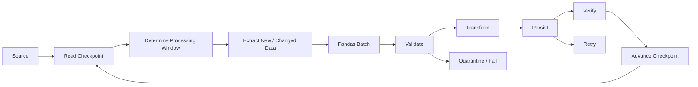
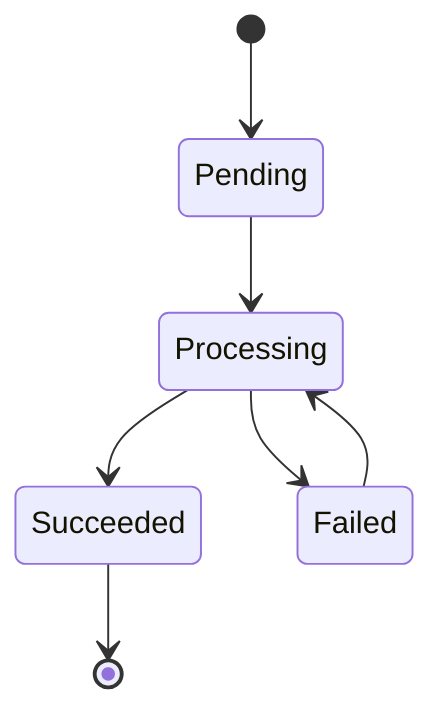
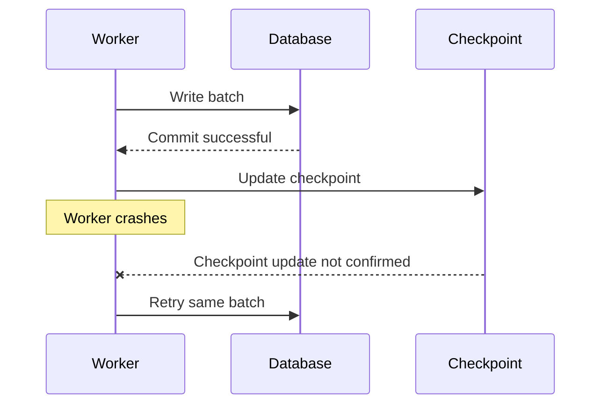
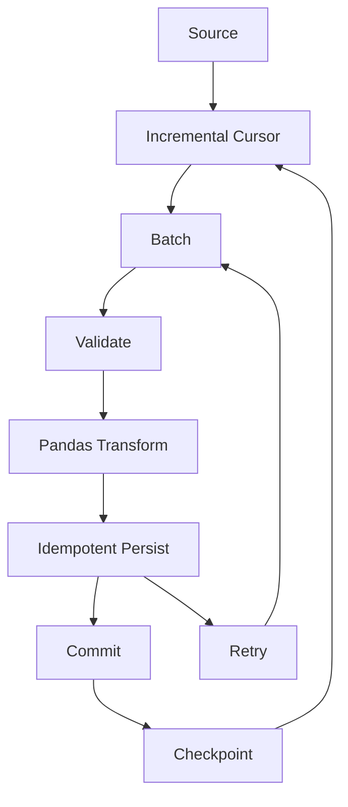
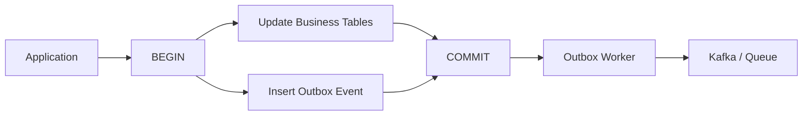
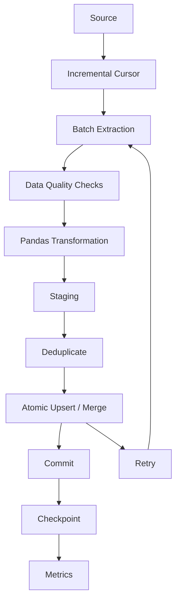
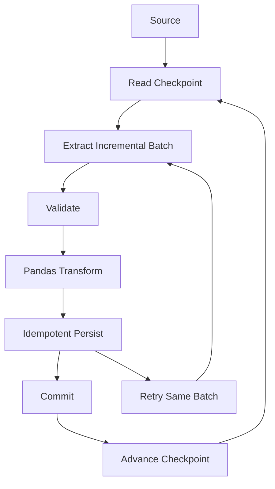
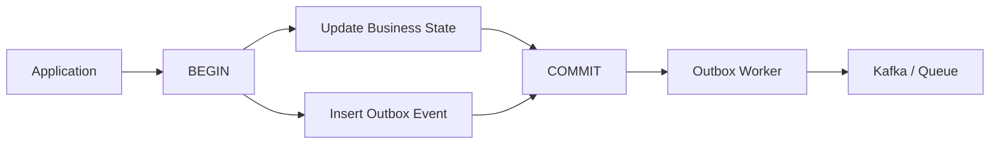
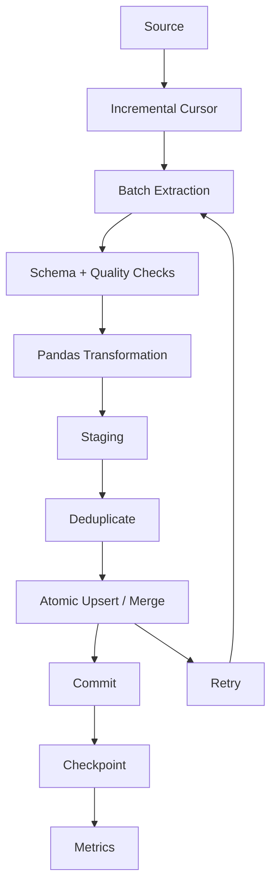

# 11- Incremental Processing

## Overview

Incremental processing handles only the data that is new, changed, or otherwise relevant since the previous successful processing point.

A full-refresh pipeline repeatedly processes the entire dataset:

```text
source
  ↓
read everything
  ↓
transform everything
  ↓
write everything
```

An incremental pipeline maintains durable progress:

```text
last successful position
        ↓
identify new / changed data
        ↓
extract
        ↓
validate
        ↓
transform
        ↓
persist
        ↓
verify
        ↓
advance checkpoint
```

The primary benefit is that the amount of work becomes proportional to the change volume rather than the historical dataset size.

For Pandas-based backend and data-engineering workloads, incremental processing is usually combined with:

```text
Pandas
+
SQL
+
batch processing
+
idempotent writes
+
checkpointing
+
data-quality checks
```

Pandas performs the in-memory transformation. The surrounding architecture determines which records Pandas receives, how progress is tracked, and how results become durable.

---

## Full Refresh vs Incremental Processing

| Strategy | Processing Scope | Advantages | Limitations |
|---|---|---|---|
| Full refresh | Entire dataset | Simple, deterministic | Cost grows with total data |
| Insert-only incremental | New records | Efficient and simple | Does not detect updates |
| Update-aware incremental | New and changed records | Handles mutable entities | Requires change tracking |
| Upsert | New records plus updates | Strong retry behavior | More destination logic |
| CDC | Explicit source changes | Captures inserts, updates, deletes | Additional infrastructure |
| Partition-based incremental | New files/partitions | Natural for data lakes | Requires reliable partitioning |
| Hybrid | Incremental + periodic reconciliation/rebuild | Strong operational recovery | Higher complexity |

Incremental processing is most valuable when:

```text
total historical data
≫
new or changed data per run
```

For a small dataset, a full refresh can still be the better engineering choice because it is simpler and easier to reason about.

---

## Why Incremental Processing Matters

Consider a PostgreSQL orders table with:

```text
500 million historical rows
```

and:

```text
1 million changed rows per day
```

A full refresh may repeatedly scan and transform:

```text
500 million rows
```

to obtain:

```text
1 million useful changes
```

An incremental pipeline aims to process approximately:

```text
1 million changed rows
```

instead.

This reduces:

```text
database reads
network transfer
Pandas memory usage
CPU consumption
destination writes
job duration
retry cost
```

The savings become increasingly important as the historical dataset grows.

---

## Incremental Processing Architecture

A production design commonly looks like:



The key invariant is:

```text
checkpoint = last source position known to be durably processed
```

A checkpoint should never represent merely attempted work.

---

## Sources of Incremental State

An incremental system needs a reliable signal that tells it what has changed.

Common mechanisms include:

```text
created_at
updated_at
monotonic ID
sequence number
version number
database log position
CDC position
Kafka offset
API cursor
file partition
```

| Mechanism | Typical Use | Important Consideration |
|---|---|---|
| `created_at` | Append-only records | Cannot detect later updates |
| `updated_at` | Mutable entities | Must change on every relevant update |
| Monotonic ID | Append-only tables | Does not represent updates |
| Sequence | Ordered source systems | Requires source support |
| Version number | Versioned records | Must be updated reliably |
| CDC position | Database changes | Requires CDC infrastructure |
| Kafka offset | Event streams | Scoped to Kafka partitions |
| API cursor | Incremental APIs | Depends on API semantics |
| Partition | Parquet/data lake workloads | Depends on correct partition creation |

The best incremental key is a source-native ordering or change indicator with clearly defined semantics.

---

## Append-Only Incremental Processing

For immutable records, a creation timestamp or increasing identifier is often sufficient.

```sql
SELECT
    order_id,
    customer_id,
    amount,
    created_at
FROM orders
WHERE created_at > :watermark
ORDER BY created_at, order_id;
```

This works well for:

```text
event tables
immutable transactions
append-only facts
audit records
```

The source contract must guarantee that records are not modified later.

---

## Update-Aware Incremental Processing

For mutable records, use a reliable update indicator.

```sql
SELECT
    order_id,
    customer_id,
    amount,
    status,
    updated_at
FROM orders
WHERE updated_at > :watermark
ORDER BY updated_at, order_id;
```

This can capture:

```text
new rows
+
changed rows
```

only when all relevant source mutations update `updated_at`.

A column named `updated_at` is not automatically a valid change detector. The write path must enforce its semantics.

---

## Timestamp Watermarks

A watermark represents the last successfully processed source position.

Example:

```text
last_updated_at =
2026-09-12T15:00:00Z
```

A simple query might use:

```sql
WHERE updated_at > :watermark
```

This is easy to understand, but timestamp-only watermarks have an important weakness:

```text
timestamps are not necessarily unique
```

For example:

```text
order A → 15:00:00
order B → 15:00:00
order C → 15:00:00
```

A checkpoint containing only:

```text
15:00:00
```

cannot identify exactly which records at that timestamp were processed.

---

## Composite Watermarks

A stronger cursor combines the timestamp with a unique ordering key.

Example:

```text
(updated_at, order_id)
```

Query:

```sql
SELECT
    order_id,
    customer_id,
    amount,
    status,
    updated_at
FROM orders
WHERE
    updated_at > :last_updated_at
    OR (
        updated_at = :last_updated_at
        AND order_id > :last_order_id
    )
ORDER BY
    updated_at,
    order_id
LIMIT :batch_size;
```

This creates a deterministic position in the source ordering.

Composite cursors are especially useful for:

```text
keyset pagination
large tables
high-volume incremental extraction
timestamp ties
```

---

## High Watermarks

A high watermark defines the upper boundary of the current processing run.

The pattern is:

```text
current checkpoint
        ↓
determine high watermark
        ↓
process checkpoint → high watermark
        ↓
persist successfully
        ↓
advance checkpoint
```

Example:

```text
current checkpoint = 15:00

high watermark = 16:00

process:
(15:00, 16:00]

new checkpoint:
16:00
```

New records after 16:00 are intentionally deferred to the next run.

This gives the current run a stable logical boundary.

---

## Why Bounded Windows Matter

An unbounded query such as:

```sql
WHERE updated_at > :checkpoint
```

can observe source changes while the job is running.

A bounded query is easier to reason about:

```sql
WHERE updated_at > :start
  AND updated_at <= :end
```

The pipeline processes a fixed logical interval rather than a continuously moving source.

This is especially useful when:

```text
source data changes frequently
job duration is significant
multiple workers may run
exact restart semantics matter
```

---

## Selecting a High Watermark

A simple source may provide:

```sql
SELECT MAX(updated_at)
FROM orders
WHERE updated_at > :checkpoint;
```

The result becomes the upper boundary.

For higher-throughput systems, stronger source-native positions may exist:

```text
database sequence
transaction log position
CDC offset
Kafka offset
version number
```

Prefer a change position that reflects actual source ordering over a timestamp when the source provides one.

---

## Keyset Pagination

A large incremental window should still be processed in bounded batches.

Avoid:

```sql
SELECT
    order_id,
    customer_id,
    amount
FROM orders
ORDER BY order_id
OFFSET 5000000
LIMIT 100000;
```

Prefer:

```sql
SELECT
    order_id,
    customer_id,
    amount
FROM orders
WHERE order_id > :last_order_id
ORDER BY order_id
LIMIT :batch_size;
```

Keyset pagination provides:

- A natural resume point
- Predictable progress
- Better large-table behavior
- A checkpoint-friendly cursor

The query should be supported by a suitable index.

---

## PostgreSQL Indexing

For a composite incremental cursor:

```sql
CREATE INDEX idx_orders_incremental
ON orders (
    updated_at,
    order_id
);
```

The index design should match:

```text
filter predicates
+
sort order
+
query selectivity
```

Inspect the actual query plan when performance matters:

```sql
EXPLAIN (ANALYZE, BUFFERS)
SELECT
    order_id,
    customer_id,
    amount,
    updated_at
FROM orders
WHERE
    updated_at > :last_updated_at
ORDER BY
    updated_at,
    order_id
LIMIT 100000;
```

An incremental query that still performs a large table scan is not operationally efficient.

---

## Incremental SQL with Pandas

Pandas can process the incremental source in chunks:

```python
import pandas as pd
from sqlalchemy import text


query = text(
    """
    SELECT
        order_id,
        customer_id,
        amount,
        status,
        updated_at
    FROM orders
    WHERE
        updated_at > :start_time
        AND updated_at <= :end_time
    ORDER BY
        updated_at,
        order_id
    """
)

for batch in pd.read_sql_query(
    query,
    engine,
    params={
        "start_time": start_time,
        "end_time": end_time,
    },
    chunksize=100_000,
):
    validate_batch(batch)

    transformed = transform_batch(
        batch
    )

    persist_batch(transformed)
```

This combines two different boundaries:

```text
incremental window
→ which records should be processed

chunksize
→ how many rows Pandas processes at once
```

---

## Incremental Processing and Batch Processing

These concepts should be kept distinct.

```text
Incremental processing:
"Which records should I process?"

Batch processing:
"How much of those records should I process at once?"
```

A production pipeline commonly uses both:

```text
new/changed records
        ↓
incremental window
        ↓
100,000-row Pandas chunks
        ↓
transform
        ↓
persist
```

This distinction is important when designing memory-safe ETL systems.

---

## Pandas Transformation Boundary

Incremental extraction should not leak into transformation logic.

```python
def transform_orders(
    orders: pd.DataFrame,
) -> pd.DataFrame:
    result = orders.copy()

    result["updated_at"] = pd.to_datetime(
        result["updated_at"],
        utc=True,
        errors="raise",
    )

    result["amount"] = pd.to_numeric(
        result["amount"],
        errors="raise",
    )

    result["status"] = (
        result["status"]
        .astype("string")
        .str.strip()
        .str.lower()
    )

    return result
```

The transformation can then be reused for:

```text
normal incremental runs
backfills
reprocessing
tests
reconciliation
```

This separation improves maintainability and testing.

---

## Incremental Validation

Every incremental batch should still be validated.

Typical checks include:

```text
required columns
dtypes
nullability
duplicate keys
allowed categories
numeric ranges
datetime consistency
referential integrity
```

Example:

```python
def validate_batch(
    batch: pd.DataFrame,
) -> None:
    required = {
        "order_id",
        "customer_id",
        "amount",
        "updated_at",
    }

    missing = required.difference(
        batch.columns
    )

    if missing:
        raise ValueError(
            f"Missing required columns: "
            f"{sorted(missing)}"
        )

    if batch["order_id"].isna().any():
        raise ValueError(
            "order_id cannot be null"
        )

    if batch["order_id"].duplicated().any():
        raise ValueError(
            "Duplicate order_id values found"
        )

    if batch["amount"].lt(0).any():
        raise ValueError(
            "Negative amounts found"
        )
```

The reduced batch size does not justify weaker quality controls.

---

## Empty Incremental Windows

A run may legitimately discover no new data.

Example:

```text
checkpoint:
15:00

high watermark:
16:00

rows:
0
```

The pipeline should distinguish this from:

```text
source unavailable
```

or:

```text
missing partition
```

Example handling:

```python
if batch.empty:
    logger.info(
        "no_incremental_changes",
        extra={
            "start": start_time,
            "end": end_time,
        },
    )
```

Whether the checkpoint should advance after an empty window depends on what the high watermark represents.

---

## Late-Arriving Data

Incremental processing becomes more complicated when event time and arrival time differ.

Example:

```text
event_time  = 14:00
arrival     = 15:10
```

Suppose the pipeline already finalized:

```text
14:00 → 15:00
```

A query using only `event_time` may never see the late record.

When available, distinguish:

```text
event time
```

from:

```text
ingestion time
```

This allows the pipeline to reason separately about when an event happened and when it became visible.

---

## Overlap Windows

One strategy for late-arriving data is deliberate overlap.

Example:

```text
previous checkpoint:
15:00

overlap:
10 minutes

next extraction:
14:50 → 16:00
```

This causes intentional reprocessing.

Therefore the architecture must combine:

```text
overlap
+
idempotent writes
```

An overlap window is useful when:

- Late data is expected.
- Reprocessing is acceptable.
- Records have stable identifiers.
- The destination is idempotent.

---

## Overlap vs Exact Watermark

| Strategy | Advantage | Limitation |
|---|---|---|
| Exact cursor | Minimal reprocessing | Vulnerable to certain late-data patterns |
| Overlap window | More tolerant of delayed arrivals | Reprocesses records |
| CDC | Captures explicit changes | More infrastructure |
| Periodic reconciliation | Detects missed data later | Correction is delayed |

No single strategy is universally correct.

The source's ordering and delivery guarantees should determine the design.

---

## Idempotent Writes

Incremental pipelines must tolerate repeated processing.

Failure scenario:

```text
1. Extract incremental window
2. Write destination
3. Destination commit succeeds
4. Worker crashes
5. Checkpoint update does not complete
6. Same window runs again
```

Without idempotency, the destination can contain duplicates or incorrect state.

Common mechanisms include:

```text
UNIQUE constraints
UPSERT
MERGE
source event IDs
batch IDs
deterministic output partitions
staging + merge
```

A practical production strategy is:

```text
at-least-once processing
+
idempotent side effects
```

---

## PostgreSQL Upserts

For mutable entities:

```sql
INSERT INTO orders (
    order_id,
    customer_id,
    amount,
    status,
    updated_at
)
VALUES (
    :order_id,
    :customer_id,
    :amount,
    :status,
    :updated_at
)
ON CONFLICT (order_id)
DO UPDATE SET
    customer_id = EXCLUDED.customer_id,
    amount = EXCLUDED.amount,
    status = EXCLUDED.status,
    updated_at = EXCLUDED.updated_at;
```

The destination should normally enforce:

```sql
PRIMARY KEY (order_id)
```

so uniqueness is protected at the database boundary.

---

## Deletes

Deletes are a common source of stale data in incremental pipelines.

Consider:

```text
source:
customer C-100 exists
```

Then:

```text
customer C-100 is physically deleted
```

A query such as:

```sql
WHERE updated_at > :watermark
```

cannot return a row that no longer exists.

Possible mechanisms include:

```text
deleted_at
soft-delete flag
CDC delete event
tombstone
change table
audit log
periodic reconciliation
```

A complete incremental design must define delete semantics explicitly.

---

## Soft Deletes

A soft-delete model preserves the deletion event:

```text
customer_id = C-100
deleted_at = 2026-09-12T14:30:00Z
```

The change can then flow through normal incremental extraction:

```sql
SELECT
    customer_id,
    email,
    deleted_at,
    updated_at
FROM customers
WHERE updated_at > :watermark;
```

The destination can mark the entity inactive or deleted without requiring the pipeline to discover a physically missing row.

---

## Change Data Capture

CDC captures source-side changes directly.

Typical architecture:


CDC can represent:

```text
INSERT
UPDATE
DELETE
```

and often provides a more precise source position than polling timestamps.

CDC is useful when:

```text
update/delete detection is critical
latency requirements are low
source volume is high
polling is inefficient
```

The trade-off is greater infrastructure and operational complexity.

---

## Incremental Processing with Kafka

Kafka offers partition-specific offsets as incremental positions.

Conceptually:

```text
offset:
0 1 2 3 4 5 6 7 8 9
        ↑
   committed offset
```

A micro-batch pipeline can use:

```text
poll records
    ↓
build DataFrame
    ↓
validate
    ↓
transform
    ↓
persist
    ↓
commit offset
```

The offset should advance only after the processing guarantees for those records are satisfied.

---

## Incremental REST API Processing

APIs may expose:

```text
updated_since
cursor
page token
sequence number
version
```

Example:

```python
response = client.get_orders(
    updated_since=watermark,
    limit=500,
)
```

Production concerns include:

```text
pagination
429 rate limits
timeouts
cursor expiration
duplicate pages
partial failures
schema changes
```

Persist the API cursor only after the corresponding data has been processed successfully.

---

## Incremental Parquet Processing

For data lakes, incremental processing may be partition-oriented.

Example:

```text
s3://analytics/orders/
    year=2026/
        month=09/
            day=10/
            day=11/
            day=12/
```

Instead of rescanning all historical data:

```text
discover new partition
    ↓
validate
    ↓
transform with Pandas
    ↓
write output
    ↓
publish
    ↓
mark partition complete
```

This is especially useful when partition boundaries align with the source's natural ingestion process.

---

## Partition Tracking

A durable metadata record can contain:

```text
dataset
partition
status
started_at
completed_at
row_count
quality_status
pipeline_version
```

Example states:



This provides explicit operational state instead of inferring completion only from file existence.

---

## Atomic Publishing

Avoid exposing partially generated output as completed data.

A common pattern is:

```text
temporary output
      ↓
validate
      ↓
publish final output
      ↓
record completion
```

Conceptually:

```text
staging/orders/2026-09-12/
        ↓
quality checks
        ↓
published/orders/2026-09-12/
```

The exact atomicity guarantees depend on the storage system, but the principle remains:

```text
publish complete data
not partially written data
```

---

## Incremental Aggregation

Some derived metrics can be updated incrementally.

For example, calculate customer revenue only for new transactions:

```python
revenue_delta = (
    transactions
    .groupby(
        "customer_id",
        as_index=False,
    )
    .agg(
        revenue_delta=(
            "amount",
            "sum",
        )
    )
)
```

Instead of recomputing:

```text
all historical transactions
```

the pipeline applies:

```text
new revenue delta
```

to the existing aggregate.

This is especially effective for:

```text
sum
count
```

and other metrics for which sufficient incremental state can be maintained.

---

## Incremental Aggregation with Updates

Mutable source records require delta-aware processing.

Suppose:

```text
old amount = 100
new amount = 150
```

The aggregate should apply:

```text
+50
```

not:

```text
+150
```

This means the pipeline may need both:

```text
old state
+
new state
```

or another source event model capable of expressing the change.

Incremental aggregation is therefore significantly more complex for mutable facts than for immutable append-only events.

---

## Metrics That Need Global State

Some calculations cannot be safely maintained from independent batch results.

Examples:

```text
exact median
exact percentile
global ranking
global sort
exact distinct count
```

For example, averaging batch medians does not produce the global median.

Use one of:

```text
maintained sufficient state
approximation
database-side calculation
specialized algorithm
periodic full recomputation
```

Do not force every analytical operation into an incremental model.

---

## Checkpoint State

A production checkpoint might contain:

```text
pipeline:
orders_incremental

source:
postgresql.orders

last_updated_at:
2026-09-12T16:00:00Z

last_order_id:
5832101

status:
succeeded

pipeline_version:
4.3.0
```

Useful checkpoint properties are:

```text
durable
auditable
versioned
concurrency-safe
recoverable
```

The checkpoint is part of the pipeline's correctness state, not merely an operational convenience.

---

## Checkpoint Ordering

The correct processing order is:

```text
extract
    ↓
validate
    ↓
transform
    ↓
persist
    ↓
verify / commit
    ↓
advance checkpoint
```

The incorrect order is:

```text
extract
    ↓
advance checkpoint
    ↓
persist
```

If the process fails after the checkpoint update but before persistence, records may be skipped permanently.

---

## Checkpoint Storage

Typical checkpoint stores include:

| Store | Good Fit |
|---|---|
| PostgreSQL | Relational ETL and transactional pipelines |
| DynamoDB | Highly available distributed workflows |
| Kafka offset | Kafka consumers |
| Workflow metadata store | Airflow and orchestrated pipelines |
| S3/object storage | File-oriented state where consistency is sufficient |
| Redis | Coordination or short-lived state; not usually the sole durable checkpoint |

Choose based on:

```text
durability
consistency
availability
concurrency
operational model
```

---

## Transactional Checkpointing

When destination writes and checkpoint state are in the same transactional database, both can sometimes be committed atomically:

```text
BEGIN
    ↓
write destination
    ↓
update checkpoint
    ↓
COMMIT
```

A failure causes:

```text
destination rollback
+
checkpoint rollback
```

This removes an entire class of partial-progress problems.

When systems are separate:

```text
source
+
S3
+
PostgreSQL
+
Kafka
```

there is typically no global transaction. Idempotency and reconciliation become much more important.

---

## Concurrent Workers

Two workers must not independently consume the same checkpoint without coordination.

Example:

```text
Worker A:
checkpoint = 100
→ processing 100–200

Worker B:
checkpoint = 100
→ processing 100–150
```

Possible problems:

```text
duplicate work
duplicate writes
checkpoint regression
race conditions
```

Possible solutions include:

```text
single logical owner
distributed lock
lease
row-level lock
compare-and-set
partition ownership
orchestrator coordination
```

---

## Checkpoint Regression

A particularly dangerous race is:

```text
Worker A commits:
checkpoint = 200

Worker B commits later:
checkpoint = 150
```

The pipeline has moved backward.

Checkpoint updates should therefore enforce a monotonic-progress invariant:

```text
new checkpoint >= current checkpoint
```

Implementation options include:

```text
row locking
optimistic concurrency
compare-and-set
single-writer ownership
```

---

## Reconciliation

Incremental pipelines should have an independent correctness mechanism.

For example:

```text
incremental processing
→ every 15 minutes

quality monitoring
→ every run

reconciliation
→ daily

deep rebuild
→ periodic
```

Reconciliation can compare:

```text
row counts
aggregate totals
key ranges
checksums
partition completeness
sampled records
```

This catches errors that do not necessarily cause the incremental job itself to fail.

---

## Why Reconciliation Matters

An incremental pipeline can report:

```text
status = succeeded
```

while still being wrong.

For example, a broken watermark can silently skip:

```text
5,000 records
```

and every future run may continue successfully from the wrong checkpoint.

Reconciliation introduces an independent correctness signal.

---

## Periodic Full Refreshes

Incremental processing does not eliminate the value of full rebuilds.

A mature system can combine:

```text
incremental processing
+
periodic reconciliation
+
occasional full rebuild
```

A full rebuild can recover from:

```text
checkpoint corruption
historical transformation bugs
incorrect source assumptions
schema interpretation changes
data corrections
```

This is particularly valuable for derived reporting datasets.

---

## Backfills

Backfills should be first-class operations.

Normal execution:

```text
current checkpoint
→
high watermark
```

Backfill:

```text
2026-01-01
→
2026-03-01
```

Design processing around explicit boundaries:

```python
def process_window(
    start_time: pd.Timestamp,
    end_time: pd.Timestamp,
) -> None:
    ...
```

Reuse the same:

```text
validation
transformation
persistence
quality checks
```

rather than building a separate code path for historical data.

---

## Handling Source Corrections

Incremental pipelines must support changes to previously processed data.

Example:

```text
original amount:
100

corrected amount:
120
```

For mutable entities:

```text
updated_at
+
upsert
```

may be appropriate.

For immutable event streams:

```text
correction event
```

may be the correct design.

The source's data model determines the right solution.

---

## Incremental Data Quality

Track quality metrics at both:

```text
batch level
```

and:

```text
historical level
```

Useful metrics include:

```text
rows inserted
rows updated
rows deleted
invalid rows
duplicate rate
null rate
rejected rows
reconciliation status
```

For example:

```text
normal update volume:
50,000–80,000/hour

current:
2,400,000/hour
```

The spike may indicate:

```text
source replay
bulk migration
upstream bug
timestamp corruption
large correction
```

---

## Freshness and Lag

Incremental processing improves efficiency but does not guarantee freshness.

Track:

```text
source latest position
destination latest position
pipeline checkpoint
processing lag
```

Example:

```text
source:
16:00

checkpoint:
15:20

lag:
40 minutes
```

Compare this against the service-level expectation.

A pipeline that is alive but no longer advances its checkpoint is operationally unhealthy.

---

## Monitoring Stalled Progress

Useful operational signals include:

```text
last successful batch
last checkpoint update
current source position
current destination position
processing duration
rows processed
```

A useful alert is:

```text
time since checkpoint advancement
>
expected processing interval
```

This is usually more meaningful than checking whether a container or process is merely running.

---

## Performance Considerations

Incremental processing reduces work, but poor source queries can still dominate runtime.

Pay attention to:

```text
indexing
predicate selectivity
column projection
batch size
serialization
Pandas transformations
destination throughput
```

An incremental query that scans the entire source table is often not meaningfully incremental from a database-resource perspective.

---

## Predicate Design

Prefer direct range predicates:

```sql
WHERE updated_at >= :start
  AND updated_at < :end
```

over expressions applied to indexed columns:

```sql
WHERE DATE(updated_at) = :target_date
```

Range predicates are generally easier for relational databases to optimize with ordinary indexes.

Always verify actual behavior using the database's query planner.

---

## Memory Efficiency

A robust incremental pipeline typically combines:

```text
source-side filtering
+
projection
+
bounded batches
+
appropriate dtypes
+
vectorized transformations
```

Example:

```python
for batch in pd.read_sql_query(
    query,
    engine,
    params=params,
    chunksize=100_000,
):
    batch["amount"] = pd.to_numeric(
        batch["amount"],
        errors="raise",
    )

    process_batch(batch)
```

Avoid creating large temporary DataFrames unless the transformation genuinely requires them.

---

## Incremental Processing with Celery

A backend service can delegate incremental work to a Celery worker:


The web request should normally create or inspect a job instead of holding a connection open for a long-running Pandas operation.

Celery task arguments should contain compact references such as:

```text
pipeline ID
source range
checkpoint ID
S3 path
partition
```

Do not send giant DataFrames through the broker.

---

## Incremental Processing with Kubernetes

A Kubernetes CronJob can execute a recurring incremental pipeline:

```text
CronJob
   ↓
Job
   ↓
read durable checkpoint
   ↓
extract changes
   ↓
process Pandas batches
   ↓
persist
   ↓
checkpoint
```

Pod replacement or rescheduling should not lose progress.

That requires:

```text
durable checkpoint
+
idempotent destination
+
restart-safe job design
```

---

## AWS Architecture

A typical AWS-oriented design may look like:

```text
PostgreSQL / REST API / Kafka
          ↓
Incremental extraction
          ↓
ECS / AWS Batch
          ↓
Pandas
          ↓
S3 Parquet
          ↓
Warehouse / Reporting
```

S3 can provide durable storage for:

```text
raw data
incremental outputs
quarantine records
reprocessing inputs
```

Checkpoint state may live in:

```text
PostgreSQL
DynamoDB
workflow metadata
```

depending on consistency and coordination requirements.

---

## Cost Considerations

Incremental processing can substantially reduce:

```text
database reads
network transfer
compute time
storage reads
destination writes
job runtime
```

However, it introduces additional engineering requirements:

```text
checkpoint management
delete handling
late-arriving data
reconciliation
backfills
idempotency
```

For a small source, the operational complexity of incremental processing can cost more than the infrastructure savings.

---

## Reliability Questions

A production incremental system should have explicit answers to:

```text
What has definitely been processed?

What happens if the worker crashes?

What happens if the same range runs twice?

What happens if a source record arrives late?

What happens if a record is deleted?

What happens if the source corrects old data?

What happens if two workers run simultaneously?

How can historical data be rebuilt?
```

If these questions are unresolved, the incremental design is incomplete.

---

## Disaster Recovery

A recoverable incremental system should retain:

```text
source history or replayable source data
checkpoint state
batch metadata
pipeline version
destination state
quality results
```

Recovery can then follow:

```text
restore or identify valid checkpoint
        ↓
reprocess explicit range
        ↓
idempotent write
        ↓
reconcile
```

This is safer than manually repairing a destination without knowing the exact source processing position.

---

## Security Considerations

Incremental pipelines often process sensitive information continuously.

Protect:

```text
database credentials
API credentials
cloud credentials
PII
financial records
customer identifiers
quarantine data
checkpoint metadata
```

Use:

```text
IAM roles
secret managers
TLS
encryption at rest
least-privilege access
log redaction
retention policies
```

Checkpoint records should contain only the metadata necessary to resume processing.

---

## Testing Incremental Processing

Tests should cover incremental behavior, not just transformation functions.

Important scenarios include:

```text
first run
normal incremental run
empty window
timestamp ties
late-arriving record
update
delete
duplicate source record
destination failure
checkpoint failure
retry after successful destination write
checkpoint regression
backfill
concurrent execution
```

Example:

```python
def test_checkpoint_does_not_advance_on_write_failure(
    monkeypatch,
) -> None:
    initial_checkpoint = {
        "updated_at": "2026-09-12T15:00:00Z",
        "order_id": 100,
    }

    monkeypatch.setattr(
        "pipeline.persist_batch",
        lambda batch: (
            _raise_destination_error()
        ),
    )

    run_incremental(
        checkpoint=initial_checkpoint
    )

    assert load_checkpoint() == (
        initial_checkpoint
    )
```

The important invariant is:

```text
failed persistence
→
checkpoint unchanged
```

Test checkpoint behavior as seriously as transformation behavior.

---

## Common Mistakes

### Treating `updated_at` as Automatically Reliable

A timestamp is only useful when every relevant mutation updates it correctly.

### Using a Timestamp Without a Tie-Breaker

Multiple records may share the same timestamp.

### Advancing the Checkpoint Before Persistence

A failure can cause permanent data loss.

### Ignoring Deletes

The destination may retain records that no longer exist in the source.

### Ignoring Late-Arriving Data

Strict event-time windows can miss delayed records.

### Reprocessing Overlaps Without Idempotency

Overlap intentionally creates repeated processing.

### Allowing Checkpoint Regression

Concurrent workers can overwrite newer progress with stale state.

### Storing Checkpoints Only in Logs

Logs are not a durable transactional progress mechanism.

### Recomputing Full History in Every Incremental Run

That defeats the performance benefit of incremental processing.

### Incrementally Updating Complex Metrics Without Global State

Some statistics cannot be correctly maintained from isolated per-batch calculations.

### Forgetting Backfills

A pipeline that only supports "current checkpoint to now" is difficult to repair.

### Assuming Incremental Always Means Fast

Poor indexes, large joins, expensive transformations, or destination bottlenecks can still dominate processing time.

---

## Production Checklist

```text
[ ] Source change semantics are documented
[ ] New records are identified reliably
[ ] Updates are identified reliably
[ ] Deletes are handled explicitly
[ ] Watermark or cursor semantics are documented
[ ] Composite cursor is used where timestamps are not unique
[ ] High watermark is deterministic
[ ] Incremental windows are bounded where appropriate
[ ] Late-arriving data has an explicit strategy
[ ] Overlap windows use idempotent writes
[ ] Destination writes are retry-safe
[ ] Database constraints enforce uniqueness where appropriate
[ ] Checkpoint state is durable
[ ] Checkpoint advances only after successful persistence
[ ] Checkpoint updates are concurrency-safe
[ ] Large incremental windows use bounded Pandas batches
[ ] Source queries are indexed and benchmarked
[ ] Required columns are projected at extraction time
[ ] Incremental batches pass data-quality checks
[ ] Processing lag is monitored
[ ] Checkpoint advancement is monitored
[ ] Insert/update/delete volume is monitored
[ ] Reconciliation exists
[ ] Backfills support explicit source ranges
[ ] Pipeline version is recorded
[ ] Recovery procedures are documented
[ ] Sensitive metadata is protected
[ ] Source history is replayable where required
[ ] Tests cover retries, deletes, late data, and checkpoint failures
```

## Interview Perspective

### What Is Incremental Processing?

Incremental processing processes only newly created, changed, or otherwise relevant records since a known durable source position instead of rebuilding the complete dataset.

### Why Is It More Efficient Than Full Refresh?

The amount of processing becomes proportional to the change set rather than the historical dataset size, reducing source reads, network transfer, memory usage, CPU, and writes.

### What Is a Watermark?

A watermark is a durable source position representing data that has been successfully processed and persisted.

### Why Use a Composite Watermark?

A timestamp may not uniquely identify records. Combining it with a unique key provides deterministic ordering and a precise resume point.

### What Is a High Watermark?

A high watermark defines the upper boundary of the current incremental processing window, creating a stable range that does not move while the job is running.

### What Is the Difference Between Incremental and Batch Processing?

Incremental processing defines **which records** should be processed. Batch processing defines **how much of those records** should be processed at one time. Production pipelines frequently use both.

### How Do You Handle Late-Arriving Data?

Use ingestion timestamps, overlap windows, CDC, replayable source data, or periodic reconciliation depending on source guarantees and latency requirements.

### How Do You Handle Deletes?

Use soft-delete markers, CDC events, tombstones, source change tables, audit logs, or periodic reconciliation. A simple `updated_at` query cannot detect a physically deleted row.

### How Do You Make Incremental Processing Retry-Safe?

Persist the checkpoint only after successful persistence and make destination effects idempotent through mechanisms such as unique constraints and upserts.

### What Happens if the Worker Crashes After a Successful Destination Commit but Before the Checkpoint?

The range may be processed again. The destination must safely absorb the repeated work.

### How Do You Prevent Checkpoint Regression?

Use a single owner, locking, leases, compare-and-set updates, or another concurrency-control mechanism that prevents stale workers from overwriting newer progress.

### Why Is Reconciliation Necessary?

An incremental job can succeed operationally while silently skipping data because of a broken watermark, late-arriving records, deletes, or source changes. Reconciliation provides an independent correctness signal.

### How Would You Process a Large PostgreSQL Table Incrementally with Pandas?

Use an indexed incremental predicate, preferably a deterministic composite cursor or bounded time window, project only required columns, read in chunks, validate and transform with Pandas, persist idempotently, and advance the checkpoint only after success.

### When Should CDC Be Preferred Over Timestamp Polling?

Use CDC when accurate update/delete detection, lower latency, or high source volume makes timestamp-based polling unreliable or inefficient.

### Which Metrics Are Difficult to Maintain Incrementally?

Exact median, exact percentile, global ranking, global sorting, and some distinct-count calculations usually require additional state, approximation, or periodic recomputation.

### When Is Full Refresh Still Appropriate?

When the dataset is small, reliable change tracking is unavailable, transformations depend heavily on global state, or periodic rebuilding is intentionally part of the correctness strategy.

## Key Takeaways

- Incremental processing reduces work by processing only new or changed data, but correctness depends on a reliable source position and explicit change semantics.
- Durable checkpoints, deterministic high-watermark windows, composite cursors, and checkpoint-after-success provide the foundation for restartable pipelines.
- Production systems must explicitly handle updates, deletes, late-arriving data, retries, and concurrent workers; `updated_at > watermark` alone is rarely sufficient.
- Idempotent writes, data-quality validation, monitoring, reconciliation, and backfill support turn incremental processing into a reliable production pattern rather than just a performance optimization.
- Pandas should process bounded incremental batches while PostgreSQL, APIs, Kafka, Parquet, Celery, Kubernetes, and AWS provide the surrounding extraction, persistence, orchestration, and recovery mechanisms.
```
```

```
Markdown


```
# 12- Idempotent Data Processing

## Overview

Idempotent data processing means that executing the same logical operation multiple times produces the same final state as executing it once.

This property is fundamental to reliable ETL and backend data pipelines because retries are normal:

```text
network timeout
database failure
worker restart
container replacement
message redelivery
checkpoint failure
scheduler retry
```

A pipeline should therefore be designed around:

```text
at-least-once execution
        +
idempotent side effects
        ↓
safe retries
```

For Pandas-based systems, idempotency is not primarily a Pandas feature. Pandas performs transformations in memory; idempotency is an end-to-end property involving:

```text
source
→ extraction
→ Pandas transformation
→ persistence
→ checkpointing
→ downstream effects
```

The objective is not necessarily to guarantee that code executes only once. The objective is to guarantee that repeated execution does not corrupt the final result.

---

## What Idempotency Means

Consider an operation:

```text
F(data)
```

It is idempotent when:

```text
F(F(data)) = F(data)
```

For data pipelines, this means:

```text
process(batch)
process(batch)
```

should produce the same final destination state as:

```text
process(batch)
```

The implementation may execute twice. The important property is that the externally observable result remains correct.

---

## Why Idempotency Matters

Distributed systems cannot reliably assume that every operation executes exactly once.

A typical failure sequence is:



The retry is normal.

Without idempotency:

```text
100 orders
→
100 inserted
→
retry
→
another 100 inserted
→
200 orders
```

With idempotency:

```text
100 orders
→
100 inserted
→
retry
→
same 100 logical records
→
still 100 orders
```

This is why idempotency is one of the most important reliability properties in batch and incremental processing.

---

## Idempotency vs Exactly-Once

These concepts are often confused.

| Concept | Meaning |
|---|---|
| At-most-once | A record is attempted no more than once |
| At-least-once | A record may be attempted multiple times |
| Exactly-once execution | The operation executes only once |
| Idempotent effect | Repeated execution produces the same final result |

A practical production architecture commonly prefers:

```text
at-least-once processing
+
idempotent side effects
```

because exactly-once execution across multiple independent systems is difficult to guarantee.

For example:

```text
PostgreSQL
+
Kafka
+
S3
+
Pandas worker
```

do not normally share one global transaction.

Idempotency provides a practical way to make retries safe across such boundaries.

---

## Where Idempotency Matters

Idempotency should be considered at every state-changing boundary.

```text
API ingestion
database writes
file publishing
object-storage outputs
message consumption
checkpoint updates
aggregate updates
notification side effects
```

A pipeline can have an idempotent transformation but still be non-idempotent overall.

Example:

```python
result = transform_orders(batch)
```

may be deterministic, but:

```python
insert_rows(result)
```

can still duplicate data.

The end-to-end side effect determines whether the workflow is idempotent.

---

## Deterministic Transformations

The first step is to make transformations deterministic whenever practical.

Example:

```python
import pandas as pd


def transform_orders(
    orders: pd.DataFrame,
) -> pd.DataFrame:
    result = orders.copy()

    result["amount"] = pd.to_numeric(
        result["amount"],
        errors="raise",
    )

    result["status"] = (
        result["status"]
        .astype("string")
        .str.strip()
        .str.lower()
    )

    return result
```

Given the same input DataFrame and the same transformation configuration, the output should be equivalent.

Avoid transformations that depend on uncontrolled state such as:

```text
current timestamp
random values
unordered external state
process-local counters
mutable global variables
```

unless those values are explicitly part of the deterministic input.

---

## Determinism vs Idempotency

Determinism and idempotency are related but different.

### Deterministic

Same input:

```text
X
```

produces the same output:

```text
F(X)
```

### Idempotent

Applying the operation repeatedly produces the same final state:

```text
F(F(X)) = F(X)
```

A deterministic transformation is helpful for idempotency, but persistence and orchestration still need to be designed correctly.

---

## Natural Keys

A stable business identifier is one of the strongest foundations for idempotent writes.

Examples:

```text
order_id
transaction_id
customer_id
invoice_number
event_id
```

Suppose:

```text
order_id = ORD-1001
```

is guaranteed to identify exactly one logical order.

The destination can enforce:

```sql
PRIMARY KEY (order_id)
```

This prevents repeated processing from creating duplicate logical records.

---

## Surrogate IDs vs Business IDs

A generated destination ID is not always an idempotency key.

For example:

```text
source order:
ORD-1001
```

may become:

```text
destination row:
id = 847392
```

On retry, the destination may generate:

```text
id = 847393
```

even though both rows represent the same source order.

Use a stable source or business key for deduplication:

```text
source order_id
```

rather than relying only on:

```text
database-generated integer ID
```

---

## Database Uniqueness Constraints

The strongest final defense is often a database constraint.

```sql
CREATE TABLE orders (
    order_id TEXT PRIMARY KEY,
    customer_id TEXT NOT NULL,
    amount NUMERIC(18, 2) NOT NULL
);
```

Now repeated writes of the same logical order cannot silently create another row.

Database constraints are valuable because:

```text
multiple application workers
+
retries
+
different services
```

may all write to the same destination.

Application-level assumptions alone are weaker than database-enforced invariants.

---

## UPSERT

A common idempotent pattern is:

```text
insert if new
update if existing
```

PostgreSQL example:

```sql
INSERT INTO orders (
    order_id,
    customer_id,
    amount,
    status
)
VALUES (
    :order_id,
    :customer_id,
    :amount,
    :status
)
ON CONFLICT (order_id)
DO UPDATE SET
    customer_id = EXCLUDED.customer_id,
    amount = EXCLUDED.amount,
    status = EXCLUDED.status;
```

The same logical input can be submitted multiple times without creating duplicate rows.

This is useful for:

```text
mutable entities
incremental ETL
API synchronization
retry-safe workers
backfills
```

---

## Insert-Only vs Upsert

| Pattern | Use When | Retry Behavior |
|---|---|---|
| Plain `INSERT` | New records with unique source IDs | Duplicate may fail |
| `INSERT ... ON CONFLICT DO NOTHING` | Immutable records | Repeated write becomes no-op |
| `INSERT ... ON CONFLICT DO UPDATE` | Mutable entities | Existing state is updated |
| `MERGE` | More complex matching logic | Explicit source-to-target reconciliation |
| Staging + merge | Large or complex ETL | Strong control and validation |

Choose the smallest pattern that preserves the required semantics.

---

## `DO NOTHING`

For immutable records, a repeated write can safely become a no-op.

```sql
INSERT INTO events (
    event_id,
    event_type,
    event_time
)
VALUES (
    :event_id,
    :event_type,
    :event_time
)
ON CONFLICT (event_id)
DO NOTHING;
```

This is useful when:

```text
event_id
```

uniquely identifies an immutable event.

Do not use `DO NOTHING` blindly for mutable data. It can silently discard legitimate updates.

---

## Conditional Upserts

For mutable records, do not necessarily overwrite the destination with older data.

Example:

```sql
INSERT INTO orders (
    order_id,
    status,
    updated_at
)
VALUES (
    :order_id,
    :status,
    :updated_at
)
ON CONFLICT (order_id)
DO UPDATE SET
    status = EXCLUDED.status,
    updated_at = EXCLUDED.updated_at
WHERE orders.updated_at < EXCLUDED.updated_at;
```

This prevents a retry or late-arriving older version from overwriting a newer destination state.

This pattern is especially useful when records can arrive out of order.

---

## Version-Based Idempotency

A source version can be stronger than a timestamp.

Example:

```text
order_id:
ORD-1001

version:
17
```

Destination state:

```text
ORD-1001 → version 17
```

A repeated version 17 event should not change the result.

A newer version:

```text
version 18
```

may update the record.

This creates an explicit ordering rule:

```text
apply event only when
incoming_version > stored_version
```

---

## Compare-and-Set Semantics

Some workflows need optimistic concurrency.

Conceptually:

```text
current version = 17

update where version = 17

set version = 18
```

Example:

```sql
UPDATE orders
SET
    status = :status,
    version = :new_version
WHERE
    order_id = :order_id
    AND version = :expected_version;
```

If zero rows are updated, another worker may already have advanced the state.

This prevents stale workers from overwriting newer state.

---

## Batch IDs

A batch can have a stable identifier:

```text
batch_id = orders-2026-09-12-16
```

A destination can record:

```text
batch_id
status
processed_at
row_count
pipeline_version
```

A retry can first determine whether the batch was already completed.

Example:

```text
batch already succeeded
→ skip duplicate execution
```

This is useful for:

```text
partition processing
daily ETL
file ingestion
backfills
scheduled reports
```

---

## Batch ID Is Not Always Enough

A batch ID prevents repeating the same logical batch, but it does not automatically protect against:

```text
two different batches containing the same record
```

For example:

```text
batch A:
order_id = ORD-1

batch B:
order_id = ORD-1
```

Both batch IDs are unique.

The record-level key must still be protected.

A robust design can therefore use:

```text
batch-level idempotency
+
record-level uniqueness
```

---

## Event IDs

For event-driven systems, use a stable event identifier.

Example:

```text
event_id = evt_9812381
```

Store the processed event ID or enforce uniqueness at the destination.

Conceptually:

```text
Kafka event
    ↓
event_id
    ↓
Pandas micro-batch
    ↓
destination
```

A redelivered Kafka message can then be safely processed again.

---

## Deduplication in Pandas

Pandas can remove duplicate records within the current DataFrame:

```python
batch = batch.drop_duplicates(
    subset=["order_id"],
    keep="last",
)
```

This is useful for:

```text
duplicate records in one API page
duplicate rows in one input file
duplicate events within one chunk
```

However, it does not guarantee global idempotency.

A duplicate can exist:

```text
Batch 1:
ORD-100

Batch 2:
ORD-100
```

Pandas cannot detect this with local `drop_duplicates()` alone.

---

## Why `drop_duplicates()` Is Not an Idempotency Strategy

This pattern is unsafe:

```python
batch = batch.drop_duplicates(
    subset=["order_id"]
)

batch.to_sql(
    "orders",
    engine,
    if_exists="append",
    index=False,
)
```

It handles only duplicates inside the current DataFrame.

It does not protect against:

```text
retry
concurrent workers
previous successful batch
different ingestion path
```

Use destination-side uniqueness or another durable deduplication mechanism.

---

## Staging + Merge

For larger ETL workloads, a staging table often provides a stronger architecture:


This separates:

```text
ingestion
```

from:

```text
final state reconciliation
```

and provides a durable intermediate state for auditing and recovery.

---

## Idempotent File Processing

Idempotency also applies to files.

Suppose an API creates:

```text
orders-2026-09-12.csv
```

A retry should not produce ambiguous output such as:

```text
orders-2026-09-12.csv
orders-2026-09-12-1.csv
orders-2026-09-12-2.csv
```

Instead, use deterministic output identities:

```text
dataset/date/partition
```

For example:

```text
s3://analytics/orders/date=2026-09-12/
```

A rerun should replace or atomically republish the same logical partition according to the storage contract.

---

## Temporary and Final Paths

Avoid treating partially written files as successful output.

Use:

```text
temporary path
    ↓
complete write
    ↓
validate
    ↓
publish final path
```

Example:

```text
staging/orders/date=2026-09-12/
        ↓
validation
        ↓
published/orders/date=2026-09-12/
```

This helps prevent consumers from reading incomplete output.

---

## Atomic Publishing

The publication mechanism should make the logical result appear complete.

Depending on the storage system, this may involve:

```text
temporary objects
manifest files
atomic rename semantics
table transaction
partition metadata
versioned paths
```

The exact mechanism depends on the storage technology.

The invariant should remain:

```text
consumer sees either
a valid previous version
or
a complete new version
```

rather than partially generated data.

---

## Idempotent Parquet Processing

For partitioned Parquet:

```text
partition:
2026-09-12
```

can be treated as a deterministic unit.

A rerun can:

```text
recreate partition
→ validate
→ publish partition
```

rather than appending arbitrary duplicate files to the same logical dataset.

Avoid designs where repeated processing creates multiple indistinguishable files containing the same records.

---

## Idempotent API Consumers

API ingestion should account for:

```text
retry
pagination restart
duplicate pages
request timeout after server success
cursor replay
```

Example sequence:

```text
request page 17
→ server processes request
→ client times out
→ client retries page 17
```

The second response may contain the same records.

Record-level identifiers or deterministic destination writes must handle that case safely.

---

## Idempotent REST APIs

The principle also appears at the HTTP layer.

Some HTTP methods are defined around idempotent semantics, but application-specific APIs still need careful design.

A request such as:

```text
POST /payments
```

may create a new payment on every retry.

A common pattern is an idempotency key:

```http
Idempotency-Key: 7f2b6c...
```

The server stores the outcome associated with that key and returns the same logical result for repeated attempts.

The same idea applies to data ingestion systems:

```text
request ID
→ stable operation identity
→ stored result
→ safe retry
```

---

## Idempotency Keys

An idempotency key should be:

```text
unique for one logical operation
stable across retries
not reused for unrelated operations
```

Example:

```text
customer_id:
C-100

operation:
generate_monthly_invoice

period:
2026-09

key:
C-100:invoice:2026-09
```

The key represents the logical operation, not merely the HTTP request attempt.

---

## Idempotency-Key Storage

A service may store:

```text
idempotency_key
request_hash
status
response
created_at
expires_at
```

The request hash can prevent accidental reuse of the same key for a different payload.

For sensitive responses, do not store more information than necessary.

---

## Redis for Idempotency

Redis can provide fast coordination:

```text
SET key value NX EX 86400
```

Conceptually:

```text
key absent
→ claim operation

key exists
→ operation already seen
```

However, Redis should not automatically be treated as the sole source of durable business truth.

For critical state, the final database constraint or durable record should enforce correctness.

---

## Database vs Redis

| Mechanism | Strength | Typical Use |
|---|---|---|
| PostgreSQL unique constraint | Durable correctness | Record-level idempotency |
| PostgreSQL idempotency table | Durable operation state | API/job idempotency |
| Redis `SET NX` | Fast coordination | Short-lived deduplication |
| Kafka offset | Stream progress | Consumer position |
| S3 object path | Deterministic artifact identity | File/partition publishing |

A layered approach is often best:

```text
fast coordination
+
durable correctness
```

---

## Idempotent Checkpointing

Checkpoint updates themselves should be safe.

Consider:

```text
process batch
→ write destination
→ checkpoint
```

If the same checkpoint update is retried, the result should remain correct.

A useful invariant is:

```text
checkpoint advances monotonically
```

For example:

```text
100
→ 150
→ 200
```

should not become:

```text
200
→ 150
```

---

## Monotonic Checkpoints

A database update can enforce a monotonic rule.

Conceptually:

```sql
UPDATE pipeline_checkpoint
SET position = :new_position
WHERE pipeline_name = :pipeline_name
  AND position < :new_position;
```

The exact comparison depends on the checkpoint data type.

This prevents a stale worker from replacing newer progress with an older value.

---

## Idempotent Incremental Processing

The relationship between incremental processing and idempotency is fundamental:

```text
incremental processing
→ determines what to process

idempotency
→ determines whether repeated processing is safe
```

A robust architecture combines both:



Without idempotency, retrying an incremental batch can corrupt the destination.

---

## Idempotent Aggregations

Incremental aggregation requires special care.

For immutable transactions:

```text
new transaction
→ add amount
```

may be straightforward.

For mutable records:

```text
old amount = 100
new amount = 150
```

the correct delta is:

```text
+50
```

not:

```text
+150
```

Therefore idempotent aggregate updates may require:

```text
previous state
+
new state
+
record identity
```

or a destination model that recomputes the affected aggregate deterministically.

---

## Full Replacement vs Delta Updates

There are two common models.

### Replace Current State

For an entity such as a customer:

```text
customer C-100
→ write complete current representation
```

Upsert can be naturally idempotent.

### Apply Delta

For an aggregate such as revenue:

```text
current revenue
+
transaction delta
```

This is more difficult because replaying the same delta twice may double-count it.

Therefore delta processing needs:

```text
event ID
+
applied-event tracking
```

or another deduplication mechanism.

---

## Applied Event Tracking

A destination can maintain:

```text
event_id
processed_at
```

Before applying an event:

```text
event already exists
→ skip

event does not exist
→ apply and record
```

For database-backed workflows, this can sometimes be implemented within the same transaction as the business update.

Conceptually:

```text
BEGIN
    record event_id
    update aggregate
COMMIT
```

This prevents the event from being applied twice.

---

## Transactional Outbox Pattern

When a service updates a database and publishes an event, idempotency can become difficult.

A transactional outbox can help:



The database transaction guarantees that:

```text
business state
+
event record
```

are committed together.

The outbox worker can safely retry publishing because the event has a stable identity.

---

## Idempotent Kafka Consumers

Kafka consumers may receive a message more than once.

A practical pattern is:

```text
event_id
    ↓
check processed-events
    ↓
if new:
    apply state change
    record event ID
if already processed:
    no-op
```

Where possible, the destination state update and processed-event record should be committed atomically.

---

## Idempotent Microservices

In a microservice architecture:

```text
Service A
    ↓
Kafka / REST
    ↓
Service B
    ↓
Pandas / database
```

Service B should not assume that A sends each message exactly once.

It should protect itself using:

```text
event IDs
request IDs
unique constraints
version checks
upserts
deduplication
```

Each service should defend its own state boundary.

---

## Idempotency and Retries

Retries are safe only when the underlying operation is retry-safe.

Typical retry causes:

```text
HTTP timeout
database connection reset
worker crash
container termination
temporary AWS failure
rate limiting
broker redelivery
```

A retry strategy should therefore classify failures:

| Failure | Retry? | Idempotency Requirement |
|---|---:|---|
| Network timeout | Usually | Required |
| HTTP 429 | Yes, with backoff | Required |
| Database timeout | Usually | Required |
| Temporary S3 failure | Usually | Required |
| Validation error | Usually no | Not relevant |
| Schema mismatch | Usually no | Not relevant |
| Authentication failure | Usually no | Not sufficient to retry |

Do not retry indefinitely without fixing the underlying deterministic failure.

---

## Retry with Exponential Backoff

For transient failures:

```text
attempt 1
→ wait 1s

attempt 2
→ wait 2s

attempt 3
→ wait 4s
```

Production systems commonly add jitter to avoid synchronized retry spikes.

Idempotency makes this possible because the same logical operation can safely be attempted again.

---

## Idempotency and Concurrency

Idempotency does not automatically solve concurrent execution.

Two workers may simultaneously process:

```text
order ORD-100
```

Both can observe:

```text
record does not exist
```

and race to insert it.

Database constraints solve this more reliably than an application-level:

```python
if not exists:
    insert()
```

because the check and write are not atomic.

Prefer:

```text
database uniqueness
+
atomic upsert
```

over:

```text
check
→
insert
```

---

## Race Conditions

Unsafe pattern:

```python
if not order_exists(order_id):
    insert_order(order)
```

Two workers can execute:

```text
Worker A: not found
Worker B: not found
Worker A: insert
Worker B: insert
```

A unique constraint changes the behavior:

```text
Worker A: insert succeeds
Worker B: conflict
```

or an atomic upsert allows both attempts to converge on the same final state.

---

## Pandas and Idempotent File Outputs

A Pandas pipeline should use deterministic output names or partitions.

Avoid:

```text
output_001.csv
output_002.csv
output_003.csv
```

when those names represent retries of the same logical dataset.

Prefer:

```text
orders/date=2026-09-12.parquet
```

A retry should target the same logical output identity.

---

## Deterministic Serialization

When file contents are used for checksums or change detection, control unstable fields.

Potential sources of nondeterminism include:

```text
current timestamp
row ordering
random identifiers
environment-specific formatting
```

For a deterministic output, sort by a stable key where required:

```python
result = result.sort_values(
    ["order_id"],
    kind="stable",
).reset_index(drop=True)
```

Then write using consistent schema and formatting.

Do not sort unnecessarily for every pipeline; global sorting can be expensive.

---

## Idempotency and Data Validation

Validation should occur before the idempotent write.

```text
input
  ↓
schema validation
  ↓
quality checks
  ↓
transformation
  ↓
idempotent persistence
```

Otherwise an invalid retry can repeatedly enforce the wrong state.

Examples:

```text
negative financial value
invalid status
missing customer ID
duplicate key
```

should fail or quarantine before persistence.

---

## Idempotency and Data Quality

A pipeline can be idempotent and still wrong.

Example:

```text
same invalid amount
→ safely upserted
→ repeated safely
```

The operation is idempotent but the destination remains incorrect.

Therefore:

```text
idempotency
≠
data correctness
```

A production pipeline needs both:

```text
quality validation
+
idempotent processing
```

---

## Observability

Track idempotency-related metrics:

```text
retry count
duplicate event count
duplicate batch count
conflict count
upsert count
no-op count
checkpoint replay count
```

A rising duplicate-event rate can indicate:

```text
producer retries
consumer instability
network failures
checkpoint bugs
upstream replay
```

These metrics are operational signals, not merely database statistics.

---

## Structured Logs

Useful log fields include:

```text
operation_id
batch_id
event_id
source_position
pipeline_version
attempt
destination
outcome
```

Example:

```python
logger.info(
    "batch_persisted",
    extra={
        "batch_id": batch_id,
        "attempt": attempt,
        "row_count": len(batch),
        "pipeline_version": pipeline_version,
    },
)
```

Avoid logging:

```text
full customer records
financial payloads
access tokens
credentials
```

---

## Security Considerations

Idempotency keys and event IDs can themselves become sensitive identifiers.

Protect:

```text
request metadata
customer IDs
payment IDs
transaction IDs
event payloads
idempotency records
```

Recommended controls:

```text
least privilege
encryption at rest
TLS
secret management
log redaction
retention limits
access auditing
```

Do not treat idempotency metadata as harmless just because it does not contain the complete data payload.

---

## Storage Retention

Idempotency state may need retention.

For API operations:

```text
key
→ request result
→ expiration
```

For event ingestion:

```text
event_id
→ processed status
```

The retention period should be long enough to cover the maximum realistic replay window.

Deleting deduplication state too early can allow an old duplicate event to be applied again.

---

## Disaster Recovery

After restoring a system, idempotency state must be considered part of recovery.

For example:

```text
database restored
but
processed-event table lost
```

A replayed event stream may then apply old events again.

Critical idempotency state should therefore be backed up and restored consistently with the corresponding business data.

---

## High Availability

Idempotency should continue to work when multiple workers operate concurrently.

A robust design avoids:

```text
local process memory
local lock files
single-node-only deduplication
```

Prefer shared durable state such as:

```text
PostgreSQL
DynamoDB
Kafka offsets
shared object storage
distributed coordination systems
```

depending on the workload.

---

## Cost Considerations

Idempotency introduces extra work:

```text
unique indexes
processed-event tables
request metadata
deduplication queries
upsert logic
reconciliation
```

These costs are usually justified when:

```text
retries are expected
duplicates are expensive
data corruption is costly
work spans distributed systems
```

For a small one-off script, a durable idempotency layer may be unnecessary.

---

## Testing Idempotency

Idempotency should be tested explicitly.

A basic test:

```python
first = process_batch(batch)

second = process_batch(batch)

assert first.final_state.equals(
    second.final_state
)
```

For database-backed systems, verify destination state:

```text
process once
→ expected state

process again
→ identical state
```

Do not test only that the second call does not throw an exception.

The important assertion is the final state.

---

## Retry Tests

Test failures at critical boundaries:

```text
before persistence
after persistence
before commit
after commit
before checkpoint
after checkpoint
during network retry
during worker restart
```

A particularly important case is:

```text
destination succeeds
checkpoint fails
```

The next execution must safely replay the data.

---

## Concurrency Tests

Run multiple workers against the same logical operation.

Test:

```text
two workers
same event ID
same order ID
same batch
same checkpoint
```

Verify that:

```text
destination contains one logical result
checkpoint is correct
no newer state is overwritten
```

Concurrency testing exposes race conditions that sequential unit tests often miss.

---

## Backfill and Idempotency

Backfills are a strong test of idempotency.

Suppose:

```text
January data
```

has already been processed.

Running:

```text
January backfill
```

should not create duplicates or inconsistent state.

This requires:

```text
deterministic record identity
+
idempotent destination
+
reliable replacement/merge semantics
```

---

## End-to-End Idempotent Pipeline

A production pattern might look like:



The core guarantees are:

```text
deterministic input boundary
+
validated transformation
+
stable record identity
+
idempotent persistence
+
durable checkpoint
+
safe retries
```

---

## Practical PostgreSQL + Pandas Pattern

A practical implementation can use:

```python
import pandas as pd
from sqlalchemy import text


def process_batch(
    engine,
    batch: pd.DataFrame,
) -> None:
    transformed = (
        batch.copy()
        .assign(
            amount=lambda frame: pd.to_numeric(
                frame["amount"],
                errors="raise",
            ),
            status=lambda frame: (
                frame["status"]
                .astype("string")
                .str.strip()
                .str.lower()
            ),
        )
    )

    records = transformed.to_dict(
        orient="records"
    )

    statement = text(
        """
        INSERT INTO orders (
            order_id,
            customer_id,
            amount,
            status,
            updated_at
        )
        VALUES (
            :order_id,
            :customer_id,
            :amount,
            :status,
            :updated_at
        )
        ON CONFLICT (order_id)
        DO UPDATE SET
            customer_id = EXCLUDED.customer_id,
            amount = EXCLUDED.amount,
            status = EXCLUDED.status,
            updated_at = EXCLUDED.updated_at
        WHERE orders.updated_at <
              EXCLUDED.updated_at
        """
    )

    with engine.begin() as connection:
        connection.execute(
            statement,
            records,
        )
```

The important properties are:

```text
Pandas transformation
→
stable business key
→
database uniqueness
→
conditional upsert
→
transaction
```

Repeated execution converges on the same current state.

---

## Production Processing Flow

A reliable incremental worker can use:

```text
1. Read checkpoint
2. Determine source window
3. Extract bounded batch
4. Validate batch
5. Transform with Pandas
6. Write idempotently
7. Commit
8. Advance checkpoint
9. Emit metrics
```

On retry:

```text
same source window
→
same logical records
→
same destination keys
→
same final destination state
```

This is the operational definition of safe replay.

---

## Common Idempotency Patterns

| Pattern | Best For | Main Trade-Off |
|---|---|---|
| Unique constraint | Record identity | Requires stable key |
| `DO NOTHING` | Immutable records | Cannot apply updates |
| Upsert | Mutable entities | Update semantics must be correct |
| Version check | Ordered updates | Requires source version |
| Batch table | File/partition jobs | Does not replace record uniqueness |
| Event ID table | Event processing | Requires retention |
| Idempotency key | APIs | Requires stored operation state |
| Staging + merge | Large ETL | More infrastructure |
| Deterministic partition replacement | Data lakes | Partition design matters |

---

## Common Mistakes

### Assuming Pandas `drop_duplicates()` Makes a Pipeline Idempotent

It only handles duplicates visible in the current DataFrame.

### Using Generated Destination IDs as the Deduplication Key

A retry can create a new database ID for the same source record.

### Performing Check-Then-Insert

Concurrent workers can race between the check and insert.

### Using `DO NOTHING` for Mutable Records

Legitimate updates can be silently ignored.

### Overwriting Newer Data with Older Retries

Retries and late-arriving records can contain stale state. Use version or timestamp checks where required.

### Tracking Only Batch IDs

Different batches can contain the same logical record.

### Storing Deduplication State Only in Redis

Redis can be useful for coordination, but critical correctness usually needs durable state.

### Ignoring Idempotency of Aggregation Deltas

Replaying the same `+100` transaction twice can incorrectly produce `+200`.

### Advancing Checkpoints Before Durable Writes

This creates data-loss risk instead of duplicate-processing risk.

### Treating Duplicate Records as Always Invalid

Duplicates may be legitimate retries or multiple events depending on source semantics.

### Failing to Test the Failure Window

The most important cases occur when a crash happens between:

```text
write
```

and:

```text
checkpoint
```

### Assuming Idempotency Means Correctness

A pipeline can consistently reproduce the same wrong state. Validation and reconciliation remain necessary.

---

## Production Checklist

```text
[ ] Every logical record has a stable identity
[ ] Business/source keys are separated from generated database IDs
[ ] Critical uniqueness is enforced by the destination
[ ] Transformations are deterministic where practical
[ ] Incremental windows are deterministic
[ ] Duplicate records are handled explicitly
[ ] Batch-level and record-level idempotency are both considered
[ ] Retries are expected by design
[ ] Destination writes are safe to repeat
[ ] Mutable entities use correct upsert semantics
[ ] Older versions cannot overwrite newer state
[ ] Deletes have explicit semantics
[ ] Aggregate updates are replay-safe
[ ] Checkpoints advance only after successful persistence
[ ] Checkpoints are monotonic and concurrency-safe
[ ] API idempotency keys are stable across retries
[ ] Event IDs are retained for the required replay window
[ ] File and partition outputs have deterministic identities
[ ] Partially written files are not published
[ ] Staging and merge are used where appropriate
[ ] Failure-after-commit scenarios are tested
[ ] Concurrent processing scenarios are tested
[ ] Backfills are safe to rerun
[ ] Idempotency state is included in disaster recovery
[ ] Duplicate/retry metrics are monitored
[ ] Sensitive identifiers are protected
[ ] Retention policies exist for deduplication metadata
```

## Interview Perspective

### What Is Idempotent Data Processing?

It means that executing the same logical processing operation multiple times produces the same final data state as executing it once.

### Is an Idempotent Operation Required to Execute Only Once?

No. Idempotency specifically allows repeated execution while preserving the same final result.

### Why Is Idempotency Important in Distributed Systems?

Because retries, worker restarts, timeouts, redelivery, and partial failures are normal. Idempotency prevents these conditions from corrupting state.

### What Is the Difference Between At-Least-Once and Exactly-Once?

At-least-once means an operation may execute multiple times. Exactly-once means the operation executes only once. A practical production design often uses at-least-once execution with idempotent side effects.

### Why Is `drop_duplicates()` Not Enough?

It only removes duplicates present in the current DataFrame. It cannot detect the same record processed in a previous batch, by another worker, or during a retry.

### Why Are Database Constraints Important?

They enforce uniqueness at the shared persistence boundary and protect against concurrent workers and independent application instances.

### When Should You Use Upsert?

Use upsert for mutable entities where the same logical key can be processed multiple times and the final state should converge to the newest valid representation.

### Why Can `DO NOTHING` Be Wrong?

It is appropriate for immutable records, but for mutable records it can silently ignore legitimate changes.

### How Do You Protect Against Older Data Overwriting Newer Data?

Use a source version or timestamp and apply an update only when the incoming state is newer than the stored state.

### What Is an Idempotency Key?

A stable identifier representing one logical operation across retries, commonly used by APIs and distributed workflows.

### How Does Idempotency Relate to Checkpointing?

Checkpointing records progress. Idempotency makes it safe to replay work when a checkpoint is not updated even though the destination write succeeded.

### What Happens If a Worker Crashes After Committing the Destination but Before the Checkpoint?

The same work may be replayed. The destination must safely absorb the duplicate execution.

### Why Is Check-Then-Insert Unsafe?

The existence check and insertion are separate operations, so concurrent workers can both observe that the record is absent and then insert it.

### How Do You Make Incremental Aggregations Idempotent?

Track stable event identities or previous state so that the same delta cannot be applied twice.

### Can Redis Provide Idempotency?

Redis can provide fast deduplication or coordination, but critical business correctness often requires a durable database constraint or persistent idempotency record.

### How Do You Make File-Based Processing Idempotent?

Use deterministic paths, partitions, manifests, version identifiers, and atomic publication so rerunning the same logical batch targets the same output identity rather than creating duplicates.

### Why Test Failure After Commit?

Because the most important retry scenario occurs when the destination succeeds but the worker fails before recording progress. This is where non-idempotent systems commonly duplicate data.

### Does Idempotency Guarantee Data Quality?

No. An operation can be perfectly idempotent while repeatedly producing invalid data. Idempotency and data-quality validation solve different problems.

## Key Takeaways

- Idempotent processing makes repeated execution safe; it does not require the system to execute a logical operation only once.
- Stable record identities, database uniqueness constraints, atomic upserts, version checks, and deterministic output paths are the core mechanisms for making data pipelines replay-safe.
- Production pipelines should assume at-least-once execution and combine idempotent side effects with durable, monotonic checkpointing.
- Pandas-level deduplication is only a local optimization; end-to-end idempotency must protect retries, concurrent workers, previous batches, APIs, files, events, and destination state.
- Idempotency does not replace validation or reconciliation: a pipeline can repeatedly produce the same incorrect state, so reliability requires both safe replay and explicit data-quality controls.
```
```

```
Markdown


```
# 12- Idempotent Data Processing

## Overview

Idempotent data processing means that executing the same logical operation multiple times produces the same final state as executing it once.

This property is essential in production ETL and backend systems because repeated execution is normal:

```text
network timeout
database failure
worker restart
container replacement
message redelivery
scheduler retry
checkpoint failure
manual reprocessing
backfill
```

A reliable pipeline therefore should not depend on:

```text
"this operation will run exactly once"
```

Instead, design around:

```text
at-least-once execution
        +
idempotent side effects
        ↓
safe retries and replay
```

For Pandas-based systems, idempotency is an end-to-end property. Pandas can produce a deterministic transformation, but the pipeline is only idempotent when extraction, transformation, persistence, checkpointing, and downstream effects are designed to converge on the same final state.

---

## What Is Idempotent Processing?

An operation is idempotent when repeating it does not change the final result after the first successful execution.

Conceptually:

```text
F(F(X)) = F(X)
```

For a data pipeline:

```text
process(record)
process(record)
```

should result in the same destination state as:

```text
process(record)
```

The operation may execute more than once. The important property is that repeated execution does not create an incorrect additional effect.

---

## Why Idempotency Matters

Consider an order ingestion job:

```text
1. Read order ORD-1001
2. Transform with Pandas
3. Insert into PostgreSQL
4. PostgreSQL commit succeeds
5. Worker crashes before checkpoint update
6. Job retries
7. ORD-1001 is processed again
```

Without idempotency:

```text
ORD-1001
ORD-1001
```

may appear twice.

With idempotency:

```text
ORD-1001
```

still represents one logical order.

This is particularly important for:

```text
incremental processing
batch jobs
Celery workers
Kafka consumers
REST APIs
database synchronization
S3/Parquet pipelines
```

---

## Idempotency vs Exactly-Once

These concepts should not be conflated.

| Model | Meaning |
|---|---|
| At-most-once | The operation is attempted at most once |
| At-least-once | The operation may be attempted multiple times |
| Exactly-once execution | The operation executes only once |
| Idempotent effect | Repeated execution converges on the same result |

In distributed systems, exactly-once execution across independent systems is difficult.

A practical design often uses:

```text
at-least-once processing
+
idempotent effects
+
durable checkpoints
```

This allows a worker to retry safely without requiring every participating system to share one global transaction.

---

## Idempotency Scope

Idempotency should be evaluated at each side-effect boundary.

```text
API request
    ↓
source extraction
    ↓
Pandas transformation
    ↓
database write
    ↓
object-storage publication
    ↓
checkpoint
    ↓
message acknowledgement
```

A deterministic Pandas transformation does not make a non-idempotent database write idempotent.

For example:

```python
result = transform_orders(batch)
```

may always return the same DataFrame, while:

```python
insert_rows(result)
```

may create duplicates on every retry.

---

## Deterministic Transformations

Idempotency is easier when transformations are deterministic.

```python
import pandas as pd


def transform_orders(
    orders: pd.DataFrame,
) -> pd.DataFrame:
    result = orders.copy()

    result["amount"] = pd.to_numeric(
        result["amount"],
        errors="raise",
    )

    result["status"] = (
        result["status"]
        .astype("string")
        .str.strip()
        .str.lower()
    )

    return result
```

For the same input and configuration, this transformation should produce the same logical output.

Avoid uncontrolled dependencies such as:

```text
current wall-clock time
random values
process-local counters
unordered external state
mutable global variables
```

unless those values are explicitly part of the operation's deterministic input.

---

## Determinism vs Idempotency

These properties are related but different.

### Determinism

Same input:

```text
X
```

produces the same output:

```text
F(X)
```

### Idempotency

Repeating the operation produces the same final state:

```text
F(F(X)) = F(X)
```

A deterministic transformation is useful for reproducibility, but persistence still needs explicit idempotency controls.

---

## Stable Record Identity

A stable identifier is one of the strongest foundations for idempotent data processing.

Examples:

```text
order_id
transaction_id
customer_id
invoice_number
event_id
source_record_id
```

Suppose:

```text
order_id = ORD-1001
```

uniquely identifies one logical order.

The destination can then enforce:

```sql
PRIMARY KEY (order_id)
```

This converts a business assumption into a database-enforced invariant.

---

## Natural Keys vs Generated IDs

A generated destination ID is not necessarily an idempotency key.

Consider:

```text
source:
ORD-1001
```

First execution:

```text
destination id = 5001
```

Retry:

```text
destination id = 5002
```

Both rows may represent the same source entity.

Instead, use a stable source key:

```text
order_id = ORD-1001
```

as the logical identity.

Generated IDs can still exist, but they should not be the only protection against duplicate logical records.

---

## Database Uniqueness Constraints

For critical entities, enforce uniqueness at the destination.

```sql
CREATE TABLE orders (
    order_id TEXT PRIMARY KEY,
    customer_id TEXT NOT NULL,
    amount NUMERIC(18, 2) NOT NULL,
    status TEXT NOT NULL
);
```

This protects against:

```text
application retries
multiple workers
different services
manual replays
backfills
```

Application code may attempt an operation twice, but the database still enforces the final invariant.

---

## Why Check-Then-Insert Is Unsafe

This pattern is vulnerable to race conditions:

```python
if not order_exists(order_id):
    insert_order(order)
```

Two workers can execute:

```text
Worker A → record absent
Worker B → record absent

Worker A → insert
Worker B → insert
```

The check and write are separate operations.

Prefer an atomic database operation:

```text
UNIQUE constraint
+
INSERT ... ON CONFLICT
```

or an equivalent `MERGE` operation.

---

## Insert-Only Idempotency

For immutable events, a duplicate can become a no-op.

```sql
INSERT INTO events (
    event_id,
    event_type,
    event_time
)
VALUES (
    :event_id,
    :event_type,
    :event_time
)
ON CONFLICT (event_id)
DO NOTHING;
```

This works well for:

```text
immutable events
audit records
append-only facts
```

Do not use `DO NOTHING` for mutable entities when a repeated record may contain a legitimate update.

---

## Upsert Idempotency

Mutable entities often require:

```text
insert if new
update if existing
```

Example:

```sql
INSERT INTO orders (
    order_id,
    customer_id,
    amount,
    status,
    updated_at
)
VALUES (
    :order_id,
    :customer_id,
    :amount,
    :status,
    :updated_at
)
ON CONFLICT (order_id)
DO UPDATE SET
    customer_id = EXCLUDED.customer_id,
    amount = EXCLUDED.amount,
    status = EXCLUDED.status,
    updated_at = EXCLUDED.updated_at;
```

Repeated processing of the same logical state converges on one destination row.

---

## Conditional Upserts

Idempotency becomes more subtle when records can arrive out of order.

Suppose the destination contains:

```text
version = 10
```

but a retry delivers:

```text
version = 9
```

A naive upsert could overwrite newer state.

A conditional update can prevent this:

```sql
INSERT INTO orders (
    order_id,
    status,
    version
)
VALUES (
    :order_id,
    :status,
    :version
)
ON CONFLICT (order_id)
DO UPDATE SET
    status = EXCLUDED.status,
    version = EXCLUDED.version
WHERE orders.version < EXCLUDED.version;
```

The rule becomes:

```text
apply only newer state
```

This is especially important for:

```text
late events
retries
concurrent workers
event replay
```

---

## Version-Based Idempotency

A source version often provides stronger ordering than timestamps.

Example:

```text
order_id = ORD-1001
version  = 17
```

Destination state:

```text
ORD-1001 → version 17
```

Reprocessing version 17:

```text
no state change
```

Processing version 18:

```text
apply update
```

This gives a clear rule:

```text
incoming_version > stored_version
```

Use version-based semantics when the source provides a reliable monotonic version.

---

## Compare-and-Set

Optimistic concurrency can also protect against stale updates.

Example:

```sql
UPDATE orders
SET
    status = :new_status,
    version = :new_version
WHERE
    order_id = :order_id
    AND version = :expected_version;
```

If zero rows are updated, the worker may be operating on stale state.

This is useful when:

```text
multiple workers
concurrent updates
versioned records
```

are present.

---

## Batch-Level Idempotency

A batch can have a stable logical identity:

```text
orders-2026-09-12-16
```

A metadata table might store:

```text
batch_id
status
started_at
completed_at
row_count
pipeline_version
```

A retry can check:

```text
batch already completed
→
skip
```

This is useful for:

```text
daily ETL
Parquet partitions
scheduled reports
backfills
file ingestion
```

However, a batch ID does not replace record-level uniqueness.

---

## Record-Level vs Batch-Level Idempotency

Consider:

```text
Batch A:
ORD-1

Batch B:
ORD-1
```

Both batches have unique IDs:

```text
batch-A
batch-B
```

but represent the same logical order.

Therefore a robust system can require:

```text
batch-level idempotency
+
record-level idempotency
```

Batch tracking handles repeated execution of the same unit.

Record identity protects against duplicates across different units.

---

## Event IDs

Event-driven systems should use stable event identifiers where possible.

Example:

```text
event_id = evt-928173
```

The processing flow becomes:

```text
Kafka event
    ↓
event_id
    ↓
Pandas micro-batch
    ↓
validation
    ↓
transformation
    ↓
destination
```

If Kafka redelivers the same message, the destination can identify that it has already been processed.

---

## Pandas `drop_duplicates()`

Pandas can remove duplicates within one DataFrame:

```python
batch = batch.drop_duplicates(
    subset=["order_id"],
    keep="last",
)
```

This is useful for local duplicate cleanup:

```text
duplicate API records
duplicate rows in one CSV
duplicate events inside one batch
```

It does not provide end-to-end idempotency.

---

## Why `drop_duplicates()` Is Not Enough

This design is incomplete:

```python
batch = batch.drop_duplicates(
    subset=["order_id"]
)

batch.to_sql(
    "orders",
    engine,
    if_exists="append",
    index=False,
)
```

It does not protect against:

```text
previous batch
retry of a successful batch
another worker
another service
different ingestion path
```

The destination needs durable uniqueness or another shared deduplication mechanism.

---

## Staging and Merge

For larger ETL systems, use a staging layer:


The staging layer provides:

```text
auditability
retry isolation
pre-publish validation
batch reconciliation
durable intermediate state
```

This pattern is especially useful when a batch updates multiple destination structures.

---

## Idempotent File Processing

Idempotency applies to files as well.

Avoid output identities such as:

```text
result-001.parquet
result-002.parquet
result-003.parquet
```

when these represent retries of the same logical operation.

Prefer deterministic identities:

```text
orders/date=2026-09-12/
```

or:

```text
orders/batch_id=2026-09-12-16/
```

A retry should target the same logical output.

---

## Temporary and Published Outputs

A safe file pipeline can use:

```text
temporary location
      ↓
write complete output
      ↓
validate
      ↓
publish
      ↓
mark complete
```

For example:

```text
staging/orders/date=2026-09-12/
        ↓
quality checks
        ↓
published/orders/date=2026-09-12/
```

Consumers should not interpret partially written files as valid completed data.

---

## Idempotent Parquet Partitions

For partitioned Parquet datasets, a partition can be treated as a deterministic logical unit.

Example:

```text
year=2026/month=09/day=12
```

A rerun should produce one logical result for that partition.

Avoid designs where every retry appends additional identical files to the same partition without a reconciliation mechanism.

Better patterns include:

```text
partition replacement
versioned publish
manifest-based publication
staging + publish
```

depending on the storage engine.

---

## Atomic Publication

A publication mechanism should provide the invariant:

```text
consumer sees
    either
previous complete result
    or
new complete result
```

rather than:

```text
half-written result
```

The implementation may use:

```text
temporary objects
manifest files
transactional tables
versioned paths
atomic rename semantics
```

The exact mechanism depends on the storage system.

---

## API Idempotency

The same principle applies to REST APIs.

A request such as:

```http
POST /payments
```

may create a resource on each retry.

A client can send:

```http
Idempotency-Key: 7f2b6c6e...
```

The server stores the result associated with that logical operation.

A repeated request using the same key can return the previously established result instead of creating a second payment.

---

## Idempotency Key Design

An idempotency key should be:

```text
stable across retries
unique per logical operation
not reused for unrelated requests
```

The logical key can be derived from:

```text
business identity
operation
time period
request identity
```

Example:

```text
customer:
C-100

operation:
monthly_invoice

period:
2026-09
```

A resulting logical key might represent:

```text
C-100:monthly_invoice:2026-09
```

The server should also consider whether the repeated request payload is identical.

---

## Idempotency-Key Storage

An API service may store:

```text
idempotency_key
request_hash
status
response
created_at
expires_at
```

A request using an existing key should normally verify that the incoming request is compatible with the previously stored operation.

This prevents accidental reuse of one key for different data.

For sensitive operations, avoid storing complete request or response payloads unnecessarily.

---

## Redis and Idempotency

Redis can provide fast coordination.

A common pattern is:

```text
SET key value NX EX 86400
```

Conceptually:

```text
key absent
→ claim operation

key present
→ operation already claimed
```

Redis is useful for:

```text
short-lived deduplication
distributed coordination
request coalescing
rate-limited operation state
```

For critical business correctness, a durable database constraint or persistent idempotency record should remain the final authority where appropriate.

---

## Database vs Redis

| Mechanism | Strength | Typical Use |
|---|---|---|
| PostgreSQL unique constraint | Durable correctness | Record identity |
| PostgreSQL idempotency table | Durable operation state | API/job idempotency |
| Redis `SET NX` | Fast coordination | Short-lived deduplication |
| Kafka offset | Stream progress | Consumer position |
| Deterministic S3 path | Artifact identity | File/partition processing |

A layered design is often preferable:

```text
fast coordination
+
durable correctness
```

---

## Idempotent Checkpoints

Checkpoint operations should also converge safely.

Suppose:

```text
checkpoint = 100
```

and multiple workers attempt to update progress.

A useful invariant is:

```text
checkpoint must advance monotonically
```

Conceptually:

```sql
UPDATE pipeline_checkpoint
SET position = :new_position
WHERE pipeline_name = :pipeline_name
  AND position < :new_position;
```

The exact comparison depends on the checkpoint data type.

This prevents stale workers from moving progress backward.

---

## Incremental Processing + Idempotency

These concepts solve different problems:

```text
incremental processing:
Which records should be processed?

idempotency:
What happens if those records are processed again?
```

A robust system combines both:



Incremental extraction without idempotent persistence is vulnerable to duplicate processing.

Idempotent persistence without a useful incremental boundary may still process far more data than necessary.

---

## Idempotent Aggregations

Aggregations are more difficult than current-state upserts.

For an immutable transaction:

```text
transaction = +100
```

processing it twice must not produce:

```text
+200
```

A safe aggregate update therefore needs a stable transaction identity.

For mutable transactions:

```text
old amount = 100
new amount = 150
```

the correct aggregate delta is:

```text
+50
```

not:

```text
+150
```

This usually requires either:

```text
previous state
+
new state
```

or a source event model that expresses the change directly.

---

## Applied Event Tracking

A destination may maintain an applied-event table:

```text
event_id
processed_at
```

The logical operation becomes:

```text
BEGIN
    ↓
record event ID if new
    ↓
apply business change
    ↓
COMMIT
```

If the same event is replayed:

```text
event ID already exists
→ no-op
```

When possible, the event record and business state change should be committed in the same transaction.

---

## Transactional Outbox

Idempotency is also important when one service updates its database and emits an event.

A transactional outbox pattern can provide stronger consistency:



The database transaction guarantees that:

```text
business state
+
outbox event
```

commit together.

The outbox event should have a stable identity so consumers can safely process it more than once.

---

## Idempotent Kafka Consumers

Kafka consumers should assume message redelivery is possible.

A practical design is:

```text
message
  ↓
event_id
  ↓
check processed state
  ↓
if new:
    apply state change
    record event
  ↓
if duplicate:
    no-op
```

Where possible, the destination state change and deduplication record should be committed atomically.

This prevents:

```text
business update succeeds
but
deduplication record fails
```

or the reverse.

---

## Idempotency Across Microservices

Consider:

```text
Service A
    ↓
Kafka / REST
    ↓
Service B
    ↓
Pandas / PostgreSQL
```

Service B should assume Service A may retry or redeliver.

Each state boundary should use appropriate identities:

```text
request_id
event_id
business key
version
partition
```

and enforce the desired invariant locally.

Do not rely on another service to guarantee exactly-once behavior for your database.

---

## Retry Strategy

Retries are useful for transient failures:

```text
network timeout
HTTP 429
database timeout
temporary AWS failure
broker connection reset
```

But retries should be paired with idempotency.

| Failure | Typical Action |
|---|---|
| Network timeout | Retry |
| HTTP 429 | Retry with backoff |
| Database timeout | Retry |
| Temporary S3 failure | Retry |
| Validation error | Fail or quarantine |
| Schema mismatch | Fail |
| Authentication failure | Fail and alert |

Use bounded retry counts and exponential backoff with jitter.

Do not retry deterministic failures indefinitely.

---

## Failure Windows

The most important failure window is:

```text
destination write
       ↓
SUCCESS
       ↓
worker crashes
       ↓
checkpoint not updated
       ↓
same work executes again
```

This is why:

```text
checkpoint-after-success
```

and:

```text
idempotent writes
```

must be designed together.

If checkpointing happens first, the risk changes from:

```text
duplicate processing
```

to:

```text
lost processing
```

which is usually more dangerous.

---

## Concurrency and Idempotency

Idempotency does not eliminate race conditions.

Two workers may simultaneously process:

```text
order_id = ORD-100
```

Both may observe:

```text
record does not exist
```

and attempt insertion.

Database uniqueness and atomic upsert semantics are stronger than:

```python
if not exists:
    insert
```

because the database performs the critical state transition atomically.

---

## Version Checks Under Concurrency

For mutable records, version checks can prevent stale workers from overwriting newer state.

Example:

```text
Worker A:
version 10 → 11

Worker B:
version 10 → 11
```

Only one should win if version 10 was the current state.

A conditional database update can enforce:

```text
WHERE version = expected_version
```

The losing worker can then reload current state and decide whether to retry.

---

## Idempotency and Data Quality

Idempotency does not mean correctness.

For example:

```text
invalid amount = -100
```

can be safely upserted repeatedly.

The operation is idempotent but the data remains invalid.

Therefore production pipelines require:

```text
validation
+
quality controls
+
idempotency
+
reconciliation
```

Each protects against a different class of failure.

---

## Idempotent Backfills

Backfills should be safe to execute repeatedly.

Example:

```text
2026-01-01 → 2026-01-31
```

The same backfill may be run:

```text
once
```

or:

```text
after a bug fix
```

or:

```text
after an incident
```

without producing duplicate records.

This requires:

```text
stable keys
+
deterministic transformation
+
idempotent persistence
+
deterministic output partitioning
```

Backfills are one of the strongest practical tests of whether a pipeline is truly idempotent.

---

## Idempotent File and Partition Reprocessing

Suppose:

```text
orders/date=2026-09-12
```

has already been published.

A reprocessing run should produce the same logical partition.

Possible models include:

```text
replace partition
version partition
stage + publish
manifest switch
```

Avoid blindly appending another set of identical files into the same logical dataset.

---

## Deterministic Output Ordering

If output identity or checksums depend on row order, nondeterministic ordering can complicate replay.

Where required, sort using stable keys:

```python
result = result.sort_values(
    ["order_id"],
    kind="stable",
).reset_index(drop=True)
```

Do not introduce global sorting without need; sorting large datasets can be expensive.

The important requirement is:

```text
same logical input
→
same logical output
```

---

## Observability

Monitor idempotency behavior explicitly.

Useful metrics include:

```text
duplicate event count
duplicate batch count
upsert count
no-op count
retry count
conflict count
replayed batch count
checkpoint replay count
```

A sudden increase in duplicates may indicate:

```text
upstream replay
worker instability
network failures
checkpoint bugs
consumer restart
producer retry storms
```

These metrics are valuable operational signals.

---

## Structured Logging

Useful fields include:

```text
operation_id
batch_id
event_id
source_position
attempt
pipeline_version
destination
outcome
```

Example:

```python
logger.info(
    "batch_persisted",
    extra={
        "batch_id": batch_id,
        "attempt": attempt,
        "row_count": len(batch),
        "pipeline_version": pipeline_version,
    },
)
```

Do not log sensitive payloads merely for debugging.

Avoid logging:

```text
full customer records
payment data
access tokens
credentials
```

---

## Security Considerations

Idempotency metadata can contain sensitive identifiers.

Protect:

```text
customer IDs
transaction IDs
payment IDs
request IDs
event payloads
deduplication records
```

Use:

```text
least privilege
encryption at rest
TLS
secret management
log redaction
retention policies
access auditing
```

Do not expose internal idempotency records through public APIs unless explicitly required.

---

## Retention of Idempotency State

Deduplication state must exist long enough to cover the expected replay period.

For an API:

```text
idempotency key
→ operation result
→ expiration
```

For event processing:

```text
event_id
→ processed state
```

Deleting the state too early can allow a delayed duplicate to be processed as new.

Retention should therefore be based on:

```text
maximum replay window
+
operational recovery period
+
business requirements
```

---

## Disaster Recovery

Idempotency metadata is part of the correctness state.

For example:

```text
business database restored
but
processed-event table not restored
```

A replayed event may now be applied again.

Backups should therefore preserve the relationship between:

```text
business state
+
idempotency state
+
checkpoint state
```

Recovery procedures should test this explicitly.

---

## High Availability

A multi-worker deployment should not depend on local process state for correctness.

Avoid making idempotency dependent on:

```text
local Python memory
local lock files
one specific container
one specific worker
```

Prefer shared durable state such as:

```text
PostgreSQL
DynamoDB
Kafka offsets
shared object storage
```

with appropriate concurrency controls.

---

## Performance Considerations

Idempotency adds some overhead:

```text
unique index lookups
upsert comparisons
deduplication queries
idempotency metadata
event tracking
```

The trade-off is usually worthwhile when duplicate side effects are expensive.

Performance strategies include:

```text
proper indexes
batch inserts
staging tables
bulk upserts
partition-aware processing
bounded metadata retention
```

Avoid making every Pandas transformation perform unnecessary database queries.

---

## Batch-Level Database Writes

For a Pandas batch:

```python
records = batch.to_dict(
    orient="records"
)
```

the application can send the records to a database in a bounded operation.

For very large workloads, consider:

```text
staging table
COPY / bulk load
set-based merge
```

rather than executing one SQL statement per row.

Idempotency should be preserved at the batch and destination layers while still using set-oriented database operations.

---

## Testing Idempotency

A basic idempotency test should execute the same logical operation twice:

```python
first_result = process_batch(batch)
second_result = process_batch(batch)

assert second_result == first_result
```

For database-backed systems, assert the resulting state:

```text
process once
→ expected destination

process twice
→ exactly the same destination
```

The second execution succeeding without an exception is not enough.

The final state must be equivalent.

---

## Failure-Injection Tests

Test failures at important boundaries:

```text
before persistence
after persistence
after database commit
before checkpoint
after checkpoint
during retry
during worker restart
```

The most important scenario is:

```text
destination commit succeeds
checkpoint update fails
```

The next attempt should safely replay the same work.

This is where many non-idempotent pipelines fail in production.

---

## Concurrency Tests

Test multiple workers processing the same logical data.

Examples:

```text
two workers
same order ID

two workers
same event ID

two workers
same batch

two workers
same checkpoint
```

Verify:

```text
one logical destination state
no duplicate records
no checkpoint regression
newer state is not overwritten
```

Concurrency tests are particularly valuable because sequential unit tests may never expose a race condition.

---

## End-to-End Idempotent Architecture

A production pipeline can combine the major concepts:



The core properties are:

```text
stable source boundary
+
stable record identity
+
validated transformation
+
idempotent persistence
+
durable checkpoint
+
safe replay
```

---

## Practical PostgreSQL + Pandas Pattern

A practical implementation can use Pandas for transformation and PostgreSQL for idempotent persistence:

```python
import pandas as pd
from sqlalchemy import text


def process_batch(
    engine,
    batch: pd.DataFrame,
) -> None:
    transformed = (
        batch.copy()
        .assign(
            amount=lambda frame: pd.to_numeric(
                frame["amount"],
                errors="raise",
            ),
            status=lambda frame: (
                frame["status"]
                .astype("string")
                .str.strip()
                .str.lower()
            ),
        )
    )

    records = transformed.to_dict(
        orient="records"
    )

    statement = text(
        """
        INSERT INTO orders (
            order_id,
            customer_id,
            amount,
            status,
            updated_at
        )
        VALUES (
            :order_id,
            :customer_id,
            :amount,
            :status,
            :updated_at
        )
        ON CONFLICT (order_id)
        DO UPDATE SET
            customer_id = EXCLUDED.customer_id,
            amount = EXCLUDED.amount,
            status = EXCLUDED.status,
            updated_at = EXCLUDED.updated_at
        WHERE orders.updated_at <
              EXCLUDED.updated_at
        """
    )

    with engine.begin() as connection:
        connection.execute(
            statement,
            records,
        )
```

Important properties:

```text
Pandas transformation
→
stable business key
→
database uniqueness
→
conditional upsert
→
transaction
```

The same input can be submitted repeatedly while the destination converges on the newest valid state.

---

## Production Processing Flow

A reliable incremental worker can follow:

```text
Read checkpoint
    ↓
Determine source window
    ↓
Extract batch
    ↓
Validate
    ↓
Transform with Pandas
    ↓
Persist idempotently
    ↓
Commit
    ↓
Advance checkpoint
    ↓
Emit metrics
```

On retry:

```text
same source window
        ↓
same logical records
        ↓
same destination identities
        ↓
same final state
```

That is the practical goal of idempotent data processing.

---

## Common Patterns

| Pattern | Appropriate For | Main Consideration |
|---|---|---|
| Unique constraint | Record identity | Requires stable key |
| `DO NOTHING` | Immutable events | Cannot apply updates |
| Upsert | Mutable entities | Update semantics matter |
| Conditional upsert | Ordered versions | Requires version/timestamp |
| Version check | Concurrent mutable state | Requires reliable version |
| Event-ID table | Event processing | Requires retention |
| Batch metadata | Scheduled/partition jobs | Does not replace record keys |
| Staging + merge | Large ETL | Additional infrastructure |
| Deterministic partition | Data lake outputs | Partition semantics matter |
| Idempotency key | APIs | Requires operation state |

---

## Common Mistakes

### Assuming `drop_duplicates()` Makes the Pipeline Idempotent

It only handles duplicates visible in the current DataFrame.

### Using Generated Database IDs as Logical Identity

A retry can generate a different destination ID for the same source record.

### Using Check-Then-Insert Logic

Separate existence checks and inserts are vulnerable to concurrent races.

### Using `DO NOTHING` for Mutable Records

Legitimate updates can silently be ignored.

### Allowing Older Data to Overwrite Newer Data

Late arrivals or retries can contain stale state. Use version or timestamp checks.

### Relying Only on Batch IDs

Different batches can still contain the same logical record.

### Using Redis as the Only Correctness Boundary

Fast coordination is useful, but critical business uniqueness often belongs in durable storage.

### Ignoring Aggregate Replay

Applying the same delta twice can double-count an aggregate.

### Advancing the Checkpoint Before the Write Commits

This can cause skipped data rather than duplicates.

### Logging Sensitive Idempotency Data

Identifiers can be sensitive even when full payloads are not stored.

### Keeping Deduplication State Too Briefly

A delayed retry can be interpreted as a new operation after the deduplication record expires.

### Testing Only the Happy Path

Idempotency failures usually appear during partial failures and retries.

### Assuming Idempotency Means Correctness

A pipeline can consistently reproduce the same wrong result. Validation remains necessary.

---

## Production Checklist

```text
[ ] Every logical record has a stable identity
[ ] Source/business keys are distinguished from generated database IDs
[ ] Critical uniqueness is enforced by the destination
[ ] Transformations are deterministic where practical
[ ] Incremental source boundaries are deterministic
[ ] Duplicate records are handled explicitly
[ ] Batch-level idempotency is defined
[ ] Record-level idempotency is defined
[ ] Retries are expected by design
[ ] Destination writes are safe to repeat
[ ] Mutable entities use correct upsert semantics
[ ] Older source state cannot overwrite newer state
[ ] Deletes have explicit semantics
[ ] Aggregate updates are replay-safe
[ ] Checkpoints advance only after successful persistence
[ ] Checkpoints are durable and monotonic
[ ] Concurrent checkpoint updates are controlled
[ ] API idempotency keys are stable across retries
[ ] Event IDs are retained for the required replay window
[ ] File and partition outputs use deterministic identities
[ ] Partial outputs are not published
[ ] Staging and merge are used where appropriate
[ ] Failure-after-commit scenarios are tested
[ ] Concurrent processing scenarios are tested
[ ] Backfills are safe to rerun
[ ] Idempotency state is included in disaster recovery
[ ] Duplicate and retry metrics are monitored
[ ] Sensitive identifiers are protected
[ ] Deduplication state has a deliberate retention policy
[ ] Data-quality validation remains independent of idempotency
```

## Interview Perspective

### What Is Idempotent Data Processing?

It means that executing the same logical operation multiple times produces the same final state as executing it once.

### Does Idempotency Mean the Operation Executes Only Once?

No. Idempotency means repeated execution is safe. An operation may execute multiple times.

### Why Is Idempotency Important in Distributed Systems?

Retries, timeouts, worker crashes, redelivery, and partial failures are normal. Idempotency prevents those events from corrupting state.

### What Is the Difference Between Idempotency and Exactly-Once?

Exactly-once concerns execution count. Idempotency concerns the final effect. A practical system often allows at-least-once execution while making its effects idempotent.

### Why Is `drop_duplicates()` Not Enough?

It only sees the current DataFrame and cannot protect against records processed in previous batches, by another worker, or during a retry.

### Why Are Database Constraints Important?

They enforce the uniqueness invariant at the shared persistence boundary and protect against concurrent application instances.

### When Should You Use Upsert?

Use upsert when the same logical key can appear repeatedly and the destination should converge to the current valid state.

### Why Can `DO NOTHING` Be Incorrect?

It is appropriate for immutable records, but mutable records may contain legitimate updates that must be applied.

### How Do You Protect Against Stale Updates?

Use source version numbers or timestamps and condition the update so older state cannot overwrite newer state.

### What Is an Idempotency Key?

A stable identifier for one logical operation across retries, commonly used by APIs and distributed workflows.

### How Does Idempotency Relate to Checkpointing?

The checkpoint records progress. Idempotency makes it safe to replay work when a destination write succeeds but the checkpoint does not advance.

### What Happens If a Worker Crashes After the Database Commit but Before Checkpointing?

The operation can be executed again. The destination must handle the replay without creating incorrect duplicate effects.

### Why Is Check-Then-Insert Unsafe?

The check and write are separate operations. Two workers can both observe the record as absent and then insert it. Atomic database constraints and upserts avoid this race.

### How Do You Make Incremental Aggregations Idempotent?

Use stable event or transaction identities, track applied events, or calculate changes from previous and current state so the same logical delta cannot be applied twice.

### Can Redis Provide Idempotency?

Redis can provide fast coordination and short-lived deduplication, but durable business correctness generally requires a persistent state or database constraint.

### How Do You Make File Processing Idempotent?

Use deterministic file or partition identities and publish complete outputs atomically or through a versioned/manifest-based mechanism.

### Why Test Failure After Commit?

Because a crash after the destination succeeds but before checkpointing is one of the most common ways retry logic exposes non-idempotent behavior.

### Does Idempotency Guarantee Data Quality?

No. A pipeline can repeatedly produce the same invalid result. Idempotency protects against repeated effects; data-quality controls protect correctness.

## Key Takeaways

- Idempotency makes repeated execution safe; it does not require a logical operation to execute only once.
- Stable record identities, database uniqueness constraints, atomic upserts, version checks, and deterministic output identities are the primary mechanisms for replay-safe processing.
- Production systems should assume at-least-once execution and combine idempotent side effects with durable, monotonic checkpointing.
- Pandas-level deduplication is only local; end-to-end idempotency must protect retries, concurrent workers, previous batches, APIs, files, events, and destination state.
- Idempotency does not replace validation or reconciliation: a pipeline can safely reproduce the same incorrect state, so reliable processing requires both replay safety and explicit data-quality controls.