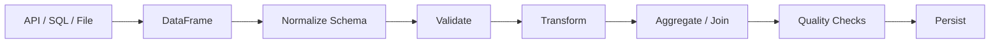

# 02- Series And Dataframe

## Overview

`Series` and `DataFrame` are the core Pandas data structures.

Understanding them deeply is more important than memorizing individual methods because almost every Pandas operation is expressed in terms of:

```text
Series
DataFrame
Index
dtype
alignment
```

A `Series` represents one labeled one-dimensional sequence of values. A `DataFrame` represents a labeled two-dimensional table composed of aligned Series.

For backend and data-engineering workloads, these structures commonly represent:

```text
database query results
API records
CSV files
Parquet partitions
orders
customers
transactions
financial records
event batches
reporting datasets
```

The most important engineering characteristics are:

```text
labels matter
dtypes matter
alignment matters
missing values matter
copy behavior matters
memory matters
```

---

## Series

A `Series` is a one-dimensional labeled array.

```python
import pandas as pd

amounts = pd.Series(
    [125.50, 300.00, 75.25],
    name="amount",
)
```

Conceptually:

```text
index   value
0       125.50
1       300.00
2        75.25
```

A Series contains:

```text
values
index
dtype
name
```

Inspect the metadata:

```python
print(amounts.index)
print(amounts.dtype)
print(amounts.name)
```

A Series is often the natural representation of one DataFrame column.

---

## Creating a Series

From a list:

```python
amounts = pd.Series(
    [100, 200, 300],
    name="amount",
)
```

With explicit labels:

```python
amounts = pd.Series(
    [100, 200, 300],
    index=["O-1", "O-2", "O-3"],
    name="amount",
)
```

From a dictionary:

```python
amounts = pd.Series(
    {
        "O-1": 100,
        "O-2": 200,
        "O-3": 300,
    },
    name="amount",
)
```

Dictionary keys become the index.

---

## Series Index

The index provides labels for the values.

```python
amounts = pd.Series(
    [100, 200, 300],
    index=["O-1", "O-2", "O-3"],
)
```

Now:

```python
amounts.loc["O-2"]
```

returns:

```text
200
```

while:

```python
amounts.iloc[1]
```

also returns:

```text
200
```

The difference is the selection model:

```text
loc  → label
iloc → position
```

---

## Series Selection

Single label:

```python
amounts.loc["O-1"]
```

Multiple labels:

```python
amounts.loc[
    ["O-1", "O-3"]
]
```

Single position:

```python
amounts.iloc[0]
```

Position range:

```python
amounts.iloc[0:2]
```

Boolean filtering:

```python
amounts.loc[
    amounts > 150
]
```

The result of boolean filtering remains a Series.

---

## Series Dtype

A Series has a dtype describing how its values are represented.

```python
amounts = pd.Series(
    [100, 200, 300],
    dtype="int64",
)
```

Inspect it:

```python
print(amounts.dtype)
```

Common production-relevant dtypes include:

```text
int64
float64
bool
string
datetime64[ns]
datetime64[ns, UTC]
category
```

Dtype affects:

```text
memory
arithmetic
missing values
comparisons
serialization
database interoperability
```

---

## String Dtype

For textual columns, explicit string dtype is usually clearer than relying on generic `object`.

```python
statuses = pd.Series(
    ["pending", "completed", None],
    dtype="string",
)
```

This gives Pandas-specific missing-value behavior through `pd.NA`.

Use explicit string semantics at external data boundaries when consistency matters.

---

## Nullable Numeric Dtypes

Standard integer dtypes cannot represent `NaN` in the same way floating-point dtypes do.

Pandas provides nullable integer dtypes:

```python
customer_ids = pd.Series(
    [101, 102, None],
    dtype="Int64",
)
```

The capitalized `Int64` is a Pandas nullable integer dtype.

This is useful when:

```text
integer semantics
+
missing values
```

must coexist.

---

## DataFrame

A `DataFrame` is a two-dimensional labeled table.

```python
orders = pd.DataFrame(
    {
        "order_id": ["O-1001", "O-1002"],
        "customer_id": ["C-101", "C-102"],
        "amount": [125.50, 300.00],
    }
)
```

Conceptually:

```text
         order_id  customer_id  amount
index
0        O-1001    C-101        125.50
1        O-1002    C-102        300.00
```

The DataFrame contains:

```text
index
columns
Series values
dtypes
```

---

## Creating a DataFrame

From a dictionary of lists:

```python
orders = pd.DataFrame(
    {
        "order_id": ["O-1", "O-2"],
        "amount": [100, 200],
    }
)
```

From records:

```python
records = [
    {
        "order_id": "O-1",
        "customer_id": "C-1",
        "amount": 100,
    },
    {
        "order_id": "O-2",
        "customer_id": "C-2",
        "amount": 200,
    },
]

orders = pd.DataFrame.from_records(
    records
)
```

`from_records()` is particularly useful for API and event data.

---

## DataFrame from SQL Results

A database query naturally maps to a DataFrame:

```python
orders = pd.read_sql_query(
    """
    SELECT
        order_id,
        customer_id,
        amount
    FROM orders
    WHERE status = %(status)s
    """,
    connection,
    params={
        "status": "completed",
    },
)
```

The result is a DataFrame whose columns correspond to the selected fields.

For production workloads, project only the columns required by the processing step.

---

## DataFrame Shape

Inspect dimensions:

```python
orders.shape
```

Example:

```text
(100000, 5)
```

means:

```text
100,000 rows
5 columns
```

`shape` is a tuple:

```text
(rows, columns)
```

This is useful for:

```text
validation
monitoring
performance checks
reconciliation
```

---

## DataFrame Metadata

Common structural properties:

```python
orders.index
orders.columns
orders.dtypes
orders.shape
orders.size
orders.empty
```

Useful inspection methods:

```python
orders.head()
orders.tail()
orders.sample(5)
orders.info()
```

For external data, inspect the structure before assuming the schema is correct.

---

## Columns Are Series

Selecting one column returns a Series:

```python
amounts = orders["amount"]
```

Therefore:

```text
DataFrame
    ↓
column selection
    ↓
Series
```

Selecting several columns returns a DataFrame:

```python
order_subset = orders[
    [
        "order_id",
        "amount",
    ]
]
```

This distinction is important for method chaining and return-type reasoning.

---

## Column Names

Inspect:

```python
orders.columns
```

Rename explicitly:

```python
orders = orders.rename(
    columns={
        "cust_id": "customer_id",
        "amt": "amount",
    }
)
```

External systems often use inconsistent naming conventions, so normalization at the data boundary is useful.

Avoid silently changing names in the middle of a transformation pipeline unless the change is deliberate.

---

## Column Ordering

Column order is generally part of the DataFrame representation but should not be treated as a semantic key unless the downstream format requires it.

For example:

```python
orders = orders[
    [
        "order_id",
        "customer_id",
        "amount",
        "created_at",
    ]
]
```

Explicit ordering can be useful before:

```text
CSV export
Parquet publication
database loading
API serialization
schema comparison
```

---

## DataFrame Index

The index labels rows.

Default:

```python
orders.index
```

may be:

```text
RangeIndex(start=0, stop=3, step=1)
```

A business key can become the index:

```python
orders = orders.set_index(
    "order_id"
)
```

Result:

```text
         customer_id  amount
order_id
O-1001   C-101        125.50
O-1002   C-102        300.00
```

Use a meaningful index when label-based operations benefit from it.

Do not force business identifiers into the index simply because they look like keys.

---

## Index vs Database Primary Key

A Pandas index is not equivalent to a database primary key.

A Pandas index:

```text
supports labels and alignment
```

while a database primary key:

```text
enforces uniqueness and identity
```

A DataFrame can have:

```text
duplicate index labels
```

unless the application explicitly prevents them.

This distinction is important in backend systems.

---

## Setting an Index

```python
orders = orders.set_index(
    "order_id"
)
```

To preserve the original column:

```python
orders = orders.set_index(
    "order_id",
    drop=False,
)
```

To restore the index to a regular column:

```python
orders = orders.reset_index()
```

Use index changes deliberately because they affect selection, joins, and alignment.

---

## `loc` and `iloc`

The central distinction:

| Operation | Selection Model |
|---|---|
| `loc` | Label-based |
| `iloc` | Position-based |

Example:

```python
orders.loc["O-1001"]
```

uses the index label.

Example:

```python
orders.iloc[0]
```

uses the first row position.

For interview questions, always identify whether the problem describes:

```text
label
```

or:

```text
position
```

before selecting.

---

## Boolean Selection

Use `.loc` with boolean conditions:

```python
large_orders = orders.loc[
    orders["amount"] > 500
]
```

Multiple conditions:

```python
filtered = orders.loc[
    (orders["amount"] > 500)
    & (orders["status"] == "completed")
]
```

Use:

```text
& → element-wise AND
| → element-wise OR
~ → element-wise NOT
```

Do not use:

```python
and
or
not
```

with Pandas Series.

---

## Why `and` Fails with Series

A Series contains many boolean values:

```text
True
False
True
...
```

Python's scalar:

```python
and
```

expects one truth value.

Pandas therefore uses element-wise operators:

```python
condition_a & condition_b
```

This distinction is a frequent interview and debugging question.

---

## DataFrame Alignment

Pandas aligns labeled objects by index.

Example:

```python
left = pd.Series(
    [10, 20],
    index=["A", "B"],
)

right = pd.Series(
    [1, 2],
    index=["B", "A"],
)

result = left + right
```

Result:

```text
A → 12
B → 21
```

because Pandas matches:

```text
A with A
B with B
```

rather than simply adding by position.

---

## Why Alignment Matters

Alignment is powerful for:

```text
joining derived values
assigning computed Series
arithmetic across datasets
time-series operations
index-based joins
```

It can also cause surprising results if developers assume positional behavior.

For example, assigning a Series to a DataFrame column can align by index rather than row order.

---

## Reindexing

`reindex()` explicitly changes the labels being considered:

```python
amounts = amounts.reindex(
    ["O-1", "O-2", "O-3"]
)
```

Missing labels become missing values.

```text
O-1 → existing value
O-2 → existing value
O-3 → NaN / <NA>
```

This is useful when two datasets must share a common labeled structure.

---

## Selecting with `.at` and `.iat`

For single scalar access:

```python
value = orders.at[
    "O-1001",
    "amount",
]
```

Positionally:

```python
value = orders.iat[
    0,
    2,
]
```

These are optimized scalar accessors and are useful when a single cell must be read or assigned.

They are not substitutes for vectorized operations over many rows.

---

## DataFrame Assignment

Column assignment:

```python
orders["priority"] = (
    orders["amount"] > 500
)
```

Conditional assignment:

```python
orders.loc[
    orders["amount"] > 500,
    "priority",
] = True
```

Avoid chained indexing:

```python
orders[
    orders["amount"] > 500
]["priority"] = True
```

Use `.loc` to make the mutation target explicit.

---

## Copying a DataFrame

Use `.copy()` when you need an independent DataFrame to modify.

```python
high_value = orders.loc[
    orders["amount"] > 500
].copy()

high_value["priority"] = True
```

This makes the ownership boundary explicit.

However, copying large DataFrames unnecessarily increases memory consumption.

Use copies deliberately rather than reflexively.

---

## Views and Copies

Pandas indexing behavior can involve views or copies depending on the operation and internal representation.

For production code, do not depend on uncertain mutation behavior.

Prefer:

```python
subset = df.loc[
    condition,
    columns,
].copy()
```

when the subset will be modified independently.

This improves readability and reduces ambiguity even when the exact internal memory behavior is not the primary concern.

---

## DataFrame and Series Mutability

Most Pandas operations return a new object rather than modifying the original.

For example:

```python
result = orders.sort_values(
    "amount"
)
```

does not normally replace `orders`.

By contrast:

```python
orders["amount"] = (
    orders["amount"] * 1.18
)
```

explicitly assigns into the DataFrame.

The important question is:

```text
Which object changes after this statement?
```

This matters for correctness and memory usage.

---

## Dtype Inference

When creating a DataFrame, Pandas often infers dtypes:

```python
orders = pd.DataFrame(
    {
        "quantity": [1, 2, 3],
        "amount": [100.0, 200.0, 300.0],
    }
)
```

Inspect:

```python
orders.dtypes
```

Do not rely blindly on inference for external data.

Explicit normalization is often safer:

```python
orders["quantity"] = pd.to_numeric(
    orders["quantity"],
    errors="raise",
).astype("int64")
```

---

## Missing Values in Series and DataFrames

Check:

```python
orders.isna()
```

Count by column:

```python
orders.isna().sum()
```

Filter required fields:

```python
valid = orders.dropna(
    subset=[
        "order_id",
        "customer_id",
    ]
)
```

Fill optional values:

```python
orders["discount"] = (
    orders["discount"]
    .fillna(0)
)
```

The correct action depends on field semantics.

---

## Empty DataFrames

An empty DataFrame still has a schema:

```python
empty_orders = pd.DataFrame(
    columns=[
        "order_id",
        "customer_id",
        "amount",
    ]
)
```

Check:

```python
empty_orders.empty
```

An empty result can be a valid result of:

```text
API query
time window
database filter
report
```

Production code should define whether empty input means:

```text
success
warning
failure
```

---

## DataFrame Construction from API Data

REST APIs commonly return records as JSON:

```python
payload = {
    "items": [
        {
            "order_id": "O-1",
            "amount": 100,
        },
        {
            "order_id": "O-2",
            "amount": 200,
        },
    ]
}

orders = pd.DataFrame.from_records(
    payload["items"]
)
```

Before transformation, validate:

```text
required fields
unexpected fields
dtypes
nullability
duplicate IDs
```

Do not trust external API payloads merely because the HTTP request succeeded.

---

## DataFrame Construction from Records

For event or message processing:

```python
records = [
    {
        "event_id": "E-1",
        "event_type": "order_created",
        "order_id": "O-1",
    },
    {
        "event_id": "E-2",
        "event_type": "order_created",
        "order_id": "O-2",
    },
]

events = pd.DataFrame.from_records(
    records
)
```

This is common in:

```text
Kafka consumers
Celery tasks
REST integrations
batch workers
```

---

## Converting a DataFrame to Records

For database or API-oriented workflows:

```python
records = orders.to_dict(
    orient="records"
)
```

The result is:

```python
[
    {
        "order_id": "O-1",
        "amount": 100,
    },
    ...
]
```

This is useful when interfacing with:

```text
SQLAlchemy
REST clients
batch APIs
message producers
```

For very large DataFrames, converting everything to a Python list can significantly increase memory usage. Prefer streaming or database-native bulk mechanisms when available.

---

## DataFrame to NumPy

A DataFrame can expose its values through:

```python
values = orders.to_numpy()
```

This is useful when integrating with:

```text
NumPy
scientific libraries
numerical algorithms
```

However, converting mixed-type DataFrames to NumPy can produce an `object` array and lose some of the advantages of specialized Pandas dtypes.

---

## DataFrame Memory

Inspect approximate DataFrame memory:

```python
orders.info(
    memory_usage="deep"
)
```

Memory depends on:

```text
rows
columns
dtype
string storage
categorical cardinality
index
temporary objects
```

For large backend jobs, monitor process-level memory as well as DataFrame-level memory.

---

## `object` Dtype

`object` can represent Python objects and is commonly seen in older or heterogeneous textual columns.

Example:

```python
orders["status"].dtype
```

may be:

```text
object
```

For predictable textual semantics, consider:

```python
orders["status"] = orders[
    "status"
].astype("string")
```

This can improve clarity and consistency around missing values.

---

## Categorical Data

Repeated low-cardinality values can use categorical dtype:

```python
orders["status"] = orders[
    "status"
].astype("category")
```

This can reduce memory and improve some operations.

Good candidates include:

```text
status
country
department
product_type
```

Poor candidates often include:

```text
order_id
transaction_id
request_id
```

when nearly every value is unique.

---

## Index Uniqueness

Check whether an index is unique:

```python
orders.index.is_unique
```

A DataFrame can legally have duplicate index labels.

If an operation requires unique labels, validate the assumption explicitly.

Do not assume:

```text
index = primary key
```

without enforcing the invariant.

---

## Resetting the Index

Return labels to normal columns:

```python
orders = orders.reset_index()
```

Or discard the existing index:

```python
orders = orders.reset_index(
    drop=True
)
```

Use `drop=True` when the index has no semantic value and should not become a column.

---

## Setting a Meaningful Index

For label-based lookup:

```python
orders = orders.set_index(
    "order_id"
)

order = orders.loc[
    "O-1001"
]
```

This can make code more expressive when the workflow is naturally keyed by the chosen label.

For purely tabular processing, retaining the default RangeIndex may be simpler.

---

## Renaming Index Labels

```python
orders = orders.rename(
    index={
        "O-1001": "O-0001"
    }
)
```

Index transformations should be deliberate because they can affect:

```text
alignment
joins
selection
lookup
```

---

## Series Arithmetic

Pandas Series arithmetic is vectorized:

```python
orders["gross_amount"] = (
    orders["quantity"]
    * orders["unit_price"]
)
```

This is generally preferable to row-by-row Python loops.

Arithmetic is also label-aware when Series objects with indexes are combined.

---

## Series Comparisons

```python
high_value = orders[
    "amount"
] > 500
```

returns a boolean Series:

```text
True
False
True
...
```

This mask can then be used:

```python
orders.loc[high_value]
```

This two-step mental model is useful in interviews:

```text
comparison
→
boolean mask
→
selection
```

---

## Vectorized String Operations

A text Series supports vectorized string methods:

```python
orders["status"] = (
    orders["status"]
    .astype("string")
    .str.strip()
    .str.lower()
)
```

Avoid:

```python
orders["status"].apply(
    lambda value: value.strip().lower()
)
```

when equivalent vectorized `.str` operations exist.

---

## Vectorized Datetime Operations

After normalization:

```python
orders["created_at"] = pd.to_datetime(
    orders["created_at"],
    utc=True,
    errors="raise",
)
```

use:

```python
orders["created_date"] = (
    orders["created_at"].dt.date
)
```

or:

```python
orders["created_month"] = (
    orders["created_at"].dt.to_period("M")
)
```

The `.dt` accessor provides vectorized datetime operations.

---

## DataFrame Operations and Return Types

Knowing return types is critical.

| Expression | Typical Result |
|---|---|
| `df["amount"]` | `Series` |
| `df[["amount"]]` | `DataFrame` |
| `df.iloc[0]` | `Series` |
| `df.iloc[[0]]` | `DataFrame` |
| `df.loc[mask]` | `DataFrame` |
| `df["amount"] > 100` | Boolean `Series` |
| `df["amount"].sum()` | Scalar |
| `df.groupby(...)` | `DataFrameGroupBy` |
| `df.merge(...)` | `DataFrame` |

Interview questions often test these distinctions.

---

## One Row as Series vs DataFrame

Compare:

```python
row = orders.iloc[0]
```

with:

```python
row = orders.iloc[[0]]
```

The first usually returns:

```text
Series
```

The second returns:

```text
DataFrame
```

This distinction matters when downstream code expects two-dimensional structure.

---

## Scalar Access

For one known cell:

```python
value = orders.at[
    "O-1001",
    "amount",
]
```

or positionally:

```python
value = orders.iat[
    0,
    2,
]
```

Use these when a single scalar access is genuinely required.

For bulk data processing, use vectorized operations instead.

---

## DataFrame Schema Checks

A DataFrame schema can be inspected through:

```python
expected_columns = {
    "order_id",
    "customer_id",
    "amount",
}
```

Validate:

```python
missing = (
    expected_columns
    - set(orders.columns)
)

if missing:
    raise ValueError(
        f"Missing columns: {sorted(missing)}"
    )
```

For production pipelines, also consider:

```text
unexpected columns
dtypes
nullability
column order
```

depending on the contract.

---

## Production Use in ETL

A practical DataFrame lifecycle looks like:



At each stage, understand:

```text
input schema
output schema
dtype changes
index behavior
missing-value behavior
memory impact
```

This is the difference between knowing Pandas syntax and reasoning about a Pandas pipeline.

---

## Performance Considerations

For Series and DataFrame operations, performance generally improves when you:

```text
filter early
select fewer columns
use vectorization
avoid repeated copies
avoid Python row loops
avoid unnecessary sorting
use appropriate dtypes
```

For example:

```python
filtered = orders.loc[
    orders["amount"] > 500,
    [
        "order_id",
        "amount",
    ],
]
```

reduces both rows and columns before later transformations.

---

## Avoiding Unnecessary Copies

This pattern can create several intermediate objects:

```python
result = (
    orders[
        orders["amount"] > 500
    ][
        [
            "order_id",
            "amount",
        ]
    ]
)
```

A clearer approach is often:

```python
result = orders.loc[
    orders["amount"] > 500,
    [
        "order_id",
        "amount",
    ],
]
```

When the result will be independently mutated:

```python
result = orders.loc[
    orders["amount"] > 500,
    [
        "order_id",
        "amount",
    ],
].copy()
```

Use copies intentionally based on ownership and mutation requirements.

---

## Backend Integration Patterns

### PostgreSQL

```text
SQL filtering
→
DataFrame
→
Pandas transformation
→
staging/upsert
```

### REST API

```text
JSON response
→
DataFrame.from_records()
→
normalize
→
validate
→
persist
```

### Kafka

```text
messages
→
micro-batch
→
DataFrame
→
transform
→
destination
```

### Parquet

```text
Parquet partition
→
DataFrame
→
transform
→
Parquet output
```

### Celery

```text
job ID
→
worker
→
DataFrame batch
→
database / S3
```

The Series/DataFrame model remains the same across these integrations.

---

## Common Mistakes

### Treating the Index as a Primary Key

A Pandas index does not enforce uniqueness like a database primary key.

### Confusing `loc` and `iloc`

Remember:

```text
loc  = label
iloc = position
```

### Using Python `and` / `or`

Use:

```python
&
|
~
```

for Series conditions.

### Forgetting Parentheses

Write:

```python
(condition_a) & (condition_b)
```

### Assuming Column Selection Always Returns a DataFrame

```python
df["amount"]
```

returns a Series.

```python
df[["amount"]]
```

returns a DataFrame.

### Ignoring Alignment

Pandas often aligns by index, not position.

### Mutating a Filtered Result Without Clarity

Use `.loc` and `.copy()` when ownership is intended to be independent.

### Blindly Using `object`

Explicit dtypes such as `string`, `Int64`, `category`, and timezone-aware datetimes can provide clearer semantics.

### Converting Huge DataFrames to Python Lists

`to_dict("records")` can significantly increase memory usage.

### Using Row-by-Row Loops for Vectorizable Work

This adds Python-level overhead and usually scales poorly.

### Assuming Empty Data Means Failure

An empty DataFrame can be a valid business result.

### Treating a DataFrame as a Durable Store

Pandas data lives in process memory. Durable state belongs in databases, object storage, or other persistent systems.

---

## Interview Traps

### `iloc[0]` vs `iloc[[0]]`

One typically returns a Series; the other returns a one-row DataFrame.

### `loc` vs `iloc`

`loc` is label-based, while `iloc` is position-based.

### `df["a"] + df["b"]`

Addition is element-wise and label-aligned.

### Assigning a Series

A Series assigned to a DataFrame is generally aligned by index.

### `object` vs `string`

`object` is a generic Python-object dtype. `string` expresses textual intent explicitly and has dedicated missing-value semantics.

### Index vs Column

An index is a label structure used heavily for selection and alignment. A normal column is a DataFrame field. They can be converted between one another with `set_index()` and `reset_index()`.

### `copy()` vs Reassignment

Creating a new variable does not necessarily mean an independent copy of the underlying data. Use `.copy()` when independent mutation semantics are required.

### Many-to-Many Joins

A join can increase row count dramatically when keys repeat on both sides.

---

## Practical Decision Framework

When working with a Series or DataFrame, ask:

```text
What is the object type?
        ↓
What are the index labels?
        ↓
What are the dtypes?
        ↓
Is the operation label-based or positional?
        ↓
What is the expected return type?
        ↓
Will the operation mutate the source?
        ↓
How are missing values handled?
        ↓
Will Pandas align by index?
        ↓
What is the memory cost?
        ↓
Can the operation be vectorized?
```

This reasoning pattern is more useful in interviews than memorizing isolated examples.

---

## Production Checklist

```text
[ ] Series vs DataFrame return types are understood
[ ] Index semantics are explicit
[ ] loc and iloc are used intentionally
[ ] Boolean expressions use element-wise operators
[ ] Parentheses are used around compound conditions
[ ] Column selection is explicit
[ ] Dtypes are inspected and normalized where needed
[ ] Missing-value behavior is defined
[ ] Copy behavior is intentional
[ ] Alignment behavior is understood
[ ] Empty DataFrame behavior is defined
[ ] Large DataFrame memory is measured
[ ] Vectorized operations are preferred
[ ] Database/API schemas are validated at boundaries
[ ] DataFrame is not treated as durable state
[ ] Production persistence uses appropriate database/storage guarantees
```

## Interview Perspective

### What Is the Difference Between a Series and a DataFrame?

A Series is a one-dimensional labeled structure. A DataFrame is a two-dimensional labeled table composed of aligned columns.

### What Makes a Series More Than a Python List?

A Series has labels, dtype-aware operations, alignment semantics, missing-value handling, and vectorized operations.

### What Happens When You Select One Column?

```python
df["amount"]
```

normally returns a Series.

### How Do You Force a One-Column DataFrame?

Use:

```python
df[["amount"]]
```

The double brackets preserve two-dimensional DataFrame structure.

### What Is the Difference Between `loc` and `iloc`?

`loc` selects using labels or boolean conditions. `iloc` selects using integer positions.

### Why Does Pandas Align Series by Index?

Label alignment allows arithmetic, assignment, and other operations to combine logically corresponding values even when their physical order differs.

### Can a DataFrame Have Duplicate Index Values?

Yes. Pandas does not universally enforce index uniqueness.

### Is the Pandas Index Equivalent to a Database Primary Key?

No. A database primary key enforces identity and uniqueness at the storage layer. A Pandas index primarily provides labels and alignment.

### What Happens When You Assign a Series to a DataFrame Column?

Pandas generally aligns the Series with the DataFrame by index.

### Why Use `.copy()`?

Use it when an independently owned DataFrame should be modified without ambiguity about the source object's mutation behavior.

### Why Prefer Vectorized Operations?

They operate on arrays/Series rather than repeatedly invoking Python code for every row, typically improving performance and readability.

### When Is `apply()` Appropriate?

When the required logic cannot be expressed clearly with existing vectorized operations and the data volume makes the performance trade-off acceptable.

### What Is the Difference Between `iloc[0]` and `iloc[[0]]`?

The first typically returns a Series representing one row. The second returns a one-row DataFrame.

### How Does Missing Data Affect Dtypes?

Introducing missing values can cause dtype changes depending on the original dtype and representation. Nullable Pandas dtypes can preserve semantic types while supporting missing values.

### Why Is `object` Often Less Desirable Than Specialized Dtypes?

`object` is a generic container for Python objects. Specialized dtypes provide clearer semantics and can improve memory usage, performance, and predictable missing-value behavior.

### How Does DataFrame Alignment Affect Production Code?

It can silently change arithmetic and assignment results when indexes differ. Understanding alignment prevents subtle correctness bugs.

### How Would You Represent API Data in Pandas?

Convert a list of records with:

```python
pd.DataFrame.from_records(
    records
)
```

then validate the schema and normalize types before transformation.

### How Should You Handle a DataFrame That Exceeds Memory?

Reduce the source data, select only necessary columns, process in chunks or incremental windows, avoid unnecessary copies, and evaluate another processing engine if the workload exceeds Pandas' single-node model.

### What Should You Check Before Using a DataFrame in a Production Pipeline?

At minimum:

```text
shape
columns
dtypes
nullability
duplicate assumptions
index semantics
empty-state behavior
memory requirements
```

## Key Takeaways

- `Series` and `DataFrame` are the core Pandas structures; understand their labels, dtypes, index behavior, and return types before using higher-level operations.
- The distinction between `loc` and `iloc`, label alignment, and Series-versus-DataFrame selection is fundamental for both production correctness and interviews.
- Explicit dtype handling, missing-value semantics, copy behavior, and vectorized operations determine whether DataFrame code remains reliable and efficient as data volume grows.
- A DataFrame is an in-memory processing structure, not a durable system of record; production workflows should integrate it deliberately with SQL, APIs, Parquet, queues, and persistent storage.
- Strong Pandas knowledge means reasoning about object shape, labels, mutation, alignment, memory, and failure behavior rather than memorizing method names.