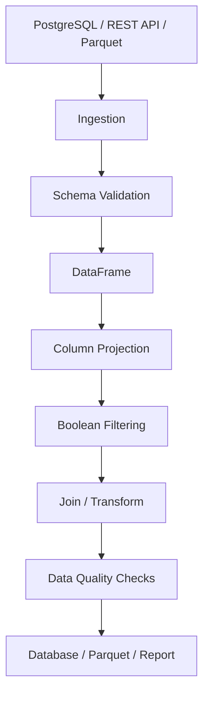

# 03- Indexing And Selection

## Overview

Indexing and selection determine how Pandas identifies, retrieves, filters, and reshapes data inside a `Series` or `DataFrame`.

For production Pandas work, indexing is more than syntax. It affects:

- correctness
- index alignment
- mutation behavior
- memory usage
- join behavior
- filtering semantics
- performance
- downstream schema expectations

The central distinction is:

```text
Label-based access
        ↓
      loc

Position-based access
        ↓
      iloc

Scalar label access
        ↓
       at

Scalar position access
        ↓
       iat
```

A robust mental model is:

```text
DataFrame
├── rows identified by an Index
├── columns identified by column labels
└── values accessed through labels, positions, or boolean masks
```

In backend systems, indexing commonly appears when processing:

```text
SQL query results
REST API payloads
CSV / JSON files
Parquet partitions
event batches
reporting datasets
ETL transformations
database reconciliation jobs
```

---

## The Pandas Index

Every `Series` and `DataFrame` has an index.

```python
import pandas as pd

orders = pd.DataFrame(
    {
        "order_id": ["O-1001", "O-1002", "O-1003"],
        "customer_id": ["C-101", "C-102", "C-101"],
        "amount": [125.50, 300.00, 75.25],
    }
)
```

The default index is:

```text
0
1
2
```

Inspect it:

```python
print(orders.index)
```

Typical output:

```text
RangeIndex(start=0, stop=3, step=1)
```

The index provides labels for rows. It does not automatically provide database-style uniqueness or constraints.

---

## Index vs Position

Consider:

```python
orders = orders.set_index("order_id")
```

The DataFrame now has:

```text
         customer_id  amount
order_id
O-1001   C-101        125.50
O-1002   C-102        300.00
O-1003   C-101         75.25
```

The labels are:

```text
O-1001
O-1002
O-1003
```

The positions are:

```text
0
1
2
```

These are separate concepts.

```python
orders.loc["O-1002"]
```

selects by label.

```python
orders.iloc[1]
```

selects by position.

Both can refer to the same row while using different selection semantics.

---

## `loc`

`loc` performs label-based selection.

General syntax:

```python
df.loc[row_selector, column_selector]
```

Examples:

```python
orders.loc["O-1001"]
```

```python
orders.loc[
    ["O-1001", "O-1003"]
]
```

```python
orders.loc[
    "O-1001",
    "amount",
]
```

```python
orders.loc[
    ["O-1001", "O-1003"],
    ["customer_id", "amount"],
]
```

`loc` is usually the preferred accessor when selection is based on semantic labels.

---

## `iloc`

`iloc` performs position-based selection.

```python
orders.iloc[0]
```

Select multiple rows:

```python
orders.iloc[[0, 2]]
```

Select rows and columns by position:

```python
orders.iloc[
    [0, 2],
    [0, 2],
]
```

Slice rows:

```python
orders.iloc[0:2]
```

Use `iloc` when the requirement is explicitly positional rather than label-based.

---

## `loc` vs `iloc`

| Accessor | Selection basis | Typical use |
|---|---|---|
| `loc` | Labels | business keys, column names, boolean masks |
| `iloc` | Integer positions | positional extraction |
| `at` | Single label pair | one scalar by label |
| `iat` | Single integer pair | one scalar by position |

Prefer semantic selectors when possible.

For example:

```python
orders.loc[
    orders["amount"] > 500,
    ["order_id", "amount"],
]
```

is more resilient to column reordering than:

```python
orders.iloc[:, [0, 2]]
```

when the business requirement is explicitly about column names.

---

## Selecting Columns

Single-column selection:

```python
amounts = orders["amount"]
```

returns a `Series`.

Multiple-column selection:

```python
subset = orders[
    [
        "order_id",
        "amount",
    ]
]
```

returns a `DataFrame`.

This distinction matters in reusable code.

```text
df["amount"]
    ↓
Series

df[["amount"]]
    ↓
DataFrame
```

---

## Why Double Brackets Matter

This:

```python
orders["amount"]
```

produces a one-dimensional object.

This:

```python
orders[["amount"]]
```

preserves two-dimensional structure.

The difference becomes important when passing data to code that expects:

```python
def process_table(frame: pd.DataFrame) -> pd.DataFrame:
    ...
```

Passing:

```python
orders["amount"]
```

would violate that expected structure.

---

## Selecting Rows with `loc`

With a business-key index:

```python
order = orders.loc["O-1001"]
```

Multiple labels:

```python
selected = orders.loc[
    ["O-1001", "O-1003"]
]
```

A label range:

```python
selected = orders.loc[
    "O-1001":"O-1003"
]
```

Label slicing has different semantics from ordinary Python positional slicing, particularly around endpoints.

Treat label ranges as label-based operations rather than assuming Python slice rules.

---

## Selecting Rows with `iloc`

Position 0:

```python
first_order = orders.iloc[0]
```

Rows 0 through 2:

```python
first_orders = orders.iloc[0:3]
```

Every second row:

```python
sample = orders.iloc[::2]
```

This is useful when the business requirement is explicitly positional.

Avoid using positions to represent business meaning when stable labels are available.

---

## Scalar Access with `at`

`at` is for a single scalar identified by labels.

```python
amount = orders.at[
    "O-1001",
    "amount",
]
```

Assignment:

```python
orders.at[
    "O-1001",
    "amount",
] = 150.00
```

Use `at` when exactly one cell is intended.

Do not use it as a replacement for vectorized DataFrame operations.

---

## Scalar Access with `iat`

`iat` accesses one scalar by integer position.

```python
amount = orders.iat[
    0,
    2,
]
```

Assignment:

```python
orders.iat[
    0,
    2,
] = 150.00
```

This is useful for explicit scalar positional access but is less readable than named access when column identity matters.

---

## Boolean Indexing

Boolean selection is one of the most important Pandas indexing patterns.

```python
high_value = orders.loc[
    orders["amount"] > 200
]
```

The expression:

```python
orders["amount"] > 200
```

produces a boolean Series aligned with the DataFrame index.

Conceptually:

```text
row       amount   condition
O-1001    125.50   False
O-1002    300.00   True
O-1003     75.25   False
```

The mask then selects the rows where the condition is `True`.

---

## Compound Conditions

Use element-wise operators:

```python
filtered = orders.loc[
    (orders["amount"] > 100)
    & (orders["customer_id"] == "C-101")
]
```

For OR:

```python
filtered = orders.loc[
    (orders["amount"] > 500)
    | (orders["customer_id"] == "C-101")
]
```

For NOT:

```python
filtered = orders.loc[
    ~(orders["customer_id"] == "C-101")
]
```

Do not use Python's scalar operators:

```python
and
or
not
```

with Pandas Series.

---

## Why Parentheses Are Required

Correct:

```python
(
    orders["amount"] > 100
) & (
    orders["status"] == "completed"
)
```

Incorrect:

```python
orders["amount"] > 100 & orders["status"] == "completed"
```

Python operator precedence can produce incorrect expressions or ambiguous evaluation.

Parenthesize each logical condition explicitly.

---

## Filtering with `isin`

For membership checks:

```python
selected = orders.loc[
    orders["customer_id"].isin(
        ["C-101", "C-103"]
    )
]
```

This is preferable to building long OR expressions:

```python
(
    orders["customer_id"] == "C-101"
)
|
(
    orders["customer_id"] == "C-103"
)
```

`isin()` is clearer and naturally expresses set membership.

---

## Excluding Values with `isin`

```python
excluded_customers = {
    "C-900",
    "C-901",
}

filtered = orders.loc[
    ~orders["customer_id"].isin(
        excluded_customers
    )
]
```

This pattern is useful for:

```text
blocked identifiers
excluded regions
known test accounts
already-processed records
blacklisted categories
```

---

## Filtering with `between`

Numeric ranges can be expressed with `between()`:

```python
filtered = orders.loc[
    orders["amount"].between(
        100,
        500,
        inclusive="both",
    )
]
```

This is usually clearer than combining two inequalities.

```text
amount >= 100
AND
amount <= 500
```

The `inclusive` argument should be chosen intentionally because boundary semantics can matter for financial and reporting data.

---

## Filtering with `query`

Pandas also provides `query()`:

```python
filtered = orders.query(
    "amount > 200 and customer_id == 'C-101'"
)
```

`query()` can improve readability for complex filtering expressions.

For programmatically supplied values, use external variables rather than interpolating strings:

```python
customer_id = "C-101"
minimum_amount = 200

filtered = orders.query(
    "amount > @minimum_amount and customer_id == @customer_id"
)
```

This makes variable handling clearer and avoids constructing query strings from untrusted input.

---

## `loc` vs `query`

| Approach | Strength | Trade-off |
|---|---|---|
| `loc` + boolean mask | explicit, composable, familiar | can become verbose |
| `query()` | readable expression syntax | separate expression language |
| `isin()` | clear membership semantics | specific to membership tests |
| `between()` | clear range semantics | specific to range conditions |

For maintainable backend code, prefer the representation that makes the business rule easiest to audit.

---

## Selecting with Missing Values

Missing values require explicit handling.

This does not test for missing data correctly:

```python
orders["customer_id"] == None
```

Use:

```python
orders.loc[
    orders["customer_id"].isna()
]
```

For non-null values:

```python
orders.loc[
    orders["customer_id"].notna()
]
```

This distinction is important because Pandas missing values are not ordinary scalar values.

---

## Boolean Masks and `NA`

A boolean selection mask may contain missing values depending on the source Series and dtype.

For example, nullable boolean data can contain:

```text
True
False
<NA>
```

When business logic requires deterministic selection, normalize the condition appropriately.

For example:

```python
mask = (
    orders["status"]
    .eq("completed")
    .fillna(False)
)

completed = orders.loc[mask]
```

The intended missing-value behavior should be explicit.

---

## Selecting Rows and Columns Together

A common production pattern is:

```python
filtered = orders.loc[
    orders["amount"] > 500,
    [
        "order_id",
        "customer_id",
        "amount",
    ],
]
```

This combines:

```text
row filtering
+
column projection
```

Reducing both rows and columns early can reduce downstream memory and processing costs.

---

## Projection Before Transformation

When only a subset is required:

```python
orders = orders.loc[
    :,
    [
        "order_id",
        "customer_id",
        "amount",
    ],
]
```

This can be useful after loading a wide dataset from:

```text
SQL
Parquet
CSV
API payload
```

A production pipeline should avoid carrying unused columns through expensive transformations.

---

## Column Existence

Selecting a missing column raises an error:

```python
orders["unknown_column"]
```

For strict pipelines, this is desirable because schema violations should fail visibly.

For optional columns, handle them deliberately:

```python
optional_columns = [
    column
    for column in [
        "discount",
        "coupon_code",
    ]
    if column in orders.columns
]

subset = orders.loc[
    :,
    ["order_id", "amount"]
    + optional_columns,
]
```

Do not silently ignore required columns.

---

## Preserving Column Order

When selecting:

```python
selected = orders.loc[
    :,
    [
        "order_id",
        "customer_id",
        "amount",
    ],
]
```

the result preserves the requested order.

This is useful for:

```text
exports
database loads
schema comparison
API serialization
report generation
```

Treat output ordering as part of the interface when downstream consumers depend on it.

---

## Indexing with Duplicate Labels

Pandas permits duplicate index labels.

```python
events = pd.DataFrame(
    {
        "event_id": ["E-1", "E-2", "E-3"],
        "status": ["new", "retry", "new"],
    },
    index=["O-1", "O-1", "O-2"],
)
```

Now:

```python
events.loc["O-1"]
```

can return multiple rows.

This is important because a label lookup is not guaranteed to return one row.

If uniqueness is required, validate it:

```python
if not events.index.is_unique:
    raise ValueError(
        "Expected unique index labels"
    )
```

---

## Index Uniqueness

Check:

```python
df.index.is_unique
```

Or inspect duplicated labels:

```python
duplicate_index = df.index[
    df.index.duplicated()
]
```

Business identifiers should generally be validated at the appropriate boundary.

For example:

```text
database primary key
→
stable identifier
→
DataFrame validation
```

Do not rely on the Pandas index itself to enforce uniqueness.

---

## Index Alignment

Pandas operations often align values by index.

```python
left = pd.Series(
    [100, 200],
    index=["A", "B"],
)

right = pd.Series(
    [1, 2],
    index=["B", "A"],
)

result = left + right
```

The result is conceptually:

```text
A → 102
B → 201
```

The values are paired by labels rather than physical position.

This is one of Pandas' most important semantic differences from ordinary Python lists.

---

## Why Alignment Matters in Selection

Suppose a boolean mask comes from a different Series:

```python
mask = pd.Series(
    [True, False],
    index=["O-1002", "O-1001"],
)
```

Applying it to a DataFrame involves index-aware behavior.

The underlying principle is:

```text
label identity
    >
physical position
```

when labeled Pandas objects interact.

This is powerful but can produce subtle bugs when developers expect positional semantics.

---

## Reindexing

`reindex()` explicitly changes the requested labels.

```python
selected = orders.reindex(
    [
        "O-1003",
        "O-1001",
        "O-9999",
    ]
)
```

If `"O-9999"` is absent, its row becomes missing.

Use `reindex()` when the target label set or order is known.

Typical applications include:

```text
aligning reports
building fixed schemas
time-series preparation
comparing datasets
```

---

## `reindex()` vs `loc`

Use `loc` when missing labels should generally be treated as an error:

```python
orders.loc[
    ["O-1001", "O-9999"]
]
```

Use `reindex()` when missing labels are expected and should become missing rows.

```python
orders.reindex(
    ["O-1001", "O-9999"]
)
```

Conceptually:

```text
loc
→ strict selection

reindex
→ construct a new labeled structure
```

---

## Sorting Before Selection

For range-based selection, index order can matter.

```python
orders = orders.sort_index()
```

For label-oriented range access, a sorted index makes the intended ordering explicit and can improve predictable behavior.

Do not sort merely because a DataFrame "looks better." Sorting has a cost and should have a semantic purpose.

---

## Datetime Index Selection

Time-series data often uses a datetime index.

```python
events = events.set_index(
    "created_at"
).sort_index()
```

Then a time window can be selected:

```python
window = events.loc[
    "2026-01-01":"2026-01-31"
]
```

For production systems, normalize timestamps to a consistent timezone, commonly UTC, before using them as keys or time boundaries.

---

## Selecting a Time Window

A production-style incremental query may use:

```python
window = events.loc[
    (events.index >= start_at)
    & (events.index < end_at)
]
```

Half-open intervals:

```text
[start_at, end_at)
```

are often easier to compose because adjacent windows do not overlap.

For example:

```text
00:00 ≤ x < 01:00
01:00 ≤ x < 02:00
```

has no duplicated boundary records.

---

## MultiIndex

A `MultiIndex` represents multiple index levels.

```python
sales = sales.set_index(
    [
        "customer_id",
        "order_id",
    ]
)
```

Conceptually:

```text
customer_id  order_id
C-101        O-1001
C-101        O-1003
C-102        O-1002
```

MultiIndex can represent hierarchical structures, but it increases complexity.

Use it when the hierarchy materially improves the data model or operations. Do not introduce it simply to avoid keeping regular columns.

---

## Selecting from a MultiIndex

```python
sales.loc[
    ("C-101", "O-1001")
]
```

Multiple entries:

```python
sales.loc[
    "C-101"
]
```

For complex MultiIndex operations, explicit index sorting and careful level selection are important.

---

## MultiIndex vs Regular Columns

| Approach | Advantages | Limitations |
|---|---|---|
| Regular columns | simpler, explicit schema | some hierarchical operations require more code |
| MultiIndex | powerful hierarchical selection | harder debugging and interoperability |
| Database key columns | natural for persistence | may require explicit Pandas selection logic |

For ETL pipelines, regular columns are often easier to validate and serialize unless hierarchical indexing is genuinely useful.

---

## Indexing and Joins

Many Pandas joins operate on columns:

```python
orders.merge(
    customers,
    on="customer_id",
    how="left",
)
```

Index-based joins are also possible:

```python
orders.join(
    customers.set_index("customer_id"),
    on="customer_id",
)
```

The choice should reflect the data model rather than preference.

When joining production data, validate expected cardinality:

```python
result = orders.merge(
    customers,
    on="customer_id",
    how="left",
    validate="many_to_one",
)
```

This can catch unexpected data duplication.

---

## Filtering After Joins

A common production pattern is:

```python
enriched = (
    orders
    .merge(
        customers[
            [
                "customer_id",
                "country",
            ]
        ],
        on="customer_id",
        how="left",
        validate="many_to_one",
    )
)

report = enriched.loc[
    enriched["country"].eq("IN"),
    [
        "order_id",
        "customer_id",
        "amount",
    ],
]
```

The important sequence is:

```text
project
→ join
→ validate cardinality
→ filter
→ project output
```

---

## Chained Indexing

Avoid:

```python
orders[
    orders["amount"] > 500
]["status"]
```

when explicit `.loc` is clearer:

```python
orders.loc[
    orders["amount"] > 500,
    "status",
]
```

Chained indexing makes intent less explicit and becomes especially problematic when assignment is involved.

---

## Safe Conditional Assignment

Incorrect pattern:

```python
orders[
    orders["amount"] > 500
]["status"] = "priority"
```

Prefer:

```python
orders.loc[
    orders["amount"] > 500,
    "status",
] = "priority"
```

This states clearly:

```text
select these rows
+
select this column
+
assign this value
```

---

## Conditional Assignment with Multiple Conditions

```python
priority_mask = (
    orders["amount"].ge(500)
    & orders["status"].eq("completed")
)

orders.loc[
    priority_mask,
    "priority",
] = True
```

Naming a complex mask can improve readability and testing.

It also allows the condition to be reused.

---

## Assigning from Another Series

Suppose a calculated Series contains:

```python
discount = (
    orders["amount"]
    .mul(0.10)
)
```

Assign it:

```python
orders["discount"] = discount
```

Pandas aligns `discount` by index.

This is useful but also dangerous if the two objects represent different row sets.

Validate index assumptions whenever the Series comes from a separately constructed dataset.

---

## Positional vs Label Assignment

This is label-based:

```python
orders.loc[
    "O-1001",
    "status",
] = "completed"
```

This is positional:

```python
orders.iloc[
    0,
    3,
] = "completed"
```

For backend processing, label-based assignment is usually easier to audit because the business entity and column are explicit.

---

## Filtering by Column Names Dynamically

A reusable processing function may accept a configured column list:

```python
def select_report_columns(
    frame: pd.DataFrame,
    columns: list[str],
) -> pd.DataFrame:
    missing = [
        column
        for column in columns
        if column not in frame.columns
    ]

    if missing:
        raise ValueError(
            f"Missing columns: {missing}"
        )

    return frame.loc[:, columns]
```

This is preferable to silently dropping unknown or required columns.

---

## Dynamic Row Selection

When keys come from another system:

```python
requested_order_ids = [
    "O-1001",
    "O-1003",
]

selected = orders.loc[
    orders["order_id"].isin(
        requested_order_ids
    )
]
```

This is safer than constructing a query string manually.

For very large key sets, database-side filtering may be more appropriate than loading a large table into Pandas and filtering afterward.

---

## Database Pushdown

Suppose the source is PostgreSQL.

Instead of:

```text
database
→
load 50 million rows into Pandas
→
filter to 500,000 rows
```

prefer:

```text
PostgreSQL
→
WHERE predicate
→
load only required rows
→
Pandas
```

Example:

```sql
SELECT
    order_id,
    customer_id,
    amount
FROM orders
WHERE created_at >= %(start_at)s
  AND created_at < %(end_at)s
  AND status = %(status)s;
```

The principle is:

```text
filter as close to the source as practical
```

when the source system can execute the predicate efficiently.

---

## Selection from Parquet

With large Parquet datasets, column projection should happen as early as possible.

```python
orders = pd.read_parquet(
    "orders.parquet",
    columns=[
        "order_id",
        "customer_id",
        "amount",
    ],
)
```

Reading only required columns reduces:

```text
I/O
decompression work
memory
downstream processing
```

For partitioned datasets, partition-aware filtering can further reduce the amount of data read.

---

## API Pagination and Selection

A REST API may return pages:

```text
GET /orders?cursor=...
        ↓
JSON records
        ↓
DataFrame
        ↓
filter/project
        ↓
next cursor
```

Avoid assuming a single API response contains the complete dataset.

For large API workflows:

```text
page
→
validate
→
select required fields
→
transform
→
persist
→
checkpoint
→
next page
```

Indexing and selection should therefore be applied within each bounded batch rather than accumulating the entire source response unnecessarily.

---

## Large Dataset Considerations

For large DataFrames:

```text
avoid unnecessary copies
select fewer columns
filter early
use efficient dtypes
process in chunks
push predicates to SQL
use Parquet projection
```

This pattern:

```python
subset = huge_df.loc[
    condition,
    needed_columns,
].copy()
```

is often preferable to copying the full DataFrame and filtering afterward.

---

## Indexing Complexity and Performance

Not all indexing operations have the same cost.

Performance depends on:

```text
index type
index ordering
number of rows
selection pattern
whether alignment is required
whether copies are created
```

Examples:

```text
RangeIndex
→ efficient default positional structure

sorted indexes
→ useful for ordered lookups and range operations

duplicate indexes
→ potentially more complicated lookup semantics
```

Avoid optimizing based only on intuition. Benchmark representative data when indexing becomes a measurable bottleneck.

---

## Memory Impact of Selection

Selection may produce new objects and therefore consume additional memory.

For a large DataFrame:

```python
subset = df.loc[
    mask,
    columns,
]
```

can still require substantial memory.

When the subset is retained and transformed independently, `.copy()` may make the ownership explicit:

```python
subset = df.loc[
    mask,
    columns,
].copy()
```

The important production question is not merely:

```text
"Does this statement work?"
```

but also:

```text
"How much additional memory does this transformation require?"
```

---

## Empty Selection

A valid selection can return zero rows:

```python
completed = orders.loc[
    orders["status"] == "completed"
]
```

If no records match:

```python
completed.empty
```

is `True`.

Downstream code should distinguish between:

```text
empty result
schema failure
source failure
validation failure
```

An empty dataset is not automatically an error.

---

## Selection After Validation

A robust pipeline often validates before selecting deeply:

```python
required_columns = {
    "order_id",
    "customer_id",
    "amount",
    "status",
}

missing = (
    required_columns
    - set(orders.columns)
)

if missing:
    raise ValueError(
        f"Missing columns: {sorted(missing)}"
)

completed = orders.loc[
    orders["status"].eq("completed"),
    [
        "order_id",
        "customer_id",
        "amount",
    ],
]
```

This prevents obscure failures later in the pipeline.

---

## Selection Functions

For maintainability, complex selection logic can be isolated:

```python
def select_completed_orders(
    orders: pd.DataFrame,
    minimum_amount: float,
) -> pd.DataFrame:
    required = {
        "order_id",
        "customer_id",
        "amount",
        "status",
    }

    missing = required - set(orders.columns)

    if missing:
        raise ValueError(
            f"Missing columns: {sorted(missing)}"
        )

    mask = (
        orders["status"].eq("completed")
        & orders["amount"].ge(minimum_amount)
    )

    return orders.loc[
        mask,
        [
            "order_id",
            "customer_id",
            "amount",
        ],
    ].copy()
```

This approach provides:

```text
validation
+
business rule
+
projection
+
explicit ownership
```

in one testable unit.

---

## Testing Indexing Logic

Tests should validate business behavior rather than merely execution.

```python
import pandas as pd

def test_select_completed_orders() -> None:
    orders = pd.DataFrame(
        {
            "order_id": ["O-1", "O-2", "O-3"],
            "customer_id": ["C-1", "C-2", "C-3"],
            "amount": [100.0, 500.0, 900.0],
            "status": [
                "completed",
                "pending",
                "completed",
            ],
        }
    )

    result = select_completed_orders(
        orders,
        minimum_amount=500,
    )

    expected = pd.DataFrame(
        {
            "order_id": ["O-3"],
            "customer_id": ["C-3"],
            "amount": [900.0],
        }
    )

    pd.testing.assert_frame_equal(
        result.reset_index(drop=True),
        expected,
    )
```

Also test:

```text
missing columns
empty input
no matches
null status
duplicate identifiers
unexpected dtypes
```

---

## Index Normalization in Tests

DataFrame equality can fail because indexes differ even when values match.

For example:

```python
pd.testing.assert_frame_equal(
    actual.reset_index(drop=True),
    expected.reset_index(drop=True),
)
```

Use index normalization only when the index itself is not part of the behavior being tested.

If index semantics matter, test the index explicitly instead of discarding it.

---

## Common Mistakes

### Using `iloc` for Business Identifiers

This is brittle:

```python
df.iloc[42]
```

when the requirement actually means:

```text
order_id = O-1042
```

Use semantic labels or explicit filtering.

### Treating Index as a Database Key

A Pandas index does not automatically enforce uniqueness.

### Ignoring Alignment

Two Series can have identical lengths but represent different labels.

Pandas may align by index rather than by position.

### Using `and` / `or`

Use:

```python
&
|
~
```

with Series conditions.

### Missing Parentheses

Compound boolean expressions should be parenthesized.

### Chained Assignment

Avoid:

```python
df[mask]["status"] = "done"
```

Use:

```python
df.loc[mask, "status"] = "done"
```

### Filtering After Loading Excessive Data

Do not pull an entire database table into memory when the database can perform the filtering efficiently.

### Copying Everything

Blind use of `.copy()` can increase memory pressure.

Use copies when independent ownership or predictable mutation semantics require them.

### Assuming `.loc[label]` Returns One Row

Duplicate labels can produce multiple rows.

### Silently Ignoring Missing Columns

Optional fields and required fields should have different handling.

### Building Unsafe Query Strings

Do not interpolate untrusted external values into expression strings. Prefer boolean masks, `isin()`, or external variables with `query()`.

---

## Production Pitfalls

### Index Drift

A processing function may receive a DataFrame with an unexpected index after:

```text
merge
concat
filter
reset_index
set_index
```

Do not assume the index retains its original meaning throughout a pipeline.

### Unexpected Row Multiplication

A join can produce more rows than expected, which then changes downstream selection results.

Use:

```python
validate="many_to_one"
```

or another appropriate cardinality contract.

### Silent Alignment Errors

A derived Series with the wrong index can produce unexpected values during assignment.

Validate the index relationship when data comes from separate processing branches.

### Large Temporary Objects

Repeated selections, concatenations, and copies can cause peak memory usage far above the final DataFrame size.

### Position-Based Production Logic

Code such as:

```python
df.iloc[:, 7]
```

can break when an upstream schema adds or reorders columns.

Prefer named columns when the business meaning is column-specific.

---

## Security Considerations

Indexing itself is not an authorization mechanism.

For example:

```python
customer_orders = orders.loc[
    orders["customer_id"] == authenticated_customer_id
]
```

is a data-selection operation, not a security boundary.

In a backend service, authorization should already establish that:

```text
authenticated principal
        ↓
authorized tenant / customer scope
        ↓
data query
        ↓
Pandas processing
```

For multi-tenant systems, prefer enforcing tenant boundaries at the database/query layer where practical and treat Pandas filtering as downstream processing rather than the sole access-control mechanism.

---

## Reliability Considerations

For batch processing:

```text
read batch
    ↓
validate schema
    ↓
select required columns
    ↓
filter records
    ↓
transform
    ↓
validate output
    ↓
persist
    ↓
checkpoint
```

Selection should be deterministic.

Avoid selection logic that depends on:

```text
current column position
unstable row ordering
implicit timezone conversions
undefined duplicate handling
```

Deterministic selection improves retries, backfills, and reconciliation.

---

## Observability

For production pipelines, useful selection metrics include:

```text
input row count
selected row count
filtered-out row count
null-key count
duplicate-key count
missing-column count
processing latency
peak memory
```

Example:

```python
input_rows = len(orders)

filtered = orders.loc[
    orders["status"].eq("completed")
]

selected_rows = len(filtered)

logger.info(
    "Order selection completed",
    extra={
        "input_rows": input_rows,
        "selected_rows": selected_rows,
        "filtered_rows": (
            input_rows - selected_rows
        ),
    },
)
```

These metrics help identify sudden upstream changes.

---

## Incremental Processing

Indexing and selection are central to incremental pipelines.

For example:

```python
batch = orders.loc[
    (orders["updated_at"] >= window_start)
    & (orders["updated_at"] < window_end),
    [
        "order_id",
        "updated_at",
        "status",
        "amount",
    ],
]
```

The half-open window:

```text
[start, end)
```

supports reliable adjacent batches:

```text
batch 1: [00:00, 01:00)
batch 2: [01:00, 02:00)
```

This avoids overlapping boundaries.

---

## Selection and Idempotency

Selection logic must be deterministic when processing retries.

For example:

```python
batch = orders.loc[
    (
        orders["updated_at"] >= start_at
    )
    & (
        orders["updated_at"] < end_at
    )
]
```

If the same input and window are processed repeatedly, the selected logical record set should remain stable unless the source itself changes.

For mutable sources, use stable identifiers and explicit watermark or version semantics.

---

## Architecture Example



The indexing layer sits between raw ingestion and transformation.

A common production optimization is to perform equivalent filtering in the source system first:


This minimizes unnecessary transfer and memory usage.

---

## Backend Integration

### FastAPI

A FastAPI service may retrieve data from PostgreSQL and use Pandas for reporting:

```text
HTTP request
    ↓
authorization
    ↓
database query
    ↓
DataFrame
    ↓
selection / aggregation
    ↓
response serialization
```

Avoid loading an entire operational table into memory for a request that needs a small filtered result.

---

### Celery

A Celery worker is a better location for larger report-generation jobs:

```text
API
 ↓
enqueue job
 ↓
Celery worker
 ↓
load bounded dataset
 ↓
filter/project
 ↓
generate report
 ↓
persist to S3
```

Selection should be bounded to the job's intended data window.

---

### PostgreSQL

Prefer:

```sql
SELECT order_id, amount
FROM orders
WHERE status = 'completed';
```

over:

```text
SELECT *
FROM orders
→ load entire table into Pandas
→ filter status
```

when PostgreSQL can perform the filtering efficiently.

Pandas should process the data that the application actually needs.

---

### Parquet

For analytical files:

```python
orders = pd.read_parquet(
    "orders.parquet",
    columns=[
        "order_id",
        "amount",
        "status",
    ],
)
```

Combine column projection with partition-aware data selection for large datasets.

---

## Choosing the Right Selection Method

```text
Need a column by name?
    ↓
df["column"]

Need several columns by name?
    ↓
df[["a", "b"]]

Need rows by labels?
    ↓
df.loc[...]

Need rows by positions?
    ↓
df.iloc[...]

Need one scalar by labels?
    ↓
df.at[...]

Need one scalar by positions?
    ↓
df.iat[...]

Need boolean filtering?
    ↓
df.loc[mask]

Need membership filtering?
    ↓
df.loc[df["column"].isin(values)]

Need numeric range?
    ↓
df.loc[df["column"].between(...)]
```

This decision tree covers most day-to-day selection work.

---

## Interview Problem: Select High-Value Orders

Given:

```python
orders = pd.DataFrame(
    {
        "order_id": ["O-1", "O-2", "O-3"],
        "amount": [100.0, 750.0, 250.0],
        "status": [
            "completed",
            "completed",
            "pending",
        ],
    }
)
```

Select completed orders above `500`:

```python
result = orders.loc[
    (
        orders["status"].eq("completed")
    )
    & (
        orders["amount"].gt(500)
    ),
    [
        "order_id",
        "amount",
    ],
]
```

Reasoning:

```text
status condition
        +
amount condition
        ↓
boolean mask
        ↓
row selection
        +
column projection
```

---

## Interview Problem: Select Specific Customers

```python
customer_ids = [
    "C-101",
    "C-103",
    "C-108",
]

result = orders.loc[
    orders["customer_id"].isin(
        customer_ids
    )
]
```

The important concept is that `isin()` expresses set membership directly.

---

## Interview Problem: Select a Time Window

```python
result = orders.loc[
    (
        orders["updated_at"] >= start_at
    )
    & (
        orders["updated_at"] < end_at
    )
]
```

The use of:

```text
>= start
< end
```

creates a half-open interval that composes cleanly across adjacent processing windows.

---

## Interview Problem: Avoid Chained Assignment

Problem:

```python
orders[
    orders["amount"] > 500
]["status"] = "priority"
```

Correct:

```python
orders.loc[
    orders["amount"] > 500,
    "status",
] = "priority"
```

Reasoning:

```text
loc
→ explicit row selection
→ explicit column selection
→ explicit assignment
```

---

## Interview Problem: Label vs Position

Suppose:

```python
orders = orders.set_index(
    "order_id"
)
```

Then:

```python
orders.loc["O-1002"]
```

means:

```text
row whose label is O-1002
```

while:

```python
orders.iloc[1]
```

means:

```text
second row by position
```

The two selectors may identify the same record today, but they represent different contracts.

---

## Interview Problem: Why Did Assignment Produce Unexpected Values?

Consider:

```python
discount = pd.Series(
    [10, 20],
    index=["O-2", "O-1"],
)

orders["discount"] = discount
```

Pandas aligns by index.

The value for:

```text
O-1
```

comes from the Series entry labeled:

```text
O-1
```

not necessarily from its physical position.

The debugging approach is:

```python
print(orders.index)
print(discount.index)
```

before assuming positional behavior.

---

## Interview Problem: Which Selection Is Safer?

Compare:

```python
orders.iloc[:, 3]
```

with:

```python
orders["amount"]
```

The second is generally safer when the requirement is "select the amount column" because it is tied to the semantic column name rather than schema position.

The first is appropriate when the requirement is explicitly positional.

---

## Interview Problem: Empty Results

```python
result = orders.loc[
    orders["status"].eq("cancelled")
]
```

If no records are cancelled:

```python
result.empty
```

is `True`.

The correct production behavior depends on the pipeline contract.

An empty result can mean:

```text
valid zero-match query
```

rather than:

```text
processing failure
```

---

## Selection Checklist

```text
[ ] Is selection label-based or positional?
[ ] Is the index semantic or merely a RangeIndex?
[ ] Are required columns present?
[ ] Are boolean conditions parenthesized?
[ ] Are & / | / ~ used instead of and / or / not?
[ ] Is missing-value behavior explicit?
[ ] Are duplicate labels possible?
[ ] Is the expected output a Series or DataFrame?
[ ] Does alignment affect the operation?
[ ] Is assignment using .loc when appropriate?
[ ] Is an independent copy actually required?
[ ] Can filtering and projection be pushed into SQL?
[ ] Can column projection be pushed into Parquet reads?
[ ] What happens when the result is empty?
[ ] Is the operation memory-safe for the dataset size?
[ ] Are selection counts observable in production?
```

## Key Takeaways

- Use `loc` for label-based and boolean selection, `iloc` for positional selection, `at` for one labeled scalar, and `iat` for one positional scalar.
- Pandas indexing is label-aware; index alignment can change arithmetic, assignment, and filtering behavior even when objects have the same number of rows.
- Prefer explicit `.loc` selection and assignment, vectorized predicates, `isin()`, and `between()` over chained indexing or Python row-by-row logic.
- Treat the index as a labeling and alignment mechanism rather than assuming it behaves like a database primary key; validate uniqueness and business-key assumptions explicitly.
- Production-grade selection minimizes rows and columns early, pushes filtering toward SQL or Parquet where practical, handles empty and invalid inputs deliberately, and measures memory and row-count impact.