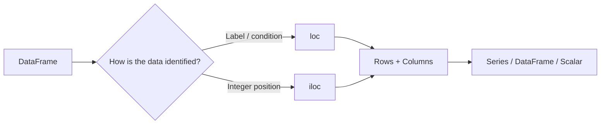
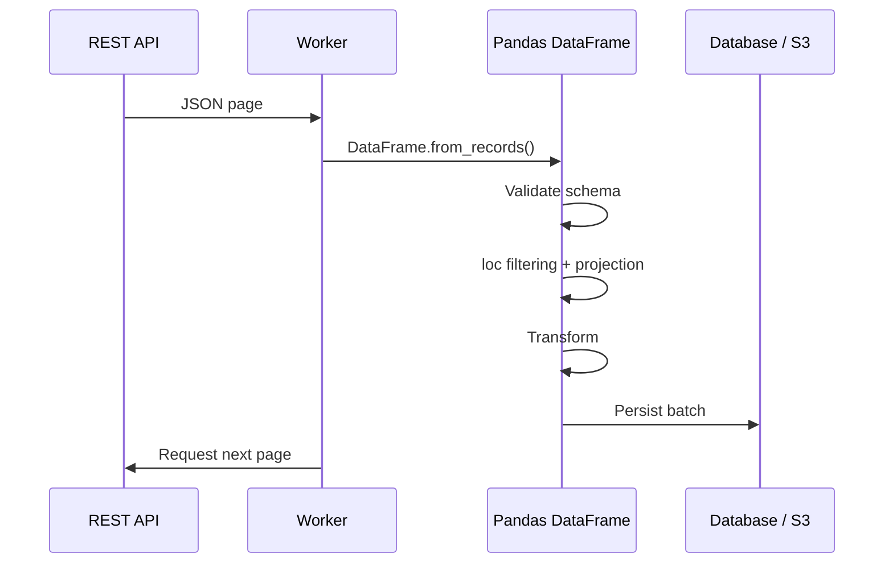
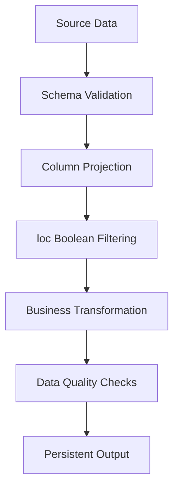

# 04- Loc And Iloc

## Overview

`loc` and `iloc` are the two primary Pandas indexers for selecting and modifying data.

The core distinction is:

```text
loc
↓
label-based selection

iloc
↓
position-based selection
```

This distinction affects:

- row selection
- column selection
- slicing
- boolean filtering
- assignment
- index alignment
- production correctness
- code maintainability

For backend and data-engineering work, `loc` should usually be preferred when the requirement is expressed in terms of semantic labels such as:

```text
order_id
customer_id
status
created_at
amount
```

`iloc` is appropriate when the requirement is explicitly positional, such as:

```text
first row
last three rows
columns 2 through 5
every second record
```

A useful mental model is:



---

## `loc` and `iloc` at a Glance

| Indexer | Basis | Typical use | Example |
|---|---|---|---|
| `loc` | Label | business keys, column names, boolean masks | `df.loc["O-1001"]` |
| `iloc` | Position | positional extraction | `df.iloc[0]` |
| `at` | Single label pair | one scalar by label | `df.at["O-1001", "amount"]` |
| `iat` | Single position pair | one scalar by position | `df.iat[0, 2]` |

The most important distinction is not syntax. It is the contract represented by the selection.

---

## A Realistic DataFrame

Use an order dataset to make the semantics concrete:

```python
import pandas as pd

orders = pd.DataFrame(
    {
        "order_id": ["O-1001", "O-1002", "O-1003", "O-1004"],
        "customer_id": ["C-101", "C-102", "C-101", "C-103"],
        "status": ["completed", "pending", "completed", "cancelled"],
        "amount": [125.50, 300.00, 750.00, 50.00],
    }
)
```

The default index is:

```text
0
1
2
3
```

Visually:

```text
   order_id  customer_id      status  amount
0  O-1001    C-101          completed  125.50
1  O-1002    C-102          pending    300.00
2  O-1003    C-101          completed  750.00
3  O-1004    C-103          cancelled   50.00
```

---

## Why `loc` Exists

`loc` allows selection based on labels.

The reason this matters is that labels usually represent the business meaning of the data.

For example:

```python
orders = orders.set_index("order_id")
```

Now:

```text
         customer_id      status  amount
order_id
O-1001   C-101          completed  125.50
O-1002   C-102          pending    300.00
O-1003   C-101          completed  750.00
O-1004   C-103          cancelled   50.00
```

Selecting:

```python
orders.loc["O-1003"]
```

means:

```text
select the row whose label is O-1003
```

That contract remains meaningful even if row ordering changes.

---

## Basic `loc` Syntax

The general form is:

```python
df.loc[row_selector, column_selector]
```

Both selectors are optional.

Row only:

```python
orders.loc["O-1003"]
```

Rows and one column:

```python
orders.loc[
    "O-1003",
    "amount",
]
```

Rows and multiple columns:

```python
orders.loc[
    ["O-1001", "O-1003"],
    [
        "customer_id",
        "amount",
    ],
]
```

All rows and selected columns:

```python
orders.loc[
    :,
    [
        "order_id",
        "amount",
    ],
]
```

---

## Basic `iloc` Syntax

`iloc` uses integer positions:

```python
df.iloc[row_position, column_position]
```

First row:

```python
orders.iloc[0]
```

Third row:

```python
orders.iloc[2]
```

Third row, fourth column:

```python
orders.iloc[2, 3]
```

Rows 0 through 2:

```python
orders.iloc[0:3]
```

Columns 1 through 3:

```python
orders.iloc[:, 1:4]
```

---

## Label vs Position

Suppose:

```python
orders = orders.set_index("order_id")
```

Then:

```python
orders.loc["O-1003"]
```

means:

```text
label = O-1003
```

while:

```python
orders.iloc[2]
```

means:

```text
position = 2
```

These are not interchangeable concepts.

A robust application distinguishes:

```text
business identity
```

from:

```text
physical ordering
```

---

## Why `loc` Is Usually Better for Business Logic

Consider:

```python
orders.iloc[2]
```

This assumes:

```text
the required order is currently the third row
```

Now suppose an upstream step:

```text
sorts the DataFrame
filters records
concatenates another batch
resets the index
```

The same business record may no longer be at position 2.

Compare:

```python
orders.loc["O-1003"]
```

This expresses:

```text
retrieve order O-1003
```

That is usually a stronger production contract.

---

## Why `iloc` Still Matters

`iloc` is appropriate when the requirement genuinely concerns position.

Examples:

```python
first_row = df.iloc[0]
```

```python
last_three = df.iloc[-3:]
```

```python
sample = df.iloc[::10]
```

```python
first_five_columns = df.iloc[:, :5]
```

Typical use cases include:

- positional sampling
- inspecting a fixed-width report
- implementing algorithms based on row position
- selecting head/tail windows
- working with data where position itself is meaningful

Do not avoid `iloc`; use it when positional semantics are intentional.

---

## `loc` with Boolean Masks

One of the most important `loc` patterns is boolean filtering.

```python
high_value_orders = orders.loc[
    orders["amount"] > 500
]
```

The condition produces a boolean Series:

```text
order      amount    condition
O-1001     125.50    False
O-1002     300.00    False
O-1003     750.00    True
O-1004      50.00    False
```

`loc` applies that mask to the DataFrame.

This is the standard vectorized alternative to:

```python
for row in ...
```

for common filtering tasks.

---

## Multiple Conditions with `loc`

Use element-wise operators:

```python
completed_high_value = orders.loc[
    (
        orders["status"] == "completed"
    )
    & (
        orders["amount"] >= 500
    )
]
```

For OR:

```python
selected = orders.loc[
    (
        orders["status"] == "completed"
    )
    | (
        orders["status"] == "pending"
    )
]
```

For negation:

```python
selected = orders.loc[
    ~orders["status"].eq("cancelled")
]
```

Use:

```text
&  → AND
|  → OR
~  → NOT
```

Do not use:

```text
and
or
not
```

with Series expressions.

---

## Why Parentheses Matter

Correct:

```python
orders.loc[
    (
        orders["status"] == "completed"
    )
    & (
        orders["amount"] > 500
    )
]
```

Incorrect:

```python
orders.loc[
    orders["status"] == "completed"
    & orders["amount"] > 500
]
```

Pandas boolean expressions are built from element-wise operations, and Python operator precedence can change the expression's meaning.

Parenthesize each condition explicitly.

---

## `loc` with `isin`

For membership filtering:

```python
customer_ids = [
    "C-101",
    "C-103",
]

selected = orders.loc[
    orders["customer_id"].isin(customer_ids)
]
```

This is preferable to manually building many OR conditions.

The same pattern works for:

```text
status values
region codes
product IDs
tenant IDs
event types
```

---

## `loc` with `between`

Numeric range filtering:

```python
selected = orders.loc[
    orders["amount"].between(
        100,
        500,
        inclusive="both",
    )
]
```

For date ranges:

```python
selected = orders.loc[
    orders["created_at"].between(
        start_at,
        end_at,
        inclusive="left",
    )
]
```

For incremental processing, half-open intervals are often preferable:

```text
[start, end)
```

because adjacent windows do not overlap.

---

## `loc` and Missing Values

Do not compare missing values using ordinary equality:

```python
orders["customer_id"] == None
```

Use:

```python
orders.loc[
    orders["customer_id"].isna()
]
```

For non-null values:

```python
orders.loc[
    orders["customer_id"].notna()
]
```

For nullable boolean expressions:

```python
mask = (
    orders["status"]
    .eq("completed")
    .fillna(False)
)

completed = orders.loc[mask]
```

The desired behavior for missing values should be explicit.

---

## Selecting Columns with `loc`

Select one column:

```python
amounts = orders.loc[
    :,
    "amount",
]
```

This returns a Series.

Select multiple columns:

```python
report = orders.loc[
    :,
    [
        "order_id",
        "customer_id",
        "amount",
    ],
]
```

This returns a DataFrame.

Using `loc` makes the row and column dimensions explicit.

---

## `df["column"]` vs `df.loc[:, "column"]`

These are usually equivalent for selecting a single existing column:

```python
df["amount"]
```

and:

```python
df.loc[:, "amount"]
```

The first is shorter and idiomatic.

The second becomes useful when expressing a complete two-dimensional selection:

```python
df.loc[
    row_mask,
    "amount",
]
```

or:

```python
df.loc[
    row_mask,
    [
        "amount",
        "status",
    ],
]
```

---

## Selecting One Column as Series vs DataFrame

Series:

```python
amounts = orders.loc[
    :,
    "amount",
]
```

DataFrame:

```python
amounts = orders.loc[
    :,
    ["amount"],
]
```

The difference is:

```text
"amount"
→ Series

["amount"]
→ DataFrame
```

The same distinction exists with:

```python
df["amount"]
```

versus:

```python
df[["amount"]]
```

This is important when passing objects into reusable processing functions.

---

## `iloc` for Rows

First row:

```python
first = orders.iloc[0]
```

Rows 0 through 2:

```python
subset = orders.iloc[0:3]
```

Last row:

```python
last = orders.iloc[-1]
```

Last three rows:

```python
tail = orders.iloc[-3:]
```

Every second row:

```python
sample = orders.iloc[::2]
```

These are positional operations and should be read as such.

---

## `iloc` for Columns

First column:

```python
first_column = orders.iloc[:, 0]
```

Second column:

```python
second_column = orders.iloc[:, 1]
```

First three columns:

```python
first_three = orders.iloc[:, :3]
```

Columns 2 and 4:

```python
selected = orders.iloc[
    :,
    [1, 3],
]
```

This is appropriate when the schema itself is positional or a generic algorithm is working with coordinates.

---

## `iloc` with a Boolean Array

`iloc` primarily expresses integer-position selection.

It can also work with boolean arrays of matching length, but this is less common than using `loc` with a boolean Series.

Prefer:

```python
df.loc[
    df["status"].eq("completed")
]
```

because the condition is expressed semantically and retains alignment semantics.

Use positional boolean arrays when the operation is intentionally positional.

---

## `loc` Label Slicing

Suppose:

```python
df.index = [
    "O-1001",
    "O-1002",
    "O-1003",
    "O-1004",
]
```

Then:

```python
df.loc[
    "O-1002":"O-1004"
]
```

selects the label range.

For label-based slicing, both endpoints are generally included when the labels are present.

This differs from ordinary Python positional slicing.

---

## `iloc` Positional Slicing

With:

```python
df.iloc[1:4]
```

Pandas follows positional slicing semantics:

```text
start included
stop excluded
```

So:

```text
1
2
3
```

are selected.

This matches normal Python slicing and is one of the most useful differences to remember.

---

## Slice Comparison

| Operation | Meaning |
|---|---|
| `df.loc["B":"D"]` | labels from B through D |
| `df.iloc[1:4]` | positions 1 through 3 |
| `df.iloc[:5]` | first five positions |
| `df.iloc[-3:]` | last three positions |

Interview questions often use this distinction to test whether the candidate understands labels versus positions.

---

## `loc` and Missing Labels

With:

```python
df.loc[
    ["O-1001", "O-9999"]
]
```

a missing label can cause an error because `loc` is asking for those exact labels.

This is desirable in strict processing when missing keys indicate a contract violation.

When missing labels are expected, consider:

```python
df.reindex(
    ["O-1001", "O-9999"]
)
```

which can create missing rows.

---

## `loc` vs `reindex`

| Operation | Purpose |
|---|---|
| `loc` | select existing labels |
| `reindex` | construct a new labeled structure |
| `iloc` | select existing positions |

For example:

```python
result = df.reindex(
    requested_order_ids
)
```

is useful when the requested list defines the desired output structure, including missing keys.

---

## `at`

`at` is optimized for one scalar label-based lookup.

```python
amount = orders.at[
    "O-1003",
    "amount",
]
```

Assignment:

```python
orders.at[
    "O-1003",
    "status",
] = "refunded"
```

It is useful for single-cell operations.

It is not a substitute for vectorized batch updates.

---

## `iat`

`iat` performs one scalar positional lookup.

```python
amount = orders.iat[
    2,
    3,
]
```

Assignment:

```python
orders.iat[
    2,
    2,
] = "refunded"
```

Use it when both the row and column are intentionally positional.

---

## Scalar Access Comparison

| Requirement | Preferred accessor |
|---|---|
| one value by business label | `at` |
| one value by position | `iat` |
| multiple rows/columns by label | `loc` |
| multiple rows/columns by position | `iloc` |
| boolean filtering | `loc` |

---

## Conditional Assignment with `loc`

A major reason to understand `loc` is safe mutation.

Suppose high-value completed orders should be marked:

```python
mask = (
    orders["status"].eq("completed")
    & orders["amount"].ge(500)
)

orders.loc[
    mask,
    "priority",
] = True
```

The intent is explicit:

```text
rows matching mask
+
column priority
+
assigned value True
```

---

## Why Chained Assignment Is a Problem

Avoid:

```python
orders[
    orders["amount"] >= 500
]["priority"] = True
```

This creates a chained selection operation and makes it unclear which object is being modified.

Prefer:

```python
orders.loc[
    orders["amount"] >= 500,
    "priority",
] = True
```

The latter expresses a single indexing operation with an explicit assignment target.

---

## Creating an Independent Subset

When a filtered DataFrame will be independently modified:

```python
high_value = orders.loc[
    orders["amount"] >= 500,
    [
        "order_id",
        "amount",
    ],
].copy()
```

`.copy()` communicates:

```text
this result has independent ownership
```

It also avoids ambiguity when later mutation is expected.

However, copying a large dataset increases memory usage, so do not copy everything by default.

---

## Selecting After Setting an Index

Business identifiers can become labels:

```python
orders = orders.set_index(
    "order_id"
)
```

Then:

```python
selected = orders.loc[
    ["O-1001", "O-1003"]
]
```

This can make entity-based lookup very expressive.

Still, a Pandas index is not equivalent to a database primary key. Duplicate labels remain possible unless validated or constrained by application logic.

---

## Duplicate Index Labels

Consider:

```python
events = pd.DataFrame(
    {
        "event_type": [
            "created",
            "retried",
        ],
    },
    index=[
        "O-1001",
        "O-1001",
    ],
)
```

Then:

```python
events.loc["O-1001"]
```

returns multiple rows.

Therefore:

```python
value = df.loc[key]
```

does not necessarily mean:

```text
exactly one row
```

If uniqueness is required:

```python
if not df.index.is_unique:
    raise ValueError(
        "Index must be unique"
    )
```

---

## Index Alignment

A key Pandas behavior is that labeled objects align on index.

```python
prices = pd.Series(
    [100.0, 200.0],
    index=["P-1", "P-2"],
)

discounts = pd.Series(
    [10.0, 20.0],
    index=["P-2", "P-1"],
)

net = prices - discounts
```

The result is aligned by:

```text
P-1 with P-1
P-2 with P-2
```

not by physical position.

This affects assignments as well.

---

## `loc` and Alignment

Suppose a derived Series contains:

```python
discount = pd.Series(
    [10.0, 20.0],
    index=["O-1002", "O-1001"],
)
```

Assigning:

```python
orders["discount"] = discount
```

uses index alignment.

The value associated with:

```text
O-1001
```

is assigned to the row labeled:

```text
O-1001
```

regardless of where that value appears physically in the Series.

This is powerful but requires a deliberate understanding of index identity.

---

## Boolean Masks with `loc`

A boolean mask should have a meaningful relationship with the DataFrame being filtered.

Good:

```python
mask = orders["amount"] > 500

result = orders.loc[mask]
```

More complex logic:

```python
mask = (
    orders["status"].eq("completed")
    & orders["amount"].ge(500)
)

result = orders.loc[mask]
```

Name complex masks when they represent a business rule.

---

## Reusable Selection Functions

Production code should isolate complex selection logic when it represents meaningful business behavior.

```python
def select_billable_orders(
    orders: pd.DataFrame,
    minimum_amount: float,
) -> pd.DataFrame:
    required_columns = {
        "order_id",
        "status",
        "amount",
    }

    missing = (
        required_columns
        - set(orders.columns)
    )

    if missing:
        raise ValueError(
            f"Missing columns: {sorted(missing)}"
        )

    mask = (
        orders["status"].eq("completed")
        & orders["amount"].ge(minimum_amount)
    )

    return orders.loc[
        mask,
        [
            "order_id",
            "amount",
        ],
    ].copy()
```

This pattern separates:

```text
schema validation
business predicate
column projection
ownership
```

and makes the behavior straightforward to test.

---

## Dynamic Column Selection

For configurable reports:

```python
def select_columns(
    frame: pd.DataFrame,
    columns: list[str],
) -> pd.DataFrame:
    missing = [
        column
        for column in columns
        if column not in frame.columns
    ]

    if missing:
        raise ValueError(
            f"Missing columns: {missing}"
        )

    return frame.loc[:, columns]
```

Using column labels keeps configuration tied to schema meaning rather than physical position.

---

## Dynamic Row Selection

When external systems provide business IDs:

```python
requested_ids = [
    "O-1001",
    "O-1003",
]

selected = orders.loc[
    orders["order_id"].isin(
        requested_ids
    )
]
```

Avoid constructing expression strings from external input.

For large ID lists, consider whether the filtering belongs in PostgreSQL or another upstream system rather than loading an excessive dataset into Pandas first.

---

## `query()` vs `loc`

Pandas also provides:

```python
selected = orders.query(
    "amount >= 500 and status == 'completed'"
)
```

For variables:

```python
minimum_amount = 500
required_status = "completed"

selected = orders.query(
    "amount >= @minimum_amount "
    "and status == @required_status"
)
```

`query()` can make filter expressions compact, while `loc` remains more explicit and flexible for dynamic logic.

A practical rule is:

```text
simple / dynamic / reusable mask
→ loc

readable declarative filter expression
→ query
```

---

## `loc` with Rows and Columns

A production-style selection often combines filtering and projection:

```python
report = orders.loc[
    (
        orders["status"].eq("completed")
    )
    & (
        orders["amount"].ge(500)
    ),
    [
        "order_id",
        "customer_id",
        "amount",
    ],
]
```

This is preferable to:

```text
filter everything
→ create many temporary columns
→ drop unused columns later
```

when the unused columns are not required.

---

## Filter Early, Project Early

In a large pipeline:

```python
filtered = raw_orders.loc[
    raw_orders["status"].eq("completed"),
    [
        "order_id",
        "customer_id",
        "amount",
        "updated_at",
    ],
]
```

This reduces the data passed into later operations.

The benefits can include:

```text
lower memory pressure
less copying
less serialization
less network transfer
smaller intermediate objects
```

---

## SQL Pushdown

When data originates in PostgreSQL, equivalent filtering is often better performed in SQL.

Instead of:

```text
PostgreSQL
    ↓
SELECT *
    ↓
Pandas
    ↓
loc filter
```

prefer:

```text
PostgreSQL
    ↓
WHERE filter
    ↓
required columns only
    ↓
Pandas
```

For example:

```sql
SELECT
    order_id,
    customer_id,
    amount,
    updated_at
FROM orders
WHERE status = %(status)s
  AND amount >= %(minimum_amount)s;
```

Pandas should process the bounded result rather than unnecessarily reproducing source-side filtering in memory.

---

## Parquet Projection

For Parquet, select only the required columns during the read:

```python
orders = pd.read_parquet(
    "orders.parquet",
    columns=[
        "order_id",
        "customer_id",
        "amount",
        "updated_at",
    ],
)
```

This is conceptually similar to projection pushdown in SQL.

For large partitioned datasets, combine:

```text
partition pruning
+
column projection
+
Pandas filtering
```

to minimize I/O and memory.

---

## REST API Data

A REST API may provide pages of JSON objects.

A robust flow is:



Do not accumulate every page into one massive DataFrame unless the volume is known to be safe.

Bounded page processing is generally more resilient.

---

## Time-Based Selection

For timestamp data:

```python
orders["updated_at"] = pd.to_datetime(
    orders["updated_at"],
    utc=True,
    errors="raise",
)
```

Then:

```python
batch = orders.loc[
    (
        orders["updated_at"] >= start_at
    )
    & (
        orders["updated_at"] < end_at
    )
]
```

The half-open interval:

```text
[start_at, end_at)
```

is useful for incremental and batch processing because:

```text
batch 1: [00:00, 01:00)
batch 2: [01:00, 02:00)
```

has no overlap at `01:00`.

---

## Selecting a Datetime Index

For time-series workloads:

```python
events = (
    events
    .set_index("created_at")
    .sort_index()
)
```

Then:

```python
january = events.loc[
    "2026-01-01":"2026-01-31"
]
```

For production systems, normalize timestamp semantics first:

```text
timezone
precision
inclusive/exclusive boundaries
late-arriving data
```

Selection is only as reliable as the temporal model underneath it.

---

## MultiIndex with `loc`

For hierarchical datasets:

```python
sales = sales.set_index(
    [
        "customer_id",
        "order_id",
    ]
)
```

Specific tuple-based lookup:

```python
sales.loc[
    ("C-101", "O-1001")
]
```

MultiIndex is powerful for hierarchical selection but adds complexity to:

```text
debugging
serialization
joins
schema validation
downstream APIs
```

Use it when the hierarchy materially helps the workload.

---

## Selecting Rows and Columns from a MultiIndex

```python
result = sales.loc[
    ("C-101", "O-1001"),
    [
        "amount",
        "status",
    ],
]
```

For production use, understand the exact number and order of index levels.

MultiIndex code becomes difficult to maintain when the index structure is implicit or frequently transformed.

---

## `loc` After `merge`

Joins often produce a DataFrame with a fresh or altered index.

Example:

```python
enriched = orders.merge(
    customers,
    on="customer_id",
    how="left",
    validate="many_to_one",
)
```

Then:

```python
result = enriched.loc[
    enriched["country"].eq("IN"),
    [
        "order_id",
        "customer_id",
        "amount",
    ],
]
```

Do not assume that a merge preserves every upstream index property in a way that matches the business key.

When identity matters, keep the business key as an explicit column or restore the intended index deliberately.

---

## `loc` After `concat`

Concatenation can preserve existing indexes:

```python
combined = pd.concat(
    [batch_a, batch_b]
)
```

This can result in duplicate index labels.

If the index is merely positional:

```python
combined = pd.concat(
    [batch_a, batch_b],
    ignore_index=True,
)
```

This makes the new row ordering explicit.

Whether `ignore_index=True` is correct depends on whether the original labels have business meaning.

---

## Position-Based Selection After Sorting

A common pattern:

```python
top_orders = (
    orders
    .sort_values(
        "amount",
        ascending=False,
    )
    .iloc[:10]
)
```

Here `iloc` is appropriate because the requirement is:

```text
the first ten rows after sorting
```

The position becomes meaningful only after establishing the desired ordering.

This is a good example of `iloc` being semantically correct in production code.

---

## Position-Based Selection After Filtering

Likewise:

```python
top_orders = (
    orders.loc[
        orders["status"].eq("completed")
    ]
    .sort_values(
        "amount",
        ascending=False,
    )
    .iloc[:10]
)
```

The workflow is:

```text
semantic filter
→
semantic sort
→
positional selection
```

This is generally more robust than trying to use raw positions before establishing the required order.

---

## When `iloc` Is Safer

`iloc` is safer when the specification explicitly says:

```text
first N
last N
every Kth row
columns at positions X..Y
```

For example:

```python
latest_five = df.sort_values(
    "created_at",
    ascending=False,
).iloc[:5]
```

The code communicates the contract clearly:

```text
sort newest first
→
take first five positions
```

---

## When `loc` Is Safer

`loc` is generally preferable when the specification says:

```text
orders with status completed
order O-1001
customers in region IN
amount >= 500
records between two timestamps
columns order_id and amount
```

These are semantic requirements, so label-based or condition-based selection is more maintainable.

---

## Performance Considerations

For large DataFrames, selection strategy affects performance and memory.

Prefer:

```python
result = df.loc[
    mask,
    required_columns,
]
```

over:

```python
result = df.loc[mask].copy()
result = result.drop(
    columns=unused_columns
)
```

when the unused columns are never needed.

Early projection reduces the size of the intermediate object.

---

## Avoid Repeated Row-by-Row Selection

Avoid patterns such as:

```python
for order_id in order_ids:
    row = orders.loc[order_id]
    ...
```

for large workloads.

Repeated scalar lookups can introduce Python-level overhead.

Prefer vectorized selection:

```python
selected = orders.loc[
    orders.index.isin(order_ids)
]
```

or, when using a business-key column:

```python
selected = orders.loc[
    orders["order_id"].isin(order_ids)
]
```

For very large selections, move the filtering to the database when practical.

---

## Avoid Repeated DataFrame Filtering

This pattern can create unnecessary intermediate objects:

```python
result = df[
    condition_a
][
    condition_b
]
```

Build one explicit mask:

```python
mask = (
    condition_a
    & condition_b
)

result = df.loc[
    mask
]
```

This improves readability and makes the business condition easier to test.

---

## Memory and Copy Behavior

Selection is not purely an indexing-cost question.

For large data:

```python
subset = df.loc[
    mask,
    columns,
].copy()
```

may be exactly what you need, but the copy consumes memory.

Use this distinction:

```text
Need independent mutation?
    → copy()

Need read-only downstream processing?
    → avoid unnecessary copies
```

Do not optimize away a necessary copy merely to save memory if doing so makes ownership ambiguous.

---

## Empty Results

Selection may legitimately return no records:

```python
completed = orders.loc[
    orders["status"].eq("completed")
]
```

An empty result should still maintain the expected schema.

For example:

```python
assert list(
    completed.columns
) == [
    "order_id",
    "customer_id",
    "status",
    "amount",
]
```

Production pipelines should define whether empty selection means:

```text
normal zero-result outcome
```

or:

```text
unexpected upstream condition
```

---

## Unexpected Columns

Strict selection:

```python
required = [
    "order_id",
    "customer_id",
    "amount",
]

result = orders.loc[
    :,
    required,
]
```

If a required column is missing, the operation should fail visibly.

For optional columns:

```python
optional = [
    column
    for column in [
        "discount",
        "coupon_code",
    ]
    if column in orders.columns
]

result = orders.loc[
    :,
    required + optional,
]
```

Do not silently ignore required schema changes.

---

## Testing `loc` and `iloc`

Tests should validate semantics, not just successful execution.

```python
def test_loc_selects_by_label() -> None:
    orders = pd.DataFrame(
        {
            "order_id": ["O-1", "O-2"],
            "amount": [100.0, 200.0],
        }
    ).set_index("order_id")

    result = orders.loc["O-2"]

    assert result["amount"] == 200.0
```

For `iloc`:

```python
def test_iloc_selects_by_position() -> None:
    orders = pd.DataFrame(
        {
            "order_id": ["O-1", "O-2"],
            "amount": [100.0, 200.0],
        }
    )

    result = orders.iloc[1]

    assert result["order_id"] == "O-2"
```

These tests document the contract clearly.

---

## Testing Conditional Selection

```python
def test_select_completed_high_value_orders() -> None:
    orders = pd.DataFrame(
        {
            "order_id": ["O-1", "O-2", "O-3"],
            "status": [
                "completed",
                "pending",
                "completed",
            ],
            "amount": [
                100.0,
                900.0,
                750.0,
            ],
        }
    )

    result = orders.loc[
        (
            orders["status"].eq("completed")
        )
        & (
            orders["amount"].ge(500)
        ),
        [
            "order_id",
            "amount",
        ],
    ]

    expected = pd.DataFrame(
        {
            "order_id": ["O-3"],
            "amount": [750.0],
        },
        index=[2],
    )

    pd.testing.assert_frame_equal(
        result,
        expected,
    )
```

Also test:

```text
no matches
null values
missing columns
duplicate identifiers
unexpected index
```

---

## Production Data Flow

A reliable selection stage can look like:



The important engineering principle is that selection is part of a larger contract:

```text
source schema
→
selection rules
→
output schema
```

Changes to any part of that contract should be tested.

---

## Security Considerations

`loc` and `iloc` do not provide authorization.

Consider a multi-tenant backend:

```python
tenant_orders = orders.loc[
    orders["tenant_id"].eq(
        authorized_tenant_id
    )
]
```

The filtering itself is not the security boundary.

A stronger architecture is:

```text
authentication
    ↓
authorization
    ↓
tenant-scoped database query
    ↓
bounded DataFrame
    ↓
Pandas filtering / transformation
```

Pandas should not be relied upon as the only protection against cross-tenant data exposure.

---

## Reliability and Idempotency

Selection logic should be deterministic for batch retries.

Suppose a worker processes:

```text
[2026-09-01T00:00:00Z,
 2026-09-02T00:00:00Z)
```

Use:

```python
batch = orders.loc[
    (
        orders["updated_at"] >= start_at
    )
    & (
        orders["updated_at"] < end_at
    )
]
```

The same logical input window should select the same logical record set, subject to legitimate source changes.

Stable identifiers and explicit time boundaries are important for:

```text
retries
backfills
reprocessing
checkpoint recovery
reconciliation
```

---

## Observability

Selection logic should be observable in production jobs.

Track:

```text
input_rows
selected_rows
filtered_rows
missing_key_rows
duplicate_key_rows
processing_duration
peak_memory
```

Example:

```python
input_rows = len(df)

filtered = df.loc[
    (
        df["status"].eq("completed")
    )
]

selected_rows = len(filtered)

logger.info(
    "Filtered orders",
    extra={
        "input_rows": input_rows,
        "selected_rows": selected_rows,
        "filtered_rows": (
            input_rows - selected_rows
        ),
    },
)
```

Unexpected changes in these metrics often indicate:

```text
upstream schema changes
source bugs
business-rule changes
data-quality problems
```

---

## SQL + Pandas Decision Framework

Use this general rule:

```text
Can the database perform the filter efficiently?
        |
       yes
        ↓
Push the filter into SQL
        |
       no / transformation-specific
        ↓
Load bounded data into Pandas
        ↓
Use loc for semantic selection
```

Examples:

| Requirement | Preferred location |
|---|---|
| `status = 'completed'` | SQL when source is relational |
| timestamp window | SQL when source is relational |
| select required columns | SQL / Parquet projection |
| complex Python-only transformation | Pandas |
| API response normalization | Pandas |
| report-specific business filtering | Pandas when appropriate |
| very large source dataset | pushdown + chunking/incremental processing |

---

## Common Mistakes

### Using `iloc` for Business Identity

```python
df.iloc[17]
```

does not mean:

```text
customer 17
```

It means:

```text
the eighteenth row
```

Use labels or predicates when the business requirement is semantic.

### Using `loc` with Positions

```python
df.loc[0]
```

means label `0`, not necessarily the first row.

Use:

```python
df.iloc[0]
```

for the first row by position.

### Forgetting Parentheses

Compound boolean conditions must be grouped clearly.

### Using `and` or `or`

Use:

```python
&
|
~
```

for element-wise Series logic.

### Chained Assignment

Avoid:

```python
df[mask]["status"] = "done"
```

Use:

```python
df.loc[mask, "status"] = "done"
```

### Assuming `loc[key]` Always Returns One Record

Duplicate labels can produce multiple rows.

### Ignoring Index Alignment

Series assignment and arithmetic may align by index instead of position.

### Using Positional Columns in Evolving Schemas

This:

```python
df.iloc[:, 7]
```

can break when upstream columns are added or reordered.

Prefer:

```python
df["amount"]
```

when selecting by business meaning.

### Copying Huge Subsets Without Considering Memory

`.copy()` is valuable but not free.

### Filtering Too Late

Loading excessive rows and columns before selecting creates unnecessary:

```text
I/O
memory usage
serialization
processing
```

### Treating Empty Results as Errors Automatically

Zero rows may be a valid result.

---

## Interview Traps

### Is `loc` label-based?

Yes.

```python
df.loc["O-1001"]
```

uses the row label.

### Is `iloc` label-based?

No.

```python
df.iloc[0]
```

uses integer position.

### What Does `df.loc[0]` Mean?

It means:

```text
find row with label 0
```

not:

```text
find first row
```

The distinction matters when the index is not a default `RangeIndex`.

### What Does `df.iloc[0]` Mean?

The first row by position, regardless of its label.

### Does `loc` Return a Series or DataFrame?

It depends on the selector.

```python
df.loc["O-1"]
```

may return a Series.

```python
df.loc[["O-1"]]
```

returns a DataFrame.

Likewise:

```python
df.loc[:, "amount"]
```

returns a Series, while:

```python
df.loc[:, ["amount"]]
```

returns a DataFrame.

### Are `loc` Slices Like Python Slices?

Not exactly.

Label slicing with `loc` generally includes both endpoints when the labels are present.

Positional slicing with `iloc` follows Python-style stop-exclusive behavior.

### Why Use `loc` for Assignment?

It makes the target rows and columns explicit:

```python
df.loc[mask, "status"] = "completed"
```

This is clearer and safer than chained indexing.

### When Should You Use `iloc`?

Use it when position itself is the intended contract:

```python
df.iloc[:10]
```

for the first ten rows.

### Can `loc` Use Boolean Conditions?

Yes. This is one of its most important use cases:

```python
df.loc[df["amount"] > 500]
```

### Can `iloc` Use Column Names?

No. `iloc` is positional.

For:

```python
df.iloc[:, 2]
```

the number `2` means the third column by position.

### What Happens with Duplicate Index Labels?

A label lookup can return multiple rows.

### Why Can Two Equal-Length Series Produce Unexpected Arithmetic?

Because Pandas aligns by index labels rather than assuming positional correspondence.

### Why Does `loc` Matter in ETL?

It allows explicit, testable semantic filtering and projection:

```python
output = df.loc[
    mask,
    required_columns,
]
```

This makes the output contract visible.

### How Would You Select the Top Ten Completed Orders?

```python
result = (
    orders.loc[
        orders["status"].eq("completed")
    ]
    .sort_values(
        "amount",
        ascending=False,
    )
    .iloc[:10]
)
```

The reasoning is:

```text
semantic filter
→
semantic sort
→
positional top-N
```

### How Would You Select Orders Between Two Timestamps?

```python
result = orders.loc[
    (
        orders["updated_at"] >= start_at
    )
    & (
        orders["updated_at"] < end_at
    )
]
```

A half-open interval avoids overlap between adjacent processing windows.

---

## Production Checklist

```text
[ ] Use loc for semantic labels and boolean filters
[ ] Use iloc for intentional positional access
[ ] Use at/iat only for scalar access
[ ] Parenthesize compound boolean conditions
[ ] Use &, |, and ~ for Series logic
[ ] Validate required columns
[ ] Define missing-value behavior
[ ] Check index uniqueness when uniqueness matters
[ ] Understand label alignment
[ ] Avoid chained assignment
[ ] Use .copy() when independent mutation is required
[ ] Project only required columns
[ ] Filter early when practical
[ ] Push filtering into SQL when appropriate
[ ] Use Parquet column projection for large files
[ ] Treat empty selections deliberately
[ ] Prefer stable semantic identifiers over row positions
[ ] Test both expected results and edge cases
[ ] Monitor input/output row counts for production jobs
```

## Key Takeaways

- `loc` is semantic and label-based; `iloc` is positional. Choose the accessor based on the contract the code needs to express.
- `loc` is the primary tool for boolean filtering, column projection, and safe conditional assignment; use `.loc[rows, columns]` to make intent explicit.
- `iloc` is ideal for operations such as top-N selection after sorting, head/tail extraction, and other cases where row or column position is intentionally meaningful.
- Pandas indexing interacts with duplicate labels, index alignment, missing values, and mutation semantics, so production code must validate assumptions rather than relying on implicit behavior.
- For scalable backend pipelines, combine semantic Pandas selection with SQL predicate pushdown, Parquet projection, bounded batches, explicit schemas, deterministic time windows, and observable row counts.