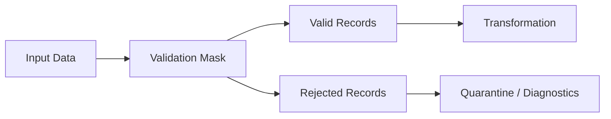
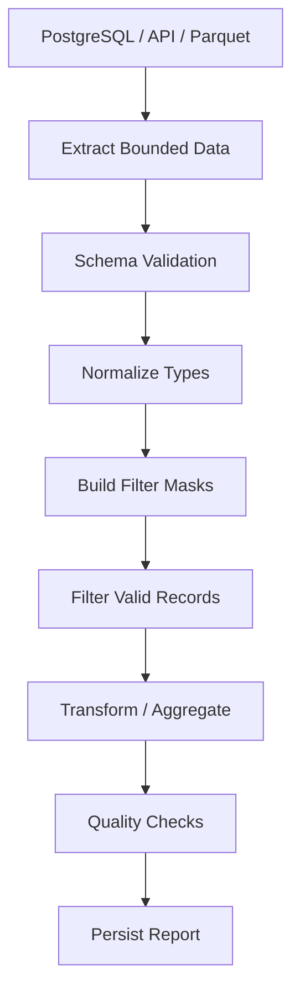

# 05- Filtering

## Overview

Filtering is the process of selecting rows from a Pandas `DataFrame` or `Series` based on conditions.

In production data processing, filtering is rarely an isolated operation. It is usually part of a larger pipeline:

```text
source data
    ↓
schema validation
    ↓
filtering
    ↓
transformation
    ↓
aggregation / join
    ↓
data quality checks
    ↓
persistence / reporting
```

A good filtering implementation should be:

- correct
- explicit
- vectorized
- deterministic
- memory-conscious
- easy to test
- consistent with the source data contract

Typical requirements include:

```text
completed orders
orders above a monetary threshold
customers from selected countries
transactions within a time window
records with required fields
events of specific types
rows excluding test accounts
```

The most common Pandas tools for filtering are:

```text
boolean masks
loc
isin()
between()
query()
isna()
notna()
```

---

## Boolean Filtering

The fundamental Pandas filtering pattern is a boolean mask.

```python
completed = orders.loc[
    orders["status"].eq("completed")
]
```

The expression:

```python
orders["status"].eq("completed")
```

produces a boolean `Series` aligned with the DataFrame index.

Conceptually:

```text
order_id   status       mask
O-1001     completed    True
O-1002     pending      False
O-1003     completed    True
O-1004     cancelled    False
```

The mask is then used to select rows.

This is vectorized filtering: Pandas evaluates the condition across the column instead of requiring an explicit Python loop.

---

## Why Boolean Masks Matter

Boolean masks provide a clear separation between:

```text
condition
```

and:

```text
selection
```

For example:

```python
mask = (
    orders["status"].eq("completed")
)

completed = orders.loc[mask]
```

This separation is useful when:

- the condition is complex
- the condition is reused
- the business rule deserves a name
- the mask needs to be tested independently
- production logging needs to report selection behavior

---

## Equality Filtering

Use vectorized comparison methods or operators.

```python
completed = orders.loc[
    orders["status"] == "completed"
]
```

Equivalent:

```python
completed = orders.loc[
    orders["status"].eq("completed")
]
```

Both are standard.

Method-based comparisons can improve readability when chaining multiple conditions:

```python
orders["status"].eq("completed")
```

and:

```python
orders["amount"].ge(500)
```

make the comparison operation explicit.

---

## Numeric Comparisons

```python
large_orders = orders.loc[
    orders["amount"] >= 500
]
```

Method equivalent:

```python
large_orders = orders.loc[
    orders["amount"].ge(500)
]
```

Other common comparisons:

```python
orders["amount"].gt(500)   # >
orders["amount"].ge(500)   # >=
orders["amount"].lt(500)   # <
orders["amount"].le(500)   # <=
orders["amount"].eq(500)   # ==
orders["amount"].ne(500)   # !=
```

These methods operate element-wise over the Series.

---

## Multiple Conditions

Use Pandas' element-wise operators:

```python
high_value_completed = orders.loc[
    (
        orders["status"].eq("completed")
    )
    & (
        orders["amount"].ge(500)
    )
]
```

The operators are:

| Operator | Meaning |
|---|---|
| `&` | element-wise AND |
| `\|` | element-wise OR |
| `~` | element-wise NOT |

Do not use:

```python
and
or
not
```

with Pandas Series.

---

## Why `and` and `or` Are Wrong

A Pandas Series contains multiple boolean values:

```text
True
False
True
False
```

Python's:

```python
and
or
```

operate on scalar truth values rather than element-wise arrays.

This is incorrect:

```python
orders[
    (orders["amount"] > 500)
    and
    (orders["status"] == "completed")
]
```

Use:

```python
orders.loc[
    (orders["amount"] > 500)
    &
    (orders["status"] == "completed")
]
```

---

## Parentheses Are Required

Correct:

```python
filtered = orders.loc[
    (
        orders["amount"] > 500
    )
    & (
        orders["status"] == "completed"
    )
]
```

Do not rely on Python operator precedence to produce the intended Pandas expression.

Parenthesizing each condition makes the logic explicit and easier to review.

This becomes particularly important when a filtering rule contains:

```text
AND
OR
NOT
```

in combination.

---

## Combining `AND` and `OR`

Suppose the rule is:

```text
completed AND amount >= 500
OR
priority customer
```

Represent it explicitly:

```python
filtered = orders.loc[
    (
        (
            orders["status"].eq("completed")
        )
        & (
            orders["amount"].ge(500)
        )
    )
    | (
        orders["priority_customer"].eq(True)
    )
]
```

Avoid compact expressions that make precedence difficult to understand.

Business rules should be easy to audit.

---

## Negating a Condition

Use `~`:

```python
non_cancelled = orders.loc[
    ~orders["status"].eq("cancelled")
]
```

For multiple conditions:

```python
filtered = orders.loc[
    ~(
        orders["status"].eq("cancelled")
        | orders["status"].eq("refunded")
    )
]
```

This expresses:

```text
not (cancelled OR refunded)
```

rather than trying to manually construct the inverse expression.

---

## Filtering with `isin()`

Use `isin()` for membership conditions.

```python
allowed_statuses = [
    "completed",
    "pending",
]

filtered = orders.loc[
    orders["status"].isin(
        allowed_statuses
    )
]
```

This is clearer than:

```python
(
    orders["status"].eq("completed")
)
|
(
    orders["status"].eq("pending")
)
```

It is particularly useful for:

- status sets
- country codes
- product IDs
- customer IDs
- event types
- tenant IDs

---

## Excluding Values with `isin()`

Use `~` with `isin()`:

```python
excluded_customers = {
    "C-900",
    "C-901",
}

filtered = orders.loc[
    ~orders["customer_id"].isin(
        excluded_customers
    )
]
```

This pattern is useful for:

```text
test accounts
blacklisted records
already-processed IDs
excluded product types
internal tenants
```

---

## `isin()` with a Series

Membership values can come from another Series:

```python
active_customer_ids = customers.loc[
    customers["active"],
    "customer_id",
]

orders_for_active_customers = orders.loc[
    orders["customer_id"].isin(
        active_customer_ids
    )
]
```

This is useful when one dataset defines the selection criteria for another.

For large datasets, consider whether the relationship should instead be represented as a database join or Pandas `merge()`.

---

## Range Filtering with `between()`

For numeric ranges:

```python
filtered = orders.loc[
    orders["amount"].between(
        100,
        500,
        inclusive="both",
    )
]
```

This is easier to read than:

```python
filtered = orders.loc[
    (orders["amount"] >= 100)
    & (orders["amount"] <= 500)
]
```

Use `inclusive` deliberately.

Supported semantics include:

```text
both
left
right
neither
```

---

## Half-Open Time Windows

For batch and incremental processing, half-open intervals are often preferable:

```python
batch = orders.loc[
    (
        orders["updated_at"] >= start_at
    )
    & (
        orders["updated_at"] < end_at
    )
]
```

This represents:

```text
[start_at, end_at)
```

Adjacent windows then compose without overlap:

```text
[00:00, 01:00)
[01:00, 02:00)
[02:00, 03:00)
```

This is particularly useful for:

- batch jobs
- Celery tasks
- Kafka processing windows
- reporting periods
- database extracts
- backfills

---

## Datetime Filtering

Normalize datetimes before filtering.

```python
orders["updated_at"] = pd.to_datetime(
    orders["updated_at"],
    utc=True,
    errors="raise",
)
```

Then:

```python
window = orders.loc[
    (
        orders["updated_at"] >= start_at
    )
    & (
        orders["updated_at"] < end_at
    )
]
```

Production concerns include:

```text
timezone
timestamp precision
null timestamps
invalid timestamps
late-arriving records
inclusive/exclusive boundaries
```

Never rely on ambiguous local-time semantics for distributed pipelines.

---

## Filtering Missing Values

Use `isna()`:

```python
missing_customer = orders.loc[
    orders["customer_id"].isna()
]
```

Use `notna()`:

```python
valid_customer = orders.loc[
    orders["customer_id"].notna()
]
```

Avoid:

```python
orders["customer_id"] == None
```

because missing values in Pandas require dedicated null-aware operations.

---

## Combining Null and Business Conditions

For example:

```python
valid_orders = orders.loc[
    orders["customer_id"].notna()
    & orders["amount"].notna()
    & orders["amount"].ge(0)
]
```

This simultaneously enforces:

```text
customer exists
AND
amount exists
AND
amount is non-negative
```

For data pipelines, this is often better than dropping nulls globally because the required fields are explicit.

---

## Nullable Boolean Conditions

Some Pandas dtypes support a third logical state:

```text
True
False
<NA>
```

For example:

```python
is_completed = (
    orders["status"]
    .eq("completed")
)
```

If downstream logic needs a strict boolean decision:

```python
is_completed = is_completed.fillna(False)
```

Then:

```python
completed = orders.loc[
    is_completed
]
```

The missing-value policy should reflect business semantics.

---

## Filtering Strings

Normalize textual data before filtering when source quality is inconsistent.

```python
orders["status"] = (
    orders["status"]
    .astype("string")
    .str.strip()
    .str.lower()
)
```

Then:

```python
completed = orders.loc[
    orders["status"].eq("completed")
]
```

This avoids mismatches such as:

```text
Completed
 completed
COMPLETED
completed
```

However, normalization should happen as an explicit data-cleaning step rather than being hidden inside every filtering expression.

---

## String Pattern Filtering

Use vectorized string methods:

```python
refunds = transactions.loc[
    transactions["description"]
    .str.startswith(
        "REFUND",
        na=False,
    )
]
```

Substring:

```python
failed = transactions.loc[
    transactions["description"]
    .str.contains(
        "failed",
        case=False,
        na=False,
    )
]
```

Regular expression patterns are also supported:

```python
internal = users.loc[
    users["email"]
    .str.contains(
        r"@internal\.example$",
        regex=True,
        na=False,
    )
]
```

Treat externally supplied patterns carefully because complex regular expressions can become a CPU or reliability concern.

---

## Why `na=False` Matters

String operations may produce missing values when the source contains nulls.

For filtering, you often want a deterministic boolean mask:

```python
mask = (
    transactions["description"]
    .str.contains(
        "refund",
        case=False,
        na=False,
    )
)
```

Now:

```text
True
False
False
```

is easier to consume than:

```text
True
False
<NA>
```

Use `na=False` when missing text should mean "does not match."

---

## Filtering on Multiple Columns

A production filter may involve several business rules:

```python
eligible = orders.loc[
    orders["status"].eq("completed")
    & orders["customer_id"].notna()
    & orders["amount"].ge(100)
    & orders["currency"].eq("INR")
]
```

This is preferable to multiple sequential filters:

```python
eligible = orders[
    condition_a
][
    condition_b
][
    condition_c
]
```

A single explicit mask is easier to inspect and usually avoids unnecessary intermediate objects.

---

## Naming Complex Filters

For complex business rules:

```python
eligible_mask = (
    orders["status"].eq("completed")
    & orders["customer_id"].notna()
    & orders["amount"].ge(100)
    & orders["currency"].eq("INR")
)

eligible_orders = orders.loc[
    eligible_mask
]
```

This makes the rule:

```text
visible
testable
reusable
loggable
```

It also makes code review easier.

---

## Selecting Columns During Filtering

Filter rows and project columns together:

```python
eligible = orders.loc[
    (
        orders["status"].eq("completed")
    )
    & (
        orders["amount"].ge(500)
    ),
    [
        "order_id",
        "customer_id",
        "amount",
    ],
]
```

This has an important performance property:

```text
fewer rows
+
fewer columns
=
smaller downstream object
```

For large datasets, early projection can reduce memory and processing costs.

---

## Filtering and Empty Results

A valid filter can return zero rows:

```python
result = orders.loc[
    orders["status"].eq("refunded")
]
```

Check:

```python
result.empty
```

Do not automatically treat an empty result as a failure.

The pipeline contract should define whether zero matches mean:

```text
normal result
warning
validation failure
source failure
```

For example, a report for a day with no refunds can legitimately produce an empty dataset.

---

## Preserving the Output Schema

Even when no rows match, the expected columns should remain available.

```python
result = orders.loc[
    orders["status"].eq("refunded"),
    [
        "order_id",
        "customer_id",
        "amount",
    ],
]
```

This makes downstream code more predictable.

Schema stability matters for:

```text
Parquet
CSV
database loading
API responses
report generation
automated tests
```

---

## Filtering Duplicates

Filtering and duplicate handling are separate concerns.

For example:

```python
completed = orders.loc[
    orders["status"].eq("completed")
]
```

does not remove duplicate orders.

If duplicate business records must be removed, use an explicit rule:

```python
completed = (
    orders.loc[
        orders["status"].eq("completed")
    ]
    .drop_duplicates(
        subset=["order_id"],
        keep="last",
    )
)
```

The choice of `keep` must reflect business semantics.

Never add `drop_duplicates()` merely because duplicate rows look undesirable.

---

## Filtering Invalid Values

Suppose negative transaction amounts are invalid:

```python
valid = transactions.loc[
    transactions["amount"].ge(0)
]
```

For multiple constraints:

```python
valid = transactions.loc[
    transactions["amount"].ge(0)
    & transactions["currency"].isin(
        ["INR", "USD", "EUR"]
    )
]
```

Filtering invalid records should normally be accompanied by a decision about what happens to the rejected rows:

```text
drop
quarantine
reject batch
repair
report
```

Silently discarding invalid records can hide data-quality failures.

---

## Capturing Rejected Records

A robust ETL pipeline often creates both datasets:

```python
valid_mask = (
    transactions["amount"].ge(0)
    & transactions["currency"].isin(
        ["INR", "USD", "EUR"]
    )
)

valid = transactions.loc[
    valid_mask
].copy()

rejected = transactions.loc[
    ~valid_mask
].copy()
```

This provides a useful flow:



For production data pipelines, retaining rejected records with a reason can greatly improve operational debugging.

---

## Rejection Reasons

Instead of only calculating one boolean mask, complex validation can create reason columns:

```python
transactions = transactions.copy()

transactions["invalid_amount"] = (
    transactions["amount"].lt(0)
)

transactions["invalid_currency"] = (
    ~transactions["currency"].isin(
        ["INR", "USD", "EUR"]
    )
)

transactions["is_valid"] = ~(
    transactions["invalid_amount"]
    | transactions["invalid_currency"]
)
```

Then:

```python
valid = transactions.loc[
    transactions["is_valid"]
].copy()
```

Rejected rows can be analyzed using:

```python
rejected = transactions.loc[
    ~transactions["is_valid"]
]
```

This pattern is useful for data-quality workflows.

---

## Filtering with `query()`

`query()` provides expression-based filtering:

```python
filtered = orders.query(
    "amount >= 500 and status == 'completed'"
)
```

External variables can be referenced using `@`:

```python
minimum_amount = 500
required_status = "completed"

filtered = orders.query(
    "amount >= @minimum_amount "
    "and status == @required_status"
)
```

`query()` can be useful when the expression is naturally tabular and readability improves.

---

## `query()` vs Boolean Masks

| Method | Strength | Limitation |
|---|---|---|
| boolean mask | explicit, flexible, easy to compose | can become verbose |
| `query()` | concise tabular expressions | uses a separate expression syntax |
| `isin()` | clear membership logic | specialized use case |
| `between()` | readable range logic | specialized use case |

Prefer explicit masks when:

```text
conditions are dynamically constructed
complex Python logic is involved
debugging individual conditions matters
```

Prefer `query()` when:

```text
the filtering expression is naturally tabular
a concise expression improves readability
```

---

## Dynamic Filtering

For configurable applications:

```python
def filter_orders(
    orders: pd.DataFrame,
    statuses: list[str],
    minimum_amount: float,
) -> pd.DataFrame:
    mask = (
        orders["status"].isin(statuses)
        & orders["amount"].ge(
            minimum_amount
        )
    )

    return orders.loc[
        mask
    ].copy()
```

This is preferable to building SQL-like strings dynamically in Python.

Explicit boolean expressions are easier to type-check, test, and refactor.

---

## Filtering by User Input

Backend systems may receive filter criteria through REST APIs.

For example:

```text
GET /orders?status=completed&minimum_amount=500
```

A service might translate validated request parameters into:

```python
mask = pd.Series(
    True,
    index=orders.index,
)

if status is not None:
    mask &= orders["status"].eq(status)

if minimum_amount is not None:
    mask &= orders["amount"].ge(
        minimum_amount
    )

result = orders.loc[mask]
```

The important production boundary is:

```text
HTTP input
→
validate parameters
→
construct typed conditions
→
filter DataFrame
```

Do not blindly inject unvalidated request strings into expression evaluators.

---

## Filtering by Tenant

In multi-tenant applications:

```python
tenant_orders = orders.loc[
    orders["tenant_id"].eq(
        authorized_tenant_id
    )
]
```

This is useful as a data-processing constraint, but it should not be the only authorization boundary.

Prefer:

```text
authentication
→
authorization
→
tenant-scoped database query
→
bounded DataFrame
→
Pandas filtering
```

Pandas filtering should not replace database-level access controls.

---

## SQL Predicate Pushdown

A common production mistake is:

```text
SELECT *
FROM orders
```

followed by:

```python
orders.loc[
    orders["status"].eq("completed")
]
```

for a massive table.

When PostgreSQL can execute the predicate efficiently, prefer:

```sql
SELECT
    order_id,
    customer_id,
    amount,
    status
FROM orders
WHERE status = %(status)s;
```

This reduces:

```text
database-to-application transfer
memory usage
deserialization
Pandas processing
```

The same principle applies to Parquet and other columnar storage systems.

---

## Filtering Parquet Data

Read only required columns:

```python
orders = pd.read_parquet(
    "orders.parquet",
    columns=[
        "order_id",
        "status",
        "amount",
    ],
)
```

Then filter:

```python
completed = orders.loc[
    orders["status"].eq("completed")
]
```

For partitioned datasets, filter conditions that match partition keys can enable partition pruning depending on the storage/query layer.

---

## Filtering CSV Data

CSV is less queryable than databases or Parquet, but projection and chunking still matter.

```python
orders = pd.read_csv(
    "orders.csv",
    usecols=[
        "order_id",
        "status",
        "amount",
    ],
)
```

Then:

```python
completed = orders.loc[
    orders["status"].eq("completed")
]
```

For large CSV files, use chunked processing:

```python
for chunk in pd.read_csv(
    "orders.csv",
    usecols=[
        "order_id",
        "status",
        "amount",
    ],
    chunksize=100_000,
):
    completed = chunk.loc[
        chunk["status"].eq("completed")
    ]

    process(completed)
```

Do not assume `read_csv()` filtering is equivalent to database predicate pushdown.

---

## Filtering JSON / API Records

Given:

```python
payload = {
    "items": [
        {
            "order_id": "O-1001",
            "status": "completed",
            "amount": 750,
        },
        {
            "order_id": "O-1002",
            "status": "pending",
            "amount": 100,
        },
    ]
}

orders = pd.DataFrame.from_records(
    payload["items"]
)
```

Filter:

```python
completed = orders.loc[
    orders["status"].eq("completed")
]
```

Validate external payloads before filtering deeply if fields may be missing.

---

## Filtering Event Data

For events:

```python
events = pd.DataFrame(
    {
        "event_id": ["E-1", "E-2", "E-3"],
        "event_type": [
            "order_created",
            "payment_failed",
            "order_created",
        ],
        "order_id": ["O-1", "O-2", "O-3"],
    }
)
```

Select order creation events:

```python
order_created = events.loc[
    events["event_type"].eq(
        "order_created"
    )
]
```

This pattern is common in:

```text
Kafka micro-batches
Celery jobs
event replay
audit processing
analytics pipelines
```

---

## Filtering Before Joins

Suppose only active customers are needed.

Instead of joining every customer:

```python
active_customers = customers.loc[
    customers["active"].eq(True),
    [
        "customer_id",
        "country",
    ],
]

result = orders.merge(
    active_customers,
    on="customer_id",
    how="inner",
    validate="many_to_one",
)
```

This reduces the size of the right-hand dataset before the join.

For large datasets, early filtering can significantly affect memory and join cost.

---

## Filtering After Joins

Sometimes filtering depends on fields introduced by a join:

```python
enriched = orders.merge(
    customers,
    on="customer_id",
    how="left",
    validate="many_to_one",
)

result = enriched.loc[
    enriched["country"].eq("IN")
]
```

The correct order is determined by data dependencies.

Use:

```text
filter before join
```

when the predicate only requires source-side columns.

Use:

```text
filter after join
```

when the predicate depends on joined attributes.

---

## Filtering and Join Cardinality

Filtering before or after a join can change row counts.

For example:

```python
orders.merge(
    customers,
    on="customer_id",
    how="left",
)
```

can create unexpected row multiplication if `customer_id` is not unique in `customers`.

Use:

```python
validate="many_to_one"
```

when that cardinality is expected.

Then filtering occurs against a known relationship rather than an accidental many-to-many join.

---

## Filtering Order Matters

These operations can produce different intermediate sizes:

```text
filter
→
join
```

versus:

```text
join
→
filter
```

Prefer filtering as early as possible when the predicate is independent of later transformations.

Example:

```python
eligible_orders = orders.loc[
    orders["status"].eq("completed")
]

result = eligible_orders.merge(
    customers,
    on="customer_id",
    how="left",
)
```

This can reduce:

```text
rows entering the join
memory usage
join work
```

---

## Filtering and Sorting

Avoid sorting before filtering unless sorting is required by the business rule.

Prefer:

```python
result = (
    orders.loc[
        orders["status"].eq("completed")
    ]
    .sort_values(
        "amount",
        ascending=False,
    )
)
```

instead of:

```python
result = (
    orders
    .sort_values(
        "amount",
        ascending=False,
    )
    .loc[
        orders["status"].eq("completed")
    ]
)
```

The first typically processes fewer rows during the sort.

---

## Filtering and Top-N

For:

```text
top ten completed orders
```

use:

```python
top_orders = (
    orders.loc[
        orders["status"].eq("completed")
    ]
    .nlargest(
        10,
        "amount",
    )
)
```

This can be preferable to fully sorting the filtered dataset:

```python
top_orders = (
    orders.loc[
        orders["status"].eq("completed")
    ]
    .sort_values(
        "amount",
        ascending=False,
    )
    .head(10)
)
```

The appropriate choice depends on the operation and workload, but the important principle is:

```text
filter first
then apply the ranking operation
```

---

## Filtering with Categorical Columns

Low-cardinality categorical columns can reduce memory:

```python
orders["status"] = orders[
    "status"
].astype("category")
```

Filtering remains straightforward:

```python
completed = orders.loc[
    orders["status"].eq("completed")
]
```

Categoricals are especially useful for repeated values such as:

```text
status
country
department
product_type
```

Do not assume categoricals are always beneficial. High-cardinality columns may not provide the same memory advantage.

---

## Filtering Performance

Filtering a DataFrame is generally efficient when expressed as vectorized operations.

Prefer:

```python
filtered = orders.loc[
    orders["amount"].ge(500)
]
```

over:

```python
filtered = orders.loc[
    orders.apply(
        lambda row: row["amount"] >= 500,
        axis=1,
    )
]
```

The `apply(axis=1)` version invokes Python-level logic for rows and is usually slower.

---

## Avoid Python Loops

Avoid:

```python
selected_rows = []

for _, row in orders.iterrows():
    if row["amount"] >= 500:
        selected_rows.append(row)
```

Prefer:

```python
selected = orders.loc[
    orders["amount"].ge(500)
]
```

Vectorization provides clearer intent and generally better performance.

---

## When Python-Level Logic Is Necessary

Not every rule can be expressed naturally with vectorized operations.

If custom Python logic is truly required, isolate it and understand the cost:

```python
def is_eligible(row: pd.Series) -> bool:
    ...

mask = orders.apply(
    is_eligible,
    axis=1,
)

eligible = orders.loc[mask]
```

For large datasets, consider whether the logic should instead be:

```text
rewritten as vectorized operations
moved into SQL
processed in chunks
implemented with another engine
```

Do not use `apply(axis=1)` merely because it feels familiar.

---

## Filtering Large Datasets

Pandas works in memory, so filtering starts with the amount of data loaded.

A poor architecture:

```text
100 GB source
    ↓
load all data into Pandas
    ↓
filter to 1 GB
```

A better architecture:

```text
100 GB source
    ↓
source-side filtering / partition pruning
    ↓
10 GB
    ↓
chunking / bounded processing
    ↓
Pandas filtering
    ↓
1 GB result
```

Filtering is most effective when unnecessary data is avoided before it reaches memory.

---

## Chunk-Level Filtering

For large CSV files:

```python
for chunk in pd.read_csv(
    "transactions.csv",
    chunksize=250_000,
):
    valid = chunk.loc[
        (
            chunk["amount"] >= 0
        )
        & (
            chunk["status"].eq("completed")
        ),
    ]

    process_batch(valid)
```

The important property is:

```text
bounded memory
```

rather than:

```text
accumulate all filtered chunks
```

unless the final combined result is known to fit safely in memory.

---

## Filtering Does Not Solve Global Problems Automatically

Chunk-level filtering is safe for row-local predicates:

```text
amount >= 0
status == completed
country == IN
```

But some problems require global state:

```text
global deduplication
exact rank across all data
cross-chunk joins
global percentiles
```

Do not assume that filtering each chunk independently solves a global data-processing requirement.

---

## Incremental Filtering

For incremental processing:

```python
batch = orders.loc[
    (
        orders["updated_at"] >= start_at
    )
    & (
        orders["updated_at"] < end_at
    )
    & (
        orders["status"].eq("completed")
    )
]
```

This combines:

```text
time boundary
+
business condition
```

A production system should define:

```text
watermark
late-arriving behavior
duplicate handling
retry behavior
checkpoint semantics
```

Filtering is only one component of incremental correctness.

---

## Filtering and Idempotency

A retry should select the same logical input window when the source state is unchanged.

Prefer stable conditions such as:

```python
batch = orders.loc[
    (
        orders["updated_at"] >= start_at
    )
    & (
        orders["updated_at"] < end_at
    )
]
```

Avoid selection logic that depends on unstable row positions:

```python
orders.iloc[:10000]
```

unless the batch boundary is intentionally positional and deterministic.

---

## Filtering and Data Quality

A production pipeline may distinguish:

```text
valid
invalid
quarantined
```

rather than simply dropping failed records.

Example:

```python
valid_mask = (
    orders["order_id"].notna()
    & orders["amount"].notna()
    & orders["amount"].ge(0)
)

valid = orders.loc[
    valid_mask
].copy()

invalid = orders.loc[
    ~valid_mask
].copy()
```

Metrics should capture:

```text
input count
valid count
invalid count
invalid percentage
```

Sudden changes can indicate upstream failures.

---

## Filtering as a Data Contract

Filtering often encodes business rules.

For example:

```python
billable = orders.loc[
    orders["status"].eq("completed")
    & orders["amount"].gt(0)
]
```

The rule is not just a Pandas expression. It represents a business contract:

```text
billable order
=
completed
AND
positive amount
```

Production code should make such contracts:

```text
named
tested
version-controlled
observable
```

---

## Testing Filters

A filter test should verify the result, not just whether the code runs.

```python
def test_filter_billable_orders() -> None:
    orders = pd.DataFrame(
        {
            "order_id": ["O-1", "O-2", "O-3"],
            "status": [
                "completed",
                "pending",
                "completed",
            ],
            "amount": [
                100.0,
                500.0,
                -25.0,
            ],
        }
    )

    result = orders.loc[
        orders["status"].eq("completed")
        & orders["amount"].gt(0)
    ]

    assert result["order_id"].tolist() == [
        "O-1",
    ]
```

Also test:

```text
all rows match
no rows match
null values
invalid values
duplicate identifiers
empty input
missing columns
boundary values
```

---

## Boundary Testing

Filtering often fails at boundaries.

Suppose:

```text
minimum_amount = 500
```

Test:

```text
499.99 → excluded
500.00 → included
500.01 → included
```

For a half-open time window:

```text
start → included
end   → excluded
```

Explicit boundary tests catch subtle production errors.

---

## Filter Equivalence Testing

When replacing one implementation with another for performance, test that results remain equivalent.

For example, replacing:

```python
(
    orders["amount"] >= 100
)
& (
    orders["amount"] <= 500
)
```

with:

```python
orders["amount"].between(
    100,
    500,
    inclusive="both",
)
```

should preserve the same selection semantics.

Use:

```python
pd.testing.assert_frame_equal(
    result_a.reset_index(drop=True),
    result_b.reset_index(drop=True),
)
```

when ordering and index are not part of the contract.

---

## Observability

Filtering metrics are valuable production signals.

Record:

```text
input rows
selected rows
rejected rows
selection ratio
processing duration
memory usage
```

For example:

```python
input_rows = len(orders)

eligible = orders.loc[
    eligible_mask
]

selected_rows = len(eligible)

logger.info(
    "Filtered orders",
    extra={
        "input_rows": input_rows,
        "selected_rows": selected_rows,
        "rejected_rows": (
            input_rows - selected_rows
        ),
    },
)
```

A sudden drop in selection ratio might indicate:

```text
source schema change
status vocabulary change
upstream outage
business-rule change
data corruption
```

---

## Security Considerations

Filtering should not be treated as a complete security control.

For multi-tenant data:

```python
authorized_orders = orders.loc[
    orders["tenant_id"].eq(
        authorized_tenant_id
    )
]
```

This is useful as a processing constraint but should ideally follow:

```text
authentication
↓
authorization
↓
tenant-scoped database access
↓
Pandas processing
```

For backend services, rely on strong access controls at the appropriate persistence layer rather than assuming a Pandas filter alone prevents data exposure.

---

## Reliability Considerations

A production filtering stage should define behavior for:

```text
empty input
missing columns
null values
invalid types
invalid values
duplicate records
unexpected categories
```

For example:

```python
required = {
    "order_id",
    "status",
    "amount",
}

missing = (
    required
    - set(orders.columns)
)

if missing:
    raise ValueError(
        f"Missing columns: {sorted(missing)}"
)
```

Failing early on a broken schema is generally safer than allowing an incomplete filter to produce plausible but incorrect output.

---

## Backend Architecture

A typical backend reporting pipeline can use:



For large workloads:

```text
source pushdown
+
chunking
+
vectorized Pandas filtering
```

provides a more scalable architecture than loading unrestricted source data.

---

## FastAPI and Filtering

A FastAPI reporting endpoint might expose filters such as:

```text
GET /orders?status=completed&minimum_amount=500
```

The request should be processed as:

```text
request
    ↓
Pydantic validation
    ↓
authorization
    ↓
database query
    ↓
bounded DataFrame
    ↓
Pandas filtering
    ↓
response
```

Do not trust raw query parameters as valid business predicates.

Validate:

```text
types
ranges
allowed values
tenant scope
pagination
maximum query size
```

before executing expensive work.

---

## Celery and Batch Filtering

Filtering is often better placed in a background task when the dataset is large:

```text
FastAPI
   ↓
enqueue job
   ↓
Celery worker
   ↓
load bounded batch
   ↓
filter
   ↓
transform
   ↓
persist
```

For worker reliability:

```text
batch ID
watermark
retry policy
idempotent writes
selection metrics
```

should be explicit.

---

## Kafka and Micro-Batches

Kafka consumers can accumulate events into bounded DataFrames:

```text
Kafka records
    ↓
micro-batch
    ↓
DataFrame
    ↓
event-type filter
    ↓
business filter
    ↓
sink
```

Example:

```python
orders = events.loc[
    events["event_type"].eq(
        "order_created"
    )
]

valid = orders.loc[
    orders["order_id"].notna()
]
```

The consumer should commit offsets only after the selected batch has been processed successfully according to the delivery guarantee.

---

## Filtering and PostgreSQL

For relational workloads:

```text
PostgreSQL
    ↓
WHERE / JOIN / projection
    ↓
bounded result
    ↓
Pandas filtering where needed
```

Pandas should not replace SQL for operations the database is designed to execute efficiently.

Use database execution plans and appropriate indexes for source-side filtering.

---

## Filtering and Redis

Redis may provide:

```text
cache
lookup sets
feature flags
temporary state
```

A Pandas filter might use a cached set of IDs:

```python
eligible_ids = redis_client.smembers(
    "eligible_customer_ids"
)

filtered = orders.loc[
    orders["customer_id"].isin(
        eligible_ids
    )
]
```

For large ID sets, evaluate the memory and network cost before transferring them into the application.

---

## Filtering and AWS

A common AWS architecture is:

```text
S3
 ↓
Parquet partitions
 ↓
bounded read
 ↓
Pandas in ECS / EKS / Batch
 ↓
filter + transform
 ↓
S3 / PostgreSQL
```

Useful considerations include:

```text
S3 partition layout
column projection
worker memory size
temporary storage
job duration
retry behavior
CloudWatch metrics
```

Pandas should operate within the memory and runtime limits of the compute environment.

---

## Cost Considerations

Filtering earlier can reduce:

```text
database egress
S3 reads
network transfer
worker memory
CPU time
job duration
```

For cloud workloads, the cheapest computation is often the computation you avoid.

Examples:

```text
SQL predicate pushdown
Parquet column projection
partition pruning
API-side filters
chunk-level filtering
```

should be preferred when supported by the architecture.

---

## Common Mistakes

### Using Python Loops

Avoid:

```python
for _, row in df.iterrows():
    if row["amount"] > 500:
        ...
```

Prefer a vectorized mask.

### Using `and` / `or`

Use:

```python
&
|
~
```

for Series expressions.

### Missing Parentheses

Always make compound conditions explicit.

### Filtering Without Schema Validation

A missing column should usually produce a visible failure when it is required.

### Silently Dropping Invalid Data

Separate rejected records when data quality matters.

### Filtering Too Late

Avoid carrying unnecessary rows through expensive transformations.

### Copying Everything

Use `.copy()` when independent mutation requires it, not automatically for every filter.

### Ignoring Null Semantics

Explicitly decide whether nulls should:

```text
match
not match
fail validation
be repaired
```

### Treating Filtering as Authorization

Pandas selection does not replace access control.

### Using `query()` with Untrusted Strings

Do not construct expression strings by blindly interpolating user input.

Prefer validated variables and explicit boolean masks.

### Ignoring Duplicate Records

Filtering does not deduplicate.

### Ignoring Empty Results

Zero rows may be valid.

### Filtering an Unbounded Dataset

Loading all source data into memory before filtering is a common scalability mistake.

---

## Interview Questions

### What Is a Boolean Mask?

A boolean Series aligned with a DataFrame index that identifies which rows should be selected.

Example:

```python
mask = df["amount"] >= 500
```

### Why Does Pandas Use `&` Instead of `and`?

`&` performs element-wise boolean operations on Series. `and` is a scalar Python boolean operator.

### Why Are Parentheses Required?

They make each boolean condition explicit and avoid Python operator-precedence issues.

### How Do You Filter Multiple Values?

Use `isin()`:

```python
df.loc[
    df["status"].isin(
        ["completed", "pending"]
    )
]
```

### How Do You Filter a Range?

Use `between()`:

```python
df.loc[
    df["amount"].between(
        100,
        500,
    )
]
```

### How Do You Filter Null Values?

Use:

```python
df.loc[
    df["customer_id"].isna()
]
```

or:

```python
df.loc[
    df["customer_id"].notna()
]
```

### How Do You Exclude a Set of Values?

Use:

```python
df.loc[
    ~df["status"].isin(
        excluded_statuses
    )
]
```

### When Is `query()` Useful?

When a tabular filter can be expressed clearly as a compact expression.

### Should All Filtering Happen in Pandas?

No. When the source is a database or partition-aware storage system, push filtering down to the source whenever practical.

### Why Filter Before a Join?

If the join does not require excluded rows, filtering first reduces:

```text
rows
memory
join cost
```

### Why Can Filtering an API Dataset Be Expensive?

Because the application may have to download and deserialize many records before Pandas can remove them.

Prefer API-side filters and pagination when available.

### How Should Large CSV Files Be Filtered?

Read bounded chunks:

```python
for chunk in pd.read_csv(
    path,
    chunksize=100_000,
):
    result = chunk.loc[
        condition
    ]
```

Avoid loading the entire file when it exceeds safe memory limits.

### How Do You Implement an Incremental Time Filter?

Use a half-open interval:

```python
df.loc[
    (df["updated_at"] >= start_at)
    & (df["updated_at"] < end_at)
]
```

### Why Is a Half-Open Interval Useful?

Adjacent batches can be processed without overlapping boundary timestamps.

### How Do You Preserve Rejected Records?

Build the valid mask and use its inverse:

```python
valid = df.loc[valid_mask].copy()
rejected = df.loc[~valid_mask].copy()
```

### Does Filtering Remove Duplicates?

No. Duplicate handling requires a separate operation such as `drop_duplicates()` or a business-key validation rule.

### Why Is `apply(axis=1)` Usually Avoided?

It invokes Python-level logic row by row and is often significantly slower than vectorized operations.

### What Is a Good Production Filtering Pattern?

```text
validate schema
→
normalize types
→
build named mask
→
filter rows
→
project columns
→
validate result
→
persist
```

---

## Filtering Checklist

```text
[ ] Required columns are validated
[ ] Boolean conditions use &, |, and ~
[ ] Compound conditions are parenthesized
[ ] Null semantics are explicit
[ ] isin() is used for membership conditions
[ ] between() is used where range semantics improve readability
[ ] Datetime boundaries are explicit
[ ] Time windows use a deliberate inclusive/exclusive convention
[ ] Complex masks are named
[ ] Required columns are projected early
[ ] Invalid records are handled explicitly
[ ] Empty results are treated according to the pipeline contract
[ ] Filtering is vectorized where possible
[ ] Python row loops are avoided
[ ] apply(axis=1) is justified when used
[ ] Source-side predicate pushdown is considered
[ ] Large files use chunked processing when necessary
[ ] Filtering before joins is considered
[ ] Duplicate handling is explicit
[ ] Authorization is enforced outside Pandas
[ ] Selection metrics are monitored in production
```

## Key Takeaways

- Pandas filtering is built around vectorized boolean masks; use `loc` to turn those masks into explicit row selections.
- Use `&`, `|`, `~`, `isin()`, `between()`, `isna()`, and `notna()` to express common production filtering rules clearly and predictably.
- Filtering should be treated as business logic: define null behavior, boundary semantics, invalid-record handling, duplicate rules, and empty-result expectations explicitly.
- For scalability, filter and project as early as practical, push predicates into SQL or partition-aware storage, and use chunked or incremental processing for datasets that cannot safely fit in memory.
- Production-grade filtering combines correctness with observability, testing, deterministic batch boundaries, security-aware data access, and explicit handling of rejected records.