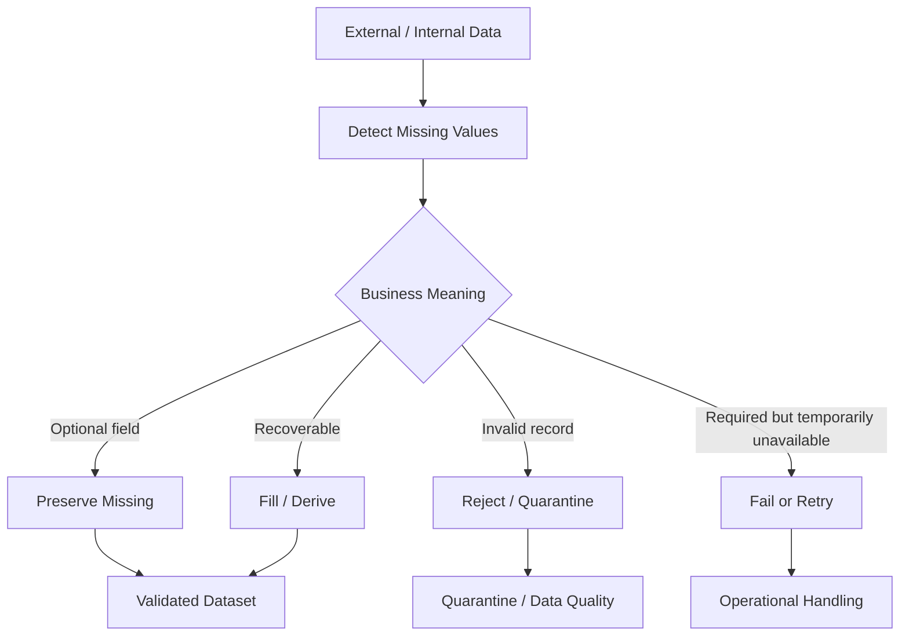
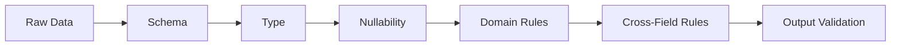

# 06- Missing Values

## Overview

Missing values are one of the most important data-quality concerns in Pandas because real-world data rarely arrives complete.

Missingness can originate from:

```text
optional API fields
NULL database columns
incomplete CSV rows
failed parsing
sensor gaps
partial events
unknown business values
data-entry errors
schema changes
```

In Pandas, missing values can be represented by values such as:

```text
NaN
NaT
pd.NA
None
```

The exact representation depends on the column dtype and operation being performed.

The production goal is not to "remove all nulls." The goal is to define what missingness means for each field and then apply an explicit policy:



For backend engineering, missing-value handling affects:

- correctness
- validation
- aggregation
- filtering
- serialization
- SQL interoperability
- API behavior
- memory usage
- reporting
- batch reliability

---

## Missing Value Representations

Pandas may encounter several missing-value markers.

| Representation | Common context |
|---|---|
| `np.nan` | floating-point missing values |
| `pd.NA` | Pandas nullable dtypes |
| `NaT` | missing datetime/timedelta |
| `None` | Python null object |
| `NaN` | commonly displayed representation of missing numeric data |

Modern Pandas supports nullable dtypes that make missing-value behavior more consistent.

For example:

```python
customer_ids = pd.Series(
    [101, 102, None],
    dtype="Int64",
)
```

The capitalized `Int64` is distinct from NumPy's regular `int64`.

---

## Why Missing Values Exist

Missingness can represent very different states:

```text
unknown
not provided
not applicable
not yet calculated
not available
redacted
not collected
source-system failure
```

These states should not automatically be treated as equivalent.

For example:

```text
discount = missing
```

could mean:

```text
no discount
```

or:

```text
discount calculation failed
```

Those have very different business consequences.

A production pipeline should establish the semantic meaning of missingness before choosing a transformation.

---

## Detecting Missing Values

Use `isna()`:

```python
orders.isna()
```

This returns a boolean DataFrame.

Check one column:

```python
orders["customer_id"].isna()
```

Count missing values:

```python
orders.isna().sum()
```

Count missing values across the entire DataFrame:

```python
total_missing = orders.isna().sum().sum()
```

This is useful for initial data profiling and quality checks.

---

## Detecting Non-Missing Values

Use `notna()`:

```python
orders["customer_id"].notna()
```

Filter valid customer IDs:

```python
orders_with_customer = orders.loc[
    orders["customer_id"].notna()
]
```

The pair:

```text
isna()
notna()
```

should be preferred over direct equality checks against `None` or `NaN`.

---

## Why Equality Comparisons Do Not Work

Do not write:

```python
orders["customer_id"] == None
```

or:

```python
orders["amount"] == float("nan")
```

Missing values generally do not behave like ordinary scalar values.

Use:

```python
orders["customer_id"].isna()
```

instead.

For non-null records:

```python
orders["customer_id"].notna()
```

---

## Missingness by Column

A common production profiling pattern:

```python
missing_counts = orders.isna().sum()
```

Missing percentage:

```python
missing_rates = (
    orders.isna().mean()
    * 100
)
```

This provides metrics such as:

```text
customer_id    0.2%
amount         0.0%
coupon_code   18.7%
country        1.3%
```

The rate is often more informative than the raw count when batch sizes change.

---

## Missingness Report

A reusable profiling function can return both counts and percentages:

```python
def missing_value_report(
    frame: pd.DataFrame,
) -> pd.DataFrame:
    return (
        frame.isna()
        .agg(
            missing_count="sum",
            missing_rate="mean",
        )
        .assign(
            missing_rate=lambda df: (
                df["missing_rate"] * 100
            )
        )
        .sort_values(
            "missing_rate",
            ascending=False,
        )
    )
```

Example output:

```text
             missing_count  missing_rate
coupon_code              187         18.7
country                   13          1.3
customer_id                2          0.2
amount                     0          0.0
```

This can be integrated into batch-level data-quality reporting.

---

## Missing Values and Dtypes

Missing values affect dtypes.

For example:

```python
values = pd.Series(
    [1, 2, None]
)
```

may not retain ordinary integer semantics.

Use a nullable integer dtype when integer semantics are required:

```python
values = pd.Series(
    [1, 2, None],
    dtype="Int64",
)
```

Similarly, use explicit string dtype:

```python
statuses = pd.Series(
    ["completed", None],
    dtype="string",
)
```

Explicit dtypes make missing-value behavior more predictable.

---

## Nullable Integer Dtypes

Use:

```python
customer_ids = pd.Series(
    [101, 102, None],
    dtype="Int64",
)
```

Then:

```python
customer_ids.isna()
```

works as expected.

The nullable integer dtype preserves:

```text
integer semantics
+
missing-value support
```

This is often preferable to converting business identifiers into floating-point values just because some records are missing.

---

## Nullable Boolean Dtypes

Boolean fields can also contain missing values:

```python
flags = pd.Series(
    [True, False, None],
    dtype="boolean",
)
```

This supports:

```text
True
False
<NA>
```

which is useful when:

```text
unknown
```

is meaningfully different from:

```text
False
```

Do not replace missing booleans with `False` unless the business rule explicitly says that missing means false.

---

## String Missing Values

Use:

```python
orders["status"] = orders[
    "status"
].astype("string")
```

Then:

```python
orders["status"].isna()
```

provides clear missing-value semantics.

This is preferable to allowing arbitrary Python objects in a textual column when predictable behavior matters.

---

## Datetime Missing Values

Missing datetimes are commonly represented as `NaT`.

Normalize:

```python
orders["created_at"] = pd.to_datetime(
    orders["created_at"],
    utc=True,
    errors="coerce",
)
```

Then identify failed or missing values:

```python
invalid_dates = orders.loc[
    orders["created_at"].isna()
]
```

Be careful with:

```python
errors="coerce"
```

because invalid input becomes missing instead of raising an exception.

That is useful when invalid records should be quarantined, but dangerous when invalid timestamps must fail the pipeline.

---

## `errors="coerce"` and Silent Data Loss

Consider:

```python
orders["created_at"] = pd.to_datetime(
    orders["created_at"],
    errors="coerce",
)
```

An invalid timestamp such as:

```text
"not-a-date"
```

becomes:

```text
NaT
```

If no validation follows, the original data-quality problem can disappear silently.

Safer production handling:

```python
parsed = pd.to_datetime(
    orders["created_at"],
    utc=True,
    errors="coerce",
)

invalid_mask = (
    orders["created_at"].notna()
    & parsed.isna()
)

if invalid_mask.any():
    invalid = orders.loc[
        invalid_mask
    ].copy()

    raise ValueError(
        "Invalid created_at values detected"
    )

orders["created_at"] = parsed
```

Use coercion deliberately and always define how failed parsing is handled.

---

## Dropping Missing Rows

`dropna()` removes rows containing missing values.

```python
clean = orders.dropna()
```

This is often too aggressive for production pipelines.

For example, an order might legitimately have:

```text
coupon_code = missing
shipping_note = missing
```

while still being valid.

Instead, specify the fields that are required:

```python
clean = orders.dropna(
    subset=[
        "order_id",
        "customer_id",
        "amount",
    ]
)
```

This makes the validation rule explicit.

---

## `dropna()` Parameters

Common parameters include:

| Parameter | Purpose |
|---|---|
| `axis` | remove rows or columns |
| `how` | `any` or `all` |
| `subset` | restrict required columns |
| `thresh` | minimum number of non-null values |
| `inplace` | mutate the object; generally avoid for pipeline clarity |

Example:

```python
clean = orders.dropna(
    subset=["customer_id"],
)
```

This removes only records missing the required customer identifier.

---

## `how="all"`

Remove rows where every value is missing:

```python
clean = orders.dropna(
    how="all",
)
```

This can be useful when external files contain completely blank records.

Do not confuse:

```text
all fields missing
```

with:

```text
any required field missing
```

Those represent different quality rules.

---

## `thresh`

Keep rows with at least a specified number of non-null values:

```python
clean = orders.dropna(
    thresh=4,
)
```

This means a row must contain at least four non-null values.

Use `thresh` when the schema is flexible and completeness is defined by a count.

For business-critical fields, explicit `subset` rules are usually easier to reason about.

---

## Filling Missing Values

Use `fillna()` when a defensible replacement exists.

```python
orders["discount"] = (
    orders["discount"]
    .fillna(0)
)
```

This is appropriate only when:

```text
missing discount
=
no discount
```

is a valid business rule.

Do not use zero as a universal representation of missing numeric data.

---

## Scalar Fill Values

```python
orders["country"] = (
    orders["country"]
    .fillna("UNKNOWN")
)
```

This can be useful for reporting, but `"UNKNOWN"` becomes an actual category and should not be confused with a truly missing value.

For analytics, preserving nulls can be more accurate.

---

## Dictionary-Based Filling

Different columns can use different replacements:

```python
orders = orders.fillna(
    {
        "discount": 0,
        "country": "UNKNOWN",
    }
)
```

This is often clearer than applying one replacement rule to the entire DataFrame.

---

## Forward Fill

For ordered time-series data:

```python
prices["price"] = (
    prices["price"]
    .ffill()
)
```

Forward filling means:

```text
use the most recent previous known value
```

This can be valid for slowly changing state or sensor readings.

It is unsafe when a missing value means:

```text
unknown
invalid
not applicable
```

and should not inherit historical state.

---

## Backward Fill

```python
prices["price"] = (
    prices["price"]
    .bfill()
)
```

Backward filling uses the next known value.

It can be useful in some time-series preparation workflows but can introduce future information into historical records.

That makes it dangerous in:

```text
forecasting
feature generation
point-in-time reporting
machine learning features
```

unless the temporal semantics explicitly allow it.

---

## Forward Fill with a Limit

Limit propagation:

```python
prices["price"] = (
    prices["price"]
    .ffill(limit=2)
)
```

This can prevent one stale value from being propagated indefinitely.

A limit should represent a known business or operational constraint rather than an arbitrary number.

---

## Group-Aware Filling

Sometimes values should be propagated only within an entity.

For example:

```python
orders = orders.sort_values(
    [
        "customer_id",
        "created_at",
    ]
)

orders["segment"] = (
    orders.groupby("customer_id")[
        "segment"
    ]
    .ffill()
)
```

This avoids carrying one customer's value into another customer's records.

Group boundaries should always be explicit.

---

## Interpolation

Numerical gaps can sometimes be estimated:

```python
metrics["value"] = (
    metrics["value"]
    .interpolate()
)
```

Interpolation is appropriate only when:

```text
the variable has meaningful numeric continuity
```

It should not be used for arbitrary business fields such as:

```text
customer_id
status
country
order_id
```

For operational data, interpolation should have a documented domain justification.

---

## Missing Values After Aggregation

Pandas aggregation functions often ignore missing values by default.

For example:

```python
orders["amount"].mean()
```

typically excludes missing values.

This means:

```text
mean of available values
```

is not necessarily:

```text
mean of all expected records
```

For financial and operational reporting, always understand whether missing records should be:

```text
excluded
treated as zero
treated as invalid
imputed
```

---

## `skipna`

Many reduction operations expose `skipna`.

Example:

```python
orders["amount"].sum(
    skipna=True
)
```

and:

```python
orders["amount"].sum(
    skipna=False
)
```

The first ignores missing values, while the second propagates missingness according to the operation's semantics.

The choice should reflect the business meaning of missing values.

---

## Sum with Missing Data

Consider:

```text
amount
100
NaN
200
```

A sum that ignores missing values may produce:

```text
300
```

This can be correct when missing means:

```text
value unavailable but other records remain valid
```

but incorrect when missing means:

```text
transaction amount is required and cannot be omitted
```

Data quality validation should happen before aggregation when completeness is mandatory.

---

## Count vs Size

Missing values affect aggregation differently.

```python
orders["amount"].count()
```

counts non-null values.

Whereas:

```python
len(orders)
```

counts all rows.

This difference is critical in reconciliation.

Example:

```python
row_count = len(orders)
amount_count = orders["amount"].count()
```

If:

```text
row_count != amount_count
```

then at least one amount is missing.

---

## GroupBy and Missing Keys

By default, missing grouping keys may be excluded from group results.

Example:

```python
summary = (
    orders.groupby(
        "customer_id"
    )["amount"]
    .sum()
)
```

Records with missing `customer_id` may not appear as a normal group.

When missing groups must be preserved:

```python
summary = (
    orders.groupby(
        "customer_id",
        dropna=False,
    )["amount"]
    .sum()
)
```

This distinction matters for reconciliation and reporting.

---

## Missing Values in Joins

Consider:

```python
result = orders.merge(
    customers,
    on="customer_id",
    how="left",
)
```

Rows with missing customer IDs may fail to match a customer record.

After the join:

```python
missing_customer = result.loc[
    result["country"].isna()
]
```

may represent:

```text
missing customer_id
or
unknown customer
or
failed reference match
```

Do not assume every null introduced by a join has the same cause.

---

## Join Validation

When relationships are expected to be constrained:

```python
result = orders.merge(
    customers,
    on="customer_id",
    how="left",
    validate="many_to_one",
)
```

This catches unexpected multiplicity.

Missing foreign keys should also be analyzed separately:

```python
orders["customer_id"].isna().sum()
```

and:

```python
result["country"].isna().sum()
```

because they represent different failure modes.

---

## Missing Values and Sorting

Sorting places missing values according to `na_position`.

```python
orders.sort_values(
    "amount",
    na_position="last",
)
```

Available positions include:

```text
first
last
```

Explicitly choose the position when report ordering matters.

Do not assume missing values will always appear at the end.

---

## Filtering Missing Values

Required field:

```python
valid = orders.loc[
    orders["customer_id"].notna()
]
```

Missing field:

```python
incomplete = orders.loc[
    orders["customer_id"].isna()
]
```

Combined rule:

```python
valid = orders.loc[
    orders["customer_id"].notna()
    & orders["amount"].notna()
]
```

This is usually clearer than performing multiple destructive `dropna()` operations.

---

## Missing Values and Duplicate Detection

Missing values can affect duplicate semantics.

For example:

```python
orders.duplicated(
    subset=["customer_id", "order_date"]
)
```

may treat rows with missing values as duplicates according to Pandas' duplicate-detection semantics.

For business keys, define explicitly whether:

```text
missing key
```

should be allowed at all.

If a business identifier is required, validate it before deduplication.

---

## Missing Values in String Operations

Use:

```python
orders["coupon_code"].str.upper()
```

with awareness that missing values remain missing.

For filtering:

```python
coupon_orders = orders.loc[
    orders["coupon_code"]
    .str.startswith(
        "SAVE",
        na=False,
    )
]
```

For replacement:

```python
orders["coupon_code"] = (
    orders["coupon_code"]
    .astype("string")
)
```

Do not convert nulls to strings such as `"nan"` unless that is explicitly desired.

---

## Avoid Stringifying Nulls

This can create a serious data-quality bug:

```python
orders["customer_id"] = (
    orders["customer_id"].astype(str)
)
```

A missing value may become a string representation such as:

```text
"nan"
```

or another textual placeholder.

Prefer nullable string dtype:

```python
orders["customer_id"] = (
    orders["customer_id"]
    .astype("string")
)
```

This preserves missing-value semantics.

---

## Missing Values from CSV

CSV files commonly represent missing values through:

```text
empty fields
NA
N/A
null
NULL
```

Pandas can recognize common missing-value strings during parsing.

For strict production ingestion, define the expected representation explicitly and validate the resulting DataFrame.

Example:

```python
orders = pd.read_csv(
    "orders.csv",
    usecols=[
        "order_id",
        "customer_id",
        "amount",
    ],
)
```

Then inspect:

```python
orders.isna().sum()
```

Do not assume the source's missing-value conventions are stable without a contract.

---

## Missing Values from JSON

API payloads commonly contain:

```json
{
  "order_id": "O-1001",
  "coupon_code": null
}
```

After conversion:

```python
orders = pd.DataFrame.from_records(
    payload["items"]
)
```

the missing field should be handled according to the API contract.

Do not automatically replace every JSON `null` with an empty string or zero.

---

## Missing Values from SQL

Database `NULL` values are mapped into Pandas representations during extraction.

Example:

```python
orders = pd.read_sql_query(
    """
    SELECT
        order_id,
        customer_id,
        discount
    FROM orders
    """,
    connection,
)
```

Validate:

```python
orders.isna().sum()
```

The source schema may already define nullability, but application-level processing should still validate the actual data received.

---

## SQL `NULL` vs Pandas Missing Values

The concepts are related but not identical.

| SQL | Pandas |
|---|---|
| `NULL` | missing-value representation |
| `IS NULL` | `isna()` |
| `IS NOT NULL` | `notna()` |
| `COALESCE()` | `fillna()` or explicit transformation |

For example:

```sql
SELECT *
FROM orders
WHERE customer_id IS NOT NULL;
```

is conceptually similar to:

```python
orders.loc[
    orders["customer_id"].notna()
]
```

Push filtering into SQL when it is appropriate to reduce data transfer.

---

## Missing Values and REST APIs

An API response may distinguish:

```json
{
  "discount": null
}
```

from:

```json
{
  "discount": 0
}
```

Do not collapse the distinction without a business rule.

A missing field may mean:

```text
not calculated
```

while zero means:

```text
calculated and equal to zero
```

This difference can matter for financial reporting.

---

## Missing Values in Financial Data

Financial datasets require conservative null handling.

For example:

```python
transactions["amount"].sum()
```

ignoring missing values may produce a plausible total that hides incomplete records.

For reconciliation:

```python
missing_amounts = transactions[
    "amount"
].isna().sum()

if missing_amounts:
    raise ValueError(
        "Transactions contain missing amounts"
    )
```

Only substitute zero if the business model explicitly defines missing as zero.

---

## Missing Values in Reporting

Reports frequently need consistent display values:

```python
report = orders.assign(
    discount=orders["discount"].fillna(0)
)
```

This is acceptable when the report's semantics define:

```text
missing discount = zero discount
```

Otherwise preserve nulls and let the presentation layer distinguish them from zero.

Data transformation and presentation policy should not be conflated.

---

## Missing Values and API Serialization

When returning DataFrame-derived data through an API, normalize missing values deliberately.

For example:

```python
records = (
    orders.astype(
        {
            "status": "string",
        }
    )
    .where(
        lambda frame: frame.notna(),
        None,
    )
    .to_dict(
        orient="records"
    )
)
```

The API contract should define whether absence is represented as:

```json
null
```

or:

```text
missing property
```

Do not let serialization behavior become an accidental schema decision.

---

## Missing Values in Parquet

Parquet supports nullable columns and preserves schema-oriented metadata more effectively than plain CSV.

A production workflow may be:

```text
raw data
→
normalize nullable dtypes
→
validate missingness
→
write Parquet
```

For example:

```python
orders.to_parquet(
    "orders.parquet",
    index=False,
)
```

The output schema should be treated as a data contract.

---

## Missing Values and Column Types

A robust pipeline often establishes types near the ingestion boundary:

```python
orders = orders.astype(
    {
        "order_id": "string",
        "customer_id": "string",
        "status": "string",
    }
)
```

Then normalize numeric and datetime columns:

```python
orders["amount"] = pd.to_numeric(
    orders["amount"],
    errors="raise",
)

orders["created_at"] = pd.to_datetime(
    orders["created_at"],
    utc=True,
    errors="raise",
)
```

This minimizes downstream ambiguity.

---

## Missing-Value Policy by Column

A practical schema can define a policy table:

| Column | Nullable | Policy |
|---|---:|---|
| `order_id` | No | reject record |
| `customer_id` | No | reject/quarantine |
| `amount` | No | reject record |
| `discount` | Yes | preserve or fill according to contract |
| `coupon_code` | Yes | preserve missing |
| `shipping_note` | Yes | preserve missing |
| `created_at` | No | reject invalid/missing |
| `status` | No | reject unknown/missing |

This is more reliable than applying one generic missing-value strategy to the entire DataFrame.

---

## Data Validation Architecture

Missing-value handling should occur as part of layered validation:



For example:

```text
schema
→ order_id exists
→ customer_id exists
→ amount has numeric type
→ order_id is not null
→ amount is not null
→ amount >= 0
```

Missingness is therefore one validation dimension, not the entire data-quality model.

---

## Fail Fast vs Quarantine

There are two common approaches.

### Fail Fast

Use when invalid data makes the entire batch unsafe:

```python
if orders["order_id"].isna().any():
    raise ValueError(
        "order_id cannot be null"
    )
```

Suitable for:

```text
financial settlement
critical reference data
strict database loads
schema-breaking changes
```

### Quarantine

Use when invalid records can be isolated:

```python
invalid_mask = orders[
    "order_id"
].isna()

invalid = orders.loc[
    invalid_mask
].copy()

valid = orders.loc[
    ~invalid_mask
].copy()
```

Suitable for:

```text
large ingestion pipelines
external APIs
event processing
data-lake ingestion
```

The correct strategy depends on business impact and recovery requirements.

---

## Quarantine Metadata

Rejected records should ideally include operational metadata:

```text
batch_id
source
ingestion_time
validation_rule
error_reason
record identifier
```

Example:

```python
quarantine = orders.loc[
    invalid_mask
].copy()

quarantine["error_reason"] = (
    "missing_order_id"
)

quarantine["batch_id"] = batch_id
```

This makes debugging and replay more practical.

---

## Missing Values in Batch Processing

For each batch:

```text
ingest
  ↓
detect
  ↓
validate
  ↓
classify
  ↓
valid / invalid
  ↓
process valid
  ↓
quarantine invalid
```

Metrics should be emitted per batch:

```text
rows_received
rows_missing_required_fields
rows_rejected
rows_processed
missing_rate
```

This helps identify sudden upstream regressions.

---

## Incremental Processing and Missing Values

Incremental jobs must distinguish:

```text
no new records
```

from:

```text
new records containing missing required fields
```

For example:

```python
batch = source.loc[
    (
        source["updated_at"] >= start_at
    )
    & (
        source["updated_at"] < end_at
    )
]

if batch.empty:
    return
```

Then validate:

```python
if batch["order_id"].isna().any():
    raise ValueError(
        "Incremental batch contains null order IDs"
    )
```

An empty batch can be valid; invalid records within a non-empty batch may not be.

---

## Missing Values and Idempotency

Missing business identifiers make idempotent processing difficult.

For example:

```text
order_id = missing
```

means the system may not know which logical record is being retried.

For pipelines that depend on stable identifiers:

```python
if orders["order_id"].isna().any():
    raise ValueError(
        "Cannot process records without order_id"
    )
```

Required identity fields should generally be validated before persistence.

---

## Missing Values and Deduplication

Do not rely on:

```python
drop_duplicates()
```

to solve missing identity.

Instead:

```python
if orders["order_id"].isna().any():
    invalid = orders.loc[
        orders["order_id"].isna()
    ]
```

Then handle those rows explicitly.

A record without a stable business key may need:

```text
quarantine
repair
source reprocessing
manual investigation
```

rather than ordinary deduplication.

---

## Missing Values and Joins

Before joining:

```python
orders["customer_id"].isna().sum()
```

After joining:

```python
joined = orders.merge(
    customers,
    on="customer_id",
    how="left",
    validate="many_to_one",
)
```

Then distinguish:

```text
orders with null customer_id
```

from:

```text
orders with non-null customer_id but no matching customer
```

For example:

```python
missing_key = orders[
    "customer_id"
].isna()

unknown_customer = (
    orders["customer_id"].notna()
    & ~orders["customer_id"].isin(
        customers["customer_id"]
    )
)
```

These should usually have different remediation paths.

---

## Missing Values and Grouping

Suppose:

```python
summary = (
    orders.groupby(
        "customer_id",
        dropna=False,
    )
    .agg(
        revenue=("amount", "sum"),
        order_count=("order_id", "count"),
    )
    .reset_index()
)
```

Using:

```python
dropna=False
```

preserves the missing customer group.

This is often useful during data-quality analysis because otherwise records with missing grouping keys can disappear from the report.

---

## Missing Values and `count()`

Compare:

```python
orders["order_id"].count()
```

with:

```python
len(orders)
```

If:

```text
len(orders) = 1000
order_id.count() = 990
```

then ten rows have missing `order_id`.

For required fields, this difference should typically be an observable data-quality metric or a validation failure.

---

## Missing Values and `value_counts()`

For categorical profiling:

```python
orders["status"].value_counts(
    dropna=False
)
```

Using:

```python
dropna=False
```

includes missing values.

This is useful for identifying:

```text
unexpected null status rate
new categories
upstream vocabulary changes
```

---

## Missing Values in Comparisons

A comparison involving missing values may not behave like ordinary boolean data.

For example:

```python
orders["status"].eq("completed")
```

can produce missing values when using nullable dtypes.

If the filter requires a strict boolean mask:

```python
completed_mask = (
    orders["status"]
    .eq("completed")
    .fillna(False)
)
```

Then:

```python
completed = orders.loc[
    completed_mask
]
```

The key is to define the desired missing behavior instead of relying on implicit conversion.

---

## Missing Values and Conditional Logic

A robust filtering rule can explicitly separate cases:

```python
is_valid = (
    orders["amount"].notna()
    & orders["amount"].ge(0)
)

is_missing = orders["amount"].isna()

valid = orders.loc[
    is_valid
]

missing = orders.loc[
    is_missing
]
```

This allows different operational treatment rather than collapsing:

```text
missing
```

and:

```text
invalid
```

into one category.

---

## Production Example

Consider an order pipeline:

```python
orders = orders.copy()

orders["order_id"] = (
    orders["order_id"]
    .astype("string")
)

orders["customer_id"] = (
    orders["customer_id"]
    .astype("string")
)

orders["amount"] = pd.to_numeric(
    orders["amount"],
    errors="coerce",
)

orders["created_at"] = pd.to_datetime(
    orders["created_at"],
    utc=True,
    errors="coerce",
)

required_columns = [
    "order_id",
    "customer_id",
    "amount",
    "created_at",
]

invalid_required = orders[
    required_columns
].isna().any(axis=1)

invalid = orders.loc[
    invalid_required
].copy()

valid = orders.loc[
    ~invalid_required
].copy()
```

Then:

```text
invalid
→ quarantine

valid
→ transformation
→ persistence
```

This is preferable to globally calling:

```python
orders.dropna()
```

because the decision is explicit and auditable.

---

## Memory Considerations

Missing-value handling can create additional temporary DataFrames.

For large data:

```python
mask = df[required_columns].isna().any(
    axis=1
)
```

may allocate an intermediate boolean structure.

For large-scale processing:

```text
select only required columns
process in chunks
avoid retaining unnecessary invalid subsets
measure peak memory
```

Do not optimize prematurely, but treat peak memory rather than final DataFrame size as the relevant capacity metric.

---

## Avoid Repeated Copies

Avoid:

```python
df = df.dropna(
    subset=["a"]
)

df = df.fillna(
    {"b": 0}
)

df = df.dropna(
    subset=["c"]
)
```

when the operations can be combined clearly.

However, do not aggressively compress the pipeline into a single unreadable expression.

A good production pattern is:

```python
required_missing = df[
    ["a", "c"]
].isna().any(axis=1)

valid = df.loc[
    ~required_missing
].copy()

valid["b"] = (
    valid["b"]
    .fillna(0)
)
```

The intermediate state makes the data contract explicit.

---

## Performance Considerations

Generally prefer vectorized missing-value operations:

```python
df["amount"].isna()
```

over Python loops:

```python
[
    value is None
    for value in df["amount"]
]
```

Use column-level operations:

```python
df.isna().sum()
```

rather than iterating over rows.

For large workloads, the biggest performance improvement usually comes from:

```text
reading less data
selecting fewer columns
filtering earlier
processing in chunks
using efficient dtypes
```

rather than micro-optimizing `isna()` itself.

---

## Testing Missing-Value Rules

Tests should cover both presence and absence.

Example:

```python
def test_required_fields_are_rejected() -> None:
    orders = pd.DataFrame(
        {
            "order_id": ["O-1", None],
            "amount": [100.0, 200.0],
        }
    )

    invalid = orders[
        ["order_id", "amount"]
    ].isna().any(axis=1)

    result = orders.loc[
        ~invalid
    ]

    assert result["order_id"].tolist() == [
        "O-1",
    ]
```

Also test:

```text
all fields populated
all values missing
partial missingness
empty DataFrame
nullable dtype
boundary values
invalid parsed values
```

---

## Testing Imputation

If missing values are filled, test the business rule.

```python
def test_missing_discount_becomes_zero() -> None:
    orders = pd.DataFrame(
        {
            "order_id": ["O-1", "O-2"],
            "discount": [10.0, None],
        }
    )

    result = orders.assign(
        discount=orders["discount"].fillna(0)
    )

    assert result["discount"].tolist() == [
        10.0,
        0.0,
    ]
```

The test should communicate why the fill value is correct rather than merely confirming that `fillna()` executed.

---

## Testing Quarantine Logic

```python
def test_invalid_records_are_quarantined() -> None:
    orders = pd.DataFrame(
        {
            "order_id": ["O-1", None],
            "amount": [100.0, -50.0],
        }
    )

    invalid_mask = (
        orders["order_id"].isna()
        | orders["amount"].lt(0)
    )

    rejected = orders.loc[
        invalid_mask
    ]

    valid = orders.loc[
        ~invalid_mask
    ]

    assert rejected["order_id"].isna().any()
    assert valid["order_id"].tolist() == [
        "O-1",
    ]
```

Tests should verify the partition:

```text
valid
+
invalid
=
input
```

when the pipeline is intended to classify every record exactly once.

---

## Data Quality Metrics

Useful production metrics include:

```text
null_count
null_rate
required_field_null_count
invalid_parse_count
quarantined_rows
imputation_count
rows_processed
rows_rejected
```

Example:

```python
null_rate = (
    orders["customer_id"].isna().mean()
)

logger.info(
    "Customer ID quality",
    extra={
        "rows": len(orders),
        "null_count": int(
            orders["customer_id"].isna().sum()
        ),
        "null_rate": float(null_rate),
    },
)
```

Monitoring trends is often more valuable than a one-time threshold.

---

## Alerting

An alert may trigger when:

```text
customer_id null rate > expected threshold
```

or:

```text
created_at parse failures increase sharply
```

or:

```text
required field completeness falls below contract
```

Avoid alerting only on absolute counts because batch sizes can vary.

Relative metrics such as:

```text
missing_rate
rejection_rate
```

are usually more stable signals.

---

## Security Considerations

Missing values can have security implications when they affect authorization-related fields.

For example:

```text
tenant_id = missing
```

should not automatically be interpreted as:

```text
global tenant
```

or:

```text
default tenant
```

Likewise:

```text
user_id = missing
```

should not be filled with a shared or anonymous identity unless the application explicitly defines that behavior.

Never use broad imputation to bypass identity or access-control validation.

---

## Reliability Considerations

For critical pipelines, distinguish between:

```text
expected missingness
unexpected missingness
invalid missingness
```

For example:

```text
coupon_code → optional
order_id    → required
amount      → required
middle_name → optional
```

A schema-driven approach is more reliable than a generic:

```python
dropna()
```

or:

```python
fillna(0)
```

policy.

---

## Disaster Recovery and Backfills

Missing-value rules should be deterministic during backfills.

Changing:

```python
fillna(0)
```

to:

```python
fillna(previous_value)
```

can produce different historical results.

For reproducible data pipelines:

```text
validation rules
imputation rules
dtype normalization
filter conditions
```

should be version-controlled with the pipeline.

When a correction changes missing-value semantics, historical outputs may need to be rebuilt intentionally.

---

## Common Mistakes

### Calling `dropna()` Without a Policy

```python
df.dropna()
```

can delete valid records simply because an optional field is missing.

Use:

```python
df.dropna(
    subset=required_columns
)
```

when only specific fields are mandatory.

### Filling Everything with Zero

```python
df.fillna(0)
```

can turn:

```text
unknown
```

into:

```text
zero
```

which changes business meaning.

### Filling Missing Text with Empty Strings

An empty string is not necessarily equivalent to an unknown or missing value.

### Converting Nullable Identifiers to `str`

This can turn missing values into textual placeholders such as `"nan"`.

Prefer nullable string dtype.

### Using `errors="coerce"` Without Validation

Invalid values become missing and may disappear from visibility.

### Forward-Filling Across Entities

Never forward-fill a value across customers, accounts, or other entity boundaries.

### Treating Missing Boolean as False

`unknown` is not necessarily `false`.

### Ignoring Missing Group Keys

Default groupby behavior may exclude missing grouping keys.

Use:

```python
dropna=False
```

when missing groups are analytically significant.

### Assuming Missing Means Zero

This is particularly dangerous for:

```text
financial amounts
inventory
usage metrics
billing
```

### Ignoring Missing Required Identifiers

Without stable identifiers, retrying, joining, and deduplicating become unreliable.

### Using Interpolation Arbitrarily

Interpolation is appropriate only when the field has meaningful continuity.

### Relying on Presentation Defaults

Do not let reporting or API serialization decide what missing values mean accidentally.

---

## Interview Traps

### What Is the Difference Between `isna()` and `notna()`?

```python
isna()
```

identifies missing values.

```python
notna()
```

identifies non-missing values.

### Why Should You Not Use `== None`?

Pandas has dedicated missing-value semantics. Use `isna()` and `notna()` instead.

### What Does `dropna()` Do?

It removes rows or columns containing missing values according to the specified parameters.

### Why Is `dropna()` Without `subset` Dangerous?

It considers every column, so a missing optional field can cause a valid row to be removed.

### When Is `fillna()` Appropriate?

When a replacement has a well-defined business meaning.

### Why Is `fillna(0)` Dangerous?

Because missing and zero can represent different business states.

### What Is `NaT`?

A missing value used for datetime-like and timedelta-like data.

### What Is `pd.NA`?

Pandas' scalar missing-value representation used by nullable dtypes.

### Why Use `Int64` Instead of `int64`?

`Int64` supports nullable integer values.

### What Happens with `errors="coerce"` During Parsing?

Invalid values are converted to missing values instead of raising immediately.

### How Do You Preserve Missing Groups in `groupby()`?

Use:

```python
groupby(
    "customer_id",
    dropna=False,
)
```

### How Do Missing Values Affect `count()`?

`count()` usually counts non-null values, so it can be lower than the total row count.

### How Do You Detect Required Field Violations?

For example:

```python
invalid = df[
    required_columns
].isna().any(axis=1)
```

### Should Missing Values Always Be Filled?

No. Preserving missingness is often the correct choice when no valid replacement exists.

### How Do You Handle Missing Values in Large ETL Jobs?

Define field-level policies, validate in bounded batches, quarantine invalid records where appropriate, measure missing rates, and avoid unnecessary DataFrame copies.

### How Should Missing Values Be Handled in Financial Pipelines?

Conservatively. Required financial fields should generally fail validation or be quarantined rather than being silently replaced with zero.

### How Do Missing Values Affect Idempotent Processing?

Missing stable identifiers make it difficult to determine record identity during retries, deduplication, and upserts.

---

## Production Checklist

```text
[ ] Missing-value semantics are defined per field
[ ] Required vs optional columns are explicit
[ ] isna() / notna() are used for null checks
[ ] Nullable dtypes are used where appropriate
[ ] Required identifiers are validated before persistence
[ ] dropna() uses explicit subsets when appropriate
[ ] fillna() values have documented business meaning
[ ] Missing is not blindly converted to zero
[ ] Missing text is not blindly converted to ""
[ ] errors="coerce" is followed by validation
[ ] Datetime parsing uses explicit timezone semantics
[ ] Group-level fills respect entity boundaries
[ ] GroupBy behavior for missing keys is understood
[ ] Empty input is handled separately from invalid input
[ ] Invalid records can be quarantined when appropriate
[ ] Missing-value rates are monitored
[ ] Backfills use deterministic rules
[ ] Missing identity fields cannot silently bypass security checks
[ ] Tests cover null, non-null, and boundary cases
[ ] Large batches are processed within memory limits
```

## Key Takeaways

- Missing values are a data-semantics problem, not merely a cleaning problem; each field should have an explicit policy for nullability and remediation.
- Use `isna()`, `notna()`, and nullable Pandas dtypes such as `Int64`, `string`, and `boolean` to preserve predictable missing-value behavior.
- Avoid blanket `dropna()` and `fillna(0)` strategies; required fields, optional fields, financial values, identifiers, and presentation fields often require different treatment.
- Production pipelines should distinguish valid missingness from invalid records, support quarantine or fail-fast behavior where appropriate, and monitor missing-value rates as data-quality signals.
- Missing-value rules must remain deterministic across batch retries, incremental processing, backfills, joins, aggregation, serialization, and persistence.