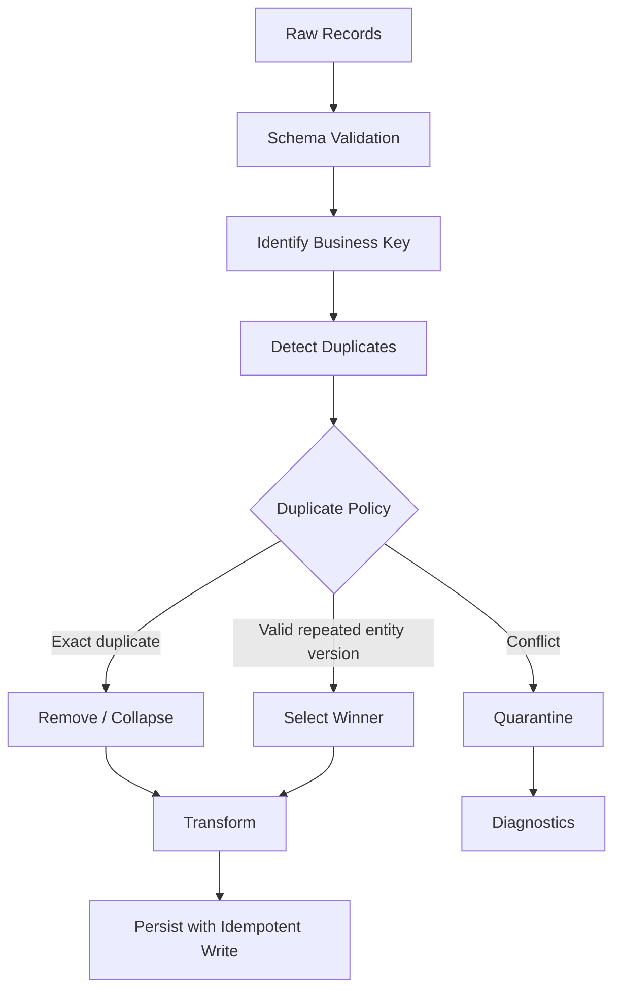
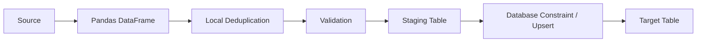

# 07- Duplicates

## Overview

Duplicate records are common in real-world data pipelines.

They can originate from:

```text
replayed API requests
reprocessed Kafka messages
database joins
CSV exports
batch retries
late-arriving events
manual data entry
upstream bugs
eventual-consistency effects
```

The key engineering question is not:

```text
"How do I remove duplicates?"
```

It is:

```text
"What defines a duplicate for this dataset?"
```

A duplicate can mean:

- identical rows
- repeated business identifiers
- repeated events
- conflicting versions of the same entity
- duplicate records caused by an incorrect join
- valid repeated transactions that only look similar

Pandas provides several tools for identifying and removing duplicate records, primarily:

```text
duplicated()
drop_duplicates()
```

These operations are useful, but they do not replace a proper data model, database constraints, event identity, or idempotent processing.

---

## What Is a Duplicate?

A duplicate exists when two or more records violate the uniqueness rule expected for the dataset.

There are several different forms.

### Exact Row Duplicates

Every relevant column has the same value:

```text
order_id  customer_id  amount  status
O-1001    C-101        100     completed
O-1001    C-101        100     completed
```

### Business-Key Duplicates

The business identity is repeated even if other fields differ:

```text
order_id  amount  status
O-1001    100     pending
O-1001    100     completed
```

If `order_id` identifies exactly one order, the second record is not necessarily an exact duplicate, but it violates the uniqueness expectation.

### Event Duplicates

The same event may be delivered more than once:

```text
event_id  event_type
E-1001    order_created
E-1001    order_created
```

This is common in at-least-once messaging systems.

### Valid Repeated Transactions

Two transactions can legitimately have the same attributes:

```text
customer_id  amount  currency
C-101        100     INR
C-101        100     INR
```

These are not necessarily duplicates if each transaction has a distinct transaction ID.

Therefore, deduplication requires domain knowledge.

---

## Why Duplicates Matter

Unexpected duplicates can cause:

```text
incorrect revenue
double-counted orders
inflated metrics
duplicate API output
incorrect joins
repeated notifications
duplicate database writes
broken idempotency
incorrect inventory calculations
```

For example:

```python
revenue = orders["amount"].sum()
```

If one transaction appears twice, the result may be wrong while still looking plausible.

Duplicates are therefore primarily a correctness problem.

---

## Duplicate Detection with `duplicated()`

`duplicated()` identifies repeated records.

```python
duplicates = orders.duplicated()
```

The result is a boolean Series:

```text
False
False
True
False
```

The first occurrence is normally treated as not duplicated and later occurrences as duplicates.

Select duplicate rows:

```python
duplicate_rows = orders.loc[
    orders.duplicated()
]
```

This does not modify the original DataFrame.

---

## `keep` Semantics

`duplicated()` supports:

```python
keep="first"
keep="last"
keep=False
```

### Keep First

```python
orders.duplicated(
    keep="first"
)
```

The first occurrence is marked:

```text
False
```

and subsequent duplicates:

```text
True
```

### Keep Last

```python
orders.duplicated(
    keep="last"
)
```

The last occurrence remains unmarked.

### Mark All Duplicates

```python
orders.duplicated(
    keep=False
)
```

Every row belonging to a duplicate group is marked:

```text
True
```

This is often useful for investigation because it reveals the entire duplicate group.

---

## `drop_duplicates()`

`drop_duplicates()` removes duplicates based on the selected subset of columns.

Basic usage:

```python
clean = orders.drop_duplicates()
```

Keep first:

```python
clean = orders.drop_duplicates(
    keep="first"
)
```

Keep last:

```python
clean = orders.drop_duplicates(
    keep="last"
)
```

Remove every record belonging to a duplicate group:

```python
clean = orders.drop_duplicates(
    keep=False
)
```

The original DataFrame is not modified unless an explicit mutation strategy is used.

---

## Exact Row Deduplication

Suppose:

```python
orders = pd.DataFrame(
    {
        "order_id": [
            "O-1",
            "O-2",
            "O-1",
        ],
        "customer_id": [
            "C-1",
            "C-2",
            "C-1",
        ],
        "amount": [
            100.0,
            200.0,
            100.0,
        ],
        "status": [
            "completed",
            "completed",
            "completed",
        ],
    }
)
```

Then:

```python
clean = orders.drop_duplicates()
```

removes the exact repeated row.

This is appropriate only if complete row identity defines duplication.

---

## Deduplication by Business Key

For many production datasets, the business key is more important than complete row equality.

```python
clean = orders.drop_duplicates(
    subset=["order_id"],
    keep="last",
)
```

This means:

```text
one record per order_id
```

The choice of `keep="last"` must be justified by the source ordering and business semantics.

---

## Deduplication by Composite Key

Some entities are uniquely identified by multiple fields.

For example:

```python
clean = records.drop_duplicates(
    subset=[
        "customer_id",
        "transaction_date",
        "reference_id",
    ]
)
```

The combination:

```text
customer_id
+
transaction_date
+
reference_id
```

defines uniqueness.

Do not deduplicate on a single column merely because it is convenient.

---

## Duplicate Detection by Business Key

To inspect repeated order IDs:

```python
duplicate_orders = orders.loc[
    orders.duplicated(
        subset=["order_id"],
        keep=False,
    )
]
```

This returns every row participating in a duplicate order ID.

This is often preferable to immediately deleting records because it lets the pipeline investigate the cause first.

---

## Exact Duplicate vs Business Duplicate

| Duplicate type | Detection | Typical action |
|---|---|---|
| exact repeated row | `duplicated()` | safe to remove if contract allows |
| repeated business key | `duplicated(subset=...)` | inspect version/status semantics |
| repeated event ID | event identity check | idempotent event handling |
| duplicate join result | join-cardinality validation | fix join relationship |
| valid repeated transaction | business model | retain |

The first step is always identifying the uniqueness contract.

---

## Duplicate Detection Before Deduplication

A production pipeline should generally measure duplicates before removing them.

```python
duplicate_mask = orders.duplicated(
    subset=["order_id"],
    keep=False,
)

duplicate_rows = orders.loc[
    duplicate_mask
]

duplicate_count = len(
    duplicate_rows
)
```

Useful metrics include:

```text
duplicate row count
duplicate key count
duplicate rate
records removed
```

This makes deduplication observable.

---

## Duplicate Rate

A simple duplicate rate:

```python
duplicate_rate = (
    orders.duplicated(
        subset=["order_id"]
    ).mean()
)
```

Interpretation:

```text
number of rows marked as later duplicates
÷
total rows
```

For monitoring, define exactly what the metric represents because:

```text
duplicate rows
```

and:

```text
duplicate groups
```

are different metrics.

---

## Duplicate Groups

To identify duplicate business keys:

```python
duplicate_keys = (
    orders.loc[
        orders.duplicated(
            subset=["order_id"],
            keep=False,
        ),
        "order_id",
    ]
    .value_counts()
)
```

This can produce:

```text
O-1001    3
O-1007    2
O-1010    2
```

which is more useful operationally than a single total count.

---

## Why `drop_duplicates()` Is Not Enough

Consider:

```text
order_id  updated_at           status
O-1       10:00                pending
O-1       11:00                completed
```

Blindly calling:

```python
orders.drop_duplicates(
    subset=["order_id"]
)
```

may retain the wrong version.

The pipeline needs a business rule:

```text
latest event wins
highest version wins
completed state wins
database source of truth wins
```

Deduplication is therefore usually a domain rule rather than a generic cleanup operation.

---

## Latest Record Wins

If records represent versions over time:

```python
orders = orders.sort_values(
    "updated_at"
)

latest = orders.drop_duplicates(
    subset=["order_id"],
    keep="last",
)
```

This implements:

```text
for each order_id
→
retain latest updated_at
```

The important requirement is that the sort order is deterministic.

---

## Deterministic Deduplication

When timestamps can tie, add a secondary ordering field.

```python
orders = orders.sort_values(
    [
        "order_id",
        "updated_at",
        "sequence",
    ]
)

latest = orders.drop_duplicates(
    subset=["order_id"],
    keep="last",
)
```

This avoids nondeterministic behavior when multiple records share the same timestamp.

A deterministic tie-breaker might be:

```text
source sequence
event offset
version
ingestion ID
database sequence
```

---

## Deduplication with Version Numbers

If the source provides an explicit version:

```python
orders = orders.sort_values(
    [
        "order_id",
        "version",
    ]
)

latest = orders.drop_duplicates(
    subset=["order_id"],
    keep="last",
)
```

This is generally stronger than relying only on ingestion order.

A version field should be treated as a contract, not inferred from row position.

---

## `groupby()` for Explicit Winner Selection

Sometimes the winning record requires more complex logic than `drop_duplicates()`.

For example:

```python
latest_index = (
    orders.groupby(
        "order_id"
    )["updated_at"]
    .idxmax()
)

latest = orders.loc[
    latest_index
].copy()
```

This expresses:

```text
for each order_id
→
find the row with maximum updated_at
```

It can be more explicit when the winning rule is important.

Ties still need to be handled if `updated_at` is not unique.

---

## Sorting Before `drop_duplicates()`

The common pattern:

```python
latest = (
    orders
    .sort_values(
        [
            "order_id",
            "updated_at",
        ]
    )
    .drop_duplicates(
        subset=["order_id"],
        keep="last",
    )
)
```

is readable and deterministic if the sorting columns define the winner.

This is preferable to relying on whatever ordering happened to exist in the source DataFrame.

---

## Duplicate Handling for Events

For event processing:

```python
events = events.drop_duplicates(
    subset=["event_id"],
    keep="last",
)
```

But the more important engineering control is usually upstream:

```text
event_id
+
persistent deduplication state
+
idempotent sink
```

Pandas deduplication only operates on the records currently loaded into memory.

It cannot detect an event that appeared in an earlier batch unless state is maintained elsewhere.

---

## Cross-Batch Duplicates

Suppose batch 1 contains:

```text
E-1001
E-1002
```

and batch 2 contains:

```text
E-1002
E-1003
```

Running:

```python
batch2.drop_duplicates(
    subset=["event_id"]
)
```

does not know that `E-1002` appeared in batch 1.

Cross-batch deduplication requires:

```text
durable state
```

such as:

```text
database uniqueness constraint
Redis state
deduplication table
Kafka offset semantics
checkpoint/state store
```

This is a critical production distinction.

---

## Database Uniqueness

For persistent systems, database constraints are stronger than Pandas-only deduplication.

Example PostgreSQL pattern:

```sql
CREATE UNIQUE INDEX ux_orders_order_id
ON orders(order_id);
```

Then application retries cannot create duplicate order IDs even if the same batch is processed twice.

Pandas can prepare data:

```text
extract
→
deduplicate
→
validate
→
database write
```

but the database should enforce durable invariants whenever possible.

---

## Idempotency vs Deduplication

These concepts are related but not identical.

### Deduplication

Removes or identifies repeated records.

```text
duplicate input
→
one retained record
```

### Idempotency

Repeated execution produces the same final state.

```text
process request
process same request again
→
same final state
```

A pipeline can be idempotent without using `drop_duplicates()`.

For example:

```sql
INSERT ... ON CONFLICT DO NOTHING;
```

can make repeated writes safe even if the input contains duplicate records.

---

## Duplicate Detection in ETL

A robust ETL stage can look like:



The duplicate policy should be explicit rather than hidden inside a generic cleaning step.

---

## Conflicting Duplicates

Not all duplicates agree on values.

Example:

```text
order_id  amount  status
O-1       100     pending
O-1       150     completed
```

This may represent:

```text
legitimate update
```

or:

```text
corruption
```

or:

```text
conflicting upstream systems
```

Do not blindly keep the first or last record.

The pipeline should define a resolution policy or quarantine the conflict.

---

## Duplicate Resolution by Source Priority

If multiple systems provide the same entity:

```text
ERP
CRM
payment system
```

a source-priority rule might be used.

For example:

```python
source_priority = {
    "payment_system": 3,
    "erp": 2,
    "crm": 1,
}

orders["source_priority"] = (
    orders["source"]
    .map(source_priority)
)

resolved = (
    orders
    .sort_values(
        [
            "order_id",
            "source_priority",
            "updated_at",
        ]
    )
    .drop_duplicates(
        subset=["order_id"],
        keep="last",
    )
)
```

The policy should be documented because it changes business results.

---

## Duplicate Detection After Joins

A duplicate may be introduced by a join rather than existing in the input.

Suppose:

```python
result = orders.merge(
    customers,
    on="customer_id",
    how="left",
)
```

If `customers` contains duplicate customer IDs, one order can become multiple rows.

Use:

```python
result = orders.merge(
    customers,
    on="customer_id",
    how="left",
    validate="many_to_one",
)
```

This verifies the expected cardinality.

Sometimes the right solution is to fix the dimension dataset before the join rather than deduplicate the final output.

---

## Join Explosion

Consider:

```text
orders:
customer_id = C-1
customer_id = C-1

customers:
customer_id = C-1
customer_id = C-1
```

A many-to-many join can generate:

```text
2 × 2 = 4 rows
```

A downstream `drop_duplicates()` might hide the symptom while retaining incorrect combinations.

The right engineering approach is:

```text
validate source uniqueness
→
validate join cardinality
→
fix relationship
```

Do not use deduplication as a bandage for an invalid join.

---

## Duplicate Columns vs Duplicate Rows

These are separate problems.

Duplicate column labels can occur:

```python
df.columns.duplicated()
```

while duplicate rows can be checked with:

```python
df.duplicated()
```

Do not confuse:

```text
duplicate column names
```

with:

```text
duplicate records
```

Both can break downstream processing, but they require different handling.

---

## Detecting Duplicate Columns

Check:

```python
duplicate_columns = df.columns[
    df.columns.duplicated()
]
```

If the schema contract requires unique columns:

```python
if not df.columns.is_unique:
    raise ValueError(
        "DataFrame contains duplicate column names"
    )
```

This is especially important when ingesting:

```text
CSV
Excel
JSON
dynamic SQL
external reports
```

---

## Duplicate Index Labels

A DataFrame can also contain duplicate index labels.

Check:

```python
df.index.is_unique
```

Find duplicates:

```python
duplicate_index = df.index[
    df.index.duplicated(
        keep=False
    )
]
```

If index uniqueness matters:

```python
if not df.index.is_unique:
    raise ValueError(
        "Index must be unique"
    )
```

Do not assume a Pandas index behaves like a database primary key.

---

## Resetting the Index Before Deduplication

When an index is merely positional:

```python
df = df.reset_index(
    drop=True
)
```

Then:

```python
df = df.drop_duplicates()
```

This can be useful when the index should not contribute to record identity.

If the index is meaningful, do not discard it simply to make deduplication easier.

---

## Duplicate Detection and Missing Values

Business keys containing missing values require explicit policy.

Example:

```python
duplicates = orders.loc[
    orders.duplicated(
        subset=["order_id"],
        keep=False,
    )
]
```

But before deduplicating:

```python
missing_ids = orders.loc[
    orders["order_id"].isna()
]
```

An absent business identifier may indicate an invalid record rather than a duplicate group.

A safe sequence is often:

```text
validate identity
→
separate missing keys
→
deduplicate valid keys
```

---

## Duplicate Normalization

Text differences can make logically identical records appear distinct:

```text
"C-101"
" c-101 "
"C-101"
```

Normalize before duplicate detection:

```python
orders["customer_id"] = (
    orders["customer_id"]
    .astype("string")
    .str.strip()
    .str.upper()
)
```

Then:

```python
orders.duplicated(
    subset=["customer_id"]
)
```

This is especially important when data originates from heterogeneous systems.

---

## Canonicalization Before Deduplication

Other fields may require normalization:

```text
case
whitespace
timezone
currency
date formats
identifier formats
Unicode normalization
```

Example:

```python
customers["email"] = (
    customers["email"]
    .astype("string")
    .str.strip()
    .str.lower()
)
```

Duplicate detection should operate on canonical values when the business key is case-insensitive.

The normalization rules should be explicit and tested.

---

## Duplicate Detection and Data Types

Two values may be logically equivalent but represented differently.

For example:

```text
101
"101"
```

may represent the same identifier in a poorly standardized source.

Normalize types before duplicate checks:

```python
customers["customer_id"] = (
    customers["customer_id"]
    .astype("string")
)
```

Type normalization should happen before the uniqueness contract is evaluated.

---

## Duplicate Handling for CSV Files

CSV files can contain repeated rows because of:

```text
repeated exports
append retries
manual merges
source bugs
```

After reading:

```python
orders = pd.read_csv(
    "orders.csv"
)
```

inspect:

```python
duplicate_mask = orders.duplicated(
    subset=["order_id"],
    keep=False,
)
```

Before removing records, determine whether repeated IDs represent:

```text
duplicate rows
updates
multiple transactions
```

---

## Duplicate Handling for API Data

APIs may return the same resource in multiple pages because of:

```text
pagination race conditions
eventual consistency
retries
cursor behavior
source changes between requests
```

A batch processor can identify duplicates:

```python
page = pd.DataFrame.from_records(
    payload["items"]
)

page = page.drop_duplicates(
    subset=["order_id"],
    keep="last",
)
```

But cross-page deduplication requires state across pages.

For large integrations, API cursors and source-side ordering should be designed to minimize overlap.

---

## Duplicate Handling for Kafka

Kafka consumers commonly operate with at-least-once delivery semantics.

The same event can be processed more than once.

A Pandas micro-batch can remove local duplicates:

```python
batch = batch.drop_duplicates(
    subset=["event_id"],
    keep="last",
)
```

But production correctness should still rely on:

```text
event identity
+
idempotent sink
+
durable uniqueness
```

because the same event may have appeared in a previous micro-batch.

---

## Duplicate Handling with PostgreSQL

A common architecture is:

```text
Pandas
→
staging table
→
deduplicate / validate
→
unique constraint / upsert
→
target table
```

For example:

```sql
INSERT INTO orders (
    order_id,
    customer_id,
    amount,
    status
)
VALUES (
    %(order_id)s,
    %(customer_id)s,
    %(amount)s,
    %(status)s
)
ON CONFLICT (order_id)
DO UPDATE SET
    customer_id = EXCLUDED.customer_id,
    amount = EXCLUDED.amount,
    status = EXCLUDED.status;
```

Pandas can determine the batch contents, while PostgreSQL enforces durable record identity.

---

## Staging Table Pattern

For larger loads:



This provides multiple layers of protection.

Local deduplication reduces unnecessary writes.

The database remains the final authority for durable uniqueness.

---

## Deduplication and Backfills

Backfills often re-read historical data.

Without deterministic identity:

```text
historical batch
+
backfill retry
=
duplicate records
```

A safe backfill design uses:

```text
stable business key
version
source identity
idempotent write
```

Pandas `drop_duplicates()` is useful inside the batch, but it is not enough to make the entire backfill idempotent.

---

## Deduplication and Checkpoints

Suppose a worker processes:

```text
batch A
→
persist
→
crashes before checkpoint
→
restarts
→
processes batch A again
```

If the target is not idempotent, duplicate writes may occur.

Therefore:

```text
deduplication
+
checkpointing
+
idempotent persistence
```

must work together.

The correct solution is not simply:

```python
batch.drop_duplicates()
```

because the retry may contain the same records as an earlier successful batch.

---

## Deduplication and Large Datasets

`drop_duplicates()` operates on the DataFrame currently in memory.

For very large datasets:

```text
input
→
chunk A
→
chunk B
→
chunk C
```

deduplicating each chunk independently does not provide global uniqueness.

For global deduplication, consider:

```text
database unique constraints
external state store
sorted external processing
DuckDB
Polars
Dask
Spark
```

depending on data size and architecture.

---

## Chunked Deduplication Strategies

If the dataset is partitioned by a stable business key:

```text
partition by customer_id
```

then all records for a key can potentially be processed together.

Alternatively, use an external store to track seen identifiers.

Conceptually:

```text
batch
 ↓
extract keys
 ↓
check durable seen-set
 ↓
process unseen records
 ↓
record successful keys
```

The state must be durable enough to survive worker restarts if correctness depends on it.

---

## Performance Considerations

Deduplication requires comparing records or keys.

Performance depends on:

```text
row count
number of subset columns
dtype
memory
cardinality
sorting requirements
```

Reducing the deduplication key to only necessary columns can reduce memory pressure:

```python
duplicate_mask = orders.duplicated(
    subset=[
        "order_id",
        "version",
    ]
)
```

Avoid copying the entire DataFrame simply to inspect duplicate keys.

---

## Sorting Cost

A pattern such as:

```python
latest = (
    orders
    .sort_values(
        [
            "order_id",
            "updated_at",
        ]
    )
    .drop_duplicates(
        subset=["order_id"],
        keep="last",
    )
)
```

is readable and deterministic, but sorting can be expensive for large data.

If the source database can select the latest version efficiently, consider pushing the operation upstream using SQL window functions.

For example, a database may perform:

```sql
ROW_NUMBER() OVER (
    PARTITION BY order_id
    ORDER BY updated_at DESC, version DESC
)
```

and return only the winning rows.

---

## SQL Deduplication vs Pandas Deduplication

| Requirement | Better location |
|---|---|
| enforce unique primary key | PostgreSQL constraint |
| latest row per entity from huge table | SQL/window function |
| local batch exact duplicates | Pandas |
| API payload normalization | Pandas |
| cross-batch event identity | durable state / sink |
| large distributed deduplication | distributed engine |
| final persistent uniqueness | database |

Pandas is excellent for bounded in-memory deduplication but should not be treated as the universal deduplication layer.

---

## Testing Duplicate Logic

Tests should verify the exact business rule.

Example:

```python
def test_latest_order_version_is_retained() -> None:
    orders = pd.DataFrame(
        {
            "order_id": [
                "O-1",
                "O-1",
                "O-2",
            ],
            "updated_at": pd.to_datetime(
                [
                    "2026-01-01T10:00:00Z",
                    "2026-01-01T11:00:00Z",
                    "2026-01-01T10:00:00Z",
                ]
            ),
            "status": [
                "pending",
                "completed",
                "completed",
            ],
        }
    )

    result = (
        orders
        .sort_values(
            [
                "order_id",
                "updated_at",
            ]
        )
        .drop_duplicates(
            subset=["order_id"],
            keep="last",
        )
    )

    assert result[
        "order_id"
    ].tolist() == [
        "O-1",
        "O-2",
    ]

    assert result.loc[
        result["order_id"].eq("O-1"),
        "status",
    ].iloc[0] == "completed"
```

The test verifies the business rule rather than merely checking that `drop_duplicates()` executes.

---

## Testing Exact Duplicates

```python
def test_exact_duplicates_are_removed() -> None:
    orders = pd.DataFrame(
        {
            "order_id": ["O-1", "O-1", "O-2"],
            "amount": [100.0, 100.0, 200.0],
        }
    )

    result = orders.drop_duplicates()

    assert len(result) == 2
```

Also test:

```text
no duplicates
all rows duplicate
duplicate groups of different sizes
null values
duplicate keys with conflicting values
```

---

## Testing Duplicate Detection

```python
def test_duplicate_business_keys_are_detected() -> None:
    orders = pd.DataFrame(
        {
            "order_id": [
                "O-1",
                "O-1",
                "O-2",
            ],
        }
    )

    mask = orders.duplicated(
        subset=["order_id"],
        keep=False,
    )

    assert mask.tolist() == [
        True,
        True,
        False,
    ]
```

This verifies that the complete duplicate group is identified.

---

## Duplicate Metrics

Useful production metrics include:

```text
input_rows
duplicate_rows
unique_keys
duplicate_key_count
duplicate_rate
conflicting_duplicate_count
records_removed
```

Example:

```python
duplicate_mask = orders.duplicated(
    subset=["order_id"],
    keep=False,
)

duplicate_rows = int(
    duplicate_mask.sum()
)

duplicate_rate = (
    duplicate_rows
    / len(orders)
    if len(orders)
    else 0.0
)
```

Metrics should be emitted before destructive deduplication so the original data-quality signal is preserved.

---

## Monitoring Duplicate Drift

A sudden increase in duplicate rate may indicate:

```text
API pagination bug
Kafka replay problem
database replication issue
upstream retry loop
schema change
join cardinality bug
batch retry without idempotency
```

Monitoring trends can detect failures before downstream reports become obviously incorrect.

---

## Security Considerations

Duplicate data can have security implications when it affects:

```text
authorization records
audit events
billing records
identity mappings
entitlements
permissions
```

Do not deduplicate sensitive records using an unsafe field.

For example:

```text
user_id
```

may not be sufficient to identify a unique security event.

An audit event may require:

```text
event_id
timestamp
actor_id
action
resource_id
sequence
```

Uniqueness should be defined according to the security model.

---

## Reliability Considerations

Deduplication should be deterministic.

A retry should not randomly select a different duplicate record.

Avoid relying on:

```text
current row order
filesystem order
network arrival order
dictionary ordering from external systems
```

when selecting a winner.

Prefer explicit ordering:

```python
orders.sort_values(
    [
        "order_id",
        "updated_at",
        "version",
    ]
)
```

before selecting the retained record.

---

## Common Mistakes

### Calling `drop_duplicates()` Without Defining Identity

This may remove valid records or fail to remove business duplicates.

### Using the Wrong `subset`

If the business key is:

```text
customer_id + transaction_id
```

using only:

```python
subset=["customer_id"]
```

can delete valid transactions.

### Keeping the First Record by Accident

```python
drop_duplicates(
    subset=["order_id"]
)
```

uses the first occurrence by default.

If the latest version should win, sort first or use an explicit winner-selection strategy.

### Treating Duplicates as Always Invalid

Repeated events and transactions can be legitimate.

### Deduplicating After a Bad Join

A many-to-many join can create incorrect rows that are not true duplicates.

Fix the join cardinality instead.

### Deduplicating Each Chunk Independently

This does not solve cross-chunk duplicates.

### Assuming Pandas Deduplication Is Global

It only operates on the records currently available in the DataFrame.

### Ignoring Normalization

Whitespace, case, type differences, and formatting inconsistencies can hide logical duplicates.

### Ignoring Missing Business Keys

Records without identity should usually be validated before deduplication.

### Using Row Order as a Winner Rule

The current row order may not be deterministic across retries or sources.

### Removing Duplicates Without Metrics

Destructive cleanup can hide upstream regressions.

### Using Deduplication as a Substitute for Database Constraints

Persistent uniqueness should be enforced at the persistence layer whenever possible.

---

## Interview Traps

### What Does `duplicated()` Return?

A boolean Series identifying rows considered duplicates according to the selected subset and `keep` policy.

### What Does `drop_duplicates()` Return?

A DataFrame with duplicate rows removed according to the selected subset and retention policy.

### What Is the Difference Between `keep="first"` and `keep="last"`?

`keep="first"` preserves the first occurrence.

`keep="last"` preserves the last occurrence.

### What Does `keep=False` Do?

All rows belonging to duplicate groups are marked as duplicates by `duplicated()` or removed by `drop_duplicates()`.

### How Do You Detect Duplicate Business Keys?

```python
df.duplicated(
    subset=["order_id"],
    keep=False,
)
```

### How Do You Keep the Latest Record?

Sort deterministically first:

```python
latest = (
    df
    .sort_values(
        [
            "order_id",
            "updated_at",
        ]
    )
    .drop_duplicates(
        subset=["order_id"],
        keep="last",
    )
)
```

### Why Is `drop_duplicates()` Not Enough for Distributed Systems?

Because it only sees the current DataFrame. Duplicates can span batches, workers, retries, or historical executions.

### How Do You Handle Duplicate Kafka Events?

Use a stable event ID, local batch deduplication where useful, and durable idempotent persistence or deduplication state.

### Why Is `validate="many_to_one"` Useful?

It detects unexpected join cardinality and helps prevent row multiplication from being mistaken for ordinary duplicates.

### How Can a Database Prevent Duplicates?

Use a unique constraint or unique index on the business key.

### Are Two Rows with the Same Amount and Customer Automatically Duplicates?

No. They may represent legitimate independent transactions.

### Why Sort Before `drop_duplicates()`?

Sorting establishes which record is considered the winner when duplicates contain different versions or values.

### What Is the Difference Between Exact and Business-Key Duplicates?

Exact duplicates match across all relevant fields. Business-key duplicates share the identity fields even if other attributes differ.

### Why Is Cross-Batch Deduplication Hard?

A DataFrame only knows about records loaded into that process. Detecting duplicates across batches requires durable state or a persistent uniqueness mechanism.

---

## Production Checklist

```text
[ ] Duplicate identity is explicitly defined
[ ] Exact vs business-key duplicates are distinguished
[ ] Required business keys are validated
[ ] Values are normalized before duplicate detection
[ ] duplicated() is used for inspection
[ ] drop_duplicates() is used only with an explicit policy
[ ] subset contains the correct uniqueness fields
[ ] keep semantics are deliberate
[ ] Winner selection is deterministic
[ ] Timestamp/version tie-breakers are defined
[ ] Duplicate metrics are recorded before removal
[ ] Conflicting duplicates are handled separately
[ ] Join cardinality is validated
[ ] Cross-batch duplicates are handled with durable state when required
[ ] Database uniqueness constraints protect persistent data
[ ] Chunk-local deduplication is not mistaken for global deduplication
[ ] Empty input is handled safely
[ ] Duplicate logic is covered by business-focused tests
[ ] Backfills use deterministic, idempotent rules
[ ] Duplicate-rate changes are monitored
```

## Key Takeaways

- Deduplication starts with a clear uniqueness contract; exact row equality, business-key uniqueness, event identity, and valid repeated transactions are different problems.
- Use `duplicated()` to inspect duplicate groups and `drop_duplicates()` to remove them, but define `subset` and `keep` explicitly rather than accepting default behavior blindly.
- When duplicate records represent versions, sort by deterministic fields such as key, timestamp, and version before selecting the retained record.
- Pandas deduplication is local to the DataFrame; cross-batch and retry-safe uniqueness requires durable state, idempotent persistence, or database constraints.
- A production-grade deduplication strategy measures duplicate rates, validates join cardinality, handles conflicting records explicitly, and treats database uniqueness as the final persistence-layer invariant.