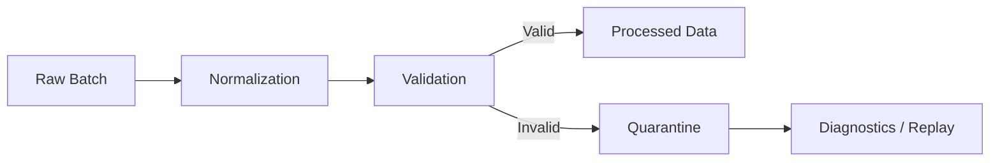

# 08- Data Cleaning

## Overview

Data cleaning is the process of converting raw, inconsistent, incomplete, or invalid data into a predictable structure suitable for downstream processing.

In production Pandas workflows, cleaning is not simply:

```python
df.dropna()
```

A reliable cleaning pipeline must address:

```text
schema inconsistencies
→
data types
→
missing values
→
duplicates
→
invalid values
→
inconsistent representations
→
business rules
→
output validation
```

Typical sources include:

```text
PostgreSQL
REST APIs
CSV
JSON
Excel
Parquet
Kafka
external vendor feeds
application logs
```

The objective is not to make data look clean. The objective is to make the data **correct, explicit, reproducible, and safe for downstream use**.

A useful production flow is:


---

## What Data Cleaning Actually Means

Data cleaning can include:

- correcting data types
- normalizing string representations
- handling missing values
- removing or resolving duplicates
- validating ranges
- validating categories
- parsing dates
- standardizing identifiers
- handling invalid records
- enforcing business rules
- separating valid and rejected data

A useful distinction is:

```text
Cleaning
=
normalization + correction

Validation
=
checking whether data satisfies a contract
```

In strong pipelines, these activities are related but not interchangeable.

---

## Raw Data vs Clean Data

Consider this input:

```text
order_id   amount    status       created_at
 O-1001    "1,250"   Completed    2026/01/01
 O-1002    ""        completed    invalid
 O-1001    "1250"    Completed    2026-01-01
```

A production-cleaned representation might become:

```text
order_id   amount  status      created_at
O-1001     1250.0  completed   2026-01-01
O-1002     <NA>    completed   <invalid>
```

with the duplicate or invalid record routed according to policy.

The important point is that cleaning should preserve business meaning rather than blindly modifying values.

---

## Cleaning Pipeline Design

A practical design separates stages:

```text
extract
    ↓
schema validation
    ↓
type normalization
    ↓
field normalization
    ↓
missing-value policy
    ↓
duplicate policy
    ↓
domain validation
    ↓
quality checks
    ↓
load
```

This separation makes failures easier to diagnose.

For example:

```text
"1,250"
```

is a type/representation problem.

```text
-500
```

may be a business-rule violation.

```text
duplicate order_id
```

is an identity problem.

Treating all three as generic "dirty data" makes production behavior harder to reason about.

---

## Work on a Controlled Copy

For transformation functions, make ownership explicit when the DataFrame will be modified:

```python
def clean_orders(
    orders: pd.DataFrame,
) -> pd.DataFrame:
    cleaned = orders.copy()

    # transformations follow

    return cleaned
```

This prevents the cleaning function from unintentionally mutating the caller's DataFrame.

For very large datasets, copying the entire frame has a memory cost. Avoid unnecessary copies when ownership is already well defined.

---

## Schema Validation

Before cleaning individual columns, verify the expected schema.

```python
required_columns = {
    "order_id",
    "customer_id",
    "amount",
    "status",
    "created_at",
}

missing = (
    required_columns
    - set(orders.columns)
)

if missing:
    raise ValueError(
        f"Missing required columns: {sorted(missing)}"
    )
```

Depending on the contract, also check for unexpected columns:

```python
allowed_columns = required_columns | {
    "discount"
}

unexpected = (
    set(orders.columns)
    - allowed_columns
)

if unexpected:
    raise ValueError(
        f"Unexpected columns: {sorted(unexpected)}"
    )
```

Schema validation should happen before transformations that depend on the schema.

---

## Normalize Column Names

External sources commonly produce inconsistent column names:

```text
Order ID
order-id
order_id
ORDER_ID
```

Normalize at the ingestion boundary:

```python
orders.columns = (
    orders.columns
    .astype("string")
    .str.strip()
    .str.lower()
    .str.replace(
        r"[^a-z0-9]+",
        "_",
        regex=True,
    )
    .str.strip("_")
)
```

Example:

```text
Order ID
→
order_id
```

Do this once rather than repeatedly handling multiple naming variants downstream.

---

## Be Careful with Automatic Renaming

Normalization can create collisions.

For example:

```text
customer-id
customer_id
```

could both become:

```text
customer_id
```

Check:

```python
if not orders.columns.is_unique:
    raise ValueError(
        "Column normalization created duplicates"
    )
```

Do not silently overwrite or merge columns with conflicting meanings.

---

## Type Normalization

A clean DataFrame should have intentional dtypes.

Example:

```python
orders["order_id"] = (
    orders["order_id"]
    .astype("string")
)

orders["customer_id"] = (
    orders["customer_id"]
    .astype("string")
)

orders["amount"] = pd.to_numeric(
    orders["amount"],
    errors="raise",
)

orders["created_at"] = pd.to_datetime(
    orders["created_at"],
    utc=True,
    errors="raise",
)
```

Explicit type normalization makes later operations more predictable.

---

## `pd.to_numeric()`

Use `pd.to_numeric()` for numeric columns arriving as strings or mixed values:

```python
orders["amount"] = pd.to_numeric(
    orders["amount"],
    errors="raise",
)
```

Possible policies:

| `errors` | Behavior | Appropriate use |
|---|---|---|
| `"raise"` | fail immediately | strict contracts |
| `"coerce"` | invalid values become missing | quarantine workflows |
| `"ignore"` | preserve original input | generally avoid for cleaning |

In production, `"coerce"` should normally be followed by an explicit check for newly introduced missing values.

---

## Numeric Formatting Issues

Values such as:

```text
"1,250.50"
"$1,250.50"
"1250"
"1.250,50"
```

require different normalization rules.

For a known comma-separated format:

```python
amount = (
    orders["amount"]
    .astype("string")
    .str.replace(",", "", regex=False)
)

orders["amount"] = pd.to_numeric(
    amount,
    errors="raise",
)
```

Do not assume a single transformation works across currencies or locale-specific formats.

---

## Currency Columns

Financial values need careful handling.

If a source stores:

```text
1,250.50
```

remove formatting only after the currency and numeric representation are understood.

A stronger schema is:

```text
amount
currency
```

rather than embedding:

```text
₹1,250.50
```

inside a numeric field.

For exact financial arithmetic, consider whether decimal-aware handling should occur before or after Pandas processing rather than relying on binary floating-point semantics everywhere.

---

## String Normalization

Text fields commonly need:

```text
strip whitespace
normalize case
normalize separators
handle empty strings
preserve nulls
```

Example:

```python
orders["status"] = (
    orders["status"]
    .astype("string")
    .str.strip()
    .str.lower()
)
```

This converts:

```text
" Completed "
"COMPLETED"
"completed"
```

to:

```text
"completed"
```

---

## Empty Strings vs Missing Values

These are not automatically equivalent:

```text
""
<NA>
```

A source may use empty strings to represent missing values.

Explicitly normalize if the data contract says they are equivalent:

```python
orders["coupon_code"] = (
    orders["coupon_code"]
    .astype("string")
    .str.strip()
    .replace("", pd.NA)
)
```

This produces consistent missing-value semantics.

---

## Converting Placeholder Strings

External systems may use placeholders:

```text
N/A
NA
NULL
null
unknown
-
?
```

Do not globally convert every placeholder without understanding the field.

For a specific column:

```python
orders["country"] = (
    orders["country"]
    .astype("string")
    .str.strip()
    .replace(
        {
            "N/A": pd.NA,
            "NA": pd.NA,
            "NULL": pd.NA,
        }
    )
)
```

Placeholder normalization should be field-specific where meanings differ.

---

## Standardizing Categories

Suppose status values arrive as:

```text
completed
Completed
COMPLETE
done
```

Map them to a controlled vocabulary:

```python
status_map = {
    "completed": "completed",
    "complete": "completed",
    "done": "completed",
    "pending": "pending",
    "cancelled": "cancelled",
}

orders["status"] = (
    orders["status"]
    .astype("string")
    .str.strip()
    .str.lower()
    .map(status_map)
)
```

Now unknown values become missing:

```python
unknown_statuses = orders.loc[
    orders["status"].isna()
]
```

This turns vocabulary normalization into a validation opportunity.

---

## Preserve Unknown Categories

Do not silently map unknown values to an existing category:

```text
"partially_refunded"
→
"completed"
```

unless the domain explicitly defines that equivalence.

Incorrect normalization can be more dangerous than leaving the data dirty because it produces plausible but wrong output.

---

## Datetime Cleaning

Normalize timestamps at the ingestion boundary:

```python
orders["created_at"] = pd.to_datetime(
    orders["created_at"],
    utc=True,
    errors="coerce",
)
```

Then identify parsing failures:

```python
invalid_dates = orders.loc[
    orders["created_at"].isna()
]
```

If the source can legitimately contain null dates, distinguish:

```text
originally missing
```

from:

```text
invalid and coerced
```

before deciding whether to reject records.

---

## Preserve Original Values During Risky Parsing

For critical fields, retaining the raw value temporarily can improve diagnostics:

```python
orders["created_at_raw"] = orders[
    "created_at"
]

orders["created_at"] = pd.to_datetime(
    orders["created_at_raw"],
    utc=True,
    errors="coerce",
)
```

Then:

```python
invalid_mask = (
    orders["created_at_raw"].notna()
    & orders["created_at"].isna()
)
```

This allows the pipeline to report exactly what failed parsing.

Drop the raw diagnostic field only after the validation stage if it is no longer needed.

---

## Timezone Normalization

For distributed backend systems, normalize timestamps to a common timezone, commonly UTC:

```python
orders["created_at"] = pd.to_datetime(
    orders["created_at"],
    utc=True,
    errors="raise",
)
```

This prevents ambiguity when systems operate across:

```text
regions
containers
Kubernetes nodes
AWS services
databases
```

Avoid mixing timezone-aware and timezone-naive timestamps in the same business rule.

---

## Missing-Value Handling

Do not use a single missing-value policy for every field.

Example schema:

| Field | Nullable | Example policy |
|---|---:|---|
| `order_id` | No | reject |
| `customer_id` | No | reject/quarantine |
| `amount` | No | reject |
| `discount` | Yes | preserve or fill according to contract |
| `coupon_code` | Yes | preserve |
| `shipping_note` | Yes | preserve |
| `created_at` | No | reject |
| `status` | No | reject unknown/missing |

A general pattern:

```python
required_columns = [
    "order_id",
    "customer_id",
    "amount",
    "created_at",
]

invalid_required = orders[
    required_columns
].isna().any(axis=1)

invalid = orders.loc[
    invalid_required
].copy()

valid = orders.loc[
    ~invalid_required
].copy()
```

This is safer than:

```python
orders.dropna()
```

because the required fields are explicit.

---

## Imputation

Only fill missing values when a replacement has a defined meaning.

Example:

```python
orders["discount"] = (
    orders["discount"]
    .fillna(0)
)
```

This is valid only if:

```text
missing discount = zero discount
```

is part of the business contract.

Do not treat:

```text
unknown
```

as:

```text
zero
```

without justification.

---

## Duplicate Cleaning

Detect duplicates before removing them:

```python
duplicate_mask = orders.duplicated(
    subset=["order_id"],
    keep=False,
)

duplicates = orders.loc[
    duplicate_mask
]
```

Then apply a defined policy:

```python
cleaned = (
    orders
    .sort_values(
        [
            "order_id",
            "updated_at",
        ]
    )
    .drop_duplicates(
        subset=["order_id"],
        keep="last",
    )
)
```

The sort establishes which version wins.

---

## Normalize Before Deduplication

If identifiers contain inconsistent representations:

```text
" O-1001"
"O-1001 "
"o-1001"
```

deduplicate only after normalization:

```python
orders["order_id"] = (
    orders["order_id"]
    .astype("string")
    .str.strip()
    .str.upper()
)
```

Then:

```python
orders = orders.drop_duplicates(
    subset=["order_id"],
    keep="last",
)
```

The order matters:

```text
normalize
→
deduplicate
```

not:

```text
deduplicate
→
normalize
```

---

## Identifier Cleaning

Identifiers should usually be treated as strings, even when they contain only digits.

For example:

```text
001234
```

is not necessarily equivalent to:

```text
1234
```

Use:

```python
customers["customer_id"] = (
    customers["customer_id"]
    .astype("string")
    .str.strip()
)
```

Avoid converting identifiers to numeric types simply because they contain digits.

This is especially important for:

```text
postal codes
account numbers
invoice IDs
SKU codes
external IDs
```

---

## Case Normalization

For case-insensitive identifiers:

```python
customers["email"] = (
    customers["email"]
    .astype("string")
    .str.strip()
    .str.lower()
)
```

For case-sensitive fields, do not normalize case blindly.

A normalization rule should be derived from the field semantics.

---

## Email Cleaning

A basic normalization step:

```python
customers["email"] = (
    customers["email"]
    .astype("string")
    .str.strip()
    .str.lower()
)
```

This does not prove that an email is valid.

Separate:

```text
normalization
```

from:

```text
validation
```

A string can be normalized and still fail the application's email contract.

---

## Phone Number Cleaning

Phone numbers often contain:

```text
spaces
parentheses
hyphens
country prefixes
extensions
```

A normalization strategy should use a known country or numbering plan rather than blindly deleting all non-numeric characters.

For example, a controlled transformation might be:

```python
customers["phone"] = (
    customers["phone"]
    .astype("string")
    .str.strip()
)
```

Then apply domain-specific parsing and validation separately.

Avoid pretending that:

```python
.str.replace(r"\D", "", regex=True)
```

is sufficient for all international phone numbers.

---

## Range Validation

Cleaning can expose numeric violations:

```python
orders["amount"] = pd.to_numeric(
    orders["amount"],
    errors="raise",
)

invalid_amount = orders.loc[
    orders["amount"] < 0
]
```

If negative amounts are invalid:

```python
valid = orders.loc[
    orders["amount"] >= 0
]
```

A rule can also be expressed as a validation failure:

```python
if orders["amount"].lt(0).any():
    raise ValueError(
        "Negative order amounts detected"
    )
```

Whether to reject, repair, or quarantine depends on the domain.

---

## Domain Validation

Examples:

```python
valid_statuses = {
    "pending",
    "completed",
    "cancelled",
}

invalid_status = ~orders[
    "status"
].isin(valid_statuses)

if invalid_status.any():
    raise ValueError(
        "Unknown order status detected"
    )
```

Other domain rules may include:

```text
quantity > 0
amount >= 0
end_at >= start_at
currency in supported currencies
discount <= amount
country_code in allowed ISO codes
```

Cleaning should not silently modify values that violate business rules.

---

## Cross-Field Cleaning Rules

Some invalid records can only be detected by comparing columns.

For example:

```python
invalid = (
    orders["discount"].notna()
    & orders["amount"].notna()
    & orders["discount"].gt(
        orders["amount"]
    )
)
```

These records violate:

```text
discount <= amount
```

Cross-field validation is essential for financial and transactional datasets.

---

## Referential Integrity

A customer ID may be syntactically valid but not exist in the customer dataset.

```python
customer_ids = customers[
    "customer_id"
].dropna()

orphan_orders = orders.loc[
    orders["customer_id"].notna()
    & ~orders["customer_id"].isin(
        customer_ids
    )
]
```

This is a data-integrity problem, not simply a formatting problem.

For large relational datasets, perform referential validation at the database layer when practical.

---

## Data Cleaning with `merge()`

Use a merge to enrich or validate reference relationships:

```python
validated = orders.merge(
    customers[
        [
            "customer_id",
            "country",
        ]
    ],
    on="customer_id",
    how="left",
    validate="many_to_one",
)
```

Afterward:

```python
orphans = validated.loc[
    validated["country"].isna()
]
```

Distinguish:

```text
missing customer_id
```

from:

```text
non-null customer_id with no matching customer
```

because they usually require different remediation.

---

## Cleaning with `replace()`

Use `replace()` for explicit mappings:

```python
orders["status"] = orders[
    "status"
].replace(
    {
        "Complete": "completed",
        "COMPLETE": "completed",
        "Done": "completed",
    }
)
```

This is useful for controlled substitutions.

Do not use broad `replace()` rules when they could alter legitimate values unintentionally.

---

## `replace()` vs `map()`

Use `map()` when defining a controlled vocabulary and expecting unknown values to become missing:

```python
orders["status"] = (
    orders["status"]
    .astype("string")
    .str.strip()
    .str.lower()
    .map(
        {
            "complete": "completed",
            "done": "completed",
            "pending": "pending",
        }
    )
)
```

Use `replace()` when unmatched values should generally remain unchanged.

The choice is a semantic decision.

---

## Cleaning Whitespace

For text columns:

```python
orders["status"] = (
    orders["status"]
    .astype("string")
    .str.strip()
)
```

For multiple known text columns:

```python
text_columns = [
    "status",
    "country",
    "customer_name",
]

orders[text_columns] = (
    orders[text_columns]
    .astype("string")
    .apply(
        lambda column: column.str.strip()
    )
)
```

Prefer direct vectorized operations for performance-sensitive code.

When many transformations are applied, explicit loops over columns can sometimes be clearer than an overly clever generic expression.

---

## Unicode and Text Normalization

Text can differ because of:

```text
Unicode representation
accented characters
look-alike characters
different punctuation
invisible whitespace
```

For identity-sensitive text, normalization may require Python's `unicodedata` or domain-specific libraries.

Do not assume `.lower().strip()` fully canonicalizes arbitrary international text.

---

## Excel and Spreadsheet Cleaning

Excel files may contain:

```text
formatted numbers
empty cells
mixed types
merged cells
header rows
trailing spaces
date serials
formula results
```

For example:

```python
orders = pd.read_excel(
    "orders.xlsx",
    sheet_name="Orders",
)
```

Treat spreadsheets as untrusted external data.

Validate:

```text
column names
row structure
types
nullability
duplicate identifiers
```

before downstream processing.

---

## CSV Cleaning

CSV ingestion should explicitly define:

```text
columns
encoding
delimiter
missing-value conventions
data types
date parsing
```

Example:

```python
orders = pd.read_csv(
    "orders.csv",
    usecols=[
        "order_id",
        "customer_id",
        "amount",
        "status",
    ],
)
```

Then normalize:

```python
orders["order_id"] = (
    orders["order_id"]
    .astype("string")
    .str.strip()
)

orders["amount"] = pd.to_numeric(
    orders["amount"],
    errors="raise",
)
```

Use chunking for large files.

---

## JSON / REST API Cleaning

API responses often contain optional fields and inconsistent representations.

```python
orders = pd.DataFrame.from_records(
    payload["items"]
)
```

Normalize:

```python
orders = orders.rename(
    columns={
        "orderId": "order_id",
        "customerId": "customer_id",
    }
)
```

Then validate:

```python
required = {
    "order_id",
    "customer_id",
    "amount",
}

missing = (
    required
    - set(orders.columns)
)

if missing:
    raise ValueError(
        f"Missing fields: {sorted(missing)}"
    )
```

API success does not guarantee data quality.

---

## PostgreSQL Cleaning

When data originates in PostgreSQL, push cleaning operations into SQL when the database can perform them efficiently and consistently.

Examples:

```sql
SELECT
    order_id,
    TRIM(status) AS status,
    amount,
    created_at
FROM orders
WHERE created_at >= %(start_at)s;
```

Pandas is most valuable when transformations require:

```text
Python logic
multi-source data
report-specific processing
complex local transformations
```

Do not pull unnecessary raw data into the application only to perform transformations the database already handles well.

---

## SQL and Pandas Responsibility

A useful boundary is:

```text
Database
→ filtering
→ joins
→ aggregation
→ constraints
→ durable uniqueness

Pandas
→ cross-source transformation
→ complex local logic
→ reporting shaping
→ batch-level processing
→ file/API normalization
```

The exact division depends on workload and architecture.

---

## Parquet Cleaning

Parquet is useful when the pipeline needs:

```text
typed columns
column projection
compression
partitioning
repeatable schema
```

A typical flow:

```python
orders = pd.read_parquet(
    "raw/orders.parquet"
)
```

Clean:

```python
orders["status"] = (
    orders["status"]
    .astype("string")
    .str.strip()
    .str.lower()
)
```

Write:

```python
orders.to_parquet(
    "processed/orders.parquet",
    index=False,
)
```

Treat the output schema as a versioned interface when downstream jobs depend on it.

---

## Cleaning Large Datasets

Pandas is an in-memory processing tool.

If the source is too large:

```text
do not
load everything
→
clean everything
```

Prefer:

```text
source filtering
→
column projection
→
chunking
→
normalize chunk
→
validate chunk
→
persist chunk
```

For example:

```python
for chunk in pd.read_csv(
    "orders.csv",
    usecols=[
        "order_id",
        "customer_id",
        "amount",
        "status",
    ],
    chunksize=100_000,
):
    cleaned = clean_orders(chunk)
    write_batch(cleaned)
```

Global rules such as cross-chunk deduplication require additional state.

---

## Chunk-Safe Cleaning

Row-local transformations are usually easy to apply per chunk:

```text
strip whitespace
parse numeric values
normalize status
validate amount >= 0
```

Global operations require coordination:

```text
global duplicate detection
global ranking
global quantiles
cross-chunk joins
global uniqueness
```

Do not assume a chunk-local cleaning function automatically produces globally clean data.

---

## Cleaning Order Matters

A useful sequence is:

```text
schema validation
↓
column-name normalization
↓
dtype normalization
↓
text normalization
↓
missing-value normalization
↓
duplicate detection
↓
domain validation
↓
referential validation
↓
output schema validation
```

For example, deduplicating before stripping whitespace can miss:

```text
"O-1001"
" O-1001 "
```

because the raw values are not equal.

Cleaning order should therefore reflect dependencies between rules.

---

## Preserve Raw Data

A strong architecture keeps the raw source immutable:

```text
raw
 ↓
staging
 ↓
cleaned
 ↓
processed
 ↓
reporting
```

Do not overwrite raw source data to "clean it."

Keeping raw data supports:

```text
reprocessing
auditing
debugging
backfills
rule changes
disaster recovery
```

In AWS environments, this often maps naturally to versioned object storage such as S3.

---

## Quarantine Invalid Records

Not all invalid records should terminate the entire pipeline.

A common design:



Example:

```python
invalid_mask = (
    orders["order_id"].isna()
    | orders["amount"].lt(0)
)

valid = orders.loc[
    ~invalid_mask
].copy()

invalid = orders.loc[
    invalid_mask
].copy()

invalid["error_reason"] = (
    "missing_order_id_or_negative_amount"
)
```

For production use, include:

```text
batch ID
source
timestamp
validation rule
record ID
```

where available.

---

## Fail Fast vs Quarantine

Use fail-fast when invalid data makes the entire batch unsafe:

```text
financial settlement
critical configuration data
reference tables
schema-breaking changes
```

Use quarantine when individual records can be isolated:

```text
external API ingestion
large event streams
vendor feeds
non-critical reporting
```

The decision should be part of the pipeline's reliability contract.

---

## Cleaning and Idempotency

Cleaning should be deterministic.

Given the same valid input:

```text
same source
+
same rules
+
same configuration
=
same cleaned result
```

Avoid transformations based on:

```text
current time
random values
unstable row order
external mutable state
```

unless explicitly required.

Deterministic cleaning improves:

```text
retries
backfills
reconciliation
testing
incident recovery
```

---

## Cleaning and Duplicate Identity

If a record's identity changes during cleaning:

```text
"O-1001 "
```

→

```text
"O-1001"
```

then deduplication must occur after the normalization.

Otherwise, two logically identical records may bypass the duplicate detector.

This is a common source of subtle pipeline errors.

---

## Cleaning and Idempotent Writes

A robust flow is:

```text
raw batch
→
clean
→
validate
→
deduplicate
→
staging
→
database upsert
```

Even if the same batch is executed twice, the destination should remain correct.

Pandas cleaning cannot guarantee idempotency by itself. Persistence-layer uniqueness and upsert behavior remain important.

---

## Cleaning and Data Quality Metrics

Useful metrics include:

```text
rows_received
rows_cleaned
rows_rejected
null_rate_by_column
duplicate_rate
invalid_type_count
invalid_domain_count
referential_failure_count
parse_failure_count
```

Example:

```python
metrics = {
    "rows_received": len(orders),
    "rows_rejected": len(invalid),
    "rows_cleaned": len(valid),
    "duplicate_rows": int(
        orders.duplicated(
            subset=["order_id"]
        ).sum()
    ),
}
```

These metrics should be emitted before destructive transformations hide the original problem.

---

## Monitoring Cleaning Drift

A cleaning pipeline should monitor trends.

Examples:

```text
status unknown rate ↑
missing customer_id rate ↑
duplicate order rate ↑
invalid timestamp rate ↑
rejected row rate ↑
```

Sudden changes often indicate:

```text
upstream deployment
API schema change
database migration
vendor feed change
pagination bug
data corruption
```

Data cleaning should therefore be observable, not just executable.

---

## Testing Cleaning Pipelines

Tests should validate business behavior.

Example:

```python
def clean_orders(
    orders: pd.DataFrame,
) -> pd.DataFrame:
    cleaned = orders.copy()

    cleaned["order_id"] = (
        cleaned["order_id"]
        .astype("string")
        .str.strip()
        .str.upper()
    )

    cleaned["status"] = (
        cleaned["status"]
        .astype("string")
        .str.strip()
        .str.lower()
    )

    cleaned["amount"] = pd.to_numeric(
        cleaned["amount"],
        errors="raise",
    )

    return cleaned
```

Test:

```python
def test_clean_orders_normalizes_fields() -> None:
    raw = pd.DataFrame(
        {
            "order_id": [" o-1001 "],
            "status": [" COMPLETED "],
            "amount": ["1,250"],
        }
    )

    raw["amount"] = (
        raw["amount"]
        .astype("string")
        .str.replace(
            ",",
            "",
            regex=False,
        )
    )

    result = clean_orders(raw)

    assert result.loc[
        0,
        "order_id",
    ] == "O-1001"

    assert result.loc[
        0,
        "status",
    ] == "completed"

    assert result.loc[
        0,
        "amount",
    ] == 1250
```

Tests should cover both normal and failure cases.

---

## Test Categories

A production cleaning suite should cover:

| Test type | Example |
|---|---|
| schema | missing required column |
| dtype | numeric field contains invalid string |
| missing | required field is null |
| normalization | whitespace/case |
| duplicate | repeated business key |
| domain | invalid status |
| range | negative amount |
| temporal | invalid timestamp |
| referential | unknown customer |
| empty input | zero-row DataFrame |
| unexpected input | extra columns |
| regression | previously observed bad payload |

---

## Empty DataFrames

Cleaning functions should handle empty input predictably.

```python
empty_orders = pd.DataFrame(
    columns=[
        "order_id",
        "customer_id",
        "amount",
        "status",
    ]
)
```

A robust pipeline should preserve the expected schema even when zero rows are present.

Do not assume:

```python
df.empty
```

means:

```text
pipeline failure
```

An empty batch may simply mean there was no data to process.

---

## Unexpected Input

External sources can introduce:

```text
new columns
missing columns
new status values
new currencies
unexpected nulls
invalid dates
changed identifier formats
```

A safe pipeline should fail or quarantine according to the contract rather than silently accepting everything.

"Flexible" ingestion is not the same as "unvalidated" ingestion.

---

## Cleaning Functions and Separation of Concerns

Avoid one function that:

```text
reads CSV
normalizes columns
cleans values
queries PostgreSQL
writes Parquet
sends metrics
```

Prefer:

```text
reader
→
normalizer
→
validator
→
transformer
→
writer
```

For example:

```python
def normalize_orders(
    frame: pd.DataFrame,
) -> pd.DataFrame:
    ...

def validate_orders(
    frame: pd.DataFrame,
) -> pd.DataFrame:
    ...

def transform_orders(
    frame: pd.DataFrame,
) -> pd.DataFrame:
    ...
```

This makes each stage independently testable.

---

## Configuration-Driven Cleaning

Hard-coded business rules can become difficult to maintain.

Use configuration for stable policy where appropriate:

```python
VALID_STATUSES = {
    "pending",
    "completed",
    "cancelled",
}

REQUIRED_COLUMNS = [
    "order_id",
    "customer_id",
    "amount",
    "status",
]
```

For more complex systems, configuration may live in:

```text
YAML
environment configuration
database-backed rules
version-controlled policy files
```

Avoid making critical data rules impossible to discover by burying them inside generic helper functions.

---

## Data Cleaning Architecture in Kubernetes

A typical batch deployment might look like:

```text
Kubernetes CronJob
        ↓
worker container
        ↓
read S3 / PostgreSQL / API
        ↓
Pandas cleaning
        ↓
quality checks
        ↓
write S3 / PostgreSQL
        ↓
metrics / logs
```

Operational considerations include:

```text
memory limits
CPU requests
batch size
retry policy
temporary storage
job timeout
observability
dead-letter/quarantine location
```

Pandas memory consumption should be sized against the container limit, not only local development capacity.

---

## Celery Integration

For scheduled or asynchronous processing:

```text
scheduler
 ↓
Celery task
 ↓
extract batch
 ↓
clean
 ↓
validate
 ↓
persist
```

The task should be safe to retry.

That generally means:

```text
deterministic cleaning
+
stable record identity
+
idempotent persistence
```

Cleaning alone does not make a task retry-safe.

---

## API Integration

A FastAPI endpoint can validate request parameters before building a DataFrame:

```text
HTTP request
→
Pydantic validation
→
authorization
→
source extraction
→
Pandas cleaning
→
business transformation
→
response
```

Do not rely on Pandas cleaning to validate security-sensitive request fields.

Application-layer validation and data-pipeline validation serve different purposes.

---

## Security Considerations

Data cleaning can create security problems when transformations alter identity or authorization-related fields.

Avoid:

```text
missing tenant_id → default tenant
missing user_id → shared user
invalid role → guest
unknown permission → allow
```

For security-sensitive fields:

```text
fail closed
```

rather than guessing a replacement.

Also avoid logging raw sensitive values merely because a record failed validation.

Quarantine storage should have appropriate:

```text
access control
encryption
retention
audit logging
```

---

## Cost Considerations

Cleaning cost comes from:

```text
data transfer
CPU
memory
storage
serialization
retries
```

Cost can often be reduced by:

```text
source-side filtering
column projection
Parquet
partition pruning
bounded batches
avoiding unnecessary copies
```

Do not read columns into Pandas merely to discard them immediately.

---

## Disaster Recovery

Keeping immutable raw data enables:

```text
reprocessing
rule corrections
historical backfills
incident analysis
schema migration
```

A common object-storage design is:

```text
s3://bucket/raw/
s3://bucket/staging/
s3://bucket/processed/
s3://bucket/quarantine/
```

Use versioned or immutable raw objects where the recovery model requires it.

The cleaning code should be reproducible against historical input.

---

## Common Mistakes

### Cleaning Without a Schema Contract

Generic transformations can hide upstream breaking changes.

### Calling `dropna()` on the Entire DataFrame

This can remove valid records because optional fields are missing.

### Filling All Missing Values with Zero

Missing and zero are not equivalent.

### Blind Type Coercion

`errors="coerce"` can convert bad input into missing values that later disappear.

### Deduplicating Before Normalization

Whitespace and case differences can hide logical duplicates.

### Treating Identifiers as Numbers

Numeric conversion can destroy significant leading zeros.

### Normalizing Unknown Categories Into Valid Ones

This can create plausible but incorrect business data.

### Cleaning Without Observability

A pipeline can silently reject 30% of records unless rejection metrics are monitored.

### Overwriting Raw Data

This destroys the source needed for recovery and reprocessing.

### Mixing Cleaning and Persistence

A function that cleans and writes at the same time is harder to test, retry, and reason about.

### Using Pandas as the Security Boundary

Pandas filtering is not authorization.

### Copying Huge DataFrames Unnecessarily

`.copy()` improves ownership semantics but consumes memory.

### Assuming Chunk-Level Cleaning Is Globally Sufficient

Global uniqueness, joins, and aggregations may require cross-chunk state.

### Treating All Invalid Records the Same

Some problems should fail the batch; others should be quarantined.

---

## Interview Traps

### What Is the Difference Between Cleaning and Validation?

Cleaning transforms data into a canonical representation. Validation checks whether data satisfies expected constraints.

### Should You Always Remove Nulls?

No. Nullability should be defined per field.

### Why Normalize Before Deduplication?

Because logically equivalent values may have different raw representations.

### Why Should IDs Usually Remain Strings?

Identifiers can contain leading zeros and formatting that is meaningful but not numeric.

### What Is the Risk of `errors="coerce"`?

Invalid values become missing and can disappear from visibility if no validation follows.

### When Should Data Be Quarantined?

When individual records can be isolated without making the entire batch unsafe.

### When Should a Batch Fail?

When invalid data indicates a contract violation or makes the resulting output unsafe.

### Why Preserve Raw Data?

To support auditing, replay, backfills, debugging, and recovery after cleaning rules change.

### Should Database Cleaning Always Be Done in Pandas?

No. Push appropriate filtering, projection, joins, and aggregation into PostgreSQL when that is more efficient and authoritative.

### How Do You Clean a Large CSV?

Use:

```python
pd.read_csv(
    ...,
    usecols=...,
    chunksize=...,
)
```

and process each bounded chunk.

### How Do You Clean API Data?

Convert the records into a DataFrame, normalize schema and dtypes, validate required fields, handle invalid records, and process pages incrementally when necessary.

### How Do You Make Cleaning Retry-Safe?

Make transformations deterministic and combine them with stable identifiers and idempotent persistence.

### What Is a Production-Grade Cleaning Pipeline?

```text
raw immutable input
→
schema validation
→
type normalization
→
canonicalization
→
missing-value policy
→
duplicate policy
→
domain validation
→
referential checks
→
quality metrics
→
clean output
```

---

## Production Checklist

```text
[ ] Raw input is preserved
[ ] Schema is validated before transformation
[ ] Column names are normalized deliberately
[ ] Duplicate column names are rejected
[ ] Dtypes are explicit where important
[ ] Numeric parsing policy is defined
[ ] Datetime parsing policy is defined
[ ] Timezones are normalized
[ ] String values are canonicalized
[ ] Empty strings are distinguished from real values
[ ] Missing-value rules are field-specific
[ ] Business identifiers remain stable
[ ] Duplicate detection uses the correct business key
[ ] Duplicate winner selection is deterministic
[ ] Domain rules are explicit
[ ] Referential integrity is checked where required
[ ] Invalid records are rejected or quarantined intentionally
[ ] Cleaning metrics are emitted
[ ] Empty inputs are handled predictably
[ ] Large datasets use projection, chunking, or incremental processing
[ ] Database-side processing is pushed down where appropriate
[ ] Cleaning functions are independently testable
[ ] Raw and quarantine data have appropriate access controls
[ ] Backfills produce deterministic results
[ ] Persistence is idempotent when retries are possible
```

## Key Takeaways

- Data cleaning is a controlled transformation process, not a collection of generic `dropna()` and `fillna()` calls; every rule should reflect the data contract and business meaning.
- Normalize schema, types, identifiers, text, dates, missing values, and categorical values before applying duplicate and domain-validation rules that depend on those representations.
- Keep cleaning separate from validation, persistence, and authorization so each concern remains testable, observable, and operationally predictable.
- Production pipelines should preserve immutable raw data, quarantine or reject invalid records intentionally, emit data-quality metrics, and use chunked or source-pushdown processing for large datasets.
- Deterministic cleaning combined with stable record identity and idempotent persistence is essential for reliable retries, incremental processing, backfills, and disaster recovery.