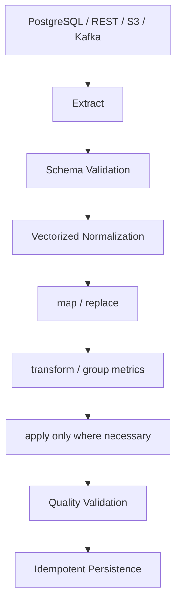

# 09- Apply Map And Transform

## Overview

`apply()`, `map()`, and `transform()` are Pandas tools for applying logic to Series and DataFrame data.

They solve different problems:

```text
Series.map()
    ↓
element-wise mapping on one Series

Series.apply()
    ↓
custom function on Series values

DataFrame.apply()
    ↓
custom function across rows or columns

DataFrame.transform()
    ↓
same-shaped transformation with group-aware semantics
```

The most important production principle is:

> Use the most specialized and vectorized operation that expresses the requirement clearly.

A practical preference order is often:

```text
native vectorized operation
        ↓
Series.map() / DataFrame.replace()
        ↓
DataFrame/Series method
        ↓
transform()
        ↓
apply()
        ↓
row-by-row Python loops
```

This is not an absolute performance law. The correct choice depends on the operation, data size, required output shape, and business logic.

---

## Why These Operations Matter

Real backend data frequently requires transformations that are more complex than simple filtering:

```text
normalize a status
map country codes
derive display categories
calculate row-level flags
apply custom business rules
compute group-level metrics
broadcast group statistics back to rows
```

For example:

```python
orders["status"] = (
    orders["status"]
    .astype("string")
    .str.strip()
    .str.lower()
)
```

A native string operation is preferable to:

```python
orders["status"] = orders[
    "status"
].apply(
    lambda value: value.strip().lower()
)
```

because the first expresses the intended operation directly and avoids unnecessary Python-level function calls.

---

## Comparison at a Glance

| Operation | Input | Typical output | Best use |
|---|---|---|---|
| vectorized methods | Series/DataFrame | same or reduced shape | standard transformations |
| `Series.map()` | Series | Series | value-to-value mapping |
| `Series.apply()` | Series | Series/scalar depending function | custom element-wise logic |
| `DataFrame.apply(axis=0)` | columns | Series/DataFrame | column-oriented custom logic |
| `DataFrame.apply(axis=1)` | rows | Series/DataFrame | row-level custom logic when vectorization is impractical |
| `transform()` | Series/DataFrame/GroupBy | shape-compatible result | group-wise or element-wise transformations |
| `replace()` | Series/DataFrame | same shape | explicit value substitution |

The key differences are:

```text
map
→ one-dimensional value mapping

apply
→ arbitrary Python callable

transform
→ shape-preserving transformation
```

---

## Prefer Vectorization First

Before using `apply()`, check whether a native Pandas or NumPy operation already expresses the logic.

Instead of:

```python
orders["amount_with_tax"] = (
    orders["amount"]
    .apply(lambda value: value * 1.18)
)
```

prefer:

```python
orders["amount_with_tax"] = (
    orders["amount"] * 1.18
)
```

Instead of:

```python
orders["status"] = orders[
    "status"
].apply(
    lambda value: value.strip().lower()
)
```

prefer:

```python
orders["status"] = (
    orders["status"]
    .astype("string")
    .str.strip()
    .str.lower()
)
```

Vectorized operations are usually:

```text
faster
clearer
easier to optimize
easier to reason about
```

---

## `Series.map()`

`map()` applies a mapping or function to the values of a Series.

Basic mapping:

```python
status_map = {
    "complete": "completed",
    "done": "completed",
    "pending": "pending",
}

orders["status"] = (
    orders["status"]
    .map(status_map)
)
```

`map()` is especially useful when the operation is naturally:

```text
input value
    ↓
output value
```

Examples:

```text
country code → country name
status code → canonical status
numeric code → label
category → classification
```

---

## `map()` with a Dictionary

Suppose:

```python
country_names = {
    "IN": "India",
    "US": "United States",
    "DE": "Germany",
}

customers["country_name"] = (
    customers["country_code"]
    .map(country_names)
)
```

For keys that are absent from the mapping, the result becomes missing.

This makes `map()` useful for controlled vocabulary conversion, but missing outputs must be validated when unmapped values are not acceptable.

---

## `map()` and Unknown Values

Consider:

```python
status_map = {
    "pending": "pending",
    "complete": "completed",
}

orders["status"] = (
    orders["status"]
    .map(status_map)
)
```

If the input contains:

```text
cancelled
```

it may become missing.

Detect unmapped values:

```python
unknown_statuses = orders.loc[
    orders["status"].isna(),
]
```

For production systems, distinguish:

```text
originally missing
```

from:

```text
unrecognized category
```

before making a decision.

---

## `map()` for Functions

`map()` also accepts a callable:

```python
orders["order_id"] = (
    orders["order_id"]
    .map(str.strip)
)
```

However, when a vectorized string operation exists:

```python
orders["order_id"] = (
    orders["order_id"]
    .astype("string")
    .str.strip()
)
```

the vectorized method is generally preferable.

Use callable-based `map()` when the transformation is naturally element-wise and no better vectorized operation exists.

---

## `map()` and Missing Values

A mapping operation should define missing behavior.

For example:

```python
customer_tiers = {
    "C-101": "gold",
    "C-102": "silver",
}

orders["customer_tier"] = (
    orders["customer_id"]
    .map(customer_tiers)
)
```

Unknown or missing customer IDs can produce missing tiers.

If every valid customer must have a tier:

```python
missing_tiers = orders.loc[
    orders["customer_tier"].isna()
]

if not missing_tiers.empty:
    raise ValueError(
        "Unable to map every customer to a tier"
    )
```

---

## `map()` for Categories

A useful pattern is converting machine-oriented codes into business labels:

```python
priority_labels = {
    1: "low",
    2: "medium",
    3: "high",
}

orders["priority_label"] = (
    orders["priority_code"]
    .map(priority_labels)
)
```

This can improve reporting and API responses while preserving the original code if needed.

For durable schemas, consider keeping both:

```text
priority_code
priority_label
```

when downstream systems need the original value.

---

## `map()` vs `replace()`

These methods are related but have different semantics.

### `map()`

```python
orders["status"] = (
    orders["status"]
    .map(status_map)
)
```

Unmapped values become missing.

### `replace()`

```python
orders["status"] = (
    orders["status"]
    .replace(status_map)
)
```

Values absent from the mapping generally remain unchanged.

Use:

```text
map
→
controlled mapping where unknown values should be detected

replace
→
explicit substitutions while preserving unrelated values
```

---

## `Series.apply()`

`Series.apply()` applies a callable to each value or to the Series itself depending on usage.

Example:

```python
orders["amount_bucket"] = (
    orders["amount"]
    .apply(
        lambda value: (
            "high"
            if value >= 500
            else "standard"
        )
    )
)
```

This is convenient for custom element-wise rules.

However, it usually executes Python-level function calls and can therefore be slower than equivalent vectorized operations.

---

## When `Series.apply()` Is Appropriate

Use it when:

```text
the rule is genuinely custom
no suitable vectorized operation exists
the dataset is bounded
clarity is improved
performance is acceptable
```

Example:

```python
def classify_order(value: float) -> str:
    if value >= 1000:
        return "enterprise"
    if value >= 500:
        return "large"
    return "standard"

orders["order_class"] = (
    orders["amount"]
    .apply(classify_order)
)
```

For a small configuration dataset, this can be perfectly reasonable.

---

## When Not to Use `Series.apply()`

Avoid:

```python
orders["amount"].apply(
    lambda value: value * 1.18
)
```

Use:

```python
orders["amount"] * 1.18
```

Avoid:

```python
orders["status"].apply(
    lambda value: value.strip().lower()
)
```

Use:

```python
orders["status"].str.strip().str.lower()
```

Avoid using `apply()` simply because it is easier to write than learning the corresponding vectorized operation.

---

## `DataFrame.apply()`

`DataFrame.apply()` can apply a function across:

```text
columns
```

or:

```text
rows
```

The default is:

```python
axis=0
```

meaning the function receives each column.

Example:

```python
numeric_summary = orders[
    ["amount", "discount"]
].apply(
    "mean"
)
```

For row-wise processing:

```python
orders["gross_amount"] = orders.apply(
    lambda row: (
        row["quantity"]
        * row["unit_price"]
    ),
    axis=1,
)
```

Row-wise `apply()` should be treated as a performance-sensitive operation.

---

## Understanding `axis`

This is a common interview source of confusion.

```text
axis=0
→ operate across rows for each column
→ function receives a column Series

axis=1
→ operate across columns for each row
→ function receives a row Series
```

Conceptually:

```text
DataFrame
    ↓
axis=0
    ↓
one column at a time

DataFrame
    ↓
axis=1
    ↓
one row at a time
```

---

## `DataFrame.apply(axis=0)`

Example:

```python
orders[
    ["amount", "discount"]
].apply(
    "sum"
)
```

This produces one result per column.

A custom function:

```python
def non_null_count(
    column: pd.Series,
) -> int:
    return int(column.notna().sum())

result = orders.apply(
    non_null_count,
    axis=0,
)
```

This is useful when the operation is genuinely column-oriented.

---

## `DataFrame.apply(axis=1)`

Example:

```python
orders["net_amount"] = orders.apply(
    lambda row: (
        row["amount"]
        - row["discount"]
    ),
    axis=1,
)
```

This works but incurs Python-level row iteration.

Prefer:

```python
orders["net_amount"] = (
    orders["amount"]
    - orders["discount"]
)
```

when possible.

---

## Why Row-Wise `apply()` Is Often Slow

A row-wise `apply()` conceptually does:

```text
row 1 → Python function
row 2 → Python function
row 3 → Python function
...
```

For large DataFrames, this introduces Python interpreter overhead.

A vectorized operation instead works over arrays or Series:

```text
entire column
    ↓
vectorized computation
```

The difference becomes significant as row counts increase.

---

## Vectorized Alternative to Row-Wise `apply()`

Avoid:

```python
orders["total"] = orders.apply(
    lambda row: (
        row["quantity"]
        * row["unit_price"]
    ),
    axis=1,
)
```

Prefer:

```python
orders["total"] = (
    orders["quantity"]
    * orders["unit_price"]
)
```

This is simpler, faster, and easier to test.

---

## Conditional Vectorization

Instead of:

```python
orders["priority"] = orders[
    "amount"
].apply(
    lambda value: (
        "high"
        if value >= 500
        else "normal"
    )
)
```

prefer:

```python
orders["priority"] = (
    orders["amount"]
    .ge(500)
    .map({
        True: "high",
        False: "normal",
    })
)
```

or a more explicit conditional construction:

```python
orders["priority"] = np.where(
    orders["amount"].ge(500),
    "high",
    "normal",
)
```

When NumPy is appropriate, `np.where()` is a useful vectorized alternative.

---

## `np.select()` for Multiple Conditions

For multiple mutually exclusive business rules:

```python
import numpy as np

conditions = [
    orders["amount"].ge(1000),
    orders["amount"].ge(500),
    orders["amount"].ge(100),
]

choices = [
    "enterprise",
    "large",
    "standard",
]

orders["order_class"] = np.select(
    conditions,
    choices,
    default="small",
)
```

This is generally clearer and faster than a long nested `apply()` function.

---

## `transform()`

`transform()` is designed for transformations that preserve the shape of the original data.

This distinction is critical:

```text
groupby().agg()
→
reduces groups

groupby().transform()
→
returns values aligned to original rows
```

Example:

```python
orders["customer_total"] = (
    orders.groupby(
        "customer_id"
    )["amount"]
    .transform("sum")
)
```

If there are 100,000 input rows, the transformed Series also has 100,000 entries.

---

## Why `transform()` Exists

Suppose each order needs the total revenue of its customer.

An aggregation:

```python
customer_totals = (
    orders.groupby(
        "customer_id"
    )["amount"]
    .sum()
)
```

produces one value per customer.

But the original DataFrame has one row per order.

`transform()` broadcasts the group result back to every original row:

```text
orders
    ↓
groupby customer_id
    ↓
sum per customer
    ↓
align back to original rows
```

---

## `transform()` vs `agg()`

| Operation | Shape | Typical purpose |
|---|---|---|
| `agg()` | reduced | produce group summaries |
| `transform()` | original shape | add group-level metrics to rows |
| `filter()` | subset of groups/rows | keep groups based on conditions |

Example:

```python
customer_totals = (
    orders.groupby("customer_id")[
        "amount"
    ]
    .agg("sum")
)
```

versus:

```python
orders["customer_total"] = (
    orders.groupby("customer_id")[
        "amount"
    ]
    .transform("sum")
)
```

The first is a summary table.

The second enriches the original records.

---

## Common `transform()` Pattern

Calculate each order's share of customer revenue:

```python
orders["customer_total"] = (
    orders.groupby(
        "customer_id"
    )["amount"]
    .transform("sum")
)

orders["customer_share"] = (
    orders["amount"]
    / orders["customer_total"]
)
```

Now each row contains:

```text
order amount
customer total
order share
```

This is a common analytical and reporting pattern.

---

## Group-Level Mean with `transform()`

```python
orders["customer_avg"] = (
    orders.groupby(
        "customer_id"
    )["amount"]
    .transform("mean")
)
```

Then compare each order to its customer's average:

```python
orders["above_customer_avg"] = (
    orders["amount"]
    > orders["customer_avg"]
)
```

The advantage is that no explicit merge is required to bring the grouped statistic back into the original DataFrame.

---

## Group-Level Missing-Value Filling

`transform()` is useful when filling values using group-specific statistics.

```python
orders["amount"] = (
    orders.groupby("customer_id")[
        "amount"
    ]
    .transform(
        lambda values: values.fillna(
            values.median()
        )
    )
)
```

This preserves the DataFrame shape.

Use this only when the business meaning supports customer-level imputation.

---

## `transform()` with Named Functions

Example:

```python
orders["customer_max"] = (
    orders.groupby(
        "customer_id"
    )["amount"]
    .transform("max")
)
```

For a custom transformation:

```python
def normalize(values: pd.Series) -> pd.Series:
    maximum = values.max()

    if maximum == 0:
        return values * 0

    return values / maximum

orders["customer_normalized"] = (
    orders.groupby("customer_id")[
        "amount"
    ].transform(normalize)
)
```

The function must produce an output compatible with the group's shape.

---

## Shape Preservation

This is the key `transform()` contract.

Input:

```text
100 rows
```

A compatible transformation returns:

```text
100 values
```

This allows direct assignment:

```python
orders["customer_total"] = (
    orders.groupby("customer_id")[
        "amount"
    ].transform("sum")
)
```

If the result is shorter or structurally incompatible, direct assignment will fail or represent a different operation.

---

## `transform()` vs `apply()`

Both can accept custom functions, but they communicate different intent.

```text
apply()
→ arbitrary computation

transform()
→ transformation compatible with original shape
```

For grouped data:

```python
grouped.apply(...)
```

may reduce, reshape, or concatenate results depending on the function.

By contrast:

```python
grouped.transform(...)
```

is specifically suited to row-aligned transformations.

Choose `transform()` when shape preservation is part of the requirement.

---

## Grouped `apply()`

Grouped `apply()` is flexible:

```python
result = (
    orders.groupby("customer_id")
    .apply(
        lambda group: group.nlargest(
            3,
            "amount",
        ),
        include_groups=False,
    )
)
```

This can solve complex per-group problems, but it can be substantially more expensive and produce more complex indexing than `transform()`.

Before using grouped `apply()`, determine whether:

```text
rank
transform
aggregate
filter
nlargest
```

can express the requirement more directly.

---

## `apply()` and Returned Shapes

The return type from `apply()` can vary based on the function.

For example:

```python
result = orders["amount"].apply(
    lambda value: value * 2
)
```

returns a Series.

But a function may return:

```text
scalar
Series
list
dict
```

which can create different output structures.

This flexibility is powerful but can make production pipelines harder to reason about.

Prefer explicit output contracts when writing reusable transformation functions.

---

## `apply()` with `result_type`

For row-wise DataFrame `apply()`, `result_type` can control expansion behavior.

For example:

```python
result = orders.apply(
    lambda row: pd.Series(
        {
            "gross": (
                row["quantity"]
                * row["unit_price"]
            ),
            "is_large": (
                row["quantity"]
                >= 10
            ),
        }
    ),
    axis=1,
)
```

This produces a DataFrame because each function result contains named fields.

Although useful, this remains Python-level row processing.

If the logic can be expressed with vectorized operations, prefer those.

---

## Apply for Complex Business Rules

A custom function can be appropriate when the logic is genuinely difficult to express otherwise.

```python
def classify_customer(
    row: pd.Series,
) -> str:
    if row["lifetime_value"] >= 10000:
        return "enterprise"

    if (
        row["lifetime_value"] >= 5000
        and row["order_count"] >= 10
    ):
        return "high_value"

    return "standard"

customers["segment"] = customers.apply(
    classify_customer,
    axis=1,
)
```

This can be acceptable for:

```text
moderate dataset size
complex branching
business logic that benefits from a named function
```

For millions of rows, investigate vectorized or database alternatives.

---

## Refactoring Row-Wise Logic

A senior engineer should ask:

```text
Can the condition be decomposed into boolean masks?
Can this use numpy.select()?
Can this use clip(), where(), mask(), or fillna()?
Can the database execute it?
Can it be precomputed?
```

For example, instead of:

```python
def classify(row: pd.Series) -> str:
    if row["amount"] >= 1000:
        return "enterprise"
    if row["amount"] >= 500:
        return "large"
    return "standard"

orders["class"] = orders.apply(
    classify,
    axis=1,
)
```

use:

```python
import numpy as np

conditions = [
    orders["amount"].ge(1000),
    orders["amount"].ge(500),
]

choices = [
    "enterprise",
    "large",
]

orders["class"] = np.select(
    conditions,
    choices,
    default="standard",
)
```

The second version exposes the decision structure and avoids row-wise Python callbacks.

---

## `apply()` and External Services

Avoid network calls inside `apply()`:

```python
orders["risk"] = orders[
    "customer_id"
].apply(
    fetch_risk_from_service
)
```

This can produce:

```text
N rows
→
N network requests
```

which is inefficient and unreliable.

Instead:

```text
extract unique IDs
→
batch API call
→
DataFrame
→
merge results
```

For example:

```python
customer_ids = (
    orders["customer_id"]
    .dropna()
    .unique()
)

risk_scores = fetch_risk_scores(
    customer_ids
)

orders = orders.merge(
    risk_scores,
    on="customer_id",
    how="left",
    validate="many_to_one",
)
```

This is a critical production distinction between data transformation and external I/O.

---

## `apply()` and Database Calls

Never turn one row into one SQL query:

```python
orders["customer_name"] = orders[
    "customer_id"
].apply(
    lambda customer_id: load_customer(
        customer_id
    )
)
```

This creates an N+1 query pattern.

Prefer:

```text
query customer data once
→
DataFrame
→
merge
```

or perform the join directly in PostgreSQL.

---

## `apply()` and Concurrency

`apply()` itself is not a parallel execution framework.

A slow row-wise function does not become production-scalable simply because the process runs inside:

```text
Celery
Docker
Kubernetes
```

Those systems can distribute work, but the underlying operation may still be inefficient.

First optimize the unit of work.

Then scale horizontally when the workload still requires it.

---

## `map()` with External I/O

Similarly, avoid:

```python
orders["currency_name"] = (
    orders["currency_code"]
    .map(fetch_currency_metadata)
)
```

if `fetch_currency_metadata()` performs network requests.

Even though `map()` looks concise, it can execute one external call per value.

For external data:

```text
batch lookup
→
load reference DataFrame
→
merge
```

is typically more appropriate.

---

## Reference Data + `merge()`

Instead of a mapping function that queries a database:

```python
country_names = pd.DataFrame(
    {
        "country_code": ["IN", "US"],
        "country_name": [
            "India",
            "United States",
        ],
    }
)

customers = customers.merge(
    country_names,
    on="country_code",
    how="left",
    validate="many_to_one",
)
```

This has stronger operational characteristics:

```text
one batch lookup
+
explicit relationship
+
cardinality validation
```

---

## `map()` and Index Alignment

If mapping from a Series, Pandas uses the mapping Series' index.

For example:

```python
tier_map = pd.Series(
    ["gold", "silver"],
    index=["C-101", "C-102"],
)

customers["tier"] = (
    customers["customer_id"]
    .map(tier_map)
)
```

This is still conceptually a lookup from identifier to value.

When the mapping source is large, explicit joins can make the data relationship more visible.

---

## `apply()` and Missing Values

Custom functions should define what happens with missing values.

For example:

```python
def classify_amount(
    value: float | pd.NA,
) -> str:
    if pd.isna(value):
        return "unknown"

    if value >= 1000:
        return "high"

    return "standard"

orders["amount_class"] = (
    orders["amount"]
    .apply(classify_amount)
)
```

Do not assume the callback will automatically receive or propagate missing values in the way your business rule expects.

---

## `map()` and Missing Values

Mapping may preserve or produce missing values.

For example:

```python
status_map = {
    "P": "pending",
    "C": "completed",
}

orders["status"] = (
    orders["status_code"]
    .map(status_map)
)
```

If an unknown code appears:

```text
X
```

the result may become missing.

Validate mapping completeness:

```python
unknown_codes = orders.loc[
    orders["status_code"].notna()
    & orders["status"].isna(),
    "status_code",
].unique()
```

This prevents silent category loss.

---

## `transform()` and Missing Values

Group-level transformations inherit the missing-value behavior of the underlying operation.

Example:

```python
orders["customer_avg"] = (
    orders.groupby("customer_id")[
        "amount"
    ].transform("mean")
)
```

The mean generally ignores missing amounts.

If missing amounts are invalid, validate before calculating the group statistic.

Do not let an aggregation policy silently become an imputation policy.

---

## `transform()` for Normalization

A common pattern is group-wise percentage:

```python
orders["customer_total"] = (
    orders.groupby(
        "customer_id"
    )["amount"]
    .transform("sum")
)

orders["revenue_share"] = (
    orders["amount"]
    / orders["customer_total"]
)
```

Another example is deviation from the group average:

```python
orders["customer_mean"] = (
    orders.groupby(
        "customer_id"
    )["amount"]
    .transform("mean")
)

orders["deviation"] = (
    orders["amount"]
    - orders["customer_mean"]
)
```

This is a strong use case for `transform()` because the result remains row-aligned.

---

## `transform()` for Group Ranking Preparation

Some ranking problems can be expressed without `apply()`.

For example:

```python
orders["customer_order_count"] = (
    orders.groupby(
        "customer_id"
    )["order_id"]
    .transform("count")
)
```

Then:

```python
high_activity = orders.loc[
    orders["customer_order_count"] >= 10
]
```

This adds group-level context without changing the DataFrame shape.

---

## `transform()` with Multiple Columns

Apply a grouped transformation to a subset:

```python
numeric = [
    "amount",
    "discount",
]

normalized = (
    orders.groupby("customer_id")[
        numeric
    ]
    .transform("mean")
)
```

The output retains:

```text
same rows
same selected columns
original index alignment
```

This makes direct assignment possible:

```python
orders[
    ["customer_avg_amount", "customer_avg_discount"]
] = normalized.to_numpy()
```

Use explicit column naming when semantics are important.

---

## `transform()` vs Merge-Based Enrichment

Without `transform()`:

```python
customer_totals = (
    orders.groupby(
        "customer_id",
        as_index=False,
    )["amount"]
    .sum()
    .rename(
        columns={
            "amount": "customer_total"
        }
    )
)

orders = orders.merge(
    customer_totals,
    on="customer_id",
    how="left",
    validate="many_to_one",
)
```

With `transform()`:

```python
orders["customer_total"] = (
    orders.groupby(
        "customer_id"
    )["amount"]
    .transform("sum")
)
```

The `transform()` approach is often simpler when the grouped result exists only to enrich the same DataFrame.

A merge may be preferable when the grouped result is itself a reusable dataset.

---

## `apply()` vs `transform()` for Grouped Operations

Suppose the goal is to subtract the customer mean.

Using `transform()`:

```python
orders["centered"] = (
    orders["amount"]
    - orders.groupby(
        "customer_id"
    )["amount"]
    .transform("mean")
)
```

This clearly communicates:

```text
group calculation
→
same-shape result
```

Using grouped `apply()` would be more flexible but less direct.

Prefer the operation whose contract matches the intended shape.

---

## Method Chaining

A readable pipeline may combine operations:

```python
result = (
    orders
    .assign(
        status=lambda df: (
            df["status"]
            .astype("string")
            .str.strip()
            .str.lower()
        )
    )
    .loc[
        lambda df: df["status"].eq(
            "completed"
        )
    ]
)
```

Do not force every transformation into a single chain.

Use explicit intermediate variables when they make business logic or debugging clearer.

---

## Avoid Clever `apply()` Chains

This:

```python
result = (
    df
    .apply(
        some_function,
        axis=1,
    )
    .apply(
        another_function,
    )
)
```

may be difficult to profile and reason about.

Prefer named stages:

```python
normalized = normalize_orders(df)
classified = classify_orders(normalized)
```

Production readability matters more than minimizing line count.

---

## Performance Decision Framework

Before using `apply()`, ask:

```text
Can this be expressed with a native Pandas operation?
        ↓
Can this be expressed with NumPy?
        ↓
Can this be handled by map()/replace()?
        ↓
Can transform() express the grouped requirement?
        ↓
Can the database execute it?
        ↓
Only then consider apply()
```

This sequence avoids many performance problems.

---

## Benchmarking Transformations

Do not assume two equivalent implementations perform identically.

A simple benchmark:

```python
from time import perf_counter

start = perf_counter()

result = (
    orders["amount"]
    * 1.18
)

elapsed = perf_counter() - start

print(f"Elapsed: {elapsed:.4f}s")
```

For meaningful benchmarks:

```text
representative row count
same input data
warm-up considerations
multiple iterations
memory measurement
```

Use proper benchmarking tools for serious performance comparisons.

---

## Memory Considerations

`apply()` can create intermediate Python objects.

For large datasets:

```text
vectorized operations
→
usually lower Python overhead

apply()
→
potentially more Python objects and function calls

row-wise apply()
→
often especially expensive
```

Peak memory matters because transformations can coexist with the original DataFrame.

Avoid creating large temporary structures unnecessarily.

---

## Large Dataset Strategy

For very large datasets:

```text
source-side filtering
→
projection
→
chunking
→
vectorized transformation
→
bounded persistence
```

Use `apply()` only when its custom logic is justified.

For example:

```python
for chunk in pd.read_csv(
    "orders.csv",
    chunksize=100_000,
):
    chunk["status"] = (
        chunk["status"]
        .astype("string")
        .str.strip()
        .str.lower()
    )

    process(chunk)
```

A vectorized transformation remains appropriate within each chunk.

---

## Data Cleaning Example

Suppose raw customer data contains:

```text
customer_id  country_code  status
 C-101        in            Active
 C-102        us            ACTIVE
 C-103        de            Inactive
```

Use vectorized normalization:

```python
customers["customer_id"] = (
    customers["customer_id"]
    .astype("string")
    .str.strip()
    .str.upper()
)

customers["country_code"] = (
    customers["country_code"]
    .astype("string")
    .str.strip()
    .str.upper()
)

customers["status"] = (
    customers["status"]
    .astype("string")
    .str.strip()
    .str.lower()
)
```

Then map controlled categories:

```python
status_map = {
    "active": "active",
    "inactive": "inactive",
}

customers["status"] = (
    customers["status"]
    .map(status_map)
)
```

Validate unknown values before persistence.

---

## ETL Example

A production-style transformation may use several specialized tools:

```python
import numpy as np

orders["status"] = (
    orders["status"]
    .astype("string")
    .str.strip()
    .str.lower()
)

orders["amount"] = pd.to_numeric(
    orders["amount"],
    errors="raise",
)

conditions = [
    orders["amount"].ge(1000),
    orders["amount"].ge(500),
]

choices = [
    "enterprise",
    "large",
]

orders["order_class"] = np.select(
    conditions,
    choices,
    default="standard",
)

orders["customer_total"] = (
    orders.groupby(
        "customer_id"
    )["amount"]
    .transform("sum")
)
```

Notice that no `apply()` is required.

The specialized operations communicate the intent directly.

---

## Production Architecture

A practical Pandas service might follow:



The architecture makes `apply()` the fallback for custom logic rather than the default transformation tool.

---

## FastAPI Integration

For an API that generates a report:

```text
HTTP request
→
Pydantic validation
→
authorization
→
SQL extraction
→
bounded DataFrame
→
vectorized transformation
→
report shaping
→
response
```

Do not perform expensive `apply(axis=1)` work on an unbounded request path.

For heavy transformations, move processing to:

```text
Celery
Kubernetes Job
AWS Batch
```

and return a job identifier when appropriate.

---

## Celery Integration

A Celery task can safely perform heavier transformations:

```python
def process_orders(
    orders: pd.DataFrame,
) -> pd.DataFrame:
    result = orders.copy()

    result["amount"] = pd.to_numeric(
        result["amount"],
        errors="raise",
    )

    result["customer_total"] = (
        result.groupby(
            "customer_id"
        )["amount"]
        .transform("sum")
    )

    return result
```

The task should be:

```text
deterministic
bounded
observable
retry-safe
```

---

## External I/O Anti-Pattern

This is a common mistake:

```python
orders["risk_score"] = orders[
    "customer_id"
].apply(
    lambda customer_id:
        requests.get(
            f"/risk/{customer_id}"
        ).json()["score"]
)
```

Problems include:

```text
N network requests
slow throughput
rate-limit risk
retry complexity
partial failure
poor observability
connection overhead
```

Use batch-oriented external APIs, caching, or bulk database access instead.

---

## Security Considerations

Do not allow untrusted request data to become arbitrary executable logic.

Avoid patterns where external input constructs:

```text
Python code
dynamic callbacks
unsafe expressions
arbitrary import paths
```

For filtering and transformation parameters:

```text
validate input
→
map to known operations
→
execute controlled transformation
```

For example:

```python
sort_options = {
    "amount": "amount",
    "created_at": "created_at",
}

column = sort_options.get(
    requested_sort,
)

if column is None:
    raise ValueError(
        "Invalid sort field"
    )
```

Similarly, mappings and transformation functions should come from controlled application code rather than arbitrary user input.

---

## Reliability Considerations

A transformation should have a defined contract:

```text
input schema
input dtypes
output schema
output dtypes
null behavior
duplicate behavior
ordering guarantees
error behavior
```

For `transform()`, the output shape is part of the contract.

For `map()`, unknown values must have an explicit policy.

For `apply()`, output type and shape should be controlled.

---

## Observability

Track transformation metrics such as:

```text
input rows
output rows
unknown mapped values
transformation failures
nulls introduced
processing duration
peak memory
```

For example:

```python
mapped = (
    orders["status"]
    .map(status_map)
)

unknown_count = int(
    (
        orders["status"].notna()
        & mapped.isna()
    ).sum()
)

logger.info(
    "Status mapping completed",
    extra={
        "rows": len(orders),
        "unknown_statuses": unknown_count,
    },
)
```

This prevents a silent mapping regression from becoming a downstream reporting problem.

---

## Testing `map()`

```python
def test_status_mapping() -> None:
    statuses = pd.Series(
        [
            "pending",
            "complete",
            "done",
        ]
    )

    mapping = {
        "pending": "pending",
        "complete": "completed",
        "done": "completed",
    }

    result = statuses.map(mapping)

    expected = pd.Series(
        [
            "pending",
            "completed",
            "completed",
        ]
    )

    pd.testing.assert_series_equal(
        result,
        expected,
    )
```

Test unknown values separately.

---

## Testing `apply()`

Test the business behavior of the function:

```python
def classify_amount(
    value: float,
) -> str:
    if value >= 1000:
        return "high"

    return "standard"


def test_classify_amount() -> None:
    amounts = pd.Series(
        [100.0, 1000.0]
    )

    result = amounts.apply(
        classify_amount
    )

    assert result.tolist() == [
        "standard",
        "high",
    ]
```

If the function will process missing values, test them explicitly.

---

## Testing `transform()`

```python
def test_customer_total_transform() -> None:
    orders = pd.DataFrame(
        {
            "customer_id": [
                "C-1",
                "C-1",
                "C-2",
            ],
            "amount": [
                100.0,
                200.0,
                300.0,
            ],
        }
    )

    result = (
        orders.groupby(
            "customer_id"
        )["amount"]
        .transform("sum")
    )

    assert result.tolist() == [
        300.0,
        300.0,
        300.0,
    ]
```

The test verifies the key contract:

```text
same number of rows
+
group statistic broadcast to original rows
```

---

## Testing Vectorized Replacements

When replacing `apply()` for performance, verify equivalence.

```python
custom = orders["amount"].apply(
    lambda value: (
        "large"
        if value >= 500
        else "standard"
    )
)

vectorized = np.where(
    orders["amount"].ge(500),
    "large",
    "standard",
)

assert custom.tolist() == vectorized.tolist()
```

This type of test is useful during optimization refactors.

---

## Common Mistakes

### Using `apply()` for Simple Arithmetic

Avoid:

```python
df["total"].apply(
    lambda value: value * 1.18
)
```

Use vectorized arithmetic.

### Using `apply(axis=1)` by Default

Row-wise operations are convenient but can be expensive at scale.

### Calling External APIs Inside `apply()`

This creates an N+1 network pattern.

### Calling the Database from `apply()`

This creates an N+1 query pattern.

### Using `map()` When Unknown Values Should Be Preserved

`map()` can produce missing values for unmapped keys. Use `replace()` when unchanged values should remain intact.

### Using `replace()` When Unknown Values Must Be Rejected

A controlled mapping with `map()` followed by validation may be more appropriate.

### Using `apply()` Without Handling Missing Values

Custom functions should define null behavior explicitly.

### Misusing `transform()`

`transform()` is for shape-compatible output. It is not a generic replacement for every grouped computation.

### Assuming `transform()` Is Always Faster

The right operation depends on the computation. Choose based on semantics first, then benchmark.

### Returning Inconsistent Shapes from `apply()`

A custom function that sometimes returns scalars and sometimes Series can create confusing output.

### Hiding Business Logic in Lambdas

Named functions are easier to test and explain.

Prefer:

```python
def classify_customer(row: pd.Series) -> str:
    ...
```

over large inline lambdas.

### Building an Unreadable Method Chain

Readable intermediate variables are often better than overly compact code.

---

## Interview Traps

### What Is the Difference Between `map()` and `apply()`?

`map()` is primarily a one-dimensional value mapping operation on a Series.

`apply()` is more general and can execute arbitrary Python callables.

### When Should `map()` Be Used?

Use it when a Series value maps naturally to another value:

```python
df["code"].map(mapping)
```

### When Should `apply()` Be Used?

Use it when no suitable vectorized or specialized operation expresses the required custom logic.

### Why Is `apply(axis=1)` Often Slow?

It invokes Python-level code once per row.

### What Does `axis=0` Mean for `DataFrame.apply()`?

The function is applied to each column.

### What Does `axis=1` Mean?

The function is applied to each row.

### What Is `transform()` Used For?

It produces a transformation whose output remains compatible with the original shape, making it especially useful for group-wise enrichment.

### What Is the Difference Between `groupby().agg()` and `groupby().transform()`?

`agg()` produces reduced group-level results.

`transform()` broadcasts compatible group-level calculations back to the original rows.

### How Do You Calculate Customer Revenue on Every Order?

```python
orders["customer_total"] = (
    orders.groupby(
        "customer_id"
    )["amount"]
    .transform("sum")
)
```

### How Would You Replace a Row-Wise `apply()`?

First identify whether the logic can use:

```text
vectorized arithmetic
str methods
dt methods
isin()
where()
mask()
np.where()
np.select()
map()
transform()
```

### Why Should External I/O Not Be Performed in `apply()`?

It creates one operation per row, causing N+1 requests and poor throughput.

### Why Is `map()` Useful for Controlled Mappings?

It makes unknown values visible as missing, which can then be validated.

### When Is `replace()` Preferable to `map()`?

When unmatched values should remain unchanged.

### What Makes a Transformation Production-Ready?

A clear input/output schema, explicit null behavior, deterministic logic, controlled output shape, tests, metrics, and predictable failure handling.

---

## Production Decision Framework

When implementing a transformation:

```text
What is the operation?
        ↓
Simple arithmetic?
        → vectorized arithmetic

String manipulation?
        → .str methods

Datetime logic?
        → .dt methods

Controlled value mapping?
        → map() / replace()

Group statistic needed on every row?
        → transform()

Complex custom element-level logic?
        → Series.apply()

Complex row-level logic with no vectorized form?
        → DataFrame.apply(axis=1)

External data needed?
        → batch lookup + merge

Very large source?
        → push down / chunk / incremental process
```

The goal is not to avoid `apply()` completely.

The goal is to use it deliberately.

---

## Recommended Engineering Pattern

For a production transformation module:

```python
def normalize_orders(
    orders: pd.DataFrame,
) -> pd.DataFrame:
    result = orders.copy()

    result["status"] = (
        result["status"]
        .astype("string")
        .str.strip()
        .str.lower()
    )

    result["amount"] = pd.to_numeric(
        result["amount"],
        errors="raise",
    )

    return result


def enrich_customer_metrics(
    orders: pd.DataFrame,
) -> pd.DataFrame:
    result = orders.copy()

    result["customer_total"] = (
        result.groupby(
            "customer_id"
        )["amount"]
        .transform("sum")
    )

    return result
```

Then reserve `apply()` for logic that genuinely requires custom Python behavior.

---

## End-to-End ETL Example

```python
import numpy as np
import pandas as pd


def clean_and_enrich_orders(
    orders: pd.DataFrame,
) -> pd.DataFrame:
    required = {
        "order_id",
        "customer_id",
        "amount",
        "status",
    }

    missing = (
        required
        - set(orders.columns)
    )

    if missing:
        raise ValueError(
            f"Missing columns: {sorted(missing)}"
        )

    result = orders.copy()

    result["order_id"] = (
        result["order_id"]
        .astype("string")
        .str.strip()
        .str.upper()
    )

    result["customer_id"] = (
        result["customer_id"]
        .astype("string")
        .str.strip()
        .str.upper()
    )

    result["status"] = (
        result["status"]
        .astype("string")
        .str.strip()
        .str.lower()
    )

    result["amount"] = pd.to_numeric(
        result["amount"],
        errors="raise",
    )

    status_map = {
        "complete": "completed",
        "completed": "completed",
        "pending": "pending",
        "cancelled": "cancelled",
    }

    result["status"] = (
        result["status"]
        .map(status_map)
    )

    result = result.drop_duplicates(
        subset=["order_id"],
        keep="last",
    )

    conditions = [
        result["amount"].ge(1000),
        result["amount"].ge(500),
    ]

    choices = [
        "enterprise",
        "large",
    ]

    result["order_class"] = np.select(
        conditions,
        choices,
        default="standard",
    )

    result["customer_total"] = (
        result.groupby(
            "customer_id"
        )["amount"]
        .transform("sum")
    )

    return result
```

This example deliberately uses:

```text
string methods
numeric conversion
map
deduplication
vectorized conditions
transform
```

without using `apply()` because none of the requirements actually need row-wise Python execution.

---

## Key Takeaways

- Prefer specialized vectorized operations first; use `map()` for value mapping, `apply()` for genuinely custom logic, and `transform()` when the result must remain aligned with the original shape.
- `DataFrame.apply(axis=1)` is powerful but often expensive because it executes Python-level logic row by row; replace it with vectorized Pandas or NumPy operations whenever practical.
- `transform()` is particularly valuable for group-wise enrichment such as customer totals, averages, shares, and normalized values because it preserves the original row structure.
- Never perform per-row database or network calls inside `map()` or `apply()`; use batch retrieval, caching, joins, or source-side SQL instead.
- Production transformations should have explicit input/output contracts, deterministic null and error behavior, tests, observability, and a deliberate strategy for scaling beyond a single in-memory DataFrame.