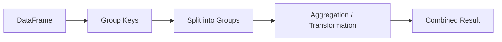
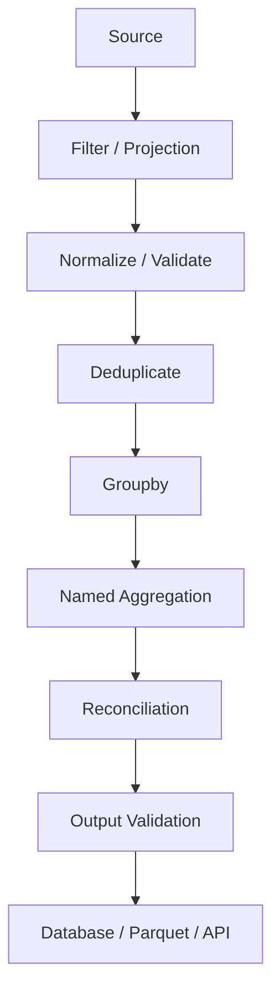

# 10- Groupby And Aggregation

## Overview

`groupby()` is one of the core Pandas operations for turning row-level data into grouped summaries and group-aware transformations.

It is commonly used for:

```text
revenue by customer
orders by status
sales by product
transactions by account
metrics by service
events by event type
employees by department
```

The central idea is:

```text
split
  ↓
apply
  ↓
combine
```

A typical workflow is:



For production backend and data-engineering work, grouping is often used after:

```text
SQL extraction
API ingestion
batch processing
data cleaning
deduplication
filtering
```

A senior-level understanding requires more than knowing `groupby().sum()`. You should understand:

```text
group keys
aggregation semantics
missing groups
output shape
index behavior
named aggregation
multiple aggregations
group-wise transformation
group filtering
ordering
performance
database pushdown
```

---

## What `groupby()` Does

`groupby()` partitions a DataFrame according to one or more grouping keys.

Example:

```python
import pandas as pd

orders = pd.DataFrame(
    {
        "order_id": [
            "O-1001",
            "O-1002",
            "O-1003",
            "O-1004",
            "O-1005",
        ],
        "customer_id": [
            "C-101",
            "C-102",
            "C-101",
            "C-103",
            "C-101",
        ],
        "status": [
            "completed",
            "completed",
            "pending",
            "completed",
            "completed",
        ],
        "amount": [
            125.50,
            300.00,
            75.25,
            900.00,
            450.00,
        ],
    }
)
```

Group by customer:

```python
grouped = orders.groupby(
    "customer_id"
)
```

`grouped` is a `DataFrameGroupBy` object.

It represents the grouping operation but does not yet perform a final aggregation.

---

## The Split-Apply-Combine Model

The conceptual model is:

```text
Input rows
    ↓
Split by grouping keys
    ↓
Apply aggregation/transformation
    ↓
Combine into result
```

For:

```python
orders.groupby("customer_id")[
    "amount"
].sum()
```

Pandas effectively reasons about:

```text
C-101 → 125.50 + 75.25 + 450.00
C-102 → 300.00
C-103 → 900.00
```

resulting in:

```text
customer_id
C-101    650.75
C-102    300.00
C-103    900.00
```

---

## Basic Aggregations

Common aggregation methods include:

```python
orders.groupby("customer_id")["amount"].sum()
```

```python
orders.groupby("customer_id")["amount"].mean()
```

```python
orders.groupby("customer_id")["amount"].count()
```

```python
orders.groupby("customer_id")["amount"].min()
```

```python
orders.groupby("customer_id")["amount"].max()
```

```python
orders.groupby("customer_id")["amount"].median()
```

Other useful methods include:

```text
std()
var()
prod()
first()
last()
nunique()
```

Choose the aggregation based on the business meaning, not merely what is convenient.

---

## `sum()`

Calculate revenue by customer:

```python
customer_revenue = (
    orders.groupby("customer_id")[
        "amount"
    ]
    .sum()
)
```

The result contains one value per group.

For a DataFrame result:

```python
customer_revenue = (
    orders.groupby(
        "customer_id",
        as_index=False,
    )["amount"]
    .sum()
)
```

This produces a tabular result:

```text
customer_id  amount
C-101        650.75
C-102        300.00
C-103        900.00
```

---

## `count()` vs `size()`

This distinction is important in interviews and reconciliation.

`count()` counts non-null values:

```python
orders.groupby(
    "customer_id"
)["amount"].count()
```

`size()` counts rows regardless of nulls:

```python
orders.groupby(
    "customer_id"
).size()
```

Consider:

```text
customer_id  amount
C-101        100
C-101        NaN
```

Then:

```text
count() → 1
size()  → 2
```

Use:

```text
count()
→ non-null observations

size()
→ total rows in each group
```

---

## `nunique()`

Count distinct values within groups:

```python
customers = (
    orders.groupby("customer_id")[
        "status"
    ]
    .nunique()
)
```

For order IDs:

```python
order_counts = (
    orders.groupby("customer_id")[
        "order_id"
    ]
    .nunique()
)
```

This is useful when rows may contain duplicates and the business metric requires unique entities.

---

## Multiple Aggregations

Apply several aggregations:

```python
summary = (
    orders.groupby("customer_id")[
        "amount"
    ]
    .agg(
        [
            "count",
            "sum",
            "mean",
            "min",
            "max",
        ]
    )
)
```

This returns multiple statistics per group.

For reporting pipelines, explicit aggregation definitions are generally easier to maintain than dynamic, loosely typed aggregation logic.

---

## Named Aggregation

Named aggregation gives output columns meaningful names:

```python
summary = (
    orders.groupby("customer_id")
    .agg(
        order_count=(
            "order_id",
            "nunique",
        ),
        total_revenue=(
            "amount",
            "sum",
        ),
        average_order_value=(
            "amount",
            "mean",
        ),
    )
    .reset_index()
)
```

Result:

```text
customer_id  order_count  total_revenue  average_order_value
C-101        3            650.75         216.92
C-102        1            300.00         300.00
C-103        1            900.00         900.00
```

Named aggregation is one of the clearest patterns for production reporting code.

---

## Why Named Aggregation Is Useful

It provides:

```text
explicit input columns
explicit aggregation functions
explicit output names
stable output schema
```

Compare:

```python
orders.groupby("customer_id").agg(
    {
        "order_id": "count",
        "amount": ["sum", "mean"],
    }
)
```

with:

```python
orders.groupby("customer_id").agg(
    order_count=("order_id", "count"),
    total_revenue=("amount", "sum"),
    average_order_value=("amount", "mean"),
)
```

The second is often easier to consume downstream.

---

## Grouping by Multiple Columns

Group by multiple dimensions:

```python
summary = (
    orders.groupby(
        [
            "customer_id",
            "status",
        ]
    )
    .agg(
        order_count=(
            "order_id",
            "nunique",
        ),
        total_amount=(
            "amount",
            "sum",
        ),
    )
    .reset_index()
)
```

This produces one aggregate row per:

```text
customer_id + status
```

Combination keys are common in reporting:

```text
country + product
service + environment
department + role
date + region
```

---

## Hierarchical Grouping

Multiple grouping keys can represent a hierarchy:

```text
region
  ↓
country
  ↓
city
```

Example:

```python
summary = (
    sales.groupby(
        [
            "region",
            "country",
        ]
    )["revenue"]
    .sum()
)
```

By default, the result may use a MultiIndex.

For downstream systems, decide whether that hierarchical index is desirable or whether it should be converted back to regular columns.

---

## `as_index=False`

Instead of producing grouped keys as an index:

```python
summary = (
    orders.groupby(
        "customer_id",
        as_index=False,
    )
    .agg(
        total_amount=(
            "amount",
            "sum",
        )
    )
)
```

This is often convenient for:

```text
CSV export
database loading
REST serialization
Parquet output
DataFrame-to-DataFrame pipelines
```

It keeps grouping keys as ordinary columns.

---

## `reset_index()`

Another approach:

```python
summary = (
    orders.groupby("customer_id")[
        "amount"
    ]
    .sum()
    .reset_index(
        name="total_amount"
    )
)
```

This converts the grouped index back to a column.

Both patterns are valid:

```text
as_index=False
```

or:

```text
reset_index()
```

Choose based on readability and the surrounding pipeline.

---

## Missing Group Keys

By default, missing grouping keys may be excluded from group results.

Example:

```python
orders.groupby(
    "customer_id"
)["amount"].sum()
```

If missing `customer_id` records must appear as a group:

```python
orders.groupby(
    "customer_id",
    dropna=False,
)["amount"].sum()
```

This is important for reconciliation because otherwise rows with missing keys can disappear from aggregate output.

---

## `dropna` in Grouping

Use:

```python
dropna=False
```

when missing grouping keys represent a meaningful category such as:

```text
unknown customer
unknown region
unassigned department
```

Use the default behavior when missing keys should intentionally be excluded.

The decision should be part of the reporting contract.

---

## Categorical Grouping

Categorical columns can affect grouping semantics.

```python
orders["status"] = orders[
    "status"
].astype("category")
```

Grouping can then be performed:

```python
summary = (
    orders.groupby("status")[
        "amount"
    ]
    .sum()
)
```

With categorical data, pay attention to unused categories and the `observed` parameter, especially when the declared category set is larger than the values actually present.

For production pipelines, define whether reports should include:

```text
only observed categories
```

or:

```text
all declared categories
```

---

## Grouping by Boolean Values

```python
summary = (
    orders.groupby("is_priority")[
        "amount"
    ]
    .sum()
)
```

This can produce:

```text
False
True
```

Boolean grouping is useful for feature flags and derived classifications, but ensure missing booleans are handled intentionally.

---

## Grouping by Datetime

First normalize the timestamp:

```python
orders["created_at"] = pd.to_datetime(
    orders["created_at"],
    utc=True,
)
```

Then derive an explicit grouping key:

```python
orders["order_date"] = (
    orders["created_at"]
    .dt.date
)
```

Group:

```python
daily_sales = (
    orders.groupby(
        "order_date"
    )["amount"]
    .sum()
)
```

For timezone-sensitive reporting, define the reporting timezone before deriving calendar boundaries.

---

## Grouping with `Grouper`

Pandas provides `pd.Grouper` for time-based grouping.

```python
daily_sales = (
    orders.groupby(
        pd.Grouper(
            key="created_at",
            freq="D",
        )
    )["amount"]
    .sum()
)
```

Monthly:

```python
monthly_sales = (
    orders.groupby(
        pd.Grouper(
            key="created_at",
            freq="MS",
        )
    )["amount"]
    .sum()
)
```

This is useful for reporting and time-series aggregation without creating permanent helper columns.

---

## Timezone Semantics

Monthly or daily aggregation depends on timezone interpretation.

For globally distributed data:

```text
UTC timestamp
    ↓
reporting timezone conversion
    ↓
calendar bucket
    ↓
aggregation
```

Do not group raw UTC timestamps by calendar date if the business report is defined in a local timezone.

---

## Conditional Aggregation

Filter before grouping when the condition applies to all metrics:

```python
completed_revenue = (
    orders.loc[
        orders["status"].eq("completed")
    ]
    .groupby("customer_id")[
        "amount"
    ]
    .sum()
)
```

For different conditions within one aggregation, use named aggregations and boolean logic.

Example:

```python
orders["completed_amount"] = (
    orders["amount"]
    .where(
        orders["status"].eq("completed"),
        0,
    )
)

summary = (
    orders.groupby("customer_id")
    .agg(
        total_amount=(
            "amount",
            "sum",
        ),
        completed_amount=(
            "completed_amount",
            "sum",
        ),
    )
)
```

This keeps the aggregation logic explicit.

---

## Conditional Counts

A common reporting requirement is:

```text
number of completed orders
```

One approach:

```python
completed = (
    orders["status"]
    .eq("completed")
    .astype("int8")
)

summary = (
    orders.assign(
        completed=completed
    )
    .groupby("customer_id")
    .agg(
        completed_orders=(
            "completed",
            "sum",
        )
    )
)
```

This uses a boolean indicator to create a group-level count.

---

## `value_counts()` vs `groupby()`

For simple frequency counts:

```python
orders["status"].value_counts()
```

may be more direct than:

```python
orders.groupby(
    "status"
).size()
```

Use:

```text
value_counts()
→ simple frequency distribution

groupby()
→ multi-metric aggregation or more complex grouping
```

For a simple category count, `value_counts()` often communicates intent better.

---

## Grouped `agg()`

`agg()` is the main tool for reduced group summaries.

Example:

```python
summary = (
    orders.groupby(
        "customer_id"
    )
    .agg(
        order_count=(
            "order_id",
            "nunique",
        ),
        revenue=(
            "amount",
            "sum",
        ),
        average_order=(
            "amount",
            "mean",
        ),
    )
    .reset_index()
)
```

The output has fewer rows than the source because multiple order rows are reduced to one customer row.

---

## `aggregate()` Alias

`agg()` and `aggregate()` represent the same general operation.

```python
orders.groupby(
    "customer_id"
).aggregate(
    total=("amount", "sum")
)
```

Most production code uses:

```python
agg()
```

because it is shorter and widely recognized.

---

## Common Aggregation Functions

| Function | Meaning |
|---|---|
| `sum` | total |
| `mean` | arithmetic average |
| `median` | middle value |
| `min` | minimum |
| `max` | maximum |
| `count` | non-null count |
| `size` | row count |
| `nunique` | distinct count |
| `first` | first value in group order |
| `last` | last value in group order |
| `std` | standard deviation |
| `var` | variance |

Be careful with:

```text
first
last
```

because they depend on DataFrame ordering unless the relevant order is established explicitly.

---

## First and Last Values

Example:

```python
latest_status = (
    orders
    .sort_values(
        "updated_at"
    )
    .groupby("order_id")[
        "status"
    ]
    .last()
)
```

The important detail is:

```text
sort first
→
group second
→
take last
```

Without deterministic ordering, `last()` can return a value based on arbitrary or inherited row order.

---

## Grouped `first()` and `last()`

These operations are useful for:

```text
latest status
initial state
first event
last event
```

but they are not inherently "earliest" or "latest" in time.

To express time semantics:

```python
orders = orders.sort_values(
    [
        "order_id",
        "updated_at",
    ]
)

latest = (
    orders.groupby("order_id")[
        "status"
    ]
    .last()
)
```

The sort establishes meaning.

---

## `GroupBy.transform()`

`transform()` is different from aggregation because it preserves the original row count.

Example:

```python
orders["customer_total"] = (
    orders.groupby(
        "customer_id"
    )["amount"]
    .transform("sum")
)
```

If the input has:

```text
100,000 rows
```

the result has:

```text
100,000 rows
```

This is ideal for adding group-level context to individual records.

---

## Group-Level Statistics with `transform()`

Calculate customer average:

```python
orders["customer_average"] = (
    orders.groupby(
        "customer_id"
    )["amount"]
    .transform("mean")
)
```

Then calculate deviation:

```python
orders["difference_from_average"] = (
    orders["amount"]
    - orders["customer_average"]
)
```

This is a classic group-wise transformation.

---

## `agg()` vs `transform()`

| Requirement | Use |
|---|---|
| one row per customer | `agg()` |
| customer total on every order | `transform()` |
| customer average on every order | `transform()` |
| revenue report | `agg()` |
| row-level normalization by group | `transform()` |

The key distinction is output shape.

```text
agg()
→ reduced shape

transform()
→ original shape
```

---

## Grouped Filtering with `filter()`

`GroupBy.filter()` keeps entire groups based on a condition.

Example:

```python
large_customers = (
    orders.groupby("customer_id")
    .filter(
        lambda group: group["amount"].sum() >= 1000
    )
)
```

Every order belonging to a qualifying customer remains.

This is different from row-level filtering:

```python
orders.loc[
    orders["amount"] >= 1000
]
```

The first evaluates the condition at the group level.

---

## Why `groupby().filter()` Matters

Suppose the requirement is:

```text
keep every order for customers whose
total lifetime revenue is at least 10,000
```

You need a group-level condition:

```python
eligible = (
    orders.groupby("customer_id")
    .filter(
        lambda group: (
            group["amount"].sum()
            >= 10_000
        )
    )
)
```

This preserves all rows from qualifying groups.

---

## Group Filtering vs Row Filtering

| Requirement | Operation |
|---|---|
| keep orders above 500 | row-level boolean filter |
| keep customers with total revenue above 10k | `groupby().filter()` |
| add customer total to each order | `groupby().transform()` |
| produce one customer summary row | `groupby().agg()` |

Choosing the right level of filtering is an important design decision.

---

## `groupby().apply()`

`apply()` can execute custom logic for each group:

```python
result = (
    orders.groupby("customer_id")
    .apply(
        lambda group: group.nlargest(
            3,
            "amount",
        ),
        include_groups=False,
    )
)
```

This is powerful but flexible enough to create complex output structures and higher Python-level overhead.

Prefer specialized operations such as:

```text
agg()
transform()
filter()
rank()
nlargest()
```

when they directly express the requirement.

---

## Top-N per Group

A common interview and production problem is:

```text
top three orders per customer
```

One approach:

```python
top_orders = (
    orders
    .sort_values(
        [
            "customer_id",
            "amount",
        ],
        ascending=[
            True,
            False,
        ],
    )
    .groupby(
        "customer_id",
        sort=False,
    )
    .head(3)
)
```

This is often simpler and more explicit than a grouped `apply()`.

---

## Ranking Within Groups

Another approach:

```python
orders["customer_rank"] = (
    orders.groupby("customer_id")[
        "amount"
    ]
    .rank(
        method="first",
        ascending=False,
    )
)

top_orders = orders.loc[
    orders["customer_rank"] <= 3
]
```

This has the advantage of retaining the rank as a reusable field.

Choose between `head()` after sorting and `rank()` based on whether the rank itself is part of the output.

---

## Groupby and Sorting

Sorting before grouping can be meaningful when aggregation depends on order:

```python
events = events.sort_values(
    [
        "customer_id",
        "created_at",
    ]
)
```

Then:

```python
latest_events = (
    events.groupby("customer_id")
    .tail(1)
)
```

The order must be established explicitly.

Do not assume the source data is already sorted correctly.

---

## `sort=False`

`groupby()` supports:

```python
groupby(
    "customer_id",
    sort=False,
)
```

This can avoid sorting group keys and may improve performance when sorted group labels are not required.

Use it when:

```text
group ordering is irrelevant
```

and avoid relying on output ordering without an explicit sort.

---

## Group Ordering

Do not build business logic around incidental group output ordering.

If output must be ordered:

```python
summary = (
    orders.groupby(
        "customer_id",
        as_index=False,
    )["amount"]
    .sum()
    .sort_values(
        "amount",
        ascending=False,
    )
)
```

Aggregation and ordering are separate concerns.

---

## Aggregation and Missing Values

Many aggregation functions ignore missing values by default.

Example:

```python
summary = (
    orders.groupby("customer_id")[
        "amount"
    ]
    .sum()
)
```

A missing amount may therefore not affect the sum.

If missing amounts should invalidate a customer's summary, validate first:

```python
if orders["amount"].isna().any():
    raise ValueError(
        "Missing amount values detected"
    )
```

The aggregation function's default null behavior should never be confused with the business rule.

---

## `count()` and Missing Values

Suppose:

```text
customer_id  amount
C-101        100
C-101        NaN
```

Then:

```python
orders.groupby(
    "customer_id"
)["amount"].count()
```

returns:

```text
C-101 → 1
```

while:

```python
orders.groupby(
    "customer_id"
).size()
```

returns:

```text
C-101 → 2
```

For reporting, determine whether you want:

```text
rows
```

or:

```text
non-null observations
```

---

## Groupby and Duplicate Records

Duplicate input records inflate aggregates:

```python
revenue = (
    orders.groupby("customer_id")[
        "amount"
    ]
    .sum()
)
```

If the same order is present twice, revenue is overstated.

A production aggregation pipeline often needs:

```text
identity validation
→
deduplication
→
aggregation
```

when duplicates violate the source contract.

Do not deduplicate blindly if repeated rows represent legitimate transactions.

---

## Groupby After Cleaning

The typical sequence is:

```text
clean identifiers
↓
normalize types
↓
validate missingness
↓
deduplicate
↓
filter invalid records
↓
group
↓
aggregate
```

Grouping dirty data can produce technically correct calculations over incorrect inputs.

---

## Groupby and Referential Integrity

Before aggregating customer-level metrics:

```python
summary = (
    orders.groupby("customer_id")
    .agg(
        total_revenue=(
            "amount",
            "sum",
        )
    )
)
```

ensure that:

```text
customer_id
```

has the required semantics.

If the customer ID is missing or invalid, the resulting aggregate may become an "unknown customer" bucket or disappear depending on grouping behavior.

---

## Groupby and SQL

A large portion of Pandas groupby logic corresponds naturally to SQL:

```sql
SELECT
    customer_id,
    SUM(amount) AS total_revenue,
    COUNT(*) AS order_count
FROM orders
GROUP BY customer_id;
```

Pandas equivalent:

```python
summary = (
    orders.groupby(
        "customer_id",
        as_index=False,
    )
    .agg(
        total_revenue=(
            "amount",
            "sum",
        ),
        order_count=(
            "order_id",
            "count",
        ),
    )
)
```

Understanding both forms is important for backend interviews.

---

## SQL Pushdown for Aggregation

If PostgreSQL already contains the complete dataset and can perform the aggregation efficiently, consider pushing the aggregation into SQL:

```sql
SELECT
    customer_id,
    SUM(amount) AS total_revenue,
    COUNT(*) AS order_count
FROM orders
WHERE status = 'completed'
GROUP BY customer_id;
```

Then load the reduced result into Pandas.

This can reduce:

```text
network transfer
memory
Python processing
job duration
```

Pandas is not automatically the right place for every aggregation.

---

## When Pandas Aggregation Is Useful

Pandas is especially useful when:

```text
multiple sources must be combined
data has already been loaded
business logic is Python-specific
report shaping is required
CSV/API/Parquet data is being processed
batch-level transformations are needed
```

A common architecture is:

```text
PostgreSQL
    ↓
source filtering
    ↓
source aggregation where appropriate
    ↓
Pandas
    ↓
cross-source enrichment
    ↓
report shaping
```

---

## Groupby and REST APIs

API data often arrives already at row level:

```python
orders = pd.DataFrame.from_records(
    payload["items"]
)

summary = (
    orders.groupby(
        "status"
    )
    .agg(
        order_count=(
            "order_id",
            "nunique",
        ),
        total_amount=(
            "amount",
            "sum",
        ),
    )
    .reset_index()
)
```

For large APIs, aggregate incrementally rather than retaining every page indefinitely.

For additive metrics such as:

```text
count
sum
```

partial aggregation can often be combined safely.

---

## Groupby and Incremental Processing

Some aggregations are naturally composable across batches.

For example:

```text
sum
count
min
max
```

can often be combined from partial results.

For example:

```text
batch 1 sum = 100
batch 2 sum = 150
batch 3 sum = 50

global sum = 300
```

More complex statistics such as exact median require more global state.

This distinction matters for chunked ETL.

---

## Incremental Aggregation Pattern

For chunked processing:

```python
partials: list[pd.DataFrame] = []

for chunk in pd.read_csv(
    "orders.csv",
    chunksize=100_000,
):
    partial = (
        chunk.groupby("customer_id")
        .agg(
            revenue=(
                "amount",
                "sum",
            ),
            orders=(
                "order_id",
                "count",
            ),
        )
        .reset_index()
    )

    partials.append(partial)
```

Then combine:

```python
combined = pd.concat(
    partials,
    ignore_index=True,
)

final = (
    combined.groupby(
        "customer_id",
        as_index=False,
    )
    .agg(
        revenue=("revenue", "sum"),
        orders=("orders", "sum"),
    )
)
```

For very large datasets, avoid accumulating too many partial DataFrames in memory; merge partial state progressively or use an external aggregation system.

---

## Aggregations That Are Not Trivially Composable

These operations may require more state:

```text
exact median
exact quantiles
global ranking
distinct count
arbitrary custom functions
```

For example:

```python
chunk.groupby(
    "customer_id"
)["amount"].median()
```

cannot generally be combined by simply taking:

```text
median of medians
```

This matters when designing chunked processing systems.

---

## Groupby Performance

Performance depends on:

```text
row count
number of groups
group key dtype
number of aggregation columns
cardinality
memory
```

Useful optimizations include:

```text
project required columns
filter early
use appropriate dtypes
avoid unnecessary Python callbacks
avoid repeated sorting
```

For low-cardinality repeated strings, categorical dtypes can reduce memory and sometimes improve grouping efficiency.

Benchmark on representative data before changing architecture.

---

## High-Cardinality Group Keys

Grouping by nearly unique identifiers can create millions of groups:

```text
request_id
event_id
transaction_id
```

This can increase:

```text
memory
hashing/sorting work
result size
```

If the intended operation is effectively:

```text
one group per row
```

a groupby may not be the right abstraction.

Use the simplest operation that matches the business requirement.

---

## Groupby Memory Usage

Grouping can require significant intermediate state.

For large data:

```text
wide DataFrame
+
high-cardinality key
+
multiple aggregation columns
```

can produce substantial memory pressure.

Reduce the working set:

```python
summary = (
    orders.loc[
        :,
        [
            "customer_id",
            "amount",
            "order_id",
        ],
    ]
    .groupby(
        "customer_id",
        as_index=False,
    )
    .agg(
        revenue=("amount", "sum"),
        orders=("order_id", "nunique"),
    )
)
```

Only carry columns needed by the aggregation.

---

## Groupby and Categorical Data

For repeated dimensions:

```python
orders["status"] = (
    orders["status"]
    .astype("category")
)
```

Grouping:

```python
summary = (
    orders.groupby("status")[
        "amount"
    ]
    .sum()
)
```

With categorical keys, understand whether unused category levels should appear in the output.

The `observed` parameter controls whether unobserved category combinations are included.

For predictable production reporting, specify the desired behavior when category sets are known.

---

## Named Aggregation and Schema Stability

A reporting pipeline should produce a stable output schema:

```python
summary = (
    orders.groupby(
        "customer_id",
        as_index=False,
    )
    .agg(
        total_revenue=(
            "amount",
            "sum",
        ),
        order_count=(
            "order_id",
            "nunique",
        ),
    )
)
```

This is preferable to relying on generated multi-level column names when the output becomes an API or database interface.

Schema stability matters for:

```text
CI/CD
data contracts
downstream SQL
Parquet readers
API consumers
reporting templates
```

---

## Groupby and API Serialization

A grouped DataFrame can be serialized:

```python
records = summary.to_dict(
    orient="records"
)
```

Using:

```python
as_index=False
```

often makes the output easier to serialize because grouping keys are already columns.

For FastAPI responses, define a response schema rather than relying on arbitrary DataFrame serialization.

---

## Groupby and Database Loading

A summarized DataFrame can be loaded into a reporting table:

```text
orders
  ↓
groupby / aggregation
  ↓
daily_customer_metrics
  ↓
PostgreSQL
```

The destination should enforce:

```text
unique(customer_id, report_date)
```

when appropriate.

This makes the report table itself idempotent.

---

## Groupby in Kafka Pipelines

For streaming or micro-batch processing:

```text
Kafka events
    ↓
micro-batch
    ↓
Pandas DataFrame
    ↓
groupby(event_type)
    ↓
metrics
    ↓
sink
```

Be careful with aggregations that require state across batches.

For example:

```text
sum per event type
```

can be incrementally maintained.

But:

```text
exact distinct users across all history
```

requires persistent state or an approximate counting strategy.

---

## Groupby and Redis

Redis can hold aggregate state between batches:

```text
Pandas batch
    ↓
groupby(customer_id)
    ↓
partial metrics
    ↓
Redis / database
```

For example:

```text
customer_id
daily_order_count
daily_revenue
```

The persistence mechanism must support the consistency and atomicity requirements of the application.

Do not assume a Pandas groupby result itself is durable state.

---

## Groupby and Celery

A Celery worker can process a bounded report:

```text
scheduler
 ↓
Celery task
 ↓
read bounded dataset
 ↓
filter
 ↓
groupby / aggregate
 ↓
validate
 ↓
write report
```

The task should emit metrics such as:

```text
input rows
group count
processing duration
output rows
```

and be safe to retry.

---

## Groupby and Kubernetes

For large scheduled jobs:

```text
CronJob
 ↓
container
 ↓
Pandas aggregation
 ↓
object storage / database
```

Resource sizing depends on:

```text
input volume
number of groups
intermediate state
aggregation width
```

Do not size a container based only on the final output size.

Peak memory occurs during processing.

---

## Security Considerations

Grouping can accidentally expose sensitive aggregates.

For example:

```text
salary by employee
revenue by customer
transactions by account
```

may reveal information that individual records would not expose in the same way.

Backend reporting systems should enforce:

```text
authorization
tenant isolation
column restrictions
aggregation scope
```

before returning group-level results.

Aggregation is not automatically a privacy mechanism.

---

## Reliability Considerations

Groupby pipelines should define:

```text
input identity
missing-key policy
duplicate policy
null aggregation semantics
output ordering
output schema
retry behavior
```

A report is only reliable if the input contract and aggregation semantics are stable.

---

## Deterministic Aggregation

Aggregation itself is usually deterministic, but surrounding operations may not be.

For example:

```python
orders.groupby(
    "customer_id"
)["amount"].first()
```

depends on input ordering.

If `first()` means earliest transaction, establish that ordering:

```python
orders = orders.sort_values(
    [
        "customer_id",
        "created_at",
    ]
)

first_order = (
    orders.groupby("customer_id")[
        "order_id"
    ]
    .first()
)
```

Never use order-sensitive functions without defining the order.

---

## Common Mistakes

### Using `count()` When You Need Row Count

`count()` ignores nulls.

Use:

```python
groupby().size()
```

when total group size matters.

### Ignoring Missing Group Keys

Rows with missing keys may disappear unless:

```python
dropna=False
```

is used.

### Grouping Dirty Data

Normalize and validate before aggregation.

### Aggregating Duplicate Records

Duplicate input can inflate sums and counts.

### Using `first()` or `last()` Without Sorting

The result depends on current row order.

### Building Complex Grouped Logic with `apply()`

Prefer:

```text
agg()
transform()
filter()
rank()
```

when they express the problem directly.

### Loading Huge Raw Data into Pandas for a Simple SQL Aggregation

Push the aggregation into PostgreSQL when appropriate.

### Carrying Unnecessary Columns

Groupby only needs the columns required for keys and aggregations.

### Ignoring Categorical Semantics

Unused categories and `observed` behavior can affect output.

### Assuming Aggregates Are Globally Composable

Some statistics cannot be combined safely from independent chunks.

### Treating Groupby Results as Durable State

Persistence requires:

```text
database
object storage
Redis
other durable state
```

depending on the architecture.

---

## Interview Traps

### What Does `groupby()` Return?

A `DataFrameGroupBy` or `SeriesGroupBy` object representing grouped data before the final aggregation/transformation.

### What Is the Split-Apply-Combine Pattern?

```text
split data into groups
→
apply an operation
→
combine the results
```

### What Is the Difference Between `count()` and `size()`?

`count()` counts non-null values in the selected column.

`size()` counts rows in each group.

### How Do You Preserve Groups with Missing Keys?

Use:

```python
groupby(
    "customer_id",
    dropna=False,
)
```

### How Do You Return Group Keys as Columns?

Use:

```python
as_index=False
```

or:

```python
reset_index()
```

### What Is Named Aggregation?

A syntax that explicitly defines source column, aggregation function, and output column name:

```python
.agg(
    total_revenue=("amount", "sum"),
    order_count=("order_id", "nunique"),
)
```

### What Is the Difference Between `agg()` and `transform()`?

`agg()` reduces each group to summary values.

`transform()` produces results aligned with the original rows.

### When Should You Use `transform()`?

When a group-level calculation needs to be attached to every row in the original DataFrame.

### How Do You Get the Top Three Orders Per Customer?

One efficient pattern is:

```python
top_orders = (
    orders
    .sort_values(
        [
            "customer_id",
            "amount",
        ],
        ascending=[
            True,
            False,
        ],
    )
    .groupby(
        "customer_id",
        sort=False,
    )
    .head(3)
)
```

### How Do You Get Customers Whose Total Revenue Exceeds 10,000?

Use group-level filtering:

```python
eligible = (
    orders.groupby("customer_id")
    .filter(
        lambda group: (
            group["amount"].sum()
            > 10_000
        )
    )
)
```

### How Do You Calculate Revenue by Month?

Normalize the timestamp and group with a time frequency:

```python
monthly = (
    orders.groupby(
        pd.Grouper(
            key="created_at",
            freq="MS",
        )
    )["amount"]
    .sum()
)
```

### Why Should Some Aggregations Be Pushed Into SQL?

Databases can filter, join, and aggregate large relational datasets before transferring results to the application, reducing network and memory costs.

### Why Can Groupby Be Expensive?

High row counts, many groups, wide aggregation inputs, high-cardinality keys, and large intermediate state can increase CPU and memory usage.

### Can All Aggregations Be Done Chunk by Chunk?

No. Some operations such as sum and count combine naturally, while exact median, global ranking, and some distinct calculations require additional global state.

### How Do You Guarantee a Stable Report Schema?

Use explicit named aggregation, explicit grouping keys, explicit output ordering where required, and schema validation before persistence.

---

## Testing Groupby Logic

Tests should validate business meaning.

```python
def test_customer_revenue_summary() -> None:
    orders = pd.DataFrame(
        {
            "order_id": [
                "O-1",
                "O-2",
                "O-3",
            ],
            "customer_id": [
                "C-1",
                "C-1",
                "C-2",
            ],
            "amount": [
                100.0,
                200.0,
                300.0,
            ],
        }
    )

    result = (
        orders.groupby(
            "customer_id",
            as_index=False,
        )
        .agg(
            total_revenue=(
                "amount",
                "sum",
            ),
            order_count=(
                "order_id",
                "nunique",
            ),
        )
    )

    expected = pd.DataFrame(
        {
            "customer_id": [
                "C-1",
                "C-2",
            ],
            "total_revenue": [
                300.0,
                300.0,
            ],
            "order_count": [
                2,
                1,
            ],
        }
    )

    pd.testing.assert_frame_equal(
        result,
        expected,
    )
```

---

## Testing Missing Group Keys

```python
def test_missing_group_key_is_preserved() -> None:
    orders = pd.DataFrame(
        {
            "customer_id": [
                "C-1",
                None,
            ],
            "amount": [
                100.0,
                50.0,
            ],
        }
    )

    result = (
        orders.groupby(
            "customer_id",
            dropna=False,
            as_index=False,
        )["amount"]
        .sum()
    )

    assert len(result) == 2
```

This test protects the reporting contract around missing group keys.

---

## Testing Order-Sensitive Aggregations

For `first()` and `last()`, test the required ordering:

```python
def test_latest_status_uses_timestamp() -> None:
    orders = pd.DataFrame(
        {
            "order_id": ["O-1", "O-1"],
            "updated_at": pd.to_datetime(
                [
                    "2026-01-01T12:00:00Z",
                    "2026-01-01T13:00:00Z",
                ]
            ),
            "status": [
                "pending",
                "completed",
            ],
        }
    )

    latest = (
        orders
        .sort_values(
            "updated_at"
        )
        .groupby("order_id")[
            "status"
        ]
        .last()
    )

    assert latest.loc["O-1"] == (
        "completed"
    )
```

The important test is not merely the aggregation. It is the ordering contract.

---

## Observability

For production aggregation jobs, useful metrics include:

```text
input_rows
output_groups
rows_per_group
null_group_key_count
duplicate_input_count
processing_duration
peak_memory
aggregation_errors
```

Example:

```python
summary = (
    orders.groupby(
        "customer_id",
        as_index=False,
    )
    .agg(
        total_revenue=(
            "amount",
            "sum",
        )
    )
)

logger.info(
    "Customer aggregation completed",
    extra={
        "input_rows": len(orders),
        "output_groups": len(summary),
    },
)
```

Monitoring group count can catch unexpected cardinality changes.

---

## Data Quality Checks for Aggregates

Aggregation can hide upstream problems, so add reconciliation checks.

Example:

```python
source_total = orders["amount"].sum()
aggregate_total = summary[
    "total_revenue"
].sum()

if source_total != aggregate_total:
    raise ValueError(
        "Aggregation reconciliation failed"
    )
```

For floating-point data, use an appropriate tolerance rather than exact equality where necessary.

Reconciliation is especially important for:

```text
financial reports
billing
inventory
revenue
transaction processing
```

---

## Groupby Reconciliation

A strong reporting pipeline can validate:

```text
raw row count
+
group count
+
aggregate totals
+
duplicate counts
+
missing-key counts
```

Example:

```text
input revenue
=
grouped revenue

input completed orders
=
grouped completed orders
```

unless records are intentionally excluded by business rules.

This catches:

```text
dropped groups
duplicate data
missing keys
invalid filters
```

---

## Production Groupby Pattern

A practical reporting job often looks like:



Each stage has a distinct responsibility.

Groupby should not be expected to repair bad input data.

---

## Groupby Performance Checklist

```text
[ ] Filter unnecessary rows first
[ ] Select only columns needed by grouping and aggregation
[ ] Normalize key dtypes
[ ] Consider categorical dtype for low-cardinality dimensions
[ ] Use named aggregation for stable schemas
[ ] Avoid unnecessary Python callbacks
[ ] Avoid groupby.apply() when specialized operations exist
[ ] Use sort=False when group ordering is irrelevant
[ ] Avoid sorting unless ordering is required
[ ] Consider SQL pushdown for large relational datasets
[ ] Consider chunked aggregation for oversized inputs
[ ] Know whether the aggregation is composable across batches
[ ] Measure peak memory
```

## Key Takeaways

- `groupby()` implements the split-apply-combine model and is the core Pandas abstraction for grouped reporting, metrics, and group-aware transformations.
- Use `agg()` for reduced summaries, `transform()` for row-aligned group statistics, and `filter()` for retaining entire groups based on group-level conditions.
- Define aggregation semantics explicitly: understand `count()` vs `size()`, missing group keys, order-sensitive functions such as `first()` and `last()`, duplicates, and output schema.
- For production workloads, filter and project early, avoid unnecessary Python-level callbacks, validate group cardinality and aggregate reconciliation, and push large relational aggregations into PostgreSQL when appropriate.
- Grouped calculations must be designed with batch and retry behavior in mind; additive metrics can often be combined incrementally, while global statistics and distinct computations may require durable or distributed state.