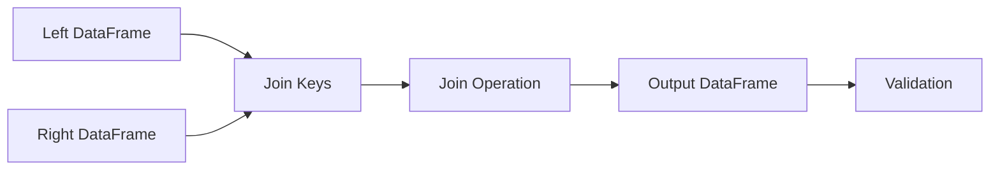
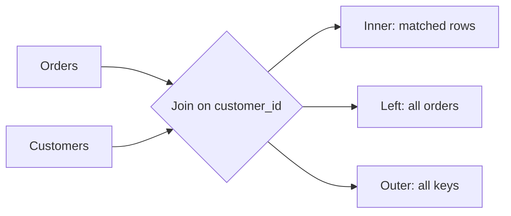
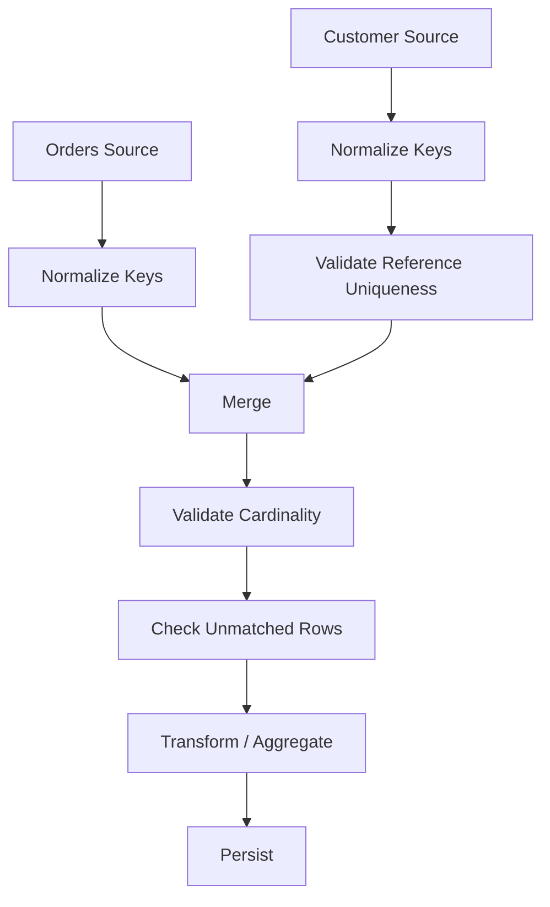

# 11- Merge And Join

## Overview

Merging and joining are the primary Pandas operations for combining related datasets.

They are essential whenever a pipeline needs to connect:

```text
orders
+
customers

transactions
+
accounts

products
+
inventory

events
+
reference data
```

The core operation is:

```python
result = left.merge(
    right,
    on="key",
)
```

A production understanding of joins requires more than knowing `how="left"`.

You need to reason about:

```text
join keys
cardinality
one-to-one
one-to-many
many-to-one
many-to-many
missing keys
duplicate keys
column collisions
row multiplication
index joins
validation
ordering
memory
database pushdown
```

A useful conceptual model is:



For backend and data-engineering work, joins are often the point where data-quality problems become visible. An incorrect join can produce a technically valid DataFrame with the wrong number of rows and incorrect business results.

---

## What Is a Merge?

A merge combines two DataFrames using one or more key columns.

Suppose:

```python
orders = pd.DataFrame(
    {
        "order_id": [
            "O-1001",
            "O-1002",
            "O-1003",
        ],
        "customer_id": [
            "C-101",
            "C-102",
            "C-101",
        ],
        "amount": [
            125.50,
            300.00,
            750.00,
        ],
    }
)

customers = pd.DataFrame(
    {
        "customer_id": [
            "C-101",
            "C-102",
            "C-103",
        ],
        "country": [
            "IN",
            "US",
            "DE",
        ],
    }
)
```

Merge:

```python
enriched = orders.merge(
    customers,
    on="customer_id",
    how="left",
)
```

The result contains customer attributes attached to each order.

---

## Why Joins Exist

Real systems normalize data across tables and services.

A relational database might store:

```text
customers
---------
customer_id
country
segment

orders
------
order_id
customer_id
amount
status
```

The relationship is:

```text
customers.customer_id
        ↑
        |
orders.customer_id
```

A join reconstructs the required view for processing or reporting.

The same pattern exists with:

```text
REST API payloads
Parquet datasets
Kafka events
reference data
CSV extracts
```

---

## Merge Syntax

Basic:

```python
left.merge(
    right,
    on="key",
)
```

General form:

```python
left.merge(
    right,
    how="inner",
    on="key",
    left_on=None,
    right_on=None,
    suffixes=("_x", "_y"),
    validate=None,
)
```

The most important parameters are:

| Parameter | Purpose |
|---|---|
| `how` | join type |
| `on` | common join column(s) |
| `left_on` | left-side key |
| `right_on` | right-side key |
| `suffixes` | resolve overlapping column names |
| `validate` | enforce expected join cardinality |
| `indicator` | expose source membership |

---

## Inner Join

An inner join keeps only matching keys.

```python
result = orders.merge(
    customers,
    on="customer_id",
    how="inner",
)
```

Conceptually:

```text
left keys ∩ right keys
```

If:

```text
orders:
C-101
C-102
C-104

customers:
C-101
C-102
C-103
```

the result contains:

```text
C-101
C-102
```

Use an inner join when unmatched records should be excluded.

Typical examples:

```text
orders with known customers
transactions with known accounts
events with valid reference entities
```

---

## Left Join

A left join preserves every row from the left DataFrame.

```python
result = orders.merge(
    customers,
    on="customer_id",
    how="left",
)
```

If a customer is missing from `customers`, the customer columns become missing.

Conceptually:

```text
all left rows
+
matching right attributes
```

This is often the safest default for enrichment because it preserves the primary dataset.

---

## Right Join

A right join preserves every row from the right DataFrame:

```python
result = orders.merge(
    customers,
    on="customer_id",
    how="right",
)
```

It is functionally equivalent to reversing the left and right inputs with a left join.

In production code, many teams prefer left joins for readability because they make the primary dataset explicit.

---

## Outer Join

An outer join keeps all keys from both sides:

```python
result = orders.merge(
    customers,
    on="customer_id",
    how="outer",
)
```

This is useful for reconciliation:

```text
orders only
+
customers only
+
matching records
```

Example use cases:

```text
source-vs-target comparison
master-data reconciliation
migration validation
reference-data auditing
```

Outer joins can produce more output rows and should be used intentionally.

---

## Join Type Comparison

| Join | Preserves | Typical use |
|---|---|---|
| `inner` | matching rows | only valid matches |
| `left` | all left rows | enrichment |
| `right` | all right rows | right-side preservation |
| `outer` | all rows | reconciliation |
| `cross` | Cartesian product | deliberate combinations |

The correct join type comes from the business requirement, not preference.

---

## Visual Join Model



When choosing a join, ask:

```text
Which dataset defines the complete population?
Which unmatched records matter?
What should happen to missing relationships?
```

---

## Joining on Multiple Columns

Sometimes one column is not sufficient to identify the relationship.

```python
result = orders.merge(
    pricing,
    on=[
        "product_id",
        "country_code",
    ],
    how="left",
)
```

This means:

```text
product_id
AND
country_code
```

must match.

Composite keys are common for:

```text
product + region
customer + account_type
tenant + resource_id
date + location
```

Do not drop part of a composite key simply to make the join easier.

---

## `left_on` and `right_on`

The join columns can have different names:

```python
result = orders.merge(
    customers,
    left_on="customer_id",
    right_on="id",
    how="left",
)
```

This is useful when integrating systems with different schemas.

The resulting DataFrame may retain both columns:

```text
customer_id
id
```

If the right-side key is redundant, remove it explicitly after validation.

---

## Join on Index

Pandas can join using index values.

```python
customers_by_id = customers.set_index(
    "customer_id"
)

result = orders.join(
    customers_by_id,
    on="customer_id",
    how="left",
)
```

This is convenient when the right-hand DataFrame is already indexed by the lookup key.

However, a business key does not need to become an index merely to perform a join.

---

## `join()` vs `merge()`

`merge()` is generally more explicit for relational column-based joins.

`join()` is especially useful for index-based joins.

| Operation | Best suited for |
|---|---|
| `merge()` | column-based relational joins |
| `join()` | index-based joins |
| `concat()` | stacking or combining along an axis |
| `map()` | one-dimensional key-to-value mapping |

For most SQL-style joins, `merge()` is the clearest Pandas API.

---

## Index Join Example

```python
customers_by_id = (
    customers
    .set_index("customer_id")
)

enriched = orders.join(
    customers_by_id[
        [
            "country",
            "segment",
        ]
    ],
    on="customer_id",
    how="left",
)
```

The join key remains a regular column in `orders`, while the right-hand lookup uses its index.

---

## Cross Join

A cross join creates every combination of left and right rows.

```python
result = countries.merge(
    products,
    how="cross",
)
```

If:

```text
left = 100 rows
right = 1,000 rows
```

the result contains:

```text
100,000 rows
```

Use cross joins only when the Cartesian product is intentional.

They can create catastrophic row counts if used accidentally.

---

## Join Cardinality

Cardinality describes how keys relate between the two datasets.

Common relationships:

```text
one-to-one
one-to-many
many-to-one
many-to-many
```

For:

```text
orders → customers
```

a common relationship is:

```text
many orders
→
one customer
```

This is:

```text
many-to-one
```

Understanding cardinality is essential for preventing accidental row multiplication.

---

## One-to-One

Each key occurs at most once on both sides.

```text
customers
customer_id unique

profiles
customer_id unique
```

Use:

```python
result = customers.merge(
    profiles,
    on="customer_id",
    how="left",
    validate="one_to_one",
)
```

This raises an error if the data violates the expected relationship.

---

## Many-to-One

Many left rows can match one right row.

Common example:

```text
orders
many rows per customer_id

customers
one row per customer_id
```

Use:

```python
result = orders.merge(
    customers,
    on="customer_id",
    how="left",
    validate="many_to_one",
)
```

This is one of the most useful production safeguards.

---

## One-to-Many

One left row can match many right rows.

Example:

```text
customers
one row per customer

orders
many rows per customer
```

```python
result = customers.merge(
    orders,
    on="customer_id",
    how="left",
    validate="one_to_many",
)
```

The row count can increase because one customer expands into multiple order rows.

That increase is expected under a one-to-many relationship.

---

## Many-to-Many

Both sides contain repeated keys.

```python
result = left.merge(
    right,
    on="customer_id",
    how="inner",
    validate="many_to_many",
)
```

Many-to-many joins can produce:

```text
left matches × right matches
```

per key.

Example:

```text
left:
C-1 appears 3 times

right:
C-1 appears 4 times

join:
3 × 4 = 12 rows
```

This is frequently a data-modeling bug rather than a desired result.

---

## Why Join Multiplication Matters

Suppose:

```text
orders:
O-1, C-1, 100
O-2, C-1, 200

customers:
C-1, Gold
C-1, Silver
```

A naive join produces:

```text
O-1, Gold
O-1, Silver
O-2, Gold
O-2, Silver
```

If revenue is aggregated afterward:

```text
100 + 100 + 200 + 200
=
600
```

instead of the correct:

```text
100 + 200
=
300
```

This is one of the most important Pandas join failure modes.

---

## Use `validate`

Whenever relationship cardinality is known, specify it.

```python
enriched = orders.merge(
    customers,
    on="customer_id",
    how="left",
    validate="many_to_one",
)
```

Supported relationship specifications include:

```text
one_to_one
one_to_many
many_to_one
many_to_many
```

The validation acts as an executable data contract.

---

## Detecting Duplicate Right-Side Keys

Before a many-to-one join:

```python
duplicate_customers = customers.loc[
    customers.duplicated(
        subset=["customer_id"],
        keep=False,
    )
]
```

If uniqueness is required:

```python
if not customers["customer_id"].is_unique:
    raise ValueError(
        "customer_id must be unique"
    )
```

This can produce a clearer failure than allowing a large join to multiply rows.

---

## `indicator=True`

Use `indicator=True` to see where each output row came from:

```python
reconciliation = orders.merge(
    customers,
    on="customer_id",
    how="outer",
    indicator=True,
)
```

A `_merge` column identifies categories such as:

```text
left_only
right_only
both
```

This is particularly useful for reconciliation.

---

## Reconciliation Example

```python
reconciliation = orders.merge(
    customers,
    on="customer_id",
    how="outer",
    indicator=True,
)

orders_only = reconciliation.loc[
    reconciliation["_merge"].eq("left_only")
]

customers_only = reconciliation.loc[
    reconciliation["_merge"].eq("right_only")
]

matched = reconciliation.loc[
    reconciliation["_merge"].eq("both")
]
```

This helps identify:

```text
orphan orders
unused customer records
fully matched records
```

---

## Column Name Collisions

Suppose both DataFrames contain:

```text
status
```

A merge can produce:

```text
status_x
status_y
```

Control suffixes explicitly:

```python
result = orders.merge(
    customers,
    on="customer_id",
    how="left",
    suffixes=(
        "_order",
        "_customer",
    ),
)
```

Prefer meaningful names over leaving generic suffixes in production outputs.

---

## Avoiding Unnecessary Duplicate Columns

If both DataFrames contain the same join key:

```python
orders.merge(
    customers,
    on="customer_id",
)
```

Pandas uses the key once.

If keys have different names:

```python
left_on="customer_id",
right_on="id",
```

both key columns may appear in the result.

Drop redundant columns deliberately:

```python
result = (
    orders.merge(
        customers,
        left_on="customer_id",
        right_on="id",
        how="left",
        validate="many_to_one",
    )
    .drop(
        columns=["id"]
    )
)
```

---

## Selecting Columns Before Joining

Reduce the right-hand DataFrame before merging:

```python
customer_attributes = customers[
    [
        "customer_id",
        "country",
        "segment",
    ]
]

enriched = orders.merge(
    customer_attributes,
    on="customer_id",
    how="left",
    validate="many_to_one",
)
```

Benefits include:

```text
less memory
fewer output columns
less copying
clearer contract
```

This is especially important with wide tables.

---

## Filtering Before a Join

If only active customers are required:

```python
active_customers = customers.loc[
    customers["active"].eq(True),
    [
        "customer_id",
        "country",
        "segment",
    ],
]

enriched = orders.merge(
    active_customers,
    on="customer_id",
    how="left",
    validate="many_to_one",
)
```

Filtering before the join can reduce the right-hand working set.

Do this only when the business semantics permit excluding inactive entities.

---

## Filtering After a Join

Sometimes the filter depends on joined columns:

```python
enriched = orders.merge(
    customers,
    on="customer_id",
    how="left",
    validate="many_to_one",
)

indian_orders = enriched.loc[
    enriched["country"].eq("IN")
]
```

The sequence must follow the data dependency.

Use:

```text
filter before join
```

when the predicate depends only on source-side fields.

Use:

```text
filter after join
```

when joined attributes are required.

---

## Join Ordering and Performance

For large joins, consider:

```text
rows on each side
columns on each side
key cardinality
duplicate frequency
dtype compatibility
memory limits
```

Project and filter before joining whenever possible.

Example:

```python
orders_subset = orders.loc[
    orders["status"].eq("completed"),
    [
        "order_id",
        "customer_id",
        "amount",
    ],
]

customers_subset = customers.loc[
    :,
    [
        "customer_id",
        "segment",
    ],
]

result = orders_subset.merge(
    customers_subset,
    on="customer_id",
    how="left",
    validate="many_to_one",
)
```

This can substantially reduce intermediate memory.

---

## Key Dtype Compatibility

Join keys should generally have compatible dtypes.

For example:

```text
left:
customer_id → string

right:
customer_id → integer
```

may not represent the same logical type.

Normalize before joining:

```python
orders["customer_id"] = (
    orders["customer_id"]
    .astype("string")
)

customers["customer_id"] = (
    customers["customer_id"]
    .astype("string")
)
```

Do not use ad-hoc casts inside the join without understanding the data.

---

## Key Normalization

Whitespace and case can also prevent expected matches.

Normalize:

```python
for frame in (
    orders,
    customers,
):
    frame["customer_id"] = (
        frame["customer_id"]
        .astype("string")
        .str.strip()
        .str.upper()
    )
```

Then:

```python
result = orders.merge(
    customers,
    on="customer_id",
    how="left",
    validate="many_to_one",
)
```

Join correctness depends on key normalization.

---

## Missing Join Keys

Rows with missing keys require an explicit policy.

```python
missing_keys = orders.loc[
    orders["customer_id"].isna()
]
```

Possible policies:

```text
retain as unmatched
quarantine
reject
assign special category
```

Do not invent a placeholder key such as:

```text
UNKNOWN
```

unless the system defines that value as a legitimate join key.

---

## Duplicate Join Keys

Before joining:

```python
duplicate_keys = customers.loc[
    customers.duplicated(
        subset=["customer_id"],
        keep=False,
    )
]
```

If the right side is expected to be unique, fail validation before executing a large join.

This prevents a small reference-data problem from becoming a massive row explosion.

---

## Nulls and Join Semantics

Pandas join behavior around missing values should not be assumed to exactly match SQL behavior in every situation.

In SQL, `NULL = NULL` does not evaluate to true in ordinary equality joins.

Pandas can treat missing values as matching in merge operations under certain circumstances.

Therefore, if missing join keys have business significance, test the exact behavior rather than assuming SQL semantics.

For strict relational semantics, filter invalid/missing keys explicitly before joining.

---

## SQL Join Equivalent

Pandas:

```python
result = orders.merge(
    customers,
    on="customer_id",
    how="left",
)
```

SQL:

```sql
SELECT
    o.order_id,
    o.customer_id,
    o.amount,
    c.country
FROM orders AS o
LEFT JOIN customers AS c
    ON o.customer_id = c.customer_id;
```

Understanding this equivalence is essential for backend engineering interviews.

---

## SQL Pushdown

If both datasets are already in PostgreSQL, it may be better to let the database perform the join:

```sql
SELECT
    o.order_id,
    o.customer_id,
    o.amount,
    c.country
FROM orders AS o
LEFT JOIN customers AS c
    ON o.customer_id = c.customer_id
WHERE o.status = %(status)s;
```

Then load the bounded result into Pandas.

This avoids transferring large intermediate datasets into application memory.

---

## When Pandas Joins Are Appropriate

Pandas joins are useful when:

```text
one source is an API
one source is a CSV
one source is Parquet
multiple systems must be reconciled
data has already been loaded
Python-specific transformations are required
```

Example:

```text
REST API orders
+
S3 customer reference data
→
Pandas merge
```

This is a natural Pandas use case.

---

## Merge with API Data

```python
orders = pd.DataFrame.from_records(
    order_payload["items"]
)

customers = pd.DataFrame.from_records(
    customer_payload["items"]
)

result = orders.merge(
    customers,
    on="customer_id",
    how="left",
    validate="many_to_one",
)
```

Before the merge, validate:

```text
required keys
dtype
normalization
uniqueness
```

---

## Merge with Parquet

```python
orders = pd.read_parquet(
    "orders.parquet",
)

customers = pd.read_parquet(
    "customers.parquet",
    columns=[
        "customer_id",
        "country",
        "segment",
    ],
)

result = orders.merge(
    customers,
    on="customer_id",
    how="left",
    validate="many_to_one",
)
```

Project only needed columns from the right-side dataset.

---

## Merge with CSV

```python
orders = pd.read_csv(
    "orders.csv"
)

customers = pd.read_csv(
    "customers.csv",
    usecols=[
        "customer_id",
        "country",
    ],
)

result = orders.merge(
    customers,
    on="customer_id",
    how="left",
    validate="many_to_one",
)
```

For large files, chunking may be required.

Joining two huge CSV sources can exceed the strengths of an in-memory Pandas workflow.

---

## Large Dataset Join Strategy

When both datasets are large:

```text
Do not assume:
CSV → DataFrame
CSV → DataFrame
→ merge()
```

is automatically safe.

Consider:

```text
source-side SQL join
Parquet partitioning
DuckDB
Polars
Dask
Spark
database staging tables
```

The appropriate choice depends on:

```text
dataset size
join cardinality
memory
latency
deployment model
operational complexity
```

Pandas is strongest when the working set fits comfortably in memory.

---

## Index-Based Join Performance

If a lookup DataFrame is already indexed:

```python
customers = customers.set_index(
    "customer_id"
)

result = orders.join(
    customers[
        [
            "country",
            "segment",
        ]
    ],
    on="customer_id",
    how="left",
)
```

This can make lookup-oriented operations convenient.

Do not set indexes solely for theoretical performance without measuring representative workloads.

---

## `merge_asof()`

`merge_asof()` performs nearest-key matching for ordered data.

Typical use cases include:

```text
market prices
sensor readings
event streams
time-aware reference data
```

Example:

```python
trades = trades.sort_values(
    "timestamp"
)

prices = prices.sort_values(
    "timestamp"
)

enriched = pd.merge_asof(
    trades,
    prices,
    on="timestamp",
    direction="backward",
)
```

This can mean:

```text
for each trade
→
find the most recent price at or before the trade timestamp
```

Both inputs must satisfy the ordering requirements of the operation.

---

## `merge_asof()` with Group Keys

For entity-specific time matching:

```python
enriched = pd.merge_asof(
    trades.sort_values(
        [
            "symbol",
            "timestamp",
        ]
    ),
    prices.sort_values(
        [
            "symbol",
            "timestamp",
        ]
    ),
    on="timestamp",
    by="symbol",
    direction="backward",
)
```

This is useful for:

```text
market data
device measurements
customer state
service metrics
```

Time semantics must be carefully tested.

---

## `merge_ordered()`

`merge_ordered()` is useful for ordered datasets and time-series style combination.

```python
result = pd.merge_ordered(
    left,
    right,
    on="date",
    fill_method="ffill",
)
```

Use it when ordered merging semantics are specifically required.

It is less common than ordinary `merge()` for standard relational backend workflows.

---

## Join vs Concatenation

Do not confuse joins with concatenation.

### Join

Combines columns based on related keys:

```text
orders + customers
```

### Concatenation

Stacks or aligns datasets:

```text
January orders
+
February orders
=
combined orders
```

Use:

```python
pd.concat(
    [january, february],
    ignore_index=True,
)
```

for vertical stacking.

Use:

```python
left.merge(
    right,
    on="key",
)
```

for relational combination.

---

## Duplicate Rows After Join

After a join:

```python
result = orders.merge(
    customers,
    on="customer_id",
    how="left",
)
```

check row counts:

```python
before = len(orders)
after = len(result)

logger.info(
    "Join completed",
    extra={
        "left_rows": before,
        "result_rows": after,
        "row_delta": after - before,
    },
)
```

A left join that unexpectedly increases row count should trigger investigation.

Row growth is not inherently wrong, but it should be explainable from cardinality.

---

## Join Reconciliation

A strong join validation pattern is:

```python
expected_rows = len(orders)

result = orders.merge(
    customers,
    on="customer_id",
    how="left",
    validate="many_to_one",
)

if len(result) != expected_rows:
    raise ValueError(
        "Unexpected row multiplication"
    )
```

With a validated many-to-one join, this expectation is especially useful.

---

## Join Contracts

A production join should define:

```text
left dataset
right dataset
join key
key normalization
expected cardinality
join type
unmatched-row policy
duplicate-key policy
output columns
output row-count expectation
```

This converts a loosely defined merge into an explicit data contract.

---

## Testing Join Cardinality

```python
def test_orders_join_customers() -> None:
    orders = pd.DataFrame(
        {
            "order_id": [
                "O-1",
                "O-2",
            ],
            "customer_id": [
                "C-1",
                "C-1",
            ],
        }
    )

    customers = pd.DataFrame(
        {
            "customer_id": ["C-1"],
            "country": ["IN"],
        }
    )

    result = orders.merge(
        customers,
        on="customer_id",
        how="left",
        validate="many_to_one",
    )

    assert len(result) == len(orders)
    assert result["country"].tolist() == [
        "IN",
        "IN",
    ]
```

The test verifies both:

```text
business relationship
+
row-count behavior
```

---

## Testing Many-to-Many Failure

When many-to-one is expected, test that invalid reference data fails:

```python
import pytest


def test_duplicate_customer_keys_fail_join() -> None:
    orders = pd.DataFrame(
        {
            "order_id": ["O-1"],
            "customer_id": ["C-1"],
        }
    )

    customers = pd.DataFrame(
        {
            "customer_id": [
                "C-1",
                "C-1",
            ],
            "country": [
                "IN",
                "US",
            ],
        }
    )

    with pytest.raises(
        pd.errors.MergeError
    ):
        orders.merge(
            customers,
            on="customer_id",
            how="left",
            validate="many_to_one",
        )
```

This is an important production safeguard.

---

## Testing Unmatched Records

```python
def test_left_join_preserves_unmatched_orders() -> None:
    orders = pd.DataFrame(
        {
            "order_id": [
                "O-1",
                "O-2",
            ],
            "customer_id": [
                "C-1",
                "C-2",
            ],
        }
    )

    customers = pd.DataFrame(
        {
            "customer_id": ["C-1"],
            "country": ["IN"],
        }
    )

    result = orders.merge(
        customers,
        on="customer_id",
        how="left",
        validate="many_to_one",
    )

    assert len(result) == 2
    assert result.loc[
        result["order_id"].eq("O-2"),
        "country",
    ].isna().all()
```

The test documents the expected missing-reference behavior.

---

## Grouping After a Join

A common reporting flow is:

```text
orders
→
join customer attributes
→
group
→
aggregate
```

Example:

```python
summary = (
    orders
    .merge(
        customers[
            [
                "customer_id",
                "country",
            ]
        ],
        on="customer_id",
        how="left",
        validate="many_to_one",
    )
    .groupby(
        "country",
        as_index=False,
        dropna=False,
    )
    .agg(
        revenue=(
            "amount",
            "sum",
        ),
        order_count=(
            "order_id",
            "nunique",
        ),
    )
)
```

The join cardinality must be correct before aggregation.

Otherwise the aggregate may be inflated.

---

## Join and Data Quality

A join can expose quality problems:

```text
missing foreign keys
unknown entities
duplicate reference keys
inconsistent identifier formats
unexpected row multiplication
```

Useful checks include:

```python
missing_customer_ids = orders[
    "customer_id"
].isna().sum()

unknown_customer_ids = (
    orders["customer_id"].notna()
    & ~orders["customer_id"].isin(
        customers["customer_id"]
    )
).sum()
```

These metrics should be monitored in production pipelines.

---

## Production Architecture

A reliable enrichment pipeline may look like:



The important design principle is:

```text
normalize
→
validate
→
join
→
validate again
```

Do not treat `merge()` as a purely mechanical operation.

---

## Security Considerations

Joins can accidentally combine data across tenants.

Suppose:

```text
orders
tenant_id + customer_id

customers
customer_id
```

Joining only on:

```python
on="customer_id"
```

may allow one tenant's customer record to be attached to another tenant's order if customer IDs are only unique within each tenant.

The correct key may be:

```python
result = orders.merge(
    customers,
    on=[
        "tenant_id",
        "customer_id",
    ],
    how="left",
    validate="many_to_one",
)
```

Multi-tenant joins should preserve tenant scope explicitly.

---

## Reliability and Idempotency

Join logic should be deterministic.

Avoid relying on:

```text
input row order
network delivery order
filesystem order
```

when resolving multiple candidate records.

For versioned reference data:

```python
customers = (
    customers
    .sort_values(
        [
            "customer_id",
            "updated_at",
        ]
    )
    .drop_duplicates(
        subset=["customer_id"],
        keep="last",
    )
)
```

Then validate the join relationship.

For persistent outputs, use database constraints and idempotent writes.

---

## Cost Considerations

Joins can be expensive because they may require:

```text
hashing
sorting
memory for intermediate structures
column copies
large result materialization
```

Reduce cost by:

```text
filtering first
projecting required columns
normalizing key dtypes once
avoiding accidental many-to-many joins
pushing relational joins into PostgreSQL when appropriate
using partition-aware storage
```

A small dimension lookup against a large fact table is a different workload from joining two equally large DataFrames.

---

## Large Dataset Alternatives

If both datasets are larger than safe Pandas memory capacity, consider:

```text
PostgreSQL
DuckDB
Polars
Dask
Spark
distributed query engines
```

Use Pandas when:

```text
working set fits comfortably in memory
workflow is naturally Python-centric
batch size is bounded
simplicity matters
```

Move to another engine when:

```text
data exceeds memory
distributed processing is required
join scale is beyond one process
global state is too large
```

---

## Common Mistakes

### Joining Without Understanding Cardinality

This is the most dangerous join mistake.

Always ask:

```text
How many rows can one key match on each side?
```

### Skipping `validate`

If cardinality is known, encode it:

```python
validate="many_to_one"
```

### Joining on an Incomplete Key

For multi-tenant or composite identities, joining on only part of the key can create cross-entity matches.

### Ignoring Duplicate Reference Keys

A non-unique dimension table can multiply rows.

### Deduplicating the Final Output to Hide Join Errors

Fix the join relationship instead.

### Joining Dirty Keys

Whitespace, case, and dtype differences can produce unexpected unmatched records.

### Carrying All Columns into the Join

Project only what the output needs.

### Joining Before Filtering

Unnecessary rows increase memory and processing cost.

### Using Cross Join Accidentally

A Cartesian product can explode row counts.

### Assuming SQL and Pandas Null Join Semantics Are Identical

Validate the behavior you rely on.

### Ignoring Column Collisions

Generic `_x` and `_y` names can make downstream logic ambiguous.

### Assuming Row Count Must Always Stay the Same

A join can legitimately increase or decrease rows depending on type and cardinality.

### Joining Huge Datasets in Pandas Without Capacity Planning

Pandas is memory-bound.

### Performing External I/O Inside a Mapping Function Instead of a Join

Use batch retrieval and merge reference data.

---

## Interview Traps

### What Is the Difference Between `merge()` and `join()`?

`merge()` is primarily a column-oriented relational join.

`join()` is particularly convenient for index-based joins.

### What Is an Inner Join?

It retains matching keys from both DataFrames.

### What Is a Left Join?

It preserves all rows from the left DataFrame and adds matching right-side data.

### Why Can a Join Increase Row Count?

Repeated join keys can produce multiple matches.

For a key appearing:

```text
3 times on left
4 times on right
```

a many-to-many join can produce:

```text
12 rows
```

### What Is `validate="many_to_one"`?

It asserts that multiple left rows may match at most one right row.

### Why Is `validate` Important?

It turns a data-model assumption into a runtime check and prevents silent row multiplication.

### How Do You Join on Different Column Names?

Use:

```python
df.merge(
    other,
    left_on="customer_id",
    right_on="id",
)
```

### How Do You Join on Multiple Keys?

Use a list:

```python
df.merge(
    other,
    on=[
        "tenant_id",
        "customer_id",
    ],
)
```

### What Does `indicator=True` Do?

It adds a `_merge` column identifying whether each result row came from:

```text
left_only
right_only
both
```

### How Do You Prevent Duplicate Columns?

Select required columns before the join and use meaningful `suffixes` for intentional collisions.

### How Do You Prevent Join Multiplication?

Validate reference-key uniqueness and specify the expected cardinality.

### When Should a Join Be Done in SQL Instead?

When both datasets are relational and the database can efficiently filter, join, and aggregate the data before sending it to Pandas.

### What Should You Do Before a Large Merge?

Validate:

```text
key types
key normalization
reference uniqueness
expected cardinality
working-set size
required columns
```

### How Do You Find Orders Without Matching Customers?

Use a left join and inspect missing right-side fields, or use an outer join with `indicator=True`.

### What Is a Cross Join?

A Cartesian product containing every combination of left and right rows.

### Why Is a Many-to-Many Join Dangerous?

It can create quadratic row multiplication for repeated keys and inflate downstream metrics.

### Why Does Tenant ID Sometimes Need to Be Part of the Join Key?

Because a customer or resource ID may only be unique within a tenant.

---

## Production Checklist

```text
[ ] Join purpose is explicitly defined
[ ] Primary dataset is identified
[ ] Join keys are correct and complete
[ ] Key dtypes are compatible
[ ] Key values are normalized
[ ] Missing-key policy is defined
[ ] Right-side uniqueness is validated when required
[ ] Expected cardinality is specified with validate=
[ ] Join type matches the business requirement
[ ] Required columns are projected before joining
[ ] Filters are applied before joins when semantics allow
[ ] Column name collisions are handled explicitly
[ ] Unexpected row multiplication is monitored
[ ] Unmatched records are measured
[ ] Cross joins are intentional
[ ] Tenant scope is included in composite keys where required
[ ] Large relational joins are considered for SQL pushdown
[ ] DataFrame joins fit within memory limits
[ ] Join behavior is covered by automated tests
[ ] Output schema is validated
[ ] Aggregate reconciliation is performed after critical joins
[ ] Persistent outputs use appropriate uniqueness/idempotency controls
```

## Key Takeaways

- `merge()` is the primary Pandas tool for relational joins; choose `inner`, `left`, `right`, `outer`, or `cross` based on the required row-preservation semantics.
- Join cardinality is a correctness contract: use `validate="one_to_one"`, `"one_to_many"`, or `"many_to_one"` whenever the relationship is known.
- Normalize join keys, validate reference uniqueness, project only required columns, and filter early to prevent silent mismatches, row multiplication, and unnecessary memory usage.
- A join that produces unexpected duplicate rows should be investigated at the key/cardinality level rather than "fixed" by blindly calling `drop_duplicates()`.
- For production-scale systems, combine Pandas joins with SQL pushdown, tenant-aware keys, explicit reconciliation metrics, deterministic behavior, automated tests, and durable database constraints where appropriate.