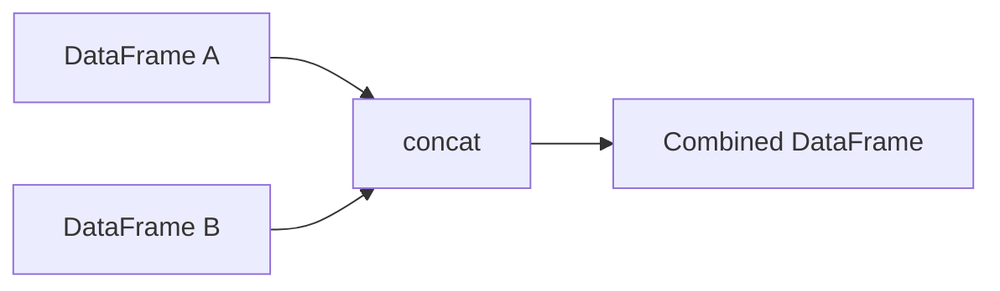
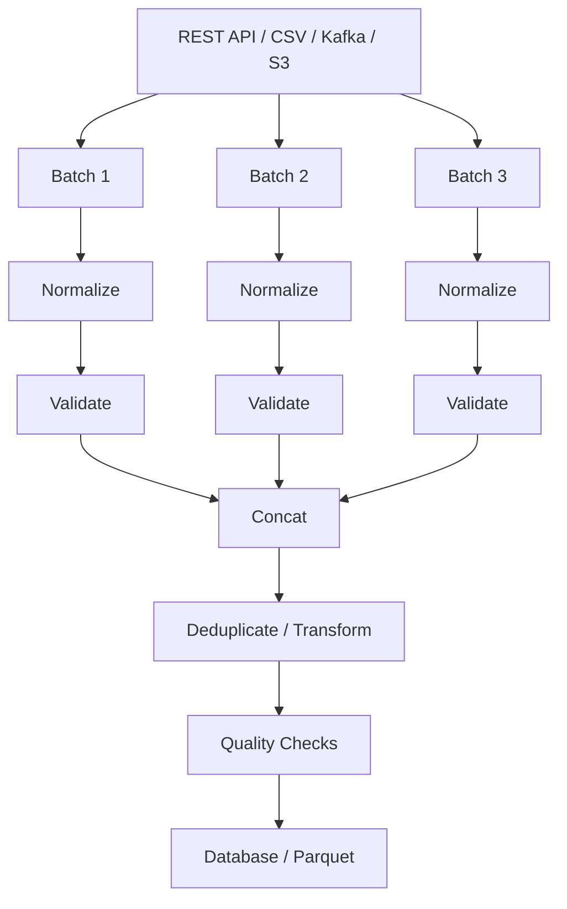

# 12- Concat

## Overview

`concat()` combines Pandas objects along an axis.

Unlike `merge()` and `join()`, which primarily combine related records through keys, `concat()` is primarily used to:

```text
stack rows
combine columns
append batches
combine partitions
align similarly structured datasets
```

Typical production use cases include:

```text
January orders + February orders
API page 1 + page 2 + page 3
batch 1 + batch 2
historical partitions + new partitions
multiple DataFrames with compatible schemas
feature tables aligned on an index
```

The central distinction is:

```text
merge()
→ relational combination using keys

join()
→ commonly index-oriented relational combination

concat()
→ combine objects along an axis
```

A useful mental model is:



---

## Basic Syntax

The core API is:

```python
pd.concat(
    objs,
    axis=0,
    join="outer",
    ignore_index=False,
)
```

Common parameters:

| Parameter | Purpose |
|---|---|
| `objs` | sequence or mapping of Series/DataFrames |
| `axis=0` | combine rows |
| `axis=1` | combine columns |
| `join` | alignment strategy for the other axis |
| `ignore_index` | create a new positional index |
| `keys` | create a hierarchical result index |
| `verify_integrity` | detect duplicate labels on the concatenation axis |
| `sort` | control sorting of non-concatenation axes |
| `copy` | controls copying behavior where supported |

For most batch-oriented DataFrame workflows, the common pattern is:

```python
combined = pd.concat(
    [df1, df2, df3],
    ignore_index=True,
)
```

---

## Concatenating Rows

Suppose monthly order data is split into separate DataFrames:

```python
january = pd.DataFrame(
    {
        "order_id": ["O-1001", "O-1002"],
        "amount": [100.0, 200.0],
    }
)

february = pd.DataFrame(
    {
        "order_id": ["O-1003", "O-1004"],
        "amount": [150.0, 300.0],
    }
)
```

Combine them vertically:

```python
orders = pd.concat(
    [
        january,
        february,
    ],
    ignore_index=True,
)
```

Result:

```text
order_id  amount
O-1001    100.0
O-1002    200.0
O-1003    150.0
O-1004    300.0
```

This is the standard use case for:

```text
axis=0
```

---

## `axis=0`

The default:

```python
pd.concat(
    [january, february],
    axis=0,
)
```

combines rows.

Conceptually:

```text
DataFrame A
---------
row 1
row 2

DataFrame B
---------
row 3
row 4

        ↓

Combined
---------
row 1
row 2
row 3
row 4
```

Use `axis=0` when the DataFrames represent compatible records from:

```text
different time periods
different API pages
different files
different batches
different partitions
```

---

## `ignore_index=True`

When the original indexes are merely positional:

```python
orders = pd.concat(
    [
        january,
        february,
    ],
    ignore_index=True,
)
```

The result receives a new sequential index:

```text
0
1
2
3
```

This is usually appropriate when concatenating batches that each have their own local `RangeIndex`.

---

## Why `ignore_index` Matters

Without:

```python
ignore_index=True
```

the original indexes may be retained:

```text
0
1
0
1
```

This is not automatically wrong, but it can create:

```text
duplicate index labels
```

If the index has no business meaning, resetting it during concatenation is usually clearer.

If the index is meaningful, preserve it intentionally.

---

## Concatenating with Meaningful Indexes

Suppose the index identifies a source partition:

```python
a = pd.DataFrame(
    {"amount": [100, 200]},
    index=["O-1", "O-2"],
)

b = pd.DataFrame(
    {"amount": [300, 400]},
    index=["O-3", "O-4"],
)
```

Then:

```python
combined = pd.concat(
    [a, b]
)
```

preserves:

```text
O-1
O-2
O-3
O-4
```

Do not use `ignore_index=True` when those labels are part of the dataset's semantics.

---

## Concatenating Columns

Use:

```python
axis=1
```

to combine columns side by side.

Example:

```python
customer = pd.DataFrame(
    {
        "customer_id": ["C-1", "C-2"],
        "country": ["IN", "US"],
    }
)

metrics = pd.DataFrame(
    {
        "lifetime_value": [1000.0, 2500.0],
        "order_count": [5, 12],
    }
)

result = pd.concat(
    [
        customer,
        metrics,
    ],
    axis=1,
)
```

Result:

```text
  customer_id country  lifetime_value  order_count
0 C-1         IN       1000.0         5
1 C-2         US       2500.0         12
```

This is an index-alignment operation, not a relational join.

---

## `axis=1` Aligns by Index

Consider:

```python
customer = pd.DataFrame(
    {
        "customer_id": ["C-1", "C-2"],
    },
    index=[10, 20],
)

metrics = pd.DataFrame(
    {
        "order_count": [5, 12],
    },
    index=[20, 10],
)
```

Then:

```python
result = pd.concat(
    [
        customer,
        metrics,
    ],
    axis=1,
)
```

Pandas aligns the rows by index:

```text
index  customer_id  order_count
10     C-1          12
20     C-2           5
```

It does not simply combine by physical position.

This is a critical distinction between:

```text
axis=1 concat
```

and:

```text
row-wise concat
```

---

## `concat()` vs `merge()`

Use `concat()` when objects represent compatible pieces of a dataset.

Use `merge()` when objects represent related entities connected through keys.

| Requirement | Preferred operation |
|---|---|
| January rows + February rows | `concat()` |
| API page 1 + API page 2 | `concat()` |
| Orders + customers | `merge()` |
| Product + inventory by product ID | `merge()` |
| Same index, additional columns | `concat(axis=1)` or `join()` |
| Stack similarly structured files | `concat()` |

A good test is:

```text
Are these the same kind of records?
    → concat()

Are these different datasets related by keys?
    → merge()
```

---

## `concat()` vs `join()`

`join()` is convenient for index-based combination:

```python
result = left.join(
    right,
    how="left",
)
```

`concat(axis=1)` also aligns along the index:

```python
result = pd.concat(
    [left, right],
    axis=1,
)
```

Use `join()` when expressing an explicit relational-style index join.

Use `concat()` when the conceptual operation is:

```text
place these aligned objects side by side
```

The intended semantics should determine the API.

---

## Column Schema Alignment

Suppose:

```python
january = pd.DataFrame(
    {
        "order_id": ["O-1"],
        "amount": [100.0],
    }
)

february = pd.DataFrame(
    {
        "order_id": ["O-2"],
        "amount": [200.0],
        "currency": ["INR"],
    }
)
```

Then:

```python
combined = pd.concat(
    [january, february],
    ignore_index=True,
)
```

produces:

```text
order_id  amount  currency
O-1       100.0   NaN
O-2       200.0   INR
```

Pandas takes the union of columns by default.

This is useful for evolving schemas but can also hide upstream schema drift.

---

## `join="outer"`

The default:

```python
join="outer"
```

combines the union of labels on the non-concatenation axis.

For row-wise concatenation:

```text
all columns from all inputs
```

are included.

Missing combinations become missing values.

This is flexible but should not be mistaken for schema validation.

---

## `join="inner"`

Use:

```python
combined = pd.concat(
    [january, february],
    join="inner",
    ignore_index=True,
)
```

This keeps only columns common to all inputs.

Example:

```text
January:
order_id
amount
currency

February:
order_id
amount
status
```

Result columns with `join="inner"`:

```text
order_id
amount
```

This can be useful when only the intersection schema is valid.

However, it can also hide an unexpected column loss.

For production pipelines, validate the intended schema instead of relying on `join="inner"` as a silent compatibility mechanism.

---

## Schema Validation Before Concat

For strict pipelines, validate that inputs have the expected schema:

```python
expected_columns = [
    "order_id",
    "customer_id",
    "amount",
    "status",
]

for frame in (
    january,
    february,
):
    if list(frame.columns) != expected_columns:
        raise ValueError(
            "Unexpected input schema"
        )
```

This is often safer than allowing:

```python
pd.concat(...)
```

to silently introduce new columns and missing values.

---

## Concatenating API Pages

A common API ingestion pattern is:

```text
page 1
page 2
page 3
...
    ↓
DataFrame per page
    ↓
concat
    ↓
single batch
```

Example:

```python
pages: list[pd.DataFrame] = []

for payload in payloads:
    page = pd.DataFrame.from_records(
        payload["items"]
    )

    pages.append(page)

orders = pd.concat(
    pages,
    ignore_index=True,
)
```

This is acceptable for bounded page counts and dataset sizes.

For very large APIs, avoid accumulating every page in memory.

---

## Incremental API Processing

Instead of:

```text
download all pages
→
store all DataFrames
→
concat
```

prefer:

```text
page
→
normalize
→
validate
→
process
→
persist
→
next page
```

when the complete dataset does not need to exist simultaneously.

This reduces:

```text
peak memory
retry scope
batch size
failure scope
```

and is usually more operationally resilient.

---

## Concatenating CSV Batches

Suppose multiple files share a schema:

```python
files = [
    "orders_2026_01.csv",
    "orders_2026_02.csv",
]

frames = [
    pd.read_csv(path)
    for path in files
]

orders = pd.concat(
    frames,
    ignore_index=True,
)
```

Before production use, validate:

```text
columns
dtypes
missing values
duplicate identifiers
encoding
source metadata
```

Do not assume files with similar names have identical schemas.

---

## Add Source Metadata Before Concat

When combining external files, preserve source provenance:

```python
january = pd.read_csv(
    "orders_2026_01.csv"
).assign(
    source_file="orders_2026_01.csv"
)

february = pd.read_csv(
    "orders_2026_02.csv"
).assign(
    source_file="orders_2026_02.csv"
)

orders = pd.concat(
    [january, february],
    ignore_index=True,
)
```

This makes later debugging much easier.

Useful metadata includes:

```text
source_file
source_system
ingestion_batch_id
ingested_at
partition
```

---

## `keys`

`keys` adds hierarchical labels identifying the source of each concatenated object.

Example:

```python
combined = pd.concat(
    {
        "january": january,
        "february": february,
    }
)
```

or:

```python
combined = pd.concat(
    [
        january,
        february,
    ],
    keys=[
        "january",
        "february",
    ],
)
```

This creates a MultiIndex.

Conceptually:

```text
january   0
          1
february  0
          1
```

This is useful when source identity should remain part of the index.

---

## `keys` for Provenance

For data lineage:

```python
combined = pd.concat(
    {
        "api_page_1": page_1,
        "api_page_2": page_2,
    }
)
```

This preserves which DataFrame each row came from.

For production pipelines, an explicit `source` column is often easier to serialize and query, but `keys` can be useful for temporary hierarchical analysis.

---

## MultiIndex Created by `keys`

Suppose:

```python
combined = pd.concat(
    [january, february],
    keys=["2026-01", "2026-02"],
)
```

The index now has:

```text
period
row
```

Accessing January:

```python
january_rows = combined.loc[
    "2026-01"
]
```

If the downstream system expects ordinary columns, flatten the structure explicitly rather than carrying an unnecessary MultiIndex into persistence.

---

## `verify_integrity`

When concatenating along rows, duplicate index labels may be created.

Use:

```python
combined = pd.concat(
    [left, right],
    verify_integrity=True,
)
```

If duplicate labels occur on the concatenation axis, Pandas raises an error.

This is useful when index uniqueness is part of the contract.

Do not enable it blindly for datasets where duplicate labels are legitimate.

---

## Example: Detect Duplicate Indexes

```python
left = pd.DataFrame(
    {"amount": [100]},
    index=["O-1"],
)

right = pd.DataFrame(
    {"amount": [200]},
    index=["O-1"],
)
```

This is allowed by default:

```python
combined = pd.concat(
    [left, right]
)
```

But:

```python
combined = pd.concat(
    [left, right],
    verify_integrity=True,
)
```

fails because:

```text
O-1
```

appears more than once.

---

## `sort`

When concatenating objects with different columns, Pandas may need to align the non-concatenation axis.

You can control ordering with:

```python
pd.concat(
    [left, right],
    sort=False,
)
```

In production, prefer explicit schema ordering rather than relying on incidental column ordering.

Sorting columns is rarely the primary goal of a concatenation.

---

## Concatenating Series

`concat()` also works with Series.

```python
a = pd.Series(
    [100, 200],
    name="amount",
)

b = pd.Series(
    [300, 400],
    name="amount",
)

combined = pd.concat(
    [a, b],
    ignore_index=True,
)
```

The result is one Series.

For different Series:

```python
a = pd.Series(
    [1, 2],
    name="orders",
)

b = pd.Series(
    [10, 20],
    name="revenue",
)
```

`axis=1` creates a DataFrame:

```python
combined = pd.concat(
    [a, b],
    axis=1,
)
```

---

## Series Alignment Along Columns

When concatenating Series horizontally:

```python
a = pd.Series(
    [100, 200],
    index=["C-1", "C-2"],
    name="revenue",
)

b = pd.Series(
    [5, 10],
    index=["C-2", "C-1"],
    name="orders",
)

summary = pd.concat(
    [a, b],
    axis=1,
)
```

Pandas aligns by index:

```text
     revenue  orders
C-1  100      10
C-2  200       5
```

This is often useful for constructing aligned feature tables.

---

## Concatenation and Index Alignment

`concat(axis=1)` is fundamentally label-aware.

Suppose:

```python
left = pd.DataFrame(
    {"a": [1, 2]},
    index=["x", "y"],
)

right = pd.DataFrame(
    {"b": [3, 4]},
    index=["y", "z"],
)
```

Then:

```python
result = pd.concat(
    [left, right],
    axis=1,
)
```

produces:

```text
     a     b
x    1     NaN
y    2     3.0
z    NaN   4.0
```

This is not a positional append.

---

## `join="inner"` with `axis=1`

Use:

```python
result = pd.concat(
    [left, right],
    axis=1,
    join="inner",
)
```

Now only common index labels remain:

```text
     a   b
y    2   3
```

This is useful when the output should contain only records present in every aligned DataFrame.

---

## `concat()` Does Not Perform Key Matching Like `merge()`

Consider:

```python
orders = pd.DataFrame(
    {
        "customer_id": ["C-1"],
        "amount": [100],
    }
)

customers = pd.DataFrame(
    {
        "customer_id": ["C-1"],
        "country": ["IN"],
    }
)
```

This:

```python
pd.concat(
    [orders, customers],
    axis=1,
)
```

does not join on:

```text
customer_id
```

It aligns by the index.

For key-based combination, use:

```python
orders.merge(
    customers,
    on="customer_id",
)
```

---

## Vertical Concat vs SQL `UNION ALL`

Row-wise concatenation is conceptually similar to:

```sql
SELECT ...
FROM january

UNION ALL

SELECT ...
FROM february;
```

Pandas:

```python
pd.concat(
    [
        january,
        february,
    ],
    ignore_index=True,
)
```

The key idea is:

```text
stack compatible rows
```

rather than:

```text
match rows by key
```

---

## `concat()` vs SQL `UNION`

`concat()` behaves more like:

```sql
UNION ALL
```

than:

```sql
UNION
```

because it does not automatically remove duplicate rows.

If duplicates must be removed:

```python
combined = pd.concat(
    [
        january,
        february,
    ],
    ignore_index=True,
).drop_duplicates()
```

However, deduplication should follow an explicit business identity rule rather than being added automatically.

---

## Concatenating Batches

A batch processing system may accumulate bounded DataFrames:

```python
batches = []

for batch in read_batches():
    cleaned = clean_batch(batch)
    batches.append(cleaned)

combined = pd.concat(
    batches,
    ignore_index=True,
)
```

This is acceptable when:

```text
total combined size is known to fit memory
```

If not, process or persist each batch incrementally.

---

## The Quadratic Concat Anti-Pattern

Avoid repeatedly concatenating inside a loop:

```python
result = pd.DataFrame()

for batch in batches:
    result = pd.concat(
        [result, batch],
        ignore_index=True,
    )
```

This can repeatedly allocate and copy increasingly large intermediate objects.

Prefer:

```python
frames = []

for batch in batches:
    frames.append(batch)

result = pd.concat(
    frames,
    ignore_index=True,
)
```

Or, for very large data, avoid materializing the complete combined DataFrame and write batches incrementally.

---

## Why Repeated `concat()` Can Be Expensive

If each iteration rebuilds the growing DataFrame:

```text
batch 1 → copy
batch 1 + 2 → copy
batch 1 + 2 + 3 → copy
...
```

the total work can become unnecessarily large.

The preferred architecture is:

```text
collect bounded inputs
→
concat once
```

or:

```text
process batch
→
persist batch
→
discard batch
```

depending on the workload.

---

## Memory Considerations

`concat()` often creates a new combined object.

For:

```text
10 × 100 MB DataFrames
```

the final result may require roughly:

```text
1 GB
```

plus intermediate memory and allocator overhead.

Peak memory can therefore exceed the final DataFrame size.

For Kubernetes or ECS jobs, size the worker based on peak memory rather than the final output alone.

---

## Chunked Processing

For files larger than memory:

```python
for chunk in pd.read_csv(
    "orders.csv",
    chunksize=100_000,
):
    cleaned = clean_orders(chunk)
    write_batch(cleaned)
```

This avoids needing:

```python
pd.concat(all_chunks)
```

at all.

Use full concatenation only when a downstream operation genuinely requires the entire dataset in memory.

---

## When Full Concatenation Is Necessary

Some operations require all rows to coexist:

```text
global sort
global deduplication
global ranking
certain joins
exact global statistics
```

If a global operation is required and the data exceeds memory, move to an architecture that supports external or distributed processing.

Do not repeatedly increase Pandas worker memory without considering the scaling model.

---

## Concatenating Partitioned Parquet Data

Suppose partitions are:

```text
year=2026/month=01
year=2026/month=02
```

For bounded analysis:

```python
jan = pd.read_parquet(
    "orders/2026/01.parquet"
)

feb = pd.read_parquet(
    "orders/2026/02.parquet"
)

orders = pd.concat(
    [
        jan,
        feb,
    ],
    ignore_index=True,
)
```

For large analytical workflows, prefer a query engine capable of reading multiple Parquet partitions without unnecessarily materializing everything into one Pandas DataFrame.

---

## Concatenating API Pages Safely

A production pattern:

```python
frames = []

for payload in fetch_pages():
    page = pd.DataFrame.from_records(
        payload["items"]
    )

    page = normalize_orders(page)
    validate_orders(page)

    frames.append(page)

orders = pd.concat(
    frames,
    ignore_index=True,
)
```

After concatenation:

```text
validate schema again
check duplicates
reconcile row counts
continue transformation
```

Do not assume page-level validation guarantees global correctness.

---

## Schema Drift Across Pages

Suppose page 1 contains:

```text
order_id
amount
status
```

and page 2 suddenly contains:

```text
order_id
amount
status
currency
```

Default concatenation may create:

```text
currency = NaN
```

for page 1.

This may be correct if schema evolution is supported.

Otherwise, treat the mismatch as a contract violation and fail or quarantine the affected page.

---

## Strict Schema Concatenation

A reusable helper:

```python
def concat_strict(
    frames: list[pd.DataFrame],
    expected_columns: list[str],
) -> pd.DataFrame:
    for index, frame in enumerate(frames):
        if list(frame.columns) != expected_columns:
            raise ValueError(
                f"Frame {index} has unexpected schema"
            )

    return pd.concat(
        frames,
        ignore_index=True,
    )
```

This is useful for:

```text
batch ingestion
API pagination
file consolidation
ETL stages
```

---

## Concatenating Different Dtypes

Suppose:

```python
a = pd.DataFrame(
    {"amount": [100, 200]}
)

b = pd.DataFrame(
    {"amount": ["300", "400"]}
)
```

Concatenating can produce a dtype that is broader than desired.

Normalize before concatenation:

```python
for frame in (a, b):
    frame["amount"] = pd.to_numeric(
        frame["amount"],
        errors="raise",
    )

combined = pd.concat(
    [a, b],
    ignore_index=True,
)
```

The resulting schema should be consistent before downstream calculations.

---

## Concatenating Nullable Data

For production data, normalize nullable dtypes before concatenation:

```python
for frame in frames:
    frame["order_id"] = (
        frame["order_id"]
        .astype("string")
    )

combined = pd.concat(
    frames,
    ignore_index=True,
)
```

Otherwise dtype coercion can create unexpected representations and increase downstream cleaning work.

---

## Column Ordering

When concatenating:

```python
combined = pd.concat(
    [
        january,
        february,
    ],
    ignore_index=True,
)
```

the resulting column order follows the concatenation rules and input structure.

For stable output contracts, explicitly reorder after validation:

```python
expected_columns = [
    "order_id",
    "customer_id",
    "amount",
    "status",
]

combined = combined[
    expected_columns
]
```

This is especially important before:

```text
CSV export
database loading
API serialization
Parquet publication
```

---

## Concatenating Along Rows with Keys

Use:

```python
combined = pd.concat(
    [
        january,
        february,
    ],
    keys=[
        "2026-01",
        "2026-02",
    ],
)
```

The resulting MultiIndex can be useful during analysis.

For persistence, consider converting the source key into a normal column:

```python
combined = (
    combined
    .rename_axis(
        ["period", "row"]
    )
    .reset_index()
)
```

---

## Provenance Column vs MultiIndex

| Approach | Advantage | Limitation |
|---|---|---|
| `keys=` | convenient hierarchical analysis | MultiIndex complexity |
| source column | easy SQL/API/Parquet interoperability | explicit storage column |
| no provenance | simplest structure | source identity is lost |

For long-lived ETL datasets, a normal provenance column is often more portable.

---

## Cleaning Before Concatenation

Normalize each input before concatenation:

```python
def normalize_orders(
    frame: pd.DataFrame,
) -> pd.DataFrame:
    result = frame.copy()

    result["order_id"] = (
        result["order_id"]
        .astype("string")
        .str.strip()
        .str.upper()
    )

    result["amount"] = pd.to_numeric(
        result["amount"],
        errors="raise",
    )

    return result
```

Then:

```python
combined = pd.concat(
    [
        normalize_orders(january),
        normalize_orders(february),
    ],
    ignore_index=True,
)
```

This prevents inconsistent representations from entering the combined dataset.

---

## Deduplicate After Concatenation

If the same logical record can appear in multiple inputs:

```python
combined = pd.concat(
    frames,
    ignore_index=True,
)

combined = combined.drop_duplicates(
    subset=["order_id"],
    keep="last",
)
```

This should be done only when:

```text
duplicate identity
+
winner policy
```

are defined.

Do not assume files or API pages are disjoint.

---

## Concat and Ordering

Concatenation generally preserves input order.

For example:

```python
result = pd.concat(
    [
        january,
        february,
    ],
    ignore_index=True,
)
```

produces:

```text
January rows
then
February rows
```

Do not interpret this as business ordering unless source order itself is meaningful.

If chronological ordering matters:

```python
result = result.sort_values(
    "created_at"
)
```

after concatenation.

---

## Concat and Sorting

Sorting during or after concatenation is a separate operation.

Prefer:

```python
combined = pd.concat(
    frames,
    ignore_index=True,
)

combined = combined.sort_values(
    "created_at"
)
```

when the final output needs deterministic ordering.

This makes the two semantics explicit:

```text
combine
→
sort
```

---

## Concat for Feature Tables

If multiple feature DataFrames share the same index:

```python
demographics = pd.DataFrame(
    {
        "age": [30, 40],
    },
    index=["C-1", "C-2"],
)

activity = pd.DataFrame(
    {
        "order_count": [5, 10],
    },
    index=["C-1", "C-2"],
)

features = pd.concat(
    [
        demographics,
        activity,
    ],
    axis=1,
)
```

This is an index-aligned feature combination.

Validate index compatibility when incorrect alignment would be a correctness issue.

---

## Verify Index Compatibility

If the DataFrames are expected to represent exactly the same entities:

```python
if not demographics.index.equals(
    activity.index
):
    raise ValueError(
        "Feature indexes do not align"
    )
```

Then:

```python
features = pd.concat(
    [
        demographics,
        activity,
    ],
    axis=1,
)
```

This is safer than relying on automatic alignment to fill missing rows.

---

## `concat()` and Duplicate Indexes

For horizontal concatenation:

```python
pd.concat(
    [left, right],
    axis=1,
)
```

duplicate index labels can create ambiguous alignment.

If index uniqueness is required:

```python
for frame in (left, right):
    if not frame.index.is_unique:
        raise ValueError(
            "Expected unique indexes"
        )
```

For entity-level feature tables, index uniqueness should usually be an explicit contract.

---

## Empty DataFrames

Concatenating an empty DataFrame can still affect:

```text
columns
dtypes
schema
```

For example:

```python
empty = pd.DataFrame(
    columns=[
        "order_id",
        "amount",
    ]
)

orders = pd.concat(
    [
        empty,
        january,
    ],
    ignore_index=True,
)
```

Production pipelines should test empty-input behavior because schema inference can differ depending on the input objects.

---

## Concat with No Objects

An empty sequence:

```python
pd.concat([])
```

does not produce a meaningful DataFrame and raises an error.

If batches may be absent:

```python
if not frames:
    return empty_orders_dataframe()
```

Define the expected empty schema explicitly.

---

## Production Helper for Batch Concatenation

```python
def concat_batches(
    batches: list[pd.DataFrame],
    expected_columns: list[str],
) -> pd.DataFrame:
    if not batches:
        return pd.DataFrame(
            columns=expected_columns
        )

    for batch_id, batch in enumerate(batches):
        if list(batch.columns) != expected_columns:
            raise ValueError(
                f"Batch {batch_id} schema mismatch"
            )

    return pd.concat(
        batches,
        ignore_index=True,
    )
```

This pattern makes the contract explicit.

---

## Testing Row-Wise Concat

```python
def test_concat_batches() -> None:
    first = pd.DataFrame(
        {
            "order_id": ["O-1"],
            "amount": [100.0],
        }
    )

    second = pd.DataFrame(
        {
            "order_id": ["O-2"],
            "amount": [200.0],
        }
    )

    result = pd.concat(
        [first, second],
        ignore_index=True,
    )

    expected = pd.DataFrame(
        {
            "order_id": ["O-1", "O-2"],
            "amount": [100.0, 200.0],
        }
    )

    pd.testing.assert_frame_equal(
        result,
        expected,
    )
```

---

## Testing Schema Drift

```python
import pytest


def test_concat_rejects_schema_drift() -> None:
    first = pd.DataFrame(
        {
            "order_id": ["O-1"],
            "amount": [100.0],
        }
    )

    second = pd.DataFrame(
        {
            "order_id": ["O-2"],
            "status": ["completed"],
        }
    )

    expected_columns = [
        "order_id",
        "amount",
    ]

    with pytest.raises(
        ValueError
    ):
        concat_strict(
            [first, second],
            expected_columns,
        )
```

This test protects against accidental schema expansion.

---

## Testing Horizontal Alignment

```python
def test_horizontal_concat_aligns_by_index() -> None:
    left = pd.DataFrame(
        {"customer": ["C-1", "C-2"]},
        index=[10, 20],
    )

    right = pd.DataFrame(
        {"orders": [5, 12]},
        index=[20, 10],
    )

    result = pd.concat(
        [left, right],
        axis=1,
    )

    assert result.loc[
        10,
        "orders",
    ] == 12

    assert result.loc[
        20,
        "orders",
    ] == 5
```

This verifies that `axis=1` uses index alignment rather than positional matching.

---

## Testing Integrity

When indexes must remain unique:

```python
def test_concat_detects_duplicate_index() -> None:
    left = pd.DataFrame(
        {"amount": [100]},
        index=["O-1"],
    )

    right = pd.DataFrame(
        {"amount": [200]},
        index=["O-1"],
    )

    with pytest.raises(
        ValueError
    ):
        pd.concat(
            [left, right],
            verify_integrity=True,
        )
```

This turns an implicit assumption into an executable contract.

---

## Observability

For batch concatenation, useful metrics include:

```text
input batch count
input row count per batch
combined row count
output column count
schema mismatches
duplicate index count
duplicate business-key count
processing duration
peak memory
```

Example:

```python
input_rows = sum(
    len(frame)
    for frame in frames
)

combined = pd.concat(
    frames,
    ignore_index=True,
)

logger.info(
    "Batch concatenation completed",
    extra={
        "batch_count": len(frames),
        "input_rows": input_rows,
        "output_rows": len(combined),
    },
)
```

Unexpected row loss or growth should be investigated.

---

## Concat Reconciliation

When concatenating disjoint batches:

```python
expected_rows = sum(
    len(frame)
    for frame in frames
)

combined = pd.concat(
    frames,
    ignore_index=True,
)

if len(combined) != expected_rows:
    raise ValueError(
        "Concat row reconciliation failed"
    )
```

This is a simple but useful integrity check.

It does not validate duplicates or business correctness; it only confirms that concatenation did not lose or create rows.

---

## Security Considerations

When concatenating data from different tenants or sources, preserve provenance and access boundaries.

For example:

```python
combined = pd.concat(
    [
        tenant_a.assign(
            tenant_id="A"
        ),
        tenant_b.assign(
            tenant_id="B"
        ),
    ],
    ignore_index=True,
)
```

Do not concatenate records from different security domains and then assume downstream code will infer their origin.

Tenant or source identity should remain explicit when it affects authorization, routing, or persistence.

---

## Reliability Considerations

A production concatenation stage should be:

```text
deterministic
schema-aware
memory-bounded
observable
retry-safe
```

For batch systems:

```text
batch IDs
source metadata
expected row counts
schema contract
duplicate policy
```

should be available.

Concatenation itself should not be responsible for deciding whether records are valid.

---

## Idempotency and Concat

Repeatedly concatenating the same batch can create duplicate records:

```text
batch A
+
batch B
+
batch B again
```

produces duplicated B records.

Therefore:

```python
combined = pd.concat(
    batches,
    ignore_index=True,
)
```

does not provide idempotency.

Use:

```text
batch identity
record identity
checkpointing
deduplication
idempotent persistence
```

when retries are possible.

---

## Disaster Recovery

Persisting each cleaned batch separately can improve recovery:

```text
raw partition
    ↓
clean batch
    ↓
persist processed partition
```

instead of requiring:

```text
all source data
→
one huge concat
→
single final write
```

Partitioned outputs in S3 or another object store can reduce the scope of reprocessing after a failure.

---

## Cost Considerations

Repeated concatenation can increase:

```text
CPU
memory
data copying
job duration
```

Reduce cost through:

```text
one-shot concat for bounded frames
incremental persistence
Parquet
source-side filtering
column projection
partitioned processing
```

The goal is to avoid materializing data that the next stage does not need.

---

## Common Mistakes

### Using `concat()` for a Relational Join

This:

```python
pd.concat(
    [orders, customers]
)
```

does not match customers to orders.

Use:

```python
orders.merge(
    customers,
    on="customer_id",
)
```

for key-based relationships.

### Repeated `concat()` Inside a Loop

Avoid:

```python
result = pd.DataFrame()

for batch in batches:
    result = pd.concat(
        [result, batch]
    )
```

Collect bounded frames and concatenate once, or persist incrementally.

### Blindly Using `ignore_index=True`

This is wrong when the existing index carries business meaning.

### Assuming `axis=1` Is Positional

It aligns by index labels.

### Ignoring Schema Drift

Different inputs may silently introduce new columns or missing values.

### Concatenating Incompatible Dtypes

Normalize types before combining.

### Using `join="inner"` to Hide Schema Problems

This can silently discard columns that downstream users expected.

### Assuming `concat()` Removes Duplicates

It does not.

### Concatenating Unbounded Data

Large DataFrames can exceed memory even when each individual batch fits.

### Losing Provenance

When inputs come from different sources, preserve source or batch metadata when it is operationally important.

### Assuming Input Order Is Business Order

Concat preserves input order but does not establish semantic ordering.

### Concatenating Across Security Boundaries Without Explicit Tenant Identity

This can create downstream data-isolation problems.

---

## Interview Traps

### What Does `pd.concat()` Do?

It combines Pandas objects along an axis, typically stacking rows or aligning columns.

### What Is the Difference Between `concat()` and `merge()`?

`concat()` combines objects along an axis.

`merge()` combines related datasets using key relationships.

### What Does `axis=0` Mean?

Concatenate rows vertically.

### What Does `axis=1` Mean?

Concatenate columns horizontally, aligning rows by index.

### Why Use `ignore_index=True`?

To create a fresh sequential index after row-wise concatenation when the original indexes are not meaningful.

### What Happens if Input DataFrames Have Different Columns?

By default, Pandas uses the union of columns and fills missing values where a column is absent.

### What Does `join="inner"` Do?

It keeps only labels common to all objects on the non-concatenation axis.

### What Does `verify_integrity=True` Do?

It raises an error when duplicate labels are produced on the concatenation axis.

### Does `concat()` Remove Duplicates?

No.

### What Is Similar to SQL `UNION ALL`?

Row-wise `pd.concat()` is conceptually similar to `UNION ALL`.

### How Do You Concatenate API Pages?

Create one DataFrame per page and concatenate them with:

```python
pd.concat(
    pages,
    ignore_index=True,
)
```

for a bounded dataset.

### Why Is Repeated Concatenation in a Loop a Problem?

It can repeatedly copy the growing DataFrame and create unnecessary computational and memory overhead.

### How Does `axis=1` Align Rows?

By index labels, not by physical row position.

### When Should You Use `merge()` Instead?

When records must be matched using one or more business keys.

### How Do You Handle Large Datasets That Cannot Be Concatenated in Memory?

Process batches incrementally and persist intermediate results, or use a processing engine designed for larger-than-memory workloads.

### How Do You Preserve Source Identity?

Use a provenance column or `keys=` depending on whether the source identity should be stored as data or represented through a hierarchical index.

### Can Concatenating Duplicate Batches Break Idempotency?

Yes. `concat()` simply combines the inputs; retry-safe processing requires explicit identity and idempotent downstream persistence.

---

## Production Decision Framework

Use this reasoning pattern:

```text
Are these independent pieces of the same schema?
        |
       yes
        ↓
      concat

Are rows related through a key?
        |
       yes
        ↓
      merge

Are objects aligned by index?
        |
       yes
        ↓
join / concat(axis=1)

Do you need a Cartesian product?
        |
       yes
        ↓
cross merge
```

For large workloads:

```text
Can the entire combined result fit safely in memory?
        |
       yes
        ↓
concat once

       no
        ↓
incremental processing / external engine
```

---

## Recommended Batch Pattern

A production-friendly pattern is:

```python
def combine_batches(
    batches: list[pd.DataFrame],
    expected_columns: list[str],
) -> pd.DataFrame:
    if not batches:
        return pd.DataFrame(
            columns=expected_columns
        )

    normalized: list[pd.DataFrame] = []

    for batch in batches:
        if list(batch.columns) != expected_columns:
            raise ValueError(
                "Batch schema mismatch"
            )

        current = batch.copy()

        current["order_id"] = (
            current["order_id"]
            .astype("string")
            .str.strip()
            .str.upper()
        )

        normalized.append(current)

    combined = pd.concat(
        normalized,
        ignore_index=True,
    )

    if len(combined) != sum(
        len(batch)
        for batch in normalized
    ):
        raise ValueError(
            "Unexpected row-count change"
        )

    return combined
```

The key properties are:

```text
schema validation
normalization
explicit index handling
single concatenation
row-count reconciliation
```

---

## Backend Architecture

A practical ingestion workflow may look like:



For large systems, replace the final in-memory `Concat` step with incremental persistence when the full working set cannot fit safely in memory.

---

## Key Takeaways

- `pd.concat()` combines Pandas objects along an axis; use it to stack compatible datasets or align similarly indexed objects, not to perform relational key-based joins.
- Row-wise concatenation with `axis=0` is ideal for batches, files, API pages, and partitions, while `axis=1` aligns objects side by side using index labels.
- Validate schemas, normalize dtypes, preserve provenance where needed, and use `ignore_index=True` only when the original row indexes are not semantically meaningful.
- Avoid repeated concatenation inside loops and avoid unbounded in-memory concatenation; use one-shot concat for bounded workloads and incremental or external processing for larger datasets.
- `concat()` does not deduplicate or provide idempotency, so production pipelines still need explicit duplicate policies, reconciliation checks, durable identity, and appropriate persistence guarantees.