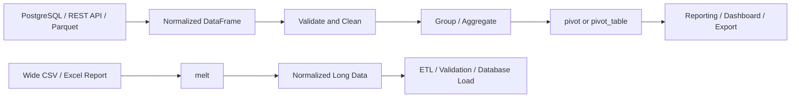

# 13- Pivot And Melt

## Overview

`pivot()`, `pivot_table()`, and `melt()` reshape Pandas DataFrames between wide and long representations.

These operations are especially useful for:

- reporting and analytics
- time-series summaries
- business dashboards
- API response normalization
- ETL pipelines
- feature preparation
- exporting data to reporting systems
- transforming SQL query results

The core relationship is:

```text
Long / normalized data
        │
        ├── pivot()
        ├── pivot_table()
        │
        ↓
Wide / report-friendly data

Wide / report-oriented data
        │
        └── melt()
        ↓
Long / normalized data
```

A common backend workflow is:



The most important distinction is:

| Operation | Primary purpose |
|---|---|
| `pivot()` | Reshape without aggregation |
| `pivot_table()` | Reshape with aggregation |
| `melt()` | Convert wide data into long format |
| `stack()` | Move columns into an index level |
| `unstack()` | Move an index level into columns |

---

## Wide vs Long Data

Consider order data:

```python
orders = pd.DataFrame(
    {
        "order_date": [
            "2026-01-01",
            "2026-01-01",
            "2026-01-02",
            "2026-01-02",
        ],
        "category": [
            "Electronics",
            "Books",
            "Electronics",
            "Books",
        ],
        "revenue": [
            1000.0,
            400.0,
            1200.0,
            500.0,
        ],
    }
)
```

This is a long-format representation:

```text
order_date  category      revenue
2026-01-01  Electronics   1000
2026-01-01  Books          400
2026-01-02  Electronics   1200
2026-01-02  Books          500
```

A wide representation could be:

```text
order_date  Books  Electronics
2026-01-01   400       1000
2026-01-02   500       1200
```

Long data is usually better for:

```text
storage
ETL
validation
groupby
SQL interoperability
generic transformations
```

Wide data is often better for:

```text
reporting
human-readable output
dashboards
matrix-style analysis
```

---

## `pivot()`

`pivot()` reshapes a DataFrame by moving unique values from one or more columns into the column axis.

Basic syntax:

```python
df.pivot(
    index="...",
    columns="...",
    values="...",
)
```

The operation requires the combination of:

```text
index + columns
```

to identify at most one value.

Example:

```python
orders = pd.DataFrame(
    {
        "order_date": [
            "2026-01-01",
            "2026-01-01",
            "2026-01-02",
            "2026-01-02",
        ],
        "category": [
            "Electronics",
            "Books",
            "Electronics",
            "Books",
        ],
        "revenue": [
            1000.0,
            400.0,
            1200.0,
            500.0,
        ],
    }
)

report = orders.pivot(
    index="order_date",
    columns="category",
    values="revenue",
)
```

Result:

```text
category    Books  Electronics
order_date
2026-01-01  400.0  1000.0
2026-01-02  500.0  1200.0
```

---

## `pivot()` Requires Unique Combinations

This is the most important behavior to understand.

Suppose:

```python
orders = pd.DataFrame(
    {
        "order_date": [
            "2026-01-01",
            "2026-01-01",
        ],
        "category": [
            "Books",
            "Books",
        ],
        "revenue": [
            100.0,
            200.0,
        ],
    }
)
```

There are two rows for:

```text
order_date = 2026-01-01
category   = Books
```

This is ambiguous:

```python
orders.pivot(
    index="order_date",
    columns="category",
    values="revenue",
)
```

Pandas raises a duplicate-entry error because it has no basis for deciding whether the value should be:

```text
100
200
300
first
last
```

`pivot()` intentionally does not silently aggregate data.

---

## Why `pivot()` Does Not Aggregate

`pivot()` is a pure reshape operation.

It assumes:

```text
one index/column combination
→
one value
```

This is valuable because it prevents accidental aggregation.

If your dataset contains duplicate combinations, you need to define the business rule explicitly.

That usually means using:

```python
pivot_table()
```

---

## `pivot_table()`

`pivot_table()` performs reshaping and aggregation.

Syntax:

```python
df.pivot_table(
    index="...",
    columns="...",
    values="...",
    aggfunc="sum",
)
```

Example:

```python
orders = pd.DataFrame(
    {
        "order_date": [
            "2026-01-01",
            "2026-01-01",
            "2026-01-01",
        ],
        "category": [
            "Books",
            "Books",
            "Electronics",
        ],
        "revenue": [
            100.0,
            200.0,
            500.0,
        ],
    }
)

report = orders.pivot_table(
    index="order_date",
    columns="category",
    values="revenue",
    aggfunc="sum",
)
```

Result:

```text
category    Books  Electronics
order_date
2026-01-01  300.0  500.0
```

---

## `pivot()` vs `pivot_table()`

| Feature | `pivot()` | `pivot_table()` |
|---|---|---|
| Reshapes data | Yes | Yes |
| Aggregates duplicate combinations | No | Yes |
| Requires unique combinations | Yes | No |
| Supports `aggfunc` | No | Yes |
| Best for | strict reshaping | reporting and summaries |
| Typical source | normalized unique data | transaction/event data |

A useful interview rule:

```text
pivot()
→ reshape

pivot_table()
→ reshape + aggregate
```

---

## Choosing the Aggregation Function

Common aggregation functions include:

```python
"sum"
"mean"
"count"
"size"
"min"
"max"
"median"
"nunique"
```

Example:

```python
revenue_by_category = orders.pivot_table(
    index="order_date",
    columns="category",
    values="revenue",
    aggfunc="sum",
)
```

For order counts:

```python
order_counts = orders.pivot_table(
    index="order_date",
    columns="category",
    values="revenue",
    aggfunc="size",
)
```

The correct aggregation depends on business semantics.

---

## Multiple Aggregation Functions

You can provide multiple functions:

```python
summary = orders.pivot_table(
    index="order_date",
    columns="category",
    values="revenue",
    aggfunc=["sum", "mean", "max"],
)
```

This produces hierarchical columns.

Conceptually:

```text
             sum                 mean
category     Books  Electronics  Books  Electronics
order_date
2026-01-01   300    500          150    500
```

MultiIndex columns are powerful but can complicate:

```text
CSV exports
API serialization
database loading
downstream transformations
```

Flatten them deliberately when necessary.

---

## Flattening MultiIndex Columns

Example:

```python
summary = orders.pivot_table(
    index="order_date",
    columns="category",
    values="revenue",
    aggfunc=["sum", "mean"],
)

summary.columns = [
    f"{agg}_{category}"
    for agg, category in summary.columns
]

summary = summary.reset_index()
```

Result:

```text
order_date   sum_Books   sum_Electronics   mean_Books   mean_Electronics
2026-01-01   300         500               150          500
```

This format is usually easier to serialize to JSON or write to a warehouse table.

---

## `fill_value`

Pivot tables may produce missing combinations.

Example:

```python
summary = orders.pivot_table(
    index="order_date",
    columns="category",
    values="revenue",
    aggfunc="sum",
    fill_value=0,
)
```

Now missing category/date combinations become:

```text
0
```

instead of:

```text
NaN
```

Use `fill_value=0` only when zero is semantically correct.

Do not convert unknown values to zero simply because it is convenient for reporting.

---

## Missing Value Semantics

Consider:

```text
No sales recorded
```

versus:

```text
Sales record exists but revenue is missing
```

These are not necessarily equivalent.

For financial reporting:

```text
missing
≠
0
```

unless the business definition explicitly establishes that relationship.

This distinction is particularly important in:

```text
revenue reports
inventory
financial statements
customer metrics
SLA dashboards
```

---

## `dropna`

`pivot_table()` has controls for handling missing grouping keys.

Example:

```python
summary = orders.pivot_table(
    index="order_date",
    columns="category",
    values="revenue",
    aggfunc="sum",
    dropna=False,
)
```

Missing category values may now be represented rather than discarded from the grouping structure.

Always verify the resulting semantics with the target business definition.

---

## `observed`

Categorical columns can affect how grouped combinations are represented.

Example:

```python
orders["category"] = orders["category"].astype(
    "category"
)

summary = orders.pivot_table(
    index="order_date",
    columns="category",
    values="revenue",
    aggfunc="sum",
    observed=True,
)
```

`observed=True` can restrict grouping to category combinations actually present in the data.

This can reduce unnecessary combinations and is often preferable for sparse categorical data.

---

## Multiple Index Dimensions

You can pivot using multiple index columns:

```python
summary = orders.pivot_table(
    index=["region", "order_date"],
    columns="category",
    values="revenue",
    aggfunc="sum",
)
```

The result has a MultiIndex on the rows:

```text
region  order_date   Books   Electronics
IN      2026-01-01   300     500
US      2026-01-01   450     800
```

Use this when the report naturally has hierarchical dimensions.

---

## Multiple Column Dimensions

`columns` can also contain multiple dimensions:

```python
summary = orders.pivot_table(
    index="order_date",
    columns=["region", "category"],
    values="revenue",
    aggfunc="sum",
)
```

This produces MultiIndex columns.

It is useful for analytical workflows but can become unwieldy for operational APIs.

For external interfaces, flattening is often preferable.

---

## Multiple Values

You can pivot multiple measures:

```python
orders["order_count"] = 1

summary = orders.pivot_table(
    index="order_date",
    columns="category",
    values=[
        "revenue",
        "order_count",
    ],
    aggfunc={
        "revenue": "sum",
        "order_count": "sum",
    },
)
```

This is useful for dashboard preparation.

Example resulting structure:

```text
                 revenue           order_count
category         Books Electronics Books Electronics
order_date
2026-01-01       300   500         2     1
```

---

## Named Aggregations Before Pivoting

For complex production reporting, it can be clearer to aggregate explicitly before reshaping.

Example:

```python
daily = (
    orders
    .groupby(
        ["order_date", "category"],
        as_index=False,
    )
    .agg(
        revenue=("revenue", "sum"),
        orders=("order_id", "nunique"),
    )
)

report = daily.pivot(
    index="order_date",
    columns="category",
)
```

This separates:

```text
business aggregation
```

from:

```text
presentation reshaping
```

That separation often improves maintainability.

---

## `pivot_table()` vs `groupby() + unstack()`

A pivot table can often be expressed as:

```python
summary = (
    orders
    .groupby(
        ["order_date", "category"]
    )["revenue"]
    .sum()
    .unstack("category")
)
```

This is conceptually similar to:

```python
summary = orders.pivot_table(
    index="order_date",
    columns="category",
    values="revenue",
    aggfunc="sum",
)
```

Use `pivot_table()` when the desired output is naturally a spreadsheet-like matrix.

Use `groupby()` plus `unstack()` when the grouping logic needs to be more explicit or complex.

---

## `melt()`

`melt()` converts wide data into long format.

Syntax:

```python
df.melt(
    id_vars=[...],
    value_vars=[...],
    var_name="...",
    value_name="...",
)
```

Example:

```python
report = pd.DataFrame(
    {
        "order_date": [
            "2026-01-01",
            "2026-01-02",
        ],
        "Books": [
            400.0,
            500.0,
        ],
        "Electronics": [
            1000.0,
            1200.0,
        ],
    }
)

long = report.melt(
    id_vars="order_date",
    var_name="category",
    value_name="revenue",
)
```

Result:

```text
order_date  category       revenue
2026-01-01  Books          400
2026-01-01  Electronics    1000
2026-01-02  Books          500
2026-01-02  Electronics    1200
```

---

## Why `melt()` Exists

Wide reports are convenient for humans:

```text
date   Books   Electronics   Furniture
```

Long data is usually more convenient for:

```text
SQL
ETL
groupby
validation
generic transformations
analytics systems
```

`melt()` converts presentation-oriented structures back into normalized analytical structures.

---

## `id_vars`

`id_vars` identifies columns that should remain fixed.

Example:

```python
long = report.melt(
    id_vars=[
        "order_date",
        "region",
    ],
    var_name="category",
    value_name="revenue",
)
```

The identifier columns are repeated for each melted measure.

---

## `value_vars`

Use `value_vars` to explicitly define columns to unpivot:

```python
long = report.melt(
    id_vars="order_date",
    value_vars=[
        "Books",
        "Electronics",
    ],
    var_name="category",
    value_name="revenue",
)
```

This is safer than melting every non-ID column when the schema may evolve.

---

## Explicit `value_vars` in Production

Suppose a report later gains:

```text
report_generated_at
currency
source_system
```

If all non-ID columns are melted automatically, these metadata fields may accidentally become data rows.

Explicitly defining:

```python
value_vars=[
    "Books",
    "Electronics",
]
```

makes the transformation contract clearer.

---

## `melt()` and Missing Values

Suppose:

```python
report = pd.DataFrame(
    {
        "order_date": ["2026-01-01"],
        "Books": [400.0],
        "Electronics": [None],
    }
)
```

Then:

```python
long = report.melt(
    id_vars="order_date",
    var_name="category",
    value_name="revenue",
)
```

produces a row for Electronics with a missing `revenue`.

Depending on the use case, you may:

```text
retain it
drop it
validate it
convert it to a business-defined zero
```

Do not blindly drop missing values before deciding what they mean.

---

## `ignore_index` in `melt()`

By default, `melt()` creates a new integer index.

```python
long = report.melt(
    id_vars="order_date",
    ignore_index=True,
)
```

When the original index is meaningful, consider:

```python
long = report.melt(
    id_vars="order_date",
    ignore_index=False,
)
```

Most ETL workflows should use the default unless index preservation has explicit semantic value.

---

## Round-Tripping `pivot()` and `melt()`

Many reshape workflows form a conceptual round trip:

```text
long
 ↓
pivot
 ↓
wide
 ↓
melt
 ↓
long
```

Example:

```python
wide = orders.pivot(
    index="order_date",
    columns="category",
    values="revenue",
)

long = (
    wide
    .reset_index()
    .melt(
        id_vars="order_date",
        var_name="category",
        value_name="revenue",
    )
)
```

The result can represent the original structure.

However, round-tripping is not always byte-for-byte identical because:

```text
index handling
dtype changes
missing combinations
sorting
column metadata
duplicate rows
```

may change.

---

## Round-Trip Requirements

A clean round trip generally requires:

```text
unique index + column combinations
stable identifiers
controlled missing-value semantics
consistent dtypes
```

If duplicate combinations exist, `pivot()` cannot represent them directly without aggregation.

---

## `melt()` vs `stack()`

Both can convert wide data toward long representations, but they have different mental models.

| Operation | Primary model |
|---|---|
| `melt()` | columns become values in a normal DataFrame column |
| `stack()` | columns move into an index level |
| `melt()` | straightforward tabular unpivot |
| `stack()` | index-oriented reshaping |

For most ETL and API-oriented transformations, `melt()` is easier to reason about.

---

## `pivot()` vs `unstack()`

The equivalent relationship is:

```text
pivot()
→ DataFrame-oriented reshape

unstack()
→ move an existing index level into columns
```

Example:

```python
grouped = (
    orders
    .groupby(
        ["order_date", "category"]
    )["revenue"]
    .sum()
)

wide = grouped.unstack(
    "category"
)
```

This is often a natural continuation of a `groupby()` operation.

---

## `stack()`

Starting with:

```text
order_date   Books   Electronics
2026-01-01   400     1000
2026-01-02   500     1200
```

you can use:

```python
long = wide.stack()
```

to move column labels into the index.

For modern pipelines, `melt()` is generally clearer when the desired result is an ordinary DataFrame.

---

## Crosstab vs Pivot Table

`pd.crosstab()` is useful for frequency tables.

Example:

```python
counts = pd.crosstab(
    orders["order_date"],
    orders["category"],
)
```

This answers:

```text
How many records exist for each date/category combination?
```

A pivot table is more flexible for arbitrary measures:

```python
revenue = orders.pivot_table(
    index="order_date",
    columns="category",
    values="revenue",
    aggfunc="sum",
)
```

---

## Pivoting Financial Data

Consider transactions:

```python
transactions = pd.DataFrame(
    {
        "month": [
            "2026-01",
            "2026-01",
            "2026-02",
            "2026-02",
        ],
        "account": [
            "Revenue",
            "Refunds",
            "Revenue",
            "Refunds",
        ],
        "amount": [
            100000.0,
            -5000.0,
            120000.0,
            -3000.0,
        ],
    }
)
```

Create a monthly financial report:

```python
monthly = transactions.pivot_table(
    index="month",
    columns="account",
    values="amount",
    aggfunc="sum",
    fill_value=0,
)
```

Result:

```text
account    Refunds   Revenue
month
2026-01    -5000     100000
2026-02    -3000     120000
```

For financial data, explicitly define how missing accounts and zero values should be interpreted.

---

## Pivoting API Metrics

Suppose an API returns:

```text
timestamp
service
metric
value
```

Example:

```python
metrics = pd.DataFrame(
    {
        "timestamp": [
            "2026-01-01T10:00:00Z",
            "2026-01-01T10:00:00Z",
            "2026-01-01T10:05:00Z",
            "2026-01-01T10:05:00Z",
        ],
        "service": [
            "orders",
            "payments",
            "orders",
            "payments",
        ],
        "metric": [
            "latency_ms",
            "latency_ms",
            "latency_ms",
            "latency_ms",
        ],
        "value": [
            120,
            80,
            110,
            90,
        ],
    }
)
```

A pivot can create:

```python
latency = metrics.pivot(
    index="timestamp",
    columns="service",
    values="value",
)
```

This can be useful for monitoring reports and operational analysis.

---

## Pivoting Event Data

Event data is typically stored in long format:

```text
timestamp
user_id
event_type
count
```

A reporting system might require:

```text
date
signup
purchase
logout
```

A pivot table can generate this structure:

```python
daily_events = events.pivot_table(
    index="date",
    columns="event_type",
    values="count",
    aggfunc="sum",
    fill_value=0,
)
```

The storage model remains normalized while the presentation model becomes wide.

---

## SQL Equivalent

A pivot operation often corresponds conceptually to conditional aggregation:

```sql
SELECT
    order_date,
    SUM(
        CASE
            WHEN category = 'Books'
            THEN revenue
            ELSE 0
        END
    ) AS books,
    SUM(
        CASE
            WHEN category = 'Electronics'
            THEN revenue
            ELSE 0
        END
    ) AS electronics
FROM orders
GROUP BY order_date;
```

This distinction matters in backend systems because large aggregations should often happen in PostgreSQL or the warehouse rather than after pulling all raw records into Pandas.

---

## Push Aggregation to the Database

Avoid:

```text
PostgreSQL
→ fetch millions of rows
→ Pandas pivot_table
```

when the database can perform the aggregation efficiently.

Prefer:

```text
PostgreSQL
→ filter
→ group
→ aggregate
→ return manageable result
→ Pandas reshape
```

Example:

```sql
SELECT
    order_date,
    category,
    SUM(revenue) AS revenue
FROM orders
WHERE order_date >= DATE '2026-01-01'
GROUP BY
    order_date,
    category;
```

Then:

```python
daily = pd.read_sql(
    query,
    connection,
)

report = daily.pivot(
    index="order_date",
    columns="category",
    values="revenue",
)
```

Pandas remains the presentation/reshape layer rather than the database substitute.

---

## API Response Normalization

API payloads often arrive in nested or wide structures.

Example:

```python
response = pd.DataFrame(
    {
        "date": ["2026-01-01"],
        "books_revenue": [400.0],
        "electronics_revenue": [1000.0],
    }
)
```

Normalize it:

```python
normalized = response.melt(
    id_vars="date",
    var_name="metric",
    value_name="value",
)
```

Then parse the metric names:

```python
normalized["category"] = (
    normalized["metric"]
    .str.removesuffix("_revenue")
)
```

This creates a more generic representation for downstream processing.

---

## Wide-to-Long ETL Pattern

A robust ETL design often looks like:

```text
external report
      ↓
wide DataFrame
      ↓
melt
      ↓
long normalized DataFrame
      ↓
validate
      ↓
clean / transform
      ↓
database / Parquet
```

The long representation is easier to validate because the schema becomes:

```text
entity_id
dimension
metric
value
```

instead of requiring a new physical column for every metric.

---

## Long-to-Wide Reporting Pattern

The reverse pattern is common for reports:

```text
database / Parquet
      ↓
normalized long data
      ↓
filter
      ↓
group / aggregate
      ↓
pivot_table
      ↓
wide report
      ↓
CSV / Excel / dashboard
```

This keeps storage and reporting concerns separate.

---

## Datetime Dimensions

Dates should be normalized before pivoting.

Example:

```python
orders["order_date"] = pd.to_datetime(
    orders["order_date"],
    errors="raise",
)

orders["month"] = (
    orders["order_date"]
    .dt.to_period("M")
    .astype("string")
)
```

Then:

```python
monthly = orders.pivot_table(
    index="month",
    columns="category",
    values="revenue",
    aggfunc="sum",
)
```

Do not pivot mixed string and datetime representations without first establishing a consistent dtype.

---

## Sorting Pivoted Output

Pivot operations do not guarantee the business ordering you want.

For deterministic reports:

```python
report = (
    orders
    .pivot_table(
        index="order_date",
        columns="category",
        values="revenue",
        aggfunc="sum",
    )
    .sort_index()
)
```

For custom category ordering:

```python
category_order = [
    "Books",
    "Electronics",
    "Furniture",
]

report = report.reindex(
    columns=category_order
)
```

---

## Categorical Dimensions

For stable reporting dimensions:

```python
orders["category"] = pd.Categorical(
    orders["category"],
    categories=[
        "Books",
        "Electronics",
        "Furniture",
    ],
    ordered=True,
)
```

This can provide:

```text
stable category order
controlled dimensions
clear reporting semantics
```

For large repeated categorical values, categorical dtypes may also reduce memory usage.

---

## Performance Considerations

Pivoting can be expensive when there are many unique:

```text
rows
columns
dimension combinations
```

A wide result with:

```text
100,000 dates
×
10,000 categories
```

can become extremely sparse and memory-intensive.

Before pivoting, ask:

```text
How many unique row keys?
How many unique column keys?
How sparse will the result be?
Is a wide representation actually necessary?
```

Wide tables can become dramatically larger than their long source representation.

---

## Avoiding Accidental Cartesian Growth

Pivoting multiple dimensions can generate very large matrices.

For example:

```python
report = orders.pivot_table(
    index=["region", "date"],
    columns=["category", "channel"],
    values="revenue",
    aggfunc="sum",
)
```

The number of possible combinations can grow rapidly.

Use dimension filtering before reshaping:

```python
filtered = orders.loc[
    orders["region"].isin(
        ["IN", "US"]
    )
]
```

Then pivot the smaller dataset.

---

## Pre-Aggregate Before Pivoting

For very large datasets:

```python
daily = (
    orders
    .groupby(
        ["order_date", "category"],
        as_index=False,
        observed=True,
    )
    .agg(
        revenue=("revenue", "sum")
    )
)

report = daily.pivot(
    index="order_date",
    columns="category",
    values="revenue",
)
```

This can be more efficient and easier to reason about than pivoting directly from high-cardinality transaction data.

It also separates:

```text
aggregation
```

from:

```text
reshape
```

which improves observability and testability.

---

## Memory Management

Before generating a wide report:

```python
estimated_rows = orders["order_date"].nunique()
estimated_columns = orders["category"].nunique()

if estimated_rows * estimated_columns > 5_000_000:
    raise ValueError(
        "Report dimensions exceed configured limit"
    )
```

A simple cardinality guard can prevent an accidental memory blow-up in an API worker or scheduled job.

The exact threshold should be based on:

```text
worker memory
data types
expected density
concurrent jobs
container limits
```

---

## Production Architecture

For a FastAPI reporting endpoint, avoid performing an unbounded pivot synchronously on every request.

Prefer:

```text
Client
  ↓
FastAPI
  ↓
validated report parameters
  ↓
PostgreSQL / warehouse aggregation
  ↓
bounded result
  ↓
Pandas reshape
  ↓
serialized response
```

For expensive reports:

```text
Client
  ↓
FastAPI
  ↓
Celery job
  ↓
Database / S3
  ↓
Pandas transformation
  ↓
Parquet / CSV
  ↓
client downloads result
```

This avoids allowing expensive reshaping work to exhaust API worker memory.

---

## Caching Reports

If the same pivoted report is requested repeatedly:

```text
same filters
same reporting period
same source snapshot
```

cache the computed result.

Redis can store:

```text
report identifier
filter parameters
dataset version
result location
expiration
```

For larger outputs, store the actual artifact in S3 and cache only metadata or its location.

---

## Reproducibility

A pivoted report should be reproducible from:

```text
source dataset/version
filters
aggregation rules
dimension definitions
category ordering
missing-value policy
report generation timestamp
```

Persisting these inputs improves debugging when a stakeholder asks why yesterday's report differs from today's.

---

## Security Considerations

Reshaping does not enforce authorization.

A multi-tenant reporting job must filter tenant data before pivoting:

```python
tenant_orders = orders.loc[
    orders["tenant_id"].eq(
        tenant_id
    )
]
```

Then pivot only the authorized subset.

Do not rely on a later report formatting stage to remove unauthorized records.

This is especially important when:

```text
FastAPI
Django
Celery
multi-tenant PostgreSQL
S3-backed reporting
```

are involved.

---

## Data Quality Validation

Before pivoting:

```text
required identifiers present
valid dimensions
valid numeric measures
expected dtype
duplicate policy defined
date range valid
```

After pivoting:

```text
expected dimensions present
row count within expected bounds
no unexpected metric columns
totals reconcile
missing values follow policy
```

For financial data, reconcile totals:

```python
source_total = orders["revenue"].sum()
report_total = report.sum(
    numeric_only=True
).sum()

if not np.isclose(
    source_total,
    report_total,
):
    raise ValueError(
        "Revenue reconciliation failed"
    )
```

For production code, make the reconciliation logic account for whether values are intentionally repeated across dimensions.

---

## Testing Pivot Transformations

Test the business result rather than merely checking that the code runs.

```python
def test_daily_revenue_pivot() -> None:
    orders = pd.DataFrame(
        {
            "order_date": [
                "2026-01-01",
                "2026-01-01",
                "2026-01-02",
            ],
            "category": [
                "Books",
                "Books",
                "Books",
            ],
            "revenue": [
                100.0,
                200.0,
                300.0,
            ],
        }
    )

    report = orders.pivot_table(
        index="order_date",
        columns="category",
        values="revenue",
        aggfunc="sum",
    )

    assert report.loc[
        "2026-01-01",
        "Books",
    ] == 300.0

    assert report.loc[
        "2026-01-02",
        "Books",
    ] == 300.0
```

---

## Testing `melt()`

```python
def test_melt_converts_metrics_to_rows() -> None:
    report = pd.DataFrame(
        {
            "date": ["2026-01-01"],
            "books": [100.0],
            "electronics": [200.0],
        }
    )

    result = report.melt(
        id_vars="date",
        var_name="category",
        value_name="revenue",
    )

    assert list(result["category"]) == [
        "books",
        "electronics",
    ]

    assert list(result["revenue"]) == [
        100.0,
        200.0,
    ]
```

---

## Testing Duplicate Pivot Keys

`pivot()` should fail when duplicate combinations exist.

```python
import pandas as pd
import pytest


def test_pivot_rejects_duplicate_keys() -> None:
    data = pd.DataFrame(
        {
            "date": [
                "2026-01-01",
                "2026-01-01",
            ],
            "category": [
                "Books",
                "Books",
            ],
            "revenue": [
                100.0,
                200.0,
            ],
        }
    )

    with pytest.raises(
        ValueError
    ):
        data.pivot(
            index="date",
            columns="category",
            values="revenue",
        )
```

This protects against silently changing business semantics.

---

## Testing Missing-Value Policy

```python
def test_pivot_table_uses_zero_for_missing_combinations() -> None:
    data = pd.DataFrame(
        {
            "date": [
                "2026-01-01",
            ],
            "category": [
                "Books",
            ],
            "revenue": [
                100.0,
            ],
        }
    )

    result = data.pivot_table(
        index="date",
        columns="category",
        values="revenue",
        aggfunc="sum",
        fill_value=0,
    )

    assert result.loc[
        "2026-01-01",
        "Books",
    ] == 100.0
```

For production financial reports, add explicit tests for categories that are absent.

---

## Common Mistakes

### Using `pivot()` When Duplicate Keys Exist

`pivot()` cannot decide how to aggregate duplicates.

Use `pivot_table()` or explicitly aggregate first.

### Using `pivot_table()` Without Thinking About Aggregation

The default aggregation semantics may not match the business rule.

Always make the aggregation explicit when correctness matters:

```python
aggfunc="sum"
```

### Treating Missing Values as Zero

Missing data and zero are different states.

### Forgetting the Index Becomes Part of the Structure

Pivoting can create a MultiIndex or MultiIndex columns.

Reset or flatten these deliberately before serialization.

### Melting Too Many Columns

Implicitly melting all non-ID columns can incorporate:

```text
metadata
timestamps
status fields
control columns
```

Use `value_vars` when the schema is not strictly controlled.

### Generating Huge Wide DataFrames

High-cardinality pivot dimensions can cause memory exhaustion.

### Pivoting Raw Data Instead of Aggregating First

For very large transaction datasets, pre-aggregate where possible.

### Using Pandas Instead of the Database for Large Aggregations

Push filtering and aggregation into PostgreSQL or the warehouse when practical.

### Ignoring Column Ordering

Reports often require stable column order. Reindex columns explicitly.

### Assuming Pivot and Melt Are Always Perfect Inverses

Duplicates, missing values, index semantics, and dtype changes can prevent exact round-tripping.

---

## Interview Traps

### What Is the Difference Between `pivot()` and `pivot_table()`?

`pivot()` reshapes data and requires unique index/column combinations. `pivot_table()` can aggregate duplicate combinations.

### Why Does `pivot()` Fail on Duplicate Entries?

Because one cell corresponds to a single index/column combination, but multiple source rows provide competing values.

### When Should You Use `melt()`?

When converting wide data into normalized long form.

### What Does `id_vars` Do?

It identifies columns that remain fixed while other columns are converted into variable/value rows.

### What Does `value_vars` Do?

It explicitly identifies columns that should be melted.

### What Is a Common SQL Equivalent of a Pivot?

Conditional aggregation using expressions such as:

```sql
SUM(
    CASE
        WHEN category = 'Books'
        THEN revenue
        ELSE 0
    END
)
```

### When Is `groupby() + unstack()` Useful?

When aggregation logic is naturally expressed using `groupby()` and the result then needs to be reshaped.

### What Happens to Missing Combinations in a Pivot Table?

They may be represented as missing values unless a fill policy such as `fill_value=0` is applied.

### Why Can Pivoting Cause Memory Problems?

The result can become wide, and the number of possible dimension combinations may be much larger than the number of populated source records.

### Should a FastAPI Endpoint Pivot Millions of Rows Directly?

Generally no. Filter and aggregate in the database or warehouse, then perform a bounded reshape in the application or an asynchronous reporting job.

### How Should Pivoted Data Be Serialized?

For APIs or database storage, flatten MultiIndex structures and establish stable column names before serialization.

### Is `melt()` Destructive?

It returns a reshaped DataFrame and does not modify the original DataFrame unless you assign the result back.

### How Do You Handle Duplicate Rows Before Pivoting?

Define the business identity and aggregation rule first, then use:

```python
drop_duplicates(...)
```

or:

```python
groupby(...).agg(...)
```

as appropriate.

---

## Production Checklist

Before deploying a pivot or melt transformation, verify:

- The desired input representation is clearly defined as wide or long.
- `pivot()` is used only when index/column combinations are unique.
- `pivot_table()` has an explicit aggregation rule when business semantics matter.
- Missing-value behavior is intentional.
- High-cardinality dimensions are bounded.
- Column and index ordering are deterministic.
- MultiIndex output is flattened when required by downstream systems.
- Dtypes are validated before numerical aggregation.
- Database-side filtering and aggregation are used when appropriate.
- API endpoints do not allow unbounded pivot dimensions.
- Tenant and authorization filters are applied before reshaping.
- Row counts and business totals are reconciled.
- Empty datasets and missing dimensions are tested.
- Transformation behavior is covered by automated tests.
- Expensive report generation is moved to asynchronous processing when necessary.

---

## Key Takeaways

- `pivot()` performs strict reshaping and requires each index/column combination to identify a single value; `pivot_table()` is the appropriate choice when aggregation is required.
- `melt()` converts wide, report-oriented data into long, normalized data that is generally easier to validate, transform, store, and process in ETL pipelines.
- Pivot operations can create MultiIndexes, missing combinations, and very wide DataFrames, so index handling, missing-value semantics, cardinality, and memory usage must be explicit.
- For large production datasets, push filtering and aggregation into PostgreSQL or a warehouse first, then use Pandas for bounded reshaping and report preparation.
- Treat reshaping as a data-contract operation: define dimensions, aggregation rules, authorization scope, schema, ordering, reconciliation checks, and edge-case behavior before deploying it.