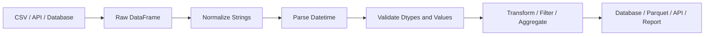
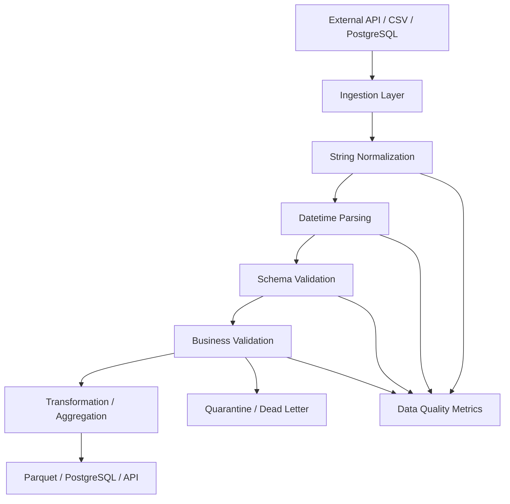

# 14- Strings And Datetime

## Overview

String and datetime operations are among the most common sources of data-quality problems in Pandas pipelines.

Backend systems routinely receive values such as:

```text
customer names
email addresses
status values
product codes
API identifiers
timestamps
dates
time zones
event times
```

These values often arrive with inconsistent formatting:

```text
" completed "
"COMPLETED"
"completed"
"2026-01-15"
"2026/01/15"
"2026-01-15T10:30:00Z"
"15-01-2026"
```

Pandas provides vectorized string operations through `.str` and datetime operations through `.dt`.

A production pipeline typically follows:



The important engineering principle is:

> Normalize representation before applying business logic.

For example, filtering for:

```python
orders["status"].eq("completed")
```

is unreliable if the source may contain:

```text
Completed
 completed
COMPLETED
```

Likewise, datetime filtering is unsafe if timestamps remain arbitrary strings.

---

## String Data in Pandas

Modern Pandas supports several string-related representations, including:

```text
object
string
string[python]
string[pyarrow]
```

For production pipelines, the explicit nullable string dtype is usually preferable to generic `object` when the column represents text:

```python
df["status"] = df["status"].astype("string")
```

This makes the semantic type clearer and integrates better with Pandas' missing-value handling.

Example:

```python
customers["email"] = (
    customers["email"]
    .astype("string")
)
```

---

## Why String Normalization Matters

String normalization is often part of:

```text
deduplication
filtering
joining
validation
authorization
reporting
search
data quality
```

Suppose a customer identifier arrives as:

```text
" cust-1001 "
"CUST-1001"
"cust-1001"
```

Treating these as different values can create duplicate logical customers.

A normalization pipeline might be:

```python
customers["customer_id"] = (
    customers["customer_id"]
    .astype("string")
    .str.strip()
    .str.upper()
)
```

Result:

```text
CUST-1001
CUST-1001
CUST-1001
```

The duplicates can then be detected using the actual business key.

---

## `.str` Accessor

Pandas exposes vectorized string operations through `.str`.

Common operations include:

```python
.str.strip()
.str.lower()
.str.upper()
.str.title()
.str.len()
.str.startswith()
.str.endswith()
.str.contains()
.str.replace()
.str.removeprefix()
.str.removesuffix()
.str.split()
.str.extract()
.str.slice()
```

Example:

```python
customers["email_domain"] = (
    customers["email"]
    .str.lower()
    .str.split("@")
    .str[-1]
)
```

These operations are vectorized at the Pandas level and should generally be preferred over explicit Python loops.

---

## String Normalization

A common normalization pipeline:

```python
customers["name"] = (
    customers["name"]
    .astype("string")
    .str.strip()
    .str.replace(
        r"\s+",
        " ",
        regex=True,
    )
)
```

This handles:

```text
leading whitespace
trailing whitespace
repeated internal whitespace
```

For example:

```text
"  Aranya    Majumdar  "
```

becomes:

```text
"Aranya Majumdar"
```

Do not blindly normalize strings when formatting carries business meaning.

For example, product identifiers may be case-sensitive in some external systems.

---

## `.str.strip()`

Use:

```python
df["status"] = (
    df["status"]
    .astype("string")
    .str.strip()
)
```

to remove leading and trailing whitespace.

This is particularly useful after:

```text
CSV imports
Excel exports
manual data entry
legacy database extracts
API integrations
```

Whitespace is often invisible during debugging, making explicit normalization valuable.

---

## Lowercase and Uppercase

Use:

```python
df["status"] = (
    df["status"]
    .astype("string")
    .str.lower()
)
```

or:

```python
df["country_code"] = (
    df["country_code"]
    .astype("string")
    .str.upper()
)
```

For controlled enumerations, normalize once and validate against the allowed set:

```python
allowed_statuses = {
    "pending",
    "completed",
    "cancelled",
}

df["status"] = (
    df["status"]
    .astype("string")
    .str.strip()
    .str.lower()
)

invalid = ~df["status"].isin(
    allowed_statuses
)

if invalid.any():
    raise ValueError(
        "Unexpected status values"
    )
```

---

## Missing String Values

String operations can encounter:

```text
pd.NA
None
NaN
```

Prefer the explicit nullable string dtype:

```python
df["status"] = df["status"].astype(
    "string"
)
```

Then:

```python
df["status"].str.lower()
```

preserves missing values instead of turning them into arbitrary string representations.

Avoid:

```python
df["status"].astype(str)
```

when missing values have semantic importance.

That can convert missing values into text such as:

```text
"nan"
"None"
```

which corrupts the distinction between:

```text
missing
```

and:

```text
literal text
```

---

## String Missing-Value Handling

For filtering:

```python
completed = df.loc[
    df["status"]
    .astype("string")
    .str.lower()
    .eq("completed")
]
```

Missing values do not become `"completed"`.

For default values:

```python
df["status"] = (
    df["status"]
    .astype("string")
    .fillna("unknown")
)
```

Only use a replacement such as `"unknown"` when that is an explicit business rule.

---

## `.str.contains()`

Use `contains()` for pattern matching:

```python
mask = customers["email"].str.contains(
    "@example.com",
    case=False,
    na=False,
)
```

Then:

```python
example_customers = customers.loc[
    mask
]
```

The `na=False` parameter is important when missing strings must not produce missing boolean values.

---

## Literal vs Regular Expression Matching

By default, many `.str` methods interpret patterns as regular expressions.

For literal matching:

```python
mask = df["reference"].str.contains(
    ".",
    regex=False,
    na=False,
)
```

Without:

```python
regex=False
```

a period means:

```text
any character
```

rather than a literal period.

When patterns originate from user input, explicitly consider whether regular-expression semantics are intended.

---

## Regular Expressions

Regex can be useful for structured identifiers.

Example:

```python
mask = df["order_id"].str.fullmatch(
    r"ORD-\d{8}",
    na=False,
)
```

This validates identifiers such as:

```text
ORD-12345678
```

while rejecting malformed values.

Do not use regex as a substitute for a proper parser when the format is complex or security-sensitive.

---

## `.str.startswith()` and `.str.endswith()`

For prefix-based validation:

```python
legacy = df.loc[
    df["customer_id"]
    .str.startswith(
        "LEG-",
        na=False,
    )
]
```

For file names:

```python
csv_files = files.loc[
    files["path"]
    .str.endswith(
        ".csv",
        na=False,
    )
]
```

These operations are generally clearer than writing equivalent regex patterns.

---

## `.str.replace()`

Use vectorized replacement:

```python
df["phone"] = (
    df["phone"]
    .astype("string")
    .str.replace(
        r"\D+",
        "",
        regex=True,
    )
)
```

This can normalize:

```text
+91-98765-43210
(98765) 43210
98765 43210
```

to a digits-only representation.

However, phone-number validation should still use country-specific rules rather than assuming that removing non-digits produces a valid number.

---

## Literal Replacement

If no regex is required:

```python
df["status"] = df["status"].str.replace(
    "complete",
    "completed",
    regex=False,
)
```

Using:

```python
regex=False
```

makes the intended semantics explicit.

---

## `.str.removeprefix()` and `.str.removesuffix()`

For identifiers with known prefixes:

```python
df["external_id"] = (
    df["external_id"]
    .str.removeprefix("user:")
)
```

For file extensions:

```python
df["filename"] = (
    df["filename"]
    .str.removesuffix(".csv")
)
```

These are preferable to broad replacement when only a boundary prefix or suffix should be removed.

---

## Splitting Strings

Use:

```python
df["email_domain"] = (
    df["email"]
    .str.lower()
    .str.split("@")
    .str[-1]
)
```

For controlled delimiter-based data:

```python
parts = df["region_code"].str.split(
    "-",
    expand=True,
)
```

This creates multiple columns.

Example:

```text
IN-WEST
```

becomes:

```text
IN    WEST
```

Use `expand=True` when structured components are required as columns.

---

## Extracting Structured Values

Regex extraction is useful for semi-structured identifiers.

Example:

```python
df["ticket_number"] = (
    df["ticket_reference"]
    .str.extract(
        r"TICKET-(\d+)",
        expand=False,
    )
)
```

The resulting values can then be converted:

```python
df["ticket_number"] = pd.to_numeric(
    df["ticket_number"],
    errors="coerce",
)
```

Be careful: regex extraction can introduce missing values whenever the input does not match the expected pattern.

---

## String Validation Pipeline

A practical normalization and validation flow:

```python
customer_ids = (
    customers["customer_id"]
    .astype("string")
    .str.strip()
    .str.upper()
)

valid = customer_ids.str.fullmatch(
    r"CUST-\d{6}",
    na=False,
)

if not valid.all():
    raise ValueError(
        "Invalid customer identifier"
    )

customers["customer_id"] = customer_ids
```

This separates:

```text
normalization
→
validation
→
assignment
```

which makes the transformation easier to test.

---

## String Length Validation

Use:

```python
invalid = (
    df["country_code"]
    .astype("string")
    .str.len()
    .ne(2)
)

invalid_count = invalid.sum()
```

For stricter validation:

```python
valid = (
    df["country_code"]
    .astype("string")
    .str.fullmatch(
        r"[A-Z]{2}",
        na=False,
    )
)
```

Length checks are useful but should not be treated as complete format validation.

---

## Case Normalization vs Case Preservation

Do not normalize every string to lowercase automatically.

Examples:

| Field | Typical handling |
|---|---|
| email | usually case-normalized according to system policy |
| country code | uppercase |
| status | normalized to controlled lowercase enum |
| customer name | preserve business display form |
| product SKU | source-system specific |
| API token | never transform casually |
| cryptographic value | preserve exactly |

The correct transformation depends on the field contract.

---

## Datetime Fundamentals

Datetime columns should generally use an actual datetime dtype rather than arbitrary strings.

Convert with:

```python
df["created_at"] = pd.to_datetime(
    df["created_at"],
    errors="raise",
)
```

Then Pandas can support:

```text
datetime filtering
sorting
resampling
date arithmetic
time extraction
timezone conversion
time-window analysis
```

A parsed datetime column allows the data to participate in vectorized temporal operations.

---

## `pd.to_datetime()`

Common syntax:

```python
pd.to_datetime(
    values,
    errors="raise",
)
```

Examples:

```python
df["order_date"] = pd.to_datetime(
    df["order_date"],
    errors="raise",
)
```

Possible `errors` modes include:

```text
raise
coerce
ignore
```

For data-quality pipelines, `raise` is usually safer because malformed timestamps should not silently become missing values.

---

## `errors="coerce"`

Use:

```python
parsed = pd.to_datetime(
    df["event_time"],
    errors="coerce",
)
```

when malformed input should become `NaT` so it can be quarantined or analyzed.

Then identify failures:

```python
invalid = (
    df["event_time"].notna()
    & parsed.isna()
)

invalid_rows = df.loc[
    invalid
]
```

This is better than silently discarding invalid records.

---

## Parsing Mixed Formats

Real-world data may contain:

```text
2026-01-15
2026/01/15
15-01-2026
2026-01-15T10:30:00Z
```

Avoid relying on ambiguous date inference for production contracts.

If the input format is controlled, specify the expected format where appropriate.

For example:

```python
df["order_date"] = pd.to_datetime(
    df["order_date"],
    format="%Y-%m-%d",
    errors="raise",
)
```

For heterogeneous source data, normalize the source before parsing or explicitly support the documented formats.

---

## Date Parsing and Ambiguity

Values such as:

```text
01/02/2026
```

are ambiguous.

They may mean:

```text
January 2
```

or:

```text
February 1
```

Never rely on locale assumptions for critical financial, operational, or compliance data.

Prefer explicit contracts such as:

```text
YYYY-MM-DD
```

or:

```text
ISO 8601
```

---

## Datetime Properties with `.dt`

Once a Series contains datetime values:

```python
df["created_at"] = pd.to_datetime(
    df["created_at"],
    errors="raise",
)
```

use `.dt`:

```python
df["year"] = df["created_at"].dt.year
df["month"] = df["created_at"].dt.month
df["day"] = df["created_at"].dt.day
df["hour"] = df["created_at"].dt.hour
df["weekday"] = df["created_at"].dt.dayofweek
```

These are vectorized operations.

---

## Extracting Date Components

For reporting:

```python
df["date"] = (
    df["created_at"]
    .dt.normalize()
)
```

For a date-only representation:

```python
df["order_date"] = (
    df["created_at"]
    .dt.date
)
```

Be aware that `.dt.date` produces Python `date` objects and may result in an `object`-like representation.

For many Pandas workflows, keeping:

```text
datetime64
```

and normalizing to midnight is more efficient.

---

## `.dt.normalize()`

Use:

```python
df["day"] = (
    df["created_at"]
    .dt.normalize()
)
```

This keeps a datetime dtype while setting the time portion to midnight.

Example:

```text
2026-01-15 13:42:10
```

becomes:

```text
2026-01-15 00:00:00
```

This is often preferable for grouping or joining on a calendar day.

---

## `.dt.floor()`

For time buckets:

```python
df["hour"] = (
    df["created_at"]
    .dt.floor("h")
)
```

This converts:

```text
10:13:42
```

into:

```text
10:00:00
```

For five-minute buckets:

```python
df["bucket"] = (
    df["created_at"]
    .dt.floor("5min")
)
```

This is useful for:

```text
metrics
logs
event streams
operational dashboards
```

---

## Extracting Weekday Information

Use:

```python
df["weekday"] = (
    df["created_at"]
    .dt.day_name()
)
```

For numeric weekday:

```python
df["weekday_number"] = (
    df["created_at"]
    .dt.dayofweek
)
```

where:

```text
Monday = 0
Sunday = 6
```

These values are useful for operational reporting and seasonality analysis.

---

## Month and Quarter

For monthly reporting:

```python
df["month"] = (
    df["created_at"]
    .dt.to_period("M")
)
```

For quarters:

```python
df["quarter"] = (
    df["created_at"]
    .dt.to_period("Q")
)
```

For serialization, convert deliberately according to the output contract rather than assuming Pandas' period representation is accepted downstream.

---

## Datetime Filtering

Prefer actual datetime comparisons:

```python
start = pd.Timestamp(
    "2026-01-01",
)

end = pd.Timestamp(
    "2026-02-01",
)

filtered = df.loc[
    df["created_at"].ge(start)
    & df["created_at"].lt(end)
]
```

This uses a half-open interval:

```text
[start, end)
```

which is particularly useful for time-window queries.

---

## Why Half-Open Time Ranges Are Useful

Prefer:

```text
2026-01-01 00:00:00
≤ timestamp
<
2026-02-01 00:00:00
```

instead of:

```text
<= January 31 23:59:59
```

The half-open interval avoids problems with:

```text
microseconds
nanoseconds
timezone conversion
precision differences
```

and works naturally with adjacent windows:

```text
[Jan 1, Feb 1)
[Feb 1, Mar 1)
```

without overlap.

---

## Date Filtering with `loc`

Example:

```python
recent_orders = orders.loc[
    orders["created_at"].ge(start)
    & orders["created_at"].lt(end),
]
```

This is explicit and easy to reason about.

For production data, validate:

```text
created_at dtype
timezone semantics
start < end
source time range
```

before running the transformation.

---

## `between()`

A readable alternative:

```python
filtered = df.loc[
    df["created_at"].between(
        start,
        end,
        inclusive="left",
    )
]
```

Be explicit about inclusivity when boundary correctness matters.

---

## Comparing Datetime to Strings

Pandas can often compare datetime values with parseable strings, but explicit conversion is clearer:

```python
start = pd.Timestamp(
    "2026-01-01",
)

filtered = df.loc[
    df["created_at"] >= start
]
```

Avoid relying on implicit parsing in complex production logic.

---

## Time Zones

Time zones are a major source of production bugs.

These timestamps:

```text
2026-01-01 10:00 UTC
2026-01-01 10:00 Asia/Kolkata
```

represent different instants.

A production system should distinguish between:

```text
naive datetime
timezone-aware datetime
```

and establish a clear contract.

---

## UTC as a Storage Convention

For distributed backend systems, UTC is commonly used as the canonical representation.

Typical architecture:

```text
client / service
    ↓
timezone-aware input
    ↓
normalize to UTC
    ↓
store / process
    ↓
convert to user timezone at presentation
```

This avoids interpreting server-local time as business time.

---

## Localizing Naive Datetimes

If a naive timestamp is known to represent a specific timezone:

```python
localized = (
    pd.to_datetime(
        df["created_at"],
        errors="raise",
    )
    .dt.tz_localize(
        "Asia/Kolkata"
    )
)
```

`tz_localize()` assigns a timezone to naive timestamps.

It should not be used merely to convert one timezone into another.

---

## Converting Time Zones

If the timestamps are already timezone-aware:

```python
utc = (
    df["created_at"]
    .dt.tz_convert("UTC")
)
```

To display them in a local timezone:

```python
local = (
    df["created_at"]
    .dt.tz_convert(
        "Asia/Kolkata"
    )
)
```

The distinction is critical:

```text
tz_localize
→ attach a timezone to a naive timestamp

tz_convert
→ convert an aware timestamp to another timezone
```

---

## Daylight Saving Time

Some time zones have daylight-saving transitions.

A local clock can contain:

```text
ambiguous times
nonexistent times
```

During DST transitions.

When localizing naive timestamps in such regions, define how ambiguous or nonexistent times should be handled.

For financial or distributed backend systems, storing timestamps in UTC and converting only at the presentation boundary reduces these risks.

---

## Comparing Timezone-Aware and Naive Datetimes

Do not mix:

```text
timezone-aware
```

and:

```text
timezone-naive
```

timestamps without an explicit policy.

This can produce errors or, worse, incorrect assumptions in upstream conversion logic.

A pipeline should validate timestamp consistency before filtering or joining.

---

## Parsing ISO 8601 Timestamps

API timestamps often look like:

```text
2026-01-15T10:30:00Z
```

Parse them:

```python
df["created_at"] = pd.to_datetime(
    df["created_at"],
    utc=True,
    errors="raise",
)
```

Using `utc=True` can normalize timezone-aware input to UTC.

This is often a good boundary rule for API ingestion.

---

## REST API Example

Suppose an API returns:

```python
payload = [
    {
        "order_id": "O-1001",
        "created_at": "2026-01-15T10:30:00Z",
        "status": " Completed ",
    },
    {
        "order_id": "O-1002",
        "created_at": "2026-01-15T11:45:00Z",
        "status": "completed",
    },
]
```

Normalize immediately:

```python
orders = pd.DataFrame.from_records(
    payload
)

orders["status"] = (
    orders["status"]
    .astype("string")
    .str.strip()
    .str.lower()
)

orders["created_at"] = pd.to_datetime(
    orders["created_at"],
    utc=True,
    errors="raise",
)
```

Now downstream filtering is deterministic:

```python
completed = orders.loc[
    orders["status"].eq(
        "completed"
    )
]
```

---

## SQL Integration

When reading PostgreSQL data:

```python
query = """
SELECT
    order_id,
    created_at,
    status,
    amount
FROM orders
WHERE created_at >= %(start)s
  AND created_at < %(end)s
"""

orders = pd.read_sql(
    query,
    connection,
    params={
        "start": start,
        "end": end,
    },
)
```

Prefer database-side filtering instead of loading a much larger dataset and filtering afterward.

This reduces:

```text
database transfer
network traffic
Pandas memory
processing time
```

---

## SQL Timestamp Semantics

Ensure the database column's timezone semantics are understood.

Examples include:

```text
PostgreSQL timestamp without time zone
PostgreSQL timestamp with time zone
```

The Pandas representation must match the meaning of the database value.

Do not infer timezone information simply from the column name:

```text
created_at
```

Document the contract explicitly.

---

## CSV and Excel

CSV files generally contain text representations of dates.

Prefer explicit parsing during ingestion:

```python
orders = pd.read_csv(
    "orders.csv",
    parse_dates=[
        "created_at",
    ],
)
```

For more controlled pipelines:

```python
orders = pd.read_csv(
    "orders.csv",
)

orders["created_at"] = pd.to_datetime(
    orders["created_at"],
    format="%Y-%m-%dT%H:%M:%S%z",
    errors="raise",
)
```

Choose based on how strict the source contract is.

---

## JSON and Datetime Serialization

A Pandas datetime column may need normalization before JSON serialization.

For APIs, establish an explicit representation such as:

```text
ISO 8601 UTC
```

For example:

```text
2026-01-15T10:30:00Z
```

Do not depend on a serializer's implicit representation for external contracts.

---

## Parquet

Parquet is generally preferable to CSV for typed analytical data because it can preserve structured types more effectively and support efficient columnar access.

A cleaned DataFrame can be written:

```python
orders.to_parquet(
    "processed/orders.parquet",
    index=False,
)
```

Datetime and string dtypes should still be validated because the downstream engine may impose its own type constraints.

---

## String and Datetime Interactions

Real datasets frequently combine both.

Example:

```text
event_type = "payment_completed"
created_at = "2026-01-15T10:30:00Z"
```

A useful transformation:

```python
events["event_type"] = (
    events["event_type"]
    .astype("string")
    .str.strip()
    .str.lower()
)

events["created_at"] = pd.to_datetime(
    events["created_at"],
    utc=True,
    errors="raise",
)

events["event_date"] = (
    events["created_at"]
    .dt.normalize()
)
```

This establishes stable representations before grouping.

---

## Grouping by Datetime

For daily reporting:

```python
daily_revenue = (
    orders
    .groupby(
        orders["created_at"].dt.normalize(),
        observed=True,
    )["amount"]
    .sum()
)
```

For larger reporting workloads, `pd.Grouper` is often cleaner:

```python
daily_revenue = (
    orders
    .groupby(
        pd.Grouper(
            key="created_at",
            freq="D",
        )
    )["amount"]
    .sum()
)
```

This avoids manually creating a separate date column when the grouped result is the main objective.

---

## Resampling

When a datetime column is an index:

```python
events = (
    events
    .set_index("created_at")
)

hourly = events["value"].resample(
    "h"
).sum()
```

Resampling is useful for:

```text
metrics
events
logs
time-series reporting
operational dashboards
```

The index must represent valid datetime values for time-based resampling.

---

## Datetime Arithmetic

Pandas supports vectorized datetime arithmetic:

```python
orders["processing_time"] = (
    orders["completed_at"]
    - orders["created_at"]
)
```

Then:

```python
orders["processing_seconds"] = (
    orders["processing_time"]
    .dt.total_seconds()
)
```

This is useful for:

```text
SLA measurement
job duration
payment latency
order fulfillment time
API response latency
```

---

## Timedelta

Datetime differences produce timedeltas.

Example:

```python
orders["age"] = (
    pd.Timestamp.now(tz="UTC")
    - orders["created_at"]
)
```

Convert to days:

```python
orders["age_days"] = (
    orders["age"]
    .dt.total_seconds()
    / 86_400
)
```

For business logic, prefer explicit units and timezone-aware current timestamps.

---

## Avoiding `datetime.now()` Ambiguity

Instead of mixing timezone-naive and timezone-aware values:

```python
pd.Timestamp.now(tz="UTC")
```

can provide an explicit UTC-aware timestamp.

For reproducible tests, inject the current time rather than calling the clock deep inside transformation functions.

---

## Business-Day Concepts

Calendar dates and business dates are not always interchangeable.

For example:

```text
Friday 17:00
+
48 hours
```

does not necessarily represent:

```text
two business days
```

When business calendars matter, define:

```text
weekends
holidays
regional calendars
cutoff times
```

explicitly instead of treating all durations as fixed calendar intervals.

---

## String Operations and Performance

Prefer vectorized operations:

```python
df["normalized"] = (
    df["status"]
    .astype("string")
    .str.strip()
    .str.lower()
)
```

over:

```python
df["normalized"] = df["status"].apply(
    lambda value: value.strip().lower()
)
```

The vectorized form communicates intent more clearly and usually provides better execution characteristics than Python-level row iteration.

However, not every `.str` operation is equally optimized internally, so benchmark critical workloads rather than assuming every vectorized expression has identical cost.

---

## Avoid Python Loops

Avoid:

```python
for index, row in df.iterrows():
    row["status"] = row["status"].strip()
```

This is:

```text
slow
verbose
error-prone
difficult to compose
```

Prefer:

```python
df["status"] = (
    df["status"]
    .astype("string")
    .str.strip()
)
```

---

## Datetime Performance

Parsing timestamps repeatedly is expensive.

Prefer parsing once at ingestion:

```python
orders["created_at"] = pd.to_datetime(
    orders["created_at"],
    utc=True,
    errors="raise",
)
```

Then reuse the typed column for:

```text
filtering
grouping
sorting
resampling
joining
time arithmetic
```

Do not repeatedly convert the same column inside downstream functions.

---

## Cache Reusable Derived Columns

If a pipeline repeatedly needs:

```text
event_date
event_month
event_hour
```

compute them deliberately:

```python
events["event_date"] = (
    events["created_at"]
    .dt.normalize()
)

events["event_month"] = (
    events["created_at"]
    .dt.to_period("M")
)
```

Avoid generating dozens of redundant derived columns unless they materially improve downstream processing.

---

## High-Cardinality Strings

Large text columns can dominate memory usage.

Inspect:

```python
memory = df.memory_usage(
    deep=True
)
```

For low-cardinality repeated labels:

```python
df["status"] = (
    df["status"]
    .astype("category")
)
```

This can reduce memory consumption, but categorical data is best suited to dimensions with a manageable set of repeated values.

Do not convert arbitrary high-cardinality identifiers to category without measuring the trade-off.

---

## String Dtype and Arrow Backends

Depending on the Pandas and environment configuration, string storage may use different backends.

For example:

```python
df["status"] = df["status"].astype(
    "string"
)
```

provides a stable logical string dtype even if the underlying storage backend differs.

For large production pipelines, choose and benchmark the dtype strategy based on:

```text
workload
memory constraints
Parquet interoperability
Arrow usage
deployment environment
```

---

## Chunked Processing

Large CSV inputs should often be processed in chunks:

```python
for chunk in pd.read_csv(
    "events.csv",
    chunksize=100_000,
):
    chunk["event_type"] = (
        chunk["event_type"]
        .astype("string")
        .str.strip()
        .str.lower()
    )

    chunk["created_at"] = pd.to_datetime(
        chunk["created_at"],
        utc=True,
        errors="coerce",
    )

    process(chunk)
```

This prevents the entire raw dataset from occupying memory.

---

## Quarantine Invalid Datetimes

For ingestion pipelines:

```python
chunk["created_at"] = pd.to_datetime(
    chunk["created_at"],
    utc=True,
    errors="coerce",
)

invalid = chunk["created_at"].isna()

quarantine = chunk.loc[
    invalid
]

valid = chunk.loc[
    ~invalid
]
```

Then:

```text
valid
→ downstream processing

quarantine
→ audit / repair / dead-letter workflow
```

This is more reliable than silently dropping invalid timestamps.

---

## Monitoring Data Quality

Track:

```text
invalid string formats
unknown enum values
missing timestamps
timezone inconsistencies
parse failure rate
duplicate identifiers
unexpected future timestamps
unexpected historical timestamps
```

For example:

```python
parse_failure_rate = (
    invalid.sum()
    / len(chunk)
)

logger.info(
    "Datetime parsing completed",
    extra={
        "rows": len(chunk),
        "invalid_rows": int(invalid.sum()),
        "parse_failure_rate": float(
            parse_failure_rate
        ),
    },
)
```

Alert when the metric exceeds an agreed threshold.

---

## Detecting Impossible Timestamps

A timestamp can be syntactically valid but semantically invalid.

Example:

```python
now = pd.Timestamp.now(
    tz="UTC"
)

future = events.loc[
    events["created_at"] > now
]
```

Other validation rules may include:

```text
order completed before order created
payment before customer signup
event timestamp outside retention window
created_at far in the future
```

These are business validations, not parser validations.

---

## Datetime Ordering

Once typed correctly:

```python
orders = orders.sort_values(
    "created_at"
)
```

This is more reliable than sorting string dates unless their representation is guaranteed to be lexicographically sortable.

For ISO 8601 timestamps with a consistent timezone representation, lexical ordering may coincide with chronological ordering, but explicit datetime parsing is still preferable for business logic.

---

## Joining on Datetime

Datetime keys must use compatible semantics.

For example:

```python
orders["created_at"] = pd.to_datetime(
    orders["created_at"],
    utc=True,
)

events["created_at"] = pd.to_datetime(
    events["created_at"],
    utc=True,
)
```

Then joins can use the normalized values.

Avoid joining a timezone-aware column to a naive datetime column without an explicit conversion policy.

---

## `merge_asof()` and Datetime

For nearest-time or ordered temporal matching:

```python
result = pd.merge_asof(
    events.sort_values("timestamp"),
    metrics.sort_values("timestamp"),
    on="timestamp",
    direction="backward",
)
```

This is useful for:

```text
event-to-latest-metric matching
time-series enrichment
market data
telemetry
configuration snapshots
```

Both sides must satisfy the ordering requirements and compatible datetime semantics.

---

## Security Considerations

String normalization can affect security-sensitive fields.

Be particularly careful with:

```text
usernames
email addresses
API tokens
signed payloads
cryptographic identifiers
file paths
authorization claims
```

Never normalize or mutate security tokens simply because they look like strings.

For untrusted input, validate against an explicit contract before using it in:

```text
SQL
filesystem paths
shell commands
regular expressions
authorization decisions
```

Pandas transformations do not automatically make input safe.

---

## Reliability Considerations

String and datetime transformations should be deterministic.

For example:

```text
raw source
→ normalize
→ parse
→ validate
→ transform
```

should produce the same result for the same input.

Avoid transformations that depend on:

```text
local machine timezone
locale
current date
environment variables
implicit encoding
```

unless those dependencies are explicitly part of the contract.

---

## Reproducibility

For reports using relative time:

```python
now = pd.Timestamp.now(
    tz="UTC"
)

start = now - pd.Timedelta(
    days=7
)
```

pass `now` into the transformation function instead of generating it internally:

```python
def recent_events(
    events: pd.DataFrame,
    now: pd.Timestamp,
) -> pd.DataFrame:
    start = now - pd.Timedelta(
        days=7
    )

    return events.loc[
        events["created_at"].ge(start)
        & events["created_at"].le(now)
    ]
```

This makes tests deterministic.

---

## Testing String Normalization

```python
def test_status_normalization() -> None:
    data = pd.DataFrame(
        {
            "status": [
                " Completed ",
                "COMPLETED",
                "completed",
            ]
        }
    )

    result = (
        data["status"]
        .astype("string")
        .str.strip()
        .str.lower()
    )

    expected = pd.Series(
        ["completed", "completed", "completed"],
        dtype="string",
    )

    pd.testing.assert_series_equal(
        result,
        expected,
    )
```

The test validates transformation behavior rather than simply checking that code runs.

---

## Testing Datetime Parsing

```python
def test_datetime_parsing() -> None:
    values = pd.Series(
        [
            "2026-01-15T10:30:00Z",
            "2026-01-15T11:30:00Z",
        ],
        dtype="string",
    )

    result = pd.to_datetime(
        values,
        utc=True,
        errors="raise",
    )

    assert str(result.dtype).startswith(
        "datetime64[ns, UTC]"
    )

    assert result.iloc[0] < result.iloc[1]
```

This verifies:

```text
timezone awareness
dtype
chronological ordering
```

---

## Testing Invalid Datetimes

```python
def test_invalid_datetime_is_detected() -> None:
    values = pd.Series(
        [
            "2026-01-15T10:30:00Z",
            "not-a-timestamp",
        ],
        dtype="string",
    )

    parsed = pd.to_datetime(
        values,
        utc=True,
        errors="coerce",
    )

    assert parsed.notna().tolist() == [
        True,
        False,
    ]
```

This is useful for quarantine-oriented ingestion.

---

## Testing Timezone Conversion

```python
def test_timezone_conversion() -> None:
    values = pd.Series(
        [
            "2026-01-15T10:30:00Z",
        ],
        dtype="string",
    )

    timestamps = pd.to_datetime(
        values,
        utc=True,
        errors="raise",
    )

    local = timestamps.dt.tz_convert(
        "Asia/Kolkata"
    )

    assert local.iloc[0].hour == 16
```

The exact test should reflect the business timezone contract.

---

## Common Mistakes

### Calling `astype(str)` on Nullable Text

This can turn missing values into strings such as `"nan"` or `"None"`.

Prefer:

```python
.astype("string")
```

### Parsing Dates After Business Logic

Filtering raw timestamp strings can lead to incorrect results.

Parse timestamps at the ingestion boundary.

### Using `errors="coerce"` Without Monitoring

Malformed timestamps silently become `NaT`.

Always inspect and monitor parse failures.

### Mixing Naive and Aware Datetimes

This creates ambiguous or invalid comparisons.

Establish one timezone policy.

### Using `tz_localize()` When `tz_convert()` Is Needed

`tz_localize()` assigns a timezone.

`tz_convert()` changes the represented timezone while preserving the instant.

### Treating Missing as Empty String

These have different semantics:

```text
missing
""
"unknown"
```

Do not collapse them without a business rule.

### Using Regex for Everything

Simple operations such as:

```python
str.startswith()
str.endswith()
str.removeprefix()
```

are clearer than unnecessarily complex regex.

### Forgetting `na=False`

String predicates such as `contains()` can propagate missing values.

### Assuming All Strings Have the Same Format

Production APIs and legacy exports often violate formatting assumptions.

Validate the source contract.

### Calling `.dt` on Non-Datetime Data

This fails because the Series has not been converted to a datetime dtype.

### Converting to `.dt.date` Too Early

Python `date` objects can reduce vectorized datetime capabilities.

Keep a Pandas datetime representation when downstream operations remain time-oriented.

### Using Local Server Time

Backend services may run in different regions or containers.

Use explicit timezone-aware timestamps, usually UTC at the system boundary.

### Performing Expensive String Parsing Per API Request

Precompute or cache normalized data for repeated workloads rather than reparsing large datasets on every request.

---

## Interview Traps

### Why Use `.str` Instead of `apply()`?

`.str` provides Pandas-native vectorized string operations and expresses the column-level transformation clearly.

### Why Is `astype("string")` Preferable to `astype(str)`?

The nullable string dtype preserves Pandas missing-value semantics.

### What Does `errors="coerce"` Do in `to_datetime()`?

Invalid values are converted to `NaT` instead of raising an exception.

### What Is `NaT`?

`NaT` is Pandas' missing-value representation for datetime-like data.

### What Is the Difference Between `tz_localize()` and `tz_convert()`?

`tz_localize()` assigns a timezone to naive timestamps. `tz_convert()` converts already timezone-aware timestamps to another timezone.

### Why Store Timestamps in UTC?

UTC provides a stable canonical representation across services, regions, and machines. User-specific timezone conversion can happen at presentation boundaries.

### How Do You Filter a Datetime Column for One Month?

Use a half-open interval:

```python
start = pd.Timestamp("2026-01-01")
end = pd.Timestamp("2026-02-01")

filtered = df.loc[
    df["created_at"].ge(start)
    & df["created_at"].lt(end)
]
```

### Why Is Half-Open Time Filtering Useful?

It avoids boundary overlap and precision problems between adjacent time windows.

### How Do You Normalize Status Values?

A typical approach is:

```python
df["status"] = (
    df["status"]
    .astype("string")
    .str.strip()
    .str.lower()
)
```

followed by validation against an allowed set.

### How Do You Extract a Domain from an Email?

For controlled input:

```python
domain = (
    df["email"]
    .astype("string")
    .str.lower()
    .str.split("@")
    .str[-1]
)
```

For strict validation, validate the email structure first.

### How Do You Detect Invalid Datetimes Without Stopping the Pipeline?

Use:

```python
parsed = pd.to_datetime(
    values,
    utc=True,
    errors="coerce",
)
```

then quarantine rows where:

```python
parsed.isna()
```

### How Should Large CSV Files Be Processed?

Use `chunksize`, normalize and validate each chunk, and persist or aggregate incrementally rather than loading the entire file into memory.

### How Should Datetime Filtering Be Scaled?

Push the filter into PostgreSQL or another source system whenever practical so only the relevant rows reach Pandas.

---

## Production Pattern

A robust transformation boundary often looks like:

```python
def normalize_orders(
    orders: pd.DataFrame,
) -> pd.DataFrame:
    result = orders.copy()

    result["order_id"] = (
        result["order_id"]
        .astype("string")
        .str.strip()
        .str.upper()
    )

    result["status"] = (
        result["status"]
        .astype("string")
        .str.strip()
        .str.lower()
    )

    result["created_at"] = pd.to_datetime(
        result["created_at"],
        utc=True,
        errors="raise",
    )

    result["amount"] = pd.to_numeric(
        result["amount"],
        errors="raise",
    )

    allowed_statuses = {
        "pending",
        "completed",
        "cancelled",
    }

    invalid_status = ~result[
        "status"
    ].isin(allowed_statuses)

    if invalid_status.any():
        raise ValueError(
            "Unexpected order status"
        )

    return result
```

This establishes a predictable internal contract:

```text
order_id   → normalized string
status     → controlled string enum
created_at → UTC-aware datetime
amount     → numeric
```

Downstream transformations can then rely on that contract.

---

## Backend Data Flow

A production API or ETL service often benefits from this architecture:



This keeps malformed source data from leaking silently into downstream systems.

---

## Operational Checklist

Before deploying string and datetime transformations, verify:

- Text columns have intentional dtypes.
- Missing values remain distinguishable from literal strings.
- String normalization follows the field's business contract.
- Regex is used only where appropriate.
- User-provided patterns are handled safely.
- Datetimes are parsed at ingestion boundaries.
- Parsing errors are either rejected or explicitly quarantined.
- Timestamp timezone semantics are documented.
- UTC is used consistently where appropriate.
- Naive and timezone-aware timestamps are not mixed accidentally.
- Date filtering uses explicit boundaries.
- Large datasets are filtered at the source where practical.
- Chunked processing is used when inputs may exceed memory.
- Derived datetime columns are created deliberately.
- Invalid and future timestamps are monitored where relevant.
- Transformation functions are deterministic and testable.
- API/reporting outputs use explicit datetime serialization.
- Business-critical normalization rules have automated tests.

---

## Key Takeaways

- Normalize strings and parse datetimes at the ingestion boundary so downstream filtering, grouping, joining, and validation operate on stable typed data.
- Prefer Pandas `.str` and `.dt` operations over Python-level row loops, while preserving missing-value semantics with nullable dtypes.
- Treat timezone handling as a system-wide contract: distinguish naive from aware timestamps, use explicit localization/conversion, and commonly standardize stored timestamps to UTC.
- Use explicit datetime intervals, validation rules, and quarantine paths for malformed or semantically invalid timestamps instead of silently coercing bad data away.
- Push large-scale filtering and aggregation toward PostgreSQL, APIs, or storage engines when practical, and reserve Pandas for bounded, testable transformations.