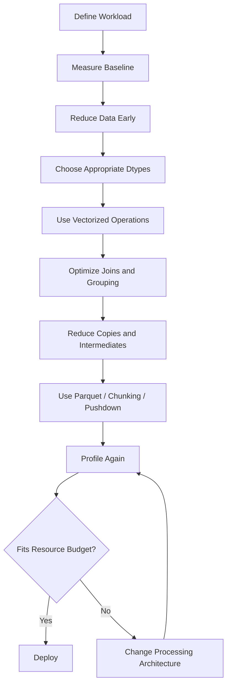
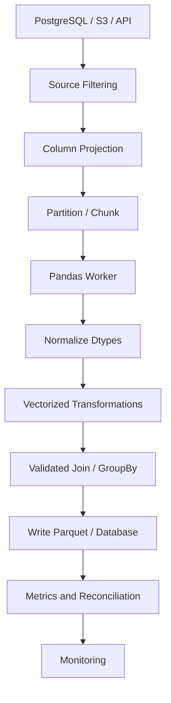

# 15- Pandas Performance

## Overview

Pandas is highly effective for in-memory tabular processing, but performance depends heavily on how data is represented and how operations are composed.

For backend and data-engineering workloads, performance problems usually come from:

- unnecessary data movement
- excessive memory consumption
- Python-level loops
- repeated DataFrame copies
- inefficient joins
- avoidable type conversions
- loading more data than required
- repeated concatenation
- high-cardinality operations
- performing database work after transferring data into Pandas
- forcing workloads beyond Pandas' in-memory execution model

The goal is not to make every Pandas expression micro-optimized. The goal is to build a pipeline that minimizes:

```text
rows moved
columns loaded
objects allocated
Python-level work
intermediate copies
unnecessary serialization
peak memory
```

A practical optimization workflow is:



The central engineering principle is:

> Measure first, remove unnecessary work second, and change architecture when the workload no longer fits Pandas' execution model.

---

## Pandas Execution Model

A DataFrame is an in-memory tabular structure composed of:

```text
rows
columns
indexes
dtypes
underlying arrays
metadata
```

Most Pandas operations create a new result rather than mutating the original object.

For example:

```python
filtered = orders.loc[
    orders["status"].eq("completed")
]
```

The original DataFrame remains unchanged.

This is convenient for composability but can increase:

```text
CPU
memory
allocation
garbage collection pressure
```

when large intermediate DataFrames are repeatedly created.

---

## Why Performance Problems Become Expensive

Consider:

```text
20 million rows
40 columns
multiple transformations
several joins
multiple temporary DataFrames
```

A seemingly simple:

```python
df = df.copy()
```

may duplicate a substantial amount of memory.

Likewise:

```python
filtered = df.loc[mask]
sorted_df = filtered.sort_values("created_at")
joined = sorted_df.merge(customers, ...)
```

may create several large intermediate objects.

The performance question is therefore not only:

```text
How fast is this operation?
```

but also:

```text
How much data does this operation make Pandas materialize?
```

---

## Performance Hierarchy

When optimizing a Pandas pipeline, prefer improvements in roughly this order:

| Priority | Optimization | Typical impact |
|---|---|---|
| 1 | Reduce data at source | Very high |
| 2 | Read only required columns | Very high |
| 3 | Use efficient formats such as Parquet | Very high |
| 4 | Reduce rows early | Very high |
| 5 | Choose appropriate dtypes | High |
| 6 | Vectorize transformations | High |
| 7 | Optimize joins/grouping | High |
| 8 | Avoid unnecessary copies | Medium to high |
| 9 | Reduce Python function calls | Medium |
| 10 | Micro-optimize expressions | Usually low |

The largest optimization is often:

```text
do less work
```

rather than:

```text
do the same work faster
```

---

## Measure Before Optimizing

Start with a baseline.

Measure:

```text
wall-clock time
CPU time
peak memory
input rows
output rows
input columns
output columns
```

A simple timing pattern:

```python
from time import perf_counter

start = perf_counter()

result = transform_orders(orders)

elapsed = perf_counter() - start

print(f"elapsed_seconds={elapsed:.3f}")
```

For production jobs, use structured metrics instead of `print()`.

---

## `%timeit` for Local Benchmarking

In a notebook, `%timeit` is useful for comparing small expressions:

```python
%timeit orders["amount"] * 1.18
```

Compare alternatives:

```python
%timeit orders["amount"].apply(lambda value: value * 1.18)
%timeit orders["amount"] * 1.18
```

The benchmark should use realistic data volume.

A transformation that is faster on:

```text
10,000 rows
```

may behave differently on:

```text
20 million rows
```

---

## Profiling a Complete Pipeline

For CPU-heavy Python code:

```bash
python -m cProfile -s cumulative scripts/run_pipeline.py
```

This can reveal whether time is actually being spent in:

```text
Pandas
Python functions
JSON parsing
database calls
serialization
application logic
```

The correct optimization target should come from measurements rather than intuition.

---

## Line-Level Profiling

For functions with multiple expensive stages, line-level profiling can identify the dominant step.

The exact profiling tool should match the environment, but the principle is:

```text
coarse profile
→
identify hotspot
→
measure focused operation
→
optimize
→
re-measure
```

Do not optimize every line equally.

---

## Memory Measurement

Use:

```python
memory = df.memory_usage(
    deep=True
)

print(memory)
print(memory.sum())
```

`deep=True` provides a more informative measurement for object-backed values such as strings.

For a DataFrame:

```python
total_mb = (
    df.memory_usage(
        deep=True
    ).sum()
    / 1024**2
)

print(f"{total_mb:.2f} MB")
```

Track both:

```text
DataFrame size
peak process memory
```

because intermediate objects may make peak memory much larger than the final DataFrame.

---

## Why Peak Memory Matters

Suppose:

```text
input = 4 GB
intermediate join = 5 GB
result = 3 GB
```

The final result being only 3 GB does not mean a 4 GB worker is sufficient.

The process may temporarily require substantially more memory.

In Kubernetes, this can cause:

```text
container OOM kill
pod restart
job failure
partial pipeline execution
```

Memory sizing must therefore account for peak working-set requirements.

---

## Reduce Columns Early

If only three columns are required, do not read forty.

Prefer:

```python
orders = pd.read_parquet(
    "orders.parquet",
    columns=[
        "order_id",
        "customer_id",
        "amount",
    ],
)
```

This reduces:

```text
disk I/O
network I/O
decompression work
memory
CPU
```

Column projection is one of the highest-value optimizations for analytical data.

---

## SQL Projection

The same principle applies to PostgreSQL:

```sql
SELECT
    order_id,
    customer_id,
    amount
FROM orders
WHERE created_at >= %(start)s;
```

Avoid:

```sql
SELECT *
```

when only a small subset of columns is needed.

The database should avoid sending data that Pandas never uses.

---

## Filter Early

Suppose the pipeline only needs completed orders from the current month.

Prefer:

```text
source
→ filter
→ Pandas
```

over:

```text
source
→ Pandas
→ filter
```

For SQL:

```sql
SELECT
    order_id,
    customer_id,
    amount
FROM orders
WHERE status = 'completed'
  AND created_at >= %(start)s
  AND created_at < %(end)s;
```

For Parquet, use tools and storage layouts that support predicate and partition pruning where possible.

---

## Predicate Pushdown

Predicate pushdown means filtering happens as close to the storage system as possible.

Conceptually:

```text
without pushdown

S3 / PostgreSQL
      ↓
all rows
      ↓
Pandas
      ↓
filter


with pushdown

S3 / PostgreSQL
      ↓
relevant rows
      ↓
Pandas
```

This can reduce data transfer and memory consumption dramatically.

---

## Query Pushdown vs Pandas Filtering

Suppose:

```python
orders = pd.read_sql(
    """
    SELECT *
    FROM orders
    """,
    connection,
)

orders = orders.loc[
    orders["status"].eq("completed")
]
```

Prefer:

```python
orders = pd.read_sql(
    """
    SELECT
        order_id,
        customer_id,
        amount
    FROM orders
    WHERE status = %(status)s
    """,
    connection,
    params={
        "status": "completed",
    },
)
```

The database is optimized for filtering and can use indexes and query planning.

---

## Avoid `SELECT *`

`SELECT *` makes it easy for a schema change to unexpectedly increase data volume.

Explicit projection:

```sql
SELECT
    order_id,
    customer_id,
    amount
FROM orders;
```

provides:

```text
lower transfer cost
stable contracts
better memory use
clearer intent
```

---

## Read Efficiently from Parquet

Parquet is usually preferable to CSV for typed analytical workloads.

Example:

```python
orders = pd.read_parquet(
    "orders.parquet",
    columns=[
        "order_id",
        "created_at",
        "amount",
    ],
)
```

Benefits include:

```text
column pruning
typed storage
columnar compression
smaller I/O footprint
```

CSV generally requires more parsing and does not provide the same columnar access model.

---

## CSV Performance

CSV remains useful for interoperability but is relatively expensive for large analytical workloads because values must be parsed from text.

For repeated internal processing:

```text
CSV
→ convert once
→ Parquet
→ use Parquet downstream
```

This avoids reparsing the same text repeatedly.

---

## Avoid Reading Unnecessary Files

If data is partitioned:

```text
orders/
    year=2025/
    year=2026/
```

do not scan the entire directory when only 2026 is required.

Use the storage/query layer to restrict the input set before materialization.

Partitioning strategy should follow common access patterns rather than creating arbitrary high-cardinality partitions.

---

## Dtype Optimization

Dtypes affect:

```text
memory
comparison speed
grouping
serialization
arithmetic
```

For example:

```python
orders["status"] = (
    orders["status"]
    .astype("category")
)
```

can be useful when:

```text
status has few unique values
```

such as:

```text
pending
completed
cancelled
```

---

## Category vs String

Suppose a column contains:

```text
20 million rows
```

but only:

```text
5 unique statuses
```

A categorical representation can significantly reduce repeated storage.

Use categories for:

```text
low-cardinality dimensions
```

such as:

```text
status
country_code
region
product_type
```

Avoid blindly converting high-cardinality identifiers such as:

```text
UUID
order_id
request_id
```

to category.

---

## Numeric Dtypes

Choose numeric dtypes according to actual value ranges.

For example:

```python
df["quantity"] = pd.to_numeric(
    df["quantity"],
    downcast="integer",
)
```

and:

```python
df["amount"] = pd.to_numeric(
    df["amount"],
    downcast="float",
)
```

Benchmark before relying on downcasting in business-critical financial pipelines.

For monetary data, decimal semantics may be more important than minimizing a few bytes.

---

## Avoid Unnecessary Object Dtypes

`object` is a generic container dtype and can carry Python objects with substantial overhead.

Use semantic dtypes such as:

```text
string
Int64
boolean
datetime64
category
```

when appropriate.

Explicit dtypes make both performance and correctness more predictable.

---

## Missing Values and Dtypes

Nullable dtypes can preserve missing values without forcing a column into a less specific representation.

Example:

```python
df["customer_count"] = (
    df["customer_count"]
    .astype("Int64")
)
```

This supports:

```text
integer values
+
missing values
```

without requiring floating-point representation solely because of nulls.

---

## Vectorization

Vectorization means expressing operations over entire Series or arrays rather than repeatedly invoking Python code for individual rows.

Prefer:

```python
orders["net_amount"] = (
    orders["gross_amount"]
    - orders["discount"]
)
```

over:

```python
orders["net_amount"] = orders.apply(
    lambda row: (
        row["gross_amount"]
        - row["discount"]
    ),
    axis=1,
)
```

The vectorized form is generally simpler and avoids Python-level per-row function calls.

---

## Prefer Native Pandas Operations

Use:

```python
orders["status"].eq("completed")
```

instead of:

```python
orders["status"].apply(
    lambda value: value == "completed"
)
```

Use:

```python
orders["amount"] * 1.18
```

instead of:

```python
orders["amount"].apply(
    lambda value: value * 1.18
)
```

Use:

```python
orders["status"].str.lower()
```

instead of:

```python
orders["status"].apply(
    lambda value: value.lower()
)
```

where the Pandas-native operation expresses the transformation.

---

## `apply()` Performance

`apply()` is not always wrong, but it often invokes Python functions repeatedly.

Use it when:

```text
the operation cannot reasonably be expressed using native/vectorized operations
```

Avoid it by default for operations that have native equivalents.

A practical decision rule:

```text
native operation available?
    → use it

simple NumPy/Pandas expression?
    → use it

complex Python-only transformation unavoidable?
    → consider apply()

row-wise apply for large data?
    → scrutinize carefully
```

---

## Row-Wise `apply(axis=1)`

This is often one of the first performance problems in Pandas applications.

Example:

```python
orders["priority"] = orders.apply(
    determine_priority,
    axis=1,
)
```

The function executes for each row.

For millions of rows, this can become expensive.

Look for alternatives using:

```text
boolean masks
np.select
where
map
merge
groupby
vectorized arithmetic
```

---

## Replace Row-Wise Logic with `np.select`

Instead of:

```python
def priority(row):
    if row["amount"] >= 10000:
        return "high"

    if row["amount"] >= 5000:
        return "medium"

    return "low"
```

prefer:

```python
import numpy as np

orders["priority"] = np.select(
    [
        orders["amount"] >= 10_000,
        orders["amount"] >= 5_000,
    ],
    [
        "high",
        "medium",
    ],
    default="low",
)
```

This keeps the decision logic array-oriented.

---

## Boolean Masks

Prefer:

```python
high_value = orders.loc[
    orders["amount"].ge(10_000)
]
```

over:

```python
high_value = orders[
    orders["amount"].apply(
        lambda value: value >= 10_000
    )
]
```

The mask is clearer and avoids Python-level calls for each record.

---

## Method Chains

Readable method chains can reduce unnecessary intermediate names:

```python
result = (
    orders
    .loc[
        orders["status"].eq("completed"),
        [
            "order_id",
            "customer_id",
            "amount",
        ],
    ]
    .assign(
        tax=lambda df: df["amount"] * 0.18
    )
)
```

However, chaining is not automatically faster.

The primary benefits are:

```text
clarity
explicit transformation order
fewer accidental mutations
```

Performance must still be measured.

---

## Avoid Excessive Copies

This pattern may create multiple intermediate objects:

```python
result = df.copy()
result = result[columns]
result = result[result["status"].eq("completed")]
result = result.sort_values("created_at")
```

Sometimes this is justified for correctness and clarity.

But on very large datasets, inspect whether all copies are necessary.

A more focused expression may be:

```python
result = (
    df.loc[
        df["status"].eq("completed"),
        columns,
    ]
    .sort_values("created_at")
)
```

Do not remove copies blindly. Correct ownership and mutation semantics matter more than saving an allocation in a small DataFrame.

---

## Copy vs View

Pandas indexing behavior depends on the operation and version-specific internals.

Modern Pandas can use copy-on-write semantics depending on configuration and version, but developers should not build critical performance assumptions around undocumented memory-sharing behavior.

The safe rule is:

```text
Need independent ownership?
→ make it explicit

Need read-only transformation?
→ avoid unnecessary copies

Need in-place mutation?
→ understand the object being modified
```

Use:

```python
result = df.copy()
```

when ownership must be explicit.

---

## Avoid Chained Assignment

Avoid:

```python
df[df["status"].eq("completed")]["amount"] = 0
```

This is both a correctness concern and a source of unclear copy/view behavior.

Prefer:

```python
mask = df["status"].eq("completed")

df.loc[
    mask,
    "amount",
] = 0
```

This is explicit and avoids ambiguous assignment.

---

## Efficient Filtering

Filter as early as practical:

```python
orders = orders.loc[
    orders["created_at"].ge(start)
    & orders["created_at"].lt(end)
    & orders["status"].eq("completed")
]
```

Then perform expensive:

```text
joins
groupbys
sorting
pivoting
```

on the smaller dataset.

---

## Column Projection Before Expensive Operations

If a later operation only needs:

```python
required = [
    "order_id",
    "customer_id",
    "amount",
]
```

project first:

```python
orders = orders.loc[
    :,
    required,
]
```

Then run the expensive transformations.

This reduces the amount of data carried through the pipeline.

---

## Efficient Sorting

Sorting is expensive because it generally requires reorganizing the data.

Avoid sorting unless required.

Bad pattern:

```python
orders = orders.sort_values("created_at")

orders = orders.loc[
    orders["status"].eq("completed")
]
```

If sorting is not needed for filtering, filter first:

```python
orders = orders.loc[
    orders["status"].eq("completed")
]

orders = orders.sort_values(
    "created_at"
)
```

The second operation sorts fewer rows.

---

## `sort_values()` and Top-N

If you only need a few extreme values, consider:

```python
top_orders = orders.nlargest(
    100,
    "amount",
)
```

rather than:

```python
top_orders = (
    orders
    .sort_values(
        "amount",
        ascending=False,
    )
    .head(100)
)
```

The specialized operation can avoid fully sorting data when only the top records are required.

Use the equivalent specialized method where its semantics fit the workload.

---

## GroupBy Performance

Grouping is often a major cost in data-processing workloads.

Use:

```python
daily = (
    orders
    .groupby(
        "customer_id",
        observed=True,
    )
    .agg(
        revenue=("amount", "sum"),
        order_count=("order_id", "nunique"),
    )
)
```

Prefer named aggregation over repeatedly materializing separate groupby results.

---

## Group Only Required Columns

Avoid carrying unnecessary columns through a grouping operation when practical.

Instead of:

```python
grouped = (
    orders
    .groupby("customer_id")
    .sum()
)
```

prefer:

```python
grouped = (
    orders
    .groupby("customer_id")
    .agg(
        revenue=("amount", "sum"),
        order_count=("order_id", "nunique"),
    )
)
```

This makes both semantics and output schema explicit.

---

## Categorical Grouping

For low-cardinality categorical dimensions:

```python
orders["status"] = (
    orders["status"]
    .astype("category")
)

summary = (
    orders
    .groupby(
        "status",
        observed=True,
    )
    .agg(
        revenue=("amount", "sum"),
    )
)
```

`observed=True` can avoid unnecessary combinations for categorical grouping.

Use this when the categorical representation matches the workload.

---

## Avoid Python Functions Inside GroupBy

This:

```python
result = (
    orders
    .groupby("customer_id")
    .apply(custom_python_function)
)
```

may become expensive because complex Python code executes for groups.

Prefer:

```text
built-in aggregations
transform
vectorized expressions
merge
rank
window-like operations
```

where the business logic permits.

---

## Efficient Joins

Joins can dominate memory and runtime.

Before a join:

```text
filter
project
normalize key dtype
validate cardinality
```

Example:

```python
orders = orders.loc[
    orders["status"].eq("completed"),
    [
        "order_id",
        "customer_id",
        "amount",
    ],
]

customers = customers.loc[
    :,
    [
        "customer_id",
        "country",
    ],
]
```

Then:

```python
enriched = orders.merge(
    customers,
    on="customer_id",
    how="left",
    validate="many_to_one",
)
```

---

## Join Cardinality

Incorrect cardinality can cause severe row explosion.

Suppose:

```text
orders = 10 million rows
customers = 1 million rows
```

A valid many-to-one relationship should keep the output near the order count.

But an accidental many-to-many join can generate dramatically more rows.

Use:

```python
validate="many_to_one"
```

when the business relationship requires it.

This protects both correctness and resource usage.

---

## Indexing Join Keys

Pandas does not operate like a traditional database query planner, and adding an index is not automatically an optimization for every merge.

Do not create indexes merely because database systems commonly use indexes.

Benchmark the actual workload.

Use index-based operations when the data model and repeated access pattern justify them.

---

## Merge vs Join Performance

For many workflows:

```python
left.merge(
    right,
    on="customer_id",
)
```

is clearer than constructing an index solely to perform:

```python
left.join(right)
```

Choose the representation that minimizes unnecessary transformations.

Creating an index and later resetting it can itself create work and memory overhead.

---

## Avoid Repeated Joins

If the pipeline repeatedly joins the same dimension table:

```text
orders
→ customers
→ products
→ regions
→ currencies
```

consider whether:

```text
dimensions can be normalized once
```

or:

```text
source-side SQL can perform enrichment
```

Do not repeatedly recreate the same large intermediate tables.

---

## Concat Performance

Avoid:

```python
result = pd.DataFrame()

for batch in batches:
    result = pd.concat(
        [result, batch],
        ignore_index=True,
    )
```

Prefer:

```python
result = pd.concat(
    batches,
    ignore_index=True,
)
```

for bounded collections.

Repeated concatenation can repeatedly rebuild the growing DataFrame.

---

## Incremental Persistence

For large inputs, the best optimization may be to avoid concatenating them at all.

Instead:

```text
batch
→ validate
→ transform
→ write
→ release memory
```

For example:

```python
for chunk in pd.read_csv(
    "events.csv",
    chunksize=100_000,
):
    processed = transform(chunk)
    write_partition(processed)
```

This changes the memory requirement from:

```text
entire dataset
```

to approximately:

```text
largest active batch
```

plus processing overhead.

---

## Chunked CSV Processing

Example:

```python
for chunk in pd.read_csv(
    "orders.csv",
    chunksize=100_000,
    usecols=[
        "order_id",
        "customer_id",
        "created_at",
        "amount",
    ],
):
    chunk["created_at"] = pd.to_datetime(
        chunk["created_at"],
        utc=True,
        errors="coerce",
    )

    chunk["amount"] = pd.to_numeric(
        chunk["amount"],
        errors="coerce",
    )

    process_chunk(chunk)
```

This is one of the simplest ways to keep memory bounded.

---

## The Limitation of Chunking

Chunking does not automatically solve operations requiring global state.

Examples:

```text
global exact deduplication
global sort
exact global median
many-to-many joins across all batches
```

A correct chunked implementation may require:

```text
external state
partition-aware algorithms
database support
external sorting
distributed processing
```

Do not assume:

```text
chunksize
=
automatic scalability
```

---

## Incremental Aggregation

Some aggregations are naturally composable across batches.

For example:

```text
sum
count
min
max
```

can often be updated incrementally.

For average:

```text
global_sum
global_count
→
global_mean
```

rather than averaging batch means without weighting.

For example:

```python
total_revenue = 0.0
total_orders = 0

for chunk in read_chunks():
    total_revenue += chunk["amount"].sum()
    total_orders += len(chunk)

mean_order_value = (
    total_revenue / total_orders
)
```

The important point is that the incremental state must preserve enough information to compute the exact final result.

---

## Stateful Operations

Some operations require more state:

```text
median
quantiles
exact global rank
full deduplication
global sorting
```

These often require either:

```text
all data
```

or:

```text
specialized algorithms / external systems
```

Choose the architecture based on the operation's mathematical requirements.

---

## Parquet for Performance

For repeated processing, convert raw text sources:

```text
CSV
JSON
Excel
```

into:

```text
Parquet
```

when an analytical columnar format fits the workload.

Then downstream jobs can:

```text
read selected columns
read selected partitions
avoid repeated text parsing
benefit from compression
```

Example:

```python
orders.to_parquet(
    "processed/orders.parquet",
    index=False,
)
```

---

## Partitioned Parquet

A large dataset might be organized by:

```text
orders/
    year=2026/
        month=01/
        month=02/
        month=03/
```

This allows jobs to process only relevant partitions.

Partition on columns that frequently appear in filters and have sensible cardinality.

Do not partition by:

```text
order_id
request_id
customer_id
```

when those values are extremely high-cardinality and would create huge numbers of tiny files.

---

## Small Files Problem

Partitioning can become counterproductive when it produces thousands or millions of tiny Parquet files.

This creates overhead in:

```text
object-store metadata
file listing
connection setup
task scheduling
compression
management
```

Prefer reasonably sized files based on the query engine and storage platform.

---

## Parquet Compression

Compression reduces storage and I/O but consumes CPU during encoding and decoding.

The correct compression strategy depends on:

```text
CPU availability
storage cost
read frequency
write frequency
data entropy
```

For analytics workloads, the reduction in I/O often makes compressed columnar storage worthwhile.

---

## Predicate Pushdown with Parquet

When the downstream engine supports it, filtering on columns that can be pruned at read time is substantially cheaper than:

```text
read everything
→
filter in Python
```

Example conceptually:

```text
S3 Parquet
    ↓
partition pruning / row-group pruning
    ↓
relevant records
    ↓
Pandas
```

This is one reason Pandas should be treated as part of a larger data architecture rather than the entire storage engine.

---

## Use Databases for Database Work

PostgreSQL is generally better suited to:

```text
indexed filtering
joins
aggregation
constraint enforcement
concurrency
transactional storage
```

Pandas is better suited to:

```text
in-memory transformation
local analytical workflows
ETL steps
data cleaning
report generation
bounded batch processing
```

Use each system for what it does well.

---

## SQL + Pandas Division of Labor

A useful pattern:

```text
PostgreSQL
→ filter
→ join
→ aggregate

Pandas
→ validate
→ reshape
→ specialized transformation
→ reporting
```

Do not transfer millions of rows to Pandas merely because the final result happens to be a DataFrame.

---

## REST API Performance

Avoid API endpoints that do:

```text
database
→ fetch millions of rows
→ Pandas DataFrame
→ full transformation
→ response
```

inside a synchronous request.

Prefer:

```text
request
→ validate filters
→ bounded query
→ bounded Pandas transformation
→ response
```

or:

```text
request
→ enqueue Celery task
→ process asynchronously
→ store result
→ return job status
```

for expensive workloads.

---

## FastAPI and Pandas

Pandas workloads are often CPU- and memory-intensive.

A FastAPI worker should not be assumed to scale like a lightweight async I/O handler when every request performs large DataFrame operations.

Separate concerns:

```text
FastAPI
→ validation
→ orchestration

Celery / worker
→ heavy Pandas processing
```

when job duration and memory usage justify it.

---

## Concurrency Considerations

Pandas operations are not a replacement for a concurrency architecture.

For CPU-heavy transformations:

```text
more threads
```

do not necessarily provide proportional throughput improvements because Python-level work and underlying libraries have different threading behavior.

For production systems, prefer:

```text
multiple worker processes
batch parallelism
distributed execution
database parallelism
```

where appropriate.

Benchmark the actual operation because native numerical code may use parallel execution differently from Python callbacks.

---

## Kubernetes Resource Sizing

A Pandas worker should have explicit:

```text
CPU requests
CPU limits
memory requests
memory limits
```

Example:

```yaml
resources:
  requests:
    cpu: "1"
    memory: "4Gi"
  limits:
    cpu: "2"
    memory: "8Gi"
```

The correct values must come from measurements.

Memory limits should include headroom for:

```text
DataFrame allocations
intermediate objects
Python runtime
libraries
serialization
temporary buffers
```

---

## OOM Failures

A worker can exceed its container memory limit even when:

```python
df.memory_usage(
    deep=True
).sum()
```

looks acceptable.

Reasons include:

```text
temporary DataFrames
join expansion
sort buffers
Python objects
Arrow buffers
serialization
allocator fragmentation
```

Monitor actual process RSS or container memory metrics.

---

## Avoiding Memory Spikes

Useful techniques include:

```text
filter early
project columns early
use efficient dtypes
avoid unnecessary copies
avoid repeated concat
process chunks
drop temporary references
write partitions incrementally
```

For example:

```python
large_intermediate = build_intermediate(
    orders
)

result = transform(
    large_intermediate
)

del large_intermediate
```

Explicit deletion can help release references, but it should not be used as a substitute for sound pipeline design.

---

## Garbage Collection

Python uses automatic memory management, but freeing Python references does not mean memory is always immediately returned to the operating system.

Do not rely on:

```python
import gc
gc.collect()
```

as the primary performance strategy.

If a pipeline repeatedly requires manual garbage collection to remain within limits, redesign the allocation pattern.

---

## Avoid Materializing Unnecessary Representations

This can be expensive:

```text
DataFrame
→ list of dictionaries
→ JSON string
→ DataFrame
```

Likewise:

```python
records = df.to_dict(
    orient="records"
)
```

creates Python objects for every row.

Avoid converting large DataFrames into Python object graphs unless a downstream API genuinely requires them.

---

## Serialization Costs

For large outputs:

```text
JSON
```

can be substantially more expensive than:

```text
Parquet
Arrow
other columnar formats
```

depending on the consumer.

Choose the interchange format based on:

```text
consumer
size
latency
schema
compatibility
```

rather than habit.

---

## Avoid `iterrows()`

Avoid:

```python
for _, row in orders.iterrows():
    process(row)
```

for bulk transformations.

It is:

```text
Python-level iteration
slow
dtype-unfriendly
harder to scale
```

Use vectorized operations or process at the batch level.

---

## `itertuples()` as a Last Resort

When row-by-row Python iteration is genuinely unavoidable:

```python
for row in orders.itertuples(
    index=False
):
    process(row)
```

is generally preferable to `iterrows()` for iteration performance and dtype preservation.

But this is still Python-level iteration.

The preferred hierarchy remains:

```text
vectorized operation
→
batch operation
→
specialized Pandas/NumPy operation
→
Python iteration only when necessary
```

---

## Avoid Excessive `apply(axis=1)`

A common rewrite:

```python
orders["risk"] = orders.apply(
    lambda row: calculate_risk(
        row["amount"],
        row["country"],
    ),
    axis=1,
)
```

may become:

```python
high_amount = orders["amount"].ge(
    10_000
)

restricted_country = orders[
    "country"
].isin(restricted_countries)

orders["risk"] = np.select(
    [
        high_amount & restricted_country,
        high_amount,
    ],
    [
        "critical",
        "high",
    ],
    default="normal",
)
```

The exact replacement depends on the business logic, but vectorizable conditions should remain vectorized.

---

## Efficient String Operations

Avoid:

```python
df["status"].apply(
    lambda value: value.strip().lower()
)
```

Prefer:

```python
df["status"] = (
    df["status"]
    .astype("string")
    .str.strip()
    .str.lower()
)
```

For large text workloads, also consider whether:

```text
normalization
tokenization
regex processing
```

belongs in Pandas at all.

Sometimes a source system or database is better positioned to perform preprocessing.

---

## Efficient Datetime Operations

Parse once:

```python
df["created_at"] = pd.to_datetime(
    df["created_at"],
    utc=True,
    errors="raise",
)
```

Then reuse:

```python
df["date"] = (
    df["created_at"]
    .dt.normalize()
)
```

Avoid repeated:

```python
pd.to_datetime(
    df["created_at"]
)
```

throughout the pipeline.

---

## Cache Stable Derived Data

If a dataset is immutable for a given processing period, consider producing reusable derived artifacts:

```text
raw Parquet
→ normalized Parquet
→ enriched Parquet
→ report
```

This prevents every downstream job from repeating expensive:

```text
parsing
normalization
joining
cleaning
```

The trade-off is additional storage and pipeline complexity.

---

## Benchmark Real Workloads

A useful benchmark should vary:

```text
row count
column count
cardinality
null rate
string length
join selectivity
group cardinality
```

For example:

```text
100k rows
1M rows
10M rows
50M rows
```

A technique that works well at 100k rows may not be appropriate at 50M.

---

## Benchmark Correctness Too

Never optimize by changing semantics accidentally.

For every performance optimization, verify:

```text
same row count
same schema
same dtypes where required
same null semantics
same totals
same business results
```

Use tests to compare optimized and baseline outputs.

---

## Performance Regression Tests

A benchmark can be incorporated into CI for critical transformations.

Example:

```python
def test_transformation_row_count(
    processed_orders: pd.DataFrame,
) -> None:
    assert len(processed_orders) > 0
    assert processed_orders["order_id"].is_unique
```

For time-sensitive performance tests, use broad thresholds rather than fragile exact timings because CI environments vary.

---

## Data Quality as a Performance Concern

Poor data quality can increase processing cost.

Examples:

```text
unexpectedly long strings
high-cardinality categories
duplicate records
invalid joins
schema drift
massive null expansions
```

A many-to-many join caused by duplicate keys is both:

```text
a correctness bug
+
a performance incident
```

Data validation is therefore part of performance engineering.

---

## Join Explosion Example

Suppose:

```text
orders:
10 million rows

customers:
1 million rows
```

If `customer_id` is unique in customers, a many-to-one join is bounded.

If the customer table accidentally contains:

```text
5 duplicate rows per customer
```

the join may increase output size dramatically.

Protect the operation:

```python
orders.merge(
    customers,
    on="customer_id",
    how="left",
    validate="many_to_one",
)
```

This can prevent an otherwise expensive failure.

---

## Group Cardinality

Grouping by a high-cardinality key such as:

```text
request_id
UUID
event_id
```

can create many groups with little aggregation benefit.

Before a groupby, ask:

```text
How many distinct groups?
How large is each group?
Is this aggregation necessary?
Can it be pushed into SQL?
```

High-cardinality operations can consume both CPU and memory.

---

## Wide DataFrames

A DataFrame with thousands of columns can create overhead in:

```text
selection
serialization
alignment
reshaping
memory usage
```

Wide representations are often appropriate for:

```text
final reports
model features
small analytical summaries
```

but not necessarily for:

```text
raw event storage
transactional data
large ETL staging tables
```

---

## Long vs Wide for Performance

Long data is often easier to manipulate generically:

```text
entity
metric
value
```

Wide data can be faster for certain matrix-style operations but may dramatically increase dimensionality.

Choose the representation according to:

```text
workload
consumer
operation
cardinality
memory
```

not just familiarity.

---

## Large Dataset Decision Boundary

A practical decision process:

```text
Does the dataset fit comfortably in memory?
        |
       yes
        ↓
Pandas is a strong option

        |
       no
        ↓
Can the workload be chunked?
        |
   yes          no
    ↓            ↓
chunked       external engine
Pandas        / database /
              distributed system
```

The key word is:

```text
comfortably
```

A dataset that technically fits in RAM but leaves almost no headroom is not a stable production workload.

---

## When Pandas Stops Being the Right Tool

Consider alternatives when:

```text
dataset exceeds safe memory
global operations require external state
multiple workers must process one large dataset
continuous streaming is required
query concurrency is high
latency requirements are strict
```

Potential alternatives include:

```text
PostgreSQL
DuckDB
Polars
Spark
Dask
distributed query engines
AWS Glue
Athena
warehouse engines
```

The right choice depends on the workload rather than a generic "Pandas is slow" assumption.

---

## Pandas vs SQL

| Workload | Prefer |
|---|---|
| indexed filtering | PostgreSQL |
| relational joins over large tables | PostgreSQL |
| transactional consistency | PostgreSQL |
| bounded in-memory transformation | Pandas |
| report reshaping | Pandas |
| data cleaning during ETL | Pandas |
| large aggregate over database tables | PostgreSQL / warehouse |
| reusable analytical dataset | Parquet / warehouse |
| millions of rows exceeding worker memory | external engine |

---

## Pandas vs Polars

Polars can be a useful alternative when the workload is primarily DataFrame-style processing but needs stronger performance characteristics or a different execution model.

Consider:

```text
Pandas
→ mature ecosystem
→ broad compatibility
→ familiar API
→ excellent for many moderate workloads

Polars
→ different execution model
→ strong performance focus
→ lazy execution capabilities
→ alternative API semantics
```

Benchmark the actual workload before migrating.

A faster engine does not automatically solve a poorly designed data flow.

---

## Pandas vs Spark

Spark becomes relevant when the workload requires:

```text
distributed execution
large-scale datasets
cluster-level parallelism
fault-tolerant distributed processing
```

Do not move a 5 GB job to Spark merely because Spark is "more scalable" if a simple Pandas pipeline is easier and cheaper.

Architecture should match workload requirements.

---

## Redis and Pandas

Redis is not a replacement for DataFrame processing.

Use Redis for:

```text
cache
coordination
short-lived state
rate limiting
queues
```

Use Pandas for:

```text
tabular transformation
batch analytics
ETL
reporting
```

A reporting architecture may use Redis to cache the result of an expensive Pandas job, rather than trying to store the working DataFrame itself in Redis.

---

## Kafka and Pandas

Kafka is designed for event streaming.

Pandas is designed for batch/in-memory tabular processing.

A useful architecture is:

```text
Kafka
 ↓
consumer
 ↓
micro-batch
 ↓
Pandas
 ↓
validate / aggregate
 ↓
Parquet / database
```

For true high-throughput continuous streaming, a specialized streaming processor may be a better fit than repeatedly constructing large Pandas DataFrames.

---

## Celery and Pandas

Celery can isolate expensive processing from synchronous request handling.

Example flow:

```text
FastAPI
    ↓
enqueue job
    ↓
Celery worker
    ↓
Pandas processing
    ↓
S3 / PostgreSQL
    ↓
job status
```

This improves API responsiveness but does not eliminate the underlying CPU or memory cost.

Workers still need resource isolation and monitoring.

---

## AWS Architecture

For recurring large ETL jobs:


A key optimization is to avoid forcing a single Pandas worker to process the entire raw lake when upstream systems can perform:

```text
partition pruning
column pruning
predicate pushdown
aggregation
```

---

## Cost Optimization

Performance and cost are closely related.

Reduce:

```text
bytes read
bytes transferred
CPU time
memory allocated
job duration
retries
```

A cheaper design may be:

```text
aggregate in PostgreSQL
→
send 100 MB
→
Pandas report
```

instead of:

```text
send 10 GB
→
Pandas filter and aggregate
```

Even when both produce the same final answer.

---

## Reliability and Retries

A memory-heavy Pandas job may be expensive to retry.

Reduce retry cost by processing partitions:

```text
partition 1 → success
partition 2 → success
partition 3 → failure
```

rather than:

```text
entire dataset → failure
```

Partition-aware processing improves:

```text
recovery
observability
parallelism
idempotency
```

---

## Idempotent Processing

Performance optimizations must not break retry safety.

A batch pipeline should have stable identifiers such as:

```text
source file
partition
batch ID
processing date
```

Write outputs idempotently where possible:

```text
s3://bucket/processed/date=2026-01-15/part-0001.parquet
```

rather than creating duplicate outputs on every retry.

---

## Monitoring

A production Pandas job should monitor:

| Metric | Why it matters |
|---|---|
| input rows | detects source changes |
| output rows | detects filtering/errors |
| processing time | detects regressions |
| peak memory | detects OOM risk |
| CPU utilization | detects CPU bottlenecks |
| input bytes | detects source growth |
| output bytes | tracks result volume |
| join expansion | detects cardinality problems |
| invalid records | detects data-quality issues |
| retries | detects reliability issues |

Performance metrics without data-quality metrics are incomplete.

---

## Alerting

Useful alert conditions include:

```text
processing time > expected threshold
peak memory > safe threshold
input rows increase unexpectedly
output rows drop unexpectedly
join expansion exceeds expected ratio
invalid-record percentage spikes
partition count becomes excessive
```

Alert thresholds should be workload-specific rather than arbitrary.

---

## Performance Regression Detection

A pipeline may silently become slower after:

```text
schema changes
new columns
higher cardinality
new joins
larger source partitions
dependency upgrades
code changes
```

Track historical baselines:

```text
rows/sec
MB/sec
CPU seconds/row
memory GB per million rows
```

Normalized metrics are often more useful than absolute duration alone.

---

## Dependency Upgrades

Pandas, NumPy, PyArrow, and Python upgrades can affect performance.

Before production rollout:

```text
benchmark representative workloads
run correctness tests
measure memory
compare output schemas
```

Do not assume a dependency upgrade is performance-neutral.

---

## Benchmarking Example

```python
from time import perf_counter

def benchmark(
    transform,
    frame,
) -> float:
    start = perf_counter()

    result = transform(frame)

    elapsed = perf_counter() - start

    print(
        {
            "rows": len(frame),
            "columns": len(frame.columns),
            "seconds": elapsed,
        }
    )

    return elapsed
```

For serious benchmarking, isolate:

```text
I/O time
parse time
transformation time
serialization time
```

so the actual bottleneck is visible.

---

## Performance Test Dataset

A meaningful test dataset should include:

```text
realistic row count
realistic column count
realistic cardinality
realistic null rate
realistic string lengths
realistic duplicate patterns
realistic join distributions
```

Synthetic data that is too clean may hide production problems.

---

## Benchmarking Checklist

Before comparing two implementations:

- Use the same input dataset.
- Warm up the code path when appropriate.
- Run multiple iterations.
- Measure wall-clock time.
- Measure memory where important.
- Disable unrelated notebook activity.
- Keep the environment consistent.
- Compare identical output semantics.
- Test at realistic data volumes.

---

## Common Performance Mistakes

### Optimizing Before Measuring

A developer may spend hours optimizing an operation that consumes 2% of runtime.

Measure first.

### Pulling Too Much Data from PostgreSQL

Moving unnecessary rows into Pandas wastes:

```text
network
database resources
memory
CPU
```

### Reading Every Column

Column projection can often provide immediate savings.

### Repeated `concat()`

Repeatedly rebuilding the DataFrame wastes time and memory.

### Row-Wise `apply()`

Python-level callbacks can dominate runtime.

### Excessive Copies

Each large intermediate object increases memory pressure.

### Many-to-Many Joins

Unexpected row explosion is one of the most dangerous Pandas performance mistakes.

### Blind Use of Categories

Categories help low-cardinality columns, not every string field.

### Sorting Unnecessarily

Sorting all rows just to take a small top-N is wasteful.

### Loading Huge CSVs Without Chunking

This creates a predictable memory failure as data volume grows.

### Converting DataFrames to Python Objects

`to_dict()` and similar conversions can multiply memory usage.

### Manual Garbage Collection as a Strategy

`gc.collect()` is not a substitute for a bounded data flow.

### Ignoring Schema Growth

A new column or higher cardinality can change performance characteristics substantially.

### Treating Pandas as a Database

Databases provide query planning, indexes, concurrency control, and storage management that Pandas is not designed to replace.

---

## Interview Traps

### What Is the First Step When Pandas Is Slow?

Measure the workload and identify the actual bottleneck.

### Why Is Filtering Early Important?

It reduces the number of rows passed through subsequent expensive operations.

### Why Should You Avoid `apply(axis=1)`?

It executes Python-level logic per row and can become very expensive on large datasets.

### Why Is `SELECT *` Bad for Pandas Pipelines?

It transfers and materializes columns that may never be used.

### Why Is `category` Useful?

It can reduce memory and improve some operations for low-cardinality repeated values.

### Should Every String Column Be Converted to `category`?

No. High-cardinality strings can reduce or eliminate the benefit.

### Why Is `concat()` in a Loop Inefficient?

The growing DataFrame may be repeatedly copied and rebuilt.

### What Is Predicate Pushdown?

Filtering data in the source/storage engine before it is transferred into Pandas.

### Why Can a Join Cause an OOM Error?

Incorrect cardinality can create a much larger output than either input.

### How Do You Process a CSV Larger Than Memory?

Read it in chunks and process or persist each chunk incrementally.

### Is Pandas Always Faster Than Python Loops?

Pandas-native operations are often faster because they avoid explicit Python-level iteration, but performance depends on the operation and implementation. Benchmark critical workloads.

### When Should You Stop Optimizing Pandas and Change Architecture?

When the workload exceeds safe memory, requires distributed execution, demands global state across huge datasets, or has operational requirements better served by a database or distributed engine.

### Why Is Peak Memory More Important Than Final DataFrame Size?

Intermediate joins, sorts, copies, and buffers can temporarily consume substantially more memory than the final result.

---

## Production Optimization Pattern

A strong pipeline often follows:

```text
1. Push filters to the source
2. Select only required columns
3. Read an efficient storage format
4. Normalize dtypes once
5. Filter early
6. Use vectorized transformations
7. Validate join cardinality
8. Aggregate before expensive reshaping
9. Avoid unnecessary copies
10. Process in chunks when needed
11. Persist incrementally
12. Measure the complete workload
```

Example:

```python
required_columns = [
    "order_id",
    "customer_id",
    "created_at",
    "status",
    "amount",
]

orders = pd.read_parquet(
    "orders.parquet",
    columns=required_columns,
)

orders["created_at"] = pd.to_datetime(
    orders["created_at"],
    utc=True,
    errors="raise",
)

orders["status"] = (
    orders["status"]
    .astype("string")
    .str.strip()
    .str.lower()
)

orders = orders.loc[
    orders["status"].eq("completed")
]

orders["amount"] = pd.to_numeric(
    orders["amount"],
    errors="raise",
)

customers = pd.read_parquet(
    "customers.parquet",
    columns=[
        "customer_id",
        "country",
    ],
)

result = orders.merge(
    customers,
    on="customer_id",
    how="left",
    validate="many_to_one",
)
```

This sequence intentionally reduces data before the expensive join.

---

## Architecture Decision Framework

Use this checklist:

```text
Can the source filter the data?
    ↓
Push it down.

Can the source provide fewer columns?
    ↓
Project them.

Can the file format support efficient reads?
    ↓
Prefer Parquet or another suitable columnar format.

Can the operation be vectorized?
    ↓
Avoid Python loops.

Can the working set fit safely in memory?
    ↓
Use Pandas.

If not:
    ↓
Chunk, partition, push down, or change engines.

Is the operation global and stateful?
    ↓
Evaluate external/distributed processing.

Is the result served synchronously?
    ↓
Bound the work or move it to a worker.
```

---

## Performance-Oriented ETL Architecture



This architecture minimizes the amount of data that reaches the expensive in-memory stage.

---

## Practical Optimization Checklist

Before shipping a large Pandas workload, verify:

- The input dataset size is known.
- The expected peak memory is known.
- Only required columns are loaded.
- Source-side filtering is used where possible.
- Parquet or another efficient format is considered.
- String columns use appropriate dtypes.
- Low-cardinality columns are candidates for `category`.
- Datetime parsing occurs once.
- Vectorized expressions replace avoidable Python loops.
- `apply(axis=1)` has been justified.
- Joins specify expected cardinality.
- Grouping operates on only necessary columns.
- Sorting occurs only when required.
- Top-N uses specialized operations where appropriate.
- Repeated concatenation is avoided.
- Large inputs use chunked or partitioned processing.
- Expensive reports do not block synchronous API workers.
- Peak memory is monitored in production.
- Output correctness is tested against the baseline.
- Performance regressions are measurable.
- An alternative architecture is identified if Pandas reaches its scaling boundary.

---

## Key Takeaways

- The highest-value Pandas optimizations usually come from doing less work: filter and aggregate at the source, project only required columns, and use efficient storage formats.
- Prefer vectorized Pandas and NumPy operations over Python-level row iteration, while treating `apply(axis=1)`, repeated concatenation, unnecessary sorting, and excessive copying as common performance hotspots.
- Memory is a first-class constraint: measure peak usage, validate join cardinality, use appropriate dtypes, process large inputs in bounded batches, and size production workers for intermediate allocations rather than final DataFrame size alone.
- Pandas should complement PostgreSQL, Parquet, object storage, Celery, and distributed processing systems rather than replacing them; push work to the system best suited to that operation.
- Measure realistic workloads before and after optimization, preserve identical business semantics, and move to a different execution architecture when the dataset or operational requirements exceed safe in-memory Pandas processing.