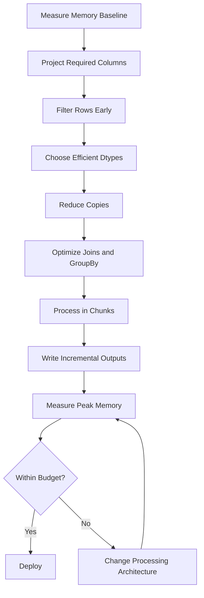

# 16- Memory Optimization

## Overview

Pandas is an in-memory processing library, so memory usage is one of the primary constraints when processing large datasets.

A pipeline can fail even when the input file itself appears manageable because the process may temporarily hold:

```text
raw DataFrame
filtered DataFrame
join result
groupby intermediate state
sorted result
serialized objects
temporary arrays
```

The actual requirement is therefore not:

```text
Can the final DataFrame fit in memory?
```

but:

```text
Can the complete workload fit safely within the worker's peak memory budget?
```

Memory optimization is especially important for:

- ETL jobs
- scheduled reporting
- FastAPI and Django workers
- Celery tasks
- Kubernetes jobs
- AWS batch workloads
- large CSV ingestion
- Parquet processing
- database extracts
- API pagination
- joins and aggregations

A practical memory-optimization strategy is:



The main principle is:

> The most reliable memory optimization is avoiding materialization of data that does not need to exist in memory.

---

## Where Pandas Memory Goes

A DataFrame's memory consumption comes from more than just visible cell values.

Conceptually:

```text
DataFrame
├── column data
├── index
├── dtype metadata
├── object references
├── Python objects
├── temporary arrays
└── intermediate results
```

Memory usage depends heavily on the column dtype.

For example:

```text
int64
float64
datetime64
boolean
category
string
object
```

do not have equivalent memory characteristics.

---

## Measuring DataFrame Memory

Start with:

```python
memory = df.memory_usage(
    deep=True
)

print(memory)

total_bytes = memory.sum()

print(
    f"Total: {total_bytes / 1024**2:.2f} MB"
)
```

The important argument is:

```python
deep=True
```

because object-backed data such as strings can otherwise be undercounted.

---

## Measuring the Index

The DataFrame index consumes memory too:

```python
index_bytes = df.index.memory_usage(
    deep=True
)
```

For ordinary positional data, an unnecessarily complex index can represent avoidable overhead.

For example:

```python
df = df.reset_index(
    drop=True
)
```

may simplify the structure when the existing index has no business meaning.

Do not discard an index that carries semantic information.

---

## DataFrame Memory Is Not Process Memory

This:

```python
df.memory_usage(
    deep=True
).sum()
```

measures the DataFrame's reported memory footprint.

It does not necessarily equal:

```text
entire Python process RSS
```

The process can also consume memory for:

```text
Python runtime
imported libraries
temporary arrays
join buffers
sort operations
serialization
Arrow buffers
allocator overhead
other DataFrames
```

For production systems, monitor process/container memory in addition to DataFrame-level measurements.

---

## Peak Memory vs Final Memory

Suppose:

```text
orders = 3 GB
customers = 1 GB
join result = 3.5 GB
```

The final result may be:

```text
3.5 GB
```

but the process may simultaneously hold:

```text
orders
+
customers
+
temporary join state
+
result
```

Peak usage can therefore exceed:

```text
7 GB
```

or more.

This is why a job can be OOM-killed even when the final output appears small enough.

---

## Object Dtype

`object` is a generic dtype that can reference arbitrary Python objects.

A string column stored as:

```python
dtype="object"
```

can consume significantly more memory than a compact native representation.

Inspect:

```python
df.dtypes
```

and:

```python
df.memory_usage(
    deep=True
)
```

to find expensive columns.

---

## Prefer Semantic Dtypes

Use explicit dtypes where appropriate:

```python
df["status"] = df["status"].astype(
    "string"
)

df["quantity"] = df["quantity"].astype(
    "Int64"
)

df["is_active"] = df["is_active"].astype(
    "boolean"
)
```

This improves:

```text
schema clarity
missing-value semantics
interoperability
memory planning
```

The most memory-efficient dtype is not always the best dtype if it weakens correctness or interoperability.

---

## Nullable Integer Types

Consider:

```python
df["customer_count"] = (
    df["customer_count"]
    .astype("Int64")
)
```

This allows:

```text
integer values
+
missing values
```

without forcing the column into floating-point representation solely because of nulls.

The trade-off is implementation and storage behavior, so benchmark important workloads.

---

## Downcasting Numerics

For suitable data:

```python
df["quantity"] = pd.to_numeric(
    df["quantity"],
    downcast="integer",
)
```

For floating-point data:

```python
df["ratio"] = pd.to_numeric(
    df["ratio"],
    downcast="float",
)
```

This may reduce memory for columns whose actual range does not require:

```text
int64
float64
```

However, downcasting should not be applied blindly to financial or precision-sensitive values.

---

## Integer Range Matters

Before choosing a smaller integer dtype, verify the valid range.

For example:

```text
int8   → -128 to 127
uint8  → 0 to 255
int16  → -32,768 to 32,767
```

A dtype that is too small can overflow or fail validation.

Memory optimization must preserve data correctness.

---

## Floating-Point Precision

Reducing:

```text
float64
→
float32
```

can reduce memory, but also reduces precision.

For:

```text
machine-learning features
sensor measurements
approximate metrics
```

this may be acceptable.

For:

```text
financial calculations
accounting
billing
reconciliation
```

precision requirements should take priority over a modest memory saving.

---

## Boolean Memory Usage

If a column is truly binary:

```python
df["is_active"] = df["is_active"].astype(
    "boolean"
)
```

can be more semantically appropriate than:

```text
0 / 1
"yes" / "no"
True / False stored as generic objects
```

Use the type that matches the contract.

---

## Categorical Data

Categorical data can be highly memory-efficient when a column contains many repeated values but relatively few unique values.

Example:

```python
df["status"] = df["status"].astype(
    "category"
)
```

Good candidates:

```text
status
country_code
region
department
product_type
channel
```

Potentially poor candidates:

```text
order_id
UUID
request_id
event_id
```

because those may have near-unique values.

---

## Why `category` Saves Memory

Suppose:

```text
20 million rows
5 unique statuses
```

Instead of storing the same string repeatedly, Pandas can maintain:

```text
category dictionary
+
compact codes
```

Conceptually:

```text
"pending"   → 0
"completed" → 1
"cancelled" → 2
```

Each row stores a code rather than repeatedly storing the full string representation.

---

## Measuring Category Benefits

Do not guess.

Benchmark before and after:

```python
before = (
    df.memory_usage(
        deep=True
    ).sum()
)

candidate = df["status"].astype(
    "category"
)

after = (
    candidate.memory_usage(
        deep=True
    )
)

print(
    {
        "before_mb": before / 1024**2,
        "column_after_mb": after / 1024**2,
    }
)
```

Measure representative production-like data.

---

## Category Cardinality

A useful mental model is:

```text
low cardinality
+
many rows
=
good category candidate
```

Whereas:

```text
nearly every value unique
=
little or no benefit
```

There is no universal cardinality threshold because actual memory behavior depends on:

```text
string length
number of rows
number of unique values
category metadata
workload
```

---

## String Normalization Before Categorization

If status values contain inconsistent representations:

```text
Completed
completed
 completed
COMPLETED
```

do not categorize before normalization.

Prefer:

```python
df["status"] = (
    df["status"]
    .astype("string")
    .str.strip()
    .str.lower()
    .astype("category")
)
```

Otherwise logically identical values may become separate categories.

---

## String Memory

Long strings can dominate memory.

Inspect:

```python
string_columns = (
    df.select_dtypes(
        include=["object", "string"]
    )
    .columns
)

for column in string_columns:
    memory = df[column].memory_usage(
        deep=True
    )

    print(
        column,
        memory / 1024**2,
        "MB",
    )
```

Large text fields such as:

```text
raw JSON
stack traces
descriptions
user-agent strings
request payloads
```

should not be loaded if they are not required for the transformation.

---

## Column Projection

The most effective memory optimization is often:

```text
read fewer columns
```

For Parquet:

```python
orders = pd.read_parquet(
    "orders.parquet",
    columns=[
        "order_id",
        "customer_id",
        "amount",
    ],
)
```

For SQL:

```sql
SELECT
    order_id,
    customer_id,
    amount
FROM orders;
```

Avoid loading columns that will never participate in the transformation.

---

## Why Column Projection Matters

Suppose a dataset contains:

```text
50 columns
```

but the task needs:

```text
5 columns
```

Reading all 50 columns increases:

```text
I/O
decompression
memory
copying
serialization
```

The best memory optimization may therefore happen before Pandas creates the DataFrame.

---

## Row Filtering Before Expansion

Filter before expensive operations.

Prefer:

```python
orders = orders.loc[
    orders["status"].eq("completed")
]
```

before:

```python
orders.merge(customers, ...)
```

when the business logic permits it.

This reduces the number of rows participating in the join.

---

## Source-Side Filtering

Even better:

```sql
SELECT
    order_id,
    customer_id,
    amount
FROM orders
WHERE status = 'completed';
```

This prevents unnecessary records from entering memory in the first place.

Memory optimization starts at the data source.

---

## Join Memory

Joins can temporarily require substantial memory.

Before joining:

```text
filter both sides
project both sides
normalize key dtypes
validate cardinality
```

Example:

```python
orders = orders.loc[
    orders["status"].eq("completed"),
    [
        "order_id",
        "customer_id",
        "amount",
    ],
]

customers = customers.loc[
    :,
    [
        "customer_id",
        "country",
    ],
]

enriched = orders.merge(
    customers,
    on="customer_id",
    how="left",
    validate="many_to_one",
)
```

This minimizes the amount of data carried into the join.

---

## Prevent Join Explosion

An accidental many-to-many join can turn:

```text
10 million rows
```

into:

```text
hundreds of millions of rows
```

or more.

Use:

```python
validate="many_to_one"
```

when the relationship requires it.

Also verify uniqueness:

```python
if not customers["customer_id"].is_unique:
    raise ValueError(
        "Customer key must be unique"
    )
```

A cardinality bug is simultaneously:

```text
correctness problem
+
memory problem
+
performance problem
```

---

## Join Key Dtypes

The join keys should have compatible representations:

```python
orders["customer_id"] = (
    orders["customer_id"]
    .astype("string")
)

customers["customer_id"] = (
    customers["customer_id"]
    .astype("string")
)
```

Inconsistent key dtypes can cause:

```text
failed joins
unexpected coercion
extra memory
unpredictable output
```

Normalize before joining.

---

## Index Memory

An index can consume meaningful memory, particularly for large or complex DataFrames.

If the index is not semantically useful:

```python
df = df.reset_index(
    drop=True
)
```

For batch processing, a simple `RangeIndex` is often sufficient.

Do not create a MultiIndex merely because it is technically possible.

---

## MultiIndex Considerations

MultiIndex structures can be useful for:

```text
hierarchical analysis
pivoted output
grouped results
```

but may add complexity and metadata overhead.

For long-lived ETL outputs, ordinary columns are often more portable:

```python
df = df.reset_index()
```

before:

```text
Parquet
CSV
database
API serialization
```

when the hierarchical index is not part of the contract.

---

## Avoid Unnecessary Copies

This pattern can consume memory repeatedly:

```python
stage_1 = df.copy()

stage_2 = stage_1.copy()

stage_3 = stage_2.copy()
```

Prefer transforming a controlled pipeline without redundant duplication.

For example:

```python
result = (
    df.loc[
        df["status"].eq("completed")
    ]
    .assign(
        net_amount=lambda frame:
            frame["amount"] - frame["discount"]
    )
)
```

Correctness and ownership semantics still matter. The goal is not "never copy"; it is "copy deliberately."

---

## Explicit Copy When Ownership Matters

Use:

```python
clean = raw.copy()
```

when the clean stage must be independent from the raw object.

This can be appropriate for:

```text
reusable raw DataFrame
multiple downstream branches
library boundaries
mutation-heavy transformations
```

Memory optimization should never justify accidental mutation of shared state.

---

## Copy-on-Write

Recent Pandas versions support copy-on-write semantics.

The practical implication is that some apparent copies can be deferred until mutation requires independent storage.

However:

```text
memory sharing
copy materialization
mutation behavior
```

depend on Pandas behavior and configuration.

Do not assume an operation is zero-copy just because the syntax looks lightweight.

For production memory budgets, measure actual behavior.

---

## Chained Assignment

Avoid:

```python
df[df["status"].eq("completed")][
    "amount"
] = 0
```

Use:

```python
mask = df["status"].eq("completed")

df.loc[
    mask,
    "amount",
] = 0
```

This is clearer and avoids ambiguous mutation semantics.

---

## Temporary DataFrames

This pattern may create several simultaneous objects:

```python
filtered = df.loc[mask]

sorted_df = filtered.sort_values(
    "created_at"
)

grouped = (
    sorted_df
    .groupby("customer_id")
    .sum()
)
```

Sometimes this is exactly what readability requires.

For memory-sensitive workloads, inspect whether intermediate objects can be reduced or released earlier.

---

## Release Unneeded References

If a large intermediate is no longer needed:

```python
intermediate = build_large_frame()

result = transform(
    intermediate
)

del intermediate
```

This can make the object eligible for reclamation when no references remain.

However, explicit `del` is a tactical measure.

The stronger optimization is to avoid creating unnecessary intermediates in the first place.

---

## Avoid Manual Garbage Collection as the Primary Strategy

Calling:

```python
import gc

gc.collect()
```

can occasionally help diagnose or manage unusual workloads, but it should not be the foundation of a production memory strategy.

If a pipeline requires frequent manual garbage collection to survive, investigate:

```text
allocation pattern
large intermediates
retained references
join expansion
object-heavy columns
```

---

## Concatenation Memory

Avoid repeated:

```python
result = pd.concat(
    [result, batch],
    ignore_index=True,
)
```

inside a loop.

Each concatenation can require rebuilding the growing structure.

Prefer:

```python
batches = []

for batch in source:
    batches.append(batch)

result = pd.concat(
    batches,
    ignore_index=True,
)
```

when the total size is known to be safe.

For large datasets, avoid building the full DataFrame at all.

---

## Incremental Processing

Use bounded batches:

```python
for chunk in pd.read_csv(
    "orders.csv",
    chunksize=100_000,
):
    processed = transform(chunk)
    write_partition(processed)
```

Memory now scales roughly with:

```text
largest active batch
```

rather than:

```text
entire input dataset
```

This is one of the strongest techniques for controlling memory.

---

## Chunk Size Selection

There is no universally correct:

```text
chunksize=100_000
```

Choose it based on:

```text
row width
transformation complexity
worker memory
I/O throughput
output size
concurrency
```

A practical process is:

```text
start with a bounded chunk
→
measure peak memory
→
measure throughput
→
adjust
```

---

## Chunking Trade-Offs

Smaller chunks:

```text
lower peak memory
more loop overhead
more I/O operations
more output partitions
```

Larger chunks:

```text
higher peak memory
better amortization
fewer writes
potentially higher throughput
```

The goal is not the smallest possible chunk.

The goal is:

```text
safe memory
+
acceptable throughput
```

---

## Streaming vs Full Materialization

A full DataFrame is useful when operations need global state.

Streaming or chunking is preferable when processing is naturally local:

```text
row normalization
schema validation
simple filtering
per-batch aggregation
partitioned writes
```

Full materialization is often unavoidable for:

```text
global sort
global exact deduplication
many global joins
exact global ranking
```

Choose the execution model based on the algorithm.

---

## Incremental Aggregation

Some aggregations can be performed without storing all rows.

For example:

```python
total_revenue = 0.0
total_orders = 0

for chunk in pd.read_csv(
    "orders.csv",
    chunksize=100_000,
):
    total_revenue += chunk["amount"].sum()
    total_orders += len(chunk)

average_order_value = (
    total_revenue / total_orders
)
```

The memory requirement remains bounded.

---

## Aggregations That Need More State

Simple:

```text
sum
count
min
max
```

are naturally composable.

Operations such as:

```text
exact median
exact quantiles
global sorting
full duplicate detection
```

often require more state or external processing.

Do not assume every Pandas operation can be converted into a memory-bounded chunk algorithm without changing semantics.

---

## Duplicate Detection and Memory

Global:

```python
df.drop_duplicates(
    subset=["order_id"]
)
```

may require significant state when the dataset is large.

For large datasets, alternatives include:

```text
database uniqueness
external state store
partition-aware deduplication
sorted external processing
distributed engine
```

If the business key is unique at the database layer, enforce it there whenever possible.

---

## String Memory Optimization

For repeated short strings:

```python
df["status"] = (
    df["status"]
    .astype("string")
    .str.strip()
    .str.lower()
    .astype("category")
)
```

For very large unbounded text fields, consider:

```text
do not load them
truncate only when contract permits
process them in a specialized system
store raw payload externally
```

Memory optimization often requires architectural decisions, not just dtype changes.

---

## Datetime Memory

Datetime columns are generally more memory-efficient than storing timestamps as arbitrary Python objects or strings.

Convert early:

```python
df["created_at"] = pd.to_datetime(
    df["created_at"],
    utc=True,
    errors="raise",
)
```

This provides predictable datetime semantics and avoids carrying repeated raw string representations through the entire pipeline.

---

## Timezone-Aware Data

Timezone-aware timestamps can carry additional metadata and may have different storage characteristics from naive timestamps.

For distributed systems:

```text
normalize to UTC
→
store consistently
→
convert only for presentation
```

This provides both correctness and predictable processing.

---

## Read Efficiently from Parquet

Parquet enables column projection:

```python
df = pd.read_parquet(
    "orders.parquet",
    columns=[
        "order_id",
        "created_at",
        "amount",
    ],
)
```

For large datasets, also design storage so that irrelevant partitions can be skipped.

Memory optimization starts before `read_parquet()` constructs the DataFrame.

---

## CSV vs Parquet Memory

CSV:

```text
text parsing
+
type inference
+
full row-oriented representation
```

Parquet:

```text
typed columns
+
columnar storage
+
compression
+
column projection
```

For repeated internal ETL, converting CSV to Parquet once can substantially reduce subsequent memory and I/O pressure.

---

## Read Only What the Job Needs

Good:

```python
columns = [
    "order_id",
    "customer_id",
    "amount",
]

orders = pd.read_parquet(
    "orders.parquet",
    columns=columns,
)
```

Bad:

```python
orders = pd.read_parquet(
    "orders.parquet"
)
```

when the DataFrame contains dozens of columns that the job ignores.

---

## Database Memory Boundaries

When extracting from PostgreSQL, do not assume:

```python
pd.read_sql(query, connection)
```

is appropriate for arbitrary query sizes.

For large extracts, use:

```python
pd.read_sql_query(
    query,
    connection,
    chunksize=100_000,
)
```

and process incrementally.

This prevents a database result set from becoming one enormous in-memory DataFrame.

---

## Server-Side Filtering and Aggregation

Prefer:

```sql
SELECT
    customer_id,
    SUM(amount) AS revenue
FROM orders
WHERE created_at >= %(start)s
  AND created_at < %(end)s
GROUP BY customer_id;
```

over:

```text
fetch all orders
→
Pandas groupby
```

when PostgreSQL can perform the aggregation more efficiently.

The smallest DataFrame is often the safest DataFrame.

---

## Query Result Chunking

Example:

```python
chunks = pd.read_sql_query(
    query,
    connection,
    params=params,
    chunksize=100_000,
)

for chunk in chunks:
    process_chunk(chunk)
```

This keeps the application memory bounded even when the SQL result is large.

---

## API Pagination

Avoid:

```python
all_records = []

for page in pages:
    all_records.extend(page)
```

when the complete response set may become large.

Prefer:

```text
fetch page
→
convert
→
validate
→
process
→
persist
→
discard
```

The same principle applies before and after Pandas enters the pipeline.

---

## Avoid Python Object Materialization

This can be memory-expensive:

```python
records = df.to_dict(
    orient="records"
)
```

Every row becomes a Python object graph.

For large exports, prefer:

```text
Parquet
Arrow
database bulk loading
streamed CSV
```

when supported by the destination.

---

## JSON Serialization

JSON is verbose and object-heavy.

A large DataFrame converted to JSON may create:

```text
Python dictionaries
lists
strings
serialized payload
```

simultaneously.

For large batch outputs, prefer a binary columnar format such as Parquet when the consumer supports it.

Use JSON primarily where API interoperability requires it.

---

## Memory-Aware Reporting

Reporting jobs commonly create:

```text
raw data
filtered data
aggregated data
pivoted data
formatted data
```

Avoid carrying every stage until the final result.

A more memory-conscious pattern is:

```text
extract
→ aggregate
→ persist aggregate
→ release raw
→ reshape aggregate
→ export
```

The report should not retain unnecessary transaction-level data after aggregation.

---

## Pivot Memory

Wide DataFrames can consume significantly more memory than their long representation.

Example:

```text
1 million rows
×
5 categories
```

may be manageable.

But:

```text
1 million row keys
×
20,000 categories
```

can create an enormous logical matrix.

Before pivoting:

```python
row_count = df["date"].nunique()
column_count = df["category"].nunique()

print(
    {
        "rows": row_count,
        "columns": column_count,
    }
)
```

Treat cardinality as a memory-risk signal.

---

## GroupBy Memory

GroupBy operations may require internal structures for:

```text
group labels
aggregation state
intermediate arrays
result construction
```

Reduce input width before grouping:

```python
summary = (
    orders[
        [
            "customer_id",
            "amount",
        ]
    ]
    .groupby(
        "customer_id",
        observed=True,
    )
    .agg(
        revenue=("amount", "sum"),
    )
)
```

---

## Sorting Memory

Sorting can require temporary working memory.

If the final output does not need a global sort, do not sort.

Instead of:

```python
df = df.sort_values(
    "created_at"
)

result = (
    df.groupby("customer_id")
    .first()
)
```

consider whether the grouping logic can be implemented without sorting or whether sorting can happen after reducing the dataset.

Do not pay the memory cost of a global sort before operations that can shrink the dataset.

---

## Top-N Memory

When only the highest values are required:

```python
top_orders = orders.nlargest(
    100,
    "amount",
)
```

may be preferable to fully sorting a huge DataFrame.

The general principle is:

```text
use the narrowest algorithm that matches the requirement
```

---

## Avoid Unnecessary Index Reshaping

Operations such as:

```python
set_index()
reset_index()
sort_index()
```

can create extra work and memory pressure.

Use indexes deliberately based on:

```text
lookup patterns
alignment
join semantics
grouping
```

not as a default optimization technique.

---

## Memory and Duplicate Columns

After joins, duplicate or redundant columns can increase memory:

```text
customer_id_x
customer_id_y
country
country_duplicate
```

Select only the required columns:

```python
result = enriched.loc[
    :,
    [
        "order_id",
        "customer_id",
        "amount",
        "country",
    ],
]
```

Do this before carrying the result into more expensive stages.

---

## Reduce Intermediate Width

If an intermediate stage only needs:

```text
customer_id
amount
```

do not keep:

```text
50 columns
```

through the transformation.

Narrow DataFrames improve:

```text
memory
cache behavior
copy cost
serialization
join cost
```

---

## Memory Profiling Workflow

A practical investigation:

```text
1. Measure process memory before loading
2. Load input
3. Measure DataFrame memory
4. Project columns
5. Measure again
6. Normalize dtypes
7. Measure again
8. Filter rows
9. Measure again
10. Run expensive operation
11. Measure peak process memory
```

This identifies which stage actually dominates memory.

---

## Example Memory Audit

```python
def memory_report(
    name: str,
    frame: pd.DataFrame,
) -> None:
    total_mb = (
        frame.memory_usage(
            deep=True
        ).sum()
        / 1024**2
    )

    print(
        {
            "stage": name,
            "rows": len(frame),
            "columns": len(frame.columns),
            "memory_mb": round(
                total_mb,
                2,
            ),
        }
    )
```

Usage:

```python
memory_report(
    "raw",
    orders,
)

orders = orders.loc[
    orders["status"].eq("completed")
]

memory_report(
    "filtered",
    orders,
)
```

In production, emit these metrics through structured logging or a metrics system.

---

## Memory Budgeting

Define a memory budget rather than waiting for OOM failures.

For example:

```text
container limit: 8 GiB
application reserve: 1 GiB
safe DataFrame working budget: 5 GiB
operational headroom: 2 GiB
```

The exact numbers depend on:

```text
runtime
libraries
concurrency
job shape
temporary allocations
```

Do not treat the container memory limit as the usable DataFrame memory budget.

---

## Kubernetes Memory Planning

For a Pandas worker:

```yaml
resources:
  requests:
    cpu: "1"
    memory: "4Gi"
  limits:
    cpu: "2"
    memory: "8Gi"
```

The application should be benchmarked below the limit with sufficient headroom.

If one worker requires 8 GiB and ten workers run simultaneously:

```text
potential node pressure
```

becomes an architectural concern.

Concurrency and memory multiply.

---

## Concurrency Amplifies Memory

Suppose one job requires:

```text
3 GiB peak
```

and four jobs run concurrently:

```text
≈ 12 GiB
```

before accounting for shared runtime and infrastructure overhead.

Reducing:

```text
per-job memory
```

may therefore allow significantly higher throughput without adding more nodes.

---

## Celery Worker Concurrency

A common mistake is configuring a high worker concurrency for memory-heavy tasks.

For Pandas-heavy workloads, the correct concurrency may be much lower than for I/O-bound tasks.

For example:

```text
I/O-heavy task:
many concurrent workers

Pandas memory-heavy task:
few concurrent workers
```

Measure:

```text
memory per worker
CPU saturation
queue depth
job latency
```

before choosing concurrency.

---

## FastAPI Worker Memory

Do not run massive Pandas transformations synchronously across many API workers.

If every request can allocate:

```text
1–4 GiB
```

then horizontal worker scaling can multiply memory demand rapidly.

Prefer asynchronous job execution for expensive transformations.

---

## Security Considerations

Memory optimization must not weaken data isolation.

For example, do not cache or reuse a DataFrame containing:

```text
tenant A
+
tenant B
```

simply to avoid reloading source data unless access boundaries are guaranteed.

Be particularly careful with:

```text
PII
financial records
authentication data
customer identifiers
access-controlled reports
```

Memory efficiency should never override:

```text
authorization
tenant isolation
retention requirements
secure deletion policies
```

---

## Sensitive Data Lifetime

Keeping a DataFrame alive longer than necessary increases the lifetime of sensitive data in process memory.

After the data is no longer required:

```python
del sensitive_frame
```

can remove the Python reference.

However, Python memory management does not guarantee immediate zeroization of underlying memory.

For highly sensitive information, use systems and controls designed for the relevant security requirements rather than relying on DataFrame deletion.

---

## Reliability and OOM Recovery

Memory failures should be treated as operational failures.

A robust job should have:

```text
bounded batch size
retry strategy
idempotent outputs
checkpointing
metrics
failure alerts
```

Partitioned processing can reduce recovery scope:

```text
partition 1 → success
partition 2 → success
partition 3 → failure
```

instead of rerunning the entire dataset.

---

## Disaster Recovery

A memory-aware ETL architecture should persist completed partitions:

```text
S3 raw
  ↓
batch 1
  ↓
processed partition 1

batch 2
  ↓
processed partition 2

batch 3
  ↓
processed partition 3
```

If batch 3 fails, batches 1 and 2 remain available.

This improves:

```text
recovery time
retry cost
operational resilience
```

---

## Cost Implications

Memory is a direct infrastructure cost.

Large-memory workers may require:

```text
larger EC2 instances
larger Kubernetes nodes
more expensive batch workers
lower concurrency
```

Reducing memory from:

```text
8 GiB per worker
```

to:

```text
2 GiB per worker
```

can materially improve infrastructure efficiency.

However, memory optimization should not increase CPU time so much that total cost becomes higher.

Optimize:

```text
cost per successful unit of work
```

rather than memory alone.

---

## Memory vs CPU Trade-Off

Examples:

```text
compression
→ less I/O
→ more CPU

category conversion
→ less memory
→ conversion overhead

repeated recomputation
→ less retained memory
→ more CPU

caching derived data
→ more storage
→ less CPU/memory during processing
```

The correct choice depends on the workload.

Production optimization is an economic and operational trade-off, not just a byte-counting exercise.

---

## When Memory Optimization Is Not Enough

Move beyond single-process Pandas when:

```text
input exceeds safe memory
global operations require too much state
concurrency requirements are high
jobs exceed acceptable runtime
batching cannot preserve semantics
```

Potential alternatives include:

```text
PostgreSQL
DuckDB
Polars
Spark
Dask
AWS Glue
Athena
warehouse engines
distributed processing platforms
```

The right alternative depends on the operation and operational constraints.

---

## Pandas vs Database Memory

If the data already lives in PostgreSQL, avoid creating a huge DataFrame solely to compute:

```text
SUM
COUNT
MIN
MAX
GROUP BY
JOIN
WHERE
```

These are native database operations.

Prefer:

```text
database computes small result
→
Pandas processes result
```

when the database is the correct engine for that work.

---

## Pandas vs Distributed Processing

Pandas is effective when:

```text
dataset is bounded
data fits comfortably in memory
processing is batch-oriented
single-node execution is sufficient
```

Distributed processing becomes relevant when:

```text
dataset exceeds memory
parallelism must span machines
global state must be distributed
processing time requires cluster-scale resources
```

Do not choose a distributed system solely because the dataset is "large" in abstract terms.

---

## Interview Traps

### How Do You Find Which Columns Consume the Most Memory?

Use:

```python
df.memory_usage(
    deep=True
).sort_values(
    ascending=False
)
```

### Why Is `deep=True` Important?

It gives a more complete estimate for object-backed values such as Python strings.

### Why Can a 3 GB DataFrame OOM an 8 GB Container?

Intermediate copies, joins, sorting, temporary arrays, libraries, and serialization can push peak process memory far above the DataFrame's reported size.

### When Should You Use `category`?

For repeated low-cardinality values where categorical representation reduces memory and fits the workload.

### Should IDs Be Converted to `category`?

Usually not when they are high-cardinality, because the memory benefit may be small or negative and category semantics may not add value.

### How Do You Process a File Larger Than Memory?

Use chunked processing, incremental persistence, source-side filtering, or an external processing engine.

### Why Is `SELECT *` a Memory Problem?

It loads columns that may never be needed, increasing network transfer and in-memory representation.

### Why Can a Join Cause an OOM?

Incorrect cardinality can create a massive output and intermediate state.

### Why Does Repeated `concat()` Increase Memory?

Each concatenation can construct a larger new DataFrame while previous objects remain referenced.

### Does `gc.collect()` Solve Pandas Memory Problems?

No. It may reclaim some objects when references are gone, but it does not fix excessive materialization or poor allocation patterns.

### Why Is `.to_dict("records")` Dangerous for Large DataFrames?

It creates Python objects for every row and can substantially increase memory usage.

### What Is the Best Memory Optimization?

Avoid loading or creating unnecessary data in the first place.

---

## Common Memory Mistakes

### Loading the Entire Dataset by Default

Bad:

```python
df = pd.read_csv(
    "huge_orders.csv"
)
```

when the job can process chunks.

Better:

```python
for chunk in pd.read_csv(
    "huge_orders.csv",
    chunksize=100_000,
):
    process(chunk)
```

### Reading Every Column

Bad:

```python
df = pd.read_parquet(
    "orders.parquet"
)
```

when only five columns are needed.

Better:

```python
df = pd.read_parquet(
    "orders.parquet",
    columns=required_columns,
)
```

### Creating Multiple Full Copies

Bad:

```python
a = df.copy()
b = a.copy()
c = b.copy()
```

Each copy may significantly increase peak memory.

### Unbounded Joins

Joining without cardinality validation can cause row explosion.

### Using Python Objects Everywhere

Object-backed strings and arbitrary Python objects can be much more memory-intensive than native dtypes.

### Overusing MultiIndex

Hierarchical indexes can be useful, but they are not always the most memory-efficient representation for ETL outputs.

### Converting to Python Collections

`list`, `dict`, and nested objects can destroy the compactness of DataFrame storage.

### High Concurrency for Memory-Heavy Jobs

Running too many Pandas tasks simultaneously can multiply memory consumption.

### Treating Final Memory as Peak Memory

Intermediate allocations are often the reason production jobs fail.

---

## Production Memory Optimization Pattern

A memory-conscious pipeline often looks like:

```python
required_columns = [
    "order_id",
    "customer_id",
    "created_at",
    "status",
    "amount",
]

for chunk in pd.read_csv(
    "orders.csv",
    usecols=required_columns,
    chunksize=100_000,
):
    chunk["status"] = (
        chunk["status"]
        .astype("string")
        .str.strip()
        .str.lower()
        .astype("category")
    )

    chunk["created_at"] = pd.to_datetime(
        chunk["created_at"],
        utc=True,
        errors="coerce",
    )

    valid = chunk["created_at"].notna()

    clean = chunk.loc[
        valid,
        [
            "order_id",
            "customer_id",
            "created_at",
            "status",
            "amount",
        ],
    ]

    process_chunk(clean)
```

This pattern combines:

```text
column projection
chunked processing
dtype normalization
categorical compression
datetime parsing
early validation
bounded memory
```

---

## Memory-Aware ETL Architecture


The key property is that the entire dataset does not need to coexist in memory.

---

## Production Checklist

Before deploying a large Pandas workload, verify:

- Input size is known.
- Peak process memory has been measured.
- DataFrame memory is measured with `deep=True`.
- Only required columns are loaded.
- Source-side filters are pushed down where possible.
- Efficient storage such as Parquet is used where appropriate.
- Numeric dtypes are appropriate for the required precision and range.
- Nullable dtypes are used intentionally.
- Low-cardinality string dimensions are evaluated for `category`.
- High-cardinality identifiers are not blindly converted to categories.
- Datetime columns are parsed once.
- Joins specify expected cardinality.
- Wide intermediate DataFrames are avoided when possible.
- Repeated concatenation is eliminated.
- Large inputs use chunked or partitioned processing.
- Global operations have been evaluated for memory requirements.
- Python object materialization is minimized.
- Large temporary references are released when no longer needed.
- Worker concurrency is compatible with per-job memory.
- Kubernetes or Celery limits include adequate headroom.
- OOM failures are observable and recoverable.
- Outputs are idempotent and partition-aware.
- Sensitive data is not retained in memory longer than necessary.
- Performance and memory regressions are tested before dependency upgrades.

---

## Key Takeaways

- Measure both DataFrame memory and peak process memory; the latter determines whether a production worker can safely execute the workload.
- The strongest memory optimizations happen before data reaches Pandas: project required columns, filter at the source, use efficient formats, and process bounded partitions.
- Choose dtypes deliberately: use nullable and numeric dtypes appropriately, and use `category` for suitable low-cardinality dimensions rather than blindly converting every string column.
- Avoid memory-expensive patterns such as repeated `concat()`, unnecessary full copies, uncontrolled joins, large Python object conversions, and excessive API-worker concurrency.
- When the workload cannot be made safely bounded in memory, change the architecture through incremental processing, database pushdown, partitioned storage, or an execution engine designed for larger-than-memory datasets.