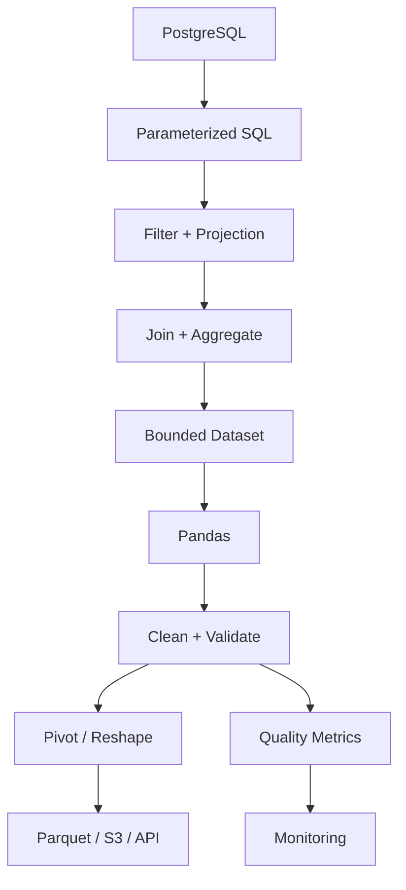

# 17- Pandas And Sql

## Overview

Pandas and SQL solve different parts of the same data-processing problem.

SQL is primarily designed for:

- persistent data storage
- filtering
- joins
- aggregation
- constraints
- transactions
- concurrent access
- query planning

Pandas is primarily designed for:

- in-memory tabular processing
- data cleaning
- transformation
- reshaping
- reporting
- exploratory analysis
- bounded ETL workloads

A production backend should not treat them as interchangeable.

A useful mental model is:

```text
PostgreSQL / Data Warehouse
        ↓
filter
project
join
aggregate
        ↓
manageable result
        ↓
Pandas
        ↓
clean
validate
reshape
specialized transform
        ↓
Parquet / API / report / database
```

The most important engineering question is not:

> "Should I use Pandas or SQL?"

It is:

> "Which system should perform each operation?"

---

## Pandas vs SQL

| Concern | SQL / PostgreSQL | Pandas |
|---|---|---|
| Persistent storage | Excellent | No |
| Transactions | Excellent | No |
| Concurrent access | Excellent | No |
| Indexed filtering | Excellent | Limited in-memory |
| Large joins | Excellent | Good when bounded |
| Large aggregations | Excellent | Good when memory permits |
| Data cleaning | Good | Excellent |
| Flexible in-memory transformation | Limited | Excellent |
| Reshaping | Moderate | Excellent |
| CSV / Parquet processing | Limited directly | Excellent |
| Batch ETL | Good | Excellent for bounded workloads |
| Distributed execution | Warehouse / database dependent | Single-process by default |
| Memory requirement | Disk-backed execution possible | Primarily memory-bound |
| API/report preparation | Moderate | Excellent |

---

## The Data Flow Boundary

A well-designed system establishes a clear boundary between database work and DataFrame work.


The database reduces the dataset.

Pandas handles transformations that are easier, clearer, or more appropriate in Python.

---

## When SQL Should Do the Work

Prefer SQL when the operation involves:

```text
large tables
indexed predicates
relational joins
grouping
aggregation
database constraints
transactional semantics
data already stored in PostgreSQL
```

Example:

```sql
SELECT
    customer_id,
    SUM(amount) AS revenue,
    COUNT(*) AS order_count
FROM orders
WHERE status = 'completed'
  AND created_at >= %(start)s
  AND created_at < %(end)s
GROUP BY customer_id;
```

This is usually better than loading millions of orders into Pandas and performing:

```python
orders.groupby("customer_id")
```

The database can use:

```text
indexes
query planning
join algorithms
parallel execution
storage-level filtering
```

depending on the workload and database configuration.

---

## When Pandas Should Do the Work

Pandas is often preferable for:

```text
complex DataFrame transformations
data cleaning
schema normalization
report-oriented reshaping
string processing
specialized Python business logic
Parquet processing
multi-source batch transformations
```

Example:

```python
result["status"] = (
    result["status"]
    .astype("string")
    .str.strip()
    .str.lower()
)

result = result.pivot_table(
    index="order_date",
    columns="category",
    values="revenue",
    aggfunc="sum",
)
```

These operations are often easier to express and test in Pandas than in SQL.

---

## Push Work Toward the Data

A general performance principle is:

```text
Do expensive filtering and reduction before data crosses the boundary.
```

Bad:

```text
PostgreSQL
    ↓
10 million rows
    ↓
Pandas
    ↓
filter to 100,000 rows
```

Better:

```text
PostgreSQL
    ↓
filter to 100,000 rows
    ↓
Pandas
```

The improvement comes from reducing:

```text
network transfer
Pandas memory
deserialization
CPU work
job duration
```

---

## Column Projection

Avoid:

```sql
SELECT *
FROM orders;
```

when only a few columns are required.

Prefer:

```sql
SELECT
    order_id,
    customer_id,
    created_at,
    amount
FROM orders;
```

Then Pandas receives only the required schema.

This is one of the simplest and most effective optimizations in database-to-Pandas pipelines.

---

## Parameterized Queries

Never construct SQL by interpolating untrusted values into the query string.

Bad:

```python
query = f"""
SELECT *
FROM orders
WHERE customer_id = '{customer_id}'
"""
```

Prefer parameterized queries:

```python
query = """
SELECT
    order_id,
    customer_id,
    amount
FROM orders
WHERE customer_id = %(customer_id)s
"""

orders = pd.read_sql_query(
    query,
    connection,
    params={
        "customer_id": customer_id,
    },
)
```

This separates:

```text
SQL structure
```

from:

```text
parameter values
```

and reduces SQL injection risk.

---

## Filtering in SQL

Example:

```python
query = """
SELECT
    order_id,
    customer_id,
    amount,
    created_at
FROM orders
WHERE status = %(status)s
  AND created_at >= %(start)s
  AND created_at < %(end)s
"""

orders = pd.read_sql_query(
    query,
    connection,
    params={
        "status": "completed",
        "start": start,
        "end": end,
    },
)
```

This is generally better than:

```python
orders = pd.read_sql_query(
    "SELECT * FROM orders",
    connection,
)

orders = orders.loc[
    orders["status"].eq("completed")
]
```

when the filtering can be handled efficiently by PostgreSQL.

---

## Indexes and Pandas

A database index and a Pandas index are different concepts.

A PostgreSQL index supports:

```text
query planning
row lookup
filtering
join execution
ordering
```

A Pandas index primarily supports:

```text
label alignment
selection
index-based joins
grouping
```

Do not assume:

```text
"add a Pandas index"
```

has the same effect as adding a database index.

---

## PostgreSQL Index Example

Suppose most queries filter:

```sql
WHERE customer_id = ?
  AND created_at >= ?
```

A database index may be appropriate:

```sql
CREATE INDEX idx_orders_customer_created
ON orders (customer_id, created_at);
```

The optimal index depends on:

```text
query patterns
cardinality
write frequency
table size
existing indexes
query planner behavior
```

Database indexing should be designed from actual workload requirements.

---

## Loading SQL Results into Pandas

A simple extraction:

```python
orders = pd.read_sql_query(
    query,
    connection,
)
```

This is suitable for bounded results.

For large results, use:

```python
chunks = pd.read_sql_query(
    query,
    connection,
    chunksize=100_000,
)

for chunk in chunks:
    process_chunk(chunk)
```

This prevents the complete query result from being materialized at once.

---

## Chunked Database Processing

A production pattern:

```python
for chunk in pd.read_sql_query(
    query,
    connection,
    params=params,
    chunksize=100_000,
):
    cleaned = normalize_orders(chunk)

    validate_orders(cleaned)

    write_partition(cleaned)
```

Memory usage becomes approximately proportional to the largest active batch rather than the full result set.

---

## Server-Side Cursor vs Pandas Chunking

Chunking at the Pandas interface is an application-level memory-control mechanism.

The underlying database driver may still use different buffering behavior depending on configuration.

For truly large extracts, understand:

```text
driver behavior
cursor behavior
transaction scope
fetch size
network buffering
```

The exact implementation depends on the PostgreSQL driver and database access layer.

---

## Aggregation Pushdown

Suppose the business requirement is:

```text
monthly revenue by customer
```

Do not load every order into Pandas unless there is a specific reason.

Prefer:

```sql
SELECT
    customer_id,
    DATE_TRUNC('month', created_at) AS month,
    SUM(amount) AS revenue
FROM orders
GROUP BY
    customer_id,
    DATE_TRUNC('month', created_at);
```

Then:

```python
monthly = pd.read_sql_query(
    query,
    connection,
)
```

Pandas can now perform final reporting transformations on a much smaller dataset.

---

## SQL `GROUP BY` vs Pandas `groupby()`

The conceptual mapping is:

| SQL | Pandas |
|---|---|
| `GROUP BY` | `groupby()` |
| `SUM()` | `.sum()` |
| `COUNT(*)` | `.size()` |
| `COUNT(column)` | `.count()` |
| `COUNT(DISTINCT x)` | `.nunique()` |
| `MIN()` | `.min()` |
| `MAX()` | `.max()` |
| `AVG()` | `.mean()` |

Example SQL:

```sql
SELECT
    category,
    SUM(amount) AS revenue
FROM orders
GROUP BY category;
```

Pandas equivalent:

```python
summary = (
    orders
    .groupby("category")
    .agg(
        revenue=("amount", "sum")
    )
)
```

The fact that two systems can express the same operation does not mean they have the same operational cost.

---

## SQL `JOIN` vs Pandas `merge()`

SQL:

```sql
SELECT
    o.order_id,
    o.amount,
    c.country
FROM orders AS o
JOIN customers AS c
    ON o.customer_id = c.customer_id;
```

Pandas:

```python
result = orders.merge(
    customers,
    on="customer_id",
    how="inner",
    validate="many_to_one",
)
```

Both represent a relational join.

The key engineering difference is where the operation happens.

---

## Choosing Where the Join Happens

Prefer SQL when:

```text
tables are already in the same database
tables are large
database indexes/statistics can help
result can be significantly reduced by the join
```

Prefer Pandas when:

```text
one or more datasets already exist outside the database
join logic is part of a local ETL transformation
datasets are bounded
Python-side processing is required
```

A hybrid pipeline is common:

```text
PostgreSQL joins core relational tables
→
Pandas joins a small external reference dataset
```

---

## Join Cardinality Validation

Pandas provides:

```python
validate="many_to_one"
```

to enforce expected relationships.

Example:

```python
orders.merge(
    customers,
    on="customer_id",
    how="left",
    validate="many_to_one",
)
```

This is a valuable application-level safeguard.

Database constraints are still preferable for enforcing persistent data integrity:

```sql
UNIQUE
PRIMARY KEY
FOREIGN KEY
```

Use both where appropriate.

---

## SQL Constraints vs Pandas Validation

| Requirement | Database | Pandas |
|---|---|---|
| Persistent uniqueness | `UNIQUE` | `duplicated()` |
| Foreign key | `FOREIGN KEY` | validation / merge |
| Not null | `NOT NULL` | `notna()` |
| Check constraint | `CHECK` | boolean validation |
| Temporary schema checks | Limited | Excellent |
| Final transformation validation | Limited | Excellent |

Database constraints protect the stored dataset.

Pandas validation protects the processing pipeline.

---

## Data Cleaning Boundary

Not every cleaning task belongs in SQL.

SQL is well suited to:

```text
filtering
simple type conversion
conditional expressions
deduplication
aggregation
joins
```

Pandas is often more convenient for:

```text
complex string normalization
regex extraction
multi-step transformations
schema reshaping
conditional DataFrame logic
```

Avoid forcing highly complex transformations into SQL simply because the source data is in PostgreSQL.

---

## Example: Normalize After SQL Extraction

SQL returns:

```text
customer_id
status
created_at
amount
```

Pandas normalizes:

```python
orders["customer_id"] = (
    orders["customer_id"]
    .astype("string")
    .str.strip()
    .str.upper()
)

orders["status"] = (
    orders["status"]
    .astype("string")
    .str.strip()
    .str.lower()
)

orders["created_at"] = pd.to_datetime(
    orders["created_at"],
    utc=True,
    errors="raise",
)
```

This establishes a predictable processing contract.

---

## Datetime Filtering

Prefer source-side filtering:

```sql
WHERE created_at >= %(start)s
  AND created_at < %(end)s
```

rather than:

```python
orders = orders.loc[
    orders["created_at"].ge(start)
    & orders["created_at"].lt(end)
]
```

when the database can perform the filtering.

Pandas filtering is still appropriate after data has already been loaded and further local filtering is required.

---

## Timezone Semantics

Be explicit about the relationship between PostgreSQL and Pandas timestamps.

For API and distributed workflows, a common pattern is:

```text
database
→ timezone-aware timestamp
→ Pandas
→ UTC-normalized processing
→ user-localized presentation
```

Do not silently mix:

```text
naive timestamp
```

with:

```text
timezone-aware timestamp
```

---

## SQL Date Bucketing

PostgreSQL can perform time bucketing:

```sql
SELECT
    DATE_TRUNC('day', created_at) AS order_date,
    SUM(amount) AS revenue
FROM orders
GROUP BY
    DATE_TRUNC('day', created_at);
```

Pandas can then reshape:

```python
daily = pd.read_sql_query(
    query,
    connection,
)

report = daily.pivot_table(
    index="order_date",
    values="revenue",
    aggfunc="sum",
)
```

This avoids unnecessarily transferring raw transaction-level data.

---

## SQL Window Functions vs Pandas Operations

Some analytical operations map to window functions.

SQL:

```sql
SELECT
    customer_id,
    order_id,
    amount,
    ROW_NUMBER() OVER (
        PARTITION BY customer_id
        ORDER BY created_at DESC
    ) AS rank
FROM orders;
```

A Pandas equivalent may involve:

```python
orders = orders.sort_values(
    [
        "customer_id",
        "created_at",
    ],
    ascending=[
        True,
        False,
    ],
)

orders["rank"] = (
    orders.groupby("customer_id")
    .cumcount()
    .add(1)
)
```

For large relational datasets already stored in PostgreSQL, the SQL window function is often preferable.

---

## `DISTINCT` vs `drop_duplicates()`

SQL:

```sql
SELECT DISTINCT
    customer_id
FROM orders;
```

Pandas:

```python
customers = orders[
    ["customer_id"]
].drop_duplicates()
```

Use the database version when the source table is large and only the distinct values are needed.

Use Pandas when the relevant subset is already in memory or is part of a broader local transformation.

---

## SQL `CASE` vs Pandas Conditional Logic

SQL:

```sql
SELECT
    order_id,
    CASE
        WHEN amount >= 10000 THEN 'high'
        WHEN amount >= 5000 THEN 'medium'
        ELSE 'low'
    END AS priority
FROM orders;
```

Pandas:

```python
import numpy as np

orders["priority"] = np.select(
    [
        orders["amount"] >= 10_000,
        orders["amount"] >= 5_000,
    ],
    [
        "high",
        "medium",
    ],
    default="low",
)
```

Choose the location based on:

```text
data volume
reuse
business ownership
query patterns
database cost
pipeline architecture
```

---

## SQL `UNION ALL` vs `concat()`

SQL:

```sql
SELECT ...
FROM january

UNION ALL

SELECT ...
FROM february;
```

Pandas:

```python
combined = pd.concat(
    [
        january,
        february,
    ],
    ignore_index=True,
)
```

Both conceptually stack records.

For large database-resident datasets, let PostgreSQL perform the union when possible.

---

## SQL `UNION` vs Pandas Deduplication

SQL `UNION` removes duplicate rows.

Pandas `concat()` does not.

Pandas equivalent:

```python
combined = (
    pd.concat(
        [january, february],
        ignore_index=True,
    )
    .drop_duplicates()
)
```

For business data, define the actual duplicate identity rather than blindly deduplicating every column.

---

## SQL `HAVING` vs Pandas Group Filtering

SQL:

```sql
SELECT
    customer_id,
    SUM(amount) AS revenue
FROM orders
GROUP BY customer_id
HAVING SUM(amount) >= 10000;
```

Pandas:

```python
customer_revenue = (
    orders
    .groupby("customer_id")
    .agg(
        revenue=("amount", "sum")
    )
)

high_value = customer_revenue.loc[
    customer_revenue["revenue"].ge(10_000)
]
```

Again, if the data is already in PostgreSQL, doing the aggregation and filtering there can be substantially cheaper.

---

## SQL `COALESCE` vs `fillna()`

SQL:

```sql
COALESCE(discount, 0)
```

Pandas:

```python
orders["discount"] = (
    orders["discount"]
    .fillna(0)
)
```

The semantic rule should be explicit.

Missing and zero should not be treated as equivalent unless the business definition says they are.

---

## SQL `NULL` vs Pandas Missing Values

Both systems support missing data, but semantics differ.

SQL uses:

```text
NULL
```

Pandas may represent missingness through:

```text
pd.NA
NaN
NaT
None
```

A pipeline should normalize the representation when data crosses the boundary.

For example:

```python
orders["status"] = orders["status"].astype(
    "string"
)
```

preserves a clear nullable string representation.

---

## SQL Type Conversion vs Pandas Type Conversion

SQL:

```sql
CAST(amount AS NUMERIC)
```

Pandas:

```python
orders["amount"] = pd.to_numeric(
    orders["amount"],
    errors="raise",
)
```

Perform conversion at the source when it reduces data ambiguity or allows the database to use indexes and constraints correctly.

Perform it in Pandas when the input is:

```text
external
dirty
multi-source
semi-structured
```

and requires local validation.

---

## Data Validation at Both Layers

Production systems should not rely exclusively on one layer.

Example:

```text
PostgreSQL
→ NOT NULL
→ UNIQUE
→ FOREIGN KEY
→ CHECK

Pandas
→ schema validation
→ source normalization
→ domain validation
→ reconciliation
```

This creates defense in depth.

---

## SQL as the System of Record

When PostgreSQL owns the authoritative data:

```text
database constraints
+
transactional updates
```

should remain the source of truth.

Pandas should generally consume data rather than become the authoritative state store.

Avoid workflows where:

```text
PostgreSQL
→ Pandas
→ mutate DataFrame
→ write entire table back
```

unless the write path has been carefully designed.

---

## Bulk Writing to PostgreSQL

For moderate results:

```python
result.to_sql(
    "daily_order_summary",
    connection,
    if_exists="append",
    index=False,
)
```

may be appropriate.

For high-volume writes, evaluate:

```text
COPY
staging tables
bulk load
batch sizes
indexes
constraints
transaction scope
```

rather than assuming `to_sql()` is optimal for all workloads.

---

## Staging Table Pattern

A robust ETL workflow can be:


A staging table allows:

```text
schema validation
duplicate checks
row-count reconciliation
transactional promotion
rollback
```

before data becomes authoritative.

---

## Upsert Considerations

Pandas itself does not provide database transaction semantics.

If processing results need to be upserted into PostgreSQL, let PostgreSQL handle the persistence semantics.

Typical design:

```text
Pandas
→ produce validated records
→ staging table
→ SQL MERGE / INSERT ... ON CONFLICT
→ commit
```

This separates:

```text
transformation
```

from:

```text
persistence correctness
```

---

## Transactions

Do not keep a large database transaction open while performing extensive Pandas computation if it can be avoided.

Bad pattern:

```text
BEGIN
→ fetch
→ 20-minute Pandas processing
→ write
→ COMMIT
```

This can hold:

```text
locks
connections
transaction snapshots
database resources
```

for too long.

Prefer:

```text
read
→ process outside transaction
→ write validated batch
→ short transaction
```

when the workload permits.

---

## Connection Pooling

A FastAPI or Django service should use connection pooling appropriately.

Do not create a new database connection for every Pandas operation:

```python
for chunk in chunks:
    connection = create_connection()
```

Prefer a managed pool or framework-provided connection lifecycle.

Connection exhaustion can become a larger production problem than Pandas performance itself.

---

## FastAPI Architecture

For synchronous, bounded reports:

```text
HTTP request
→ validate filters
→ SQL query
→ bounded DataFrame
→ Pandas transformation
→ response
```

For expensive jobs:

```text
HTTP request
→ enqueue Celery task
→ worker queries PostgreSQL
→ Pandas processing
→ S3 / database
→ client retrieves result
```

This prevents long-running DataFrame workloads from tying up API workers.

---

## Django Integration

In Django applications, prefer Django ORM queries for application-domain operations when appropriate:

```python
queryset = (
    Order.objects
    .filter(
        status="completed",
        created_at__gte=start,
        created_at__lt=end,
    )
    .values(
        "order_id",
        "customer_id",
        "amount",
        "created_at",
    )
)
```

Then convert the bounded result into Pandas when tabular processing is needed.

Avoid loading model instances into memory when only scalar fields are required.

---

## ORM vs Pandas

ORMs are useful for:

```text
application business logic
transactional reads/writes
authorization-aware queries
entity relationships
```

Pandas is useful for:

```text
bulk tabular transformations
aggregation
cleaning
reporting
ETL
```

A common production pattern is:

```text
Django ORM / SQL
→ values()
→ bounded result
→ DataFrame
```

rather than:

```text
database
→ millions of model objects
→ Pandas
```

---

## REST API Data + PostgreSQL

A common integration pipeline is:

```text
External REST API
        ↓
Raw JSON
        ↓
Pandas normalization
        ↓
Validation
        ↓
Parquet / staging table
        ↓
PostgreSQL
        ↓
SQL reporting
```

Pandas is particularly useful for turning semi-structured API responses into predictable tabular data before persistence.

---

## API Pagination

Process pages incrementally:

```python
for payload in fetch_pages():
    page = pd.DataFrame.from_records(
        payload["items"]
    )

    page = normalize_page(page)

    validate_page(page)

    write_to_staging(page)
```

Avoid accumulating an unbounded number of pages in memory.

---

## PostgreSQL as Validation Boundary

A staging table can enforce:

```sql
CREATE TABLE staging_orders (
    order_id TEXT NOT NULL,
    customer_id TEXT NOT NULL,
    amount NUMERIC NOT NULL,
    created_at TIMESTAMPTZ NOT NULL
);
```

Pandas performs:

```text
format normalization
source-specific cleaning
cross-record transformations
```

PostgreSQL then enforces:

```text
schema
constraints
uniqueness
referential integrity
```

This division is robust for ETL systems.

---

## Parquet as an Intermediate Layer

For larger pipelines:

```text
PostgreSQL
   ↓
query / extract
   ↓
Pandas
   ↓
Parquet
   ↓
Pandas / Athena / Spark / other consumers
```

Parquet is useful when the transformed dataset needs to be:

```text
reused
partitioned
shared
queried repeatedly
stored cheaply
```

This avoids forcing PostgreSQL to serve every analytical downstream workload.

---

## S3 and Pandas

A common AWS pattern:

```text
S3 raw
  ↓
Pandas worker
  ↓
S3 processed Parquet
  ↓
Athena / Glue / downstream consumers
```

Pandas should receive only the partitions and columns required for the current job.

S3 should remain the durable storage layer; the DataFrame is temporary processing state.

---

## Kafka and SQL/Pandas

For event-driven systems:

```text
Kafka
 ↓
micro-batch consumer
 ↓
Pandas normalization
 ↓
PostgreSQL staging / Parquet
 ↓
SQL analytical processing
```

Pandas can be useful for micro-batches, but continuous high-throughput streaming may require a dedicated stream-processing architecture.

---

## Memory and SQL Pushdown

A useful rule is:

```text
If SQL can reduce 100 million rows to 1 million rows,
do that before Pandas.
```

Example:

```sql
SELECT
    customer_id,
    DATE_TRUNC('day', created_at) AS day,
    SUM(amount) AS revenue
FROM orders
WHERE created_at >= %(start)s
  AND created_at < %(end)s
GROUP BY
    customer_id,
    DATE_TRUNC('day', created_at);
```

Then Pandas processes the much smaller aggregate.

---

## Avoiding N+1 Database Access

Never do this inside a row-wise transformation:

```python
def enrich_order(row):
    return fetch_customer(
        row["customer_id"]
    )

orders["country"] = orders.apply(
    enrich_order,
    axis=1,
)
```

This creates an N+1 query pattern.

Prefer:

```text
fetch required customer data once
→ create DataFrame
→ merge once
```

Example:

```python
customers = pd.read_sql_query(
    customer_query,
    connection,
)

orders = orders.merge(
    customers,
    on="customer_id",
    how="left",
    validate="many_to_one",
)
```

Or perform the entire enrichment in SQL if both datasets already live in the database.

---

## Query Planning

For SQL-heavy pipelines, inspect expensive queries with:

```sql
EXPLAIN (ANALYZE, BUFFERS)
SELECT
    customer_id,
    SUM(amount)
FROM orders
GROUP BY customer_id;
```

This helps identify:

```text
sequential scans
index usage
join strategy
sort cost
temporary storage
actual row counts
```

Pandas performance tuning should not compensate for a badly planned database query.

---

## Database Query Performance vs Pandas Performance

A pipeline may appear slow because:

```text
Pandas takes 10 seconds
```

while the real bottleneck is:

```text
PostgreSQL query takes 90 seconds
```

Measure separately:

```text
SQL execution
network transfer
DataFrame construction
Pandas transformation
output serialization
```

Otherwise optimization efforts may target the wrong layer.

---

## Observability

Track metrics for each stage:

| Stage | Useful metrics |
|---|---|
| SQL extraction | query duration, rows returned, bytes |
| DataFrame creation | load time, memory |
| Transformation | duration, rows in/out |
| Join | input/output rows, cardinality |
| Validation | rejected rows |
| Output | rows written, bytes written |
| Database write | insert/upsert time |
| End-to-end | total duration |

This creates an observable data pipeline rather than a black box.

---

## Reconciliation

A production ETL job should reconcile SQL and Pandas results.

For example:

```python
source_count = pd.read_sql_query(
    """
    SELECT COUNT(*) AS count
    FROM orders
    WHERE status = 'completed'
    """,
    connection,
).iloc[0]["count"]

processed_count = len(
    orders
)

if source_count != processed_count:
    raise ValueError(
        "Row-count reconciliation failed"
    )
```

For financial data, reconcile:

```text
row count
sum(amount)
number of distinct IDs
date range
```

as appropriate.

---

## Security Considerations

Pandas does not enforce database authorization.

When a report is tenant-scoped:

```sql
SELECT
    order_id,
    amount
FROM orders
WHERE tenant_id = %(tenant_id)s;
```

the tenant filter should be applied before data enters the DataFrame.

Do not load all tenants into memory and rely on later filtering unless the architecture explicitly guarantees secure isolation.

---

## Least Data Principle

Only extract the data necessary for the job.

This reduces:

```text
memory
cost
security exposure
network transfer
processing time
```

It also limits the amount of sensitive data temporarily held in application memory.

---

## Credential Management

Database credentials should come from:

```text
environment configuration
secret manager
workload identity
application configuration system
```

not from DataFrame code or source files.

On AWS, prefer appropriate IAM and secret-management mechanisms over embedding credentials in ETL scripts.

---

## Reliability

Database-to-Pandas pipelines should be:

```text
idempotent
bounded
observable
retry-safe
schema-aware
```

Use:

```text
batch IDs
watermarks
partition keys
staging tables
upsert semantics
```

to make retries safe.

---

## Incremental Processing

Instead of repeatedly scanning the full orders table:

```sql
SELECT *
FROM orders;
```

track an incremental boundary:

```sql
WHERE updated_at > %(last_watermark)s
  AND updated_at <= %(current_watermark)s
```

Then:

```text
read changes
→
transform
→
persist
→
advance watermark
```

This dramatically reduces recurring workload.

---

## Change Data Capture

For high-volume systems, incremental processing can evolve into:

```text
database
→ CDC / Kafka
→ stream or micro-batch
→ Pandas where appropriate
→ analytical storage
```

Pandas should not necessarily be the mechanism for discovering every change by repeatedly scanning the entire source table.

---

## Disaster Recovery

For critical pipelines, retain durable intermediate outputs:

```text
raw API / database
→ raw Parquet
→ normalized Parquet
→ processed Parquet
→ reporting result
```

This allows failed downstream jobs to restart from a stable intermediate stage instead of re-querying the source unnecessarily.

---

## Cost Considerations

Database-to-Pandas architecture affects cost across:

```text
database CPU
database I/O
network transfer
worker CPU
worker memory
object storage
query frequency
```

Pushing an aggregation into PostgreSQL may reduce worker cost but increase database load.

Moving repeated reporting data into Parquet may reduce database load and improve overall economics.

The correct architecture minimizes total system cost, not just Pandas runtime.

---

## Common Mistakes

### Pulling the Entire Table into Pandas

Bad:

```python
pd.read_sql_query(
    "SELECT * FROM orders",
    connection,
)
```

when only a small subset is needed.

Prefer filtered, projected queries.

### Using Pandas as a Database

Pandas does not provide:

```text
transactions
constraints
concurrency control
persistent storage
query planning
```

at database scale.

### Row-Wise Database Queries

Avoid database access inside:

```python
apply(axis=1)
```

This creates N+1 database traffic.

### Loading ORM Objects

Do not materialize millions of Django model objects merely to create a DataFrame.

Use scalar projections.

### Ignoring SQL Query Plans

A slow extraction query can dominate the entire pipeline.

### Holding Transactions Open During Pandas Work

Avoid unnecessarily long database transactions.

### Writing the Entire Production Table Back

Prefer staging plus validated incremental writes.

### Ignoring Join Cardinality

Many-to-many expansion can cause both correctness and memory failures.

### Using Unparameterized SQL

This creates SQL injection risk.

### Assuming `to_sql()` Is Always Efficient

Large write workloads often need database-native bulk loading strategies.

### Filtering Only After Extraction

This wastes database, network, and worker resources.

### Mixing Timezone Semantics

Database timestamps and Pandas timestamps need an explicit contract.

---

## Interview Traps

### Should SQL or Pandas Perform Aggregation?

Usually SQL when the source data is already in the database and the aggregation can substantially reduce the dataset. Pandas is appropriate when the data is already bounded in memory or the transformation is better suited to Python.

### Why Avoid `SELECT *`?

It transfers and materializes data that may never be used.

### What Is Predicate Pushdown?

Applying filters as close to the data source as possible before transferring the data to Pandas.

### Why Is Database-Side Aggregation Often Faster?

The database is designed for indexed access, relational execution, aggregation, and storage-aware query processing.

### When Should You Use Pandas Instead of SQL?

For complex in-memory transformations, reshaping, source normalization, multi-source ETL, or reporting logic where Pandas provides clearer and more maintainable semantics.

### What Is the SQL Equivalent of `merge()`?

A relational `JOIN`.

### What Is the SQL Equivalent of `concat()`?

Conceptually, row-wise concatenation resembles `UNION ALL`.

### What Is the Difference Between SQL `NULL` and Pandas Missing Values?

They are conceptually related but represented and propagated differently. SQL uses `NULL`; Pandas may use `pd.NA`, `NaN`, `NaT`, or `None` depending on dtype.

### Why Is N+1 Bad in Pandas + SQL Pipelines?

A row-wise transformation that executes one database query per record turns one operation into potentially millions of network round trips.

### How Do You Process a SQL Result Larger Than Memory?

Use source-side filtering/aggregation and chunked reads such as:

```python
pd.read_sql_query(
    query,
    connection,
    chunksize=100_000,
)
```

### Should a Pandas Pipeline Enforce Database Constraints?

Pandas can validate assumptions, but persistent integrity constraints should be enforced in the database.

### How Do You Make a Database-to-Pandas ETL Pipeline Idempotent?

Use stable batch identity, watermarks or partitions, deterministic transformations, staging tables, and idempotent writes/upserts.

### Why Use a Staging Table?

It separates transformation from authoritative persistence and enables validation, reconciliation, transactional promotion, and rollback.

---

## Production Decision Framework

Use this decision process:

```text
Is the data already in PostgreSQL?
        |
       yes
        ↓
Can SQL filter / join / aggregate efficiently?
        |
       yes
        ↓
Do it in SQL.

        |
       no
        ↓
Extract only required data
        ↓
Pandas
```

For large datasets:

```text
Can the database reduce the result dramatically?
        |
       yes
        ↓
Push down.

        |
       no
        ↓
Can Pandas process it in bounded chunks?
        |
       yes
        ↓
Chunk it.

        |
       no
        ↓
Use another processing architecture.
```

---

## Recommended Architecture

For a production reporting workflow:



For expensive recurring jobs:

```text
Scheduler
   ↓
Celery / AWS Batch
   ↓
PostgreSQL extraction
   ↓
Pandas processing
   ↓
S3 Parquet
   ↓
Report / API
```

---

## Practical SQL + Pandas Example

```python
import pandas as pd


query = """
SELECT
    o.order_id,
    o.customer_id,
    o.created_at,
    o.category,
    o.amount
FROM orders AS o
WHERE o.status = %(status)s
  AND o.created_at >= %(start)s
  AND o.created_at < %(end)s
"""

orders = pd.read_sql_query(
    query,
    connection,
    params={
        "status": "completed",
        "start": start,
        "end": end,
    },
)

orders["category"] = (
    orders["category"]
    .astype("string")
    .str.strip()
    .str.lower()
)

orders["created_at"] = pd.to_datetime(
    orders["created_at"],
    utc=True,
    errors="raise",
)

daily = (
    orders
    .assign(
        order_date=lambda frame:
            frame["created_at"].dt.normalize()
    )
    .groupby(
        [
            "order_date",
            "category",
        ],
        as_index=False,
        observed=True,
    )
    .agg(
        revenue=("amount", "sum"),
        orders=("order_id", "nunique"),
    )
)

report = daily.pivot(
    index="order_date",
    columns="category",
    values="revenue",
)
```

This architecture demonstrates:

```text
SQL filtering
→
column projection
→
Pandas normalization
→
datetime parsing
→
aggregation
→
reshape
```

---

## Testing the Boundary

Test SQL and Pandas responsibilities separately.

For SQL:

```text
correct filtering
correct joins
correct aggregate totals
correct parameter handling
```

For Pandas:

```text
normalization
dtype conversion
missing-value policy
reshape behavior
validation
```

An integration test should verify that the complete pipeline preserves:

```text
row counts
totals
keys
date range
expected schema
```

---

## Example Transformation Test

```python
def test_daily_revenue(
    orders: pd.DataFrame,
) -> None:
    orders["created_at"] = pd.to_datetime(
        orders["created_at"],
        utc=True,
    )

    result = (
        orders
        .assign(
            order_date=lambda frame:
                frame["created_at"].dt.normalize()
        )
        .groupby(
            "order_date",
            as_index=False,
        )
        .agg(
            revenue=("amount", "sum"),
        )
    )

    assert result["revenue"].sum() == (
        orders["amount"].sum()
    )
```

The test verifies business behavior rather than just execution.

---

## Operational Checklist

Before deploying a Pandas + SQL pipeline, verify:

- SQL selects only required columns.
- Source-side filters are applied wherever practical.
- SQL parameters are bound safely.
- Expensive joins and aggregations are pushed to PostgreSQL when appropriate.
- Query execution time is measured separately from Pandas processing.
- Large results use chunked reads.
- Database indexes match real query patterns.
- Join cardinality is known and validated.
- Data types are normalized after extraction.
- Datetime timezone semantics are explicit.
- Pandas transformations are vectorized where practical.
- N+1 database access is avoided.
- Large API/ORM results are not unnecessarily materialized as Python objects.
- Database transactions are kept appropriately scoped.
- Writes use staging/bulk-loading strategies when necessary.
- Row counts and financial totals are reconciled.
- Tenant and authorization filters are applied before data enters processing.
- Outputs are partitioned or staged for safe retries.
- Metrics cover SQL time, Pandas time, memory, rows, and failures.
- A different execution architecture is considered when data no longer fits safely in memory.

---

## Key Takeaways

- Treat SQL and Pandas as complementary execution engines: use PostgreSQL for storage, filtering, relational joins, aggregation, and persistent integrity; use Pandas for bounded in-memory transformation, cleaning, reshaping, and reporting.
- Push filtering, projection, joins, and aggregations toward the database whenever they can substantially reduce the data crossing into Pandas.
- Use parameterized SQL, validate join cardinality, avoid N+1 queries, and keep database transactions appropriately scoped for secure and reliable production pipelines.
- For large result sets, combine source-side reduction with chunked reads, incremental processing, staging tables, and durable intermediate storage such as Parquet.
- Design the boundary deliberately: measure SQL and Pandas stages separately, reconcile results, enforce persistence integrity in the database, and move to another processing architecture when a single in-memory DataFrame is no longer safe.