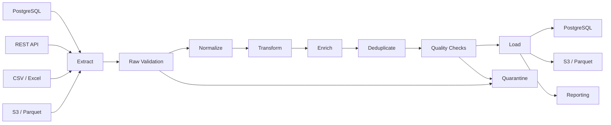
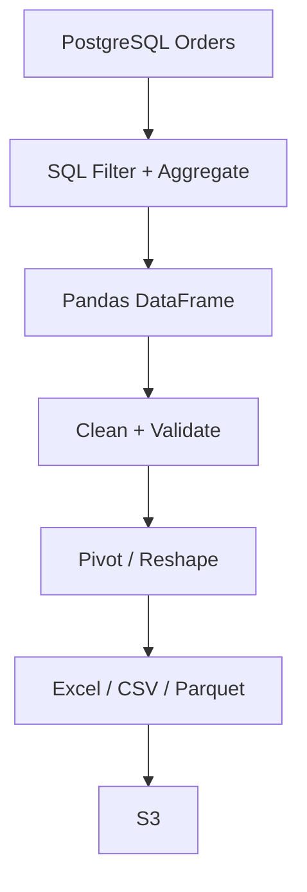
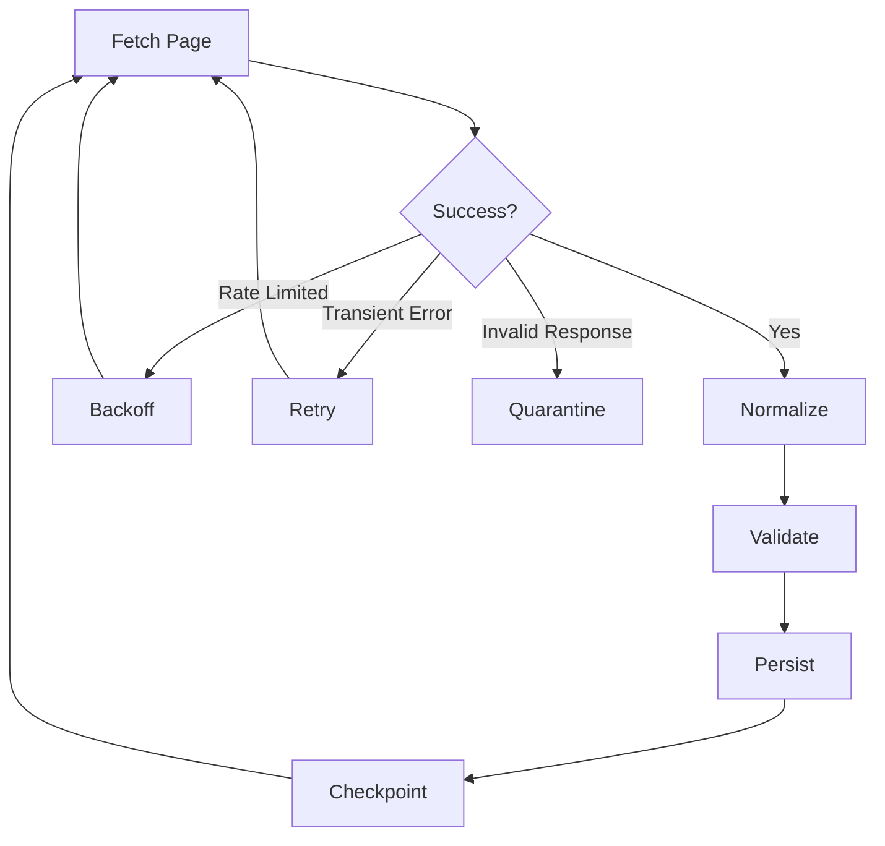
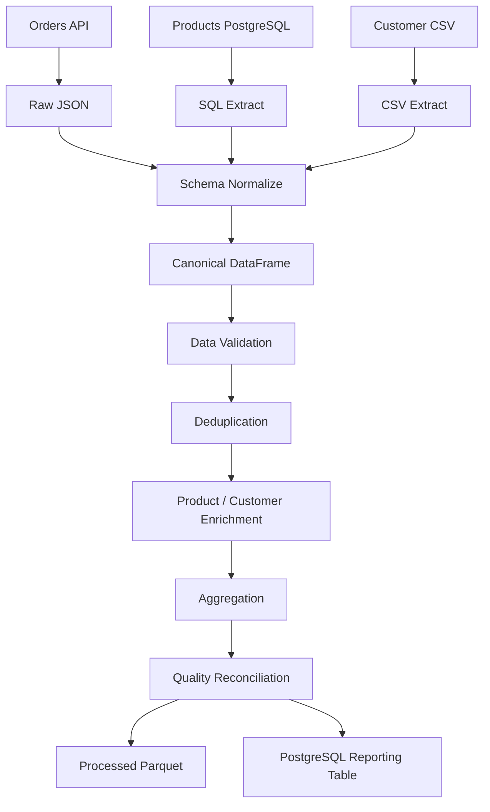

# 18- ETL Scenarios

## Overview

Extract, Transform, Load (ETL) pipelines are one of the most practical production applications of Pandas.

A typical ETL workflow combines:

```text
source systems
    ↓
extract
    ↓
validate
    ↓
clean / normalize
    ↓
transform
    ↓
deduplicate
    ↓
enrich
    ↓
aggregate
    ↓
load
    ↓
reconcile / monitor
```

Pandas is particularly useful in the transformation stage, but a production ETL system should not assume that every operation belongs inside a DataFrame.

The strongest ETL designs distribute work appropriately:

```text
PostgreSQL
→ filtering
→ relational joins
→ aggregation
→ constraints

Pandas
→ normalization
→ complex transformation
→ reshaping
→ validation
→ multi-source processing

S3 / Parquet
→ durable intermediate storage
→ partitioning
→ replay

Kafka / queues
→ event transport
→ incremental processing

Celery / Batch / Kubernetes
→ execution and isolation
```

The key ETL interview skill is not memorizing Pandas methods. It is reasoning about:

```text
correctness
memory
idempotency
data quality
failure recovery
incremental processing
source contracts
observability
```

---

## ETL Architecture

A production-oriented pipeline may look like:



The raw input should remain recoverable where practical.

This enables:

```text
reprocessing
auditing
backfills
bug fixes
source replay
disaster recovery
```

---

## ETL vs ELT

Traditional ETL:

```text
Extract
→ Transform
→ Load
```

ELT:

```text
Extract
→ Load
→ Transform
```

Modern data platforms often favor ELT because databases and warehouses can perform large-scale transformations efficiently.

Pandas still fits naturally when:

```text
external APIs
file normalization
complex Python transformations
data-quality remediation
specialized batch processing
report generation
```

The boundary should be driven by workload and operational requirements.

---

## Scenario: CSV Orders into PostgreSQL

Suppose an external partner provides:

```text
orders.csv
```

with:

```text
order_id
customer_id
created_at
status
amount
```

A production pipeline should not simply do:

```python
orders = pd.read_csv("orders.csv")

orders.to_sql(
    "orders",
    connection,
    if_exists="append",
    index=False,
)
```

Instead:

```text
read
→ validate schema
→ normalize values
→ parse datetime
→ validate business rules
→ detect duplicates
→ load staging
→ reconcile
→ promote
```

---

## Schema Validation

Define the expected contract:

```python
EXPECTED_COLUMNS = [
    "order_id",
    "customer_id",
    "created_at",
    "status",
    "amount",
]
```

Validate immediately:

```python
def validate_schema(
    frame: pd.DataFrame,
) -> None:
    actual = list(frame.columns)

    if actual != EXPECTED_COLUMNS:
        raise ValueError(
            f"Unexpected schema: {actual}"
        )
```

This prevents upstream changes from silently corrupting downstream processing.

---

## Schema Validation Beyond Column Names

Validate:

```text
required columns
column order when relevant
dtypes
nullable fields
allowed values
expected ranges
unique identifiers
```

Example:

```python
def validate_orders(
    frame: pd.DataFrame,
) -> None:
    required = {
        "order_id",
        "customer_id",
        "created_at",
        "status",
        "amount",
    }

    missing = required.difference(
        frame.columns
    )

    if missing:
        raise ValueError(
            f"Missing columns: {sorted(missing)}"
        )
```

Schema validation should happen before expensive transformations.

---

## Scenario: Data Cleaning During Extraction

Normalize identifiers:

```python
orders["order_id"] = (
    orders["order_id"]
    .astype("string")
    .str.strip()
    .str.upper()
)
```

Normalize status:

```python
orders["status"] = (
    orders["status"]
    .astype("string")
    .str.strip()
    .str.lower()
)
```

Parse numeric values:

```python
orders["amount"] = pd.to_numeric(
    orders["amount"],
    errors="raise",
)
```

Parse timestamps:

```python
orders["created_at"] = pd.to_datetime(
    orders["created_at"],
    utc=True,
    errors="raise",
)
```

The goal is to establish a stable internal schema immediately after extraction.

---

## Scenario: Invalid Records

Suppose malformed records should not fail the entire batch.

Partition them:

```python
orders["amount"] = pd.to_numeric(
    orders["amount"],
    errors="coerce",
)

invalid = orders["amount"].isna()

quarantine = orders.loc[
    invalid
].copy()

valid = orders.loc[
    ~invalid
].copy()
```

Then:

```text
valid
→ normal pipeline

quarantine
→ audit / repair / manual review
```

This is appropriate when business requirements allow partial acceptance.

Do not use quarantine as an excuse to silently accept all invalid data.

---

## Fail-Fast vs Quarantine

| Strategy | Use when | Advantage | Risk |
|---|---|---|---|
| Fail fast | invalid data makes results unsafe | protects correctness | entire batch fails |
| Quarantine | bad records can be isolated | preserves good data | partial processing |
| Repair automatically | errors are deterministic | reduces manual work | incorrect repair can corrupt data |
| Ignore | almost never appropriate | simple | silent data loss |

The decision should be part of the pipeline's data contract.

---

## Scenario: Missing Values

Suppose:

```text
amount = NULL
```

Do not automatically convert it to zero.

Determine whether:

```text
NULL
```

means:

```text
unknown
not supplied
not applicable
zero
```

For financial data, replacing missing revenue with zero without a documented rule can produce incorrect reports.

Example validation:

```python
missing_amount = orders["amount"].isna()

if missing_amount.any():
    quarantine = orders.loc[
        missing_amount
    ]
```

---

## Scenario: Duplicate Orders

Define business identity:

```text
order_id
```

Then:

```python
duplicates = orders[
    orders["order_id"].duplicated(
        keep=False
    )
]
```

Do not immediately call:

```python
drop_duplicates()
```

without defining:

```text
which record is authoritative?
which record wins?
are duplicates expected?
```

---

## Latest-Record-Wins

For event streams or repeated exports:

```python
orders = orders.sort_values(
    "updated_at"
)

orders = orders.drop_duplicates(
    subset=["order_id"],
    keep="last",
)
```

This implements:

```text
latest updated record wins
```

only if `updated_at` is the authoritative ordering field.

---

## Scenario: Customer Enrichment

Suppose orders contain:

```text
customer_id
```

and a customer table contains:

```text
customer_id
country
segment
```

Use:

```python
orders = orders.merge(
    customers,
    on="customer_id",
    how="left",
    validate="many_to_one",
)
```

The validation is important.

Without it, duplicate customer records could silently expand the output.

---

## Referential Integrity

After the enrichment:

```python
missing_customer = orders[
    "country"
].isna()
```

This can identify orders whose customer reference is missing.

Depending on business rules:

```text
reject
quarantine
default
route to remediation
```

Do not silently accept broken references.

---

## Scenario: API Pagination

Suppose an API returns 100 records per request.

A naive implementation:

```python
pages = []

for payload in fetch_pages():
    pages.append(
        pd.DataFrame.from_records(
            payload["items"]
        )
    )

orders = pd.concat(
    pages,
    ignore_index=True,
)
```

works for bounded datasets.

For large or unbounded APIs, prefer:

```text
fetch page
→ normalize
→ validate
→ process
→ persist
→ release
→ next page
```

---

## API Idempotency

API pagination can produce duplicates because of:

```text
retries
overlapping pages
source updates
pagination instability
```

Maintain a stable identity:

```text
order_id
event_id
external_id
```

and apply an explicit deduplication strategy.

Do not assume page boundaries guarantee global uniqueness.

---

## Scenario: REST API to Parquet

A production pattern:

```python
for payload in fetch_pages():
    page = pd.DataFrame.from_records(
        payload["items"]
    )

    page = normalize_orders(page)

    validate_orders(page)

    path = write_partition(
        page
    )

    logger.info(
        "Processed API page",
        extra={
            "rows": len(page),
            "output": path,
        },
    )
```

Parquet provides a durable intermediate representation that can be reused by later stages.

---

## Scenario: Incremental PostgreSQL Extraction

Instead of repeatedly processing the full table:

```sql
SELECT *
FROM orders;
```

use a watermark:

```sql
SELECT
    order_id,
    customer_id,
    updated_at,
    amount,
    status
FROM orders
WHERE updated_at > %(previous_watermark)s
  AND updated_at <= %(current_watermark)s;
```

The pipeline becomes:

```text
previous watermark
→ extract changes
→ process
→ load
→ commit new watermark
```

This dramatically reduces recurring work.

---

## Watermark Design

A watermark may be based on:

```text
updated_at
sequence number
monotonically increasing ID
CDC offset
partition
```

Timestamp-based watermarks require care because events may arrive late.

A robust pipeline may use:

```text
overlap window
+
deduplication
```

to avoid missing late updates.

---

## Late-Arriving Data

Suppose a job processes:

```text
10:00–11:00
```

but an event created at:

```text
10:30
```

arrives at:

```text
11:05
```

A strict timestamp boundary can miss it.

A safer strategy may be:

```text
read previous watermark - overlap
→ process overlap
→ deduplicate by business key
```

For example:

```sql
WHERE updated_at > %(watermark_minus_overlap)s
  AND updated_at <= %(current_watermark)s
```

The overlap should be chosen from actual source behavior.

---

## Scenario: Transaction Data Aggregation

Suppose raw transactions are:

```text
transaction_id
customer_id
created_at
amount
```

The database can often perform initial aggregation:

```sql
SELECT
    customer_id,
    DATE_TRUNC('day', created_at) AS day,
    SUM(amount) AS revenue
FROM transactions
WHERE created_at >= %(start)s
  AND created_at < %(end)s
GROUP BY
    customer_id,
    DATE_TRUNC('day', created_at);
```

Then Pandas works on the reduced dataset.

---

## Scenario: Multi-Source ETL

Suppose data arrives from:

```text
PostgreSQL
REST API
CSV
S3 Parquet
```

Normalize each source into a common schema:

```python
orders_from_db = normalize_db_orders(
    db_orders
)

orders_from_api = normalize_api_orders(
    api_orders
)

orders_from_csv = normalize_partner_orders(
    csv_orders
)
```

Then:

```python
orders = pd.concat(
    [
        orders_from_db,
        orders_from_api,
        orders_from_csv,
    ],
    ignore_index=True,
)
```

Before concatenation, enforce:

```text
same columns
same dtypes
same business semantics
same timezone policy
```

---

## Canonical Data Model

Multi-source ETL becomes easier when all sources map to a canonical schema:

```text
source_order_id
customer_id
created_at
status
amount
currency
source_system
ingestion_batch_id
```

Source-specific fields can be preserved separately.

The canonical schema becomes the internal contract between:

```text
extractors
transformers
loaders
tests
```

---

## Source Metadata

Always consider preserving:

```python
page = page.assign(
    source_system="partner_api",
    ingestion_batch_id=batch_id,
)
```

Source metadata helps with:

```text
debugging
data lineage
reprocessing
auditability
incident investigation
```

---

## Scenario: Currency Normalization

Suppose transactions arrive in:

```text
INR
USD
EUR
```

A conversion pipeline might first normalize the schema:

```python
transactions["currency"] = (
    transactions["currency"]
    .astype("string")
    .str.strip()
    .str.upper()
)
```

Then join a controlled exchange-rate table:

```python
transactions = transactions.merge(
    fx_rates,
    on=["currency", "rate_date"],
    how="left",
    validate="many_to_one",
)
```

Then:

```python
transactions["amount_usd"] = (
    transactions["amount"]
    * transactions["usd_rate"]
)
```

Financial pipelines should define:

```text
rate source
rate timestamp
rounding policy
missing-rate handling
base currency
```

explicitly.

---

## Scenario: Employee Data Integration

Suppose employee data arrives from an HR system:

```text
employee_id
department
manager_id
hire_date
status
```

and payroll data comes from another system.

First normalize identifiers:

```python
employees["employee_id"] = (
    employees["employee_id"]
    .astype("string")
    .str.strip()
    .str.upper()
)
```

Then validate uniqueness:

```python
if not employees["employee_id"].is_unique:
    raise ValueError(
        "Employee ID must be unique"
    )
```

Then enrich payroll:

```python
payroll = payroll.merge(
    employees[
        [
            "employee_id",
            "department",
            "manager_id",
        ]
    ],
    on="employee_id",
    how="left",
    validate="many_to_one",
)
```

---

## Scenario: Slowly Changing Dimension

A dimension may contain multiple versions of a customer:

```text
customer_id
effective_from
effective_to
segment
```

The correct customer record depends on the event date.

A temporal join may require:

```text
customer_id
+
effective date
```

A simple equality merge is insufficient.

For time-ordered matching, techniques such as:

```python
pd.merge_asof()
```

may help for suitable data shapes, although database temporal joins may be preferable for large source datasets.

---

## Scenario: Event Enrichment

Suppose events contain:

```text
event_id
customer_id
timestamp
event_type
```

and configuration snapshots contain:

```text
customer_id
timestamp
plan
```

A nearest-prior configuration can sometimes be matched using:

```python
events = events.sort_values(
    ["customer_id", "timestamp"]
)

configs = configs.sort_values(
    ["customer_id", "timestamp"]
)

enriched = pd.merge_asof(
    events,
    configs,
    on="timestamp",
    by="customer_id",
    direction="backward",
)
```

The ordering requirements and business semantics must be validated carefully.

---

## Scenario: Slowly Changing Customer Attributes

A common reporting mistake is joining all historical customer versions:

```python
orders.merge(
    customer_history,
    on="customer_id",
)
```

This can create multiple matches per order.

The correct process must determine:

```text
which version was active at order time?
```

Temporal validity is a business rule, not merely a Pandas syntax problem.

---

## Scenario: CSV Schema Drift

Suppose yesterday's file contains:

```text
order_id
amount
status
```

and today's file contains:

```text
order_id
amount
status
currency
```

Default `concat()` may produce:

```text
currency = NaN
```

for yesterday's rows.

For strict pipelines:

```python
expected = [
    "order_id",
    "amount",
    "status",
]

if list(frame.columns) != expected:
    raise ValueError(
        "Schema drift detected"
    )
```

Fail or quarantine based on the source contract.

---

## Scenario: Malformed Partner Data

A partner sends:

```text
amount = "N/A"
amount = "1,200.50"
amount = ""
```

Normalize deliberately:

```python
amount = (
    orders["amount"]
    .astype("string")
    .str.replace(
        ",",
        "",
        regex=False,
    )
)

orders["amount"] = pd.to_numeric(
    amount,
    errors="coerce",
)
```

Then quarantine rows where conversion failed:

```python
invalid = orders["amount"].isna()
```

The transformation should be tested against real partner variations.

---

## Scenario: Duplicate API Events

Suppose Kafka or an API can retry the same event.

Use a stable event identity:

```python
duplicates = events[
    events["event_id"].duplicated(
        keep=False
    )
]
```

If the latest event should win:

```python
events = events.sort_values(
    "received_at"
)

events = events.drop_duplicates(
    subset=["event_id"],
    keep="last",
)
```

Idempotency belongs in the architecture, not as an accidental side effect of a DataFrame operation.

---

## Scenario: Kafka Micro-Batches

Pandas can process bounded event batches:

```text
Kafka
  ↓
consumer
  ↓
batch of events
  ↓
Pandas normalization
  ↓
validation
  ↓
deduplication
  ↓
database / Parquet
  ↓
commit offset
```

The ordering of:

```text
write
→ commit offset
```

matters.

If the consumer commits before durable persistence:

```text
offset committed
+
write fails
=
potential data loss
```

A reliable pipeline must coordinate:

```text
processing
persistence
offset management
```

according to the chosen delivery semantics.

---

## Scenario: Retry-Safe Batch Processing

A retry may process the same batch twice.

Use:

```text
batch_id
partition
record identity
```

and idempotent writes.

For example:

```sql
INSERT INTO processed_orders (
    order_id,
    amount
)
VALUES (...)
ON CONFLICT (order_id)
DO UPDATE SET
    amount = EXCLUDED.amount;
```

The database becomes the final authority for persistence semantics.

---

## Scenario: Load into PostgreSQL

For small results:

```python
result.to_sql(
    "daily_order_summary",
    connection,
    if_exists="append",
    index=False,
)
```

For larger workloads, consider:

```text
staging table
COPY
bulk insert
MERGE
INSERT ... ON CONFLICT
```

The optimal write method depends on:

```text
row count
indexes
constraints
transaction size
latency requirements
database configuration
```

---

## Staging Table Workflow

A robust loader:

```text
Pandas result
    ↓
staging table
    ↓
validate row counts
    ↓
validate keys
    ↓
validate totals
    ↓
transaction
    ↓
MERGE / promote
    ↓
production table
```

This avoids partially publishing invalid output.

---

## Scenario: Data Quality Reconciliation

Suppose the source has:

```text
100,000 orders
```

After transformation:

```python
if len(source) != len(processed):
    raise ValueError(
        "Unexpected row count"
    )
```

For transformations that intentionally filter rows, compare against an expected relationship instead.

For financial data:

```python
source_total = source["amount"].sum()

processed_total = processed["amount"].sum()

if not np.isclose(
    source_total,
    processed_total,
):
    raise ValueError(
        "Amount reconciliation failed"
    )
```

The reconciliation rule should match the transformation's semantics.

---

## Scenario: Data Reconciliation After Join

Suppose:

```text
10,000 orders
```

are expected to become:

```text
10,000 enriched orders
```

Validate:

```python
if len(enriched) != len(orders):
    raise ValueError(
        "Unexpected join expansion"
    )
```

Combined with:

```python
validate="many_to_one"
```

this provides strong protection against accidental row multiplication.

---

## Scenario: Empty Input

A reliable ETL pipeline must define empty-batch behavior.

Instead of:

```python
pd.concat([])
```

handle it explicitly:

```python
if not frames:
    return pd.DataFrame(
        columns=EXPECTED_COLUMNS
    )
```

An empty result should still have a known schema.

---

## Scenario: Partial Batch Failure

Suppose a 1 million-row batch contains:

```text
950,000 valid
50,000 invalid
```

Possible policies:

```text
reject entire batch
quarantine invalid records
accept valid records
retry source
```

The correct choice depends on:

```text
business criticality
source contract
transaction semantics
data completeness requirements
```

Do not make this decision implicitly in Pandas code.

---

## Scenario: Large CSV

For a CSV larger than memory:

```python
for chunk in pd.read_csv(
    "orders.csv",
    usecols=EXPECTED_COLUMNS,
    chunksize=100_000,
):
    cleaned = transform_orders(
        chunk
    )

    validate_orders(
        cleaned
    )

    write_partition(
        cleaned
    )
```

This establishes a bounded memory model.

---

## Chunk-Level vs Global Validation

Some validation is local:

```text
dtype
required fields
value ranges
format
```

Some requires global state:

```text
global duplicate IDs
total revenue
global uniqueness
cross-batch referential integrity
```

Separate the two.

For example:

```text
chunk validation
→ cheap local checks

end-of-job validation
→ global reconciliation
```

---

## Scenario: Incremental Deduplication

Global deduplication across chunks requires persistent state.

Possible options:

```text
PostgreSQL uniqueness
Bloom filters where approximate detection is acceptable
key-value store
partition-aware state
distributed engine
```

Do not assume:

```python
chunk.drop_duplicates()
```

removes duplicates across separate chunks.

---

## Scenario: Partitioned Processing

Suppose orders are partitioned by date:

```text
2026-01-01
2026-01-02
2026-01-03
```

Process each partition independently:

```text
partition
→ transform
→ validate
→ write
```

This improves:

```text
parallelism
memory bounds
retries
backfills
observability
```

Partitioning should align with access patterns and business processing boundaries.

---

## Scenario: Backfill

A production ETL pipeline should support reprocessing historical periods.

For example:

```text
daily job:
2026-09-12

backfill:
2026-01-01 → 2026-08-31
```

A reusable function should accept explicit boundaries:

```python
def process_orders(
    start: pd.Timestamp,
    end: pd.Timestamp,
) -> None:
    ...
```

This is preferable to embedding:

```text
today
yesterday
current month
```

directly inside transformation code.

---

## Scenario: Reprocessing After a Bug

Suppose a transformation bug affected:

```text
2026-08-01 → 2026-08-10
```

A durable raw layer allows:

```text
raw data
→ corrected transformation
→ replace processed partitions
```

Without raw retention, recovery may depend on reconstructing source state.

---

## Scenario: Late Arriving Records

When processing daily partitions, a record for:

```text
2026-09-10
```

may arrive on:

```text
2026-09-12
```

Possible strategies:

```text
allow late-arrival window
reprocess recent partitions
store corrections separately
use event-time processing
```

The solution depends on downstream semantics.

---

## Event Time vs Processing Time

Distinguish:

```text
event_time
```

from:

```text
ingestion_time
```

Example:

```python
events["event_time"] = pd.to_datetime(
    events["event_time"],
    utc=True,
    errors="raise",
)

events["ingested_at"] = pd.to_datetime(
    events["ingested_at"],
    utc=True,
    errors="raise",
)
```

This distinction is essential for:

```text
late data
windowing
SLA analysis
backfills
reprocessing
```

---

## Scenario: Slowly Changing Metrics

A reporting pipeline may need:

```text
daily revenue
monthly revenue
customer lifetime value
```

Do not recompute lifetime metrics from all historical raw data for every request.

Prefer durable aggregate layers:

```text
raw transactions
→ daily aggregate
→ monthly aggregate
→ reporting
```

This reduces recurring processing cost.

---

## Scenario: Reporting Pipeline

A typical reporting job:



Pandas is the reporting transformation layer rather than the database replacement.

---

## Scenario: Excel Reporting

Export only the final bounded result:

```python
report.to_excel(
    "daily_sales_report.xlsx",
    index=False,
)
```

Do not generate a massive Excel workbook as the primary storage format for large datasets.

Excel is usually an output/presentation format, not a scalable analytical storage layer.

---

## Scenario: API Reporting Endpoint

A lightweight report:

```text
FastAPI
→ parameter validation
→ PostgreSQL query
→ bounded DataFrame
→ Pandas reshape
→ JSON response
```

A heavy report:

```text
FastAPI
→ create job
→ Celery worker
→ PostgreSQL
→ Pandas
→ S3
→ result URL/status
```

Avoid blocking synchronous API workers on unbounded ETL operations.

---

## Scenario: ETL Observability

Track:

```text
input rows
output rows
rejected rows
duplicate rows
source bytes
output bytes
processing time
peak memory
partition
batch ID
watermark
```

Example:

```python
logger.info(
    "etl_batch_complete",
    extra={
        "batch_id": batch_id,
        "input_rows": len(raw),
        "output_rows": len(processed),
        "rejected_rows": len(quarantine),
    },
)
```

Structured metrics allow operators to distinguish:

```text
source growth
data-quality problems
performance regressions
code regressions
```

---

## Scenario: Alerting

Useful alerts include:

```text
input row count unexpectedly drops
output row count unexpectedly spikes
rejection rate increases
duplicate rate increases
processing time exceeds SLA
memory approaches worker limit
watermark stops advancing
database writes fail
partition remains incomplete
```

The pipeline should be operationally observable before being considered production-ready.

---

## Scenario: ETL Security

Apply authorization boundaries before extraction.

For multi-tenant data:

```sql
SELECT
    order_id,
    tenant_id,
    amount
FROM orders
WHERE tenant_id = %(tenant_id)s;
```

Do not extract all tenants into Pandas and rely solely on downstream filtering.

The principle is:

```text
minimum necessary data
+
authorization at the earliest reliable boundary
```

---

## Scenario: Sensitive Data

ETL jobs may contain:

```text
PII
financial data
customer identifiers
authentication-related metadata
```

Minimize exposure by:

```text
selecting only required columns
masking where possible
restricting worker access
controlling S3 permissions
logging metadata rather than sensitive values
```

Do not write full rows to logs for debugging.

---

## Scenario: Data Encryption

For cloud ETL:

```text
S3 encryption
database encryption
TLS
secret management
IAM
```

should protect data in transit and at rest.

Pandas code should not contain:

```text
database passwords
API keys
cloud credentials
```

Use environment or secret-management mechanisms.

---

## Scenario: Disaster Recovery

A resilient ETL system should retain enough information to reproduce output:

```text
raw source
source metadata
transformation version
batch ID
processing timestamp
configuration
```

For important pipelines, version the transformation code through CI/CD and record the deployment version associated with each output partition.

---

## Scenario: Transformation Versioning

A result can be labeled with:

```text
pipeline_version
```

Example:

```python
processed = processed.assign(
    pipeline_version="2026.09.12.1"
)
```

This helps identify which transformation produced historical records.

The exact versioning mechanism can instead live in dataset metadata when adding columns would pollute the business schema.

---

## Scenario: Configuration Management

Avoid hardcoding:

```python
START_DATE = "2026-01-01"
DATABASE_URL = "..."
```

inside ETL logic.

Prefer configuration injection:

```python
@dataclass(frozen=True)
class PipelineConfig:
    batch_size: int
    overlap_minutes: int
    output_bucket: str
```

Configuration should be separated from transformation logic.

---

## Scenario: Testing ETL Pipelines

Tests should cover:

```text
schema validation
normalization
missing values
duplicate detection
join behavior
row counts
dtype expectations
invalid records
empty inputs
boundary dates
late data
idempotency
failure handling
```

A useful test structure is:

```text
unit tests
→ transformation functions

integration tests
→ database / storage boundaries

end-to-end tests
→ complete pipeline
```

---

## Scenario: ETL Unit Test

```python
def test_normalize_order_status() -> None:
    source = pd.DataFrame(
        {
            "status": [
                " Completed ",
                "COMPLETED",
            ]
        }
    )

    result = normalize_orders(
        source
    )

    assert result["status"].tolist() == [
        "completed",
        "completed",
    ]
```

This isolates transformation behavior.

---

## Scenario: ETL Integration Test

An integration test can validate:

```text
PostgreSQL fixture
→ extraction query
→ Pandas transformation
→ staging write
→ reconciliation
```

This catches issues that unit tests cannot:

```text
SQL schema changes
dtype mismatches
database permissions
serialization problems
constraint failures
```

---

## Scenario: Failure Injection

Production reliability improves when failure paths are tested.

Examples:

```text
database unavailable
API timeout
malformed page
schema mismatch
duplicate batch
S3 write failure
partial partition
invalid timestamp
```

A pipeline is not production-ready if only the happy path is tested.

---

## Scenario: Retry Semantics

Retryable failures:

```text
network timeout
temporary database outage
S3 transient error
API rate limit
```

Non-retryable failures:

```text
invalid schema
corrupt source file
business rule violation
unauthorized access
```

Classify failures before designing retry behavior.

Blind retries can amplify load on a failing dependency.

---

## Scenario: Rate-Limited API

A production API ETL may require:

```text
request pacing
retry with backoff
pagination
checkpointing
idempotency
```

A conceptual flow:



The Pandas transformation is only one part of the reliability design.

---

## Scenario: Backpressure

If ingestion is faster than processing:

```text
source
→ queue grows
→ memory grows
→ worker overload
```

Use:

```text
bounded queues
batch limits
consumer throttling
partition control
autoscaling
```

Kafka, Celery, and cloud queue services can provide better backpressure mechanisms than an in-memory list of pending DataFrames.

---

## Scenario: Large Dataset Memory Failure

Suppose:

```text
source = 20 GB
worker memory = 8 GB
```

The solution is not:

```text
increase RAM
```

automatically.

First ask:

```text
Can SQL reduce the source?
Can Parquet eliminate irrelevant columns?
Can data be chunked?
Can partitions be processed independently?
Can aggregation happen incrementally?
```

Only after those questions should infrastructure scaling be considered.

---

## Scenario: Partitioned Processing

For a large dataset:

```text
S3
├── date=2026-09-01
├── date=2026-09-02
├── date=2026-09-03
└── ...
```

Process:

```text
one partition
→
validate
→
transform
→
write
→
mark complete
```

This provides:

```text
bounded memory
parallelism
retry isolation
easy backfills
```

---

## Scenario: Global Business Rule

Suppose the rule is:

```text
order_id must be globally unique
```

Independent partition processing cannot guarantee this unless uniqueness is enforced externally.

Possible solutions:

```text
PostgreSQL unique constraint
global state store
central deduplication stage
distributed processing engine
```

This illustrates an important ETL principle:

> A problem that requires global state cannot always be solved independently per Pandas chunk.

---

## Scenario: ETL Cost Optimization

Cost can be reduced by:

```text
source-side filtering
column projection
partition pruning
incremental processing
Parquet
pre-aggregation
bounded concurrency
```

Example:

```text
10 GB source
→ database filter
→ 1 GB extracted
→ Pandas
```

is typically more cost-efficient than:

```text
10 GB source
→ Pandas
→ filter to 1 GB
```

---

## Scenario: Data Lineage

Track:

```text
source_system
source_file
batch_id
ingestion_time
pipeline_version
partition
```

This enables questions such as:

```text
Where did this record come from?
Which pipeline version transformed it?
Which batch introduced the error?
Can I reproduce this result?
```

Lineage is particularly important in financial and regulated environments.

---

## Scenario: ETL Idempotency

An ETL operation is idempotent when retrying it does not produce unintended duplicate effects.

Example:

```text
same input partition
+
same transformation
+
same output key
=
same durable state
```

Possible implementation techniques include:

```text
overwrite partition
upsert
MERGE
unique constraints
deterministic object paths
batch-level transaction
```

---

## Scenario: Exactly-Once Expectations

Exactly-once processing is often difficult across:

```text
API
Kafka
Pandas
PostgreSQL
S3
```

A realistic design may instead provide:

```text
at-least-once delivery
+
idempotent processing
+
deduplicated persistence
```

This is often simpler and more reliable than trying to guarantee exactly-once semantics across independent systems.

---

## Scenario: ETL Job Scheduling

A scheduled pipeline may be:

```text
Airflow / EventBridge / Cron
        ↓
Celery / Kubernetes Job / AWS Batch
        ↓
Extract
        ↓
Pandas
        ↓
Load
```

The scheduler should manage:

```text
execution timing
retries
dependencies
timeouts
alerts
```

while the ETL application owns transformation logic.

---

## Scenario: Timeout Design

Define timeouts for:

```text
API requests
database queries
S3 operations
job execution
partition processing
```

A timeout should not cause unsafe partial commits.

Use:

```text
checkpointing
staging
transactional promotion
```

to make partial failure recoverable.

---

## Scenario: Data Contract Evolution

When a source adds:

```text
new column
```

there are several possible compatibility models:

```text
backward compatible
strict schema
schema versioning
optional fields
```

The ETL pipeline should explicitly define which model it supports.

Avoid allowing schema evolution to propagate silently through:

```python
pd.concat(...)
```

unless that behavior is intentional.

---

## Scenario: ETL Using Pandas and Parquet

A scalable batch pattern:

```python
for partition_path in input_partitions:
    frame = pd.read_parquet(
        partition_path,
        columns=required_columns,
    )

    frame = transform(
        frame
    )

    validate(
        frame
    )

    output_path = build_output_path(
        partition_path
    )

    frame.to_parquet(
        output_path,
        index=False,
    )
```

This architecture keeps memory bounded by partition size.

---

## Scenario: ETL Using Pandas and PostgreSQL

```python
for chunk in pd.read_sql_query(
    query,
    connection,
    params=params,
    chunksize=100_000,
):
    cleaned = normalize(
        chunk
    )

    validate(
        cleaned
    )

    load_staging(
        cleaned
    )

promote_staging(
    connection
)
```

The implementation can be made retry-safe by assigning a stable:

```text
batch_id
```

to each run.

---

## Scenario: End-to-End Pipeline

A complete e-commerce pipeline could be:



This architecture combines:

```text
API ingestion
SQL extraction
CSV normalization
Pandas transformation
data quality
multiple sinks
```

---

## Production ETL Layering

A maintainable codebase can separate:

```text
extract/
    postgres.py
    api.py
    files.py

transform/
    normalize.py
    clean.py
    enrich.py
    aggregate.py

validate/
    schema.py
    quality.py
    reconcile.py

load/
    postgres.py
    parquet.py

orchestration/
    pipeline.py
```

This keeps source-specific concerns separate from transformation logic.

---

## Configuration Example

```python
from dataclasses import dataclass


@dataclass(frozen=True)
class PipelineConfig:
    batch_size: int
    output_path: str
    overlap_minutes: int
    max_retries: int
```

Transformation functions should accept explicit inputs rather than reading environment configuration directly.

This improves:

```text
testing
reproducibility
reuse
backfills
```

---

## Production ETL Function Design

Prefer:

```python
def normalize_orders(
    frame: pd.DataFrame,
) -> pd.DataFrame:
    ...
```

over:

```python
def normalize_orders() -> pd.DataFrame:
    # Reads a global CSV,
    # connects to a database,
    # accesses environment variables,
    # transforms data.
    ...
```

The first is:

```text
testable
composable
deterministic
reusable
```

while the second mixes infrastructure and transformation concerns.

---

## Scenario: Empty and Null Inputs

Every reusable transformation should define behavior for:

```text
None
empty DataFrame
missing columns
all-null columns
zero-row batch
```

For example:

```python
def normalize_orders(
    frame: pd.DataFrame,
) -> pd.DataFrame:
    if frame.empty:
        return pd.DataFrame(
            columns=EXPECTED_COLUMNS
        )

    ...
```

Whether `None` is accepted should be explicit rather than silently interpreted as empty data.

---

## Scenario: Unexpected Future Dates

Syntactically valid timestamps may still be invalid:

```python
now = pd.Timestamp.now(
    tz="UTC"
)

future = frame.loc[
    frame["created_at"] > now
]
```

Possible policy:

```text
quarantine
reject
allow within clock-skew tolerance
```

Validation must account for real system clock differences.

---

## Scenario: Data Drift Monitoring

Track:

```text
new categories
new null patterns
changed distributions
unexpected row counts
new schema columns
removed columns
```

For example:

```python
known_statuses = {
    "pending",
    "completed",
    "cancelled",
}

unknown = ~frame["status"].isin(
    known_statuses
)

unknown_count = unknown.sum()
```

A sudden increase in unknown categories can identify upstream changes before downstream reports fail.

---

## Scenario: Retry and Backfill Separation

A normal retry:

```text
same batch
```

A backfill:

```text
historical range
```

These should use different operational semantics.

A retry should preserve:

```text
batch ID
```

while a backfill should define:

```text
time range
partition set
output replacement policy
```

Confusing the two can create duplicate historical outputs.

---

## Scenario: Output Partition Replacement

For deterministic partition processing:

```text
S3:
processed/date=2026-09-01/
```

A successful reprocessing can replace that partition.

This is often simpler than trying to mutate individual objects throughout a pipeline.

Partition-level idempotency can dramatically simplify recovery.

---

## Scenario: Data Quality Scorecard

A pipeline can calculate:

```python
quality = {
    "row_count": len(frame),
    "null_order_id": int(
        frame["order_id"].isna().sum()
    ),
    "duplicate_order_id": int(
        frame["order_id"].duplicated().sum()
    ),
    "negative_amount": int(
        frame["amount"].lt(0).sum()
    ),
}
```

Publish these metrics alongside operational metrics.

---

## Scenario: Senior-Level ETL Reasoning

When presented with a pipeline problem in an interview, reason in this order:

```text
1. Define the source contract.
2. Define the target contract.
3. Determine data volume.
4. Identify correctness constraints.
5. Decide where filtering and aggregation should occur.
6. Establish schema normalization.
7. Define duplicate and missing-value policies.
8. Design idempotency.
9. Define failure and retry behavior.
10. Add observability and reconciliation.
```

The Pandas syntax is usually the easiest part.

---

## Interview Scenario: Design a Daily Order Pipeline

Requirements:

```text
10 million orders/day
PostgreSQL source
CSV partner data
daily report
retries
late-arriving updates
```

A strong design:

```text
PostgreSQL
→ SQL filter by watermark
→ aggregate where possible

CSV partner data
→ chunked Pandas ingestion
→ validate
→ normalize

Pandas
→ combine bounded datasets
→ enrich
→ report reshape

S3
→ durable processed partitions

PostgreSQL
→ reporting table

Scheduler
→ orchestration

Metrics
→ row counts
→ rejected rows
→ duration
→ memory
```

Avoid loading all historical orders into one DataFrame.

---

## Interview Scenario: API Provides Duplicate Pages

Requirements:

```text
pagination
retries
unstable ordering
```

Answer:

```text
Use a stable business/event identifier.
Process pages independently.
Persist checkpoints.
Deduplicate at a durable boundary.
Do not assume page-level uniqueness.
```

If possible, prefer source-side pagination using:

```text
cursor
stable ordering key
```

over offset-based pagination for mutable datasets.

---

## Interview Scenario: Dataset Does Not Fit in Memory

Requirements:

```text
50 GB source
8 GB worker
```

Answer:

```text
Reduce source data.
Project columns.
Use Parquet partitions.
Filter and aggregate at the database/query layer.
Process partitions incrementally.
Persist results.
Use a distributed engine if the required operation cannot be safely partitioned.
```

A senior answer should not simply say:

```text
increase RAM
```

---

## Interview Scenario: Data Suddenly Doubles After Join

Investigation:

```python
before = len(orders)

result = orders.merge(
    customers,
    on="customer_id",
)

after = len(result)

print(
    {
        "before": before,
        "after": after,
    }
)
```

Then inspect:

```python
customers["customer_id"].is_unique
```

and enforce:

```python
validate="many_to_one"
```

Likely cause:

```text
unexpected duplicate dimension keys
```

---

## Interview Scenario: Pipeline Is Slow

Do not immediately optimize Pandas.

Measure:

```text
SQL time
API time
I/O time
DataFrame construction
transformation time
join time
serialization
database writes
```

Then optimize the actual bottleneck.

A senior engineer distinguishes:

```text
algorithmic problem
+
data-volume problem
+
I/O problem
+
architecture problem
```

---

## Interview Scenario: Financial Reconciliation

Requirements:

```text
source transactions
→
currency conversion
→
daily totals
```

A strong approach:

```text
validate source rows
→
validate exchange-rate coverage
→
normalize currencies
→
convert amounts
→
aggregate
→
reconcile source totals
→
write staging result
→
promote transactionally
```

Tests should include:

```text
missing exchange rate
duplicate transaction
rounding behavior
negative/refund transactions
timezone boundary
empty partition
```

---

## Interview Scenario: Exactly-Once Requirement

A strong response should question the phrase.

Across:

```text
API
Kafka
Pandas
PostgreSQL
S3
```

true end-to-end exactly-once behavior can be difficult.

A practical architecture often uses:

```text
at-least-once delivery
+
idempotent transformation
+
idempotent load
+
deduplication
```

The database or storage system should enforce the final state where possible.

---

## Common ETL Mistakes

### Loading Everything into Pandas

This ignores source-side reduction and memory limits.

### Treating ETL as a Single Script

Mixing:

```text
extraction
transformation
database connection
logging
configuration
loading
```

in one function makes testing and recovery difficult.

### No Schema Contract

Source changes then silently propagate.

### No Idempotency

Retries create duplicate outputs.

### No Reconciliation

A pipeline can report success while losing records.

### No Quarantine Strategy

Malformed records can corrupt the full dataset.

### No Watermark

Recurring jobs repeatedly process everything.

### No Late-Data Strategy

Events can be permanently missed.

### No Join Cardinality Validation

A small source error can create a massive result.

### No Raw Data Retention

Backfills and recovery become difficult.

### Long Database Transactions

Heavy Pandas computation can hold database resources unnecessarily.

### Logging Sensitive Rows

Debug logging can create a security incident.

### Assuming Chunking Solves Every Problem

Global operations may require external state.

### Using Pandas as the Permanent Data Store

DataFrames are processing structures, not durable storage.

---

## Production Checklist

Before considering a Pandas ETL workflow production-ready, verify:

- Source and target schemas are explicit.
- Required columns are projected early.
- Source-side filtering is used where appropriate.
- Large data is processed incrementally or partitioned.
- Dtypes are normalized.
- Missing-value semantics are documented.
- Duplicate identity and winner policy are defined.
- Referential integrity is validated.
- Join cardinality is enforced.
- Invalid records have a clear fail/quarantine policy.
- Incremental processing uses a reliable watermark or equivalent boundary.
- Late-arriving data has an explicit strategy.
- Retries are idempotent.
- Outputs are staged before authoritative promotion.
- Raw or replayable source data is retained where required.
- Row counts and business totals are reconciled.
- Metrics capture input, output, rejects, duration, and memory.
- Sensitive data is minimized and protected.
- Timeouts and retry policies are defined.
- Partial failures are recoverable.
- Backfills are supported.
- Transformation code is independently testable.
- Integration and end-to-end tests cover failure conditions.
- The processing engine is appropriate for the data volume and global-state requirements.

---

## Key Takeaways

- Production ETL with Pandas is primarily an engineering problem involving data contracts, memory, correctness, idempotency, failure recovery, and observability rather than just DataFrame syntax.
- Push filtering, projection, relational joins, and large aggregations toward PostgreSQL or the appropriate source engine, then use Pandas for bounded normalization, transformation, validation, and reporting work.
- Build pipelines around stable identities, watermarks, partitioning, staging, and reconciliation so retries, backfills, late-arriving data, and partial failures are safe to handle.
- For large datasets, prefer partitioned or chunked processing with durable intermediate outputs; move to a different execution engine when the required operation cannot be performed safely within Pandas' memory and execution model.
- A production-ready ETL pipeline must make invalid data, schema drift, duplicate records, authorization boundaries, operational failures, and recovery behavior explicit and testable.