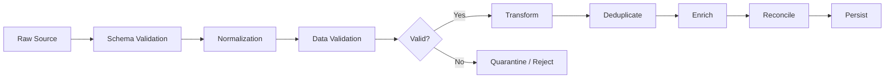
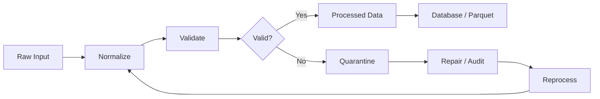
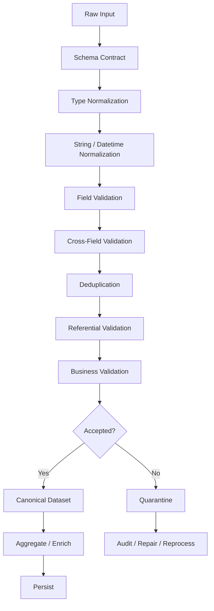

# 19- Data Cleaning Scenarios

## Overview

Data cleaning is one of the most common real-world uses of Pandas and one of the most common sources of ETL failures.

Production data rarely arrives in a clean tabular form. Typical problems include:

```text
missing values
incorrect dtypes
duplicate records
invalid identifiers
inconsistent casing
unexpected whitespace
malformed timestamps
negative or impossible amounts
schema drift
broken references
out-of-range values
partial records
unexpected categories
```

The goal of data cleaning is not to make data "look clean."

The goal is to transform unreliable source data into a dataset with:

```text
known schema
known semantics
validated values
deterministic transformations
traceable exceptions
```

A strong production workflow is:



The senior-level question is not:

> "How do I remove the bad rows?"

It is:

> "What makes a row invalid, who owns the rule, what should happen to invalid data, and how can the pipeline prove that it handled the data correctly?"

---

## Cleaning vs Validation

These concepts are related but distinct.

| Concept | Purpose |
|---|---|
| Normalization | Convert equivalent representations into a consistent form |
| Cleaning | Correct or remove known data-quality problems |
| Validation | Determine whether data satisfies a contract |
| Quarantine | Isolate records that should not continue |
| Reconciliation | Compare input/output metrics to prove correctness |

Example:

```text
" COMPLETED "
    ↓
strip + lowercase
    ↓
"completed"
    ↓
validate against allowed statuses
```

Normalization makes the representation consistent.

Validation determines whether the resulting value is acceptable.

---

## Establish a Data Contract

Before writing cleaning logic, define:

```text
required columns
allowed dtypes
nullable fields
valid categories
valid ranges
identifier format
timestamp semantics
duplicate identity
referential rules
failure policy
```

Example:

```python
ORDER_COLUMNS = [
    "order_id",
    "customer_id",
    "created_at",
    "status",
    "amount",
]

ALLOWED_STATUSES = {
    "pending",
    "completed",
    "cancelled",
}
```

A data contract prevents the pipeline from becoming a collection of ad hoc fixes.

---

## Scenario: Unexpected Columns

Suppose the expected schema is:

```text
order_id
customer_id
created_at
status
amount
```

but the source adds:

```text
internal_note
```

A strict pipeline can reject the input:

```python
expected = {
    "order_id",
    "customer_id",
    "created_at",
    "status",
    "amount",
}

unexpected = set(
    frame.columns
).difference(expected)

if unexpected:
    raise ValueError(
        f"Unexpected columns: {sorted(unexpected)}"
    )
```

Whether extra columns should fail depends on the source contract.

---

## Scenario: Missing Required Columns

```python
required = {
    "order_id",
    "customer_id",
    "created_at",
    "status",
    "amount",
}

missing = required.difference(
    frame.columns
)

if missing:
    raise ValueError(
        f"Missing columns: {sorted(missing)}"
    )
```

Failing early is usually safer than allowing an incomplete schema to reach later transformations.

---

## Scenario: Column Name Normalization

External files may contain:

```text
Order ID
order_id
ORDER_ID
OrderId
```

Normalize only when this is part of the source contract:

```python
frame = frame.rename(
    columns=lambda column: (
        str(column)
        .strip()
        .lower()
        .replace(" ", "_")
    )
)
```

Then validate against the canonical schema.

Do not silently normalize arbitrary names if column names themselves carry source-system semantics.

---

## Scenario: Wrong Numeric Types

Suppose:

```text
amount
"1000.50"
"2,500.00"
"N/A"
""
```

Normalize deliberately:

```python
amount = (
    frame["amount"]
    .astype("string")
    .str.strip()
    .str.replace(
        ",",
        "",
        regex=False,
    )
)

frame["amount"] = pd.to_numeric(
    amount,
    errors="coerce",
)
```

Then identify conversion failures:

```python
invalid_amount = (
    frame["amount"].isna()
    & amount.notna()
    & amount.ne("")
)
```

Do not silently convert malformed financial values into zero.

---

## Scenario: Invalid Numeric Ranges

A successfully parsed number can still be invalid.

For example:

```text
quantity = -5
amount = -100
discount = 900
```

Define business constraints:

```python
invalid_quantity = (
    frame["quantity"] < 0
)

invalid_amount = (
    frame["amount"] < 0
)

invalid = (
    invalid_quantity
    | invalid_amount
)
```

Then quarantine or reject:

```python
quarantine = frame.loc[
    invalid
].copy()

valid = frame.loc[
    ~invalid
].copy()
```

---

## Scenario: Percentage Validation

Suppose:

```text
discount_rate
```

must be between:

```text
0 and 1
```

Validate:

```python
invalid = (
    frame["discount_rate"].lt(0)
    | frame["discount_rate"].gt(1)
)

if invalid.any():
    raise ValueError(
        "Invalid discount rate"
    )
```

Do not confuse formatting with semantics:

```text
"20%"
```

may require conversion to:

```text
0.20
```

before validation.

---

## Scenario: String Normalization

Normalize controlled dimensions:

```python
frame["status"] = (
    frame["status"]
    .astype("string")
    .str.strip()
    .str.lower()
)
```

Then validate:

```python
invalid_status = ~frame[
    "status"
].isin(ALLOWED_STATUSES)
```

Keep normalization and validation as separate steps so each can be tested independently.

---

## Scenario: Empty Strings

These are distinct:

```text
NULL
""
" "
"unknown"
"n/a"
```

Normalize whitespace first:

```python
frame["email"] = (
    frame["email"]
    .astype("string")
    .str.strip()
)
```

Then decide whether empty strings should become missing:

```python
frame["email"] = frame[
    "email"
].replace(
    {
        "": pd.NA,
    }
)
```

Do not automatically convert every placeholder to missing without documenting the mapping.

---

## Scenario: Placeholder Values

Legacy systems often use:

```text
N/A
NA
NULL
NONE
UNKNOWN
-
?
```

Create an explicit policy:

```python
MISSING_MARKERS = {
    "",
    "N/A",
    "NA",
    "NULL",
    "NONE",
    "-",
    "?",
}

status = (
    frame["status"]
    .astype("string")
    .str.strip()
    .str.upper()
)

frame["status"] = status.replace(
    {
        marker: pd.NA
        for marker in MISSING_MARKERS
    }
)
```

Be careful with legitimate values that happen to resemble placeholders.

---

## Scenario: Missing Values

Use:

```python
frame.isna()
```

and:

```python
frame.notna()
```

to inspect missingness.

Example:

```python
missing_rate = (
    frame.isna().mean()
    .sort_values(
        ascending=False
    )
)

print(missing_rate)
```

Missingness should be measured before deciding how to repair it.

---

## Scenario: Filling Missing Values

Different fields require different policies.

For example:

```python
frame["country"] = (
    frame["country"]
    .fillna("unknown")
)
```

This may be acceptable for a reporting dimension.

For financial amounts, it may be unsafe:

```python
frame["amount"] = frame[
    "amount"
].fillna(0)
```

unless the source contract explicitly defines missing amount as zero.

---

## Scenario: Group-Aware Imputation

Suppose employee salary is missing and the agreed rule is to use the department median:

```python
frame["salary"] = (
    frame.groupby("department")[
        "salary"
    ]
    .transform(
        lambda series:
            series.fillna(
                series.median()
            )
    )
)
```

This is a transformation with business assumptions.

Document the rule and test it.

Do not use global imputation when the business meaning is group-specific.

---

## Scenario: Missing Identifier

Missing business keys are usually more serious than missing descriptive fields.

Example:

```python
missing_id = frame[
    "order_id"
].isna()
```

A safe policy is often:

```text
quarantine or reject
```

rather than inventing an identifier.

Generating arbitrary IDs can break:

```text
idempotency
deduplication
referential integrity
auditability
```

---

## Scenario: Duplicate Records

First define the identity:

```python
duplicate_mask = frame[
    "order_id"
].duplicated(
    keep=False
)
```

Then inspect:

```python
duplicates = frame.loc[
    duplicate_mask
].sort_values(
    "order_id"
)
```

Do not remove duplicates until the winning-record rule is known.

---

## Scenario: Latest Record Wins

If the source guarantees:

```text
updated_at
```

as the authoritative version field:

```python
frame = frame.sort_values(
    "updated_at"
)

frame = frame.drop_duplicates(
    subset=["order_id"],
    keep="last",
)
```

This implements a deterministic policy.

If two records have identical `updated_at` values, add a deterministic tie-breaker such as:

```text
source_sequence
ingestion_id
version_number
```

---

## Scenario: Conflicting Duplicates

Suppose two records share:

```text
order_id = O-1001
```

but contain different amounts:

```text
100
125
```

This is not a simple duplicate.

Detect:

```python
conflicts = (
    frame
    .groupby("order_id")
    .agg(
        amount_variants=(
            "amount",
            "nunique",
        )
    )
)

conflicting_ids = conflicts.loc[
    conflicts["amount_variants"] > 1
].index
```

Then route those records to investigation instead of arbitrarily keeping one.

---

## Scenario: Duplicate Normalized Identifiers

Before deduplication, normalize first:

```python
frame["customer_id"] = (
    frame["customer_id"]
    .astype("string")
    .str.strip()
    .str.upper()
)
```

Otherwise:

```text
cust-100
CUST-100
 cust-100
```

may be incorrectly treated as separate entities.

---

## Scenario: Malformed Email

Normalize:

```python
frame["email"] = (
    frame["email"]
    .astype("string")
    .str.strip()
    .str.lower()
)
```

Validate a basic structural contract:

```python
valid_email = frame[
    "email"
].str.fullmatch(
    r"[^@\s]+@[^@\s]+\.[^@\s]+",
    na=False,
)
```

This is only structural validation.

It does not prove:

```text
mailbox exists
domain is reachable
address belongs to the user
```

---

## Scenario: Phone Numbers

A common normalization:

```python
frame["phone"] = (
    frame["phone"]
    .astype("string")
    .str.replace(
        r"\D+",
        "",
        regex=True,
    )
)
```

Do not treat this as full validation.

Phone numbers depend on:

```text
country
numbering plan
extensions
international prefixes
```

For production identity systems, use a dedicated phone-number validation strategy.

---

## Scenario: Product Codes

A product code may require:

```text
uppercase
trim whitespace
fixed length
allowed character set
```

Example:

```python
frame["sku"] = (
    frame["sku"]
    .astype("string")
    .str.strip()
    .str.upper()
)

valid = frame["sku"].str.fullmatch(
    r"SKU-\d{8}",
    na=False,
)
```

Do not silently repair malformed identifiers unless the source contract explicitly allows deterministic correction.

---

## Scenario: Datetime Parsing

Parse timestamps at the ingestion boundary:

```python
frame["created_at"] = pd.to_datetime(
    frame["created_at"],
    utc=True,
    errors="coerce",
)
```

Then identify failures:

```python
invalid_datetime = frame[
    "created_at"
].isna()
```

For critical timestamps, invalid parsing should often trigger quarantine or batch failure.

---

## Scenario: Ambiguous Date Formats

A value such as:

```text
01/02/2026
```

is ambiguous.

Do not guess whether it represents:

```text
January 2
```

or:

```text
February 1
```

A production contract should specify an unambiguous format such as:

```text
YYYY-MM-DD
```

or ISO 8601.

---

## Scenario: Timezone Normalization

API timestamps may be:

```text
2026-01-15T10:30:00Z
```

Normalize:

```python
frame["created_at"] = pd.to_datetime(
    frame["created_at"],
    utc=True,
    errors="raise",
)
```

A consistent UTC representation avoids many distributed-system bugs.

---

## Scenario: Impossible Dates

A timestamp can be syntactically valid and still violate business logic.

Example:

```text
completed_at < created_at
```

Validate:

```python
invalid = (
    frame["completed_at"]
    < frame["created_at"]
)

if invalid.any():
    raise ValueError(
        "Completion precedes creation"
    )
```

This is semantic validation, not parsing.

---

## Scenario: Future Timestamps

```python
now = pd.Timestamp.now(
    tz="UTC"
)

future = frame.loc[
    frame["created_at"] > now
]
```

Allow reasonable clock skew if the source requires it.

Do not reject all future timestamps blindly when distributed systems may have small clock differences.

---

## Scenario: Referential Integrity

Suppose orders reference customers.

Find broken references:

```python
missing_customers = (
    orders[
        ~orders["customer_id"].isin(
            customers["customer_id"]
        )
    ]
)
```

For large datasets, a merge with an indicator can be more expressive:

```python
checked = orders.merge(
    customers[
        ["customer_id"]
    ].drop_duplicates(),
    on="customer_id",
    how="left",
    indicator=True,
)

missing_customers = checked.loc[
    checked["_merge"].eq("left_only")
]
```

The appropriate approach depends on dataset size and whether additional customer attributes are required.

---

## Scenario: Orphaned Products

Suppose transactions reference product IDs.

```python
transactions = transactions.merge(
    products[
        ["product_id"]
    ],
    on="product_id",
    how="left",
    indicator=True,
)

orphans = transactions.loc[
    transactions["_merge"].eq(
        "left_only"
    )
]
```

Do not silently replace missing product information with arbitrary defaults unless the business rule supports it.

---

## Scenario: Currency Codes

Normalize:

```python
frame["currency"] = (
    frame["currency"]
    .astype("string")
    .str.strip()
    .str.upper()
)
```

Validate against a controlled reference list:

```python
allowed_currencies = {
    "INR",
    "USD",
    "EUR",
    "GBP",
}

invalid = ~frame[
    "currency"
].isin(
    allowed_currencies
)
```

For financial systems, the authoritative list should generally come from a maintained domain reference rather than a hardcoded ad hoc set.

---

## Scenario: Country Codes

Normalize:

```python
frame["country_code"] = (
    frame["country_code"]
    .astype("string")
    .str.strip()
    .str.upper()
)
```

Validate format:

```python
invalid = ~frame[
    "country_code"
].str.fullmatch(
    r"[A-Z]{2}",
    na=False,
)
```

Format validation and semantic validation are separate concerns.

---

## Scenario: Status Transitions

Suppose an order status can move through:

```text
pending
→ processing
→ completed
```

but should not move:

```text
completed
→ pending
```

This requires comparing current and previous states.

For ordered records:

```python
events = events.sort_values(
    [
        "order_id",
        "updated_at",
    ]
)

previous_status = (
    events
    .groupby("order_id")["status"]
    .shift()
)

invalid_transition = (
    previous_status.eq("completed")
    & events["status"].eq("pending")
)
```

This is an example of validation that depends on record history.

---

## Scenario: Negative Revenue

Negative transactions may be:

```text
invalid
refund
chargeback
adjustment
```

Do not simply remove them.

Classify by business meaning:

```python
refunds = transactions.loc[
    transactions["transaction_type"]
    .eq("refund")
]

invalid_negative = transactions.loc[
    transactions["amount"].lt(0)
    & transactions["transaction_type"].ne(
        "refund"
    )
]
```

Cleaning should preserve valid business events.

---

## Scenario: Discount Greater Than Amount

Validate cross-field consistency:

```python
invalid = (
    frame["discount"].lt(0)
    | frame["discount"].gt(
        frame["gross_amount"]
    )
)
```

Column-level range checks cannot catch all invalid records.

Production validation should include:

```text
field constraints
+
cross-field constraints
```

---

## Scenario: Start Date After End Date

For subscriptions:

```python
invalid = (
    frame["start_date"]
    > frame["end_date"]
)
```

Quarantine or reject records where the relationship violates the business contract.

---

## Scenario: Employee Hire Date

Suppose:

```text
hire_date
termination_date
```

must satisfy:

```text
hire_date <= termination_date
```

Validate:

```python
invalid = (
    frame["termination_date"].notna()
    & (
        frame["hire_date"]
        > frame["termination_date"]
    )
)
```

A nullable end date may represent an active employee.

---

## Scenario: Mixed Encodings and Whitespace

Legacy files can include:

```text
" John Doe "
"John Doe"
```

where the second value contains a non-breaking space.

For robust normalization:

```python
frame["name"] = (
    frame["name"]
    .astype("string")
    .str.replace(
        "\u00a0",
        " ",
        regex=False,
    )
    .str.strip()
    .str.replace(
        r"\s+",
        " ",
        regex=True,
    )
)
```

Do not apply aggressive normalization to fields where exact formatting matters.

---

## Scenario: Unicode Normalization

Names and identifiers may contain visually equivalent Unicode forms.

Python can normalize Unicode strings:

```python
import unicodedata

frame["name"] = frame["name"].map(
    lambda value: (
        unicodedata.normalize(
            "NFC",
            value,
        )
        if value is not None
        else value
    )
)
```

Use Unicode normalization only when the field contract requires it.

For high-volume workloads, benchmark Python-level normalization before adding it to a critical pipeline.

---

## Scenario: Data Type Drift

A source may change:

```text
quantity = 5
```

into:

```text
quantity = "5"
```

Validate expected dtypes after parsing:

```python
if not pd.api.types.is_numeric_dtype(
    frame["quantity"]
):
    raise TypeError(
        "quantity must be numeric"
    )
```

Schema drift should be detected deliberately rather than discovered later through calculation errors.

---

## Scenario: Unexpected Categories

Track category distribution:

```python
counts = (
    frame["status"]
    .value_counts(dropna=False)
)
```

Compare against the expected domain:

```python
unexpected = set(
    frame["status"].dropna().unique()
).difference(
    ALLOWED_STATUSES
)
```

A new category may indicate:

```text
source-system change
business-rule change
data corruption
deployment mismatch
```

Treat it as a signal, not merely an inconvenience.

---

## Scenario: Data Drift

Data drift can involve:

```text
new categories
changed null rate
changed numeric distribution
changed string lengths
changed row volume
```

A mature pipeline monitors trends rather than only validating hard constraints.

For example:

```python
null_rate = (
    frame["email"].isna().mean()
)
```

An increase from:

```text
1%
→
30%
```

may indicate an upstream incident even if the schema is technically valid.

---

## Scenario: Outlier Detection

Some cleaning scenarios require identifying suspicious values rather than invalid values.

Example:

```python
upper = frame["amount"].quantile(
    0.999
)

outliers = frame.loc[
    frame["amount"] > upper
]
```

Statistical outliers are not automatically errors.

Use business thresholds where possible for high-stakes decisions.

---

## Scenario: Duplicate Emails

Normalize before checking uniqueness:

```python
frame["email"] = (
    frame["email"]
    .astype("string")
    .str.strip()
    .str.lower()
)

duplicates = frame.loc[
    frame["email"].duplicated(
        keep=False
    )
]
```

But duplicate email addresses do not necessarily mean duplicate customers.

The business identity must be defined separately.

---

## Scenario: Case-Sensitive Identifiers

Do not lowercase identifiers automatically.

For example:

```text
ABC123
abc123
```

may be distinct values in a source system.

Case normalization should be based on:

```text
source contract
database semantics
business identity
```

not a generic cleaning rule.

---

## Scenario: Product Description Cleaning

Descriptions can contain:

```text
extra whitespace
HTML
control characters
duplicate spaces
```

A basic normalization:

```python
frame["description"] = (
    frame["description"]
    .astype("string")
    .str.replace(
        r"[\r\n\t]+",
        " ",
        regex=True,
    )
    .str.replace(
        r"\s+",
        " ",
        regex=True,
    )
    .str.strip()
)
```

Do not strip HTML or punctuation unless the downstream requirement explicitly needs it.

---

## Scenario: HTML and Rich Text

If product descriptions contain HTML, Pandas string replacement may not be the safest HTML parsing strategy.

Use:

```text
HTML parser
```

rather than complex regex when semantic HTML processing is required.

The general principle is:

> Use a parser for structured formats; use string operations for genuinely textual normalization.

---

## Scenario: JSON Embedded in a Column

Suppose:

```text
metadata
{"plan":"pro","region":"IN"}
```

is stored as a string.

Do not use arbitrary string manipulation to parse it.

Use JSON parsing:

```python
import json

metadata = frame["metadata"].map(
    json.loads
)
```

For invalid JSON:

```python
def parse_json(value):
    if pd.isna(value):
        return None

    try:
        return json.loads(value)
    except json.JSONDecodeError:
        return None
```

Then validate the resulting structure.

---

## Scenario: Nested API Payloads

Normalize nested JSON into tabular form:

```python
orders = pd.json_normalize(
    payload,
    record_path=["orders"],
    meta=["customer_id"],
)
```

Then apply normal cleaning:

```text
schema validation
dtype normalization
missing-value handling
business validation
deduplication
```

`json_normalize()` addresses structure; it does not replace data-quality validation.

---

## Scenario: Invalid Records and Quarantine

A useful pattern:

```python
valid_mask = (
    frame["order_id"].notna()
    & frame["customer_id"].notna()
    & frame["amount"].notna()
    & frame["amount"].ge(0)
)

valid = frame.loc[
    valid_mask
].copy()

quarantine = frame.loc[
    ~valid_mask
].copy()
```

Preserve the original raw values where possible.

Add metadata:

```python
quarantine = quarantine.assign(
    rejection_reason="validation_failed",
    pipeline_stage="order_normalization",
)
```

For more precise reporting, calculate reason-specific masks instead of using one generic failure category.

---

## Multiple Validation Errors

A row may fail several rules.

Rather than stopping at the first error:

```python
reasons = pd.Series(
    "",
    index=frame.index,
    dtype="string",
)

reasons = reasons.mask(
    frame["order_id"].isna(),
    reasons + "missing_order_id;",
)

reasons = reasons.mask(
    frame["amount"].lt(0),
    reasons + "negative_amount;",
)
```

For larger validation systems, a structured validation framework may be preferable to building increasingly complex string accumulation logic.

---

## Validation Order

A useful sequence is:

```text
schema
↓
type conversion
↓
normalization
↓
field-level validation
↓
cross-field validation
↓
duplicate validation
↓
referential validation
↓
business-state validation
```

This order reduces false failures.

For example, validate:

```text
" COMPLETED "
```

after normalizing it to:

```text
"completed"
```

rather than rejecting the raw representation prematurely.

---

## Scenario: Cleaning Before Joining

Normalize keys before joining:

```python
orders["customer_id"] = (
    orders["customer_id"]
    .astype("string")
    .str.strip()
    .str.upper()
)

customers["customer_id"] = (
    customers["customer_id"]
    .astype("string")
    .str.strip()
    .str.upper()
)
```

Then:

```python
orders = orders.merge(
    customers,
    on="customer_id",
    how="left",
    validate="many_to_one",
)
```

Otherwise logically equivalent keys may fail to match.

---

## Scenario: Cleaning After Joining

Sometimes a source relationship itself exposes invalid data.

After:

```python
orders.merge(
    customers,
    on="customer_id",
    how="left",
)
```

validate:

```python
missing_country = orders[
    "country"
].isna()
```

The cleaning workflow may therefore contain:

```text
clean
→ join
→ validate relationship
→ further clean
```

Cleaning is not necessarily one isolated step.

---

## Scenario: Null Join Keys

Records with missing join keys require explicit policy.

Example:

```python
missing_keys = orders.loc[
    orders["customer_id"].isna()
]
```

Possible outcomes:

```text
quarantine
drop
route to manual repair
retain as unmatched
```

Do not assume Pandas join behavior automatically matches business semantics.

---

## Scenario: Duplicate Dimension Keys

Before:

```python
orders.merge(
    customers,
    on="customer_id",
)
```

check:

```python
if not customers[
    "customer_id"
].is_unique:
    raise ValueError(
        "Customer dimension contains duplicate keys"
    )
```

This is especially important for:

```text
reference tables
dimension tables
configuration tables
master data
```

---

## Scenario: Cleaning Before GroupBy

Aggregation is only correct if the source rows are valid.

Bad:

```python
revenue = (
    orders
    .groupby("customer_id")["amount"]
    .sum()
)
```

when:

```text
duplicates
invalid amounts
wrong currencies
```

may still exist.

Preferred:

```text
normalize
→ validate
→ deduplicate
→ aggregate
```

---

## Scenario: Currency Consistency

Never sum different currencies directly:

```python
orders.groupby("customer_id")[
    "amount"
].sum()
```

if:

```text
INR
USD
EUR
```

are mixed.

First:

```text
validate currency
→ obtain rates
→ convert
→ aggregate
```

Cleaning includes semantic consistency, not just syntax.

---

## Scenario: Unit Normalization

Inventory may arrive as:

```text
kg
g
lb
```

Normalize to one canonical unit:

```text
grams
```

For example:

```python
inventory["quantity_grams"] = np.select(
    [
        inventory["unit"].eq("kg"),
        inventory["unit"].eq("g"),
        inventory["unit"].eq("lb"),
    ],
    [
        inventory["quantity"] * 1000,
        inventory["quantity"],
        inventory["quantity"] * 453.59237,
    ],
    default=np.nan,
)
```

Validate unsupported units separately.

---

## Scenario: Date-Based Cleaning

A transaction may be valid only within an operational window.

Example:

```python
start = pd.Timestamp(
    "2026-01-01",
    tz="UTC",
)

end = pd.Timestamp(
    "2027-01-01",
    tz="UTC",
)

outside_window = (
    frame["created_at"].lt(start)
    | frame["created_at"].ge(end)
)
```

Use half-open intervals:

```text
[start, end)
```

for predictable partition boundaries.

---

## Scenario: Future Data from Clock Skew

Distributed systems may produce small future timestamps.

Instead of:

```python
future = frame[
    "created_at" > now
]
```

use a tolerance when appropriate:

```python
future = frame[
    frame["created_at"]
    > now + pd.Timedelta(
        minutes=5
    )
]
```

The tolerance should be defined by infrastructure behavior, not arbitrary preference.

---

## Scenario: Data Cleaning for Reporting

Reporting pipelines often require different cleaning rules than transactional systems.

Example:

```text
NULL country
```

may become:

```text
"Unknown"
```

for a dashboard.

But the raw transactional record should remain unchanged.

A useful architecture is:

```text
raw source
→ normalized source
→ reporting-specific transformation
```

rather than mutating the source-of-truth data.

---

## Scenario: Safe Imputation

A mature cleaning strategy distinguishes:

```text
observed value
imputed value
defaulted value
unknown value
```

For example:

```python
frame["country"] = (
    frame["country"]
    .fillna("unknown")
)
```

If the distinction matters, preserve metadata:

```python
was_missing = frame["country"].isna()

frame["country"] = frame["country"].fillna(
    "unknown"
)

frame["country_was_missing"] = (
    was_missing
)
```

This supports downstream auditing.

---

## Scenario: Data Cleaning for Machine Learning Features

For feature pipelines, cleaning may include:

```text
numeric coercion
missing-value policy
categorical normalization
outlier handling
date feature extraction
deduplication
```

Do not leak future information into historical features.

For example, an imputation rule based on the complete dataset can introduce temporal leakage.

ETL and feature engineering share many mechanics but have different correctness requirements.

---

## Scenario: Cleaning Event Streams

For event data:

```text
event_id
event_type
event_time
received_at
user_id
```

validate:

```python
events["event_time"] = pd.to_datetime(
    events["event_time"],
    utc=True,
    errors="coerce",
)

events["received_at"] = pd.to_datetime(
    events["received_at"],
    utc=True,
    errors="coerce",
)
```

Then calculate ingestion delay:

```python
events["ingestion_delay"] = (
    events["received_at"]
    - events["event_time"]
)
```

This can identify delayed or malformed producers.

---

## Scenario: Data Quality Metrics

Treat cleaning as measurable.

Useful metrics:

```text
total rows
valid rows
rejected rows
missing-field counts
duplicate count
invalid-format count
out-of-range count
referential failures
unknown categories
parse failures
```

Example:

```python
metrics = {
    "input_rows": len(frame),
    "missing_order_id": int(
        frame["order_id"].isna().sum()
    ),
    "negative_amount": int(
        frame["amount"].lt(0).sum()
    ),
    "duplicate_order_id": int(
        frame["order_id"].duplicated().sum()
    ),
}
```

Metrics should be emitted before the batch is discarded or overwritten.

---

## Data Quality Thresholds

Not every anomaly should fail the pipeline.

Example policy:

```text
0% invalid IDs
0% duplicate business keys
< 0.5% optional-field missingness
< 1% quarantined records
```

The thresholds must be domain-specific.

A senior pipeline distinguishes:

```text
hard validation failure
soft quality degradation
informational anomaly
```

---

## Scenario: Quarantine Architecture

A useful design:



Quarantine records should preserve:

```text
original values
rejection reason
source
batch ID
timestamp
pipeline version
```

This makes remediation possible.

---

## Scenario: Cleaning a Large CSV

```python
EXPECTED_COLUMNS = [
    "order_id",
    "customer_id",
    "created_at",
    "status",
    "amount",
]

for chunk in pd.read_csv(
    "orders.csv",
    usecols=EXPECTED_COLUMNS,
    chunksize=100_000,
):
    chunk["order_id"] = (
        chunk["order_id"]
        .astype("string")
        .str.strip()
        .str.upper()
    )

    chunk["status"] = (
        chunk["status"]
        .astype("string")
        .str.strip()
        .str.lower()
    )

    chunk["created_at"] = pd.to_datetime(
        chunk["created_at"],
        utc=True,
        errors="coerce",
    )

    amount = (
        chunk["amount"]
        .astype("string")
        .str.replace(
            ",",
            "",
            regex=False,
        )
    )

    chunk["amount"] = pd.to_numeric(
        amount,
        errors="coerce",
    )

    process_valid_rows(
        chunk
    )
```

For production, separate transformation and validation into reusable functions.

---

## Cleaning Function Design

Prefer pure-ish transformations:

```python
def normalize_orders(
    frame: pd.DataFrame,
) -> pd.DataFrame:
    result = frame.copy()

    result["order_id"] = (
        result["order_id"]
        .astype("string")
        .str.strip()
        .str.upper()
    )

    result["status"] = (
        result["status"]
        .astype("string")
        .str.strip()
        .str.lower()
    )

    result["created_at"] = pd.to_datetime(
        result["created_at"],
        utc=True,
        errors="coerce",
    )

    return result
```

Then validation can be isolated:

```python
def validate_orders(
    frame: pd.DataFrame,
) -> pd.DataFrame:
    ...
```

This makes testing easier.

---

## Transformation vs Mutation

Prefer explicit ownership:

```python
clean = normalize_orders(
    raw
)
```

rather than unexpectedly mutating:

```python
raw["status"] = ...
```

When the raw dataset must remain available for replay or auditing, returning a separate transformed object is often safer.

---

## Cleaning Pipelines and Method Chains

A readable chain:

```python
cleaned = (
    orders
    .assign(
        status=lambda df: (
            df["status"]
            .astype("string")
            .str.strip()
            .str.lower()
        )
    )
    .assign(
        created_at=lambda df:
            pd.to_datetime(
                df["created_at"],
                utc=True,
                errors="coerce",
            )
    )
)
```

Avoid deeply nested chains when intermediate validation decisions become difficult to inspect.

---

## Production Performance

Cleaning can become expensive when processing millions of rows.

Prefer:

```text
vectorized string operations
vectorized numeric conversion
vectorized datetime parsing
boolean masks
batch processing
source-side filtering
```

Avoid:

```text
iterrows
row-wise apply
per-row database queries
repeated copies
```

The transformation must remain memory-bounded for large inputs.

---

## Database Pushdown

If PostgreSQL can safely perform:

```text
trim
filter
cast
join
aggregate
```

consider doing it before extraction.

For example:

```sql
SELECT
    TRIM(customer_id) AS customer_id,
    LOWER(TRIM(status)) AS status,
    amount
FROM orders
WHERE status IS NOT NULL;
```

However, source systems should not become giant application-level transformation engines for every complex rule.

Choose the layer that owns the semantics and minimizes total system cost.

---

## Cleaning and Parquet

After cleaning, persist a typed intermediate:

```python
cleaned.to_parquet(
    "processed/orders.parquet",
    index=False,
)
```

This creates a stable boundary for downstream jobs.

The processed dataset can then be consumed by:

```text
Pandas
DuckDB
Athena
Spark
reporting jobs
analytics workloads
```

---

## Cleaning and PostgreSQL

A common architecture:

```text
Raw API / CSV
    ↓
Pandas normalization
    ↓
validation
    ↓
Parquet / staging table
    ↓
PostgreSQL constraints
    ↓
production data
```

The database remains the authoritative persistence layer.

Pandas handles source-specific transformations.

---

## Security Considerations

Cleaning pipelines frequently handle sensitive data.

Avoid logging:

```text
email addresses
phone numbers
account numbers
payment data
tokens
full request bodies
```

Instead log:

```text
row count
record hash
batch ID
field name
error category
```

For example:

```python
logger.warning(
    "invalid_order_amount",
    extra={
        "batch_id": batch_id,
        "row_count": int(invalid.sum()),
    },
)
```

---

## Tenant Isolation

In a multi-tenant pipeline, tenant scope should be established before transformation.

For example:

```sql
SELECT
    tenant_id,
    order_id,
    amount
FROM orders
WHERE tenant_id = %(tenant_id)s;
```

Do not combine tenants unnecessarily in memory.

If cross-tenant aggregation is required, make that access boundary explicit and authorized.

---

## Reliability

A cleaning pipeline should be deterministic.

Given:

```text
same source
same configuration
same transformation version
```

it should produce:

```text
same result
```

as far as practical.

Avoid hidden dependencies on:

```text
current time
local timezone
locale
randomness
environment-specific parsing
```

unless explicitly controlled.

---

## Disaster Recovery

Retain raw source data when required for:

```text
reprocessing
backfills
audit
incident response
```

A cleaned dataset alone may not contain enough information to reconstruct the original source.

For critical pipelines:

```text
raw
→ normalized
→ processed
```

should be separate logical stages.

---

## Common Mistakes

### Dropping Every Bad Row

This can silently discard business-critical events.

Classify errors before removal.

### Replacing Every Missing Value with Zero

Zero and missing do not have the same meaning.

### Deduplicating Without a Business Key

Duplicate removal must define record identity.

### Cleaning After Aggregation

Invalid records can contaminate totals before validation.

### Converting Every String to Lowercase

Identifiers may be case-sensitive.

### Using Regex for Structured Formats

Use dedicated parsers for JSON, HTML, timestamps, and other structured formats.

### Using `apply(axis=1)` for Simple Rules

Prefer vectorized logic.

### Loading the Entire Dataset Before Cleaning

For large data, clean in chunks or partitions.

### Silently Repairing Invalid Identifiers

Synthetic corrections can break auditability and idempotency.

### No Quarantine Path

Malformed records then disappear or block the entire pipeline without traceability.

### No Schema Validation

Upstream changes can silently propagate.

### No Reconciliation

The pipeline can succeed technically while producing incomplete data.

### Logging Full Invalid Records

This can expose sensitive information.

### Assuming Chunk-Level Deduplication Is Global Deduplication

Duplicates can occur across chunks.

### Treating Statistical Outliers as Automatically Invalid

Outlier does not necessarily mean incorrect.

---

## Interview Scenarios

### Scenario: CSV Contains Mixed Numeric Formats

You receive:

```text
"1000"
"1,500"
"N/A"
""
```

A strong solution:

```text
normalize string representation
→ remove known formatting
→ numeric conversion
→ detect failures
→ quarantine invalid rows
```

Do not blindly use:

```python
fillna(0)
```

after coercion.

---

### Scenario: 5% of Records Have Missing Customer IDs

Ask:

```text
Is customer_id mandatory?
Can records be processed without it?
Can it be recovered?
Does downstream referential integrity depend on it?
```

If it is a required business key:

```text
quarantine
+
metric
+
alert
```

rather than generating placeholder IDs.

---

### Scenario: Data Doubles After Cleaning and Joining

Investigate:

```text
duplicate source keys
one-to-many relationship
many-to-many relationship
schema mismatch
duplicate extraction
```

Then enforce:

```python
validate="many_to_one"
```

where appropriate.

---

### Scenario: Timestamps Parse Successfully but Reports Are Wrong

Check:

```text
timezone
naive vs aware representation
day boundary
source locale
DST
event time vs ingestion time
```

Valid syntax does not imply correct temporal semantics.

---

### Scenario: Source Adds a New Status

For example:

```text
partially_refunded
```

A strong response:

```text
detect drift
→
reject or quarantine if contract is strict
→
update domain model and validation
→
add tests
→
deploy new transformation version
```

Do not silently map unknown values to:

```text
other
```

unless that behavior is explicitly defined.

---

### Scenario: Cleaning Must Handle 100 GB

A strong approach:

```text
filter/project at source
→
partition
→
chunk
→
normalize
→
validate
→
persist
```

If the required transformations need global state, use:

```text
database
distributed processing
external state
```

rather than forcing everything into one Pandas DataFrame.

---

### Scenario: Need to Clean Before a Daily Report

Use:

```text
raw data
→
schema validation
→
normalization
→
business validation
→
deduplication
→
aggregation
→
reporting
```

Cleaning should happen before metrics are computed.

---

### Scenario: Reprocessing a Failed Batch

A retry should be:

```text
same batch identity
same source boundary
same transformation version
same output key
```

so the result can be safely replaced or upserted.

---

### Scenario: Need to Preserve Invalid Records

Use quarantine:

```text
valid records
→
normal pipeline

invalid records
→
quarantine table / S3
```

Retain:

```text
source
batch_id
error reason
original payload
processing version
```

where policy permits.

---

### Scenario: Cleaning Multiple Sources with Different Schemas

Create source-specific normalization:

```python
db_orders = normalize_db_orders(
    db_orders
)

api_orders = normalize_api_orders(
    api_orders
)

partner_orders = normalize_partner_orders(
    partner_orders
)
```

Then map them into a canonical schema before concatenation.

---

## Advanced Cleaning Decision Framework

Use:

```text
Is the issue representational?
    ↓
normalize it.

Is the issue invalid according to the contract?
    ↓
reject or quarantine.

Is the record valid but incomplete?
    ↓
apply documented imputation/default rules.

Is the record duplicated?
    ↓
apply explicit identity + winner policy.

Does validity depend on another dataset?
    ↓
validate referential integrity.

Does validity depend on record history?
    ↓
validate state transitions.

Does the operation require global state?
    ↓
evaluate database/external/distributed processing.
```

This framework is more reliable than accumulating ad hoc `fillna()`, `dropna()`, and `drop_duplicates()` calls.

---

## Recommended Cleaning Architecture



Each stage should have:

```text
clear inputs
clear outputs
clear failure semantics
test coverage
observable metrics
```

---

## Practical Cleaning Function

```python
import pandas as pd


ALLOWED_STATUSES = {
    "pending",
    "completed",
    "cancelled",
}


def normalize_orders(
    frame: pd.DataFrame,
) -> pd.DataFrame:
    required = {
        "order_id",
        "customer_id",
        "created_at",
        "status",
        "amount",
    }

    missing = required.difference(
        frame.columns
    )

    if missing:
        raise ValueError(
            f"Missing columns: {sorted(missing)}"
        )

    result = frame.copy()

    result["order_id"] = (
        result["order_id"]
        .astype("string")
        .str.strip()
        .str.upper()
    )

    result["customer_id"] = (
        result["customer_id"]
        .astype("string")
        .str.strip()
        .str.upper()
    )

    result["status"] = (
        result["status"]
        .astype("string")
        .str.strip()
        .str.lower()
    )

    result["created_at"] = pd.to_datetime(
        result["created_at"],
        utc=True,
        errors="coerce",
    )

    result["amount"] = pd.to_numeric(
        result["amount"],
        errors="coerce",
    )

    invalid_status = ~result[
        "status"
    ].isin(ALLOWED_STATUSES)

    if invalid_status.any():
        raise ValueError(
            "Unexpected order status"
        )

    return result
```

This function intentionally focuses on:

```text
schema
+
normalization
+
type conversion
+
domain validation
```

rather than performing database I/O or persistence.

---

## Meaningful Tests

Test transformation behavior:

```python
def test_normalize_orders() -> None:
    source = pd.DataFrame(
        {
            "order_id": [" o-1001 "],
            "customer_id": [" c-100 "],
            "created_at": [
                "2026-01-15T10:30:00Z"
            ],
            "status": [" Completed "],
            "amount": ["1,250.50"],
        }
    )

    result = normalize_orders(
        source
    )

    assert result.loc[
        0,
        "order_id",
    ] == "O-1001"

    assert result.loc[
        0,
        "customer_id",
    ] == "C-100"

    assert result.loc[
        0,
        "status",
    ] == "completed"

    assert result.loc[
        0,
        "amount",
    ] == 1250.50

    assert str(
        result["created_at"].dtype
    ).startswith(
        "datetime64[ns, UTC]"
    )
```

---

## Testing Failure Conditions

```python
import pytest


def test_invalid_status_is_rejected() -> None:
    source = pd.DataFrame(
        {
            "order_id": ["O-1"],
            "customer_id": ["C-1"],
            "created_at": [
                "2026-01-15T10:30:00Z"
            ],
            "status": ["unknown-status"],
            "amount": ["100"],
        }
    )

    with pytest.raises(
        ValueError,
        match="Unexpected order status",
    ):
        normalize_orders(
            source
        )
```

Tests should verify failure behavior, not just successful transformations.

---

## Testing Missing and Invalid Data

Add tests for:

```text
missing order ID
invalid timestamp
negative amount
unknown status
duplicate IDs
empty DataFrame
schema drift
invalid foreign key
late timestamp
```

Production bugs often occur at boundaries rather than happy paths.

---

## Operational Checklist

Before deploying a data-cleaning pipeline, verify:

- A source schema and canonical target schema are defined.
- Required columns are validated before transformation.
- Dtypes are normalized explicitly.
- Missing-value semantics are documented.
- String normalization rules are field-specific.
- Datetimes have explicit timezone semantics.
- Numeric parsing failures are detectable.
- Range and cross-field rules are enforced.
- Duplicate identity and winner policies are explicit.
- Referential integrity is validated.
- Business-state rules are tested.
- Invalid rows have a documented fail/quarantine policy.
- Source provenance is preserved where required.
- Global validation requirements are identified.
- Chunked processing is used for large inputs.
- Source-side filtering and projection are used where practical.
- Database joins and aggregations are pushed down when appropriate.
- Data quality metrics are emitted.
- Reconciliation checks validate output correctness.
- Sensitive values are not written to logs.
- Retries are idempotent.
- Backfills and reprocessing are supported.
- Cleaning functions are independently testable.
- Integration tests cover database and storage boundaries.

---

## Key Takeaways

- Production data cleaning starts with a data contract: define schema, types, valid domains, identity, missing-value semantics, and failure behavior before writing transformations.
- Normalize representations before validating business rules, but do not "fix" ambiguous or invalid data without an explicit domain policy.
- Separate accepted, rejected, and quarantined records so bad data becomes observable and recoverable rather than silently discarded.
- Validate relationships and business semantics in addition to individual fields; duplicate keys, invalid joins, impossible dates, and cross-field inconsistencies can corrupt downstream results even when every individual value looks syntactically valid.
- Design cleaning pipelines for scale and operations: push source-side reduction where practical, process large inputs incrementally, preserve lineage, measure data quality, and make retries and reprocessing deterministic.