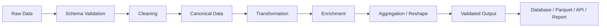
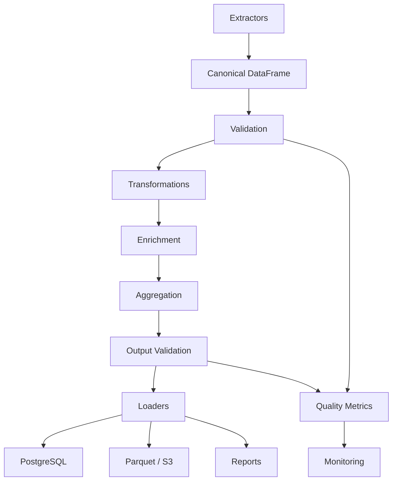

# 20- Data Transformation Scenarios

## Overview

Data transformation is the stage where validated source data is converted into the representation required by downstream systems.

In production Pandas pipelines, transformation may include:

```text
type conversion
normalization
column derivation
conditional logic
aggregation
ranking
joining
reshaping
date calculations
unit conversion
business-rule application
feature creation
```

A transformation should be:

```text
deterministic
testable
explicit
observable
memory-aware
business-rule driven
```

The important engineering distinction is:

```text
Cleaning
→ make source data valid and consistent

Transformation
→ convert valid data into the required business representation
```

A typical flow is:



The goal is not merely to know Pandas syntax. Senior-level transformation work requires answering:

```text
What is the target representation?
Which business rule defines the transformation?
Can the transformation be vectorized?
Where should it execute?
What happens to missing or invalid input?
Is it safe to rerun?
Can it scale?
How is correctness verified?
```

---

## Transformation Design Principles

A strong transformation function should:

- accept explicit inputs
- avoid hidden I/O
- avoid mutating shared state unexpectedly
- preserve important identifiers
- define missing-value behavior
- define dtype expectations
- be deterministic
- be easy to test
- expose enough intermediate logic to debug failures

Prefer:

```python
def calculate_net_amount(
    orders: pd.DataFrame,
) -> pd.DataFrame:
    result = orders.copy()

    result["net_amount"] = (
        result["gross_amount"]
        - result["discount"]
    )

    return result
```

over a function that also:

```text
queries PostgreSQL
calls an API
reads environment variables
writes files
```

Transformation logic should remain separate from orchestration and infrastructure.

---

## Scenario: Deriving a New Column

Suppose orders contain:

```text
gross_amount
discount
tax
```

Derive net amount:

```python
orders["net_amount"] = (
    orders["gross_amount"]
    - orders["discount"]
    + orders["tax"]
)
```

This is vectorized and preferable to row-wise iteration.

The transformation should define:

```text
expected input dtypes
missing-value behavior
units
rounding policy
```

For example, financial amounts may require explicit decimal semantics outside ordinary floating-point calculations.

---

## Scenario: Conditional Classification

Suppose orders are classified by value:

```python
import numpy as np

orders["segment"] = np.select(
    [
        orders["amount"] >= 10_000,
        orders["amount"] >= 5_000,
    ],
    [
        "enterprise",
        "high_value",
    ],
    default="standard",
)
```

This is preferable to:

```python
orders["segment"] = orders.apply(
    classify_order,
    axis=1,
)
```

for simple vectorizable conditions.

---

## Scenario: Multiple Business Rules

When rules become complex, make them explicit.

```python
high_value = orders["amount"].ge(
    10_000
)

repeat_customer = orders[
    "order_count"
].ge(10)

international = orders[
    "country_code"
].ne("IN")

orders["priority"] = np.select(
    [
        high_value & repeat_customer,
        high_value & international,
    ],
    [
        "vip",
        "international_high_value",
    ],
    default="standard",
)
```

Explicit masks are often easier to review and test than deeply nested expressions.

---

## Scenario: Normalize Multiple Related Columns

Suppose customer data contains:

```text
first_name
last_name
country_code
```

Normalize controlled fields:

```python
customers["first_name"] = (
    customers["first_name"]
    .astype("string")
    .str.strip()
)

customers["last_name"] = (
    customers["last_name"]
    .astype("string")
    .str.strip()
)

customers["country_code"] = (
    customers["country_code"]
    .astype("string")
    .str.strip()
    .str.upper()
)
```

Do not apply identical transformations to every string column automatically. Field semantics should determine the rule.

---

## Scenario: Full Name Construction

```python
customers["full_name"] = (
    customers["first_name"]
    .fillna("")
    .str.strip()
    .str.cat(
        customers["last_name"]
        .fillna("")
        .str.strip(),
        sep=" ",
    )
    .str.replace(
        r"\s+",
        " ",
        regex=True,
    )
    .str.strip()
)
```

The transformation explicitly handles missing names.

However, a display name is not necessarily a stable identity key.

Do not use:

```text
full_name
```

as a substitute for:

```text
customer_id
```

---

## Scenario: Standardizing Enum Values

Source systems may use:

```text
Complete
completed
COMPLETED
done
```

Normalize:

```python
status = (
    orders["status"]
    .astype("string")
    .str.strip()
    .str.lower()
)

status = status.replace(
    {
        "complete": "completed",
        "done": "completed",
    }
)

orders["status"] = status
```

Then validate:

```python
allowed = {
    "pending",
    "completed",
    "cancelled",
}

unexpected = ~orders[
    "status"
].isin(allowed)
```

Mapping values should be based on an explicit source-to-canonical contract.

---

## Scenario: Mapping Reference Values

For a small static mapping:

```python
country_names = {
    "IN": "India",
    "US": "United States",
    "GB": "United Kingdom",
}

orders["country_name"] = (
    orders["country_code"]
    .map(country_names)
)
```

Unknown keys become missing values.

Detect them explicitly:

```python
unknown = (
    orders["country_name"].isna()
    & orders["country_code"].notna()
)
```

Do not silently accept missing mappings when the dimension is required.

---

## Scenario: Reference Data Enrichment

For larger or dynamic reference data, use a DataFrame join:

```python
orders = orders.merge(
    countries[
        [
            "country_code",
            "country_name",
            "region",
        ]
    ],
    on="country_code",
    how="left",
    validate="many_to_one",
)
```

Use `map()` for simple one-key value mapping.

Use `merge()` when:

```text
multiple attributes
multiple keys
reference metadata
join validation
```

are required.

---

## Scenario: Date-Based Derived Columns

Normalize timestamps first:

```python
orders["created_at"] = pd.to_datetime(
    orders["created_at"],
    utc=True,
    errors="raise",
)
```

Then derive:

```python
orders["order_date"] = (
    orders["created_at"]
    .dt.normalize()
)

orders["order_month"] = (
    orders["created_at"]
    .dt.to_period("M")
)
```

This prevents downstream logic from repeatedly reparsing timestamps.

---

## Scenario: Age or Duration Calculation

Suppose an order has:

```text
created_at
completed_at
```

Calculate processing duration:

```python
orders["processing_time"] = (
    orders["completed_at"]
    - orders["created_at"]
)

orders["processing_seconds"] = (
    orders["processing_time"]
    .dt.total_seconds()
)
```

Validate impossible states:

```python
invalid = (
    orders["completed_at"]
    < orders["created_at"]
)
```

A valid transformation should not hide invalid source semantics.

---

## Scenario: SLA Classification

Suppose the SLA is:

```text
<= 4 hours → within SLA
> 4 hours  → breached
```

Use:

```python
orders["sla_status"] = np.where(
    orders["processing_seconds"]
    <= 4 * 60 * 60,
    "within_sla",
    "breached",
)
```

This transformation is easy to test because the rule is explicit.

---

## Scenario: Unit Conversion

Inventory may arrive in kilograms:

```python
inventory["quantity_grams"] = (
    inventory["quantity_kg"]
    * 1000
)
```

For multiple units:

```python
inventory["quantity_grams"] = np.select(
    [
        inventory["unit"].eq("kg"),
        inventory["unit"].eq("g"),
        inventory["unit"].eq("lb"),
    ],
    [
        inventory["quantity"] * 1000,
        inventory["quantity"],
        inventory["quantity"] * 453.59237,
    ],
    default=np.nan,
)
```

Validate unsupported units separately.

Never silently treat incompatible units as equivalent.

---

## Scenario: Currency Conversion

Suppose transactions contain:

```text
amount
currency
transaction_date
```

and exchange rates contain:

```text
currency
rate_date
usd_rate
```

Normalize:

```python
transactions["currency"] = (
    transactions["currency"]
    .astype("string")
    .str.strip()
    .str.upper()
)
```

Then enrich:

```python
transactions = transactions.merge(
    fx_rates,
    left_on=[
        "currency",
        "transaction_date",
    ],
    right_on=[
        "currency",
        "rate_date",
    ],
    how="left",
    validate="many_to_one",
)
```

Then:

```python
transactions["amount_usd"] = (
    transactions["amount"]
    * transactions["usd_rate"]
)
```

A production financial transformation must also define:

```text
rate source
rate timestamp
missing-rate policy
rounding
currency precision
```

---

## Scenario: Binning Numeric Values

Suppose customer spending should be grouped into ranges.

Use:

```python
orders["spend_band"] = pd.cut(
    orders["amount"],
    bins=[
        -float("inf"),
        1_000,
        5_000,
        10_000,
        float("inf"),
    ],
    labels=[
        "low",
        "medium",
        "high",
        "enterprise",
    ],
)
```

This is preferable to writing many nested conditionals.

Be explicit about:

```text
boundaries
inclusivity
missing values
labels
```

---

## Scenario: Quantile-Based Segmentation

For customer lifetime value:

```python
customers["value_quartile"] = pd.qcut(
    customers["lifetime_value"],
    q=4,
    labels=[
        "Q1",
        "Q2",
        "Q3",
        "Q4",
    ],
)
```

This creates equal-frequency bins where possible.

Be careful when many values are identical, because quantile binning may encounter duplicate bin edges.

---

## Scenario: Ranking

Rank customers by revenue:

```python
customers["revenue_rank"] = (
    customers["revenue"]
    .rank(
        method="dense",
        ascending=False,
    )
)
```

If ranking within a region:

```python
customers["regional_rank"] = (
    customers
    .groupby("region")["revenue"]
    .rank(
        method="first",
        ascending=False,
    )
)
```

Choose tie semantics explicitly.

---

## Scenario: Top-N Per Group

A common business requirement:

```text
top 3 products per category
```

Example:

```python
top_products = (
    products
    .sort_values(
        [
            "category",
            "revenue",
        ],
        ascending=[
            True,
            False,
        ],
    )
    .groupby(
        "category",
        observed=True,
    )
    .head(3)
)
```

The sort is important because `head()` respects the current row order.

---

## Scenario: Customer Lifetime Value

Suppose order data contains:

```text
customer_id
amount
```

Aggregate:

```python
ltv = (
    orders
    .groupby("customer_id")
    .agg(
        lifetime_value=(
            "amount",
            "sum",
        ),
        order_count=(
            "order_id",
            "nunique",
        ),
    )
    .reset_index()
)
```

Then derive:

```python
ltv["average_order_value"] = (
    ltv["lifetime_value"]
    / ltv["order_count"]
)
```

Check division-by-zero or null behavior before production use.

---

## Scenario: First and Latest Order

Sort first:

```python
orders = orders.sort_values(
    [
        "customer_id",
        "created_at",
    ]
)
```

Then:

```python
customer_dates = (
    orders
    .groupby("customer_id")
    .agg(
        first_order=("created_at", "first"),
        latest_order=("created_at", "last"),
    )
    .reset_index()
)
```

Without explicit ordering, `first` and `last` refer to current row order, not necessarily chronological order.

---

## Scenario: Customer Recency

```python
as_of = pd.Timestamp(
    "2026-09-12",
    tz="UTC",
)

last_order = (
    orders
    .groupby("customer_id")[
        "created_at"
    ]
    .max()
)

recency = (
    as_of
    - last_order
)

recency_days = (
    recency
    .dt.total_seconds()
    / 86_400
)
```

Business reports should use an explicit `as_of` timestamp to remain reproducible.

---

## Scenario: Running Totals

Sort by business time:

```python
orders = orders.sort_values(
    [
        "customer_id",
        "created_at",
    ]
)
```

Then:

```python
orders["customer_revenue"] = (
    orders
    .groupby("customer_id")["amount"]
    .cumsum()
)
```

The result is order-dependent, so deterministic sorting is part of the transformation contract.

---

## Scenario: Percentage of Group Total

```python
orders["customer_total"] = (
    orders
    .groupby("customer_id")["amount"]
    .transform("sum")
)

orders["customer_share"] = (
    orders["amount"]
    / orders["customer_total"]
)
```

`transform()` is appropriate because it preserves the original row shape.

This is preferable to creating a grouped aggregate and then performing a second join when a same-row result is required.

---

## Scenario: Group-Level Normalization

```python
orders["customer_mean"] = (
    orders
    .groupby("customer_id")["amount"]
    .transform("mean")
)

orders["relative_amount"] = (
    orders["amount"]
    / orders["customer_mean"]
)
```

This produces a value relative to the customer's historical average.

Be explicit about:

```text
zero denominators
missing groups
outliers
```

---

## Scenario: Conditional Aggregation

Suppose a customer report needs:

```text
completed revenue
cancelled orders
```

Use named aggregation:

```python
summary = (
    orders
    .groupby("customer_id")
    .agg(
        completed_revenue=(
            "amount",
            lambda values:
                values[
                    orders.loc[
                        values.index,
                        "status",
                    ].eq("completed")
                ].sum(),
        ),
    )
)
```

For large datasets, a clearer and more efficient approach is often to derive conditional columns first:

```python
orders["completed_amount"] = np.where(
    orders["status"].eq("completed"),
    orders["amount"],
    0,
)

summary = (
    orders
    .groupby("customer_id")
    .agg(
        completed_revenue=(
            "completed_amount",
            "sum",
        )
    )
)
```

This keeps the grouping operation simple and vectorized.

---

## Scenario: Pivoting a Reporting Dataset

Starting with:

```text
date
category
revenue
```

create:

```python
report = orders.pivot_table(
    index="date",
    columns="category",
    values="revenue",
    aggfunc="sum",
    fill_value=0,
)
```

Use `pivot_table()` when duplicates exist and an aggregation rule is required.

---

## Scenario: Melting Wide Data

Suppose a report contains:

```text
date
books
electronics
furniture
```

Convert to long form:

```python
long = report.melt(
    id_vars="date",
    var_name="category",
    value_name="revenue",
)
```

This is useful when a downstream pipeline expects:

```text
date
category
revenue
```

rather than one column per category.

---

## Scenario: Wide-to-Long API Normalization

An API may return:

```text
date
revenue_us
revenue_eu
revenue_asia
```

Normalize:

```python
long = data.melt(
    id_vars="date",
    value_vars=[
        "revenue_us",
        "revenue_eu",
        "revenue_asia",
    ],
    var_name="metric",
    value_name="value",
)
```

Then derive the region:

```python
long["region"] = (
    long["metric"]
    .str.removeprefix("revenue_")
)
```

This creates a reusable normalized representation.

---

## Scenario: Combining Data from Multiple Systems

Suppose:

```text
orders
customers
products
```

are extracted independently.

A common transformation sequence is:

```text
orders
→ customer enrichment
→ product enrichment
→ derived business fields
→ aggregate
```

Example:

```python
orders = orders.merge(
    customers[
        [
            "customer_id",
            "country",
            "segment",
        ]
    ],
    on="customer_id",
    how="left",
    validate="many_to_one",
)

orders = orders.merge(
    products[
        [
            "product_id",
            "category",
            "cost",
        ]
    ],
    on="product_id",
    how="left",
    validate="many_to_one",
)
```

After each join, validate expected row counts and missing references.

---

## Scenario: Gross Margin

Suppose each order line contains:

```text
revenue
cost
```

derive:

```python
orders["gross_margin"] = (
    orders["revenue"]
    - orders["cost"]
)

orders["gross_margin_pct"] = (
    orders["gross_margin"]
    / orders["revenue"]
)
```

Handle zero revenue explicitly:

```python
orders["gross_margin_pct"] = np.where(
    orders["revenue"].ne(0),
    orders["gross_margin"]
    / orders["revenue"],
    np.nan,
)
```

This prevents division-by-zero from silently producing misleading metrics.

---

## Scenario: Order State Derivation

Suppose:

```text
payment_status
shipment_status
```

must determine a customer-facing order state.

Use explicit logic:

```python
orders["display_status"] = np.select(
    [
        orders["payment_status"].eq(
            "failed"
        ),
        orders["shipment_status"].eq(
            "delivered"
        ),
        orders["payment_status"].eq(
            "paid"
        )
        & orders["shipment_status"].eq(
            "shipped"
        ),
    ],
    [
        "payment_failed",
        "delivered",
        "shipped",
    ],
    default="processing",
)
```

Keep state precedence explicit.

---

## Scenario: Feature Engineering

For customer activity:

```python
customer_metrics = (
    events
    .groupby("customer_id")
    .agg(
        event_count=(
            "event_id",
            "nunique",
        ),
        active_days=(
            "event_date",
            "nunique",
        ),
    )
    .reset_index()
)
```

Then derive:

```python
customer_metrics["engagement_rate"] = (
    customer_metrics["active_days"]
    / customer_metrics["event_count"]
)
```

The denominator semantics should be documented because a mathematically valid formula can still be a poor business metric.

---

## Scenario: Sessionization

Suppose events contain:

```text
user_id
created_at
```

and a new session begins after 30 minutes of inactivity.

Sort:

```python
events = events.sort_values(
    [
        "user_id",
        "created_at",
    ]
)
```

Calculate gaps:

```python
gap = (
    events
    .groupby("user_id")["created_at"]
    .diff()
)

events["new_session"] = (
    gap.isna()
    | gap.gt(
        pd.Timedelta(minutes=30)
    )
)
```

Then assign session numbers:

```python
events["session_number"] = (
    events
    .groupby("user_id")[
        "new_session"
    ]
    .cumsum()
)
```

This is a good example of a transformation whose correctness depends on sorting and group boundaries.

---

## Scenario: Cohort Month

For user signup cohorts:

```python
customers["signup_month"] = (
    customers["signup_date"]
    .dt.to_period("M")
)
```

For event month:

```python
events["event_month"] = (
    events["event_date"]
    .dt.to_period("M")
)
```

Then combine the dimensions:

```python
cohort = events.merge(
    customers[
        [
            "customer_id",
            "signup_month",
        ]
    ],
    on="customer_id",
    how="left",
    validate="many_to_one",
)
```

This creates the basis for cohort reporting.

---

## Scenario: Retention Matrix

Aggregate customer activity:

```python
retention = (
    cohort
    .groupby(
        [
            "signup_month",
            "event_month",
        ]
    )["customer_id"]
    .nunique()
    .unstack(
        "event_month"
    )
)
```

The resulting matrix can then be normalized into percentages.

For large reporting workloads, perform initial aggregation in SQL when possible.

---

## Scenario: Rolling Metrics

For time-series data:

```python
daily = (
    orders
    .set_index("created_at")
    .sort_index()
)

daily_revenue = (
    daily["amount"]
    .resample("D")
    .sum()
)

rolling_7d = (
    daily_revenue
    .rolling("7D")
    .sum()
)
```

The index must be valid datetime data and correctly ordered.

---

## Scenario: Rolling Customer Metrics

For customer-specific rolling calculations, preserve ordering:

```python
orders = orders.sort_values(
    [
        "customer_id",
        "created_at",
    ]
)
```

Use grouped rolling operations where appropriate:

```python
orders["rolling_30d"] = (
    orders
    .set_index("created_at")
    .groupby("customer_id")[
        "amount"
    ]
    .rolling("30D")
    .sum()
    .reset_index(
        level=0,
        drop=True,
    )
)
```

Complex rolling transformations should be benchmarked and tested carefully because index alignment can become non-obvious.

---

## Scenario: Data Masking

For non-production reporting:

```python
customers["email_domain"] = (
    customers["email"]
    .astype("string")
    .str.split("@")
    .str[-1]
)

customers["email"] = (
    customers["email_domain"]
    .radd("***@")
)
```

More robust masking should preserve the appropriate format without exposing sensitive values.

Transformation pipelines should distinguish:

```text
production data
```

from:

```text
sanitized analytical/reporting data
```

---

## Scenario: Hashing Identifiers

For pseudonymized analytics:

```python
import hashlib


def hash_identifier(
    value: str,
) -> str:
    return hashlib.sha256(
        value.encode("utf-8")
    ).hexdigest()


customers["customer_key"] = (
    customers["customer_id"]
    .astype("string")
    .map(
        lambda value:
            hash_identifier(value)
            if pd.notna(value)
            else None
    )
)
```

For large workloads, Python-level hashing should be benchmarked.

Security requirements may also require:

```text
salt management
keyed hashing
tokenization
access controls
```

rather than plain SHA-256.

---

## Scenario: Dimension Expansion

Suppose orders contain:

```text
product_id
quantity
```

and product metadata contains:

```text
product_id
category
brand
unit_cost
```

Enrich first:

```python
orders = orders.merge(
    products[
        [
            "product_id",
            "category",
            "brand",
            "unit_cost",
        ]
    ],
    on="product_id",
    how="left",
    validate="many_to_one",
)
```

Then derive:

```python
orders["cost"] = (
    orders["quantity"]
    * orders["unit_cost"]
)

orders["margin"] = (
    orders["amount"]
    - orders["cost"]
)
```

This ordering makes the data flow explicit.

---

## Scenario: Aggregating After Enrichment

Once dimensions are available:

```python
category_report = (
    orders
    .groupby(
        "category",
        observed=True,
    )
    .agg(
        revenue=("amount", "sum"),
        cost=("cost", "sum"),
        orders=("order_id", "nunique"),
    )
    .reset_index()
)
```

Then:

```python
category_report["margin"] = (
    category_report["revenue"]
    - category_report["cost"]
)
```

This is often clearer than calculating every metric in one complex aggregation.

---

## Scenario: Transformation with `assign()`

Method chains can keep related transformations together:

```python
result = (
    orders
    .assign(
        created_at=lambda df:
            pd.to_datetime(
                df["created_at"],
                utc=True,
                errors="raise",
            ),
        order_date=lambda df:
            df["created_at"].dt.normalize(),
        net_amount=lambda df:
            df["gross_amount"]
            - df["discount"],
    )
)
```

Later expressions can refer to columns created earlier in the same `assign()` chain.

Use this when it improves readability; avoid excessively long chains.

---

## Scenario: `map()` vs `apply()` vs Vectorization

| Requirement | Preferred approach |
|---|---|
| dictionary mapping | `Series.map()` |
| simple arithmetic | vectorized expression |
| conditional classification | `np.select()` / `where()` |
| string transformation | `.str` |
| group-preserving calculation | `transform()` |
| grouped aggregation | `agg()` |
| arbitrary row-wise Python logic | `apply(axis=1)` only when necessary |

The correct question is:

```text
Can Pandas already express this operation?
```

If yes, prefer the native operation.

---

## Scenario: Transformation with `transform()`

Suppose orders need the customer's total:

```python
orders["customer_total"] = (
    orders
    .groupby("customer_id")["amount"]
    .transform("sum")
)
```

`transform()` returns a Series aligned with the original DataFrame.

This makes it suitable for:

```text
percent-of-group calculations
group normalization
group-level flags
```

without manually merging the aggregate back.

---

## Scenario: Group-Level Flag

Mark orders above the customer's average:

```python
orders["customer_avg"] = (
    orders
    .groupby("customer_id")["amount"]
    .transform("mean")
)

orders["above_customer_average"] = (
    orders["amount"]
    > orders["customer_avg"]
)
```

The transformation preserves one row per order.

---

## Scenario: Deduplicating Before Aggregation

Suppose the source may contain repeated transaction events.

First:

```python
transactions = transactions.drop_duplicates(
    subset=["transaction_id"],
    keep="last",
)
```

Then aggregate:

```python
daily = (
    transactions
    .groupby("transaction_date")
    .agg(
        revenue=("amount", "sum")
    )
)
```

Never aggregate before resolving duplicates when duplicate records would overstate metrics.

---

## Scenario: Transformation Ordering

The order of operations matters.

For example:

```text
raw transactions
→ deduplicate
→ validate
→ convert currency
→ aggregate
```

is not equivalent to:

```text
raw transactions
→ aggregate
→ deduplicate
```

Once rows have been aggregated, record-level identity may be lost.

Senior-level transformation design always considers:

```text
information loss
```

at every stage.

---

## Scenario: Information-Loss Boundaries

Operations that may reduce information include:

```text
groupby
drop_duplicates
aggregation
pivot
column projection
rounding
masking
```

Before an information-losing step, ask:

```text
Will any downstream stage need the discarded information?
```

For example, keep:

```text
order_id
```

until all operations requiring order-level identity are complete.

---

## Scenario: Rounding

For financial reporting:

```python
report["amount"] = (
    report["amount"]
    .round(2)
)
```

But rounding too early can produce cumulative discrepancies.

Prefer:

```text
retain precision during intermediate calculations
→
round at the reporting boundary
```

when the business/accounting policy permits.

The correct strategy depends on the currency and financial system requirements.

---

## Scenario: Derived Boolean Flags

```python
orders["is_high_value"] = (
    orders["amount"] >= 10_000
)

orders["is_repeat_customer"] = (
    orders["order_count"] > 1
)
```

Boolean features are often clearer than repeating complex conditions throughout a pipeline.

They can also make tests and downstream filtering easier.

---

## Scenario: Creating a Reporting Label

```python
orders["reporting_label"] = (
    orders["country_code"]
    .astype("string")
    .fillna("unknown")
    .str.upper()
    + "_"
    + orders["status"]
    .astype("string")
    .fillna("unknown")
)
```

Use controlled formatting rules if the output is consumed by:

```text
dashboards
grouping logic
external APIs
SQL
```

Do not treat display labels as stable identifiers unless explicitly designed as such.

---

## Scenario: Multi-Source Column Reconciliation

Suppose two systems provide:

```text
customer_id
country
```

Compare them after normalization:

```python
comparison = system_a.merge(
    system_b,
    on="customer_id",
    how="outer",
    suffixes=(
        "_a",
        "_b",
        ),
    indicator=True,
)
```

Then:

```python
mismatch = comparison.loc[
    comparison["country_a"]
    != comparison["country_b"]
]
```

Null-safe comparisons may require explicit handling.

This supports data-quality reconciliation between systems.

---

## Scenario: Detecting Attribute Changes

Compare snapshots:

```python
merged = previous.merge(
    current,
    on="customer_id",
    how="outer",
    suffixes=(
        "_old",
        "_new",
    ),
    indicator=True,
)

changed = merged.loc[
    merged["segment_old"]
    != merged["segment_new"]
]
```

A production implementation should account for:

```text
new records
deleted records
missing values
type differences
```

and should not treat all missing-value comparisons as changes automatically.

---

## Scenario: Creating Change Events

From snapshot differences:

```python
created = current_ids.difference(
    previous_ids
)

deleted = previous_ids.difference(
    current_ids
)
```

For more detailed changes, compare normalized attributes and assign:

```text
created
updated
deleted
unchanged
```

This is useful for incremental synchronization pipelines.

---

## Scenario: Data Synchronization

A transformation pipeline may prepare changes:

```text
source snapshot
→ normalize
→ compare with target snapshot
→ identify inserts
→ identify updates
→ identify deletes
→ load change set
```

The target database should then apply persistence semantics transactionally.

Pandas should not be responsible for replacing database transactional guarantees.

---

## Scenario: Slowly Changing Dimension Type 2

A typical transformation may identify changed dimension attributes:

```python
comparison = current.merge(
    previous,
    on="customer_id",
    how="left",
    suffixes=(
        "_new",
        "_old",
    ),
)

comparison["changed"] = (
    comparison["segment_new"]
    != comparison["segment_old"]
)
```

A production SCD2 pipeline then generates:

```text
effective_from
effective_to
current_flag
```

and persists the dimension transactionally.

---

## Scenario: Event Deduplication

For event data:

```python
events["event_id"] = (
    events["event_id"]
    .astype("string")
    .str.strip()
)

events = (
    events
    .sort_values("received_at")
    .drop_duplicates(
        subset=["event_id"],
        keep="last",
    )
)
```

This is valid only if:

```text
received_at
```

defines which copy should win.

---

## Scenario: Ordering as Business Logic

Transformation results can depend on row order.

Examples:

```text
first
last
cumcount
cumsum
shift
rolling
latest record
top-N
```

Always sort explicitly when order is part of the business rule.

Bad:

```python
grouped["last"] = (
    grouped.groupby("customer_id")
    .last()
)
```

if input order is not guaranteed.

---

## Scenario: Transformation at Scale

For large datasets:

```text
filter early
project early
normalize dtypes once
vectorize
avoid repeated copies
aggregate early
chunk when possible
push down to SQL
write partitions
```

Avoid transformations that require:

```text
entire raw dataset
+
multiple large intermediate DataFrames
```

unless the workload safely fits in memory.

---

## Scenario: Large-Scale Aggregation

Suppose there are:

```text
100 million events
```

and only:

```text
daily total by service
```

is required.

Prefer source-side aggregation:

```sql
SELECT
    DATE_TRUNC('day', event_time) AS day,
    service,
    SUM(value) AS total_value
FROM events
GROUP BY
    DATE_TRUNC('day', event_time),
    service;
```

Then use Pandas for final formatting or reshaping.

This can reduce:

```text
100 million rows
→
manageable reporting dataset
```

---

## Scenario: Incremental Transformation

Instead of rebuilding all history:

```python
for chunk in pd.read_parquet(
    source_path,
):
    transformed = transform(
        chunk
    )

    write_partition(
        transformed
    )
```

A strong incremental design uses:

```text
partition key
watermark
batch ID
output key
```

to make processing deterministic.

---

## Scenario: Transformation Errors

Do not catch everything:

```python
try:
    result = transform(df)
except Exception:
    pass
```

This hides production failures.

Instead:

```python
try:
    result = transform(df)
except ValueError as exc:
    logger.exception(
        "Data transformation failed"
    )
    raise
```

Known invalid-record classes can be quarantined; unexpected programming errors should generally fail visibly.

---

## Scenario: Monitoring Transformations

Track:

```text
input rows
output rows
new columns
removed columns
null rates
duplicate counts
join expansion
processing time
memory
rejected records
```

For example:

```python
logger.info(
    "transformation_complete",
    extra={
        "input_rows": len(source),
        "output_rows": len(result),
        "columns": len(result.columns),
    },
)
```

These metrics allow operators to detect regressions that unit tests may not catch.

---

## Scenario: Reconciliation

For transformation stages that preserve row identity:

```python
if len(source) != len(result):
    raise ValueError(
        "Unexpected row count change"
    )
```

For aggregation, use semantic reconciliation:

```text
source total
=
processed total
```

where appropriate.

Not every transformation should preserve row counts, so the reconciliation rule must match the operation.

---

## Scenario: Transformation Versioning

Business logic changes over time.

Track:

```text
pipeline version
transformation version
effective date
input dataset version
```

This allows historical outputs to be explained and, when necessary, regenerated.

For example:

```python
result = result.assign(
    transformation_version="v3"
)
```

Alternatively, store version metadata at the partition or job level.

---

## Scenario: Reprocessing

A transformation should be reusable for:

```text
daily runs
backfills
bug fixes
historical rebuilds
```

Prefer:

```python
def transform_orders(
    orders: pd.DataFrame,
) -> pd.DataFrame:
    ...
```

over:

```python
def run_today():
    ...
```

The transformation should not depend on today's date unless that is explicitly supplied.

---

## Scenario: Parameterized Transformations

For a configurable threshold:

```python
def classify_orders(
    orders: pd.DataFrame,
    high_value_threshold: float,
) -> pd.DataFrame:
    result = orders.copy()

    result["segment"] = np.where(
        result["amount"]
        >= high_value_threshold,
        "high_value",
        "standard",
    )

    return result
```

This supports:

```text
testing
backfills
configuration changes
environment-specific policies
```

without modifying transformation code.

---

## Scenario: Transformation Testing

Test the actual business rule:

```python
def test_classify_orders() -> None:
    orders = pd.DataFrame(
        {
            "amount": [
                1_000.0,
                10_000.0,
            ]
        }
    )

    result = classify_orders(
        orders,
        high_value_threshold=10_000,
    )

    assert result["segment"].tolist() == [
        "standard",
        "high_value",
    ]
```

Tests should cover:

```text
boundary values
missing values
invalid inputs
empty input
dtype variation
multiple groups
duplicates
```

---

## Scenario: Testing Aggregations

```python
def test_customer_revenue() -> None:
    orders = pd.DataFrame(
        {
            "customer_id": [
                "C-1",
                "C-1",
                "C-2",
            ],
            "amount": [
                100.0,
                200.0,
                500.0,
            ],
        }
    )

    result = (
        orders
        .groupby("customer_id")
        .agg(
            revenue=("amount", "sum")
        )
        .reset_index()
    )

    expected = pd.DataFrame(
        {
            "customer_id": [
                "C-1",
                "C-2",
            ],
            "revenue": [
                300.0,
                500.0,
            ],
        }
    )

    pd.testing.assert_frame_equal(
        result,
        expected,
    )
```

This tests business semantics directly.

---

## Scenario: Empty DataFrame

A transformation should define empty-input behavior.

Example:

```python
def add_net_amount(
    orders: pd.DataFrame,
) -> pd.DataFrame:
    result = orders.copy()

    result["net_amount"] = (
        result["gross_amount"]
        - result["discount"]
    )

    return result
```

For an empty DataFrame with the required columns, the result should remain structurally valid.

Tests should verify:

```text
zero rows
expected columns
expected dtypes
```

when those properties are part of the contract.

---

## Scenario: Missing Columns

Fail explicitly:

```python
required = {
    "gross_amount",
    "discount",
}

missing = required.difference(
    orders.columns
)

if missing:
    raise ValueError(
        f"Missing columns: {sorted(missing)}"
    )
```

Do not let a downstream `KeyError` become the pipeline's schema validation mechanism.

---

## Scenario: Type-Safe Transformations

Before arithmetic:

```python
orders["gross_amount"] = pd.to_numeric(
    orders["gross_amount"],
    errors="raise",
)

orders["discount"] = pd.to_numeric(
    orders["discount"],
    errors="raise",
)
```

Then:

```python
orders["net_amount"] = (
    orders["gross_amount"]
    - orders["discount"]
)
```

Transformation functions should know what input types they accept.

---

## Scenario: Avoiding Row-Wise Python Logic

Bad:

```python
orders["risk"] = orders.apply(
    lambda row: (
        "high"
        if row["amount"] > 10000
        else "normal"
    ),
    axis=1,
)
```

Better:

```python
orders["risk"] = np.where(
    orders["amount"] > 10_000,
    "high",
    "normal",
)
```

For transformations that cannot be vectorized, explain why Python-level logic is necessary and benchmark it.

---

## Scenario: External Lookup Without N+1

Bad:

```python
orders["country"] = orders.apply(
    lambda row:
        lookup_customer_country(
            row["customer_id"]
        ),
    axis=1,
)
```

Better:

```text
load customer reference dataset
→
merge once
→
continue transformation
```

Example:

```python
orders = orders.merge(
    customers[
        [
            "customer_id",
            "country",
        ]
    ],
    on="customer_id",
    how="left",
    validate="many_to_one",
)
```

This transforms N remote lookups into one bounded enrichment operation.

---

## Scenario: SQL Pushdown

If PostgreSQL can perform the transformation efficiently:

```sql
SELECT
    customer_id,
    SUM(amount) AS revenue
FROM orders
WHERE status = 'completed'
GROUP BY customer_id;
```

do not extract every raw transaction into Pandas merely to calculate the same aggregate.

Use Pandas when it adds genuine value.

---

## Scenario: REST API Transformation

A practical service pipeline:

```text
REST response
→ JSON normalization
→ schema validation
→ dtype conversion
→ business transformation
→ Parquet / database
```

Example:

```python
frame = pd.json_normalize(
    response["orders"]
)

frame["status"] = (
    frame["status"]
    .astype("string")
    .str.strip()
    .str.lower()
)

frame["created_at"] = pd.to_datetime(
    frame["created_at"],
    utc=True,
    errors="raise",
)
```

The transformation should be independent of the HTTP client so it can be tested with plain DataFrames.

---

## Scenario: Backend Reporting

A FastAPI or Django reporting endpoint might use:

```text
HTTP request
→ parameter validation
→ SQL extraction
→ bounded DataFrame
→ Pandas transformation
→ response
```

For large reports:

```text
HTTP request
→ create asynchronous job
→ Celery worker
→ SQL extraction
→ Pandas transformation
→ S3 output
→ client retrieves artifact
```

Do not let unbounded DataFrame work consume API workers.

---

## Scenario: Transformation and Caching

If a transformation is expensive and input data is immutable for a reporting period:

```text
raw partition
→ transformed partition
→ cache/store
```

Cache the result in:

```text
Redis
```

for small, frequently requested summaries, or:

```text
S3 / Parquet
```

for larger datasets.

Cache invalidation should be tied to:

```text
source version
time range
filter parameters
transformation version
```

---

## Scenario: Transformation with Kafka

For micro-batches:

```text
Kafka records
→ DataFrame
→ vectorized transformation
→ validation
→ durable write
→ commit offset
```

Keep the batch size bounded.

Transformation code should not assume that the stream contains all historical context unless that state is explicitly provided.

---

## Scenario: Transformation State

Some transformations require:

```text
previous record
previous partition
historical aggregate
```

Examples:

```text
running totals
sessionization
duplicate detection
state transitions
```

A senior design identifies this state explicitly rather than pretending each batch is independent.

---

## Scenario: Cross-Batch State

If the transformation requires global uniqueness:

```text
chunk 1
→ order_id = O-1

chunk 2
→ order_id = O-1
```

calling:

```python
chunk.drop_duplicates()
```

separately does not solve the global problem.

Use:

```text
database uniqueness
external state
centralized deduplication
```

when the rule spans batches.

---

## Transformation and Memory

A transformation should minimize unnecessary materialization.

Prefer:

```text
filter
→ project
→ transform
→ aggregate
```

over:

```text
copy everything
→ derive dozens of columns
→ join everything
→ filter at the end
```

For large workloads, the order of operations can determine whether the job fits in memory.

---

## Transformation Ordering as Optimization

Example:

```python
orders = orders.loc[
    orders["status"].eq("completed"),
    [
        "customer_id",
        "amount",
    ],
]
```

before:

```python
orders["customer_total"] = (
    orders
    .groupby("customer_id")["amount"]
    .transform("sum")
)
```

reduces both:

```text
rows
columns
```

before the group-level calculation.

---

## Scenario: DataFrame Reshaping for an API

A database may return:

```text
date
category
revenue
```

but an API may require:

```json
{
  "date": "2026-09-12",
  "revenue": {
    "books": 400,
    "electronics": 1200
  }
}
```

Pandas can create the wide representation:

```python
wide = data.pivot(
    index="date",
    columns="category",
    values="revenue",
)
```

Then serialize the bounded result into the API contract.

Keep serialization separate from the transformation itself.

---

## Scenario: Transformation to Parquet

For analytical consumers:

```python
result.to_parquet(
    "processed/orders.parquet",
    index=False,
)
```

Use stable:

```text
column names
dtypes
partitioning
schema
```

so downstream jobs do not need to infer the transformation contract repeatedly.

---

## Scenario: Output Contract

A transformation should define its output.

For example:

```text
order_id: string
customer_id: string
created_at: datetime64[ns, UTC]
amount: float64
status: category
```

You can validate:

```python
expected = {
    "order_id": "string",
    "customer_id": "string",
}

for column, dtype in expected.items():
    if str(result[column].dtype) != dtype:
        raise TypeError(
            f"{column} has unexpected dtype"
        )
```

For complex schemas, dedicated validation libraries may be more maintainable.

---

## Scenario: Transformation Library Design

A large codebase can organize transformations by domain:

```text
src/
    transformations/
        orders.py
        customers.py
        products.py
        transactions.py
    validation/
        orders.py
        customers.py
    loading/
        postgres.py
        parquet.py
```

Transformation functions should be reusable across:

```text
scheduled jobs
backfills
tests
local debugging
reporting
```

---

## Scenario: Data Lineage

Transformation metadata can include:

```text
source dataset
input partition
pipeline version
transformation version
execution time
```

This supports:

```text
audit
debugging
reprocessing
incident investigation
```

Store lineage metadata separately when adding operational columns to business datasets would be undesirable.

---

## Scenario: Transformation Cost

A transformation may be logically correct but operationally expensive.

Before deployment, estimate:

```text
row count
column count
cardinality
join size
group count
expected memory
processing time
output size
```

For large workloads, benchmark with production-like data.

---

## Common Transformation Mistakes

### Using Row-Wise `apply()` by Default

Many transformations can be expressed using:

```text
vectorized arithmetic
where
np.select
map
groupby
transform
merge
```

### Transforming Before Filtering

This increases the working set unnecessarily.

### Aggregating Before Deduplicating

Duplicate input can overstate metrics.

### Using `first()` or `last()` Without Sorting

The result depends on current row order.

### Joining Before Reducing Data

Large joins can create unnecessary memory pressure.

### Using Display Labels as Business Keys

Human-readable labels can change.

### Ignoring Dtypes

Arithmetic on strings or inconsistent datetime values can produce incorrect results.

### Mixing Currencies or Units

Numerically valid operations can still be semantically invalid.

### Rounding Too Early

Intermediate rounding can create reconciliation differences.

### Losing Provenance

Transformation output can become difficult to audit.

### Hiding Transformation Exceptions

Broad exception handling makes failed data look successful.

### Treating Batch Processing as Stateless

Some business rules require cross-batch state.

### Performing N+1 Lookups

This destroys throughput and increases dependency load.

### Recomputing Large Historical Results for Every Request

Precompute durable aggregates when appropriate.

---

## Interview Scenarios

### Scenario: Calculate Net Revenue

Input:

```text
gross_amount
discount
refund
```

Expected:

```text
net_revenue = gross_amount - discount - refund
```

Use vectorized arithmetic:

```python
orders["net_revenue"] = (
    orders["gross_amount"]
    - orders["discount"]
    - orders["refund"]
)
```

Then validate:

```text
missing values
negative components
currency
```

---

### Scenario: Rank Customers Within Each Region

Use:

```python
customers["regional_rank"] = (
    customers
    .groupby("region")["revenue"]
    .rank(
        method="dense",
        ascending=False,
    )
)
```

The interviewer may be testing:

```text
groupby
+
rank
+
group-aware computation
```

---

### Scenario: Find Top 3 Products Per Category

```python
result = (
    products
    .sort_values(
        ["category", "revenue"],
        ascending=[True, False],
    )
    .groupby("category")
    .head(3)
)
```

Explain why sorting is required before `head()`.

---

### Scenario: Calculate Percentage of Customer Revenue

```python
orders["customer_total"] = (
    orders
    .groupby("customer_id")["amount"]
    .transform("sum")
)

orders["share"] = (
    orders["amount"]
    / orders["customer_total"]
)
```

Use `transform()` because the result must align back to every original order.

---

### Scenario: Create Monthly Revenue

```python
orders["month"] = (
    orders["created_at"]
    .dt.to_period("M")
)

monthly = (
    orders
    .groupby("month")
    .agg(
        revenue=("amount", "sum")
    )
)
```

For large database datasets, mention SQL pushdown.

---

### Scenario: Combine Two Snapshots

Use:

```python
merged = current.merge(
    previous,
    on="customer_id",
    how="outer",
    suffixes=(
        "_current",
        "_previous",
    ),
    indicator=True,
)
```

Then identify:

```text
created
deleted
updated
unchanged
```

This tests joins, comparison logic, and missing-value handling.

---

### Scenario: Process 100 GB of Events

A strong answer:

```text
filter at source
→
project columns
→
partition
→
process chunks
→
vectorize transformations
→
persist incrementally
```

If a global transformation is required:

```text
database
external state
distributed engine
```

may be necessary.

---

### Scenario: Build a Customer LTV Table

Approach:

```text
validate transactions
→
deduplicate
→
aggregate revenue by customer
→
join customer attributes
→
derive metrics
→
persist customer-level result
```

The order matters because aggregation before deduplication can inflate LTV.

---

### Scenario: Create a Session ID

Given:

```text
user_id
timestamp
```

start a new session after 30 minutes:

```python
events = events.sort_values(
    [
        "user_id",
        "timestamp",
    ]
)

gap = (
    events
    .groupby("user_id")["timestamp"]
    .diff()
)

events["new_session"] = (
    gap.isna()
    | gap.gt(
        pd.Timedelta(minutes=30)
    )
)

events["session_number"] = (
    events
    .groupby("user_id")[
        "new_session"
    ]
    .cumsum()
)
```

Explain that correct ordering is part of the algorithm.

---

### Scenario: Convert Wide Metrics to Long Format

Use:

```python
result = metrics.melt(
    id_vars=["date", "service"],
    var_name="metric",
    value_name="value",
)
```

This tests reshape semantics and schema normalization.

---

## Advanced Interview Reasoning

When solving an unfamiliar transformation problem, ask:

```text
What is one row supposed to represent?

Which columns identify that entity?

What is the required output grain?

Which transformations change the grain?

Are duplicates possible?

Does ordering matter?

Does the rule require group context?

Does the rule require historical state?

Can it be vectorized?

Can the database do it more efficiently?

Can the result fit in memory?

How will the output be validated?
```

The phrase:

```text
What is the grain of the DataFrame?
```

is especially important.

---

## Data Grain

Examples:

```text
order-level
order-line-level
customer-level
customer-day-level
event-level
product-day-level
```

A transformation can accidentally change the grain.

For example:

```python
orders.groupby("customer_id")
```

changes:

```text
order-level
```

into:

```text
customer-level
```

After that operation, order-level identifiers may no longer exist.

Document grain changes explicitly.

---

## Transformation Contracts

A useful contract includes:

| Property | Example |
|---|---|
| Input grain | one row per order |
| Required columns | `order_id`, `amount`, `customer_id` |
| Output grain | one row per customer |
| Row behavior | multiple rows collapse |
| Missing policy | missing amount rejected |
| Duplicate policy | latest record wins |
| Ordering | by `created_at` |
| Dtypes | `amount` numeric |
| Idempotency | deterministic |
| Failure mode | invalid rows quarantined |

This is more valuable than documenting only the function signature.

---

## Production Architecture

A reusable transformation service may look like:



This separates:

```text
source concerns
business transformations
persistence
observability
```

---

## Performance and Scalability

For transformation-heavy workloads:

```text
filter before expensive operations
project required columns
vectorize
avoid row-wise apply
avoid repeated copies
reduce before joins
validate join cardinality
aggregate before reshaping
chunk large files
push work to PostgreSQL when appropriate
```

Do not optimize based solely on syntax. Measure:

```text
rows/sec
memory
CPU
I/O
```

and compare against business requirements.

---

## Security Considerations

Transformations should respect:

```text
tenant boundaries
data minimization
field-level authorization
PII handling
secret isolation
logging policy
```

Do not include sensitive fields simply because they are available in the DataFrame.

Before creating a derived dataset, ask:

```text
Does this output need the sensitive source field?
```

If not, exclude it.

---

## Reliability Considerations

Reliable transformations should be:

```text
deterministic
idempotent
replayable
observable
schema-aware
```

For recurring jobs, use:

```text
batch ID
partition
watermark
transformation version
```

so a failed transformation can be rerun safely.

---

## Disaster Recovery

Keep enough source or intermediate data to reproduce results.

For critical pipelines:

```text
raw
→ normalized
→ transformed
→ aggregate
```

can be represented as durable stages in S3 or another persistent system.

A transformation bug should be repairable without reconstructing source data manually.

---

## Production Checklist

Before deploying a transformation, verify:

- The input and output grain are explicitly defined.
- Required columns and dtypes are known.
- Missing-value behavior is documented.
- Duplicate identity and winner rules are explicit.
- Ordering requirements are explicit.
- Cross-field and business rules are testable.
- Vectorized operations are preferred where appropriate.
- `apply(axis=1)` is justified when used.
- Database lookups are batched or pushed down.
- Large joins validate expected cardinality.
- Aggregation occurs only after record-level correctness is established.
- Currency and unit conversions are explicit.
- Timezone semantics are defined.
- Rounding occurs at the correct business boundary.
- Information-losing operations are intentional.
- Large datasets are processed within a bounded memory model.
- Output schema is stable.
- Transformation versioning is traceable.
- Reconciliation checks exist.
- Retries are idempotent.
- Sensitive fields are minimized.
- Unit, integration, and failure-path tests cover the business rules.

---

## Key Takeaways

- Define the input and output **grain** before implementing a transformation; many Pandas bugs are really unintended changes in row-level semantics.
- Prefer vectorized operations such as arithmetic, `np.select`, `map`, `groupby`, `transform`, `merge`, and reshape operations over row-wise Python logic.
- Transformation ordering matters: validate and deduplicate before aggregation, sort before order-dependent operations, reduce data before expensive joins, and delay information-losing steps until the required detail is no longer needed.
- Treat transformations as production business logic: make contracts, dtypes, missing-value behavior, state dependencies, idempotency, lineage, reconciliation, and failure handling explicit and testable.
- For large workloads, push filtering and aggregation toward PostgreSQL or the appropriate execution engine, keep Pandas processing bounded, and change architecture when global state or memory requirements exceed a safe single-process model.