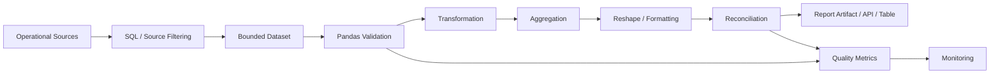
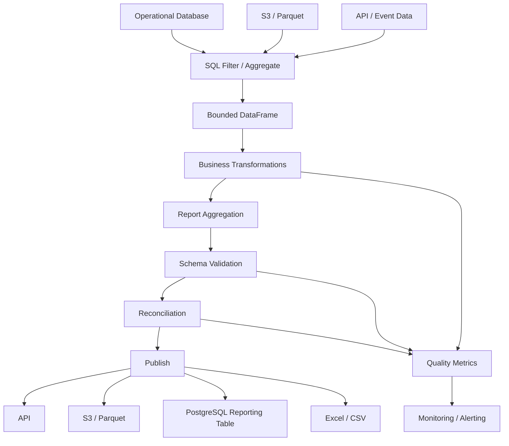

# 21- Reporting Scenarios

## Overview

Pandas is often used to turn operational data into reporting datasets that are:

```text
aggregated
validated
reshaped
ordered
serialized
```

A production reporting pipeline is more than:

```python
df.groupby(...)
```

It must answer:

```text
What is the reporting grain?
Which source is authoritative?
What time range is being reported?
Which records are included?
How are missing values interpreted?
Are metrics additive?
How are duplicates handled?
How are results reconciled?
How is the report generated safely at scale?
```

Typical reporting inputs include:

```text
PostgreSQL
REST APIs
CSV
Excel
Parquet
Kafka-derived event data
```

Typical outputs include:

```text
REST API response
CSV
Excel
Parquet
PostgreSQL reporting tables
S3 artifacts
dashboard datasets
```

A practical architecture is:



The most important concept is **reporting grain**.

A DataFrame may represent:

```text
one row per order
one row per customer
one row per customer-day
one row per product-month
one row per service-hour
```

Every aggregation or join should preserve or intentionally change that grain.

---

## Reporting Grain

Before building a report, define:

```text
one row represents what?
```

Examples:

| Report | Grain |
|---|---|
| Order export | one row per order |
| Customer revenue | one row per customer |
| Daily revenue | one row per day |
| Product sales | one row per product |
| Regional daily sales | one row per region-day |
| Service metrics | one row per service-hour |

A common reporting bug is accidental grain multiplication.

For example:

```text
orders
×
customer history
```

may create multiple rows per order if historical customer records are joined without temporal filtering.

---

## Reporting Pipeline Stages

A robust reporting workflow is:

```text
Extract
↓
Filter
↓
Validate
↓
Normalize
↓
Join / Enrich
↓
Aggregate
↓
Reshape
↓
Reconcile
↓
Format
↓
Publish
```

Keep business calculations separate from presentation formatting.

For example:

```text
revenue calculation
```

should not depend on:

```text
Excel cell formatting
```

This separation makes reports reusable across:

```text
API
CSV
Excel
Parquet
dashboard
```

---

## Scenario: Daily Revenue Report

Suppose orders contain:

```text
order_id
created_at
status
amount
```

First establish the reporting period:

```python
start = pd.Timestamp(
    "2026-09-01",
    tz="UTC",
)

end = pd.Timestamp(
    "2026-09-02",
    tz="UTC",
)
```

Then filter:

```python
daily_orders = orders.loc[
    orders["created_at"].ge(start)
    & orders["created_at"].lt(end)
    & orders["status"].eq("completed")
]
```

Aggregate:

```python
daily_revenue = (
    daily_orders["amount"]
    .sum()
)
```

The half-open interval:

```text
[start, end)
```

makes adjacent reporting periods unambiguous.

---

## Database Pushdown for Reporting

For large operational datasets, perform filtering and aggregation in PostgreSQL when practical.

```sql
SELECT
    DATE_TRUNC('day', created_at) AS report_date,
    SUM(amount) AS revenue,
    COUNT(DISTINCT order_id) AS orders
FROM orders
WHERE status = 'completed'
  AND created_at >= %(start)s
  AND created_at < %(end)s
GROUP BY
    DATE_TRUNC('day', created_at);
```

Then:

```python
report = pd.read_sql_query(
    query,
    connection,
    params={
        "start": start,
        "end": end,
    },
)
```

This reduces:

```text
database-to-worker traffic
memory usage
Pandas processing
report latency
```

---

## Scenario: Daily Revenue by Category

If the source data is already bounded:

```python
daily = (
    orders
    .assign(
        order_date=lambda df:
            df["created_at"].dt.normalize()
    )
    .groupby(
        [
            "order_date",
            "category",
        ],
        as_index=False,
        observed=True,
    )
    .agg(
        revenue=("amount", "sum"),
        orders=("order_id", "nunique"),
    )
)
```

This produces long-form reporting data:

```text
order_date  category       revenue  orders
2026-09-01  Books          40000    200
2026-09-01  Electronics    75000    150
```

Long format is usually easier to store and validate.

---

## Scenario: Wide Management Report

Management reports may require:

```text
date | Books | Electronics | Furniture
```

Use:

```python
report = daily.pivot(
    index="order_date",
    columns="category",
    values="revenue",
)
```

When duplicate combinations exist, use:

```python
report = daily.pivot_table(
    index="order_date",
    columns="category",
    values="revenue",
    aggfunc="sum",
    fill_value=0,
)
```

Choose `fill_value=0` only when an absent category truly means zero.

---

## Missing vs Zero in Reports

A reporting system should distinguish:

```text
no transaction
```

from:

```text
transaction exists but value is unavailable
```

For example:

```text
Books = 0
```

may mean:

```text
no books sold
```

while:

```text
Books = NaN
```

may mean:

```text
data unavailable
```

Financial and operational reports should define this semantics explicitly.

---

## Scenario: Monthly Revenue

Normalize timestamps:

```python
orders["created_at"] = pd.to_datetime(
    orders["created_at"],
    utc=True,
    errors="raise",
)
```

Create reporting month:

```python
orders["month"] = (
    orders["created_at"]
    .dt.to_period("M")
)
```

Aggregate:

```python
monthly = (
    orders
    .groupby(
        "month",
        as_index=False,
    )
    .agg(
        revenue=("amount", "sum"),
        orders=("order_id", "nunique"),
    )
)
```

For very large datasets, perform the first aggregation in PostgreSQL or a warehouse.

---

## Scenario: Month-over-Month Growth

Suppose:

```text
month
revenue
```

is already aggregated.

Calculate previous month:

```python
monthly = monthly.sort_values(
    "month"
)

monthly["previous_revenue"] = (
    monthly["revenue"].shift(1)
)
```

Then:

```python
monthly["mom_growth"] = (
    (
        monthly["revenue"]
        - monthly["previous_revenue"]
    )
    / monthly["previous_revenue"]
)
```

Handle zero or missing previous revenue explicitly:

```python
monthly["mom_growth"] = (
    monthly["mom_growth"]
    .where(
        monthly["previous_revenue"].ne(0)
    )
)
```

---

## Scenario: Year-over-Year Growth

For monthly data:

```python
monthly = monthly.sort_values(
    "month"
)

monthly["previous_year_revenue"] = (
    monthly["revenue"].shift(12)
)

monthly["yoy_growth"] = (
    (
        monthly["revenue"]
        - monthly["previous_year_revenue"]
    )
    / monthly["previous_year_revenue"]
)
```

This assumes a complete and correctly ordered monthly series.

For missing months, create the reporting calendar explicitly rather than relying on `shift(12)` alone.

---

## Scenario: Complete Reporting Calendar

Suppose February has no orders.

A grouped result may omit February entirely.

Create an explicit date index:

```python
calendar = pd.date_range(
    start="2026-01-01",
    end="2026-12-01",
    freq="MS",
    tz="UTC",
)
```

Then:

```python
monthly = (
    monthly
    .set_index("month")
    .reindex(calendar)
)
```

For a true zero-activity month:

```python
monthly["revenue"] = (
    monthly["revenue"]
    .fillna(0)
)
```

Only do this when missing months semantically mean zero activity.

---

## Scenario: Customer Revenue Report

```python
customer_report = (
    orders
    .groupby(
        "customer_id",
        as_index=False,
    )
    .agg(
        revenue=("amount", "sum"),
        orders=("order_id", "nunique"),
        last_order=("created_at", "max"),
    )
)
```

Derived metric:

```python
customer_report["average_order_value"] = (
    customer_report["revenue"]
    / customer_report["orders"]
)
```

The report grain is now:

```text
one row per customer
```

The original order-level grain is intentionally lost.

---

## Scenario: Customer Segmentation Report

Suppose customers need:

```text
low
medium
high
```

segments.

```python
customer_report["segment"] = pd.cut(
    customer_report["revenue"],
    bins=[
        -float("inf"),
        1_000,
        10_000,
        float("inf"),
    ],
    labels=[
        "low",
        "medium",
        "high",
    ],
)
```

Then aggregate by segment:

```python
segment_report = (
    customer_report
    .groupby(
        "segment",
        observed=True,
    )
    .agg(
        customers=(
            "customer_id",
            "nunique",
        ),
        revenue=(
            "revenue",
            "sum",
        ),
    )
    .reset_index()
)
```

---

## Scenario: Regional Sales Report

```python
regional = (
    orders
    .groupby(
        "region",
        as_index=False,
        observed=True,
    )
    .agg(
        revenue=("amount", "sum"),
        orders=("order_id", "nunique"),
        customers=(
            "customer_id",
            "nunique",
        ),
    )
)
```

Add revenue share:

```python
total_revenue = regional[
    "revenue"
].sum()

regional["revenue_share"] = (
    regional["revenue"]
    / total_revenue
)
```

This gives management a normalized regional comparison.

---

## Scenario: Top-N Products Report

Suppose:

```text
product_id
category
revenue
```

is already aggregated.

```python
top_products = (
    products
    .sort_values(
        [
            "category",
            "revenue",
        ],
        ascending=[
            True,
            False,
        ],
    )
    .groupby(
        "category",
        observed=True,
    )
    .head(5)
)
```

Important:

```text
sort
→
groupby
→
head
```

The ordering is part of the business logic.

---

## Scenario: Ranking Products Globally

```python
products["rank"] = (
    products["revenue"]
    .rank(
        method="dense",
        ascending=False,
    )
)
```

For deterministic output, add a stable secondary sort:

```python
products = products.sort_values(
    [
        "rank",
        "product_id",
    ]
)
```

Tie behavior should be deliberate.

---

## Scenario: Ranking Within a Region

```python
products["regional_rank"] = (
    products
    .groupby("region")["revenue"]
    .rank(
        method="dense",
        ascending=False,
    )
)
```

The result retains the original row shape.

This is useful for:

```text
regional leaderboards
sales rankings
performance reports
```

---

## Scenario: Operational SLA Report

Suppose support tickets contain:

```text
created_at
resolved_at
priority
```

Calculate duration:

```python
tickets["resolution_time"] = (
    tickets["resolved_at"]
    - tickets["created_at"]
)
```

Convert to hours:

```python
tickets["resolution_hours"] = (
    tickets["resolution_time"]
    .dt.total_seconds()
    / 3600
)
```

Classify:

```python
tickets["sla_status"] = np.select(
    [
        tickets["priority"].eq("critical")
        & tickets["resolution_hours"].le(4),
        tickets["priority"].eq("high")
        & tickets["resolution_hours"].le(8),
        tickets["priority"].eq("normal")
        & tickets["resolution_hours"].le(24),
    ],
    [
        "within_sla",
        "within_sla",
        "within_sla",
    ],
    default="breached",
)
```

A better production design may define SLA thresholds in configuration rather than hardcoding them.

---

## Scenario: SLA Summary

```python
sla_report = (
    tickets
    .groupby(
        ["priority", "sla_status"],
        as_index=False,
        observed=True,
    )
    .agg(
        tickets=("ticket_id", "nunique"),
        avg_resolution_hours=(
            "resolution_hours",
            "mean",
        ),
        max_resolution_hours=(
            "resolution_hours",
            "max",
        ),
    )
)
```

This creates an operational summary without retaining every ticket detail in the report.

---

## Scenario: Customer Retention Report

Suppose:

```text
customer_id
signup_date
event_date
```

Create cohorts:

```python
customers["signup_month"] = (
    customers["signup_date"]
    .dt.to_period("M")
)

events["event_month"] = (
    events["event_date"]
    .dt.to_period("M")
)
```

Join cohort information:

```python
activity = events.merge(
    customers[
        [
            "customer_id",
            "signup_month",
        ]
    ],
    on="customer_id",
    how="left",
    validate="many_to_one",
)
```

Aggregate:

```python
retention = (
    activity
    .groupby(
        [
            "signup_month",
            "event_month",
        ]
    )["customer_id"]
    .nunique()
    .unstack(
        "event_month"
    )
)
```

This can then be converted into percentage retention.

---

## Scenario: Retention Percentage

If each cohort's initial customer count is required:

```python
cohort_size = (
    customers
    .groupby("signup_month")[
        "customer_id"
    ]
    .nunique()
)

retention_pct = (
    retention
    .div(
        cohort_size,
        axis=0,
    )
    * 100
)
```

Explicit index alignment is important.

Using:

```python
div(
    cohort_size,
    axis=0,
)
```

makes the intended alignment clear.

---

## Scenario: Daily Active Users

For event data:

```python
events["event_date"] = (
    events["event_time"]
    .dt.normalize()
)

dau = (
    events
    .groupby(
        "event_date",
        as_index=False,
    )
    .agg(
        daily_active_users=(
            "user_id",
            "nunique",
        )
    )
)
```

Distinct-user metrics should not be confused with event counts.

---

## Scenario: Weekly Active Users

Use calendar-aligned periods:

```python
events["week"] = (
    events["event_time"]
    .dt.to_period("W")
)
```

Then:

```python
wau = (
    events
    .groupby("week")
    .agg(
        active_users=(
            "user_id",
            "nunique",
        )
    )
    .reset_index()
)
```

Document the week definition because:

```text
Monday-Sunday
```

and:

```text
Sunday-Saturday
```

can produce different results.

---

## Scenario: Conversion Funnel

Suppose events contain:

```text
signup
activation
purchase
```

Create boolean flags per user:

```python
funnel = (
    events
    .groupby("user_id")
    .agg(
        signed_up=(
            "event_type",
            lambda values:
                values.eq("signup").any()
        ),
        activated=(
            "event_type",
            lambda values:
                values.eq("activation").any()
        ),
        purchased=(
            "event_type",
            lambda values:
                values.eq("purchase").any()
        ),
    )
    .reset_index()
)
```

For large datasets, precompute event flags before grouping to reduce Python-level functions.

```python
events["is_signup"] = (
    events["event_type"].eq("signup")
)

events["is_activation"] = (
    events["event_type"].eq("activation")
)

events["is_purchase"] = (
    events["event_type"].eq("purchase")
)

funnel = (
    events
    .groupby("user_id")
    .agg(
        signed_up=("is_signup", "any"),
        activated=("is_activation", "any"),
        purchased=("is_purchase", "any"),
    )
    .reset_index()
)
```

---

## Scenario: Funnel Conversion Rates

```python
signup_count = funnel[
    "signed_up"
].sum()

activation_count = (
    funnel["activated"]
    & funnel["signed_up"]
).sum()

purchase_count = (
    funnel["purchased"]
    & funnel["activated"]
).sum()
```

Then:

```python
activation_rate = (
    activation_count
    / signup_count
)

purchase_rate = (
    purchase_count
    / activation_count
)
```

Guard against zero denominators.

The funnel definitions must also enforce sequence semantics where required. Merely observing all three events does not guarantee they occurred in the intended order.

---

## Scenario: Average Order Value

A report may need:

```text
AOV = total revenue / distinct orders
```

Do not use:

```python
orders["amount"].mean()
```

unless each row represents exactly one complete order.

For line-item data:

```python
aov = (
    order_lines["line_amount"].sum()
    / order_lines["order_id"].nunique()
)
```

The correct formula depends on the dataset's grain.

---

## Scenario: Line Items to Order-Level Report

If source data is:

```text
one row per order line
```

aggregate first:

```python
orders = (
    order_lines
    .groupby(
        "order_id",
        as_index=False,
    )
    .agg(
        order_total=(
            "line_amount",
            "sum",
        ),
        item_count=(
            "quantity",
            "sum",
        ),
    )
)
```

Then customer-level reporting can operate on:

```text
one row per order
```

instead of:

```text
one row per line
```

This avoids double counting.

---

## Scenario: Revenue by Product and Month

```python
monthly_product = (
    orders
    .assign(
        month=lambda df:
            df["created_at"]
            .dt.to_period("M")
    )
    .groupby(
        [
            "month",
            "product_id",
        ],
        as_index=False,
    )
    .agg(
        revenue=("amount", "sum"),
        orders=("order_id", "nunique"),
    )
)
```

This long-form dataset is suitable for:

```text
Parquet
database reporting tables
BI tools
further Pandas pivots
```

---

## Scenario: Management Matrix

Convert the long result:

```python
matrix = monthly_product.pivot_table(
    index="month",
    columns="product_id",
    values="revenue",
    aggfunc="sum",
    fill_value=0,
)
```

For high-cardinality product dimensions, this can create an extremely wide DataFrame.

Use a wide matrix only when the consumer actually requires it.

---

## Scenario: Financial Statement

A finance report may contain:

```text
account
month
amount
```

Aggregate:

```python
statement = (
    transactions
    .groupby(
        [
            "month",
            "account",
        ],
        as_index=False,
    )
    .agg(
        amount=("amount", "sum")
    )
)
```

Pivot:

```python
wide_statement = statement.pivot(
    index="month",
    columns="account",
    values="amount",
)
```

Financial reports require strict reconciliation and explicit sign conventions.

---

## Financial Reconciliation

For a transformation that should preserve transaction amounts:

```python
source_total = transactions[
    "amount"
].sum()

report_total = statement[
    "amount"
].sum()

if not np.isclose(
    source_total,
    report_total,
):
    raise ValueError(
        "Financial reconciliation failed"
    )
```

For reports involving:

```text
currency conversion
rounding
adjustments
eliminations
```

the reconciliation equation must reflect those transformations.

---

## Scenario: Inventory Report

Suppose inventory contains:

```text
warehouse
product_id
on_hand
reserved
```

Derive available inventory:

```python
inventory["available"] = (
    inventory["on_hand"]
    - inventory["reserved"]
)
```

Validate:

```python
negative = inventory.loc[
    inventory["available"] < 0
]
```

Negative available inventory may be:

```text
invalid
backorder state
business exception
```

The report should follow explicit business semantics.

---

## Scenario: Inventory Coverage

If average daily demand is available:

```python
inventory["days_of_cover"] = np.where(
    inventory["daily_demand"] > 0,
    inventory["available"]
    / inventory["daily_demand"],
    np.nan,
)
```

Do not divide by zero.

For operational decisions, define the meaning of:

```text
zero demand
missing demand
future demand
```

explicitly.

---

## Scenario: Employee Headcount

Suppose employee data contains:

```text
employee_id
department
status
```

Active headcount:

```python
headcount = (
    employees.loc[
        employees["status"].eq("active")
    ]
    .groupby("department")
    .agg(
        employees=(
            "employee_id",
            "nunique",
        )
    )
    .reset_index()
)
```

This is a common example where filtering must happen before aggregation.

---

## Scenario: Headcount by Month

Historical reporting requires effective dates.

If employees have:

```text
hire_date
termination_date
```

a simple current-state `status` is insufficient for historical headcount.

The report needs an effective-date model such as:

```text
employee
+
calendar date
+
employment interval
```

For large workloads, create a date spine or use SQL range/interval logic rather than expanding every employee across every day unnecessarily.

---

## Scenario: Service Availability Report

Suppose metrics contain:

```text
timestamp
service
status
```

Calculate availability:

```python
availability = (
    metrics
    .assign(
        is_available=lambda df:
            df["status"].eq("healthy")
    )
    .groupby("service")
    .agg(
        total_checks=(
            "status",
            "size",
        ),
        healthy_checks=(
            "is_available",
            "sum",
        ),
    )
    .reset_index()
)

availability["availability_pct"] = (
    availability["healthy_checks"]
    / availability["total_checks"]
    * 100
)
```

Define whether checks are equally weighted.

For real SLO reporting, request-based or time-weighted definitions may be more appropriate.

---

## Scenario: Error Rate

```python
metrics["is_error"] = (
    metrics["status_code"] >= 500
)

error_rate = (
    metrics["is_error"].mean()
)
```

This gives:

```text
errors / total requests
```

only if each row represents one request.

If rows represent aggregated buckets, the formula must use:

```text
error_count / request_count
```

instead.

---

## Scenario: P95 Latency

For request-level latency:

```python
p95 = metrics[
    "latency_ms"
].quantile(0.95)
```

For grouped reporting:

```python
p95_by_service = (
    metrics
    .groupby("service")
    .agg(
        p95_latency_ms=(
            "latency_ms",
            lambda values:
                values.quantile(0.95),
        )
    )
    .reset_index()
)
```

Quantiles can be computationally expensive for very large datasets.

Push them to a specialized analytical system when necessary.

---

## Scenario: Daily Operational Dashboard

A dashboard dataset may combine:

```text
orders
revenue
users
latency
errors
```

Do not blindly merge raw event-level datasets.

First aggregate each source to a common grain:

```text
date
```

Then combine:

```python
daily = revenue.merge(
    users,
    on="date",
    how="outer",
)

daily = daily.merge(
    latency,
    on="date",
    how="outer",
)
```

This avoids massive cross-grain joins.

---

## Grain Before Join

This is a critical reporting pattern:

```text
raw orders
→ daily revenue

raw user events
→ daily active users

request logs
→ daily latency

then join:
date
+
date
+
date
```

Instead of:

```text
orders
×
events
×
logs
```

at raw granularity.

Pre-aggregation before joining often provides both:

```text
correctness
+
major performance improvement
```

---

## Scenario: Multi-Metric Daily Report

```python
daily_report = (
    revenue
    .merge(
        active_users,
        on="date",
        how="outer",
    )
    .merge(
        service_metrics,
        on="date",
        how="outer",
    )
    .sort_values("date")
)
```

After merging, normalize missing metric values according to their semantics.

For example:

```text
revenue missing
≠
active_users missing
≠
latency missing
```

Different metrics may require different defaults.

---

## Scenario: Report Validation

Before publishing:

```python
required_columns = {
    "date",
    "revenue",
    "orders",
    "active_users",
}

missing = required_columns.difference(
    daily_report.columns
)

if missing:
    raise ValueError(
        f"Missing report columns: {sorted(missing)}"
)
```

Then validate:

```text
date ordering
expected row count
duplicate dates
numeric types
null policy
business totals
```

---

## Duplicate Report Rows

If the report grain is:

```text
one row per date
```

then validate:

```python
if not daily_report["date"].is_unique:
    raise ValueError(
        "Report contains duplicate dates"
    )
```

This simple assertion can catch accidental join multiplication.

---

## Scenario: Report Completeness

For a daily report:

```python
expected_dates = pd.date_range(
    start=start,
    end=end - pd.Timedelta(days=1),
    freq="D",
    tz="UTC",
)
```

Then:

```python
actual_dates = pd.DatetimeIndex(
    daily_report["date"]
)

missing_dates = expected_dates.difference(
    actual_dates
)
```

A missing report date may indicate:

```text
zero activity
```

or:

```text
pipeline failure
```

The distinction must be explicit.

---

## Scenario: Report Cutoff

Reports should use a deterministic cutoff:

```text
data available through 23:59 UTC
```

rather than:

```python
pd.Timestamp.now()
```

inside the transformation.

Prefer:

```python
def build_report(
    orders: pd.DataFrame,
    start: pd.Timestamp,
    end: pd.Timestamp,
) -> pd.DataFrame:
    ...
```

This makes report generation:

```text
reproducible
testable
backfillable
```

---

## Scenario: Scheduled Daily Report

A scheduler may execute:

```text
01:00 UTC
↓
extract previous UTC day
↓
transform
↓
validate
↓
publish
```

The reporting period should be based on:

```text
data window
```

not:

```text
job execution time
```

because retries may occur hours later.

---

## Scenario: Backfill Report

The same function should handle:

```python
build_report(
    orders=orders,
    start=pd.Timestamp(
        "2026-01-01",
        tz="UTC",
    ),
    end=pd.Timestamp(
        "2026-02-01",
        tz="UTC",
    ),
)
```

This avoids building separate code paths for:

```text
daily run
backfill
reprocessing
```

---

## Scenario: Report Publishing

Publishing should happen after validation:

```text
generate
→ validate
→ reconcile
→ publish
```

not:

```text
generate
→ publish
→ discover errors
```

For S3:

```text
temporary object
→ validation
→ final object/key
```

For PostgreSQL:

```text
staging table
→ validation
→ transactional promotion
```

---

## Scenario: Atomic Publication

A report consumer should not observe partially written output.

A robust pattern is:

```text
write temporary output
→ validate
→ publish final key
```

or:

```text
load staging table
→ validate
→ transaction
→ replace/promote
```

The mechanism depends on the storage system.

---

## Scenario: CSV Output

```python
report.to_csv(
    "daily_sales.csv",
    index=False,
)
```

Explicitly define:

```text
encoding
delimiter
date formatting
decimal formatting
null representation
```

when the consumer contract requires it.

---

## Scenario: Excel Output

```python
report.to_excel(
    "daily_sales.xlsx",
    index=False,
)
```

Excel is appropriate for:

```text
human consumption
small-to-medium business reports
manual analysis
```

It is not a scalable data warehouse format.

---

## Scenario: Parquet Output

```python
report.to_parquet(
    "daily_sales.parquet",
    index=False,
)
```

Parquet is generally better for:

```text
machine consumption
analytical workflows
repeated processing
large reporting datasets
```

Stable dtypes and schemas are important.

---

## Scenario: API Output

Before JSON serialization:

```python
response = (
    report
    .astype(
        {
            "orders": "int64",
        }
    )
)
```

Then:

```python
payload = response.to_dict(
    orient="records"
)
```

Only serialize bounded report results into Python dictionaries.

For very large datasets, use:

```text
pagination
streaming
file download
S3 artifact
```

rather than returning millions of records in one HTTP response.

---

## Scenario: FastAPI Reporting Endpoint

A bounded report:

```python
from fastapi import FastAPI

app = FastAPI()


@app.get("/reports/daily-sales")
def daily_sales_report(
    start: str,
    end: str,
):
    ...
```

The endpoint should:

```text
validate parameters
→
run bounded SQL
→
transform bounded result
→
validate report
→
serialize
```

Do not allow arbitrary unbounded date ranges.

---

## Scenario: Async Report Generation

For expensive reports:

```text
POST /reports
    ↓
create report job
    ↓
Celery worker
    ↓
PostgreSQL
    ↓
Pandas
    ↓
S3
    ↓
GET /reports/{id}
```

The API remains responsive while heavy processing runs separately.

---

## Scenario: Redis Report Cache

For frequently requested bounded summaries:

```text
request
→
cache lookup
→
hit → return
→
miss → generate
→
store result
```

Cache keys should incorporate:

```text
report type
parameters
source snapshot/version
transformation version
```

Otherwise stale results can be returned after logic or data changes.

---

## Scenario: Report Snapshots

For regulated or historical reporting, a live query may not be enough.

Persist a snapshot:

```text
report_date
source_cutoff
transformation_version
generated_at
artifact_location
```

This provides reproducibility when source tables later change.

---

## Scenario: Financial Reporting

Financial reports require stronger controls:

```text
immutable inputs where required
controlled rounding
currency consistency
reconciliation
audit metadata
versioned transformations
approval workflow
```

Pandas can generate the report, but accounting correctness cannot rely solely on DataFrame operations.

---

## Scenario: Auditability

Record:

```text
report ID
generation time
data cutoff
source version
pipeline version
row count
totals
artifact checksum where applicable
```

This makes a report explainable after publication.

---

## Scenario: Report Performance

Optimize reporting in this order:

```text
filter source data
↓
select required columns
↓
aggregate at appropriate grain
↓
join aggregated datasets
↓
reshape
↓
format
```

Avoid:

```text
load raw history
→ merge everything
→ pivot everything
→ filter at the end
```

This can multiply both runtime and memory.

---

## Scenario: Pre-Aggregated Reporting Tables

For repeated reports, create durable aggregates:

```text
raw orders
    ↓
daily_order_metrics
    ↓
monthly_order_metrics
```

Then the daily dashboard does not recalculate years of history on every request.

This often improves:

```text
latency
database load
worker memory
cost
reliability
```

---

## Scenario: Materialized Views

PostgreSQL materialized views can serve repeated reporting workloads.

A hybrid architecture may be:

```text
PostgreSQL raw data
→ materialized view
→ Pandas formatting/reshape
→ report
```

This keeps large aggregation work in the database while preserving Pandas flexibility for final presentation.

---

## Scenario: Reporting with Parquet

A reporting lake can store:

```text
s3://reports/order_metrics/date=2026-09-01/
s3://reports/order_metrics/date=2026-09-02/
```

Pandas reads only required partitions.

This enables:

```text
backfills
parallel processing
cheap historical storage
reprocessing
downstream analytics
```

---

## Scenario: Report Reconciliation

For every important report, define at least one invariant.

Examples:

```text
daily revenue = sum of included transactions
orders = count of distinct order IDs
customer count <= order count
report dates have no unexpected duplicates
```

Example:

```python
assert (
    report["orders"]
    .sum()
    == orders["order_id"].nunique()
)
```

Use explicit validation exceptions rather than assertions in production-critical code where appropriate.

---

## Scenario: Report Drift

A report may remain syntactically valid while business numbers change unexpectedly.

Monitor:

```text
revenue vs previous period
order count vs baseline
null rate
category distribution
average order value
report row count
```

Alert on significant deviations according to business-specific thresholds.

---

## Scenario: Quality vs Performance

Do not remove validation merely to make the report faster.

Instead:

```text
move cheap validation early
push expensive aggregation to SQL
validate reduced datasets
sample expensive diagnostics when appropriate
```

Correctness checks should be designed to scale.

---

## Scenario: Report Security

Reports can expose:

```text
customer PII
internal revenue
employee information
operational metrics
tenant data
```

Apply authorization before extraction.

For multi-tenant reporting:

```sql
WHERE tenant_id = %(tenant_id)s
```

should generally be part of the source query.

Do not generate a global DataFrame and filter tenant data at the final serialization step.

---

## Scenario: Report Column Minimization

Only include fields the consumer actually needs.

Bad:

```text
customer_id
email
phone
address
...
revenue
```

when the report only requires:

```text
customer_id
revenue
```

Data minimization reduces:

```text
memory
serialization
security exposure
report size
```

---

## Scenario: Report Reliability

A production report should have:

```text
bounded execution
timeouts
retries
idempotent output
reconciliation
observability
```

The report should not be marked successful until:

```text
data processed
+
validation passed
+
output published
```

have all completed.

---

## Scenario: Failure Recovery

For partitioned reports:

```text
date=2026-09-01 → success
date=2026-09-02 → success
date=2026-09-03 → failure
```

retry only:

```text
2026-09-03
```

This is more resilient than rerunning all historical data.

---

## Scenario: Report Testing

Test:

```text
metric formulas
grouping grain
date boundaries
missing months
zero activity
duplicates
joins
rounding
sorting
column names
dtypes
serialization
```

Example:

```python
def test_daily_revenue_report() -> None:
    orders = pd.DataFrame(
        {
            "created_at": pd.to_datetime(
                [
                    "2026-09-01T10:00:00Z",
                    "2026-09-01T11:00:00Z",
                ],
                utc=True,
            ),
            "order_id": [
                "O-1",
                "O-2",
            ],
            "status": [
                "completed",
                "completed",
            ],
            "amount": [
                100.0,
                250.0,
            ],
        }
    )

    result = (
        orders
        .assign(
            date=lambda df:
                df["created_at"].dt.normalize()
        )
        .groupby("date", as_index=False)
        .agg(
            revenue=("amount", "sum"),
            orders=("order_id", "nunique"),
        )
    )

    assert result.loc[
        0,
        "revenue",
    ] == 350.0

    assert result.loc[
        0,
        "orders",
    ] == 2
```

---

## Scenario: Empty Reporting Period

If a report contains no qualifying records:

```text
revenue = 0?
orders = 0?
```

The answer depends on the report contract.

A report may need:

```text
one row with zero
```

rather than:

```text
no rows
```

This should be tested explicitly.

---

## Scenario: Missing Categories

Suppose a daily report expects:

```text
Books
Electronics
Furniture
```

but Furniture has no sales.

Ensure the output schema remains stable:

```python
categories = [
    "Books",
    "Electronics",
    "Furniture",
]

report = report.reindex(
    columns=categories,
    fill_value=0,
)
```

Only use zero when the business meaning is correct.

---

## Scenario: Deterministic Sorting

Reports consumed by humans or downstream automation should have predictable ordering:

```python
report = report.sort_values(
    [
        "date",
        "category",
    ]
)
```

For categorical dimensions:

```python
category_order = [
    "Enterprise",
    "High Value",
    "Standard",
]

report["segment"] = pd.Categorical(
    report["segment"],
    categories=category_order,
    ordered=True,
)

report = report.sort_values(
    "segment"
)
```

---

## Scenario: Stable Schema

A report API should not unexpectedly change:

```text
column names
column types
column ordering
null semantics
```

just because:

```text
a new product category appeared
```

Define the output schema explicitly.

For dynamic reports, version the contract or expose metadata describing generated columns.

---

## Scenario: Report API Pagination

If a report contains millions of rows, do not return:

```python
report.to_dict(
    orient="records"
)
```

for the entire dataset.

Prefer:

```text
pagination
cursor-based retrieval
S3 export
Parquet download
```

For APIs, cursor-based pagination is generally safer for large mutable datasets than very large offset values.

---

## Scenario: Report Generation from S3

A batch report may use:

```text
S3 raw
→ partition pruning
→ Pandas
→ aggregate
→ S3 report
```

The raw data remains durable.

The report is a derived artifact.

This separation simplifies:

```text
reprocessing
retention
access control
cost management
```

---

## Scenario: Report Versioning

Use metadata such as:

```text
report_version
pipeline_version
data_cutoff
generated_at
```

This makes historical report comparison meaningful.

A number from:

```text
version 1
```

may legitimately differ from:

```text
version 2
```

because business logic changed.

---

## Scenario: Multi-Tenant Reporting

A tenant-specific report should include:

```text
tenant scope
date scope
authorized metrics
```

The query should enforce tenant filtering:

```python
query = """
SELECT
    date,
    category,
    revenue
FROM daily_sales
WHERE tenant_id = %(tenant_id)s
  AND date >= %(start)s
  AND date < %(end)s
"""
```

Never trust a client-provided tenant ID without deriving or validating it against the authenticated identity.

---

## Scenario: Cost-Aware Report Design

A report queried:

```text
every API request
```

should not scan:

```text
years of transaction history
```

Prefer:

```text
pre-aggregation
materialized view
cached result
partitioned Parquet
scheduled refresh
```

when query frequency and freshness requirements justify it.

---

## Scenario: Freshness vs Cost

Every report has a freshness requirement:

```text
real time
5 minutes
hourly
daily
monthly
```

Do not process at higher frequency than required.

For example:

```text
daily finance report
```

does not necessarily need:

```text
second-by-second recomputation
```

Freshness requirements should drive architecture.

---

## Reporting Architecture Decision Framework

Use:

```text
Is the dataset large?
        |
       yes
        ↓
Filter / aggregate in SQL or warehouse.

Is the output bounded?
        |
       yes
        ↓
Pandas transformation is reasonable.

Is the report requested frequently?
        |
       yes
        ↓
Precompute / cache.

Is the report expensive?
        |
       yes
        ↓
Asynchronous worker.

Is historical reproducibility required?
        |
       yes
        ↓
Persist report snapshot + metadata.
```

---

## Recommended Reporting Architecture



This architecture separates:

```text
source computation
business transformation
reporting presentation
publication
```

---

## Production Reporting Checklist

Before publishing a Pandas report, verify:

- The report grain is explicitly defined.
- Source filters use a deterministic reporting window.
- SQL performs large filtering and aggregation where appropriate.
- Only required columns are extracted.
- All joins have known cardinality.
- Raw transaction data is aggregated before cross-domain joins where possible.
- Missing values have an explicit reporting policy.
- Zero and missing are not conflated accidentally.
- Dtypes are stable.
- Datetime timezone semantics are defined.
- Currency and unit semantics are validated.
- Rounding occurs at the correct business boundary.
- Expected dates/categories are represented consistently.
- Output row uniqueness is validated.
- Business totals are reconciled.
- Report schema is stable.
- Sensitive fields are minimized.
- Tenant authorization is applied before extraction.
- Large reports are generated asynchronously when necessary.
- Outputs are published atomically.
- Report artifacts are versioned or traceable when required.
- Source and transformation metadata are retained.
- Performance and memory are monitored.
- Retry and backfill behavior are defined.
- Empty periods are tested.
- Integration and business-rule tests exist.

---

## Key Takeaways

- Define the report's **grain, time window, metric semantics, and output contract** before writing Pandas code; most reporting errors are semantic rather than syntactic.
- For large datasets, filter and aggregate in PostgreSQL or the warehouse first, then use Pandas for bounded transformations, reshaping, validation, and presentation-specific logic.
- Build reports from stable intermediate grains: aggregate each source independently before joining domains such as orders, users, and service metrics to avoid incorrect multiplication and excessive memory use.
- Production reports require reconciliation, deterministic cutoffs, stable schemas, explicit missing-value and zero semantics, authorization boundaries, versioning, and safe publication.
- Use pre-aggregated tables, materialized views, Parquet, caching, partitioning, and asynchronous workers when report freshness, scale, or query frequency makes per-request Pandas processing impractical.