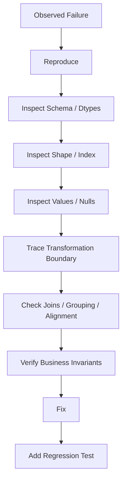

# 22- Debugging Pandas

## Overview

Debugging Pandas code is primarily an exercise in understanding data state.

A transformation may execute without raising an exception and still produce an incorrect result because of:

```text
wrong dtype
unexpected nulls
duplicate keys
incorrect index alignment
implicit sorting assumptions
join cardinality errors
timezone mismatches
wrong aggregation grain
silent type coercion
unexpected schema changes
```

Production debugging therefore needs to answer:

```text
What was the input?
What did the DataFrame actually contain?
Which operation changed it?
Did the row count change?
Did the schema change?
Did the dtype change?
Did the index change?
Did the business grain change?
Did the result violate an invariant?
```

A practical debugging model is:



The key principle is:

> Debug the data contract and transformation state, not just the exception message.

---

## Reproduce the Failure

A production issue should first be reduced to a reproducible input.

Capture:

```text
source partition
batch ID
input schema
relevant rows
transformation version
parameters
```

For example:

```python
repro = orders.loc[
    orders["order_id"].isin(
        [
            "O-1001",
            "O-1002",
        ]
    )
].copy()
```

The objective is to move from:

```text
10 million-row production failure
```

to:

```text
small deterministic fixture
```

that demonstrates the same behavior.

---

## Inspect the DataFrame First

When behavior is unexpected, inspect:

```python
print(
    {
        "shape": orders.shape,
        "columns": orders.columns.tolist(),
        "index_type": type(
            orders.index
        ).__name__,
    }
)

print(orders.dtypes)
```

Then:

```python
print(orders.head())
print(orders.tail())
```

`shape`, `dtypes`, and column names often reveal more than immediately reading the transformation code.

---

## Shape as a Debugging Signal

Always compare row counts at important boundaries:

```python
before_rows = len(orders)

orders = transform_orders(
    orders
)

after_rows = len(orders)

print(
    {
        "before_rows": before_rows,
        "after_rows": after_rows,
    }
)
```

An unexpected change can indicate:

```text
filtering
deduplication
join multiplication
aggregation
pivoting
missing records
```

Row-count changes should be intentional.

---

## Define the Expected Grain

Ask:

```text
What does one row represent?
```

Examples:

```text
one row per order
one row per order line
one row per customer
one row per customer-day
one row per event
```

Many Pandas bugs are grain bugs.

For example:

```python
orders.merge(
    customer_history,
    on="customer_id",
)
```

may unexpectedly change:

```text
one row per order
```

into:

```text
multiple rows per order
```

because customer history contains multiple records per customer.

---

## Inspect Dtypes

Start with:

```python
print(orders.dtypes)
```

Then inspect suspicious columns:

```python
print(
    orders["amount"].dtype
)

print(
    orders["created_at"].dtype
)
```

Common problems include:

```text
numeric values stored as strings
timestamps stored as object/string
booleans represented as strings
IDs represented inconsistently
nullable values forcing unexpected dtypes
```

---

## Numeric Column Stored as String

Suppose:

```text
amount
"100"
"200"
"1,500"
```

Then:

```python
orders["amount"].sum()
```

may not represent the intended numeric result.

Inspect:

```python
print(
    orders["amount"].head(10)
)
```

Convert explicitly:

```python
amount = (
    orders["amount"]
    .astype("string")
    .str.replace(
        ",",
        "",
        regex=False,
    )
)

orders["amount"] = pd.to_numeric(
    amount,
    errors="coerce",
)
```

Then inspect failures:

```python
print(
    orders.loc[
        orders["amount"].isna()
    ]
)
```

---

## Datetime Debugging

A timestamp can be syntactically valid and still be semantically wrong.

Inspect:

```python
print(
    orders["created_at"].dtype
)

print(
    orders["created_at"].head()
)
```

Normalize:

```python
orders["created_at"] = pd.to_datetime(
    orders["created_at"],
    utc=True,
    errors="raise",
)
```

Then verify:

```python
assert str(
    orders["created_at"].dtype
).startswith(
    "datetime64[ns, UTC]"
)
```

This catches naive/aware mismatches early.

---

## Timezone Debugging

Common failure:

```text
database timestamp
+
API timestamp
+
local machine timestamp
```

all use different timezone semantics.

Inspect:

```python
print(
    orders["created_at"].dtype
)
```

A production contract should establish:

```text
storage timezone
processing timezone
presentation timezone
```

For distributed systems, UTC is often the canonical processing representation.

---

## Debugging Missing Values

Start with:

```python
print(
    orders.isna().sum()
    .sort_values(
        ascending=False
    )
)
```

For rates:

```python
null_rate = (
    orders.isna().mean()
    .sort_values(
        ascending=False
    )
)

print(null_rate)
```

This quickly identifies columns affected by a transformation or source-data change.

---

## Detect Unexpected Nulls After a Transformation

Suppose `country` was previously complete:

```python
before = orders["country"].notna().sum()

orders = orders.merge(
    customers,
    on="customer_id",
    how="left",
)

after = orders["country"].notna().sum()

print(
    {
        "before_non_null": before,
        "after_non_null": after,
    }
)
```

A sudden increase in missing values can indicate:

```text
join-key mismatch
missing reference records
dtype inconsistency
normalization failure
```

---

## Debugging Duplicate Records

Find duplicates:

```python
duplicates = orders.loc[
    orders["order_id"].duplicated(
        keep=False
    )
].sort_values(
    "order_id"
)

print(duplicates)
```

For multiple keys:

```python
duplicates = orders.loc[
    orders.duplicated(
        subset=[
            "customer_id",
            "product_id",
            "order_date",
        ],
        keep=False,
    )
]
```

The correct subset must correspond to the business identity.

---

## Duplicate Count as a Metric

Instead of only inspecting rows:

```python
duplicate_count = int(
    orders["order_id"]
    .duplicated()
    .sum()
)

print(
    {
        "rows": len(orders),
        "duplicates": duplicate_count,
    }
)
```

Unexpected duplicate growth is an operational signal.

---

## Debugging `merge()` Problems

Always inspect:

```text
left row count
right row count
key uniqueness
result row count
missing matches
```

Example:

```python
print(
    {
        "orders": len(orders),
        "customers": len(customers),
        "customer_key_unique": (
            customers["customer_id"]
            .is_unique
        ),
    }
)
```

Then:

```python
merged = orders.merge(
    customers,
    on="customer_id",
    how="left",
    validate="many_to_one",
    indicator=True,
)
```

Inspect unmatched rows:

```python
unmatched = merged.loc[
    merged["_merge"].eq("left_only")
]
```

---

## Join Explosion

If:

```text
orders = 1,000,000 rows
```

and:

```text
merged = 4,000,000 rows
```

the first question should be:

```text
Why?
```

Measure:

```python
print(
    {
        "before": len(orders),
        "after": len(merged),
        "multiplier": (
            len(merged)
            / max(len(orders), 1)
        ),
    }
)
```

An unexpected multiplier usually points to:

```text
duplicate join keys
many-to-many relationship
incorrect key
wrong normalization
```

---

## Debugging Join Key Types

Compare:

```python
print(
    orders["customer_id"].dtype
)

print(
    customers["customer_id"].dtype
)
```

Normalize:

```python
orders["customer_id"] = (
    orders["customer_id"]
    .astype("string")
    .str.strip()
    .str.upper()
)

customers["customer_id"] = (
    customers["customer_id"]
    .astype("string")
    .str.strip()
    .str.upper()
)
```

Do not assume:

```text
same visible value
=
same underlying representation
```

---

## Debugging Unmatched Joins

If the left join unexpectedly produces nulls:

```python
merged = orders.merge(
    customers,
    on="customer_id",
    how="left",
    indicator=True,
)
```

Inspect:

```python
unmatched = merged.loc[
    merged["_merge"].eq("left_only")
]
```

Then examine:

```python
print(
    unmatched[
        ["customer_id"]
    ].head(20)
)
```

Compare against the reference data.

---

## Anti-Join for Debugging

An unmatched set can be isolated with:

```python
missing_customer_ids = (
    orders.loc[
        ~orders["customer_id"].isin(
            customers["customer_id"]
        ),
        "customer_id",
    ]
    .drop_duplicates()
)
```

This is useful for:

```text
referential-integrity debugging
source reconciliation
missing master data
```

---

## Debugging Index Problems

Inspect:

```python
print(
    orders.index
)

print(
    orders.index.is_unique
)
```

The index can cause subtle bugs because many Pandas operations align by labels.

For a simple batch DataFrame, normalize the index when appropriate:

```python
orders = orders.reset_index(
    drop=True
)
```

Do not reset an index that carries meaningful business or analytical semantics.

---

## Label Alignment

Consider:

```python
left = pd.Series(
    [100, 200],
    index=[10, 20],
)

right = pd.Series(
    [1, 2],
    index=[20, 10],
)
```

Then:

```python
left - right
```

aligns by index labels, not position.

The result is effectively:

```text
index 10: 100 - 2
index 20: 200 - 1
```

This differs from:

```python
left.to_numpy()
- right.to_numpy()
```

which operates positionally.

Unexpected alignment is a common source of silent numerical errors.

---

## Debugging Assignment Alignment

Suppose:

```python
mask = orders["status"].eq(
    "completed"
)

values = orders.loc[
    mask,
    "amount",
]
```

Then:

```python
orders["discount"] = values
```

may not populate the expected rows because assignment aligns by index labels.

Debug with:

```python
print(
    values.index
)

print(
    orders.index
)
```

For intentional positional assignment, use a compatible shape and explicit semantics rather than relying on accidental alignment.

---

## `loc` vs `iloc` During Debugging

Remember:

```text
loc  → label-based
iloc → position-based
```

Inspecting:

```python
df.loc[10]
```

and:

```python
df.iloc[10]
```

can return different records when the index is not:

```text
0, 1, 2, ...
```

When debugging unexpected rows, inspect the index before assuming positional meaning.

---

## Debugging Boolean Masks

Store masks explicitly:

```python
is_completed = orders[
    "status"
].eq("completed")

is_high_value = orders[
    "amount"
].ge(10_000)

selected = (
    is_completed
    & is_high_value
)
```

Inspect each condition:

```python
print(
    {
        "completed": int(
            is_completed.sum()
        ),
        "high_value": int(
            is_high_value.sum()
        ),
        "both": int(
            selected.sum()
        ),
    }
)
```

This is much easier to debug than a single large boolean expression.

---

## Debugging Missing Boolean Values

A mask may contain missing values:

```python
mask = orders[
    "status"
].astype("string").str.contains(
    "completed"
)
```

For filtering, make missing behavior explicit:

```python
mask = orders[
    "status"
].astype("string").str.contains(
    "completed",
    na=False,
)
```

This prevents unexpected null boolean states from propagating into filtering logic.

---

## Debugging `query()`

When debugging a complex query:

```python
result = orders.query(
    "status == 'completed' "
    "and amount >= @minimum"
)
```

first verify the columns:

```python
print(
    orders.columns.tolist()
)
```

Then break the conditions apart:

```python
completed = orders[
    "status"
].eq("completed")

minimum_amount = orders[
    "amount"
].ge(minimum)

result = orders.loc[
    completed
    & minimum_amount
]
```

This is often easier to inspect than a large query expression.

---

## Debugging `groupby()`

Start by validating the grouping keys:

```python
print(
    orders["customer_id"].isna().sum()
)

print(
    orders["customer_id"].nunique()
)
```

Then inspect group sizes:

```python
group_sizes = (
    orders
    .groupby("customer_id")
    .size()
    .sort_values(
        ascending=False
    )
)

print(group_sizes.head(20))
```

Unexpected group sizes can reveal:

```text
duplicates
bad keys
wrong grain
data skew
```

---

## Debugging Missing Group Keys

By default, missing group keys may be excluded.

If missing keys should be treated as a group:

```python
summary = (
    orders
    .groupby(
        "customer_id",
        dropna=False,
    )
    .agg(
        revenue=("amount", "sum")
    )
)
```

The choice should be deliberate.

---

## Debugging `first()` and `last()`

This:

```python
orders.groupby(
    "customer_id"
).agg(
    latest=("created_at", "last")
)
```

does not mean "latest chronologically" unless the data is correctly ordered.

Prefer:

```python
orders = orders.sort_values(
    [
        "customer_id",
        "created_at",
    ]
)

latest = (
    orders
    .groupby("customer_id")
    .agg(
        latest=("created_at", "last")
    )
)
```

The sort is part of the semantic requirement.

---

## Debugging `transform()`

`transform()` preserves the original shape.

Check:

```python
assert len(
    orders["amount"]
) == len(
    orders.groupby(
        "customer_id"
    )["amount"].transform(
        "sum"
    )
)
```

If a group operation unexpectedly changes the row count, verify whether:

```text
agg
transform
apply
filter
```

was intended.

---

## `agg()` vs `transform()` Debugging

Use `agg()` when the output should become:

```text
one row per group
```

Use `transform()` when the result should remain:

```text
one value per original row
```

Example:

```python
customer_totals = (
    orders
    .groupby("customer_id")[
        "amount"
    ]
    .transform("sum")
)
```

This keeps alignment with the original orders.

---

## Debugging `apply()`

When `apply()` behaves unexpectedly, inspect one input group or row directly.

For row-wise logic:

```python
sample = orders.head(5)

result = sample.apply(
    classify_order,
    axis=1,
)
```

If the sample is correct but the full dataset is wrong, investigate:

```text
unexpected nulls
dtype differences
edge cases
performance-induced timeouts
```

Avoid debugging a million-row `apply()` call before proving the logic on a small deterministic fixture.

---

## Debugging `concat()`

After concatenation:

```python
combined = pd.concat(
    frames,
    ignore_index=True,
)
```

inspect:

```python
print(
    combined.shape
)

print(
    combined.dtypes
)

print(
    combined.columns.tolist()
)
```

Unexpected columns may indicate schema drift.

Remember that `concat()` can create a union of columns.

---

## `concat()` and Schema Drift

Suppose:

```text
frame_a:
order_id
amount

frame_b:
order_id
amount
currency
```

Then:

```python
combined = pd.concat(
    [frame_a, frame_b],
    ignore_index=True,
)
```

creates:

```text
order_id
amount
currency
```

with missing values for `frame_a`.

This may be correct or may indicate a contract violation.

Do not treat it as inherently safe.

---

## Debugging Reshape Operations

For:

```python
pivoted = df.pivot_table(
    index="date",
    columns="category",
    values="revenue",
)
```

inspect:

```python
print(
    {
        "rows": pivoted.shape[0],
        "columns": pivoted.shape[1],
    }
)
```

A pivot can unexpectedly become huge due to:

```text
high-cardinality index
high-cardinality columns
```

A wide output may be a memory and reporting problem rather than a Pandas bug.

---

## Debugging Melted Data

After:

```python
long = wide.melt(
    id_vars=["date"],
    var_name="metric",
    value_name="value",
)
```

verify row-count expectations.

For example:

```text
rows after melt
≈
rows before × number of value columns
```

subject to:

```text
ignored nulls
selected columns
custom parameters
```

If the output is unexpectedly large, inspect the number of columns being melted.

---

## Debugging `drop_duplicates()`

Check what identity was actually used:

```python
duplicates = df[
    df.duplicated(
        subset=["order_id"],
        keep=False,
    )
]
```

Then compare competing records:

```python
print(
    duplicates.sort_values(
        "order_id"
    )
)
```

If two rows differ materially, they may be:

```text
conflicting versions
```

rather than true duplicates.

---

## Debugging Sorting

Sorting problems often come from incorrect dtype.

For example, strings:

```text
1
10
2
```

sort differently from numbers.

Inspect:

```python
print(
    df["priority"].dtype
)
```

Convert if appropriate:

```python
df["priority"] = pd.to_numeric(
    df["priority"],
    errors="raise",
)
```

Then:

```python
df = df.sort_values(
    "priority"
)
```

---

## Debugging `nlargest()` and `nsmallest()`

If results look wrong:

```python
print(
    df[
        ["amount"]
    ].sort_values(
        "amount",
        ascending=False,
    ).head(20)
)
```

Compare against:

```python
df.nlargest(
    20,
    "amount",
)
```

This confirms whether the issue is:

```text
dtype
null behavior
ties
input data
```

rather than the top-N operation itself.

---

## Debugging String Operations

For suspicious text:

```python
print(
    repr(
        df["status"].head(20).tolist()
    )
)
```

`repr()` exposes invisible characters such as:

```text
leading spaces
trailing spaces
tabs
newlines
```

Normalize:

```python
df["status"] = (
    df["status"]
    .astype("string")
    .str.strip()
)
```

Then inspect unique values:

```python
print(
    df["status"]
    .dropna()
    .unique()
)
```

---

## Debugging Regex

When `.str.contains()` or `.str.extract()` returns unexpected values:

```python
sample = df["reference"].dropna().head(
    20
)

print(sample.tolist())
```

Then test the pattern against individual values before applying it to the entire dataset.

Always determine whether the pattern should be:

```text
regex
```

or:

```text
literal text
```

Use:

```python
regex=False
```

for literal matching.

---

## Debugging Datetime Parsing

Identify values that fail parsing:

```python
parsed = pd.to_datetime(
    df["created_at"],
    utc=True,
    errors="coerce",
)

invalid = df.loc[
    df["created_at"].notna()
    & parsed.isna()
]

print(
    invalid[
        ["created_at"]
    ].head(20)
)
```

This reveals actual source values rather than only reporting "parsing failed."

---

## Debugging Datetime Boundaries

Suppose a daily report is missing records.

Inspect:

```python
window_start = pd.Timestamp(
    "2026-09-01",
    tz="UTC",
)

window_end = pd.Timestamp(
    "2026-09-02",
    tz="UTC",
)

boundary_rows = orders.loc[
    orders["created_at"].between(
        window_start
        - pd.Timedelta(minutes=5),
        window_end
        + pd.Timedelta(minutes=5),
    )
]
```

Examine timestamps close to the boundary.

Common causes:

```text
inclusive/exclusive mismatch
timezone conversion
naive timestamps
late-arriving records
```

---

## Debugging `NaT`

Count:

```python
missing_datetime = (
    df["created_at"]
    .isna()
    .sum()
)
```

Then determine whether missing values originated from:

```text
source missingness
parse failure
join
calculation
coercion
```

Track the transformation stage that introduced `NaT`.

---

## Debugging Numerical Results

If a metric is wrong:

```python
print(
    df["amount"].describe()
)
```

Inspect:

```text
count
mean
std
min
25%
50%
75%
max
```

Then verify:

```python
print(
    df["amount"].sum()
)

print(
    df["amount"].isna().sum()
)
```

For financial metrics, compare against an independent source or SQL calculation.

---

## SQL Cross-Check

When a Pandas aggregation is suspicious, calculate the same metric in PostgreSQL:

```sql
SELECT
    SUM(amount) AS total_amount,
    COUNT(DISTINCT order_id) AS orders
FROM orders
WHERE status = 'completed';
```

Then compare:

```python
pandas_total = (
    completed["amount"]
    .sum()
)

pandas_orders = (
    completed["order_id"]
    .nunique()
)
```

This isolates whether the bug is in:

```text
source data
SQL filter
Pandas transformation
```

---

## Debugging Floating-Point Differences

Do not compare floating-point results only with:

```python
actual == expected
```

For numeric transformations, use:

```python
import numpy as np

np.isclose(
    actual,
    expected,
    rtol=1e-9,
    atol=1e-9,
)
```

The appropriate tolerance depends on:

```text
data magnitude
precision requirements
operation sequence
business rules
```

Financial systems may require decimal arithmetic and database-level reconciliation instead.

---

## Debugging Row Alignment

When combining calculated Series:

```python
revenue = (
    orders
    .groupby("customer_id")["amount"]
    .sum()
)

customer_count = (
    customers
    .set_index("customer_id")["country"]
)
```

Before combining, inspect:

```python
print(
    revenue.index[:10]
)

print(
    customer_count.index[:10]
)
```

Pandas aligns by labels.

A missing label can create:

```text
NaN
```

without producing a runtime error.

---

## Debugging Reindexing

After:

```python
result = series.reindex(
    expected_index
)
```

inspect:

```python
missing = result.isna()

print(
    result.loc[missing]
)
```

A `NaN` introduced by `reindex()` means:

```text
the requested label did not exist
```

It does not necessarily mean the source value was missing.

This distinction matters.

---

## Debugging Copy/Mutation Issues

Prefer explicit intermediate state:

```python
clean = raw.copy()

clean["status"] = (
    clean["status"]
    .astype("string")
    .str.lower()
)
```

Then inspect both:

```python
print(raw.head())
print(clean.head())
```

If the raw DataFrame changed unexpectedly, investigate:

```text
assignment path
view/copy behavior
shared references
copy-on-write configuration
```

Do not assume every selection returns an independent object.

---

## Debugging `SettingWithCopy` Problems

Avoid:

```python
filtered = orders[
    orders["status"].eq("completed")
]

filtered["priority"] = "high"
```

Prefer:

```python
filtered = orders.loc[
    orders["status"].eq("completed")
].copy()

filtered["priority"] = "high"
```

The explicit copy makes ownership clear.

---

## Debugging Performance Problems

Start with timing:

```python
from time import perf_counter

start = perf_counter()

result = transform_orders(
    orders
)

elapsed = perf_counter() - start

print(
    f"seconds={elapsed:.3f}"
)
```

Then identify which stage consumes the time:

```text
I/O
parsing
filtering
join
groupby
sort
serialization
```

Do not optimize the entire pipeline before identifying the bottleneck.

---

## Debugging Memory Problems

Measure DataFrame memory:

```python
memory_mb = (
    orders
    .memory_usage(
        deep=True
    )
    .sum()
    / 1024**2
)

print(
    f"memory_mb={memory_mb:.2f}"
)
```

Then identify the largest columns:

```python
column_memory = (
    orders
    .memory_usage(
        deep=True
    )
    .sort_values(
        ascending=False
    )
)

print(column_memory)
```

Common causes:

```text
object strings
large intermediate joins
unnecessary columns
copies
wide pivots
high-cardinality groupings
```

---

## Debugging Join Memory

If a merge causes an OOM condition:

```text
check row counts
check key uniqueness
project columns
filter inputs
validate cardinality
```

Example:

```python
customers_small = customers.loc[
    :,
    [
        "customer_id",
        "segment",
    ],
]

orders_small = orders.loc[
    orders["status"].eq("completed"),
    [
        "order_id",
        "customer_id",
        "amount",
    ],
]

result = orders_small.merge(
    customers_small,
    on="customer_id",
    how="left",
    validate="many_to_one",
)
```

Debugging memory is often debugging unnecessary data movement.

---

## Debugging Chunked Pipelines

A chunked job can fail only on a particular batch.

Record:

```text
chunk number
source offset
partition
row count
```

Example:

```python
for chunk_number, chunk in enumerate(
    pd.read_csv(
        "orders.csv",
        chunksize=100_000,
    )
):
    logger.info(
        "processing_chunk",
        extra={
            "chunk_number": chunk_number,
            "rows": len(chunk),
        },
    )

    process(chunk)
```

A failed job can then be reproduced from the specific chunk.

---

## Debugging ETL Checkpoints

For long-running jobs, record:

```text
batch_id
partition
watermark
input rows
output rows
rejected rows
duration
```

This creates a trace such as:

```text
batch-2026-09-12
partition=date=2026-09-12
input=2,100,000
valid=2,080,000
rejected=20,000
output=2,080,000
duration=142s
```

Without this state, debugging becomes guesswork.

---

## Debugging Empty DataFrames

An empty result is not always an error.

Check:

```python
print(
    {
        "empty": orders.empty,
        "shape": orders.shape,
        "columns": orders.columns.tolist(),
    }
)
```

Determine whether emptiness came from:

```text
valid zero-result query
filter
date boundary
join mismatch
source failure
schema mismatch
```

A production pipeline should distinguish:

```text
expected empty
```

from:

```text
unexpected empty
```

---

## Debugging Filters That Remove Everything

Break the predicate apart:

```python
is_completed = orders[
    "status"
].eq("completed")

has_amount = orders[
    "amount"
].notna()

is_in_period = (
    orders["created_at"].ge(start)
    & orders["created_at"].lt(end)
)

print(
    {
        "total": len(orders),
        "completed": int(
            is_completed.sum()
        ),
        "has_amount": int(
            has_amount.sum()
        ),
        "in_period": int(
            is_in_period.sum()
        ),
        "all": int(
            (
                is_completed
                & has_amount
                & is_in_period
            ).sum()
        ),
    }
)
```

This reveals which condition is removing the records.

---

## Debugging Grouping That Returns Unexpected Values

Check:

```python
print(
    orders["customer_id"]
    .nunique()
)

print(
    orders.groupby(
        "customer_id"
    ).size().describe()
)
```

Possible causes:

```text
duplicate source records
missing group keys
wrong grouping column
incorrect normalization
unexpected category cardinality
```

---

## Debugging Aggregation Grain

Suppose revenue doubled after a transformation.

Compare:

```python
raw_total = orders[
    "amount"
].sum()

grouped_total = summary[
    "revenue"
].sum()
```

If they differ, inspect whether:

```text
rows were duplicated
filters changed
currency conversion occurred
refunds were included
grouping changed the metric
```

Aggregation should have an explicit reconciliation rule.

---

## Debugging Reporting Joins

Before joining two report-level datasets:

```text
daily revenue
daily active users
daily latency
```

verify their grain:

```python
print(
    revenue["date"].is_unique
)

print(
    users["date"].is_unique
)

print(
    latency["date"].is_unique
)
```

All should be one-row-per-date before:

```python
report = (
    revenue
    .merge(
        users,
        on="date",
    )
    .merge(
        latency,
        on="date",
    )
)
```

This prevents accidental many-to-many multiplication.

---

## Debugging Schema Drift

Compare expected and actual schema:

```python
expected = {
    "order_id",
    "customer_id",
    "created_at",
    "amount",
}

actual = set(
    orders.columns
)

print(
    {
        "missing": sorted(
            expected - actual
        ),
        "unexpected": sorted(
            actual - expected
        ),
    }
)
```

For production ingestion, fail or quarantine according to the contract.

---

## Debugging Column Ordering

Column order can matter in:

```text
CSV
external APIs
positional serialization
tests
report contracts
```

Normalize before publishing:

```python
columns = [
    "order_id",
    "customer_id",
    "created_at",
    "amount",
]

result = result.loc[
    :,
    columns,
]
```

Use names rather than positions whenever possible during transformations.

---

## Debugging Unexpected `NaN` After Arithmetic

Check operand nulls:

```python
print(
    orders[
        [
            "gross_amount",
            "discount",
        ]
    ].isna().sum()
)
```

Then:

```python
print(
    orders.loc[
        orders["net_amount"].isna(),
        [
            "gross_amount",
            "discount",
            "net_amount",
        ],
    ].head(20)
)
```

Determine whether the missing result is:

```text
expected propagation
```

or:

```text
data-quality bug
```

---

## Debugging Unexpected `NaN` After Mapping

For:

```python
orders["country_name"] = (
    orders["country_code"]
    .map(country_names)
)
```

inspect unmapped codes:

```python
missing_mapping = (
    orders.loc[
        orders["country_name"].isna()
        & orders["country_code"].notna(),
        "country_code",
    ]
    .drop_duplicates()
)

print(missing_mapping)
```

This distinguishes:

```text
missing source code
```

from:

```text
missing mapping
```

---

## Debugging `pivot_table()`

If values appear aggregated incorrectly, inspect duplicate keys:

```python
duplicates = (
    data
    .groupby(
        [
            "date",
            "category",
        ]
    )
    .size()
    .gt(1)
)

print(
    duplicates[
        duplicates
    ]
)
```

If multiple rows exist for a pivot key, `pivot_table()` requires an explicit aggregation rule.

---

## Debugging `melt()`

If the result has unexpected columns:

```python
print(
    {
        "id_vars": id_vars,
        "value_vars": value_vars,
    }
)
```

Then verify:

```python
expected_rows = (
    len(df)
    * len(value_vars)
)
```

This is a useful upper-level sanity check.

---

## Debugging Serialization

Before exporting:

```python
print(
    result.dtypes
)

print(
    result.head()
)
```

Common serialization problems include:

```text
Timestamp objects
NaN/NA values
Period values
category values
non-JSON-native types
```

Convert explicitly for the target interface.

For APIs, establish a stable JSON schema instead of relying on implicit Pandas serialization.

---

## Debugging `to_json()`

For a report:

```python
payload = result.to_json(
    orient="records"
)
```

Inspect:

```python
print(payload[:500])
```

Verify:

```text
date representation
null semantics
numeric precision
field names
```

Do not serialize enormous DataFrames into one API response.

---

## Debugging Excel/CSV Outputs

For CSV:

```python
result.to_csv(
    "report.csv",
    index=False,
)
```

Then immediately read a small sample back when debugging:

```python
check = pd.read_csv(
    "report.csv",
)
```

This catches:

```text
unexpected index column
date formatting
encoding
delimiter problems
column order
```

---

## Regression Testing After a Fix

Every production bug should result in a regression test.

The sequence is:

```text
production failure
→
small reproducing fixture
→
failing test
→
code fix
→
test passes
→
deploy
```

This prevents the same data-shape bug from returning later.

---

## Example Regression Test

Suppose a customer join duplicated orders.

Test:

```python
def test_customer_join_preserves_order_grain() -> None:
    orders = pd.DataFrame(
        {
            "order_id": [
                "O-1",
                "O-2",
            ],
            "customer_id": [
                "C-1",
                "C-2",
            ],
        }
    )

    customers = pd.DataFrame(
        {
            "customer_id": [
                "C-1",
                "C-2",
            ],
            "segment": [
                "premium",
                "standard",
            ],
        }
    )

    result = orders.merge(
        customers,
        on="customer_id",
        how="left",
        validate="many_to_one",
    )

    assert len(result) == len(orders)

    assert result[
        "order_id"
    ].is_unique
```

The test protects the business invariant, not merely the implementation.

---

## Debugging Workflow

A disciplined workflow is:

```text
1. Capture the exact input.
2. Reproduce on a small dataset.
3. Inspect shape and schema.
4. Inspect dtypes.
5. Inspect index semantics.
6. Measure nulls and duplicates.
7. Identify the first incorrect transformation boundary.
8. Check grain.
9. Check joins and alignment.
10. Compare against an independent calculation.
11. Fix the smallest responsible transformation.
12. Add a regression test.
13. Add monitoring if the failure was operational.
```

The critical idea is:

> Find the first point where the data becomes wrong.

Debugging downstream output alone often hides the original cause.

---

## Observability for Production Pandas

Useful metrics include:

| Metric | Purpose |
|---|---|
| input rows | detects source changes |
| output rows | detects filtering/join changes |
| null rate | detects source or transformation issues |
| duplicate count | detects data integrity problems |
| join multiplier | detects cardinality failures |
| processing time | detects performance regressions |
| peak memory | detects OOM risk |
| rejected rows | detects quality failures |
| schema version | detects drift |
| watermark | identifies incremental progress |

These should be emitted as structured metrics rather than printed to stdout in production.

---

## Debugging in Kubernetes

A Pandas job may be terminated because of:

```text
OOMKilled
CPU throttling
timeout
pod eviction
```

Inspect application and platform metrics together.

If the DataFrame reports:

```text
4 GB
```

but the pod has:

```text
8 GiB
```

that does not prove the workload is safe.

Intermediate joins, sort buffers, Python objects, and serialization can raise peak memory substantially.

---

## Debugging Celery Workers

When a Pandas task is slow or unstable, inspect:

```text
task duration
worker concurrency
memory per task
retry count
queue depth
task arguments
```

A memory-heavy DataFrame task may require lower worker concurrency than an I/O-bound task.

The correct debugging target may therefore be:

```text
worker configuration
```

rather than the DataFrame expression itself.

---

## Debugging FastAPI Reporting

If an endpoint is slow:

```text
measure database time
measure Pandas time
measure serialization time
```

Do not assume Pandas is the bottleneck.

A request may be slow because:

```text
PostgreSQL query = 8 seconds
Pandas = 0.5 seconds
JSON serialization = 2 seconds
```

The optimization target is then the database or serialization layer.

---

## Debugging SQL + Pandas Differences

When a SQL report and Pandas report disagree:

```text
1. Compare source row counts.
2. Compare filter predicates.
3. Compare null semantics.
4. Compare join cardinality.
5. Compare date/timezone boundaries.
6. Compare aggregation grain.
7. Compare numeric precision.
```

A direct SQL/Pandas comparison is often the fastest way to isolate semantic differences.

---

## Debugging Security Issues

If a report contains another tenant's records, debug:

```text
authentication identity
tenant filter
SQL predicate
DataFrame filters
joins
cached results
report storage path
```

The safest architecture applies authorization as early as possible:

```text
authenticated identity
→
source query
→
bounded DataFrame
→
transformation
```

Do not rely exclusively on final-stage filtering.

---

## Common Debugging Mistakes

### Looking Only at the Final Output

The first incorrect transformation is usually earlier.

### Ignoring Dtypes

Values can look correct while being represented incorrectly.

### Ignoring Index Alignment

Pandas may align by labels when the developer expected positional behavior.

### Assuming Row Count Should Never Change

Some valid operations intentionally change grain. The problem is unexpected changes.

### Removing `copy()` to Save Memory Without Understanding Ownership

This can turn a performance optimization into a correctness bug.

### Debugging a Full Production Dataset First

Reduce to a minimal reproduction.

### Printing Huge DataFrames

Inspect targeted slices and summaries instead.

### Using `apply()` While Debugging Every Row

Extract a representative subset first.

### Ignoring Join Cardinality

A join can silently multiply data.

### Comparing Floats with `==`

Use appropriate tolerance or exact decimal semantics.

### Treating `NaN` as the Only Missing Representation

Depending on dtype, Pandas may use:

```text
pd.NA
NaN
NaT
None
```

### Swallowing Exceptions

Bad:

```python
try:
    transform(df)
except Exception:
    pass
```

This turns data failures into silent corruption.

### Fixing Data Without Adding a Regression Test

The bug can return after refactoring or dependency upgrades.

---

## Interview Debugging Scenarios

### Scenario: Revenue Suddenly Doubles

Check:

```text
duplicate source rows
join cardinality
duplicate dimension keys
currency conversion
aggregation grain
```

First inspect row counts before and after every join.

---

### Scenario: Filter Returns Zero Rows

Split the condition:

```python
mask_a = ...
mask_b = ...
mask_c = ...
```

Measure each independently.

This identifies the predicate that removes the data.

---

### Scenario: Date Report Is Missing One Day

Check:

```text
timezone
start/end inclusivity
missing partition
late-arriving records
empty date
```

Use explicit half-open windows:

```text
[start, end)
```

---

### Scenario: `merge()` Produces Too Many Rows

Check:

```python
right["key"].is_unique
```

Then use:

```python
validate="many_to_one"
```

if the relationship is expected to be many-to-one.

---

### Scenario: Assignment Produces Unexpected Nulls

Inspect:

```text
Series index
DataFrame index
```

Pandas aligns by labels during assignment.

---

### Scenario: GroupBy Result Is Missing Null Groups

Use:

```python
groupby(
    ...,
    dropna=False,
)
```

when missing values should form an explicit group.

---

### Scenario: `last()` Returns the Wrong Record

Sort by the actual business timestamp before grouping.

---

### Scenario: DataFrame Is Too Large

Check:

```text
column projection
dtype choices
object columns
unnecessary copies
join expansion
wide pivots
```

Then consider:

```text
chunking
Parquet
SQL pushdown
external processing
```

---

### Scenario: Pandas and SQL Totals Disagree

Compare:

```text
row counts
filters
null handling
joins
timestamps
grouping grain
numeric precision
```

The problem is often semantic rather than computational.

---

## Advanced Debugging Strategy

A useful abstraction is to track invariants after each stage:

```python
def check_orders(
    frame: pd.DataFrame,
) -> None:
    assert "order_id" in frame.columns
    assert frame["order_id"].notna().all()
    assert frame["order_id"].is_unique
    assert frame["amount"].ge(0).all()
```

Then:

```python
check_orders(orders)

orders = normalize_orders(
    orders
)

check_orders(orders)

orders = enrich_orders(
    orders
)

check_orders(orders)
```

For production systems, replace raw `assert` statements with explicit validation that raises informative domain-specific exceptions where appropriate.

---

## Data Invariants

Useful invariants include:

```text
order_id is unique
amount >= 0
created_at <= completed_at
currency is in supported domain
customer_id is not null
report date is unique
output rows <= input rows
join output ~= expected grain
```

Not every invariant applies at every stage.

Define stage-specific contracts.

---

## Checkpoint Debugging

For complex pipelines:

```python
stages = {}

stages["raw"] = raw.copy()

stages["normalized"] = normalize(
    stages["raw"]
)

stages["validated"] = validate(
    stages["normalized"]
)

stages["enriched"] = enrich(
    stages["validated"]
)

stages["aggregated"] = aggregate(
    stages["enriched"]
)
```

This is useful during debugging but should not be used blindly in production because retaining every full-size DataFrame increases memory usage.

For production, persist or sample only the state required for diagnostics.

---

## Sampling for Debugging

For very large datasets:

```python
sample = df.sample(
    n=min(10_000, len(df)),
    random_state=42,
)
```

A fixed seed makes debugging reproducible.

Sampling is useful for:

```text
schema inspection
transformation behavior
string normalization
manual review
```

but does not replace full-data validation.

---

## Debugging with `info()`

A quick structural overview:

```python
df.info(
    memory_usage="deep"
)
```

This gives visibility into:

```text
row count
columns
non-null counts
dtypes
memory usage
```

It is often the fastest first diagnostic for an unfamiliar DataFrame.

---

## Debugging with Descriptive Statistics

For numeric columns:

```python
print(
    df.describe()
)
```

For categorical values:

```python
print(
    df["status"]
    .value_counts(
        dropna=False
    )
)
```

For datetime ranges:

```python
print(
    {
        "min": df["created_at"].min(),
        "max": df["created_at"].max(),
    }
)
```

These summaries expose unexpected distributions quickly.

---

## Production Debugging Principles

Use:

```text
small deterministic reproduction
+
explicit invariants
+
stage-level metrics
+
schema inspection
+
independent verification
+
regression tests
```

Avoid:

```text
guessing
+
large print statements
+
broad exception suppression
+
manual production edits
```

The best debugging systems make incorrect states difficult to produce and easy to detect.

---

## Key Takeaways

- Debug Pandas by tracing **data state**: shape, grain, schema, dtypes, index, nulls, duplicates, and values at each transformation boundary.
- Treat unexpected row-count changes, join multipliers, alignment behavior, and dtype changes as first-class debugging signals rather than incidental details.
- Reduce production failures to deterministic fixtures, identify the **first incorrect transformation**, and verify the fix against explicit business invariants.
- For SQL, FastAPI, Celery, Kubernetes, and ETL pipelines, debug the entire data path—database execution, network transfer, Pandas processing, memory, serialization, and worker configuration—not just the DataFrame expression.
- Every important production bug should result in a regression test, useful observability, and a clearer data contract so the same failure becomes detectable before deployment.