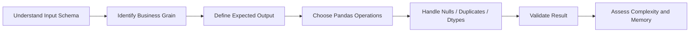

# 23- Pandas Coding Problems

## Overview

Pandas coding interviews usually test more than whether a candidate remembers a method name. Strong solutions demonstrate that the candidate can:

- understand the required business grain
- choose the correct Pandas operation
- reason about nulls, duplicates, dtypes, and indexes
- preserve or intentionally change row cardinality
- avoid unnecessary Python loops
- validate assumptions
- recognize when SQL or another processing system is more appropriate

The problems below progress from common DataFrame operations to production-style ETL, reporting, performance, and SQL + Pandas scenarios.

A useful interview workflow is:



For every problem, first determine:

```text
What does one input row represent?
What should one output row represent?
Can keys be duplicated?
Can values be null?
Can the input be empty?
Can the dataset be large?
```

---

## Interview Problem Strategy

A strong implementation should normally follow this order:

1. State the expected input and output grain.
2. Identify assumptions and edge cases.
3. Prefer vectorized operations.
4. Make joins explicit.
5. Validate important invariants.
6. Discuss time and memory complexity.
7. Explain how the solution changes for large datasets or production workloads.

### Common Patterns

| Requirement | Typical Pandas Tool |
|---|---|
| Filter rows | Boolean mask, `loc`, `query` |
| Select columns | `loc`, column list |
| Normalize values | `astype`, `str`, `map`, `replace` |
| Aggregate | `groupby`, `agg` |
| Add group-level values | `transform` |
| Combine datasets | `merge`, `join`, `concat` |
| Deduplicate | `drop_duplicates` |
| Rank records | `rank`, `sort_values`, `nlargest` |
| Reshape | `pivot`, `pivot_table`, `melt` |
| Time filtering | `to_datetime`, boolean masks |
| Running metrics | `cumsum`, `cumcount`, `rolling` |
| Validation | explicit assertions or validation functions |

---

## Problem 1: Filter Completed High-Value Orders

### Problem

Given an `orders` DataFrame:

```python
import pandas as pd

orders = pd.DataFrame(
    {
        "order_id": ["O-1", "O-2", "O-3", "O-4"],
        "customer_id": ["C-1", "C-2", "C-1", "C-3"],
        "status": ["completed", "pending", "completed", "cancelled"],
        "amount": [1500.0, 800.0, 12000.0, 5000.0],
    }
)
```

Return only completed orders with an amount of at least `10000`.

### Solution

```python
result = orders.loc[
    orders["status"].eq("completed")
    & orders["amount"].ge(10_000)
].copy()
```

### Reasoning

Use boolean masks because both conditions operate independently on rows.

`eq()` and `ge()` make the comparison semantics explicit and compose cleanly with `&`.

### Expected Result

```text
order_id  customer_id  status       amount
O-3       C-1          completed    12000.0
```

### Interview Points

Do not use Python `and` between Pandas Series:

```python
# Incorrect
orders[
    orders["status"].eq("completed")
    and orders["amount"].ge(10_000)
]
```

Use:

```python
&
|
~
```

with parenthesized conditions.

---

## Problem 2: Find the Largest Orders

### Problem

Return the five highest-value orders.

### Solution

```python
top_orders = orders.nlargest(
    5,
    "amount",
)
```

### Reasoning

`nlargest()` directly expresses the business requirement and is preferable to sorting the entire DataFrame when only the top `n` rows are needed.

### Alternative

```python
top_orders = (
    orders
    .sort_values(
        "amount",
        ascending=False,
    )
    .head(5)
)
```

### Comparison

| Approach | When to Prefer |
|---|---|
| `nlargest()` | Top-N problem |
| `sort_values().head()` | Need the complete ordering |

---

## Problem 3: Count Orders by Status

### Problem

Produce a table containing order status and the number of orders.

### Solution

```python
status_counts = (
    orders["status"]
    .value_counts(dropna=False)
    .rename_axis("status")
    .reset_index(name="order_count")
)
```

### Reasoning

`value_counts()` is concise and optimized for frequency analysis.

For grouped aggregations involving multiple measures, use `groupby()` instead.

---

## Problem 4: Calculate Revenue by Customer

### Problem

Given:

```python
orders = pd.DataFrame(
    {
        "order_id": ["O-1", "O-2", "O-3", "O-4"],
        "customer_id": ["C-1", "C-2", "C-1", "C-3"],
        "status": ["completed", "completed", "completed", "cancelled"],
        "amount": [1500.0, 800.0, 12000.0, 5000.0],
    }
)
```

Calculate completed revenue per customer.

### Solution

```python
customer_revenue = (
    orders.loc[
        orders["status"].eq("completed")
    ]
    .groupby("customer_id", as_index=False)
    .agg(
        revenue=("amount", "sum"),
        order_count=("order_id", "nunique"),
    )
)
```

### Expected Result

```text
customer_id  revenue  order_count
C-1          13500.0  2
C-2            800.0  1
```

### Reasoning

The result grain is:

```text
one row per customer
```

Therefore `groupby().agg()` is appropriate.

---

## Problem 5: Add Customer Revenue to Every Order

### Problem

For every order, add the customer's total completed revenue without changing the number of rows.

### Solution

```python
completed_revenue = (
    orders
    .assign(
        completed_amount=lambda df: df["amount"].where(
            df["status"].eq("completed"),
            0.0,
        )
    )
    .groupby("customer_id")[
        "completed_amount"
    ]
    .transform("sum")
)

result = orders.assign(
    customer_completed_revenue=completed_revenue
)
```

### Reasoning

This is a `transform()` problem because the output must preserve the original row count and index alignment.

Use:

```text
agg()       → one row per group
transform() → one value per original row
```

---

## Problem 6: Remove Duplicate Orders, Keeping the Latest Version

### Problem

Given multiple versions of the same order, keep the most recently updated record.

```python
orders = pd.DataFrame(
    {
        "order_id": ["O-1", "O-1", "O-2"],
        "status": ["pending", "completed", "completed"],
        "updated_at": [
            "2026-09-01 10:00:00",
            "2026-09-01 11:00:00",
            "2026-09-01 09:00:00",
        ],
    }
)
```

### Solution

```python
orders["updated_at"] = pd.to_datetime(
    orders["updated_at"],
    utc=True,
)

latest_orders = (
    orders
    .sort_values(
        ["order_id", "updated_at"]
    )
    .drop_duplicates(
        "order_id",
        keep="last",
    )
    .reset_index(drop=True)
)
```

### Reasoning

`drop_duplicates()` does not understand "latest" by itself.

The ordering must be established first.

For very large datasets, consider whether the deduplication can be pushed to PostgreSQL with a window function.

---

## Problem 7: Handle Missing Revenue Values

### Problem

Replace missing discounts with zero and calculate net revenue.

```python
orders = pd.DataFrame(
    {
        "gross_amount": [1000.0, 2000.0, 1500.0],
        "discount": [100.0, None, 50.0],
    }
)
```

### Solution

```python
orders["discount"] = (
    orders["discount"]
    .fillna(0.0)
)

orders["net_amount"] = (
    orders["gross_amount"]
    - orders["discount"]
)
```

### Production Consideration

Only replace missing values with zero when the business semantics support:

```text
missing discount = no discount
```

Do not blindly convert every null numeric value to zero.

---

## Problem 8: Normalize Customer Names

### Problem

Normalize names by:

- converting to string dtype
- trimming whitespace
- converting to lowercase

### Solution

```python
customers["name"] = (
    customers["name"]
    .astype("string")
    .str.strip()
    .str.lower()
)
```

### Reasoning

String normalization should occur before matching, deduplication, or joins when source systems do not provide canonical identifiers.

Do not use normalized names as a primary key when a stable customer ID exists.

---

## Problem 9: Find Customers With No Orders

### Problem

Given:

```python
customers = pd.DataFrame(
    {
        "customer_id": ["C-1", "C-2", "C-3"],
        "name": ["Alice", "Bob", "Carol"],
    }
)

orders = pd.DataFrame(
    {
        "order_id": ["O-1", "O-2"],
        "customer_id": ["C-1", "C-3"],
    }
)
```

Return customers who have never placed an order.

### Solution

```python
customer_ids_with_orders = (
    orders["customer_id"]
    .dropna()
    .drop_duplicates()
)

result = customers.loc[
    ~customers["customer_id"].isin(
        customer_ids_with_orders
    )
].copy()
```

### Result

```text
customer_id  name
C-2          Bob
```

### Alternative: Merge-Based Anti-Join

```python
result = (
    customers
    .merge(
        orders[
            ["customer_id"]
        ].drop_duplicates(),
        on="customer_id",
        how="left",
        indicator=True,
    )
    .loc[
        lambda df: df["_merge"].eq(
            "left_only"
        ),
        customers.columns,
    ]
)
```

The simpler `isin()` approach is usually preferable for a single-key membership problem.

---

## Problem 10: Find Unmatched Orders

### Problem

Return orders whose `customer_id` does not exist in the customer master table.

### Solution

```python
result = (
    orders
    .merge(
        customers[
            ["customer_id"]
        ],
        on="customer_id",
        how="left",
        indicator=True,
    )
    .loc[
        lambda df: df["_merge"].eq(
            "left_only"
        ),
        orders.columns,
    ]
)
```

### Production Use

This pattern is useful for:

```text
referential-integrity validation
ETL quarantine
source-system reconciliation
master-data debugging
```

---

## Problem 11: Join Orders to Customers Safely

### Problem

Add customer segment to every order. Assume:

```text
orders: many rows per customer
customers: one row per customer
```

### Solution

```python
result = orders.merge(
    customers[
        [
            "customer_id",
            "segment",
        ]
    ],
    on="customer_id",
    how="left",
    validate="many_to_one",
)
```

### Why `validate` Matters

Without validation, duplicate customer keys can silently multiply orders.

Expected cardinality should be expressed in the code whenever possible.

---

## Problem 12: Calculate Monthly Revenue

### Problem

Given an order DataFrame with timestamps, calculate monthly completed revenue.

### Solution

```python
orders["created_at"] = pd.to_datetime(
    orders["created_at"],
    utc=True,
)

monthly_revenue = (
    orders.loc[
        orders["status"].eq("completed")
    ]
    .assign(
        month=lambda df: df[
            "created_at"
        ].dt.to_period("M")
    )
    .groupby("month", as_index=False)
    .agg(
        revenue=("amount", "sum"),
    )
)
```

### Production Consideration

When the source is PostgreSQL and the dataset is large, perform date filtering and possibly aggregation in SQL first.

Pandas should not automatically become the database's aggregation engine.

---

## Problem 13: Calculate Month-over-Month Growth

### Problem

Given monthly revenue:

```text
month       revenue
2026-01     100000
2026-02     120000
2026-03     114000
```

Calculate percentage change.

### Solution

```python
monthly["mom_growth"] = (
    monthly["revenue"]
    .pct_change()
)
```

### Result

```text
2026-01    NaN
2026-02    0.20
2026-03   -0.05
```

### Interview Trap

The first month has no previous period, so `NaN` is expected.

Do not blindly replace it with zero unless the reporting definition requires that.

---

## Problem 14: Find the Top Customer per Region

### Problem

Given customer-level revenue:

```text
region  customer_id  revenue
North   C-1          50000
North   C-2          75000
South   C-3          90000
South   C-4          80000
```

Return the highest-revenue customer in each region.

### Solution

```python
result = (
    customers
    .sort_values(
        ["region", "revenue"],
        ascending=[True, False],
    )
    .drop_duplicates(
        "region",
        keep="first",
    )
)
```

### Alternative With Rank

```python
ranked = customers.assign(
    rank=(
        customers.groupby("region")[
            "revenue"
        ]
        .rank(
            method="first",
            ascending=False,
        )
    )
)

result = ranked.loc[
    ranked["rank"].eq(1)
]
```

The sorting approach is usually easier to read when only one record is required.

---

## Problem 15: Return the Top Three Customers Per Region

### Solution

```python
result = (
    customers
    .sort_values(
        ["region", "revenue"],
        ascending=[True, False],
    )
    .groupby(
        "region",
        group_keys=False,
    )
    .head(3)
)
```

### Reasoning

This avoids a Python loop over regions.

For large data, sorting complexity matters, so consider whether the database can execute the same top-N-per-group operation with a window function.

---

## Problem 16: Calculate Customer Revenue Share

### Problem

For each customer, calculate:

```text
customer revenue / regional revenue
```

### Solution

```python
regional_total = (
    customer_revenue
    .groupby("region")["revenue"]
    .transform("sum")
)

customer_revenue["regional_share"] = (
    customer_revenue["revenue"]
    / regional_total
)
```

### Reasoning

`transform()` makes the denominator available at the original row grain.

---

## Problem 17: Find the Latest Event for Each User

### Problem

Given event data:

```text
user_id
event_type
event_time
```

return the latest event per user.

### Solution

```python
events["event_time"] = pd.to_datetime(
    events["event_time"],
    utc=True,
)

latest_events = (
    events
    .sort_values(
        ["user_id", "event_time"]
    )
    .drop_duplicates(
        "user_id",
        keep="last",
    )
)
```

### Production Consideration

For billions of events, this is usually a database or distributed-processing problem rather than an in-memory Pandas problem.

---

## Problem 18: Calculate Running Revenue Per Customer

### Problem

For each customer, calculate cumulative revenue ordered by transaction time.

### Solution

```python
transactions["created_at"] = pd.to_datetime(
    transactions["created_at"],
    utc=True,
)

transactions = transactions.sort_values(
    ["customer_id", "created_at"]
)

transactions["running_revenue"] = (
    transactions
    .groupby("customer_id")["amount"]
    .cumsum()
)
```

### Reasoning

The sort is essential because `cumsum()` follows the existing row order.

---

## Problem 19: Calculate a Seven-Day Rolling Revenue Metric

### Problem

Given one row per transaction, calculate each customer's seven-day rolling revenue.

### Solution

```python
transactions["created_at"] = pd.to_datetime(
    transactions["created_at"],
    utc=True,
)

transactions = transactions.sort_values(
    ["customer_id", "created_at"]
)

rolling_revenue = (
    transactions
    .set_index("created_at")
    .groupby("customer_id")["amount"]
    .rolling("7D")
    .sum()
    .reset_index(
        name="rolling_7d_revenue"
    )
)
```

### Production Consideration

Time-based windows require correct timestamp semantics and ordering.

For high-volume event analytics, PostgreSQL window functions, ClickHouse, Spark, or streaming systems may be more appropriate.

---

## Problem 20: Sessionize User Events

### Problem

A new session starts when the gap between consecutive events for the same user exceeds 30 minutes.

### Solution

```python
events["event_time"] = pd.to_datetime(
    events["event_time"],
    utc=True,
)

events = events.sort_values(
    [
        "user_id",
        "event_time",
    ]
)

gap = (
    events
    .groupby("user_id")[
        "event_time"
    ]
    .diff()
)

events["new_session"] = (
    gap.isna()
    | gap.gt(pd.Timedelta(minutes=30))
)

events["session_number"] = (
    events
    .groupby("user_id")[
        "new_session"
    ]
    .cumsum()
)
```

### Reasoning

This is a stateful transformation expressed with vectorized operations:

```text
sort
→ diff
→ boolean boundary
→ cumulative sum
```

---

## Problem 21: Calculate Daily Active Users

### Problem

Given event data, calculate the number of distinct users active each day.

### Solution

```python
events["event_time"] = pd.to_datetime(
    events["event_time"],
    utc=True,
)

daily_active_users = (
    events
    .assign(
        event_date=lambda df: df[
            "event_time"
        ].dt.date
    )
    .groupby("event_date")[
        "user_id"
    ]
    .nunique()
    .rename("dau")
    .reset_index()
)
```

### Performance Consideration

`nunique()` can be memory-intensive at large scale.

For production analytics, consider database aggregation or an analytical engine when the event volume exceeds the practical memory limits of a single Pandas process.

---

## Problem 22: Calculate Conversion Funnel Metrics

### Problem

Given event data with:

```text
user_id
event_type
```

calculate the number of unique users who reached:

```text
view_product
add_to_cart
purchase
```

### Solution

```python
steps = [
    "view_product",
    "add_to_cart",
    "purchase",
]

funnel = (
    events.loc[
        events["event_type"].isin(steps),
        ["user_id", "event_type"],
    ]
    .drop_duplicates()
    .groupby("event_type")[
        "user_id"
    ]
    .nunique()
    .reindex(
        steps,
        fill_value=0,
    )
    .rename("users")
    .reset_index()
)
```

### Important Caveat

This calculates distinct users per event type.

It does not prove ordered funnel progression.

A strict funnel requires timestamps and logic ensuring:

```text
view
→ later add_to_cart
→ later purchase
```

---

## Problem 23: Calculate Order-Level Average Order Value

### Problem

Order data may have multiple line items. Calculate:

```text
AOV = total order revenue / number of orders
```

### Solution

```python
order_totals = (
    order_lines
    .groupby("order_id", as_index=False)
    .agg(
        order_revenue=("line_total", "sum"),
    )
)

aov = (
    order_totals["order_revenue"].sum()
    / order_totals["order_id"].nunique()
)
```

### Interview Trap

Do not calculate:

```python
order_lines["line_total"].mean()
```

because that produces average line-item value, not average order value.

The business grain determines the calculation.

---

## Problem 24: Find Employees Above Their Department Average

### Problem

Return employees whose salary exceeds the average salary in their department.

### Solution

```python
employees["department_avg_salary"] = (
    employees
    .groupby("department")[
        "salary"
    ]
    .transform("mean")
)

result = employees.loc[
    employees["salary"]
    > employees["department_avg_salary"]
].copy()
```

### Reasoning

The department average must be aligned back to each employee row, making `transform()` the natural operation.

---

## Problem 25: Standardize Column Names

### Problem

Convert inconsistent API column names into a stable internal schema.

### Solution

```python
df.columns = (
    df.columns
    .astype("string")
    .str.strip()
    .str.lower()
    .str.replace(
        r"[^a-z0-9]+",
        "_",
        regex=True,
    )
    .str.strip("_")
)
```

### Production Consideration

Normalization should be followed by schema validation.

Do not assume that:

```text
normalized column name exists
```

means:

```text
correct source field
```

For example:

```text
customer-id
customer_id
customer id
```

may normalize correctly while another source field has a completely different meaning.

---

## Problem 26: Convert Mixed Numeric Input Safely

### Problem

A financial API returns:

```text
"1000"
"2,500.50"
""
"N/A"
```

Convert the column into a numeric representation and identify invalid records.

### Solution

```python
raw_amount = (
    df["amount"]
    .astype("string")
    .str.strip()
    .str.replace(
        ",",
        "",
        regex=False,
    )
)

df["amount_numeric"] = pd.to_numeric(
    raw_amount,
    errors="coerce",
)

invalid = df.loc[
    raw_amount.notna()
    & df["amount_numeric"].isna()
]
```

### Reasoning

Using `errors="coerce"` allows the pipeline to continue while explicitly isolating invalid input.

Whether invalid rows should be quarantined or rejected is a business and operational decision.

---

## Problem 27: Create a Customer Segmentation Rule

### Problem

Classify customers:

```text
>= 100000 → enterprise
>= 25000  → premium
otherwise → standard
```

### Solution

```python
conditions = [
    customers["annual_revenue"].ge(100_000),
    customers["annual_revenue"].ge(25_000),
]

choices = [
    "enterprise",
    "premium",
]

customers["segment"] = pd.Series(
    pd.array(
        pd.np.select(
            conditions,
            choices,
            default="standard",
        )
    ),
    index=customers.index,
)
```

A cleaner modern implementation uses NumPy directly:

```python
import numpy as np

customers["segment"] = np.select(
    conditions,
    choices,
    default="standard",
)
```

### Interview Point

When using Pandas for conditional classification, `np.select()` is often clearer than deeply nested `np.where()` expressions.

---

## Problem 28: Find Customers With Three Consecutive Active Months

### Problem

Given customer monthly activity:

```text
customer_id
month
```

identify customers with activity in at least three consecutive months.

### Solution

```python
activity = (
    activity
    .assign(
        month=pd.to_datetime(
            activity["month"]
        ).dt.to_period("M")
    )
    .drop_duplicates(
        [
            "customer_id",
            "month",
        ]
    )
    .sort_values(
        [
            "customer_id",
            "month",
        ]
    )
)

month_number = (
    activity["month"]
    .astype("int64")
)

activity["streak_key"] = (
    month_number
    - activity.groupby(
        "customer_id"
    ).cumcount()
)

streaks = (
    activity
    .groupby(
        [
            "customer_id",
            "streak_key",
        ]
    )
    .size()
    .reset_index(
        name="streak_length"
    )
)

result = streaks.loc[
    streaks["streak_length"].ge(3),
    ["customer_id"],
].drop_duplicates()
```

### Reasoning

This is a common interview pattern:

```text
ordered sequence
→ row number
→ subtract row number from period number
→ identical key means contiguous sequence
```

---

## Problem 29: Detect Consecutive Failure Events

### Problem

Given service health events:

```text
service
timestamp
status
```

find services with at least three consecutive `"failed"` states.

### Solution

```python
events = events.sort_values(
    [
        "service",
        "timestamp",
    ]
)

is_failure = events["status"].eq(
    "failed"
)

block = (
    is_failure
    .ne(
        is_failure.groupby(
            events["service"]
        ).shift()
    )
    .groupby(
        events["service"]
    )
    .cumsum()
)

failure_groups = (
    events.loc[is_failure]
    .assign(
        block=block.loc[is_failure]
    )
    .groupby(
        [
            "service",
            "block",
        ]
    )
    .size()
    .reset_index(
        name="failure_count"
    )
)

result = failure_groups.loc[
    failure_groups["failure_count"].ge(3)
]
```

### Production Use

The same idea appears in:

```text
service monitoring
payment failure analysis
job failure detection
Kafka consumer health analysis
```

---

## Problem 30: Reconcile Two Daily Reports

### Problem

Given:

```text
source_report
published_report
```

compare:

```text
order count
revenue
```

by day.

### Solution

```python
source_daily = (
    source_report
    .groupby("date", as_index=False)
    .agg(
        source_orders=(
            "order_id",
            "nunique",
        ),
        source_revenue=(
            "amount",
            "sum",
        ),
    )
)

published_daily = (
    published_report
    .groupby("date", as_index=False)
    .agg(
        published_orders=(
            "order_id",
            "nunique",
        ),
        published_revenue=(
            "amount",
            "sum",
        ),
    )
)

reconciliation = (
    source_daily
    .merge(
        published_daily,
        on="date",
        how="outer",
        indicator=True,
    )
    .assign(
        order_delta=lambda df: (
            df["source_orders"].fillna(0)
            - df["published_orders"].fillna(0)
        ),
        revenue_delta=lambda df: (
            df["source_revenue"].fillna(0)
            - df["published_revenue"].fillna(0)
        ),
    )
)
```

### Validation

```python
reconciliation["is_reconciled"] = (
    reconciliation["order_delta"].eq(0)
    & reconciliation["revenue_delta"]
    .abs()
    .le(0.01)
)
```

### Production Use

This pattern is useful for:

```text
ETL reconciliation
financial reporting
data warehouse validation
daily batch verification
```

---

## Problem 31: Process a Large CSV in Chunks

### Problem

Calculate total completed revenue from a CSV that is too large to fit comfortably into memory.

### Solution

```python
import pandas as pd

total_revenue = 0.0

for chunk in pd.read_csv(
    "orders.csv",
    usecols=[
        "status",
        "amount",
    ],
    chunksize=100_000,
):
    chunk["amount"] = pd.to_numeric(
        chunk["amount"],
        errors="coerce",
    )

    completed = chunk.loc[
        chunk["status"].eq("completed"),
        "amount",
    ]

    total_revenue += (
        completed.sum()
    )

print(total_revenue)
```

### Reasoning

The solution reduces peak memory by processing bounded batches.

It works because the final operation is decomposable:

```text
sum(total of each chunk)
=
sum(all rows)
```

Operations requiring global state, such as an exact global sort, require a different strategy.

---

## Problem 32: Process API Pagination Into a DataFrame

### Problem

A REST API returns pages of orders.

Design a safe pattern that:

```text
fetches pages
normalizes responses
combines records
handles an empty page
```

### Solution

```python
from collections.abc import Iterable

import pandas as pd


def normalize_order_pages(
    pages: Iterable[dict],
) -> pd.DataFrame:
    records: list[dict] = []

    for page in pages:
        page_records = page.get(
            "data",
            [],
        )

        if not isinstance(
            page_records,
            list,
        ):
            raise ValueError(
                "API field 'data' must be a list"
            )

        records.extend(page_records)

    return pd.json_normalize(records)
```

### Production Considerations

The network client should separately handle:

```text
timeouts
retries
rate limits
authentication
pagination cursors
idempotency
partial failures
```

Pandas should normally process the normalized records after acquisition.

---

## Problem 33: Normalize Nested JSON

### Problem

An API returns:

```json
{
  "order_id": "O-1001",
  "customer": {
    "id": "C-10",
    "name": "Alice"
  },
  "items": [
    {
      "sku": "SKU-1",
      "quantity": 2
    }
  ]
}
```

Create an order-level DataFrame and an item-level DataFrame.

### Solution

```python
order = {
    "order_id": "O-1001",
    "customer": {
        "id": "C-10",
        "name": "Alice",
    },
    "items": [
        {
            "sku": "SKU-1",
            "quantity": 2,
        }
    ],
}

orders = pd.json_normalize(
    order,
    sep="_",
)

items = pd.json_normalize(
    order,
    record_path="items",
    meta=["order_id"],
)
```

### Reasoning

Nested API data often contains multiple natural grains.

Do not flatten everything into one wide DataFrame when a one-to-many relationship is being destroyed.

---

## Problem 34: Build a Daily SLA Report

### Problem

Given requests with:

```text
request_id
created_at
completed_at
status
```

calculate daily:

```text
request count
successful request count
95th percentile latency
```

### Solution

```python
requests["created_at"] = pd.to_datetime(
    requests["created_at"],
    utc=True,
)

requests["completed_at"] = pd.to_datetime(
    requests["completed_at"],
    utc=True,
)

requests["latency_seconds"] = (
    requests["completed_at"]
    - requests["created_at"]
).dt.total_seconds()

requests["date"] = (
    requests["created_at"]
    .dt.date
)

daily_sla = (
    requests
    .groupby("date")
    .agg(
        request_count=(
            "request_id",
            "nunique",
        ),
        successful_requests=(
            "status",
            lambda s: s.eq(
                "success"
            ).sum(),
        ),
        p95_latency=(
            "latency_seconds",
            lambda s: s.quantile(0.95),
        ),
    )
    .reset_index()
)
```

### Production Consideration

For high-cardinality distributed telemetry, percentile calculations are often handled more efficiently by observability systems or analytical databases.

---

## Problem 35: Detect Revenue Anomalies

### Problem

Flag customer transactions where the amount is more than three standard deviations above the customer mean.

### Solution

```python
grouped = transactions.groupby(
    "customer_id"
)["amount"]

mean = grouped.transform("mean")
std = grouped.transform("std")

transactions["is_anomaly"] = (
    transactions["amount"]
    > mean + (3 * std.fillna(0))
)
```

### Caveat

A standard-deviation rule is a heuristic.

It may perform poorly for:

```text
skewed distributions
small samples
heavy-tailed financial data
seasonal behavior
```

A production fraud or anomaly system should use a domain-appropriate method.

---

## Problem 36: Calculate Customer Retention Cohorts

### Problem

For each customer:

1. Determine the first active month.
2. Determine every month in which the customer was active.
3. Calculate retained customers by cohort month and activity month.

### Solution

```python
events["event_time"] = pd.to_datetime(
    events["event_time"],
    utc=True,
)

activity = (
    events
    .assign(
        activity_month=lambda df: (
            df["event_time"]
            .dt.to_period("M")
        )
    )[
        [
            "customer_id",
            "activity_month",
        ]
    ]
    .drop_duplicates()
)

first_month = (
    activity
    .groupby("customer_id")[
        "activity_month"
    ]
    .min()
    .rename("cohort_month")
)

cohort_activity = activity.merge(
    first_month,
    on="customer_id",
    how="left",
)

cohort_counts = (
    cohort_activity
    .groupby(
        [
            "cohort_month",
            "activity_month",
        ]
    )[
        "customer_id"
    ]
    .nunique()
    .reset_index(
        name="active_customers"
    )
)
```

### Interview Point

The crucial design decision is the distinction between:

```text
customer grain
```

and:

```text
customer-month grain
```

---

## Problem 37: Compare Two DataFrames Row by Row

### Problem

Determine which records changed between an old snapshot and a new snapshot.

### Solution

```python
old = old.set_index("customer_id")
new = new.set_index("customer_id")

changes = old.compare(
    new,
    keep_equal=False,
)
```

### Production Consideration

Both DataFrames need compatible indexes and columns.

For warehouse-style change detection, compare only relevant business columns and establish how inserts and deletes are handled.

---

## Problem 38: Identify Inserts, Updates, and Deletes

### Problem

Compare two customer snapshots and classify records as:

```text
inserted
updated
deleted
unchanged
```

### Solution

```python
old = old.set_index("customer_id")
new = new.set_index("customer_id")

old_ids = old.index
new_ids = new.index

inserted = new.index.difference(old_ids)
deleted = old.index.difference(new_ids)

common_ids = old_ids.intersection(
    new_ids
)

updated = old.loc[
    common_ids
].compare(
    new.loc[common_ids],
    keep_equal=False,
).index

unchanged = (
    common_ids
    .difference(updated)
)
```

### Production Use

This pattern is useful for:

```text
incremental ETL
SCD pipelines
snapshot reconciliation
change detection
```

---

## Problem 39: Optimize an Inefficient Loop

### Problem

The following is slow:

```python
for index, row in orders.iterrows():
    orders.loc[index, "net"] = (
        row["amount"]
        - row["discount"]
    )
```

Rewrite it using vectorized Pandas operations.

### Solution

```python
orders["net"] = (
    orders["amount"]
    - orders["discount"].fillna(0.0)
)
```

### Reasoning

The vectorized version avoids Python-level row iteration and repeated scalar assignment.

For large DataFrames, this difference can be substantial.

---

## Problem 40: Replace a Slow Row-Wise Classification

### Problem

Rewrite:

```python
def classify(row):
    if row["amount"] >= 100_000:
        return "enterprise"

    if row["amount"] >= 25_000:
        return "premium"

    return "standard"


customers["segment"] = customers.apply(
    classify,
    axis=1,
)
```

### Solution

```python
import numpy as np

conditions = [
    customers["amount"].ge(100_000),
    customers["amount"].ge(25_000),
]

customers["segment"] = np.select(
    conditions,
    [
        "enterprise",
        "premium",
    ],
    default="standard",
)
```

### Interview Point

The interviewer is testing whether you can recognize:

```text
row-wise Python execution
```

when the logic can be expressed as vectorized operations.

---

## Problem 41: Validate a DataFrame Contract

### Problem

Write a validation function that requires:

```text
order_id
customer_id
amount
created_at
```

and verifies:

```text
order_id is unique
required fields are non-null
amount is non-negative
created_at is datetime
```

### Solution

```python
import pandas as pd


def validate_orders(
    orders: pd.DataFrame,
) -> None:
    required = {
        "order_id",
        "customer_id",
        "amount",
        "created_at",
    }

    missing_columns = (
        required - set(orders.columns)
    )

    if missing_columns:
        raise ValueError(
            "Missing columns: "
            f"{sorted(missing_columns)}"
        )

    if not orders["order_id"].is_unique:
        raise ValueError(
            "order_id must be unique"
        )

    if orders[
        [
            "order_id",
            "customer_id",
            "amount",
            "created_at",
        ]
    ].isna().any().any():
        raise ValueError(
            "Required columns contain nulls"
        )

    if not pd.api.types.is_numeric_dtype(
        orders["amount"]
    ):
        raise TypeError(
            "amount must be numeric"
        )

    if not orders["amount"].ge(0).all():
        raise ValueError(
            "amount must be non-negative"
        )

    if not pd.api.types.is_datetime64_any_dtype(
        orders["created_at"]
    ):
        raise TypeError(
            "created_at must be datetime"
        )
```

### Production Consideration

Validation errors should carry enough context for operators to identify:

```text
batch
source
schema version
record count
failure category
```

---

## Problem 42: Design a Chunked Group Aggregation

### Problem

A CSV contains hundreds of millions of transaction rows. Calculate total revenue by currency without loading the entire file.

### Solution

```python
import pandas as pd

totals: pd.Series | None = None

for chunk in pd.read_csv(
    "transactions.csv",
    usecols=["currency", "amount"],
    chunksize=200_000,
):
    chunk["amount"] = pd.to_numeric(
        chunk["amount"],
        errors="coerce",
    )

    partial = (
        chunk
        .dropna(
            subset=["currency", "amount"]
        )
        .groupby("currency")["amount"]
        .sum()
    )

    if totals is None:
        totals = partial
    else:
        totals = totals.add(
            partial,
            fill_value=0,
        )

result = (
    totals
    .rename("revenue")
    .reset_index()
)
```

### Reasoning

The partial aggregation is mergeable:

```text
global sum
=
sum(partial sums)
```

This makes chunking possible without retaining all rows.

---

## Problem 43: Reconcile Pandas Against PostgreSQL

### Problem

A PostgreSQL report and a Pandas report disagree on daily revenue.

Write a debugging approach rather than immediately rewriting the transformation.

### Solution Strategy

Check in order:

```text
1. Source row counts
2. Date range
3. Timezone
4. Filter predicates
5. Null handling
6. Join cardinality
7. Duplicate order IDs
8. Aggregation grain
9. Currency conversion
10. Numeric precision
```

A useful Pandas check is:

```python
pandas_daily = (
    orders
    .groupby("date", as_index=False)
    .agg(
        revenue=("amount", "sum"),
        orders=("order_id", "nunique"),
    )
)
```

Then compare that output directly to the SQL result.

### Senior-Level Answer

Do not assume:

```text
same source table
=
same result
```

The implementation semantics must also match.

---

## Problem 44: Debug a Many-to-Many Join

### Problem

The following unexpectedly triples the row count:

```python
result = orders.merge(
    promotions,
    on="product_id",
    how="left",
)
```

### Solution

Check key uniqueness:

```python
print(
    promotions["product_id"].is_unique
)

print(
    promotions["product_id"]
    .value_counts()
    .head(20)
)
```

If multiple promotions per product are valid, define the intended relationship explicitly.

For example, select the applicable promotion first:

```python
promotions["start_at"] = pd.to_datetime(
    promotions["start_at"],
    utc=True,
)

applicable = (
    promotions
    .sort_values(
        ["product_id", "start_at"]
    )
    .drop_duplicates(
        "product_id",
        keep="last",
    )
)
```

Then join.

### Interview Point

A join problem is often actually a **data-modeling problem**.

---

## Problem 45: Build an Idempotent Daily Pipeline

### Problem

A daily process reads transactions and produces daily revenue. The same batch may be retried.

How should the Pandas transformation be structured?

### Solution Pattern

```text
Input batch
    ↓
Validate schema
    ↓
Normalize types
    ↓
Deduplicate by business key
    ↓
Filter target period
    ↓
Aggregate
    ↓
Validate output
    ↓
Write partition atomically
```

Example transformation:

```python
def build_daily_revenue(
    transactions: pd.DataFrame,
) -> pd.DataFrame:
    transactions = transactions.copy()

    transactions["created_at"] = pd.to_datetime(
        transactions["created_at"],
        utc=True,
    )

    transactions = (
        transactions
        .sort_values("updated_at")
        .drop_duplicates(
            "transaction_id",
            keep="last",
        )
    )

    result = (
        transactions
        .loc[
            transactions["status"].eq(
                "completed"
            )
        ]
        .assign(
            date=lambda df: (
                df["created_at"].dt.date
            )
        )
        .groupby(
            "date",
            as_index=False,
        )
        .agg(
            revenue=("amount", "sum"),
        )
    )

    return result
```

### Production Requirement

Idempotency is not achieved by Pandas alone.

The write layer must also prevent duplicate publication, typically through:

```text
partition replacement
database upsert
unique constraint
transactional load
object versioning
```

---

## Problem 46: Handle Empty Input Safely

### Problem

Write a transformation that returns the correct schema even when the input DataFrame is empty.

### Solution

```python
OUTPUT_COLUMNS = [
    "customer_id",
    "revenue",
    "order_count",
]


def summarize_orders(
    orders: pd.DataFrame,
) -> pd.DataFrame:
    if orders.empty:
        return pd.DataFrame(
            {
                "customer_id": pd.Series(
                    dtype="string"
                ),
                "revenue": pd.Series(
                    dtype="float64"
                ),
                "order_count": pd.Series(
                    dtype="int64"
                ),
            }
        )

    return (
        orders
        .groupby(
            "customer_id",
            as_index=False,
        )
        .agg(
            revenue=("amount", "sum"),
            order_count=(
                "order_id",
                "nunique",
            ),
        )
    )
```

### Why This Matters

Pipelines often fail not because a transformation is wrong, but because downstream systems receive:

```text
zero rows
wrong columns
wrong dtypes
```

An explicit output contract avoids this class of failure.

---

## Problem 47: Preserve Output Schema After Filtering

### Problem

Return a report containing:

```text
customer_id
revenue
order_count
```

even when no customer matches the filter.

### Solution

```python
result = (
    orders.loc[
        orders["status"].eq("completed")
    ]
    .groupby(
        "customer_id",
        as_index=False,
    )
    .agg(
        revenue=("amount", "sum"),
        order_count=(
            "order_id",
            "nunique",
        ),
    )
    .reindex(
        columns=[
            "customer_id",
            "revenue",
            "order_count",
        ]
    )
)
```

For stricter type guarantees, establish an explicit output schema validation step.

---

## Problem 48: Find the First Purchase Date

### Problem

Return the first completed purchase date for every customer.

### Solution

```python
orders["created_at"] = pd.to_datetime(
    orders["created_at"],
    utc=True,
)

first_purchase = (
    orders.loc[
        orders["status"].eq("completed")
    ]
    .groupby("customer_id", as_index=False)
    .agg(
        first_purchase_at=(
            "created_at",
            "min",
        )
    )
)
```

### Extension

Join the result back to the customer master to derive:

```text
new customer
existing customer
customer age
cohort month
```

---

## Problem 49: Find Repeat Customers

### Problem

A repeat customer has at least two distinct completed orders.

### Solution

```python
repeat_customers = (
    orders.loc[
        orders["status"].eq("completed")
    ]
    .groupby("customer_id")[
        "order_id"
    ]
    .nunique()
    .loc[lambda s: s.ge(2)]
    .rename("completed_orders")
    .reset_index()
)
```

### Interview Point

Use `nunique()` when duplicate rows should not inflate order counts.

---

## Problem 50: Identify the Highest-Spending Customer per Month

### Solution

```python
orders["created_at"] = pd.to_datetime(
    orders["created_at"],
    utc=True,
)

monthly_customer = (
    orders.loc[
        orders["status"].eq("completed")
    ]
    .assign(
        month=lambda df: (
            df["created_at"]
            .dt.to_period("M")
        )
    )
    .groupby(
        [
            "month",
            "customer_id",
        ],
        as_index=False,
    )
    .agg(
        revenue=("amount", "sum"),
    )
)

top_customers = (
    monthly_customer
    .sort_values(
        [
            "month",
            "revenue",
        ],
        ascending=[
            True,
            False,
        ],
    )
    .drop_duplicates(
        "month",
        keep="first",
    )
)
```

### Production Consideration

Define tie behavior explicitly.

If all tied leaders must be returned, use ranking instead of `drop_duplicates()`.

---

## Problem 51: Return All Tied Top Customers

### Solution

```python
monthly_customer["rank"] = (
    monthly_customer
    .groupby("month")[
        "revenue"
    ]
    .rank(
        method="dense",
        ascending=False,
    )
)

top_customers = monthly_customer.loc[
    monthly_customer["rank"].eq(1)
]
```

### Interview Point

The distinction between:

```text
one winner
```

and:

```text
all tied winners
```

is an important requirement clarification.

---

## Problem 52: Build a Transaction Quality Report

### Problem

Produce one row containing:

```text
total_rows
missing_customer_ids
duplicate_transaction_ids
negative_amounts
invalid_statuses
```

### Solution

```python
valid_statuses = {
    "pending",
    "completed",
    "cancelled",
}

quality_report = pd.DataFrame(
    [
        {
            "total_rows": len(df),
            "missing_customer_ids": int(
                df["customer_id"]
                .isna()
                .sum()
            ),
            "duplicate_transaction_ids": int(
                df["transaction_id"]
                .duplicated()
                .sum()
            ),
            "negative_amounts": int(
                df["amount"]
                .lt(0)
                .sum()
            ),
            "invalid_statuses": int(
                (~df["status"].isin(
                    valid_statuses
                ))
                .sum()
            ),
        }
    ]
)
```

### Production Use

This pattern can become a batch-quality artifact written alongside:

```text
processed data
audit logs
pipeline metrics
reconciliation reports
```

---

## Problem 53: Optimize a Large Join

### Problem

A large `orders` DataFrame only needs:

```text
customer_id
amount
status
```

from the orders side and:

```text
customer_id
segment
```

from the customer side.

Write the transformation efficiently.

### Solution

```python
orders_small = orders.loc[
    orders["status"].eq("completed"),
    [
        "customer_id",
        "amount",
    ],
]

customers_small = customers.loc[
    :,
    [
        "customer_id",
        "segment",
    ],
]

result = orders_small.merge(
    customers_small,
    on="customer_id",
    how="left",
    validate="many_to_one",
)
```

### Reasoning

Projecting columns and filtering before the join reduces:

```text
memory
data movement
join work
intermediate object size
```

---

## Problem 54: Decide Whether Pandas Is Appropriate

### Problem

You receive a 500 GB transaction dataset and are asked to calculate monthly revenue by customer.

Should the entire dataset be loaded into Pandas?

### Answer

Usually no.

The first question should be where the data already lives.

Prefer:

```text
PostgreSQL
→ source-side filtering
→ source-side aggregation
→ smaller result
→ Pandas for downstream processing
```

For a warehouse or lake environment, consider:

```text
SQL engine
Spark
DuckDB
Polars
distributed analytical processing
```

Pandas is excellent for workloads that fit comfortably into available memory and where its API provides meaningful productivity benefits.

The interview signal is not "always use Pandas."

The stronger answer is:

> Choose the processing engine according to data volume, workload shape, latency requirements, operational constraints, and cost.

---

## Problem 55: Explain Time and Memory Complexity

### Problem

Consider:

```python
result = orders.merge(
    customers,
    on="customer_id",
    how="left",
)
```

What should you discuss in an interview?

### Answer

At minimum:

```text
Input sizes
Join key cardinality
Duplicate keys
Output size
Memory required for intermediate structures
Selected columns
Data types
```

The practical concern is that a many-to-many join can make output size dramatically larger than either input.

The dominant production risk may therefore be:

```text
peak memory
```

rather than only CPU time.

---

## Problem 56: Refactor a Multi-Step Transformation for Readability

### Problem

Instead of writing one dense expression, create explicit stages for:

```text
filter
normalize
aggregate
sort
```

### Solution

```python
completed = orders.loc[
    orders["status"].eq("completed")
].copy()

completed["customer_id"] = (
    completed["customer_id"]
    .astype("string")
    .str.strip()
)

customer_revenue = (
    completed
    .groupby(
        "customer_id",
        as_index=False,
    )
    .agg(
        revenue=("amount", "sum"),
        order_count=(
            "order_id",
            "nunique",
        ),
    )
)

customer_revenue = (
    customer_revenue
    .sort_values(
        "revenue",
        ascending=False,
    )
)
```

### Interview Point

Readable intermediate stages are often better than clever method chains when debugging, logging, profiling, or testing individual transformation stages.

---

## Problem 57: Write a Transformation Test

### Problem

Test that customer revenue aggregation:

- creates one row per customer
- calculates correct revenue
- counts distinct orders

### Solution

```python
import pandas as pd
from pandas.testing import assert_frame_equal


def summarize_orders(
    orders: pd.DataFrame,
) -> pd.DataFrame:
    return (
        orders
        .groupby(
            "customer_id",
            as_index=False,
        )
        .agg(
            revenue=("amount", "sum"),
            order_count=(
                "order_id",
                "nunique",
            ),
        )
        .sort_values("customer_id")
        .reset_index(drop=True)
    )


def test_summarize_orders() -> None:
    orders = pd.DataFrame(
        {
            "order_id": [
                "O-1",
                "O-2",
                "O-3",
            ],
            "customer_id": [
                "C-1",
                "C-1",
                "C-2",
            ],
            "amount": [
                100.0,
                200.0,
                50.0,
            ],
        }
    )

    actual = summarize_orders(
        orders
    )

    expected = pd.DataFrame(
        {
            "customer_id": [
                "C-1",
                "C-2",
            ],
            "revenue": [
                300.0,
                50.0,
            ],
            "order_count": [
                2,
                1,
            ],
        }
    )

    assert_frame_equal(
        actual,
        expected,
    )
```

### What This Tests

The test validates the business transformation, not simply whether the function executes.

---

## Problem 58: Handle Duplicate Input Without Double Counting

### Problem

A batch can contain duplicate events with the same:

```text
event_id
```

Calculate revenue without double counting.

### Solution

```python
deduplicated = (
    events
    .sort_values("updated_at")
    .drop_duplicates(
        "event_id",
        keep="last",
    )
)

revenue = (
    deduplicated.loc[
        deduplicated["event_type"].eq(
            "purchase"
        ),
        "amount",
    ]
    .sum()
)
```

### Production Consideration

This assumes the latest event version is authoritative.

That policy must come from the source contract.

---

## Problem 59: Preserve Data Lineage During a Transformation

### Problem

A report is produced from multiple source DataFrames. Add a source indicator that survives the union.

### Solution

```python
orders_a = orders_a.assign(
    source_system="system_a"
)

orders_b = orders_b.assign(
    source_system="system_b"
)

combined = pd.concat(
    [
        orders_a,
        orders_b,
    ],
    ignore_index=True,
)
```

### Why This Matters

Source metadata is valuable for:

```text
debugging
reconciliation
data-quality analysis
auditability
incident response
```

---

## Problem 60: Design a Production-Grade Pandas Coding Solution

### Problem

You are asked:

> Read daily order data, remove duplicate transactions, reject invalid records, enrich with customer segments, calculate daily revenue, and produce a report.

What should a strong interview solution contain?

### Solution Structure

```text
1. Define source and output schemas.
2. Parse types explicitly.
3. Validate required columns.
4. Quarantine invalid rows.
5. Deduplicate by transaction identity.
6. Normalize join keys.
7. Validate customer cardinality.
8. Join only required customer columns.
9. Aggregate at daily reporting grain.
10. Reconcile input/output counts.
11. Validate report invariants.
12. Write output atomically.
13. Emit metrics and structured logs.
14. Test edge cases.
```

A reasonable implementation shape is:

```python
def build_report(
    orders: pd.DataFrame,
    customers: pd.DataFrame,
) -> tuple[pd.DataFrame, pd.DataFrame]:
    validate_orders_schema(orders)

    valid_orders, rejected = clean_orders(
        orders
    )

    valid_orders = (
        valid_orders
        .sort_values("updated_at")
        .drop_duplicates(
            "transaction_id",
            keep="last",
        )
    )

    customers = customers.loc[
        :,
        [
            "customer_id",
            "segment",
        ],
    ]

    enriched = valid_orders.merge(
        customers,
        on="customer_id",
        how="left",
        validate="many_to_one",
    )

    report = (
        enriched
        .assign(
            date=lambda df: (
                df["created_at"].dt.date
            )
        )
        .groupby(
            ["date", "segment"],
            as_index=False,
        )
        .agg(
            revenue=("amount", "sum"),
            orders=(
                "transaction_id",
                "nunique",
            ),
        )
    )

    return report, rejected
```

The important part of the interview answer is not the exact function body. It is the reasoning around:

```text
data contract
grain
correctness
failure handling
cardinality
observability
scale
```

---

## Common Coding Interview Traps

### Using `and` / `or` With Series

Incorrect:

```python
df[
    (df["status"] == "completed")
    and (df["amount"] > 100)
]
```

Correct:

```python
df.loc[
    df["status"].eq("completed")
    & df["amount"].gt(100)
]
```

### Forgetting Parentheses

Use:

```python
condition_a & condition_b
```

with each comparison explicitly grouped.

### Using `apply(axis=1)` for Vectorizable Logic

Prefer:

```python
np.select()
where()
map()
transform()
```

when they express the same business rule.

### Joining Without Checking Cardinality

Use:

```python
validate="many_to_one"
```

or another appropriate relationship.

### Using `drop_duplicates()` Without Defining Identity

A duplicate must be defined by business keys, not by intuition.

### Ignoring Null Semantics

Distinguish:

```text
missing
zero
empty string
invalid
not applicable
```

### Ignoring Grain

Many incorrect revenue calculations are caused by mixing:

```text
order line grain
order grain
customer grain
customer-day grain
```

### Sorting Only Because the Output "Looks Right"

Many algorithms are order-sensitive:

```text
last
first
cumsum
rolling
deduplication by latest record
```

### Resetting the Index Automatically

The index may carry semantics or alignment behavior.

### Materializing Huge Intermediate DataFrames

A single unnecessary copy can be expensive on large workloads.

### Using Pandas for Work That Belongs in SQL

Database-side filtering, joins, and aggregation can reduce network transfer and memory usage substantially.

---

## Coding Problem Difficulty Matrix

| Level | Typical Skills | Representative Problems |
|---|---|---|
| Foundational | filtering, selection, counting | 1–4 |
| Intermediate | joins, deduplication, grouping | 5–17 |
| Advanced | windows, rolling, sessions | 18–23 |
| Data Engineering | quality, reconciliation, chunking | 24–38 |
| Performance | vectorization, memory, scale | 39–55 |
| Senior | architecture, contracts, idempotency | 56–60 |

---

## Interview Answer Framework

For unfamiliar coding problems, use this structure:

```text
Input
↓
Expected grain
↓
Business rule
↓
Pandas operation
↓
Edge cases
↓
Validation
↓
Complexity
↓
Production alternative
```

For example:

> "The input is one row per order. The desired output is one row per customer. Because I am reducing row cardinality, I will use `groupby().agg()`. I need to handle duplicate order IDs before aggregation and verify that amounts are numeric. For a large PostgreSQL dataset, I would push the aggregation into SQL and use Pandas for downstream processing."

That explanation demonstrates significantly more engineering maturity than simply producing syntactically correct code.

---

## Production Checklist for Pandas Coding Solutions

Before considering a solution complete, verify:

| Concern | Question |
|---|---|
| Correctness | Does the transformation match the business definition? |
| Grain | Is the input and output grain explicit? |
| Dtypes | Are numeric and datetime columns correctly typed? |
| Nulls | Is missing-value behavior deliberate? |
| Duplicates | Can duplicate records distort the result? |
| Joins | Is cardinality validated? |
| Index | Is label alignment intentional? |
| Performance | Is vectorization used where practical? |
| Memory | Are unnecessary columns and copies avoided? |
| Scale | Will the data fit in memory? |
| Validation | Are important invariants checked? |
| Testing | Are edge cases and business rules tested? |
| Reliability | Can the transformation be retried safely? |
| Observability | Can failures be diagnosed from metrics and logs? |
| Security | Are tenant and authorization boundaries enforced before processing? |

---

## Key Takeaways

- Pandas coding interviews are primarily about **data reasoning**: define the grain, understand cardinality, handle nulls and duplicates, and choose operations that preserve the intended semantics.
- Prefer vectorized operations such as `loc`, `groupby`, `agg`, `transform`, `merge`, `rank`, and NumPy-based conditional logic over unnecessary Python row loops.
- Treat joins, indexes, sorting, and aggregation as correctness concerns—not merely syntax choices—and validate assumptions with cardinality checks and explicit invariants.
- Senior-level solutions discuss production constraints such as memory, chunking, SQL pushdown, idempotency, schema validation, reconciliation, testing, and observability.
- A strong interview solution explains not only **how** to implement the transformation, but **why** the chosen Pandas operations are correct and when Pandas should be replaced or complemented by a database or larger-scale processing system.