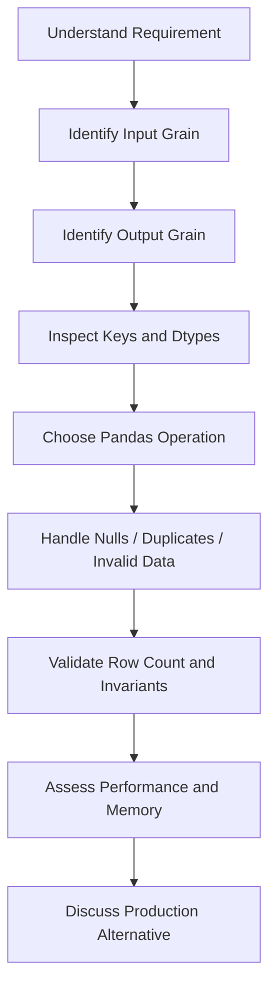

# README

## Overview

This section is the interview-preparation layer of the Pandas playbook.

The earlier Pandas topics focus on learning individual capabilities:

```text
Fundamentals
↓
Reading and Writing Data
↓
Selecting and Filtering
↓
Data Cleaning
↓
Data Transformation
↓
Grouping and Aggregation
↓
Combining Data
↓
Sorting, Ranking and Statistics
↓
Strings and Datetime
↓
Performance and Memory
↓
Backend and Data Engineering
↓
Interview Preparation
```
| # | File | Description |
|---|---|---|
| 01 | [01- Fundamentals Q&A](./01-%20Fundamentals%20Q%26A.md) | Core Pandas concepts and basic operations |
| 02 | [02- Series And Dataframe.md](./02-%20Series%20And%20Dataframe.md) | Selecting, filtering, cleaning, and transforming data |
| 03 | [03- Indexing And Selection.md](./03-%20Indexing%20And%20Selection.md) | Indexing and selection operations |
| 04 | [04- Loc And Iloc.md](./04-%20Loc%20And%20Iloc.md) | Label-based and position-based selection |
| 05 | [05- Filtering.md](./05-%20Filtering.md) | Filtering and handling missing values |
| 06 | [06- Missing Values.md](./06-%20Missing%20Values.md) | Handling missing data |
| 07 | [07- Duplicates.md](./07-%20Duplicates.md) | Detecting and handling duplicates |
| 08 | [08- Data Cleaning.md](./08-%20Data%20Cleaning.md) | Data cleaning techniques |
| 09 | [09- Apply Map And Transform.md](./09-%20Apply%20Map%20And%20Transform.md) | Apply, map, and transform operations |
| 10 | [10- Groupby And Aggregation.md](./10-%20Groupby%20And%20Aggregation.md) | Grouping and aggregation operations |
| 11 | [11- Merge And Join.md](./11-%20Merge%20And%20Join.md) | Merge and join operations |
| 12 | [12- Concat.md](./12-%20Concat.md) | Concatenation operations |
| 13 | [13- Pivot And Melt.md](./13-%20Pivot%20And%20Melt.md) | Pivot and melt operations |
| 14 | [14- Strings And Datetime.md](./14-%20Strings%20And%20Datetime.md) | Strings and datetime handling |
| 15 | [15- Pandas Performance.md](./15-%20Pandas%20Performance.md) | Performance and memory optimization |
| 16 | [16- Memory Optimization.md](./16-%20Memory%20Optimization.md) | Memory efficiency techniques |
| 17 | [17- Pandas And Sql.md](./17-%20Pandas%20And%20Sql.md) | SQL integration patterns |
| 18 | [18- ETL Scenarios.md](./18-%20ETL%20Scenarios.md) | ETL scenario examples |
| 19 | [19- Data Cleaning Scenarios.md](./19-%20Data%20Cleaning%20Scenarios.md) | Data cleaning scenario examples |
| 20 | [20- Data Transformation Scenarios.md](./20-%20Data%20Transformation%20Scenarios.md) | Data transformation scenario examples |
| 21 | [21- Reporting Scenarios.md](./21-%20Reporting%20Scenarios.md) | Reporting scenario examples |
| 22 | [22- Debugging Pandas.md](./22-%20Debugging%20Pandas.md) | Debugging Pandas code |
| 23 | [23- Pandas Coding Problems.md](./23-%20Pandas%20Coding%20Problems.md) | Pandas coding problems and solutions |

This section connects those capabilities into practical problem-solving skills.

The objective is not to memorize Pandas methods. It is to become comfortable taking an ambiguous business-data requirement, identifying the underlying data model, selecting the correct Pandas operations, validating the result, and explaining the engineering trade-offs.

```text

```text
API data processing
ETL pipelines
report generation
SQL + Pandas workflows
data-quality validation
customer analytics
transaction processing
event processing
large datasets
debugging
performance optimization
```

---

## Section Structure

The interview-preparation section progresses from foundational understanding to realistic coding and debugging scenarios.

| File | Focus |
|---|---|
| `01- Pandas Fundamentals.md` | Core Pandas concepts and DataFrame behavior |
| `02- Series And Dataframe.md` | Series and DataFrame structure and semantics |
| `03- Indexing And Selection.md` | Label-based and positional data access |
| `04- Loc And Iloc.md` | Precise row and column selection |
| `05- Filtering.md` | Boolean filtering and predicate composition |
| `06- Missing Values.md` | Missing-data detection and handling |
| `07- Duplicates.md` | Duplicate detection, removal, and business-key reasoning |
| `08- Data Cleaning.md` | Real-world cleaning and validation workflows |
| `09- Apply Map And Transform.md` | Mapping, row-wise logic, and shape-preserving transformations |
| `10- Groupby And Aggregation.md` | Grouping, aggregation, and analytical patterns |
| `11- Merge And Join.md` | Relational combination and join cardinality |
| `12- Concat.md` | Vertical and horizontal DataFrame composition |
| `13- Pivot And Melt.md` | Reshaping wide and long datasets |
| `14- Strings And Datetime.md` | Text normalization and temporal processing |
| `15- Pandas Performance.md` | Performance analysis and optimization |
| `16- Memory Optimization.md` | Memory usage and large-data techniques |
| `17- Pandas And Sql.md` | Division of responsibilities between SQL and Pandas |
| `18- ETL Scenarios.md` | Production-style extraction, transformation, and loading |
| `19- Data Cleaning Scenarios.md` | Real-world data-quality problems |
| `20- Data Transformation Scenarios.md` | Business-oriented transformation problems |
| `21- Reporting Scenarios.md` | Reporting, metrics, reconciliation, and operational analytics |
| `22- Debugging Pandas.md` | Debugging incorrect results and production failures |
| `23- Pandas Coding Problems.md` | Progressive coding and problem-solving exercises |

The files are intentionally cumulative. Later problems assume familiarity with concepts introduced earlier.

---

## What Interviewers Are Evaluating

Pandas interviews commonly test several dimensions simultaneously.

### API Knowledge

You should know when to use:

```text
loc
iloc
groupby
agg
transform
merge
concat
pivot_table
melt
map
apply
fillna
dropna
drop_duplicates
sort_values
nlargest
rank
```

But method memorization is only the baseline.

### Data Modeling

You should be able to answer:

```text
What does one row represent?
What is the business key?
Can the key be duplicated?
What should one output row represent?
```

For example:

```text
order-line grain
↓
order grain
↓
customer grain
```

A large percentage of incorrect Pandas solutions are caused by changing grain unintentionally.

### Correctness

A strong solution considers:

```text
nulls
duplicates
dtypes
missing columns
unexpected categories
empty input
invalid values
join cardinality
index alignment
timezones
```

### Performance

Candidates should recognize when code is inefficient because of:

```text
iterrows()
row-wise apply()
Python loops
repeated concat()
unnecessary copies
wide joins
unnecessary sorting
object-heavy columns
large intermediate DataFrames
```

### Production Judgment

Senior-level answers explain when Pandas should not be the primary processing engine.

Typical alternatives include:

```text
PostgreSQL
analytical databases
DuckDB
Spark
stream-processing systems
warehouse SQL
```

The question is not:

> Can Pandas perform this task?

The better question is:

> Should Pandas perform this task at this stage of the data pipeline?

---

## Core Interview Mental Model

For almost every Pandas problem, reason through:



This structure prevents premature coding.

---

## Data Grain

Grain should be treated as a first-class design concern.

Examples:

| Dataset | Grain |
|---|---|
| Orders | one row per order |
| Order lines | one row per product within an order |
| Customers | one row per customer |
| Transactions | one row per transaction |
| Daily metrics | one row per date |
| Customer daily activity | one row per customer per day |
| Event logs | one row per event |

Consider:

```python
order_lines.groupby(
    "customer_id"
)["line_total"].sum()
```

The output grain becomes:

```text
one row per customer
```

The transformation is correct only when that is the intended result.

Before writing code, state:

```text
Input grain: one row per order line
Output grain: one row per customer
```

This simple habit catches many interview errors.

---

## Operation Selection

Use the operation that matches the intended change in shape.

| Requirement | Preferred Operation |
|---|---|
| Select records | `loc`, boolean masks |
| Select by position | `iloc` |
| Reduce groups | `groupby().agg()` |
| Add group-level values while preserving rows | `groupby().transform()` |
| Combine related datasets | `merge()` |
| Stack compatible datasets | `concat()` |
| Reshape wide to long | `melt()` |
| Reshape long to wide | `pivot()` / `pivot_table()` |
| Map values | `map()` |
| Apply row-independent vector logic | vectorized operations |
| Top-N rows | `nlargest()` / sorting |
| Frequency count | `value_counts()` |
| Duplicate removal | `drop_duplicates()` |
| Time-based calculations | datetime operations / `rolling()` |

The goal is to select operations based on semantics rather than familiarity.

---

## Null Handling

Missing values should be interpreted according to business meaning.

Distinguish between:

```text
missing
zero
empty string
invalid
unknown
not applicable
```

For example:

```python
orders["discount"].fillna(0)
```

is valid only when:

```text
missing discount = no discount
```

It is not universally correct.

Interview answers should explicitly mention null behavior when a calculation depends on it.

---

## Duplicate Handling

Duplicates should be discussed in terms of identity.

For example:

```python
df.duplicated(
    subset=["transaction_id"]
)
```

makes sense if `transaction_id` is the business identity.

But:

```python
df.drop_duplicates()
```

may be inappropriate if two rows have different metadata but represent competing versions of the same transaction.

Always establish:

```text
What makes two rows the same record?
```

---

## Join Cardinality

Joining is one of the most important Pandas interview topics.

Expected relationships should be explicit:

```text
one-to-one
one-to-many
many-to-one
many-to-many
```

When possible:

```python
orders.merge(
    customers,
    on="customer_id",
    how="left",
    validate="many_to_one",
)
```

This converts an implicit assumption into an executable contract.

### Common Join Failure

Suppose:

```text
orders = 1,000 rows
customers = 100 rows
```

and the result becomes:

```text
orders = 5,000 rows
```

The first debugging question should be:

```text
Why did the join multiply records?
```

Typical causes are:

```text
duplicate dimension keys
many-to-many relationships
incorrect join key
incorrect source grain
```

---

## Index Reasoning

Pandas often performs alignment by index labels.

This matters when:

```text
assigning Series
adding Series
combining calculations
reindexing
joining
```

For example:

```python
left - right
```

may align by index rather than position.

An interview-ready explanation should distinguish:

```text
label-based operations
```

from:

```text
position-based operations
```

and know when `loc`, `iloc`, `reset_index()`, or explicit alignment is appropriate.

---

## Vectorization

Prefer:

```python
orders["net"] = (
    orders["amount"]
    - orders["discount"].fillna(0)
)
```

over:

```python
for index, row in orders.iterrows():
    ...
```

Vectorization generally provides better performance and clearer intent because the operation is expressed at the column level.

However, not every problem can or should be completely vectorized. Complex stateful logic may require:

```text
groupby operations
expanding/rolling operations
specialized algorithms
```

The important skill is recognizing unnecessary Python-level loops.

---

## `apply()` vs Vectorization

A common interview question is:

> When should you use `apply()`?

Use it when the logic genuinely cannot be expressed clearly with:

```text
vectorized Pandas operations
NumPy operations
map
transform
groupby aggregations
```

Avoid `apply(axis=1)` as the default solution for row-level business rules.

For example, prefer:

```python
import numpy as np

customers["segment"] = np.select(
    [
        customers["revenue"].ge(100_000),
        customers["revenue"].ge(25_000),
    ],
    [
        "enterprise",
        "premium",
    ],
    default="standard",
)
```

over a Python function executed once per row when the logic is naturally vectorizable.

---

## Performance Reasoning

A good interview discussion should distinguish:

```text
correct implementation
```

from:

```text
scalable implementation
```

Typical optimization opportunities include:

```text
filter early
select only required columns
avoid unnecessary copies
use appropriate dtypes
validate join cardinality
avoid repeated concatenation
prefer efficient top-N operations
aggregate before joining when possible
push work to SQL when appropriate
process large files in chunks
```

### Example

Instead of:

```python
result = orders.merge(
    customers,
    on="customer_id",
)

result = result.loc[
    result["status"].eq("completed")
]

result = result[
    [
        "customer_id",
        "amount",
        "segment",
    ]
]
```

prefer filtering and projecting before the join when semantics permit:

```python
orders_small = orders.loc[
    orders["status"].eq("completed"),
    [
        "customer_id",
        "amount",
    ],
]

customers_small = customers.loc[
    :,
    [
        "customer_id",
        "segment",
    ],
]

result = orders_small.merge(
    customers_small,
    on="customer_id",
    how="left",
    validate="many_to_one",
)
```

The resulting DataFrame carries less data through the join.

---

## Memory Reasoning

Pandas is an in-memory processing library.

A solution should therefore consider:

```text
input size
intermediate DataFrames
join expansion
sort memory
object columns
copies
serialization
```

For large data:

```text
CSV
→ chunked reads
→ process each chunk
→ incremental aggregation
```

For columnar storage:

```text
Parquet
→ select required columns
→ read only required partitions
→ process bounded data
```

For database-backed workloads:

```text
PostgreSQL
→ push filters/joins/aggregations
→ transfer only required result
→ use Pandas for downstream processing
```

---

## SQL + Pandas Decision Framework

A practical backend workflow is often:

```text
PostgreSQL
    │
    ├── filtering
    ├── joins
    ├── aggregation
    └── pagination / partition pruning
            │
            ▼
        Pandas
            │
            ├── complex transformations
            ├── report shaping
            ├── validation
            └── file/API output
```

### Prefer SQL When

```text
data already lives in a relational database
the operation is naturally relational
the result can be significantly reduced at the source
database indexes can accelerate the operation
the dataset would be too large for memory
```

### Prefer Pandas When

```text
the working set fits comfortably in memory
complex DataFrame transformations improve productivity
multiple external data formats must be combined
data needs local analytical processing
the output is a report or downstream artifact
```

The strongest architecture often uses both.

---

## ETL Interview Thinking

When asked to design a Pandas ETL process, structure the answer as:

```text
Extract
↓
Schema Validation
↓
Normalize Types
↓
Clean / Quarantine Invalid Records
↓
Deduplicate
↓
Enrich
↓
Transform
↓
Aggregate
↓
Validate Output
↓
Publish
↓
Reconcile / Monitor
```

A production pipeline should also define:

```text
idempotency
retry behavior
watermarks
backfills
logging
metrics
schema versioning
failure handling
```

---

## Data Quality Checks

Useful checks include:

```python
assert "order_id" in df.columns
assert df["order_id"].notna().all()
assert df["order_id"].is_unique
assert df["amount"].ge(0).all()
```

For production systems, replace generic assertions with explicit validation and structured error reporting where appropriate.

Important checks include:

| Validation | Example |
|---|---|
| Schema | required columns exist |
| Uniqueness | `order_id` is unique |
| Completeness | `customer_id` is not null |
| Domain | `status` is supported |
| Range | amount is non-negative |
| Referential integrity | customer exists |
| Cardinality | join matches expected relationship |
| Reconciliation | output totals match source |

---

## Debugging Interview Problems

When code produces an incorrect result, do not immediately rewrite it.

Inspect:

```text
shape
columns
dtypes
index
nulls
duplicates
group sizes
join keys
row counts
```

A useful debugging sequence is:

```text
Input
↓
First transformation
↓
Validate
↓
Second transformation
↓
Validate
↓
...
↓
First incorrect state
```

The goal is to find the **first point where the data becomes wrong**.

This approach is especially important for:

```text
ETL jobs
financial reports
customer metrics
event pipelines
large joins
```

---

## Reporting Problems

Reporting questions often hide grain changes.

For example:

```text
line-item revenue
→
order revenue
→
customer revenue
→
daily revenue
→
monthly revenue
```

Each transition should be explicit.

A common interview trap is calculating:

```python
order_lines["line_total"].mean()
```

when the requirement is:

```text
average order value
```

The correct process is:

```text
line items
→ aggregate to orders
→ aggregate order revenue
→ divide by order count
```

Business terminology should drive the Pandas grain.

---

## Time-Series Problems

Common interview tasks include:

```text
monthly revenue
month-over-month growth
rolling averages
daily active users
cohort analysis
sessionization
latest event
time-window filtering
SLA latency
```

Before solving, verify:

```text
datetime dtype
timezone
sort order
window boundaries
inclusive/exclusive semantics
missing timestamps
```

For distributed backend systems, UTC is generally a safe canonical processing representation.

---

## Event-Data Problems

Event-processing problems often require:

```text
sort by entity and timestamp
diff()
cumsum()
shift()
rolling()
drop_duplicates()
groupby()
```

A common pattern is:

```text
sort
→ derive state transition
→ group
→ aggregate
```

For example, sessionization:

```text
events
→ sort by user/time
→ calculate time gap
→ identify session boundaries
→ cumulative session number
```

These problems test whether you can convert a stateful business rule into vectorized operations.

---

## Coding Problem Progression

The coding problems are arranged progressively.

```text
Basic DataFrame Manipulation
        ↓
Filtering and Missing Data
        ↓
Grouping and Aggregation
        ↓
Joins and Deduplication
        ↓
Datetime and Window Operations
        ↓
ETL and Data Quality
        ↓
Performance and Memory
        ↓
Debugging
        ↓
Production-Grade Design
```

The later problems should be solved only after understanding the semantics behind the earlier operations.

---

## Recommended Problem-Solving Procedure

When solving a coding problem during an interview:

### Clarify the Data Model

State:

```text
input columns
input grain
key columns
nullable columns
expected output grain
```

### State the Algorithm

For example:

```text
1. Normalize timestamps.
2. Filter completed transactions.
3. Deduplicate by transaction ID.
4. Aggregate by customer.
5. Sort by revenue.
```

### Implement Clearly

Prefer:

```python
filtered = ...
aggregated = ...
result = ...
```

over a dense one-liner that is difficult to inspect.

### Validate

Check:

```text
row count
schema
nulls
uniqueness
expected totals
```

### Discuss Complexity

Explain:

```text
sorting cost
grouping cost
join cardinality
memory requirements
```

### Discuss Scale

Explain what changes when:

```text
10,000 rows
→
10 million rows
→
500 GB
```

The processing strategy may change completely.

---

## Interview Question Categories

The section should prepare for several kinds of interview questions.

### Conceptual

Examples:

```text
What is the difference between Series and DataFrame?
What is index alignment?
When should you use transform instead of agg?
What is the difference between merge and concat?
Why can joins increase row counts?
```

### Coding

Examples:

```text
Top-N customers
monthly revenue
duplicate removal
customer segmentation
rolling metrics
sessionization
cohort analysis
```

### Debugging

Examples:

```text
Why did row counts double?
Why did a filter return zero rows?
Why did a merge produce nulls?
Why did a numeric operation return unexpected values?
```

### Performance

Examples:

```text
Why is apply slow?
How would you process a 20 GB CSV?
How can memory usage be reduced?
When would you push aggregation into PostgreSQL?
```

### ETL

Examples:

```text
How would you make the transformation idempotent?
How would you quarantine invalid records?
How would you handle duplicate API events?
How would you reconcile output against the source?
```

### Business Data

Examples:

```text
AOV
customer lifetime value
retention
conversion funnel
regional revenue
inventory analysis
employee metrics
financial reconciliation
```

---

## Testing Coding Solutions

Pandas interview solutions should be testable as transformation functions.

Tests should cover:

```text
normal input
empty input
missing values
duplicate records
unexpected values
incorrect dtypes
join mismatches
multiple groups
single-group input
boundary conditions
```

Example:

```python
def test_customer_summary_handles_duplicates() -> None:
    ...
```

The test should verify the expected business behavior rather than simply asserting that the function returns without raising an exception.

---

## Production Architecture Context

A typical backend reporting workflow may look like:


For scheduled jobs:

```text
Celery / Kubernetes Job
        ↓
Extract
        ↓
Pandas
        ↓
Validate
        ↓
Publish
        ↓
Metrics / Logs
```

Pandas is one component in the data workflow, not necessarily the entire architecture.

---

## Security Considerations

Interview solutions should consider data access boundaries where relevant.

Avoid processing or exporting records that a caller is not authorized to access.

For multi-tenant systems:

```text
authenticated tenant
→ source query restricted to tenant
→ bounded DataFrame
→ transformation
→ tenant-specific output
```

Prefer enforcing authorization at the data-access layer rather than depending on a final Pandas filter.

Be careful with:

```text
sensitive customer data
financial records
API payload logging
temporary files
CSV exports
Parquet snapshots
```

Debugging output should not expose credentials, tokens, or unnecessary personal information.

---

## Reliability Considerations

Production Pandas jobs should consider:

```text
retry safety
idempotency
atomic publication
partial failure
schema drift
late-arriving records
backfills
reconciliation
```

A transformation may be deterministic while the overall pipeline is not.

For example:

```text
Pandas transformation
+
non-idempotent database write
=
non-idempotent pipeline
```

The full workflow determines reliability.

---

## Monitoring

Useful production metrics include:

```text
input_rows
output_rows
rejected_rows
duplicate_rows
null_rates
join_multipliers
processing_seconds
peak_memory
batch_id
watermark
schema_version
```

For recurring jobs, track trends rather than only individual failures.

A sudden change in:

```text
row count
null rate
duplicate rate
revenue
processing time
```

can indicate a source or transformation regression.

---

## Common Interview Mistakes

### Memorizing Methods Without Understanding Grain

Knowing `groupby()` is not enough.

You must know what the grouped result represents.

### Using `apply()` for Everything

This often indicates weak understanding of vectorization.

### Ignoring Join Cardinality

A correct-looking join can silently duplicate business records.

### Ignoring Dtypes

String numbers and naive timestamps create subtle failures.

### Mutating Inputs Without a Clear Contract

Use explicit copies or clearly document mutation behavior.

### Writing Unreadable One-Liners

Interviewers need to evaluate reasoning. Readability matters.

### Optimizing Before Measuring

Identify the actual bottleneck first.

### Assuming Pandas Is Always the Right Tool

For large datasets, database or distributed processing may be more appropriate.

### Testing Only the Happy Path

Empty input and invalid records are common production cases.

---

## Senior-Level Interview Signals

Strong candidates usually demonstrate the following reasoning:

```text
I know what one row represents.
I know which keys should be unique.
I know whether this operation changes cardinality.
I know how nulls affect this calculation.
I know whether the join is safe.
I can validate the result.
I can estimate memory requirements.
I can explain when SQL is better.
I can make the pipeline retry-safe.
I can design tests for business behavior.
```

The goal is not to produce the shortest Pandas expression.

The goal is to produce the most reliable transformation appropriate for the workload.

---

## Study Workflow

A practical study sequence is:

```text
Read concept
↓
Implement small example
↓
Solve coding problem without reference
↓
Explain why the operation was selected
↓
Add edge cases
↓
Test the transformation
↓
Analyze performance
↓
Consider SQL alternative
↓
Explain production design
```

For each problem, practice answering both:

```text
How would I solve this in Pandas?
```

and:

```text
How would I solve this in a production system?
```

These are not always the same answer.

---

## Interview Readiness Checklist

Before considering the Pandas section complete, you should be able to:

- Explain Series, DataFrame, and index semantics.
- Use `loc` and `iloc` correctly.
- Build compound boolean filters.
- Handle missing values intentionally.
- Detect and resolve duplicates.
- Normalize strings, numerics, and timestamps.
- Use `groupby`, `agg`, and `transform` correctly.
- Perform safe joins with known cardinality.
- Reshape data with `pivot_table` and `melt`.
- Calculate rolling, cumulative, ranking, and cohort metrics.
- Process nested API data.
- Build SQL + Pandas workflows.
- Design chunked processing for large files.
- Diagnose memory and performance bottlenecks.
- Debug incorrect transformations systematically.
- Validate schemas and business invariants.
- Write meaningful DataFrame transformation tests.
- Explain idempotency and reconciliation.
- Recognize when Pandas should be replaced or supplemented by another processing engine.

---

## Relationship to the Pandas Projects

The interview-preparation section should reinforce the hands-on projects in the Pandas playbook:

```text
01- E-Commerce Data Pipeline
        ↓
02- API Data Processing Pipeline
        ↓
03- Large Dataset Processing
```

The projects provide the implementation context for concepts such as:

```text
data validation
deduplication
joins
aggregation
API processing
batch processing
chunking
memory optimization
testing
logging
reporting
```

The interview section then converts those implementation skills into problem-solving ability.

---

## Key Takeaways

- Pandas interview preparation should focus on **data semantics, grain, correctness, and engineering reasoning**, not method memorization.
- The most important recurring skills are filtering, cleaning, grouping, transforming, joining, reshaping, datetime processing, debugging, and performance optimization.
- Senior-level solutions explicitly address nulls, duplicates, cardinality, memory, SQL pushdown, validation, testing, idempotency, and observability.
- Practice each problem twice: first as a Pandas transformation, then as a production-system design decision involving databases, APIs, batch jobs, and operational constraints.
- The strongest interview answers explain **why** an operation is appropriate, validate the result, and recognize when Pandas is no longer the right processing engine.