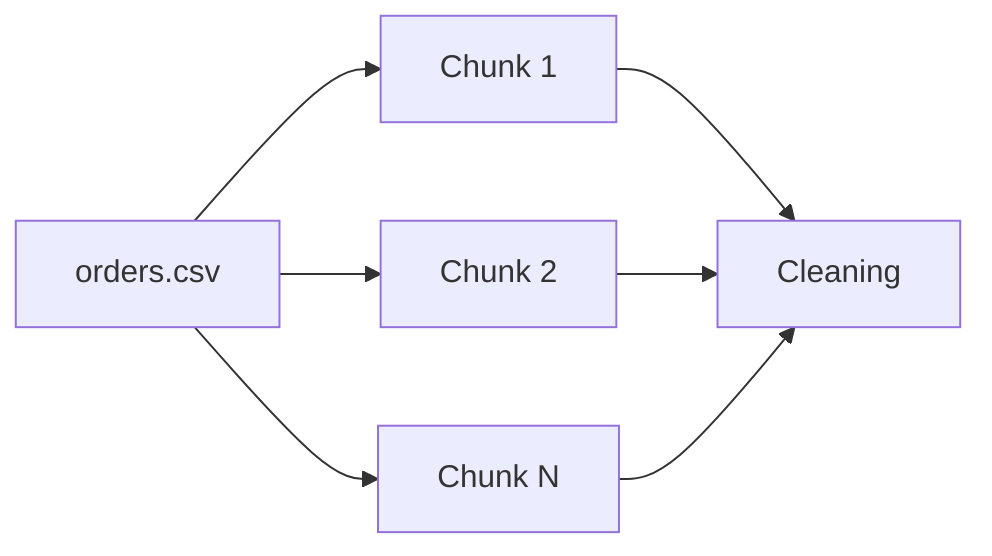
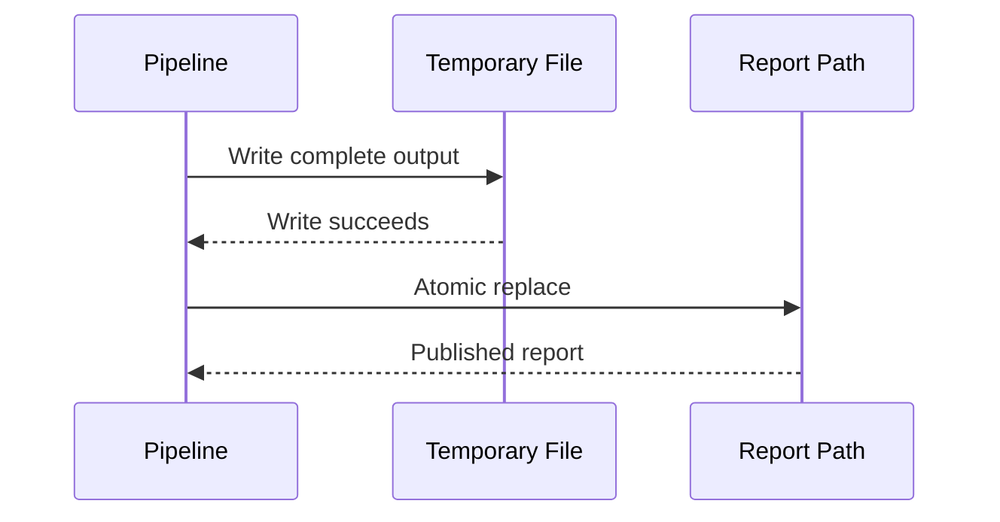

# README

## Overview

The `config/` directory contains configuration files for the E-Commerce Data Pipeline. Configuration is kept separate from application logic so operational behavior can change without modifying the Python implementation.

The primary configuration file is `settings.yaml`. It defines pipeline paths, input and output filenames, processing parameters, validation rules, reporting behavior, runtime options, and logging defaults.

The current application code uses `PipelineConfig` in `src/config.py` as the runtime configuration object. Environment variables provide runtime overrides for several operational settings, which is preferable for CI/CD, Docker, Kubernetes, and cloud deployments.

## Configuration Structure

```text
config/
└── settings.yaml
```

The configuration is organized into logical domains:

| Section | Purpose |
| --- | --- |
| `pipeline` | Pipeline identity and execution environment |
| `paths` | Directory locations used by the project |
| `inputs` | Source dataset filenames |
| `outputs` | Generated report filenames |
| `processing` | Chunking, timezone, and invalid-record behavior |
| `validation` | Schema and data-quality expectations |
| `reporting` | Completed-order status and reconciliation settings |
| `runtime` | Directory creation and atomic-write behavior |
| `logging` | Logging level and output format |

## Settings

### Pipeline Identity

```yaml
pipeline:
  name: e-commerce-data-pipeline
  environment: development
```

`name` identifies the workload in logs, automation, and operational tooling.

`environment` identifies the intended execution environment. Typical values include:

- `development`
- `testing`
- `staging`
- `production`

Environment-specific behavior should be controlled through deployment configuration or environment variables rather than maintaining separate application implementations.

### Paths

```yaml
paths:
  data_dir: data
  raw_data_dir: data/raw
  staging_data_dir: data/staging
  processed_data_dir: data/processed
  reports_dir: reports
  config_dir: config
```

The project uses a layered data layout:


The separation is useful because raw inputs should remain immutable while intermediate and derived datasets can be regenerated.

The current pipeline primarily reads from `data/raw/` and writes reports to `reports/`. The staging and processed directories are created as part of the runtime directory contract and are available for future processing stages.

### Inputs

```yaml
inputs:
  orders_file: orders.csv
  customers_file: customers.csv
  products_file: products.csv
```

These filenames are resolved relative to the configured raw-data directory.

Expected source layout:

```text
data/
└── raw/
    ├── orders.csv
    ├── customers.csv
    └── products.csv
```

Orders are processed incrementally using Pandas CSV chunking. Customers and products are treated as reference datasets and loaded into memory.

### Outputs

```yaml
outputs:
  daily_sales_report_file: daily_sales_report.parquet
  customer_sales_report_file: customer_sales_report.parquet
  product_sales_report_file: product_sales_report.parquet
  rejected_orders_file: rejected_orders.csv
```

Expected report layout:

```text
reports/
├── daily_sales_report.parquet
├── customer_sales_report.parquet
├── product_sales_report.parquet
└── rejected_orders.csv
```

Parquet is preferred for analytical reports because it provides typed columnar storage and is generally more efficient for downstream analytical workloads than CSV.

The rejected-record file remains CSV because it is easy to inspect manually and can be consumed by operational workflows.

## Processing Settings

```yaml
processing:
  csv_chunksize: 100000
  report_timezone: UTC
  fail_on_invalid_records: false
```

### CSV Chunk Size

`csv_chunksize` controls the number of rows Pandas reads from `orders.csv` at a time.

A value of `100000` means the ingestion layer processes approximately 100,000 rows per chunk.

Chunking reduces peak memory usage compared with loading the entire order dataset at once:



The optimal chunk size depends on:

- Available memory
- Row width
- Transformation complexity
- Join cardinality
- I/O throughput
- Deployment environment

Increasing the chunk size generally improves throughput but increases memory pressure.

### Report Timezone

```yaml
report_timezone: UTC
```

UTC is the recommended operational default for distributed systems because it avoids ambiguity across machines, containers, regions, and daylight-saving transitions.

Business-local reporting can be applied as a deliberate transformation when required, rather than relying on host-machine timezone settings.

### Invalid Record Policy

```yaml
fail_on_invalid_records: false
```

When disabled, invalid order records are quarantined into `rejected_orders.csv` while valid records continue through the pipeline.

When enabled, any rejected record causes pipeline execution to fail.

This allows the same pipeline to support both:

- Tolerant batch processing where bad records are isolated
- Strict data-quality enforcement where bad input must block publication

## Validation Settings

```yaml
validation:
  required_order_columns:
    - order_id
    - customer_id
    - product_id
    - status
    - amount
    - created_at
    - updated_at

  valid_order_statuses:
    - pending
    - completed
    - cancelled

  amount:
    minimum: 0.0

  timestamps:
    require_updated_at_gte_created_at: true

  relationships:
    require_customer_reference: true
    require_unique_customer_id: true
    require_unique_order_id: true
```

Validation rules define the expected contract for the order dataset.

### Required Columns

Every order record must originate from a dataset containing:

| Column | Purpose |
| --- | --- |
| `order_id` | Unique business identifier |
| `customer_id` | Customer foreign key |
| `product_id` | Product reference |
| `status` | Order lifecycle state |
| `amount` | Monetary order value |
| `created_at` | Creation timestamp |
| `updated_at` | Latest record-update timestamp |

Schema validation should happen before downstream transformations so failures occur close to the source of the problem.

### Status Values

Only the configured status values are valid:

```yaml
valid_order_statuses:
  - pending
  - completed
  - cancelled
```

Unknown statuses are rejected rather than silently accepted.

This is important for reporting correctness because downstream logic treats `completed` as revenue-generating while `pending` and `cancelled` do not contribute completed sales.

### Amount Validation

```yaml
amount:
  minimum: 0.0
```

Negative order amounts are rejected.

Currency-specific validation is intentionally outside this project configuration because the current pipeline treats `amount` as a numeric business value rather than implementing a full multi-currency ledger.

### Timestamp Ordering

```yaml
timestamps:
  require_updated_at_gte_created_at: true
```

`updated_at` must be greater than or equal to `created_at`.

This protects downstream logic that relies on update timestamps for deduplication and version selection.

### Referential Integrity

```yaml
relationships:
  require_customer_reference: true
  require_unique_customer_id: true
  require_unique_order_id: true
```

The configuration expresses the expected relationships between transactional and reference data:

```text
orders.customer_id
        │
        ▼
customers.customer_id
```

Unknown customer references should fail relationship validation because silently dropping or inventing customer attributes would produce incorrect reports.

## Reporting Settings

```yaml
reporting:
  completed_order_status: completed
  reconciliation:
    enabled: true
    tolerance: 0.01
```

The pipeline considers orders with status `completed` to be revenue-generating.

### Reconciliation

Reconciliation compares source order totals with generated report totals.

For example:

```text
Source completed orders
        │
        ├── order count
        └── revenue
             │
             ▼
       Generated report
             │
        ├── order count
        └── revenue
```

A tolerance of `0.01` allows small floating-point or currency rounding differences while still detecting meaningful discrepancies.

Reconciliation should remain enabled in production unless there is a documented reason to disable it.

## Runtime Settings

```yaml
runtime:
  create_directories: true
  atomic_writes: true
```

### Directory Creation

When enabled, required directories are created automatically during pipeline startup.

This makes local execution and fresh CI environments easier to reproduce.

### Atomic Writes

Atomic writes protect consumers from partially written report files.

The intended behavior is:



This is particularly important when reports are consumed by another process, scheduled job, API, or downstream analytics system.

## Logging

```yaml
logging:
  level: INFO
  format: "%(asctime)s %(levelname)s %(name)s %(message)s"
```

The default logging level is `INFO`.

The format includes:

- Timestamp
- Log level
- Logger name
- Message

For production environments, structured logging can be added later so logs can be indexed by systems such as CloudWatch, OpenSearch, Datadog, or another centralized logging platform.

## Runtime Overrides

The Python configuration layer supports environment-variable overrides for operational settings.

Examples include:

```bash
PANDAS_CSV_CHUNKSIZE=50000
REPORT_TIMEZONE=UTC
FAIL_ON_INVALID_RECORDS=true
CREATE_PIPELINE_DIRECTORIES=true
ATOMIC_PIPELINE_WRITES=true
PIPELINE_RECONCILIATION_ENABLED=true
PIPELINE_RECONCILIATION_TOLERANCE=0.01
LOG_LEVEL=INFO
```

This separation is intentional:

```text
settings.yaml
    │
    │ static project defaults
    ▼
PipelineConfig
    ▲
    │ runtime overrides
environment variables
```

Do not store credentials, API keys, database passwords, or cloud secrets in `settings.yaml`. Secrets should be supplied through a secrets manager or environment-specific secret injection mechanism.

## Development and Production Configuration

The checked-in configuration should contain safe defaults.

For deployment environments:

| Environment | Recommended approach |
| --- | --- |
| Local development | `settings.yaml` defaults |
| CI | Environment variables |
| Docker | Environment variables or injected configuration |
| Kubernetes | ConfigMap + Secret |
| AWS | Environment variables, Secrets Manager, or Parameter Store |

Configuration should be immutable during a single pipeline run. Changing settings halfway through execution can create inconsistent results and makes failures difficult to reproduce.

## Configuration and Application Code

`config/settings.yaml` defines the intended operational contract, while `src/config.py` defines the runtime configuration object used by the application.

The separation provides two useful layers:

```text
YAML
  │
  │ human-readable project configuration
  ▼
Runtime configuration
  │
  │ validated Python values
  ▼
Pipeline components
```

The application should not scatter calls to `os.getenv()` throughout ingestion, transformation, validation, or reporting modules. Centralizing runtime configuration keeps operational behavior predictable and testable.

## Common Mistakes

### Hardcoding Environment-Specific Paths

Avoid embedding production filesystem paths directly in source code.

Prefer configuration and environment-specific deployment settings so the same application can run locally, in CI, and inside containers.

### Storing Secrets in YAML

Do not place passwords, access tokens, private keys, or cloud credentials in this file.

Configuration files are frequently committed to Git, copied into Docker images, and exposed to CI systems.

### Using Host Timezones

Do not rely on the operating system's local timezone for report calculations.

Use an explicit timezone such as UTC and apply business-local conversions intentionally.

### Loading Large CSV Files Without Chunking

A pipeline that works with a small local CSV can fail when the same input grows significantly.

Chunked ingestion is preferable when the source can exceed available memory.

### Disabling Reconciliation to Hide Failures

Reconciliation failures should be investigated rather than permanently disabled.

A report that is generated successfully but does not reconcile with its source can be more dangerous than a pipeline that fails loudly.

## Operational Considerations

### Scalability

The primary scaling boundary is Pandas memory usage.

For moderate datasets, chunked CSV ingestion can keep memory usage manageable. For substantially larger workloads, consider:

- Parquet instead of CSV
- Predicate and column pushdown
- SQL-side aggregation
- Database-native processing
- Distributed processing frameworks when Pandas is no longer appropriate

### Reliability

Production jobs should preserve raw inputs and publish derived reports atomically.

A common operational pattern is:

```text
Immutable source
      │
      ▼
Validated processing
      │
      ▼
Temporary output
      │
      ▼
Atomic publication
```

This minimizes the chance of consumers seeing incomplete results.

### Monitoring

At minimum, monitor:

- Input row counts
- Rejected row counts
- Completed order counts
- Total revenue
- Pipeline duration
- Validation failures
- Reconciliation failures
- Output publication failures

These metrics make data-quality regressions observable rather than silent.

### Security

Configuration should follow least privilege and avoid secret material.

For cloud deployments, IAM roles, workload identities, Kubernetes Secrets, AWS Secrets Manager, or AWS Systems Manager Parameter Store should be preferred over credentials committed to Git.

## Useful Commands

Run the pipeline from the project root:

```bash
python scripts/run_pipeline.py
```

Run the installed CLI entry point after installing the package:

```bash
run-pipeline
```

Run the test suite:

```bash
pytest
```

Run tests with coverage:

```bash
pytest --cov=src --cov-report=term-missing
```

Override chunk size for a local run:

```bash
PANDAS_CSV_CHUNKSIZE=25000 python scripts/run_pipeline.py
```

Fail the pipeline on invalid source records:

```bash
FAIL_ON_INVALID_RECORDS=true python scripts/run_pipeline.py
```

## Key Takeaways

- Keep static pipeline defaults in `settings.yaml` and runtime-specific overrides in environment variables.
- Treat raw inputs as immutable and publish derived reports atomically.
- Use chunked ingestion and explicit validation rules to control memory usage and protect data quality.
- Keep secrets out of configuration files and use environment-specific secret injection instead.
- Keep reconciliation enabled so generated reports are continuously checked against their source data.