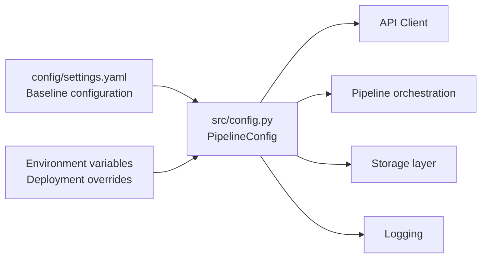

# README

## Overview

The `config/` directory contains the runtime configuration contract for the API Data Processing Pipeline.

The project separates configuration from processing logic so that API connectivity, filesystem locations, validation behavior, retry policy, logging, and operational defaults can change without modifying the core Pandas pipeline. The configuration layer is designed to work consistently across local development, automated tests, CI/CD, containers, staging, and production environments.

Configuration is intentionally split across two concerns:

- `settings.yaml` provides a human-readable baseline configuration and documents the intended operational contract.
- `src/config.py` provides the runtime configuration object used by the Python application and supports environment-variable overrides for deployment-specific values.

The YAML file is therefore the project configuration reference, while environment variables remain the preferred mechanism for secrets and environment-specific overrides.

## Configuration Architecture

The configuration flow is:



The important design principle is that application modules consume a typed `PipelineConfig` object rather than reading environment variables throughout the codebase.

This gives the project a single configuration boundary and prevents configuration logic from leaking into ingestion, transformation, validation, and storage modules.

## Files

| File | Purpose |
| --- | --- |
| `settings.yaml` | Human-readable baseline and operational configuration reference |
| `README.md` | Documents the configuration model and operational expectations |

The runtime configuration implementation lives outside this directory:

```text
src/
└── config.py
```

## Configuration Responsibilities

The configuration system controls the following areas:

| Area | Examples |
| --- | --- |
| API connectivity | Base URL, authentication token, timeouts |
| Reliability | Retries, exponential backoff, retryable status codes |
| Pagination | Page size, maximum page count |
| Data paths | Raw, staging, processed, and report directories |
| Input/output names | JSON, Parquet, CSV, and report files |
| Data normalization | Timestamp timezone, identifiers, numeric fields |
| Validation | Invalid-record handling, schema enforcement |
| Storage | Atomic writes, compression, encoding |
| Runtime | Logging, fail-fast behavior |
| Security | Secret handling and TLS expectations |
| Observability | Pipeline metrics and logging behavior |

## Baseline Configuration

The baseline configuration is stored in `settings.yaml`.

Typical sections include:

```yaml
pipeline:
  name: api_data_processing_pipeline
  version: "1.0.0"
  timezone: UTC

api:
  base_url: https://api.example.com
  timeout_seconds: 30.0
  connect_timeout_seconds: 10.0
  read_timeout_seconds: 30.0
  max_retries: 3
  backoff_factor: 1.0
  page_size: 100
  max_pages: 10000
```

This file is intended to make the operational contract visible to developers and reviewers.

It should contain safe defaults and descriptive configuration values, but it should not contain secrets.

## Environment Variable Overrides

Deployment-specific settings are supplied through environment variables.

The current runtime configuration supports variables such as:

| Variable | Purpose | Default |
| --- | --- | --- |
| `API_BASE_URL` | API endpoint or base URL | `https://api.example.com` |
| `API_TOKEN` | Bearer authentication token | unset |
| `API_CONNECT_TIMEOUT_SECONDS` | Connection timeout | `10.0` |
| `API_READ_TIMEOUT_SECONDS` | Response read timeout | `30.0` |
| `API_MAX_RETRIES` | Retry limit | `3` |
| `API_BACKOFF_FACTOR` | Retry backoff factor | `1.0` |
| `API_PAGE_SIZE` | Requested records per page | `100` |
| `API_MAX_PAGES` | Maximum pages per execution | `10000` |
| `API_RESPONSE_TIMEZONE` | Target timestamp timezone | `UTC` |
| `DROP_INVALID_RECORDS` | Continue after rejecting invalid records | `false` |
| `FAIL_ON_HTTP_ERROR` | Fail on unrecoverable HTTP failures | `true` |
| `FAIL_ON_SCHEMA_ERROR` | Fail on schema/data-quality violations | `true` |
| `CREATE_PIPELINE_DIRECTORIES` | Create required directories | `true` |
| `ATOMIC_PIPELINE_WRITES` | Enable atomic output replacement | `true` |
| `LOG_LEVEL` | Application log level | `INFO` |
| `LOG_FORMAT` | Python logging format | project default |

Environment variables are particularly useful in Docker, Kubernetes, AWS ECS, CI/CD systems, and scheduled jobs because the same application artifact can be promoted across environments without rebuilding the code.

## Secrets

Authentication credentials must not be committed to `settings.yaml`, source code, or version control.

Use an environment variable such as:

```bash
export API_TOKEN="replace-with-real-secret"
```

For production workloads, prefer a managed secret system rather than storing credentials directly in deployment manifests.

Typical production choices include:

- AWS Secrets Manager
- AWS Systems Manager Parameter Store
- Kubernetes Secrets
- CI/CD secret stores
- External secret operators

The token should never be emitted in application logs, exception messages, metrics, or debugging output.

## API Configuration

API configuration controls request behavior and reliability.

### Timeouts

Separate connect and read timeouts are preferred over an unbounded request.

```yaml
api:
  connect_timeout_seconds: 10.0
  read_timeout_seconds: 30.0
```

A connect timeout protects the process from hanging while establishing a connection. A read timeout limits the time spent waiting for server data after the connection is established.

Production workloads should use finite timeouts because an unavailable or degraded upstream must not consume pipeline workers indefinitely.

### Retries

Only transient failures should be retried.

The project treats statuses such as `429`, `500`, `502`, `503`, and `504` as retry candidates.

```yaml
api:
  max_retries: 3
  backoff_factor: 1.0
```

Retry behavior should use exponential backoff and honor `Retry-After` when the upstream API provides it.

Retries must remain bounded. An API outage should fail predictably rather than turning into an infinite retry loop.

### Pagination

The client uses page-oriented retrieval:

```yaml
api:
  page_size: 100
  max_pages: 10000
```

`max_pages` acts as a safety boundary against malformed pagination metadata or unexpectedly large datasets.

The pipeline should never trust an upstream pagination cursor or page number without enforcing forward progress and an upper bound.

## Data Processing Configuration

The processing configuration defines assumptions made during normalization and transformation.

Example:

```yaml
processing:
  response_timezone: UTC
  numeric_columns:
    - amount
    - quantity
  timestamp_columns:
    - created_at
    - updated_at
    - timestamp
  identifier_columns:
    - id
    - order_id
    - customer_id
    - product_id
```

These fields establish the expected shape of API-derived data before it enters downstream Pandas transformations.

The processing layer should treat external API data as untrusted input. Configuration defines the intended schema; validation determines whether actual data satisfies it.

## Validation Configuration

Validation behavior determines whether the pipeline fails, rejects records, or continues.

Example:

```yaml
validation:
  drop_invalid_records: false
  fail_on_http_error: true
  fail_on_schema_error: true
```

The default strict behavior is intentional.

For critical reporting or financial pipelines, silently dropping invalid data is dangerous because it can produce apparently successful but incomplete output.

When invalid records are intentionally tolerated, the rejected records must remain observable and auditable.

## Storage Configuration

Output paths and file formats are centrally configured.

Example:

```yaml
paths:
  raw_data_dir: data/raw
  staging_data_dir: data/staging
  processed_data_dir: data/processed
  reports_dir: reports

outputs:
  normalized_data_file: normalized_data.parquet
  rejected_records_file: rejected_records.csv
  processing_report_file: processing_report.parquet
```

The pipeline uses Parquet for structured analytical output because it provides efficient columnar storage and integrates well with Pandas and downstream data-processing systems.

CSV remains useful for rejected-record inspection because it is easy to inspect manually and consume from operational tooling.

## Atomic Writes

Atomic writes are enabled by default:

```yaml
storage:
  atomic_writes: true
```

The storage layer writes to a temporary file before replacing the destination.

This reduces the likelihood of consumers observing partially written output files.

For scheduled pipelines, this is important when another process may immediately read the generated Parquet or CSV files.

A successful pipeline execution should leave consumers with either the previous complete version or the new complete version, not a half-written artifact.

## Directory Creation

The project can create required directories automatically:

```yaml
storage:
  create_directories: true
```

This simplifies local development and ephemeral container execution.

In production, directory creation should still be treated as a startup concern rather than a substitute for properly provisioning durable storage.

For containers, persistent outputs should normally be externalized to object storage such as Amazon S3 when the data must survive container replacement.

## Timezone Handling

Timestamps arriving from APIs may be:

- UTC
- timezone-aware with an explicit offset
- timezone-naive
- malformed

The normalization layer converts timestamps into a consistent representation using the configured timezone.

The recommended production default is UTC:

```yaml
processing:
  response_timezone: UTC
```

UTC is preferred for storage and cross-system interoperability. Local timezone conversion should normally happen only at reporting or presentation boundaries.

## Logging Configuration

Runtime logging is configured through:

```yaml
runtime:
  log_level: INFO
  log_format: "%(asctime)s %(levelname)s %(name)s %(message)s"
```

Use:

- `DEBUG` for controlled troubleshooting
- `INFO` for normal production execution
- `WARNING` for degraded but recoverable conditions
- `ERROR` for failed operations that require attention
- `CRITICAL` for process-level failures

Production logs should provide enough context to diagnose failed runs without exposing credentials or sensitive payloads.

## Environment Profiles

The same codebase should support multiple environments through configuration overrides rather than duplicated source code.

| Environment | Typical characteristics |
| --- | --- |
| Local | Safe test API, verbose logging, local filesystem |
| Test | Mock/stub API, isolated temporary data |
| Staging | Production-like API contract and infrastructure |
| Production | Managed secrets, external storage, strict validation, controlled logging |

A deployment pipeline should promote the same application version while changing configuration through the deployment environment.

## Local Usage

Set the API endpoint and optional authentication token:

```bash
export API_BASE_URL="https://api.example.com/orders"
export API_TOKEN="your-development-token"
```

Then execute:

```bash
python scripts/run_pipeline.py
```

An explicit endpoint can override the configured default:

```bash
python scripts/run_pipeline.py \
  "https://api.example.com/orders"
```

The project can also be invoked through the installed console entry point:

```bash
run-pipeline "https://api.example.com/orders"
```

## Testing Configuration

Tests should avoid using production endpoints or production credentials.

Use mocked API responses and isolated filesystem locations.

A typical test invocation is:

```bash
pytest
```

For coverage:

```bash
pytest --cov
```

Configuration-related tests should verify:

- Environment variables are parsed correctly.
- Invalid numeric values fail fast.
- Invalid boolean values fail fast.
- Default values are stable.
- Secret values are not exposed by representations or logs.
- Paths resolve consistently.
- Runtime behavior honors configuration overrides.

## Docker and Kubernetes

Configuration should be injected into containers rather than baked into images.

Example Docker usage:

```bash
docker run --rm \
  -e API_BASE_URL="https://api.example.com/orders" \
  -e API_TOKEN="$API_TOKEN" \
  -e API_MAX_RETRIES="5" \
  api-data-processing-pipeline:latest
```

In Kubernetes, configuration values can be supplied through `ConfigMap` and secrets through `Secret`.

The application should remain stateless with respect to its executable container. Generated datasets should be written to durable storage when they need to survive pod replacement.

## Production Recommendations

### Reliability

Use bounded timeouts, bounded retries, exponential backoff, and pagination limits.

Do not retry permanent failures such as authentication or authorization errors.

### Security

Keep secrets outside source control. Require HTTPS for external API traffic and never log bearer tokens.

### Scalability

Pandas is appropriate when the transformed working set fits comfortably in process memory. This project's API ingestion layer is paginated, but downstream normalization and transformation still materialize data in memory.

For substantially larger workloads, consider:

- chunked processing
- partitioned Parquet output
- incremental processing
- SQL pushdown
- AWS Glue
- Spark
- Polars
- DuckDB

### Observability

Track at least:

- records fetched
- pages fetched
- records normalized
- records rejected
- records transformed
- rows removed
- total numeric value
- pipeline execution duration

A successful process exit should not be treated as proof that the dataset was correct. Data-quality metrics must be evaluated alongside execution status.

### Cost

Avoid excessive retries, oversized page sizes, unnecessary DataFrame copies, and repeated API downloads.

For recurring jobs, incremental API extraction is generally preferable to repeatedly processing the entire source dataset.

## Common Mistakes

### Storing Secrets in YAML

Do not commit:

```yaml
api:
  token: "actual-production-token"
```

Use environment variables or a managed secret provider instead.

### Treating Configuration as Documentation Only

Changing `settings.yaml` does not automatically change runtime behavior unless the application explicitly loads that YAML file.

The current runtime path is driven by `src/config.py` and environment variables. The YAML file acts as the documented baseline configuration contract.

This distinction should remain explicit during maintenance to avoid configuration drift.

### Using Unlimited Retries

Unlimited retry loops can create cascading failures and exhaust worker capacity.

Always define a retry count, timeout, and backoff strategy.

### Using Local Disk for Durable Production Data

Container-local storage is ephemeral.

Production outputs that must survive restarts should generally be written to durable external storage such as Amazon S3.

### Disabling Validation to Make Jobs Green

Changing:

```bash
export FAIL_ON_SCHEMA_ERROR=false
```

can be appropriate for exploratory or tolerant workloads, but it should not become a mechanism for hiding upstream contract changes.

Validation failures should be investigated rather than normalized away.

## Configuration Change Guidelines

Configuration changes can alter runtime behavior without changing application code, so they should be reviewed with the same discipline as source changes.

For every production configuration change:

1. Document the reason for the change.
2. Review its reliability and security impact.
3. Test it against representative API data.
4. Verify the resulting metrics and outputs.
5. Roll out gradually when the change affects upstream load or retry behavior.
6. Record the effective production configuration through the deployment system.

Never commit secrets or environment-specific credentials to this directory.

## Key Takeaways

- `settings.yaml` defines the project's documented baseline configuration, while `src/config.py` is the runtime configuration boundary.
- Environment variables should provide deployment-specific values and secrets rather than embedding them in source-controlled YAML.
- API reliability depends on bounded timeouts, bounded retries, exponential backoff, and safe pagination limits.
- Data-quality configuration should favor explicit validation and observable rejected records over silent data loss.
- Production deployments should externalize durable outputs, protect secrets, and monitor both pipeline execution and data-quality metrics.