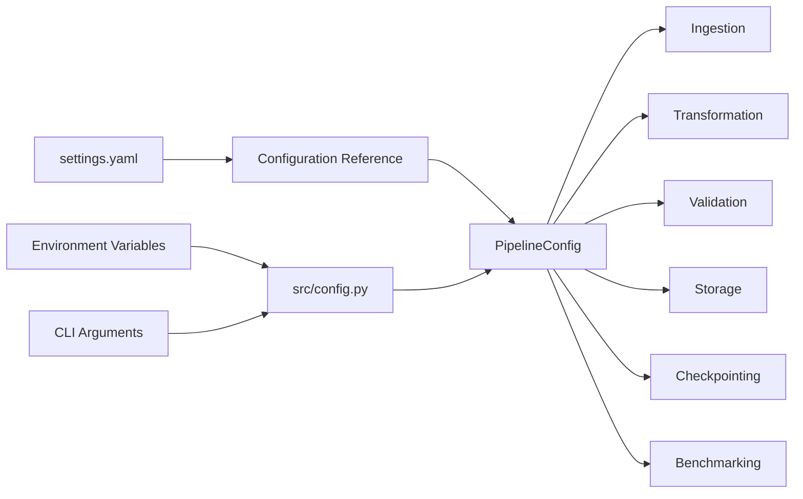
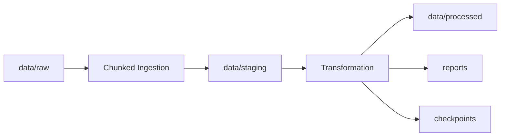
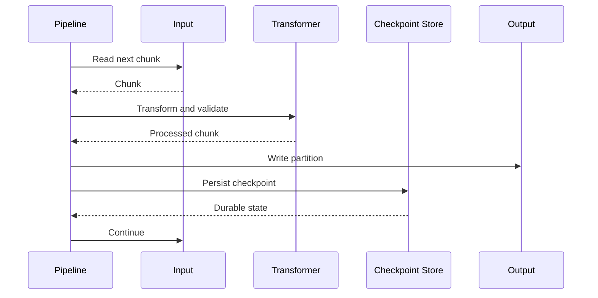

# README

## Overview

The `config/` directory centralizes the operational settings used by the Large Dataset Processing project. The configuration is designed to separate runtime behavior from application code so that chunk sizes, storage formats, validation policy, checkpointing, memory limits, logging, and deployment behavior can be changed without modifying the processing implementation.

The project supports local development, CI execution, and production-style batch processing. Configuration should therefore be treated as part of the system design rather than as a collection of convenience constants.

The primary runtime configuration is implemented in `src/config.py`. The `settings.yaml` file in this directory serves as the human-readable baseline configuration and deployment reference. Runtime values should remain explicit and reproducible, with sensitive values supplied through environment variables rather than committed configuration files.

## Configuration Architecture



The intended precedence is:

1. `settings.yaml` defines the documented baseline.
2. `src/config.py` defines the runtime configuration model and defaults.
3. Environment variables provide deployment-specific overrides.
4. CLI arguments can override selected values for a single process execution.

Avoid embedding environment-specific behavior directly inside transformation or storage modules. Centralizing configuration keeps the pipeline deterministic and easier to test.

## Files

| File | Purpose |
|---|---|
| `settings.yaml` | Human-readable baseline configuration and operational reference |
| `pyproject.toml` | Project metadata, dependencies, tooling, test configuration, and development commands |
| `src/config.py` | Runtime configuration model consumed by the application |
| `.gitignore` | Prevents local data, checkpoints, credentials, caches, and generated artifacts from being committed |

## Configuration Responsibilities

The configuration is intentionally divided into operational domains.

| Domain | Main Concerns |
|---|---|
| Pipeline | Input/output formats, chunk size, row limits |
| Paths | Raw, staging, processed, reports, checkpoints |
| Storage | CSV encoding, delimiters, Parquet compression, atomic writes |
| Processing | Data types, timestamps, identifiers, categoricals, selected columns |
| Validation | Schema checks, required values, uniqueness, allowed values |
| Checkpointing | Resume behavior, checkpoint interval, checkpoint location |
| Memory | Memory targets and warning thresholds |
| Runtime | Logging and execution behavior |
| Benchmarks | Benchmark enablement and repetition counts |
| Deployment | Local, CI, and production-oriented settings |
| Security | Secrets and sensitive configuration handling |
| Observability | Metrics and health checks |
| Quality | Determinism and failure policy |

## Baseline Configuration

`settings.yaml` documents the project's default operating model.

### Pipeline

The pipeline uses chunked processing rather than loading an entire large input file into memory.

```yaml
pipeline:
  name: large-dataset-processing
  input_format: csv
  output_format: parquet
  chunk_size: 50000
  benchmark_chunk_size: 100000
  max_rows: null
```

`chunk_size` is one of the most important performance controls in the system.

A smaller chunk reduces peak memory but increases:

- Python function-call overhead
- serialization overhead
- checkpoint frequency when enabled
- the number of I/O operations

A larger chunk usually improves throughput but increases peak memory pressure.

Do not optimize the chunk size based on intuition alone. Measure representative workloads with the benchmark scripts under `benchmarks/`.

## Paths

The project keeps different stages of data separate.

```yaml
paths:
  input: data/raw/input.csv
  output: data/processed/output.parquet
  rejected: data/staging/rejected.csv
  report: reports/processing_report.parquet
  raw_data_dir: data/raw
  staging_data_dir: data/staging
  processed_data_dir: data/processed
  reports_dir: reports
  benchmarks_dir: benchmarks
  checkpoint_dir: data/staging/checkpoints
```

The intended lifecycle is:



Use separate directories for separate pipeline states. This prevents partially processed output from being mistaken for the canonical result.

For production deployments, these paths can map to object storage such as Amazon S3 rather than a local filesystem.

## Storage Configuration

```yaml
storage:
  parquet_compression: snappy
  csv_encoding: utf-8
  csv_separator: ","
  csv_null_value: ""
  atomic_writes: true
  create_directories: true
```

### Parquet

Parquet is the preferred processed-data format because it provides:

- columnar storage
- efficient compression
- typed schemas
- selective column reads
- strong interoperability with modern analytics systems

The project uses `pyarrow` as the Parquet engine.

`snappy` is a reasonable default when the workload needs a balance between CPU cost and compression ratio. Heavier compression can reduce storage costs but may increase write and read CPU usage.

### Atomic Writes

`atomic_writes: true` means outputs are written to temporary files and then replaced into their final locations.

This protects consumers from observing partially written files.

The general pattern is:

```text
write temporary file
        ↓
flush completed output
        ↓
atomic replace
        ↓
publish final path
```

Atomic replacement is particularly important when downstream jobs start automatically after a file appears.

## Processing Configuration

The processing section controls how Pandas interprets and optimizes input data.

```yaml
processing:
  low_memory: true
  memory_map: false
  parse_dates: true
  timestamp_timezone: UTC
```

### Selected Columns

For large datasets, reading only required columns can significantly reduce memory consumption.

```yaml
usecols:
  - order_id
  - customer_id
  - region
  - status
  - product
  - quantity
  - amount
  - created_at
```

Prefer projection at ingestion time rather than loading unused columns and dropping them later.

### Identifiers

Identifiers should generally remain identifier-like rather than being treated as numerical measures.

```yaml
identifier_columns:
  - order_id
  - customer_id
```

Values such as `000123` should not be converted into floating-point or integer data merely because they contain digits.

### Numeric Columns

```yaml
numeric_columns:
  - amount
  - quantity
```

Numeric conversion enables vectorized arithmetic and efficient aggregation.

Invalid numeric values should be handled by the transformation policy rather than silently propagating through the pipeline.

### Categorical Columns

```yaml
categorical_columns:
  - region
  - status
  - product
```

Categorical dtype can substantially reduce memory usage for low-cardinality string columns. It is particularly useful when the same labels occur repeatedly across millions of records.

Do not convert every string column to `category`. High-cardinality columns such as unique transaction IDs may gain little or even increase memory usage.

## Validation Configuration

Validation separates data-quality policy from transformation logic.

```yaml
validation:
  fail_on_schema_error: true
  fail_on_validation: true
```

A production pipeline should distinguish between:

| Validation Type | Example | Typical Policy |
|---|---|---|
| Schema | Required column missing | Fail |
| Required values | Missing order ID | Fail or reject |
| Uniqueness | Duplicate order ID | Fail or quarantine |
| Numeric validity | Invalid amount | Reject or fail |
| Domain rules | Negative quantity | Reject or fail |
| Allowed values | Unknown order status | Reject or fail |
| Memory | Chunk exceeds configured budget | Warn or fail |

The project intentionally supports strict validation because silently producing a technically valid Parquet file with incorrect business data is often worse than failing the pipeline.

## Checkpointing

Checkpointing provides recoverability for long-running jobs.

```yaml
checkpointing:
  enabled: true
  interval: 10
  resume_enabled: false
  directory: data/staging/checkpoints
```

A checkpoint represents a completed processing unit.



Checkpointing is useful when:

- processing takes a long time
- input files are very large
- compute interruptions are possible
- the pipeline runs in batch infrastructure
- restarting from zero is expensive

Checkpointing introduces additional storage and I/O overhead. It should therefore be enabled based on failure cost rather than by default for every small workload.

## Resume Semantics

A resumable pipeline must guarantee that previously completed chunks can be identified deterministically.

This project uses deterministic partition naming such as:

```text
part-00000001.parquet
part-00000002.parquet
part-00000003.parquet
```

and checkpoint names such as:

```text
chunk-00000001.parquet
chunk-00000002.parquet
chunk-00000003.parquet
```

A production implementation should also ensure that resumed processing does not silently duplicate records or mix outputs from incompatible pipeline versions.

For critical workloads, checkpoint metadata should include enough information to identify:

- input object or file
- input version
- chunk number
- schema version
- processing configuration version
- pipeline version

## Memory Management

```yaml
memory:
  target_memory_mb: 512
  warning_threshold_percent: 80
```

Memory is a primary constraint when processing large Pandas datasets.

The memory model should be reasoned about at the chunk level:

```text
raw input
   ↓
parsed DataFrame
   ↓
temporary transformation columns
   ↓
validated DataFrame
   ↓
serialized output
```

Peak memory can be significantly higher than the final DataFrame size because Pandas operations may require temporary arrays, copied columns, grouped objects, and intermediate results.

The configured memory target should therefore be treated as an operational budget rather than an exact guarantee.

Monitor:

- input chunk size
- deep DataFrame memory usage
- peak process RSS
- transformation expansion
- aggregation cardinality
- number of simultaneous DataFrames

## Benchmark Configuration

The project includes benchmark scripts under `benchmarks/`.

```yaml
benchmarks:
  enabled: true
  repetitions: 3
```

Benchmarks are intended to compare:

- memory usage
- chunk processing throughput
- Pandas transformation cost
- storage-format performance
- serialization size

Use representative data volumes. A benchmark over 1,000 rows is rarely useful for a pipeline intended to process 100 million rows.

Do not interpret benchmark numbers from one machine as universal production guarantees. CPU, filesystem, memory bandwidth, Python version, Pandas version, Parquet engine, and storage backend all affect results.

## Runtime Configuration

```yaml
runtime:
  log_level: INFO
  log_format: "%(asctime)s | %(levelname)s | %(name)s | %(message)s"
```

Recommended logging levels:

| Level | Usage |
|---|---|
| `DEBUG` | Local diagnosis and deep pipeline troubleshooting |
| `INFO` | Normal production pipeline lifecycle |
| `WARNING` | Recoverable anomalies and degraded behavior |
| `ERROR` | Failed operations requiring attention |
| `CRITICAL` | Process-wide or infrastructure-level failures |

Production jobs should generally use `INFO` and emit structured metrics separately from human-readable logs.

## Environment Variables

The application configuration supports environment-driven overrides.

A deployment can use variables following the project's configured prefix:

```bash
export LARGE_DATASET_PIPELINE_CHUNK_SIZE=100000
export LARGE_DATASET_PIPELINE_TARGET_MEMORY_MB=1024
export LARGE_DATASET_PIPELINE_LOG_LEVEL=INFO
```

Environment variables are especially appropriate for:

- deployment-specific paths
- cloud storage locations
- resource limits
- feature flags
- credentials
- secret references

Do not place secrets directly into `settings.yaml`.

## Secrets

Secrets must be supplied through the deployment environment or a dedicated secret manager.

Preferred production options include:

- AWS Secrets Manager
- AWS Systems Manager Parameter Store
- Kubernetes Secrets
- CI/CD secret stores

Avoid:

```yaml
api_key: "production-secret"
password: "production-password"
access_token: "..."
```

inside a version-controlled configuration file.

For local development, `.env` files may be convenient, but they should remain outside version control.

## Deployment Profiles

The baseline configuration supports different operational profiles.

### Local Development

Local execution should prioritize fast iteration:

```yaml
chunk_size: 10000
checkpointing_enabled: false
benchmark_enabled: true
```

Use smaller files and deterministic test fixtures.

### CI

Continuous integration should prioritize repeatability and low execution time:

```yaml
chunk_size: 5000
checkpointing_enabled: false
benchmark_enabled: false
```

CI should focus on:

- unit tests
- integration tests
- schema validation
- deterministic transformations
- static analysis
- type checking

### Production

Production should prioritize reliability and recoverability:

```yaml
chunk_size: 50000
checkpointing_enabled: true
checkpoint_interval: 10
resume_enabled: true
benchmark_enabled: false
atomic_writes: true
fail_on_schema_error: true
fail_on_validation: true
```

The exact values should be tuned using production-like benchmarks and resource measurements.

## Running the Pipeline

From the project root:

```bash
python scripts/run_pipeline.py \
  --input data/raw/input.csv \
  --output data/processed/output.parquet \
  --report reports/processing_report.parquet
```

Override the chunk size for an experiment:

```bash
python scripts/run_pipeline.py \
  --input data/raw/input.csv \
  --chunk-size 100000
```

Enable checkpointing:

```bash
python scripts/run_pipeline.py \
  --input data/raw/input.csv \
  --enable-checkpoints
```

Resume an existing run:

```bash
python scripts/run_pipeline.py \
  --input data/raw/input.csv \
  --resume
```

## Running Tests

Run the complete test suite:

```bash
pytest
```

Run only validation tests:

```bash
pytest tests/test_validation.py
```

Run tests with coverage:

```bash
pytest --cov=src --cov-report=term-missing
```

Run static analysis:

```bash
ruff check src tests scripts benchmarks
```

Run formatting checks:

```bash
ruff format --check src tests scripts benchmarks
```

Run type checking:

```bash
mypy src
```

## Benchmarking

Memory benchmark:

```bash
python benchmarks/benchmark_memory.py \
  --rows 1000000
```

Processing benchmark:

```bash
python benchmarks/benchmark_processing.py \
  --rows 1000000 \
  --repetitions 3
```

Storage-format benchmark:

```bash
python benchmarks/benchmark_formats.py \
  --rows 1000000
```

Benchmarks should be run on infrastructure representative of the deployment environment.

For production sizing, vary at least:

- input row count
- chunk size
- column count
- string cardinality
- output format
- compression level

## Recommended Tuning Workflow

A practical tuning loop is:

1. Establish a baseline with production-like input.
2. Record throughput, peak memory, output size, and elapsed time.
3. Change one configuration value.
4. Repeat the benchmark.
5. Compare against the baseline.
6. Keep the change only when the operational trade-off is justified.

Do not optimize solely for throughput. A faster pipeline that exceeds memory limits or produces unreliable output is not an improvement.

## Common Configuration Mistakes

### Loading Everything Into Memory

Reading an entire large CSV before processing defeats the purpose of chunked processing.

Prefer:

```python
pd.read_csv(
    input_path,
    chunksize=chunk_size,
)
```

over an unconditional full-file load for large inputs.

### Choosing a Chunk Size Without Measuring

There is no universally correct chunk size. CPU, memory, data types, transformations, and downstream I/O all influence the optimum.

Measure instead of guessing.

### Converting Every String to Categorical

Categoricals work best for low-cardinality repeated values. Converting unique IDs or free-form text can provide little benefit.

### Trusting File Extensions

A file named `.csv` can still contain malformed or unexpected data. Validate schema and content rather than trusting the name alone.

### Disabling Validation for Convenience

Strict validation protects downstream systems from corrupted or semantically invalid output. Non-strict mode should be an explicit operational decision.

### Mixing Previous and Current Outputs

Without deterministic cleanup or resume semantics, old partitions can accidentally become part of a new result.

Treat each pipeline run as an explicit execution boundary.

### Storing Secrets in YAML

Configuration files are frequently copied into repositories, CI logs, container images, and backups. Keep secrets outside committed YAML.

### Overusing Checkpoints

Checkpointing every small chunk creates excessive metadata and I/O overhead. Select an interval based on expected recovery cost.

## Production Recommendations

### Reliability

- Use atomic output publication.
- Validate schema before expensive transformations.
- Keep checkpoints deterministic.
- Preserve enough metadata to resume safely.
- Fail fast on unrecoverable configuration errors.
- Do not treat a partially written result as successful output.

### Scalability

- Prefer chunked reads for large CSV inputs.
- Project only required columns.
- Use Parquet for processed datasets.
- Optimize low-cardinality string columns with categoricals.
- Avoid unnecessary DataFrame copies.
- Push filtering as early as possible.
- Partition output according to realistic downstream query patterns.

### Observability

Track at least:

- rows read
- rows written
- rows rejected
- chunks processed
- chunks failed
- peak memory
- elapsed time
- rows per second
- output size

These metrics make performance regressions and data-quality problems visible.

### Security

- Keep secrets outside source-controlled configuration.
- Restrict access to raw and processed data.
- Use encryption for cloud storage.
- Avoid logging sensitive fields.
- Ensure temporary and checkpoint files have appropriate permissions.
- Do not expose internal file paths or credentials through public APIs.

### Disaster Recovery

For production data pipelines:

- store canonical raw inputs in durable object storage
- enable versioning where appropriate
- retain processing reports
- retain checkpoints according to recovery requirements
- make output generation reproducible
- document the exact configuration used for important runs

In AWS environments, a typical design uses S3 for raw and processed data, CloudWatch for operational metrics and logs, and a batch or container platform for execution.

## Configuration Change Guidelines

Treat configuration changes as production code changes.

Before modifying a critical setting:

1. Identify which pipeline behavior it controls.
2. Check whether the value affects memory, correctness, or output compatibility.
3. Update tests when behavior changes.
4. Benchmark large-data scenarios when performance is affected.
5. Document environment-specific overrides.
6. Roll out incrementally for production workloads.

Especially review changes to:

- `chunk_size`
- `max_rows`
- `numeric_columns`
- `identifier_columns`
- `required_columns`
- `drop_invalid_records`
- `drop_duplicates`
- `checkpointing`
- `resume_enabled`
- `parquet_compression`
- `atomic_writes`
- validation policies

## Configuration and Application Boundaries

The configuration layer should define **policy**, while processing modules should implement **behavior**.

For example:

```text
Configuration
    │
    ├── chunk size = 50,000
    ├── numeric columns = amount, quantity
    ├── validation = strict
    └── checkpointing = enabled
             │
             ▼
Pipeline implementation
    │
    ├── reads chunks
    ├── transforms data
    ├── validates results
    ├── persists partitions
    └── records metrics
```

Do not move business logic into YAML. Configuration should describe behavior without becoming a second programming language.

## Key Takeaways

- Keep runtime policy centralized and separate from Pandas transformation logic so the pipeline remains configurable and testable.
- Use chunk size, selected columns, dtypes, categoricals, and Parquet deliberately because they directly affect memory usage and throughput.
- Treat schema validation, atomic writes, deterministic partitions, and checkpoints as reliability mechanisms rather than optional conveniences.
- Keep secrets out of committed configuration and use environment variables or a dedicated secret manager for deployment-specific sensitive values.
- Benchmark configuration changes with production-like datasets before adopting them as operational defaults.