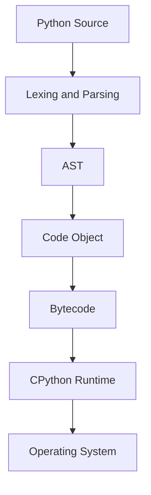
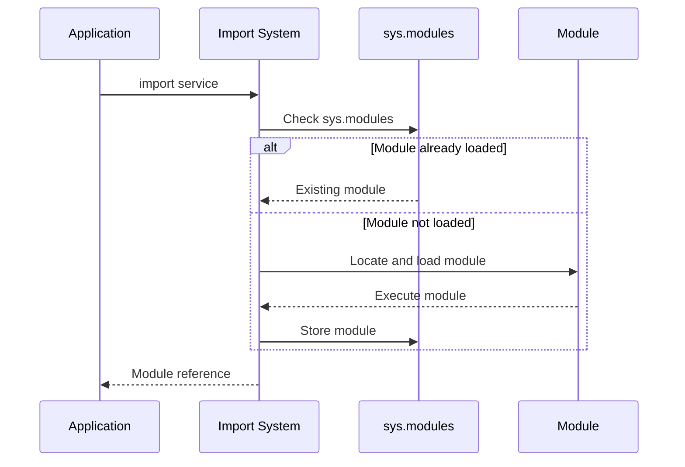
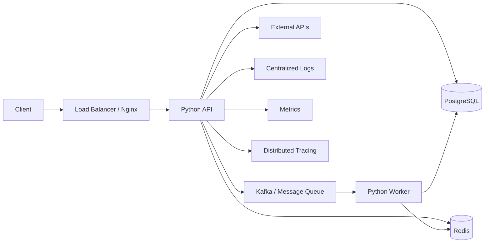

# 01- Python Overview

## Overview

Python is a high-level, general-purpose programming language widely used for backend services, APIs, automation, data processing, testing, infrastructure tooling, and data engineering. Its value in production systems comes less from concise syntax alone and more from its mature standard library, extensive ecosystem, strong framework support, and ability to integrate with databases, messaging systems, cloud services, and distributed infrastructure.

For backend engineering, Python is commonly used with frameworks such as Django and FastAPI, database systems such as PostgreSQL, caching systems such as Redis, asynchronous networking through `asyncio`, background processing through Celery, and deployment platforms such as Docker, Kubernetes, and AWS.

A senior engineer should understand Python at multiple levels:

- Language syntax and semantics
- Object and data model
- Runtime and execution behavior
- Memory management
- Concurrency and parallelism
- Type checking and maintainability
- Dependency and environment management
- Testing and observability
- Performance characteristics
- Production deployment and operational behavior

Python's simplicity is useful, but it can also hide important runtime behavior. Understanding what Python does internally becomes increasingly important when designing high-throughput APIs, debugging memory issues, controlling concurrency, or optimizing data-intensive workloads.

## Why Python Matters in Backend Engineering

Python is particularly effective when development speed, ecosystem maturity, and maintainability are important.

Typical backend workloads include:

| Workload | Python Usage | Common Technologies |
|---|---|---|
| REST APIs | High | FastAPI, Django, Django REST Framework |
| Internal services | High | FastAPI, Flask |
| Data processing | High | Pandas, NumPy |
| Background jobs | High | Celery, Redis, Kafka |
| Automation | High | Standard library, boto3 |
| Microservices | High | FastAPI, gRPC |
| Web applications | High | Django |
| CLI tooling | High | `argparse`, Typer |
| Testing | Very high | pytest, unittest |
| AWS automation | High | boto3, AWS SDKs |
| Machine learning services | High | Python ML ecosystem |

Python is generally a strong choice when the workload is dominated by I/O, business logic, API orchestration, data processing, or integration with external systems.

It requires more careful design when workloads are dominated by CPU-intensive computation, extremely low latency requirements, or very high memory pressure.

## Python's Core Characteristics

Python has several characteristics that influence how backend systems should be designed.

### High-Level Language

Python abstracts many low-level details such as manual memory allocation and pointer manipulation.

This improves developer productivity and reduces certain classes of memory-safety bugs, but it does not eliminate the need to understand memory behavior.

```python
users = []

for user_id in user_ids:
    users.append(load_user(user_id))
```

The engineer does not manually allocate or free memory for `users`. Python manages object lifetime automatically.

However, creating millions of Python objects can still consume substantial memory, and retaining references to objects can prevent them from being reclaimed.

### Dynamically Typed

Python variables are not declared with a fixed static type.

```python
value = 42
value = "42"
```

The name `value` can refer to objects of different types during execution.

This provides flexibility but moves many type-related errors from compile time to runtime.

Modern Python applications can mitigate this using type hints and static type checkers such as mypy or Pyright.

```python
def calculate_total(price: float, quantity: int) -> float:
    return price * quantity
```

Type hints improve tooling, documentation, refactoring, and static analysis, but Python does not generally enforce them at runtime.

### Interpreted and Compiled

Python source code is not simply executed directly as raw text.

A typical CPython execution path is approximately:

```text
Python Source Code
        |
        v
    Tokenization
        |
        v
     Parsing
        |
        v
  Code Object / Bytecode
        |
        v
   Python VM / Interpreter
        |
        v
   Operating System
```

CPython compiles Python source into bytecode represented internally by code objects. The Python runtime then executes that bytecode.

The implementation details vary between Python versions and implementations, so bytecode should not be treated as a permanent language-level contract.

### Automatic Memory Management

Python manages object lifetime automatically.

CPython primarily uses reference counting and supplements it with cyclic garbage collection.

```python
user = User(...)
```

The variable `user` holds a reference to a `User` object.

When references to an object are removed, the object may become eligible for cleanup. Cyclic references require additional garbage-collection mechanisms.

Automatic memory management simplifies application development but does not prevent:

- Memory leaks caused by retained references
- Excessive object creation
- Unbounded caches
- Large in-memory collections
- Resource leaks involving external resources

### Multi-Paradigm

Python supports multiple programming styles:

- Procedural programming
- Object-oriented programming
- Functional programming
- Imperative programming
- Asynchronous programming

A production codebase can therefore combine different styles.

The important engineering question is not whether a particular paradigm is "more Pythonic", but whether the chosen design makes the system understandable, testable, and maintainable.

## Python Execution Model

Understanding execution is important when debugging imports, memory behavior, exceptions, concurrency, and performance.

A simplified CPython lifecycle is:



When Python executes a module, the runtime generally:

1. Loads the source or compiled representation.
2. Creates a module object.
3. Executes the module's top-level code.
4. Creates functions, classes, and other objects defined by the module.
5. Stores the module in `sys.modules`.
6. Makes the resulting names available to importing code.

This explains why module-level code executes during import.

For example:

```python
print("module loaded")

def process():
    return "processed"
```

Importing this module executes the `print()` statement.

For production applications, expensive work should generally not occur unexpectedly at module import time.

A common pattern is:

```python
def main() -> None:
    run_application()


if __name__ == "__main__":
    main()
```

This allows the module to be imported without automatically executing the application entry point.

## Python Objects and Names

One of the most important concepts for senior Python development is that variables are names bound to objects.

```python
user = {"id": 1001}
```

Conceptually:

```text
user
  |
  v
+----------------+
| dict object    |
| id -> 1001     |
+----------------+
```

Assignment generally binds another name to an object rather than copying the object.

```python
user = {"id": 1001}
other = user

other["id"] = 2002
```

Both names refer to the same dictionary.

```text
user  --------\
               ---> dict object
other --------/
```

This behavior is central to understanding:

- Mutability
- Aliasing
- Function arguments
- Shallow copies
- Deep copies
- Object identity
- Caching
- Shared state

Python therefore does not use a simple "pass-by-reference" or "pass-by-value" model.

A more accurate description is **object reference binding** or **call-by-sharing**.

## Variables and Object Identity

Python objects have identity, type, and value.

```python
value = []
```

The object has:

- An identity
- A type (`list`)
- A value (an empty collection)

Identity can be inspected with `id()`.

```python
items = []
other = items

print(items is other)
# True
```

The `is` operator tests object identity.

The `==` operator tests value equality according to the object's equality implementation.

```python
a = [1, 2, 3]
b = [1, 2, 3]

print(a == b)
# True

print(a is b)
# False
```

Confusing identity and equality is a common source of subtle bugs.

## Python's Built-in Data Model

Python provides a rich set of built-in data types.

| Category | Examples | Typical Usage |
|---|---|---|
| Numeric | `int`, `float`, `complex` | Calculations |
| Boolean | `bool` | Conditions |
| Text | `str` | Text processing |
| Binary | `bytes`, `bytearray` | Network/file data |
| Sequence | `list`, `tuple`, `range` | Ordered data |
| Mapping | `dict` | Key-value data |
| Set | `set`, `frozenset` | Uniqueness and membership |
| Null | `None` | Absence of a value |

Python's data model also defines protocols for operations such as:

- Iteration
- Comparison
- Hashing
- Attribute access
- Context management
- Numeric operations
- Serialization

For example, an object becomes usable in a `for` loop when it follows Python's iteration protocol.

```python
for item in collection:
    process(item)
```

The language delegates iteration behavior to the object's iterator implementation.

This protocol-oriented design is one reason Python libraries can integrate naturally with the language.

## Mutable and Immutable Objects

Python objects can be mutable or immutable.

Common mutable objects:

- `list`
- `dict`
- `set`
- Most user-defined objects

Common immutable objects:

- `int`
- `float`
- `bool`
- `str`
- `tuple` when its contents are themselves immutable
- `frozenset`

Mutation changes an existing object.

```python
items = [1, 2]
items.append(3)
```

Rebinding changes what a name refers to.

```python
items = [1, 2]
items = [1, 2, 3]
```

This distinction becomes particularly important when objects are shared between functions, threads, caches, or application components.

## Functions Are Objects

Python treats functions as first-class objects.

A function can be:

- Assigned to a variable
- Passed as an argument
- Returned from another function
- Stored in a collection
- Wrapped by a decorator

```python
def process_order(order):
    return order.total


handler = process_order
result = handler(order)
```

This capability enables common Python patterns such as:

- Callbacks
- Decorators
- Dependency injection
- Strategy patterns
- Middleware
- Higher-order functions

Frameworks such as FastAPI rely heavily on these capabilities.

## Modules and Packages

A module is generally a Python file containing executable code and definitions.

A package organizes modules into a larger importable structure.

A production backend might look like:

```text
app/
    api/
        routes.py
    domain/
        models.py
        services.py
    infrastructure/
        database.py
    main.py
```

The organization separates responsibilities while allowing Python's import system to compose the application.

For larger applications, package boundaries should reflect architectural boundaries rather than simply creating directories for every class.

## Import System

Python's import system performs more work than simply reading a file.

A simplified import flow is:



`sys.modules` acts as the runtime cache of loaded modules.

This is why importing the same module repeatedly does not normally execute its top-level code every time.

Import behavior matters when dealing with:

- Circular imports
- Application startup time
- Plugin architectures
- Dynamic imports
- Package initialization
- Dependency boundaries

## Python Standard Library

Python ships with a large standard library that covers many common backend requirements.

Examples include:

| Area | Modules |
|---|---|
| Filesystem | `pathlib`, `os`, `shutil` |
| Serialization | `json`, `pickle`, `csv` |
| Networking | `socket`, `urllib` |
| Concurrency | `threading`, `multiprocessing`, `asyncio` |
| Processes | `subprocess` |
| Logging | `logging` |
| Dates | `datetime`, `zoneinfo` |
| Data structures | `collections`, `heapq` |
| Functional programming | `functools`, `itertools` |
| Testing | `unittest` |
| CLI | `argparse` |
| Cryptographic primitives | `hashlib`, `hmac`, `secrets` |

Production engineers should generally check whether the standard library already provides a suitable capability before introducing a dependency.

This reduces:

- Dependency count
- Supply-chain risk
- Upgrade burden
- Container size
- Operational complexity

External libraries are still appropriate when they provide substantial functionality or better production ergonomics.

## Python and Backend Frameworks

Python itself does not prescribe a backend architecture. Frameworks provide the application-level infrastructure.

### FastAPI

FastAPI is commonly used for API and microservice workloads.

A minimal production-oriented route might look like:

```python
from fastapi import FastAPI

app = FastAPI()


@app.get("/health")
async def health_check() -> dict[str, str]:
    return {"status": "ok"}
```

FastAPI builds on Python type annotations and ASGI to support modern asynchronous web applications.

### Django

Django provides a broader application framework, including:

- Routing
- ORM
- Authentication
- Middleware
- Templates
- Administrative interfaces
- Management commands

Django is often appropriate when an application benefits from an integrated framework and strong conventions.

### REST APIs

Python APIs commonly interact with:

- PostgreSQL
- Redis
- Kafka
- Object storage
- External HTTP APIs
- Authentication providers

A typical request flow might be:

```text
Client
   |
   v
Nginx / Load Balancer
   |
   v
Python Application
   |
   +------> Redis
   |
   +------> PostgreSQL
   |
   +------> Kafka
   |
   +------> External APIs
```

The Python runtime is therefore only one component of the overall system.

## Python and I/O

Backend applications spend significant time waiting for external systems.

Examples include:

- Database queries
- HTTP requests
- Redis operations
- File operations
- Kafka operations
- Network communication

For I/O-bound workloads, concurrency can improve throughput by allowing other work to proceed while one operation is waiting.

Python provides several concurrency mechanisms:

```text
Concurrency
    |
    +-- Threading
    |
    +-- asyncio
    |
    +-- Multiprocessing
    |
    +-- concurrent.futures
```

The appropriate model depends on the workload and the APIs being used.

For example, asynchronous HTTP clients should generally be used with asynchronous application code rather than wrapping blocking HTTP calls inside an event loop.

## The Global Interpreter Lock

CPython historically uses a Global Interpreter Lock (GIL) that limits concurrent execution of Python bytecode across threads within a single interpreter.

The GIL does not mean that Python threads are useless.

Threads can still be effective for:

- I/O-bound workloads
- Blocking network operations
- Waiting on external services
- Concurrent file operations

CPU-intensive workloads may require:

- Multiple processes
- Native extensions
- Vectorized libraries
- Specialized compute services
- Appropriate interpreter/runtime strategies

The exact concurrency model should be selected based on workload characteristics rather than assuming that "async is always faster" or "threads do not work in Python."

## Python Performance Model

Python prioritizes developer productivity and ecosystem flexibility over raw execution speed.

Performance depends on:

- Algorithmic complexity
- Object allocation
- Data structures
- Function-call overhead
- Serialization
- Network latency
- Database latency
- Concurrency model
- Memory usage
- Third-party libraries

The first optimization target should usually be the algorithm and system architecture.

For example, replacing an inefficient database query with an indexed query can produce a much larger improvement than micro-optimizing Python syntax.

Avoid optimizing based on assumptions.

Use measurement tools such as:

```python
import timeit

duration = timeit.timeit(
    "sum(range(1000))",
    number=10_000,
)

print(duration)
```

For application-level analysis, tools such as `cProfile` and `tracemalloc` provide more useful information than isolated microbenchmarks.

## Memory Considerations

Python's object model introduces memory overhead for many small objects.

This matters when processing large datasets.

For example:

```python
records = [
    {"id": index, "value": index * 2}
    for index in range(10_000_000)
]
```

Holding millions of Python dictionaries in memory can consume substantial RAM.

For large workloads, consider:

- Streaming
- Generators
- Pagination
- Batch processing
- Database-side aggregation
- Compact data structures
- NumPy arrays where appropriate
- Columnar formats such as Parquet
- External storage

Instead of loading an entire file:

```python
with open("events.log", encoding="utf-8") as file:
    for line in file:
        process(line)
```

The application can process records incrementally.

This is often more scalable than constructing a large in-memory list.

## Security Considerations

Python applications inherit security risks from both the language ecosystem and application design.

Important concerns include:

### Unsafe Deserialization

Do not deserialize untrusted data using `pickle`.

```python
import pickle

# Do not load untrusted input with pickle.
```

For untrusted structured data, prefer formats such as JSON with explicit validation.

### Dependency Security

Third-party dependencies introduce supply-chain risk.

Production applications should:

- Pin or constrain dependencies appropriately
- Review dependency updates
- Scan dependencies for known vulnerabilities
- Remove unused dependencies
- Keep the runtime and libraries patched
- Use trusted package sources

### Secrets

Do not hard-code credentials.

Bad:

```python
DATABASE_PASSWORD = "production-password"
```

Prefer environment variables or a dedicated secrets-management solution such as AWS Secrets Manager.

### Input Validation

Never trust API input.

Validate:

- Types
- Required fields
- Lengths
- Ranges
- Formats
- Authorization context

Validation should occur at application boundaries before data enters core business logic.

## Reliability Considerations

Python applications should be designed around explicit failure handling.

External dependencies can fail due to:

- Network errors
- Timeouts
- Connection exhaustion
- Authentication failures
- Service outages
- Rate limits
- Invalid responses

Use appropriate:

- Timeouts
- Retries with bounded backoff
- Circuit-breaking strategies where appropriate
- Connection pooling
- Idempotency
- Structured exceptions
- Health checks

Avoid unbounded retries.

A retry policy without a timeout can turn a temporary dependency failure into resource exhaustion.

## Observability

Production Python applications should expose enough information to determine what happened during a failure.

Common observability signals include:

- Logs
- Metrics
- Traces
- Health checks
- Application errors
- Dependency latency
- Request latency
- Resource utilization

Python's standard `logging` module provides the foundation for application logging.

```python
import logging

logger = logging.getLogger(__name__)


def process_order(order_id: str) -> None:
    logger.info("Processing order", extra={"order_id": order_id})
```

Production systems should generally use structured logs and centralized log aggregation rather than relying on `print()`.

Important metrics often include:

- Request rate
- Error rate
- Latency
- Database latency
- Queue depth
- Worker utilization
- Memory usage
- CPU usage

## Deployment Considerations

A Python application should run in a controlled environment with explicitly managed dependencies.

A typical containerized deployment might be:

```text
Developer
    |
    v
Git Repository
    |
    v
CI Pipeline
    |
    +--> Tests
    +--> Type Checking
    +--> Security Scanning
    |
    v
Container Image
    |
    v
Container Registry
    |
    v
Kubernetes / AWS
    |
    v
Python Application
```

Production deployments should account for:

- Python version
- Dependency versions
- Environment configuration
- Secrets
- Container image security
- Health checks
- Graceful shutdown
- Resource limits
- Horizontal scaling
- Logging
- Metrics
- Distributed tracing

Python processes should also handle termination signals correctly so in-flight work can be completed or safely interrupted.

## Python Project Structure

A backend Python project should separate application responsibilities.

For example:

```text
service/
    app/
        api/
            routes.py
        domain/
            models.py
            services.py
        infrastructure/
            database.py
            cache.py
        config.py
        main.py

    tests/
        unit/
        integration/

    pyproject.toml
    Dockerfile
    README.md
```

The exact structure should follow the application's architectural needs.

Avoid creating excessive layers simply because a particular architecture diagram recommends them.

Good structure should make it clear:

- Where HTTP concerns live
- Where business logic lives
- Where persistence lives
- Where configuration lives
- Where external integrations live
- Where tests live

## Dependency Management

Modern Python projects should define project metadata and dependencies using `pyproject.toml`.

A simplified example:

```toml
[project]
name = "orders-service"
version = "1.0.0"
requires-python = ">=3.12"

dependencies = [
    "fastapi",
    "uvicorn",
    "psycopg",
]
```

Dependency management should provide reproducible environments across:

- Developer machines
- CI
- Test environments
- Staging
- Production

Do not assume that installing the latest version of every dependency at deployment time produces a reproducible system.

## Testing Python Applications

Testing should exist at multiple levels.

```text
Tests
 |
 +-- Unit Tests
 |
 +-- Integration Tests
 |
 +-- API Tests
 |
 +-- Database Tests
 |
 +-- End-to-End Tests
```

Unit tests validate isolated behavior.

Integration tests validate interactions with components such as PostgreSQL or Redis.

API tests validate externally visible behavior.

The goal is not maximum test count. The goal is meaningful coverage of business-critical behavior and failure modes.

Python's dynamic nature makes automated tests particularly valuable for detecting incorrect assumptions that static analysis cannot catch.

## Common Mistakes

### Treating Python Like a Statically Typed Language

Type hints do not automatically enforce runtime correctness.

```python
def add(a: int, b: int) -> int:
    return a + b
```

Python can still receive unexpected runtime values unless the application validates them.

Use type checking as one layer of correctness, not as a substitute for runtime validation.

### Using Mutable Default Arguments

Avoid:

```python
def add_item(item, items=[]):
    items.append(item)
    return items
```

The default list is created once and reused.

Prefer:

```python
def add_item(item, items=None):
    if items is None:
        items = []

    items.append(item)
    return items
```

Modern type-aware code can also use an explicit optional annotation.

### Using Blocking Operations in Async Code

This is a common production problem.

For example, performing blocking database or HTTP operations directly inside an asynchronous request handler can block the event loop.

Use asynchronous libraries when appropriate, or explicitly isolate blocking work.

### Loading Large Data Sets Into Memory

Avoid:

```python
records = file.readlines()
```

when the file can be very large.

Prefer streaming or bounded batches.

### Catching Every Exception

Avoid:

```python
try:
    process()
except Exception:
    pass
```

This hides failures and makes production debugging difficult.

Catch specific exceptions when recovery is possible and preserve useful error context.

### Overusing Classes

Python supports object-oriented programming, but not every function needs a class.

Use classes when they provide meaningful:

- State encapsulation
- Abstraction
- Lifecycle management
- Polymorphism
- Domain modeling

Do not introduce classes solely to organize a few unrelated functions.

### Premature Optimization

Avoid optimizing code based solely on intuition.

Measure first, identify the bottleneck, optimize the relevant layer, and measure again.

### Excessive Dependencies

A dependency should have a clear operational and maintenance justification.

Every dependency adds:

- Security exposure
- Upgrade work
- Compatibility constraints
- Supply-chain risk
- Build complexity

## Production Engineering Checklist

Before deploying a Python service, verify:

- Python version is explicitly defined.
- Dependencies are reproducibly managed.
- Configuration is separated from application code.
- Secrets are not stored in source control.
- API input is validated.
- External calls have timeouts.
- Retry behavior is bounded.
- Database connections are pooled appropriately.
- Logging is structured and useful.
- Metrics are available for critical paths.
- Health checks are implemented.
- Graceful shutdown is supported.
- Tests cover critical behavior.
- Static type checking is used where beneficial.
- Dependencies are scanned and maintained.
- Container resources are explicitly configured.
- Large data processing is bounded or streamed.
- Blocking operations are not accidentally executed on async event loops.
- Failure modes are observable and recoverable.

## Python in a Typical Backend Architecture

A Python service may sit between multiple infrastructure components:



The Python application should remain responsible for application behavior rather than attempting to absorb responsibilities that belong to infrastructure components.

For example:

- PostgreSQL should handle durable relational storage.
- Redis should handle appropriate caching or ephemeral coordination workloads.
- Kafka should handle durable event streaming.
- Nginx or a load balancer should handle appropriate traffic-management concerns.
- Kubernetes or AWS should handle deployment and infrastructure orchestration.

Good backend engineering uses Python as one component of a larger system.

## Interview Perspective

Senior-level Python interviews often test understanding beyond syntax.

Typical areas include:

| Area | Senior-Level Question |
|---|---|
| Object model | How are names, objects, identity, and references related? |
| Memory | How does CPython manage object lifetime? |
| GIL | When does the GIL matter for backend workloads? |
| Asyncio | What happens when a coroutine awaits an I/O operation? |
| Performance | Why can an algorithmic change matter more than a Python micro-optimization? |
| Imports | Why does module-level code execute during import? |
| Mutability | What happens when multiple names reference the same mutable object? |
| Exceptions | How should errors propagate across application layers? |
| Typing | What do Python type hints provide and what do they not enforce? |
| APIs | How should synchronous and asynchronous operations be selected? |
| Production | How would you diagnose high memory usage in a Python service? |
| Architecture | How would you structure a Python microservice for maintainability? |

The strongest answers connect Python language behavior to operational consequences.

For example, knowing that an asynchronous event loop exists is less valuable than understanding that a blocking operation inside that event loop can prevent unrelated requests from being processed by the same worker.

## Key Takeaways

- Python is a high-level, dynamically typed, multi-paradigm language whose production value comes from its runtime, ecosystem, frameworks, and integration capabilities.
- Python variables are names bound to objects; understanding identity, mutability, references, and object lifetime is fundamental to writing reliable Python systems.
- Backend performance depends primarily on algorithms, I/O behavior, concurrency, memory usage, and system architecture rather than Python syntax alone.
- Production Python requires deliberate handling of dependencies, configuration, security, timeouts, retries, observability, testing, resource management, and deployment.
- Senior Python engineering means understanding both language semantics and how those semantics affect APIs, databases, concurrency, scalability, reliability, and operations.