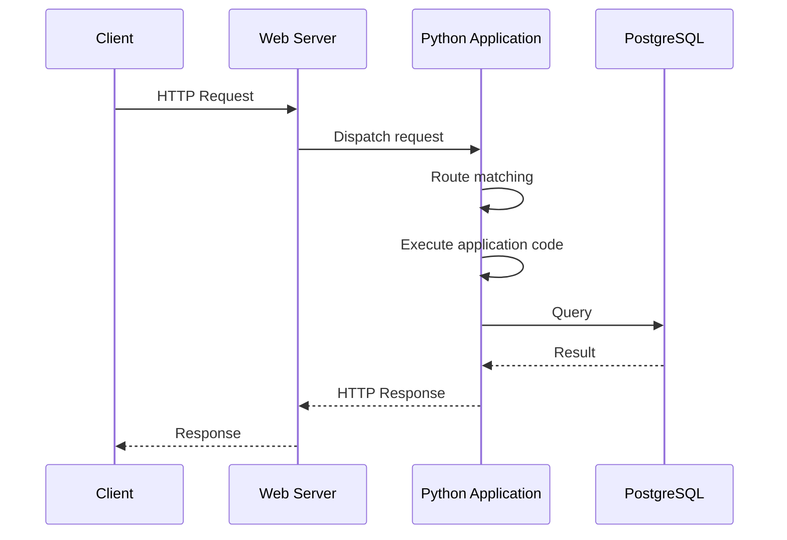
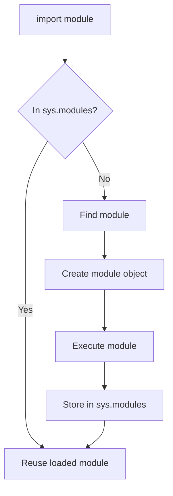

# 02- Execution Model

## Overview

Python's execution model describes how Python source code becomes executable instructions, how names and objects are created, how modules are loaded, how functions execute, and how the runtime manages the call stack, memory, and exceptions.

For backend engineering, understanding the execution model matters because application behavior is determined not only by source code but also by runtime semantics. Import-time execution can affect application startup, object references affect memory usage, stack frames affect debugging, and the interpreter's execution model influences concurrency and performance.

This document focuses primarily on **CPython**, the reference implementation and the implementation most commonly used for production backend services.

A useful mental model is:

```text
Python Source
     |
     v
Lexing / Parsing
     |
     v
AST
     |
     v
Code Objects
     |
     v
Bytecode
     |
     v
CPython Runtime
     |
     +------------------+
     |                  |
     v                  v
Python Objects      OS / Native Code
     |
     v
Application Behavior
```

The exact internal implementation evolves between Python versions. Python language semantics should therefore be distinguished from CPython implementation details.

## Source Code to Execution

A Python program begins as source code.

Consider:

```python
def calculate_total(price: float, quantity: int) -> float:
    return price * quantity


total = calculate_total(100.0, 3)
```

CPython does not execute this source text character by character. It processes the source through multiple stages.

### Lexing and Parsing

The interpreter first analyzes the source according to Python's grammar.

The source is transformed into an internal representation of its syntactic structure.

Conceptually:

```text
Source Code
    |
    v
Tokens
    |
    v
Syntax Tree
```

Syntax errors are detected during this stage.

For example:

```python
def calculate_total(
```

cannot be parsed as a complete function definition.

The interpreter therefore cannot proceed to normal execution.

### Abstract Syntax Tree

The parsed source can be represented as an Abstract Syntax Tree (AST).

Python exposes the `ast` module for inspecting this representation:

```python
import ast

source = """
total = price * quantity
"""

tree = ast.parse(source)

print(ast.dump(tree, indent=2))
```

ASTs are useful for:

- Static analysis
- Linters
- Code transformation
- Source analysis
- Developer tooling
- Security analysis

Application developers normally do not need to manipulate ASTs directly, but understanding that Python parses source before execution helps explain syntax errors and tooling behavior.

### Compilation to Code Objects

Python compiles parsed source into code objects.

A code object contains information required by the runtime to execute a block of Python code.

Functions, modules, and other executable constructs can have associated code objects.

```python
def calculate_total(price, quantity):
    return price * quantity


print(calculate_total.__code__)
```

Code objects contain information such as:

- Bytecode
- Constants
- Names
- Local variable information
- Source location information
- Argument metadata

Code objects are not the same thing as function objects.

A function object contains a reference to executable code plus other runtime state such as its globals and defaults.

## Bytecode

CPython uses bytecode as an intermediate representation for Python instructions.

You can inspect bytecode with the `dis` module:

```python
import dis


def calculate_total(price: float, quantity: int) -> float:
    return price * quantity


dis.dis(calculate_total)
```

The exact instructions vary between Python releases.

This is important because bytecode is an implementation detail rather than a stable programming interface.

Bytecode inspection is useful when investigating:

- Runtime behavior
- Compiler optimizations
- Performance
- Evaluation order
- Function calls
- Attribute access

It should not normally be used as a basis for production application design.

## Code Objects vs Function Objects

These concepts are frequently confused.

A **code object** describes executable instructions.

A **function object** provides a callable runtime object that references those instructions and additional execution context.

Conceptually:

```text
Function Object
    |
    +-- Code Object
    |
    +-- Global Namespace
    |
    +-- Defaults
    |
    +-- Closure
    |
    +-- Metadata
```

For example:

```python
def greet(name: str) -> str:
    return f"Hello, {name}"


print(greet.__code__)
print(greet.__globals__)
```

This distinction becomes important when understanding:

- Closures
- Decorators
- Function metadata
- Default arguments
- Global variable resolution
- Serialization limitations

## Runtime Names and Objects

Python execution is fundamentally object-based.

Consider:

```python
user_id = 1001
```

The runtime creates or obtains an integer object and binds the name `user_id` to it.

Conceptually:

```text
user_id
   |
   v
+-----------+
| int       |
| value=1001|
+-----------+
```

Assignment changes name bindings.

```python
user_id = 1001
user_id = 2002
```

The second assignment rebinds the name.

It does not modify the integer object from `1001` into `2002`.

This distinction becomes more important with mutable objects:

```python
users = []
other = users

other.append("alice")
```

Both names refer to the same list.

```text
users  -----\
             \
              ---> [ "alice" ]
             /
other  ------/
```

Understanding this behavior is essential for avoiding accidental shared state.

## Namespace and Name Resolution

Python stores names in namespaces.

A namespace is conceptually a mapping between names and objects.

Examples include:

- Local namespace
- Enclosing function namespace
- Global module namespace
- Built-in namespace

Python resolves names according to the LEGB model:

```text
L → Local
E → Enclosing
G → Global
B → Built-ins
```

Consider:

```python
name = "global"


def outer():
    name = "enclosing"

    def inner():
        name = "local"
        return name

    return inner()
```

`inner()` finds `name` in its local namespace first.

If a local binding does not exist, Python searches the enclosing scope, then the module's global namespace, and finally the built-in namespace.

## LEGB Name Resolution

A more realistic example:

```python
DEFAULT_TIMEOUT = 5


def create_client():
    timeout = 10

    def connect():
        return timeout

    return connect
```

Inside `connect()`:

```text
Local
  |
  v
No timeout
  |
  v
Enclosing
  |
  v
timeout = 10
```

The global `DEFAULT_TIMEOUT` is not involved because `timeout` is found in the enclosing scope.

The built-in namespace is searched last.

For example:

```python
items = [1, 2, 3]

length = len(items)
```

If `len` is not defined in the local, enclosing, or global namespaces, Python resolves it from the built-in namespace.

## The `global` and `nonlocal` Statements

Python allows explicit modification of bindings in outer scopes.

### `global`

```python
counter = 0


def increment() -> None:
    global counter
    counter += 1
```

This changes the module-level binding.

Global mutable state should generally be minimized in backend applications because it can make:

- Testing harder
- Concurrency behavior less predictable
- Application state harder to reason about
- Worker behavior more difficult to understand

### `nonlocal`

`nonlocal` targets an enclosing function scope.

```python
def create_counter():
    count = 0

    def increment():
        nonlocal count
        count += 1
        return count

    return increment
```

This is a common closure pattern.

Closures become particularly relevant when working with decorators and dependency factories.

## Function Calls

Calling a Python function creates a new execution context.

Consider:

```python
def calculate_total(price: float, quantity: int) -> float:
    subtotal = price * quantity
    return subtotal


total = calculate_total(100.0, 3)
```

Conceptually:

```text
Module Frame
    |
    | call
    v
calculate_total Frame
    |
    +-- price = 100.0
    +-- quantity = 3
    +-- subtotal = 300.0
    |
    | return
    v
Module Frame
```

Each active function call has execution state associated with it.

This state is represented through frames.

## Stack Frames

A stack frame contains information required to execute a particular Python code block.

A frame is associated with:

- Executing code
- Local variables
- Global namespace
- Built-in namespace
- Evaluation state
- Instruction position
- Caller information

When functions call other functions, additional frames become active.

```text
main()
  |
  +-- handle_request()
        |
        +-- authenticate()
              |
              +-- query_database()
```

The active call stack therefore resembles:

```text
+----------------------+
| query_database()     |
+----------------------+
| authenticate()       |
+----------------------+
| handle_request()     |
+----------------------+
| main()               |
+----------------------+
```

This is why a Python traceback can show the sequence of function calls leading to an exception.

## Request Execution in a Python Backend

For a synchronous Python web application, the conceptual flow is:



For an API framework such as FastAPI or Django, additional layers may exist:

- Middleware
- Authentication
- Validation
- Routing
- Dependency resolution
- Business logic
- Database access
- Serialization
- Response middleware

Python execution occurs throughout this lifecycle.

## Module Execution

A Python module is executable code.

Consider:

```python
# settings.py

print("Loading settings")

DATABASE_URL = "postgresql://..."
```

Importing it executes the top-level statements:

```python
import settings
```

The output occurs during import.

This matters in backend systems because module-level execution happens during application startup or worker initialization.

Avoid expensive or side-effect-heavy operations at import time.

For example, this can be problematic:

```python
# Avoid performing expensive external work at import time.

client = create_expensive_client()
data = fetch_large_dataset()
```

Importing the module now performs external work immediately.

Prefer explicit initialization:

```python
def create_application():
    client = create_client()
    return Application(client)
```

This makes lifecycle management easier to control and test.

## The Import Cache

Python maintains loaded modules in `sys.modules`.

```python
import sys

import json

print("json" in sys.modules)
```

When a module is imported, Python generally checks whether it is already present in `sys.modules`.

Conceptually:



This caching behavior explains why importing a module multiple times normally does not execute its module-level code repeatedly.

It also explains why modifying import-related state at runtime can produce surprising behavior.

## Circular Imports

Circular imports occur when modules depend on each other during initialization.

```text
module_a
    |
    v
module_b
    |
    v
module_a
```

For example:

```python
# module_a.py
from module_b import service
```

and:

```python
# module_b.py
from module_a import Repository
```

The problem is that module initialization is incomplete when the second import occurs.

Circular imports often indicate unclear dependency boundaries.

Better solutions include:

- Moving shared abstractions into a lower-level module
- Introducing dependency inversion
- Refactoring responsibilities
- Moving imports into local scope only when there is a legitimate reason

Local imports can sometimes be useful, but they should not become a permanent workaround for poor architecture.

## Function Argument Evaluation

Python evaluates function arguments before calling the function.

```python
def process(value):
    return value


result = process(expensive_operation())
```

`expensive_operation()` executes before `process()` begins.

This matters when arguments involve:

- Database queries
- Network requests
- Expensive computations
- Side effects

The evaluation order of expressions is part of Python's language semantics and should be understood when reasoning about side effects.

## Evaluation Order

Python evaluates expressions according to defined language rules.

For example:

```python
result = first() + second()
```

The calls are evaluated from left to right.

This makes side effects observable:

```python
events = []


def first():
    events.append("first")
    return 1


def second():
    events.append("second")
    return 2


result = first() + second()

print(events)
# ['first', 'second']
```

Production code should avoid relying on subtle side effects inside complex expressions.

Explicit statements are generally easier to review and debug.

## Bytecode and Performance

Python execution introduces interpreter overhead.

A simplified execution loop can be viewed as:

```text
Fetch instruction
      |
      v
Decode instruction
      |
      v
Execute operation
      |
      v
Update execution state
      |
      +----> Next instruction
```

Modern CPython versions include runtime optimizations and adaptive behavior, so this simplified model should not be interpreted as a literal description of every internal operation.

The important engineering point is that Python-level operations have runtime costs.

For example, repeatedly creating objects or performing Python-level loops over very large datasets can be expensive.

When performance matters:

1. Measure the workload.
2. Identify the bottleneck.
3. Optimize the algorithm or architecture.
4. Use appropriate libraries or native implementations.
5. Measure again.

## CPython and Native Code

Python applications frequently execute native code through the interpreter or extension modules.

Examples include libraries for:

- Numerical processing
- Cryptography
- Compression
- Database drivers
- Networking
- Serialization

Conceptually:

```text
Python Code
    |
    v
CPython
    |
    +------> Python Runtime
    |
    +------> Native Extension
                 |
                 v
              C / C++ / Rust
                 |
                 v
             Operating System
```

This is one reason Python applications can achieve good performance despite Python's interpreter overhead.

Libraries can move expensive operations into optimized native implementations.

## Execution and Memory

Execution and memory are tightly coupled.

When Python creates an object, the runtime must allocate memory for it.

For example:

```python
orders = []

for order in incoming_orders:
    orders.append(order)
```

The list maintains references to order objects.

The list itself and the referenced objects consume memory.

A backend process can therefore experience memory pressure even when the source code appears simple.

Typical causes include:

- Unbounded lists
- Large response objects
- Caches without limits
- Retained references
- Large ORM query results
- Loading entire files
- Accumulated background-job results

Streaming and bounded processing are often better:

```python
def process_orders(orders):
    for order in orders:
        process(order)
```

This pattern is particularly important for large datasets and background workers.

## Exceptions and the Execution Stack

When an exception occurs, Python unwinds the active call stack until a matching exception handler is found.

Consider:

```python
def query_database():
    raise RuntimeError("Database unavailable")


def load_orders():
    return query_database()


def handle_request():
    return load_orders()
```

The execution path is:

```text
handle_request()
    |
    v
load_orders()
    |
    v
query_database()
    |
    X RuntimeError
    |
    v
Stack unwinding
```

If no handler exists, the exception reaches the application's top-level execution boundary and becomes an unhandled error.

This is why tracebacks contain a chain of source locations.

## Exception Handling in Backend Services

A backend application should generally handle exceptions at appropriate architectural boundaries.

For example:

```text
Database Layer
    |
    | raises database-specific exception
    v
Service Layer
    |
    | translates / handles domain failure
    v
API Layer
    |
    | maps error to HTTP response
    v
Client
```

The database layer should not necessarily know that an HTTP `404` response exists.

Likewise, the API layer should not need to understand every database-specific exception type.

This separation improves maintainability and testability.

## Recursion and the Call Stack

Each recursive function call creates another execution context.

```python
def factorial(value: int) -> int:
    if value <= 1:
        return 1

    return value * factorial(value - 1)
```

Conceptually:

```text
factorial(4)
    |
    factorial(3)
        |
        factorial(2)
            |
            factorial(1)
```

Deep recursion consumes stack resources and eventually reaches Python's recursion limit.

```python
import sys

print(sys.getrecursionlimit())
```

Python is generally not optimized for arbitrary deep recursion.

For production workloads, iterative approaches are often preferable when recursion depth can become large.

## Global State and Long-Lived Processes

Backend services frequently run for a long time.

A process may serve thousands or millions of requests before being restarted.

This makes process-level state particularly important.

For example:

```python
request_count = 0


def handle_request():
    global request_count
    request_count += 1
```

This value is local to a particular process.

It is not automatically shared between:

- Multiple worker processes
- Multiple containers
- Multiple Kubernetes pods
- Multiple EC2 instances

Therefore, process memory should not be used as the source of truth for distributed application state.

Use appropriate external systems such as:

- PostgreSQL
- Redis
- Kafka
- Object storage

when state must be shared or durable.

## Execution Model and Multiprocessing

A common production architecture uses multiple Python worker processes:

```text
                    Load Balancer
                         |
             +-----------+-----------+
             |           |           |
             v           v           v
          Worker 1    Worker 2    Worker 3
             |           |           |
             +-----------+-----------+
                         |
                         v
                     PostgreSQL
```

Each worker has its own:

- Python interpreter state
- Memory space
- Global variables
- Module instances
- Event loop where applicable

Changes made to a global variable in Worker 1 are not automatically visible to Worker 2.

This is a critical distinction when deploying Django, FastAPI, or other Python services with multiple workers.

## Execution Model and Asyncio

Asynchronous Python changes how execution is scheduled but does not remove the Python runtime.

A simplified asyncio model is:

```text
Event Loop
    |
    +--> Task A
    |
    +--> Task B
    |
    +--> Task C
```

When a coroutine reaches an `await` for an asynchronous operation, it can yield control so another task can run.

```python
async def fetch_order(client, order_id: str):
    response = await client.get(f"/orders/{order_id}")
    return response
```

Conceptually:

```mermaid
sequenceDiagram
    participant Loop as Event Loop
    participant TaskA as Task A
    participant API as External API
    participant TaskB as Task B

    Loop->>TaskA: Run
    TaskA->>API: Async request
    TaskA-->>Loop: Await / yield
    Loop->>TaskB: Run
    TaskB-->>Loop: Yield
    API-->>Loop: Response ready
    Loop->>TaskA: Resume
```

The key point is that `await` provides a scheduling opportunity.

It does not make arbitrary blocking code asynchronous.

## Blocking Operations in Async Applications

This is a common production failure mode.

Consider:

```python
async def handler():
    response = requests.get("https://example.com")
    return response.text
```

`requests.get()` is synchronous.

While it waits, the event-loop thread can be blocked.

For an async application, use an asynchronous client where appropriate:

```python
import httpx


async def handler() -> str:
    async with httpx.AsyncClient(timeout=5.0) as client:
        response = await client.get("https://example.com")
        response.raise_for_status()
        return response.text
```

The broader principle is:

> An asynchronous architecture requires non-blocking operations throughout the critical execution path.

## Execution Context in Containers

A Docker container usually runs one or more Python processes in an isolated environment.

Conceptually:

```text
Container
    |
    +-- Python Interpreter
    |
    +-- Application Memory
    |
    +-- File System
    |
    +-- Network Namespace
```

When Kubernetes runs multiple replicas:

```text
Kubernetes
    |
    +-- Pod A -> Python Process
    |
    +-- Pod B -> Python Process
    |
    +-- Pod C -> Python Process
```

Each process has independent runtime state.

Therefore:

- In-memory caches are local unless externally coordinated.
- Global variables are not distributed state.
- Files written inside a container may not be durable.
- Process-local locks do not coordinate across pods.

These are architectural consequences of the execution model.

## Startup and Shutdown Lifecycle

Production Python applications have a process lifecycle.

A simplified lifecycle is:

```text
Process Start
     |
     v
Load Configuration
     |
     v
Import Application
     |
     v
Initialize Resources
     |
     v
Start Server
     |
     v
Process Requests
     |
     v
Receive Shutdown Signal
     |
     v
Stop Accepting Work
     |
     v
Release Resources
     |
     v
Process Exit
```

Resources such as:

- Database pools
- Redis connections
- Kafka producers
- HTTP clients
- Background workers

should have explicit lifecycle management where appropriate.

Framework-specific lifecycle mechanisms should be preferred over relying on import-time side effects.

## Production Implications

The execution model directly influences production architecture.

| Execution Behavior | Production Implication |
|---|---|
| Modules execute during import | Keep imports lightweight and predictable |
| Names reference objects | Shared mutable state requires care |
| Each process has separate memory | Do not use process memory for distributed state |
| Function calls create execution frames | Deep call stacks affect debugging and recursion |
| Exceptions unwind the stack | Define clear error-handling boundaries |
| Python has interpreter overhead | Profile before optimizing |
| Async tasks share an event loop | Blocking operations can reduce throughput |
| Workers are separate processes | Global variables are not shared |
| Objects consume memory | Bound caches and large collections |
| Dependencies execute at startup | Startup time affects deployments and scaling |

## Common Mistakes

### Assuming Python Executes Source Directly

Python source is parsed and compiled into an executable representation before normal runtime execution.

Understanding this helps when working with:

- Syntax errors
- Bytecode
- AST tooling
- Import behavior
- Runtime debugging

### Treating Variables as Boxes

Python variables are names bound to objects, not fixed typed memory boxes.

This misconception frequently causes bugs involving mutable objects and aliasing.

### Using Global Variables as Shared Application State

A global variable is process-local.

It should not be treated as shared state across workers or containers.

Use an external state store when multiple processes must observe the same state.

### Performing Heavy Work During Import

Import-time side effects can increase startup time and create difficult-to-test behavior.

Keep module initialization lightweight.

### Blocking the Async Event Loop

A single blocking operation can prevent other tasks from progressing on the same event loop.

Measure event-loop latency and ensure that blocking libraries are not accidentally used on asynchronous request paths.

### Assuming `async` Automatically Improves Performance

Asyncio is useful primarily for concurrency around non-blocking I/O.

It does not automatically make CPU-intensive code faster.

### Inspecting Bytecode as a Stable Contract

Bytecode changes between Python versions.

Use it for investigation and learning rather than depending on exact instruction sequences in application logic.

### Assuming Process Memory Is Shared

Multiple workers have separate address spaces.

Use PostgreSQL, Redis, Kafka, or another appropriate external system when state must cross process boundaries.

## Debugging the Execution Model

Python provides several tools for inspecting runtime behavior.

### Inspecting the Call Stack

The `inspect` module can expose runtime information:

```python
import inspect


def process_order(order_id: str) -> None:
    frame = inspect.currentframe()

    if frame is not None:
        print(frame.f_code.co_name)
```

For production debugging, structured logs, tracing, profilers, and debugger tooling are generally more useful than inserting inspection code into application paths.

### Inspecting Bytecode

```python
import dis


def calculate_total(price: float, quantity: int) -> float:
    return price * quantity


dis.dis(calculate_total)
```

### Inspecting Module State

```python
import sys

print(len(sys.modules))
```

This can help diagnose import-related behavior, although production diagnostics should generally use controlled observability tooling.

## Performance and Operational Guidance

When investigating a Python application's runtime behavior:

1. Identify whether the bottleneck is CPU, memory, I/O, or contention.
2. Determine whether the issue occurs inside Python code or an external dependency.
3. Profile representative workloads.
4. Inspect database and network latency independently.
5. Check process and container resource usage.
6. Examine concurrency behavior.
7. Optimize the actual bottleneck.
8. Validate the change with measurements.

Useful tools include:

- `timeit` for microbenchmarks
- `cProfile` for CPU profiling
- `tracemalloc` for Python memory allocation analysis
- `py-spy` or similar sampling profilers for live processes
- Application metrics
- Distributed tracing
- Database query analysis
- Container-level CPU and memory metrics

Do not diagnose Python performance using source-code appearance alone.

## Senior-Level Mental Model

A useful model for reasoning about Python applications is:

```text
Source Code
    |
    v
Parser / Compiler
    |
    v
Code Objects / Bytecode
    |
    v
CPython Runtime
    |
    +--------------------+
    |                    |
    v                    v
Namespaces           Object Heap
    |                    |
    v                    v
Name Resolution     Object Lifetime
    |
    v
Function Calls
    |
    v
Frames / Call Stack
    |
    v
Exceptions / Returns
    |
    v
Application Behavior
    |
    +--------------------+
    |                    |
    v                    v
I/O / OS            Concurrency
```

When this model is combined with backend architecture, it becomes possible to reason about problems such as:

- Why application startup is slow
- Why a circular import occurs
- Why memory grows across requests
- Why a global cache differs between workers
- Why an async endpoint has unexpectedly low throughput
- Why an exception appears at a particular stack frame
- Why CPU-heavy Python code limits throughput
- Why a container restart loses in-memory state

## Key Takeaways

- CPython transforms Python source through parsing and compilation into executable code objects and bytecode before runtime execution.
- Python execution is object- and namespace-oriented: names bind to objects, scopes determine name resolution, and function calls create execution contexts represented by frames.
- Module imports execute top-level code and use `sys.modules` as a cache, making import-time side effects and circular dependencies important production concerns.
- Each Python worker process has independent memory and runtime state, so global variables and in-memory state cannot serve as distributed application state.
- Asyncio improves I/O concurrency when operations yield control correctly; blocking work inside the event loop can directly reduce backend throughput.