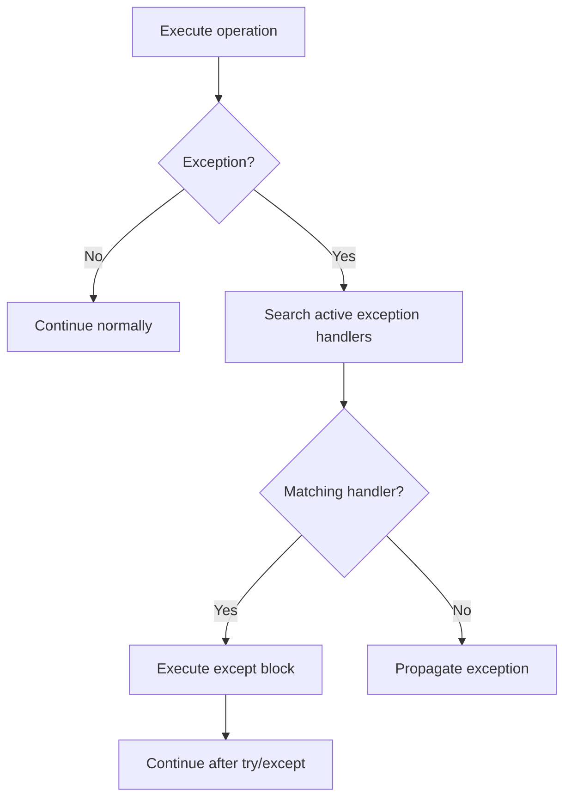

# 04- Control Flow

## Overview

Control flow determines the order in which Python statements execute. It includes conditional execution, iteration, loop control, structural pattern matching, and exception-driven branching.

For backend engineering, control flow is more than syntax. It directly affects:

- Business-rule correctness
- Request processing
- Validation
- Retry behavior
- Resource usage
- Concurrency
- Error propagation
- Performance
- Maintainability

A production Python service should make control flow explicit and easy to reason about. Complex branching, deeply nested loops, broad exception handlers, and hidden side effects make systems harder to test and operate.

Python provides several primary control-flow mechanisms:

| Mechanism | Primary Use |
|---|---|
| `if` / `elif` / `else` | Conditional business logic |
| `for` | Iteration over an iterable |
| `while` | Repetition based on a condition |
| `break` | Terminate the current loop |
| `continue` | Skip the current iteration |
| `pass` | Explicitly do nothing |
| `return` | Exit a function |
| `raise` | Transfer control through exception handling |
| `match` / `case` | Structural pattern matching |
| `try` / `except` | Exception-based control flow |

## Conditional Execution

The `if` statement executes a block when an expression evaluates to true.

```python
if order.status == "paid":
    fulfill_order(order)
```

Python evaluates the condition using its truth-value rules.

An `if` statement can have multiple branches:

```python
if order.status == "paid":
    fulfill_order(order)
elif order.status == "pending":
    queue_for_payment(order)
else:
    reject_order(order)
```

Only the first matching branch executes.

### When to Use

Use conditional statements when execution depends on explicit business or application state.

Typical backend examples include:

- Authentication decisions
- Request validation
- Feature flags
- Order state transitions
- Retry decisions
- Authorization
- Configuration-dependent behavior

### Production Guidance

Keep conditions close to the business decision they represent.

Prefer:

```python
if account.is_active:
    authorize_request()
```

over embedding unrelated side effects inside a complex condition.

Avoid conditions that simultaneously:

- Query a database
- Mutate state
- Call an external service
- Perform authorization
- Return a response

Separating those responsibilities makes the code easier to test.

## Truth-Value Testing

Python allows objects to participate directly in conditional expressions.

```python
if users:
    process_users(users)
```

Empty collections are falsey:

```python
if not users:
    return
```

Common falsey values include:

- `None`
- `False`
- `0`
- `0.0`
- `""`
- Empty lists
- Empty tuples
- Empty dictionaries
- Empty sets

However, truthiness should not replace explicit business semantics.

For example:

```python
if not retry_count:
    ...
```

matches both `0` and `None`.

If zero is a valid value but `None` means "not supplied", use:

```python
if retry_count is None:
    ...
```

## Boolean Operators

Python provides:

- `and`
- `or`
- `not`

Example:

```python
if user.is_active and user.has_permission("orders:read"):
    return get_orders(user)
```

Boolean operators use short-circuit evaluation.

```python
if user is not None and user.is_active:
    ...
```

If `user is not None` is false, Python does not evaluate `user.is_active`.

This can protect against invalid access and avoid unnecessary work.

## Short-Circuit Evaluation

Consider:

```python
if cache_entry is not None and not cache_entry.is_expired():
    return cache_entry.value
```

If `cache_entry` is `None`, the second expression is not evaluated.

Similarly:

```python
value = configured_timeout or DEFAULT_TIMEOUT
```

uses the second operand if `configured_timeout` is falsey.

This is concise but should only be used when all falsey values have the same intended meaning.

If `0` is a valid timeout, for example, this pattern can be incorrect.

Prefer explicit logic when semantics matter:

```python
timeout = (
    DEFAULT_TIMEOUT
    if configured_timeout is None
    else configured_timeout
)
```

## Conditional Expressions

Python supports inline conditional expressions:

```python
status = "active" if user.is_active else "disabled"
```

They are useful for simple value selection.

Avoid deeply nested conditional expressions:

```python
# Avoid overly complex expressions.
label = "active" if active else "pending" if pending else "disabled"
```

For multiple business states, explicit branching or a mapping is generally easier to understand.

## Guard Clauses

Guard clauses handle invalid or exceptional cases early.

Instead of:

```python
def process_order(order):
    if order is not None:
        if order.is_valid:
            if order.is_paid:
                fulfill(order)
```

prefer:

```python
def process_order(order):
    if order is None:
        return

    if not order.is_valid:
        return

    if not order.is_paid:
        return

    fulfill(order)
```

Guard clauses reduce nesting and make the successful execution path easier to identify.

In backend services, guard clauses are particularly useful for:

- Authorization checks
- Validation
- Feature flags
- Request preconditions
- Resource availability

## Conditional Logic and Authorization

Authorization logic should be explicit.

```python
def update_order(user, order) -> None:
    if not user.is_authenticated:
        raise PermissionError("Authentication required")

    if not user.can_edit_orders:
        raise PermissionError("Insufficient permissions")

    update_order_record(order)
```

Avoid mixing authentication, authorization, and business mutation into opaque boolean expressions.

For complex authorization policies, use dedicated policy or authorization components rather than progressively expanding `if` statements.

## Iteration with `for`

Python's `for` loop iterates over an iterable.

```python
for order in orders:
    process_order(order)
```

Python does not require an explicit integer index for normal iteration.

This is preferred:

```python
for order in orders:
    process_order(order)
```

over:

```python
for index in range(len(orders)):
    process_order(orders[index])
```

The first version communicates the intent directly and works with any suitable iterable.

## The Iteration Protocol

A `for` loop relies on Python's iteration protocol.

Conceptually:

```text
Iterable
    |
    v
iter(iterable)
    |
    v
Iterator
    |
    +--> next()
    |
    +--> next()
    |
    +--> next()
    |
    +--> StopIteration
```

A simplified equivalent of:

```python
for item in items:
    process(item)
```

is conceptually similar to:

```python
iterator = iter(items)

while True:
    try:
        item = next(iterator)
    except StopIteration:
        break

    process(item)
```

The actual implementation is optimized internally, but the protocol explains why lists, tuples, generators, files, and many custom objects can all work with `for`.

## Iterating Over Dictionaries

Iterating over a dictionary directly produces keys.

```python
users = {
    "u1": "Alice",
    "u2": "Bob",
}

for user_id in users:
    print(user_id)
```

Use `.items()` when both keys and values are required:

```python
for user_id, name in users.items():
    print(user_id, name)
```

Use `.values()` when only values are required:

```python
for name in users.values():
    print(name)
```

This makes the intended access pattern explicit.

## `range()`

`range()` represents an arithmetic progression of integers.

```python
for attempt in range(3):
    perform_attempt()
```

`range()` is lazy in the sense that it does not construct a list containing every integer.

```python
range(1_000_000_000)
```

can therefore represent a very large sequence without allocating a billion integers at once.

This makes `range()` useful for:

- Fixed iteration counts
- Index generation
- Bounded retries
- Batch processing

However, retry loops should normally be driven by actual operation outcomes rather than arbitrary iteration counts alone.

## `enumerate()`

Use `enumerate()` when both the item and its position are required.

```python
for index, order in enumerate(orders):
    log_order_position(index, order)
```

Instead of:

```python
for index in range(len(orders)):
    order = orders[index]
```

`enumerate()` is more readable and works with general iterables.

You can specify the starting index:

```python
for position, item in enumerate(items, start=1):
    print(position, item)
```

## `zip()`

`zip()` iterates over multiple iterables in parallel.

```python
user_ids = [1001, 1002]
roles = ["admin", "viewer"]

for user_id, role in zip(user_ids, roles):
    assign_role(user_id, role)
```

By default, iteration stops when the shortest iterable is exhausted.

When mismatched lengths should be treated as an error, Python provides strict mode:

```python
for user_id, role in zip(user_ids, roles, strict=True):
    assign_role(user_id, role)
```

This is useful for detecting inconsistent input instead of silently truncating data.

## Nested Loops

Nested loops are sometimes necessary:

```python
for order in orders:
    for item in order.items:
        process_item(item)
```

However, nested loops can produce poor performance when both collections are large.

If:

```text
orders = N
items per order = M
```

the operation may require approximately `N × M` iterations.

Before using nested loops for large datasets, consider:

- Dictionaries for indexed lookup
- Sets for membership
- Database joins
- SQL-side aggregation
- Precomputed indexes
- Better algorithms

For backend workloads, moving suitable operations into PostgreSQL can be significantly more efficient than repeatedly scanning Python collections.

## `while` Loops

A `while` loop repeats while a condition remains true.

```python
while queue.has_items():
    process(queue.pop())
```

Use `while` when the number of iterations is not naturally known in advance.

Typical uses include:

- Polling
- State machines
- Queue consumers
- Retry mechanisms
- Stream processing

A `while` loop must have a clear termination condition.

## Infinite Loops

A worker process may intentionally use a long-running loop:

```python
while True:
    message = consume_message()
    process_message(message)
```

This is common for worker processes and consumers.

However, production consumers should additionally handle:

- Shutdown signals
- Timeouts
- Backpressure
- Retry behavior
- Poison messages
- Resource cleanup
- Observability

A deliberately infinite loop is different from an accidentally non-terminating loop.

## `break`

`break` immediately terminates the nearest enclosing loop.

```python
for order in orders:
    if order.id == target_id:
        selected = order
        break
```

This is appropriate when the required result has been found.

For example, searching a list can stop once a match is located.

However, if the primary operation is repeated lookup, a dictionary or set may be a better data structure than repeatedly scanning a list.

## `continue`

`continue` skips the remainder of the current iteration.

```python
for order in orders:
    if order.is_cancelled:
        continue

    process_order(order)
```

This is useful for filtering work inside loops.

Avoid excessive use when it causes important processing rules to become difficult to follow.

## `pass`

`pass` explicitly performs no operation.

```python
if feature_disabled:
    pass
```

It is mostly useful where Python requires a statement but no action is intended.

More commonly, if a condition should simply do nothing, restructuring the control flow is clearer.

`pass` is also useful temporarily when defining an incomplete block, but unfinished production logic should not be left behind accidentally.

## `else` on Loops

Python supports `else` on both `for` and `while` loops.

The loop `else` block executes when the loop completes normally, but not when it terminates through `break`.

Example:

```python
for order in orders:
    if order.id == target_id:
        selected = order
        break
else:
    selected = None
```

This means:

- Match found → `break` → loop `else` does not execute.
- No match → loop finishes normally → `else` executes.

This feature is valid Python but can be unfamiliar to many engineers.

Use it when it makes search semantics clearer. Otherwise, an explicit flag or helper function may be easier for a team to maintain.

## `return` as Control Flow

`return` immediately exits the current function.

```python
def get_order(order_id):
    order = repository.get(order_id)

    if order is None:
        return None

    return order
```

Returning early is often useful for guard clauses.

A `return` also exits the function even if it occurs inside a loop:

```python
def find_order(orders, order_id):
    for order in orders:
        if order.id == order_id:
            return order

    return None
```

This is often cleaner than setting a temporary variable and using `break`.

## `raise` as Control Flow

Exceptions transfer control to an appropriate exception handler.

```python
def require_admin(user):
    if not user.is_admin:
        raise PermissionError("Administrator access required")
```

Exceptions are appropriate when the current function cannot reasonably continue.

They should not normally replace ordinary expected branching.

Prefer:

```python
if user.is_active:
    process(user)
```

over using exceptions for a normal state decision.

## Exception Control Flow

A typical exception flow is:



The runtime unwinds the active call stack until a matching handler is found.

This is why exceptions can propagate through multiple application layers.

## `try` / `except`

Use `try` / `except` when the application can meaningfully handle an exception.

```python
def parse_user_id(value: str) -> int:
    try:
        return int(value)
    except ValueError as exc:
        raise ValueError("Invalid user ID") from exc
```

Catch the narrowest appropriate exception.

Avoid:

```python
try:
    process_request()
except Exception:
    return None
```

This can hide:

- Programming errors
- Database failures
- Network failures
- Configuration errors
- Unexpected runtime failures

Broad exception handling may be appropriate at top-level application boundaries for logging and controlled response generation, but it should not silently suppress failures.

## `try` / `except` / `else` / `finally`

Python provides four related blocks:

```python
try:
    result = operation()
except SomeError:
    handle_failure()
else:
    use_result(result)
finally:
    release_resource()
```

Their roles are distinct:

| Block | Purpose |
|---|---|
| `try` | Operation that may fail |
| `except` | Handle specific exceptions |
| `else` | Execute only when `try` succeeds |
| `finally` | Execute regardless of success or failure |

`finally` is particularly useful for cleanup.

For resource management, however, context managers are usually preferable:

```python
with open("orders.txt", encoding="utf-8") as file:
    process(file)
```

## Structural Pattern Matching

Python's `match` / `case` syntax supports structural pattern matching.

```python
match order.status:
    case "pending":
        queue_payment(order)
    case "paid":
        fulfill_order(order)
    case "cancelled":
        archive_order(order)
    case _:
        raise ValueError("Unknown order status")
```

This can make multi-state branching clearer than a long `if` / `elif` chain.

## Pattern Matching with Structures

Pattern matching can inspect structure as well as values.

```python
match message:
    case {"type": "order.created", "order_id": order_id}:
        handle_order_created(order_id)
    case {"type": "order.cancelled", "order_id": order_id}:
        handle_order_cancelled(order_id)
    case _:
        handle_unknown_message(message)
```

This can be useful for event-driven applications consuming structured messages.

It should be used when the structure of the input is genuinely important to the decision.

## Pattern Matching Guards

A `case` can include a guard:

```python
match order:
    case {"status": "paid", "total": total} if total > 10_000:
        require_manual_review()
    case {"status": "paid"}:
        fulfill_order()
    case _:
        handle_other_state()
```

Pattern matching can therefore combine structural checks with additional business conditions.

## Conditional Dispatch with Dictionaries

For simple value-to-function mappings, a dictionary can be cleaner than a large branch.

```python
handlers = {
    "created": handle_created,
    "updated": handle_updated,
    "deleted": handle_deleted,
}

handler = handlers.get(event_type)

if handler is None:
    raise ValueError(f"Unsupported event type: {event_type}")

handler(event)
```

This approach is useful when:

- Values map directly to behavior
- Branch-specific logic is independent
- The mapping can be configured or extended

It should not be forced onto complex decision trees where `if` or `match` is clearer.

## Control Flow in Request Processing

A production API often has a control-flow pipeline:

```text
HTTP Request
     |
     v
Authentication
     |
     v
Authorization
     |
     v
Validation
     |
     v
Business Logic
     |
     v
Persistence
     |
     v
Response
```

At each stage, control may terminate early.

For example:

```python
def handle_request(request):
    user = authenticate(request)

    if user is None:
        raise AuthenticationError("Invalid credentials")

    if not user.can_read_orders:
        raise PermissionError("Access denied")

    request_data = validate_request(request)

    return create_order(request_data, user)
```

This is an example of layered control flow where each boundary has a clear responsibility.

## Control Flow and Database Operations

Control flow should account for database cost.

Avoid:

```python
for user_id in user_ids:
    user = repository.get_user(user_id)
    process_user(user)
```

when `get_user()` performs one database query per iteration.

This can create an N+1 query pattern:

```text
1 request
   |
   +--> Query users
   |
   +--> Query user 1
   +--> Query user 2
   +--> Query user 3
   +--> ...
```

For large workloads, batch retrieval is often preferable:

```python
users = repository.get_users_by_ids(user_ids)

for user in users:
    process_user(user)
```

Better control flow is therefore not only about Python syntax. It can reduce expensive external operations.

## Control Flow and Retries

Retry logic is a common backend control-flow pattern.

A bounded retry loop might look like:

```python
import time


MAX_ATTEMPTS = 3


def call_dependency():
    for attempt in range(1, MAX_ATTEMPTS + 1):
        try:
            return perform_request()
        except TemporaryDependencyError:
            if attempt == MAX_ATTEMPTS:
                raise

            time.sleep(2 ** (attempt - 1))
```

Production retry policies should normally include:

- Maximum attempts
- Bounded delay
- Exponential backoff
- Jitter where appropriate
- Timeout limits
- Exception classification
- Idempotency considerations

Do not retry every failure.

Authentication failures, validation errors, and permanent business failures generally should not be retried.

## Control Flow and Background Workers

Background workers often have long-running control loops.

```python
def worker() -> None:
    while not shutdown_requested():
        message = consume_message(timeout=5)

        if message is None:
            continue

        try:
            process_message(message)
        except TemporaryError:
            retry_message(message)
        except PermanentError:
            dead_letter(message)
```

The control flow must account for operational states:

```text
Running
  |
  +--> No message --> Continue waiting
  |
  +--> Message --> Process
  |                  |
  |                  +--> Success
  |                  |
  |                  +--> Temporary failure --> Retry
  |                  |
  |                  +--> Permanent failure --> Dead letter
  |
  +--> Shutdown --> Cleanup --> Exit
```

This is relevant to Celery workers, Kafka consumers, queue consumers, and custom background processes.

## Control Flow and Async Code

Asynchronous control flow uses `await` to suspend a coroutine while an asynchronous operation is pending.

```python
async def process_order(order_id: str) -> None:
    order = await repository.get_order(order_id)

    if order is None:
        raise OrderNotFound(order_id)

    await payment_service.charge(order)
    await repository.mark_paid(order_id)
```

The control-flow sequence remains logically ordered, but the event loop can schedule other tasks when the coroutine awaits.

A blocking operation can prevent this concurrency:

```python
async def process_order():
    time.sleep(5)
```

Use an asynchronous operation when appropriate:

```python
async def process_order():
    await asyncio.sleep(5)
```

The distinction is not merely syntactic. It affects event-loop throughput.

## Loop Performance

A loop's cost depends on:

- Number of iterations
- Work performed per iteration
- Object allocations
- Function calls
- Data structure operations
- External I/O
- Algorithmic complexity

For example:

```python
for item in items:
    if item.id in allowed_ids:
        process(item)
```

If `allowed_ids` is a list, membership may be O(n).

If membership is the primary operation:

```python
allowed_ids = set(allowed_ids)

for item in items:
    if item.id in allowed_ids:
        process(item)
```

the average membership lookup becomes much more efficient.

The best optimization is usually to improve the algorithm or data structure rather than micro-optimize loop syntax.

## Comprehensions and Control Flow

Comprehensions provide compact syntax for filtering and transforming data.

```python
active_ids = [
    user.id
    for user in users
    if user.is_active
]
```

They are useful for simple transformations.

Avoid deeply nested comprehensions:

```python
# Avoid complex control flow compressed into one expression.
result = [
    transform(item)
    for group in groups
    for item in group.items
    if item.active and condition(item)
]
```

If the logic becomes difficult to read or debug, use explicit loops.

Readable control flow is more valuable than minimizing line count.

## Resource Management

Control flow must ensure resources are released on every path.

Prefer context managers:

```python
with open("orders.json", encoding="utf-8") as file:
    data = file.read()
```

The context manager handles cleanup even when processing raises an exception.

Similar patterns exist for:

- Database transactions
- Locks
- HTTP clients
- File handles
- Temporary resources

This is more reliable than manually trying to coordinate cleanup across multiple branches.

## Security Considerations

Incorrect control flow can become a security vulnerability.

Examples include:

### Authorization Bypass

Bad control flow:

```python
if user.is_authenticated:
    if request.method == "DELETE":
        delete_resource()
```

Authentication alone is not authorization.

Prefer explicit authorization:

```python
if not user.is_authenticated:
    raise AuthenticationError()

if not user.can_delete_resources:
    raise PermissionError()

delete_resource()
```

### Validation Bypass

Ensure invalid input terminates processing before sensitive operations.

```python
data = validate_request(request)

if data is None:
    raise ValidationError("Invalid request")

perform_sensitive_operation(data)
```

### Fail-Open Behavior

Security checks should generally fail closed.

If an authorization service is unavailable, automatically allowing access can create a severe security problem.

The correct behavior depends on the system, but privileged operations should not silently proceed when authorization cannot be established.

## Reliability Considerations

Control flow should explicitly define failure behavior.

For external dependencies:

```text
Request
   |
   v
Call Dependency
   |
   +-- Success ------> Continue
   |
   +-- Timeout ------> Retry / Fail
   |
   +-- Rate Limited -> Backoff / Retry
   |
   +-- Permanent ---> Fail
```

Undefined failure behavior often produces:

- Infinite retries
- Duplicate operations
- Resource exhaustion
- Request timeouts
- Stuck workers
- Inconsistent state

Every retry or loop should have a termination or recovery strategy.

## Common Mistakes

### Deeply Nested Conditionals

Deep nesting makes the primary execution path difficult to identify.

Prefer guard clauses and dedicated functions.

### Accidental Infinite Loops

A `while` loop whose state never changes can run indefinitely.

Always verify:

- Loop termination
- State mutation
- External timeout behavior
- Shutdown handling

### Using Exceptions for Normal Branching

Do not use exceptions when a normal condition can express the decision more clearly.

### Catching `Exception` Too Early

Broad exception handlers can hide bugs and prevent appropriate failure propagation.

Catch exceptions at the layer that can meaningfully handle them.

### Blocking Async Code

Calling synchronous blocking operations from an event loop can reduce throughput dramatically.

### N+1 Database Operations

A Python loop that performs a database query for every item can create severe latency and database load.

### Unbounded Retry Loops

Retrying forever can turn a dependency outage into application-wide resource exhaustion.

### Excessive Nesting

Large nested branches and loops are difficult to test.

Extract domain decisions into well-named functions or policy components.

### Overusing `match`

Pattern matching is powerful, but simple conditions are often clearer with `if`.

Choose the construct that best communicates the decision.

### Overusing One-Line Expressions

Shorter code is not necessarily better code.

Control flow should optimize for clarity, correctness, and maintainability.

## Interview Traps

### What Is the Difference Between `break`, `continue`, and `return`?

| Statement | Effect |
|---|---|
| `break` | Exits the nearest loop |
| `continue` | Skips to the next loop iteration |
| `return` | Exits the current function |

Example:

```python
def process(items):
    for item in items:
        if item is None:
            continue

        if item == "stop":
            break

        if item == "done":
            return "completed"

    return "finished"
```

### When Does Loop `else` Execute?

The `else` block executes when the loop completes normally without encountering `break`.

```python
for item in items:
    if matches(item):
        break
else:
    handle_not_found()
```

### Does `and` Always Return a Boolean?

No.

Python's `and` and `or` return operands.

```python
value = "" or "default"

print(value)
# default
```

This is why expressions such as:

```python
value = configured_value or default_value
```

can be useful but must be applied carefully when valid values can be falsey.

### Does `range()` Create a Large List?

No.

`range()` represents an integer sequence without materializing all values as a list.

This makes:

```python
for index in range(10_000_000):
    process(index)
```

different from explicitly constructing a list of ten million integers.

### Is `async` the Same as Multithreading?

No.

Asyncio generally uses cooperative scheduling through an event loop, while threads use operating-system-level threads.

Async code is particularly effective for non-blocking I/O workloads, while threads can be useful for blocking I/O and other workloads where concurrency through threads is appropriate.

## Best Practices

For production Python control flow:

- Keep conditions explicit and easy to read.
- Prefer guard clauses to deeply nested branches.
- Use `for` loops for normal iterable traversal.
- Use `enumerate()` instead of manual index tracking.
- Use `zip(..., strict=True)` when mismatched lengths indicate invalid input.
- Choose `set` or `dict` when repeated membership or lookup operations dominate.
- Use `break` when a loop's result has been found.
- Use `continue` for simple loop filtering.
- Use `return` to exit functions when the result is known.
- Use exceptions for exceptional or failed operations, not ordinary branching.
- Catch specific exceptions at the appropriate architectural boundary.
- Use context managers for resource lifecycle management.
- Bound retries and polling loops.
- Avoid blocking operations inside asynchronous execution paths.
- Avoid N+1 database operations caused by Python loops.
- Keep security decisions explicit and fail closed where appropriate.
- Prefer readable control flow over compressed one-liners.
- Measure performance before optimizing loops.
- Extract complicated business decisions into dedicated functions or policy components.

## Control Flow Design Principles

Good control flow should make three things obvious:

```text
What happens normally?
        |
        v
What happens when something fails?
        |
        v
When does execution stop?
```

For a production operation, this often means explicitly defining:

- Success path
- Validation failures
- Authorization failures
- Dependency failures
- Retry conditions
- Permanent failures
- Timeout behavior
- Shutdown behavior

This is particularly important in distributed systems because control flow often crosses process and network boundaries.

A Python function may appear simple:

```python
result = await service.process(request)
```

but the underlying operation may involve:

```text
API Request
    |
    v
Validation
    |
    v
Authorization
    |
    v
Database
    |
    v
Redis
    |
    v
Kafka
    |
    v
External Service
    |
    v
Response
```

Senior-level control-flow design therefore requires reasoning about the entire execution path, not only the local Python syntax.

## Key Takeaways

- Python control flow determines execution order and directly influences correctness, reliability, performance, and security in backend systems.
- Prefer explicit conditions, guard clauses, appropriate iteration constructs, and clear termination behavior over deeply nested or compressed logic.
- Understand Python's iteration protocol, short-circuit evaluation, loop controls, exception propagation, and structural pattern matching because these semantics affect real application behavior.
- Backend control flow must account for external I/O, database query patterns, retries, timeouts, asynchronous execution, resource cleanup, and process shutdown.
- Production-quality control flow makes success paths, failure paths, security decisions, retry conditions, and termination behavior explicit and observable.