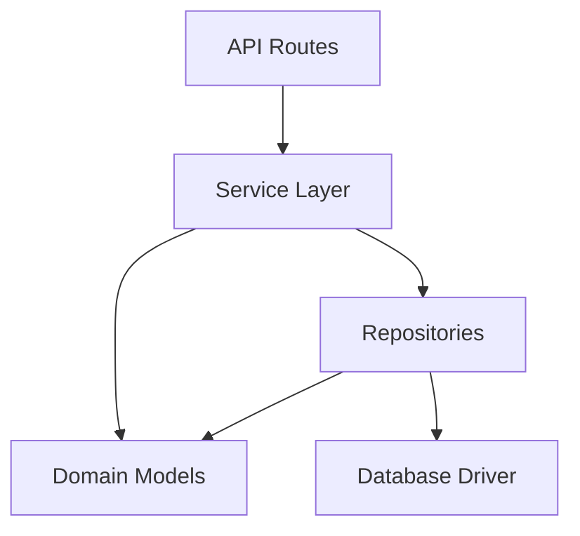
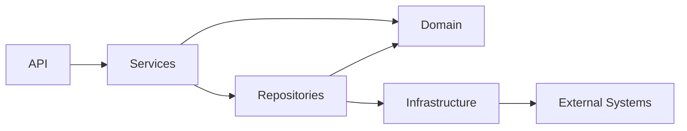

# 08- Modules and Imports

## Overview

A Python module is a unit of code organization, normally represented by a `.py` file. A package is a structured collection of modules, typically represented by a directory containing Python modules and, in modern Python, potentially an implicit namespace package without `__init__.py`.

Modules and imports provide the foundation for organizing production Python applications into maintainable boundaries.

A typical backend application may have:

```text
application/
├── api/
│   ├── routes.py
│   └── dependencies.py
├── services/
│   ├── orders.py
│   └── payments.py
├── repositories/
│   ├── orders.py
│   └── users.py
├── models/
│   └── order.py
├── config/
│   └── settings.py
└── main.py
```

Each Python file is a module, and imports connect these modules into an executable dependency graph.

Understanding imports at a senior level requires more than knowing `import foo`. Production systems must account for:

- Module namespaces
- Import resolution
- `sys.path`
- `sys.modules`
- Import caching
- Module initialization
- Import order
- Circular dependencies
- Package boundaries
- Absolute vs relative imports
- Runtime side effects
- Startup performance
- Plugin and dynamic import mechanisms
- Deployment and packaging behavior

A useful mental model is:

```text
Source Code
    |
    v
Import Statement
    |
    v
Find Module
    |
    v
Load / Execute Module
    |
    v
Cache in sys.modules
    |
    v
Bind Name in Importing Module
```

## Module Basics

A module is a Python source file containing definitions and executable statements.

For example:

```python
# pricing.py

from decimal import Decimal


def calculate_total(
    unit_price: Decimal,
    quantity: int,
) -> Decimal:
    return unit_price * quantity
```

Another module can import it:

```python
# orders.py

from pricing import calculate_total


total = calculate_total(
    Decimal("19.99"),
    3,
)
```

The module provides a namespace that separates its definitions from other modules.

## Module Namespace

Every loaded module has a namespace.

For:

```python
# pricing.py

DEFAULT_TAX_RATE = Decimal("0.20")


def calculate_total(...):
    ...
```

the module exposes names such as:

```text
pricing.DEFAULT_TAX_RATE
pricing.calculate_total
```

The namespace prevents every module from sharing one global namespace.

This improves:

- Encapsulation
- Name organization
- Dependency management
- Reuse
- Maintainability

## `import`

The basic import form is:

```python
import pricing
```

The module is then accessed through its module name:

```python
pricing.calculate_total(...)
```

This style makes the origin of a function explicit.

For larger applications, that explicitness can improve readability.

## `from ... import ...`

A specific name can be imported:

```python
from pricing import calculate_total
```

Then:

```python
calculate_total(...)
```

This is concise but removes the module qualifier at the call site.

Use it when the imported name is unambiguous and the dependency remains easy to understand.

## Import Aliases

Modules and imported names can be aliased:

```python
import datetime as dt
```

```python
from application.repositories import orders as order_repository
```

Aliases are useful when:

- A name conflicts with another symbol
- A module name is long
- A conventional alias exists
- Two modules have the same name

Avoid arbitrary aliases that make code harder to understand.

## Import Styles

| Style | Example | Advantage | Risk |
|---|---|---|---|
| Module import | `import pricing` | Clear namespace | Slightly more verbose |
| Direct import | `from pricing import calculate_total` | Concise | Name origin less obvious |
| Aliased module | `import datetime as dt` | Convenient | Can obscure meaning if abused |
| Wildcard | `from pricing import *` | Short | Namespace pollution |

Wildcard imports should generally be avoided in application code.

## Wildcard Imports

Avoid:

```python
from pricing import *
```

This makes it difficult to determine where names originated.

It can also cause:

- Name collisions
- Poor IDE support
- Difficult code review
- Unclear public APIs
- Unexpected behavior when module exports change

Prefer explicit imports:

```python
from pricing import calculate_total, calculate_discount
```

## Module Execution

A module contains executable code as well as definitions.

Consider:

```python
# config.py

print("Loading configuration")

DATABASE_URL = "..."
```

When `config` is imported for the first time, the module body executes.

This means importing a module can have side effects.

Avoid expensive or operationally significant work at module import time.

For example, avoid:

```python
# Avoid this pattern.

database_connection = connect_to_database()
load_large_dataset()
start_background_worker()
```

Importing the module now performs application initialization.

Prefer explicit initialization:

```python
def create_database_connection():
    return connect_to_database()
```

The caller controls when the operation occurs.

## `if __name__ == "__main__"`

A module can distinguish direct execution from importing.

```python
def main() -> None:
    print("Running application")


if __name__ == "__main__":
    main()
```

When executed directly:

```bash
python application.py
```

the condition is true.

When imported:

```python
import application
```

the condition is false.

This allows a module to be both reusable and executable.

## Module Identity

A loaded module has a name stored in `__name__`.

For example:

```python
print(__name__)
```

When imported as:

```python
import application.orders
```

the module's name is:

```text
application.orders
```

When executed directly, the module executed as the entry point normally has:

```text
__main__
```

This distinction is important for executable modules and import behavior.

## `sys.modules`

Python maintains a module cache in:

```python
import sys

print(sys.modules)
```

After a module has been successfully imported, its module object is normally stored in `sys.modules` under its fully qualified module name.

Conceptually:

```text
import pricing
     |
     v
Check sys.modules
     |
     +---- exists ----> reuse module
     |
     +---- missing ---> load and execute
                            |
                            v
                       sys.modules
```

This prevents normal repeated imports from re-executing the module body each time.

## Import Caching

Consider:

```python
import configuration
import configuration
```

The module is normally initialized only once per interpreter process.

The second import reuses the cached module object.

This is why module-level mutable state can behave like process-local shared state:

```python
# cache.py

items = {}
```

Every importer within that interpreter generally accesses the same module object.

This can be useful for carefully designed immutable configuration or process-local caches, but uncontrolled module state can create difficult concurrency and testing problems.

## Module Objects

Modules are objects.

```python
import pricing

print(type(pricing))
```

A module contains attributes corresponding to its namespace.

You can inspect them:

```python
print(pricing.__dict__)
```

Module attributes can technically be modified:

```python
pricing.some_runtime_value = 123
```

Although possible, mutating imported modules dynamically should be used carefully because it introduces hidden shared state.

## Import Resolution

When Python encounters:

```python
import application.services.orders
```

it must resolve the requested module.

Resolution depends on Python's import machinery and the configured import search path.

The effective search path can be inspected with:

```python
import sys

for path in sys.path:
    print(path)
```

It can contain entries corresponding to:

- The application context
- Environment-specific paths
- Installed packages
- Standard library locations
- Site-packages
- Paths added by the environment or launcher

Import resolution is therefore influenced by the runtime environment.

## `sys.path`

`sys.path` is a list of locations Python searches for importable modules.

Example:

```python
import sys

print("\n".join(sys.path))
```

A production application should generally avoid manipulating `sys.path` manually.

Avoid:

```python
import sys

sys.path.append("/some/random/directory")
```

This can create:

- Environment-specific behavior
- Import ambiguity
- Deployment inconsistencies
- Difficult debugging
- Security risks

Prefer proper package installation and predictable project layouts.

## Absolute Imports

Absolute imports specify the full package path:

```python
from application.services.orders import create_order
```

They are generally preferable in larger applications because the dependency location is explicit.

Example:

```text
application/
├── api/
│   └── routes.py
└── services/
    └── orders.py
```

From `routes.py`:

```python
from application.services.orders import create_order
```

## Relative Imports

Relative imports use dots:

```python
from ..services.orders import create_order
```

The number of dots determines how far upward Python moves through the package hierarchy.

Relative imports can be useful inside tightly coupled packages.

However, excessive relative imports can make dependencies harder to understand and can complicate execution of modules directly as scripts.

For larger backend systems, consistent absolute imports are often easier to maintain.

## Package Imports

Suppose:

```text
application/
├── __init__.py
├── services/
│   ├── __init__.py
│   └── orders.py
└── main.py
```

You can import:

```python
from application.services.orders import create_order
```

The package hierarchy becomes part of the module's fully qualified name.

```text
application
    |
    +-- services
            |
            +-- orders
```

This namespace structure helps organize large systems.

## `__init__.py`

A package may contain:

```text
application/services/__init__.py
```

Historically, `__init__.py` was required to make a directory a regular Python package.

Modern Python also supports namespace packages, where certain package directories can exist without `__init__.py`.

For ordinary application packages, `__init__.py` remains useful because it can:

- Explicitly identify a package
- Define package-level APIs
- Contain package metadata
- Support controlled re-exports

Keep it lightweight.

## Package Re-Exports

A package can expose selected names through `__init__.py`.

```python
# application/services/__init__.py

from .orders import create_order
from .users import create_user

__all__ = [
    "create_order",
    "create_user",
]
```

Consumers can then write:

```python
from application.services import create_order
```

This can create a clean public API.

However, excessive re-exporting can introduce hidden imports and circular dependencies.

Use package-level APIs deliberately.

## `__all__`

A module can define:

```python
__all__ = [
    "calculate_total",
    "calculate_discount",
]
```

This primarily controls what names are exported by wildcard imports and communicates intended public names.

It does not provide access control.

This:

```python
from pricing import calculate_total
```

still works regardless of whether the name appears in `__all__`.

Do not treat `__all__` as a security mechanism.

## Import Graphs

Imports create a directed dependency graph.

For example:



A healthy application generally has dependencies flowing toward lower-level infrastructure or stable domain abstractions.

Problems arise when modules depend on each other in cycles.

## Circular Imports

A circular import occurs when modules depend on each other during initialization.

Example:

```text
orders.py
    |
    v
payments.py
    |
    v
orders.py
```

For example:

```python
# orders.py

from payments import charge_payment
```

```python
# payments.py

from orders import Order
```

Depending on the exact initialization order, this can result in:

```text
ImportError
AttributeError
partially initialized module
```

Circular imports are usually a design signal rather than merely an import syntax problem.

## Why Circular Imports Happen

Common causes include:

- Bidirectional service dependencies
- Domain models importing services
- Utility modules importing application layers
- Excessive package-level re-exports
- Poor dependency boundaries
- Framework registration code mixed with domain logic

The best fix is usually to redesign the dependency graph.

## Breaking Circular Dependencies

One solution is moving shared concepts into a lower-level module.

Instead of:

```text
orders <--> payments
```

use:

```text
orders ----> contracts <---- payments
```

For example:

```text
application/
├── domain/
│   └── order.py
├── services/
│   ├── orders.py
│   └── payments.py
└── infrastructure/
```

Both services can depend on stable domain types without importing each other.

Other techniques include:

- Dependency inversion
- Shared protocol definitions
- Moving constants to dedicated modules
- Dependency injection
- Local imports when the dependency is genuinely runtime-specific

Local imports should be a deliberate technique, not a default fix for architectural problems.

## Local Imports

Python permits imports inside functions:

```python
def process_payment(order):
    from application.services.payments import charge_payment

    return charge_payment(order)
```

This can be useful when:

- A dependency is optional
- Importing it is expensive
- A dependency is only needed on a rare execution path
- A framework lifecycle requires deferred imports
- A circular dependency can be safely avoided

However, if used broadly, local imports can make dependencies difficult to discover.

Prefer fixing the architecture when possible.

## Import-Time Side Effects

Import-time side effects are particularly important in backend applications.

Avoid:

```python
# module.py

client = ExternalClient()
client.connect()
```

Importing the module now establishes an external connection.

This can cause problems with:

- CLI tools
- Unit tests
- Worker startup
- Kubernetes probes
- Application reloaders
- Serverless cold starts
- Dependency initialization order

Prefer explicit lifecycle management.

```python
def create_client() -> ExternalClient:
    return ExternalClient(...)
```

Then initialize it within the appropriate application lifecycle.

## Import-Time Configuration

Avoid reading complex configuration and performing validation with external effects during import:

```python
# Avoid expensive import-time initialization.

settings = load_remote_configuration()
database = connect(settings.database_url)
```

Instead:

```python
def create_settings() -> Settings:
    return load_configuration()


def create_database(settings: Settings):
    return connect(settings.database_url)
```

This makes startup behavior explicit and testable.

## Imports and Application Startup

A backend application's startup can involve hundreds or thousands of imports.

Conceptually:

```text
Process Start
    |
    v
main.py
    |
    +--> framework
    |
    +--> configuration
    |
    +--> routes
    |       |
    |       +--> services
    |               |
    |               +--> repositories
    |
    v
Application Ready
```

Import-time work contributes directly to startup latency.

This matters for:

- Kubernetes deployments
- Autoscaling
- Serverless functions
- CI test startup
- CLI commands
- Development reloaders

Keep imports lightweight and avoid unnecessary initialization during module import.

## Import Order

Python evaluates imports as part of module execution.

Consider:

```python
from application.config import settings
from application.database import database
from application.services.orders import order_service
```

If one imported module performs initialization that another module depends on, import order can become operationally significant.

A better design is to avoid relying on incidental import order.

Explicit application lifecycle management is more reliable.

## Imports and Dependency Direction

A common backend layering model is:

```text
API
 |
 v
Service
 |
 v
Repository
 |
 v
Infrastructure
```

Imports should generally reflect this direction.

Avoid:

```text
Repository --> API
```

because the lower layer now depends on the higher layer.

A dependency graph that consistently points toward stable abstractions is easier to test and evolve.

## Module Cohesion

A module should contain concepts that belong together.

Good:

```text
pricing.py
    calculate_total()
    calculate_discount()
    calculate_tax()
```

Less desirable:

```text
utils.py
    calculate_tax()
    parse_email()
    hash_password()
    format_currency()
    send_http_request()
    convert_datetime()
```

A giant `utils.py` often becomes a dependency dumping ground.

High cohesion makes imports more meaningful and reduces accidental coupling.

## Module Coupling

Every import creates a dependency.

If:

```python
from application.services.orders import create_order
```

is used throughout the application, many modules become coupled to the order service.

That may be appropriate.

However, if low-level modules import high-level services simply for convenience, architectural coupling increases.

Senior-level module design therefore considers the dependency graph, not just individual import statements.

## Public vs Private Module APIs

Python does not enforce module-level private access.

By convention, names beginning with `_` are treated as internal:

```python
def _normalize_identifier(value: str) -> str:
    ...
```

Public:

```python
def create_order(...):
    ...
```

Private:

```python
def _validate_internal_state(...):
    ...
```

This is a convention, not a security boundary.

Consumers can still import `_normalize_identifier`.

## Module Naming

Use lowercase module names with clear domain meaning:

```text
orders.py
payments.py
authentication.py
database.py
configuration.py
```

Avoid vague names such as:

```text
stuff.py
helpers.py
misc.py
common.py
utils.py
```

unless the module genuinely represents a small, stable shared utility boundary.

Good naming reduces the cognitive cost of imports.

## Module-Level Constants

Constants can be defined at module scope:

```python
DEFAULT_TIMEOUT_SECONDS = 5.0
MAX_BATCH_SIZE = 500
```

This is appropriate for immutable configuration-like values.

Do not assume that uppercase names are immutable.

Python does not enforce constant semantics.

## Module-Level Mutable State

Avoid unnecessary mutable state:

```python
CACHE = {}
```

Module-level state is process-local and shared among importers.

In a multi-worker deployment:

```text
Kubernetes Pod
├── Worker Process 1 -> CACHE A
├── Worker Process 2 -> CACHE B
└── Worker Process 3 -> CACHE C
```

The cache is not globally shared.

For shared state, use an appropriate external system such as Redis or a database.

This distinction is important for distributed backend systems.

## Modules and Multiprocessing

Each process has its own Python interpreter and module cache.

Therefore:

```python
# cache.py

cache = {}
```

does not create one cache shared across all processes.

With multiple workers:

```text
Process A
    |
    +--> sys.modules
    +--> cache

Process B
    |
    +--> sys.modules
    +--> cache
```

Each process has independent state.

This affects:

- Caches
- Metrics
- Configuration
- Connection pools
- Singleton-like objects
- In-memory locks

## Modules and Threads

Threads within the same process generally share the same module objects.

Therefore module-level mutable state can be shared across threads.

If:

```python
cache = {}
```

is mutated by multiple threads, synchronization may be required depending on the operations and application invariants.

Avoid treating module-level state as automatically thread-safe.

## Importing Third-Party Packages

Production dependencies should be declared through the project's dependency-management system rather than relying on manually configured paths.

For example:

```python
from fastapi import FastAPI
from pydantic import BaseModel
```

The package should be installed into the application's environment through the project's dependency configuration.

This supports reproducible builds and CI/CD deployments.

## Import Errors

A missing module may produce:

```text
ModuleNotFoundError
```

An importable module that lacks a requested name may produce:

```text
ImportError
```

Example:

```python
from pricing import missing_function
```

can result in an import-related error because the module exists but the requested name does not.

Distinguishing these failures helps diagnose packaging and dependency problems.

## Import Errors in Production

When an application fails during startup with:

```text
ModuleNotFoundError: No module named 'application'
```

investigate:

- Package installation
- Working directory
- Python interpreter
- Virtual environment
- Container image
- `PYTHONPATH`
- Package structure
- Build configuration

Do not immediately patch the issue by modifying `sys.path`.

A production deployment should have deterministic package resolution.

## Importing From the Wrong Environment

A common deployment problem is:

```bash
python
pip
```

pointing to different environments.

Verify:

```bash
python -c "import sys; print(sys.executable)"
```

and:

```bash
python -m pip --version
```

Using:

```bash
python -m pip install ...
```

helps ensure that `pip` corresponds to the selected Python interpreter.

## Module Discovery and Packaging

A source tree is not automatically equivalent to an installable package.

For production deployments, package structure should be compatible with the project's build and dependency configuration.

A typical modern layout is:

```text
project/
├── pyproject.toml
├── src/
│   └── application/
│       ├── __init__.py
│       ├── main.py
│       ├── api/
│       ├── services/
│       └── repositories/
└── tests/
```

The `src` layout can help prevent accidentally importing the source tree from the repository root instead of the installed package.

## Module Imports in Docker

A container should execute the application using a predictable package layout.

For example:

```dockerfile
WORKDIR /app

COPY pyproject.toml .
COPY src ./src

RUN pip install .

CMD ["uvicorn", "application.main:app", "--host", "0.0.0.0", "--port", "8000"]
```

The exact build depends on the project's packaging configuration.

The important principle is that the application should be installed or otherwise exposed through a deterministic runtime environment.

## Module Imports in Kubernetes

Kubernetes does not change Python's import semantics.

However, container startup behavior makes import design operationally important.

A pod may be restarted repeatedly if imports fail during startup:

```text
Pod Start
   |
   v
Python Process
   |
   v
Import Application
   |
   +---- failure ---> Process exits
                         |
                         v
                    Pod restarted
```

Import-time errors therefore become deployment failures.

Avoid unnecessary external operations during module initialization.

## Dynamic Imports

Python supports runtime imports through `importlib`.

```python
from importlib import import_module

module = import_module("application.plugins.orders")
```

Dynamic imports are useful for:

- Plugin systems
- Optional integrations
- Configurable adapters
- Framework discovery mechanisms

They should be used carefully because static tooling may have difficulty discovering dynamically loaded dependencies.

## Optional Dependencies

An optional integration can sometimes be loaded dynamically:

```python
from importlib import import_module


def load_metrics_backend():
    try:
        return import_module("optional_metrics_backend")
    except ModuleNotFoundError as exc:
        raise RuntimeError(
            "Metrics backend is not installed"
        ) from exc
```

Be careful not to catch a `ModuleNotFoundError` raised by code inside the imported module and incorrectly interpret it as the optional package itself being absent.

Validate optional dependency availability at an appropriate lifecycle boundary.

## Plugin Architectures

A plugin architecture may look like:

```text
Application
    |
    v
Plugin Registry
    |
    +--> Plugin A
    +--> Plugin B
    +--> Plugin C
```

Plugins can be discovered using explicit registration or import mechanisms.

For larger systems, prefer well-defined interfaces and controlled discovery rather than importing arbitrary module names from untrusted configuration.

## Security Considerations

Import paths can become security-sensitive when they are derived from untrusted input.

Never do this with raw user-controlled values:

```python
module_name = request.query_params["module"]

import_module(module_name)
```

This can expose arbitrary installed modules to application behavior.

If dynamic imports are required, use an allowlist:

```python
ALLOWED_PLUGINS = {
    "orders": "application.plugins.orders",
    "payments": "application.plugins.payments",
}
```

Then:

```python
module_path = ALLOWED_PLUGINS[plugin_name]
module = import_module(module_path)
```

Configuration should not automatically become executable code.

## Import Side Effects and Testing

Import-time side effects can make tests fragile.

For example:

```python
# Avoid:
database = create_connection()
```

at module scope.

Importing the module now requires a working database.

A unit test that only needs a helper function may fail before the test even starts.

Prefer dependency construction inside explicit application lifecycle code.

## Monkey Patching

Because modules are objects, tests can sometimes replace module attributes:

```python
module.external_client = fake_client
```

Frameworks such as `unittest.mock` provide more controlled patching mechanisms.

However, excessive monkey patching can indicate tight coupling.

Prefer dependency injection when practical.

## Import Performance

Import time contributes to application startup time.

Potential sources of slow imports include:

- Large dependency trees
- Expensive module-level initialization
- Heavy scientific libraries
- Plugin discovery
- Network or filesystem operations
- Excessive re-export chains

Measure before optimizing.

For startup-sensitive workloads, consider:

- Lazy imports where justified
- Removing unnecessary dependencies
- Moving expensive work out of module scope
- Reducing dependency chains
- Splitting large modules

Do not optimize imports by sacrificing architectural clarity without evidence.

## Import Cycles in Large Applications

As a codebase grows:

```text
API
 |
 v
Service
 |
 v
Repository
 |
 v
Model
 |
 +----> Service
```

can gradually become:

```text
A --> B --> C --> D
^              |
|--------------|
```

The resulting cycle may not be obvious from any single file.

Useful practices include:

- Layered architecture
- Dependency rules
- Static analysis
- Architecture tests
- Clear package ownership
- Stable domain abstractions

Import graphs should be reviewed as architectural dependencies, not merely Python syntax.

## Dependency Inversion and Imports

Suppose a service depends directly on a concrete payment provider:

```python
from application.infrastructure.stripe_client import StripeClient
```

The service is now tightly coupled to infrastructure.

A stronger design may depend on an abstraction:

```python
from application.domain.payment import PaymentGateway
```

Then infrastructure implements the required behavior.

Conceptually:

```text
Service
   |
   v
PaymentGateway
   ^
   |
StripeClient
```

This reduces coupling and improves testability.

The exact implementation may use protocols, abstract base classes, or dependency-injection mechanisms.

## Import Boundaries in Microservices

In a microservice architecture, Python imports exist only within a process and deployment unit.

A service should not attempt to import another service's internal Python module:

```text
Order Service
    |
    X--> import payment_service.internal
```

Services communicate through explicit interfaces such as:

- REST
- gRPC
- Kafka
- Other messaging systems

The correct boundary is:

```text
Order Service
    |
    | HTTP/gRPC/event
    v
Payment Service
```

Imports represent in-process dependencies; network calls represent service boundaries.

Confusing the two leads to tightly coupled distributed systems.

## Recommended Project Structure

A production Python application might use:

```text
application/
├── __init__.py
├── main.py
├── config/
│   ├── __init__.py
│   └── settings.py
├── api/
│   ├── __init__.py
│   ├── dependencies.py
│   └── routes/
│       ├── __init__.py
│       ├── users.py
│       └── orders.py
├── domain/
│   ├── __init__.py
│   ├── user.py
│   └── order.py
├── services/
│   ├── __init__.py
│   ├── users.py
│   └── orders.py
├── repositories/
│   ├── __init__.py
│   ├── users.py
│   └── orders.py
└── infrastructure/
    ├── __init__.py
    ├── database.py
    ├── redis.py
    └── messaging.py
```

A reasonable dependency direction is:



The exact structure should follow the application's domain and team conventions rather than becoming a rigid template.

## Common Mistakes and Pitfalls

### Modifying `sys.path`

Manually changing `sys.path` often hides packaging problems.

Prefer proper package installation and environment configuration.

### Wildcard Imports

Avoid:

```python
from module import *
```

because the resulting namespace is difficult to reason about.

### Circular Imports

Treat circular imports as a dependency-design problem first.

### Heavy Import-Time Work

Do not establish database connections, make HTTP calls, load huge datasets, or start workers merely because a module was imported.

### Global Mutable State

Module-level dictionaries and caches are process-local shared state.

Do not assume they are shared across Kubernetes pods or worker processes.

### Overusing `__init__.py`

Package-level re-exports can make APIs cleaner, but excessive re-exporting can hide dependency relationships and create circular imports.

### Running Package Modules Incorrectly

A module using package-relative imports may fail when executed directly:

```bash
python application/services/orders.py
```

because its package context may not be established as expected.

Prefer executing the application through its package/module entry point when appropriate:

```bash
python -m application.services.orders
```

### Importing the Wrong Package

A local module can shadow a standard-library or third-party module.

For example:

```text
project/
├── json.py
└── application.py
```

may interfere with:

```python
import json
```

Avoid naming application modules after commonly imported packages.

### Dependency Injection Through Globals

Avoid creating globally shared clients merely because importing them is convenient.

Explicit lifecycle management is usually easier to test and operate.

### Catching Import Errors Too Broadly

Avoid:

```python
try:
    import optional_package
except ModuleNotFoundError:
    optional_package = None
```

without checking which module actually failed.

An internal missing dependency inside `optional_package` could be incorrectly treated as the package being absent.

## Interview Traps

### What Happens When Python Imports a Module?

Conceptually, Python:

1. Resolves the module through the import system.
2. Checks whether it is already cached in `sys.modules`.
3. Loads and initializes it if necessary.
4. Executes its module-level code.
5. Stores the initialized module in `sys.modules`.
6. Binds the imported name in the importing module.

The exact process involves import finders, loaders, module specifications, and import machinery.

### Why Does Importing a Module Twice Usually Not Execute It Twice?

Because the initialized module is normally cached in `sys.modules` and subsequent imports reuse it.

### Are Modules Objects?

Yes.

A module is an object with attributes representing its namespace.

### What Is the Difference Between `import module` and `from module import name`?

With:

```python
import module
```

the caller normally accesses:

```python
module.name
```

With:

```python
from module import name
```

the name is bound directly in the importing module.

### What Is `sys.modules`?

It is the interpreter's cache of loaded module objects, keyed by module name.

### What Causes Circular Imports?

Usually a dependency graph containing a cycle:

```text
A -> B -> A
```

The problem often appears during module initialization when one module expects another to have already defined a name.

### Does `__init__.py` Make a Directory a Package?

It makes the directory a regular package and can contain package initialization code. Modern Python also supports namespace packages without `__init__.py`.

### Are Underscore-Prefixed Module Names Private?

No.

Names beginning with `_` communicate an internal convention but do not enforce access restrictions.

### Are Module-Level Variables Shared Between Processes?

No.

Each Python process has its own interpreter and module objects.

### Why Can a Module-Level Singleton Behave Differently in Production?

Because a deployment may contain multiple worker processes or containers.

Each process can have its own independently initialized module state.

### Why Can Import-Time Code Break Kubernetes Deployments?

If module initialization fails, the Python process may exit before the application becomes ready, causing the container to restart repeatedly.

## Production Checklist

Before introducing or reorganizing modules, evaluate:

| Concern | Question |
|---|---|
| Responsibility | Does this module have a coherent purpose? |
| Dependencies | Are imports flowing in an intentional direction? |
| Cycles | Could this introduce a circular dependency? |
| Initialization | Does import execute expensive or side-effecting code? |
| State | Is module-level mutable state really appropriate? |
| Packaging | Will the module resolve correctly in CI and production? |
| Testing | Can the module be imported without external infrastructure? |
| Runtime | Does startup time matter for this application? |
| Security | Are dynamic imports controlled by an allowlist? |
| Deployment | Will behavior remain correct across workers and containers? |
| API | Are public module names intentionally exposed? |
| Boundaries | Is this dependency in-process or should it be a service boundary? |

## Best Practices

- Keep modules cohesive and focused around a meaningful responsibility.
- Prefer explicit, predictable import paths.
- Use absolute imports consistently in larger applications unless relative imports provide a clear benefit.
- Avoid wildcard imports.
- Keep `__init__.py` lightweight.
- Treat circular imports as architecture problems rather than simply import syntax problems.
- Avoid expensive work and external side effects during module initialization.
- Keep module-level mutable state to a minimum.
- Remember that module state is shared within a process but not across processes or containers.
- Use proper packaging and dependency management instead of modifying `sys.path`.
- Use dependency injection and explicit lifecycle management for database clients, HTTP clients, Redis clients, and other infrastructure resources.
- Use dynamic imports only when runtime extensibility or optional dependencies justify them.
- Never derive arbitrary import paths directly from untrusted input.
- Keep service boundaries explicit: use REST, gRPC, Kafka, or another network/message boundary rather than importing another microservice's code.
- Design imports according to architectural dependency direction.
- Measure import/startup performance before introducing lazy-loading complexity.
- Test modules without requiring unnecessary external infrastructure during import.
- Use `python -m package.module` when package context is required.
- Treat import behavior as part of application startup and deployment design, not merely source-code organization.

## Key Takeaways

- Modules provide namespaces and organizational boundaries, while imports connect modules into the application's dependency graph.
- Python normally caches initialized modules in `sys.modules`, so module-level state is shared within a process but remains independent across processes and containers.
- Import-time execution matters operationally: expensive work, external connections, and side effects can increase startup latency or cause production startup failures.
- Circular imports and excessive coupling are usually architectural problems best solved through dependency direction, cohesive modules, dependency inversion, and explicit abstractions.
- Production Python applications should use deterministic packaging, explicit imports, controlled dynamic loading, minimal module-level state, and clear boundaries between in-process dependencies and distributed services.