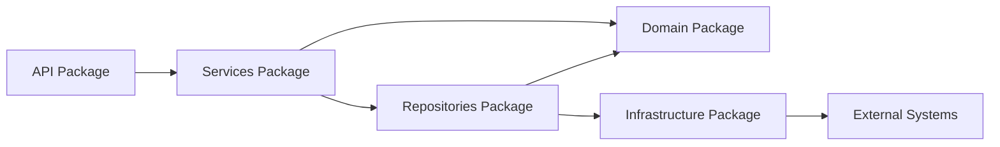
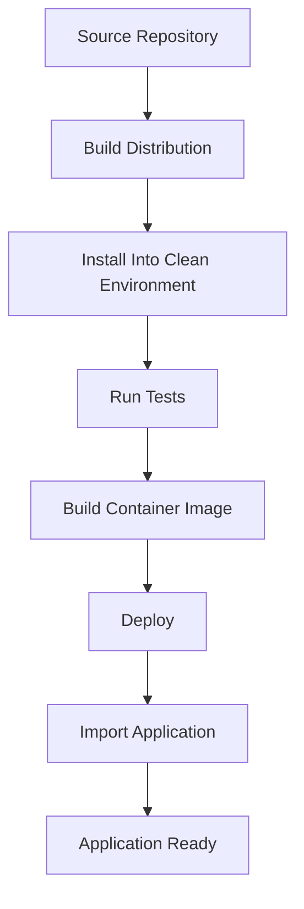

# 09- Packages

## Overview

A Python package is a namespace used to organize related modules into a larger, maintainable codebase. Packages are the foundation for structuring backend applications, reusable libraries, internal platform components, and third-party distributions.

A module is typically one `.py` file:

```text
orders.py
```

A package groups modules:

```text
orders/
├── __init__.py
├── models.py
├── service.py
├── repository.py
└── validation.py
```

A larger application can contain nested packages:

```text
application/
├── api/
├── domain/
├── services/
├── repositories/
└── infrastructure/
```

Packages provide more than directory organization. They define import namespaces, influence dependency boundaries, support distribution and installation, and determine how application code is discovered at runtime.

A useful mental model is:

```text
Package
   |
   +-- Module
   |
   +-- Module
   |
   +-- Subpackage
          |
          +-- Module
```

For production Python systems, package design should consider:

- Namespace organization
- Import paths
- Dependency direction
- Public APIs
- Package initialization
- Distribution
- Versioning
- Dependency management
- Testing
- Deployment
- Plugin discovery
- Circular dependencies
- Namespace collisions

## Package vs Module

The distinction is fundamental.

| Concept | Typical Representation | Purpose |
|---|---|---|
| Module | `orders.py` | Defines code within one namespace |
| Regular package | `orders/` with `__init__.py` | Groups related modules |
| Namespace package | Package directory without `__init__.py` | Allows portions of a package namespace to be distributed across locations |
| Distribution | Installable project artifact | Packages application/library code for installation and deployment |

A package can contain modules and subpackages.

```text
application/
├── __init__.py
├── api/
│   ├── __init__.py
│   └── routes.py
└── services/
    ├── __init__.py
    └── orders.py
```

Here:

```text
application
application.api
application.api.routes
application.services
application.services.orders
```

are importable names when the package is correctly installed and discoverable.

## Regular Packages

A traditional Python package contains `__init__.py`.

```text
application/
├── __init__.py
├── users.py
└── orders.py
```

The package can be imported:

```python
import application
```

And modules can be imported:

```python
from application import users
```

or:

```python
from application.orders import create_order
```

The package establishes the namespace:

```text
application
    |
    +-- users
    |
    +-- orders
```

## `__init__.py`

`__init__.py` is executed when the corresponding regular package is initialized.

For example:

```python
# application/__init__.py

__version__ = "1.0.0"
```

Then:

```python
import application

print(application.__version__)
```

`__init__.py` can be used for:

- Package metadata
- Controlled re-exports
- Package-level initialization
- Defining a small public API

Keep package initialization lightweight.

Avoid performing external operations such as:

```python
# Avoid.

database.connect()
redis.connect()
load_remote_configuration()
start_background_worker()
```

Simply importing the package should not unexpectedly connect to infrastructure or start application behavior.

## Namespace Packages

Modern Python supports namespace packages that do not require `__init__.py`.

For example:

```text
company/
├── orders/
│   └── ...
└── payments/
    └── ...
```

Different distributions can contribute portions of the same top-level namespace.

Conceptually:

```text
company
   |
   +-- orders
   |
   +-- payments
```

Namespace packages are useful for large ecosystems and independently distributed components.

For most standalone backend applications, regular packages with explicit package structure remain easier to understand and operate.

## Importing From Packages

Given:

```text
application/
├── __init__.py
├── services/
│   ├── __init__.py
│   └── orders.py
└── main.py
```

`main.py` can use:

```python
from application.services.orders import create_order
```

This is an absolute import.

The fully qualified module path is:

```text
application.services.orders
```

Explicit package paths make architectural dependencies visible.

## Absolute Imports

Absolute imports start from the package root.

```python
from application.services.orders import create_order
from application.repositories.users import UserRepository
```

They are generally easier to understand in larger backend systems because the source package is explicit.

Advantages:

- Clear dependency location
- Easier navigation
- Easier refactoring
- Less ambiguity
- Better readability in large projects

## Relative Imports

Relative imports reference the current package hierarchy.

Given:

```text
application/
├── services/
│   ├── __init__.py
│   └── orders.py
└── repositories/
    ├── __init__.py
    └── orders.py
```

A relative import could be:

```python
from ..repositories.orders import OrderRepository
```

The number of leading dots controls how far upward Python moves through the package hierarchy.

Relative imports can be appropriate for tightly coupled internal package components.

However, excessive relative imports can make large dependency graphs harder to understand.

## Absolute vs Relative Imports

| Approach | Example | Best Use |
|---|---|---|
| Absolute | `from application.services.orders import create_order` | Large applications and explicit dependencies |
| Relative | `from ..repositories.orders import OrderRepository` | Internal package relationships |
| Local import | `from application.foo import bar` inside a function | Deferred/optional dependencies or carefully managed cycles |

Consistency matters more than using one style mechanically.

## Package Initialization and Import Order

Package imports execute initialization code.

Consider:

```text
application
    |
    v
services
    |
    v
repositories
```

If package initialization contains side effects, importing a high-level package can indirectly execute a large amount of code.

Avoid designs where correctness depends on a particular incidental import sequence.

Prefer explicit application initialization:

```python
def create_app() -> FastAPI:
    settings = load_settings()
    database = create_database(settings)
    return build_application(settings, database)
```

This separates package discovery from runtime initialization.

## Package Public API

A package can expose a stable public API through `__init__.py`.

For example:

```python
# application/services/__init__.py

from .orders import create_order
from .users import create_user

__all__ = [
    "create_order",
    "create_user",
]
```

Consumers can then write:

```python
from application.services import create_order
```

instead of:

```python
from application.services.orders import create_order
```

This can provide a stable abstraction over internal module organization.

## Re-Exports

Re-exporting can decouple consumers from internal file layout.

Suppose the implementation changes from:

```text
services/orders.py
```

to:

```text
services/order_creation.py
```

If the package continues exposing:

```python
from application.services import create_order
```

consumers may not need to change.

This is useful for public libraries and stable internal APIs.

However, excessive re-exporting can:

- Hide dependency relationships
- Increase import complexity
- Create circular imports
- Slow package initialization
- Make ownership unclear

Expose only intentionally public names.

## `__all__`

A package or module can define:

```python
__all__ = [
    "create_order",
    "cancel_order",
]
```

This communicates the intended public surface and controls wildcard import behavior.

It does not enforce privacy or access control.

Python code can still access other module attributes if it can import the module.

## Package Structure for Backend Applications

A production backend might use:

```text
application/
├── __init__.py
├── main.py
├── api/
│   ├── __init__.py
│   ├── dependencies.py
│   └── routes/
│       ├── __init__.py
│       ├── users.py
│       └── orders.py
├── domain/
│   ├── __init__.py
│   ├── user.py
│   └── order.py
├── services/
│   ├── __init__.py
│   ├── users.py
│   └── orders.py
├── repositories/
│   ├── __init__.py
│   ├── users.py
│   └── orders.py
└── infrastructure/
    ├── __init__.py
    ├── database.py
    ├── redis.py
    └── messaging.py
```

A reasonable dependency direction is:



The package structure should reflect actual architectural boundaries rather than merely grouping files by technical type.

## Domain-Oriented Packages

Larger systems may benefit from organizing around business domains:

```text
application/
├── users/
│   ├── domain.py
│   ├── service.py
│   ├── repository.py
│   └── api.py
├── orders/
│   ├── domain.py
│   ├── service.py
│   ├── repository.py
│   └── api.py
└── payments/
    ├── domain.py
    ├── service.py
    ├── repository.py
    └── api.py
```

This can reduce cross-package coupling compared with a purely technical structure:

```text
models/
services/
repositories/
controllers/
```

Neither structure is universally correct.

Choose based on:

- Domain complexity
- Team ownership
- Change frequency
- Dependency boundaries
- Deployment boundaries

## Packages and Dependency Direction

Packages should have intentional dependency relationships.

A problematic structure:

```text
services
   |
   v
repositories
   |
   v
services
```

creates a cycle.

A healthier structure might be:

```text
services
   |
   +--> domain
   |
   +--> repositories
           |
           v
      infrastructure
```

Stable lower-level abstractions should not depend on high-level application orchestration merely for convenience.

## Circular Package Dependencies

Circular dependencies can occur at the package level even when individual modules appear reasonable.

For example:

```text
orders package
    |
    v
payments package
    |
    v
orders package
```

This often indicates that shared domain concepts or abstractions belong in a lower-level package.

Possible solutions include:

- Extracting shared types
- Dependency inversion
- Introducing protocols
- Moving constants to a neutral package
- Injecting dependencies
- Redesigning package ownership

Do not solve every circular import by moving imports inside functions. That can hide the underlying architecture problem.

## Package Boundaries and Microservices

Packages represent in-process boundaries.

Microservices represent deployment and network boundaries.

For example:

```text
Order Service
├── api/
├── services/
├── repositories/
└── domain/

Payment Service
├── api/
├── services/
├── repositories/
└── domain/
```

The order service should not import:

```python
from payment_service.internal import PaymentProcessor
```

if payment processing belongs to another deployed service.

Instead:

```text
Order Service
      |
      | REST / gRPC / Kafka
      v
Payment Service
```

A package import means code runs inside the same Python process.

A REST/gRPC/message interaction means communication occurs across a system boundary.

## Packages and Django

Django applications are commonly structured as Python packages.

For example:

```text
orders/
├── __init__.py
├── admin.py
├── apps.py
├── models.py
├── migrations/
├── tests/
└── views.py
```

Django discovers application configuration through its package structure.

For larger applications, additional internal modules can be introduced:

```text
orders/
├── api/
├── domain/
├── services/
├── repositories/
├── models.py
└── apps.py
```

Keep Django-specific framework concerns separate from domain logic when the application complexity justifies it.

## Packages and FastAPI

FastAPI applications commonly organize routes into packages:

```text
application/
├── main.py
└── api/
    ├── __init__.py
    └── routes/
        ├── __init__.py
        ├── users.py
        └── orders.py
```

The application can import routers explicitly:

```python
from fastapi import FastAPI

from application.api.routes.orders import router as orders_router
from application.api.routes.users import router as users_router


def create_app() -> FastAPI:
    app = FastAPI()

    app.include_router(orders_router)
    app.include_router(users_router)

    return app
```

This makes route registration explicit and keeps the entry point manageable.

## `src` Layout

A common package layout for distributable or production applications is:

```text
project/
├── pyproject.toml
├── src/
│   └── application/
│       ├── __init__.py
│       ├── main.py
│       ├── api/
│       ├── services/
│       └── repositories/
└── tests/
```

The `src` layout separates source code from the repository root.

One practical benefit is that tests are less likely to accidentally import an uninstalled source tree instead of the package installed into the environment.

This can expose packaging problems earlier in CI.

## Package Installation

A production package should be installed into the Python environment rather than relying on the current working directory.

For example:

```bash
python -m pip install .
```

For editable development:

```bash
python -m pip install -e .
```

The exact behavior depends on the project's packaging configuration.

The important principle is:

> The code executed in production should be discoverable through the same packaging model that CI and deployment use.

## `pyproject.toml`

Modern Python projects commonly centralize build-system and project metadata in `pyproject.toml`.

A simplified example:

```toml
[build-system]
requires = ["setuptools>=75"]
build-backend = "setuptools.build_meta"

[project]
name = "backend-application"
version = "1.0.0"
requires-python = ">=3.12"
dependencies = [
    "fastapi",
    "uvicorn",
]
```

The exact build backend may instead be Poetry, Hatchling, PDM, or another supported tool.

The package configuration should define what source packages are included in the built artifact.

## Distribution vs Package

These concepts are frequently confused.

A **package** is an importable Python namespace.

A **distribution** is an installable artifact/project distributed through package indexes or other mechanisms.

For example:

```text
Distribution:
    backend-application

Contains:
    application/
        __init__.py
        main.py
        services/
```

After installation:

```python
import application
```

The distribution name and import package name do not have to be identical.

For example, a project can have:

```text
Distribution: backend-application
Import package: application
```

This distinction is important when diagnosing dependency and installation issues.

## Package Metadata

Packages and distributions can expose metadata such as:

- Version
- Project name
- Dependencies
- Python compatibility
- License
- Authors
- Entry points

Applications should generally obtain project metadata through packaging metadata rather than hard-coding assumptions in multiple places.

## Versioning

Reusable packages need a versioning strategy.

For internal packages, versioning can communicate compatibility expectations.

For public libraries, semantic versioning is commonly used:

```text
MAJOR.MINOR.PATCH
```

For example:

```text
2.4.1
```

The precise compatibility policy should be documented rather than assumed.

Application deployments often pin or constrain dependencies through lock files or equivalent dependency-management mechanisms.

## Dependency Management

Packages may depend on external packages:

```text
application
   |
   +--> FastAPI
   +--> Pydantic
   +--> PostgreSQL driver
   +--> Redis client
```

Dependencies should be declared explicitly.

Avoid relying on packages that happen to be installed transitively.

For example, if your application imports:

```python
import redis
```

then the project should explicitly declare its Redis client dependency rather than assuming another dependency will install it.

## Transitive Dependencies

If:

```text
Application
    |
    v
Library A
    |
    v
Library B
```

the application receives `Library B` transitively.

But if application code directly imports `Library B`:

```python
from library_b import something
```

then `Library B` should generally be an explicit application dependency.

This makes dependency ownership clear and reduces surprises when Library A changes its dependencies.

## Dependency Conflicts

Two packages may require incompatible versions:

```text
Application
├── Library A -> Dependency X >= 2
└── Library B -> Dependency X < 2
```

The dependency resolver may reject the environment or select a version according to the declared constraints.

Production dependency management should therefore include:

- Reproducible builds
- Version constraints
- Locking where appropriate
- Dependency auditing
- Regular upgrades
- CI validation

## Package Imports and Virtual Environments

Packages are installed into a Python environment.

Verify the active interpreter:

```bash
python -c "import sys; print(sys.executable)"
```

Verify package installation:

```bash
python -m pip show fastapi
```

Using:

```bash
python -m pip
```

helps ensure that package installation occurs for the selected Python interpreter.

This is particularly important when multiple Python installations exist on a developer machine or CI runner.

## Package Imports in Docker

A production image should install the application package and its dependencies deterministically.

Example:

```dockerfile
WORKDIR /app

COPY pyproject.toml .
COPY src ./src

RUN python -m pip install .

CMD ["uvicorn", "application.main:app", "--host", "0.0.0.0", "--port", "8000"]
```

The exact build process depends on the project's packaging tool.

Avoid relying on:

```dockerfile
ENV PYTHONPATH=/some/local/path
```

as a substitute for correct packaging unless there is a specific, well-understood reason.

## Package Imports in CI/CD

CI should validate that the application works from a clean environment.

A useful flow is:

```text
Source
  |
  v
Build
  |
  v
Create clean environment
  |
  v
Install package
  |
  v
Run tests
  |
  v
Build deployment artifact
```

This catches:

- Missing package configuration
- Undeclared dependencies
- Incorrect import paths
- Missing package files
- Circular imports
- Environment-specific assumptions

## Package Discovery

Build tools must know which packages belong in the distribution.

A project may contain:

```text
src/
├── application/
├── application_cli/
└── tests/
```

The build configuration should include application packages but normally exclude test-only code from the production distribution.

Incorrect package discovery can produce a build that succeeds but fails at runtime because required modules were not included.

## Namespace Collisions

Avoid generic top-level package names such as:

```text
utils/
common/
config/
helpers/
```

A project package should have a distinctive namespace.

Prefer:

```text
company_backend/
```

or:

```text
orders_service/
```

where appropriate.

Generic names increase the chance of collisions with:

- Standard-library modules
- Third-party packages
- Another application package
- Development tooling

## Package Name vs Directory Name

The filesystem directory normally corresponds to the import package name:

```text
application/
```

becomes:

```python
import application
```

But distribution names can differ.

For example:

```text
Distribution:
company-orders-service

Import package:
orders_service
```

Do not assume that the name used in `pip install` is necessarily the name used in `import`.

## Package-Level State

Packages can contain mutable module state:

```python
# application/cache.py

cache: dict[str, object] = {}
```

This state is process-local.

In a Kubernetes deployment:

```text
Pod A
    |
    +--> Python process
            |
            +--> cache A

Pod B
    |
    +--> Python process
            |
            +--> cache B
```

Do not use package-level memory as a substitute for shared infrastructure such as Redis or PostgreSQL.

## Package Initialization and Workers

Suppose a package creates a client during import:

```python
# application/database/__init__.py

connection = create_connection()
```

A multi-worker server may initialize separate connections in each process.

```text
Gunicorn
├── Worker 1 -> connection 1
├── Worker 2 -> connection 2
└── Worker 3 -> connection 3
```

This can be desirable for connection pools if intentionally designed, but accidental initialization can exhaust database connection limits.

Connection pool sizing must account for:

```text
workers × pool size
```

and any additional processes or services sharing the database.

## Package-Level Singletons

A module-level singleton is singleton-like only within a Python process.

For example:

```python
client = RedisClient(...)
```

does not imply one client across:

- Processes
- Pods
- Containers
- Hosts

This distinction is essential when designing distributed systems.

## Dynamic Package Imports

Packages can be loaded dynamically with `importlib`.

```python
from importlib import import_module

plugin = import_module("application.plugins.orders")
```

This can support plugin systems.

For security-sensitive systems, never construct arbitrary module paths from untrusted input.

Prefer an allowlist:

```python
PLUGINS = {
    "orders": "application.plugins.orders",
    "payments": "application.plugins.payments",
}
```

Then:

```python
module = import_module(PLUGINS[plugin_name])
```

## Package Entry Points

Python packaging supports entry points for discovering or exposing application integrations.

They can be useful for:

- CLI commands
- Plugin systems
- Framework extensions
- Tool integrations

For example, a distribution can expose a CLI command that invokes a Python function.

The exact configuration depends on the build backend, but the architectural benefit is that discovery can be driven by installed package metadata rather than hard-coded import paths.

## CLI Applications and Packages

A package can provide a command-line entry point.

Conceptually:

```text
Installed Package
      |
      v
CLI Entry Point
      |
      v
application.cli:main
```

The CLI implementation can remain inside the package:

```python
def main() -> int:
    ...
    return 0
```

This makes CLI behavior testable and reusable.

## Packages and Testing

Tests should generally import the package as consumers would.

For a `src` layout:

```text
project/
├── src/
│   └── application/
└── tests/
    ├── unit/
    └── integration/
```

Avoid tests that depend on accidentally running from the repository root.

A clean CI environment should install the package before testing:

```bash
python -m pip install -e .
pytest
```

or install the built artifact when validating production packaging.

## Package-Level Test Boundaries

A package can be tested at several levels:

```text
Package
├── Unit tests
│   └── Individual functions/classes
├── Integration tests
│   └── Package + infrastructure
└── Contract tests
    └── Public package behavior
```

For reusable libraries, public package APIs should receive particular attention because consumers may depend on stable import paths.

## Import Cycles and Testing

Tests can expose circular imports because test modules often import components in different orders than production startup.

If:

```text
application.services
    |
    v
application.models
    |
    v
application.services
```

works only under a particular import sequence, the package design is fragile.

Keep package dependencies acyclic where practical.

## Package Security

Package management is part of the application's software supply chain.

Production systems should consider:

- Dependency provenance
- Dependency pinning or controlled version ranges
- Vulnerability scanning
- Lock files where appropriate
- Trusted package indexes
- Build artifact integrity
- Automated dependency updates
- Review of dependency changes

Do not install arbitrary packages into production environments simply because they appear to solve a small problem.

Every dependency increases:

- Attack surface
- Maintenance cost
- Upgrade complexity
- Supply-chain exposure

## Package Namespace Security

Dynamic package loading must be controlled.

Avoid:

```python
module = import_module(user_supplied_module_name)
```

Use explicit mappings or validated identifiers:

```python
ALLOWED_MODULES = {
    "orders": "application.plugins.orders",
    "payments": "application.plugins.payments",
}
```

The package namespace should never become an implicit execution interface for untrusted input.

## Reliability and Deployment

Package initialization should be deterministic.

A production deployment should not depend on:

- Developer working directories
- Undocumented `PYTHONPATH` settings
- Locally installed packages
- Import-time network access
- Import order accidents
- Untracked transitive dependencies

A robust deployment flow is:



This makes packaging part of the deployment contract.

## Startup Performance

Package import time contributes to application startup.

Large dependency graphs can make:

- Kubernetes rollouts slower
- Autoscaling slower
- Serverless cold starts slower
- CLI startup slower
- Test suites slower

Measure before optimizing.

Potential improvements include:

- Removing unnecessary dependencies
- Keeping `__init__.py` lightweight
- Avoiding import-time I/O
- Deferring genuinely optional imports
- Splitting oversized packages
- Reducing unnecessary re-export chains

Do not introduce complex lazy-loading solely to optimize an unmeasured startup problem.

## Package Architecture in a Production Backend

A practical service might look like:

```text
src/
└── order_service/
    ├── __init__.py
    ├── main.py
    ├── api/
    │   ├── __init__.py
    │   └── routes/
    │       ├── __init__.py
    │       └── orders.py
    ├── domain/
    │   ├── __init__.py
    │   └── orders.py
    ├── services/
    │   ├── __init__.py
    │   └── orders.py
    ├── repositories/
    │   ├── __init__.py
    │   └── orders.py
    └── infrastructure/
        ├── __init__.py
        ├── database.py
        ├── redis.py
        └── kafka.py
```

The runtime flow could be:

```text
HTTP Request
     |
     v
API Package
     |
     v
Service Package
     |
     +----> Domain Package
     |
     +----> Repository Package
                |
                v
        Infrastructure Package
                |
        +-------+-------+
        |       |       |
        v       v       v
    PostgreSQL Redis   Kafka
```

This creates clear boundaries while keeping all components inside one deployable process.

## When to Split a Package

Do not split packages merely because a directory becomes large.

A meaningful package boundary often corresponds to:

- A domain capability
- A stable API
- A team ownership boundary
- A dependency boundary
- A reusable component
- A separate deployment concern

A package should have a reason to exist beyond reducing the number of files in one directory.

## Common Mistakes and Pitfalls

### Treating a Package as Only a Directory

A package participates in Python's import and namespace system.

Its initialization, import paths, metadata, and dependencies all matter.

### Heavy `__init__.py`

Avoid putting expensive initialization in package imports.

### Circular Package Dependencies

Treat cycles as architectural problems.

### Overusing Re-Exports

Re-export only stable, intentionally public APIs.

### Confusing Distribution Names With Import Names

The name installed through the package manager does not necessarily equal the name used in `import`.

### Relying on `PYTHONPATH`

Do not use environment path manipulation as a replacement for proper packaging.

### Undeclared Dependencies

If application code imports a package directly, declare that dependency explicitly.

### Generic Package Names

Names such as `common`, `utils`, and `config` can become collision and coupling hotspots.

### Global Package State

Module/package state is local to a Python process and is not a distributed shared store.

### Import-Time External Connections

Do not connect to PostgreSQL, Redis, Kafka, or external APIs merely because a package was imported.

### Fixing Architecture With Local Imports

Moving an import inside a function can break an immediate circular import but may leave the underlying dependency cycle intact.

### Assuming Namespace Packages Are Always Better

Namespace packages solve specific distribution and organizational problems. Most application code does not need them.

## Interview Traps

### What Is the Difference Between a Module and a Package?

A module is typically one Python source file representing a namespace.

A package is a namespace that organizes modules and subpackages.

### Is `__init__.py` Required for Every Package?

No.

Modern Python supports namespace packages without `__init__.py`.

Regular application packages commonly still use `__init__.py` because it provides explicit package initialization and a convenient place for carefully controlled exports.

### What Happens When a Package Is Imported?

Python resolves the package through its import machinery and initializes the relevant package/module objects. For regular packages, `__init__.py` is executed during package initialization.

### What Is the Difference Between a Package and a Distribution?

A package is an importable Python namespace.

A distribution is an installable project artifact containing packages and metadata.

They can have different names.

### Can a Package Have Mutable State?

Yes.

Package modules can contain mutable objects, but that state is shared only within the Python process.

### Is a Package-Level Singleton Global Across Kubernetes Pods?

No.

Each process has its own module objects and package state.

### Why Are Circular Imports Dangerous?

They can cause partially initialized modules and import failures, and they often indicate undesirable architectural coupling.

### Why Use a `src` Layout?

It separates source code from the repository root and helps detect packaging mistakes where tests or tools accidentally import source files without installing the package.

### Can Two Distributions Share a Package Namespace?

Yes, through namespace packages.

This is useful for large ecosystems where multiple distributions contribute modules under one namespace.

### Does `__all__` Make Package Members Private?

No.

`__all__` communicates intended exports and affects wildcard imports. It is not an access-control mechanism.

### Why Should Package Initialization Be Lightweight?

Because importing a package can happen during application startup, test discovery, CLI execution, worker startup, and other contexts where external side effects may be undesirable or unsafe.

## Production Checklist

Before creating or restructuring a package, evaluate:

| Concern | Question |
|---|---|
| Responsibility | Does the package represent a meaningful boundary? |
| Cohesion | Do its modules belong together? |
| Dependencies | Is the dependency direction intentional? |
| Cycles | Can the package introduce circular imports? |
| Initialization | Is `__init__.py` lightweight? |
| API | Which names are intentionally public? |
| State | Is package-level mutable state necessary? |
| Packaging | Is the package included in the distribution? |
| Dependencies | Are direct dependencies explicitly declared? |
| Testing | Does CI test the installed package correctly? |
| Security | Are dependencies and dynamic imports controlled? |
| Deployment | Does the package work in a clean production environment? |
| Performance | Is import/startup time acceptable? |
| Boundaries | Should this remain in-process or become a service boundary? |

## Best Practices

- Organize modules into packages around meaningful responsibilities and domain boundaries.
- Keep package namespaces explicit and predictable.
- Use `__init__.py` deliberately and keep package initialization lightweight.
- Prefer clear absolute imports in large applications unless relative imports provide a meaningful benefit.
- Use package-level re-exports only for intentionally stable APIs.
- Keep package dependency graphs acyclic where practical.
- Use dependency inversion when package dependencies naturally form cycles.
- Treat package-level mutable state as process-local state.
- Do not use package state as a replacement for Redis, PostgreSQL, Kafka, or other shared infrastructure.
- Declare direct third-party dependencies explicitly.
- Use proper packaging rather than relying on manual `PYTHONPATH` or `sys.path` manipulation.
- Validate production packaging in a clean CI environment.
- Consider a `src` layout for applications and reusable distributions where it improves packaging correctness.
- Keep domain and infrastructure package boundaries clear.
- Use REST, gRPC, or messaging rather than Python imports across microservice boundaries.
- Control dynamic imports with explicit allowlists.
- Treat dependency management as part of software supply-chain security.
- Avoid generic package names that encourage namespace collisions and dependency dumping grounds.
- Measure import performance before introducing lazy-loading complexity.
- Design packages so application startup does not depend on accidental import order or external side effects.

## Key Takeaways

- Packages organize Python modules into namespaces and provide important architectural, dependency, packaging, and deployment boundaries.
- `__init__.py` enables regular package initialization and can define public exports, but it should remain lightweight and free of unnecessary external side effects.
- Production package design should maintain clear dependency direction, minimize circular dependencies, explicitly declare dependencies, and distinguish in-process imports from distributed service boundaries.
- Package state is process-local, while package distributions, dependency metadata, and clean installation determine what actually runs in CI and production.
- Senior-level package design focuses on cohesive boundaries, stable public APIs, dependency management, security, startup behavior, testability, and long-term maintainability.