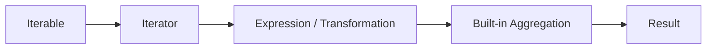

# 10- Built-in Functions

## Overview

Python provides a set of built-in functions that are available without importing a module. They form a core part of the language and are used throughout backend applications, data processing, testing, automation, and infrastructure code.

Common built-ins include:

```python
len()
print()
type()
isinstance()
id()
range()
enumerate()
zip()
map()
filter()
sorted()
min()
max()
sum()
any()
all()
iter()
next()
open()
```

Other built-ins are closely connected to Python's object model and execution model:

```python
abs()
callable()
hash()
repr()
str()
bool()
bytes()
bytearray()
complex()
dict()
list()
set()
tuple()
object()
super()
property()
classmethod()
staticmethod()
```

Understanding these functions at more than a syntax level is important because many built-ins interact directly with:

- Iteration protocols
- Object protocols
- Hashing
- Comparisons
- Type relationships
- Function invocation
- Memory allocation
- Lazy evaluation
- File I/O
- Sorting algorithms
- Exception behavior

Senior Python engineers should know not only what a built-in does, but also when it is preferable to an explicit implementation, what protocol it relies on, and what its performance and operational implications are.

## Built-in Namespace

Built-in functions live in Python's built-in namespace.

They are normally accessible directly:

```python
items = [10, 20, 30]

print(len(items))
```

Python resolves names using the LEGB lookup model:

```text
Local
  |
Enclosing
  |
Global
  |
Built-in
```

The built-in namespace is available through the `builtins` module:

```python
import builtins

print(builtins.len([1, 2, 3]))
```

This is useful for understanding where names such as `len`, `open`, and `isinstance` come from.

## Shadowing Built-ins

Because built-ins are ordinary names in the namespace hierarchy, they can be shadowed.

Avoid:

```python
list = []
str = "hello"
id = 123
```

Later:

```python
items = list((1, 2, 3))
```

may fail because `list` no longer refers to the built-in constructor.

Prefer descriptive names:

```python
items = []
identifier = 123
text = "hello"
```

Shadowing built-ins can cause subtle failures far away from the code that introduced the shadow.

## Built-in Function Categories

| Category | Examples | Primary Use |
|---|---|---|
| Inspection | `type`, `isinstance`, `issubclass`, `callable` | Runtime object inspection |
| Collections | `len`, `sorted`, `reversed`, `enumerate`, `zip` | Collection and iteration operations |
| Aggregation | `sum`, `min`, `max`, `any`, `all` | Reduce or inspect values |
| Conversion | `int`, `float`, `str`, `bool`, `bytes` | Convert or construct values |
| Iteration | `iter`, `next` | Work with iterator protocols |
| Object model | `id`, `hash`, `repr`, `super` | Runtime/object behavior |
| Functional | `map`, `filter` | Transform/filter iterables |
| I/O | `open`, `print` | Files and standard output |
| Dynamic execution | `eval`, `exec`, `compile` | Dynamic code execution |
| Construction | `list`, `dict`, `set`, `tuple` | Create built-in data structures |

## `len()`

`len()` returns the logical size of an object.

```python
users = ["alice", "bob", "charlie"]

count = len(users)
```

Conceptually:

```python
len(value)
```

delegates to the object's size protocol.

For custom classes, `__len__()` can define the behavior:

```python
class UserCollection:
    def __init__(self, users: list[str]) -> None:
        self.users = users

    def __len__(self) -> int:
        return len(self.users)
```

Then:

```python
users = UserCollection(["alice", "bob"])

assert len(users) == 2
```

### Production Considerations

For built-in containers, `len()` is generally an O(1) operation.

Do not manually count elements when the container already supports `len()`:

```python
# Inefficient and unnecessary.
count = sum(1 for _ in users)
```

Prefer:

```python
count = len(users)
```

However, an arbitrary custom iterable may not support `len()`.

## `type()`

`type()` returns the runtime type of an object.

```python
value = 42

print(type(value))
```

Output:

```text
<class 'int'>
```

It can also construct classes dynamically:

```python
User = type(
    "User",
    (),
    {"role": "admin"},
)
```

The second use is advanced and should normally be replaced by a class definition unless dynamic class construction is genuinely required.

### Prefer `isinstance()` for Type Checks

Avoid:

```python
if type(value) is dict:
    ...
```

when subclasses should also be accepted.

Prefer:

```python
if isinstance(value, dict):
    ...
```

## `isinstance()`

`isinstance()` checks whether an object belongs to a type or tuple of types.

```python
value = 42

if isinstance(value, int):
    ...
```

Multiple types can be supplied:

```python
if isinstance(value, (int, float)):
    ...
```

It also recognizes inheritance:

```python
class Animal:
    pass


class Dog(Animal):
    pass


dog = Dog()

assert isinstance(dog, Animal)
```

### Why It Matters

`isinstance()` works with Python's object model rather than requiring exact type equality.

It is appropriate for:

- Input validation
- Compatibility checks
- Framework extension points
- Runtime type boundaries

Avoid excessive runtime type checking in ordinary application logic when polymorphism or a well-defined interface would be clearer.

## `issubclass()`

`issubclass()` checks class inheritance relationships.

```python
class BaseHandler:
    pass


class OrderHandler(BaseHandler):
    pass


assert issubclass(OrderHandler, BaseHandler)
```

This can be useful in:

- Plugin registration
- Framework discovery
- Class-based configuration
- Dependency validation

It requires a class as the first argument.

## `callable()`

`callable()` checks whether an object can be invoked.

```python
def process() -> None:
    ...


assert callable(process)
```

Classes are also callable:

```python
assert callable(dict)
```

because calling `dict()` constructs an instance.

### Production Use

`callable()` can be useful for plugin systems or dependency injection:

```python
def register_handler(handler: object) -> None:
    if not callable(handler):
        raise TypeError("Handler must be callable")
```

However, a callable check does not guarantee that the callable has the correct signature or behavior.

## `id()`

`id()` returns an integer identifying an object during its lifetime.

```python
value = []

print(id(value))
```

It is primarily useful for debugging identity and aliasing:

```python
a = []
b = a

assert id(a) == id(b)
```

Do not use `id()` as:

- A database identifier
- A stable object identifier across processes
- A persistent cache key
- A distributed-system identifier

The value is only meaningful within the relevant Python runtime.

## `hash()`

`hash()` returns an object's hash value when the object is hashable.

```python
key = ("user", 42)

print(hash(key))
```

Hashable objects can generally be used as:

- Dictionary keys
- Set members

For example:

```python
users = {
    ("alice", 1),
    ("bob", 2),
}
```

### Hash Contract

Objects used as dictionary keys must obey the relationship:

```text
a == b  =>  hash(a) == hash(b)
```

Mutable objects should generally not be used as hash keys when their equality-relevant state can change.

### Security Consideration

Do not assume Python hash values are stable across processes or runs. Hash randomization can affect certain built-in types.

Do not persist Python's `hash()` output as a durable identifier.

## `repr()`

`repr()` returns the object's developer-oriented representation.

```python
user = {"id": 42, "role": "admin"}

print(repr(user))
```

It is especially useful for:

- Debugging
- Logging
- Interactive inspection
- Error messages

Custom classes can implement `__repr__()`.

```python
class User:
    def __init__(self, user_id: int, email: str) -> None:
        self.user_id = user_id
        self.email = email

    def __repr__(self) -> str:
        return f"User(user_id={self.user_id!r}, email={self.email!r})"
```

Never assume `repr()` is automatically safe for production logs. Objects may include credentials, tokens, personally sensitive information, or other secrets.

## `str()`

`str()` produces a human-readable string representation.

```python
status = 200

message = str(status)
```

For application logs and API responses, use explicit serialization rather than relying blindly on `str()` for complex objects.

## `bool()`

`bool()` converts an object to its truth value.

```python
bool([])
# False

bool([1])
# True
```

Objects can define custom truthiness using:

```python
__bool__()
```

or, if absent, `__len__()`.

This means:

```python
if collection:
    ...
```

is generally preferable to:

```python
if len(collection) > 0:
    ...
```

## `any()`

`any()` returns `True` if at least one element is truthy.

```python
permissions = ["read", "", ""]

if any(permissions):
    ...
```

It short-circuits.

For example:

```python
if any(user.is_admin for user in users):
    ...
```

Python stops as soon as a truthy result is found.

### Backend Example

```python
has_failed_dependency = any(
    dependency.status == "failed"
    for dependency in dependencies
)

if has_failed_dependency:
    mark_request_unavailable()
```

This avoids constructing an intermediate list.

## `all()`

`all()` returns `True` when every element is truthy.

```python
checks = [
    request.user_id is not None,
    request.token is not None,
    request.timestamp is not None,
]

if all(checks):
    process_request()
```

Prefer generator expressions when the values are generated dynamically:

```python
if all(user.is_active for user in users):
    ...
```

### Empty Iterables

Both `any()` and `all()` have important empty-input behavior:

```python
any([])  # False
all([])  # True
```

The behavior follows logical quantification:

```text
any -> "at least one"
all -> "every"
```

The `all([]) == True` behavior is a common interview trap.

## `sum()`

`sum()` adds values from an iterable.

```python
total = sum([10, 20, 30])
```

It can work with a generator:

```python
total = sum(order.total for order in orders)
```

This avoids constructing a separate list.

### Avoid String Concatenation With `sum()`

Do not use:

```python
sum(["a", "b"])
```

for string concatenation.

Use:

```python
"".join(["a", "b"])
```

For large numerical workloads, specialized libraries such as NumPy may provide better vectorized operations than Python-level iteration.

## `min()` and `max()`

These functions find minimum and maximum values.

```python
prices = [10.50, 8.25, 15.00]

lowest = min(prices)
highest = max(prices)
```

A `key` function allows comparison by an attribute:

```python
highest_value_order = max(
    orders,
    key=lambda order: order.total,
)
```

### Empty Input

Both functions raise `ValueError` for empty iterables.

Use `default` when appropriate:

```python
highest_value = max(
    orders,
    key=lambda order: order.total,
    default=None,
)
```

This is useful when an empty result is a valid application state.

## `sorted()`

`sorted()` returns a new list containing the sorted elements.

```python
orders = sorted(
    orders,
    key=lambda order: order.created_at,
)
```

The original iterable is not modified.

For lists, use `.sort()` when in-place sorting is appropriate:

```python
orders.sort(key=lambda order: order.created_at)
```

### `sorted()` vs `.sort()`

| Operation | `sorted()` | `.sort()` |
|---|---|---|
| Returns | New list | `None` |
| Mutates input | No | Yes |
| Accepts any iterable | Yes | Lists only |
| Additional list memory | Yes | Generally lower |
| Best use | Preserve source | In-place mutation |

Python's list sorting uses Timsort and is stable.

Stability means records with equal sort keys retain their relative order.

## Sorting With Multiple Keys

Use tuples for deterministic multi-field sorting:

```python
orders = sorted(
    orders,
    key=lambda order: (order.status, order.created_at),
)
```

For descending order:

```python
orders = sorted(
    orders,
    key=lambda order: order.created_at,
    reverse=True,
)
```

When different fields require different sort directions, consider multiple stable sorts or a carefully designed key.

## `reversed()`

`reversed()` returns an iterator that traverses an object in reverse order when supported.

```python
for item in reversed(items):
    process(item)
```

It can avoid creating a reversed copy.

Compare:

```python
items[::-1]
```

which creates a new sequence in common cases, with:

```python
reversed(items)
```

which provides lazy iteration.

## `enumerate()`

`enumerate()` yields index-value pairs.

```python
for index, order in enumerate(orders):
    process(index, order)
```

A starting index can be specified:

```python
for index, order in enumerate(orders, start=1):
    print(index, order)
```

Prefer this over manual counters:

```python
index = 0

for order in orders:
    ...
    index += 1
```

## `zip()`

`zip()` combines iterables element by element.

```python
user_ids = [101, 102, 103]
roles = ["admin", "user", "user"]

for user_id, role in zip(user_ids, roles):
    assign_role(user_id, role)
```

`zip()` is lazy and normally stops when the shortest iterable is exhausted.

## Strict `zip()`

When mismatched lengths indicate a programming error, use:

```python
for user_id, role in zip(
    user_ids,
    roles,
    strict=True,
):
    assign_role(user_id, role)
```

Then:

```text
[101, 102, 103]
["admin", "user"]
```

raises `ValueError` rather than silently dropping the unmatched element.

This is often preferable in data-import and validation code where truncation would be dangerous.

## `range()`

`range()` represents an arithmetic sequence without materializing all values.

```python
for page in range(1, 101):
    process_page(page)
```

It is memory-efficient because the range object stores the sequence parameters rather than every integer.

Useful patterns include:

```python
range(10)
range(1, 10)
range(0, 100, 10)
range(100, 0, -1)
```

### Backend Use

`range()` is useful for bounded retry attempts, pagination loops, and batch processing.

```python
for attempt in range(1, max_attempts + 1):
    try:
        send_message()
        break
    except TemporaryError:
        if attempt == max_attempts:
            raise
```

For real retry systems, exponential backoff and jitter are usually required in addition to an attempt count.

## `map()`

`map()` lazily applies a callable to each element.

```python
normalized = map(str.lower, usernames)
```

The result is an iterator.

Convert it when materialization is actually required:

```python
normalized = list(map(str.lower, usernames))
```

In modern Python, a comprehension is often more readable:

```python
normalized = [username.lower() for username in usernames]
```

Use `map()` when it naturally expresses function application, particularly with existing callables:

```python
ids = list(map(int, raw_ids))
```

## `filter()`

`filter()` lazily retains elements for which a predicate is truthy.

```python
active_users = filter(
    lambda user: user.is_active,
    users,
)
```

A comprehension is often clearer:

```python
active_users = [
    user
    for user in users
    if user.is_active
]
```

Use `filter()` when its functional form improves clarity or when working naturally with an existing predicate.

## `iter()`

`iter()` obtains an iterator from an iterable.

```python
iterator = iter(items)
```

Then:

```python
item = next(iterator)
```

`iter()` also supports a callable/sentinel form:

```python
with open("events.log", encoding="utf-8") as file:
    for line in iter(file.readline, ""):
        process(line)
```

This is useful when repeatedly calling a function until a sentinel value is returned.

## `next()`

`next()` retrieves the next item from an iterator.

```python
iterator = iter([10, 20, 30])

first = next(iterator)
```

If exhausted:

```python
next(iterator)
```

raises `StopIteration`.

A default can be supplied:

```python
value = next(iterator, None)
```

This is useful when absence is expected rather than exceptional.

## Iterator Protocol

The relationship is:

```text
Iterable
   |
   | iter()
   v
Iterator
   |
   | next()
   v
Value
   |
   | exhausted
   v
StopIteration
```

A `for` loop effectively performs this protocol automatically.

This is why built-ins such as:

```python
sum()
any()
all()
min()
max()
zip()
enumerate()
```

can work with generators and other lazy iterables.

## `open()`

`open()` creates a file object.

```python
with open(
    "events.log",
    "r",
    encoding="utf-8",
) as file:
    for line in file:
        process(line)
```

The `with` statement ensures the file is closed.

### Common Modes

| Mode | Meaning |
|---|---|
| `r` | Read |
| `w` | Write, truncating existing content |
| `a` | Append |
| `x` | Create exclusively |
| `b` | Binary mode |
| `t` | Text mode |
| `+` | Read and write |

### Production Considerations

Always consider:

- Explicit encoding
- File size
- Streaming
- Resource cleanup
- File permissions
- Path validation
- Container filesystem behavior

Do not read an untrusted path directly from a request:

```python
open(user_supplied_path)
```

This can create path traversal vulnerabilities.

Prefer resolving and validating paths against an allowed directory.

## `format()`

`format()` formats values using Python's formatting protocol.

```python
amount = 1250.50

message = format(amount, ",.2f")
```

Modern application code often uses f-strings:

```python
message = f"Total: {amount:,.2f}"
```

`format()` remains important for generic formatting code and custom formatting protocols.

## `ascii()`

`ascii()` returns a printable representation with non-ASCII characters escaped.

```python
value = "café"

print(ascii(value))
```

It can be useful when debugging encoding-related problems.

## `ord()` and `chr()`

`ord()` converts a character to its Unicode code point:

```python
code_point = ord("A")
```

`chr()` performs the reverse operation:

```python
character = chr(65)
```

These are useful for low-level text processing, encoding work, and protocol implementations.

For normal application-level text processing, prefer Python's Unicode-aware string APIs.

## `bin()`, `oct()`, and `hex()`

These functions convert integers to common representations:

```python
bin(10)
oct(10)
hex(10)
```

They are useful for:

- Bit flags
- Binary protocols
- Debugging
- Low-level systems work

For example:

```python
READ = 0b001
WRITE = 0b010

permissions = READ | WRITE
```

## `bytes()` and `bytearray()`

`bytes()` creates immutable byte sequences.

```python
payload = "hello".encode("utf-8")
```

`bytearray()` creates a mutable byte sequence:

```python
payload = bytearray(b"hello")
payload[0] = ord("H")
```

These types matter in:

- HTTP payload processing
- File I/O
- Cryptographic APIs
- Binary protocols
- Socket programming

Do not confuse text and bytes:

```text
str   -> Unicode text
bytes -> Binary data
```

Encoding explicitly at system boundaries avoids many production bugs.

## `memoryview()`

`memoryview()` provides a view over binary data without necessarily copying it.

```python
buffer = bytearray(b"large payload")
view = memoryview(buffer)
```

It can improve memory efficiency in performance-sensitive binary processing.

This is more relevant to:

- Network servers
- Binary protocols
- Large buffers
- Systems programming

than ordinary CRUD APIs.

## `dict()`, `list()`, `set()`, and `tuple()`

These built-ins can construct collections from iterables or mappings.

```python
values = list(generator)
unique_values = set(values)
immutable_values = tuple(values)
```

They are often used to explicitly materialize lazy iterables.

This has memory implications.

For example:

```python
items = list(large_generator)
```

may consume substantial memory.

Prefer streaming when the complete collection is not required.

## `object()`

`object()` creates a base Python object.

One advanced use is a unique sentinel:

```python
_MISSING = object()


def get_value(value=_MISSING):
    if value is _MISSING:
        return "missing"

    return value
```

A sentinel is preferable to `None` when `None` is itself a valid input.

## `property()`

`property()` creates managed attributes.

```python
class User:
    def __init__(self, email: str) -> None:
        self._email = email

    @property
    def email(self) -> str:
        return self._email
```

The decorator syntax is generally clearer than calling `property()` directly.

Properties are useful when attribute access requires validation, computation, or controlled mutation.

Avoid using properties merely to hide trivial fields without a meaningful invariant or abstraction.

## `staticmethod()` and `classmethod()`

These built-ins support method binding behavior.

A static method:

```python
class Order:
    @staticmethod
    def normalize_reference(value: str) -> str:
        return value.strip().upper()
```

A class method:

```python
class User:
    @classmethod
    def from_dict(cls, data: dict[str, object]) -> "User":
        return cls(...)
```

`classmethod()` is particularly useful for alternative constructors.

`staticmethod()` should be used when behavior logically belongs to the class namespace but does not require instance or class state.

## `super()`

`super()` delegates method lookup according to Python's method resolution order.

```python
class BaseRepository:
    def close(self) -> None:
        ...


class CachedRepository(BaseRepository):
    def close(self) -> None:
        super().close()
        clear_cache()
```

`super()` is not simply "call the parent class."

It participates in the MRO, which becomes important with multiple inheritance and cooperative method implementations.

## `eval()` and `exec()`

`eval()` evaluates an expression.

```python
result = eval("1 + 2")
```

`exec()` executes Python statements.

```python
namespace: dict[str, object] = {}

exec("value = 42", namespace)
```

These functions are powerful and dangerous.

Never evaluate untrusted input:

```python
eval(user_input)
```

This can result in arbitrary code execution.

For configuration or data formats, use safe serialization formats such as JSON or carefully configured YAML parsers rather than Python code execution.

## `compile()`

`compile()` converts source into a code object.

```python
code = compile(
    "result = 10 + 20",
    "<dynamic>",
    "exec",
)
```

It is primarily useful for advanced tooling such as:

- Interpreters
- Code-generation systems
- Development tools
- Dynamic execution infrastructure

It does not make untrusted source code safe.

## `vars()`

`vars()` returns an object's `__dict__` when available.

```python
class User:
    def __init__(self, user_id: int) -> None:
        self.user_id = user_id


user = User(42)

print(vars(user))
```

It is useful for debugging and introspection.

Do not assume every Python object has a `__dict__`. Objects using `__slots__` may not.

## `dir()`

`dir()` returns a list of names associated with an object.

```python
names = dir(user)
```

It is primarily an interactive and debugging tool.

It should not normally be used as the application's primary mechanism for discovering a stable API.

## `getattr()`

`getattr()` retrieves an attribute dynamically.

```python
handler = getattr(service, "process")
```

A default can be supplied:

```python
handler = getattr(
    service,
    "process",
    None,
)
```

Dynamic attribute access can be useful in plugin systems and framework internals.

Do not allow arbitrary user-controlled attribute names to expose sensitive methods.

## `setattr()`

`setattr()` dynamically assigns an attribute.

```python
setattr(user, "status", "active")
```

Use it carefully because dynamic mutation can make code harder to analyze and type-check.

Prefer explicit assignment when the attribute is known:

```python
user.status = "active"
```

## `hasattr()`

`hasattr()` checks whether attribute lookup succeeds.

```python
if hasattr(service, "health_check"):
    ...
```

It is useful for capability checks, but attribute access can execute descriptors or custom `__getattr__()` logic.

For important interfaces, structural typing, protocols, or explicit interfaces are often clearer.

## `globals()` and `locals()`

`globals()` exposes the current global namespace:

```python
namespace = globals()
```

`locals()` exposes the current local namespace representation:

```python
namespace = locals()
```

These are primarily useful for metaprogramming, debugging, and framework internals.

Do not build ordinary business logic around dynamically manipulating local variables.

## `help()`

`help()` launches Python's interactive documentation system.

```python
help(str)
```

It is mainly useful at the REPL and during development.

For production engineering documentation, use official API documentation and repository-level technical documentation.

## `input()`

`input()` reads text from standard input.

```python
name = input("Name: ")
```

It is appropriate for interactive CLI programs.

It is generally inappropriate inside web-server request handlers because it blocks waiting for terminal input.

For backend services, request data should arrive through HTTP, messaging, or other explicit interfaces.

## `print()`

`print()` writes text to standard output.

```python
print("service started")
```

For production services, use structured logging instead:

```python
logger.info(
    "service_started",
    extra={"service": "orders"},
)
```

The logging implementation depends on the application's logging stack.

`print()` remains useful for:

- Small CLI tools
- Local debugging
- Simple scripts
- Educational examples

It should not replace application logging in production services.

## `breakpoint()`

`breakpoint()` enters the configured debugger.

```python
def process_order(order):
    breakpoint()
    ...
```

It is useful during local debugging.

Never leave accidental debugger breakpoints in production code paths.

Python allows the breakpoint behavior to be configured through the debugging environment.

## `__import__()`

`__import__()` is the underlying built-in import mechanism used by Python's import machinery.

Normal application code should use:

```python
import application
```

or:

```python
from application import service
```

rather than calling `__import__()` directly.

For controlled dynamic imports, prefer:

```python
from importlib import import_module

module = import_module("application.plugins.orders")
```

## Built-ins and Iteration

Many built-ins are built around Python's iterator protocol.

For example:

```python
total = sum(
    order.total
    for order in orders
)
```

The data flow is:



This enables lazy processing without materializing every intermediate result.

For large datasets:

```python
total = sum(
    record.amount
    for record in stream_records()
)
```

can be substantially more memory-efficient than:

```python
amounts = [record.amount for record in stream_records()]
total = sum(amounts)
```

## Built-ins and Backend Request Processing

Built-ins frequently appear in request handling.

For example:

```python
def validate_batch(
    requests: list[dict[str, object]],
) -> None:
    if not requests:
        raise ValueError("Batch cannot be empty")

    if len(requests) > 1000:
        raise ValueError("Batch exceeds maximum size")

    required_fields = {"id", "payload"}

    if not all(
        required_fields <= request.keys()
        for request in requests
    ):
        raise ValueError("Invalid request shape")
```

This demonstrates several built-ins working together:

```text
len()  -> bounds validation
all()  -> batch-wide validation
dict.keys() -> field inspection
```

## Built-ins and Database Results

Built-ins can process query results efficiently when the result set is already bounded.

```python
highest_value = max(
    orders,
    key=lambda order: order.total,
    default=None,
)
```

However, do not automatically fetch a large database result set into Python just to calculate an aggregate.

Prefer pushing suitable aggregation into PostgreSQL:

```sql
SELECT MAX(total)
FROM orders
WHERE customer_id = $1;
```

General principle:

> Use Python built-ins for application-level computation, but let the database perform large relational operations when it can do so more efficiently.

## Built-ins and API Responses

For API serialization, avoid accidental conversion semantics.

For example:

```python
response = {
    "count": len(users),
    "active": sum(user.is_active for user in users),
}
```

This is reasonable when `users` is already a bounded in-memory collection.

For large datasets, count and aggregation may belong in the database or an aggregation layer rather than in the API process.

## Built-ins and Streaming

Built-ins that consume iterables can preserve streaming behavior:

```python
has_invalid = any(
    not validate(record)
    for record in stream_records()
)
```

The stream stops as soon as an invalid record is found.

This provides:

- Lower memory usage
- Early termination
- Potentially lower latency

However, if consuming the iterator has side effects, early termination may leave external processing incomplete. Understand the ownership and lifecycle of the iterator.

## Built-ins and Concurrency

Most built-ins operate on local Python objects and are not synchronization primitives.

For example:

```python
if not queue:
    ...
```

does not provide atomic coordination between threads.

Two threads can observe the same state:

```text
Thread A -> checks queue
Thread B -> checks queue
Thread A -> modifies queue
Thread B -> modifies queue
```

For shared mutable state, use appropriate synchronization primitives or concurrency-safe abstractions.

Do not confuse concise built-in operations with atomic distributed operations.

## Performance Considerations

Built-ins implemented in optimized CPython internals can be faster than equivalent Python-level loops.

For example:

```python
total = sum(values)
```

is generally preferable to:

```python
total = 0

for value in values:
    total += value
```

when the built-in directly expresses the operation.

However, performance should be measured.

The dominant cost in backend systems is often:

```text
Network I/O
Database I/O
Serialization
External service latency
Disk I/O
```

rather than the difference between two simple Python constructs.

## Memory Considerations

Understand whether a built-in returns:

- A materialized object
- A lazy iterator
- A view
- A scalar

| Built-in | Typical Result |
|---|---|
| `sorted()` | New list |
| `list()` | New list |
| `set()` | New set |
| `tuple()` | New tuple |
| `map()` | Lazy iterator |
| `filter()` | Lazy iterator |
| `zip()` | Lazy iterator |
| `enumerate()` | Lazy iterator |
| `reversed()` | Reverse iterator where supported |
| `range()` | Compact range object |
| `sum()` | Scalar result |
| `any()` | Boolean |
| `all()` | Boolean |

This distinction matters when processing millions of records.

## Built-ins and Exception Behavior

Built-ins often raise specific exceptions for invalid operations.

Examples:

```python
int("not-a-number")
# ValueError
```

```python
next(iter([]))
# StopIteration
```

```python
max([])
# ValueError
```

```python
open("missing-file.txt")
# FileNotFoundError
```

Production code should catch exceptions at appropriate boundaries rather than broadly suppressing them.

Avoid:

```python
try:
    value = int(raw_value)
except Exception:
    value = None
```

Prefer:

```python
try:
    value = int(raw_value)
except ValueError as exc:
    raise InvalidRequest("id must be an integer") from exc
```

## Security Considerations

Some built-ins require particular security attention.

| Built-in | Security Concern |
|---|---|
| `eval()` | Arbitrary code execution |
| `exec()` | Arbitrary code execution |
| `compile()` | Dynamic code execution |
| `open()` | Path traversal, unauthorized file access |
| `getattr()` | Dynamic access to unintended methods |
| `setattr()` | Unsafe dynamic mutation |
| `__import__()` | Unsafe dynamic module loading |
| `input()` | Untrusted interactive input in CLI applications |

The safest approach is to avoid dynamic execution entirely when a declarative data format or explicit dispatch mechanism can solve the problem.

## Testing Built-in-Heavy Code

Built-ins themselves normally do not need mocking.

Test the behavior of your application logic.

For example:

```python
def calculate_total(amounts: list[float]) -> float:
    return sum(amounts)
```

Test:

```python
def test_calculate_total() -> None:
    assert calculate_total([10.0, 20.0, 5.0]) == 35.0
```

Focus tests on:

- Empty inputs
- Invalid values
- Boundary conditions
- Large inputs where relevant
- Generator behavior
- Exception behavior
- Ordering guarantees

## Common Mistakes

### Shadowing Built-ins

```python
list = []
```

This breaks later uses of `list()`.

### Materializing Large Iterators

```python
records = list(stream_records())
```

can cause unnecessary memory pressure.

### Ignoring `zip()` Truncation

```python
zip(ids, values)
```

silently stops at the shortest iterable unless `strict=True` is used.

### Assuming `all([])` Is False

It is:

```python
all([]) is True
```

### Using `type()` for Every Type Check

Prefer `isinstance()` when subclasses should be accepted.

### Using `print()` for Production Logging

Use structured logging with appropriate levels and metadata.

### Using Python for Database Aggregation

Do not pull millions of rows into Python for operations PostgreSQL can perform efficiently.

### Treating `id()` as a Persistent Identifier

Object IDs are runtime-specific.

### Persisting `hash()` Results

Python hash values should not be treated as durable identifiers.

### Calling `eval()` on Configuration or User Input

Use structured data formats and explicit parsing.

### Ignoring Lazy Evaluation

`map()`, `filter()`, `zip()`, and `enumerate()` do not create full lists automatically.

### Forgetting Resource Ownership

An iterator over a file, cursor, socket, or network stream may own or depend on external resources.

## Interview Traps

### What Is the Difference Between `is` and `==`?

`is` checks object identity.

`==` checks equality according to the object's equality implementation.

Use:

```python
value is None
```

for singleton checks such as `None`.

Do not use:

```python
value == None
```

as the standard idiom.

### Why Is `bool([])` False?

Empty containers are falsy according to Python's truth-value rules.

### Why Is `all([])` True?

`all()` represents universal quantification. There is no element that violates the condition in an empty collection.

### Is `map()` a List?

No.

In Python 3, `map()` returns a lazy iterator.

### Does `zip()` Materialize Its Inputs?

No.

`zip()` produces tuples lazily as iteration proceeds.

### What Does `zip(strict=True)` Do?

It raises `ValueError` when the input iterables have different lengths instead of silently truncating to the shortest iterable.

### What Is the Difference Between `sorted()` and `.sort()`?

`sorted()` creates and returns a new list.

`.sort()` mutates an existing list in place and returns `None`.

### Is `len()` Always O(1)?

For standard built-in containers, it is generally O(1), but custom objects define their own `__len__()` behavior.

### What Is `next()` Used For?

It retrieves the next value from an iterator and raises `StopIteration` when exhausted unless a default is supplied.

### Why Is `eval()` Dangerous?

Because it executes dynamically supplied Python expressions and can enable arbitrary code execution when input is untrusted.

### What Is the Difference Between `repr()` and `str()`?

`repr()` is primarily intended for developer-oriented representation and debugging.

`str()` is intended to provide a more human-readable representation.

### What Does `callable()` Guarantee?

Only that the object can be invoked. It does not guarantee a particular signature, return type, or successful execution.

## Practical Backend Example

Consider processing a bounded batch of incoming events:

```python
from collections.abc import Iterable


def validate_events(
    events: Iterable[dict[str, object]],
    *,
    max_batch_size: int = 1000,
) -> list[dict[str, object]]:
    validated: list[dict[str, object]] = []

    for event in events:
        validated.append(event)

        if len(validated) > max_batch_size:
            raise ValueError("Batch size exceeds configured limit")

    if not validated:
        raise ValueError("Batch cannot be empty")

    required_fields = {"event_id", "payload"}

    if not all(
        required_fields.issubset(event)
        for event in validated
    ):
        raise ValueError("Event is missing required fields")

    return validated
```

This example illustrates several production-relevant ideas:

- `Iterable` allows streaming input.
- `len()` enforces a memory and workload boundary.
- `all()` validates the batch.
- The batch size is bounded before downstream processing.
- The function avoids assuming that its input is already a list.

For very large workloads, even this design may need to move validation and processing into a streaming pipeline rather than accumulating the batch.

## Choosing Between Built-ins and Explicit Code

Use the built-in when it directly expresses the intended operation.

| Requirement | Preferred Approach |
|---|---|
| Count collection elements | `len()` |
| Test any matching element | `any()` |
| Test all matching elements | `all()` |
| Find maximum | `max()` |
| Find minimum | `min()` |
| Aggregate numbers | `sum()` |
| Add indexes | `enumerate()` |
| Combine iterables | `zip()` |
| Generate integer sequence | `range()` |
| Sort without mutation | `sorted()` |
| Sort list in place | `.sort()` |
| Transform iterable | Comprehension or `map()` |
| Filter iterable | Comprehension or `filter()` |
| Get iterator | `iter()` |
| Retrieve next item | `next()` |
| Runtime type relationship | `isinstance()` |
| Class inheritance check | `issubclass()` |
| Human-readable output | `str()` |
| Debug representation | `repr()` |
| File access | `open()` with a context manager |
| Dynamic import | `importlib.import_module()` |
| Dynamic code execution | Avoid unless explicitly required |

## Engineering Guidelines

- Prefer built-ins when they directly communicate intent.
- Understand whether an operation is lazy or materializing.
- Use generator expressions with aggregating built-ins when intermediate lists are unnecessary.
- Use `zip(strict=True)` when mismatched input lengths indicate corruption or a programming error.
- Prefer `isinstance()` over exact `type()` comparisons when polymorphism should be supported.
- Use `is None` for identity checks against `None`.
- Keep production logging in the logging framework rather than relying on `print()`.
- Never use `eval()` or `exec()` with untrusted input.
- Treat dynamic `getattr()`, `setattr()`, and imports as security-sensitive when names originate outside trusted code.
- Do not pull large database datasets into Python when the database can perform the required aggregation or filtering efficiently.
- Preserve streaming behavior for large files, API responses, database cursors, and message streams where appropriate.
- Understand the iterator and truth-value protocols behind built-ins rather than treating them as unrelated convenience functions.
- Avoid shadowing built-in names.
- Test application behavior and edge cases rather than mocking Python's built-in implementation.
- Remember that concise built-in operations are not automatically atomic or thread-safe.
- Optimize built-in usage only after identifying a meaningful performance bottleneck.

## Key Takeaways

- Python built-ins are core interfaces to the language's object, iterator, type, collection, and I/O protocols; understanding those protocols is more valuable than memorizing function names.
- Prefer lazy built-ins such as `map()`, `filter()`, `zip()`, `enumerate()`, and `reversed()` when streaming behavior reduces memory usage and fits the processing model.
- Use built-ins deliberately at backend boundaries: let Python handle application-level computation while PostgreSQL, Redis, Kafka, and other infrastructure perform work they are designed to handle efficiently.
- Treat dynamic execution and reflection built-ins such as `eval()`, `exec()`, `getattr()`, `setattr()`, and dynamic imports as potential security and maintainability boundaries.
- Production-quality Python depends on understanding edge cases, exception behavior, memory characteristics, concurrency implications, and the difference between concise syntax and correct system behavior.