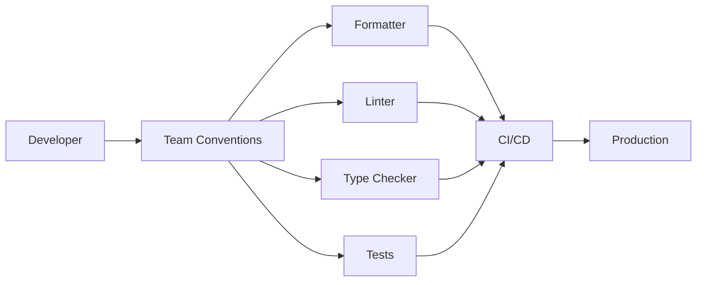

# 11- Coding Conventions

## Overview

Coding conventions define the shared rules used to write, structure, name, review, test, and maintain Python code. They are not primarily about aesthetics. In a production backend, consistent conventions reduce cognitive load, make code easier to review, improve tooling effectiveness, and reduce the probability of defects during maintenance.

Python provides strong conventions through the language ecosystem, especially [PEP 8](https://peps.python.org/pep-0008/), [PEP 257](https://peps.python.org/pep-0257/), and modern formatting and linting tools such as Ruff. Teams should adopt a small, explicit set of conventions and automate as much of it as possible.

A useful production model is:

```text
Coding Conventions
       |
       +--> Formatting
       |
       +--> Naming
       |
       +--> Imports
       |
       +--> Type Hints
       |
       +--> Documentation
       |
       +--> Error Handling
       |
       +--> Testing
       |
       +--> Architecture
       |
       +--> Tooling
       |
       +--> Code Review
```

The goal is not to make every Python project look identical. The goal is to make code predictable enough that engineers can spend their attention on behavior, correctness, reliability, and architecture rather than formatting disputes.

## Why Coding Conventions Matter

A backend codebase is read substantially more often than it is written.

Engineers need to understand code while:

- Debugging production incidents
- Reviewing pull requests
- Fixing security vulnerabilities
- Adding API endpoints
- Migrating databases
- Upgrading dependencies
- Responding to operational failures
- Onboarding to unfamiliar services
- Refactoring legacy modules

Consistent conventions reduce the number of decisions an engineer must make while reading code.

For example, this is immediately recognizable:

```python
def calculate_order_total(
    subtotal: Decimal,
    tax: Decimal,
) -> Decimal:
    return subtotal + tax
```

A team should not repeatedly debate whether the same function should instead be formatted as:

```python
def calculate_order_total(subtotal: Decimal,
                         tax: Decimal) -> Decimal:
    return subtotal + tax
```

Automated formatting removes this class of discussion.

## Convention Hierarchy

When conventions conflict, use a practical hierarchy:

```text
Correctness
    |
Security
    |
Reliability
    |
Maintainability
    |
Consistency
    |
Personal preference
```

A team convention should never force code into a form that makes correctness or security worse.

For example, an engineer should not avoid an explicit validation check merely because a shorter expression is considered more idiomatic.

## PEP 8

[PEP 8](https://peps.python.org/pep-0008/) is Python's primary style guide.

It covers areas such as:

- Indentation
- Naming
- Imports
- Whitespace
- Line length
- Comments
- Blank lines
- Programming recommendations

PEP 8 is a strong baseline, not a complete engineering standard for a production backend.

A real project usually adds conventions for:

- Type checking
- Logging
- Testing
- Dependency management
- API design
- Error handling
- Security
- Architecture
- Formatting
- Linting

## Formatting

Use four spaces for indentation.

```python
def process_order(order: Order) -> None:
    if order.is_valid:
        save_order(order)
```

Do not use tabs for indentation in Python source code.

### Line Length

A project should establish a consistent maximum line length.

Common modern configurations use approximately 88–120 characters depending on the formatter and project requirements.

The important principle is consistency and readability rather than blindly optimizing for a particular number.

Avoid manually wrapping code when an automated formatter can perform the transformation consistently.

## Automated Formatting

Use an automated formatter rather than relying on manual formatting.

For example, a project may use Ruff:

```bash
ruff format .
```

Check formatting in CI:

```bash
ruff format --check .
```

A formatter should be deterministic so that:

```text
Developer A
Developer B
CI
```

all produce the same formatting result.

This eliminates formatting-only review comments.

## Linting

Formatting and linting solve different problems.

```text
Formatter
    |
    +--> How code looks

Linter
    |
    +--> Potential defects
    +--> Suspicious patterns
    +--> Maintainability issues
    +--> Style violations
```

Example:

```bash
ruff check .
```

A linter can detect problems such as:

- Unused imports
- Undefined names
- Unreachable code
- Suspicious constructs
- Incorrect exception patterns
- Import issues
- Complexity-related problems

Do not enable every possible lint rule without evaluating its value. Excessive lint noise causes engineers to ignore meaningful findings.

## Import Conventions

Imports should normally be placed at module scope.

```python
from collections.abc import Sequence

from application.domain.orders import Order
from application.services.orders import OrderService
```

Standard-library imports should be separated from third-party and application imports.

A common organization is:

```text
Standard library
      |
Third-party dependencies
      |
Application modules
```

For example:

```python
from datetime import UTC, datetime

from fastapi import APIRouter

from application.services.orders import OrderService
```

Automated tooling should manage import sorting where possible.

## Avoid Wildcard Imports

Avoid:

```python
from application.services import *
```

Wildcard imports obscure the origin of names and can create accidental namespace collisions.

Prefer:

```python
from application.services import OrderService
```

or:

```python
import application.services as services
```

depending on the intended API.

## Import Aliases

Use aliases when they improve clarity or resolve a genuine naming conflict.

```python
import datetime as dt
```

Avoid unnecessary aliases:

```python
import json as j
```

Short aliases can make code less readable when there is no established convention.

## Naming Conventions

Naming is one of the highest-value coding conventions because names communicate intent.

| Element | Convention | Example |
|---|---|---|
| Variable | `snake_case` | `order_count` |
| Function | `snake_case` | `calculate_total()` |
| Method | `snake_case` | `get_order()` |
| Module | `snake_case` | `order_repository.py` |
| Package | `snake_case` | `order_service` |
| Class | `PascalCase` | `OrderRepository` |
| Exception | `PascalCase` + `Error` | `OrderNotFoundError` |
| Constant | `UPPER_SNAKE_CASE` | `MAX_BATCH_SIZE` |
| Type alias | `PascalCase` | `UserId` |
| Type parameter | descriptive convention | `T`, `TItem` |

Names should communicate domain meaning rather than implementation trivia.

Prefer:

```python
customer_id
```

over:

```python
cid
```

Prefer:

```python
expiration_timestamp
```

over:

```python
exp
```

unless the shorter form is a well-established domain term.

## Naming Booleans

Boolean variables and methods should read naturally.

Prefer:

```python
is_active
has_permission
can_retry
should_refresh
```

over:

```python
active
permission
retry
refresh
```

For example:

```python
if user.has_permission:
    ...
```

communicates intent more clearly than:

```python
if user.permission:
    ...
```

## Naming Functions

Functions should normally use verbs or verb phrases.

Prefer:

```python
create_order()
validate_request()
load_configuration()
publish_event()
```

Avoid vague names:

```python
process()
handle()
do_work()
run()
```

unless their context makes the meaning unambiguous.

A function name should describe the behavior that callers need to understand.

## Naming Classes

Classes normally use `PascalCase`.

```python
class OrderRepository:
    ...


class PaymentGateway:
    ...


class AuthenticationError(Exception):
    ...
```

Class names generally represent concepts or roles rather than actions.

Prefer:

```python
OrderValidator
```

over:

```python
ValidateOrder
```

when the class represents an object responsible for validation.

## Naming Constants

Constants should use uppercase names:

```python
DEFAULT_TIMEOUT_SECONDS = 10
MAX_BATCH_SIZE = 1000
SUPPORTED_API_VERSION = "v1"
```

A constant is a convention rather than an enforced immutability mechanism.

This:

```python
MAX_BATCH_SIZE = 1000
```

can still be reassigned at runtime.

## Naming Private Members

A single leading underscore communicates internal intent:

```python
class OrderService:
    def _validate_order(self, order: Order) -> None:
        ...
```

It is a convention, not an access-control mechanism.

Double leading underscores trigger name mangling and should generally be reserved for cases where name collisions in subclasses are a real concern.

Do not use underscores merely to make normal code appear more encapsulated.

## Naming Modules and Packages

Use short, descriptive lowercase names.

Prefer:

```text
order_repository.py
payment_gateway.py
http_client.py
```

Avoid:

```text
OrderRepository.py
Payment-Gateway.py
misc.py
utils.py
```

Python package names should generally be lowercase and import-friendly.

## Avoid Generic Names

Generic modules tend to become dumping grounds:

```text
utils.py
helpers.py
common.py
misc.py
```

Instead of:

```python
from application.utils import parse_date
```

prefer a meaningful location:

```python
from application.time_parsing import parse_date
```

or:

```python
from application.infrastructure.serialization import parse_date
```

The correct location depends on ownership and responsibility.

## Function Length

There is no universal maximum function length.

A function should be small enough that its:

- Inputs
- Main operation
- Failure modes
- Side effects
- Return value

can be understood without excessive mental context.

Avoid artificial fragmentation:

```python
def get_name(user):
    return user.name
```

Creating dozens of trivial functions can make the call graph harder to follow.

Extract logic when it improves:

- Reuse
- Testability
- Separation of concerns
- Readability
- Error handling
- Independent changeability

## Single Responsibility

A function should have a coherent responsibility.

Avoid:

```python
def create_order(request):
    validate_request(request)
    connect_to_database()
    save_order()
    send_email()
    publish_kafka_event()
    write_audit_log()
    format_http_response()
```

This mixes:

- Validation
- Persistence
- Messaging
- Notification
- Auditing
- HTTP concerns

A better design separates responsibilities while preserving a clear orchestration layer:

```python
def create_order(request: CreateOrderRequest) -> OrderResponse:
    command = validate_request(request)
    order = order_service.create(command)
    return OrderResponse.from_domain(order)
```

The underlying service may coordinate repositories and event publishing.

## Function Arguments

Avoid excessive positional arguments.

Prefer:

```python
def create_order(
    customer_id: int,
    items: list[OrderItem],
    *,
    currency: str = "USD",
) -> Order:
    ...
```

The `*` makes `currency` keyword-only:

```python
create_order(
    customer_id,
    items,
    currency="USD",
)
```

This reduces ambiguity as APIs evolve.

## Avoid Boolean Argument Ambiguity

This is difficult to read:

```python
create_user(data, True, False, True)
```

Prefer keyword arguments:

```python
create_user(
    data,
    send_welcome_email=True,
    activate_account=False,
    require_mfa=True,
)
```

Or use a dedicated configuration/data model when the number of options becomes substantial.

## Type Hints

Modern Python code should use type hints for public interfaces and important internal boundaries.

```python
def get_order(order_id: int) -> Order | None:
    ...
```

Type hints improve:

- IDE support
- Static analysis
- Refactoring safety
- Documentation
- API clarity
- Code review

Type hints do not enforce runtime types by themselves.

Use runtime validation where external input crosses a trust boundary.

## Type Hints at Boundaries

External input should be validated explicitly.

For example, a FastAPI request model may define:

```python
from pydantic import BaseModel


class CreateOrderRequest(BaseModel):
    customer_id: int
    currency: str
    items: list[str]
```

The type annotation communicates expected structure, while the validation framework enforces the runtime contract.

The general pattern is:

```text
Untrusted Input
      |
      v
Runtime Validation
      |
      v
Typed Application Model
      |
      v
Business Logic
```

## Return Types

Public functions should generally document return types:

```python
def find_user(user_id: int) -> User | None:
    ...
```

Avoid ambiguous APIs such as:

```python
def find_user(user_id):
    ...
```

where the caller cannot determine whether the result is:

```text
User
None
False
{}
Exception
```

without reading the implementation.

## `None` Semantics

Use `None` intentionally.

For example:

```python
def find_user(user_id: int) -> User | None:
    ...
```

communicates that absence is expected.

If failure represents an exceptional condition:

```python
def get_user(user_id: int) -> User:
    raise UserNotFoundError
```

The choice should be consistent with the application's domain semantics.

## Comments

Comments should explain why, not restate what the code already says.

Weak:

```python
# Increment retry count.
retry_count += 1
```

Better:

```python
# Keep the retry count bounded to prevent an upstream outage
# from creating unbounded worker execution.
retry_count += 1
```

The code explains what happens. The comment explains the reasoning that may not be obvious.

## Avoid Stale Comments

Comments are another source of technical debt.

If:

```python
# Redis expires this key after 60 seconds.
```

but the configuration changes to:

```python
CACHE_TTL = 300
```

the comment becomes misleading.

Prefer self-describing constants and configuration where possible:

```python
CACHE_TTL_SECONDS = 300
```

## Docstrings

Use docstrings for public APIs where they provide meaningful information.

```python
def calculate_tax(
    subtotal: Decimal,
    tax_rate: Decimal,
) -> Decimal:
    """Calculate tax for a monetary subtotal."""
    return subtotal * tax_rate
```

For straightforward private functions, excessive docstrings can duplicate the implementation.

Document:

- Public interfaces
- Non-obvious behavior
- Important invariants
- Side effects
- Exceptions
- External contracts

## Exception Documentation

When a function has meaningful failure modes, document them through types, docstrings, or surrounding API documentation.

For example:

```python
def load_order(order_id: int) -> Order:
    """Load an order or raise OrderNotFoundError."""
    ...
```

Do not document every Python exception that could theoretically occur.

Focus on domain-level behavior that callers need to handle.

## Avoid Deep Nesting

Deep nesting increases cognitive load.

Prefer guard clauses:

```python
def process_order(order: Order) -> None:
    if not order.is_valid:
        raise InvalidOrderError()

    if order.is_cancelled:
        return

    charge_customer(order)
```

over deeply nested conditionals:

```python
def process_order(order: Order) -> None:
    if order.is_valid:
        if not order.is_cancelled:
            charge_customer(order)
```

Guard clauses make exceptional or terminating conditions visible early.

## Avoid Clever Code

Python provides compact constructs, but compactness is not the same as readability.

Prefer:

```python
active_users = [
    user
    for user in users
    if user.is_active
]
```

over highly compressed expressions with nested conditions and side effects.

A senior engineer should optimize for the next engineer reading the code, not for the fewest characters.

## Avoid Side Effects in Expressions

Avoid hiding mutations inside expressions.

For example:

```python
result = items.pop() if items else None
```

may be technically valid but hides a mutation.

When the side effect matters, make it explicit:

```python
if items:
    result = items.pop()
else:
    result = None
```

Not every compact expression is bad, but important side effects should be visible.

## Avoid Mutable Default Arguments

Do not write:

```python
def add_item(item: str, items: list[str] = []) -> None:
    items.append(item)
```

The default list is created once when the function is defined.

Use:

```python
def add_item(
    item: str,
    items: list[str] | None = None,
) -> list[str]:
    if items is None:
        items = []

    items.append(item)
    return items
```

This is a language-semantics issue, not merely a style preference.

## Explicit Resource Management

Resources should have explicit ownership and cleanup.

Prefer:

```python
with open(path, encoding="utf-8") as file:
    process(file)
```

rather than:

```python
file = open(path, encoding="utf-8")
process(file)
file.close()
```

The same principle applies to:

- Database connections
- Transactions
- Locks
- Temporary resources
- Network clients

Use context managers when the resource lifecycle supports them.

## Logging Conventions

Production services should use structured logging rather than scattered `print()` calls.

Prefer:

```python
logger.info(
    "order_created",
    extra={
        "order_id": order.id,
        "customer_id": order.customer_id,
    },
)
```

The exact logging API depends on the logging stack.

Logs should generally contain:

- Event name
- Relevant identifiers
- Severity
- Useful metadata
- Correlation/request identifiers where available

Never log:

- Passwords
- Authentication tokens
- API keys
- Session secrets
- Sensitive credentials

## Logging Levels

Use log levels consistently.

| Level | Typical Use |
|---|---|
| `DEBUG` | Detailed diagnostic information |
| `INFO` | Normal significant application events |
| `WARNING` | Unexpected condition that does not stop processing |
| `ERROR` | Failed operation requiring investigation |
| `CRITICAL` | Severe system-level failure |

Avoid logging every successful function call at `INFO`. High-volume logs increase cost and reduce signal.

## Error Handling Conventions

Do not use exceptions as normal control flow when a simple return value is clearer.

Prefer:

```python
user = repository.find(user_id)

if user is None:
    return None
```

when absence is expected.

Use domain-specific exceptions when an operation genuinely fails:

```python
raise OrderNotFoundError(order_id)
```

Avoid:

```python
except Exception:
    pass
```

This suppresses failures and makes production diagnosis difficult.

## Exception Chaining

Preserve the original cause when translating exceptions:

```python
try:
    user = repository.load(user_id)
except DatabaseError as exc:
    raise UserRepositoryError(
        f"Failed to load user {user_id}"
    ) from exc
```

This retains the original traceback while exposing a domain-level exception to the caller.

## API Error Conventions

Backend APIs should return consistent error structures.

For example:

```json
{
  "error": {
    "code": "ORDER_NOT_FOUND",
    "message": "Order was not found",
    "request_id": "req_123"
  }
}
```

Do not expose internal stack traces, database errors, or infrastructure details to external clients.

## Boolean Comparisons

Prefer:

```python
if is_active:
    ...
```

over:

```python
if is_active == True:
    ...
```

For `None`:

```python
if value is None:
    ...
```

For explicit booleans:

```python
if value is True:
    ...
```

can be appropriate when distinguishing `True` from other truthy values matters.

## Collection Checks

Prefer:

```python
if not users:
    ...
```

over:

```python
if len(users) == 0:
    ...
```

The first expresses the semantic intent directly.

For generators and arbitrary iterables, remember that truthiness and length may behave differently because not every iterable is sized.

## Comprehensions

Use comprehensions when they improve clarity.

```python
active_ids = [
    user.id
    for user in users
    if user.is_active
]
```

Avoid deeply nested comprehensions that become harder to read than an explicit loop.

```python
# Prefer an explicit loop when logic becomes complex.
results = []

for user in users:
    if user.is_active:
        for role in user.roles:
            if role.is_assignable:
                results.append((user.id, role.id))
```

## `enumerate()` and `zip()`

Prefer idiomatic iteration:

```python
for index, item in enumerate(items):
    ...
```

rather than maintaining counters manually.

For parallel sequences:

```python
for user_id, role in zip(
    user_ids,
    roles,
    strict=True,
):
    assign_role(user_id, role)
```

Use `strict=True` when unequal lengths indicate invalid data.

## Database Conventions

Coding conventions should include database interaction patterns.

Avoid:

```python
for user_id in user_ids:
    user = repository.get_user(user_id)
```

when this creates an N+1 query pattern.

Prefer a batch operation when the data access layer supports it:

```python
users = repository.get_users(user_ids)
```

Python coding conventions should reinforce system-level efficiency rather than focusing only on syntax.

## Async Code Conventions

Async functions should be named and structured clearly.

```python
async def fetch_order(order_id: int) -> Order:
    ...
```

Do not block the event loop with synchronous I/O:

```python
async def handler():
    time.sleep(5)
```

Use asynchronous APIs where appropriate:

```python
async def handler():
    await asyncio.sleep(5)
```

For synchronous libraries that cannot be replaced, use an appropriate executor or framework-supported mechanism rather than blocking the event loop.

The convention is ultimately about preserving the concurrency model of the application.

## Async Naming

Do not add arbitrary names such as:

```python
async def fetch_order_async():
    ...
```

when the function is already clearly asynchronous.

The `async` keyword is part of the language contract.

Use descriptive names based on business behavior:

```python
async def fetch_order():
    ...
```

rather than encoding implementation details into the name.

## API Naming Conventions

REST endpoints should use consistent resource-oriented naming.

Prefer:

```text
GET    /orders
GET    /orders/{order_id}
POST   /orders
PATCH  /orders/{order_id}
DELETE /orders/{order_id}
```

Avoid inconsistent mixtures such as:

```text
/getOrders
/create_order
/order/{id}/delete
```

The API convention should be documented separately from Python naming conventions but implemented consistently in the Python application.

## Configuration Conventions

Do not scatter environment variable reads throughout business logic.

Avoid:

```python
def create_client():
    timeout = int(os.environ["TIMEOUT"])
    ...
```

throughout many modules.

Prefer centralized configuration:

```python
class Settings:
    timeout_seconds: int
    database_url: str
```

Then inject configuration into components that need it.

This improves:

- Testing
- Validation
- Observability
- Deployment consistency
- Maintainability

## Dependency Injection

Avoid hidden dependencies:

```python
def create_order(data):
    repository = OrderRepository()
    ...
```

Prefer explicit dependencies:

```python
def create_order(
    data: CreateOrderRequest,
    repository: OrderRepository,
) -> Order:
    ...
```

This makes dependencies visible and improves testing.

Frameworks such as FastAPI can provide dependency injection mechanisms, but the underlying design principle applies regardless of framework.

## Architecture-Level Conventions

Coding conventions should reinforce architectural boundaries.

For example:

```text
API
 |
 v
Application Service
 |
 +--> Domain
 |
 +--> Repository
          |
          v
    Infrastructure
```

Avoid allowing HTTP handlers to directly contain:

- SQL queries
- Kafka publishing
- Business rules
- Retry algorithms
- Credential management
- Complex transaction orchestration

unless the application's size and architecture genuinely justify that simplicity.

## Package and Module Conventions

Modules should have focused responsibilities.

Avoid:

```text
utils.py
    parse_dates()
    create_users()
    send_emails()
    hash_passwords()
    publish_kafka_messages()
```

Prefer cohesive modules:

```text
dates.py
users.py
email.py
security.py
messaging.py
```

Package boundaries should reflect meaningful ownership and dependencies.

## Public vs Internal APIs

Make public APIs deliberate.

For example:

```python
from application.services.orders import create_order
```

may be part of a stable service API.

Internal helpers can use:

```python
def _build_order(...):
    ...
```

But the underscore is only a signal to developers and tooling. It is not security.

Public API stability matters particularly for reusable libraries and shared internal packages.

## Testing Conventions

Tests should follow the same naming conventions as application code.

Typical structure:

```text
tests/
├── unit/
│   ├── test_order_service.py
│   └── test_order_repository.py
├── integration/
│   └── test_order_api.py
└── conftest.py
```

Test functions should describe behavior:

```python
def test_create_order_rejects_empty_items():
    ...
```

Prefer behavior-oriented names over implementation-oriented names:

```python
def test_create_order_calls_validate_order_function():
    ...
```

The second test is tightly coupled to implementation details.

## Test Naming

A useful convention is:

```text
test_<behavior>_<condition>_<expected_result>
```

For example:

```python
def test_create_order_rejects_duplicate_items():
    ...
```

or:

```python
def test_get_order_returns_none_when_order_does_not_exist():
    ...
```

The exact naming scheme can vary, but test names should make failures understandable from CI output.

## Mocking Conventions

Mock external boundaries rather than internal implementation details when possible.

Prefer mocking:

- HTTP clients
- Message brokers
- External APIs
- Time when necessary
- Infrastructure interfaces

Avoid mocking every internal method call.

Excessive mocking can produce tests that pass while the actual application behavior is broken.

## Deterministic Tests

Tests should avoid dependencies on:

- Current wall-clock time
- Random values
- Network availability
- Developer machine state
- Uncontrolled environment variables
- Shared mutable state

When these dependencies are necessary, inject or control them.

For example:

```python
def calculate_expiration(
    created_at: datetime,
    ttl: timedelta,
) -> datetime:
    return created_at + ttl
```

This is easier to test than having the function call the system clock internally.

## Git Conventions

Coding conventions should extend to version-control hygiene.

Avoid committing:

```text
__pycache__/
*.pyc
.venv/
.env
```

A typical `.gitignore` should exclude local and generated artifacts.

Never commit secrets such as:

- AWS access keys
- Database passwords
- API tokens
- Private certificates

Use secret-management systems appropriate to the deployment environment.

## Pull Request Conventions

A production team should establish expectations for pull requests.

A useful review flow is:

```text
Change
  |
  v
Formatter
  |
  v
Linter
  |
  v
Type Checker
  |
  v
Unit Tests
  |
  v
Integration Tests
  |
  v
Code Review
  |
  v
Merge
```

Automation should catch mechanical problems before human review.

Human reviewers should focus on:

- Correctness
- Architecture
- Security
- Reliability
- Performance
- Maintainability
- Operational impact

## CI/CD Enforcement

Do not rely solely on developers remembering conventions.

A CI pipeline might run:

```bash
ruff format --check .
ruff check .
mypy src/
pytest
```

The exact commands depend on project tooling.

The principle is:

> If a convention matters enough to block production code, automate its enforcement.

## Tooling Configuration

Keep project tooling configuration version-controlled.

For example, configuration may live in:

```text
pyproject.toml
```

A project might centralize:

- Formatter configuration
- Linter rules
- Type checker configuration
- Test configuration
- Build metadata

This gives developers and CI the same source of truth.

## Pre-Commit Checks

Local hooks can provide fast feedback before code reaches CI.

Typical checks include:

```text
Formatting
Linting
Import validation
Type checking
Tests
Secret scanning
```

Local checks should be fast enough that developers will actually use them.

CI remains the authoritative enforcement layer.

## Security Conventions

Security should influence coding style.

Prefer parameterized SQL:

```python
cursor.execute(
    "SELECT id FROM users WHERE email = %s",
    (email,),
)
```

Avoid constructing SQL through string interpolation:

```python
query = f"SELECT id FROM users WHERE email = '{email}'"
```

Likewise, avoid dynamic code execution:

```python
eval(user_input)
```

Coding conventions should make secure patterns easier to discover and unsafe patterns easier to detect.

## Secrets

Never hard-code secrets:

```python
DATABASE_PASSWORD = "production-password"
```

Use environment-backed or managed configuration:

```python
database_password = settings.database_password
```

In AWS environments, secrets may be managed through services such as AWS Secrets Manager or Systems Manager Parameter Store depending on requirements.

The application should receive secrets through controlled configuration rather than embedding them in source code.

## Performance Conventions

Do not impose micro-optimizations as coding rules.

Prefer clear code:

```python
active_users = [
    user
    for user in users
    if user.is_active
]
```

Then measure before optimizing.

For backend systems, prioritize:

```text
Database queries
Network latency
Serialization
Memory growth
Algorithmic complexity
Connection pooling
Concurrency
External service calls
```

before optimizing trivial Python expressions.

## Memory-Aware Coding

Avoid unnecessary materialization:

```python
records = list(generate_records())
```

when streaming is sufficient.

Prefer:

```python
for record in generate_records():
    process(record)
```

This matters when processing:

- Large CSV files
- S3 objects
- Kafka messages
- Database cursors
- Large API responses

Coding conventions should account for the scale of production data.

## Concurrency Conventions

Shared mutable state should be treated carefully.

Avoid relying on module-level mutable objects:

```python
cache = {}
```

as if they were shared safely across all workers.

Remember:

```text
Process A -> memory A
Process B -> memory B
Pod A     -> memory A
Pod B     -> memory B
```

Use appropriate external systems for distributed state:

```text
Redis
PostgreSQL
Kafka
Object Storage
```

Use locks, queues, or other synchronization primitives when coordinating threads or processes within one runtime.

## Operational Conventions

Production code should be observable.

Important operations should expose appropriate:

- Logs
- Metrics
- Traces
- Request identifiers
- Error information

For example, a payment operation might emit:

```text
payment_authorization_started
payment_authorization_succeeded
payment_authorization_failed
```

rather than generic messages such as:

```text
starting
done
error
```

Event-oriented names are easier to search and aggregate.

## Naming for Observability

Names used in code often become names in:

- Metrics
- Logs
- Traces
- Dashboards
- Alerts

Choose stable names.

Prefer:

```text
orders.create
orders.repository.get
payments.authorize
```

over names derived from temporary implementation details.

Observability conventions should remain consistent across services.

## Backward Compatibility

Coding conventions should account for API and schema evolution.

Avoid changing public function signatures casually:

```python
create_order(customer_id, items)
```

to:

```python
create_order(customer, products, currency, region, source)
```

without considering existing callers.

Prefer keyword-only additions when appropriate:

```python
def create_order(
    customer_id: int,
    items: list[OrderItem],
    *,
    currency: str = "USD",
) -> Order:
    ...
```

This makes future evolution safer.

## Deprecation

When a public API needs to be replaced, deprecate deliberately.

A useful lifecycle is:

```text
Introduce replacement
       |
       v
Mark old API deprecated
       |
       v
Warn consumers
       |
       v
Migrate callers
       |
       v
Remove old API
```

Do not silently remove behavior that other services or libraries may depend on.

## Documentation Conventions

A production repository should make important engineering decisions discoverable.

Typical documentation includes:

```text
README.md
CONTRIBUTING.md
Architecture documentation
API documentation
Runbooks
Operational documentation
```

Code comments should not become a substitute for architectural documentation.

Use repository documentation for decisions that affect the system as a whole.

## Code Review: What Matters

A good reviewer should distinguish between:

### Mechanical Issues

Automate these:

- Formatting
- Import ordering
- Basic lint rules
- Trailing whitespace
- Simple static analysis

### Engineering Issues

Humans should focus on:

- Is the behavior correct?
- Is the abstraction appropriate?
- Is the transaction boundary correct?
- Can this create an N+1 query?
- What happens during a timeout?
- What happens if Kafka is unavailable?
- Can retries duplicate an operation?
- Are secrets exposed?
- Does this work with multiple workers?
- What happens at 10× current traffic?
- How will this be monitored?

This separation makes code review significantly more valuable.

## Common Mistakes

### Treating PEP 8 as the Entire Engineering Standard

PEP 8 covers style, not system architecture, security, reliability, or operational behavior.

### Manual Formatting

Manual formatting creates unnecessary review noise.

Use an automated formatter.

### Overusing Linters

Too many low-value warnings create alert fatigue.

Enable rules that provide meaningful engineering value.

### Naming by Implementation Instead of Domain

Prefer:

```python
calculate_order_total()
```

over:

```python
run_decimal_addition()
```

The former remains meaningful if the implementation changes.

### Excessive Abstraction

Do not create interfaces, factories, wrappers, and helper layers without a real design need.

Abstraction should reduce coupling or complexity rather than merely increase file count.

### Excessive Comments

Comments that restate code become stale and increase maintenance cost.

### Long Functions With Multiple Responsibilities

Separate meaningful responsibilities while retaining clear orchestration.

### Tiny Functions Everywhere

Over-fragmentation can make simple behavior harder to follow.

### Generic Utility Modules

`utils.py` often becomes an architectural dumping ground.

### Hidden Dependencies

Constructing repositories, clients, or configuration objects inside business functions makes testing and reasoning harder.

### Swallowing Exceptions

```python
except Exception:
    pass
```

can hide serious production failures.

### Blocking Async Code

A synchronous blocking call inside an async request path can reduce concurrency dramatically.

### Logging Sensitive Data

Never include credentials, tokens, or other secrets in logs.

### Premature Optimization

Do not sacrifice readability based on hypothetical performance concerns.

Measure first.

## Production Pitfalls

### Formatter and Linter Disagreement

If multiple tools format or rewrite the same syntax differently, developers will repeatedly see noisy diffs.

Choose a clear toolchain and configuration.

### CI Uses Different Tool Versions

A developer may pass locally while CI fails because different formatter or linter versions are installed.

Pin or otherwise control tool versions consistently.

### Inconsistent Configuration

If local development uses one lint configuration and CI uses another, conventions are not actually enforced consistently.

Keep configuration in version control.

### Import-Time Side Effects

Avoid code that performs network calls, database initialization, or expensive computation merely because a module is imported.

### Logging High-Cardinality Data

Do not put unbounded identifiers into metric labels.

For example, avoid metric dimensions such as:

```text
user_id=every_unique_user
```

This can cause expensive metric-cardinality growth.

### Overly Strict Style Rules

A rule that frequently requires awkward code can create more maintenance cost than it prevents.

Conventions should be evaluated based on engineering outcomes.

## Interview Traps

### Is PEP 8 Mandatory?

No.

It is the primary Python style guide and a strong baseline, but projects can establish additional conventions.

### Are Underscore-Prefixed Attributes Private?

Not technically.

A leading underscore communicates internal intent. Python does not enforce conventional privacy.

### Does a Formatter Improve Runtime Performance?

Usually not directly.

Formatters primarily improve consistency and readability.

Performance should come from algorithmic improvements, efficient I/O, appropriate data structures, and measured optimization.

### Are Type Hints Runtime Enforcement?

Normally no.

Python type annotations are primarily metadata for developers and static-analysis tools unless a runtime validation system explicitly uses them.

### Why Prefer Keyword-Only Arguments?

They improve call-site clarity and make API evolution safer by preventing ambiguous positional arguments.

### Why Should Comments Explain Why?

Because the code already expresses what it does. The most valuable comments preserve non-obvious reasoning that may otherwise be lost during refactoring.

### Why Use Automated Formatting?

It eliminates subjective formatting discussions and makes code changes more consistent across developers and CI.

### Should Every Function Have a Docstring?

No.

Public APIs and non-obvious behavior should be documented. Trivial private functions generally do not need redundant docstrings.

### Why Avoid `utils.py`?

Because generic utility modules tend to accumulate unrelated functionality and become high-coupling dependencies.

### What Should Code Review Focus On If Formatting Is Automated?

Correctness, architecture, security, reliability, performance, maintainability, operational behavior, and compatibility.

## Recommended Python Toolchain

A modern backend project can automate most mechanical conventions.

| Concern | Example Tool |
|---|---|
| Formatting | Ruff |
| Linting | Ruff |
| Type checking | Mypy or Pyright |
| Testing | pytest |
| Coverage | Coverage.py |
| Dependency management | Project-specific package manager |
| Security scanning | Dependency/code security tooling |
| Pre-commit automation | pre-commit |
| CI enforcement | GitHub Actions, GitLab CI, AWS CodeBuild, or equivalent |

The exact tool selection is less important than having one authoritative, reproducible workflow.

## Example `pyproject.toml`

A simplified project might centralize configuration:

```toml
[tool.ruff]
line-length = 100
target-version = "py312"

[tool.ruff.lint]
select = [
    "E",
    "F",
    "I",
    "B",
    "UP",
]

[tool.pytest.ini_options]
testpaths = ["tests"]
```

The exact rules should be selected based on the project's Python version, framework, and engineering requirements.

Do not copy a large configuration blindly. Each enabled rule should have a clear reason to exist.

## Example Development Workflow

A practical workflow is:

```bash
ruff format .
ruff check .
mypy src/
pytest
```

For CI, use check-only formatting:

```bash
ruff format --check .
ruff check .
mypy src/
pytest
```

The pipeline should fail when important engineering standards are violated.

## Convention Decision Framework

When introducing a new convention, ask:

1. Does it improve correctness?
2. Does it improve security?
3. Does it reduce cognitive load?
4. Can it be automated?
5. Does it improve code review?
6. Does it reduce production incidents?
7. Does it create meaningful consistency?
8. Is the maintenance cost justified?
9. Does it work across the team's tooling and deployment environments?
10. Can engineers understand why the rule exists?

If the answer is mostly no, the convention may not be worth enforcing.

## Senior-Level Perspective

Coding conventions become increasingly valuable as system and team size grow.

For a small script:

```text
1 developer
100 lines
```

consistency has limited operational impact.

For a distributed backend:

```text
20 services
50 engineers
millions of requests
multiple deployment environments
```

inconsistency becomes expensive.

Conventions establish predictable interfaces between engineers and systems:



The mature approach is not to memorize hundreds of style rules. It is to automate low-value decisions and reserve engineering judgment for high-value decisions.

## Best Practices

- Use PEP 8 as the baseline for Python style.
- Automate formatting and linting rather than relying on manual enforcement.
- Use consistent `snake_case`, `PascalCase`, and `UPPER_SNAKE_CASE` naming conventions.
- Choose names that communicate domain intent rather than implementation details.
- Prefer explicit dependencies and clear package boundaries.
- Use type hints for important interfaces and public APIs.
- Validate untrusted external input at system boundaries.
- Use comments to preserve reasoning, not to restate obvious code.
- Keep functions cohesive without artificially enforcing tiny function sizes.
- Prefer guard clauses over unnecessary nesting.
- Use context managers for resources with explicit lifecycles.
- Avoid mutable default arguments.
- Keep production logging structured, useful, and free of secrets.
- Do not suppress exceptions without a deliberate recovery strategy.
- Preserve exception causes when translating exceptions.
- Keep async code non-blocking.
- Avoid N+1 database access patterns and other system-level performance problems.
- Treat module-level mutable state as process-local.
- Keep configuration centralized and explicit.
- Mock external boundaries rather than over-mocking internal implementation details.
- Make tests deterministic and behavior-oriented.
- Enforce conventions consistently in local development and CI/CD.
- Keep formatter, linter, and type-checker configuration version-controlled.
- Automate mechanical review concerns so human reviewers can focus on correctness and architecture.
- Revisit conventions when they create more complexity than value.
- Optimize for long-term readability, operational safety, and maintainability rather than personal stylistic preference.

## Key Takeaways

- Python coding conventions are engineering tools for reducing cognitive load, review noise, defects, and maintenance cost; they are not merely formatting preferences.
- Automate mechanical standards such as formatting, linting, import ordering, and type checking so human review can focus on correctness, architecture, security, reliability, and performance.
- Use clear naming, explicit dependencies, cohesive modules, type hints, controlled error handling, and deterministic tests to make backend systems easier to understand and evolve.
- Production conventions must account for async execution, database access, distributed state, logging, secrets, observability, CI/CD, and deployment behavior—not just Python syntax.
- The best convention is one that consistently improves engineering outcomes, can be enforced reliably, and leaves room for deliberate judgment where correctness and architecture matter more than uniform style.