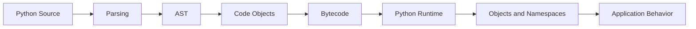

# README

## Overview

The `01- Fundamentals` section establishes the core Python knowledge required for professional backend development.

The focus is not on learning Python syntax in isolation. The goal is to understand the language's semantics, runtime behavior, built-in abstractions, and idiomatic patterns well enough to write code that remains correct, maintainable, testable, and operationally safe as applications grow.

This section forms the foundation for the later Python Forge Playbook sections:

```text
01- Fundamentals
        |
        v
02- Object Oriented Programming
        |
        v
03- Intermediate Python
        |
        v
04- Error Handling
        |
        v
05- Files and Serialization
        |
        v
06- Type System
        |
        v
07- Dataclasses and Data Modeling
        |
        v
08- Concurrency and Parallelism
        |
        v
09- Memory and Performance
        |
        v
10- Backend Python
        |
        v
11- Testing
        |
        v
12- Interview Preparation
```

The fundamentals section should be treated as a reference layer that later topics continuously build upon.

## Scope

This section covers:

- Python's role and characteristics
- Python's execution model
- Variables and data types
- Control flow
- Functions
- Comprehensions
- Iterables and iterators
- Modules and imports
- Packages
- Built-in functions
- Python coding conventions

These topics collectively establish the language-level mental model required before moving into object-oriented design, concurrency, performance optimization, backend architecture, and testing.

## Folder Structure

```text
01- Fundamentals/
├── 01- Python Overview.md
├── 02- Execution Model.md
├── 03- Variables and Data Types.md
├── 04- Control Flow.md
├── 05- Functions.md
├── 06- Comprehensions.md
├── 07- Iterators and Iterables.md
├── 08- Modules and Imports.md
├── 09- Packages.md
├── 10- Built-in Functions.md
├── 11- Coding Conventions.md
└── README.md
```

## Learning Path

The files are ordered to build a progressively stronger mental model.

| # | File | Topic | Primary Focus |
|---|---|---|---|
| 01 | [Python Overview](01-%20Python%20Overview.md) | Python Overview | Python's role, characteristics, runtime, ecosystem, and backend relevance |
| 02 | [Execution Model](02-%20Execution%20Model.md) | Execution Model | Source code, bytecode, runtime execution, namespaces, frames, imports, and process behavior |
| 03 | [Variables and Data Types](03-%20Variables%20and%20Data%20Types.md) | Variables and Data Types | Names, references, objects, mutability, built-in types, equality, identity, and type behavior |
| 04 | [Control Flow](04-%20Control%20Flow.md) | Control Flow | Conditions, loops, iteration, branching, pattern matching, and request-processing logic |
| 05 | [Functions](05-%20Functions.md) | Functions | Function semantics, parameters, scopes, return values, closures, composition, and backend design |
| 06 | [Comprehensions](06-%20Comprehensions.md) | Comprehensions | List, set, dictionary, and generator expressions with readability and memory considerations |
| 07 | [Iterators and Iterables](07-%20Iterators%20and%20Iterables.md) | Iterators and Iterables | Iterator protocols, lazy evaluation, generators, streaming, and data pipelines |
| 08 | [Modules and Imports](08-%20Modules%20and%20Imports.md) | Modules and Imports | Namespaces, import resolution, module caching, dependency graphs, and import behavior |
| 09 | [Packages](09-%20Packages.md) | Packages | Package structure, namespaces, distribution, dependency boundaries, and application organization |
| 10 | [Built-in Functions](10-%20Built-in%20Functions.md) | Built-in Functions | Core Python functions, object protocols, iteration, conversion, inspection, and I/O |
| 11 | [Coding Conventions](11-%20Coding%20Conventions.md) | Coding Conventions | PEP 8, naming, formatting, tooling, maintainability, testing, security, and production standards |

## Recommended Progression

A practical progression is:

```text
Python language model
        |
        v
Execution and object semantics
        |
        v
Variables and control flow
        |
        v
Functions and data transformations
        |
        v
Iteration and lazy processing
        |
        v
Modules and package boundaries
        |
        v
Built-in language capabilities
        |
        v
Production coding conventions
```

The sequence is intentional.

For example, understanding iterators is easier after understanding functions and control flow, while understanding packages is easier after understanding modules and imports.

## Python Mental Model

The most important conceptual model for this section is that Python code operates on objects referenced by names.

```text
Name
 |
 | references
 v
Object
 |
 +--> Type
 +--> Identity
 +--> Value
 +--> Behavior
```

For example:

```python
orders = ["order-1", "order-2"]
```

The name:

```text
orders
```

refers to a list object.

Assignment generally binds another name rather than copying the object:

```python
orders_copy = orders
```

Both names now reference the same list.

Understanding this distinction is critical for reasoning about:

- Mutability
- Aliasing
- Function arguments
- Shared state
- Concurrency
- Memory
- Object identity
- Side effects

## Execution Model

Python source code is processed through several stages before application behavior occurs.



The execution model explains important production behaviors such as:

- Name resolution
- Function calls
- Stack frames
- Imports
- Exceptions
- Recursion
- Module initialization
- Process-level state
- Async execution

A backend engineer should understand these mechanisms well enough to diagnose unexpected behavior rather than treating Python as a black box.

## Variables and Data Types

Python uses dynamic typing.

A name does not have a permanent type:

```python
value = 42
value = "42"
```

The objects have types:

```text
42      -> int
"42"    -> str
```

This flexibility is useful but places responsibility on application boundaries to validate external data.

Important built-in types include:

```text
None
bool
int
float
Decimal
str
bytes
list
tuple
set
dict
```

The section emphasizes:

- Mutability
- Hashability
- Identity vs equality
- Truthiness
- Copying
- Type conversion
- Memory implications
- Serialization boundaries

## Control Flow

Control flow determines how Python executes application logic.

Core constructs include:

```python
if
elif
else
for
while
break
continue
return
raise
match
```

Backend code uses these constructs extensively:

```text
HTTP Request
    |
    v
Validation
    |
    +---- invalid ---> Error Response
    |
    v
Authorization
    |
    +---- denied ----> Forbidden Response
    |
    v
Business Logic
    |
    v
Persistence
    |
    v
Response
```

Understanding short-circuit evaluation, iteration behavior, exception control flow, and guard clauses is important for writing predictable request-processing logic.

## Functions

Functions are one of Python's most important abstraction mechanisms.

They provide:

- Reusable behavior
- Encapsulation
- Dependency boundaries
- Testable units
- Composition
- Higher-order behavior

Important concepts include:

- Parameter binding
- Positional and keyword arguments
- Positional-only parameters
- Keyword-only parameters
- Default arguments
- `*args`
- `**kwargs`
- Return values
- Type annotations
- Scope
- Closures
- Recursion
- Side effects
- Dependency injection

For backend systems, functions often form the boundaries between:

```text
API Layer
    |
    v
Application Service
    |
    v
Domain Logic
    |
    v
Repository
    |
    v
Infrastructure
```

Good function design reduces coupling and makes these boundaries easier to test and evolve.

## Comprehensions

Comprehensions provide concise ways to transform and filter iterables.

Common forms include:

```python
values = [transform(value) for value in items]

unique_values = {
    transform(value)
    for value in items
}

mapping = {
    item.id: item
    for item in items
}
```

Generator expressions provide lazy processing:

```python
total = sum(
    order.total
    for order in orders
)
```

The important engineering distinction is whether data is materialized or processed lazily.

For large datasets:

```text
Materialization
    |
    v
Entire collection in memory

Lazy processing
    |
    v
One value at a time
```

This becomes especially important when processing database cursors, files, API responses, or message streams.

## Iterators and Iterables

Python's iteration model is protocol-based.

The fundamental relationship is:

```text
Iterable
   |
   | iter()
   v
Iterator
   |
   | next()
   v
Value
   |
   | exhausted
   v
StopIteration
```

This model powers:

- `for` loops
- Generators
- Files
- Database cursors
- Pagination
- Streaming APIs
- Message processing

Understanding the iterator protocol is essential for memory-efficient backend and data-processing systems.

## Modules and Imports

A module is generally a Python source file that defines a namespace.

Imports establish dependencies between modules:

```python
from application.services.orders import create_order
```

Important concepts include:

- Module namespaces
- Absolute imports
- Relative imports
- `sys.path`
- `sys.modules`
- Import caching
- `__name__`
- `__all__`
- Import-time execution
- Circular imports
- Dependency graphs
- Optional dependencies
- Dynamic imports

A backend application's import graph should be understandable and preferably acyclic.

```text
API
 |
 v
Services
 |
 v
Domain
 |
 v
Repositories
 |
 v
Infrastructure
```

Import boundaries are architectural boundaries within a Python process.

## Packages

Packages organize modules into larger namespaces.

A production application might use:

```text
application/
├── api/
├── domain/
├── services/
├── repositories/
└── infrastructure/
```

Packages provide:

- Namespace organization
- Dependency boundaries
- Public APIs
- Distribution structure
- Architectural grouping
- Reusable components

Package design becomes increasingly important as a Python codebase grows from a small application into a multi-team backend platform.

Packages should represent meaningful responsibilities rather than simply serving as directories for miscellaneous files.

## Built-in Functions

Python provides many built-in functions without requiring imports.

Important examples include:

```python
len()
isinstance()
issubclass()
callable()
sorted()
enumerate()
zip()
range()
map()
filter()
sum()
min()
max()
any()
all()
iter()
next()
open()
```

These functions often operate through Python's underlying protocols.

For example:

```python
sum(
    order.total
    for order in orders
)
```

combines:

```text
Generator expression
        |
        v
Iterator protocol
        |
        v
sum()
        |
        v
Aggregate result
```

Understanding these built-ins improves both code quality and performance reasoning.

## Coding Conventions

The final topic establishes conventions for writing maintainable Python.

Important areas include:

- PEP 8
- Naming
- Formatting
- Imports
- Type hints
- Comments
- Docstrings
- Error handling
- Logging
- Testing
- Security
- Async code
- Dependency injection
- CI/CD
- Code review

Modern Python projects should automate mechanical conventions.

A typical workflow is:

```text
Source Code
    |
    v
Formatter
    |
    v
Linter
    |
    v
Type Checker
    |
    v
Tests
    |
    v
Code Review
    |
    v
CI/CD
```

Human review should focus primarily on correctness, architecture, security, reliability, performance, and maintainability rather than formatting disputes.

## Backend Engineering Context

The fundamentals in this section directly map to production backend systems.

### HTTP APIs

Python frameworks such as FastAPI and Django build on the language fundamentals covered here.

A typical request lifecycle is:

```text
Client
  |
  v
Nginx / Load Balancer
  |
  v
Python Application
  |
  +--> Routing
  |
  +--> Validation
  |
  +--> Authentication
  |
  +--> Business Logic
  |
  +--> Database / Cache / Queue
  |
  v
HTTP Response
```

Functions, modules, packages, exceptions, types, iterators, and built-ins all participate in this lifecycle.

### Database Access

Python frequently acts as the application layer between APIs and PostgreSQL.

```text
FastAPI / Django
       |
       v
Service Layer
       |
       v
Repository
       |
       v
PostgreSQL
```

Fundamental Python concepts affect database behavior:

- Iteration affects result processing
- Functions define transaction boundaries
- Exceptions represent database failures
- Packages define repository boundaries
- Type hints clarify data contracts
- Built-ins perform application-level aggregation

### Caching

Redis introduces a distributed state boundary:

```text
Python Process
     |
     v
Redis
     |
     v
Shared Cache
```

This is different from module-level Python state:

```text
Process A -> memory A
Process B -> memory B
```

Understanding Python's object and process model prevents incorrect assumptions about global state.

### Messaging

Kafka and Celery introduce asynchronous processing:

```text
HTTP Request
     |
     v
Python Service
     |
     v
Message / Task
     |
     +----> Kafka
     |
     +----> Celery
                |
                v
             Worker
```

Python fundamentals such as functions, exceptions, iteration, serialization, and process behavior become the foundation for reliable workers.

## Memory and Performance

Fundamental Python knowledge should include an awareness of performance characteristics.

For example:

```python
users = list(generate_users())
```

materializes the entire sequence.

Whereas:

```python
for user in generate_users():
    process(user)
```

can process records incrementally.

Important performance topics introduced by this section include:

- Object allocation
- References
- Mutability
- Collection complexity
- Lazy evaluation
- Function calls
- Iteration
- Import overhead
- Materialization
- I/O vs CPU costs

Optimization should be driven by measurement rather than stylistic preference.

## Concurrency Awareness

Concurrency is covered deeply later in the playbook, but fundamental Python code should already respect concurrency boundaries.

A module-level object:

```python
cache = {}
```

is not automatically shared across processes.

In a Kubernetes deployment:

```text
Pod A
└── Python Process
    └── cache A

Pod B
└── Python Process
    └── cache B
```

This distinction is essential when designing applications that run under:

- Uvicorn
- Gunicorn
- Celery
- Kubernetes
- Docker
- AWS compute services

## Security Foundations

Python fundamentals also establish important security practices.

Avoid unsafe dynamic execution:

```python
eval(user_input)
```

Validate external input before it reaches business logic.

Avoid unsafe filesystem access:

```python
open(user_supplied_path)
```

without appropriate validation.

Avoid embedding credentials:

```python
DATABASE_PASSWORD = "secret"
```

Security is not a separate layer added after implementation. Language-level decisions directly influence application security.

## Testing Foundations

Testing depends on many fundamentals from this section.

A well-structured function:

```python
def calculate_total(
    subtotal: Decimal,
    tax: Decimal,
) -> Decimal:
    return subtotal + tax
```

is easier to test than logic hidden inside a large request handler.

Clear modules and packages make dependencies easier to isolate.

Explicit functions and types make behavior easier to reason about.

Later testing topics build on these foundations with:

- `unittest`
- `pytest`
- Fixtures
- Mocking
- Integration testing
- API testing
- Database testing
- Coverage

## Production Quality Model

A useful model for evaluating Python fundamentals is:

```text
Readable
   |
   v
Correct
   |
   v
Testable
   |
   v
Maintainable
   |
   v
Observable
   |
   v
Secure
   |
   v
Performant
   |
   v
Operationally Reliable
```

A piece of code should not be considered production-ready merely because it executes successfully.

Production quality also requires understanding:

- Failure behavior
- Resource usage
- Dependency boundaries
- Concurrency
- Security
- Observability
- Deployment behavior
- Long-term maintainability

## Common Mistakes

The most common mistakes in Python fundamentals are not usually syntax errors. They are incorrect mental models.

### Confusing Names With Objects

```python
a = []
b = a
```

does not create two lists.

Both names reference the same object.

### Using Mutable Defaults

```python
def process(items=[]):
    ...
```

creates a shared default object across calls.

### Confusing Equality With Identity

Use:

```python
a == b
```

for equality.

Use:

```python
a is b
```

for identity.

For `None`:

```python
value is None
```

is the idiomatic check.

### Materializing Large Data Unnecessarily

```python
records = list(generate_records())
```

can create significant memory pressure.

### Ignoring Import Architecture

Circular imports and heavy import-time side effects can cause startup failures and make systems difficult to maintain.

### Treating Module State as Distributed State

Python module state is process-local.

### Blocking Async Applications

Synchronous blocking operations can stall an async event loop.

### Catching Every Exception

```python
except Exception:
    pass
```

hides failures and makes operational debugging difficult.

### Optimizing Without Measurement

Readable code should normally be preferred until profiling demonstrates a meaningful bottleneck.

## Senior Engineering Perspective

At the senior level, Python fundamentals are less about remembering syntax and more about understanding consequences.

For any piece of Python code, ask:

```text
What objects are involved?
        |
How are names bound?
        |
What protocol is being used?
        |
What happens at runtime?
        |
What is the memory cost?
        |
What happens on failure?
        |
What happens concurrently?
        |
What happens across processes?
        |
How is it tested?
        |
How is it observed?
        |
How does it behave in production?
```

This mindset turns language knowledge into engineering judgment.

For example, a simple-looking operation:

```python
users = list(fetch_users())
```

can require several questions:

- How many users can exist?
- Is the source a database cursor?
- Is the result bounded?
- How much memory does materialization require?
- Can the operation stream instead?
- What happens if the database connection fails?
- Is the operation executed inside an async request?
- Should PostgreSQL perform filtering or aggregation instead?
- Is pagination required?
- Is the operation observable?

The syntax is simple. The engineering implications are not.

## Reference Principles

The following principles should guide work throughout this section:

- Understand Python's object and execution model rather than relying solely on syntax.
- Prefer explicit, readable code over clever code.
- Treat mutability and shared references as deliberate design decisions.
- Use Python protocols such as iteration and context management rather than reimplementing their behavior.
- Keep modules and packages cohesive with clear dependency direction.
- Validate untrusted data at application boundaries.
- Keep external I/O explicit and resource lifecycles controlled.
- Preserve meaningful exception context.
- Use type hints to communicate important contracts.
- Avoid unnecessary materialization of large datasets.
- Keep async code non-blocking.
- Treat process-local state differently from distributed state.
- Push suitable data-intensive operations to systems designed for them, such as PostgreSQL or Redis.
- Automate formatting, linting, type checking, and tests in CI/CD.
- Prefer measurement over assumptions when optimizing performance.
- Design code with testing, observability, security, and operational behavior in mind.

## Key Takeaways

- Python fundamentals provide the language-level mental model required for everything that follows in the Python Forge Playbook, from OOP and concurrency to backend architecture and testing.
- The most important concepts are names and objects, execution semantics, mutability, functions, iteration protocols, imports, packages, and Python's built-in abstractions.
- Production Python requires more than correct syntax: code must account for memory, concurrency, failures, security, testing, observability, and deployment behavior.
- Clear functions, cohesive modules, deliberate package boundaries, explicit dependencies, and idiomatic Python make backend systems easier to evolve and operate.
- Senior Python engineering comes from understanding the runtime and system-level consequences behind seemingly simple language constructs.