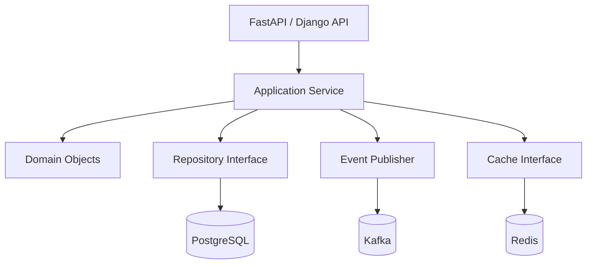

# README

## Overview

The `02- Object Oriented Programming` section develops the object-oriented programming knowledge required to design maintainable Python applications and production backend systems.

Python is object-oriented at its core: values are objects, classes are objects, functions are objects, and behavior is implemented through protocols, attributes, inheritance, composition, and method dispatch.

The purpose of this section is not to force every Python application into an object-oriented architecture. Instead, it develops the ability to recognize when objects, classes, abstractions, composition, inheritance, or protocol-based designs provide a meaningful engineering advantage.

The progression is:

```text
Python Object Model
        |
        v
Classes and Objects
        |
        v
Attributes and Methods
        |
        v
Initialization and Encapsulation
        |
        v
Inheritance and Composition
        |
        v
Polymorphism and Abstraction
        |
        v
MRO and Multiple Inheritance
        |
        v
Dunder Methods and Properties
        |
        v
Descriptors and Abstract Base Classes
        |
        v
Protocols and Dependency Injection
        |
        v
OOP Design Principles
```

These concepts form the foundation for later topics such as dependency injection, service-layer design, repository patterns, domain modeling, testing, concurrency, and Python-based system design.

## Folder Structure

```text
02- Object Oriented Programming/
├── 01- OOP Fundamentals.md
├── 02- Classes and Objects.md
├── 03- Instance Attributes and Methods.md
├── 04- Class Attributes and Methods.md
├── 05- Constructors and Initialization.md
├── 06- Encapsulation.md
├── 07- Inheritance.md
├── 08- Composition.md
├── 09- Polymorphism.md
├── 10- Abstraction.md
├── 11- Method Resolution Order.md
├── 12- Multiple Inheritance.md
├── 13- Super.md
├── 14- Dunder Methods.md
├── 15- Properties.md
├── 16- Descriptors.md
├── 17- Abstract Base Classes.md
├── 18- Protocols.md
├── 19- Dependency Injection.md
├── 20- OOP Design Principles.md
└── README.md
```

## Section Map

| File | Topic | Primary Focus |
|---|---|---|
| `01- OOP Fundamentals.md` | OOP Fundamentals | Object-oriented thinking, objects, classes, state, behavior, identity, and Python's object model |
| `02- Classes and Objects.md` | Classes and Objects | Class definitions, instances, namespaces, attributes, methods, and object lifecycle |
| `03- Instance Attributes and Methods.md` | Instance Attributes and Methods | Per-object state, instance methods, `self`, attribute lookup, and encapsulation boundaries |
| `04- Class Attributes and Methods.md` | Class Attributes and Methods | Shared class state, `classmethod`, `staticmethod`, and class-level behavior |
| `05- Constructors and Initialization.md` | Constructors and Initialization | `__new__`, `__init__`, initialization contracts, factories, and object creation |
| `06- Encapsulation.md` | Encapsulation | Public APIs, internal implementation, naming conventions, invariants, and controlled state |
| `07- Inheritance.md` | Inheritance | Reuse through inheritance, subtype relationships, overriding, and inheritance tradeoffs |
| `08- Composition.md` | Composition | Building objects from collaborating components and preferring composition where appropriate |
| `09- Polymorphism.md` | Polymorphism | Common interfaces, dynamic dispatch, substitutability, and interchangeable implementations |
| `10- Abstraction.md` | Abstraction | Hiding implementation details, defining contracts, and managing complexity |
| `11- Method Resolution Order.md` | Method Resolution Order | Python's C3 linearization, attribute lookup, inheritance graphs, and `super()` behavior |
| `12- Multiple Inheritance.md` | Multiple Inheritance | Multiple inheritance design, mixins, cooperative inheritance, and associated risks |
| `13- Super.md` | Super | Cooperative method calls, MRO-aware dispatch, and correct use of `super()` |
| `14- Dunder Methods.md` | Dunder Methods | Python data model methods for comparison, iteration, representation, context management, and operators |
| `15- Properties.md` | Properties | Managed attributes, validation, computed values, and API evolution |
| `16- Descriptors.md` | Descriptors | Attribute access machinery, `__get__`, `__set__`, `__delete__`, and framework-level abstractions |
| `17- Abstract Base Classes.md` | Abstract Base Classes | Explicit interfaces, abstract methods, runtime checks, and inheritance-based contracts |
| `18- Protocols.md` | Protocols | Structural typing, duck typing, static contracts, and decoupled interfaces |
| `19- Dependency Injection.md` | Dependency Injection | Explicit dependencies, inversion of control, testability, and backend architecture |
| `20- OOP Design Principles.md` | OOP Design Principles | SOLID, cohesion, coupling, composition, boundaries, and production-oriented OOP design |

## OOP Mental Model

The core model is:

```text
Class
  |
  | defines
  v
Object Instance
  |
  +--> State
  |
  +--> Behavior
  |
  +--> Identity
  |
  +--> Type
```

For example:

```python
class Order:
    def __init__(self, order_id: int, total: Decimal) -> None:
        self.order_id = order_id
        self.total = total

    def is_high_value(self) -> bool:
        return self.total >= Decimal("1000")
```

An instance:

```python
order = Order(
    order_id=42,
    total=Decimal("1250.00"),
)
```

contains state:

```text
order_id = 42
total    = 1250.00
```

and exposes behavior:

```text
is_high_value()
```

The important design question is not simply whether a class can represent something. It is whether keeping state and behavior together creates a useful abstraction.

## Python's Object Model

Python's OOP model differs from traditional class-centric languages in several important ways.

In Python:

```text
Everything is an object
```

This includes:

```python
42
"hello"
[1, 2, 3]
lambda: None
Order
Order(...)
```

Classes themselves are objects, typically instances of `type`.

This enables powerful features such as:

- Dynamic attribute access
- Metaprogramming
- Descriptors
- Dynamic dispatch
- Class decorators
- Custom metaclasses
- Protocol-based interfaces

The section progressively builds toward understanding these mechanisms without requiring metaprogramming for ordinary application development.

## State and Behavior

A useful object-oriented design combines related state and behavior.

For example:

```python
class BankAccount:
    def __init__(self, balance: Decimal) -> None:
        self._balance = balance

    def withdraw(self, amount: Decimal) -> None:
        if amount <= 0:
            raise ValueError("Amount must be positive")

        if amount > self._balance:
            raise ValueError("Insufficient balance")

        self._balance -= amount
```

The invariant:

```text
balance must not become negative
```

is enforced by the object's behavior.

This is more valuable than creating a class merely because a noun exists in the domain.

## OOP and Backend Architecture

Object-oriented design is frequently used to structure backend applications.

A service may be organized as:

```text
API Layer
    |
    v
Application Service
    |
    +----> Domain Objects
    |
    +----> Repository Interface
                |
                v
        PostgreSQL Implementation
```

For example:

```python
class OrderService:
    def __init__(
        self,
        repository: OrderRepository,
        payment_gateway: PaymentGateway,
    ) -> None:
        self.repository = repository
        self.payment_gateway = payment_gateway

    def create_order(self, command: CreateOrderCommand) -> Order:
        ...
```

The class is useful because it represents a long-lived collaboration boundary and makes dependencies explicit.

## OOP vs Procedural Code

Not every piece of backend logic requires a class.

A pure transformation may be clearer as a function:

```python
def calculate_total(
    subtotal: Decimal,
    tax: Decimal,
) -> Decimal:
    return subtotal + tax
```

An object becomes more useful when the system needs:

- Encapsulated state
- Multiple related operations
- Lifecycle management
- Dependency ownership
- Polymorphism
- A stable abstraction
- Domain invariants

A common mistake is turning every function into a class method simply because the project is described as "object-oriented."

## Classes as Dependency Boundaries

Classes are particularly useful when they own dependencies.

```python
class UserRepository:
    def __init__(self, database: Database) -> None:
        self.database = database

    def get_by_id(self, user_id: int) -> User | None:
        ...
```

The repository now has an explicit dependency:

```text
UserRepository
       |
       v
    Database
```

This improves:

- Testing
- Dependency replacement
- Configuration
- Resource ownership
- Architectural clarity

## Composition

Composition combines objects instead of inheriting behavior.

```python
class OrderService:
    def __init__(
        self,
        repository: OrderRepository,
        publisher: EventPublisher,
    ) -> None:
        self.repository = repository
        self.publisher = publisher
```

The service has:

```text
OrderRepository
EventPublisher
```

rather than inheriting from them.

Composition is often preferred in backend systems because it reduces coupling and makes dependencies explicit.

## Inheritance

Inheritance models an "is-a" relationship.

```python
class PaymentGateway:
    ...


class StripePaymentGateway(PaymentGateway):
    ...
```

Inheritance can provide:

- Shared behavior
- Polymorphism
- Framework integration
- Extension points

However, inheritance creates strong coupling between base and derived classes.

Use it when the subtype relationship is meaningful and stable.

Do not use inheritance simply to reuse a few methods.

## Polymorphism

Polymorphism allows code to operate against an abstraction while different implementations provide the behavior.

```text
PaymentGateway
      |
      +----> StripePaymentGateway
      |
      +----> AdyenPaymentGateway
      |
      +----> MockPaymentGateway
```

The application can depend on:

```python
gateway.authorize(payment)
```

without needing to know the concrete implementation.

This becomes particularly valuable for:

- External integrations
- Testing
- Feature switching
- Multi-provider systems
- Plugin architectures

## Abstraction

Abstraction defines what a component provides without requiring consumers to understand how it works.

For example:

```python
class PaymentGateway(Protocol):
    def authorize(self, payment: Payment) -> Authorization:
        ...
```

The application depends on the capability:

```text
authorize(payment)
```

rather than the implementation:

```text
Stripe HTTP request
```

This allows infrastructure details to remain behind the boundary.

## Encapsulation

Encapsulation protects invariants and controls how state changes.

A Python convention such as:

```python
self._balance
```

signals internal state.

But Python does not provide strict private fields in the same sense as some statically enforced languages.

True encapsulation comes from API design:

```python
account.withdraw(amount)
```

rather than allowing callers to freely manipulate:

```python
account._balance -= amount
```

The important boundary is behavioral, not merely syntactic.

## Dunder Methods

Python's data model allows objects to participate in language operations through special methods.

Examples include:

```python
__init__
__repr__
__eq__
__hash__
__len__
__iter__
__next__
__enter__
__exit__
```

These methods allow custom objects to integrate naturally with Python syntax and built-ins.

For example:

```python
class OrderCollection:
    def __init__(self, orders: list[Order]) -> None:
        self._orders = orders

    def __len__(self) -> int:
        return len(self._orders)

    def __iter__(self):
        return iter(self._orders)
```

Then:

```python
len(collection)

for order in collection:
    ...
```

works naturally.

## Properties

Properties allow attribute syntax to invoke controlled behavior.

```python
class User:
    def __init__(self, email: str) -> None:
        self._email = email

    @property
    def email(self) -> str:
        return self._email
```

Properties are useful for:

- Validation
- Computed attributes
- Backward-compatible API evolution
- Controlled mutation

They should not be used merely to add ceremony around trivial attributes.

## Descriptors

Descriptors provide the underlying machinery behind several Python features, including properties.

A descriptor can control attribute access:

```text
obj.attribute
     |
     v
Descriptor protocol
     |
     +--> __get__
     +--> __set__
     +--> __delete__
```

Descriptors are important for understanding how Python frameworks implement:

- ORM fields
- Validation
- Properties
- Lazy attributes
- Dependency injection
- Declarative configuration

They are powerful but should generally remain a framework or infrastructure-level tool rather than an everyday application abstraction.

## Abstract Base Classes

Abstract Base Classes provide explicit inheritance-based contracts.

```python
from abc import ABC, abstractmethod


class PaymentGateway(ABC):
    @abstractmethod
    def authorize(self, payment: Payment) -> Authorization:
        ...
```

ABCs are useful when:

- A framework needs runtime enforcement
- A hierarchy has meaningful shared behavior
- Instantiation of incomplete implementations should be prevented

They are not the only way to define interfaces in Python.

## Protocols

Protocols provide structural typing.

Conceptually:

```text
Nominal typing
    |
    v
"Must inherit from this class"

Structural typing
    |
    v
"Must provide this behavior"
```

For example:

```python
from typing import Protocol


class EventPublisher(Protocol):
    def publish(self, event: Event) -> None:
        ...
```

Any compatible implementation can satisfy the protocol for static type checking without inheriting from it.

This is particularly useful for dependency injection and testing.

## Dependency Injection

Dependency injection makes object dependencies explicit.

Avoid:

```python
class OrderService:
    def __init__(self) -> None:
        self.repository = PostgresOrderRepository()
```

Prefer:

```python
class OrderService:
    def __init__(
        self,
        repository: OrderRepository,
    ) -> None:
        self.repository = repository
```

The composition root decides which implementation to use:

```text
Application Startup
       |
       +--> PostgresOrderRepository
       |
       v
   OrderService
```

Tests can provide:

```text
FakeOrderRepository
```

without modifying `OrderService`.

## Method Resolution Order

Python uses Method Resolution Order (MRO) to determine attribute and method lookup across inheritance hierarchies.

For a simple hierarchy:

```text
Base
 |
 v
Child
```

lookup begins with `Child` before moving toward `Base`.

With multiple inheritance, Python uses C3 linearization to produce a consistent ordering.

This matters because `super()` follows the MRO rather than simply calling a hard-coded parent class.

The dedicated MRO and `super()` documents cover this in detail.

## Multiple Inheritance

Python supports:

```python
class Combined(BaseA, BaseB):
    ...
```

Multiple inheritance can be useful for:

- Mixins
- Framework extension points
- Cooperative class hierarchies

It can also introduce:

- Complex MROs
- Initialization problems
- Tight coupling
- Difficult debugging

Prefer composition unless multiple inheritance provides a clear, stable design advantage.

## OOP and Frameworks

### Django

Django uses object-oriented abstractions extensively:

```text
Model
 |
 +--> Fields
 +--> Query behavior
 +--> Managers
 +--> Model methods
```

Django's class-based views and ORM also rely heavily on inheritance and descriptors.

Understanding Python's object model helps explain framework behavior instead of treating framework APIs as magic.

### FastAPI

FastAPI commonly uses classes for:

- Services
- Repositories
- Clients
- Dependency containers
- Application components

It also supports dependency injection:

```python
def get_order_service() -> OrderService:
    ...
```

The underlying principle remains explicit dependency management.

### ORM Systems

ORM models are object-oriented representations of database records.

```text
Python Object
     |
     v
ORM Mapping
     |
     v
SQL
     |
     v
PostgreSQL
```

Engineers should understand that the object model and relational model are different abstractions.

An ORM does not eliminate database concepts such as:

- Transactions
- Indexes
- Isolation
- Query planning
- Locking
- Connection pooling

## OOP and Microservices

Object-oriented design applies primarily within a service boundary.

For example:

```text
Order Service
├── API
├── Application Services
├── Domain Objects
├── Repositories
└── Infrastructure
```

Another service should not depend on internal Python classes.

Cross-service communication should use explicit contracts:

```text
REST
gRPC
Kafka
```

rather than Python imports.

## OOP and Testing

Well-designed objects can improve testability.

For example:

```python
class OrderService:
    def __init__(
        self,
        repository: OrderRepository,
        publisher: EventPublisher,
    ) -> None:
        self.repository = repository
        self.publisher = publisher
```

A test can supply controlled implementations:

```text
OrderService
    |
    +--> FakeOrderRepository
    |
    +--> FakeEventPublisher
```

This is generally more robust than patching every internal method call.

Good object design therefore supports testing through explicit boundaries rather than through extensive mocking.

## OOP and Concurrency

Object-oriented code does not automatically become thread-safe.

This class:

```python
class Counter:
    def __init__(self) -> None:
        self.value = 0

    def increment(self) -> None:
        self.value += 1
```

contains mutable shared state.

If multiple threads access the same instance, synchronization may be required.

In multi-process deployments, each process normally has a separate object instance:

```text
Worker 1 -> Counter A
Worker 2 -> Counter B
Worker 3 -> Counter C
```

For distributed state, use an appropriate external system such as Redis or PostgreSQL.

## OOP and Memory

Each object carries runtime overhead.

Creating large numbers of tiny objects can increase:

- Memory usage
- Garbage-collection pressure
- Allocation overhead
- Serialization cost

For ordinary backend workloads, this is usually acceptable.

For very large data-processing workloads, consider:

- Built-in collections
- Generators
- Dataclasses with `slots=True`
- Array-oriented structures
- Streaming
- Specialized data-processing libraries

Do not create elaborate object hierarchies for data that is naturally represented as simple records.

## OOP and Performance

Abstractions can introduce overhead through:

- Method dispatch
- Object allocation
- Attribute lookup
- Indirection
- Serialization

These costs are usually negligible compared with database and network latency in typical APIs.

For example:

```text
HTTP request:       milliseconds
Database query:     milliseconds
Remote API call:    milliseconds to seconds
Python method call: microseconds or less in many ordinary cases
```

Optimize architecture and I/O before removing useful abstractions for hypothetical micro-performance gains.

## OOP Design Principles

The final document in this section consolidates design principles such as:

- Single Responsibility Principle
- Open/Closed Principle
- Liskov Substitution Principle
- Interface Segregation Principle
- Dependency Inversion Principle
- High cohesion
- Low coupling
- Composition over inheritance
- Explicit dependencies
- Stable abstractions

These principles should be treated as decision-making tools rather than rigid rules.

For example, applying dependency inversion everywhere can produce unnecessary abstraction in a small component.

## Cohesion and Coupling

Two important architectural properties are:

```text
High Cohesion
     +
Low Coupling
     |
     v
Maintainable Design
```

High cohesion means related behavior stays together.

Low coupling means components do not depend unnecessarily on internal details of other components.

A useful package might look like:

```text
orders/
├── domain.py
├── service.py
├── repository.py
└── api.py
```

whereas a generic package containing unrelated services creates unnecessary coupling.

## When Not to Use OOP

Object-oriented design is not automatically superior.

Prefer simple functions and data structures when:

- State is minimal
- Behavior is stateless
- The logic is naturally functional
- A class would only wrap one function
- No meaningful lifecycle exists
- No polymorphism is required
- The abstraction would obscure rather than clarify behavior

For example:

```python
def normalize_email(email: str) -> str:
    return email.strip().lower()
```

does not need:

```python
class EmailNormalizer:
    def normalize(self, email: str) -> str:
        ...
```

unless the class provides meaningful state, dependencies, or an architectural boundary.

## Common OOP Mistakes

### Classifying Everything as an Object

Not every piece of logic requires a class.

### Deep Inheritance Hierarchies

Deep inheritance makes behavior difficult to trace and increases coupling.

### Using Inheritance for Code Reuse

Reuse alone is not sufficient justification for inheritance.

### God Objects

A class that owns validation, persistence, networking, caching, messaging, and business logic becomes difficult to test and maintain.

### Hidden Dependencies

Constructing dependencies internally prevents callers from controlling behavior.

### Excessive Getters and Setters

Python's property mechanism should not be used to mechanically reproduce Java-style accessor patterns.

### Overusing Abstract Classes

An abstraction should solve a real coupling or substitution problem.

### Premature Design Patterns

Do not introduce factories, strategies, managers, adapters, and registries before the problem requires them.

### Mutable Shared State

Object-oriented encapsulation does not eliminate race conditions.

### Ignoring Object Lifecycle

Long-lived objects may own resources such as:

- Database connections
- HTTP clients
- File handles
- Locks
- Background tasks

Their lifecycle should be explicit.

## Production Design Checklist

When introducing a class, ask:

| Question | Engineering Concern |
|---|---|
| What responsibility does it own? | Cohesion |
| What state does it manage? | Encapsulation |
| Which dependencies does it require? | Coupling |
| Can dependencies be injected? | Testability |
| Does it need inheritance? | Hierarchy complexity |
| Would composition be simpler? | Maintainability |
| Does it expose a stable interface? | API design |
| Is it safe under concurrency? | Shared state |
| Does it own resources? | Lifecycle |
| How will it be tested? | Testability |
| How will it be observed? | Operations |
| How does it behave under failure? | Reliability |
| Does object allocation matter at scale? | Performance |
| Does it cross a service boundary? | Architecture |

## Production OOP Architecture

A practical backend architecture might use:



The object-oriented design should support these boundaries rather than becoming an abstraction layer for its own sake.

A well-designed service can replace infrastructure implementations without rewriting business logic:

```text
Production
    |
    +--> PostgreSQL Repository
    +--> Redis Cache
    +--> Kafka Publisher

Testing
    |
    +--> In-Memory Repository
    +--> Fake Cache
    +--> Fake Publisher
```

## Security Considerations

OOP design can support security through controlled boundaries, but classes do not provide security automatically.

Important practices include:

- Keep authorization decisions close to domain operations.
- Do not expose sensitive internal state unnecessarily.
- Avoid logging object representations that contain secrets.
- Validate external input before constructing domain objects.
- Do not assume private naming conventions prevent access.
- Avoid dynamic attribute access from untrusted input.
- Keep credential ownership explicit.
- Separate authentication infrastructure from business-domain behavior.

For example, a payment object should not expose secret API credentials merely because a payment gateway needs them internally.

## Reliability Considerations

Objects that own external resources should define clear lifecycle behavior.

For example:

```text
Application Startup
      |
      v
Create Client
      |
      v
Use Client
      |
      v
Health / Metrics
      |
      v
Graceful Shutdown
      |
      v
Close Client
```

This is particularly relevant to:

- Database clients
- HTTP clients
- Redis clients
- Kafka producers
- File resources
- Background workers

Avoid relying on garbage collection for timely cleanup of critical resources.

## Observability

Classes representing important application boundaries should produce meaningful operational signals.

For example:

```text
OrderService
    |
    +--> order.create.started
    +--> order.create.succeeded
    +--> order.create.failed
```

Useful observability may include:

- Structured logs
- Metrics
- Distributed traces
- Request IDs
- Domain event identifiers
- Dependency latency

Do not add logging to every method automatically. Instrument meaningful operations and failure boundaries.

## Scalability Considerations

Object-oriented architecture should remain compatible with horizontal scaling.

A service deployed across Kubernetes:

```text
                Load Balancer
                     |
          +----------+----------+
          |          |          |
          v          v          v
        Pod A      Pod B      Pod C
          |          |          |
       Objects    Objects    Objects
          |          |          |
          +----------+----------+
                     |
          Shared Infrastructure
             PostgreSQL
             Redis
             Kafka
```

Objects in each process are independent.

Shared application state should therefore be stored in systems designed for distributed access.

## Maintainability

Good OOP should make change localized.

For example, replacing a payment provider should ideally affect:

```text
Payment Gateway Implementation
```

rather than:

```text
API routes
Order service
Database layer
Tests
Configuration
Every caller
```

This is the practical value of abstraction and dependency inversion.

## Engineering Decision Framework

Before creating an abstraction, ask:

1. Is there meaningful state?
2. Is there meaningful behavior associated with that state?
3. Is there a lifecycle?
4. Is dependency ownership required?
5. Is polymorphism required?
6. Is there a stable boundary?
7. Will the abstraction reduce coupling?
8. Will it improve testing?
9. Would composition be simpler?
10. Would a plain function or data structure be clearer?

If the answer to most questions is no, a class may not be necessary.

## Section Progression

The section should be studied in sequence:

```text
Fundamentals
    |
    v
Classes / Objects
    |
    v
State / Behavior
    |
    v
Initialization
    |
    v
Encapsulation
    |
    +------> Inheritance
    |            |
    |            v
    |          MRO
    |            |
    |          super()
    |
    +------> Composition
    |
    +------> Polymorphism
                 |
                 v
             Abstraction
                 |
          +------+------+
          |             |
          v             v
         ABCs       Protocols
          |             |
          +------+------+
                 |
                 v
        Dependency Injection
                 |
                 v
          Design Principles
```

This progression moves from Python's object model toward architectural decision-making.

## Key Takeaways

- Python's object-oriented model is built around objects, state, behavior, dynamic dispatch, protocols, and runtime attribute lookup; classes are tools for creating useful abstractions, not mandatory wrappers around every function.
- Composition, explicit dependencies, and small cohesive objects generally produce more maintainable backend systems than deep inheritance hierarchies.
- Polymorphism, abstraction, ABCs, protocols, descriptors, and `super()` are powerful mechanisms, but each should be introduced to solve a concrete coupling, extensibility, or framework-integration problem.
- Production OOP must account for dependency ownership, object lifecycle, concurrency, memory, observability, security, testing, and distributed deployment rather than focusing only on class syntax.
- Strong Python OOP design is ultimately about managing boundaries, reducing unnecessary coupling, preserving invariants, and making systems easier to change without spreading implementation details across the codebase.