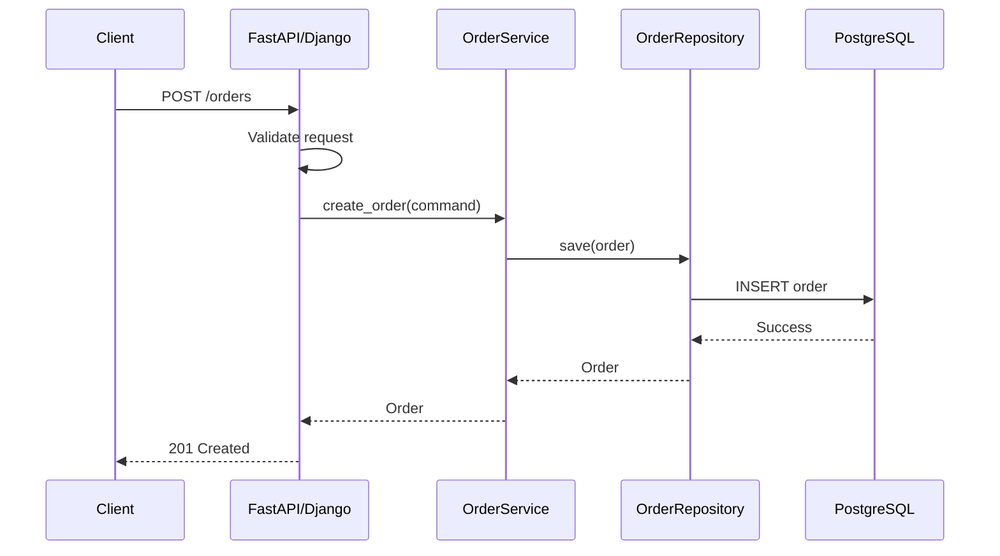

# 02- Classes and Objects

## Overview

Classes and objects are the primary mechanism Python provides for bundling state and behavior into reusable abstractions.

A **class** defines a type and describes the attributes, methods, and behavior associated with that type. An **object** is a runtime instance of a class with its own identity and state.

In backend engineering, classes commonly represent:

- Domain entities
- Value-oriented application objects
- Services
- Repositories
- Database clients
- HTTP clients
- Message publishers
- Configuration components
- Framework integrations
- Test doubles

The important engineering skill is not learning class syntax. It is understanding how Python creates objects, resolves attributes and methods, manages object state, and uses classes as architectural boundaries.

A useful mental model is:

```text
Class
 |
 | instantiation
 v
Object
 |
 +--> Identity
 +--> Type
 +--> Instance State
 +--> Behavior
```

For example:

```python
from decimal import Decimal


class Order:
    def __init__(self, order_id: int, total: Decimal) -> None:
        self.order_id = order_id
        self.total = total

    def is_high_value(self) -> bool:
        return self.total >= Decimal("1000.00")
```

Creating an object:

```python
order = Order(
    order_id=1001,
    total=Decimal("1250.00"),
)
```

creates a concrete object whose state is separate from other `Order` instances.

## Class vs Object

| Concept | Meaning | Example |
|---|---|---|
| Class | Defines a type and its behavior | `Order` |
| Object | Runtime instance of a class | `order` |
| Attribute | Data associated with a class or object | `order.total` |
| Method | Function associated with a class | `order.is_high_value()` |
| Instance | Another term for an object created from a class | `Order(...)` |
| Type | Runtime classification of an object | `type(order) is Order` |

Consider:

```python
order_a = Order(1001, Decimal("500.00"))
order_b = Order(1002, Decimal("1500.00"))
```

Both objects have the same type:

```python
type(order_a) is Order
type(order_b) is Order
```

but they have different identities and state.

```text
Order class
   |
   +----> order_a
   |        order_id = 1001
   |        total = 500
   |
   +----> order_b
            order_id = 1002
            total = 1500
```

## Defining a Class

The basic syntax is:

```python
class Order:
    ...
```

A class body is executable Python code.

For example:

```python
class Order:
    order_type = "standard"

    def __init__(self, order_id: int) -> None:
        self.order_id = order_id

    def cancel(self) -> None:
        ...
```

The class contains:

- `order_type`: a class attribute
- `__init__`: an initialization method
- `cancel`: an instance method

The class itself becomes an object after the class statement executes.

```python
print(type(Order))
```

For normal Python classes, this is:

```text
<class 'type'>
```

This is an important part of Python's object model:

```text
object
  ^
  |
type
  |
  v
Order
  |
  v
order
```

`Order` is itself an object, typically an instance of `type`, while `order` is an instance of `Order`.

## Instantiating an Object

Calling a class creates an instance:

```python
order = Order(order_id=1001)
```

Conceptually, object creation involves:

```text
Order(...)
   |
   v
__new__()
   |
   v
new instance
   |
   v
__init__()
   |
   v
initialized object
```

The details matter:

- `__new__()` is responsible for creating the instance.
- `__init__()` initializes an already-created instance.
- Calling a class does not mean `__init__()` itself creates the object.

For ordinary application classes, overriding `__new__()` is rarely necessary. Most application-level initialization belongs in `__init__()`.

## Object Identity

Every object has an identity during its lifetime.

```python
order = Order(1001)

print(id(order))
```

`id()` returns an implementation-defined integer identifying the object for its lifetime. In CPython, it commonly corresponds to the object's memory address.

Identity is different from equality.

```python
order_a = Order(1001)
order_b = Order(1001)

print(order_a is order_b)
```

This is:

```text
False
```

because they are two different objects.

Whether:

```python
order_a == order_b
```

is `True` depends on whether the class defines appropriate equality semantics.

## Identity, Equality, and Type

These concepts should remain separate:

| Concept | Question |
|---|---|
| Identity | Is this the exact same object? |
| Equality | Do these objects represent equivalent values? |
| Type | What kind of object is this? |
| State | What data does this object currently contain? |

Example:

```python
a = Order(1001)
b = a
c = Order(1001)
```

Then:

```python
a is b       # True
a is c       # False
```

because `b` refers to the same object while `c` is a different instance.

## Instance State

Instance state is normally stored on `self`.

```python
class User:
    def __init__(self, user_id: int, email: str) -> None:
        self.user_id = user_id
        self.email = email
```

Each instance receives its own attributes:

```python
user_a = User(1, "a@example.com")
user_b = User(2, "b@example.com")
```

Conceptually:

```text
user_a.__dict__
{
    "user_id": 1,
    "email": "a@example.com"
}

user_b.__dict__
{
    "user_id": 2,
    "email": "b@example.com"
}
```

The exact storage mechanism can differ for classes using `__slots__`, descriptors, extensions, or framework-specific behavior.

## The Meaning of `self`

`self` is the conventional name for the instance passed to an instance method.

Given:

```python
class Order:
    def cancel(self) -> None:
        ...
```

and:

```python
order.cancel()
```

Python effectively performs a bound method operation equivalent in spirit to:

```python
Order.cancel(order)
```

The method receives the object as its first argument.

`self` is not a keyword. It is a naming convention enforced by readability and ecosystem standards.

This means:

```python
class Order:
    def cancel(order_instance) -> None:
        ...
```

is technically valid, but should not be written that way.

Use:

```python
def cancel(self) -> None:
    ...
```

## Instance Methods

Instance methods operate on a particular object's state.

```python
class Order:
    def __init__(self, total: Decimal) -> None:
        self.total = total

    def apply_discount(self, percentage: Decimal) -> None:
        discount = self.total * percentage / Decimal("100")
        self.total -= discount
```

The method has access to:

```text
self.total
```

and can enforce invariants around changes to that state.

This is useful when behavior belongs naturally to the object's state.

## Attribute Lookup

Python's attribute access is more sophisticated than simply looking in `obj.__dict__`.

For:

```python
order.total
```

Python performs attribute lookup involving mechanisms such as:

- Instance dictionaries
- Class attributes
- Base classes
- Descriptors
- `__getattribute__`
- `__getattr__`

A simplified model is:

```text
order.total
    |
    v
__getattribute__()
    |
    v
Descriptor lookup
    |
    v
Instance attributes
    |
    v
Class / base-class attributes
    |
    v
__getattr__() if applicable
```

The exact lookup rules are more nuanced, especially when descriptors are involved.

This mechanism is fundamental to Python frameworks such as Django and many ORMs.

## Instance Namespace

For ordinary classes, instance attributes are commonly stored in `__dict__`.

```python
class User:
    def __init__(self, user_id: int) -> None:
        self.user_id = user_id


user = User(42)

print(user.__dict__)
```

Typical result:

```python
{"user_id": 42}
```

The namespace can be modified dynamically:

```python
user.display_name = "Aranya"
```

Now:

```python
print(user.__dict__)
```

may contain:

```python
{
    "user_id": 42,
    "display_name": "Aranya",
}
```

This flexibility is powerful but should not be confused with good API design.

## Class Namespace

A class also has a namespace.

```python
class Order:
    category = "retail"

    def process(self) -> None:
        ...
```

Conceptually:

```python
Order.__dict__
```

contains entries representing:

```text
category
process
__module__
__dict__
__weakref__
...
```

The class namespace is not simply an ordinary dictionary in the implementation; it is exposed through a mapping proxy.

```python
print(type(Order.__dict__))
```

typically produces:

```text
<class 'mappingproxy'>
```

This prevents arbitrary direct mutation through the returned mapping.

## Class Attributes vs Instance Attributes

Consider:

```python
class Order:
    category = "retail"

    def __init__(self, order_id: int) -> None:
        self.order_id = order_id
```

`category` is a class attribute.

`order_id` is an instance attribute.

```text
Order
 |
 +--> category = "retail"
 |
 +--> methods

order_a
 |
 +--> order_id = 1001

order_b
 |
 +--> order_id = 1002
```

Lookup:

```python
order_a.category
```

can find the value on the class when it is not overridden by instance state.

## Attribute Shadowing

An instance attribute can shadow a class attribute in many ordinary cases.

```python
class Order:
    status = "pending"


order = Order()

order.status = "paid"
```

Now:

```python
order.status
```

returns:

```text
paid
```

while:

```python
Order.status
```

remains:

```text
pending
```

This distinction is important when designing class-level defaults.

## Mutable Class Attributes

A common production bug is accidentally sharing mutable state across instances.

Avoid:

```python
class RequestContext:
    headers = {}
```

Now every instance can reference the same dictionary.

Prefer:

```python
class RequestContext:
    def __init__(self) -> None:
        self.headers: dict[str, str] = {}
```

The difference is:

```text
Bad:

RequestContext
      |
      v
   headers {}
      ^
      |
  +---+---+
  |       |
ctx_a   ctx_b


Good:

ctx_a --> headers {}
ctx_b --> headers {}
```

Shared mutable class state can create difficult concurrency and correctness bugs.

## Methods Are Class Attributes

A method defined in a class is stored as an attribute on the class.

```python
class Order:
    def cancel(self) -> None:
        ...
```

Conceptually:

```text
Order.cancel
```

is a function-like object stored on the class.

Accessing it through an instance:

```python
order.cancel
```

produces a bound method that carries the instance.

This is part of Python's descriptor mechanism.

```text
Order.cancel
     |
     v
function descriptor
     |
 order.cancel
     |
     v
bound method
     |
     v
order
```

This behavior explains why `self` is automatically supplied when calling:

```python
order.cancel()
```

## Object State and Invariants

Classes become particularly useful when they protect valid state.

Consider:

```python
class InventoryItem:
    def __init__(self, quantity: int) -> None:
        if quantity < 0:
            raise ValueError("Quantity cannot be negative")

        self.quantity = quantity

    def remove(self, amount: int) -> None:
        if amount <= 0:
            raise ValueError("Amount must be positive")

        if amount > self.quantity:
            raise ValueError("Insufficient inventory")

        self.quantity -= amount
```

The object owns an invariant:

```text
quantity >= 0
```

Instead of allowing arbitrary callers to modify the state, operations enforce valid transitions.

This is one of the strongest reasons to use objects in domain-oriented code.

## Classes as Domain Models

A domain object should represent meaningful business state and behavior.

```python
from dataclasses import dataclass
from decimal import Decimal


@dataclass
class Order:
    order_id: int
    total: Decimal
    status: str = "pending"

    def cancel(self) -> None:
        if self.status != "pending":
            raise ValueError("Only pending orders can be cancelled")

        self.status = "cancelled"
```

The class expresses:

```text
Order
 |
 +--> order_id
 +--> total
 +--> status
 |
 +--> cancel()
```

The business rule is close to the state it governs.

For more advanced modeling, immutable value objects, domain entities, dataclasses, and protocols can be used depending on the requirements.

## Classes as Services

Not all classes represent domain entities.

A backend service may use classes to encapsulate dependencies and orchestration:

```python
class OrderService:
    def __init__(
        self,
        repository: OrderRepository,
        publisher: EventPublisher,
    ) -> None:
        self.repository = repository
        self.publisher = publisher

    def create_order(self, order: Order) -> None:
        self.repository.save(order)
        self.publisher.publish(
            OrderCreated(order_id=order.order_id)
        )
```

This class is not itself an `Order`.

It represents an application-level responsibility.

A useful distinction is:

```text
Domain object
    |
    +--> Represents business state/behavior

Application service
    |
    +--> Coordinates operations

Infrastructure component
    |
    +--> Encapsulates external technology
```

## Classes as Infrastructure Components

Classes are also useful for managing external systems.

For example:

```python
class PaymentClient:
    def __init__(
        self,
        base_url: str,
        api_key: str,
    ) -> None:
        self.base_url = base_url
        self.api_key = api_key

    def authorize(self, payment: Payment) -> Authorization:
        ...
```

The object can own:

- Configuration
- HTTP client state
- Authentication configuration
- Connection pools
- Retry configuration
- Metrics instrumentation

This can be more maintainable than passing every dependency and configuration value through every function.

## Dependency Injection

Prefer injecting dependencies instead of constructing them internally.

Avoid:

```python
class OrderService:
    def __init__(self) -> None:
        self.repository = PostgresOrderRepository()
```

Prefer:

```python
class OrderService:
    def __init__(
        self,
        repository: OrderRepository,
    ) -> None:
        self.repository = repository
```

Composition happens at the application boundary:

```text
Application Startup
       |
       +--> PostgreSQL Repository
       |
       v
  OrderService
       |
       v
    API Layer
```

This improves:

- Testability
- Configuration
- Substitution
- Separation of concerns
- Dependency direction

## Classes and REST APIs

A typical backend request can cross several object boundaries:



The class boundaries should represent meaningful responsibilities.

They should not merely reproduce every HTTP operation as a separate class.

## Classes and Framework Dependency Injection

Frameworks often manage object creation for you.

For example, a FastAPI application can provide a service through a dependency function:

```python
from fastapi import Depends, FastAPI

app = FastAPI()


def get_order_service() -> OrderService:
    return OrderService(
        repository=get_order_repository(),
    )


@app.post("/orders")
def create_order(
    request: CreateOrderRequest,
    service: OrderService = Depends(get_order_service),
) -> OrderResponse:
    order = service.create_order(request)
    return OrderResponse.from_domain(order)
```

The framework controls part of the object lifecycle.

When using dependency injection frameworks, understand:

- Singleton vs request-scoped dependencies
- Thread safety
- Async compatibility
- Connection lifecycle
- Cleanup
- Test overrides

Do not assume every object should be globally shared.

## Object Lifecycle

A production object can have a meaningful lifecycle:

```text
Construction
    |
    v
Initialization
    |
    v
Ready
    |
    v
In Use
    |
    v
Closing
    |
    v
Released
```

This matters for objects owning:

- HTTP sessions
- Database connections
- Redis clients
- Kafka producers
- Files
- Locks
- Background tasks

For example, a client may require explicit cleanup:

```python
class ExternalApiClient:
    async def close(self) -> None:
        await self._client.aclose()
```

Application startup and shutdown should control that lifecycle rather than relying on garbage collection.

## Object Lifetime and Garbage Collection

Python manages object memory automatically.

An object remains alive while it is reachable.

Conceptually:

```text
request handler
      |
      v
service
      |
      v
repository
      |
      v
database client
```

As references disappear, objects may become eligible for cleanup.

CPython primarily uses reference counting plus cyclic garbage collection.

However, resource lifetime and object lifetime are not identical.

A file descriptor, socket, or database connection should not depend on an object's eventual garbage collection.

Use explicit resource management such as context managers or framework lifecycle hooks.

## Object References

Assignment copies references, not objects.

```python
order_a = Order(1001)
order_b = order_a
```

Now:

```python
order_a is order_b
```

is:

```text
True
```

Both names point to the same object.

Therefore:

```python
order_b.status = "cancelled"
```

also changes:

```python
order_a.status
```

This is particularly important when mutable domain objects are passed through service layers.

## Copying Objects

If independent state is required, explicitly copy the object.

```python
from copy import copy, deepcopy

shallow_copy = copy(order)
deep_copy = deepcopy(order)
```

The correct choice depends on the object's internal graph.

Blindly using `deepcopy()` in backend systems can be expensive and may produce incorrect behavior for objects containing:

- Locks
- Sockets
- Database connections
- Thread-local state
- Caches
- Framework-managed resources

Prefer explicit reconstruction for important domain objects when practical.

## Class Construction and `__new__`

Most classes only need `__init__()`.

```python
class User:
    def __init__(self, user_id: int) -> None:
        self.user_id = user_id
```

`__new__()` operates at the object creation level:

```python
class User:
    def __new__(cls, user_id: int):
        instance = super().__new__(cls)
        return instance

    def __init__(self, user_id: int) -> None:
        self.user_id = user_id
```

`__new__()` is mainly relevant when:

- Subclassing immutable built-ins
- Controlling instance creation
- Implementing specialized caching/singleton mechanisms
- Working with metaclasses or advanced frameworks

Avoid overriding it for ordinary initialization.

## Dataclasses and Classes

For data-heavy classes, `dataclasses` can reduce boilerplate.

```python
from dataclasses import dataclass
from decimal import Decimal


@dataclass
class Money:
    amount: Decimal
    currency: str
```

The generated methods can include:

- `__init__`
- `__repr__`
- `__eq__`

depending on configuration.

Use dataclasses when the object is primarily a structured data model and the generated semantics match the domain.

Use a regular class when the object requires more specialized lifecycle or behavioral semantics.

## Classes and `__slots__`

Regular Python classes commonly maintain an instance `__dict__`.

For memory-sensitive workloads, `__slots__` can reduce per-instance memory overhead:

```python
class Point:
    __slots__ = ("x", "y")

    def __init__(self, x: float, y: float) -> None:
        self.x = x
        self.y = y
```

Trade-offs include:

- No ordinary instance `__dict__` unless explicitly included
- Dynamic attributes are restricted
- Weak-reference support requires appropriate configuration
- Inheritance behavior becomes more nuanced

Do not use `__slots__` simply because it sounds faster. Measure memory and performance requirements first.

## Object Equality

If objects represent domain values, equality semantics should be intentional.

Without a custom `__eq__()` implementation, ordinary user-defined objects generally compare by identity.

For value-like objects:

```python
from dataclasses import dataclass


@dataclass(frozen=True)
class Currency:
    code: str
```

then:

```python
Currency("USD") == Currency("USD")
```

is true because the dataclass generates value-based equality.

For entities, equality may instead be based on a stable domain identifier.

For example:

```text
Entity:
    equality -> identity/domain identifier

Value object:
    equality -> contained values
```

Mixing these concepts can cause subtle bugs in collections, caching, persistence, and tests.

## Hashability

Objects used as dictionary keys or set members must satisfy hash/equality requirements.

For example:

```python
@dataclass(frozen=True)
class Currency:
    code: str
```

can safely be used in hash-based collections when its fields support appropriate hashing.

Mutable objects should not generally be hashable based on mutable state because changing the state after insertion can violate hash-table assumptions.

## Classes and Concurrency

Object instances may be accessed concurrently.

Consider:

```python
class Inventory:
    def __init__(self, quantity: int) -> None:
        self.quantity = quantity

    def reserve(self, amount: int) -> None:
        if amount > self.quantity:
            raise ValueError("Insufficient inventory")

        self.quantity -= amount
```

Two concurrent requests can observe the same quantity and both reserve it.

The class itself does not provide transactional guarantees.

For production systems, concurrency control may need to happen through:

- Database transactions
- Row-level locking
- Optimistic concurrency
- Redis atomic operations
- Message serialization
- Application-level locks where appropriate

For example:

```text
HTTP Request A ----\
                    +--> PostgreSQL transaction --> inventory row
HTTP Request B ----/
```

The database is often the correct authority for shared inventory state.

## Classes and Process Boundaries

A Python object exists inside a process.

With multiple workers:

```text
Kubernetes Pod A
    |
    +--> OrderService instance A

Kubernetes Pod B
    |
    +--> OrderService instance B

Kubernetes Pod C
    |
    +--> OrderService instance C
```

These are independent objects.

Changing:

```python
service.cache["key"] = value
```

does not automatically update the corresponding object in another process.

For shared state, use infrastructure designed for distributed access:

- PostgreSQL
- Redis
- Kafka
- Object storage
- Other appropriate distributed systems

## Testing Classes

Classes with explicit dependencies are generally straightforward to unit test.

```python
def test_create_order() -> None:
    repository = FakeOrderRepository()
    publisher = FakeEventPublisher()

    service = OrderService(
        repository=repository,
        publisher=publisher,
    )

    order = service.create_order(
        CreateOrderCommand(
            order_id=1001,
            total=Decimal("50.00"),
        )
    )

    assert order.order_id == 1001
    assert repository.saved_order == order
    assert len(publisher.events) == 1
```

The test controls the object's collaborators rather than depending on a real PostgreSQL database or Kafka broker.

This is one of the practical benefits of dependency-oriented class design.

## Testing Object State

Tests should focus on externally meaningful behavior.

Prefer:

```python
def test_cannot_cancel_completed_order() -> None:
    order = Order(
        order_id=1001,
        total=Decimal("100.00"),
        status="completed",
    )

    with pytest.raises(ValueError):
        order.cancel()
```

over asserting every internal implementation detail.

Tests that depend heavily on private attributes can make refactoring unnecessarily difficult.

## Security Considerations

Classes are not security boundaries by themselves.

Important practices include:

- Do not treat `_private` attributes as access-control mechanisms.
- Do not store secrets unnecessarily on long-lived objects.
- Avoid exposing credentials through `__repr__()`.
- Avoid serializing objects blindly.
- Validate external input before constructing domain objects.
- Keep authorization logic explicit.
- Avoid dynamic attribute access using untrusted field names.
- Ensure resource-owning objects enforce appropriate permissions.

For example, avoid:

```python
class ApiClient:
    def __repr__(self) -> str:
        return f"ApiClient(api_key={self.api_key})"
```

because logs and debugging output may expose credentials.

Prefer:

```python
class ApiClient:
    def __repr__(self) -> str:
        return "ApiClient(api_key=<redacted>)"
```

## Performance Considerations

Class and object overhead is usually small relative to network and database operations in backend applications.

A typical request may spend much more time in:

```text
HTTP networking
    |
    v
Database query
    |
    v
Remote API
```

than in ordinary Python attribute lookup.

However, object overhead matters when creating millions of objects or processing large datasets.

Potential concerns include:

- Allocation cost
- Memory overhead
- Attribute lookup
- Garbage collection
- Serialization
- Cache locality

Measure before optimizing.

Useful tools include:

```bash
python -m cProfile -s cumulative app.py
```

and:

```bash
python -m tracemalloc
```

For microbenchmarks:

```python
import timeit

result = timeit.timeit(
    "obj.value",
    setup="class X: value = 1\nobj = X()",
    number=1_000_000,
)

print(result)
```

Avoid optimizing object-oriented structure based on intuition alone.

## Common Mistakes

### Treating a Class as a Namespace

This:

```python
class Utils:
    ...
```

is often used to group unrelated functions.

If there is no state, lifecycle, or meaningful abstraction, module-level functions may be clearer.

### Mutable Class State

Avoid:

```python
class Cache:
    values = {}
```

unless shared class-level state is explicitly intended.

### Hidden Dependencies

Avoid constructing infrastructure dependencies inside business classes.

Prefer dependency injection.

### Excessive Responsibilities

Avoid:

```text
OrderService
├── HTTP client
├── SQL queries
├── validation
├── authorization
├── payment processing
├── Kafka publishing
├── email delivery
└── caching
```

Split responsibilities along meaningful boundaries.

### Overusing Properties

Do not turn every field into a property without a behavioral reason.

### Deep Inheritance

Deep hierarchies make method lookup and behavior harder to understand.

Prefer composition where it expresses the architecture more clearly.

### Ignoring Object Identity

Passing a mutable object through multiple layers can cause one component to mutate state observed by another.

### Relying on Garbage Collection for Resources

Garbage collection manages memory, not application resource lifecycle.

Explicitly close:

- Files
- Sockets
- Clients
- Connections
- Background resources

### Assuming Objects Are Thread-Safe

Classes containing mutable state require deliberate concurrency design.

## Interview Traps

### Is a Class an Object in Python?

Yes. A class is itself an object, normally an instance of `type`.

### What Is the Difference Between `is` and `==`?

`is` checks identity.

`==` checks equality according to the object's equality implementation.

### What Does Calling a Class Do?

Conceptually, class calling invokes the type machinery, which creates an instance through `__new__()` and initializes it through `__init__()` when appropriate.

### Where Are Instance Attributes Stored?

For ordinary classes, they are commonly stored in the instance's `__dict__`, although mechanisms such as `__slots__` and descriptors can change this.

### Why Does `self` Exist?

It explicitly represents the instance receiving the method call.

### Are Methods Stored on Each Object?

Normally no. Functions defined in the class are stored on the class and participate in descriptor-based binding when accessed through instances.

### What Happens When an Attribute Is Not on the Instance?

Python continues attribute lookup through the class, base classes, and descriptor machinery, with `__getattr__()` providing a fallback when defined.

### Why Is Mutable Class State Dangerous?

All instances can share the same mutable object, creating unintended coupling and potential concurrency bugs.

### Is Python's Encapsulation Strict?

No. Python relies heavily on conventions such as `_name` and `__name__`, supported by name mangling, rather than strict access-control enforcement.

## Production Checklist

Before introducing an important class, verify:

- The class has a clear responsibility.
- Its state is explicitly defined.
- Invariants are enforced at appropriate boundaries.
- Dependencies are injected rather than hidden.
- Mutable class-level state is intentional.
- Object lifecycle is understood.
- Resource ownership is explicit.
- Equality and hashing semantics are appropriate.
- Concurrency behavior is understood.
- Tests focus on observable behavior.
- Sensitive state is not exposed through representations or logs.
- The abstraction reduces coupling rather than adding ceremony.
- Composition has been considered before inheritance.
- Memory implications have been measured for high-volume object creation.

## Key Takeaways

- A Python class defines a type and behavior, while an object is a concrete runtime instance with its own identity and state.
- Instance attributes normally hold per-object state, while class attributes are shared through the class and its attribute-lookup hierarchy; mutable class attributes require deliberate design.
- Python method calls, attribute lookup, descriptors, `__new__()`, and `__init__()` form the runtime machinery behind classes and objects.
- Production classes should have cohesive responsibilities, explicit dependencies, controlled state transitions, clear lifecycle ownership, and deliberate concurrency and testing semantics.
- Object-oriented design is valuable when it creates meaningful boundaries; simple functions and data structures are often better when a class would only add unnecessary abstraction.