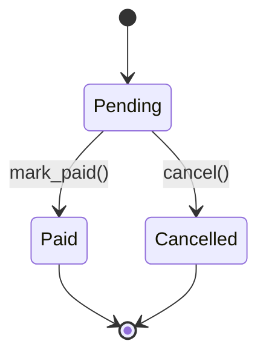

# 03- Instance Attributes and Methods

## Overview

Instance attributes and instance methods are the core mechanisms Python uses to associate **state and behavior with a specific object**.

An instance attribute represents data belonging to one object:

```python
order.total
order.status
order.customer_id
```

An instance method represents behavior operating on that object:

```python
order.cancel()
order.calculate_total()
order.mark_as_paid()
```

The relationship is:

```text
Class
 |
 +--> Instance attributes
 |       |
 |       +--> Per-object state
 |
 +--> Instance methods
         |
         +--> Behavior operating on self
```

Understanding this distinction is essential for production Python because it affects:

- Encapsulation
- Object identity
- Mutable state
- Attribute lookup
- Dependency management
- Concurrency
- Testing
- Memory usage
- Serialization
- Framework behavior

It also provides the foundation for understanding class attributes, properties, descriptors, inheritance, `super()`, dataclasses, and dependency injection.

## Instance State

Instance state is data associated with one particular object.

```python
from decimal import Decimal


class Order:
    def __init__(
        self,
        order_id: int,
        customer_id: int,
        total: Decimal,
    ) -> None:
        self.order_id = order_id
        self.customer_id = customer_id
        self.total = total
        self.status = "pending"
```

Each object has independent state:

```python
order_a = Order(
    order_id=1001,
    customer_id=501,
    total=Decimal("250.00"),
)

order_b = Order(
    order_id=1002,
    customer_id=502,
    total=Decimal("900.00"),
)
```

Conceptually:

```text
order_a
├── order_id = 1001
├── customer_id = 501
├── total = 250.00
└── status = pending

order_b
├── order_id = 1002
├── customer_id = 502
├── total = 900.00
└── status = pending
```

Changing one object does not normally modify the other's instance attributes:

```python
order_a.status = "cancelled"

assert order_a.status == "cancelled"
assert order_b.status == "pending"
```

## Creating Instance Attributes

The most common place to initialize instance attributes is `__init__()`:

```python
class User:
    def __init__(self, user_id: int, email: str) -> None:
        self.user_id = user_id
        self.email = email
```

The assignment:

```python
self.user_id = user_id
```

creates or updates an attribute on the instance.

For ordinary Python objects, these attributes are commonly stored in the instance's `__dict__`.

```python
user = User(
    user_id=42,
    email="user@example.com",
)

print(user.__dict__)
```

Typical output:

```python
{
    "user_id": 42,
    "email": "user@example.com",
}
```

This behavior changes for classes using mechanisms such as `__slots__`, descriptors, or custom attribute handling.

## Why Initialize State Explicitly

A class should generally establish its required state during initialization.

Prefer:

```python
class Connection:
    def __init__(self, host: str) -> None:
        self.host = host
        self.connected = False
```

over:

```python
class Connection:
    def connect(self) -> None:
        self.connected = True
```

where `connected` does not exist until some later method happens to execute.

Explicit initialization provides:

- Predictable object state
- Better type checking
- Easier testing
- Easier debugging
- Clearer invariants
- Fewer runtime `AttributeError` failures

The object should ideally be valid immediately after construction.

## Required vs Optional State

Use explicit defaults for optional state:

```python
class UserSession:
    def __init__(self, user_id: int) -> None:
        self.user_id = user_id
        self.last_activity_at: datetime | None = None
```

This is preferable to relying on an attribute appearing later.

For state that is genuinely required, require it during construction:

```python
class Payment:
    def __init__(
        self,
        payment_id: str,
        amount: Decimal,
        currency: str,
    ) -> None:
        self.payment_id = payment_id
        self.amount = amount
        self.currency = currency
```

This makes the initialization contract explicit.

## The `self` Parameter

An instance method receives the target object as its first argument.

```python
class Order:
    def cancel(self) -> None:
        self.status = "cancelled"
```

When:

```python
order.cancel()
```

is called, Python binds `order` to `self`.

Conceptually:

```python
Order.cancel(order)
```

The exact implementation involves descriptor-based method binding, but the important application-level model is:

```text
order.cancel()
     |
     v
Order.cancel(order)
     |
     v
self == order
```

`self` is a convention, not a reserved keyword.

Use `self` consistently because Python developers and tooling expect it.

## Instance Methods

An instance method is a function defined on a class that operates on an instance.

```python
class Order:
    def __init__(self, total: Decimal) -> None:
        self.total = total

    def apply_discount(self, percentage: Decimal) -> None:
        discount = self.total * percentage / Decimal("100")
        self.total -= discount
```

The method has direct access to:

```python
self.total
```

and can therefore enforce rules around state changes.

Instance methods are appropriate when behavior is naturally associated with the object's state or dependencies.

## State Transitions

One of the strongest uses of instance methods is enforcing valid state transitions.

```python
class Order:
    def __init__(self, order_id: int) -> None:
        self.order_id = order_id
        self.status = "pending"

    def mark_paid(self) -> None:
        if self.status != "pending":
            raise ValueError(
                "Only pending orders can be marked as paid"
            )

        self.status = "paid"

    def cancel(self) -> None:
        if self.status != "pending":
            raise ValueError(
                "Only pending orders can be cancelled"
            )

        self.status = "cancelled"
```

The object defines its valid transitions:



This keeps business invariants close to the state they govern.

## Instance Attributes and Encapsulation

Python does not enforce strict private instance variables.

A leading underscore communicates internal intent:

```python
class Account:
    def __init__(self, balance: Decimal) -> None:
        self._balance = balance
```

The convention means:

```text
_balance
```

is part of the implementation rather than the public API.

It is still technically accessible:

```python
account._balance
```

Therefore, Python encapsulation depends primarily on API design, conventions, properties, descriptors, and controlled behavior rather than hard access restrictions.

## Name Mangling

Double leading underscores trigger name mangling:

```python
class Account:
    def __init__(self) -> None:
        self.__balance = Decimal("0")
```

Python internally transforms the attribute name approximately into:

```text
_Account__balance
```

This is primarily useful for avoiding accidental name collisions in inheritance hierarchies.

It is not a security mechanism.

Do not use name mangling to protect secrets or enforce authorization.

## Instance Attribute Assignment

Attributes can be added after initialization:

```python
user = User(
    user_id=42,
    email="user@example.com",
)

user.display_name = "User"
```

This flexibility is part of Python's dynamic object model.

However, production classes should avoid uncontrolled dynamic state when the object's schema is expected to be stable.

A predictable class is easier to:

- Type-check
- Serialize
- Validate
- Test
- Debug
- Maintain

If arbitrary attributes are undesirable, `__slots__` or controlled attribute mechanisms may be appropriate.

## Attribute Lookup

When Python evaluates:

```python
order.status
```

it does not simply read a dictionary.

A simplified model is:

```text
order.status
     |
     v
object.__getattribute__()
     |
     +--> Data descriptor?
     |
     +--> Instance dictionary?
     |
     +--> Non-data descriptor / class attribute?
     |
     +--> Base classes?
     |
     +--> __getattr__() fallback
```

The actual lookup algorithm has important details involving descriptor precedence.

For ordinary classes, the practical hierarchy to remember is:

- Data descriptors can take precedence over instance attributes.
- Instance attributes are consulted for ordinary object storage.
- Class attributes and non-data descriptors can provide fallbacks.
- Base classes participate through the MRO.
- `__getattr__()` can provide a fallback when normal lookup fails.

This machinery explains many advanced Python features.

## Attribute Lookup and Methods

Consider:

```python
class Order:
    def cancel(self) -> None:
        ...
```

The function is stored on the class:

```python
Order.cancel
```

When accessed through an instance:

```python
order.cancel
```

Python binds the instance to the function through the descriptor protocol.

Conceptually:

```text
Order.cancel
    |
    v
function descriptor
    |
    v
order.cancel
    |
    v
bound method
```

This is why:

```python
order.cancel()
```

automatically supplies `order` as `self`.

## Instance Attribute Shadowing

An instance attribute can override a class-level value in ordinary lookup scenarios.

```python
class User:
    role = "user"


user = User()

user.role = "admin"
```

Now:

```python
user.role
```

returns:

```text
admin
```

while:

```python
User.role
```

remains:

```text
user
```

This distinction becomes important when class attributes are used as defaults.

Descriptor behavior can alter this lookup precedence, which is why properties and ORM fields require a deeper understanding.

## Class Attributes Are Not Instance Attributes

Consider:

```python
class Connection:
    default_timeout = 10

    def __init__(self, host: str) -> None:
        self.host = host
```

`host` belongs to each instance.

`default_timeout` belongs to the class.

```text
Connection
└── default_timeout = 10

connection_a
└── host = api.example.com

connection_b
└── host = database.example.com
```

An instance can read the class attribute:

```python
connection_a.default_timeout
```

but that does not mean a separate copy exists in the instance.

## Avoiding Shared Mutable State

A particularly important rule is to avoid accidental sharing of mutable objects.

Bad:

```python
class RequestContext:
    headers: dict[str, str] = {}
```

All instances can reference the same dictionary.

Prefer:

```python
class RequestContext:
    def __init__(self) -> None:
        self.headers: dict[str, str] = {}
```

Now each instance receives its own dictionary.

This distinction is especially important in backend services because shared mutable state can create:

- Cross-request data leakage
- Race conditions
- Test contamination
- Memory retention
- Difficult production debugging

## Instance Methods and Side Effects

Instance methods may be:

- Pure transformations
- State mutations
- External I/O operations
- Coordination operations

For example, this is a local state transition:

```python
class Order:
    def mark_paid(self) -> None:
        self.status = "paid"
```

Whereas this method performs infrastructure I/O:

```python
class PaymentClient:
    def charge(self, payment: Payment) -> ChargeResult:
        return self.http_client.post(...)
```

Keeping domain state changes separate from external I/O often improves testability and reliability.

A useful architecture is:

```text
Application Service
       |
       +--> Domain Object
       |
       +--> Repository
       |
       +--> External Client
```

rather than putting database and network operations directly into every domain object.

## Methods That Mutate State

Mutation can be appropriate when the object owns a meaningful lifecycle.

```python
class InventoryItem:
    def __init__(self, quantity: int) -> None:
        if quantity < 0:
            raise ValueError("Quantity cannot be negative")

        self.quantity = quantity

    def reserve(self, amount: int) -> None:
        if amount <= 0:
            raise ValueError("Amount must be positive")

        if amount > self.quantity:
            raise ValueError("Insufficient inventory")

        self.quantity -= amount
```

The method ensures:

```text
quantity >= 0
```

remains true.

This is preferable to exposing unrestricted state manipulation throughout the application.

## Methods That Return New State

Not every object needs to mutate itself.

Immutable or value-oriented designs can return new instances:

```python
from dataclasses import dataclass
from decimal import Decimal


@dataclass(frozen=True)
class Money:
    amount: Decimal
    currency: str

    def add(self, other: "Money") -> "Money":
        if self.currency != other.currency:
            raise ValueError("Currencies must match")

        return Money(
            amount=self.amount + other.amount,
            currency=self.currency,
        )
```

This approach can simplify reasoning about:

- Concurrency
- Caching
- Testing
- State transitions
- Referential behavior

The trade-off is additional object allocation.

## Instance Methods and Dependencies

Instance methods can use dependencies stored on the object.

```python
class OrderService:
    def __init__(
        self,
        repository: OrderRepository,
        publisher: EventPublisher,
    ) -> None:
        self.repository = repository
        self.publisher = publisher

    def create_order(self, order: Order) -> Order:
        saved = self.repository.save(order)

        self.publisher.publish(
            OrderCreated(order_id=saved.order_id)
        )

        return saved
```

The object owns references to its collaborators:

```text
OrderService
├── repository
└── publisher
```

This is a common and effective backend pattern.

## Avoid Hidden Dependencies

Avoid:

```python
class OrderService:
    def create_order(self, order: Order) -> None:
        repository = PostgresOrderRepository()
        repository.save(order)
```

The dependency is hidden inside the method.

Prefer:

```python
class OrderService:
    def __init__(
        self,
        repository: OrderRepository,
    ) -> None:
        self.repository = repository
```

Now tests can supply a fake implementation, and production configuration can choose the appropriate repository.

## Instance Methods in FastAPI

A service object can be injected into a FastAPI request handler:

```python
from fastapi import Depends, FastAPI

app = FastAPI()


def get_order_service() -> OrderService:
    return OrderService(
        repository=get_order_repository(),
    )


@app.post("/orders")
def create_order(
    request: CreateOrderRequest,
    service: OrderService = Depends(get_order_service),
) -> OrderResponse:
    order = service.create_order(request.to_domain())
    return OrderResponse.from_domain(order)
```

The important concern is object lifetime.

If `OrderService` contains:

- A database connection
- An HTTP client
- A connection pool
- Mutable state

then its scope must be deliberately chosen.

A request-scoped object and an application-wide singleton have very different concurrency and lifecycle implications.

## Instance Methods in Django

Django models commonly expose domain-oriented behavior:

```python
class Order(models.Model):
    status = models.CharField(max_length=32)

    def can_cancel(self) -> bool:
        return self.status == "pending"
```

Django also uses descriptors extensively for model fields and relationships.

Therefore, an expression such as:

```python
order.customer
```

may involve framework-managed attribute behavior rather than a simple value stored directly on the instance.

Understanding normal Python attribute lookup helps explain such framework behavior.

## Instance Attributes and ORM State

ORM-managed objects can contain more than database columns.

An ORM instance may maintain:

```text
Database fields
+
Relationship state
+
Lazy-loading state
+
Framework metadata
+
Identity information
```

For example, accessing:

```python
order.customer
```

may trigger a database query depending on how the relationship was loaded.

This means a method that looks like an ordinary attribute access can have significant operational cost.

Be careful when implementing:

```python
def calculate_total(self) -> Decimal:
    return sum(item.price for item in self.items)
```

if `self.items` triggers a query per object.

This can contribute to N+1 query problems.

## Instance Methods and Transactions

Do not assume that a method mutating an object automatically creates a database transaction.

For example:

```python
order.mark_paid()
```

only changes the in-memory object unless persistence is explicitly performed.

A production workflow may be:

```text
HTTP Request
     |
     v
Load Order
     |
     v
Begin Transaction
     |
     v
Validate State
     |
     v
Mutate Domain State
     |
     v
Persist
     |
     v
Commit
```

The database transaction remains the authority for durable state and concurrency control.

## Instance Methods and Concurrency

Mutable instance state is not automatically thread-safe.

Consider:

```python
class Counter:
    def __init__(self) -> None:
        self.value = 0

    def increment(self) -> None:
        self.value += 1
```

If multiple threads access the same instance, synchronization may be required.

More importantly, even if a Python implementation makes an individual operation appear atomic, that does not make a multi-step business operation transactionally safe.

For example:

```python
if inventory.quantity >= amount:
    inventory.quantity -= amount
```

contains a check-then-act sequence.

For shared inventory across requests or processes, PostgreSQL transactions or another suitable concurrency-control mechanism is generally more appropriate.

## Instance State Across Processes

Instance attributes are process-local.

With multiple workers:

```text
Worker A
└── OrderService instance A

Worker B
└── OrderService instance B

Worker C
└── OrderService instance C
```

Changing:

```python
service.cache["order:1"] = order
```

in Worker A does not update Worker B.

For distributed state use appropriate infrastructure:

- PostgreSQL
- Redis
- Kafka
- S3 or other object storage
- Other distributed stores appropriate to the workload

This distinction becomes critical when deploying Python applications through Docker and Kubernetes.

## Instance Methods and Serialization

An instance can often be serialized if its state is serializable, but the object itself should not automatically be treated as a wire-format contract.

Prefer explicit DTOs or schemas for APIs:

```python
@dataclass
class OrderResponse:
    order_id: int
    total: Decimal
    status: str
```

rather than blindly serializing internal service objects.

This prevents internal implementation changes from unintentionally changing external API contracts.

For REST APIs and gRPC, define explicit serialization boundaries.

## Memory Considerations

Each ordinary Python instance may carry a per-instance dictionary and object metadata.

Creating millions of instances can therefore consume substantial memory.

For memory-sensitive structures:

```python
class Point:
    __slots__ = ("x", "y")

    def __init__(self, x: float, y: float) -> None:
        self.x = x
        self.y = y
```

`__slots__` can reduce memory overhead by avoiding the usual instance dictionary in appropriate cases.

However, it introduces trade-offs and should be used based on measured requirements.

For large data-processing workloads, consider whether objects are the correct representation at all.

## Object Lifetime

An instance exists while references to it remain reachable.

For example:

```text
Request Handler
      |
      v
OrderService
      |
      v
Repository
```

References keep objects alive.

When objects become unreachable, Python can reclaim their memory according to the runtime's memory-management mechanisms.

However:

```text
Object lifetime != resource lifetime
```

Do not rely on object destruction to promptly release:

- Database connections
- File descriptors
- Sockets
- HTTP sessions
- Locks
- Background tasks

Use explicit lifecycle management.

## Resource-Owning Instance Methods

If an object owns a resource, its API should make lifecycle behavior explicit.

A context manager can provide deterministic cleanup:

```python
class DatabaseSession:
    def __enter__(self) -> "DatabaseSession":
        self.begin()
        return self

    def __exit__(self, exc_type, exc, traceback) -> None:
        self.close()
```

Then:

```python
with DatabaseSession() as session:
    session.execute(...)
```

Context managers are covered in greater depth in the Intermediate Python section.

## Testing Instance Methods

Instance methods are easiest to test when behavior is deterministic and dependencies are explicit.

```python
def test_cancel_pending_order() -> None:
    order = Order(
        order_id=1001,
        customer_id=501,
        total=Decimal("100.00"),
    )

    order.cancel()

    assert order.status == "cancelled"
```

For invalid transitions:

```python
def test_completed_order_cannot_be_cancelled() -> None:
    order = Order(
        order_id=1001,
        customer_id=501,
        total=Decimal("100.00"),
    )
    order.status = "completed"

    with pytest.raises(ValueError):
        order.cancel()
```

Tests should primarily verify externally meaningful behavior rather than implementation details such as the exact contents of `__dict__`.

## Testing Dependency-Driven Methods

For service classes:

```python
class FakeOrderRepository:
    def __init__(self) -> None:
        self.saved: list[Order] = []

    def save(self, order: Order) -> Order:
        self.saved.append(order)
        return order
```

The service can then be tested without PostgreSQL:

```python
def test_order_service_saves_order() -> None:
    repository = FakeOrderRepository()
    service = OrderService(repository=repository)

    order = Order(
        order_id=1001,
        customer_id=501,
        total=Decimal("100.00"),
    )

    service.create_order(order)

    assert repository.saved == [order]
```

This demonstrates the relationship between instance methods and dependency injection.

## Common Mistakes

### Defining Required State Outside `__init__`

Bad:

```python
class User:
    def activate(self) -> None:
        self.active = True
```

The object has no clearly defined initial state.

Prefer:

```python
class User:
    def __init__(self) -> None:
        self.active = False
```

### Using Class Attributes for Per-Instance State

Bad:

```python
class User:
    permissions = []
```

Prefer:

```python
class User:
    def __init__(self) -> None:
        self.permissions: list[str] = []
```

### Mutating Objects Unexpectedly

A method such as:

```python
order.calculate_total()
```

should not silently mutate unrelated state unless that behavior is part of its contract.

Choose method names and semantics that make mutation clear.

### Hidden Infrastructure Creation

Avoid creating database or HTTP clients inside individual methods.

Inject dependencies at construction or through an appropriate framework mechanism.

### Excessive Public Mutable State

If callers can arbitrarily change:

```python
order.status
order.total
order.customer_id
```

business invariants can be bypassed.

Use controlled operations where invariants matter.

### Confusing Object Mutation with Persistence

Changing:

```python
order.status = "paid"
```

does not automatically update PostgreSQL.

The application must explicitly persist the state within the correct transaction.

### Ignoring ORM Queries

An attribute access or method call on an ORM object can trigger database work.

Always understand query behavior when code runs inside loops or high-throughput request paths.

### Assuming Thread Safety

An instance method is not thread-safe simply because it belongs to a class.

Analyze shared mutable state and synchronization requirements.

## Production Pitfalls

| Pitfall | Impact | Better Approach |
|---|---|---|
| Mutable class-level state | Cross-instance leakage | Initialize mutable state per instance |
| Hidden dependencies | Poor testability | Dependency injection |
| Large mutable objects | Memory pressure | Smaller models, streaming, slots where appropriate |
| ORM lazy loading in loops | N+1 queries | Explicit eager loading |
| In-memory state as shared state | Inconsistent workers | Redis/PostgreSQL or another shared store |
| Implicit resource cleanup | Leaked resources | Explicit lifecycle/context managers |
| Uncontrolled mutation | Broken invariants | Encapsulated state transitions |
| Overly broad service objects | High coupling | Cohesive responsibilities |
| Serialization of internal objects | Unstable APIs | Explicit DTO/schema boundaries |

## Security Considerations

Instance state can contain sensitive information:

```python
class PaymentClient:
    def __init__(self, api_key: str) -> None:
        self.api_key = api_key
```

This is sometimes necessary, but the value should not leak through logs or representations.

Avoid:

```python
print(client.__dict__)
```

in production debugging paths if sensitive state may be present.

Also consider:

- Redacting secrets in `__repr__()`
- Avoiding serialization of internal objects
- Validating externally supplied values
- Limiting exposure of internal attributes
- Separating authentication credentials from domain objects
- Avoiding untrusted dynamic attribute access

Python's underscore conventions are not security controls.

## Observability

Instance methods that represent meaningful business operations can be instrumented at service boundaries.

For example:

```text
OrderService.create_order()
       |
       +--> structured log
       +--> metric
       +--> trace span
       +--> repository call
       +--> event publication
```

Avoid adding logs to every low-level instance method.

Prefer instrumentation around:

- Request handling
- Business operations
- External calls
- Database operations
- Queue publication
- Failure boundaries

This produces useful operational signals without excessive logging volume.

## Performance Considerations

Instance attribute access is normally inexpensive relative to database and network operations.

A typical backend request may look more like:

```text
Nginx
  |
  v
FastAPI
  |
  v
Python application
  |
  +--> Python object operations
  |
  +--> PostgreSQL
  |
  +--> Redis
  |
  +--> External API
```

The external operations often dominate latency.

Optimize instance-level operations when profiling demonstrates that they matter, especially in:

- Large loops
- Serialization-heavy workloads
- High-frequency event processing
- Large object graphs
- Data transformation pipelines

Useful tools include:

```bash
python -m cProfile -s cumulative application.py
```

and:

```python
import tracemalloc

tracemalloc.start()

# Workload

current, peak = tracemalloc.get_traced_memory()
print(f"Current: {current:,} bytes")
print(f"Peak: {peak:,} bytes")
```

Measure before changing object design for performance reasons.

## Senior-Level Design Considerations

At a senior engineering level, the key question is not:

> "Should this be a class?"

The better questions are:

- Who owns this state?
- Which operations are valid?
- Which invariants must always hold?
- Who controls the object's lifecycle?
- Which dependencies does it require?
- Can the object be safely shared?
- Does it cross a process boundary?
- Does mutation simplify or complicate reasoning?
- Is equality identity-based or value-based?
- Is persistence separate from in-memory state?
- Does the abstraction reduce coupling?
- How will this behavior be tested and observed?

A strong class design makes ownership and invariants obvious.

## Recommended Design Pattern

For a production backend component:

```text
              Application Service
                       |
          +------------+------------+
          |                         |
          v                         v
     Domain Object            Infrastructure
          |                         |
          |                    +----+----+
          |                    |         |
          v                    v         v
     State Rules          PostgreSQL   Redis
          |
          v
      Behavior
```

The domain object should not automatically become responsible for every infrastructure concern.

A common separation is:

```text
Domain Object
    |
    +--> Business rules

Application Service
    |
    +--> Workflow/orchestration

Repository
    |
    +--> Persistence

Client
    |
    +--> External network calls
```

This keeps instance attributes and methods focused on meaningful ownership.

## Key Takeaways

- Instance attributes represent per-object state, while instance methods receive `self` and provide behavior operating on that specific object's state.
- Initialize required state explicitly and avoid accidental shared mutable state through class attributes; predictable object state improves correctness, testing, and maintainability.
- Python attribute access uses descriptor and MRO-aware lookup machinery, which explains method binding, properties, ORM fields, and other framework behavior.
- In backend systems, distinguish in-memory object mutation from durable persistence, distributed state, and transaction guarantees; an instance exists within a process and is not automatically shared across workers.
- Good instance design makes state ownership, invariants, dependencies, lifecycle, concurrency behavior, and observable business operations explicit.