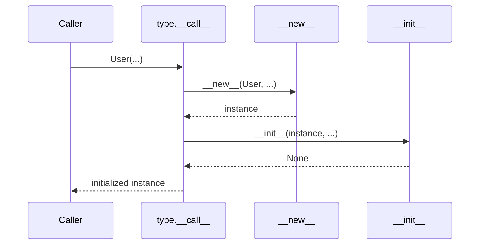

# 05- Constructors and Initialization

## Overview

Constructors and initialization define how Python objects come into existence and how their initial state is established.

Python's object creation model is slightly different from languages where a constructor is a single operation. For a normal class call:

```python
user = User(user_id=42)
```

Python's type machinery coordinates object creation and initialization through mechanisms including:

```text
Class call
   |
   v
__new__()
   |
   v
Object allocation
   |
   v
__init__()
   |
   v
Initialized instance
```

The distinction between `__new__()` and `__init__()` is important:

- `__new__()` creates or returns the instance.
- `__init__()` initializes an already-created instance.
- The class call itself is responsible for coordinating these operations.
- Most application classes only need `__init__()`.

Good initialization design matters because it establishes:

- Object invariants
- Required state
- Dependency ownership
- Lifecycle boundaries
- Configuration
- Testability
- Resource management
- Correct behavior under inheritance

Poor initialization design can produce partially initialized objects, hidden dependencies, unnecessary side effects, difficult tests, and concurrency problems.

## Constructor Terminology

Python developers commonly use "constructor" to refer to `__init__()`, but technically the object creation process is broader.

| Mechanism | Responsibility |
|---|---|
| Class call | Starts object creation |
| `__new__()` | Creates or returns an instance |
| `__init__()` | Initializes the instance |
| `__del__()` | Optional finalization hook; generally not a resource-management mechanism |

For normal classes:

```python
class User:
    def __init__(self, user_id: int) -> None:
        self.user_id = user_id
```

the practical focus is usually `__init__()`.

The deeper distinction becomes important when dealing with:

- Immutable built-in types
- Subclassing
- Metaclasses
- Object caching
- Singleton-like behavior
- Framework internals
- Advanced data models

## Calling a Class

Consider:

```python
class User:
    def __init__(self, user_id: int) -> None:
        self.user_id = user_id


user = User(42)
```

At a high level:

```text
User(42)
   |
   v
type.__call__()
   |
   +--> User.__new__(User, 42)
   |
   +--> User.__init__(instance, 42)
   |
   v
user
```

For a standard Python class, the default `type.__call__()` coordinates creation and initialization.

This is why `__new__()` and `__init__()` should not be thought of as interchangeable constructor functions.

## `__init__()`

`__init__()` initializes an object after the instance has been created.

```python
class Order:
    def __init__(
        self,
        order_id: int,
        customer_id: int,
    ) -> None:
        self.order_id = order_id
        self.customer_id = customer_id
        self.status = "pending"
```

The method should establish a predictable initial state.

A well-designed object should normally satisfy its basic invariants immediately after initialization.

For example:

```text
Order created
     |
     v
order_id exists
customer_id exists
status is valid
     |
     v
Object ready for use
```

## Why Initialization Matters

Initialization defines the object's contract.

For example:

```python
class Payment:
    def __init__(
        self,
        payment_id: str,
        amount: Decimal,
        currency: str,
    ) -> None:
        if amount <= 0:
            raise ValueError("Amount must be positive")

        if len(currency) != 3:
            raise ValueError("Currency must use a 3-letter code")

        self.payment_id = payment_id
        self.amount = amount
        self.currency = currency
```

After successful construction, callers can assume:

```text
amount > 0
currency is structurally valid
payment_id exists
```

Initialization therefore acts as an important invariant boundary.

## Initialization and Invariants

An invariant is a condition that should remain true for a valid object.

Example:

```python
class InventoryItem:
    def __init__(self, quantity: int) -> None:
        if quantity < 0:
            raise ValueError("Quantity cannot be negative")

        self.quantity = quantity

    def reserve(self, amount: int) -> None:
        if amount <= 0:
            raise ValueError("Amount must be positive")

        if amount > self.quantity:
            raise ValueError("Insufficient inventory")

        self.quantity -= amount
```

The initialization contract establishes:

```text
quantity >= 0
```

Subsequent methods preserve that invariant.

This is one of the most valuable uses of constructors in domain-oriented Python.

## Required State

Required dependencies and state should normally be explicit constructor arguments.

Prefer:

```python
class OrderService:
    def __init__(
        self,
        repository: OrderRepository,
        publisher: EventPublisher,
    ) -> None:
        self.repository = repository
        self.publisher = publisher
```

over:

```python
class OrderService:
    def __init__(self) -> None:
        self.repository = create_repository()
        self.publisher = create_publisher()
```

Explicit initialization makes dependencies visible to:

- Developers
- Type checkers
- Tests
- Dependency injection frameworks
- Code reviewers

It also prevents hidden coupling.

## Optional State

Optional state should have an explicit representation.

Prefer:

```python
class UserSession:
    def __init__(self, user_id: int) -> None:
        self.user_id = user_id
        self.last_activity_at: datetime | None = None
```

rather than allowing the attribute to appear only after some later operation.

This provides a stable object shape and makes the state easier to reason about.

## Mutable Defaults

Never use a mutable object as a shared default for instance state.

Bad:

```python
class Request:
    def __init__(
        self,
        headers: dict[str, str] = {},
    ) -> None:
        self.headers = headers
```

The default dictionary is created once and can be reused across calls.

Prefer:

```python
class Request:
    def __init__(
        self,
        headers: dict[str, str] | None = None,
    ) -> None:
        self.headers = {} if headers is None else dict(headers)
```

This also makes ownership explicit by copying the input mapping.

For dataclasses, use `default_factory`:

```python
from dataclasses import dataclass, field


@dataclass
class Request:
    headers: dict[str, str] = field(default_factory=dict)
```

## Mutable Input Ownership

Initialization should make clear who owns mutable input.

Consider:

```python
headers = {
    "Authorization": "Bearer token",
}

request = Request(headers)
headers["X-Internal"] = "value"
```

If `Request` stores the same dictionary:

```python
self.headers = headers
```

external code can mutate the object's state indirectly.

When isolation is required, copy the input:

```python
self.headers = dict(headers)
```

For nested structures, a shallow copy may not be sufficient.

The correct ownership strategy depends on the API contract.

## Validation During Initialization

Validation is appropriate when invalid state should make object creation fail.

```python
class Port:
    def __init__(self, value: int) -> None:
        if not 1 <= value <= 65535:
            raise ValueError("Invalid port")

        self.value = value
```

This provides a strong invariant:

```text
Port instance => valid port number
```

However, avoid putting every possible business operation into `__init__()`.

Initialization should establish object validity, not become an entire application workflow.

## Initialization vs Business Operations

Avoid:

```python
class Order:
    def __init__(self, order_id: int) -> None:
        self.order_id = order_id
        self.load_from_database()
        self.charge_payment()
        self.send_confirmation_email()
```

This creates a constructor with substantial I/O and side effects.

Prefer:

```text
Construction
    |
    v
Valid object

Application workflow
    |
    +--> Load data
    +--> Validate business rules
    +--> Charge payment
    +--> Persist
    +--> Publish event
```

Constructors should generally be fast, deterministic, and focused on establishing valid state.

## Constructors and I/O

Network and database operations inside `__init__()` are usually a design smell.

Avoid:

```python
class UserClient:
    def __init__(self, user_id: int) -> None:
        self.user_id = user_id
        self.profile = requests.get(
            f"/users/{user_id}"
        ).json()
```

Problems include:

- Hidden latency
- Difficult testing
- Unexpected network calls
- Complicated error handling
- Constructor failure caused by infrastructure
- Poor control over retries and timeouts

Prefer explicit operations:

```python
class UserClient:
    def __init__(self, http_client: HttpClient) -> None:
        self.http_client = http_client

    def get_profile(self, user_id: int) -> UserProfile:
        return self.http_client.get(
            f"/users/{user_id}"
        )
```

The caller can now control when the network operation occurs.

## Dependency Injection During Initialization

Constructors are a natural dependency-injection boundary.

```python
class PaymentService:
    def __init__(
        self,
        gateway: PaymentGateway,
        repository: PaymentRepository,
    ) -> None:
        self.gateway = gateway
        self.repository = repository
```

Composition:

```text
Application Startup
       |
       +--> StripeGateway
       |
       +--> PostgresPaymentRepository
       |
       v
 PaymentService
```

Testing:

```text
Test
 |
 +--> FakePaymentGateway
 |
 +--> InMemoryPaymentRepository
 |
 v
PaymentService
```

The class itself does not decide which infrastructure implementation it receives.

## Initialization and Object Lifecycle

Some objects represent resources with a lifecycle.

For example:

```python
class ExternalApiClient:
    def __init__(self, http_client: HttpClient) -> None:
        self.http_client = http_client

    async def close(self) -> None:
        await self.http_client.aclose()
```

The constructor establishes ownership.

The application lifecycle manages cleanup:

```text
Application Startup
       |
       v
Construct Client
       |
       v
Serve Requests
       |
       v
Application Shutdown
       |
       v
Close Client
```

This is preferable to relying on object destruction.

## `__new__()`

`__new__()` is responsible for creating or returning the object instance.

Example:

```python
class User:
    def __new__(cls, user_id: int):
        instance = super().__new__(cls)
        return instance

    def __init__(self, user_id: int) -> None:
        self.user_id = user_id
```

For ordinary mutable Python classes, this is rarely necessary.

The default implementation already provides the desired behavior.

## When `__new__()` Is Useful

`__new__()` becomes relevant when the object creation process itself needs customization.

Common cases include:

- Subclassing immutable built-in types
- Returning an existing cached instance
- Implementing specialized object creation
- Advanced framework behavior
- Metaclass-related mechanisms

For example, immutable objects need their value established during creation rather than through normal post-creation mutation.

```python
class UserId(int):
    def __new__(cls, value: int) -> "UserId":
        if value <= 0:
            raise ValueError("User ID must be positive")

        return super().__new__(cls, value)
```

Here `int` is immutable, so `__new__()` is the appropriate place to validate and create the value.

## `__new__()` vs `__init__()`

| Characteristic | `__new__()` | `__init__()` |
|---|---|---|
| Runs | Before initialization | After object creation |
| Receives | `cls` | `self` |
| Creates instance | Yes | No |
| Can return a different instance | Yes | No meaningful replacement |
| Common in application code | Rare | Very common |
| Useful for immutable subclasses | Yes | Usually insufficient |
| Useful for object caching | Yes | No |
| Primary responsibility | Object creation | Object initialization |

A common interview question is:

> If `__new__()` returns an instance of a different class, what happens to `__init__()`?

Python only calls the original class's `__init__()` if the object returned by `__new__()` is an instance of that class or an appropriate subclass.

This is one reason `__new__()` should not be overridden casually.

## Object Creation Flow

A simplified lifecycle is:



The default type machinery coordinates the process.

Custom metaclasses can change this behavior, which is one reason metaclasses are considered an advanced Python mechanism.

## `__init__()` Must Return `None`

`__init__()` should initialize the object and return `None`.

Correct:

```python
class User:
    def __init__(self, user_id: int) -> None:
        self.user_id = user_id
```

Incorrect:

```python
class User:
    def __init__(self, user_id: int):
        self.user_id = user_id
        return self
```

Returning a non-`None` value from `__init__()` raises a `TypeError` during construction.

## Initialization Failure

If `__init__()` raises an exception:

```python
class Payment:
    def __init__(self, amount: Decimal) -> None:
        if amount <= 0:
            raise ValueError("Invalid amount")

        self.amount = amount
```

then:

```python
payment = Payment(Decimal("-10"))
```

fails to produce a successfully initialized object.

From an application perspective:

```text
Class call
   |
   v
__new__()
   |
   v
instance
   |
   v
__init__()
   |
   X
exception
```

The caller should not assume a usable object exists after a failed construction.

## Partially Initialized Objects

A constructor can accidentally create partial state before failing:

```python
class Order:
    def __init__(self, order_id: int) -> None:
        self.order_id = order_id
        self.status = load_status_from_remote_service()
        self.items = load_items_from_database()
```

If the second operation fails, an instance may have been allocated but not successfully initialized.

The normal application pattern is simply to let construction fail and not expose the partially initialized object.

Avoid registering `self` with global systems during initialization before construction has successfully completed.

## Avoid Escaping `self` During Initialization

This is dangerous:

```python
class Worker:
    def __init__(self, registry: Registry) -> None:
        self.registry = registry
        registry.register(self)
        self.ready = True
```

The object becomes visible externally before initialization is complete.

Another component could observe:

```text
Worker exists
ready does not exist yet
```

Prefer completing initialization before publishing the object:

```python
class Worker:
    def __init__(self, registry: Registry) -> None:
        self.registry = registry
        self.ready = True

    def register(self) -> None:
        self.registry.register(self)
```

This principle becomes especially important with:

- Threads
- Async tasks
- Callbacks
- Event buses
- Background workers
- Dependency injection containers

## Constructors and Inheritance

When a subclass defines `__init__()`, the base class initializer is not automatically called.

```python
class BaseClient:
    def __init__(self, timeout: float) -> None:
        self.timeout = timeout


class ApiClient(BaseClient):
    def __init__(self, base_url: str) -> None:
        self.base_url = base_url
```

Now:

```python
client = ApiClient("https://api.example.com")
```

does not initialize `BaseClient.timeout`.

If the base initialization is required:

```python
class ApiClient(BaseClient):
    def __init__(
        self,
        base_url: str,
        timeout: float,
    ) -> None:
        super().__init__(timeout)
        self.base_url = base_url
```

The details become more complex with multiple inheritance and cooperative initialization.

## Constructor Inheritance

If a subclass does not define `__init__()`, it can inherit the base implementation.

```python
class BaseUser:
    def __init__(self, user_id: int) -> None:
        self.user_id = user_id


class AdminUser(BaseUser):
    pass
```

Then:

```python
admin = AdminUser(42)
```

uses the inherited initializer.

This can be useful when the subclass adds no additional initialization requirements.

## Constructor Signature Design

Constructor parameters should represent required dependencies and state.

Prefer:

```python
class OrderService:
    def __init__(
        self,
        repository: OrderRepository,
        publisher: EventPublisher,
        clock: Clock,
    ) -> None:
        ...
```

over an overly generic constructor:

```python
class OrderService:
    def __init__(self, **kwargs) -> None:
        ...
```

Explicit signatures provide:

- Better static analysis
- Better IDE support
- Better documentation
- Easier testing
- Easier dependency reasoning

Use `**kwargs` only when the abstraction genuinely requires dynamic configuration.

## Keyword-Only Constructor Parameters

For configuration-heavy classes, keyword-only parameters can improve correctness.

```python
class HttpClient:
    def __init__(
        self,
        base_url: str,
        *,
        timeout: float = 10.0,
        max_retries: int = 3,
    ) -> None:
        self.base_url = base_url
        self.timeout = timeout
        self.max_retries = max_retries
```

Now:

```python
client = HttpClient(
    "https://api.example.com",
    timeout=5.0,
    max_retries=2,
)
```

is clearer than relying on positional ordering.

## Constructor Defaults

Defaults should represent safe, stable behavior.

Good:

```python
class RetryPolicy:
    def __init__(
        self,
        max_attempts: int = 3,
        backoff_seconds: float = 0.5,
    ) -> None:
        self.max_attempts = max_attempts
        self.backoff_seconds = backoff_seconds
```

For production systems, avoid defaults that can silently create unsafe behavior.

Examples of settings that often deserve explicit configuration include:

- Authentication credentials
- Database URLs
- Production endpoints
- Security-sensitive timeouts
- TLS verification
- Retry limits
- Resource limits

## Constructors and Configuration

Avoid reading environment variables throughout constructors:

```python
class DatabaseClient:
    def __init__(self) -> None:
        self.url = os.environ["DATABASE_URL"]
```

This creates hidden global dependencies.

Prefer:

```python
class DatabaseClient:
    def __init__(self, database_url: str) -> None:
        self.database_url = database_url
```

Then configuration is assembled elsewhere:

```text
Environment
    |
    v
Settings
    |
    v
DatabaseClient
```

This makes testing and deployment configuration much easier.

## Alternative Constructors

`@classmethod` is useful when an object can be created from multiple representations.

```python
class User:
    def __init__(
        self,
        user_id: int,
        email: str,
    ) -> None:
        self.user_id = user_id
        self.email = email

    @classmethod
    def from_database_row(
        cls,
        row: Mapping[str, object],
    ) -> "User":
        return cls(
            user_id=int(row["id"]),
            email=str(row["email"]),
        )
```

This keeps construction logic associated with the type while keeping the primary constructor focused.

Other examples include:

```python
Config.from_environment(...)
Money.from_decimal(...)
User.from_json(...)
Token.from_claims(...)
```

## Factory Functions

A module-level factory function can sometimes be clearer than a class method.

For example:

```python
def create_payment_gateway(
    settings: Settings,
) -> PaymentGateway:
    if settings.payment_provider == "stripe":
        return StripeGateway(settings)

    if settings.payment_provider == "adyen":
        return AdyenGateway(settings)

    raise ValueError("Unsupported payment provider")
```

Use a factory function when creation logic is an application-level composition concern rather than behavior intrinsic to the class.

## Constructors and Dataclasses

Dataclasses automate common initialization patterns.

```python
from dataclasses import dataclass
from decimal import Decimal


@dataclass
class Money:
    amount: Decimal
    currency: str
```

This generates an `__init__()` approximately corresponding to:

```python
def __init__(
    self,
    amount: Decimal,
    currency: str,
) -> None:
    self.amount = amount
    self.currency = currency
```

Dataclasses are useful when the object's initialization primarily consists of assigning structured state.

For custom validation, `__post_init__()` can be used:

```python
@dataclass
class Money:
    amount: Decimal
    currency: str

    def __post_init__(self) -> None:
        if len(self.currency) != 3:
            raise ValueError("Invalid currency")
```

## Frozen Dataclasses

Immutable dataclasses can prevent ordinary attribute reassignment:

```python
from dataclasses import dataclass


@dataclass(frozen=True)
class UserId:
    value: int
```

This is useful for value objects and state that should not change after creation.

It can simplify:

- Equality
- Hashing
- Caching
- Concurrency reasoning
- Testing

However, `frozen=True` does not recursively make nested mutable values immutable.

## Constructors and `__slots__`

Classes using `__slots__` still initialize attributes normally:

```python
class Point:
    __slots__ = ("x", "y")

    def __init__(self, x: float, y: float) -> None:
        self.x = x
        self.y = y
```

The main difference is the instance storage mechanism.

`__slots__` can reduce memory usage for large populations of small objects, but it also changes dynamic attribute behavior and has inheritance implications.

Use it based on measured requirements.

## Constructors and Resource Management

Avoid creating long-lived external resources directly inside constructors unless lifecycle ownership is very clear.

For example:

```python
class KafkaPublisher:
    def __init__(self, bootstrap_servers: str) -> None:
        self._producer = create_producer(bootstrap_servers)
```

This means constructing the object may allocate network resources.

A production application should know:

- When the producer starts
- Who owns it
- How errors are handled
- How it is flushed
- How it is closed
- What happens during shutdown

A cleaner architecture often separates object construction from application lifecycle:

```text
Configuration
    |
    v
Construct component
    |
    v
Application startup
    |
    v
Initialize resource
    |
    v
Serve traffic
    |
    v
Graceful shutdown
    |
    v
Release resource
```

## Constructors and Async Code

`__init__()` cannot be asynchronous.

This is invalid:

```python
class Client:
    async def __init__(self) -> None:
        ...
```

Python requires `__init__()` to return `None`, and an async function returns a coroutine object.

If asynchronous initialization is required, use an explicit async factory:

```python
class Client:
    def __init__(self, token: str) -> None:
        self.token = token

    @classmethod
    async def create(
        cls,
        config: ClientConfig,
    ) -> "Client":
        token = await load_token(config)
        return cls(token=token)
```

Usage:

```python
client = await Client.create(config)
```

This makes asynchronous construction explicit.

## Async Factory vs Async `__init__()`

| Requirement | Recommended Design |
|---|---|
| Simple synchronous state | `__init__()` |
| Validation only | `__init__()` |
| Alternative input format | `@classmethod` |
| Async initialization | Async factory |
| Complex dependency graph | External factory/composition root |
| Long-running resource startup | Application lifecycle hook |
| Immutable value creation | `__new__()` where necessary |

Do not force asynchronous work into synchronous construction.

## Constructors and Dependency Scope

Constructor design interacts directly with dependency scope.

For a request-scoped service:

```text
HTTP Request
    |
    v
Create Service
    |
    v
Handle Request
    |
    v
Discard Service
```

For an application-scoped client:

```text
Application Startup
    |
    v
Create HTTP Client
    |
    v
Many Requests
    |
    v
Application Shutdown
    |
    v
Close Client
```

The same constructor can therefore be used under very different lifecycle policies.

The dependency injection container or framework should define the intended scope explicitly.

## Constructors and Connection Pools

Do not create a new database connection or HTTP connection for every object unless that behavior is intentional.

Bad architecture:

```text
Request
  |
  +--> Service()
          |
          +--> New DB connection
```

A better design may be:

```text
Application Startup
      |
      v
Connection Pool
      |
      +----------------+
      |                |
      v                v
Request A          Request B
   |                  |
Service             Service
   |                  |
   +------ Pool ------+
```

The service receives a pool or repository that manages connections appropriately.

## Constructor Side Effects

Side effects inside constructors should be minimized.

Potentially problematic side effects include:

- Network calls
- Database writes
- Kafka publication
- Email delivery
- File creation
- Global registration
- Thread creation
- Background task creation

Construction should ideally mean:

```text
"Create a valid object"
```

rather than:

```text
"Execute an application workflow"
```

This makes object creation predictable and easier to test.

## Security Considerations

Constructors are often the point where sensitive configuration enters an object.

For example:

```python
class PaymentClient:
    def __init__(self, api_key: str) -> None:
        self._api_key = api_key
```

Security considerations include:

- Do not log constructor arguments containing secrets.
- Do not expose credentials through `__repr__()`.
- Avoid storing secrets longer than necessary.
- Validate security-sensitive configuration.
- Prefer secret-management systems over hard-coded credentials.
- Avoid passing secrets into objects that do not need them.
- Ensure TLS and certificate validation are configured appropriately.

Avoid:

```python
logger.debug("Creating client with config=%r", config)
```

if `config` contains credentials.

## Reliability Considerations

Constructor failure should be predictable and observable.

For infrastructure components, failures may involve:

```text
DNS
TLS
Authentication
Connection timeout
Configuration
Dependency outage
```

Avoid hiding these failures:

```python
class ApiClient:
    def __init__(self, base_url: str) -> None:
        try:
            self.client = connect(base_url)
        except Exception:
            self.client = None
```

This creates a partially functional object.

Prefer failing clearly and allowing the application lifecycle or retry mechanism to decide how recovery should work.

## Retry Logic and Initialization

Do not automatically implement aggressive retries inside every constructor.

For example:

```text
Construct Client
    |
    +--> retry
    +--> retry
    +--> retry
```

can make application startup unexpectedly slow.

Retry strategy should consider:

- Maximum attempts
- Backoff
- Jitter
- Timeout
- Failure classification
- Startup vs request-time behavior

Infrastructure lifecycle managers often provide a better place for retry orchestration.

## Constructors and Testing

A good constructor makes test setup explicit:

```python
repository = FakeOrderRepository()
publisher = FakeEventPublisher()

service = OrderService(
    repository=repository,
    publisher=publisher,
)
```

A constructor that secretly creates dependencies makes tests more complicated:

```python
service = OrderService()
```

if internally it creates:

```text
PostgreSQL connection
Kafka producer
Redis client
HTTP client
```

Explicit dependencies generally reduce mocking and patching requirements.

## Constructor Tests

Test important initialization invariants:

```python
def test_payment_rejects_negative_amount() -> None:
    with pytest.raises(ValueError, match="Amount must be positive"):
        Payment(
            payment_id="pay-123",
            amount=Decimal("-10.00"),
            currency="USD",
        )
```

Also test default state:

```python
def test_order_starts_pending() -> None:
    order = Order(
        order_id=1001,
        customer_id=501,
        total=Decimal("100.00"),
    )

    assert order.status == "pending"
```

Tests should focus on the object's externally meaningful contract.

## Performance Considerations

Constructors run whenever an object is created.

Expensive work in `__init__()` can therefore amplify latency and resource usage.

If a request creates:

```text
100 objects
```

and every constructor performs:

```text
database query
```

the request may generate:

```text
100 additional database queries
```

Similarly, repeated creation of heavyweight HTTP clients can prevent connection pooling from being effective.

Keep constructors lightweight unless expensive initialization is intentional and appropriately scoped.

## Memory Considerations

Every instance carries state and runtime overhead.

Constructors that eagerly create large structures can increase memory usage:

```python
class Report:
    def __init__(self, rows: list[dict[str, object]]) -> None:
        self.rows = rows
        self.index = build_large_index(rows)
        self.cache = build_large_cache(rows)
```

For large datasets, consider:

- Lazy computation
- Generators
- Streaming
- Explicit caches
- External storage
- Smaller objects
- `__slots__` where appropriate

Object initialization should not eagerly materialize data that may never be used.

## Common Mistakes

### Treating `__init__()` as the Object Creator

`__init__()` initializes an existing instance. `__new__()` participates in creating the instance.

### Performing Network Calls in `__init__()`

This hides I/O and makes object creation unpredictable.

### Performing Database Queries in `__init__()`

This can cause hidden latency and N+1 query behavior.

### Creating Dependencies Internally

This hides coupling and makes testing harder.

### Using Mutable Defaults

Mutable default values can be shared unexpectedly across calls or instances.

### Returning a Value from `__init__()`

`__init__()` must return `None`.

### Forgetting `super().__init__()`

If a base class requires initialization, overriding `__init__()` without calling it can leave the object incomplete.

### Publishing `self` Before Initialization Completes

Callbacks, registries, or concurrent code can observe partially initialized state.

### Starting Background Tasks in Constructors

This makes lifecycle ownership unclear and complicates shutdown and testing.

### Treating Class Initialization as Durable State

Constructor-created in-memory state disappears when the process exits.

### Hiding Configuration Access

Reading environment variables directly inside every constructor creates implicit dependencies.

## Production Pitfalls

| Problem | Impact | Better Approach |
|---|---|---|
| Network I/O in constructor | Hidden latency | Explicit I/O method or lifecycle hook |
| DB query in constructor | N+1/performance issues | Explicit repository operation |
| Mutable defaults | Shared state bugs | `None` or `default_factory` |
| Hidden dependencies | Difficult testing | Constructor injection |
| Heavy eager initialization | Memory/startup cost | Lazy or scoped initialization |
| Background task in constructor | Lifecycle problems | Explicit startup hook |
| Secret logging | Credential exposure | Redaction |
| Constructor retries | Slow startup | Centralized retry/lifecycle policy |
| Partial initialization | Runtime failures | Validate before publication |
| Per-request heavyweight client | Resource exhaustion | Reuse scoped clients/pools |

## Interview Traps

### Is `__init__()` a Constructor?

In common Python terminology it is often called the constructor, but technically `__init__()` initializes an already-created instance. `__new__()` participates in object creation.

### What Is the Difference Between `__new__()` and `__init__()`?

`__new__()` creates or returns the instance. `__init__()` initializes that instance.

### Which Runs First?

`__new__()` runs before `__init__()`.

### Can `__new__()` Return an Existing Object?

Yes. This is one mechanism that can be used for caching or singleton-like behavior, although such patterns should be introduced carefully.

### Can `__init__()` Return an Object?

No. It must return `None`.

### Is `__init__()` Called Automatically in a Subclass?

If the subclass defines its own `__init__()`, the base class initializer is not automatically invoked. Use `super().__init__(...)` when required.

### Can `__init__()` Be Async?

No. Use an async factory such as:

```python
@classmethod
async def create(cls, ...) -> "Client":
    ...
```

### Should Constructors Perform Database Queries?

Generally no. Constructors should establish valid state; database operations should normally be explicit.

### Why Use `classmethod` for Alternative Constructors?

It allows construction through `cls`, preserving subclass-aware behavior.

### When Is `__new__()` Actually Necessary?

Mostly for advanced object-creation requirements such as immutable subclasses, specialized caching, or framework-level object construction.

## Production Checklist

Before finalizing a constructor, verify:

- Required state is explicit.
- Required dependencies are injected.
- Mutable defaults are avoided.
- Input ownership is understood.
- Object invariants are validated.
- The object is fully initialized before being published.
- Constructors are not hiding unexpected network or database operations.
- Resource ownership and lifecycle are explicit.
- Configuration is injected rather than unnecessarily read from global environment state.
- Constructor failures are clear and observable.
- Retry behavior is not accidentally embedded in object creation.
- Base-class initialization is handled correctly.
- Async initialization uses an explicit async factory or lifecycle mechanism.
- Sensitive constructor inputs are not logged.
- Expensive initialization has been measured and appropriately scoped.
- Tests verify initialization contracts and invalid states.
- Durable application state is not incorrectly stored only in the object.

## Key Takeaways

- Python object creation is coordinated by the class call and typically involves `__new__()` for object creation followed by `__init__()` for initialization; ordinary application code usually only needs `__init__()`.
- Constructors should establish valid, predictable object state and enforce important invariants without becoming hidden application workflows.
- Dependencies should generally be passed explicitly into constructors, while database/network I/O, retries, background tasks, and resource lifecycle should be managed by explicit application or infrastructure boundaries.
- `@classmethod` provides a useful alternative-constructor mechanism, while asynchronous construction should use an explicit async factory because `__init__()` cannot be asynchronous.
- Production initialization must account for inheritance, resource ownership, concurrency, memory, security, testing, startup behavior, and failure handling rather than treating construction as simple attribute assignment.