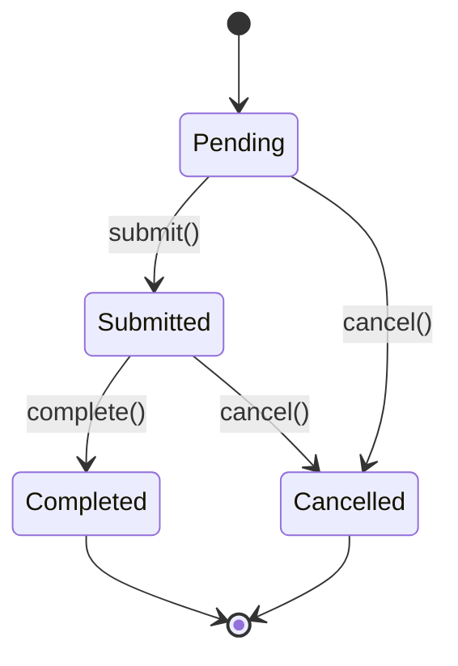

# 06- Encapsulation

## Overview

Encapsulation is the practice of controlling how an object's internal state and implementation are accessed and modified.

In Python, encapsulation is not enforced through strict private fields like some statically typed languages. Instead, Python provides conventions and mechanisms such as:

- Public attributes and methods
- Single-underscore protected-by-convention members
- Double-underscore name mangling
- Properties
- Descriptors
- Methods that enforce invariants
- Immutable or restricted data models
- Carefully designed interfaces

The engineering goal is not to hide every implementation detail. It is to define a stable boundary around an object so callers depend on intentional behavior rather than fragile internal representation.

A well-encapsulated backend component should make it difficult for callers to put the object into an invalid state.

```text
External Code
     |
     | Public API
     v
+----------------------+
| Encapsulated Object   |
|                      |
|  Invariants          |
|  Internal State      |
|  Implementation      |
+----------------------+
     |
     v
Infrastructure / Domain
```

Encapsulation is therefore closely related to:

- Abstraction
- Information hiding
- Invariants
- API design
- Maintainability
- Dependency management
- Testability
- Concurrency safety

## Why Encapsulation Matters

Without encapsulation, callers can directly manipulate internal state:

```python
order.status = "completed"
order.total = Decimal("-500")
order.items.clear()
```

The class has little control over its own invariants.

A better design exposes meaningful operations:

```python
order.add_item(item)
order.cancel()
order.complete()
```

The object can then validate state transitions:

```text
Caller
  |
  +--> cancel()
  |       |
  |       +--> validate current state
  |       +--> update state
  |
  +--> complete()
          |
          +--> validate current state
          +--> update state
```

This moves correctness closer to the state being protected.

## Encapsulation vs Information Hiding

These concepts are related but not identical.

| Concept | Meaning |
|---|---|
| Encapsulation | Bundling state and behavior behind an interface |
| Information hiding | Preventing consumers from depending on implementation details |
| Abstraction | Exposing essential behavior while hiding unnecessary complexity |
| Access control | Restricting how members can be accessed |

Python strongly supports encapsulation and information hiding through conventions and language mechanisms, but it intentionally does not impose strict access control on ordinary object attributes.

## Python's Encapsulation Philosophy

Python follows a relatively permissive model.

A class can define:

```python
class Account:
    def __init__(self, balance: Decimal) -> None:
        self._balance = balance
```

The leading underscore communicates:

> This is an implementation detail; external callers should not depend on it.

However, Python does not prevent:

```python
account._balance = Decimal("1000000")
```

The underscore is primarily a developer-facing contract.

This is consistent with Python's philosophy of trusting developers to use interfaces responsibly.

## Public Members

Public attributes and methods are intended for external use.

```python
class User:
    def __init__(self, user_id: int) -> None:
        self.user_id = user_id

    def deactivate(self) -> None:
        ...
```

A public member becomes part of the effective API of the class.

Changing it later can affect:

- Application code
- Tests
- Framework integrations
- Third-party consumers
- Internal services
- Serialization
- Monitoring code

Public interfaces should therefore be deliberately designed.

## Single Underscore Convention

A single leading underscore indicates an internal implementation detail.

```python
class OrderService:
    def __init__(self, repository: OrderRepository) -> None:
        self._repository = repository

    def create_order(self, request: CreateOrderRequest) -> Order:
        return self._repository.create(request)
```

The `_repository` attribute is not intended to be part of the public contract.

The convention also applies to module-level names:

```python
_internal_cache = {}
```

Wildcard imports generally avoid underscore-prefixed names unless explicitly exported.

## Why `_name` Is Usually Enough

Python developers generally prefer:

```python
self._balance
```

over trying to make the field impossible to access.

The advantage is simplicity.

```python
class Account:
    def __init__(self, balance: Decimal) -> None:
        self._balance = balance

    def deposit(self, amount: Decimal) -> None:
        if amount <= 0:
            raise ValueError("Amount must be positive")

        self._balance += amount
```

The class communicates:

- `_balance` is internal state.
- Callers should use `deposit()`.
- The method controls valid state transitions.

This is usually sufficient for application code.

## Double Underscore and Name Mangling

A double leading underscore triggers name mangling.

```python
class Account:
    def __init__(self) -> None:
        self.__balance = Decimal("0")
```

Inside the class, the attribute is referenced as:

```python
self.__balance
```

Python internally transforms the name approximately to:

```python
_Account__balance
```

Therefore:

```python
account._Account__balance
```

can still access it.

Name mangling is not true private access control.

## Why Name Mangling Exists

Name mangling primarily helps avoid accidental name collisions in inheritance hierarchies.

Consider:

```python
class Base:
    def __init__(self) -> None:
        self.__state = "base"


class Child(Base):
    def __init__(self) -> None:
        super().__init__()
        self.__state = "child"
```

These become conceptually:

```text
Base.__state  -> _Base__state
Child.__state -> _Child__state
```

The attributes do not accidentally overwrite each other.

This can be useful for framework classes or complex inheritance structures.

## Single Underscore vs Double Underscore

| Syntax | Meaning | Enforcement |
|---|---|---|
| `name` | Public | None |
| `_name` | Internal/protected by convention | None |
| `__name` | Name-mangled internal name | Weak; accessible indirectly |
| `__name__` | Special/dunder method or attribute | Reserved convention |

Do not use double underscores simply because an attribute should be inaccessible.

For most application code, `_name` is clearer.

## Encapsulation Through Methods

A common form of encapsulation is to prevent direct state mutation and expose behavior instead.

Poor:

```python
class BankAccount:
    def __init__(self, balance: Decimal) -> None:
        self.balance = balance
```

Any caller can perform:

```python
account.balance = Decimal("-1000")
```

Better:

```python
class BankAccount:
    def __init__(self, balance: Decimal = Decimal("0")) -> None:
        if balance < 0:
            raise ValueError("Balance cannot be negative")

        self._balance = balance

    @property
    def balance(self) -> Decimal:
        return self._balance

    def deposit(self, amount: Decimal) -> None:
        if amount <= 0:
            raise ValueError("Deposit must be positive")

        self._balance += amount

    def withdraw(self, amount: Decimal) -> None:
        if amount <= 0:
            raise ValueError("Withdrawal must be positive")

        if amount > self._balance:
            raise ValueError("Insufficient funds")

        self._balance -= amount
```

The object controls how its state changes.

## Properties as Encapsulation Boundaries

Properties allow attribute-style access while keeping behavior behind the interface.

```python
class User:
    def __init__(self, email: str) -> None:
        self._email = email

    @property
    def email(self) -> str:
        return self._email
```

The caller uses:

```python
user.email
```

rather than:

```python
user.get_email()
```

A property can later introduce validation, transformation, lazy computation, or compatibility logic without changing the external syntax.

## Read-Only Properties

A property without a setter can expose state without allowing ordinary assignment through that property.

```python
class Order:
    def __init__(self, order_id: int) -> None:
        self._order_id = order_id

    @property
    def order_id(self) -> int:
        return self._order_id
```

Then:

```python
order.order_id
```

works, while:

```python
order.order_id = 42
```

raises `AttributeError`.

This is useful when an identity value should not change after creation.

## Properties With Validation

Properties can enforce invariants at assignment boundaries.

```python
class Customer:
    def __init__(self, email: str) -> None:
        self.email = email

    @property
    def email(self) -> str:
        return self._email

    @email.setter
    def email(self, value: str) -> None:
        normalized = value.strip().lower()

        if "@" not in normalized:
            raise ValueError("Invalid email address")

        self._email = normalized
```

Now every assignment goes through the validation logic.

However, properties should not become a dumping ground for complex business workflows.

## Encapsulation and Invariants

Encapsulation is most valuable when the object has invariants.

Consider an order:

```python
class Order:
    def __init__(self) -> None:
        self._status = "pending"
        self._items: list[OrderItem] = []

    @property
    def status(self) -> str:
        return self._status

    def add_item(self, item: OrderItem) -> None:
        if self._status != "pending":
            raise InvalidOrderState(
                "Items cannot be added after submission"
            )

        self._items.append(item)

    def submit(self) -> None:
        if not self._items:
            raise InvalidOrderState(
                "Cannot submit an empty order"
            )

        self._status = "submitted"
```

The object's methods define legal state transitions.



The encapsulation boundary prevents arbitrary transitions such as:

```python
order._status = "completed"
```

at least at the intended API level.

## Encapsulation and Collections

Protecting an attribute is not enough if the attribute exposes mutable internal state.

Consider:

```python
class Order:
    def __init__(self) -> None:
        self._items: list[OrderItem] = []

    @property
    def items(self) -> list[OrderItem]:
        return self._items
```

A caller can mutate the internal list:

```python
order.items.clear()
```

The internal state was effectively exposed.

Prefer an immutable or read-only view when callers should not mutate the collection:

```python
class Order:
    @property
    def items(self) -> tuple[OrderItem, ...]:
        return tuple(self._items)
```

Alternatively, expose operations:

```python
def add_item(self, item: OrderItem) -> None:
    ...

def remove_item(self, item_id: int) -> None:
    ...
```

## Copying vs Exposing Internal State

There are several strategies.

| Strategy | Isolation | Cost |
|---|---|---|
| Return internal mutable object | None | Low |
| Return shallow copy | Moderate | O(n) |
| Return immutable representation | Stronger | Conversion cost |
| Return domain-specific operations | Strong | Usually best for invariants |
| Deep copy | Strong | Potentially expensive |

Choose based on the ownership contract.

Do not blindly deep-copy everything. Large backend objects can make copying expensive.

## Encapsulation and Mutable Nested Objects

Even returning a tuple may not make nested objects immutable:

```python
return tuple(self._items)
```

The tuple itself cannot be modified, but callers may still mutate individual items.

Therefore, encapsulation must consider the entire object graph.

```text
Order
 |
 +--> tuple
       |
       +--> Mutable OrderItem
       +--> Mutable OrderItem
```

Strong encapsulation may require immutable value objects or controlled mutation methods.

## Encapsulation Through Domain Methods

Prefer domain-specific operations over generic setters when business rules matter.

Weak design:

```python
order.set_status("cancelled")
```

Stronger design:

```python
order.cancel()
```

Why?

`cancel()` communicates intent and provides a natural location for business rules:

```python
def cancel(self) -> None:
    if self._status == "completed":
        raise InvalidOrderState(
            "Completed orders cannot be cancelled"
        )

    self._status = "cancelled"
```

A generic setter exposes representation. A domain method exposes behavior.

## Avoid Setter-Heavy Classes

A class with:

```python
set_status()
set_total()
set_customer()
set_items()
set_currency()
set_payment_method()
```

may simply be an anemic data container with procedural business logic elsewhere.

Setters are not inherently bad, but excessive setters often indicate that the object does not own its invariants.

Prefer methods that represent valid business operations.

## Encapsulation and Abstraction

Encapsulation answers:

> How do we control access to internal state and implementation?

Abstraction answers:

> What behavior should consumers need to know about?

Example:

```python
class PaymentGateway:
    def charge(
        self,
        payment: Payment,
    ) -> PaymentResult:
        ...
```

The caller does not need to know:

- HTTP endpoints
- Authentication headers
- Retry implementation
- JSON serialization
- Provider-specific response codes

Those details are encapsulated behind an abstraction.

## Encapsulation in Backend Services

Consider a service:

```python
class OrderService:
    def __init__(
        self,
        repository: OrderRepository,
        publisher: EventPublisher,
    ) -> None:
        self._repository = repository
        self._publisher = publisher

    async def submit(self, order_id: int) -> None:
        order = await self._repository.get(order_id)

        if order is None:
            raise OrderNotFound(order_id)

        order.submit()

        await self._repository.save(order)
        await self._publisher.publish(
            OrderSubmitted(order_id=order.id)
        )
```

Consumers depend on:

```python
service.submit(order_id)
```

rather than:

```python
service._repository
service._publisher
```

The implementation can later change without requiring callers to change.

## Encapsulation in FastAPI

A FastAPI route should generally depend on a service interface rather than manipulate domain internals.

```python
@router.post("/orders/{order_id}/submit")
async def submit_order(
    order_id: int,
    service: OrderService = Depends(get_order_service),
) -> Response:
    await service.submit(order_id)
    return Response(status_code=204)
```

The HTTP layer handles:

- Request parsing
- Authentication
- HTTP status codes
- Dependency injection

The service handles:

- Business behavior
- Domain operations
- Persistence coordination
- Event publication

Encapsulation keeps these responsibilities separated.

## Encapsulation in Django

Django models expose fields directly:

```python
class Order(models.Model):
    status = models.CharField(max_length=32)
```

However, business transitions can still be encapsulated in methods:

```python
class Order(models.Model):
    status = models.CharField(max_length=32)

    def cancel(self) -> None:
        if self.status == "completed":
            raise InvalidOrderState(
                "Completed orders cannot be cancelled"
            )

        self.status = "cancelled"
```

The model or domain layer can provide controlled operations while persistence remains managed by Django.

For complex domains, business logic may instead belong in dedicated domain or service objects.

## Encapsulation and REST APIs

Encapsulation also exists at service boundaries.

A REST API should expose a stable contract:

```http
POST /orders/123/cancel
```

rather than exposing internal database implementation details.

Clients should not need to know:

```text
PostgreSQL tables
Redis keys
Kafka topics
ORM models
Internal service classes
```

The API acts as an encapsulation boundary between services.

```text
Client
  |
  | HTTP
  v
API Contract
  |
  v
Service Layer
  |
  +--> Domain
  +--> PostgreSQL
  +--> Redis
  +--> Kafka
```

## Encapsulation in Microservices

A microservice should encapsulate its internal data and implementation.

Poor architecture:

```text
Service A
   |
   +--> Direct SQL --> Service B PostgreSQL
```

This tightly couples services to another service's internal representation.

Prefer:

```text
Service A
   |
   | REST / gRPC / Event
   v
Service B API
   |
   v
Service B Database
```

The database becomes an implementation detail of Service B.

This allows Service B to change:

- Schema
- Database technology
- Indexes
- Caching strategy
- Persistence model

without breaking consumers.

## Encapsulation and PostgreSQL

A repository can encapsulate persistence details:

```python
class PostgresOrderRepository:
    def __init__(self, pool: AsyncConnectionPool) -> None:
        self._pool = pool

    async def get(self, order_id: int) -> Order | None:
        ...
```

The service depends on the repository abstraction:

```python
class OrderService:
    def __init__(
        self,
        repository: OrderRepository,
    ) -> None:
        self._repository = repository
```

Now SQL details remain inside the persistence layer.

## Encapsulation and Redis

Caching should similarly be hidden behind a useful abstraction.

Avoid spreading Redis operations across business logic:

```python
redis.get(f"order:{order_id}")
redis.set(f"order:{order_id}", payload)
```

Prefer:

```python
class OrderCache:
    async def get(self, order_id: int) -> Order | None:
        ...

    async def set(self, order: Order) -> None:
        ...
```

This encapsulates:

- Key format
- Serialization
- TTL
- Cache invalidation
- Redis-specific behavior

The rest of the application depends on business semantics.

## Encapsulation and Kafka

The same principle applies to messaging.

Avoid exposing topic names throughout the application:

```python
producer.send(
    "orders.v1",
    payload,
)
```

Prefer:

```python
class OrderEventPublisher:
    async def publish_submitted(
        self,
        order: Order,
    ) -> None:
        ...
```

The publisher can encapsulate:

- Topic naming
- Event schema
- Serialization
- Headers
- Partitioning keys
- Delivery configuration
- Retry behavior

## Encapsulation and Concurrency

Encapsulation can help protect shared mutable state, but it does not automatically make an object thread-safe.

For example:

```python
class Counter:
    def __init__(self) -> None:
        self._value = 0

    def increment(self) -> None:
        self._value += 1
```

If multiple threads share the same instance, the operation may need synchronization depending on the runtime and operation semantics.

A stronger design can encapsulate synchronization:

```python
import threading


class Counter:
    def __init__(self) -> None:
        self._value = 0
        self._lock = threading.Lock()

    def increment(self) -> None:
        with self._lock:
            self._value += 1

    @property
    def value(self) -> int:
        with self._lock:
            return self._value
```

The lock itself becomes an implementation detail.

Encapsulation therefore provides a place to enforce concurrency rules, but developers must still reason about:

- Thread safety
- Async task safety
- Shared state
- Lock contention
- Process boundaries

## Process Boundaries

Python instance state is normally process-local.

```text
Kubernetes Pod A
    |
    +--> Service instance
    +--> _cache

Kubernetes Pod B
    |
    +--> Service instance
    +--> _cache
```

Encapsulating `_cache` does not make it globally shared.

For distributed state, use an appropriate external system such as:

- PostgreSQL
- Redis
- Kafka
- S3
- Other durable infrastructure

Do not confuse object encapsulation with distributed state management.

## Encapsulation and Security

Encapsulation is not a security boundary.

This is not security:

```python
class User:
    def __init__(self) -> None:
        self._password = "secret"
```

The attribute remains accessible:

```python
user._password
```

Security should instead use:

- Authentication
- Authorization
- Encryption
- Secret management
- Access control
- Network policies
- Database permissions
- Least privilege

Encapsulation reduces accidental misuse and limits coupling; it should not be treated as an authorization mechanism.

## Secrets and Object Representation

Even correctly encapsulated fields can leak through object representations.

Avoid:

```python
class ApiClient:
    def __init__(self, api_key: str) -> None:
        self._api_key = api_key

    def __repr__(self) -> str:
        return f"ApiClient(api_key={self._api_key!r})"
```

This can expose secrets in:

- Logs
- Exceptions
- Debugging output
- Monitoring systems

Prefer redaction:

```python
class ApiClient:
    def __init__(self, api_key: str) -> None:
        self._api_key = api_key

    def __repr__(self) -> str:
        return "ApiClient(api_key=**redacted**)"
```

## Encapsulation and Testing

Good encapsulation makes tests focus on public behavior.

Prefer:

```python
def test_completed_order_cannot_be_cancelled() -> None:
    order = create_completed_order()

    with pytest.raises(InvalidOrderState):
        order.cancel()
```

rather than testing private implementation details:

```python
assert order._status == "completed"
```

Private state can still be inspected when debugging or when absolutely necessary, but tests that depend heavily on implementation details become fragile during refactoring.

## Encapsulation and Mocking

Dependency encapsulation also reduces unnecessary mocking.

Instead of exposing:

```python
service._repository
service._publisher
service._cache
```

tests can provide dependencies through the constructor:

```python
service = OrderService(
    repository=fake_repository,
    publisher=fake_publisher,
)
```

This preserves the public construction contract while keeping infrastructure replaceable.

## Encapsulation and Performance

Encapsulation does not inherently make Python code slower in a meaningful way.

For example:

```python
@property
def balance(self) -> Decimal:
    return self._balance
```

adds a method call compared with direct attribute access.

For typical backend workloads, this overhead is usually negligible compared with:

- Database queries
- Network calls
- Serialization
- Encryption
- Logging
- External service calls

Do not sacrifice a useful abstraction solely to avoid micro-level attribute access overhead without measurement.

For performance-critical inner loops, benchmark the actual workload.

## Encapsulation and Memory

Encapsulation does not inherently reduce memory usage.

The object still contains its internal state:

```python
class User:
    def __init__(self, user_id: int) -> None:
        self._user_id = user_id
```

The underscore changes the interface convention, not the fundamental memory model.

Memory optimization should instead consider:

- Object count
- Attribute storage
- `__slots__`
- Data structures
- Object lifetime
- Caching
- Lazy evaluation
- Allocation patterns

## Encapsulation and API Stability

One of the strongest benefits of encapsulation is reducing the number of implementation details that become dependencies.

Suppose a cache implementation changes:

```text
Version 1
Service -> Redis

Version 2
Service -> Local Cache -> Redis

Version 3
Service -> Redis Cluster
```

If cache details are encapsulated:

```python
cache.get_order(order_id)
```

the service may not need to change.

If Redis commands are spread throughout the codebase, the migration becomes much harder.

## Encapsulation and Refactoring

Strong encapsulation creates controlled change boundaries.

```text
Public Interface
       |
       v
+-------------------+
| Internal Details  |
|                   |
| Implementation A  |
|       -> B        |
|       -> C        |
+-------------------+
```

Consumers depend on the interface rather than the internal representation.

This is particularly valuable when:

- Migrating databases
- Replacing third-party APIs
- Introducing caching
- Changing serialization
- Splitting services
- Moving from synchronous to asynchronous infrastructure

## When Not to Encapsulate Aggressively

Encapsulation can be overused.

A simple data model does not necessarily need dozens of getters and setters.

Avoid:

```python
class User:
    def get_name(self) -> str:
        return self._name

    def set_name(self, name: str) -> None:
        self._name = name
```

when a simple attribute is sufficient:

```python
@dataclass
class User:
    name: str
```

The goal is not maximum hiding.

The goal is an appropriate and stable boundary.

## Common Mistakes

### Treating `_name` as True Private State

A single underscore is a convention, not access control.

### Using `__name` Everywhere

Double underscores add name mangling and can make debugging and inheritance more complicated. Use them when collision avoidance is actually useful.

### Exposing Mutable Internal Collections

Returning `self._items` directly allows callers to bypass invariants.

### Adding Getters and Setters for Every Field

This can create unnecessary ceremony without providing meaningful encapsulation.

### Using Generic Setters for Business State

`set_status("completed")` may allow invalid state transitions. Domain operations such as `complete()` are usually clearer.

### Testing Private Implementation Details

Tests tightly coupled to `_internal_state` can break during valid refactoring.

### Assuming Encapsulation Provides Security

Private-by-convention attributes are not authorization controls or secret protection.

### Hiding Too Much

If consumers cannot understand how to use a class without reading its implementation, the abstraction is poorly designed.

### Putting Business Logic in Properties

A property should not unexpectedly perform expensive or externally visible workflows.

### Returning Mutable Nested Objects

A tuple around mutable objects does not make the entire object graph immutable.

## Production Pitfalls

| Pitfall | Result | Better Approach |
|---|---|---|
| Direct mutation of domain state | Invalid invariants | Domain methods |
| Exposing internal lists/dicts | External mutation | Immutable view or controlled operations |
| Redis access everywhere | Infrastructure coupling | Cache abstraction |
| Direct database access across services | Tight coupling | Service API |
| Secrets in private attributes | False security assumption | Proper secret management |
| Heavy property logic | Hidden latency | Explicit methods |
| Excessive getters/setters | Anemic design | Behavior-oriented interface |
| Private-state tests | Fragile tests | Test public behavior |
| Shared mutable state | Race conditions | Ownership/synchronization |
| Over-encapsulation | Excessive complexity | Encapsulate meaningful boundaries |

## Production Design Principles

### Encapsulate Invariants

If invalid state must be prevented, place the validation close to the state it protects.

### Encapsulate Infrastructure Details

Hide Redis keys, SQL queries, Kafka topic names, HTTP headers, and provider-specific behavior behind useful abstractions.

### Prefer Behavior Over Representation

Expose:

```python
order.cancel()
```

instead of:

```python
order.status = "cancelled"
```

when cancellation has business rules.

### Keep Interfaces Small

Consumers should depend on the smallest useful public API.

### Make Ownership Explicit

If a class owns mutable state or external resources, define who can mutate, replace, or close them.

### Avoid False Abstraction

Do not create interfaces solely to satisfy an OOP pattern. Create boundaries where they reduce coupling or protect meaningful behavior.

## Encapsulation Decision Framework

When deciding whether a member should be public or internal, ask:

1. Is this part of the stable contract?
2. Can callers put the object into an invalid state by changing it?
3. Does changing the implementation require callers to change?
4. Is the state mutable?
5. Does the object need to enforce a business invariant?
6. Does exposing this value leak infrastructure details?
7. Would a domain-specific method express the intent better?
8. Would hiding the implementation meaningfully reduce coupling?
9. Does the abstraction add more complexity than value?

A practical rule is:

```text
Stable external behavior
        |
        v
      Public

Implementation detail
        |
        v
     Internal
```

## Encapsulation Checklist

Before exposing a class member, verify:

- It is intentionally part of the public API.
- Callers cannot accidentally violate important invariants.
- Mutable internal state is not unintentionally exposed.
- Infrastructure details are not leaking through the domain interface.
- Business operations are represented by meaningful methods.
- Sensitive data cannot be accidentally logged or serialized.
- The interface is small enough to remain maintainable.
- Tests can primarily validate behavior rather than implementation details.
- Concurrency and ownership requirements are clear.
- The abstraction provides meaningful decoupling rather than ceremony.

## Key Takeaways

- Encapsulation in Python is primarily about controlling interfaces, protecting invariants, and hiding implementation details rather than enforcing strict private access.
- A single leading underscore communicates internal ownership by convention, while double underscores provide name mangling mainly to avoid accidental inheritance collisions.
- Domain behavior such as `order.cancel()` is usually stronger than exposing generic setters because the object can enforce valid state transitions.
- Backend encapsulation should extend beyond classes to repositories, caches, message publishers, APIs, and microservice boundaries so infrastructure implementations can change independently.
- Good encapsulation improves maintainability and testability, but it should be applied selectively; excessive getters, setters, wrappers, and abstractions can make a system more complex without improving its design.