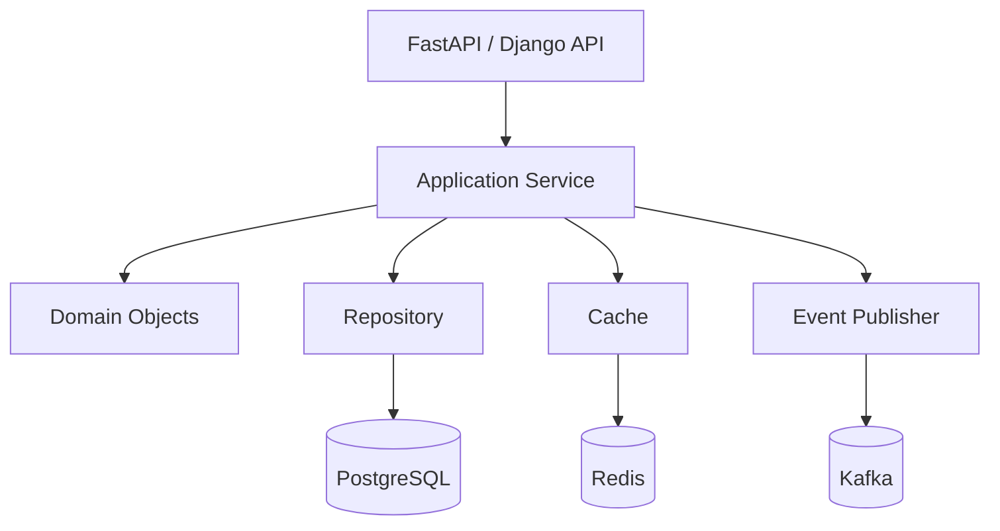

# 08- Composition

## Overview

Composition is an object-oriented design technique where an object is built from other objects rather than inheriting their implementation.

The fundamental relationship is:

```text
Inheritance:
OrderService IS-A BaseService

Composition:
OrderService HAS-A OrderRepository
OrderService HAS-A EventPublisher
OrderService HAS-A Clock
```

In Python, composition is often the preferred approach for application and backend architecture because it keeps dependencies explicit and replaceable.

A composed object delegates responsibilities to collaborating objects:

```python
class OrderService:
    def __init__(
        self,
        repository: OrderRepository,
        publisher: EventPublisher,
    ) -> None:
        self._repository = repository
        self._publisher = publisher
```

`OrderService` does not become a repository or event publisher. It uses those components to perform its work.

Composition is particularly important for:

- Dependency injection
- Service-layer design
- Repository patterns
- Adapter patterns
- Infrastructure integration
- Testing
- Microservice architecture
- Runtime configuration
- Separation of concerns

## Why Composition Matters

Inheritance creates a type relationship:

```text
Child
  |
  v
Parent
```

Composition creates a collaboration relationship:

```text
Service
  |
  +--> Repository
  +--> Cache
  +--> Publisher
```

The second design generally allows each component to evolve independently.

For example, an order service might initially use PostgreSQL:

```text
OrderService
     |
     v
PostgresOrderRepository
```

Later, the persistence implementation can change:

```text
OrderService
     |
     v
OrderRepository
     |
     +--> PostgreSQL
     +--> DynamoDB
     +--> In-memory test repository
```

The service does not need to inherit from any of these implementations.

## Composition vs Inheritance

| Concern | Composition | Inheritance |
|---|---|---|
| Relationship | Has-a / uses-a | Is-a |
| Coupling | Usually lower | Usually higher |
| Runtime replacement | Easy | More difficult |
| Dependency injection | Natural | Less natural |
| Multiple behaviors | Easy to combine | Can create complex hierarchies |
| Implementation reuse | Delegation | Inherited behavior |
| Behavioral substitution | Through interface/protocol | Through subtype |
| Testing | Usually straightforward | Can require hierarchy-aware tests |
| Evolution | Components can change independently | Base-class changes affect subclasses |
| Best fit | Services and collaborators | Genuine subtype relationships |

A useful default is:

> Prefer composition unless inheritance represents a clear, stable subtype relationship.

## Basic Composition

```python
class EmailSender:
    def send(self, recipient: str, message: str) -> None:
        ...


class NotificationService:
    def __init__(self, sender: EmailSender) -> None:
        self._sender = sender

    def notify(
        self,
        recipient: str,
        message: str,
    ) -> None:
        self._sender.send(recipient, message)
```

`NotificationService` is composed with an `EmailSender`.

The relationship is:

```text
NotificationService
        |
        | uses
        v
    EmailSender
```

The service does not need to know how email delivery is implemented.

## Delegation

Composition commonly uses delegation.

```python
class ReportService:
    def __init__(self, formatter: ReportFormatter) -> None:
        self._formatter = formatter

    def generate(self, report: Report) -> str:
        return self._formatter.format(report)
```

`ReportService` delegates formatting to `ReportFormatter`.

This separates responsibilities:

```text
ReportService
    |
    +--> orchestration
    |
    +--> ReportFormatter
            |
            +--> formatting
```

Delegation is one of the fundamental mechanisms behind composition.

## Composition and Single Responsibility

Composition allows responsibilities to be split into focused components.

Instead of:

```python
class OrderService:
    def validate(self):
        ...

    def calculate_total(self):
        ...

    def save_to_postgres(self):
        ...

    def publish_to_kafka(self):
        ...

    def send_email(self):
        ...

    def write_audit_log(self):
        ...
```

compose specialized collaborators:

```python
class OrderService:
    def __init__(
        self,
        repository: OrderRepository,
        publisher: EventPublisher,
        notifier: NotificationService,
        auditor: AuditLogger,
    ) -> None:
        self._repository = repository
        self._publisher = publisher
        self._notifier = notifier
        self._auditor = auditor
```

The service orchestrates the workflow while collaborators own specialized responsibilities.

## Dependency Injection

Composition and dependency injection are closely related.

Instead of constructing dependencies internally:

```python
class OrderService:
    def __init__(self) -> None:
        self._repository = PostgresOrderRepository()
```

inject them:

```python
class OrderService:
    def __init__(
        self,
        repository: OrderRepository,
    ) -> None:
        self._repository = repository
```

The composition root decides the implementation:

```text
Application Startup
       |
       +--> PostgresOrderRepository
       |
       v
   OrderService
```

Testing can use:

```text
Test
 |
 +--> FakeOrderRepository
 |
 v
OrderService
```

This is one of the strongest practical reasons to favor composition in backend systems.

## Composition Root

The composition root is the part of the application responsible for assembling concrete dependencies.

For example:

```python
def create_application(settings: Settings) -> FastAPI:
    pool = create_connection_pool(settings.database_url)

    repository = PostgresOrderRepository(pool)
    publisher = KafkaEventPublisher(settings.kafka)
    service = OrderService(
        repository=repository,
        publisher=publisher,
    )

    return build_api(service)
```

The application knows which concrete implementations to assemble.

Business code does not need to know how infrastructure components are constructed.

```text
Configuration
     |
     v
Composition Root
     |
     +--> Repository
     +--> Publisher
     +--> Cache
     |
     v
Application Services
     |
     v
API
```

## Composition and Protocols

Python's structural typing makes composition particularly flexible.

```python
from typing import Protocol


class OrderRepository(Protocol):
    async def get(self, order_id: int) -> Order | None:
        ...

    async def save(self, order: Order) -> None:
        ...
```

A concrete implementation does not need to inherit from the protocol:

```python
class PostgresOrderRepository:
    async def get(self, order_id: int) -> Order | None:
        ...

    async def save(self, order: Order) -> None:
        ...
```

The service can depend on the protocol:

```python
class OrderService:
    def __init__(
        self,
        repository: OrderRepository,
    ) -> None:
        self._repository = repository
```

This provides composition without requiring a shared inheritance hierarchy.

## Composition with Multiple Implementations

Suppose an application supports multiple payment providers.

```python
class PaymentGateway(Protocol):
    async def charge(
        self,
        amount: Decimal,
    ) -> PaymentResult:
        ...


class StripeGateway:
    async def charge(
        self,
        amount: Decimal,
    ) -> PaymentResult:
        ...


class AdyenGateway:
    async def charge(
        self,
        amount: Decimal,
    ) -> PaymentResult:
        ...
```

The service remains unchanged:

```python
class PaymentService:
    def __init__(
        self,
        gateway: PaymentGateway,
    ) -> None:
        self._gateway = gateway

    async def charge(
        self,
        amount: Decimal,
    ) -> PaymentResult:
        return await self._gateway.charge(amount)
```

Runtime configuration determines the concrete implementation.

```text
Settings
   |
   +--> payment_provider=stripe
   |
   v
StripeGateway
   |
   v
PaymentService
```

This is a strong example of composition supporting runtime flexibility.

## Composition and Layered Architecture

A typical backend can use composition across layers:



Each layer composes the dependencies it needs.

This reduces the temptation to build one large inheritance hierarchy representing the entire application.

## Composition in FastAPI

FastAPI's dependency injection model naturally supports composition.

```python
def get_order_service() -> OrderService:
    repository = get_order_repository()
    publisher = get_event_publisher()

    return OrderService(
        repository=repository,
        publisher=publisher,
    )
```

The endpoint depends on the service:

```python
@router.post("/orders/{order_id}/submit")
async def submit_order(
    order_id: int,
    service: OrderService = Depends(get_order_service),
) -> Response:
    await service.submit(order_id)
    return Response(status_code=204)
```

The HTTP layer does not construct PostgreSQL repositories, Kafka producers, or Redis clients directly.

## Composition in Django

Django applications can also use composition even though the framework provides inheritance-heavy components such as models and class-based views.

For example:

```python
class OrderService:
    def __init__(
        self,
        repository: OrderRepository,
        publisher: EventPublisher,
    ) -> None:
        self._repository = repository
        self._publisher = publisher
```

A Django view can use the service:

```python
class SubmitOrderView(View):
    def post(self, request, order_id: int):
        service = build_order_service()
        service.submit(order_id)

        return HttpResponse(status=204)
```

The view handles HTTP concerns while the service composes application dependencies.

## Composition and Repository Pattern

Repositories are naturally compositional.

```python
class UserService:
    def __init__(
        self,
        repository: UserRepository,
    ) -> None:
        self._repository = repository

    async def get_user(self, user_id: int) -> User:
        user = await self._repository.get(user_id)

        if user is None:
            raise UserNotFound(user_id)

        return user
```

The service does not need to know whether the repository uses:

- PostgreSQL
- DynamoDB
- An external API
- An in-memory store
- A test fixture

This separation is particularly useful when business logic and persistence evolve at different rates.

## Composition and Caching

Caching can be introduced through composition.

```python
class OrderService:
    def __init__(
        self,
        repository: OrderRepository,
        cache: OrderCache,
    ) -> None:
        self._repository = repository
        self._cache = cache

    async def get(self, order_id: int) -> Order:
        cached = await self._cache.get(order_id)

        if cached is not None:
            return cached

        order = await self._repository.get(order_id)

        if order is None:
            raise OrderNotFound(order_id)

        await self._cache.set(order)
        return order
```

The service composes two independent concerns:

```text
OrderService
    |
    +--> OrderCache --> Redis
    |
    +--> OrderRepository --> PostgreSQL
```

The caching strategy can change without changing the repository.

## Composition and Messaging

Messaging infrastructure can also be composed.

```python
class OrderService:
    def __init__(
        self,
        repository: OrderRepository,
        publisher: OrderEventPublisher,
    ) -> None:
        self._repository = repository
        self._publisher = publisher
```

The publisher can encapsulate Kafka-specific details:

```text
OrderService
     |
     v
OrderEventPublisher
     |
     +--> serialization
     +--> topic
     +--> partition key
     +--> headers
     +--> Kafka producer
```

The application service deals with domain events rather than low-level Kafka operations.

## Composition and Adapters

Adapters are another natural use of composition.

```python
class PaymentService:
    def __init__(
        self,
        gateway: PaymentGateway,
    ) -> None:
        self._gateway = gateway
```

A provider-specific adapter can translate external APIs:

```text
PaymentService
      |
      v
PaymentGateway
      |
      v
StripeAdapter
      |
      v
Stripe API
```

The external provider's request and response format stays inside the adapter.

## Composition and Decorators

Composition can also implement cross-cutting behavior.

```python
class RetryingPaymentGateway:
    def __init__(
        self,
        gateway: PaymentGateway,
        retry_policy: RetryPolicy,
    ) -> None:
        self._gateway = gateway
        self._retry_policy = retry_policy

    async def charge(
        self,
        amount: Decimal,
    ) -> PaymentResult:
        return await self._retry_policy.execute(
            lambda: self._gateway.charge(amount)
        )
```

Now:

```text
PaymentService
      |
      v
RetryingPaymentGateway
      |
      v
StripeGateway
```

The retry wrapper composes another implementation rather than subclassing it.

This can be extended:

```text
Metrics
   |
Logging
   |
Retry
   |
Circuit Breaker
   |
Payment Gateway
```

Such wrappers can be powerful, but excessive layers can make execution flow difficult to trace.

## Composition vs Decorator Pattern

A decorator is a specific application of composition.

```python
class LoggingRepository:
    def __init__(
        self,
        repository: OrderRepository,
        logger: Logger,
    ) -> None:
        self._repository = repository
        self._logger = logger

    async def get(self, order_id: int) -> Order | None:
        self._logger.info(
            "Loading order",
            extra={"order_id": order_id},
        )

        return await self._repository.get(order_id)
```

The wrapper preserves the repository contract while adding behavior.

This is often cleaner than creating subclasses such as:

```text
LoggedPostgresRepository
LoggedCachedPostgresRepository
LoggedRetryingCachedPostgresRepository
```

which can lead to a combinatorial inheritance problem.

## Combinatorial Inheritance Problem

Suppose a system has:

- 3 storage implementations
- 2 caching strategies
- 2 retry strategies
- 2 logging modes

Inheritance can tempt developers toward many combinations:

```text
PostgresRepository
CachedPostgresRepository
RetryingPostgresRepository
LoggedCachedPostgresRepository
RetryingLoggedCachedPostgresRepository
...
```

Composition can combine these independently:

```text
Logging
   |
Retry
   |
Cache
   |
PostgresRepository
```

This allows behavior to be assembled based on deployment requirements.

## Composition and Runtime Configuration

Composition works particularly well when configuration determines implementation.

```python
def build_payment_gateway(
    settings: Settings,
) -> PaymentGateway:
    if settings.provider == "stripe":
        return StripeGateway(
            api_key=settings.stripe_api_key,
        )

    if settings.provider == "adyen":
        return AdyenGateway(
            api_key=settings.adyen_api_key,
        )

    raise ValueError("Unsupported payment provider")
```

The service remains independent of provider selection.

This is useful for:

- Development environments
- Staging
- Production
- Feature flags
- Multi-region deployments
- Gradual migrations

## Composition and Testing

Composition makes unit testing straightforward.

Production:

```python
service = OrderService(
    repository=PostgresOrderRepository(pool),
    publisher=KafkaEventPublisher(producer),
)
```

Test:

```python
service = OrderService(
    repository=FakeOrderRepository(),
    publisher=FakeEventPublisher(),
)
```

The service logic does not change.

A test double can be minimal:

```python
class FakeOrderRepository:
    def __init__(self) -> None:
        self.orders: dict[int, Order] = {}

    async def get(self, order_id: int) -> Order | None:
        return self.orders.get(order_id)

    async def save(self, order: Order) -> None:
        self.orders[order.id] = order
```

## Composition and Integration Testing

Composition also allows selective integration testing.

For example:

```text
Unit Test
OrderService
    |
    +--> FakeRepository
    +--> FakePublisher


Integration Test
OrderService
    |
    +--> PostgreSQL
    +--> Kafka test infrastructure
```

The same service can operate with different implementations.

This reduces the need to duplicate business logic between test and production code.

## Composition and Concurrency

Composition makes concurrency policies explicit.

For example:

```python
class RateLimitedClient:
    def __init__(
        self,
        client: HttpClient,
        limiter: RateLimiter,
    ) -> None:
        self._client = client
        self._limiter = limiter

    async def request(
        self,
        request: Request,
    ) -> Response:
        await self._limiter.acquire()
        return await self._client.send(request)
```

The rate limiter is a separate component with its own concurrency semantics.

This is easier to reason about than embedding unrelated synchronization logic across a large inheritance hierarchy.

## Process and Container Boundaries

Composition does not change Python's process model.

Suppose:

```text
Kubernetes
 |
 +--> Pod A
 |      |
 |      +--> OrderService
 |
 +--> Pod B
        |
        +--> OrderService
```

Each service instance has its own composed dependencies.

For example:

```text
Pod A -> LocalCache A
Pod B -> LocalCache B
```

If shared state is required, use an external system such as Redis or PostgreSQL.

Composition structures in-memory dependencies; it does not provide distributed coordination.

## Composition and Resource Ownership

When composing resource-owning components, ownership must be explicit.

Example:

```python
class Application:
    def __init__(
        self,
        database: Database,
        publisher: EventPublisher,
    ) -> None:
        self._database = database
        self._publisher = publisher

    async def shutdown(self) -> None:
        await self._publisher.close()
        await self._database.close()
```

The application owns the lifecycle.

Avoid ambiguous designs where multiple objects independently believe they own the same resource.

```text
Application
   |
   +--> Database Pool [owner]
   |
   +--> Services [borrow dependency]
```

This becomes important with:

- Async HTTP clients
- Database pools
- Kafka producers
- Redis connections
- Thread pools
- Process pools

## Composition and Connection Pooling

A connection pool should generally be shared according to the intended application lifecycle rather than recreated for every service instance.

```text
Application
     |
     v
Database Pool
     |
     +--> UserRepository
     +--> OrderRepository
     +--> PaymentRepository
```

This provides:

- Connection reuse
- Controlled concurrency
- Lower connection overhead
- Centralized lifecycle management

Creating a new pool inside every service constructor can cause resource exhaustion.

## Composition and Microservices

Composition is particularly useful within microservices because services often depend on multiple infrastructure components.

Example:

```text
Order Service
     |
     +--> PostgreSQL Repository
     +--> Redis Cache
     +--> Kafka Publisher
     +--> Payment Gateway
     +--> Clock
```

Each dependency has an independent responsibility.

The service coordinates them without inheriting their implementation.

## Composition and AWS

A typical AWS backend might compose:

```text
OrderService
     |
     +--> RDS Repository
     +--> ElastiCache Repository
     +--> Kafka/MSK Publisher
     +--> S3 Storage
     +--> External Payment Adapter
```

The composition root can construct the appropriate clients and adapters based on environment configuration.

The business layer should not need to know whether persistence is backed by:

- RDS
- DynamoDB
- S3
- Another service

unless that distinction is intentionally part of the domain.

## Composition and Dependency Scope

Dependencies can have different lifetimes.

| Scope | Example |
|---|---|
| Application | Database pool |
| Worker process | Kafka producer |
| Request | Request context |
| Operation | Transaction |
| Object | Small stateless helper |

The composition architecture should match the intended scope.

For example:

```text
Application
    |
    +--> DatabasePool
    |
    +--> RedisClient
    |
    +--> KafkaProducer
    |
    +--> Request Service
```

A request-scoped service can use application-scoped infrastructure safely when ownership is clearly defined.

## Composition and Transactions

Transaction boundaries should be explicit.

Avoid making every repository method independently commit:

```python
class OrderRepository:
    async def save(self, order: Order) -> None:
        await self._connection.commit()
```

This can make multi-step workflows difficult to coordinate.

A higher-level component can compose the transaction:

```text
OrderService
    |
    v
Transaction
    |
    +--> Repository.save()
    +--> Repository.update()
    +--> Event preparation
    |
    v
Commit
```

The exact architecture depends on the database and transaction model, but composition should preserve clear ownership of transactional boundaries.

## Composition and Observability

Cross-cutting concerns can be composed without polluting domain logic.

For example:

```text
InstrumentedClient
      |
      v
RetryingClient
      |
      v
HttpClient
```

The outer component can record:

- Request duration
- Error count
- Retry count
- Status codes
- Trace context

The underlying client remains focused on HTTP operations.

This pattern can be useful for:

- HTTP clients
- Database repositories
- Kafka publishers
- External API adapters

## Performance Considerations

Composition adds object references and delegation calls.

For example:

```python
service.repository.get(...)
```

requires an additional attribute lookup and method call compared with tightly coupled inline code.

In backend applications, this overhead is generally negligible compared with:

- Network latency
- Database execution
- Serialization
- Disk I/O
- External API calls

Do not eliminate useful composition because of theoretical micro-performance concerns.

However, excessive object graphs can increase:

- Allocation
- Memory usage
- Startup complexity
- Call-stack depth
- Debugging complexity

Measure real workloads before optimizing.

## Memory Considerations

Every composed object holds references to its dependencies.

```python
class Service:
    def __init__(
        self,
        repository: Repository,
        cache: Cache,
    ) -> None:
        self._repository = repository
        self._cache = cache
```

These references are typically cheap, but the dependencies themselves may be expensive.

For example:

```text
Service
  |
  +--> Database Pool
  +--> Redis Client
  +--> Kafka Producer
```

The service does not own a copy of the underlying resources merely because it references them.

Avoid accidentally creating duplicate heavyweight clients.

## Security Considerations

Composition helps isolate security-sensitive responsibilities.

For example:

```text
PaymentService
     |
     v
PaymentGateway
     |
     v
Secret-aware adapter
```

The API key can remain inside the adapter rather than being exposed throughout the domain layer.

Good practices include:

- Inject only required credentials.
- Avoid passing secrets through unrelated components.
- Redact credentials in logs.
- Keep authorization logic at appropriate boundaries.
- Use AWS Secrets Manager or another approved secret-management system.
- Avoid treating dependency encapsulation as an authorization mechanism.

## Reliability Considerations

Composed dependencies create failure paths.

For example:

```text
OrderService
    |
    +--> PostgreSQL
    |
    +--> Redis
    |
    +--> Kafka
```

Each dependency can fail independently.

The service should define which failures are:

- Fatal
- Retriable
- Optional
- Degradable

For example, a cache failure might be tolerated:

```text
Redis unavailable
      |
      v
Cache miss / bypass
      |
      v
PostgreSQL
```

while a database failure may make the request impossible to complete.

Composition makes these dependency relationships visible, but resilience behavior must still be explicitly designed.

## High Availability

For highly available systems, composed dependencies should match the application's availability requirements.

For example:

```text
API Pods
   |
   +--> Load Balancer
   |
   +--> Database HA
   +--> Redis HA
   +--> Kafka Cluster
```

A service's composition graph should not accidentally introduce a single point of failure.

Examples:

- One local singleton should not be required for all pods.
- A single external client should not become a global synchronization point.
- Retry logic should not overload a recovering dependency.
- Circuit breakers may be appropriate for unstable downstream services.

## Disaster Recovery

Composition itself does not provide disaster recovery.

Durable state should remain in systems designed for durability:

```text
Application Objects
      |
      v
External Durable Systems
      |
      +--> PostgreSQL
      +--> S3
      +--> Kafka
```

In-memory composed objects are normally reconstructed after:

- Process restart
- Container replacement
- Deployment
- Node failure
- Availability-zone failure

This makes deterministic dependency construction important during application startup.

## Common Mistakes

### Confusing Composition With Inheritance

Using:

```python
class OrderService(PostgresRepository):
    ...
```

when the service merely needs repository functionality creates an incorrect type relationship.

Prefer:

```python
class OrderService:
    def __init__(self, repository: OrderRepository) -> None:
        self._repository = repository
```

### Constructing Dependencies Internally

This hides coupling:

```python
class Service:
    def __init__(self) -> None:
        self._repository = PostgresRepository()
```

Prefer dependency injection.

### Creating Heavy Dependencies Repeatedly

Constructing database pools, HTTP clients, or Kafka producers for every request can exhaust resources.

### Exposing Every Dependency

A class does not need to expose:

```python
service.repository
service.cache
service.publisher
```

as public API unless consumers genuinely need those dependencies.

### Creating Excessive Abstractions

Not every helper requires a protocol, interface, factory, and adapter.

Abstractions should reduce meaningful coupling.

### Overusing Decorator Layers

Composition can become difficult to debug when behavior is wrapped through many layers:

```text
Metrics
  -> Logging
      -> Retry
          -> Cache
              -> Client
```

Keep wrapper chains understandable and observable.

### Sharing Mutable State Without Ownership Rules

Two composed components mutating the same object can introduce race conditions and hidden coupling.

### Ignoring Lifecycle Ownership

If multiple components share a connection pool, it must be clear who closes it.

### Using Composition to Hide Poor Architecture

Composition does not automatically produce good design. A class containing twenty dependencies may simply be a large service with its complexity moved into constructor parameters.

## Production Pitfalls

| Pitfall | Impact | Better Approach |
|---|---|---|
| Dependencies constructed internally | Hidden coupling | Dependency injection |
| New DB pool per request | Connection exhaustion | Application-scoped pool |
| Shared mutable collaborator | Race conditions | Explicit ownership/synchronization |
| Too many constructor dependencies | Large service surface | Split responsibilities |
| Deep decorator chain | Difficult debugging | Focused wrappers |
| Infrastructure leaked into domain | Tight coupling | Adapters/repositories |
| Unclear resource ownership | Shutdown bugs | Explicit lifecycle management |
| Cache treated as source of truth | Data inconsistency | Define cache semantics |
| Local state assumed global | Distributed-system bugs | External shared state |
| Excessive abstractions | Complexity | Introduce boundaries where they add value |

## Composition vs Inheritance Decision Framework

Use this decision process:

```text
Need to reuse behavior?
        |
        v
Is the relationship genuinely "is-a"?
        |
    +---+---+
    |       |
   Yes      No
    |       |
    v       v
Inheritance Composition
    |
    v
Can the child satisfy the parent's
behavioral contract?
    |
  +---+---+
  |       |
 Yes      No
  |       |
  v       v
Use      Use
inheritance composition
```

For backend dependencies:

```text
Service needs repository?
        |
        v
Composition

Service needs cache?
        |
        v
Composition

Service needs payment gateway?
        |
        v
Composition

Exception specializes another exception?
        |
        v
Inheritance

Django class-based view extends framework view?
        |
        v
Inheritance
```

## When Composition Is the Better Choice

Prefer composition when:

- Dependencies need to be replaced independently.
- Runtime configuration selects implementations.
- Testing requires fakes or mocks.
- Components have different responsibilities.
- Infrastructure implementations may change.
- Multiple behaviors need to be combined.
- The relationship is "has-a" or "uses-a".
- You want explicit dependency ownership.
- The class should not inherit unrelated implementation details.

## When Inheritance May Be Better

Composition is not universally superior.

Inheritance can be appropriate when:

- There is a genuine subtype relationship.
- The framework explicitly requires subclassing.
- A stable algorithm has well-defined extension points.
- A specialized exception belongs to an exception hierarchy.
- A shallow hierarchy represents meaningful domain specialization.
- Subclasses can satisfy the base behavioral contract.

Examples include:

```text
Exception
   |
   +--> DomainError
          |
          +--> OrderNotFound
```

and framework extension points:

```text
Django View
   |
   +--> Application View
```

## Composition and Object-Oriented Design

Composition works especially well with other OOP principles.

### Encapsulation

Collaborators remain internal:

```python
self._repository
self._cache
self._publisher
```

### Polymorphism

Protocols or abstract interfaces allow interchangeable implementations:

```python
repository: OrderRepository
```

### Abstraction

The service depends on meaningful behavior rather than implementation details.

### Dependency Inversion

High-level business logic depends on abstractions rather than concrete infrastructure.

```text
Business Logic
      |
      v
Abstraction
      ^
      |
Infrastructure
```

This combination is a common foundation for maintainable backend systems.

## Senior Engineering Heuristic

A useful rule is:

> Use inheritance to model stable type relationships; use composition to assemble behavior.

In a production backend, a typical design might look like:

```text
                 API Layer
                     |
                     v
               OrderService
                     |
        +------------+------------+
        |            |            |
        v            v            v
   Repository      Cache      Publisher
        |            |            |
   PostgreSQL      Redis       Kafka
```

There may still be small inheritance hierarchies inside those components:

```text
OrderRepository
      |
      +--> PostgresOrderRepository
```

But the overall application is assembled through composition.

This keeps architectural boundaries explicit and limits the blast radius of implementation changes.

## Key Takeaways

- Composition models "has-a" and "uses-a" relationships by assembling objects and delegating responsibilities, making it a natural foundation for backend service architecture.
- Dependency injection, protocols, repositories, adapters, caches, publishers, and infrastructure clients are strong practical applications of composition.
- Composition generally provides lower coupling and greater runtime flexibility than inheritance, especially when implementations must be replaced, configured, mocked, or combined independently.
- Resource ownership, dependency scope, concurrency, failure handling, and lifecycle management must be explicit when objects share composed infrastructure such as database pools, Redis clients, Kafka producers, or HTTP clients.
- Prefer composition for assembling behavior and inheritance for genuine, behaviorally substitutable type relationships or framework-defined extension points.