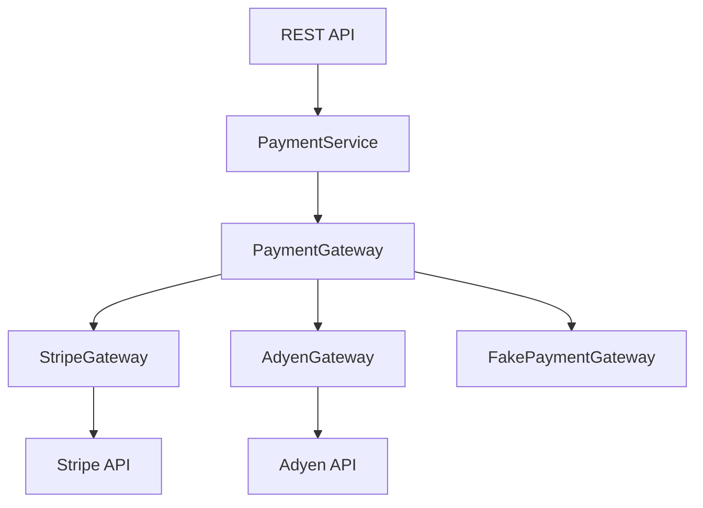

# 09- Polymorphism

## Overview

Polymorphism allows different objects to be used through a common interface while providing different implementations of the same operation.

In Python, polymorphism is broader than traditional inheritance-based polymorphism. It can be achieved through:

- Method overriding
- Duck typing
- Protocols
- Abstract base classes
- Composition
- Operator overloading
- Callable objects
- Dependency injection

The central idea is:

```text
Caller
  |
  | common operation
  v
Interface / expected behavior
  |
  +-------------------+
  |                   |
  v                   v
Implementation A   Implementation B
  |                   |
  v                   v
Behavior A         Behavior B
```

The caller depends on behavior rather than the concrete implementation.

For backend engineering, this enables systems where:

- PostgreSQL and in-memory repositories share a contract.
- Stripe and Adyen gateways expose the same payment interface.
- Different serializers can be selected at runtime.
- Production dependencies can be replaced with test doubles.
- Different message brokers can implement the same publishing contract.
- Application services remain independent of infrastructure details.

Polymorphism is therefore a major mechanism for reducing coupling and supporting extensible architecture.

## Why Polymorphism Matters

Consider an order service that sends notifications.

Without polymorphism:

```python
if channel == "email":
    send_email(...)
elif channel == "sms":
    send_sms(...)
elif channel == "push":
    send_push(...)
```

As the number of channels grows, the service accumulates implementation-specific logic.

With polymorphism:

```python
class NotificationSender(Protocol):
    def send(self, message: str) -> None:
        ...


class EmailSender:
    def send(self, message: str) -> None:
        ...


class SmsSender:
    def send(self, message: str) -> None:
        ...
```

The service can simply call:

```python
sender.send(message)
```

The implementation is selected elsewhere.

```text
Application
    |
    v
NotificationService
    |
    v
NotificationSender
    |
    +--> EmailSender
    +--> SmsSender
    +--> PushSender
```

This keeps the high-level workflow independent of concrete delivery mechanisms.

## Forms of Polymorphism in Python

| Mechanism | Main Idea | Typical Backend Use |
|---|---|---|
| Inheritance | Subclasses implement common behavior | Framework extension |
| Duck typing | Behavior determines compatibility | Flexible internal APIs |
| Protocols | Structural typing contract | Dependency injection |
| ABCs | Explicit abstract contract | Stable class hierarchies |
| Composition | Delegate to interchangeable objects | Services/infrastructure |
| Operator overloading | Types customize operators | Value objects |
| Callable objects | Objects behave like functions | Strategies/handlers |

Python's dynamic nature makes duck typing particularly important.

## Inheritance-Based Polymorphism

The traditional form uses a base class:

```python
from abc import ABC, abstractmethod


class PaymentGateway(ABC):
    @abstractmethod
    async def charge(
        self,
        amount: Decimal,
    ) -> PaymentResult:
        ...


class StripeGateway(PaymentGateway):
    async def charge(
        self,
        amount: Decimal,
    ) -> PaymentResult:
        ...


class AdyenGateway(PaymentGateway):
    async def charge(
        self,
        amount: Decimal,
    ) -> PaymentResult:
        ...
```

The caller can depend on `PaymentGateway`:

```python
async def process_payment(
    gateway: PaymentGateway,
    amount: Decimal,
) -> PaymentResult:
    return await gateway.charge(amount)
```

The concrete implementation can vary without changing the caller.

## Method Overriding

Polymorphism commonly relies on overriding.

```python
class Storage:
    def save(self, data: bytes) -> None:
        raise NotImplementedError


class S3Storage(Storage):
    def save(self, data: bytes) -> None:
        ...
```

Calling:

```python
storage.save(payload)
```

dispatches to the implementation associated with the actual object.

Conceptually:

```text
storage variable
      |
      v
actual object
      |
      v
S3Storage.save()
```

The variable's static type and the object's runtime type can therefore represent different levels of abstraction.

## Runtime Dispatch

Python resolves ordinary method calls dynamically.

Consider:

```python
class EmailSender:
    def send(self, message: str) -> None:
        print("email")


class SmsSender:
    def send(self, message: str) -> None:
        print("sms")


def notify(sender, message: str) -> None:
    sender.send(message)
```

Then:

```python
notify(EmailSender(), "hello")
notify(SmsSender(), "hello")
```

The same call:

```python
sender.send(...)
```

produces different behavior based on the runtime object.

This is the operational core of runtime polymorphism.

## Duck Typing

Duck typing means that compatibility is determined by supported behavior rather than explicit inheritance.

A function can accept any object that provides the required operation:

```python
def publish(
    publisher,
    event: DomainEvent,
) -> None:
    publisher.publish(event)
```

These can both work:

```python
class KafkaPublisher:
    def publish(self, event: DomainEvent) -> None:
        ...


class InMemoryPublisher:
    def publish(self, event: DomainEvent) -> None:
        ...
```

Neither needs to inherit from a common base class.

The practical rule is:

> If the object supports the required behavior, the caller can use it.

## Advantages of Duck Typing

Duck typing can provide:

- Low coupling
- Simple interfaces
- Easy testing
- Flexible integration
- No inheritance requirement

For small internal components, this can be sufficient.

However, unrestricted duck typing can make contracts unclear in large codebases.

Static typing through protocols can preserve the flexibility while documenting expected behavior.

## Protocol-Based Polymorphism

Python's `Protocol` provides structural typing.

```python
from typing import Protocol


class EventPublisher(Protocol):
    async def publish(
        self,
        event: DomainEvent,
    ) -> None:
        ...
```

A concrete implementation does not need explicit inheritance:

```python
class KafkaEventPublisher:
    async def publish(
        self,
        event: DomainEvent,
    ) -> None:
        ...
```

The implementation is compatible because it provides the expected method.

This is particularly useful for backend dependency boundaries.

## Why Protocols Are Powerful

Protocols separate:

```text
What the caller needs
```

from:

```text
How the implementation is built
```

For example:

```python
class UserRepository(Protocol):
    async def get(self, user_id: int) -> User | None:
        ...
```

Implementations can include:

```text
PostgresUserRepository
DynamoUserRepository
CachedUserRepository
FakeUserRepository
```

without forcing them into a shared inheritance hierarchy.

## Protocols and Static Type Checking

A protocol is especially useful when combined with mypy or Pyright.

```python
def load_user(
    repository: UserRepository,
    user_id: int,
) -> Awaitable[User | None]:
    ...
```

The type checker can verify that supplied implementations provide the expected methods.

This gives Python applications a useful combination:

```text
Runtime flexibility
       +
Static contract checking
       =
Practical polymorphism
```

## Abstract Base Classes

Abstract base classes provide explicit nominal contracts.

```python
from abc import ABC, abstractmethod


class Serializer(ABC):
    @abstractmethod
    def serialize(self, value: object) -> bytes:
        ...
```

Concrete implementations:

```python
class JsonSerializer(Serializer):
    def serialize(self, value: object) -> bytes:
        ...


class MessagePackSerializer(Serializer):
    def serialize(self, value: object) -> bytes:
        ...
```

Attempting to instantiate an incomplete concrete subclass raises a `TypeError`.

ABCs are useful when:

- The hierarchy is intentionally explicit.
- Shared implementation exists.
- Runtime enforcement is useful.
- The base class represents a meaningful abstraction.

## Protocol vs ABC

| Characteristic | Protocol | ABC |
|---|---|---|
| Relationship | Structural | Nominal |
| Explicit inheritance required | No | Usually yes |
| Runtime enforcement | Limited | Stronger |
| Static typing | Excellent | Excellent |
| Shared implementation | Possible through normal classes, but not the primary purpose | Natural |
| Coupling | Lower | Higher |
| Good for | Interfaces/contracts | Frameworks and class hierarchies |

A useful backend heuristic is:

> Use a protocol when consumers care about capabilities; use an ABC when the hierarchy itself is meaningful.

## Polymorphism Through Composition

Polymorphism does not require inheritance.

```python
class OrderService:
    def __init__(
        self,
        repository: OrderRepository,
    ) -> None:
        self._repository = repository
```

The repository can be:

```text
OrderRepository
    |
    +--> PostgreSQL
    +--> DynamoDB
    +--> In-memory
```

The service only relies on the repository contract.

This is polymorphism through composition and is extremely common in production systems.

## Strategy Pattern

The Strategy pattern is a practical application of polymorphism.

```python
class PricingStrategy(Protocol):
    def calculate(self, order: Order) -> Decimal:
        ...


class StandardPricing:
    def calculate(self, order: Order) -> Decimal:
        return order.subtotal


class PremiumPricing:
    def calculate(self, order: Order) -> Decimal:
        return order.subtotal * Decimal("0.90")
```

The service receives a strategy:

```python
class CheckoutService:
    def __init__(
        self,
        pricing: PricingStrategy,
    ) -> None:
        self._pricing = pricing

    def total(self, order: Order) -> Decimal:
        return self._pricing.calculate(order)
```

The pricing algorithm can change without modifying `CheckoutService`.

## Factory + Polymorphism

A factory can select the implementation:

```python
def create_pricing_strategy(
    customer: Customer,
) -> PricingStrategy:
    if customer.is_premium:
        return PremiumPricing()

    return StandardPricing()
```

The application flow becomes:

```text
Customer
   |
   v
Factory
   |
   +--> StandardPricing
   |
   +--> PremiumPricing
   |
   v
CheckoutService
```

The service remains unaware of the selection logic.

## Polymorphism in Payment Systems

A realistic payment architecture might look like:



Production configuration might select:

```text
PaymentService -> StripeGateway
```

while tests select:

```text
PaymentService -> FakePaymentGateway
```

The business logic remains unchanged.

## Polymorphism in Repository Design

```python
class UserRepository(Protocol):
    async def get(self, user_id: int) -> User | None:
        ...

    async def save(self, user: User) -> None:
        ...


class PostgresUserRepository:
    async def get(self, user_id: int) -> User | None:
        ...

    async def save(self, user: User) -> None:
        ...


class InMemoryUserRepository:
    async def get(self, user_id: int) -> User | None:
        ...

    async def save(self, user: User) -> None:
        ...
```

The service can remain:

```python
class UserService:
    def __init__(
        self,
        repository: UserRepository,
    ) -> None:
        self._repository = repository
```

This enables:

```text
Production
UserService -> PostgresUserRepository

Integration Test
UserService -> Test Database Repository

Unit Test
UserService -> InMemoryUserRepository
```

## Polymorphism in Caching

Caching implementations can share a contract:

```python
class Cache(Protocol):
    async def get(self, key: str) -> bytes | None:
        ...

    async def set(
        self,
        key: str,
        value: bytes,
        ttl_seconds: int,
    ) -> None:
        ...
```

Implementations might include:

```text
RedisCache
InMemoryCache
NullCache
```

A `NullCache` can deliberately disable caching:

```python
class NullCache:
    async def get(self, key: str) -> bytes | None:
        return None

    async def set(
        self,
        key: str,
        value: bytes,
        ttl_seconds: int,
    ) -> None:
        return None
```

This can be useful in development, tests, or specific workloads.

## Polymorphism in Message Publishing

```python
class EventPublisher(Protocol):
    async def publish(
        self,
        event: DomainEvent,
    ) -> None:
        ...


class KafkaPublisher:
    async def publish(
        self,
        event: DomainEvent,
    ) -> None:
        ...


class InMemoryPublisher:
    async def publish(
        self,
        event: DomainEvent,
    ) -> None:
        ...
```

The service depends on:

```python
publisher: EventPublisher
```

rather than:

```python
publisher: KafkaPublisher
```

This keeps Kafka as an infrastructure detail.

## Polymorphism in HTTP Clients

External API integrations often benefit from a common contract.

```python
class PaymentProvider(Protocol):
    async def charge(
        self,
        amount: Decimal,
        currency: str,
    ) -> PaymentResult:
        ...
```

Implementations can encapsulate provider-specific details:

```text
PaymentProvider
     |
     +--> StripeAdapter
     |
     +--> AdyenAdapter
     |
     +--> MockProvider
```

The application service deals with payment semantics rather than provider-specific HTTP payloads.

## Polymorphism in FastAPI

FastAPI dependency injection can select concrete implementations.

Conceptually:

```python
def get_payment_gateway() -> PaymentGateway:
    return StripeGateway(...)
```

The route depends on the service:

```python
@router.post("/payments")
async def create_payment(
    request: CreatePaymentRequest,
    service: PaymentService = Depends(get_payment_service),
) -> PaymentResponse:
    result = await service.charge(request)
    return PaymentResponse.from_domain(result)
```

The endpoint does not care whether the service uses Stripe, Adyen, or a fake implementation.

## Polymorphism in Django

Django itself uses inheritance extensively in framework extension points.

Application-level polymorphism can also be implemented through services and protocols.

For example:

```python
class Storage(Protocol):
    def save(self, content: bytes) -> str:
        ...


class S3Storage:
    def save(self, content: bytes) -> str:
        ...


class LocalStorage:
    def save(self, content: bytes) -> str:
        ...
```

The Django application can depend on `Storage` rather than a specific backend.

This is often cleaner than making business services inherit from infrastructure implementations.

## Duck Typing and Built-in Protocols

Python's standard library contains many implicit protocols.

For example, code can operate on file-like objects:

```python
def write_report(stream: TextIO) -> None:
    stream.write("report")
```

The object does not necessarily need to be a specific concrete file class.

Similar behavioral contracts exist for:

- Iterables
- Iterators
- Context managers
- Mappings
- Callables
- Async iterators
- File-like objects

This is one reason Python can support highly flexible APIs without extensive inheritance.

## Operator Polymorphism

Python also supports polymorphism through special methods.

For example:

```python
from dataclasses import dataclass
from decimal import Decimal


@dataclass(frozen=True)
class Money:
    amount: Decimal
    currency: str

    def __add__(self, other: "Money") -> "Money":
        if self.currency != other.currency:
            raise ValueError("Currency mismatch")

        return Money(
            amount=self.amount + other.amount,
            currency=self.currency,
        )
```

Now:

```python
total = price + tax
```

works through the type's `__add__()` implementation.

This is operator polymorphism.

## Callable Objects

Objects can implement `__call__()` and behave like functions.

```python
class RetryPolicy:
    def __init__(self, max_attempts: int) -> None:
        self.max_attempts = max_attempts

    async def __call__(
        self,
        operation,
    ):
        ...
```

Then:

```python
policy = RetryPolicy(max_attempts=3)

await policy(operation)
```

This can be useful when behavior requires configuration or state.

Examples include:

- Retry policies
- Validators
- Middleware
- Request handlers
- Dependency objects

## Polymorphism and Dependency Inversion

Polymorphism is a key mechanism behind dependency inversion.

High-level code should depend on stable abstractions:

```text
OrderService
     |
     v
OrderRepository
     ^
     |
PostgresOrderRepository
```

The business service does not depend directly on PostgreSQL implementation details.

This reduces coupling and allows infrastructure to vary independently.

## Polymorphism and Open/Closed Design

Polymorphic designs can support the Open/Closed Principle:

> Software entities should generally be open for extension and closed for modification.

Suppose:

```python
class NotificationSender(Protocol):
    def send(self, message: str) -> None:
        ...
```

Adding:

```python
class PushSender:
    def send(self, message: str) -> None:
        ...
```

does not require changing the existing notification workflow.

The system is extended by adding an implementation.

However, this principle should not be interpreted as "never modify existing code." Sometimes modifying an abstraction is safer than creating unnecessary implementations.

## Polymorphism and Liskov Substitution

Polymorphism only works correctly when implementations satisfy the expected contract.

If:

```python
class Repository(Protocol):
    async def get(self, item_id: int) -> Item | None:
        ...
```

one implementation suddenly raises an unexpected exception for normal "not found" cases, callers may behave incorrectly.

A polymorphic contract includes more than method signatures.

It may include:

- Valid inputs
- Return semantics
- Error behavior
- Side effects
- State transitions
- Idempotency
- Timeout expectations

## Contract Design

A useful polymorphic interface should be small and behaviorally precise.

Good:

```python
class ObjectStorage(Protocol):
    async def put(
        self,
        key: str,
        content: bytes,
    ) -> None:
        ...

    async def get(
        self,
        key: str,
    ) -> bytes | None:
        ...
```

Avoid exposing provider-specific behavior:

```python
class ObjectStorage(Protocol):
    async def put_to_s3_bucket(
        self,
        bucket: str,
        region: str,
        key: str,
        content: bytes,
    ) -> None:
        ...
```

The second interface leaks infrastructure details and reduces the value of polymorphism.

## Polymorphism and Error Semantics

Implementations should agree on failure behavior.

For example:

```python
class PaymentGatewayError(Exception):
    pass


class PaymentDeclined(PaymentGatewayError):
    pass


class PaymentTimeout(PaymentGatewayError):
    pass
```

Both Stripe and Adyen adapters should translate provider-specific errors into application-level semantics where appropriate.

```text
Stripe API
    |
    v
StripeAdapter
    |
    v
PaymentDeclined
```

and:

```text
Adyen API
    |
    v
AdyenAdapter
    |
    v
PaymentDeclined
```

The service can then handle application-level errors consistently.

## Polymorphism and Idempotency

Polymorphic implementations should preserve important behavioral guarantees.

For example:

```python
class PaymentGateway(Protocol):
    async def charge(
        self,
        request: PaymentRequest,
    ) -> PaymentResult:
        ...
```

If the production implementation guarantees idempotency using an idempotency key, test and alternative implementations should model the same important contract.

Otherwise:

```text
Production behavior != Test behavior
```

which can create misleading tests.

## Polymorphism and Transactions

Different repository implementations should respect the expected transaction semantics.

If an application expects:

```text
save()
    |
    v
transactional operation
```

a fake implementation should not silently model fundamentally different behavior if tests depend on transactional guarantees.

Polymorphism is useful only when implementations are behaviorally compatible.

## Polymorphism and Concurrency

Different implementations may have different concurrency characteristics.

For example:

```text
InMemoryCache
    |
    +--> process-local
    +--> thread considerations

RedisCache
    |
    +--> network
    +--> distributed
    +--> external consistency
```

A common interface does not mean identical operational behavior.

The abstraction should document meaningful differences when callers need to account for them.

For example:

- Thread safety
- Async safety
- Ordering
- Idempotency
- Durability
- Consistency
- Timeouts

## Polymorphism and Distributed Systems

At a microservice boundary, polymorphism should generally exist behind the service boundary rather than across the network.

For example:

```text
Order Service
     |
     +--> PaymentProvider
             |
             +--> StripeAdapter
             +--> AdyenAdapter
```

The remote service sees a stable API:

```http
POST /payments
```

It does not see the Python class hierarchy.

This keeps language-specific implementation details inside the service.

## Polymorphism and Serialization

Do not rely on Python class identity for external schemas.

Bad assumption:

```text
Python subclass
      =
wire-format subtype
```

A Kafka event or REST payload needs an explicit schema and compatibility strategy.

For example:

```json
{
  "event_type": "order.created",
  "version": 1,
  "order_id": 123
}
```

The polymorphic implementation can determine how the event is processed, but the wire contract should remain explicit.

## Polymorphism and Testing

Polymorphism enables focused unit tests.

```python
class FakePaymentGateway:
    def __init__(self) -> None:
        self.calls: list[Decimal] = []

    async def charge(
        self,
        amount: Decimal,
    ) -> PaymentResult:
        self.calls.append(amount)
        return PaymentResult(success=True)
```

The service can be tested without external infrastructure:

```python
gateway = FakePaymentGateway()
service = PaymentService(gateway=gateway)

result = await service.charge(Decimal("100.00"))

assert result.success
assert gateway.calls == [Decimal("100.00")]
```

This is usually preferable to mocking every internal method of the service.

## Polymorphism and Contract Tests

When multiple implementations must satisfy the same contract, contract tests are useful.

For example:

```python
@pytest.mark.parametrize(
    "repository_factory",
    [
        create_postgres_repository,
        create_in_memory_repository,
    ],
)
async def test_repository_contract(
    repository_factory,
) -> None:
    repository = repository_factory()

    user = User(id=1, email="user@example.com")

    await repository.save(user)

    result = await repository.get(1)

    assert result == user
```

The goal is to verify that each implementation satisfies the same behavioral expectations.

## Polymorphism and Observability

Different implementations should expose enough information to diagnose which implementation is active.

For example, metrics can include:

```text
payment_gateway_requests_total{
    provider="stripe"
}
```

or:

```text
repository_operation_duration_seconds{
    implementation="postgres"
}
```

Avoid leaking sensitive information.

Useful observability dimensions include:

- Implementation name
- Operation
- Success/failure
- Latency
- Retry count
- Timeout count

## Performance Considerations

Polymorphism introduces dynamic dispatch or an additional delegation layer.

For typical backend applications, this overhead is usually negligible compared with:

- PostgreSQL queries
- Redis calls
- HTTP requests
- Kafka operations
- Serialization
- Disk I/O

Do not remove useful abstractions based on theoretical overhead.

However, excessive layers can affect hot-path CPU performance.

For performance-sensitive code:

1. Measure with `timeit` or profiling tools.
2. Identify actual hotspots.
3. Optimize the measured bottleneck.
4. Preserve useful boundaries where practical.

## Memory Considerations

Polymorphism does not inherently reduce memory consumption.

Different implementations may have very different footprints:

```text
InMemoryRepository
    |
    +--> large Python dictionaries

PostgresRepository
    |
    +--> connection pool reference
```

The interface hides implementation details but does not eliminate their resource cost.

Dependency scope should therefore be considered when constructing polymorphic components.

## Security Considerations

Polymorphic interfaces should not accidentally weaken security requirements.

For example:

```python
class SecretStore(Protocol):
    def get_secret(self, name: str) -> str:
        ...
```

Implementations should preserve the application's expectations around:

- Authentication
- Authorization
- Encryption
- Auditability
- Secret handling

A fake implementation used in tests can intentionally simplify security, but production implementations must enforce the real security contract.

## Reliability Considerations

Different implementations may have different failure modes.

```text
PaymentGateway
      |
      +--> Stripe
      |      |
      |      +--> timeout
      |      +--> rate limit
      |
      +--> Adyen
             |
             +--> timeout
             +--> provider error
```

The application abstraction should normalize relevant failures:

```text
Provider-specific error
        |
        v
Adapter
        |
        v
Application-level error
```

This keeps provider-specific details out of business logic.

## High Availability and Failover

Polymorphism can support controlled failover.

For example:

```text
PaymentService
      |
      v
FailoverGateway
      |
      +--> PrimaryGateway
      |
      +--> SecondaryGateway
```

However, failover is not automatically safe.

For payment operations, retrying against another provider can create duplicate charges unless idempotency and state reconciliation are carefully designed.

Polymorphism provides the mechanism to substitute implementations; it does not define safe failover semantics.

## Scalability Considerations

Polymorphic implementations can support different deployment strategies.

For example:

```text
Development
    |
    +--> InMemoryCache

Production
    |
    +--> RedisCache

Large-scale production
    |
    +--> Redis Cluster
```

The application contract remains stable.

This can reduce migration risk, but implementation differences must be understood before swapping dependencies in production.

## Cost Considerations

An abstraction may allow the same application logic to use different infrastructure based on environment.

For example:

```text
Local development -> local storage
Testing            -> in-memory storage
Production         -> S3
```

This can reduce unnecessary infrastructure cost during development.

However, production implementations may have different cost characteristics for:

- API calls
- Storage
- Network traffic
- Connection counts
- Cache usage
- Message delivery

Polymorphism should not hide operational cost from architectural decisions.

## Common Mistakes

### Treating Polymorphism as Inheritance Only

Python supports duck typing, protocols, composition, and other forms of polymorphism.

### Creating a Giant Base Class

A base class with dozens of methods creates a large and fragile contract.

Prefer small capability-focused interfaces.

### Violating the Contract

Two implementations may have matching method signatures but incompatible behavior.

### Leaking Implementation Details

Avoid interfaces that expose:

```python
redis_key
postgres_connection
kafka_partition
```

when those details are not part of the abstraction.

### Overusing `isinstance()`

Code like:

```python
if isinstance(gateway, StripeGateway):
    ...
elif isinstance(gateway, AdyenGateway):
    ...
```

often defeats polymorphism.

Prefer behavior-based design.

### Replacing Polymorphism With Conditionals

If every new implementation requires modifying:

```python
if provider == ...
```

the abstraction may not be doing its job.

### Creating an Interface for Every Class

Not every class needs a protocol.

Introduce an abstraction where multiple implementations, substitution, testing, or architectural boundaries justify it.

### Ignoring Operational Differences

Two implementations can satisfy the same interface but have different:

- Latency
- Durability
- Consistency
- Failure modes
- Cost
- Concurrency behavior

These differences matter in production.

## Production Pitfalls

| Pitfall | Impact | Better Approach |
|---|---|---|
| Giant interface | High coupling | Small capability contracts |
| `isinstance()` branches everywhere | Weak polymorphism | Delegate behavior |
| Provider details in interface | Infrastructure leakage | Adapter abstraction |
| Incompatible implementations | Runtime failures | Contract tests |
| Different error semantics | Inconsistent recovery | Normalize errors |
| Different transaction behavior | Data correctness issues | Explicit contract |
| Ignoring idempotency | Duplicate operations | Preserve behavioral guarantees |
| Excessive wrappers | Hard debugging | Keep composition focused |
| Unnecessary protocols | Abstraction overhead | Introduce only where useful |
| Assuming interface means identical behavior | Operational surprises | Document meaningful differences |

## Interview Traps

### Is Polymorphism the Same as Inheritance?

No. Inheritance is one mechanism for polymorphism. Python also supports duck typing, protocols, composition, and operator overloading.

### What Is Duck Typing?

Duck typing determines compatibility based on available behavior rather than explicit inheritance.

### What Is the Difference Between Protocol and ABC?

A protocol primarily defines a structural contract, while an ABC defines a nominal class hierarchy and can enforce abstract methods at runtime.

### Why Is Polymorphism Useful for Testing?

It allows production dependencies to be replaced with test implementations without changing business logic.

### What Is Runtime Polymorphism?

The behavior executed by a method call depends on the runtime object's implementation.

### Why Can `isinstance()` Be a Code Smell?

If business logic repeatedly checks concrete types to decide behavior, the system may be bypassing the polymorphic interface it should depend on.

### Does a Common Interface Guarantee Identical Behavior?

No. It defines an expected contract. Implementations may still differ in latency, durability, concurrency, cost, and failure modes.

### How Does Polymorphism Relate to Dependency Injection?

Dependency injection supplies the concrete implementation, while polymorphism allows the consuming code to operate against a common contract.

## Practical Design Pattern

A production-oriented backend often combines:

```text
Protocol
   |
   v
Dependency Injection
   |
   v
Composition
   |
   +--> Concrete implementation
   |
   +--> Test implementation
```

Example:

```python
class EventPublisher(Protocol):
    async def publish(
        self,
        event: DomainEvent,
    ) -> None:
        ...


class OrderService:
    def __init__(
        self,
        publisher: EventPublisher,
    ) -> None:
        self._publisher = publisher

    async def submit(self, order: Order) -> None:
        order.submit()

        await self._publisher.publish(
            OrderSubmitted(order_id=order.id)
        )
```

Production:

```python
service = OrderService(
    publisher=KafkaEventPublisher(...)
)
```

Test:

```python
service = OrderService(
    publisher=InMemoryEventPublisher()
)
```

The application logic remains unchanged.

## Polymorphism Decision Framework

When introducing polymorphism, ask:

1. Is there genuinely more than one implementation?
2. Does the caller need to remain independent of the implementation?
3. Is the abstraction stable enough to define a meaningful contract?
4. Would a protocol be sufficient?
5. Does inheritance provide meaningful shared behavior?
6. Are the implementations behaviorally substitutable?
7. Are error and transaction semantics consistent?
8. Are operational differences documented?
9. Can implementations be tested against a shared contract?
10. Does the abstraction reduce coupling enough to justify its complexity?

A useful decision model is:

```text
Multiple implementations?
        |
    +---+---+
    |       |
   No      Yes
    |       |
    v       v
Concrete   Define
type       contract
             |
       +-----+-----+
       |           |
    Protocol      ABC
       |
       v
Inject implementation
       |
       v
Consumer depends on behavior
```

## Production Checklist

Before introducing a polymorphic abstraction, verify:

- The interface represents meaningful behavior.
- The contract is small and focused.
- Implementations are behaviorally substitutable.
- Provider-specific details remain behind adapters.
- Error semantics are defined.
- Transaction and idempotency expectations are defined where relevant.
- Concurrency and lifecycle behavior is understood.
- Static typing can validate implementations where appropriate.
- Contract tests cover important implementation guarantees.
- Test implementations do not accidentally model fundamentally different behavior.
- Observability identifies important implementation-level failures.
- Performance differences have been measured when the dependency is on a hot path.
- Infrastructure cost and operational characteristics remain visible to architecture decisions.
- The abstraction is not being introduced merely to satisfy an OOP pattern.

## Key Takeaways

- Polymorphism allows callers to depend on stable behavior while different implementations provide different runtime behavior; Python supports this through inheritance, duck typing, protocols, composition, and special methods.
- Protocols are particularly effective for backend dependency boundaries because they provide structural contracts without forcing concrete implementations into inheritance hierarchies.
- Good polymorphic designs require behavioral substitutability, not merely matching method signatures; error semantics, transactions, idempotency, concurrency, and lifecycle behavior may also be part of the contract.
- Composition plus dependency injection is a practical way to use polymorphism across repositories, payment gateways, caches, message publishers, and external API adapters.
- Avoid giant interfaces, concrete-type conditionals, unnecessary abstractions, and provider-specific leakage; use polymorphism where it meaningfully reduces coupling and enables controlled substitution.