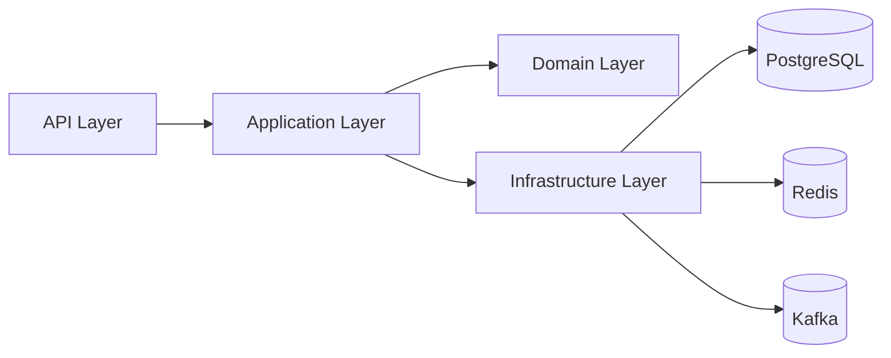

# 10- Abstraction

## Overview

Abstraction is the practice of exposing the behavior and guarantees that consumers need while hiding implementation details that consumers should not depend on.

In Python, abstraction is implemented through several mechanisms:

- Abstract base classes (`ABC`)
- Abstract methods (`@abstractmethod`)
- Protocols (`typing.Protocol`)
- Composition and dependency injection
- Encapsulation
- Well-defined module and service interfaces
- Framework extension points

The goal is not simply to "hide code." The goal is to create a stable boundary between a consumer and an implementation.

For backend systems, abstraction is particularly valuable when implementation details are likely to change:

```text
Business Logic
      |
      v
Stable Abstraction
      |
      +-------------------+
      |                   |
      v                   v
PostgreSQL            Redis
Implementation        Implementation
```

The business layer should generally depend on the behavior it needs rather than directly coupling itself to infrastructure details.

## Abstraction vs Encapsulation vs Polymorphism

These concepts are related but solve different problems.

| Concept | Primary Concern | Example |
|---|---|---|
| Abstraction | What behavior is exposed | `PaymentGateway.charge()` |
| Encapsulation | How state and implementation are protected | `_connection_pool` |
| Polymorphism | How different implementations provide the same behavior | Stripe vs Adyen |
| Inheritance | How classes reuse or specialize behavior | `Dog(Animal)` |
| Composition | How objects collaborate | `OrderService(repository)` |

A common production design combines all of them:

```text
Abstraction
    |
    v
Protocol / ABC
    |
    v
Polymorphism
    |
    v
Composition
    |
    v
Dependency Injection
    |
    +--> Concrete implementation
```

## Why Abstraction Matters

Without abstraction, business logic can become tightly coupled to infrastructure.

For example:

```python
class OrderService:
    def __init__(self, redis_client):
        self.redis = redis_client

    async def get_order(self, order_id: int):
        value = await self.redis.get(f"order:{order_id}")
        ...
```

The service now knows:

- Redis is being used.
- Redis key formatting is required.
- Redis-specific APIs are required.
- Serialization details exist.
- Cache semantics are coupled to the service.

A better boundary is:

```python
class OrderCache(Protocol):
    async def get(self, order_id: int) -> Order | None:
        ...

    async def set(self, order: Order, ttl_seconds: int) -> None:
        ...
```

Now:

```text
OrderService
      |
      v
OrderCache
      |
      +--> RedisOrderCache
      +--> InMemoryOrderCache
      +--> NullOrderCache
```

The business service does not need to know how caching works.

## What Should Be Abstracted?

A useful abstraction hides implementation decisions that are not relevant to the consumer.

Good candidates include:

- Payment providers
- Object storage
- Database repositories
- Cache providers
- Message publishers
- Email providers
- External API clients
- Authentication providers
- Clock/time providers
- Feature flag providers

Poor candidates include:

- Tiny classes with one obvious implementation
- Stable internal algorithms that do not need substitution
- Data structures where abstraction adds no meaningful boundary
- Every class merely because an "interface" seems architecturally sophisticated

Abstraction should reduce coupling, not increase ceremony.

## Levels of Abstraction

Abstraction can exist at multiple levels.

### Function-Level Abstraction

A function hides implementation details:

```python
def calculate_order_total(order: Order) -> Decimal:
    ...
```

The caller does not need to know the calculation steps.

### Class-Level Abstraction

A class exposes a meaningful API:

```python
class PaymentService:
    async def charge(self, request: PaymentRequest) -> PaymentResult:
        ...
```

### Interface-Level Abstraction

A protocol defines required behavior:

```python
class PaymentGateway(Protocol):
    async def charge(
        self,
        request: PaymentRequest,
    ) -> PaymentResult:
        ...
```

### Architectural Abstraction

A service boundary hides infrastructure:

```text
API
 |
 v
Application Service
 |
 v
Repository
 |
 v
Database
```

The application layer should not need to understand PostgreSQL connection management, SQL driver internals, or connection pooling mechanics.

## Abstract Base Classes

Python provides `abc.ABC` and `@abstractmethod` for explicit abstraction.

```python
from abc import ABC, abstractmethod
from decimal import Decimal


class PaymentGateway(ABC):
    @abstractmethod
    async def charge(
        self,
        amount: Decimal,
        currency: str,
    ) -> PaymentResult:
        ...
```

A concrete implementation must provide the abstract operation:

```python
class StripeGateway(PaymentGateway):
    async def charge(
        self,
        amount: Decimal,
        currency: str,
    ) -> PaymentResult:
        ...
```

The base class defines the contract while the subclass defines the implementation.

## How Abstract Base Classes Work

An ABC uses Python's class machinery to track abstract methods.

Conceptually:

```text
PaymentGateway
      |
      | abstract method
      v
charge()
      |
      +------------------+
      |                  |
      v                  v
StripeGateway       AdyenGateway
```

An incomplete subclass remains abstract and cannot normally be instantiated.

```python
gateway = PaymentGateway()
```

raises:

```text
TypeError
```

This gives ABCs runtime enforcement in addition to documentation and static typing.

## Abstract Methods Can Have Implementations

An abstract method does not necessarily have to be empty.

```python
from abc import ABC, abstractmethod


class BaseRepository(ABC):
    @abstractmethod
    async def save(self, entity: Entity) -> None:
        ...

    def validate(self, entity: Entity) -> None:
        if entity.id <= 0:
            raise ValueError("Invalid entity ID")
```

Subclasses can inherit the shared implementation:

```python
class PostgresRepository(BaseRepository):
    async def save(self, entity: Entity) -> None:
        ...
```

This can be useful when the base class contains genuinely shared behavior.

However, large amounts of inherited behavior can create tight coupling. Composition is often preferable when implementations need significant variation.

## Protocol-Based Abstraction

Protocols provide structural abstraction.

```python
from typing import Protocol


class ObjectStorage(Protocol):
    async def upload(
        self,
        key: str,
        content: bytes,
    ) -> str:
        ...

    async def download(
        self,
        key: str,
    ) -> bytes | None:
        ...
```

An implementation does not need to inherit from the protocol:

```python
class S3ObjectStorage:
    async def upload(
        self,
        key: str,
        content: bytes,
    ) -> str:
        ...

    async def download(
        self,
        key: str,
    ) -> bytes | None:
        ...
```

Static type checkers can recognize that `S3ObjectStorage` satisfies the protocol.

## ABC vs Protocol

| Characteristic | ABC | Protocol |
|---|---|---|
| Type relationship | Nominal | Structural |
| Explicit inheritance | Usually required | Not required |
| Runtime enforcement | Yes | Limited |
| Shared implementation | Natural | Not the primary purpose |
| Coupling | Higher | Lower |
| Good for | Class hierarchies | Capability contracts |
| Typical backend use | Framework/domain hierarchy | Infrastructure boundaries |

A practical rule:

> Use an ABC when the class hierarchy itself matters. Use a protocol when consumers only care about capabilities.

## Dependency Injection and Abstraction

Dependency injection becomes much more useful when dependencies are abstracted.

Instead of:

```python
class UserService:
    def __init__(self):
        self.repository = PostgresUserRepository()
```

use:

```python
class UserService:
    def __init__(
        self,
        repository: UserRepository,
    ) -> None:
        self._repository = repository
```

The composition root selects the implementation:

```python
repository = PostgresUserRepository(...)
service = UserService(repository)
```

The dependency graph becomes:

```text
Composition Root
       |
       +--> PostgresUserRepository
       |
       v
UserService
       |
       v
UserRepository
```

This separates object construction from business behavior.

## Repository Abstraction

A repository abstraction can isolate persistence concerns.

```python
class UserRepository(Protocol):
    async def get(self, user_id: int) -> User | None:
        ...

    async def save(self, user: User) -> None:
        ...
```

The application service:

```python
class UserService:
    def __init__(
        self,
        repository: UserRepository,
    ) -> None:
        self._repository = repository

    async def get_user(self, user_id: int) -> User | None:
        return await self._repository.get(user_id)
```

The implementation can be:

```text
UserRepository
      |
      +--> PostgreSQL
      +--> DynamoDB
      +--> In-memory
      +--> Test fixture
```

The service remains independent of the database technology.

## Payment Gateway Abstraction

A payment service should generally not contain provider-specific HTTP logic.

```python
class PaymentGateway(Protocol):
    async def charge(
        self,
        request: PaymentRequest,
    ) -> PaymentResult:
        ...
```

Provider adapters implement the contract:

```text
PaymentService
      |
      v
PaymentGateway
      |
      +--> StripeGateway
      +--> AdyenGateway
      +--> TestGateway
```

The adapter handles:

- HTTP requests
- Authentication
- Provider payloads
- Provider response mapping
- Provider-specific errors
- Retries
- Timeouts
- Provider observability

The business service handles:

- Payment business rules
- Order state
- Authorization decisions
- Domain behavior

This is a strong abstraction boundary.

## Adapter as an Abstraction Boundary

An adapter is useful when an external system's API does not match the application's domain model.

```text
Application
    |
    v
PaymentGateway
    |
    v
StripeAdapter
    |
    v
Stripe API
```

For example:

```python
class StripeGateway:
    async def charge(
        self,
        request: PaymentRequest,
    ) -> PaymentResult:
        response = await self._client.post(
            "/payments",
            json={
                "amount": request.amount,
                "currency": request.currency,
            },
        )

        return PaymentResult.from_provider_response(response)
```

The Stripe-specific payload remains inside the adapter.

## FastAPI and Abstraction

FastAPI dependency injection naturally supports abstraction.

```python
def get_payment_gateway() -> PaymentGateway:
    return StripeGateway(...)
```

The service can depend on the abstraction:

```python
def get_payment_service(
    gateway: PaymentGateway = Depends(get_payment_gateway),
) -> PaymentService:
    return PaymentService(gateway)
```

The route remains focused on HTTP concerns:

```python
@router.post("/payments")
async def create_payment(
    request: CreatePaymentRequest,
    service: PaymentService = Depends(get_payment_service),
) -> PaymentResponse:
    result = await service.charge(request)
    return PaymentResponse.from_domain(result)
```

The request lifecycle becomes:

```text
HTTP Request
    |
    v
Nginx / Load Balancer
    |
    v
FastAPI Router
    |
    v
PaymentService
    |
    v
PaymentGateway abstraction
    |
    v
StripeAdapter
    |
    v
External Provider
```

Each layer has a defined responsibility.

## Django and Abstraction

Django provides several framework-level abstractions:

- ORM querysets
- Model managers
- Storage backends
- Authentication backends
- Cache backends
- Email backends
- Middleware
- Class-based views

For example, Django storage abstractions allow application code to interact with storage without necessarily knowing the underlying provider.

Application code should similarly avoid spreading infrastructure-specific details throughout domain logic.

## REST API Abstraction

REST APIs themselves are abstractions over internal implementation.

For example:

```http
GET /orders/123
```

does not expose:

```text
PostgreSQL
Redis
Kafka
Python classes
```

The API contract is intentionally independent of the internal architecture.

A service can migrate:

```text
PostgreSQL -> DynamoDB
```

without changing the API if the external contract remains compatible.

This is one of the most important forms of abstraction in distributed systems.

## gRPC Abstraction

gRPC uses explicit service contracts defined through Protocol Buffers.

Conceptually:

```text
Client
  |
  | gRPC contract
  v
OrderService
  |
  +--> application logic
  |
  +--> repository
  |
  +--> PostgreSQL
```

The `.proto` definition provides a stable contract between services while implementations remain internal.

This demonstrates that abstraction is not limited to Python classes.

## Abstraction Across Microservices

A microservice boundary is an architectural abstraction.

```text
Order Service
     |
     | API contract
     v
Payment Service
     |
     v
Payment Provider
```

The Order Service should not care whether Payment Service internally uses:

```text
Stripe
Adyen
PostgreSQL
Redis
Kafka
```

Only the agreed service contract should matter.

This reduces organizational and deployment coupling.

## Abstraction and Encapsulation

Abstraction defines what consumers are allowed to rely on.

Encapsulation controls how implementation details are represented and accessed.

For example:

```python
class ConnectionPool:
    def __init__(self, pool):
        self._pool = pool

    async def acquire(self):
        return await self._pool.acquire()
```

The abstraction is:

```python
acquire()
```

The encapsulated implementation detail is:

```python
self._pool
```

Consumers should not depend directly on `_pool`.

## Information Hiding

A strong abstraction hides decisions that may change.

Examples:

| Hidden Decision | Stable Abstraction |
|---|---|
| PostgreSQL driver | `UserRepository` |
| Redis client | `Cache` |
| Stripe SDK | `PaymentGateway` |
| S3 SDK | `ObjectStorage` |
| Kafka client | `EventPublisher` |
| HTTP client library | `ExternalServiceClient` |
| System clock | `Clock` |

This creates a useful architectural property:

> Implementation decisions can change without requiring widespread changes to consumers.

## Abstraction and Stable Contracts

An abstraction should expose a contract rather than an implementation.

Good:

```python
class EventPublisher(Protocol):
    async def publish(
        self,
        event: DomainEvent,
    ) -> None:
        ...
```

Poor:

```python
class EventPublisher(Protocol):
    async def publish_to_kafka(
        self,
        topic: str,
        partition: int,
        serializer: KafkaSerializer,
        event: DomainEvent,
    ) -> None:
        ...
```

The second interface exposes Kafka-specific decisions.

If Kafka is replaced with another broker, the abstraction becomes difficult to preserve.

## Behavioral Contracts

A contract includes more than method signatures.

For:

```python
class Cache(Protocol):
    async def get(self, key: str) -> bytes | None:
        ...
```

the real contract may include:

- `None` means cache miss.
- Reads do not mutate application state.
- Operations are safe for concurrent callers.
- Network failures raise defined exceptions.
- Timeouts are bounded.
- Values are opaque bytes.

An abstraction is useful only when its behavioral expectations are clear.

## Abstraction and Error Translation

External implementations often expose incompatible exceptions.

For example:

```text
Stripe API
   |
   v
StripeTimeoutError

Adyen API
   |
   v
AdyenConnectionError
```

The application abstraction can normalize them:

```text
Provider-specific exceptions
          |
          v
Adapter
          |
          v
PaymentGatewayTimeout
```

Then application logic handles domain-level failures rather than provider SDK exceptions.

## Abstraction and Transactions

Persistence abstractions must define transaction expectations.

A repository might expose:

```python
class OrderRepository(Protocol):
    async def save(self, order: Order) -> None:
        ...
```

But production systems may also need to define:

- Transaction ownership
- Isolation requirements
- Commit behavior
- Rollback behavior
- Optimistic locking
- Retry behavior

Do not hide critical transactional semantics behind an abstraction that makes them impossible to reason about.

## Abstraction and Resource Ownership

Resource lifecycle should be explicit.

For example:

```python
class Database:
    async def acquire(self) -> Connection:
        ...

    async def close(self) -> None:
        ...
```

The abstraction should make it clear whether the object:

- Owns the resource
- Borrows the resource
- Creates resources lazily
- Requires explicit shutdown

This matters for:

- Connection pools
- HTTP clients
- Kafka producers
- Redis clients
- File handles
- Thread pools

Poor lifecycle abstractions can create connection leaks and shutdown problems.

## Abstraction and Concurrency

Concurrency semantics are part of a production abstraction.

For example, a cache abstraction might be used from multiple asyncio tasks:

```python
class Cache(Protocol):
    async def get(self, key: str) -> bytes | None:
        ...

    async def set(
        self,
        key: str,
        value: bytes,
    ) -> None:
        ...
```

The interface should be designed with the actual execution model in mind.

Important questions include:

- Is it async?
- Is it thread-safe?
- Is it process-safe?
- Does it perform network I/O?
- Can operations be cancelled?
- Are timeouts supported?
- Are operations atomic?

An abstraction that hides these concerns completely can make production behavior harder to reason about.

## Abstraction and Performance

Abstraction can introduce small runtime costs through:

- Additional function calls
- Method dispatch
- Delegation
- Object allocation
- Serialization boundaries

For most backend systems, these costs are insignificant compared with network and database operations.

For example:

```text
Python method call
     |
     v
microseconds or less-scale overhead

PostgreSQL query
     |
     v
milliseconds-scale operation
```

The exact values vary, but the architectural point is important: do not sacrifice useful boundaries to optimize hypothetical overhead.

Measure first when performance matters.

## Abstraction and Memory

Additional abstraction layers can create additional objects.

For example:

```text
OrderService
    |
    +--> Repository
    |      |
    |      +--> Database client
    |
    +--> Cache
           |
           +--> Redis client
```

This can increase object count and retained references.

The impact is normally small for long-lived backend processes, but dependency graphs should still be designed intentionally.

Avoid creating unnecessary wrappers around every dependency.

## Security Considerations

Abstraction should reduce accidental exposure of sensitive implementation details.

For example:

```python
class SecretStore(Protocol):
    async def get(self, name: str) -> str:
        ...
```

The application should not need to know:

```text
AWS Secrets Manager
KMS
Vault
local environment
```

The concrete implementation handles:

- Authentication
- Encryption
- Credential retrieval
- Secret rotation
- Access control

Do not expose credentials or provider-specific security configuration through broad abstractions.

## Scalability Considerations

Abstractions can make infrastructure evolution easier.

For example:

```text
Initial
Application -> LocalStorage

Production
Application -> S3

Large scale
Application -> S3 + CDN
```

The application contract can remain stable while the implementation evolves.

However, abstractions do not eliminate distributed-system constraints.

Moving from:

```text
InMemoryCache
```

to:

```text
RedisCluster
```

introduces:

- Network latency
- Serialization
- Failure modes
- Connection management
- Availability concerns
- Cost

These differences must remain visible to architecture and operations teams.

## High Availability

Abstraction can support multiple implementations and failover architectures:

```text
Service
   |
   v
Storage abstraction
   |
   +--> Primary storage
   |
   +--> Secondary storage
```

But automatic failover must be designed around consistency and correctness.

For example, a payment abstraction cannot safely switch providers after an uncertain timeout without considering whether the original provider processed the transaction.

The abstraction should not conceal distributed-systems uncertainty.

## Observability

An abstraction should not make operational debugging impossible.

For example, if:

```text
PaymentService
    |
    v
PaymentGateway
```

fails, operators may need to know which implementation was active.

Useful telemetry can include:

```text
payment_requests_total{
    provider="stripe",
    operation="charge"
}
```

and:

```text
payment_request_duration_seconds{
    provider="stripe",
    operation="charge"
}
```

Good abstractions hide implementation details from business logic while still allowing implementation-specific observability.

## Testing Abstractions

Abstractions make dependencies replaceable.

Production:

```python
service = UserService(
    repository=PostgresUserRepository(...)
)
```

Unit test:

```python
service = UserService(
    repository=InMemoryUserRepository()
)
```

This reduces the need for extensive mocking.

The most valuable tests usually verify the behavior of the consumer and, where multiple implementations exist, verify that each implementation satisfies the same contract.

## Contract Testing

When multiple implementations satisfy one abstraction, contract tests are useful.

```python
async def assert_repository_contract(
    repository: UserRepository,
) -> None:
    user = User(
        id=1,
        email="user@example.com",
    )

    await repository.save(user)

    result = await repository.get(user.id)

    assert result == user
```

The same test suite can run against:

```text
PostgresUserRepository
InMemoryUserRepository
```

This protects the abstraction from implementation drift.

## CI/CD Considerations

Abstraction boundaries should be validated in CI.

A Python backend might use:

```text
CI Pipeline
    |
    +--> Ruff
    +--> Pyright / mypy
    +--> Unit tests
    +--> Contract tests
    +--> Integration tests
    +--> Security checks
```

Static analysis can validate protocol compatibility while tests validate behavioral compatibility.

This is particularly useful when infrastructure implementations evolve independently.

## Docker and Kubernetes

Abstraction can help the same application run in different environments.

For example:

```text
Local Docker
    |
    +--> InMemoryEventPublisher

Production Kubernetes
    |
    +--> KafkaEventPublisher
```

Configuration determines the implementation:

```text
ENVIRONMENT=production
EVENT_PUBLISHER=kafka
```

The application should not scatter environment-specific conditionals throughout business logic.

Instead, select dependencies in the composition root.

## AWS Example

An application may abstract object storage:

```python
class ObjectStorage(Protocol):
    async def upload(
        self,
        key: str,
        content: bytes,
    ) -> str:
        ...
```

The production implementation can use Amazon S3:

```text
Application
    |
    v
ObjectStorage
    |
    v
S3ObjectStorage
    |
    v
Amazon S3
```

This keeps AWS SDK-specific details out of application services.

The abstraction can also make local development and testing easier without requiring S3 for every execution environment.

## Cost Considerations

Abstraction itself usually has minimal infrastructure cost.

However, abstracting infrastructure can make architectural alternatives easier to evaluate.

For example:

```text
ObjectStorage
    |
    +--> S3
    +--> S3-compatible local storage
```

Before replacing an implementation, compare:

- Request cost
- Storage cost
- Network transfer
- Operational complexity
- Availability
- Performance
- Data durability

An abstraction should simplify substitution, not encourage careless infrastructure switching.

## Common Mistakes

### Abstracting Everything

Creating a protocol for every class adds complexity without necessarily reducing coupling.

Use abstractions where they provide a meaningful boundary.

### Leaking Implementation Details

This is one of the most common abstraction failures.

Bad:

```python
class Cache(Protocol):
    async def redis_get(self, key: str):
        ...
```

The abstraction is already coupled to Redis.

### Creating Giant Interfaces

A large interface violates interface segregation and forces implementations to support irrelevant behavior.

Prefer:

```python
class EventPublisher(Protocol):
    async def publish(self, event: DomainEvent) -> None:
        ...
```

over a massive infrastructure interface.

### Hiding Important Semantics

Do not hide critical behavior such as:

- Transactions
- Idempotency
- Consistency
- Timeouts
- Retries
- Resource ownership

### Abstracting Too Early

If there is only one implementation and no meaningful boundary, premature abstraction can make the code harder to understand.

### Abstracting at the Wrong Layer

Do not force domain models to understand infrastructure abstractions.

Prefer:

```text
Domain
  |
Application
  |
Infrastructure
```

with dependencies flowing toward stable application/domain contracts.

### Confusing Abstraction With Indirection

Every abstraction introduces some indirection.

Indirection is useful only when it provides a meaningful architectural benefit.

## Production Pitfalls

| Pitfall | Why It Happens | Better Approach |
|---|---|---|
| Interface for every class | Pattern-driven design | Abstract meaningful boundaries |
| Provider-specific methods | Poor boundary definition | Expose domain behavior |
| Giant ABC | Interface grows over time | Split capabilities |
| Hidden transaction semantics | Over-simplified API | Document ownership explicitly |
| Hidden timeouts | Infrastructure leakage | Define operational contracts |
| Fake implementation differs from production | Weak testing | Contract tests |
| Excessive wrappers | Over-engineering | Keep layers purposeful |
| Abstraction hides observability | Over-isolation | Preserve useful telemetry |
| Implementation selected throughout business code | Poor dependency composition | Centralize selection |
| Treating abstraction as automatic portability | Semantic differences ignored | Validate behavior and operations |

## Senior-Level Design Guidance

A senior engineer should evaluate abstraction in terms of coupling rather than class count.

The important question is not:

> "Can I create an interface here?"

The better question is:

> "Which decision should this consumer not need to know about?"

For example:

```text
PaymentService should not know:
    - Stripe HTTP endpoints
    - Stripe SDK types
    - OAuth implementation
    - Provider-specific error classes
```

It should know:

```text
PaymentGateway can charge a payment
```

This produces a useful boundary.

## Abstraction Stability

Not every abstraction is equally stable.

A good abstraction changes less frequently than its implementations.

```text
Stable:
PaymentGateway.charge()

Changing:
Stripe request format
Stripe SDK version
HTTP client
Provider authentication
```

If the abstraction changes whenever the implementation changes, it is probably exposing too much implementation detail.

## Abstraction and the Dependency Rule

A useful dependency direction is:



In a stricter dependency-inversion design, application/domain code defines the abstractions that infrastructure implements:

```text
Application
    |
    v
Repository Protocol
    ^
    |
Postgres Repository
```

The direction of source-code dependency matters even though runtime calls flow toward infrastructure.

## Composition Root

Concrete implementations should ideally be selected in one place.

```python
def build_application() -> Application:
    repository = PostgresUserRepository(...)
    cache = RedisCache(...)
    publisher = KafkaEventPublisher(...)

    user_service = UserService(
        repository=repository,
        cache=cache,
        publisher=publisher,
    )

    return Application(user_service=user_service)
```

This is the composition root.

It prevents business code from becoming responsible for infrastructure construction.

## Abstraction Decision Framework

Before introducing an abstraction, ask:

1. What implementation detail am I hiding?
2. Who is the consumer?
3. Is the hidden decision likely to change?
4. Are there multiple implementations?
5. Is substitution genuinely useful?
6. Can a small protocol express the required behavior?
7. Does an ABC provide meaningful shared behavior?
8. Are behavioral guarantees clear?
9. Are error and transaction semantics explicit?
10. Does the abstraction improve testing?
11. Does it preserve observability?
12. Does it reduce coupling enough to justify its complexity?

A useful heuristic is:

```text
Meaningful boundary?
      |
   +--+--+
   |     |
  No    Yes
   |     |
Concrete  |
type      v
        Define
        smallest
        useful
        contract
           |
           v
        Inject
        implementation
```

## Production Checklist

Before introducing or approving an abstraction:

- The abstraction hides a meaningful implementation decision.
- The interface exposes domain or consumer behavior rather than infrastructure details.
- The contract is small and focused.
- Behavioral semantics are documented where necessary.
- Implementations are substitutable.
- Error behavior is defined.
- Timeout and retry behavior is understood.
- Transaction and idempotency semantics are explicit where relevant.
- Resource ownership and lifecycle are clear.
- Concurrency behavior is understood.
- Observability remains sufficient for production debugging.
- Unit tests can use lightweight implementations or focused test doubles.
- Contract tests exist when multiple implementations must remain compatible.
- Concrete implementation selection is centralized.
- The abstraction does not exist solely to satisfy an architectural pattern.

## Key Takeaways

- Abstraction defines a stable boundary around behavior and hides implementation decisions that consumers should not depend on.
- Python supports abstraction through ABCs, abstract methods, protocols, composition, dependency injection, and architectural interfaces.
- Prefer small, behavior-focused protocols for backend boundaries such as repositories, caches, payment gateways, object storage, and message publishers.
- A good abstraction hides implementation details without hiding critical production semantics such as errors, transactions, idempotency, timeouts, concurrency, resource ownership, and observability.
- Introduce abstraction to reduce meaningful coupling, not simply to increase the number of interfaces or classes in the system.