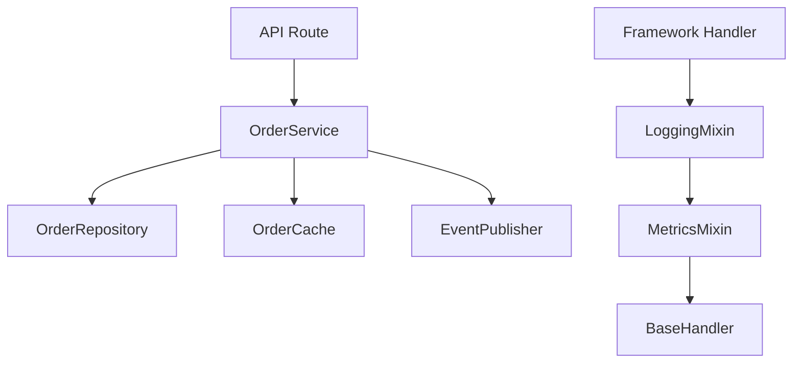

# 12- Multiple Inheritance

## Overview

Multiple inheritance allows a Python class to inherit from more than one base class.

```python
class Service(LoggingMixin, MetricsMixin, BaseService):
    ...
```

Unlike single inheritance, multiple inheritance creates a graph of relationships rather than a simple parent-child chain. Python resolves this graph into a deterministic **Method Resolution Order (MRO)** using **C3 linearization**.

Multiple inheritance can be useful for:

- Small, orthogonal mixins
- Framework extension points
- Reusable cross-cutting behavior
- Cooperative method chains
- Specialized domain hierarchies

It can also introduce significant complexity when classes contain overlapping methods, state, constructors, or side effects.

For backend engineering, the practical rule is:

> Use multiple inheritance deliberately for narrow, composable behavior; prefer composition when objects primarily represent independent collaborators or infrastructure dependencies.

## Basic Multiple Inheritance

A class can list multiple base classes:

```python
class Logger:
    def log(self, message: str) -> None:
        print(message)


class Metrics:
    def record(self, name: str) -> None:
        print(name)


class Service(Logger, Metrics):
    pass
```

The resulting class has access to both:

```python
service = Service()

service.log("request received")
service.record("request_count")
```

Conceptually:

```text
       Logger       Metrics
          \           /
           \         /
             Service
```

## Why Multiple Inheritance Exists

Multiple inheritance is useful when a class genuinely needs behavior from multiple independent parents.

For example, a framework component might need:

```text
BaseHandler
    +
Logging behavior
    +
Metrics behavior
```

Instead of creating:

```text
LoggingHandler
    |
MetricsLoggingHandler
    |
AuthenticatedMetricsLoggingHandler
    |
...
```

multiple inheritance can compose focused mixins:

```python
class Handler(
    LoggingMixin,
    MetricsMixin,
    BaseHandler,
):
    ...
```

This can prevent a combinatorial explosion of specialized subclasses.

However, composition can often provide the same extensibility with fewer hidden interactions.

## Multiple Inheritance vs Composition

| Concern | Multiple Inheritance | Composition |
|---|---|---|
| Reuse behavior | Strong | Strong |
| Runtime substitution | Limited | Excellent |
| Dependency visibility | Can be implicit | Explicit |
| MRO complexity | Possible | None |
| State ownership | Can become unclear | Usually explicit |
| Testing | Can be complex | Usually straightforward |
| Framework integration | Often useful | Sometimes awkward |
| Infrastructure dependencies | Usually poor fit | Excellent |
| Mixins | Natural | Can require delegation |
| Large backend services | Use cautiously | Usually preferred |

A useful backend heuristic:

```text
Behavioral subtype / framework extension
        |
        v
   Inheritance may fit

Independent collaborator / infrastructure dependency
        |
        v
     Composition
```

## Method Resolution Order

Multiple inheritance depends heavily on MRO.

Consider:

```python
class A:
    def process(self) -> str:
        return "A"


class B(A):
    def process(self) -> str:
        return "B" + super().process()


class C(A):
    def process(self) -> str:
        return "C" + super().process()


class D(B, C):
    def process(self) -> str:
        return "D" + super().process()
```

The MRO is:

```text
D -> B -> C -> A -> object
```

Therefore:

```python
D().process()
```

returns:

```text
DBCA
```

The important point is that `super()` follows the MRO.

It does not simply call the direct parent.

## Inspecting the MRO

Use:

```python
print(D.__mro__)
```

or:

```python
print(D.mro())
```

A more readable diagnostic is:

```python
print(
    " -> ".join(cls.__name__ for cls in D.__mro__)
)
```

Output:

```text
D -> B -> C -> A -> object
```

This should be one of the first debugging techniques used when multiple inheritance behaves unexpectedly.

## C3 Linearization

Python uses C3 linearization to construct the MRO.

The resulting ordering must preserve:

- The child before its parents.
- The declared parent order.
- Consistent ordering across inherited hierarchies.
- Monotonicity.
- Each class appearing only once in the final MRO.

For:

```python
class D(B, C):
    ...
```

Python preserves:

```text
B before C
```

while also incorporating their shared ancestors.

This produces:

```text
D -> B -> C -> A -> object
```

rather than performing an unrestricted depth-first traversal.

## Diamond Inheritance

The classic multiple-inheritance structure is the diamond:

```text
        Base
       /    \
      A      B
       \    /
        Child
```

Example:

```python
class Base:
    def process(self) -> None:
        print("base")


class A(Base):
    def process(self) -> None:
        print("A")
        super().process()


class B(Base):
    def process(self) -> None:
        print("B")
        super().process()


class Child(A, B):
    def process(self) -> None:
        print("child")
        super().process()
```

The MRO is:

```text
Child -> A -> B -> Base -> object
```

Calling:

```python
Child().process()
```

produces:

```text
child
A
B
base
```

`Base.process()` executes only once.

## Cooperative Multiple Inheritance

Multiple inheritance works best when classes cooperate through `super()`.

A cooperative hierarchy allows each class to perform its responsibility and then delegate to the next class in the MRO.

```python
class BaseHandler:
    def handle(self, request):
        return request


class LoggingMixin:
    def handle(self, request):
        print("request received")
        return super().handle(request)


class MetricsMixin:
    def handle(self, request):
        print("record metric")
        return super().handle(request)


class Handler(LoggingMixin, MetricsMixin, BaseHandler):
    pass
```

The call:

```python
Handler().handle(request)
```

follows:

```text
Handler
   |
   v
LoggingMixin
   |
   v
MetricsMixin
   |
   v
BaseHandler
```

This allows independent mixins to cooperate without explicitly knowing which class comes next.

## Why `super()` Is Critical

Avoid:

```python
class LoggingMixin:
    def handle(self, request):
        print("request received")
        return BaseHandler.handle(self, request)
```

This hard-codes the parent.

Prefer:

```python
class LoggingMixin:
    def handle(self, request):
        print("request received")
        return super().handle(request)
```

With `super()`, the next implementation is determined by the MRO.

This allows the same mixin to participate in different valid inheritance combinations.

## A Broken Cooperative Chain

Consider:

```python
class LoggingMixin:
    def handle(self, request):
        print("logging")
        return super().handle(request)


class MetricsMixin:
    def handle(self, request):
        print("metrics")
        return request
```

If `MetricsMixin` does not call `super()`, the chain terminates there.

```text
Handler
   |
   v
LoggingMixin
   |
   v
MetricsMixin
   |
   X
BaseHandler never executes
```

This is one of the most common multiple-inheritance bugs.

## Constructor Cooperation

`__init__()` also participates in the MRO.

```python
class BaseService:
    def __init__(self, **kwargs):
        super().__init__(**kwargs)


class LoggingMixin:
    def __init__(self, *, logger, **kwargs):
        self.logger = logger
        super().__init__(**kwargs)


class MetricsMixin:
    def __init__(self, *, metrics, **kwargs):
        self.metrics = metrics
        super().__init__(**kwargs)


class Service(LoggingMixin, MetricsMixin, BaseService):
    pass
```

Construction:

```python
service = Service(
    logger=logger,
    metrics=metrics,
)
```

can flow through:

```text
Service
   |
LoggingMixin
   |
MetricsMixin
   |
BaseService
```

Keyword-based cooperative initialization can work well in carefully designed frameworks and mixins.

For ordinary application services, however, complicated constructor chains are often a signal that composition would be clearer.

## Mixin Design

A mixin is usually a small class intended to add one focused capability.

Good examples:

```python
class LoggingMixin:
    ...


class MetricsMixin:
    ...


class AuditMixin:
    ...
```

A good mixin generally:

- Has one focused responsibility.
- Avoids owning unrelated state.
- Documents assumptions.
- Avoids depending on unrelated concrete classes.
- Uses `super()` when participating in cooperative methods.
- Is reusable across compatible classes.

A poor mixin becomes a hidden base class containing substantial application logic.

## Orthogonal Mixins

Mixins are strongest when their responsibilities are independent.

Good:

```text
LoggingMixin
MetricsMixin
AuditMixin
```

Each adds a separate concern.

Riskier:

```text
OrderMixin
PaymentMixin
DatabaseMixin
BusinessLogicMixin
```

These may represent actual domain responsibilities rather than cross-cutting behavior.

If mixins start depending heavily on each other, the inheritance hierarchy becomes difficult to reason about.

## Mixin Ordering

The order of mixins affects behavior.

These are different:

```python
class Handler(
    LoggingMixin,
    MetricsMixin,
    BaseHandler,
):
    ...
```

and:

```python
class Handler(
    MetricsMixin,
    LoggingMixin,
    BaseHandler,
):
    ...
```

Their MROs differ:

```text
Handler -> LoggingMixin -> MetricsMixin -> BaseHandler
```

versus:

```text
Handler -> MetricsMixin -> LoggingMixin -> BaseHandler
```

If both override the same method, execution order changes.

For cross-cutting concerns, ordering should be deliberate.

## Multiple Inheritance and Method Conflicts

Suppose:

```python
class A:
    def execute(self):
        return "A"


class B:
    def execute(self):
        return "B"


class C(A, B):
    pass
```

The MRO is:

```text
C -> A -> B -> object
```

Therefore:

```python
C().execute()
```

returns:

```text
A
```

because `A.execute()` is found first.

This can be useful when intentional, but accidental method collisions are dangerous.

## Attribute Conflicts

The same issue applies to attributes.

```python
class A:
    timeout = 30


class B:
    timeout = 5


class Service(A, B):
    pass
```

Then:

```python
Service.timeout
```

resolves to:

```text
30
```

because `A` appears before `B` in the MRO.

Configuration attributes with identical names across mixins can therefore create subtle bugs.

Prefer explicit, uniquely named state where possible.

## Multiple Inheritance and Abstract Base Classes

Multiple inheritance can combine mixins with an ABC.

```python
from abc import ABC, abstractmethod


class Repository(ABC):
    @abstractmethod
    async def get(self, item_id: int):
        ...


class LoggingMixin:
    async def log_access(self, item_id: int):
        ...


class UserRepository(LoggingMixin, Repository):
    async def get(self, item_id: int):
        ...
```

The class can combine:

```text
Logging behavior
       +
Repository contract
       +
Concrete implementation
```

However, the resulting hierarchy should remain understandable.

If the class requires many mixins plus several abstract bases, consider composition.

## Multiple Inheritance and Protocols

Protocols generally reduce the need for inheritance when the requirement is simply behavioral compatibility.

Instead of:

```python
class UserRepository(
    LoggingRepositoryMixin,
    MetricsRepositoryMixin,
    BaseRepository,
):
    ...
```

a service may depend on:

```python
class UserRepository(Protocol):
    async def get(self, user_id: int) -> User | None:
        ...
```

and compose logging and metrics separately.

This often produces a clearer dependency graph.

## Multiple Inheritance and Dependency Injection

Dependency injection is usually better expressed through composition.

Instead of:

```python
class OrderService(
    RedisMixin,
    PostgresMixin,
    KafkaMixin,
):
    ...
```

prefer:

```python
class OrderService:
    def __init__(
        self,
        repository: OrderRepository,
        cache: OrderCache,
        publisher: EventPublisher,
    ) -> None:
        self._repository = repository
        self._cache = cache
        self._publisher = publisher
```

The dependency graph becomes explicit:

```text
OrderService
   |
   +--> OrderRepository
   +--> OrderCache
   +--> EventPublisher
```

This is generally easier to test, configure, observe, and replace.

## Multiple Inheritance in Backend Architecture

Multiple inheritance is most appropriate at specific boundaries rather than as the foundation of an entire service architecture.

A reasonable design might be:

```text
FastAPI Route
      |
      v
OrderService
      |
      +--> Repository
      +--> Cache
      +--> EventPublisher
```

Within a framework component, limited inheritance may be appropriate:

```text
CustomHandler
   |
   +--> LoggingMixin
   +--> MetricsMixin
   +--> FrameworkBaseHandler
```

The distinction is important:

> Use inheritance to define or extend behavior; use composition to connect independent system components.

## Django Example

Django class-based views commonly use mixins.

```python
from django.contrib.auth.mixins import LoginRequiredMixin
from django.views.generic import ListView


class UserListView(
    LoginRequiredMixin,
    ListView,
):
    model = User
```

The class combines behavior from:

```text
LoginRequiredMixin
       +
ListView
```

The MRO determines which inherited methods are selected.

When overriding framework methods, verify whether the framework expects cooperative `super()` calls.

For example:

```python
class UserListView(LoginRequiredMixin, ListView):
    def dispatch(self, request, *args, **kwargs):
        return super().dispatch(
            request,
            *args,
            **kwargs,
        )
```

Skipping `super()` can bypass important framework behavior.

## FastAPI Example

FastAPI applications generally favor dependency injection and composition rather than deep service inheritance.

A class-based component might still use inheritance for framework-specific extension points, but infrastructure dependencies are usually clearer as injected collaborators:

```python
class OrderService:
    def __init__(
        self,
        repository: OrderRepository,
        publisher: EventPublisher,
    ) -> None:
        self._repository = repository
        self._publisher = publisher
```

This keeps the service's dependencies explicit.

## Multiple Inheritance and REST APIs

Multiple inheritance should not determine the external REST API contract.

For example:

```http
POST /orders
```

should expose an explicit request and response schema.

Internal Python inheritance:

```text
OrderHandler
   |
   +--> LoggingMixin
   +--> ValidationMixin
```

should remain an implementation detail.

The external contract should not depend on the Python class hierarchy.

## Multiple Inheritance and gRPC

The same principle applies to gRPC.

A `.proto` definition provides the service contract:

```text
Client
   |
   | gRPC contract
   v
Service implementation
   |
   +--> internal classes
   +--> repositories
   +--> infrastructure
```

Multiple inheritance can be used internally, but it should not leak into the wire protocol.

## Multiple Inheritance and Serialization

Do not assume that inheritance automatically defines an external serialization model.

For example:

```python
class BaseEvent:
    ...


class OrderCreated(BaseEvent):
    ...
```

does not by itself define a safe Kafka or REST schema.

External formats should explicitly define:

- Event type
- Version
- Required fields
- Optional fields
- Compatibility rules

Inheritance is an internal implementation mechanism, not a substitute for schema design.

## Multiple Inheritance and Concurrency

Multiple inheritance does not provide concurrency safety.

A mixin containing mutable shared state can introduce race conditions:

```python
class MetricsMixin:
    counters = {}
```

All instances can share the same class-level dictionary.

In a threaded environment, concurrent mutation may require synchronization.

In asyncio applications, mutable shared state can still be corrupted through interleaved task execution if operations are not coordinated correctly.

Prefer:

- Instance-owned state
- Dedicated state managers
- Appropriate synchronization
- External shared systems for distributed state

## Multiple Inheritance Across Processes

Inheritance metadata is process-local.

In Kubernetes:

```text
Pod A
  |
  +--> Python process
       +--> class hierarchy
       +--> MRO

Pod B
  |
  +--> Python process
       +--> class hierarchy
       +--> MRO
```

The MRO does not provide distributed coordination.

Do not use class attributes or inheritance structures to represent shared state across:

- Workers
- Containers
- Pods
- Hosts

Use PostgreSQL, Redis, Kafka, or another appropriate distributed mechanism.

## Resource Ownership

Multiple inheritance can make resource ownership unclear.

For example:

```python
class DatabaseMixin:
    ...


class KafkaMixin:
    ...


class Service(DatabaseMixin, KafkaMixin):
    ...
```

Who owns:

- Database connections?
- Kafka producer lifecycle?
- Shutdown?
- Retries?
- Connection pools?

If several mixins independently manage resources, lifecycle behavior can become difficult to reason about.

Composition makes ownership more explicit:

```python
class Service:
    def __init__(
        self,
        database: Database,
        publisher: EventPublisher,
    ) -> None:
        self.database = database
        self.publisher = publisher
```

## Reliability Considerations

Multiple inheritance increases the number of places where behavior can be introduced.

A production request may flow through:

```text
Request
   |
   v
Handler
   |
   v
AuthorizationMixin
   |
   v
LoggingMixin
   |
   v
MetricsMixin
   |
   v
BaseHandler
```

If one mixin fails to call `super()`, the chain can stop.

If one mixin changes method semantics, downstream behavior can change.

For reliability:

- Keep chains short.
- Keep mixins focused.
- Test important cooperative behavior.
- Avoid hidden state.
- Avoid surprising side effects.

## Security Considerations

Multiple inheritance can affect security-sensitive method ordering.

Consider:

```python
class AuthorizationMixin:
    def process(self, request):
        self.authorize(request)
        return super().process(request)
```

If a refactor changes:

```python
class Handler(AuthorizationMixin, BaseHandler):
```

to:

```python
class Handler(BaseHandler, AuthorizationMixin):
```

the MRO changes and authorization behavior may no longer occur as intended.

Security-critical checks should therefore have:

- Explicit tests
- Clear ownership
- Stable ordering
- Minimal hidden dependencies

For critical authorization paths, composition may be easier to audit.

## Observability

Multiple inheritance can make stack traces and control flow less obvious.

Useful diagnostics during troubleshooting include:

```python
logger.debug(
    "handler_mro=%s",
    [cls.__name__ for cls in Handler.__mro__],
)
```

Metrics should generally measure externally meaningful operations rather than every inheritance layer.

For example:

```text
http_request_duration_seconds
payment_request_duration_seconds
repository_operation_duration_seconds
```

rather than exposing implementation complexity unnecessarily.

## Performance Considerations

Multiple inheritance itself is rarely a significant backend performance concern.

Python's attribute lookup machinery is optimized, and typical backend workloads are dominated by:

- Database operations
- Network I/O
- Serialization
- Message brokers
- External APIs

The more important performance risk is excessive indirection in hot paths.

For performance-sensitive systems:

1. Profile the application.
2. Identify actual bottlenecks.
3. Measure inheritance or delegation overhead if relevant.
4. Optimize only where measurements justify it.

Do not replace a clean design with premature optimization.

## Memory Considerations

Multiple inheritance does not duplicate inherited methods into every instance.

The class maintains inheritance metadata and references to its bases.

The more relevant memory risks come from state introduced by mixins:

```python
class CacheMixin:
    cache = {}
```

or objects retained by long-lived service instances.

Be especially careful with:

- Class-level mutable state
- Large caches
- Connection pools
- Client objects
- Registries

## Testing Multiple Inheritance

Behavior should be tested rather than relying solely on the declared class hierarchy.

For example:

```python
def test_handler_runs_logging_and_metrics():
    handler = Handler()

    result = handler.handle(request)

    assert result is not None
```

When MRO itself is a critical requirement, test it explicitly:

```python
def test_handler_mro():
    names = [
        cls.__name__
        for cls in Handler.__mro__
    ]

    assert names[:4] == [
        "Handler",
        "LoggingMixin",
        "MetricsMixin",
        "BaseHandler",
    ]
```

Prefer behavioral tests unless exact ordering is itself part of the design contract.

## Contract Testing for Mixins

Reusable mixins should have tests covering the assumptions they make about their host classes.

For example, if a mixin expects:

```python
super().process()
```

to exist, the test hierarchy should verify that cooperative behavior works.

This is especially important for shared libraries and framework components.

## Common Mistakes

### Using Multiple Inheritance for Infrastructure Dependencies

Avoid:

```python
class OrderService(
    PostgresMixin,
    RedisMixin,
    KafkaMixin,
):
    ...
```

Prefer explicit composition.

### Forgetting `super()`

This can silently terminate a cooperative method chain.

### Calling a Specific Parent

Avoid:

```python
BaseHandler.handle(self, request)
```

when cooperative inheritance is intended.

### Creating Large Mixins

A mixin containing substantial domain logic becomes difficult to reason about.

### Ignoring Mixin Order

Changing:

```python
class Handler(A, B):
```

to:

```python
class Handler(B, A):
```

can change behavior.

### Sharing Mutable State

Class-level mutable state can unintentionally be shared between all instances.

### Overriding Framework Methods Without Checking `super()`

This can bypass framework functionality.

### Assuming Matching Signatures Guarantee Compatibility

Cooperative inheritance also depends on compatible behavior and constructor contracts.

### Testing Only the MRO

A correct MRO does not guarantee correct application behavior.

Test the resulting behavior.

## Production Pitfalls

| Pitfall | Impact | Better Approach |
|---|---|---|
| Deep inheritance graph | High cognitive load | Keep hierarchy shallow |
| Large mixins | Hidden coupling | Use focused mixins |
| Missing `super()` | Broken behavior chain | Use cooperative methods |
| Explicit parent calls | Fragile hierarchy | Use `super()` |
| Ambiguous state ownership | Resource leaks | Prefer composition |
| Method collisions | Unexpected implementation | Design interfaces carefully |
| Mixin ordering changes | Behavior changes | Treat ordering as intentional |
| Mutable class state | Concurrency bugs | Use instance-owned state |
| Security mixin reordered | Authorization risk | Test security behavior |
| Infrastructure via inheritance | Tight coupling | Dependency injection |
| MRO-only tests | Brittle validation | Prefer behavioral tests |

## Senior-Level Design Guidance

Multiple inheritance should be evaluated as an architectural mechanism, not merely a code-reuse technique.

Ask:

> Does this class represent one coherent type that naturally combines these behaviors?

If yes, inheritance may be appropriate.

If the real relationship is:

```text
Service uses Repository
Service uses Cache
Service uses Publisher
```

composition is usually better than:

```text
Service inherits Repository
Service inherits Cache
Service inherits Publisher
```

The distinction is fundamental.

Inheritance models an **is-a / substitutable behavior relationship**.

Composition models a **has-a / collaborates-with relationship**.

## When Multiple Inheritance Is a Good Fit

Use multiple inheritance when:

- Mixins are small and orthogonal.
- Frameworks explicitly support the pattern.
- Cooperative `super()` is understood.
- The MRO is simple.
- Constructor contracts are compatible.
- The resulting class remains easy to understand.
- The behavior genuinely belongs to the resulting type.

Typical examples:

```text
Django class-based views
Framework extension classes
Logging mixins
Audit mixins
Metrics mixins
Serialization mixins
```

## When Composition Is Better

Prefer composition when:

- Dependencies are external services.
- Components have independent lifecycles.
- Runtime substitution is required.
- State ownership matters.
- Dependencies need independent configuration.
- Testing requires replacing individual components.
- The inheritance graph is becoming difficult to understand.

Typical examples:

```text
PostgreSQL repositories
Redis clients
Kafka publishers
HTTP clients
AWS SDK adapters
Payment gateways
Email providers
```

## Multiple Inheritance Decision Framework

Before adding a second base class, ask:

1. Is inheritance semantically correct?
2. Is the second class a true behavioral extension?
3. Could composition express the relationship more clearly?
4. Is the MRO predictable?
5. Are method names likely to collide?
6. Does each cooperative method call `super()`?
7. Are constructors compatible?
8. Is mutable state introduced?
9. Is resource ownership clear?
10. Does framework behavior depend on the MRO?
11. Is the hierarchy easy to debug?
12. Will another engineer understand it quickly?

If several answers are unfavorable, composition is probably the better design.

## Practical Backend Pattern

A strong backend architecture often combines limited inheritance with composition:



The framework layer can use controlled multiple inheritance, while the application layer uses composition for independent dependencies.

This gives each mechanism an appropriate role.

## Production Checklist

Before approving multiple inheritance:

- The inheritance relationship is semantically meaningful.
- The class has a clear responsibility.
- Each mixin has a focused purpose.
- The MRO is understood and verified.
- Parent ordering is intentional.
- Cooperative methods call `super()`.
- Constructor behavior is compatible.
- Method collisions are understood.
- State ownership is explicit.
- Resource lifecycle is clear.
- Security-sensitive ordering is tested.
- Framework extension contracts have been reviewed.
- Behavioral tests cover important interactions.
- MRO assertions are used only when exact ordering matters.
- Composition has been considered as an alternative.
- The inheritance graph is shallow enough to remain maintainable.

## Key Takeaways

- Multiple inheritance allows a Python class to combine behavior from several bases, with Python using C3 linearization to produce a deterministic MRO.
- Cooperative multiple inheritance depends on consistent `super()` usage; `super()` follows the MRO rather than simply calling a direct parent.
- Small, orthogonal mixins and framework extension points are the strongest production use cases for multiple inheritance.
- Independent backend dependencies such as PostgreSQL repositories, Redis clients, Kafka publishers, HTTP clients, and AWS adapters are generally better modeled through composition and dependency injection.
- Treat MRO, mixin ordering, constructor cooperation, state ownership, and security-sensitive behavior as explicit design concerns rather than incidental implementation details.