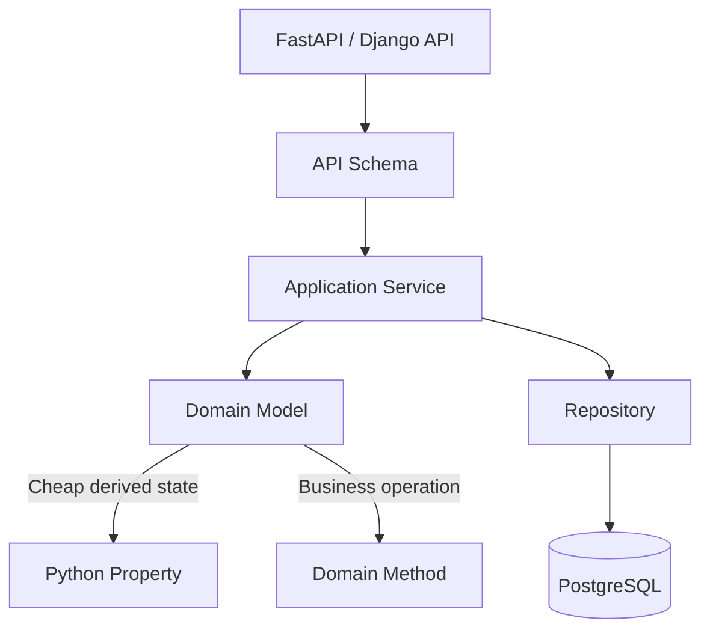

# 15- Properties

## Overview

Python properties provide attribute-style access to methods.

They allow a class to expose:

```python
user.email
```

while internally executing logic equivalent to a method call.

The primary mechanism is the built-in `property` descriptor:

```python
class User:
    def __init__(self, email: str) -> None:
        self._email = email

    @property
    def email(self) -> str:
        return self._email
```

The caller uses:

```python
user.email
```

instead of:

```python
user.email()
```

Properties are useful when an attribute needs controlled access, validation, computation, normalization, lazy evaluation, or compatibility with an existing attribute-based API.

They are particularly relevant to backend engineering because domain models frequently need to protect invariants while maintaining a clean public interface.

## Why Properties Exist

Without a property, a class might expose mutable state directly:

```python
class User:
    def __init__(self, email: str) -> None:
        self.email = email
```

This provides no central place to enforce rules.

A caller can perform:

```python
user.email = ""
```

even if an empty email is invalid.

A property provides an abstraction boundary:

```text
Caller
  |
  | user.email
  v
@property getter
  |
  v
Validation / transformation / computation
  |
  v
Internal state
```

The important benefit is not merely validation. Properties allow the implementation behind an attribute-style interface to evolve without necessarily changing callers.

## Basic Property

The simplest property is read-only.

```python
class User:
    def __init__(self, email: str) -> None:
        self._email = email

    @property
    def email(self) -> str:
        return self._email
```

Usage:

```python
user = User("user@example.com")

print(user.email)
```

The caller sees an attribute:

```python
user.email
```

but Python invokes the property's getter.

## Getter, Setter, and Deleter

A property can define three operations:

```text
getter  -> reading
setter  -> assignment
deleter -> deletion
```

Example:

```python
class User:
    def __init__(self, email: str) -> None:
        self.email = email

    @property
    def email(self) -> str:
        return self._email

    @email.setter
    def email(self, value: str) -> None:
        normalized = value.strip().lower()

        if not normalized:
            raise ValueError("email cannot be empty")

        self._email = normalized
```

Now:

```python
user = User(" USER@example.com ")

print(user.email)
```

returns:

```text
user@example.com
```

and:

```python
user.email = "ADMIN@example.com"
```

automatically passes through the setter.

## Read-Only Properties

A property without a setter is effectively read-only through normal attribute assignment.

```python
class Order:
    def __init__(
        self,
        subtotal: int,
        tax: int,
    ) -> None:
        self._subtotal = subtotal
        self._tax = tax

    @property
    def total(self) -> int:
        return self._subtotal + self._tax
```

Usage:

```python
order.total
```

is valid.

But:

```python
order.total = 1000
```

raises an `AttributeError`.

This is useful when the value should be derived from authoritative state.

## Computed Properties

Properties are well suited for values that are cheap to calculate from existing state.

```python
class Order:
    def __init__(
        self,
        subtotal: int,
        tax: int,
    ) -> None:
        self.subtotal = subtotal
        self.tax = tax

    @property
    def total(self) -> int:
        return self.subtotal + self.tax
```

The caller does not need to know that `total` is derived:

```python
if order.total > 10_000:
    ...
```

This creates a useful abstraction.

## Properties Should Usually Be Cheap

A property looks like ordinary attribute access:

```python
order.total
```

Therefore callers naturally expect it to be inexpensive.

Avoid:

```python
class Order:
    @property
    def customer(self):
        return load_customer_from_postgres(self.customer_id)
```

This hides database I/O behind attribute access.

A caller may unknowingly execute:

```text
order.customer
     |
     v
PostgreSQL query
     |
     v
Network round trip
```

Prefer an explicit operation:

```python
customer = await customer_repository.get(order.customer_id)
```

or an explicitly named method if the operation is part of the domain abstraction.

## Properties and Lazy Evaluation

A property can provide lazy computation:

```python
class Report:
    def __init__(self, raw_data: bytes) -> None:
        self._raw_data = raw_data
        self._parsed = None

    @property
    def parsed(self):
        if self._parsed is None:
            self._parsed = parse_report(self._raw_data)

        return self._parsed
```

The parsing happens only when accessed.

However, this introduces hidden state mutation.

For expensive operations, consider making the operation explicit:

```python
report.parse()
```

or:

```python
parsed = report.parse()
```

A property is best when the computation remains conceptually attribute-like.

## Cached Properties

For expensive deterministic computations, `functools.cached_property` can be appropriate.

```python
from functools import cached_property


class Report:
    def __init__(self, raw_data: bytes) -> None:
        self.raw_data = raw_data

    @cached_property
    def parsed(self):
        return parse_report(self.raw_data)
```

The first access computes the value:

```python
report.parsed
```

Subsequent accesses reuse the cached value.

### Cached Property Trade-offs

| Benefit | Limitation |
|---|---|
| Avoids repeated computation | Consumes instance memory |
| Simple API | Cache can become stale |
| Lazy initialization | First access pays computation cost |
| Useful for immutable-ish state | Requires careful invalidation if source state changes |

Use `cached_property` when the object's underlying state is stable enough that caching is correct.

## Property and Internal Storage

A common convention is:

```python
class User:
    def __init__(self, email: str) -> None:
        self._email = email

    @property
    def email(self) -> str:
        return self._email
```

The leading underscore communicates:

```text
_internal implementation detail
```

It is not a security boundary.

Python does not prevent callers from doing:

```python
user._email = "..."
```

Properties provide controlled public behavior, but Python generally relies on conventions rather than strict access control.

## Setter Validation

Properties are useful for maintaining object invariants.

```python
class Account:
    def __init__(self, balance: int) -> None:
        self.balance = balance

    @property
    def balance(self) -> int:
        return self._balance

    @balance.setter
    def balance(self, value: int) -> None:
        if value < 0:
            raise ValueError("balance cannot be negative")

        self._balance = value
```

Now all normal assignments pass through the same validation.

However, consider whether arbitrary assignment is actually the correct domain model.

For financial systems, this may be safer:

```python
account.deposit(500)
account.withdraw(200)
```

rather than:

```python
account.balance = 300
```

Properties are not a replacement for domain behavior.

## Properties vs Domain Methods

A useful rule is:

> Properties represent state or derived state; methods represent actions or operations.

Prefer:

```python
order.total
order.is_paid
order.customer_id
```

for state-like concepts.

Prefer:

```python
order.cancel()
order.refund()
order.mark_as_paid()
```

for state-changing business operations.

Avoid turning complex business logic into properties simply because attribute syntax looks cleaner.

## Property Syntax

The decorator form:

```python
@property
def name(self):
    ...
```

is equivalent in concept to:

```python
name = property(get_name)
```

A full property can be constructed explicitly:

```python
class User:
    def __init__(self, email: str) -> None:
        self._email = email

    def get_email(self) -> str:
        return self._email

    def set_email(self, value: str) -> None:
        self._email = value

    email = property(
        get_email,
        set_email,
    )
```

The decorator form is normally clearer.

## How `property` Works Internally

`property` is implemented as a descriptor.

Conceptually:

```text
user.email
    |
    v
User.email
    |
    v
property descriptor
    |
    v
fget(user)
    |
    v
returned value
```

For assignment:

```python
user.email = "new@example.com"
```

Python finds the property descriptor and invokes its setter.

```text
user.email = value
       |
       v
property.__set__()
       |
       v
fset(user, value)
```

This is why properties are closely related to descriptors.

## Properties Are Descriptors

A property object implements descriptor behavior.

Conceptually:

```python
class property:
    def __get__(self, instance, owner):
        ...

    def __set__(self, instance, value):
        ...

    def __delete__(self, instance):
        ...
```

The actual implementation is provided by Python's runtime.

This means property access participates in Python's attribute lookup machinery rather than being a simple stored field.

## Data Descriptor Behavior

A property with a setter is a data descriptor.

This affects attribute lookup.

For example:

```python
class User:
    @property
    def email(self):
        return self._email
```

The property controls:

```python
user.email
```

even though the instance might otherwise contain attributes with similar names.

This is one reason a property can provide a stable public API while changing its internal implementation.

## Property and Attribute Lookup

A simplified lookup model is:

```text
obj.attribute
     |
     v
Class / MRO lookup
     |
     +--> Data descriptor?
     |       |
     |       +--> yes -> descriptor.__get__()
     |
     +--> Instance dictionary
     |
     +--> Non-data descriptor / class attribute
     |
     +--> __getattr__()
```

The actual lookup rules contain additional details, but this model explains why descriptors such as `property` are powerful.

## Avoid Recursive Properties

A common mistake is:

```python
class User:
    @property
    def email(self):
        return self.email
```

This recursively calls itself:

```text
email
  -> email
      -> email
          -> ...
```

Use separate internal storage:

```python
class User:
    @property
    def email(self):
        return self._email
```

The same applies to setters:

```python
@email.setter
def email(self, value):
    self.email = value
```

This recursively invokes the setter.

Use:

```python
self._email = value
```

instead.

## Property Setter and Normalization

A setter can normalize input at the object boundary.

```python
class EmailAddress:
    def __init__(self, value: str) -> None:
        self.value = value

    @property
    def value(self) -> str:
        return self._value

    @value.setter
    def value(self, value: str) -> None:
        normalized = value.strip().lower()

        if "@" not in normalized:
            raise ValueError("invalid email address")

        self._value = normalized
```

This ensures the object stores a normalized representation.

For more complex validation, a dedicated value object, dataclass, or validation library may provide a clearer design.

## Property and Immutability

A read-only property does not automatically make an object immutable.

For example:

```python
class User:
    def __init__(self, roles: list[str]) -> None:
        self._roles = roles

    @property
    def roles(self) -> list[str]:
        return self._roles
```

The caller cannot assign:

```python
user.roles = []
```

but can still mutate:

```python
user.roles.append("admin")
```

Therefore, read-only access is not the same as immutable state.

If immutability matters, consider returning an immutable representation:

```python
class User:
    def __init__(self, roles: list[str]) -> None:
        self._roles = tuple(roles)

    @property
    def roles(self) -> tuple[str, ...]:
        return self._roles
```

## Properties and Mutable Collections

Returning internal mutable collections can break encapsulation.

Avoid:

```python
@property
def permissions(self) -> list[str]:
    return self._permissions
```

if callers should not modify the collection.

Alternatives include:

```python
@property
def permissions(self) -> tuple[str, ...]:
    return tuple(self._permissions)
```

or:

```python
@property
def permissions(self) -> frozenset[str]:
    return frozenset(self._permissions)
```

Choose based on the domain semantics and performance requirements.

## Copying vs Read-Only Views

Returning a copy:

```python
return list(self._items)
```

protects internal state but allocates memory.

Returning a tuple:

```python
return tuple(self._items)
```

also allocates if the internal representation is a list.

If the object is designed around immutable collections from the beginning, the property can return the stored immutable object directly.

The important question is:

```text
Who owns this state, and who is allowed to mutate it?
```

## Property Documentation

Document non-obvious behavior.

For example:

```python
class User:
    @property
    def display_name(self) -> str:
        """Return the user's normalized display name."""
        return self._display_name
```

Especially document:

- Expensive computation
- Caching
- Validation
- Units
- Time zones
- Side effects
- Possible exceptions
- Mutability guarantees

A property that looks like simple state but performs expensive computation should not surprise maintainers.

## Properties and Type Hints

Properties should have explicit return types.

```python
class User:
    @property
    def email(self) -> str:
        return self._email

    @email.setter
    def email(self, value: str) -> None:
        self._email = value.strip().lower()
```

The setter generally returns:

```python
None
```

Type checkers such as mypy and Pyright can then reason about the public interface.

## Properties and Abstract Base Classes

Properties can be abstract.

```python
from abc import ABC, abstractmethod


class PaymentMethod(ABC):
    @property
    @abstractmethod
    def provider_name(self) -> str:
        ...
```

A concrete implementation must provide the property:

```python
class StripePaymentMethod(PaymentMethod):
    @property
    def provider_name(self) -> str:
        return "stripe"
```

This is useful when a class hierarchy requires a state-like contract.

## Abstract Property Ordering

The common pattern is:

```python
@property
@abstractmethod
def provider_name(self) -> str:
    ...
```

The decorators should be ordered so that the resulting attribute remains an abstract property.

When using framework or library-specific decorators, follow the documented decorator ordering because descriptor composition can affect behavior.

## Properties and Protocols

Protocols can describe property-based interfaces.

```python
from typing import Protocol


class HasUserId(Protocol):
    @property
    def user_id(self) -> int:
        ...
```

Any object with a compatible `user_id` property can satisfy the protocol structurally.

This is useful for dependency inversion:

```python
def load_profile(entity: HasUserId) -> None:
    ...
```

The function does not need to inherit from a specific base class.

## Properties in Backend Domain Models

Properties are useful for derived domain state.

```python
from dataclasses import dataclass


@dataclass
class Order:
    subtotal: int
    tax: int
    discount: int

    @property
    def total(self) -> int:
        return (
            self.subtotal
            + self.tax
            - self.discount
        )

    @property
    def is_free(self) -> bool:
        return self.total == 0
```

This gives application code readable domain semantics:

```python
if order.is_free:
    ...
```

The property is appropriate because these values are derived from in-memory state.

## Properties and API Serialization

Properties may be visible to serializers depending on the framework and serialization strategy, but they should not be treated as an API contract automatically.

For FastAPI/Pydantic, define the external response model explicitly:

```python
from pydantic import BaseModel


class OrderResponse(BaseModel):
    id: int
    total: int
    is_free: bool
```

The domain object can expose:

```python
order.total
order.is_free
```

while the API schema independently defines:

```text
HTTP JSON contract
```

This prevents internal Python implementation details from accidentally becoming public API behavior.

## Properties and Django

Django models can expose properties for derived values.

```python
from django.db import models


class Order(models.Model):
    subtotal = models.IntegerField()
    tax = models.IntegerField()

    @property
    def total(self) -> int:
        return self.subtotal + self.tax
```

This can be convenient:

```python
order.total
```

However, a property is not a database field.

It generally cannot be queried directly as:

```python
Order.objects.filter(total__gt=1000)
```

because the database does not know about the Python property.

If the value needs database-side filtering, aggregation, indexing, or sorting, consider:

- A database expression
- An annotation
- A generated/stored database value where appropriate
- A materialized value
- A dedicated query abstraction

## Python Property vs Database Property

This distinction is important:

```text
Python property
    |
    +--> Computed in application memory
    |
    +--> Not automatically queryable by SQL


Database column
    |
    +--> Computed/stored by database
    |
    +--> Can participate in SQL queries and indexes
```

Do not move a computation into a Python property if the application needs to filter millions of PostgreSQL rows based on that value.

## Properties and Caching

A property can be combined with caching:

```python
from functools import cached_property


class UserProfile:
    @cached_property
    def display_name(self) -> str:
        return f"{self.first_name} {self.last_name}"
```

For long-lived objects, consider cache invalidation.

If:

```python
profile.first_name = "Alex"
```

after:

```python
profile.display_name
```

has already been accessed, the cached property may still contain the previous value.

Therefore, cached properties work best when:

- The underlying state is immutable.
- The object is short-lived.
- The cached value is intentionally stable.
- Invalidation is explicitly managed.

## Properties and Concurrency

Properties do not provide synchronization.

This is unsafe if the property mutates shared state:

```python
class Counter:
    @property
    def value(self) -> int:
        self._value += 1
        return self._value
```

Concurrent callers can observe surprising behavior.

Even cached properties require thought when objects are shared across threads or tasks.

For application services, prefer:

- Immutable state
- Explicit synchronization
- Proper ownership
- Avoiding shared mutable objects

Properties should normally behave like safe observation of object state.

## Properties and Async Code

Python properties cannot be naturally awaited:

```python
value = await obj.value
```

A property that requires asynchronous work is therefore a design smell.

Avoid trying to hide async I/O behind property access.

Prefer:

```python
value = await obj.load_value()
```

or:

```python
value = await repository.get(...)
```

This makes latency and failure explicit.

## Properties and Resource Ownership

Do not use properties to conceal resource acquisition.

Avoid:

```python
@property
def connection(self):
    return create_database_connection()
```

Every attribute access could create a new resource.

Prefer explicit lifecycle management:

```python
async with connection_pool.acquire() as connection:
    ...
```

or a clearly named method/factory.

Properties should generally expose state, not secretly allocate infrastructure resources.

## Properties and Transactions

Properties should not unexpectedly open or commit transactions.

Avoid:

```python
@property
def balance(self):
    return query_database_balance(self.account_id)
```

The caller cannot see that the operation depends on database state.

Transaction boundaries should remain explicit:

```python
async with repository.transaction():
    balance = await repository.get_balance(account_id)
```

This makes consistency and failure semantics easier to reason about.

## Properties and Performance

A property access is generally inexpensive, but its implementation determines the real cost.

Cheap:

```python
@property
def total(self) -> int:
    return self.subtotal + self.tax
```

Potentially expensive:

```python
@property
def report(self):
    return expensive_report_generation()
```

Dangerous:

```python
@property
def customer(self):
    return fetch_customer_from_database()
```

For production systems, use profiling and measurement rather than assuming property access itself is expensive.

The important issue is hidden work.

## Properties and Memory

Normal properties do not store a separate value.

For:

```python
class Order:
    @property
    def total(self):
        return self.subtotal + self.tax
```

the property object lives on the class, while the computed result is produced when accessed.

By contrast, `cached_property` stores its result on the instance after the first access, increasing per-instance memory usage.

This distinction matters for systems processing millions of objects.

## Properties and Security

Properties should not accidentally expose sensitive internal state.

Avoid:

```python
@property
def credentials(self):
    return self._credentials
```

if callers do not need direct access.

Prefer explicit capabilities:

```python
@property
def has_credentials(self) -> bool:
    return self._credentials is not None
```

or controlled operations.

Properties can also become security-sensitive when setters bypass validation.

Ensure authorization is enforced at the appropriate application boundary rather than assuming a property setter is sufficient protection.

## Properties and Encapsulation

Properties are one of Python's primary tools for encapsulation.

Instead of:

```python
class Account:
    balance = 1000
```

the class can control access:

```python
class Account:
    @property
    def balance(self) -> int:
        return self._balance
```

But encapsulation does not mean hiding everything.

Good encapsulation means:

- Internal invariants are protected.
- Public behavior is stable.
- Mutation paths are deliberate.
- Implementation details can change independently.
- Callers depend on meaningful abstractions.

## Properties and Backward Compatibility

Properties are particularly useful when migrating an API.

Suppose an existing application exposes:

```python
user.full_name
```

but the implementation needs to change.

A property can preserve the public interface:

```python
class User:
    @property
    def full_name(self) -> str:
        return self.first_name + " " + self.last_name
```

The internal representation can later change without requiring every caller to change.

This makes properties useful as compatibility boundaries.

## Properties and Refactoring

A common refactoring is changing a public field into a controlled property.

Original:

```python
class User:
    def __init__(self, email: str) -> None:
        self.email = email
```

Later:

```python
class User:
    def __init__(self, email: str) -> None:
        self.email = email

    @property
    def email(self) -> str:
        return self._email

    @email.setter
    def email(self, value: str) -> None:
        self._email = value.strip().lower()
```

Callers can continue using:

```python
user.email
user.email = "..."
```

while the class gains centralized behavior.

This is one of the strongest practical reasons to use properties.

## Properties vs Explicit Getters and Setters

Python generally prefers properties over Java-style accessor methods when attribute semantics are appropriate.

| Approach | Example | Typical Python Preference |
|---|---|---|
| Public field | `user.email` | Good for simple state |
| Property | `user.email` | Good when access needs logic |
| Getter method | `user.get_email()` | Usually unnecessary for simple state |
| Setter method | `user.set_email(value)` | Prefer property setter when assignment semantics are appropriate |
| Domain command | `user.change_email(value)` | Better when changing state has business semantics |

The key distinction is whether the operation represents **state access** or **business behavior**.

## Properties vs Methods

A property should usually satisfy these characteristics:

- It behaves like state.
- It is relatively cheap.
- It does not require arguments.
- It has predictable behavior.
- It has minimal side effects.

A method is more appropriate when:

- The operation is expensive.
- Arguments are required.
- I/O is involved.
- The operation changes state.
- The operation can fail in meaningful ways.
- The operation represents a business command.

## Common Mistakes

### Hiding Database Queries

Bad:

```python
@property
def profile(self):
    return repository.get(self.profile_id)
```

This creates invisible I/O.

### Using Properties for Business Commands

Bad:

```python
@property
def cancel(self):
    self.status = "cancelled"
```

A state-changing action should be explicit:

```python
def cancel(self) -> None:
    self.status = "cancelled"
```

### Assuming Read-Only Means Immutable

A read-only property can still return mutable state.

### Recursive Access

Bad:

```python
@property
def name(self):
    return self.name
```

Use:

```python
return self._name
```

### Expensive Computation

A property that performs CPU-heavy work can surprise callers.

### Hidden Exceptions

Properties that frequently raise exceptions make ordinary attribute access difficult to reason about.

### Returning Internal Mutable State

This can bypass encapsulation.

### Overusing Setters

If every property has a setter, the class may simply be exposing mutable data rather than enforcing meaningful invariants.

### Ignoring Database Query Requirements

A Python property cannot automatically replace a database-level computed field when the value needs SQL filtering or indexing.

## Production Pitfalls

| Pitfall | Impact | Better Approach |
|---|---|---|
| Database query in property | Hidden latency/N+1 queries | Use explicit repository/service calls |
| Network call in property | Unpredictable request latency | Make I/O explicit |
| Expensive computation | Unexpected CPU cost | Use method or deliberate caching |
| Mutable value returned | Encapsulation violation | Return immutable/copy/view |
| Cached stale value | Incorrect state | Define invalidation or use immutable state |
| Async work in property | Awkward API and hidden I/O | Use `async` method |
| Setter for business action | Weak domain model | Use explicit command method |
| Recursive getter/setter | Runtime recursion | Use separate internal storage |
| Secret exposure | Security/logging risk | Expose only required state |
| Property used for SQL filtering | Query failure or inefficient loading | Use DB expressions/annotations |
| Excessive properties | Over-engineered model | Keep attribute semantics simple |

## Senior Design Guidance

At senior level, the important question is not:

```text
"Can this be a property?"
```

but:

```text
"Should this behavior look like attribute access?"
```

A good property:

```python
@property
def total(self) -> int:
    return self.subtotal + self.tax
```

represents derived state.

A questionable property:

```python
@property
def customer(self):
    return self.repository.get(self.customer_id)
```

hides I/O.

A poor property:

```python
@property
def process_payment(self):
    return self.gateway.charge(...)
```

hides a business operation.

A strong rule is:

> If accessing the value could reasonably surprise a caller because of latency, I/O, mutation, failure, or significant computation, prefer an explicit method or service operation.

## Properties in Layered Backend Architecture

A typical backend architecture might look like:



Properties generally belong in the domain/application model for local state semantics.

They should not become a hidden gateway to infrastructure.

## Properties and Service Boundaries

Consider:

```python
class OrderService:
    def __init__(self, repository):
        self.repository = repository

    async def get_total(self, order_id: int) -> int:
        order = await self.repository.get(order_id)
        return order.total
```

Here:

```python
order.total
```

is a local computation.

The service explicitly owns:

```python
repository.get(order_id)
```

This separation keeps:

```text
I/O boundary
```

and:

```text
in-memory domain behavior
```

visible.

## Properties and Testing

Test properties according to their contract.

```python
def test_total_is_computed_from_order_state():
    order = Order(
        subtotal=1000,
        tax=180,
    )

    assert order.total == 1180
```

For setters:

```python
def test_email_is_normalized():
    user = User("USER@example.com")

    assert user.email == "user@example.com"
```

For invalid state:

```python
def test_email_rejects_empty_value():
    with pytest.raises(ValueError):
        User("")
```

For mutable collections:

```python
def test_roles_are_immutable():
    user = User(["admin"])

    assert user.roles == ("admin",)
```

The test should verify the externally meaningful behavior.

## Property Testing Strategy

When a property represents an invariant, test both valid and invalid transitions.

For example:

```text
Input
  |
  v
Property setter
  |
  +---- valid ----> normalized state
  |
  +---- invalid --> exception
```

This is particularly useful for:

- Currency values
- Email addresses
- Status transitions
- Identifiers
- Configuration
- Domain constraints

For more complex invariants, property-based testing with Hypothesis can complement normal unit tests.

## Properties and Serialization

Be careful when serializing objects using:

```python
obj.__dict__
```

Properties are generally not stored in `__dict__` as values.

For example:

```python
class User:
    @property
    def email(self):
        return self._email
```

The instance dictionary contains:

```python
{
    "_email": "user@example.com"
}
```

not necessarily:

```python
{
    "email": "user@example.com"
}
```

This is another reason to use explicit serialization schemas instead of relying on `__dict__`.

## Properties and Pickling

Properties themselves are class-level descriptors and usually do not represent instance state directly.

The backing state:

```python
self._email
```

is what normally gets serialized when using mechanisms based on instance state.

If a class implements custom serialization hooks, verify that property-derived values and backing state remain consistent.

For security-sensitive or external data interchange, prefer explicit serialization formats and schemas.

## Property-Based API Stability

A property can preserve an interface while changing implementation.

For example:

```python
class User:
    @property
    def display_name(self) -> str:
        return self._display_name
```

Later, the implementation could derive it:

```python
@property
def display_name(self) -> str:
    return f"{self.first_name} {self.last_name}"
```

The caller still uses:

```python
user.display_name
```

This is useful for maintaining internal compatibility.

However, changing a property from cheap local access to expensive computation can still create a performance regression even when the Python API remains unchanged.

API compatibility does not guarantee behavioral compatibility.

## Property Design Checklist

Before introducing a property, ask:

1. Does the value conceptually represent state?
2. Is attribute syntax natural for the caller?
3. Is access cheap enough to look like attribute access?
4. Does it avoid hidden I/O?
5. Does it avoid significant side effects?
6. Is the return value safe to expose?
7. Does it preserve object invariants?
8. Does a setter represent ordinary state assignment?
9. Would an explicit method communicate the operation better?
10. Does the value need to be queried or indexed by PostgreSQL?
11. Would caching introduce stale-state risks?
12. Is concurrency behavior predictable?
13. Is the property contract covered by tests?
14. Does serialization need an explicit schema?

## Interview Reference

| Question | Answer |
|---|---|
| What is a property? | A descriptor that provides attribute-style access to getter/setter/deleter logic. |
| Why use `@property`? | To control attribute access while preserving a natural attribute-based API. |
| Is a property a method? | Internally it is backed by callable getter/setter functions, but callers access it as an attribute. |
| What is a property implemented with? | The descriptor protocol. |
| Does a read-only property make an object immutable? | No. The returned value may still be mutable, and other attributes may remain mutable. |
| When should a setter be avoided? | When state changes represent domain commands rather than ordinary assignment. |
| Should a property perform database I/O? | Generally no; hidden I/O makes latency and failure behavior surprising. |
| Can a property be async? | Not in the normal `await obj.property` sense; use an async method for asynchronous work. |
| What is `cached_property`? | A descriptor that computes a value on first access and caches it on the instance. |
| Can a Django property be queried with the ORM? | Not directly; Python properties execute in application memory rather than SQL. |
| Why can a property be useful for backward compatibility? | It can preserve attribute-style access while allowing internal implementation changes. |
| What is the main design rule? | Use properties for cheap, state-like behavior and explicit methods for operations, I/O, or significant work. |

## Production Checklist

Before shipping a property:

- The property represents state or derived state.
- Attribute-style access is semantically appropriate.
- Access is cheap and predictable.
- No hidden database or network I/O exists.
- No unexpected mutation occurs.
- Expensive computation is either avoided or explicitly documented.
- Cached values have a clear invalidation strategy.
- Mutable internal collections are not exposed accidentally.
- Setter validation preserves object invariants.
- Business commands are implemented as explicit methods.
- Async operations are not hidden behind property access.
- Sensitive data is not exposed.
- ORM query requirements are handled at the database/query layer.
- Type hints are present.
- Tests cover normal and exceptional behavior.
- Serialization uses explicit schemas where external contracts are involved.
- The property does not create surprising concurrency or lifecycle behavior.

## Key Takeaways

- Properties provide attribute-style access to controlled behavior through Python's descriptor protocol, making them useful for encapsulation and derived state.
- Use properties for cheap, predictable, state-like values; use explicit methods for business commands, significant computation, I/O, asynchronous work, and operations with meaningful side effects.
- A read-only property is not the same as immutability; returning mutable internal collections can still allow callers to bypass encapsulation.
- Avoid hiding PostgreSQL, Redis, HTTP, Kafka, or other infrastructure operations behind properties because ordinary attribute access should not unexpectedly incur latency or failure.
- Properties are valuable for stable domain interfaces, but their contracts should be tested and designed with performance, concurrency, serialization, security, and database-query requirements in mind.