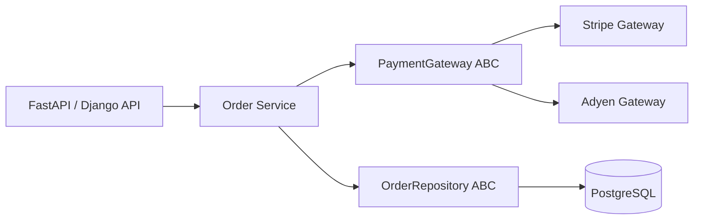

# 17- Abstract Base Classes

## Overview

Abstract Base Classes (ABCs) provide a formal way to define contracts for subclasses.

Python's `abc` module allows a base class to declare methods or properties that concrete subclasses must implement.

```python
from abc import ABC, abstractmethod


class PaymentGateway(ABC):
    @abstractmethod
    async def charge(
        self,
        amount: int,
        currency: str,
    ) -> str:
        ...
```

A concrete implementation must satisfy the abstract contract:

```python
class StripePaymentGateway(PaymentGateway):
    async def charge(
        self,
        amount: int,
        currency: str,
    ) -> str:
        return "payment-id"
```

ABCs are particularly useful when a system has multiple implementations behind a stable interface:

```text
Application Service
       |
       v
PaymentGateway
   /       \
  v         v
Stripe    Adyen
```

They are most valuable when the relationship is explicitly object-oriented and the system benefits from:

- A nominal type hierarchy
- Runtime enforcement of required methods
- Shared implementation
- Framework extension points
- Explicit subclass contracts
- Polymorphism

ABCs should not be confused with protocols. Python protocols provide structural typing, while ABCs provide nominal inheritance-based contracts.

## Why Abstract Base Classes Exist

Suppose an application supports several payment providers.

Without an abstraction:

```python
class OrderService:
    def __init__(self, stripe_client):
        self.stripe_client = stripe_client
```

The service becomes tightly coupled to one provider.

An ABC can define the application-level contract:

```python
from abc import ABC, abstractmethod


class PaymentGateway(ABC):
    @abstractmethod
    async def charge(
        self,
        amount: int,
        currency: str,
    ) -> str:
        ...
```

Implementations can vary:

```text
PaymentGateway
      |
      +---- StripePaymentGateway
      |
      +---- AdyenPaymentGateway
      |
      +---- InternalPaymentGateway
```

The service depends on the abstraction:

```python
class OrderService:
    def __init__(
        self,
        gateway: PaymentGateway,
    ) -> None:
        self.gateway = gateway
```

This supports polymorphism and dependency inversion.

## Basic Abstract Base Class

An ABC inherits from `ABC`:

```python
from abc import ABC, abstractmethod


class Repository(ABC):
    @abstractmethod
    async def get(self, item_id: int):
        ...
```

A subclass must implement the abstract method before it can be instantiated:

```python
class PostgresRepository(Repository):
    async def get(self, item_id: int):
        ...
```

This is valid:

```python
repository = PostgresRepository()
```

But:

```python
repository = Repository()
```

raises:

```text
TypeError
```

because `Repository` remains abstract.

## `ABC` and `ABCMeta`

`ABC` is a convenience base class.

Underneath it, Python uses the `ABCMeta` metaclass.

Conceptually:

```text
ABC
 |
 v
ABCMeta
 |
 v
Class creation / abstract method tracking
```

You can also specify the metaclass directly:

```python
from abc import ABCMeta


class Repository(metaclass=ABCMeta):
    ...
```

In normal application code, prefer:

```python
class Repository(ABC):
    ...
```

because it communicates intent more clearly.

## `@abstractmethod`

The `abstractmethod` decorator marks a method as required for concrete subclasses.

```python
from abc import ABC, abstractmethod


class MessagePublisher(ABC):
    @abstractmethod
    async def publish(
        self,
        topic: str,
        payload: bytes,
    ) -> None:
        ...
```

A subclass that does not implement it remains abstract:

```python
class KafkaPublisher(MessagePublisher):
    pass
```

Attempting:

```python
KafkaPublisher()
```

raises `TypeError`.

## Abstract Methods Can Have Implementations

An abstract method does not have to be empty.

```python
from abc import ABC, abstractmethod


class Repository(ABC):
    @abstractmethod
    def validate_id(self, item_id: int) -> None:
        if item_id <= 0:
            raise ValueError("item_id must be positive")
```

A subclass must still implement the method to become concrete:

```python
class PostgresRepository(Repository):
    def validate_id(self, item_id: int) -> None:
        super().validate_id(item_id)
        # Additional repository-specific validation.
```

This is useful when the abstract method defines a contract while the base class provides reusable behavior.

## Abstract Methods and `super()`

An abstract method can participate in cooperative inheritance.

```python
class BaseHandler(ABC):
    @abstractmethod
    def handle(self, request):
        self.validate(request)
```

A subclass can call:

```python
class OrderHandler(BaseHandler):
    def handle(self, request):
        super().handle(request)
        return self.process_order(request)
```

An abstract method can therefore contain useful shared logic.

The `abstractmethod` marker describes the subclass contract; it does not necessarily mean the base implementation must be empty.

## Abstract Properties

ABCs can define abstract properties.

```python
from abc import ABC, abstractmethod


class PaymentGateway(ABC):
    @property
    @abstractmethod
    def provider_name(self) -> str:
        ...
```

A concrete implementation must provide the property:

```python
class StripeGateway(PaymentGateway):
    @property
    def provider_name(self) -> str:
        return "stripe"
```

This is useful for state-like requirements.

## Abstract Class Methods

Class methods can also be abstract.

```python
from abc import ABC, abstractmethod


class Repository(ABC):
    @classmethod
    @abstractmethod
    def from_config(cls, config):
        ...
```

Concrete implementations can provide their own construction logic:

```python
class PostgresRepository(Repository):
    @classmethod
    def from_config(cls, config):
        return cls(config.database_url)
```

Decorator ordering matters when combining `@classmethod` and `@abstractmethod`. The standard pattern is:

```python
@classmethod
@abstractmethod
def from_config(cls, config):
    ...
```

## Abstract Static Methods

Static methods can also be abstract.

```python
from abc import ABC, abstractmethod


class Serializer(ABC):
    @staticmethod
    @abstractmethod
    def serialize(value) -> bytes:
        ...
```

Concrete classes implement:

```python
class JsonSerializer(Serializer):
    @staticmethod
    def serialize(value) -> bytes:
        return json.dumps(value).encode()
```

Use abstract static methods sparingly. If the behavior conceptually belongs to an instance or class, an instance or class method may communicate the design more naturally.

## Multiple Abstract Methods

An ABC can define multiple required operations.

```python
class PaymentGateway(ABC):
    @abstractmethod
    async def authorize(
        self,
        amount: int,
        currency: str,
    ) -> str:
        ...

    @abstractmethod
    async def capture(
        self,
        authorization_id: str,
    ) -> str:
        ...

    @abstractmethod
    async def refund(
        self,
        payment_id: str,
        amount: int,
    ) -> str:
        ...
```

This establishes a complete contract.

However, large ABCs are often a design smell.

Prefer smaller interfaces:

```text
PaymentAuthorizer
PaymentCapturer
PaymentRefunder
```

when implementations genuinely have different responsibilities.

## Interface Segregation

An ABC should contain only behavior that every concrete implementation actually needs.

Poor design:

```python
class Storage(ABC):
    @abstractmethod
    def read(self): ...

    @abstractmethod
    def write(self): ...

    @abstractmethod
    def delete(self): ...

    @abstractmethod
    def watch(self): ...

    @abstractmethod
    def transaction(self): ...
```

A read-only implementation may be forced to implement unrelated operations.

Prefer focused abstractions:

```python
class Reader(ABC):
    @abstractmethod
    async def read(self, key: str) -> bytes:
        ...


class Writer(ABC):
    @abstractmethod
    async def write(self, key: str, value: bytes) -> None:
        ...
```

This follows the Interface Segregation Principle.

## Abstract Class vs Concrete Base Class

An ABC can contain both abstract and concrete behavior.

```python
class Repository(ABC):
    def normalize_id(self, item_id: int) -> int:
        if item_id <= 0:
            raise ValueError("invalid ID")

        return item_id

    @abstractmethod
    async def get(self, item_id: int):
        ...
```

This is useful when implementations share behavior.

A completely abstract interface may instead be better represented using a protocol when only a behavioral contract is required.

## ABC vs Protocol

This is one of the most important design decisions in modern Python.

ABC:

```python
class Repository(ABC):
    @abstractmethod
    async def get(self, item_id: int):
        ...
```

Protocol:

```python
from typing import Protocol


class Repository(Protocol):
    async def get(self, item_id: int):
        ...
```

The key difference is:

```text
ABC
 |
 +--> Explicit inheritance
 +--> Nominal relationship
 +--> Runtime abstractness
 +--> Shared implementation possible


Protocol
 |
 +--> Structural compatibility
 +--> Explicit inheritance not required
 +--> Strong static typing support
 +--> Excellent for dependency boundaries
```

## ABC vs Protocol Comparison

| Concern | ABC | Protocol |
|---|---|---|
| Inheritance required | Usually yes | No |
| Runtime abstract enforcement | Yes | Generally no |
| Structural typing | No | Yes |
| Shared implementation | Excellent | Limited |
| Framework base class | Good | Not required |
| Dependency boundary | Good | Often excellent |
| Plugin compatibility | More restrictive | More flexible |
| Multiple unrelated implementations | More coupling | Less coupling |
| Type-checking | Strong | Strong |
| Best fit | Nominal hierarchy | Behavioral contract |

A senior Python engineer should know both and choose based on the architecture.

## When ABCs Are Better

ABCs are a good fit when:

- Subclasses share implementation.
- Runtime instantiation enforcement matters.
- The hierarchy is intentional.
- Framework extension points require inheritance.
- Subclasses have a genuine subtype relationship.
- Common lifecycle behavior belongs in the base class.
- Template Method patterns are being used.

## When Protocols Are Better

Protocols are often better when:

- You only need a behavioral contract.
- Implementations should not inherit from your code.
- Dependency injection is involved.
- Third-party implementations must be supported.
- Structural typing is desirable.
- You want minimal coupling.

For example:

```python
class Cache(Protocol):
    async def get(self, key: str) -> bytes | None:
        ...

    async def set(
        self,
        key: str,
        value: bytes,
    ) -> None:
        ...
```

A Redis client adapter can satisfy this without inheriting from `Cache`.

## Abstract Base Classes and Polymorphism

ABCs work naturally with polymorphism.

```python
class PaymentGateway(ABC):
    @abstractmethod
    async def charge(
        self,
        amount: int,
        currency: str,
    ) -> str:
        ...


class StripeGateway(PaymentGateway):
    async def charge(self, amount: int, currency: str) -> str:
        return "stripe-payment"


class AdyenGateway(PaymentGateway):
    async def charge(self, amount: int, currency: str) -> str:
        return "adyen-payment"
```

The service can depend on:

```python
PaymentGateway
```

rather than:

```python
StripeGateway
```

This is a direct application of polymorphism.

## Dependency Injection with ABCs

ABCs pair naturally with constructor injection.

```python
class OrderService:
    def __init__(
        self,
        gateway: PaymentGateway,
    ) -> None:
        self.gateway = gateway

    async def pay(self, amount: int) -> str:
        return await self.gateway.charge(
            amount,
            "USD",
        )
```

Composition root:

```python
gateway = StripeGateway()
service = OrderService(gateway)
```

The application service does not need to know which concrete gateway was selected.

## Backend Architecture Example

A production architecture might look like:



The important boundary is:

```text
Application Service
        |
        v
Stable abstraction
        |
        +---- implementation A
        |
        +---- implementation B
```

This makes implementations replaceable without changing business logic.

## ABCs and Repository Pattern

A repository abstraction can be defined as:

```python
from abc import ABC, abstractmethod


class OrderRepository(ABC):
    @abstractmethod
    async def get(self, order_id: int):
        ...

    @abstractmethod
    async def save(self, order):
        ...
```

Concrete implementation:

```python
class PostgresOrderRepository(OrderRepository):
    async def get(self, order_id: int):
        ...

    async def save(self, order):
        ...
```

The application service depends on:

```python
OrderRepository
```

rather than directly on PostgreSQL implementation details.

However, do not create an ABC merely because a repository exists. If there is only one implementation and no meaningful substitution requirement, a concrete repository can be simpler.

## ABCs and External Clients

ABCs are useful for adapters around third-party clients.

```python
class EmailSender(ABC):
    @abstractmethod
    async def send(
        self,
        recipient: str,
        subject: str,
        body: str,
    ) -> None:
        ...


class SesEmailSender(EmailSender):
    async def send(
        self,
        recipient: str,
        subject: str,
        body: str,
    ) -> None:
        ...
```

The rest of the application does not depend directly on the AWS SDK.

This creates a boundary between:

```text
Application
     |
     v
EmailSender
     |
     v
AWS SES adapter
```

The same pattern applies to:

- Redis
- Kafka
- Stripe
- S3
- HTTP clients
- gRPC clients

## ABCs and Framework Extension

ABCs are especially useful when a framework or library expects subclasses to provide specific hooks.

For example:

```python
class JobHandler(ABC):
    @abstractmethod
    async def execute(self, payload: dict) -> None:
        ...
```

Celery-style application code could then define concrete handlers:

```python
class GenerateReportHandler(JobHandler):
    async def execute(self, payload: dict) -> None:
        ...
```

The abstraction documents the framework/application contract.

Do not create deep inheritance hierarchies around background jobs when simple composition or callable objects would be clearer.

## ABCs and Django

Django applications can use ABCs for domain services and adapters, but Django's own class-based extension mechanisms often use normal inheritance rather than requiring application-specific ABCs.

An ABC can be appropriate for an application-level contract:

```python
class NotificationSender(ABC):
    @abstractmethod
    def send(self, user_id: int, message: str) -> None:
        ...
```

Concrete implementations might include:

```text
EmailNotificationSender
SmsNotificationSender
PushNotificationSender
```

The Django view or service should depend on the abstraction, not on a specific transport.

## ABCs and FastAPI

FastAPI commonly uses dependency injection to provide concrete implementations.

For example:

```python
from fastapi import Depends


def get_payment_gateway() -> PaymentGateway:
    return StripeGateway()


@app.post("/payments")
async def create_payment(
    gateway: PaymentGateway = Depends(get_payment_gateway),
):
    payment_id = await gateway.charge(
        1000,
        "USD",
    )

    return {"payment_id": payment_id}
```

The ABC provides the application contract while FastAPI's dependency system controls the concrete implementation.

In larger systems, keep the composition root explicit and avoid hiding dependency resolution inside the ABC.

## ABCs and REST APIs

ABCs should normally model internal application behavior rather than HTTP endpoints.

For example:

```text
HTTP
 |
 v
FastAPI route
 |
 v
OrderService
 |
 v
PaymentGateway ABC
 |
 +--> Stripe
 +--> Adyen
```

The ABC should not know about:

```text
HTTP status codes
HTTP headers
FastAPI Request objects
JSON serialization
```

unless the abstraction is specifically an HTTP framework boundary.

Keep protocol responsibilities separated.

## ABCs and gRPC

The same principle applies to gRPC.

A service implementation may depend on:

```python
PaymentGateway
```

while an adapter handles:

```text
gRPC client
```

The ABC should model business behavior, not transport-specific implementation details.

This makes the application independent of whether the underlying provider is accessed through:

- REST
- gRPC
- SDK
- Local implementation
- Test double

## Abstract Methods and Exceptions

An ABC should define expected failure semantics as part of its contract.

For example:

```python
class PaymentGateway(ABC):
    @abstractmethod
    async def charge(
        self,
        amount: int,
        currency: str,
    ) -> str:
        """Raise PaymentDeclined for a business rejection."""
        ...
```

Concrete implementations should preserve those semantics:

```python
class StripeGateway(PaymentGateway):
    async def charge(self, amount: int, currency: str) -> str:
        try:
            ...
        except StripeCardError as exc:
            raise PaymentDeclined from exc
```

This prevents infrastructure-specific exceptions from leaking into business logic.

## ABCs and Idempotency

For backend operations such as payment processing, the abstraction should define important behavioral guarantees.

For example:

```python
class PaymentGateway(ABC):
    @abstractmethod
    async def charge(
        self,
        *,
        idempotency_key: str,
        amount: int,
        currency: str,
    ) -> str:
        ...
```

The contract now communicates that idempotency is part of the operation.

A concrete implementation must honor the semantics.

An ABC therefore can define more than method names. Its real value comes from establishing a behavioral contract.

## ABCs and Transactions

Avoid allowing an abstraction to expose implementation-specific transaction mechanics unnecessarily.

For example, an application-level repository might expose:

```python
await repository.save(order)
```

while transaction management belongs to a higher-level unit-of-work abstraction.

If transaction semantics are part of the contract, make them explicit:

```python
class UnitOfWork(ABC):
    @abstractmethod
    async def __aenter__(self):
        ...

    @abstractmethod
    async def __aexit__(self, exc_type, exc, traceback):
        ...
```

The abstraction should define who owns transaction lifecycle and failure behavior.

## ABCs and Resource Management

ABCs can define resource lifecycle contracts.

```python
class ConnectionProvider(ABC):
    @abstractmethod
    async def acquire(self):
        ...

    @abstractmethod
    async def release(self, connection) -> None:
        ...
```

However, if resource acquisition is complex, an async context manager contract may be clearer:

```python
class Connection(ABC):
    @abstractmethod
    async def execute(self, query: str):
        ...
```

with the provider responsible for lifecycle.

Avoid putting unrelated responsibilities into one ABC.

## ABCs and Concurrency

ABCs define interfaces, not thread safety.

A contract such as:

```python
class Cache(ABC):
    @abstractmethod
    async def get(self, key: str):
        ...
```

does not tell callers whether implementations are:

- Thread-safe
- Task-safe
- Process-safe
- Connection-pooled
- Reentrant

If concurrency behavior matters, document it explicitly.

For example:

```text
Contract:
- Methods are safe for concurrent async tasks.
- Implementations must not expose mutable shared state.
- Operations must not block the event loop.
```

This is part of the behavioral contract even if Python cannot enforce it through `ABC`.

## ABCs and Process Boundaries

ABCs are local Python constructs.

They do not create distributed interfaces.

This:

```python
class UserService(ABC):
    ...
```

does not provide:

```text
network communication
serialization
service discovery
retry semantics
```

For microservices, the actual boundary is:

```text
Service A
   |
   v
REST / gRPC
   |
   v
Service B
```

An ABC can still be useful inside each service to abstract the local client or adapter.

## ABCs and Serialization

Do not serialize an ABC hierarchy as though it were a network contract.

For APIs and queues, use explicit schemas:

```text
Python object
    |
    v
DTO / Pydantic model
    |
    v
JSON / Protobuf / Avro
```

The ABC should define application behavior, not become the serialization format.

## ABCs and Security

ABCs do not provide security by themselves.

A type check such as:

```python
isinstance(gateway, PaymentGateway)
```

does not prove that the gateway is trustworthy.

Security must be enforced through:

- Authentication
- Authorization
- Credential management
- Network controls
- Secrets management
- Input validation
- Audit logging

Use ABCs for design boundaries, not as security boundaries.

## ABCs and Testing

ABCs make substitution explicit, which can simplify testing.

Production:

```python
service = OrderService(
    gateway=StripeGateway(...),
)
```

Test:

```python
class FakeGateway(PaymentGateway):
    async def charge(
        self,
        amount: int,
        currency: str,
    ) -> str:
        return "test-payment"
```

Then:

```python
service = OrderService(
    gateway=FakeGateway(),
)
```

This can avoid coupling tests to external infrastructure.

However, mocks and fakes should still respect the actual behavioral contract.

## ABCs and Contract Testing

A stronger testing strategy verifies that each implementation satisfies the same contract.

For example:

```python
@pytest.mark.parametrize(
    "gateway_factory",
    [
        StripeGateway,
        AdyenGateway,
        FakeGateway,
    ],
)
async def test_gateway_contract(gateway_factory):
    gateway = gateway_factory(...)

    payment_id = await gateway.charge(
        1000,
        "USD",
    )

    assert payment_id
```

Contract tests are particularly valuable when multiple production implementations exist.

## ABCs and Dependency Injection

ABCs support dependency inversion:

```text
High-level policy
       |
       v
    ABC
       ^
       |
Low-level implementation
```

The high-level service depends on a stable abstraction.

This is useful when:

- Infrastructure varies by environment.
- Providers can be swapped.
- Tests need fakes.
- Multiple implementations exist.
- The domain should not depend on infrastructure.

But dependency inversion does not require ABCs. Protocols and concrete injected dependencies can often provide the same architectural benefit with less coupling.

## Virtual Subclasses

ABCs support virtual subclass registration.

```python
from abc import ABC


class Cache(ABC):
    ...


class RedisClient:
    ...


Cache.register(RedisClient)
```

Now:

```python
isinstance(RedisClient(), Cache)
```

can return:

```text
True
```

even though:

```python
RedisClient
```

does not inherit from:

```python
Cache
```

This is an advanced feature and should be used cautiously.

Virtual subclass registration does not automatically provide missing methods or implementations.

## `__subclasshook__`

ABCs can customize subclass checks through `__subclasshook__`.

Example:

```python
from abc import ABC


class Runnable(ABC):
    @classmethod
    def __subclasshook__(cls, subclass):
        if any("run" in base.__dict__ for base in subclass.__mro__):
            return True

        return NotImplemented
```

This can make an ABC recognize classes based on structure.

However, if structural behavior is the primary requirement, `typing.Protocol` is usually clearer for modern Python applications.

## ABCs and Multiple Inheritance

ABCs can participate in multiple inheritance:

```python
class Auditable(ABC):
    @abstractmethod
    def audit(self) -> None:
        ...


class Serializable(ABC):
    @abstractmethod
    def serialize(self) -> bytes:
        ...


class Entity(Auditable, Serializable):
    def audit(self) -> None:
        ...

    def serialize(self) -> bytes:
        ...
```

This can be valid when the inheritance relationships are genuine.

However, combining many ABCs can create:

- Complex MROs
- Constructor conflicts
- Conflicting contracts
- Fragile hierarchies

Use composition when the relationships are actually independent capabilities.

## ABCs and Mixins

A mixin can be combined with an ABC:

```python
class AuditMixin:
    def audit_event(self, event: str) -> None:
        ...


class Repository(ABC):
    @abstractmethod
    async def save(self, entity):
        ...


class AuditedRepository(AuditMixin, Repository):
    async def save(self, entity):
        ...
```

The distinction should remain clear:

```text
ABC -> defines required contract
Mixin -> provides reusable behavior
```

Do not turn every reusable helper into an abstract base class.

## ABCs and Template Method Pattern

ABCs work well with the Template Method pattern.

```python
class Importer(ABC):
    async def import_data(self, payload: bytes) -> None:
        parsed = self.parse(payload)
        validated = self.validate(parsed)
        await self.persist(validated)

    @abstractmethod
    def parse(self, payload: bytes):
        ...

    @abstractmethod
    def validate(self, data):
        ...

    @abstractmethod
    async def persist(self, data) -> None:
        ...
```

The base class defines the workflow:

```text
parse
  |
  v
validate
  |
  v
persist
```

while subclasses provide implementation details.

This is one of the strongest use cases for ABCs because shared workflow and variable implementation naturally belong together.

## ABCs and Framework Lifecycle

Template-style ABCs can be useful for backend processing pipelines.

```python
class EventProcessor(ABC):
    async def process(self, event) -> None:
        validated = self.validate(event)
        transformed = self.transform(validated)
        await self.persist(transformed)

    @abstractmethod
    def validate(self, event):
        ...

    @abstractmethod
    def transform(self, event):
        ...

    @abstractmethod
    async def persist(self, event) -> None:
        ...
```

This can be appropriate for:

- Kafka consumers
- Celery jobs
- ETL pipelines
- File processors
- Import workflows

The abstraction should remain focused and avoid becoming a framework inside the application.

## ABCs and Kafka

A message-processing abstraction can define a stable contract:

```python
class EventHandler(ABC):
    @abstractmethod
    async def handle(self, event: bytes) -> None:
        ...
```

Implementations may process different event types:

```text
EventHandler
    |
    +--> OrderCreatedHandler
    +--> PaymentCompletedHandler
    +--> UserRegisteredHandler
```

The consumer infrastructure can remain independent of business-specific implementations.

Important production concerns remain outside the ABC:

- Consumer group management
- Offset commits
- Retry policy
- Dead-letter queues
- Idempotency
- Backpressure
- Partitioning
- Observability

The ABC defines handler behavior; it does not solve Kafka reliability.

## ABCs and Celery

A task abstraction can standardize application behavior:

```python
class ReportGenerator(ABC):
    @abstractmethod
    def generate(self, report_id: int) -> None:
        ...
```

A Celery task can delegate to the implementation.

Avoid placing broker configuration and retry policy into every domain ABC.

Those are infrastructure concerns and should be managed by the task layer.

## ABCs and Caching

A cache abstraction might be:

```python
class Cache(ABC):
    @abstractmethod
    async def get(self, key: str) -> bytes | None:
        ...

    @abstractmethod
    async def set(
        self,
        key: str,
        value: bytes,
        ttl_seconds: int,
    ) -> None:
        ...
```

A Redis implementation:

```python
class RedisCache(Cache):
    async def get(self, key: str) -> bytes | None:
        ...

    async def set(
        self,
        key: str,
        value: bytes,
        ttl_seconds: int,
    ) -> None:
        ...
```

The application can remain independent of Redis-specific APIs.

However, the abstraction must not hide semantics that differ between implementations, such as:

- TTL guarantees
- Atomicity
- Serialization
- Consistency
- Failure behavior

An abstraction that hides important behavioral differences is misleading.

## ABCs and High Availability

ABCs do not create high availability.

For example:

```text
PaymentGateway ABC
        |
        +---- Stripe
```

does not automatically provide failover.

A production architecture might use:

```text
PaymentService
      |
      v
Gateway abstraction
      |
      +---- Primary provider
      |
      +---- Secondary provider
```

If failover is required, the abstraction should define meaningful semantics around:

- Timeouts
- Retryability
- Idempotency
- Provider failure
- Partial success
- Fallback behavior

These are architectural concerns, not consequences of using an ABC.

## ABCs and Observability

The abstraction should preserve enough context for implementations to emit useful telemetry.

For example:

```python
class PaymentGateway(ABC):
    @abstractmethod
    async def charge(
        self,
        *,
        amount: int,
        currency: str,
        idempotency_key: str,
    ) -> str:
        ...
```

Implementations can emit metrics such as:

```text
payment_gateway_requests_total
payment_gateway_request_duration_seconds
payment_gateway_errors_total
```

Avoid putting provider-specific monitoring requirements directly into the abstract contract unless all implementations genuinely require them.

## ABCs and Cost

An abstraction can make provider replacement easier:

```text
Application
   |
   v
PaymentGateway
   |
   +--> Provider A
   +--> Provider B
```

This can reduce vendor lock-in, but abstractions are not free.

A poorly designed abstraction can:

- Hide provider-specific capabilities.
- Force lowest-common-denominator behavior.
- Require translation layers.
- Increase maintenance.
- Make debugging harder.

Do not abstract merely because future replacement is theoretically possible.

## ABCs and Vendor Lock-In

A useful abstraction protects business logic from infrastructure details without pretending providers are identical.

For example:

```python
class PaymentGateway(ABC):
    @abstractmethod
    async def charge(...):
        ...
```

is useful.

But this may be too generic:

```python
class Provider(ABC):
    @abstractmethod
    async def execute(self, **kwargs):
        ...
```

The latter hides the actual domain contract.

Good abstractions expose stable business semantics, not generic infrastructure operations.

## Common Mistakes

### Creating ABCs for Every Class

Not every class needs an interface.

Use an ABC when there is a meaningful abstraction boundary or shared contract.

### Large ABCs

An interface containing dozens of abstract methods becomes difficult to implement and maintain.

Split responsibilities.

### Abstracting Too Early

Do not create:

```text
Interface
AbstractInterface
BaseInterface
DefaultInterface
```

before there is a real need.

### Confusing ABCs with Protocols

ABCs use nominal inheritance.

Protocols use structural typing.

Choose deliberately.

### Using ABCs as Security Boundaries

`isinstance()` is not authorization.

### Hiding Infrastructure Details

Do not create an abstraction so generic that important behavior disappears.

### Lowest Common Denominator

Do not force different providers into an abstraction that removes capabilities required by the application.

### Ignoring Behavioral Contracts

Matching method names does not guarantee equivalent semantics.

### Deep ABC Hierarchies

Complex inheritance creates MRO and maintenance problems.

### Unnecessary Runtime Checks

Repeatedly checking:

```python
isinstance(obj, SomeABC)
```

may indicate that polymorphism or dependency design is being bypassed.

## Production Pitfalls

| Pitfall | Impact | Better Approach |
|---|---|---|
| ABC for every dependency | Unnecessary complexity | Abstract only meaningful boundaries |
| Large interface | Difficult implementations | Split responsibilities |
| Generic `execute(**kwargs)` | Weak contract | Define domain-specific operations |
| ABC used as security | False security assumptions | Explicit authorization |
| Ignoring provider differences | Incorrect abstraction | Model meaningful semantic differences |
| Deep inheritance | Fragile architecture | Prefer composition |
| No behavioral contract | Inconsistent implementations | Document/test semantics |
| ABC instead of Protocol by habit | Unnecessary coupling | Consider structural typing |
| Hidden transaction semantics | Reliability bugs | Define ownership explicitly |
| Infrastructure in domain ABC | Tight coupling | Keep adapters at infrastructure boundary |

## Senior-Level Design Guidance

At senior level, an ABC should answer:

```text
"What stable behavior does every implementation guarantee?"
```

not:

```text
"What methods can I put into a base class?"
```

A strong abstraction:

```text
Application policy
       |
       v
Meaningful contract
       |
       +---- implementation A
       |
       +---- implementation B
```

A weak abstraction:

```text
Application
       |
       v
GenericInterface
       |
       +---- dozens of provider-specific flags
       +---- **kwargs
       +---- implementation leaks
```

The second design often creates more complexity than it removes.

## ABC Decision Framework

Before introducing an ABC, ask:

1. Are there multiple meaningful implementations?
2. Is there a genuine subtype relationship?
3. Do implementations share behavior?
4. Does runtime enforcement matter?
5. Is a stable nominal hierarchy useful?
6. Could a `Protocol` provide the contract with less coupling?
7. Could a concrete dependency be injected directly?
8. Does the abstraction expose business semantics rather than infrastructure details?
9. Are failure and concurrency semantics defined?
10. Are provider-specific capabilities being hidden incorrectly?
11. Is the interface small enough to remain stable?
12. Can each implementation satisfy the contract consistently?
13. Is composition clearer than inheritance?

If the only reason for the ABC is "we might need another implementation someday," wait until the abstraction provides real value.

## ABC Design Principles

### Keep Contracts Small

Prefer:

```python
class PaymentAuthorizer(ABC):
    @abstractmethod
    async def authorize(...):
        ...
```

over a massive payment interface.

### Define Behavior, Not Just Signatures

Document:

- Inputs
- Outputs
- Exceptions
- Idempotency
- Side effects
- Concurrency guarantees
- Transaction semantics
- Consistency expectations

### Keep Infrastructure Behind the Boundary

The domain should not depend on:

```text
Redis client methods
Kafka producer APIs
Stripe SDK exceptions
AWS SDK objects
```

unless those are intentionally part of the abstraction.

### Prefer Explicit Dependencies

Use constructor injection:

```python
class OrderService:
    def __init__(
        self,
        gateway: PaymentGateway,
    ) -> None:
        self.gateway = gateway
```

rather than global service locators.

## ABCs and CI/CD

ABC-based contracts can be validated in CI through:

- Unit tests
- Type checking
- Contract tests
- Integration tests
- Static analysis
- Import checks

For a system with multiple implementations, CI should verify that all concrete implementations remain instantiable.

A simple smoke test:

```python
def test_production_implementations_are_concrete():
    assert not inspect.isabstract(StripeGateway)
    assert not inspect.isabstract(AdyenGateway)
```

This does not replace behavioral contract testing.

## ABCs and Deployment

ABCs do not affect Docker or Kubernetes deployment directly.

Their architectural value is indirect:

```text
Stable application contract
        |
        v
Replaceable infrastructure
        |
        v
Deployment configuration
```

For example, Kubernetes configuration can select which implementation is composed at startup:

```text
PAYMENT_PROVIDER=stripe
```

The application composition layer can then select:

```python
gateway = StripeGateway(...)
```

without changing the service's domain logic.

Do not put environment parsing directly inside the ABC.

## ABCs and Disaster Recovery

An ABC can support replaceable infrastructure, which can be useful for disaster recovery.

For example:

```text
Storage abstraction
       |
       +---- Primary S3
       |
       +---- DR storage
```

But the ABC itself does not provide:

- Replication
- Backup
- Failover
- Recovery
- Data consistency

Those must be designed at the infrastructure and system-architecture levels.

The abstraction should expose the semantics required for the recovery strategy.

## Interview Reference

| Question | Answer |
|---|---|
| What is an ABC? | A class using Python's abstract-base-class machinery to define a nominal contract for subclasses. |
| How is an ABC created? | Typically by inheriting from `abc.ABC` and using `@abstractmethod`. |
| What happens when an abstract class is instantiated? | Python raises `TypeError`. |
| Does an abstract method need an empty body? | No. It can contain reusable implementation. |
| Can an abstract property exist? | Yes, using `@property` with `@abstractmethod`. |
| What metaclass powers ABCs? | `ABCMeta`. |
| What is the difference between ABC and Protocol? | ABCs are nominal and inheritance-oriented; protocols support structural typing. |
| Can an ABC contain concrete methods? | Yes. |
| Can abstract methods call `super()`? | Yes. |
| Why use ABCs in backend systems? | To define stable contracts among multiple implementations and support polymorphism and dependency inversion. |
| Does an ABC guarantee thread safety? | No. Concurrency semantics must be defined separately. |
| Does an ABC create a network interface? | No. It is a local Python abstraction. |
| Should every repository have an ABC? | No. Use one when it provides meaningful architectural value. |
| What is a virtual subclass? | A class registered with an ABC using `register()` without explicitly inheriting from it. |
| When should Protocol usually be preferred? | When only structural behavior is required and inheritance coupling is undesirable. |

## Production Checklist

Before introducing an ABC:

- There is a genuine abstraction boundary.
- Multiple implementations or shared subclass behavior justify the abstraction.
- The contract is small and cohesive.
- Business semantics are explicit.
- Inputs and outputs are well defined.
- Failure semantics are documented.
- Idempotency requirements are explicit where relevant.
- Concurrency guarantees are understood.
- Transaction ownership is clear.
- Infrastructure details do not leak unnecessarily.
- Provider-specific capabilities are not incorrectly hidden.
- Composition and constructor injection remain explicit.
- `Protocol` has been considered as an alternative.
- Inheritance is intentional.
- Multiple inheritance is avoided unless justified.
- Concrete implementations are tested.
- Contract tests cover shared behavior.
- Security is handled explicitly rather than through type checks.
- Observability requirements are understood.
- Deployment configuration selects implementations outside the ABC.
- The abstraction does not exist solely for hypothetical future requirements.

## Key Takeaways

- Abstract Base Classes define nominal contracts for subclasses and are useful when runtime enforcement, shared implementation, or an intentional inheritance hierarchy provides real architectural value.
- `@abstractmethod` does not require an empty method body; abstract methods can contain reusable behavior and participate in cooperative `super()` chains.
- ABCs work well with polymorphism, dependency injection, repository/adaptor patterns, and framework extension points, but they do not provide networking, security, concurrency, or high availability by themselves.
- Prefer small, behavior-focused contracts and consider `typing.Protocol` when structural typing provides the required abstraction with less inheritance coupling.
- Do not introduce ABCs merely because an interface might be useful someday; a good abstraction isolates meaningful behavior without hiding important provider-specific, transaction, failure, or operational semantics.