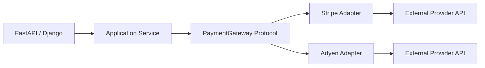

# 18- Protocols

## Overview

Python protocols provide a way to define behavioral contracts using **structural typing**.

A protocol describes what an object can do rather than requiring it to inherit from a particular base class.

```python
from typing import Protocol


class PaymentGateway(Protocol):
    async def charge(
        self,
        amount: int,
        currency: str,
    ) -> str:
        ...
```

Any class with a compatible `charge()` method can satisfy this protocol for static type checking:

```python
class StripeGateway:
    async def charge(
        self,
        amount: int,
        currency: str,
    ) -> str:
        return "payment-123"
```

`StripeGateway` does not need to inherit from `PaymentGateway`.

This is the central distinction:

```text
Abstract Base Class
    -> "You are part of this hierarchy."

Protocol
    -> "You provide this behavior."
```

Protocols are particularly valuable in backend systems because they reduce coupling between application code and infrastructure implementations.

They are commonly used for:

- Dependency injection
- Repository boundaries
- Cache interfaces
- External service adapters
- Testing
- Plugin systems
- Application services
- Static type checking

## Why Protocols Exist

Traditional inheritance-based interfaces require an explicit relationship:

```python
class PaymentGateway(ABC):
    @abstractmethod
    async def charge(self, amount: int, currency: str) -> str:
        ...
```

An implementation must inherit:

```python
class StripeGateway(PaymentGateway):
    ...
```

Protocols remove that requirement.

```python
class PaymentGateway(Protocol):
    async def charge(self, amount: int, currency: str) -> str:
        ...


class StripeGateway:
    async def charge(self, amount: int, currency: str) -> str:
        ...
```

The important relationship becomes:

```text
PaymentGateway Protocol
        ^
        |
Compatible behavior
        |
StripeGateway
```

The implementation does not need to know that the protocol exists.

This is useful when integrating:

- Third-party libraries
- Existing classes
- Multiple infrastructure implementations
- Test doubles
- Independently developed components

## Structural vs Nominal Typing

Python's ABC mechanism is primarily nominal:

```text
Class
  |
  +--> explicitly inherits from ABC
```

Protocols provide structural typing:

```text
Class
  |
  +--> has required attributes/methods
          |
          v
       Compatible
```

Consider:

```python
from typing import Protocol


class Logger(Protocol):
    def info(self, message: str) -> None:
        ...
```

This class is compatible:

```python
class ApplicationLogger:
    def info(self, message: str) -> None:
        print(message)
```

No inheritance is required.

The type checker can determine that:

```python
ApplicationLogger
```

satisfies:

```python
Logger
```

because its structure matches the protocol.

## Basic Protocol

A simple protocol looks like:

```python
from typing import Protocol


class Repository(Protocol):
    async def get(self, item_id: int) -> dict | None:
        ...

    async def save(self, item: dict) -> None:
        ...
```

A concrete implementation:

```python
class PostgresRepository:
    async def get(self, item_id: int) -> dict | None:
        ...

    async def save(self, item: dict) -> None:
        ...
```

No explicit inheritance is necessary.

Application code can depend on the protocol:

```python
class OrderService:
    def __init__(self, repository: Repository) -> None:
        self.repository = repository
```

This is dependency inversion without introducing an inheritance relationship.

## Runtime Behavior

A protocol primarily provides a **static typing contract**.

This:

```python
class Repository(Protocol):
    async def get(self, item_id: int) -> dict | None:
        ...
```

does not automatically modify the behavior of:

```python
PostgresRepository
```

The protocol does not inject methods or implementations into the concrete class.

A type checker such as mypy or pyright analyzes compatibility.

Conceptually:

```text
Source code
    |
    v
Type checker
    |
    +--> Protocol definition
    |
    +--> Concrete implementation
    |
    v
Compatibility analysis
```

At runtime, normal Python method dispatch still applies.

## `@runtime_checkable`

A protocol can optionally support limited runtime checks.

```python
from typing import Protocol, runtime_checkable


@runtime_checkable
class Closable(Protocol):
    def close(self) -> None:
        ...
```

Then:

```python
class Connection:
    def close(self) -> None:
        ...


connection = Connection()

assert isinstance(connection, Closable)
```

This can be useful when runtime code genuinely needs to test protocol compatibility.

However, runtime protocol checks are more limited than static type checking and should not be treated as a complete behavioral verification mechanism.

## Runtime Checks Are Not Full Contract Validation

Consider:

```python
@runtime_checkable
class Cache(Protocol):
    def get(self, key: str) -> bytes | None:
        ...
```

A class containing a `get` attribute may pass an `isinstance()` check even though its behavior is semantically incorrect.

Runtime protocol checks do not guarantee:

- Correct return values
- Correct exception behavior
- Thread safety
- Idempotency
- Transaction semantics
- Performance guarantees
- Side-effect behavior

Use contract tests when behavioral compatibility matters.

## Protocols with Properties

Protocols can define properties.

```python
from typing import Protocol


class HasRequestId(Protocol):
    @property
    def request_id(self) -> str:
        ...
```

Compatible implementation:

```python
class RequestContext:
    def __init__(self, request_id: str) -> None:
        self._request_id = request_id

    @property
    def request_id(self) -> str:
        return self._request_id
```

The implementation does not need to inherit from the protocol.

## Protocols with Attributes

Protocols can specify required attributes.

```python
class DatabaseConnection(Protocol):
    database_name: str

    async def execute(self, query: str) -> None:
        ...
```

An implementation must expose compatible structure:

```python
class PostgresConnection:
    database_name = "orders"

    async def execute(self, query: str) -> None:
        ...
```

This is useful for modeling objects that expose both state and behavior.

Avoid requiring mutable attributes unless they are genuinely part of the contract.

## Protocols with Class and Static Methods

Protocols can describe class methods:

```python
from typing import Protocol


class Configurable(Protocol):
    @classmethod
    def from_config(cls, config: dict):
        ...
```

They can also describe static methods:

```python
class Serializer(Protocol):
    @staticmethod
    def serialize(value: object) -> bytes:
        ...
```

Use these only when the construction or utility behavior is genuinely part of the abstraction.

## Protocols and Generic Types

Protocols can be generic.

```python
from typing import Protocol, TypeVar

T = TypeVar("T")


class Repository(Protocol[T]):
    async def get(self, item_id: int) -> T | None:
        ...

    async def save(self, item: T) -> None:
        ...
```

Concrete usage can preserve type information:

```python
class Order:
    ...


class OrderRepository:
    async def get(self, item_id: int) -> Order | None:
        ...

    async def save(self, item: Order) -> None:
        ...
```

This allows static type checkers to reason about the relationship between the repository and its entity type.

## Generic Protocols in Backend Systems

Generic protocols are useful for reusable infrastructure abstractions.

```python
from typing import Protocol, TypeVar

T = TypeVar("T")


class Cache(Protocol[T]):
    async def get(self, key: str) -> T | None:
        ...

    async def set(
        self,
        key: str,
        value: T,
        ttl_seconds: int,
    ) -> None:
        ...
```

The application can then preserve the value type:

```python
Cache[User]
Cache[Order]
Cache[Session]
```

This is generally safer than using:

```python
dict[str, object]
```

throughout an application.

## Protocols and Dependency Injection

Protocols are especially useful with constructor injection.

```python
class OrderRepository(Protocol):
    async def get(self, order_id: int) -> "Order | None":
        ...

    async def save(self, order: "Order") -> None:
        ...


class OrderService:
    def __init__(
        self,
        repository: OrderRepository,
    ) -> None:
        self.repository = repository
```

The service depends on behavior, not a concrete implementation.

Composition can then choose:

```text
OrderService
      |
      v
OrderRepository Protocol
      |
      +---- PostgreSQL
      |
      +---- In-memory test repository
      |
      +---- Read replica implementation
```

This is one of the strongest practical uses of protocols in backend Python.

## Protocols and FastAPI

FastAPI applications frequently use dependency injection.

```python
from typing import Protocol


class UserRepository(Protocol):
    async def get(self, user_id: int):
        ...
```

A concrete dependency can be provided:

```python
def get_user_repository() -> UserRepository:
    return PostgresUserRepository(...)
```

The endpoint depends on the contract:

```python
@app.get("/users/{user_id}")
async def get_user(
    user_id: int,
    repository: UserRepository = Depends(get_user_repository),
):
    return await repository.get(user_id)
```

The protocol keeps application code independent of the concrete repository.

## Protocols and Django

Protocols can provide application-level boundaries in Django projects.

For example:

```python
class EmailSender(Protocol):
    def send(
        self,
        recipient: str,
        subject: str,
        body: str,
    ) -> None:
        ...
```

A Django service can depend on:

```python
EmailSender
```

while an adapter handles the actual email provider.

This avoids forcing every implementation into a shared inheritance hierarchy.

## Protocols and REST APIs

Protocols should generally model application behavior rather than HTTP itself.

For example:

```python
class UserService(Protocol):
    async def create_user(
        self,
        email: str,
    ) -> "User":
        ...
```

The HTTP layer can then translate:

```text
HTTP Request
     |
     v
FastAPI/Django
     |
     v
UserService Protocol
     |
     v
Concrete implementation
     |
     v
Repository / external systems
```

The protocol should not normally expose:

```text
Request
Response
HTTP headers
HTTP status codes
```

unless it specifically represents an HTTP transport abstraction.

## Protocols and gRPC

Protocols are useful for abstracting gRPC clients.

```python
class PaymentClient(Protocol):
    async def charge(
        self,
        amount: int,
        currency: str,
    ) -> str:
        ...
```

A gRPC adapter implements the protocol:

```python
class GrpcPaymentClient:
    async def charge(
        self,
        amount: int,
        currency: str,
    ) -> str:
        ...
```

The business service remains independent of protobuf-generated client types.

This allows the implementation to change without propagating transport details through the application.

## Protocols and External APIs

Protocols are useful when wrapping external HTTP APIs.

```python
class FraudService(Protocol):
    async def check_transaction(
        self,
        user_id: int,
        amount: int,
    ) -> bool:
        ...
```

An implementation can use an HTTP client:

```python
class HttpFraudService:
    async def check_transaction(
        self,
        user_id: int,
        amount: int,
    ) -> bool:
        ...
```

The application sees:

```text
FraudService
```

rather than:

```text
httpx
requests
aiohttp
provider SDK
```

The adapter owns:

- Authentication
- HTTP requests
- Timeouts
- Retries
- Provider-specific error translation
- Response parsing
- Provider telemetry

## Protocols and Redis

A cache protocol can isolate application code from Redis:

```python
class Cache(Protocol):
    async def get(self, key: str) -> bytes | None:
        ...

    async def set(
        self,
        key: str,
        value: bytes,
        ttl_seconds: int,
    ) -> None:
        ...
```

The implementation can use an async Redis client.

The important engineering point is that the protocol must define meaningful semantics.

For example:

```text
get()
    -> returns None when key does not exist

set()
    -> applies TTL

Concurrency
    -> operations are safe for concurrent tasks

Failure
    -> infrastructure errors are translated consistently
```

A protocol that only defines method names is often insufficient for critical infrastructure.

## Protocols and Kafka

A Kafka consumer can depend on a handler protocol:

```python
class EventHandler(Protocol):
    async def handle(self, event: bytes) -> None:
        ...
```

Different handlers can implement it:

```text
Kafka Consumer
      |
      v
EventHandler
   /       \
  v         v
Order     Payment
Handler   Handler
```

The consumer infrastructure can manage:

- Polling
- Partition assignment
- Offset commits
- Retry policy
- Dead-letter handling
- Backpressure

The handler protocol remains focused on application behavior.

## Protocols and Celery

Protocols can define task-facing application services.

```python
class ReportGenerator(Protocol):
    def generate(self, report_id: int) -> None:
        ...
```

A Celery task can receive a concrete implementation through composition.

This keeps:

```text
Celery infrastructure
```

separate from:

```text
Report generation logic
```

and makes the business logic easier to test synchronously.

## Protocols and Testing

One of the biggest benefits of protocols is easier test substitution.

Production implementation:

```python
class PostgresUserRepository:
    async def get(self, user_id: int):
        ...
```

Test implementation:

```python
class FakeUserRepository:
    def __init__(self, users: dict[int, User]) -> None:
        self.users = users

    async def get(self, user_id: int):
        return self.users.get(user_id)
```

Neither needs to inherit from the protocol.

```python
service = UserService(
    repository=FakeUserRepository(users),
)
```

This reduces coupling between tests and implementation details.

## Protocols vs Mocks

Protocols and mocks solve different problems.

A protocol defines the expected interface:

```text
What behavior should exist?
```

A mock simulates interactions:

```text
How should the dependency behave during this test?
```

For example:

```python
repository: UserRepository
```

can be statically checked while a mock controls:

```python
repository.get.assert_awaited_once_with(user_id)
```

Use mocks for interaction-focused tests and fakes for realistic behavioral substitution.

## Protocols and Contract Testing

Protocols verify structural compatibility at type-checking time, but they do not verify runtime semantics.

For multiple implementations:

```text
Protocol
   |
   +---- PostgreSQL
   +---- Redis
   +---- Fake
   +---- External provider
```

contract tests should verify common behavior.

For example:

```python
async def assert_repository_contract(
    repository: UserRepository,
) -> None:
    user = await repository.get(1)

    assert user is not None
```

Run the same contract against each implementation.

This catches differences that static typing cannot detect.

## Protocols and `isinstance()`

Without `@runtime_checkable`:

```python
isinstance(value, Repository)
```

is not generally supported for protocol runtime checking.

With:

```python
@runtime_checkable
class Repository(Protocol):
    ...
```

limited runtime checks become available.

Do not use runtime protocol checks as the primary architecture mechanism.

Prefer dependency injection and polymorphism:

```python
service = OrderService(repository)
```

rather than:

```python
if isinstance(repository, Repository):
    ...
```

Repeated runtime checks often indicate that the abstraction is not being used effectively.

## Protocols with Data Attributes

Protocols can model objects with attributes:

```python
class RequestContext(Protocol):
    request_id: str
    user_id: int
```

This can be useful for request-scoped objects.

However, mutable shared state should be treated carefully.

A protocol does not define:

- Ownership
- Thread safety
- Task safety
- Lifecycle
- Synchronization

Those semantics must be established separately.

## Protocols and Async Code

Protocols can define asynchronous behavior:

```python
class UserRepository(Protocol):
    async def get(self, user_id: int) -> User | None:
        ...
```

The implementation must return an awaitable compatible with the expected signature.

This makes protocols useful for async applications using:

- FastAPI
- Async Django
- `asyncio`
- Async PostgreSQL clients
- Redis clients
- gRPC
- HTTP clients

Do not accidentally mix synchronous and asynchronous contracts.

For example, these are different APIs:

```python
def get(self, user_id: int) -> User | None:
    ...
```

and:

```python
async def get(self, user_id: int) -> User | None:
    ...
```

The protocol should accurately represent the execution model.

## Protocols and Context Managers

Protocols can describe context-manager behavior.

```python
from typing import Protocol


class DatabaseSession(Protocol):
    async def __aenter__(self) -> "DatabaseSession":
        ...

    async def __aexit__(
        self,
        exc_type,
        exc_value,
        traceback,
    ) -> None:
        ...

    async def execute(self, query: str):
        ...
```

This is useful for modeling transactional resources.

The contract should make lifecycle ownership explicit.

## Protocols and Callables

A protocol can describe callable objects:

```python
from typing import Protocol


class EventProcessor(Protocol):
    def __call__(self, event: bytes) -> None:
        ...
```

Any callable object with the correct signature can satisfy the protocol.

This can be useful for:

- Strategy objects
- Middleware
- Event handlers
- Validation functions
- Dependency providers

Often a simple:

```python
Callable[[bytes], None]
```

is enough, so do not create a protocol unless the callable contract needs additional structure.

## Protocols and Properties vs Methods

Protocols should distinguish state-like properties from operations.

Good:

```python
class Connection(Protocol):
    @property
    def is_closed(self) -> bool:
        ...

    async def close(self) -> None:
        ...
```

The property represents state.

The method represents an action.

This improves API clarity.

## Protocols and `Self`

Modern Python typing can use `Self` for fluent APIs.

```python
from typing import Protocol, Self


class QueryBuilder(Protocol):
    def where(self, expression: str) -> Self:
        ...

    def limit(self, count: int) -> Self:
        ...
```

This communicates that chained operations return the concrete implementation type.

Use this only when the fluent API actually preserves the concrete type.

## Protocols and Type Variables

Protocols can use bounded or constrained type variables where generic relationships matter.

```python
from typing import Protocol, TypeVar

T = TypeVar("T")


class Serializer(Protocol[T]):
    def serialize(self, value: T) -> bytes:
        ...

    def deserialize(self, payload: bytes) -> T:
        ...
```

This creates a relationship between:

```text
serialize input
      |
      v
T
      |
      v
deserialize output
      |
      v
T
```

This is substantially stronger than:

```python
def serialize(value: object) -> bytes:
    ...
```

## Protocols and Dependency Inversion

Protocols are a natural implementation of dependency inversion.

```text
High-level application logic
          |
          v
      Protocol
          ^
          |
Low-level infrastructure
```

For example:

```python
class PaymentGateway(Protocol):
    async def charge(
        self,
        amount: int,
        currency: str,
    ) -> str:
        ...
```

The application service depends on the contract.

The infrastructure layer implements it.

This keeps the dependency direction aligned with application architecture.

## Protocols and Composition

Protocols work especially well with composition.

```python
class OrderService:
    def __init__(
        self,
        repository: OrderRepository,
        gateway: PaymentGateway,
        cache: Cache,
    ) -> None:
        self.repository = repository
        self.gateway = gateway
        self.cache = cache
```

The service is assembled from behavior:

```text
                OrderService
                /     |     \
               /      |      \
              v       v       v
        Repository  Gateway   Cache
          Protocol  Protocol  Protocol
```

This avoids building a large inheritance hierarchy around infrastructure.

## Protocols vs ABCs

The choice between a protocol and an ABC should be deliberate.

| Concern | Protocol | ABC |
|---|---|---|
| Typing model | Structural | Nominal |
| Explicit inheritance | Not required | Usually required |
| Runtime abstract enforcement | No | Yes |
| Shared implementation | Limited | Strong |
| Third-party compatibility | Excellent | More restrictive |
| Dependency injection | Excellent | Good |
| Framework extension | Good | Excellent |
| Runtime hierarchy | Minimal | Explicit |
| Coupling | Lower | Higher |
| Best use | Behavioral contract | Shared hierarchy/implementation |

A useful heuristic:

```text
Need shared base implementation or enforced inheritance?
        |
       Yes
        |
       ABC

Need only a behavioral contract?
        |
       Yes
        |
    Protocol
```

## Protocols vs Duck Typing

Protocols formalize Python's duck-typing model for static type checking.

Traditional duck typing:

```python
def send_message(sender):
    sender.send()
```

The function assumes:

```text
sender.send exists
```

A protocol makes the assumption explicit:

```python
class MessageSender(Protocol):
    def send(self) -> None:
        ...


def send_message(sender: MessageSender) -> None:
    sender.send()
```

The runtime behavior remains duck-typed, but the contract becomes visible to developers and static analysis tools.

## Protocols and Third-Party Libraries

Protocols are particularly useful for third-party dependencies.

Suppose an application only needs:

```python
class HttpClient(Protocol):
    async def get(self, url: str) -> bytes:
        ...
```

The application does not need to modify a third-party HTTP client to inherit from this protocol.

An adapter can satisfy the protocol:

```python
class HttpxClientAdapter:
    async def get(self, url: str) -> bytes:
        ...
```

This keeps external libraries outside the domain model.

## Protocols and API Client Adapters

A production API client boundary often looks like:



The protocol isolates business logic from provider-specific concerns.

Adapters handle:

- Authentication
- HTTP transport
- Serialization
- Provider-specific errors
- Timeouts
- Retries
- Metrics
- Tracing

## Protocols and Error Semantics

A protocol should define meaningful failure behavior.

```python
class PaymentGateway(Protocol):
    async def charge(
        self,
        amount: int,
        currency: str,
    ) -> str:
        """Raise PaymentDeclined for a business rejection."""
        ...
```

Implementations should translate provider-specific errors:

```python
class StripeGateway:
    async def charge(
        self,
        amount: int,
        currency: str,
    ) -> str:
        try:
            ...
        except StripeCardError as exc:
            raise PaymentDeclined from exc
```

The application depends on:

```text
PaymentDeclined
```

rather than:

```text
StripeCardError
```

This is essential when protocols are used as architectural boundaries.

## Protocols and Idempotency

For side-effecting operations, important semantics belong in the contract.

```python
class PaymentGateway(Protocol):
    async def charge(
        self,
        *,
        idempotency_key: str,
        amount: int,
        currency: str,
    ) -> str:
        ...
```

The protocol now exposes idempotency as an explicit requirement.

This matters for:

- HTTP retries
- Queue redelivery
- Worker failures
- Client retries
- Provider failover

A protocol that omits critical behavioral semantics can produce a misleading abstraction.

## Protocols and Transactions

Do not hide transaction semantics accidentally.

If an operation requires an active transaction, the architecture should make that requirement clear.

For example:

```python
class UnitOfWork(Protocol):
    async def commit(self) -> None:
        ...

    async def rollback(self) -> None:
        ...
```

Alternatively, a context-manager protocol may make ownership clearer.

The important question is:

```text
Who owns the transaction?
```

The protocol should not make that ambiguous.

## Protocols and Concurrency

Protocols do not guarantee thread safety or task safety.

For example:

```python
class Counter(Protocol):
    async def increment(self) -> int:
        ...
```

The protocol says nothing about whether:

```text
increment()
```

is atomic.

If atomicity matters, it must be documented and tested.

This distinction becomes important with:

- Asyncio tasks
- Thread pools
- Multiprocessing
- Redis
- PostgreSQL
- Kafka consumers
- Shared caches

## Protocols and Performance

Protocols have minimal runtime impact when used primarily for static typing.

The concrete implementation still performs normal Python method dispatch.

However, runtime checks such as:

```python
isinstance(value, SomeProtocol)
```

have overhead and should not be placed unnecessarily inside hot paths.

For performance-sensitive systems:

- Prefer direct method calls.
- Use static checking during development and CI.
- Avoid repeated runtime compatibility checks.
- Profile before optimizing.

## Protocols and Memory

Protocols themselves generally do not introduce significant per-instance memory overhead.

The main memory impact comes from the concrete implementations.

Avoid creating unnecessary wrapper layers merely to satisfy a protocol.

For example:

```text
Application
    |
    v
Protocol
    |
    v
Adapter
    |
    v
Client
```

may be appropriate for an external boundary, but adding adapters with no architectural purpose increases:

- Object count
- Call depth
- Maintenance
- Debugging complexity

Use abstraction where it provides meaningful separation.

## Protocols and Security

Protocols are not security mechanisms.

This is unsafe reasoning:

```python
if isinstance(client, TrustedClient):
    allow_operation()
```

Type compatibility does not establish trust.

Security must be handled through:

- Authentication
- Authorization
- Credential validation
- Network controls
- Secrets management
- Input validation
- Audit logging

Protocols define software contracts, not security identities.

## Protocols and Microservices

Protocols are local process abstractions.

They do not replace:

- REST contracts
- gRPC interfaces
- Protobuf schemas
- Event schemas
- API versioning

A microservice architecture might use:

```text
Service A
   |
   v
PaymentClient Protocol
   |
   v
gRPC / REST adapter
   |
   v
Service B
```

The network contract remains the actual distributed boundary.

The protocol provides a local abstraction around the client implementation.

## Protocols and Serialization

Protocols should not normally become wire formats.

For example:

```python
class UserRepository(Protocol):
    async def get(self, user_id: int) -> User | None:
        ...
```

does not define how `User` is serialized across services.

Use explicit schemas:

```text
Domain object
    |
    v
DTO / Pydantic model
    |
    v
JSON / Protobuf
    |
    v
Network
```

This keeps local object contracts separate from distributed data contracts.

## Protocols and Kubernetes

Kubernetes does not interact directly with Python protocols.

Their value appears in application architecture.

For example:

```text
Kubernetes Deployment
        |
        v
FastAPI application
        |
        v
Service layer
        |
        v
PaymentGateway Protocol
        |
        +---- Stripe
        +---- Adyen
```

Environment configuration can select the implementation:

```text
PAYMENT_PROVIDER=stripe
```

The protocol remains stable while deployment configuration determines composition.

## Protocols and AWS

Protocols can isolate AWS SDK dependencies.

For example:

```python
class ObjectStorage(Protocol):
    async def put(
        self,
        key: str,
        content: bytes,
    ) -> None:
        ...

    async def get(
        self,
        key: str,
    ) -> bytes:
        ...
```

An S3 adapter can implement the protocol.

The application then does not depend directly on:

```text
boto3
botocore
S3 response structures
AWS-specific exceptions
```

unless those details are intentionally exposed.

This also makes local testing easier.

## Protocols and Observability

A protocol should avoid forcing infrastructure-specific observability into every implementation.

Instead, adapters can provide:

- Metrics
- Logs
- Traces
- Provider latency
- Error counters

For example:

```text
Application
    |
    v
PaymentGateway Protocol
    |
    v
Stripe Adapter
    |
    +--> Metrics
    +--> Logs
    +--> Traces
    +--> Stripe API
```

The abstraction should preserve useful error context while avoiding unnecessary provider coupling.

## Protocol Evolution

Protocols are contracts and should be treated as stable APIs.

Adding a required method:

```python
class Repository(Protocol):
    async def get(...):
        ...

    async def save(...):
        ...

    async def delete(...):
        ...
```

can break existing implementations.

This is especially important in large codebases.

Prefer:

- Small protocols
- Cohesive responsibilities
- Backward-compatible evolution
- Explicit versioning where required
- Contract tests
- CI type checking

Avoid constantly changing a central protocol used by dozens of services.

## Interface Segregation with Protocols

Protocols make it easy to define focused interfaces.

Instead of:

```python
class Storage(Protocol):
    async def read(...):
        ...

    async def write(...):
        ...

    async def delete(...):
        ...

    async def transaction(...):
        ...

    async def watch(...):
        ...
```

prefer:

```python
class Reader(Protocol):
    async def read(self, key: str) -> bytes:
        ...


class Writer(Protocol):
    async def write(self, key: str, value: bytes) -> None:
        ...
```

A component can depend only on what it actually needs.

This reduces coupling and improves substitutability.

## Protocol Composition

Protocols can be composed through inheritance.

```python
class Reader(Protocol):
    async def read(self, key: str) -> bytes:
        ...


class Writer(Protocol):
    async def write(self, key: str, value: bytes) -> None:
        ...


class Storage(Reader, Writer, Protocol):
    pass
```

This allows consumers to depend on either:

```text
Reader
```

or:

```text
Writer
```

or the combined:

```text
Storage
```

depending on their actual requirements.

## Protocols and Multiple Inheritance

Protocol inheritance is primarily a way to compose contracts.

```python
class Identifiable(Protocol):
    id: int


class Timestamped(Protocol):
    created_at: datetime


class Entity(Identifiable, Timestamped, Protocol):
    ...
```

This can be useful when capabilities naturally combine.

However, avoid building elaborate protocol hierarchies that reproduce the same complexity as inheritance-heavy OOP.

Small, behavior-focused protocols are usually easier to maintain.

## Common Mistakes

### Requiring Inheritance

This defeats the primary benefit of structural typing.

```python
class StripeGateway(PaymentGateway):
    ...
```

is valid, but unnecessary when structural compatibility is all that matters.

### Treating Protocols as Runtime Interfaces

Protocols primarily support static typing.

They do not automatically enforce runtime behavior.

### Using `@runtime_checkable` Everywhere

Runtime checking should be used only when runtime structural checks are genuinely required.

### Creating Huge Protocols

Large protocols create implementation coupling.

Split them by responsibility.

### Generic `**kwargs`

Avoid weak contracts:

```python
class Provider(Protocol):
    async def execute(self, **kwargs):
        ...
```

Prefer explicit domain semantics.

### Ignoring Behavioral Semantics

Two implementations can have identical signatures but completely different behavior.

Define:

- Exceptions
- Side effects
- Idempotency
- Concurrency
- Consistency
- Transaction semantics

### Confusing Protocols with Network Contracts

A Python protocol does not replace REST, gRPC, Protobuf, or event schemas.

### Over-Abstraction

A protocol with only one implementation may still be useful, but it should have a concrete architectural reason.

Do not create abstractions automatically.

## Production Pitfalls

| Pitfall | Impact | Better Approach |
|---|---|---|
| Treating Protocol as runtime enforcement | False confidence | Use static checking and contract tests |
| Large protocol | Tight coupling | Split interfaces |
| Provider-specific methods | Leaky abstraction | Define application semantics |
| Missing failure semantics | Inconsistent behavior | Document exceptions |
| Missing concurrency guarantees | Race conditions | Specify and test concurrency behavior |
| Runtime checks in hot paths | Unnecessary overhead | Prefer static typing |
| Protocol used as security | Security vulnerability | Use explicit authorization |
| Network contract replaced by Protocol | Distributed-system bugs | Use REST/gRPC/event schemas |
| Abstraction without value | Complexity | Prefer concrete dependency |
| No contract tests | Implementation drift | Test each implementation |

## Static Type Checking

Protocols become most valuable when integrated into static analysis.

For example:

```python
class PaymentGateway(Protocol):
    async def charge(
        self,
        amount: int,
        currency: str,
    ) -> str:
        ...


class StripeGateway:
    async def charge(
        self,
        amount: int,
        currency: str,
    ) -> str:
        return "payment-id"
```

A type checker can validate:

```python
gateway: PaymentGateway = StripeGateway()
```

If the implementation changes incorrectly:

```python
class StripeGateway:
    async def charge(
        self,
        amount: str,
        currency: str,
    ) -> str:
        ...
```

static analysis can detect the incompatible signature.

This is why protocols are particularly powerful in codebases using:

- mypy
- pyright
- CI type checking
- IDE static analysis

## Protocols in CI/CD

A production Python repository should integrate type checking into CI.

Typical pipeline:

```text
Pull Request
     |
     +--> Tests
     |
     +--> Linting
     |
     +--> Type Checking
     |
     +--> Contract Tests
     |
     v
Build / Deploy
```

For protocol-heavy architectures, type checking catches interface drift before deployment.

A practical CI command might be:

```bash
pyright
```

or:

```bash
mypy src/
```

The exact tool should match the project's established type-checking strategy.

## Protocols and Maintainability

Protocols can improve maintainability by making dependencies explicit.

Instead of:

```python
class OrderService:
    def __init__(self, client):
        self.client = client
```

use:

```python
class OrderService:
    def __init__(
        self,
        payment_gateway: PaymentGateway,
    ) -> None:
        self.payment_gateway = payment_gateway
```

The dependency contract is visible to:

- Developers
- IDEs
- Static type checkers
- Reviewers
- Tests

This makes architectural boundaries easier to understand.

## Senior-Level Decision Framework

Before introducing a protocol, ask:

1. Is there a meaningful behavioral boundary?
2. Does the consumer need only a subset of the implementation's behavior?
3. Are multiple implementations likely or already present?
4. Does structural typing reduce coupling?
5. Could a concrete dependency be simpler?
6. Would an ABC be more appropriate because shared implementation matters?
7. Are third-party implementations involved?
8. Are runtime checks actually required?
9. Are failure semantics defined?
10. Are concurrency guarantees defined?
11. Are transaction and resource-ownership semantics clear?
12. Does the protocol expose business behavior rather than provider internals?
13. Can all implementations satisfy the contract consistently?
14. Is the protocol small enough to evolve safely?

The best protocol is usually the smallest contract that completely describes what the consumer needs.

## Protocol vs Concrete Dependency

A protocol is not automatically better than a concrete class.

Use a concrete dependency when:

```text
One implementation
+
No meaningful substitution
+
No useful abstraction boundary
```

Use a protocol when:

```text
Behavioral boundary
+
Multiple implementations or meaningful substitution
+
Reduced coupling provides value
```

Avoid abstraction for hypothetical requirements.

## Protocol vs ABC Decision Matrix

| Situation | Preferred Choice |
|---|---|
| Shared implementation among subclasses | ABC |
| Runtime abstract instantiation enforcement | ABC |
| Framework extension hierarchy | ABC |
| Behavioral dependency boundary | Protocol |
| Third-party implementation | Protocol |
| Testing with independent fakes | Protocol |
| Structural typing | Protocol |
| Need explicit inheritance relationship | ABC |
| Need reusable base behavior | ABC |
| Minimal coupling | Protocol |
| Single simple implementation | Concrete class |

## Production Checklist

Before introducing a protocol:

- The abstraction represents meaningful behavior.
- The protocol is small and cohesive.
- The consumer depends only on required operations.
- Structural typing provides a real advantage.
- A concrete dependency has been considered.
- An ABC has been considered where shared implementation is required.
- Method signatures are explicit.
- Return types are precise.
- Async and sync semantics are correct.
- Exception behavior is documented.
- Idempotency requirements are explicit where relevant.
- Transaction semantics are understood.
- Resource ownership is clear.
- Concurrency guarantees are documented where necessary.
- Provider-specific behavior does not leak unnecessarily.
- Runtime checks are avoided unless genuinely required.
- Static type checking runs in CI.
- Multiple implementations have contract tests.
- Protocol evolution is treated as an API change.
- REST, gRPC, and event schemas remain separate from local Python protocols.
- Security is implemented independently of protocol compatibility.
- Observability is handled at appropriate application and infrastructure boundaries.

## Key Takeaways

- Protocols provide structural typing: an implementation satisfies the contract through compatible behavior without needing to inherit from the protocol.
- They are particularly effective for backend dependency boundaries such as repositories, caches, external API clients, message handlers, and service adapters.
- Protocols primarily provide static typing guarantees; use type checkers and contract tests rather than assuming runtime protocol checks validate behavior.
- Prefer small, behavior-focused protocols when they reduce coupling; use ABCs when explicit inheritance, runtime abstractness, or shared base implementation is genuinely required.
- A good protocol defines meaningful behavioral semantics, including failure, concurrency, idempotency, and transaction expectations where those guarantees matter.